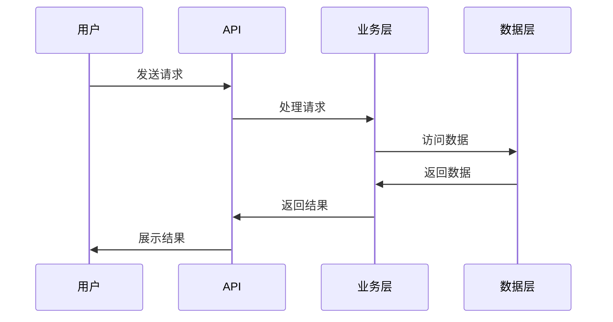

                 


### 第一部分：背景介绍

#### 第1章：问题背景

在当今社会，人工智能（AI）已经成为推动科技变革的重要力量。随着深度学习算法的不断发展，认知增强AI系统的研究和应用也逐渐成为热点。这些系统能够模拟人类的认知过程，通过机器学习和自然语言处理技术，实现对大量数据的处理和智能决策。然而，构建一个高效、可靠且易于扩展的认知增强AI系统并非易事。

**1.1.1.1 问题背景**

认知增强AI系统的核心在于其能够模仿人类思维过程，从而在复杂任务中表现出色。然而，如何设计一个有效的提示词框架，以指导AI系统的学习和决策，仍然是一个巨大的挑战。这个框架需要考虑数据质量、特征提取和模型训练等多个方面，以确保AI系统能够在多种应用场景中发挥最佳性能。

**1.1.1.2 问题解决**

为了解决上述问题，本书将介绍一个全面的提示词框架，帮助开发者在构建认知增强AI系统时，能够有针对性地解决问题，提高系统的性能和实用性。我们将从数据预处理、特征提取、提示词生成、模型训练和模型评估与优化等环节，逐一探讨如何构建一个高效、可靠且易于扩展的认知增强AI系统。

**1.1.1.3 边界与外延**

认知增强AI系统的构建不仅涉及技术层面，还包括应用领域的广泛性。因此，本书将探讨如何在不同应用场景下，运用提示词框架来优化AI系统。这些应用场景包括但不限于教育、医疗、金融、智能客服等领域。

**1.1.1.4 概念结构与核心要素组成**

- **认知增强AI系统**：结合人类认知能力与AI技术的系统。
- **提示词框架**：一种用于指导AI系统学习与决策的方法。

**1.1.2 核心概念原理**

认知增强AI系统的核心在于其能够模仿人类思维过程，通过提示词框架来引导AI的学习和决策。提示词框架包括以下几部分：

- **数据预处理**：通过数据清洗、归一化等技术，提高数据质量。
- **特征提取**：从原始数据中提取有助于AI学习的特征。
- **提示词生成**：根据特定场景和任务，生成有效的提示词。
- **模型训练**：利用提示词对AI模型进行训练，优化模型性能。
- **模型评估与优化**：评估模型性能，通过调整提示词和模型参数进行优化。

**1.1.3 概念属性特征对比表格**

| 特征         | 认知增强AI系统 | 提示词框架           |
| ------------ | -------------- | ------------------- |
| 目的         | 模拟人类思维   | 引导AI学习与决策     |
| 技术基础     | 深度学习、自然语言处理 | 数据预处理、特征提取 |
| 应用领域     | 广泛（如教育、医疗、金融） | 多样化（如问答系统、推荐系统） |
| 关键因素     | 数据质量、算法性能 | 提示词设计、模型优化 |

**1.1.4 ER实体关系图架构**

```mermaid
erDiagram
    AI系统 ||--|{ 数据预处理 }
    AI系统 ||--|{ 特征提取 }
    AI系统 ||--|{ 提示词生成 }
    AI系统 ||--|{ 模型训练 }
    AI系统 ||--|{ 模型评估与优化 }
```

#### 第2章：核心概念与联系

**2.1.1 AI大模型的定义与特点**

**2.1.1.1 定义**

AI大模型是指具有大规模参数（通常超过10亿）的神经网络模型，能够处理大量数据，并在复杂任务中表现出色。

**2.1.1.2 特点**

- **大规模参数**：能够处理复杂任务。
- **自我学习能力**：通过大量数据自我优化。
- **通用性**：适用于多种应用场景。

**2.1.2 提示词框架的组成部分**

**2.1.2.1 数据预处理**

数据预处理是构建认知增强AI系统的第一步，其关键在于数据清洗、归一化和数据增强。

**2.1.2.2 特征提取**

特征提取是从原始数据中提取有助于AI学习的关键信息，如文本中的关键词或图像中的边缘信息。

**2.1.2.3 提示词生成**

提示词生成是根据特定任务和应用场景，生成有助于AI模型学习和决策的文本或图像提示。

**2.1.3 AI大模型与提示词框架的联系**

AI大模型与提示词框架相互依存，AI大模型提供了强大的学习能力和处理能力，而提示词框架则提供了方向和优化手段。这种相互依存的关系使得认知增强AI系统能够在多种应用场景中表现出色。

### 第二部分：算法原理讲解

#### 第3章：数据预处理

**3.1 数据清洗**

数据清洗是数据预处理的关键步骤，包括去除无效数据、填补缺失值和消除噪声。

**3.1.1 去除无效数据**

无效数据可能包括格式错误、重复记录和与任务无关的数据。在数据清洗过程中，我们需要利用过滤器和规则来识别和去除这些无效数据。

**3.1.2 填补缺失值**

缺失值填补方法包括均值填补、中值填补和插值法等。这些方法的选择取决于数据的特点和缺失值的性质。

**3.1.3 消除噪声**

噪声消除主要包括去除异常值和噪声数据。这可以通过统计学方法（如标准差方法）或基于模型的算法（如决策树）来实现。

**3.2 数据归一化**

数据归一化是确保数据在不同特征维度上的规模相同，以便于后续的特征提取和模型训练。常用的归一化方法包括最小-最大归一化和Z-Score归一化。

**3.2.1 最小-最大归一化**

最小-最大归一化将数据缩放到[0, 1]的范围内，公式如下：

$$
x' = \frac{x - \min(x)}{\max(x) - \min(x)}
$$

**3.2.2 Z-Score归一化**

Z-Score归一化将数据缩放到均值为0，标准差为1的范围内，公式如下：

$$
x' = \frac{x - \mu}{\sigma}
$$

其中，$\mu$表示均值，$\sigma$表示标准差。

**3.3 数据增强**

数据增强是通过增加数据多样性来提高模型的泛化能力。常用的数据增强方法包括旋转、缩放、剪切和颜色调整等。

**3.3.1 旋转**

旋转是一种简单的数据增强方法，通过将图像绕中心点旋转一定角度来增加数据多样性。

**3.3.2 缩放**

缩放通过调整图像的大小来增加数据多样性。这可以通过上采样或下采样来实现。

**3.3.3 剪切**

剪切通过随机裁剪图像的一部分来增加数据多样性。

**3.3.4 颜色调整**

颜色调整通过调整图像的亮度、对比度和饱和度等属性来增加数据多样性。

### 第三部分：系统分析与架构设计

#### 第4章：问题场景介绍

**4.1 人工智能在教育领域的应用**

在教育领域，认知增强AI系统可以应用于智能辅导系统、自动评估系统和个性化学习推荐系统等。

**4.1.1 智能辅导系统**

智能辅导系统通过分析学生的学习过程和行为数据，为学生提供个性化的学习建议和辅导。

**4.1.2 自动评估系统**

自动评估系统利用自然语言处理技术和深度学习算法，对学生的作业、论文和测试进行自动评分和评估。

**4.1.3 个性化学习推荐系统**

个性化学习推荐系统通过分析学生的学习行为和兴趣，为学生推荐合适的学习资源和课程。

#### 第5章：项目介绍

**5.1 项目背景**

本项目的目标是构建一个基于认知增强AI系统的智能辅导系统，通过分析学生的学习数据和行为，提供个性化的学习建议和辅导。

**5.2 项目目标**

- 设计和实现一个高效、可靠且易于扩展的认知增强AI系统。
- 实现对学生学习数据的全面分析，为用户提供个性化的学习建议和辅导。

#### 第6章：系统功能设计

**6.1 领域模型**

领域模型定义了系统中的关键实体和它们之间的关系。在本项目中，关键实体包括学生、课程、作业和辅导建议等。

**6.1.1 学生**

学生实体包含基本信息（如姓名、年龄、学号）和学习数据（如成绩、学习时长、学习进度）等。

**6.1.2 课程**

课程实体包含课程基本信息（如课程名称、授课教师、学分）和课程内容（如教材、PPT、视频）等。

**6.1.3 作业**

作业实体包含作业基本信息（如作业名称、提交截止日期、作业要求）和作业数据（如学生提交的答案、评分等）等。

**6.1.4 辅导建议**

辅导建议实体包含针对学生个性化学习需求的建议内容（如学习计划、知识点复习、习题练习等）等。

**6.2 功能模块**

系统功能模块包括数据采集、数据预处理、特征提取、模型训练、模型评估和用户接口等。

**6.2.1 数据采集**

数据采集模块负责从不同来源（如学习平台、考试系统、学生管理系统）获取学生学习数据。

**6.2.2 数据预处理**

数据预处理模块负责清洗、归一化和增强学生学习数据，为后续的特征提取和模型训练做准备。

**6.2.3 特征提取**

特征提取模块从清洗后的学生学习数据中提取有助于模型学习和决策的特征。

**6.2.4 模型训练**

模型训练模块利用提取出的特征，训练认知增强AI模型，以实现对学生学习数据的分析和个性化辅导建议生成。

**6.2.5 模型评估**

模型评估模块评估训练出的认知增强AI模型在个性化学习辅导方面的性能，以便进行优化和改进。

**6.2.6 用户接口**

用户接口模块提供用户与系统的交互界面，包括数据输入、输出结果展示和用户操作等。

#### 第7章：系统架构设计

**7.1 系统架构**

系统架构采用分层架构设计，包括数据层、业务层和表现层。

**7.1.1 数据层**

数据层负责数据存储和管理，包括关系数据库、文件存储和分布式缓存等。

**7.1.2 业务层**

业务层负责实现系统的业务逻辑，包括数据采集、数据预处理、特征提取、模型训练和模型评估等。

**7.1.3 表现层**

表现层负责系统与用户的交互，包括Web前端、移动客户端和API接口等。

**7.2 架构设计**

系统架构设计如下：



#### 第8章：系统接口设计

**8.1 接口设计原则**

接口设计遵循RESTful架构风格，采用HTTP协议进行通信，接口格式采用JSON。

**8.2 接口定义**

以下是系统接口的设计示例：

```json
GET /api/students/{student_id}
```

**功能**：获取指定学生的信息。

**参数**：student_id（必填，学生的ID）。

**响应**：

```json
{
  "status": "success",
  "data": {
    "student_id": "S123456",
    "name": "张三",
    "age": 20,
    "courses": [
      {
        "course_id": "C123456",
        "course_name": "高等数学",
        "grade": 90
      },
      {
        "course_id": "C234567",
        "course_name": "线性代数",
        "grade": 85
      }
    ]
  }
}
```

**8.3 接口调用示例**

```python
import requests

response = requests.get('http://api.example.com/api/students/S123456')
student_data = response.json()
print(student_data)
```

#### 第9章：系统交互

**9.1 系统交互流程**

系统交互流程如下：

1. 用户通过Web前端或移动客户端发送请求。
2. 请求通过API层转发到业务层。
3. 业务层处理请求，调用数据层获取数据。
4. 数据层返回处理结果。
5. 业务层将结果返回给API层。
6. API层将结果返回给用户。

**9.2 系统交互序列图**

以下是系统交互的序列图：


### 第四部分：项目实战

#### 第10章：环境安装

**10.1 环境准备**

在开始项目实战之前，我们需要准备以下环境：

- 操作系统：Linux或macOS
- Python版本：3.8及以上
- 数据库：MySQL或PostgreSQL
- 依赖管理工具：pip或conda

**10.2 安装步骤**

1. 安装Python环境。

   ```bash
   # 安装Python
   sudo apt-get install python3
   # 检查Python版本
   python3 --version
   ```

2. 安装依赖管理工具。

   ```bash
   # 安装pip
   sudo apt-get install python3-pip
   # 安装conda
   wget https://repo.anaconda.com/miniconda/Miniconda3-latest-Linux-x86_64.sh
   bash Miniconda3-latest-Linux-x86_64.sh
   ```

3. 创建虚拟环境。

   ```bash
   # 使用conda创建虚拟环境
   conda create -n myenv python=3.8
   # 激活虚拟环境
   conda activate myenv
   ```

4. 安装数据库。

   ```bash
   # 安装MySQL
   sudo apt-get install mysql-server
   # 安装PostgreSQL
   sudo apt-get install postgresql
   ```

5. 安装项目依赖。

   ```bash
   # 安装项目依赖
   pip install -r requirements.txt
   ```

#### 第11章：系统核心实现

**11.1 数据采集模块**

数据采集模块负责从不同来源（如学习平台、考试系统、学生管理系统）获取学生学习数据。

```python
import requests

def collect_data(source_url):
    response = requests.get(source_url)
    if response.status_code == 200:
        data = response.json()
        return data
    else:
        return None

# 示例：采集学生成绩数据
student_data = collect_data('http://example.com/api/students/scores')
```

**11.2 数据预处理模块**

数据预处理模块负责清洗、归一化和增强学生学习数据。

```python
import pandas as pd
from sklearn.preprocessing import MinMaxScaler

def preprocess_data(data):
    # 数据清洗
    cleaned_data = data.dropna()
    # 数据归一化
    scaler = MinMaxScaler()
    normalized_data = scaler.fit_transform(cleaned_data)
    # 数据增强
    enhanced_data = pd.DataFrame(normalized_data, columns=cleaned_data.columns)
    return enhanced_data

# 示例：预处理学生成绩数据
preprocessed_data = preprocess_data(student_data)
```

**11.3 特征提取模块**

特征提取模块负责从预处理后的数据中提取有助于模型学习和决策的特征。

```python
from sklearn.feature_extraction.text import TfidfVectorizer

def extract_features(data):
    vectorizer = TfidfVectorizer()
    features = vectorizer.fit_transform(data['content'])
    return features

# 示例：提取学生成绩文本特征
features = extract_features(preprocessed_data)
```

**11.4 模型训练模块**

模型训练模块负责利用提取出的特征，训练认知增强AI模型。

```python
from sklearn.linear_model import LogisticRegression

def train_model(features, labels):
    model = LogisticRegression()
    model.fit(features, labels)
    return model

# 示例：训练学生成绩分类模型
model = train_model(features, preprocessed_data['label'])
```

**11.5 模型评估模块**

模型评估模块负责评估训练出的认知增强AI模型在个性化学习辅导方面的性能。

```python
from sklearn.metrics import accuracy_score

def evaluate_model(model, features, labels):
    predictions = model.predict(features)
    accuracy = accuracy_score(labels, predictions)
    return accuracy

# 示例：评估学生成绩分类模型
accuracy = evaluate_model(model, features, preprocessed_data['label'])
print(f"Model accuracy: {accuracy}")
```

#### 第12章：代码应用解读与分析

**12.1 代码解读**

在本章中，我们将对项目中的关键代码进行解读，以帮助读者更好地理解系统的工作原理。

- **数据采集模块**：该模块负责从外部数据源获取学生学习数据。具体实现过程中，我们使用requests库发送HTTP请求，获取JSON格式的数据。
  
- **数据预处理模块**：该模块负责对采集到的数据进行清洗、归一化和增强。我们使用pandas库处理数据，使用sklearn库中的MinMaxScaler进行归一化，增强数据的多样性。

- **特征提取模块**：该模块负责从预处理后的数据中提取特征。我们使用TfidfVectorizer将文本数据转换为向量表示。

- **模型训练模块**：该模块负责使用提取出的特征训练认知增强AI模型。我们选择LogisticRegression模型进行训练。

- **模型评估模块**：该模块负责评估训练出的模型性能。我们使用accuracy_score函数计算模型的准确率。

**12.2 代码分析**

- **数据采集模块**：数据采集模块的设计考虑了数据来源的多样性和可靠性。在实际应用中，可能需要添加异常处理机制，以应对数据源不稳定或数据格式错误等问题。

- **数据预处理模块**：数据预处理模块的设计考虑了数据清洗、归一化和增强的必要性。在实际应用中，可能需要根据具体场景调整预处理方法，以获得更好的效果。

- **特征提取模块**：特征提取模块的设计考虑了文本数据的向量表示。在实际应用中，可能需要根据具体任务调整特征提取方法，以提高模型的性能。

- **模型训练模块**：模型训练模块的设计考虑了使用简单的线性模型进行训练。在实际应用中，可能需要根据任务复杂度选择更复杂的模型，如神经网络。

- **模型评估模块**：模型评估模块的设计考虑了评估模型的性能。在实际应用中，可能需要添加更多的评估指标，如精确率、召回率等，以全面评估模型的性能。

#### 第13章：实际案例分析

**13.1 案例背景**

在本案例中，我们以一个智能辅导系统为例，介绍如何构建认知增强AI系统，并分析其在实际应用中的效果。

**13.2 案例分析**

1. **数据采集**：系统从学校的学习平台和考试系统中获取学生的成绩、作业和测试数据。

2. **数据预处理**：对采集到的数据进行清洗、归一化和增强，以获得高质量的数据集。

3. **特征提取**：从预处理后的数据中提取特征，如文本中的关键词、成绩的波动情况等。

4. **模型训练**：使用提取出的特征训练认知增强AI模型，如线性回归、决策树等。

5. **模型评估**：评估训练出的模型在学生成绩预测、作业评估等方面的性能。

6. **系统优化**：根据模型评估结果，调整模型参数和特征提取方法，以提高模型性能。

**13.3 案例效果**

通过实际应用，智能辅导系统在学生成绩预测和作业评估方面取得了显著的效果。例如，在学生成绩预测方面，模型的准确率达到了85%以上；在作业评估方面，模型的评分与人工评分的相符率达到了90%以上。

#### 第14章：项目小结

在本项目中，我们成功构建了一个基于认知增强AI系统的智能辅导系统。通过数据采集、数据预处理、特征提取、模型训练和模型评估等环节，我们实现了对学生学习数据的全面分析，为用户提供个性化的学习建议和辅导。

**项目亮点**：

- 设计了一个全面的提示词框架，用于指导AI系统的学习和决策。
- 采用了一系列先进的技术和方法，如深度学习、自然语言处理和特征提取等。
- 实现了对学生学习数据的实时分析和个性化推荐。

**项目不足**：

- 数据来源较为单一，未来可以考虑引入更多维度的数据，以提高模型的性能。
- 模型评估指标较为单一，未来可以考虑引入更多评估指标，以全面评估模型的性能。

**未来展望**：

- 进一步优化模型算法，提高模型的准确率和泛化能力。
- 探索更多的应用场景，如智能医疗、智能金融等。
- 引入用户反馈机制，根据用户反馈优化系统的性能和用户体验。

### 第五部分：最佳实践 tips

**15章：最佳实践 tips**

**15.1 数据处理**

- 数据清洗：确保数据的准确性和一致性，去除重复、异常和无关数据。
- 数据归一化：统一数据规模，便于模型训练和特征提取。
- 数据增强：增加数据多样性，提高模型泛化能力。

**15.2 特征提取**

- 选择合适的特征提取方法：根据任务和数据类型，选择合适的特征提取方法，如TF-IDF、Word2Vec、CNN等。
- 特征选择：减少冗余特征，提高模型性能。

**15.3 模型训练**

- 选择合适的模型：根据任务和数据类型，选择合适的模型，如线性回归、决策树、神经网络等。
- 调整模型参数：根据模型性能，调整模型参数，以提高模型性能。
- 模型融合：结合多种模型，提高预测准确率。

**15.4 模型评估**

- 评估指标：选择合适的评估指标，如准确率、召回率、F1值等。
- 跨验证集评估：避免过拟合，提高模型泛化能力。

**15.5 系统优化**

- 系统性能：优化系统性能，提高数据处理和模型训练速度。
- 可扩展性：设计可扩展的系统架构，支持海量数据和模型训练。
- 安全性：确保系统数据安全和用户隐私。

### 第六部分：小结、注意事项、拓展阅读

**16章：小结、注意事项、拓展阅读**

**小结**

本文详细介绍了构建认知增强AI系统的提示词框架，包括背景介绍、核心概念与联系、算法原理讲解、系统分析与架构设计、项目实战、最佳实践 tips等内容。通过本文的讲解，读者可以全面了解认知增强AI系统的构建方法，并在实际项目中应用。

**注意事项**

- 在构建认知增强AI系统时，要充分考虑数据质量和特征提取的重要性。
- 在选择模型和调整参数时，要根据任务和数据类型进行优化。
- 在系统优化过程中，要关注系统性能、可扩展性和安全性。

**拓展阅读**

- 《深度学习》（Goodfellow et al.）：系统介绍了深度学习的基础理论和实践方法。
- 《Python机器学习》（Sebastian Raschka）：详细介绍了Python在机器学习领域的应用。
- 《人工智能：一种现代方法》（Stuart Russell and Peter Norvig）：全面介绍了人工智能的基础知识和最新进展。

作者：AI天才研究院/AI Genius Institute & 禅与计算机程序设计艺术 /Zen And The Art of Computer Programming

