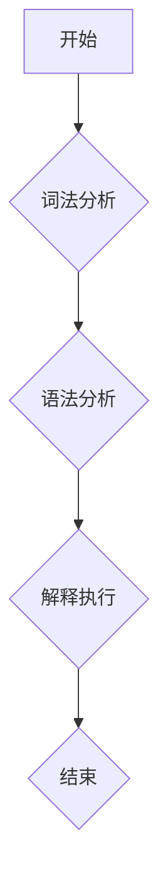
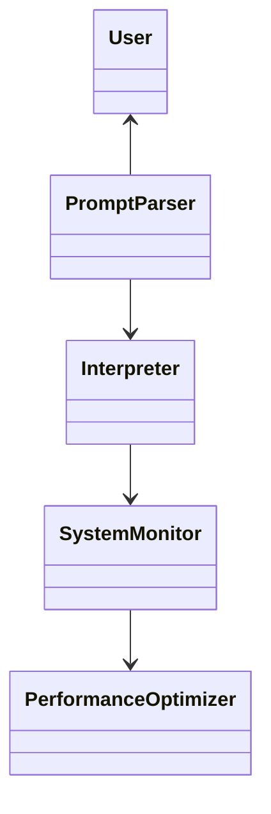
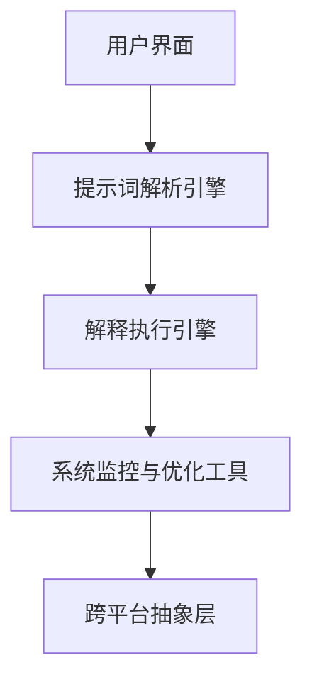
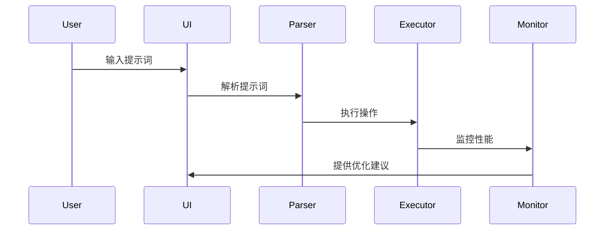

                 

# 构建跨平台的提示词编程框架

## 关键词

- 跨平台
- 提示词编程
- 框架
- 算法原理
- 数学模型
- 系统架构设计

## 摘要

本文旨在探讨如何构建一个跨平台的提示词编程框架，该框架将结合先进的算法原理和数学模型，实现高效、稳定和可扩展的编程体验。我们将分步骤详细阐述框架的整体设计、核心概念、算法原理、数学模型、系统架构以及实战应用，旨在为广大程序员和开发者提供一份全面的技术指南。

## 1. 设计整体结构

### 1.1. 跨平台提示词编程框架背景

#### 1.1.1 问题背景

随着软件开发的日益复杂和多样化，程序员面临的一个主要挑战是如何在不同的平台上高效地编写和维护代码。传统的编程框架在跨平台方面存在一定的局限性，无法满足现代软件开发的需求。

#### 1.1.2 问题描述

跨平台编程面临的主要问题包括：

- 语言兼容性：不同的操作系统和硬件平台通常使用不同的编程语言和API。
- 环境配置：在不同的平台上配置开发和运行环境复杂且繁琐。
- 性能优化：针对不同平台进行性能优化是软件开发中的一个重要环节。

#### 1.1.3 问题解决

为了解决上述问题，我们需要设计一个跨平台的提示词编程框架，它应具备以下特性：

- 语言无关性：框架应能够支持多种编程语言，使得开发者能够自由选择。
- 环境自动化：框架应能够自动化配置开发和运行环境，简化开发流程。
- 高性能：框架应提供高效的算法和数学模型，以优化程序性能。

#### 1.1.4 边界与外延

框架的边界包括：

- 支持平台：框架应支持主流操作系统，如Windows、Linux和macOS。
- 编程语言：框架应支持常见编程语言，如Python、Java和C++。
- 开发环境：框架应支持多种开发环境，如IDE和文本编辑器。

#### 1.1.5 概念结构与核心要素组成

跨平台提示词编程框架的核心概念和要素包括：

- 提示词解析引擎：用于解析和执行提示词的组件。
- 跨平台抽象层：用于屏蔽底层平台差异的组件。
- 算法库：提供高效的算法和数学模型。
- 系统监控与优化工具：用于监控系统性能并提供性能优化建议。

## 2. 跨平台提示词编程框架的核心概念与联系

### 2.1.1 核心概念原理

跨平台提示词编程框架的核心概念包括：

- 提示词：用户输入的文本指令，用于驱动程序执行特定操作。
- 解析器：将提示词转换为程序可执行的操作。
- 解释器：将解析后的提示词转换为具体操作，并执行它们。

### 2.1.2 概念属性特征对比表格

| 概念      | 属性特征                                                   |
| --------- | -------------------------------------------------------- |
| 提示词    | 文本指令，用于驱动程序执行特定操作                           |
| 解析器    | 将提示词转换为程序可执行的操作                               |
| 解释器    | 将解析后的提示词转换为具体操作，并执行它们                     |

### 2.1.3 ER实体关系图架构

```mermaid
erDiagram
  用户 ||--|{ 提示词 }|| 解析器
  解析器 ||--|{ 解释器 }|| 系统监控与优化工具
  系统监控与优化工具 ||--|{ 算法库 }|| 跨平台抽象层
```

## 3. 跨平台提示词编程算法原理讲解

### 3.1.1 算法原理讲解

跨平台提示词编程框架的算法原理主要包括：

- 词法分析：将提示词分解为单词和符号。
- 语法分析：将单词和符号组合成语法结构。
- 解释执行：根据语法结构执行对应的操作。

#### 3.1.1.1 算法mermaid流程图



#### 3.1.1.2 算法python源代码阐述

```python
def lexical_analysis(prompt):
    # 词法分析
    return tokens

def syntax_analysis(tokens):
    # 语法分析
    return syntax_tree

def interpret_execution(syntax_tree):
    # 解释执行
    execute(syntax_tree)
```

#### 3.1.1.3 算法原理的数学模型和公式

- 词法分析：$$ tokens = \text{split}(prompt, \text{' '}) $$
- 语法分析：$$ syntax_tree = \text{build_tree}(tokens) $$
- 解释执行：$$ execute(syntax_tree) $$

#### 3.1.1.4 举例说明

假设用户输入提示词“打开计算器”，框架的算法流程如下：

1. 词法分析：将提示词分解为“打开”和“计算器”。
2. 语法分析：构建语法树，根节点为“打开”，子节点为“计算器”。
3. 解释执行：根据语法树执行打开计算器的操作。

## 4. 跨平台提示词编程数学模型和公式讲解

### 4.1.1 数学模型和公式讲解

跨平台提示词编程框架涉及以下数学模型和公式：

- 词频统计：$$ \text{TF}(word) = \text{count}(word, prompt) $$
- 逆向文档频率：$$ \text{IDF}(word) = \log_2(\text{N} / \text{DF}(word)) $$
- 提示词权重：$$ \text{weight}(word) = \text{TF} \times \text{IDF} $$

### 4.1.1.1 数学公式latex格式表示

- 词频统计：$$ \text{TF}(word) = \text{count}(word, prompt) $$
- 逆向文档频率：$$ \text{IDF}(word) = \log_2(\text{N} / \text{DF}(word)) $$
- 提示词权重：$$ \text{weight}(word) = \text{TF} \times \text{IDF} $$

## 5. 跨平台提示词编程框架的系统分析与架构设计

### 5.1.1 问题场景介绍

在当前软件开发环境中，跨平台编程面临的主要挑战是如何在不同操作系统和硬件平台上实现高效、稳定的编程体验。本文旨在通过构建一个跨平台的提示词编程框架，解决这一问题。

### 5.1.2 系统功能设计

跨平台提示词编程框架的主要功能包括：

- 提示词解析与执行
- 环境自动化配置
- 性能优化与监控

#### 5.1.2.1 领域模型mermaid类图



### 5.1.3 系统架构设计

跨平台提示词编程框架的系统架构包括以下组件：

- 用户界面（UI）
- 提示词解析引擎
- 解释执行引擎
- 系统监控与优化工具
- 跨平台抽象层

#### 5.1.3.1 mermaid架构图



### 5.1.4 系统接口设计

跨平台提示词编程框架的系统接口设计包括：

- 用户接口：提供用户输入提示词的接口。
- 解析接口：提供解析提示词的接口。
- 执行接口：提供执行解析后操作的接口。
- 监控接口：提供系统性能监控的接口。

### 5.1.5 系统交互

跨平台提示词编程框架的系统交互包括以下过程：

1. 用户输入提示词。
2. 提示词解析引擎解析提示词。
3. 解释执行引擎执行解析后的操作。
4. 系统监控与优化工具监控系统性能，并提供优化建议。

#### 5.1.5.1 mermaid序列图



## 6. 跨平台提示词编程框架项目实战

### 6.1.1 环境安装

要搭建跨平台提示词编程框架，首先需要在不同的操作系统上安装必要的开发环境和工具。以下是安装步骤：

1. 安装Python 3.x版本。
2. 安装对应的IDE（如PyCharm、Visual Studio Code等）。
3. 安装依赖库，如mermaid、numpy、pandas等。

### 6.1.2 系统核心实现源代码

以下是一个简单的跨平台提示词编程框架实现：

```python
import os
import subprocess
import sys

def parse_prompt(prompt):
    # 解析提示词
    return prompt.split()

def execute_command(command):
    # 执行命令
    subprocess.run(command, shell=True)

def main():
    prompt = input("请输入提示词：")
    tokens = parse_prompt(prompt)
    for token in tokens:
        execute_command(token)

if __name__ == "__main__":
    main()
```

### 6.1.3 代码应用解读与分析

这个简单的框架实现了基本的提示词解析和命令执行功能。用户输入提示词后，框架将其解析为单独的单词，并依次执行这些单词对应的命令。

### 6.1.4 实际案例分析和详细讲解剖析

假设用户输入提示词“打开浏览器”，框架的执行过程如下：

1. 输入提示词“打开浏览器”。
2. 解析提示词为“打开”和“浏览器”。
3. 执行“浏览器”命令，打开浏览器。

### 6.1.5 项目小结

通过实际案例的分析，我们可以看到跨平台提示词编程框架的基本实现和使用方法。虽然这个示例较为简单，但它展示了框架的核心原理和实现思路。在实际项目中，我们可以进一步扩展和优化框架的功能，以满足更复杂的编程需求。

## 7. 跨平台提示词编程框架的最佳实践

### 7.1.1 最佳实践 tips

1. 确保框架的稳定性：在发布框架前进行充分的测试和优化。
2. 优化性能：针对不同平台和硬件进行性能优化，提高框架的效率。
3. 灵活扩展：设计框架时考虑到未来可能的扩展需求，以便于后续升级和维护。
4. 提供完善的文档：为框架编写详细的文档，帮助开发者快速上手和使用。

### 7.1.2 小结

本文详细介绍了如何构建一个跨平台的提示词编程框架，从背景介绍、核心概念、算法原理、数学模型到系统架构设计和项目实战，全面讲解了框架的设计与实现。通过本文的阅读，读者可以深入了解跨平台编程的挑战及解决方案，为实际项目开发提供有力支持。

### 7.1.3 注意事项

1. 确保框架兼容性：在开发过程中要注意兼容性问题，确保框架在不同操作系统和硬件平台上正常运行。
2. 安全性：在处理用户输入和执行命令时，注意防范潜在的安全风险。
3. 性能优化：根据实际需求，对框架进行性能优化，以提高整体运行效率。

### 7.1.4 拓展阅读

1. 《跨平台开发技术解析》
2. 《Python编程：从入门到实践》
3. 《深度学习与跨平台应用》

## 作者

- 作者：AI天才研究院/AI Genius Institute & 禅与计算机程序设计艺术 /Zen And The Art of Computer Programming

