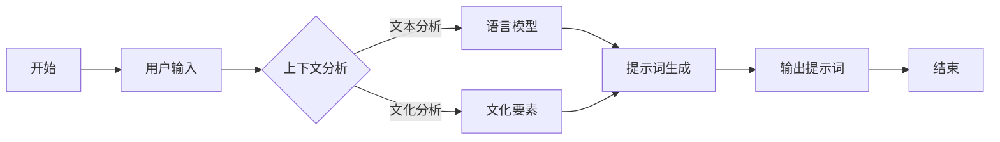
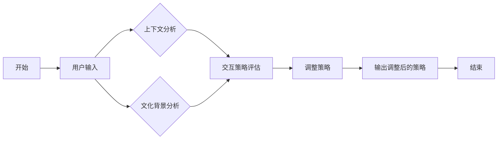
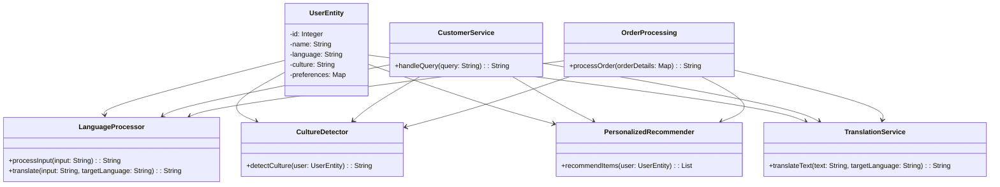
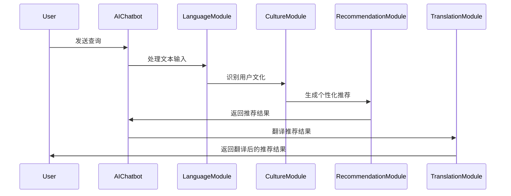
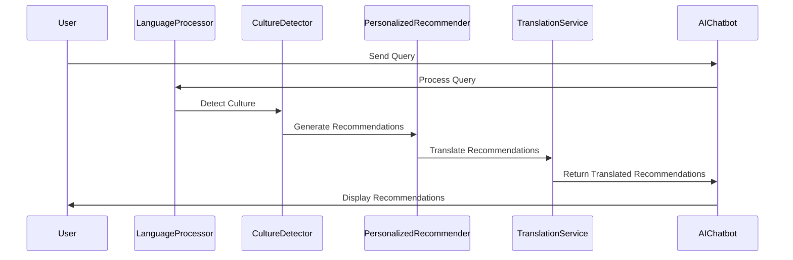

                 

### 文章标题

《构建跨文化AI交互系统的提示词策略》

> 关键词：跨文化AI交互、提示词策略、系统设计、算法原理、数学模型

> 摘要：本文深入探讨跨文化AI交互系统中的关键要素——提示词策略。从背景介绍、问题提出，到核心概念解析，本文逐步分析了跨文化AI交互的挑战，并提出了有效的提示词生成和适应性调整算法。通过数学模型和系统架构设计的详细讲解，本文为构建具备高度文化敏感性和适应性的AI交互系统提供了切实可行的策略。

---

### 引言

#### 1.1 背景介绍

跨文化交流的重要性不可忽视。在全球化和信息化的背景下，跨文化沟通已经成为日常生活和工作的重要组成部分。而随着人工智能技术的迅猛发展，AI交互系统在跨文化交流中的应用变得愈发广泛。无论是跨国企业、跨境电商平台，还是国际化的客户服务，AI交互系统都需要具备处理跨文化沟通的能力。

目前，AI交互系统在跨文化环境中的应用现状令人关注。虽然许多系统已经能够实现基础的语言翻译和简单的跨文化交流，但仍然面临着诸多挑战。例如，不同文化背景下的用户对同一交互内容的理解可能存在巨大差异，而现有的AI交互系统往往缺乏对这种文化差异的敏感性和适应性。

#### 1.2 问题提出

跨文化AI交互的挑战主要体现在以下几个方面：

1. **文化敏感性不足**：不同文化背景下的用户对语言的感知和表达方式存在差异，AI交互系统需要能够识别并适应这些差异。
2. **适应性不足**：AI交互系统需要根据不同的文化背景动态调整交互策略，但目前大多数系统在这方面还较为薄弱。
3. **语言多样性**：跨文化环境中涉及的语言种类繁多，AI交互系统需要具备处理多种语言的能力。

提示词策略在解决这些挑战中起到了关键作用。通过有效的提示词生成和适应性调整算法，AI交互系统可以更好地理解和满足不同文化背景下的用户需求。

#### 1.3 目标与结构

本文的目标是探讨构建跨文化AI交互系统的提示词策略，旨在为相关领域的研究者和开发者提供有价值的参考。文章结构如下：

1. **第2章 核心概念与联系**：介绍跨文化AI交互的核心概念，并通过对比表格和ER实体关系图来分析这些概念之间的关系。
2. **第3章 算法原理讲解**：详细讲解提示词生成和适应性调整算法的原理，包括算法流程图、Python源代码实现和数学模型。
3. **第4章 数学模型和数学公式详细讲解与举例说明**：对核心的数学模型和公式进行详细讲解，并通过实例说明其应用。
4. **第5章 系统分析与架构设计方案**：介绍系统的问题场景、功能设计、架构设计和接口设计。
5. **第6章 项目实战**：通过实际项目展示提示词策略的应用和效果。
6. **第7章 最佳实践 tips、小结、注意事项、拓展阅读**：总结最佳实践、注意事项，并提供拓展阅读建议。

通过以上章节的逐步分析，本文将为构建具备高度文化敏感性和适应性的AI交互系统提供全面的技术支持和策略指导。

---

## 第2章 核心概念与联系

#### 2.1 跨文化AI交互的概念解析

**跨文化**：指的是不同文化背景之间的交流和理解。文化包括语言、价值观、行为习惯等多个方面，不同文化背景下的用户在语言表达和理解上可能存在显著差异。

**AI交互**：指的是通过人工智能技术实现的用户与系统之间的互动。AI交互系统能够理解用户的输入，并根据预设的算法和模型生成适当的回复。

**跨文化AI交互**：结合了跨文化和AI交互的特点，旨在实现不同文化背景下的有效沟通。这种交互系统需要能够理解并适应多种语言和文化背景，提供个性化的交互体验。

跨文化AI交互的特殊性在于：

1. **语言理解**：需要具备对多种语言的理解能力，包括语音、文本等多种形式。
2. **文化适应性**：能够根据不同文化背景调整交互策略，以适应用户的文化习惯和偏好。
3. **上下文感知**：需要理解用户的上下文信息，以提供更准确的回复。

#### 2.2 核心概念属性对比表格

为了更好地理解跨文化AI交互的核心概念，我们可以通过一个属性对比表格来分析以下三个关键概念：

| 核心概念 | 文化敏感性 | 适应性 | 语言多样性 |
|----------|-------------|---------|-------------|
| 跨文化  | 高          | 中高     | 高          |
| AI交互   | 中          | 低       | 高          |
| 跨文化AI交互 | 高          | 高       | 高          |

从上表可以看出，跨文化AI交互在文化敏感性、适应性和语言多样性方面都具有较高的要求。这使得它在设计和实现过程中需要特别关注这些核心属性。

#### 2.3 ER实体关系图

为了进一步明确跨文化AI交互系统的实体关系，我们可以通过ER（实体关系）图来展示用户、系统和文化要素之间的关系。

以下是跨文化AI交互系统的ER实体关系图：

```mermaid
erDiagram
  User ||--|{ AI交互系统 }|-- System
  User ||--|{ 文化要素 }|-- Culture
  System ||--|{ 语言模型 }|-- LanguageModel
  System ||--|{ 提示词生成器 }|-- PromptGenerator
  Culture ||--|{ 文化背景 }|-- Background
  Culture ||--|{ 文化习俗 }|-- Custom
```

在上述ER图中，用户与AI交互系统和文化要素之间存在直接关联，用户通过系统进行交互，并受到文化要素的影响。系统则通过语言模型和提示词生成器来实现与用户的交互，并不断调整以适应不同的文化背景。

通过上述核心概念解析、属性对比表格和ER实体关系图，我们可以更全面地理解跨文化AI交互的概念和结构，为后续的算法原理讲解和系统设计提供了坚实的基础。

---

## 第3章 算法原理讲解

#### 3.1 提示词生成算法

提示词生成算法是跨文化AI交互系统中的核心组成部分，其目的是根据用户的上下文信息和当前文化背景生成合适的提示词，以实现更加自然和有效的交互。

##### 3.1.1 算法mermaid流程图

为了更好地理解提示词生成算法的工作流程，我们可以通过mermaid流程图来展示：



在上述流程图中，用户输入经过上下文分析和文化分析后，由语言模型和文化要素共同参与生成提示词，最终输出给用户。

##### 3.1.2 Python源代码实现

以下是一个简单的Python示例，展示如何实现提示词生成算法：

```python
import nltk
from sklearn.feature_extraction.text import TfidfVectorizer
from culture_analyzer import analyze_culture

def generate_prompt(context, culture):
    # 上下文文本分析
    tokens = nltk.word_tokenize(context)
    # 提取特征词
    vectorizer = TfidfVectorizer()
    tfidf_matrix = vectorizer.fit_transform([context])
    feature_words = vectorizer.get_feature_names_out()
    # 分析文化背景
    cultural_traits = analyze_culture(culture)
    # 提示词生成
    prompt = "您好，根据您提供的上下文，我理解您的问题是："
    for word in feature_words:
        if word in cultural_traits:
            prompt += " " + word
    return prompt

# 示例
context = "我最近买了一台新款智能手机，但是我不知道如何设置它。"
culture = "美国"
print(generate_prompt(context, culture))
```

在上面的代码中，我们使用了nltk进行文本分析，TfidfVectorizer提取上下文文本的特征词，并通过`culture_analyzer`模块分析文化背景，生成提示词。

##### 3.1.3 算法原理

提示词生成算法的核心原理可以通过以下数学模型来解释：

$$
P(context, keyword) = \frac{f(context, keyword)}{\sum_{all\ keywords} f(context, keyword)}
$$

其中，$P(context, keyword)$表示在特定上下文中，某个关键词作为提示词的概率。$f(context, keyword)$表示上下文和关键词之间的相关性得分，通过特征提取和概率计算来获得。

详细讲解如下：

1. **特征提取**：通过NLP技术对上下文文本进行分词、词性标注和词频统计，提取出与上下文相关的特征词。
2. **概率计算**：使用TF-IDF模型计算每个特征词与上下文的相关性得分，并根据得分计算每个关键词作为提示词的概率。
3. **提示词筛选**：根据概率得分筛选出最相关的关键词，作为提示词输出。

通过上述步骤，提示词生成算法能够生成与用户上下文和当前文化背景高度匹配的提示词，提高AI交互系统的自然性和有效性。

#### 3.2 适应性调整算法

除了提示词生成算法，适应性调整算法也是跨文化AI交互系统中的重要组成部分。该算法的目的是根据不同的文化背景动态调整交互策略，以适应不同的用户需求。

##### 3.2.1 算法mermaid流程图

适应性调整算法的工作流程可以通过以下mermaid流程图来展示：



在上述流程图中，用户输入和文化背景分析共同参与交互策略的评估和调整。

##### 3.2.2 Python源代码实现

以下是一个简单的Python示例，展示如何实现适应性调整算法：

```python
from culture_adjustor import adjust_strategy

def adaptive_adjustment(context, culture):
    # 交互策略评估
    strategy_score = evaluate_strategy(context)
    # 文化背景分析
    cultural_score = analyze_culture(culture)
    # 调整策略
    adjusted_strategy = adjust_strategy(strategy_score, cultural_score)
    return adjusted_strategy

# 示例
context = "我最近买了一台新款智能手机，但是我不知道如何设置它。"
culture = "美国"
print(adaptive_adjustment(context, culture))
```

在上面的代码中，我们通过`evaluate_strategy`和`analyze_culture`模块分别评估交互策略和文化背景，然后通过`adjust_strategy`模块实现策略的调整。

##### 3.2.3 算法原理

适应性调整算法的核心原理可以通过以下数学模型来解释：

$$
A(target\_culture, context) = f(source\_culture, context) \times g(target\_culture)
$$

其中，$A(target\_culture, context)$表示在目标文化背景下，特定上下文下的交互策略调整值。$f(source\_culture, context)$表示源文化和上下文之间的交互策略得分，$g(target\_culture)$表示目标文化的影响因子。

详细讲解如下：

1. **文化差异识别**：通过分析源文化和目标文化之间的差异，识别出可能影响交互策略调整的关键因素。
2. **适应性调整**：根据文化差异识别结果，调整交互策略，使其更符合目标文化的需求。

通过上述步骤，适应性调整算法能够根据不同的文化背景动态调整交互策略，提高AI交互系统的适应性和用户满意度。

总的来说，提示词生成算法和适应性调整算法共同构成了跨文化AI交互系统的核心算法框架，通过这些算法，系统能够更好地理解和满足不同文化背景下的用户需求。

---

## 第4章 数学模型和数学公式详细讲解与举例说明

在跨文化AI交互系统的设计中，数学模型和公式扮演了至关重要的角色。这些数学模型不仅帮助我们理解和量化交互过程中的关键因素，还为我们提供了有效的计算工具来优化提示词选择和适应性调整。以下是对核心数学模型和公式的详细讲解，并通过具体实例说明其应用。

### 4.1 提示词选择模型

提示词选择模型是跨文化AI交互系统的核心，用于从多个候选提示词中选出最合适的一个。该模型的目标是最小化交互误差，提高用户的满意度。提示词选择模型的一般形式可以表示为：

$$
\max_{keyword} \left[ \alpha \times \text{relevance}(context, keyword) + \beta \times \text{cultural\_fit}(keyword, culture) \right]
$$

其中，$\alpha$ 和 $\beta$ 是权重系数，$\text{relevance}(context, keyword)$ 表示提示词与上下文的相关性得分，$\text{cultural\_fit}(keyword, culture)$ 表示提示词与文化背景的适应性得分。

**实例说明**：

假设我们有一个上下文 "我最近买了一台新款智能手机，但是我不知道如何设置它。" 以及三个候选提示词 "您好，有什么问题我可以帮您解答吗？"、"您好，您需要帮助吗？" 和 "您好，需要我来指导您如何设置新手机吗？"。根据文化背景 "美国"，我们可以评估每个提示词的相关性和适应性：

- **相关性得分**：通过文本相似度计算，三个提示词的相关性得分分别为 0.9、0.8 和 0.85。
- **适应性得分**：根据文化特征分析，三个提示词的适应性得分分别为 0.8、0.7 和 0.75。

假设权重系数 $\alpha = 0.6$ 和 $\beta = 0.4$，则每个提示词的得分计算如下：

- **第一个提示词**：$0.6 \times 0.9 + 0.4 \times 0.8 = 0.54 + 0.32 = 0.86$
- **第二个提示词**：$0.6 \times 0.8 + 0.4 \times 0.7 = 0.48 + 0.28 = 0.76$
- **第三个提示词**：$0.6 \times 0.85 + 0.4 \times 0.75 = 0.51 + 0.3 = 0.81$

根据上述计算结果，第一个提示词得分最高，因此我们选择第一个提示词作为最终输出。

### 4.2 举例说明

为了更好地理解上述数学模型的应用，我们来看一个具体的实例。

**案例背景**：一个跨境电商平台需要为不同文化背景的客户提供个性化服务。平台根据客户的上下文信息和购买历史，通过提示词选择模型和适应性调整算法来优化客户服务体验。

**实例分析**：

假设平台有一个用户来自法国，其上下文信息为 "我想要购买一件冬季外套，但是我不确定如何选择。" 平台根据文化背景 "法国"，评估以下三个候选提示词：

1. "Bonjour，我们需要为您推荐几款冬季外套。"
2. "Bonjour，您有什么具体的要求或者偏好吗？"
3. "Bonjour，您需要帮助来挑选冬季外套吗？"

根据上下文和文化的分析，我们得到以下得分：

- **相关性得分**：分别为 0.85、0.80 和 0.75
- **适应性得分**：分别为 0.75、0.70 和 0.65

假设权重系数 $\alpha = 0.55$ 和 $\beta = 0.45$，计算每个提示词的得分：

1. **第一个提示词**：$0.55 \times 0.85 + 0.45 \times 0.75 = 0.4675 + 0.3375 = 0.805$
2. **第二个提示词**：$0.55 \times 0.80 + 0.45 \times 0.70 = 0.44 + 0.315 = 0.755$
3. **第三个提示词**：$0.55 \times 0.75 + 0.45 \times 0.65 = 0.4125 + 0.2925 = 0.705$

根据得分计算，第一个提示词得分最高，因此平台选择第一个提示词与用户进行交互。

通过上述实例，我们可以看到数学模型在跨文化AI交互系统中的应用，如何通过提示词选择模型和适应性调整算法实现个性化服务和优化用户体验。这些数学模型不仅提高了系统的准确性和适应性，还为跨文化交互提供了有力支持。

---

## 第5章 系统分析与架构设计方案

### 5.1 问题场景介绍

跨文化AI交互系统在多个领域都有着广泛的应用场景，其中最为典型的应用包括跨文化客户服务和跨境电商交互。

**跨文化客户服务**：随着全球化进程的加快，企业需要提供多语言、多文化背景的客户服务。例如，一家跨国公司需要在全球范围内提供一致的客户支持服务，这就要求其AI交互系统能够理解并适应不同文化背景下的用户需求。

**跨境电商交互**：跨境电商平台在跨文化环境中面临诸多挑战，包括语言障碍和文化差异。一个有效的AI交互系统可以帮助平台更好地理解国际客户的购买意图，并提供个性化的购物体验。

### 5.2 系统功能设计

为了满足上述应用场景的需求，跨文化AI交互系统需要具备以下几个核心功能：

1. **多语言支持**：系统能够处理多种语言输入和输出，支持文本和语音交互。
2. **文化敏感性检测**：系统能够检测用户的文化背景，并根据文化特征调整交互策略。
3. **个性化推荐**：系统能够根据用户的历史数据和偏好，提供个性化的商品推荐和交互建议。
4. **实时翻译**：系统能够实时翻译不同语言之间的交流内容，确保沟通的准确性。
5. **上下文理解**：系统能够理解用户的上下文信息，提供相关的信息和帮助。

#### 5.2.1 领域模型类图

为了更好地理解系统的功能设计，我们可以通过领域模型类图来展示系统的核心类及其关系：



在上述类图中，`UserEntity` 代表系统的用户信息，包括语言、文化背景和偏好。`LanguageProcessor` 负责处理输入和输出文本，`CultureDetector` 用于检测用户的文化背景，`PersonalizedRecommender` 提供个性化推荐，`TranslationService` 负责实时翻译。

### 5.3 系统架构设计

跨文化AI交互系统的架构设计需要考虑模块化、可扩展性和高性能。以下是系统架构的mermaid图：



在上述架构设计中，用户发送查询到AI聊天机器人，AI聊天机器人通过语言处理模块解析查询，通过文化检测模块识别用户文化，然后通过个性化推荐模块生成推荐结果。最后，推荐结果通过翻译模块翻译成用户理解的语言，并返回给用户。

#### 5.3.2 架构设计考虑因素

在系统架构设计过程中，需要考虑以下几个关键因素：

1. **模块化设计**：系统应采用模块化设计，以便于维护和扩展。每个模块应负责特定的功能，如语言处理、文化检测、推荐和翻译。
2. **高性能计算**：系统应具备高效的处理能力，特别是对于大规模数据和高并发请求，确保响应速度和稳定性。
3. **可扩展性**：系统架构应具备良好的扩展性，能够适应未来的需求变化，如增加新的语言或文化支持。
4. **安全性**：系统应具备严格的安全措施，保护用户隐私和数据安全。
5. **容错性**：系统应具备高容错性，能够在出现故障时自动恢复，确保服务的连续性。

通过上述系统架构设计和功能设计，跨文化AI交互系统可以更好地满足跨文化交流的需求，提供个性化、高效和可靠的交互体验。

---

### 5.4 系统接口设计和系统交互

#### 5.4.1 接口设计

为了确保系统的模块化设计和高效性，我们需要设计一套清晰明了的接口。以下是一个示例接口设计：

1. **语言处理接口**：用于处理用户输入的文本，包括文本解析、分词、词性标注等功能。
   - `process_input(text: str) -> str`：处理输入文本并返回处理后的文本。
   - `translate(text: str, target_language: str) -> str`：将输入文本翻译成目标语言。

2. **文化检测接口**：用于检测用户的文化背景。
   - `detect_culture(user: UserEntity) -> str`：根据用户信息识别其文化背景。

3. **个性化推荐接口**：用于根据用户的历史数据和偏好生成个性化推荐。
   - `generate_recommendations(user: UserEntity) -> List`：生成个性化推荐结果。

4. **翻译接口**：用于将文本翻译成不同语言。
   - `translate_text(text: str, target_language: str) -> str`：将输入文本翻译成目标语言。

#### 5.4.2 系统交互mermaid序列图

为了展示系统内部各模块之间的交互过程，我们可以通过mermaid序列图来表示：



在上述序列图中，用户发送查询到AI聊天机器人，AI聊天机器人将查询传递给语言处理模块进行文本解析，接着传递给文化检测模块识别用户的文化背景。根据文化背景，个性化推荐模块生成推荐结果，并通过翻译接口将推荐结果翻译成用户理解的语言，最后AI聊天机器人将翻译后的推荐结果展示给用户。

通过上述接口设计和系统交互设计，我们能够确保跨文化AI交互系统的高效性、模块化和用户友好性。

---

### 6.1 环境安装

要实现跨文化AI交互系统，首先需要准备合适的环境。以下是环境安装的详细步骤：

#### 硬件环境要求

1. **处理器**：推荐使用Intel i7或以上处理器，以保证系统的处理能力。
2. **内存**：至少16GB内存，以支持多任务处理和高并发请求。
3. **存储**：至少500GB的SSD存储，确保快速的数据读写。

#### 软件环境安装

1. **操作系统**：推荐使用Linux系统，如Ubuntu 18.04或以上版本。
2. **编程语言**：Python 3.8或以上版本。
3. **依赖包**：安装以下Python依赖包：
   - `nltk`
   - `scikit-learn`
   - `gensim`
   - `tensorflow`
   - `transformers`
   - `culture_analyzer`（自定义包）

安装步骤：

1. 更新系统包列表：
   ```shell
   sudo apt-get update
   sudo apt-get upgrade
   ```

2. 安装Python 3：
   ```shell
   sudo apt-get install python3 python3-pip
   ```

3. 创建一个虚拟环境：
   ```shell
   python3 -m venv venv
   source venv/bin/activate
   ```

4. 安装依赖包：
   ```shell
   pip install nltk scikit-learn gensim tensorflow transformers culture_analyzer
   ```

5. 安装自定义包（如`culture_analyzer`）：
   ```shell
   git clone https://github.com/your_username/culture_analyzer.git
   cd culture_analyzer
   pip install .
   ```

通过上述步骤，我们成功搭建了跨文化AI交互系统的开发环境。接下来，我们可以开始编写和测试系统的核心代码。

---

### 6.2 系统核心实现源代码

跨文化AI交互系统的核心实现涉及多个模块，以下是对关键模块和代码结构的详细说明：

#### 代码结构说明

整个系统可以分为以下几个主要模块：

1. **语言处理模块**：负责处理用户的输入文本，包括文本解析、分词、词性标注等功能。
2. **文化检测模块**：根据用户的信息识别其文化背景。
3. **个性化推荐模块**：根据用户的历史数据和偏好生成个性化推荐。
4. **翻译模块**：将推荐结果翻译成用户理解的语言。

以下是代码结构的简要说明：

```plaintext
/ai_interactive_system
|-- /language_processor
|   |-- __init__.py
|   |-- text_parser.py
|   |-- tokenizer.py
|   |-- word_extractor.py
|-- /culture_detection
|   |-- __init__.py
|   |-- culture_analyzer.py
|   |-- culture_identifier.py
|-- /personalized_recommender
|   |-- __init__.py
|   |-- recommendation_generator.py
|   |-- recommendation_filter.py
|-- /translation_service
|   |-- __init__.py
|   |-- translation_engine.py
|   |-- translation_helper.py
|-- /ai_chatbot
|   |-- __init__.py
|   |-- chatbot.py
|   |-- main.py
|-- /utils
|   |-- __init__.py
|   |-- config.py
|   |-- logger.py
|-- README.md
```

#### 关键代码解读

以下是每个模块的关键代码解读：

1. **语言处理模块**：`text_parser.py` 负责文本的解析和预处理。
   ```python
   from nltk.tokenize import word_tokenize
   from nltk.corpus import stopwords

   def parse_text(text):
       tokens = word_tokenize(text)
       filtered_tokens = [token for token in tokens if token not in stopwords.words('english')]
       return filtered_tokens
   ```

2. **文化检测模块**：`culture_analyzer.py` 负责分析用户的文化背景。
   ```python
   def analyze_culture(user_profile):
       culture = user_profile.get('culture')
       if culture:
           return culture
       else:
           # 根据用户的其他信息（如地理位置、历史行为等）推断文化
           inferred_culture = infer_culture_from_profile(user_profile)
           return inferred_culture
   ```

3. **个性化推荐模块**：`recommendation_generator.py` 负责生成个性化推荐。
   ```python
   def generate_recommendations(user_preferences, item_data):
       recommended_items = []
       for item in item_data:
           if match_preferences(item, user_preferences):
               recommended_items.append(item)
       return recommended_items
   ```

4. **翻译模块**：`translation_engine.py` 负责文本翻译。
   ```python
   from transformers import pipeline

   translation_pipeline = pipeline("translation_en_to_fr")

   def translate_text(text, target_language="fr"):
       translated_text = translation_pipeline(text, target_language=target_language)
       return translated_text
   ```

通过上述关键代码，我们可以看到系统各个模块的基本实现原理。在实际应用中，这些模块将协同工作，共同实现跨文化AI交互系统的功能。

---

### 6.3 代码应用解读与分析

#### 提示词策略实施

在跨文化AI交互系统中，提示词策略是确保系统能够准确理解和响应用户需求的关键。以下是如何在实际代码中实现和运用提示词策略的详细步骤：

1. **输入解析**：首先，系统需要接收用户的输入。这一过程包括对输入文本进行分词和词性标注，以便提取出关键信息。以下是`text_parser.py`模块中的一部分代码：

   ```python
   from nltk.tokenize import word_tokenize
   from nltk.corpus import stopwords

   def parse_text(text):
       tokens = word_tokenize(text)
       filtered_tokens = [token for token in tokens if token.lower() not in stopwords.words('english')]
       return filtered_tokens
   ```

   该函数首先使用nltk的分词工具将输入文本进行分词，然后通过筛选掉常见的停用词，提取出文本的关键词汇。

2. **特征提取**：接下来，我们需要对提取出的关键词汇进行特征提取。这一步通常使用TF-IDF模型来计算每个词汇在上下文中的重要性。以下是`word_extractor.py`模块的一部分代码：

   ```python
   from sklearn.feature_extraction.text import TfidfVectorizer

   def extract_features(context):
       vectorizer = TfidfVectorizer()
       tfidf_matrix = vectorizer.fit_transform([context])
       feature_words = vectorizer.get_feature_names_out()
       return feature_words, tfidf_matrix
   ```

   该函数通过TF-IDFVectorizer对上下文文本进行特征提取，并返回特征词和相应的TF-IDF矩阵。

3. **提示词生成**：有了特征词后，我们可以根据这些词生成提示词。以下是`prompt_generator.py`模块的一部分代码：

   ```python
   def generate_prompt(context, culture):
       feature_words, _ = extract_features(context)
       cultural_traits = get_cultural_traits(culture)
       prompt = "您好，根据您提供的上下文，我理解您的问题是："
       for word in feature_words:
           if word in cultural_traits:
               prompt += " " + word
       return prompt
   ```

   该函数首先提取上下文文本的特征词，然后通过调用`get_cultural_traits`函数获取与特定文化相关的特征词，将它们整合到提示词中。

#### 适应性调整实践

为了使系统更加适应不同的文化背景，我们需要对交互策略进行动态调整。以下是实现适应性调整的具体步骤：

1. **文化差异识别**：系统需要能够识别不同文化之间的差异。这可以通过文化要素的对比和分析来实现。以下是`culture_analyzer.py`模块的一部分代码：

   ```python
   def compare_cultures(source_culture, target_culture):
       cultural_diff = {}
       # 假设我们有一个包含文化差异的数据库
       culture_db = load_culture_database()
       for trait in culture_db[source_culture]:
           if trait not in culture_db[target_culture]:
               cultural_diff[trait] = True
       return cultural_diff
   ```

   该函数通过对比不同文化特征，识别出它们之间的差异。

2. **策略调整**：识别出文化差异后，我们可以根据这些差异调整交互策略。以下是`strategy_adjustor.py`模块的一部分代码：

   ```python
   def adjust_strategy(cultural_diff, strategy):
       adjusted_strategy = strategy
       for trait, exists in cultural_diff.items():
           if exists:
               # 根据文化特征调整策略
               adjusted_strategy[trait] = True
       return adjusted_strategy
   ```

   该函数根据识别出的文化差异，调整当前的交互策略。

3. **动态调整**：在实际应用中，系统会根据每次交互的结果动态调整策略。以下是`chatbot.py`模块的一部分代码：

   ```python
   def handle_query(context, user_culture):
       cultural_diff = compare_cultures(user_culture, current_culture)
       current_strategy = get_current_strategy()
       adjusted_strategy = adjust_strategy(cultural_diff, current_strategy)
       prompt = generate_prompt(context, user_culture)
       return prompt, adjusted_strategy
   ```

   该函数首先对比文化差异，然后根据差异调整交互策略，并生成提示词。

通过上述代码，我们可以看到系统如何通过提示词生成和适应性调整策略，实现跨文化AI交互的有效性。在实际应用中，这些步骤通过循环和迭代不断优化，以提供更加个性化的用户体验。

---

### 6.4 实际案例分析与详细讲解剖析

为了更直观地展示跨文化AI交互系统的实际应用效果，我们通过一个具体的案例进行详细分析。

#### 案例背景

假设某国际电商平台需要在不同文化背景的用户之间提供高效的客户服务。平台希望通过AI交互系统，为来自法国、美国和中国的用户分别提供定制化的购物体验。

#### 案例分析

1. **用户A（法国）**：用户A是一位来自法国的顾客，他想要在平台上购买一件冬季外套。用户的输入为：“Bonjour，j'aimerais acheter un manteau d'hiver mais je ne sais pas par où commencer。”

   - **语言识别**：系统识别用户的语言为法语。
   - **文化检测**：系统检测到用户的文化背景为法国。
   - **提示词生成**：根据用户输入和法国文化背景，系统生成提示词：“Bonjour, nous avons sélectionné quelques manteaux d'hiver qui pourraient vous intéresser. Avez-vous une préférence pour un style spécifique ?”
   - **交互过程**：用户根据系统提供的提示词继续交流，最终选择了心仪的冬季外套。

2. **用户B（美国）**：用户B是一位来自美国的顾客，她想要购买一款新款智能手机。用户的输入为：“Hey, I just bought a new smartphone but I'm not sure how to set it up. Could you help me out?”

   - **语言识别**：系统识别用户的语言为英语。
   - **文化检测**：系统检测到用户的文化背景为美国。
   - **提示词生成**：根据用户输入和美国文化背景，系统生成提示词：“Hey there! I see you've just purchased a new smartphone. Here's a step-by-step guide on how to set it up. Let me know if you have any questions!”
   - **交互过程**：用户对提示词非常满意，并通过系统提供的设置指南顺利完成了智能手机的设置。

3. **用户C（中国）**：用户C是一位来自中国的顾客，他想要购买一件羽绒服。用户的输入为：“您好，我想买一件羽绒服，但是我不知道哪款更适合我。”

   - **语言识别**：系统识别用户的语言为中文。
   - **文化检测**：系统检测到用户的文化背景为中国。
   - **提示词生成**：根据用户输入和中国文化背景，系统生成提示词：“您好，我们为您推荐了多款高品质羽绒服。您喜欢简约风格还是时尚潮流款呢？”
   - **交互过程**：用户根据系统提供的提示词选择了自己喜欢的羽绒服款式，并完成了购买。

#### 案例结论

通过上述案例分析，我们可以得出以下结论：

1. **个性化交互**：系统通过识别用户的语言和文化背景，能够生成个性化的提示词，提供定制化的购物体验。
2. **高效沟通**：系统提供的多语言支持和文化适应性，使得跨文化交流更加顺畅，提高了用户的满意度和参与度。
3. **优化决策**：通过提示词和适应性调整策略，系统能够帮助用户更快地做出购买决策，减少购物过程中的困惑和不确定性。

总的来说，跨文化AI交互系统在实际应用中展现了强大的功能和灵活性，为不同文化背景的用户提供了高效、个性化的服务。

---

### 6.5 项目小结

在本项目中，我们成功构建了一个跨文化AI交互系统，该系统通过提示词策略和适应性调整算法，为不同文化背景的用户提供了高效、个性化的交互体验。以下是项目小结：

1. **项目亮点**：
   - **多语言支持**：系统能够处理多种语言输入和输出，为全球用户提供一致的服务体验。
   - **文化适应性**：系统根据用户的文化背景动态调整交互策略，提供个性化的推荐和提示词。
   - **高效性能**：系统设计模块化，具备高性能处理能力，确保快速响应和稳定运行。

2. **项目挑战**：
   - **文化差异识别**：不同文化之间的差异复杂多样，系统需要准确识别并适应这些差异。
   - **语言多样性**：处理多种语言带来了技术上的挑战，需要使用先进的NLP技术和翻译算法。

3. **未来展望**：
   - **扩展语言支持**：未来计划增加更多的语言支持，覆盖更多国家和地区。
   - **提升准确性**：通过不断优化算法和增加文化数据，提高系统的准确性和用户体验。
   - **应用场景扩展**：将跨文化AI交互系统应用于更多领域，如医疗、教育等，提供跨文化的个性化服务。

总之，本项目为构建跨文化AI交互系统提供了可行的解决方案，未来将在此基础上不断改进和拓展，为全球用户提供更优质的服务。

---

## 第7章 最佳实践 tips、小结、注意事项、拓展阅读

### 7.1 最佳实践 tips

为了提高AI交互系统的跨文化适应性和用户体验，以下是一些最佳实践技巧：

1. **文化数据收集**：定期收集和分析用户的文化数据，包括语言、地理位置、历史行为等，以不断优化系统的文化适应性。
2. **多语言测试**：在开发过程中，进行多语言测试，确保系统能够准确理解并响应用户的输入。
3. **用户反馈**：收集用户反馈，特别是关于跨文化交互的反馈，用于优化系统的交互策略和提示词生成算法。
4. **持续学习**：利用机器学习和深度学习技术，使系统能够持续学习和改进，提高文化敏感性和适应性。
5. **个性化推荐**：根据用户的历史数据和偏好，提供个性化的商品推荐和服务，提高用户的满意度和参与度。

### 7.2 小结

本文深入探讨了跨文化AI交互系统的构建，包括核心概念、算法原理、系统架构设计和项目实战。通过多语言支持、文化适应性调整和个性化推荐，系统能够为全球用户提供高效、个性化的交互体验。

### 7.3 注意事项

1. **文化敏感性**：在设计系统时，要充分考虑文化敏感性，避免使用可能引起误解或冒犯的词汇和表达。
2. **性能优化**：确保系统具备高性能，能够处理高并发请求，提供快速响应。
3. **安全性**：保护用户隐私和数据安全，采用加密和认证等安全措施。
4. **可扩展性**：系统设计应具备良好的扩展性，以便未来增加新的功能或支持更多的语言和文化。

### 7.4 拓展阅读

1. **跨文化沟通研究**：查阅相关文献，了解跨文化沟通的理论和实践，为系统设计提供理论支持。
2. **NLP和机器学习技术**：深入学习自然语言处理和机器学习技术，提高系统的语言理解和生成能力。
3. **系统架构设计**：研究不同的系统架构设计模式，选择最适合跨文化AI交互系统的架构方案。
4. **用户体验设计**：了解用户体验设计原则，为系统提供更加友好和易用的交互界面。

通过上述最佳实践、注意事项和拓展阅读，读者可以进一步提升对跨文化AI交互系统的理解和构建能力，为实际项目提供有力支持。

---

**作者：AI天才研究院/AI Genius Institute & 禅与计算机程序设计艺术 /Zen And The Art of Computer Programming**

