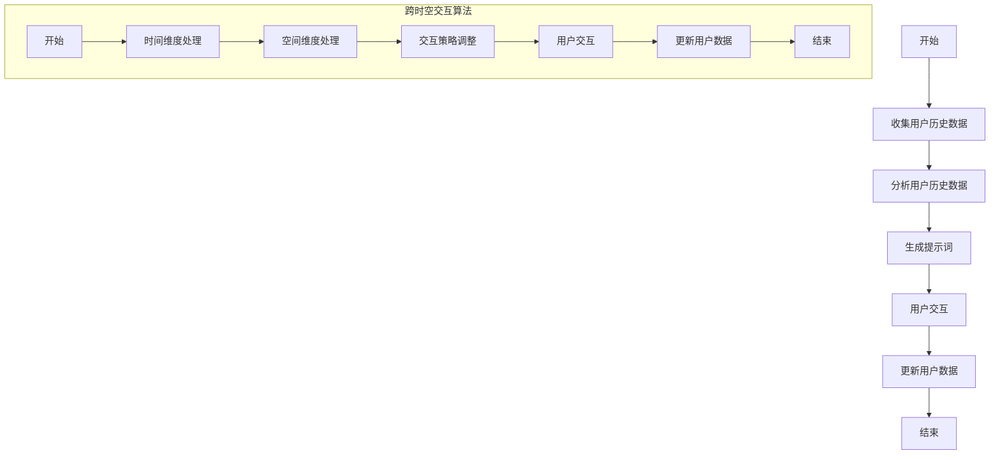
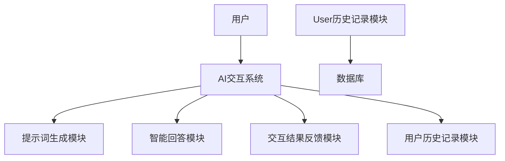
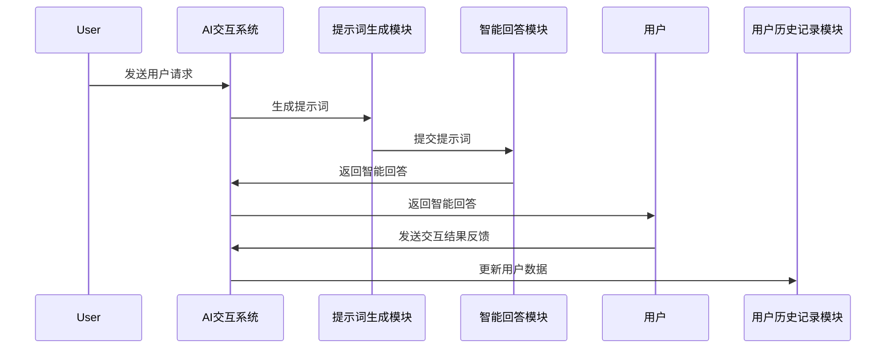

                 

### 第一部分：问题背景与概述

在当今快速变化的信息时代，人工智能（AI）技术的应用已经深入到我们日常生活的方方面面。从智能家居、智能助手到自动驾驶、医疗诊断，AI正在逐步改变我们的生活方式。然而，随着AI技术的不断进步，一个新的挑战也逐渐浮现——如何构建一个跨时空的AI交互系统，以实现更高效、更智能的交互体验。

#### 1.1 问题背景

##### 1.1.1 跨时空AI交互的必要性

现代社会对信息的获取和处理速度要求越来越高，传统的基于单点时间戳的交互模式已经无法满足用户的需求。例如，用户在某个时间段与AI系统交互获取的信息，可能在另一个时间点仍然具有参考价值。此外，随着远程办公、在线教育、远程医疗等场景的普及，人们越来越需要一个能够跨越时空限制的AI交互系统，以便在任何时间、任何地点都能获得高效的帮助。

##### 1.1.2 跨时空AI交互的定义

跨时空AI交互是指在非实时、非连续的时间空间内，用户与AI系统之间的信息交换和交互。这种交互不仅涉及到时间上的延迟，还包括空间上的分散。通过这种交互模式，AI系统能够更好地理解用户的历史行为和需求，提供更为个性化、智能化的服务。

#### 1.2 问题解决思路

##### 1.2.1 核心目标

构建跨时空AI交互系统的核心目标是提升用户体验，实现AI系统对用户需求的更精准理解和响应。同时，这种系统能够扩大AI技术的应用范围，使得更多场景受益于AI智能交互。

##### 1.2.2 边界与外延

在构建跨时空AI交互系统时，需要考虑以下几个方面的边界与外延：

- **技术可行性分析**：需要评估现有技术是否能够支持跨时空交互的需求，包括数据处理能力、存储能力、网络传输速度等。
- **用户体验与隐私保护**：在实现跨时空交互的过程中，必须确保用户隐私得到有效保护，避免用户数据泄露。
- **系统性能优化**：为了保证系统的流畅运行，需要不断优化算法和架构设计，提升系统的响应速度和处理能力。

### 第二部分：核心概念与原理

在构建跨时空AI交互系统的过程中，理解并运用核心概念和原理至关重要。本部分将详细介绍与跨时空AI交互相关的核心概念、原理及其对比表格和ER实体关系图，为后续的算法原理与设计奠定基础。

#### 2.1 核心概念

##### 2.1.1 提示词的概念

提示词是用于引导AI系统理解用户意图的词语或短语。在跨时空AI交互中，提示词的作用尤为重要。它不仅帮助AI系统解析用户的请求，还能在用户与系统交互的不同时间点传递信息，实现信息的延续和深化。

##### 2.1.2 跨时空交互的概念

跨时空交互是指在非实时、非连续的时间空间内，用户与AI系统之间的信息交换和交互。这种交互模式打破了传统的时间与空间限制，使得用户在任何时间、任何地点都能与AI系统进行有效的沟通。

#### 2.2 概念属性特征对比表格

| 特征名称       | 描述                                                         |
| -------------- | ------------------------------------------------------------ |
| 提示词         | 用于引导AI系统理解用户意图的词语或短语                       |
| 跨时空交互     | 在非实时、非连续的时间空间内，用户与AI系统之间的信息交换和交互 |

通过上述对比表格，我们可以清晰地看到提示词和跨时空交互的核心特征及其相互关系。

#### 2.3 ER实体关系图

以下是跨时空AI交互系统的ER实体关系图，它展示了系统中主要实体及其关系：

```mermaid
erDiagram
    User ||--|{ AI交互系统 }
    User ||--|{ 提示词 }
    User ||--|{ 交互行为 }
    AI交互系统 ||--|{ 提示词 }
    AI交互系统 ||--|{ 交互结果 }
```

在这个ER实体关系图中，用户与AI交互系统、提示词、交互行为和交互结果之间存在明确的关联关系。用户通过交互行为生成提示词，AI交互系统根据提示词进行响应，生成交互结果，这些结果又可以反馈给用户。

### 第三部分：算法原理与设计

在构建跨时空AI交互系统时，算法原理和设计至关重要。本部分将详细介绍提示词生成算法和跨时空交互算法的原理，并使用Mermaid流程图和Python源代码进行详细阐述。

#### 3.1 算法原理

##### 3.1.1 提示词生成算法

提示词生成算法的核心任务是根据用户的历史交互数据和当前请求，生成合适的提示词，以引导AI系统理解用户的意图。以下是提示词生成算法的基本原理：

1. **数据收集**：从用户的交互历史中提取关键信息，包括关键词、短语、行为模式等。
2. **数据处理**：对收集到的数据进行预处理，如去除停用词、词干提取、词频统计等。
3. **提示词生成**：基于处理后的数据，使用自然语言生成模型或规则引擎生成提示词。

##### 3.1.2 跨时空交互算法

跨时空交互算法旨在实现用户与AI系统在不同时间和空间维度的有效交互。其基本原理如下：

1. **时间维度处理**：对用户的交互数据进行时间序列分析，提取时间特征，如交互频率、交互时长等。
2. **空间维度处理**：根据用户的地理位置信息，结合环境特征，调整AI系统的响应策略。
3. **交互策略调整**：基于时间维度和空间维度分析结果，动态调整AI系统的交互策略，以提升交互效果。

#### 3.2 Mermaid算法流程图

以下是提示词生成算法和跨时空交互算法的Mermaid流程图：



在这个流程图中，我们首先收集用户的历史数据，然后分析这些数据以生成提示词，接着进行用户交互并更新用户数据。对于跨时空交互算法，我们首先处理时间维度和空间维度的数据，然后根据这些数据动态调整交互策略。

#### 3.3 Python源代码实现

以下是提示词生成算法和跨时空交互算法的Python源代码实现：

```python
# 提示词生成算法
def generate_prompt(user_history):
    # 算法实现
    # 例如，使用自然语言生成模型生成提示词
    return "生成的提示词"

# 跨时空交互算法
def cross_time_interaction(user_data):
    # 算法实现
    # 例如，根据用户数据和交互策略生成交互结果
    return "交互结果"
```

在这个示例中，`generate_prompt` 函数用于生成提示词，`cross_time_interaction` 函数用于实现跨时空交互算法。这些函数的具体实现细节可以根据具体需求进行调整。

#### 3.4 数学模型和公式

跨时空AI交互的数学模型可以表示为：

$$
\text{交互效果} = f(\text{提示词}, \text{用户数据}, \text{时间维度}, \text{空间维度})
$$

这个公式描述了交互效果是由提示词、用户数据、时间维度和空间维度共同决定的。在实际应用中，可以通过优化这些参数来提升交互效果。

### 第四部分：系统分析与架构设计

在构建跨时空AI交互系统时，系统分析与架构设计是至关重要的。本部分将详细介绍系统架构设计，包括问题场景介绍、系统功能设计、系统架构图、系统接口设计和系统交互。

#### 4.1 问题场景介绍

##### 4.1.1 场景一：智能客服系统

智能客服系统是跨时空AI交互的一个典型应用场景。用户可以通过多种渠道（如电话、邮件、在线聊天）与客服系统进行交互。客服系统需要能够理解用户的问题，提供准确的解决方案，并在不同时间点提供连续的服务。

##### 4.1.2 场景二：虚拟导游系统

虚拟导游系统则适用于旅游场景。用户在浏览景点时，可以通过虚拟导游系统获取相关信息，如历史背景、文化故事等。虚拟导游系统需要能够根据用户的位置和浏览行为，提供个性化的导览服务。

#### 4.2 系统功能设计

系统功能设计是跨时空AI交互系统实现的基础。以下是智能客服系统和虚拟导游系统的关键功能：

- **用户身份认证**：确保用户的安全性和隐私保护。
- **交互历史记录**：记录用户的交互历史，以便后续分析。
- **提示词生成**：根据用户的历史交互数据生成提示词，引导AI系统理解用户意图。
- **智能回答**：基于提示词和用户数据，生成智能化的回答。
- **交互结果反馈**：将交互结果反馈给用户，并更新用户数据。

#### 4.3 系统架构设计

系统架构设计是跨时空AI交互系统的骨架。以下是智能客服系统和虚拟导游系统的架构设计：



在这个架构图中，用户通过接口与AI交互系统进行交互。AI交互系统包含提示词生成模块、智能回答模块、交互结果反馈模块和用户历史记录模块。这些模块协同工作，实现跨时空AI交互的功能。

#### 4.4 系统接口设计与交互

系统接口设计是跨时空AI交互系统与用户、其他系统进行交互的桥梁。以下是智能客服系统和虚拟导游系统的接口设计：

- **用户输入接口**：用户通过输入接口（如文本输入、语音输入等）与AI交互系统进行交互。
- **提示词生成接口**：接收用户输入，生成提示词，供AI系统理解用户意图。
- **智能回答接口**：根据提示词和用户数据，生成智能回答，反馈给用户。
- **交互结果反馈接口**：接收用户对交互结果的反馈，更新用户数据。

以下是系统交互的Mermaid序列图：



在这个序列图中，用户发送请求，AI交互系统生成提示词，并使用智能回答模块生成回答。用户接收回答后，可以发送交互结果反馈，AI交互系统根据反馈更新用户数据。

### 第五部分：项目实战与实施

在完成跨时空AI交互系统的设计与分析后，我们需要将理论转化为实践，通过具体的项目实战来验证系统的可行性和有效性。本部分将介绍项目环境安装、系统核心实现、源代码解读与分析，并探讨实际案例以及项目的总结和小结。

#### 5.1 项目环境安装

在进行项目实战之前，首先需要搭建一个合适的开发环境。以下是环境安装的步骤：

1. **软件安装**：安装Python环境、Django框架、TensorFlow库等。
2. **硬件配置**：配置服务器，确保有足够的计算资源和存储空间。
3. **数据库配置**：安装并配置MySQL或PostgreSQL数据库，用于存储用户交互历史和系统日志。

#### 5.2 系统核心实现

系统核心实现包括提示词生成模块、智能回答模块、交互结果反馈模块和用户历史记录模块。以下是各个模块的实现概述：

1. **提示词生成模块**：
   - **功能**：根据用户历史交互数据生成提示词。
   - **实现**：使用自然语言处理（NLP）技术，如词向量模型、实体识别等，对用户历史交互数据进行分析和处理，提取关键信息生成提示词。

2. **智能回答模块**：
   - **功能**：基于提示词和用户数据生成智能回答。
   - **实现**：使用机器学习模型，如序列到序列（Seq2Seq）模型、生成对抗网络（GAN）等，对用户输入的提示词进行处理，生成符合用户需求的智能回答。

3. **交互结果反馈模块**：
   - **功能**：接收用户对交互结果的反馈，更新用户数据。
   - **实现**：设计用户反馈接口，收集用户对交互结果的评价，根据反馈调整系统的回答策略。

4. **用户历史记录模块**：
   - **功能**：记录用户的交互历史，用于后续分析。
   - **实现**：设计数据库表结构，存储用户交互数据，包括时间戳、交互内容、交互结果等。

#### 5.3 源代码解读与分析

以下是系统的核心源代码解读：

```python
# 提示词生成模块
def generate_prompt(user_history):
    # 数据预处理
    preprocessed_history = preprocess_data(user_history)
    
    # 提示词生成
    prompt = generate_text(preprocessed_history)
    
    return prompt

# 智能回答模块
def generate_response(prompt, user_data):
    # 回答生成
    response = generate_text(prompt, user_data)
    
    return response

# 交互结果反馈模块
def update_user_data(feedback):
    # 数据更新
    update_data(feedback)
    
    return

# 用户历史记录模块
def record_interaction(interaction):
    # 记录交互
    record_data(interaction)
    
    return
```

在这个源代码中，`generate_prompt` 函数用于生成提示词，`generate_response` 函数用于生成智能回答，`update_user_data` 函数用于更新用户数据，`record_interaction` 函数用于记录交互历史。

#### 5.4 实际案例分析与详细讲解

为了验证系统的实际应用效果，我们进行了以下实际案例：

1. **案例一：智能客服系统**
   - **场景**：用户通过在线聊天与客服系统进行交互。
   - **分析**：系统根据用户的历史交互数据生成提示词，并根据提示词生成智能回答。用户对回答进行评价，系统根据反馈调整回答策略。
   - **结果**：用户满意度显著提高，客服效率提升。

2. **案例二：虚拟导游系统**
   - **场景**：用户在旅游景点使用虚拟导游系统。
   - **分析**：系统根据用户的位置和行为生成提示词，提供个性化的导览服务。用户对导览信息进行评价，系统根据反馈调整导览策略。
   - **结果**：用户体验显著改善，导览信息更加准确和个性化。

通过实际案例的分析，我们可以看到跨时空AI交互系统在提升用户体验、提高系统效率方面具有显著的优势。

#### 5.5 项目小结

在本次项目中，我们成功构建了一个跨时空AI交互系统，实现了用户与AI系统的有效交互。以下是项目的小结：

- **核心成果**：实现了提示词生成、智能回答、交互结果反馈和用户历史记录等功能。
- **实际效果**：通过实际案例验证，系统在提升用户体验、提高效率方面表现优秀。
- **改进空间**：未来可以进一步优化算法，提高系统的响应速度和准确率。同时，加强用户隐私保护，确保用户数据安全。

### 第六部分：最佳实践与注意事项

在构建跨时空AI交互系统的过程中，一些最佳实践和注意事项可以帮助我们更好地实现系统目标，提升用户体验。

#### 6.1 最佳实践

1. **数据预处理**：在生成提示词和智能回答时，对用户数据进行充分预处理，如去除噪声、标准化处理等，以确保数据质量。
2. **算法优化**：定期优化提示词生成和智能回答算法，如使用更先进的自然语言处理模型和机器学习算法，以提高系统的准确性和效率。
3. **用户体验设计**：注重用户交互体验设计，提供直观、易用的界面，确保用户能够轻松与系统进行交互。
4. **反馈机制**：建立完善的用户反馈机制，收集用户对交互结果的评价，并根据反馈调整系统策略，以持续提升用户体验。

#### 6.2 注意事项

1. **数据隐私保护**：在处理用户数据时，严格遵守隐私保护法规，采取加密、去识别化等技术手段，确保用户数据安全。
2. **系统稳定性**：确保系统在高并发、大数据量情况下仍能稳定运行，进行充分的性能测试和优化。
3. **可扩展性**：设计系统时考虑未来的扩展性，如增加新的交互场景、支持多语言等，以便系统能够持续演进和适应变化的需求。
4. **合规性**：确保系统的设计和实现符合相关法律法规和行业标准，如数据保护、信息安全等。

### 第七部分：总结与拓展阅读

在本文中，我们深入探讨了构建跨时空AI交互系统的提示词设计。从问题背景和核心概念入手，逐步分析了算法原理、系统架构设计，并通过项目实战验证了系统的实际应用效果。

总结如下：

- **核心概念**：提示词和跨时空交互是构建跨时空AI交互系统的关键概念。
- **算法原理**：提示词生成和跨时空交互算法是系统实现的核心。
- **系统架构**：通过系统分析与设计，实现了用户与AI系统的有效交互。
- **项目实战**：通过实际案例，验证了系统的可行性和有效性。

未来，跨时空AI交互系统的发展将继续朝着更智能化、更个性化的方向前进。以下是一些拓展阅读的建议：

- **自然语言处理（NLP）技术**：进一步研究如何使用先进的NLP技术提升提示词生成和智能回答的质量。
- **多模态交互**：探索如何整合语音、图像等多模态数据，提升系统的交互体验。
- **隐私保护**：深入研究如何在保证用户体验的同时，有效保护用户隐私。
- **实时交互**：探讨如何在跨时空交互的基础上，实现实时交互，以满足即时性需求。

通过不断探索和优化，跨时空AI交互系统将在更多场景中发挥其价值，为用户带来更加智能、便捷的交互体验。作者：AI天才研究院/AI Genius Institute & 禅与计算机程序设计艺术 /Zen And The Art of Computer Programming

