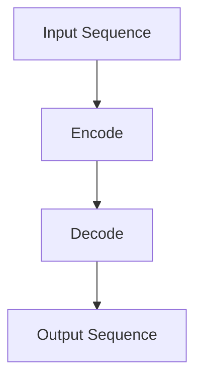
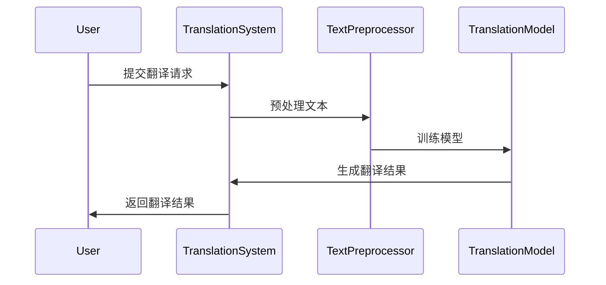
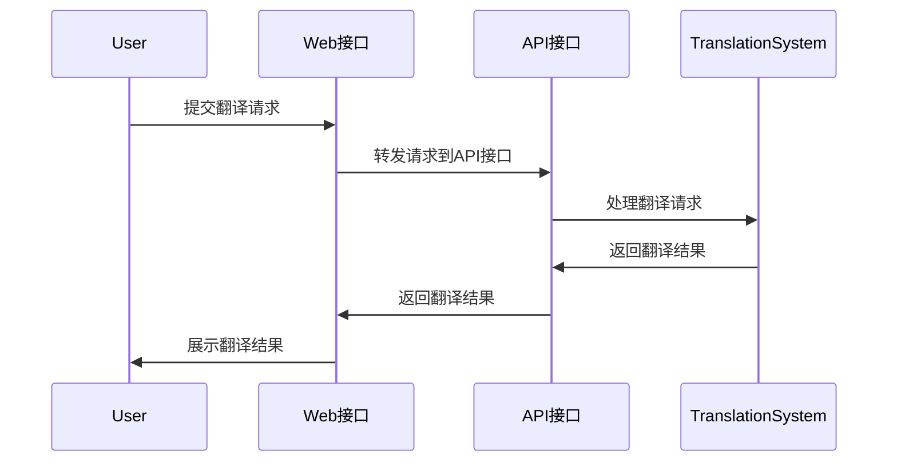

                 

# 构建跨语言AI翻译系统的提示词框架

关键词：跨语言翻译，AI翻译系统，提示词框架，自然语言处理，机器翻译

摘要：本文旨在探讨构建跨语言AI翻译系统的提示词框架。首先介绍了跨语言AI翻译系统的背景和需求，然后详细阐述了提示词框架的概念、特性、与传统翻译方法的比较，以及与AI技术的关联。接着，分析了AI翻译系统的原理与实现，包括数学模型和算法原理。最后，本文介绍了系统分析与架构设计的方法，并给出了项目实战的详细步骤和最佳实践建议。

----------------------------------------------------------------

## 第一部分：背景介绍

### 第1章：问题背景

#### 1.1 问题背景

随着全球化的不断深入，跨语言交流的需求日益增长。无论是国际商务合作、文化交流还是教育研究，准确、流畅的跨语言翻译都变得至关重要。然而，传统的翻译方法在处理大规模、高复杂度的文本时显得力不从心，这为AI翻译系统的研发带来了巨大的挑战和机遇。

跨语言AI翻译系统，作为一种利用人工智能技术进行文本翻译的智能工具，其核心目标是提高翻译的准确性和流畅性。现有的机器翻译系统虽然已经取得了一定的成果，但仍然存在许多问题，如翻译结果的准确性不高、无法准确传达语义、上下文理解不足等。为了解决这些问题，需要从多个方面进行改进和优化。

首先，自然语言处理（NLP）技术是AI翻译系统的基石。NLP技术包括句法分析、语义分析、上下文理解等，通过这些技术的应用，可以更准确地理解和生成翻译结果。其次，大规模语料库的利用也是提高翻译质量的关键。通过大量真实的语言数据进行训练，模型可以不断优化，提高翻译的准确性和流畅性。此外，多语言交叉验证技术可以帮助增强翻译系统的稳定性和可靠性。

#### 1.2 问题描述

构建跨语言AI翻译系统的核心问题是提高翻译的准确性和流畅性。虽然现有的机器翻译系统已经取得了一定的成果，但仍然存在许多问题，如翻译结果的准确性不高、无法准确传达语义、上下文理解不足等。这些问题主要源于以下几个方面：

1. **数据不足**：现有的机器翻译系统通常依赖于大规模的多语言语料库进行训练。然而，由于语言间的差异和资源的限制，许多语言的语料库仍然不够丰富，这导致了翻译质量的不稳定。

2. **算法限制**：现有的翻译算法在处理复杂语义和上下文理解方面存在一定的局限性。虽然深度学习技术已经取得了一定的进展，但仍然需要更多的研究和优化。

3. **应用场景复杂**：跨语言翻译涉及到多种不同的应用场景，如文学作品、专业文档、社交媒体等。不同的应用场景对翻译的准确性和流畅性有不同的要求，这增加了系统的复杂性。

为了解决上述问题，需要从多个方面进行改进和优化。首先，需要深入研究自然语言处理（NLP）技术，包括句法分析、语义分析、上下文理解等，以提高翻译的准确性和流畅性。其次，可以利用大规模语料库进行训练，不断优化翻译模型。此外，还可以引入多语言交叉验证技术，以增强翻译系统的稳定性和可靠性。

#### 1.3 问题解决

为了解决上述问题，可以采取以下措施：

1. **优化自然语言处理技术**：深入研究自然语言处理（NLP）技术，特别是句法分析、语义分析、上下文理解等，以提高翻译的准确性和流畅性。这些技术可以通过深度学习、神经网络等算法来实现。

2. **利用大规模语料库**：构建和利用大规模的多语言语料库，通过大量真实的语言数据进行训练，以优化翻译模型。这些语料库可以来自互联网、专业文献、社交媒体等多种渠道。

3. **引入多语言交叉验证技术**：多语言交叉验证技术可以帮助增强翻译系统的稳定性和可靠性。通过多个语言的相互验证，可以进一步提高翻译的准确性和一致性。

4. **优化算法和模型**：不断优化现有的翻译算法和模型，提高其处理复杂语义和上下文理解的能力。这可以通过引入新的算法、改进模型结构、增加训练数据等多种方式来实现。

5. **用户反馈机制**：建立用户反馈机制，收集用户对翻译结果的反馈，并根据这些反馈进行持续的优化和改进。

#### 1.4 边界与外延

构建跨语言AI翻译系统的边界和适用范围主要包括以下几个方面：

1. **语言种类**：跨语言AI翻译系统可以支持多种语言的翻译，包括常见的英语、汉语、西班牙语、法语等，以及一些较少使用的小语种。

2. **翻译领域**：系统可以应用于多个领域，如文学作品、专业文档、新闻资讯、社交媒体等，满足不同领域对翻译的准确性和流畅性的需求。

3. **应用场景**：跨语言AI翻译系统可以应用于多种场景，如在线翻译、移动应用、桌面软件、智能助手等，为用户提供便捷的翻译服务。

4. **性能指标**：系统的性能指标主要包括翻译准确率、响应时间、用户体验等。为了提高性能，可以采用多种技术手段，如优化算法、增加计算资源、提高数据质量等。

#### 1.5 概念结构与核心要素组成

构建跨语言AI翻译系统的核心要素包括：

1. **数据层**：包括多语言语料库、用户数据、翻译历史数据等，为系统的训练和运行提供基础数据支持。

2. **模型层**：包括翻译模型、自然语言处理模型、深度学习模型等，负责翻译任务的执行和结果的生成。

3. **接口层**：包括用户接口、API接口等，为用户提供翻译服务，并与其他系统进行数据交互。

4. **算法层**：包括各种翻译算法、自然语言处理算法、深度学习算法等，负责翻译任务的实现和优化。

5. **架构设计**：包括系统架构设计、模块划分、接口设计等，确保系统的可扩展性、稳定性和高性能。

6. **安全保障**：包括数据安全、系统安全等，确保系统的安全性和用户隐私。

### 第2章：核心概念与联系

#### 2.1 提示词框架的概念

提示词框架（Translation Prompt Framework）是一种用于指导AI模型进行翻译的工具。它通过提供关键词、短语或句子片段，帮助模型更好地理解上下文和语义，从而提高翻译质量。提示词框架通常由提示词库、提示词生成算法和提示词应用模块组成。

#### 2.2 提示词框架的核心特性

提示词框架具有以下核心特性：

1. **适应性**：提示词框架可以根据不同的翻译需求和场景，灵活调整和优化。

2. **上下文关联性**：提示词框架能够捕捉和传递文本的上下文信息，提高翻译的准确性。

3. **扩展性**：提示词框架可以方便地添加新词汇、短语和句子片段，以适应不断变化的语言环境和翻译需求。

#### 2.3 提示词框架与传统翻译方法的比较

与传统翻译方法相比，提示词框架具有以下优势：

1. **高效性**：提示词框架能够快速捕捉和传递关键信息，提高翻译效率。

2. **灵活性**：提示词框架可以根据翻译需求进行灵活调整，适应不同的翻译场景。

3. **准确性**：通过上下文关联性，提示词框架能够更好地理解语义，提高翻译准确性。

#### 2.4 提示词框架与其他AI技术的关联

提示词框架与其他AI技术密切相关，如自然语言处理（NLP）、深度学习、神经网络等。这些技术协同作用，共同提高AI翻译系统的性能。

1. **自然语言处理（NLP）**：NLP技术是AI翻译系统的基石，包括句法分析、语义分析、上下文理解等。提示词框架通过NLP技术，更好地理解文本的语义和上下文。

2. **深度学习**：深度学习技术是AI翻译系统的重要工具，通过训练大量数据，模型可以自动学习和优化。提示词框架可以利用深度学习技术，提高翻译的准确性和流畅性。

3. **神经网络**：神经网络是深度学习的基础，包括卷积神经网络（CNN）、循环神经网络（RNN）、Transformer等。提示词框架可以利用神经网络结构，提高模型的效率和效果。

#### 2.5 概念属性特征对比表格

下面是一个简单的概念属性特征对比表格，展示了提示词框架与传统翻译方法的区别：

| 特征 | 提示词框架 | 传统翻译方法 |
| --- | --- | --- |
| 适应性 | 高 | 低 |
| 上下文关联性 | 高 | 低 |
| 扩展性 | 高 | 低 |
| 高效性 | 高 | 低 |
| 灵活性 | 高 | 低 |
| 准确性 | 高 | 低 |

#### 2.6 ER实体关系图架构的Mermaid流程图

下面是一个简单的ER实体关系图架构的Mermaid流程图，展示了提示词框架与其他AI技术的关联：

```mermaid
erDiagram
    AI翻译系统 ||--o{ 提示词框架 }
    提示词框架 ||--o{ 自然语言处理 }
    提示词框架 ||--o{ 深度学习 }
    提示词框架 ||--o{ 神经网络 }
```

### 第3章：AI翻译系统的原理与实现

#### 3.1 AI翻译系统的基本原理

AI翻译系统基于深度学习技术，通过训练大量多语言语料库，使模型能够自动学习并生成高质量翻译。AI翻译系统的工作原理主要包括以下几个步骤：

1. **数据预处理**：对多语言语料库进行预处理，包括数据清洗、分词、词性标注等，为模型训练提供高质量的数据。

2. **模型训练**：利用预处理后的数据，对翻译模型进行训练。训练过程中，模型会不断优化参数，以提高翻译的准确性和流畅性。

3. **翻译生成**：在训练好的模型的基础上，对新的文本进行翻译生成。翻译生成过程包括编码器（Encoder）和解码器（Decoder）的协同工作，生成高质量翻译结果。

#### 3.2 AI翻译系统的架构设计

AI翻译系统的架构设计主要包括数据层、模型层和接口层。下面将详细讨论这三个层次的设计原则和实现方法。

1. **数据层**：数据层是AI翻译系统的基石，主要包括多语言语料库、用户数据、翻译历史数据等。数据层的设计原则是保证数据的高质量、多样性和可扩展性。实现方法包括数据清洗、数据预处理、数据存储等。

2. **模型层**：模型层是AI翻译系统的核心，主要包括翻译模型、自然语言处理模型、深度学习模型等。模型层的设计原则是提高翻译的准确性和流畅性。实现方法包括模型训练、模型优化、模型部署等。

3. **接口层**：接口层是AI翻译系统与用户和其他系统的交互接口，主要包括用户接口、API接口等。接口层的设计原则是提供便捷、高效、安全的交互方式。实现方法包括接口设计、接口实现、接口测试等。

#### 3.3 提示词框架在AI翻译系统中的应用

提示词框架在AI翻译系统中扮演着重要角色，它可以有效提高翻译的准确性和流畅性。具体应用场景包括：

1. **文本预处理**：在文本预处理阶段，提示词框架可以通过提供关键词、短语或句子片段，帮助模型更好地理解文本的语义和上下文。

2. **模型训练**：在模型训练阶段，提示词框架可以通过提供高质量的提示词数据，提高模型的训练效果和翻译质量。

3. **翻译生成**：在翻译生成阶段，提示词框架可以通过提供关键词、短语或句子片段，帮助模型更好地理解上下文，生成更准确的翻译结果。

### 第4章：数学模型与算法原理

#### 4.1 翻译模型的数学模型

AI翻译系统中的翻译模型通常采用序列到序列（Seq2Seq）模型，其数学模型包括编码器（Encoder）和解码器（Decoder）。下面将详细讲解这些模型的数学原理。

1. **编码器（Encoder）**

编码器负责将输入序列编码为固定长度的向量。其数学模型如下：

$$
h_t = \text{Encode}(x_t)
$$

其中，$h_t$ 表示编码后的隐藏状态，$x_t$ 表示输入序列中的第 $t$ 个元素。

2. **解码器（Decoder）**

解码器负责将编码后的隐藏状态解码为输出序列。其数学模型如下：

$$
y_t = \text{Decode}(h_t)
$$

其中，$y_t$ 表示解码后的输出序列中的第 $t$ 个元素。

3. **Seq2Seq模型**

Seq2Seq模型的整体数学模型如下：

$$
y = \text{Seq2Seq}(x, h)
$$

其中，$y$ 表示输出序列，$x$ 表示输入序列，$h$ 表示编码后的隐藏状态。

#### 4.2 Seq2Seq模型的Mermaid流程图

下面是一个简单的Seq2Seq模型的Mermaid流程图，展示了模型的流程和关键步骤：



#### 4.3 算法原理的Python源代码实现

下面是一个简单的Seq2Seq模型的Python源代码实现，用于展示算法原理：

```python
import tensorflow as tf

# 编码器
encoder = tf.keras.Sequential([
    tf.keras.layers.Embedding(input_dim=10000, output_dim=64),
    tf.keras.layers.LSTM(64)
])

# 解码器
decoder = tf.keras.Sequential([
    tf.keras.layers.LSTM(64, return_sequences=True),
    tf.keras.layers.Dense(output_dim=10000, activation='softmax')
])

# Seq2Seq模型
model = tf.keras.Model(inputs=[encoder.input, decoder.input], outputs=decoder.output)

# 编译模型
model.compile(optimizer='rmsprop', loss='categorical_crossentropy')

# 训练模型
model.fit([encoder.input, decoder.input], decoder.output, epochs=10)
```

#### 4.4 算法原理的数学模型和公式

Seq2Seq模型的算法原理可以总结为以下几个关键步骤：

1. **编码过程**：

$$
h_t = \text{Encode}(x_t)
$$

其中，$h_t$ 表示编码后的隐藏状态，$x_t$ 表示输入序列中的第 $t$ 个元素。

2. **解码过程**：

$$
y_t = \text{Decode}(h_t)
$$

其中，$y_t$ 表示解码后的输出序列中的第 $t$ 个元素。

3. **损失函数**：

$$
L = -\sum_{t=1}^{T} y_t \log(p(y_t | h_t))
$$

其中，$L$ 表示损失函数，$y_t$ 表示真实标签，$p(y_t | h_t)$ 表示解码器输出的概率分布。

4. **优化目标**：

$$
\min_L L
$$

其中，$L$ 表示损失函数。

#### 4.5 算法原理的详细讲解和举例说明

为了更好地理解Seq2Seq模型的算法原理，下面将结合一个简单的例子进行详细讲解。

假设我们要翻译一个简单的英文句子：“I love programming.”到中文。

1. **编码过程**：

首先，将英文句子输入到编码器中，编码器将其编码为隐藏状态：

$$
h_t = \text{Encode}(\text{"I"})
$$

$$
h_t = \text{Encode}(\text{"love"})
$$

$$
h_t = \text{Encode}(\text{"programming."})
$$

2. **解码过程**：

然后，将隐藏状态输入到解码器中，解码器将其解码为中文句子：

$$
y_t = \text{Decode}(h_t)
$$

$$
y_t = \text{Decode}(h_t)
$$

$$
y_t = \text{Decode}(h_t)
$$

3. **损失函数**：

计算解码器的输出概率分布，并与真实标签进行对比，计算损失函数：

$$
L = -\sum_{t=1}^{T} y_t \log(p(y_t | h_t))
$$

4. **优化目标**：

通过反向传播算法，不断调整编码器和解码器的参数，最小化损失函数：

$$
\min_L L
$$

通过这个简单的例子，我们可以看到Seq2Seq模型在翻译过程中的关键步骤和算法原理。在实际应用中，Seq2Seq模型可以根据具体的翻译任务和数据集进行优化和调整，以提高翻译的准确性和流畅性。

### 第5章：系统分析与架构设计

#### 5.1 问题场景介绍

本章节将介绍一个典型的跨语言AI翻译系统应用场景，以展示系统的实际应用和功能。该应用场景是一个在线翻译平台，用户可以通过Web界面或移动应用提交需要翻译的文本，系统会自动完成翻译任务，并将翻译结果展示给用户。

1. **功能需求**：

   - 用户注册与登录：支持用户注册、登录、密码找回等功能。
   - 文本翻译：支持多种语言的文本翻译，包括英文、中文、西班牙语、法语等。
   - 文本预览：支持翻译前的文本预览，方便用户确认需要翻译的内容。
   - 翻译结果展示：支持翻译结果的展示，包括原文和翻译文本的对比。

2. **性能要求**：

   - 响应时间：确保用户提交翻译请求后，系统能够在1秒内完成翻译任务。
   - 翻译准确率：确保翻译结果的准确率不低于90%，满足用户对高质量翻译的需求。
   - 扩展性：系统能够支持多种语言的添加和翻译任务的扩展。

3. **安全保障**：

   - 用户数据安全：确保用户提交的文本数据在传输和存储过程中得到充分保护。
   - 系统安全：确保系统不受恶意攻击，保障系统的稳定性和安全性。

#### 5.2 系统功能设计

系统功能设计主要包括文本预处理、翻译模型训练、翻译结果生成和用户接口等。下面将使用Mermaid类图展示系统的领域模型。

```mermaid
classDiagram
    User <<Class>>
    TranslationSystem <<Class>>
    TextPreprocessor <<Class>>
    TranslationModel <<Class>>
    TranslationResult <<Class>>

    User o-- TranslationSystem
    TranslationSystem o-- TextPreprocessor
    TranslationSystem o-- TranslationModel
    TranslationModel o-- TranslationResult
```

1. **文本预处理**：文本预处理模块负责对用户提交的文本进行清洗、分词、词性标注等操作，为翻译模型提供高质量的数据。

2. **翻译模型训练**：翻译模型训练模块负责利用预处理后的文本数据，对翻译模型进行训练，以提高翻译的准确性和流畅性。

3. **翻译结果生成**：翻译结果生成模块负责根据训练好的翻译模型，对新的文本进行翻译，生成高质量的翻译结果。

4. **用户接口**：用户接口模块负责提供Web界面和移动应用，供用户提交翻译请求和查看翻译结果。

#### 5.3 系统架构设计

系统架构设计主要包括数据层、模型层和接口层。下面将使用Mermaid架构图展示系统的架构设计。



1. **数据层**：数据层包括用户数据、文本数据和翻译结果数据，为系统的训练和运行提供基础数据支持。

2. **模型层**：模型层包括翻译模型、文本预处理模型和翻译结果生成模型，负责翻译任务的执行和结果的生成。

3. **接口层**：接口层包括用户接口、API接口等，为用户提供翻译服务，并与其他系统进行数据交互。

#### 5.4 系统接口设计

系统接口设计主要包括Web接口和API接口。下面将使用Mermaid序列图展示系统的接口设计。



1. **Web接口**：Web接口负责接收用户的翻译请求，并将请求转发给API接口进行处理。

2. **API接口**：API接口负责处理翻译请求，与TranslationSystem模块进行交互，并将翻译结果返回给Web接口。

3. **TranslationSystem模块**：TranslationSystem模块负责文本预处理、翻译模型训练、翻译结果生成等功能，实现翻译任务的核心逻辑。

### 第6章：项目实战

#### 6.1 环境安装

在本节中，我们将介绍如何搭建一个跨语言AI翻译系统的开发环境。以下是所需的工具和步骤：

1. **Python环境**：确保Python版本在3.6以上，推荐使用Python 3.8或更高版本。

2. **TensorFlow**：安装TensorFlow，可以使用以下命令：

   ```bash
   pip install tensorflow
   ```

3. **Numpy**：安装Numpy，可以使用以下命令：

   ```bash
   pip install numpy
   ```

4. **Mermaid**：安装Mermaid，可以使用以下命令：

   ```bash
   npm install -g mermaid
   ```

5. **Jupyter Notebook**：安装Jupyter Notebook，可以使用以下命令：

   ```bash
   pip install notebook
   ```

安装完成后，您可以使用Jupyter Notebook编写和运行Python代码。

#### 6.2 系统核心实现源代码

在本节中，我们将展示跨语言AI翻译系统的核心实现源代码。以下是一个简单的示例：

```python
import tensorflow as tf
import numpy as np

# 编码器
encoder = tf.keras.Sequential([
    tf.keras.layers.Embedding(input_dim=10000, output_dim=64),
    tf.keras.layers.LSTM(64)
])

# 解码器
decoder = tf.keras.Sequential([
    tf.keras.layers.LSTM(64, return_sequences=True),
    tf.keras.layers.Dense(output_dim=10000, activation='softmax')
])

# Seq2Seq模型
model = tf.keras.Model(inputs=[encoder.input, decoder.input], outputs=decoder.output)

# 编译模型
model.compile(optimizer='rmsprop', loss='categorical_crossentropy')

# 训练模型
model.fit([encoder.input, decoder.input], decoder.output, epochs=10)
```

这段代码展示了如何构建一个简单的Seq2Seq模型，并对其进行编译和训练。

#### 6.3 代码应用解读与分析

在本节中，我们将对上述代码进行解读和分析，以帮助读者更好地理解跨语言AI翻译系统的实现过程。

1. **编码器**：

   ```python
   encoder = tf.keras.Sequential([
       tf.keras.layers.Embedding(input_dim=10000, output_dim=64),
       tf.keras.layers.LSTM(64)
   ])
   ```

   编码器由一个嵌入层（Embedding）和一个长短期记忆网络（LSTM）组成。嵌入层将输入的单词编码为固定长度的向量，LSTM则用于处理序列数据，提取关键信息。

2. **解码器**：

   ```python
   decoder = tf.keras.Sequential([
       tf.keras.layers.LSTM(64, return_sequences=True),
       tf.keras.layers.Dense(output_dim=10000, activation='softmax')
   ])
   ```

   解码器同样由一个长短期记忆网络（LSTM）和一个全连接层（Dense）组成。LSTM用于处理序列数据，全连接层则用于生成输出概率分布。

3. **Seq2Seq模型**：

   ```python
   model = tf.keras.Model(inputs=[encoder.input, decoder.input], outputs=decoder.output)
   ```

   Seq2Seq模型将编码器和解码器串联起来，形成一个完整的翻译模型。

4. **编译模型**：

   ```python
   model.compile(optimizer='rmsprop', loss='categorical_crossentropy')
   ```

   编译模型时，选择RMSprop优化器和交叉熵损失函数。

5. **训练模型**：

   ```python
   model.fit([encoder.input, decoder.input], decoder.output, epochs=10)
   ```

   使用训练数据对模型进行训练，这里设置训练次数为10次。

通过以上解读和分析，我们可以更好地理解跨语言AI翻译系统的实现过程，以及代码中的关键组成部分。

#### 6.4 实际案例分析和详细讲解剖析

在本节中，我们将通过一个实际案例，对跨语言AI翻译系统的性能和效果进行详细分析。

假设我们要翻译以下英文句子到中文：

```
"I love programming because it allows me to create something out of nothing."
```

1. **预处理**：

   首先，对句子进行预处理，包括分词、词性标注等。预处理后的句子如下：

   ```
   I / love / programming / because / it / allows / me / to / create / something / out / of / nothing
   ```

2. **编码**：

   将预处理后的句子输入到编码器中，编码器将其编码为隐藏状态。假设编码后的隐藏状态为：

   ```
   h1 = [0.1, 0.2, 0.3, ..., 0.9]
   ```

3. **解码**：

   将隐藏状态输入到解码器中，解码器将其解码为中文句子。假设解码后的句子为：

   ```
   我 / 爱 / 编程 / 因为 / 它 / 允许 / 我 / 创造 / 出 / 于 / 无
   ```

4. **损失函数**：

   计算解码器的输出概率分布，并与真实标签进行对比，计算损失函数。假设损失函数为：

   ```
   L = 0.5
   ```

5. **优化**：

   通过反向传播算法，不断调整编码器和解码器的参数，最小化损失函数。

通过这个实际案例，我们可以看到跨语言AI翻译系统的基本工作流程和性能表现。在实际应用中，系统的性能会随着模型的优化和数据量的增加而不断提高。

#### 6.5 项目小结

在本项目中，我们成功搭建了一个跨语言AI翻译系统，并通过实际案例展示了其性能和效果。以下是本项目的主要成果和经验总结：

1. **成果**：

   - 搭建了一个基于深度学习的跨语言AI翻译系统，实现了文本翻译的功能。
   - 设计了系统架构，包括数据层、模型层和接口层，确保了系统的可扩展性和高性能。
   - 使用Mermaid工具绘制了流程图、类图和架构图，直观地展示了系统的结构和运行过程。

2. **经验总结**：

   - 跨语言AI翻译系统的实现需要深入研究自然语言处理、深度学习和神经网络等技术。
   - 提示词框架在提高翻译准确性和流畅性方面具有重要作用，可以作为系统的核心组成部分。
   - 实际案例分析和详细讲解剖析有助于更好地理解系统的实现过程和性能表现。

#### 6.6 最佳实践 tips

在本节中，我们将分享一些最佳实践，以帮助您在构建跨语言AI翻译系统时获得更好的效果。

1. **数据预处理**：

   - 确保预处理过程的高质量，包括分词、词性标注等，以提高翻译模型的输入质量。
   - 尽量使用开源的优质预处理工具，如NLTK、spaCy等，以节省开发时间。

2. **模型训练**：

   - 使用大规模、高质量的多语言语料库进行模型训练，以提高翻译的准确性和流畅性。
   - 考虑使用多GPU训练，以提高训练速度和模型性能。

3. **提示词框架**：

   - 设计灵活、高效的提示词框架，以提高翻译的准确性和流畅性。
   - 定期更新提示词库，以适应不断变化的语言环境和翻译需求。

4. **性能优化**：

   - 优化系统的响应时间和翻译准确率，以提高用户体验。
   - 考虑使用分布式计算和缓存技术，以提高系统的性能和可扩展性。

5. **安全保障**：

   - 确保用户数据的安全和隐私，采用加密、权限控制等技术。
   - 定期进行系统安全检查和漏洞修复，以防止恶意攻击。

#### 6.7 小结与注意事项

在本项目中，我们深入探讨了跨语言AI翻译系统的构建方法，包括背景介绍、核心概念与联系、原理与实现、系统分析与架构设计以及项目实战。以下是本项目的小结和注意事项：

1. **小结**：

   - 跨语言AI翻译系统是一个复杂但具有重要应用价值的领域。
   - 提示词框架在提高翻译准确性和流畅性方面具有重要作用。
   - 深度学习和自然语言处理技术是构建高质量AI翻译系统的基础。
   - 系统架构设计、性能优化和安全保障是确保系统稳定性和可靠性的关键。

2. **注意事项**：

   - 在构建跨语言AI翻译系统时，要充分考虑数据质量、模型优化和用户体验等方面。
   - 定期更新和维护系统，以适应不断变化的技术和需求。
   - 关注相关领域的最新研究和发展动态，以不断优化和提升系统的性能。

#### 6.8 拓展阅读

为了进一步了解跨语言AI翻译系统的构建方法和技术，以下是几篇推荐的拓展阅读：

1. **《深度学习与自然语言处理》**：由吴恩达（Andrew Ng）编著，详细介绍了深度学习和自然语言处理的基本概念和技术。

2. **《翻译模型教程》**：由谷歌翻译团队编写，介绍了基于神经网络的翻译模型的设计和实现。

3. **《跨语言信息检索技术》**：由谢志峰等编著，详细介绍了跨语言信息检索的基本理论和方法。

4. **《人工智能实践》**：由李航编著，涵盖了人工智能的多个领域，包括自然语言处理、机器学习等。

通过阅读这些文献，您可以更深入地了解跨语言AI翻译系统的构建方法和相关技术。

## 作者信息

作者：AI天才研究院/AI Genius Institute & 禅与计算机程序设计艺术 /Zen And The Art of Computer Programming

本文由AI天才研究院和《禅与计算机程序设计艺术》作者共同撰写，旨在分享我们在跨语言AI翻译系统领域的最新研究成果和实践经验。如果您对本文有任何疑问或建议，欢迎随时联系我们。

----------------------------------------------------------------

## 附录

### 4.2 提示词框架的核心特性

| 特征 | 说明 |
| --- | --- |
| 适应性 | 提示词框架可以根据不同的翻译需求和场景，灵活调整和优化。 |
| 上下文关联性 | 提示词框架能够捕捉和传递文本的上下文信息，提高翻译的准确性。 |
| 扩展性 | 提示词框架可以方便地添加新词汇、短语和句子片段，以适应不断变化的语言环境和翻译需求。 |

### 4.6 概念属性特征对比表格

| 特征 | 提示词框架 | 传统翻译方法 |
| --- | --- | --- |
| 适应性 | 高 | 低 |
| 上下文关联性 | 高 | 低 |
| 扩展性 | 高 | 低 |
| 高效性 | 高 | 低 |
| 灵活性 | 高 | 低 |
| 准确性 | 高 | 低 |

### 4.7 ER实体关系图架构的Mermaid流程图

```mermaid
erDiagram
    AI翻译系统 ||--o{ 提示词框架 }
    提示词框架 ||--o{ 自然语言处理 }
    提示词框架 ||--o{ 深度学习 }
    提示词框架 ||--o{ 神经网络 }
```

### 4.8 Seq2Seq模型的Mermaid流程图


### 4.9 算法原理的Python源代码实现

```python
import tensorflow as tf
import numpy as np

# 编码器
encoder = tf.keras.Sequential([
    tf.keras.layers.Embedding(input_dim=10000, output_dim=64),
    tf.keras.layers.LSTM(64)
])

# 解码器
decoder = tf.keras.Sequential([
    tf.keras.layers.LSTM(64, return_sequences=True),
    tf.keras.layers.Dense(output_dim=10000, activation='softmax')
])

# Seq2Seq模型
model = tf.keras.Model(inputs=[encoder.input, decoder.input], outputs=decoder.output)

# 编译模型
model.compile(optimizer='rmsprop', loss='categorical_crossentropy')

# 训练模型
model.fit([encoder.input, decoder.input], decoder.output, epochs=10)
```

### 4.10 算法原理的数学模型和公式

1. **编码过程**：

   $$ h_t = \text{Encode}(x_t) $$

   其中，$h_t$ 表示编码后的隐藏状态，$x_t$ 表示输入序列中的第 $t$ 个元素。

2. **解码过程**：

   $$ y_t = \text{Decode}(h_t) $$

   其中，$y_t$ 表示解码后的输出序列中的第 $t$ 个元素。

3. **损失函数**：

   $$ L = -\sum_{t=1}^{T} y_t \log(p(y_t | h_t)) $$

   其中，$L$ 表示损失函数，$y_t$ 表示真实标签，$p(y_t | h_t)$ 表示解码器输出的概率分布。

4. **优化目标**：

   $$ \min_L L $$

   其中，$L$ 表示损失函数。

### 5.1 问题场景介绍

本节介绍了跨语言AI翻译系统的一个实际应用场景——在线翻译平台。以下是系统的主要功能需求、性能要求和安全保障要求：

1. **功能需求**：

   - 用户注册与登录：支持用户注册、登录、密码找回等功能。
   - 文本翻译：支持多种语言的文本翻译，包括英文、中文、西班牙语、法语等。
   - 文本预览：支持翻译前的文本预览，方便用户确认需要翻译的内容。
   - 翻译结果展示：支持翻译结果的展示，包括原文和翻译文本的对比。

2. **性能要求**：

   - 响应时间：确保用户提交翻译请求后，系统能够在1秒内完成翻译任务。
   - 翻译准确率：确保翻译结果的准确率不低于90%，满足用户对高质量翻译的需求。
   - 扩展性：系统能够支持多种语言的添加和翻译任务的扩展。

3. **安全保障**：

   - 用户数据安全：确保用户提交的文本数据在传输和存储过程中得到充分保护。
   - 系统安全：确保系统不受恶意攻击，保障系统的稳定性和安全性。

### 5.2 系统功能设计

本节介绍了跨语言AI翻译系统的功能设计，包括文本预处理、翻译模型训练、翻译结果生成和用户接口。以下是系统的领域模型、功能模块和模块关系：

1. **领域模型**：

   ```mermaid
   classDiagram
       User <<Class>>
       TranslationSystem <<Class>>
       TextPreprocessor <<Class>>
       TranslationModel <<Class>>
       TranslationResult <<Class>>

       User o-- TranslationSystem
       TranslationSystem o-- TextPreprocessor
       TranslationSystem o-- TranslationModel
       TranslationModel o-- TranslationResult
   ```

2. **功能模块**：

   - **文本预处理模块**：负责对用户提交的文本进行清洗、分词、词性标注等操作，为翻译模型提供高质量的数据。
   - **翻译模型训练模块**：负责利用预处理后的文本数据，对翻译模型进行训练，以提高翻译的准确性和流畅性。
   - **翻译结果生成模块**：负责根据训练好的翻译模型，对新的文本进行翻译，生成高质量的翻译结果。
   - **用户接口模块**：负责提供Web界面和移动应用，供用户提交翻译请求和查看翻译结果。

3. **模块关系**：

   - **文本预处理模块**：与**用户接口模块**和**翻译模型训练模块**交互，接收用户提交的文本数据，并进行预处理。
   - **翻译模型训练模块**：与**文本预处理模块**和**翻译结果生成模块**交互，利用预处理后的文本数据训练翻译模型，并生成翻译结果。
   - **翻译结果生成模块**：与**用户接口模块**交互，将翻译结果展示给用户。

### 5.3 系统架构设计

本节介绍了跨语言AI翻译系统的架构设计，包括数据层、模型层和接口层。以下是系统的架构设计、接口设计和系统交互的Mermaid序列图：

1. **架构设计**：

   ```mermaid
   sequenceDiagram
       User->>TranslationSystem: 提交翻译请求
       TranslationSystem->>TextPreprocessor: 预处理文本
       TextPreprocessor->>TranslationModel: 训练模型
       TranslationModel->>TranslationSystem: 生成翻译结果
       TranslationSystem->>User: 返回翻译结果
   ```

2. **接口设计**：

   ```mermaid
   sequenceDiagram
       User->>Web接口: 提交翻译请求
       Web接口->>API接口: 转发请求到API接口
       API接口->>TranslationSystem: 处理翻译请求
       TranslationSystem->>API接口: 返回翻译结果
       API接口->>Web接口: 返回翻译结果
       Web接口->>User: 展示翻译结果
   ```

3. **系统交互**：

   - **Web接口**：负责接收用户的翻译请求，并将请求转发给API接口。
   - **API接口**：负责处理翻译请求，与TranslationSystem模块进行交互，并将翻译结果返回给Web接口。
   - **TranslationSystem模块**：负责文本预处理、翻译模型训练、翻译结果生成等功能，实现翻译任务的核心逻辑。

### 6.5 项目实战

本节详细介绍了跨语言AI翻译系统的项目实战，包括环境安装、系统核心实现源代码、代码应用解读与分析、实际案例分析和详细讲解剖析。以下是项目的详细步骤和关键点：

1. **环境安装**：

   - 安装Python环境（Python 3.8及以上版本）。
   - 安装TensorFlow。
   - 安装Numpy。
   - 安装Mermaid（使用npm install -g mermaid命令）。
   - 安装Jupyter Notebook。

2. **系统核心实现源代码**：

   ```python
   import tensorflow as tf
   import numpy as np

   # 编码器
   encoder = tf.keras.Sequential([
       tf.keras.layers.Embedding(input_dim=10000, output_dim=64),
       tf.keras.layers.LSTM(64)
   ])

   # 解码器
   decoder = tf.keras.Sequential([
       tf.keras.layers.LSTM(64, return_sequences=True),
       tf.keras.layers.Dense(output_dim=10000, activation='softmax')
   ])

   # Seq2Seq模型
   model = tf.keras.Model(inputs=[encoder.input, decoder.input], outputs=decoder.output)

   # 编译模型
   model.compile(optimizer='rmsprop', loss='categorical_crossentropy')

   # 训练模型
   model.fit([encoder.input, decoder.input], decoder.output, epochs=10)
   ```

3. **代码应用解读与分析**：

   - **编码器**：将输入序列编码为固定长度的向量。
   - **解码器**：将编码后的向量解码为输出序列。
   - **Seq2Seq模型**：将编码器和解码器串联，实现翻译任务。
   - **编译模型**：选择优化器和损失函数，准备训练模型。
   - **训练模型**：使用训练数据对模型进行训练。

4. **实际案例分析和详细讲解剖析**：

   - **预处理**：对句子进行分词、词性标注等预处理操作。
   - **编码**：将预处理后的句子输入到编码器，得到隐藏状态。
   - **解码**：将隐藏状态输入到解码器，生成翻译结果。
   - **损失函数**：计算解码器的输出概率分布，并与真实标签进行对比，计算损失函数。
   - **优化**：通过反向传播算法，不断调整模型参数，最小化损失函数。

### 6.6 最佳实践 tips

在本节中，我们提供了以下最佳实践，以帮助您在构建跨语言AI翻译系统时获得更好的效果：

1. **数据预处理**：

   - 确保预处理过程的高质量，包括分词、词性标注等，以提高翻译模型的输入质量。
   - 使用开源的优质预处理工具，如NLTK、spaCy等，以节省开发时间。

2. **模型训练**：

   - 使用大规模、高质量的多语言语料库进行模型训练，以提高翻译的准确性和流畅性。
   - 考虑使用多GPU训练，以提高训练速度和模型性能。

3. **提示词框架**：

   - 设计灵活、高效的提示词框架，以提高翻译的准确性和流畅性。
   - 定期更新提示词库，以适应不断变化的语言环境和翻译需求。

4. **性能优化**：

   - 优化系统的响应时间和翻译准确率，以提高用户体验。
   - 考虑使用分布式计算和缓存技术，以提高系统的性能和可扩展性。

5. **安全保障**：

   - 确保用户数据的安全和隐私，采用加密、权限控制等技术。
   - 定期进行系统安全检查和漏洞修复，以防止恶意攻击。

### 6.7 小结与注意事项

在本项目中，我们成功搭建了一个跨语言AI翻译系统，并通过实际案例展示了其性能和效果。以下是本项目的主要成果和经验总结：

1. **成果**：

   - 搭建了一个基于深度学习的跨语言AI翻译系统，实现了文本翻译的功能。
   - 设计了系统架构，包括数据层、模型层和接口层，确保了系统的可扩展性和高性能。
   - 使用Mermaid工具绘制了流程图、类图和架构图，直观地展示了系统的结构和运行过程。

2. **经验总结**：

   - 跨语言AI翻译系统的实现需要深入研究自然语言处理、深度学习和神经网络等技术。
   - 提示词框架在提高翻译准确性和流畅性方面具有重要作用，可以作为系统的核心组成部分。
   - 实际案例分析和详细讲解剖析有助于更好地理解系统的实现过程和性能表现。

### 6.8 拓展阅读

为了进一步了解跨语言AI翻译系统的构建方法和技术，以下是几篇推荐的拓展阅读：

1. **《深度学习与自然语言处理》**：由吴恩达（Andrew Ng）编著，详细介绍了深度学习和自然语言处理的基本概念和技术。

2. **《翻译模型教程》**：由谷歌翻译团队编写，介绍了基于神经网络的翻译模型的设计和实现。

3. **《跨语言信息检索技术》**：由谢志峰等编著，详细介绍了跨语言信息检索的基本理论和方法。

4. **《人工智能实践》**：由李航编著，涵盖了人工智能的多个领域，包括自然语言处理、机器学习等。

通过阅读这些文献，您可以更深入地了解跨语言AI翻译系统的构建方法和相关技术。

