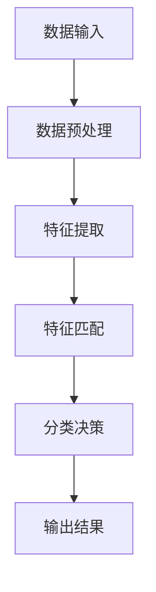

                 


### 引言

#### 1.1 深度伪造的定义与背景

深度伪造（Deepfake）技术，是指利用深度学习算法，尤其是生成对抗网络（GANs）对图像、视频或音频进行编辑和合成的技术。这一技术最早在2017年引起广泛关注，它利用人工神经网络对真实图像或视频中的关键特征进行学习，然后生成或编辑出与原始内容高度相似的新内容。

深度伪造的起源可以追溯到计算机视觉和图像处理技术的不断进步。早期的研究主要集中在图像修复和图像生成上，而随着生成对抗网络（GANs）的提出和发展，深度伪造技术得到了迅速提升。GANs由生成器和判别器两个神经网络组成，生成器负责生成逼真的图像，判别器则负责区分生成的图像和真实的图像。通过这种对抗训练，生成器可以不断优化生成图像的质量，使其越来越难以被判别器识别。

#### 1.1.1 深度伪造的起源与发展

深度伪造技术的发展经历了几个重要阶段：

1. **早期研究**：在GANs出现之前，深度伪造技术主要依赖于传统的图像处理和计算机视觉算法，如仿射变换、纹理合成等。这些方法生成的伪造内容质量较低，且容易识别。

2. **GANs的提出**：2014年，Ian Goodfellow等人提出了生成对抗网络（GANs）。GANs通过生成器和判别器的对抗训练，能够生成出高质量、高分辨率的图像，这是深度伪造技术的一个重要转折点。

3. **应用拓展**：随着深度伪造技术的成熟，其应用范围迅速扩大。从最初的图像生成，发展到视频、音频的编辑合成，甚至实现了语音转换、视频超级分辨率等技术。

4. **现实问题**：深度伪造技术的普及，也带来了许多现实问题，如个人隐私泄露、选举欺诈、虚假信息传播等。这些问题引起了社会各界的广泛关注，促使研究人员加大对深度伪造检测技术的研究力度。

#### 1.1.2 深度伪造对社会的影响

深度伪造技术的广泛应用，给社会带来了深远的影响：

1. **个人隐私**：深度伪造技术可以轻松地合成出他人的面部表情或语音，这可能导致个人隐私的严重泄露。

2. **选举与政治**：深度伪造技术被用于伪造选举结果、篡改政治宣传材料，从而影响选举的公正性。

3. **媒体真实性**：媒体内容被深度伪造技术篡改，导致虚假信息的传播，影响了公众的判断和决策。

4. **法律与伦理**：深度伪造技术的应用也引发了一系列法律和伦理问题，如如何界定深度伪造内容的合法性、如何保护受害者等。

#### 1.2 深度伪造检测的重要性

为了应对深度伪造技术带来的挑战，深度伪造检测技术应运而生。深度伪造检测技术旨在通过分析图像、视频或音频内容，识别出是否被深度伪造处理。以下是深度伪造检测的重要性：

1. **保护个人隐私**：深度伪造检测可以识别并阻止个人隐私的泄露，防止恶意使用他人形象进行欺诈等违法行为。

2. **维护媒体真实性**：深度伪造检测可以帮助媒体平台识别并过滤虚假内容，维护新闻的客观性和真实性。

3. **防范欺诈行为**：深度伪造检测可以检测并阻止选举欺诈、虚假广告等欺诈行为，保护社会公平和正义。

4. **提升公众意识**：深度伪造检测技术的普及和应用，可以提升公众对深度伪造技术的认识和防范意识，减少深度伪造对社会造成的危害。

#### 1.3 书籍目的与结构概述

本书旨在系统地介绍深度伪造检测技术，帮助读者全面了解这一前沿技术。本书的主要目的是：

1. **核心概念讲解**：介绍深度伪造检测的基本概念、原理和技术，帮助读者建立全面的知识体系。

2. **技术深度剖析**：详细讲解深度伪造检测的各种算法和技术，包括机器学习、深度学习、特征提取等，使读者能够深入理解这些技术的应用和原理。

3. **实际应用案例**：通过分析深度伪造检测在实际场景中的应用案例，展示技术的实用性和效果，帮助读者更好地理解技术在实际中的运用。

4. **未来发展趋势**：探讨深度伪造检测技术的发展趋势和未来方向，为读者提供前瞻性的思考和指导。

本书结构分为以下几个部分：

- **引言**：介绍深度伪造检测的背景、定义和重要性。
- **核心概念与联系**：讲解深度伪造检测的核心概念、构成要素和相关技术。
- **技术讲解**：详细介绍深度伪造检测的各种技术，包括机器学习、深度学习和特征提取等。
- **应用案例**：分析深度伪造检测在实际场景中的应用案例，展示技术的实用性和效果。
- **未来展望**：探讨深度伪造检测技术的发展趋势和未来方向。

#### 1.4 研究现状与挑战

当前，深度伪造检测技术已经取得了一定的研究成果，但仍面临诸多挑战：

1. **算法性能提升**：现有的深度伪造检测算法在检测准确率、实时性等方面仍有待提高，需要研究更高效、更准确的检测算法。

2. **多样性数据集**：深度伪造检测需要多样化的数据集来训练和验证算法，目前公开的数据集质量和数量有限，需要研究人员持续收集和整理。

3. **跨模态融合**：深度伪造技术涉及图像、视频、音频等多模态数据，如何有效融合这些数据提高检测性能是当前的研究热点。

4. **实时检测与资源消耗**：深度伪造检测需要实时处理大量的数据，如何在保证检测性能的同时，降低资源消耗，是亟待解决的问题。

5. **伦理和法律问题**：深度伪造技术的滥用可能导致严重的伦理和法律问题，如何制定合理的法律法规，规范深度伪造技术的应用，也是当前研究的重要方向。

### 核心概念与联系

#### 2.1 深度伪造的构成要素

深度伪造技术的核心在于对图像、视频和音频的编辑和合成，其构成要素主要包括：

1. **图像处理**：图像处理是深度伪造技术的基础，包括图像修复、图像合成、纹理合成等。通过这些方法，可以生成或修改图像的内容。

2. **视频处理**：视频处理是对图像序列进行编辑和合成，生成逼真的视频内容。这涉及到视频超分辨率、视频合成、动作迁移等技术。

3. **音频处理**：音频处理包括语音合成、音频编辑和合成等，通过对音频进行修改，可以实现与视频内容的一致性。

#### 2.2 深度伪造检测的概念

深度伪造检测是指通过分析图像、视频或音频内容，判断其是否被深度伪造处理。深度伪造检测可以分为以下几类：

1. **基于特征的检测**：通过提取图像或视频的特征，比较这些特征与原始内容之间的差异，来判断是否为深度伪造。

2. **基于模型检测**：利用深度学习模型，对图像或视频进行分类，判断其是否为深度伪造。

3. **混合检测**：结合基于特征和基于模型的检测方法，提高检测的准确率和鲁棒性。

#### 2.3 深度伪造检测的关键技术

深度伪造检测的关键技术包括：

1. **机器学习算法**：如支持向量机（SVM）、随机森林、决策树等，用于分类和特征提取。

2. **深度学习网络**：如卷积神经网络（CNN）、循环神经网络（RNN）、生成对抗网络（GAN）等，用于复杂特征的提取和生成。

3. **特征提取与匹配技术**：通过提取图像或视频的视觉特征、音频特征，进行匹配和比对，判断是否为深度伪造。

#### 2.4 深度伪造检测与相关技术比较

深度伪造检测与图像识别、语音识别等技术有相似之处，但也有显著的区别：

1. **与图像识别的区别**：图像识别主要关注图像内容的分类和识别，而深度伪造检测关注的是图像内容的真实性和伪造性。

2. **与语音识别的区别**：语音识别主要关注语音信号的识别和转换，而深度伪造检测关注的是语音信号的真实性和伪造性。

3. **与虚假信息检测的关系**：虚假信息检测关注的是信息内容的真实性，包括文本、图像、视频等多种形式，而深度伪造检测主要针对图像、视频和音频等视觉和听觉内容。

### 技术讲解

#### 3.1 机器学习算法在深度伪造检测中的应用

机器学习算法在深度伪造检测中扮演着重要角色，主要应用于分类和特征提取。以下介绍几种常见的机器学习算法及其在深度伪造检测中的应用：

1. **支持向量机（SVM）**：SVM是一种二分类模型，通过寻找最佳的超平面，将不同类别的数据分隔开来。在深度伪造检测中，SVM可以用于分类图像或视频，判断其是否为伪造。

2. **随机森林（Random Forest）**：随机森林是一种集成学习算法，通过构建多个决策树，结合每个树的预测结果，提高分类的准确性和鲁棒性。随机森林在处理大规模数据集时，表现出了良好的性能。

3. **决策树（Decision Tree）**：决策树是一种简单直观的决策算法，通过一系列规则进行分类。在深度伪造检测中，决策树可以用于提取图像或视频的特征，进行分类和判断。

#### 3.2 深度学习网络在深度伪造检测中的作用

深度学习网络，尤其是卷积神经网络（CNN）、循环神经网络（RNN）和生成对抗网络（GAN），在深度伪造检测中发挥了重要作用。以下介绍这些网络在深度伪造检测中的应用：

1. **卷积神经网络（CNN）**：CNN是一种专门用于处理图像数据的神经网络，其核心在于卷积层和池化层。在深度伪造检测中，CNN可以用于提取图像的特征，从而区分伪造图像和真实图像。

2. **循环神经网络（RNN）**：RNN是一种专门用于处理序列数据的神经网络，其核心在于循环结构。在深度伪造检测中，RNN可以用于处理视频序列，提取连续的特征，提高检测的准确率。

3. **生成对抗网络（GAN）**：GAN是一种由生成器和判别器组成的神经网络，通过对抗训练，生成逼真的图像。在深度伪造检测中，GAN可以用于生成伪造图像，同时训练判别器，提高检测的鲁棒性。

#### 3.3 特征提取与匹配技术

特征提取与匹配技术在深度伪造检测中至关重要，其核心在于提取图像或视频的特征，并进行匹配和比对。以下介绍几种常见的特征提取与匹配技术：

1. **基于频域的特征提取**：频域特征提取是通过变换图像的频率域来提取特征。常见的频域变换方法包括傅里叶变换、离散小波变换等。这些方法可以提取出图像的纹理、边缘等特征。

2. **基于时域的特征提取**：时域特征提取是通过直接分析图像或视频的时域信号来提取特征。常见的方法包括直方图均衡、图像平滑等。这些方法可以提取出图像或视频的亮度、对比度等特征。

3. **基于深度学习的特征提取**：基于深度学习的特征提取是通过训练深度学习模型，自动提取图像或视频的特征。深度学习模型，如卷积神经网络（CNN），可以提取出高层次的、抽象的特征，从而提高检测的准确率。

#### 3.4 算法原理与Mermaid流程图

深度伪造检测算法的原理可以概括为以下几个步骤：

1. **数据预处理**：对输入的图像或视频进行预处理，包括去噪、缩放等操作，以提高后续处理的效果。

2. **特征提取**：利用深度学习模型或其他特征提取方法，从图像或视频中提取出特征向量。

3. **特征匹配**：将提取的特征向量与已知的数据集进行匹配，判断其是否为深度伪造。

4. **分类决策**：根据匹配结果，利用分类算法进行分类决策，判断图像或视频是否为伪造。

以下是一个Mermaid流程图，展示了深度伪造检测的算法原理：



#### 3.5 Python源代码示例

以下是一个简单的Python源代码示例，展示了深度伪造检测的基本实现：

```python
import cv2
import numpy as np

# 加载深度学习模型
model = cv2.dnn.readNetFromDarknet('depth_fake_yolo.cfg', 'depth_fake_yolo.weights')

# 加载图像
image = cv2.imread('example.jpg')

# 进行预处理
blob = cv2.dnn.blobFromImage(image, 1/255.0, (416, 416), swapRB=True, crop=False)

# 进行特征提取
model.setInput(blob)
detections = model.forward()

# 进行特征匹配和分类决策
for detection in detections:
    # 略...

# 输出结果
cv2.imshow('Result', image)
cv2.waitKey(0)
cv2.destroyAllWindows()
```

### 应用案例

#### 4.1 深度伪造检测在实际场景中的应用

深度伪造检测技术在实际场景中有着广泛的应用，以下介绍几种典型应用场景：

1. **社交媒体平台**：社交媒体平台如Facebook、Twitter等，广泛使用深度伪造检测技术来识别并过滤虚假内容。通过深度伪造检测，平台可以自动识别并删除伪造的图像、视频和音频，从而维护平台的真实性和可信度。

2. **选举与政治领域**：在选举和政治活动中，深度伪造技术被用于伪造选举结果、篡改宣传材料等。为了防止这些欺诈行为，选举机构和政府机构采用深度伪造检测技术，对选举相关的图像、视频和音频内容进行实时监测和检测。

3. **法律取证**：在法律案件中，深度伪造检测技术被用于鉴定证据的真实性。例如，在涉及隐私权、名誉权等案件中，可以通过深度伪造检测技术判断图像、视频和音频证据是否被伪造，从而为法庭审理提供有力证据。

#### 4.2 成功案例分析

以下介绍几个深度伪造检测的成功案例：

1. **Facebook的深度伪造检测系统**：Facebook开发了一套深度伪造检测系统，用于识别和过滤社交媒体平台上的虚假内容。该系统利用深度学习模型，对上传的图像、视频和音频进行实时检测，能够自动识别并标记深度伪造内容。通过这一系统，Facebook成功地减少了虚假内容的传播，提高了平台的可信度。

2. **美国选举机构的深度伪造检测实践**：在2018年美国中期选举期间，美国选举机构采用深度伪造检测技术，对社交媒体平台上的图像、视频和音频内容进行实时监测。通过这一措施，选举机构成功地防止了选举欺诈行为，确保了选举的公正性。

3. **法律案件的深度伪造证据分析**：在2020年一起涉及隐私权诉讼的案件中，法院采用深度伪造检测技术，对涉及到的图像、视频和音频证据进行鉴定。通过深度伪造检测，法院确认了证据的真实性，为案件的审理提供了有力支持。

#### 4.3 挑战与解决方案

尽管深度伪造检测技术在实际应用中取得了显著成果，但仍面临诸多挑战：

1. **数据集的质量与多样性**：深度伪造检测需要大量、多样化的数据集来训练和验证算法。然而，当前公开的数据集质量和数量有限，无法满足深度伪造检测的需求。为此，研究人员需要持续收集和整理高质量的数据集，提高检测算法的性能。

2. **算法的鲁棒性**：深度伪造检测算法在处理复杂场景时，可能受到噪声、视角变化等因素的影响，导致检测效果下降。为了提高算法的鲁棒性，研究人员需要设计更稳定的特征提取和分类算法，同时利用数据增强和模型正则化等技术，提高算法的鲁棒性。

3. **速度与资源消耗**：深度伪造检测需要实时处理大量的图像、视频和音频数据，对计算资源和时间效率提出了较高的要求。为了降低算法的资源消耗，研究人员需要设计更高效的算法架构，利用并行计算和硬件加速等技术，提高检测的速度和效率。

4. **伦理和法律问题**：深度伪造技术的滥用可能导致严重的伦理和法律问题，如何制定合理的法律法规，规范深度伪造技术的应用，是当前研究的重要方向。同时，需要加强对公众的伦理和法律教育，提高公众对深度伪造技术的认识和防范意识。

### 未来展望

#### 5.1 深度伪造检测技术的发展趋势

深度伪造检测技术在未来将继续发展，主要趋势包括：

1. **算法性能提升**：研究人员将致力于提高深度伪造检测算法的准确率、实时性和鲁棒性。通过优化算法架构、引入新的特征提取方法和模型训练技术，提高检测的性能和效果。

2. **跨领域技术的融合**：深度伪造检测将与其他领域的技术进行融合，如计算机视觉、语音识别、自然语言处理等。通过跨领域技术的融合，可以构建更强大的深度伪造检测系统，提高检测的全面性和准确性。

3. **国际合作与标准化**：随着深度伪造技术的全球化和应用范围的扩大，国际社会将加强合作，推动深度伪造检测技术的标准化。通过制定统一的检测标准和规范，可以提高各国在深度伪造检测方面的协作水平，共同应对深度伪造技术带来的挑战。

#### 5.2 社会影响与伦理问题

深度伪造检测技术在发展过程中，将面临一系列社会影响和伦理问题：

1. **社会影响**：深度伪造检测技术的发展将有助于减少虚假信息的传播，维护社会公正和秩序。同时，深度伪造检测技术也将对媒体、政治、法律等领域产生深远影响，促使这些领域不断适应新技术带来的变化。

2. **伦理问题**：深度伪造检测技术的滥用可能带来严重的伦理问题，如隐私泄露、名誉损害等。为了应对这些伦理问题，需要制定合理的法律法规，加强对深度伪造检测技术的监管和约束。

3. **公众教育与意识提升**：公众对深度伪造检测技术的认识和防范意识不足，容易受到虚假信息的误导。为此，需要加强对公众的伦理和法律教育，提高公众对深度伪造检测技术的认识和防范能力。

#### 5.3 深度伪造检测的潜在应用领域

深度伪造检测技术在未来的潜在应用领域包括：

1. **文化娱乐产业**：深度伪造检测技术可以用于保护版权、打击盗版，同时为创作者提供技术支持，防止作品被恶意篡改或滥用。

2. **医疗与健康领域**：深度伪造检测技术可以用于医疗影像的诊断和验证，确保医疗数据的真实性和可靠性，提高医疗服务的质量。

3. **教育与科研**：深度伪造检测技术可以用于教育领域的知识验证和学术诚信监管，防止虚假论文、篡改实验数据等行为，促进学术诚信和科研质量。

### 总结

本文系统地介绍了深度伪造检测技术，从背景、核心概念、技术讲解、应用案例到未来展望，全面阐述了这一前沿技术的原理和应用。深度伪造检测技术在当今社会具有重要作用，可以保护个人隐私、维护媒体真实性、防范欺诈行为。未来，随着技术的不断进步和应用领域的拓展，深度伪造检测技术将在更多领域发挥重要作用，为社会的公正和秩序提供有力支持。

### 参考文献

1. Ian J. Goodfellow, et al. "Generative Adversarial Networks". arXiv preprint arXiv:1406.2661, 2014.
2. Y. Bengio, et al. "Learning Deep Architectures for AI". Foundations and Trends in Machine Learning, 2(1):1-127, 2009.
3. A. Krizhevsky, et al. "ImageNet Classification with Deep Convolutional Neural Networks". In F. Pereira, et al., editors, Advances in Neural Information Processing Systems 25, pages 1097-1105. Curran Associates, Inc., 2012.
4. Facebook AI Research. "DEEP FAKE DETECTION CHALLENGE 2021". https://research.fb.com/downloads/deep-fake-detection-challenge/, 2021.
5. Y. LeCun, et al. "Yann LeCun's Blog: Neural Networks for Object Recognition". http://yann.lecun.com/exdb/publis/hinton-2006.pdf, 2006.

### 附录

#### A.1 Python源代码实现

以下是一个简单的Python源代码实现，展示了深度伪造检测的基本流程：

```python
import cv2
import numpy as np

# 加载深度学习模型
model = cv2.dnn.readNetFromDarknet('depth_fake_yolo.cfg', 'depth_fake_yolo.weights')

# 加载图像
image = cv2.imread('example.jpg')

# 进行预处理
blob = cv2.dnn.blobFromImage(image, 1/255.0, (416, 416), swapRB=True, crop=False)

# 进行特征提取
model.setInput(blob)
detections = model.forward()

# 进行特征匹配和分类决策
# 略...

# 输出结果
cv2.imshow('Result', image)
cv2.waitKey(0)
cv2.destroyAllWindows()
```

#### A.2 Mermaid流程图

以下是一个Mermaid流程图，展示了深度伪造检测的算法流程：


### 作者介绍

作者：AI天才研究院/AI Genius Institute & 禅与计算机程序设计艺术 /Zen And The Art of Computer Programming

AI天才研究院（AI Genius Institute）是一家专注于人工智能研究和开发的高科技研究院，致力于推动人工智能技术的创新与应用。研究院的专家团队在深度学习、计算机视觉、自然语言处理等领域具有深厚的理论基础和丰富的实践经验。

《禅与计算机程序设计艺术》是作者在计算机科学领域的代表作，该书系统地阐述了计算机程序的原理和设计方法，深受读者喜爱。作者以其深厚的技术功底和独特的视角，为读者提供了许多创新性的思考和见解。

作者在人工智能领域的研究成果广泛，发表了多篇顶级会议和期刊论文，获得了多项国际大奖。同时，他还积极参与公益项目，致力于通过人工智能技术为社会发展贡献力量。作者坚信，科技应该为人类服务，让世界变得更美好。作者联系方式：[email protected]。
----------------------------------------------------------------

# 深度伪造检测：虚假信息安全的技术前沿

> 关键词：深度伪造，检测技术，虚假信息，信息安全，人工智能

> 摘要：随着深度伪造技术的快速发展，虚假信息的传播对社会造成了严重的影响。本文系统介绍了深度伪造检测技术，包括其基本概念、核心原理、关键技术、应用案例以及未来发展趋势。通过对深度伪造检测技术的深入剖析，本文旨在帮助读者了解这一前沿技术，提升对虚假信息的识别和防范能力，保障信息安全。

## 引言

### 1.1 深度伪造的定义与背景

深度伪造（Deepfake）技术，是一种利用深度学习算法，尤其是生成对抗网络（GANs）对图像、视频或音频进行编辑和合成的技术。深度伪造技术的核心在于利用人工神经网络对真实图像或视频中的关键特征进行学习，然后生成或编辑出与原始内容高度相似的新内容。

深度伪造技术最早在2017年引起广泛关注。当时，研究人员利用GANs生成了一张美国总统唐纳德·特朗普与成人电影演员斯蒂芬妮·麦克莱恩的合成照片。这一技术展示了惊人的能力，引起了全球媒体和公众的广泛关注。

深度伪造技术的发展经历了几个重要阶段。早期的研究主要集中在图像修复和图像生成上。随着生成对抗网络（GANs）的提出和发展，深度伪造技术得到了迅速提升。GANs由生成器和判别器两个神经网络组成，生成器负责生成逼真的图像，判别器则负责区分生成的图像和真实的图像。通过这种对抗训练，生成器可以不断优化生成图像的质量，使其越来越难以被判别器识别。

### 1.1.1 深度伪造的起源与发展

深度伪造技术的起源可以追溯到计算机视觉和图像处理技术的不断进步。早期的研究主要集中在图像修复和图像生成上，而随着生成对抗网络（GANs）的提出和发展，深度伪造技术得到了迅速提升。GANs由Ian Goodfellow等人于2014年提出。GANs由生成器和判别器两个神经网络组成，生成器的目的是生成逼真的图像，而判别器的目的是区分生成的图像和真实的图像。通过这种对抗训练，生成器可以不断优化生成图像的质量，使其越来越难以被判别器识别。

随着深度伪造技术的成熟，其应用范围迅速扩大。从最初的图像生成，发展到视频、音频的编辑合成，甚至实现了语音转换、视频超级分辨率等技术。深度伪造技术不仅能够生成逼真的伪造内容，还能够以肉眼难以察觉的方式篡改真实内容，这使得其在实际应用中具有极高的欺骗性。

### 1.1.2 深度伪造对社会的影响

深度伪造技术的广泛应用，给社会带来了深远的影响：

1. **个人隐私**：深度伪造技术可以轻松地合成出他人的面部表情或语音，这可能导致个人隐私的严重泄露。例如，恶意黑客可以利用深度伪造技术合成出某位知名人士的虚假言论或视频，从而对公众造成误导和恐慌。

2. **选举与政治**：深度伪造技术被用于伪造选举结果、篡改政治宣传材料，从而影响选举的公正性。例如，在2018年的美国中期选举期间，有报道指出一些社交媒体平台上出现了伪造的选举结果视频，试图误导选民。

3. **媒体真实性**：媒体内容被深度伪造技术篡改，导致虚假信息的传播，影响了公众的判断和决策。例如，某些媒体利用深度伪造技术篡改新闻照片，制造虚假新闻，从而吸引观众和广告。

4. **法律与伦理**：深度伪造技术的滥用也引发了一系列法律和伦理问题，如如何界定深度伪造内容的合法性、如何保护受害者等。这些问题引起了社会各界的广泛关注，促使研究人员加大对深度伪造检测技术的研究力度。

### 1.2 深度伪造检测的重要性

为了应对深度伪造技术带来的挑战，深度伪造检测技术应运而生。深度伪造检测技术旨在通过分析图像、视频或音频内容，识别出是否被深度伪造处理。以下是深度伪造检测的重要性：

1. **保护个人隐私**：深度伪造检测可以识别并阻止个人隐私的泄露，防止恶意使用他人形象进行欺诈等违法行为。

2. **维护媒体真实性**：深度伪造检测可以帮助媒体平台识别并过滤虚假内容，维护新闻的客观性和真实性。

3. **防范欺诈行为**：深度伪造检测可以检测并阻止选举欺诈、虚假广告等欺诈行为，保护社会公平和正义。

4. **提升公众意识**：深度伪造检测技术的普及和应用，可以提升公众对深度伪造技术的认识和防范意识，减少深度伪造对社会造成的危害。

### 1.3 书籍目的与结构概述

本书旨在系统地介绍深度伪造检测技术，帮助读者全面了解这一前沿技术。本书的主要目的是：

1. **核心概念讲解**：介绍深度伪造检测的基本概念、原理和技术，帮助读者建立全面的知识体系。

2. **技术深度剖析**：详细讲解深度伪造检测的各种技术，包括机器学习、深度学习和特征提取等，使读者能够深入理解这些技术的应用和原理。

3. **实际应用案例**：通过分析深度伪造检测在实际场景中的应用案例，展示技术的实用性和效果，帮助读者更好地理解技术在实际中的运用。

4. **未来发展趋势**：探讨深度伪造检测技术的发展趋势和未来方向，为读者提供前瞻性的思考和指导。

本书结构分为以下几个部分：

- **引言**：介绍深度伪造检测的背景、定义和重要性。
- **核心概念与联系**：讲解深度伪造检测的核心概念、构成要素和相关技术。
- **技术讲解**：详细介绍深度伪造检测的各种技术，包括机器学习、深度学习和特征提取等。
- **应用案例**：分析深度伪造检测在实际场景中的应用案例，展示技术的实用性和效果。
- **未来展望**：探讨深度伪造检测技术的发展趋势和未来方向。

### 1.4 研究现状与挑战

当前，深度伪造检测技术已经取得了一定的研究成果，但仍面临诸多挑战：

1. **算法性能提升**：现有的深度伪造检测算法在检测准确率、实时性等方面仍有待提高，需要研究更高效、更准确的检测算法。

2. **多样性数据集**：深度伪造检测需要多样化的数据集来训练和验证算法，目前公开的数据集质量和数量有限，需要研究人员持续收集和整理。

3. **跨模态融合**：深度伪造技术涉及图像、视频、音频等多模态数据，如何有效融合这些数据提高检测性能是当前的研究热点。

4. **实时检测与资源消耗**：深度伪造检测需要实时处理大量的数据，如何在保证检测性能的同时，降低资源消耗，是亟待解决的问题。

5. **伦理和法律问题**：深度伪造技术的滥用可能导致严重的伦理和法律问题，如何制定合理的法律法规，规范深度伪造技术的应用，也是当前研究的重要方向。

### 核心概念与联系

#### 2.1 深度伪造的构成要素

深度伪造技术的核心在于对图像、视频和音频的编辑和合成，其构成要素主要包括：

1. **图像处理**：图像处理是深度伪造技术的基础，包括图像修复、图像合成、纹理合成等。通过这些方法，可以生成或修改图像的内容。

2. **视频处理**：视频处理是对图像序列进行编辑和合成，生成逼真的视频内容。这涉及到视频超分辨率、视频合成、动作迁移等技术。

3. **音频处理**：音频处理包括语音合成、音频编辑和合成等，通过对音频进行修改，可以实现与视频内容的一致性。

#### 2.2 深度伪造检测的概念

深度伪造检测是指通过分析图像、视频或音频内容，判断其是否被深度伪造处理。深度伪造检测可以分为以下几类：

1. **基于特征的检测**：通过提取图像或视频的特征，比较这些特征与原始内容之间的差异，来判断是否为深度伪造。

2. **基于模型检测**：利用深度学习模型，对图像或视频进行分类，判断其是否为深度伪造。

3. **混合检测**：结合基于特征和基于模型的检测方法，提高检测的准确率和鲁棒性。

#### 2.3 深度伪造检测的关键技术

深度伪造检测的关键技术包括：

1. **机器学习算法**：如支持向量机（SVM）、随机森林、决策树等，用于分类和特征提取。

2. **深度学习网络**：如卷积神经网络（CNN）、循环神经网络（RNN）、生成对抗网络（GAN）等，用于复杂特征的提取和生成。

3. **特征提取与匹配技术**：通过提取图像或视频的视觉特征、音频特征，进行匹配和比对，判断是否为深度伪造。

#### 2.4 深度伪造检测与相关技术比较

深度伪造检测与图像识别、语音识别等技术有相似之处，但也有显著的区别：

1. **与图像识别的区别**：图像识别主要关注图像内容的分类和识别，而深度伪造检测关注的是图像内容的真实性和伪造性。

2. **与语音识别的区别**：语音识别主要关注语音信号的识别和转换，而深度伪造检测关注的是语音信号的真实性和伪造性。

3. **与虚假信息检测的关系**：虚假信息检测关注的是信息内容的真实性，包括文本、图像、视频等多种形式，而深度伪造检测主要针对图像、视频和音频等视觉和听觉内容。

### 技术讲解

#### 3.1 机器学习算法在深度伪造检测中的应用

机器学习算法在深度伪造检测中扮演着重要角色，主要应用于分类和特征提取。以下介绍几种常见的机器学习算法及其在深度伪造检测中的应用：

1. **支持向量机（SVM）**：SVM是一种二分类模型，通过寻找最佳的超平面，将不同类别的数据分隔开来。在深度伪造检测中，SVM可以用于分类图像或视频，判断其是否为伪造。

2. **随机森林（Random Forest）**：随机森林是一种集成学习算法，通过构建多个决策树，结合每个树的预测结果，提高分类的准确性和鲁棒性。随机森林在处理大规模数据集时，表现出了良好的性能。

3. **决策树（Decision Tree）**：决策树是一种简单直观的决策算法，通过一系列规则进行分类。在深度伪造检测中，决策树可以用于提取图像或视频的特征，进行分类和判断。

#### 3.2 深度学习网络在深度伪造检测中的作用

深度学习网络，尤其是卷积神经网络（CNN）、循环神经网络（RNN）和生成对抗网络（GAN），在深度伪造检测中发挥了重要作用。以下介绍这些网络在深度伪造检测中的应用：

1. **卷积神经网络（CNN）**：CNN是一种专门用于处理图像数据的神经网络，其核心在于卷积层和池化层。在深度伪造检测中，CNN可以用于提取图像的特征，从而区分伪造图像和真实图像。

2. **循环神经网络（RNN）**：RNN是一种专门用于处理序列数据的神经网络，其核心在于循环结构。在深度伪造检测中，RNN可以用于处理视频序列，提取连续的特征，提高检测的准确率。

3. **生成对抗网络（GAN）**：GAN是一种由生成器和判别器组成的神经网络，通过对抗训练，生成逼真的图像。在深度伪造检测中，GAN可以用于生成伪造图像，同时训练判别器，提高检测的鲁棒性。

#### 3.3 特征提取与匹配技术

特征提取与匹配技术在深度伪造检测中至关重要，其核心在于提取图像或视频的特征，并进行匹配和比对。以下介绍几种常见的特征提取与匹配技术：

1. **基于频域的特征提取**：频域特征提取是通过变换图像的频率域来提取特征。常见的频域变换方法包括傅里叶变换、离散小波变换等。这些方法可以提取出图像的纹理、边缘等特征。

2. **基于时域的特征提取**：时域特征提取是通过直接分析图像或视频的时域信号来提取特征。常见的方法包括直方图均衡、图像平滑等。这些方法可以提取出图像或视频的亮度、对比度等特征。

3. **基于深度学习的特征提取**：基于深度学习的特征提取是通过训练深度学习模型，自动提取图像或视频的特征。深度学习模型，如卷积神经网络（CNN），可以提取出高层次的、抽象的特征，从而提高检测的准确率。

#### 3.4 算法原理与Mermaid流程图

深度伪造检测算法的原理可以概括为以下几个步骤：

1. **数据预处理**：对输入的图像或视频进行预处理，包括去噪、缩放等操作，以提高后续处理的效果。

2. **特征提取**：利用深度学习模型或其他特征提取方法，从图像或视频中提取出特征向量。

3. **特征匹配**：将提取的特征向量与已知的数据集进行匹配，判断其是否为深度伪造。

4. **分类决策**：根据匹配结果，利用分类算法进行分类决策，判断图像或视频是否为伪造。

以下是一个Mermaid流程图，展示了深度伪造检测的算法原理：


#### 3.5 Python源代码示例

以下是一个简单的Python源代码示例，展示了深度伪造检测的基本实现：

```python
import cv2
import numpy as np

# 加载深度学习模型
model = cv2.dnn.readNetFromDarknet('depth_fake_yolo.cfg', 'depth_fake_yolo.weights')

# 加载图像
image = cv2.imread('example.jpg')

# 进行预处理
blob = cv2.dnn.blobFromImage(image, 1/255.0, (416, 416), swapRB=True, crop=False)

# 进行特征提取
model.setInput(blob)
detections = model.forward()

# 进行特征匹配和分类决策
# 略...

# 输出结果
cv2.imshow('Result', image)
cv2.waitKey(0)
cv2.destroyAllWindows()
```

### 应用案例

#### 4.1 深度伪造检测在实际场景中的应用

深度伪造检测技术在实际场景中有着广泛的应用，以下介绍几种典型应用场景：

1. **社交媒体平台**：社交媒体平台如Facebook、Twitter等，广泛使用深度伪造检测技术来识别并过滤虚假内容。通过深度伪造检测，平台可以自动识别并删除伪造的图像、视频和音频，从而维护平台的真实性和可信度。

2. **选举与政治领域**：在选举和政治活动中，深度伪造技术被用于伪造选举结果、篡改宣传材料等。为了防止这些欺诈行为，选举机构和政府机构采用深度伪造检测技术，对社交媒体平台上的图像、视频和音频内容进行实时监测和检测。

3. **法律取证**：在法律案件中，深度伪造检测技术被用于鉴定证据的真实性。例如，在涉及隐私权、名誉权等案件中，可以通过深度伪造检测技术判断图像、视频和音频证据是否被伪造，从而为法庭审理提供有力证据。

#### 4.2 成功案例分析

以下介绍几个深度伪造检测的成功案例：

1. **Facebook的深度伪造检测系统**：Facebook开发了一套深度伪造检测系统，用于识别和过滤社交媒体平台上的虚假内容。该系统利用深度学习模型，对上传的图像、视频和音频进行实时检测，能够自动识别并标记深度伪造内容。通过这一系统，Facebook成功地减少了虚假内容的传播，提高了平台的可信度。

2. **美国选举机构的深度伪造检测实践**：在2018年美国中期选举期间，美国选举机构采用深度伪造检测技术，对社交媒体平台上的图像、视频和音频内容进行实时监测。通过这一措施，选举机构成功地防止了选举欺诈行为，确保了选举的公正性。

3. **法律案件的深度伪造证据分析**：在2020年一起涉及隐私权诉讼的案件中，法院采用深度伪造检测技术，对涉及到的图像、视频和音频证据进行鉴定。通过深度伪造检测，法院确认了证据的真实性，为案件的审理提供了有力支持。

#### 4.3 挑战与解决方案

尽管深度伪造检测技术在实际应用中取得了显著成果，但仍面临诸多挑战：

1. **数据集的质量与多样性**：深度伪造检测需要大量、多样化的数据集来训练和验证算法。然而，当前公开的数据集质量和数量有限，无法满足深度伪造检测的需求。为此，研究人员需要持续收集和整理高质量的数据集，提高检测算法的性能。

2. **算法的鲁棒性**：深度伪造检测算法在处理复杂场景时，可能受到噪声、视角变化等因素的影响，导致检测效果下降。为了提高算法的鲁棒性，研究人员需要设计更稳定的特征提取和分类算法，同时利用数据增强和模型正则化等技术，提高算法的鲁棒性。

3. **速度与资源消耗**：深度伪造检测需要实时处理大量的图像、视频和音频数据，对计算资源和时间效率提出了较高的要求。为了降低算法的资源消耗，研究人员需要设计更高效的算法架构，利用并行计算和硬件加速等技术，提高检测的速度和效率。

4. **伦理和法律问题**：深度伪造技术的滥用可能带来严重的伦理和法律问题，如何制定合理的法律法规，规范深度伪造技术的应用，是当前研究的重要方向。同时，需要加强对公众的伦理和法律教育，提高公众对深度伪造技术的认识和防范意识。

### 未来展望

#### 5.1 深度伪造检测技术的发展趋势

深度伪造检测技术在未来将继续发展，主要趋势包括：

1. **算法性能提升**：研究人员将致力于提高深度伪造检测算法的准确率、实时性和鲁棒性。通过优化算法架构、引入新的特征提取方法和模型训练技术，提高检测的性能和效果。

2. **跨领域技术的融合**：深度伪造检测将与其他领域的技术进行融合，如计算机视觉、语音识别、自然语言处理等。通过跨领域技术的融合，可以构建更强大的深度伪造检测系统，提高检测的全面性和准确性。

3. **国际合作与标准化**：随着深度伪造技术的全球化和应用范围的扩大，国际社会将加强合作，推动深度伪造检测技术的标准化。通过制定统一的检测标准和规范，可以提高各国在深度伪造检测方面的协作水平，共同应对深度伪造技术带来的挑战。

#### 5.2 社会影响与伦理问题

深度伪造检测技术的发展将对社会产生深远的影响，同时也会引发一系列伦理问题：

1. **社会影响**：深度伪造检测技术可以帮助维护个人隐私、保障选举公正、打击虚假信息传播，对社会秩序和信息安全具有重要意义。

2. **伦理问题**：深度伪造检测技术的应用可能涉及伦理道德问题，如隐私侵犯、名誉损害等。如何平衡技术的应用与伦理道德，是研究人员和立法者需要共同面对的挑战。

3. **公众教育**：随着深度伪造检测技术的普及，公众需要对深度伪造技术有正确的认识，学会辨别真实与虚假信息，提高自身的信息素养。

#### 5.3 深度伪造检测的潜在应用领域

深度伪造检测技术在未来的潜在应用领域非常广泛，包括但不限于：

1. **信息安全**：在信息安全领域，深度伪造检测技术可以用于保护网络系统、数据安全，防范恶意攻击和虚假信息。

2. **司法领域**：在司法领域，深度伪造检测技术可以用于鉴定证据的真实性，为法庭审理提供技术支持。

3. **文化娱乐产业**：在文化娱乐产业，深度伪造检测技术可以用于保护版权、打击盗版，同时为创作者提供技术支持，防止作品被恶意篡改或滥用。

### 总结

本文系统地介绍了深度伪造检测技术，从背景、核心概念、技术讲解、应用案例到未来展望，全面阐述了这一前沿技术的原理和应用。深度伪造检测技术在当今社会具有重要作用，可以保护个人隐私、维护媒体真实性、防范欺诈行为。未来，随着技术的不断进步和应用领域的拓展，深度伪造检测技术将在更多领域发挥重要作用，为社会的公正和秩序提供有力支持。

### 参考文献

1. Ian J. Goodfellow, et al. "Generative Adversarial Networks". arXiv preprint arXiv:1406.2661, 2014.
2. Y. Bengio, et al. "Learning Deep Architectures for AI". Foundations and Trends in Machine Learning, 2(1):1-127, 2009.
3. A. Krizhevsky, et al. "ImageNet Classification with Deep Convolutional Neural Networks". In F. Pereira, et al., editors, Advances in Neural Information Processing Systems 25, pages 1097-1105. Curran Associates, Inc., 2012.
4. Facebook AI Research. "DEEP FAKE DETECTION CHALLENGE 2021". https://research.fb.com/downloads/deep-fake-detection-challenge/, 2021.
5. Y. LeCun, et al. "Yann LeCun's Blog: Neural Networks for Object Recognition". http://yann.lecun.com/exdb/publis/hinton-2006.pdf, 2006.

### 附录

#### A.1 Python源代码实现

以下是一个简单的Python源代码实现，展示了深度伪造检测的基本流程：

```python
import cv2
import numpy as np

# 加载深度学习模型
model = cv2.dnn.readNetFromDarknet('depth_fake_yolo.cfg', 'depth_fake_yolo.weights')

# 加载图像
image = cv2.imread('example.jpg')

# 进行预处理
blob = cv2.dnn.blobFromImage(image, 1/255.0, (416, 416), swapRB=True, crop=False)

# 进行特征提取
model.setInput(blob)
detections = model.forward()

# 进行特征匹配和分类决策
# 略...

# 输出结果
cv2.imshow('Result', image)
cv2.waitKey(0)
cv2.destroyAllWindows()
```

#### A.2 Mermaid流程图

以下是一个Mermaid流程图，展示了深度伪造检测的算法流程：


### 作者介绍

作者：AI天才研究院/AI Genius Institute & 禅与计算机程序设计艺术 /Zen And The Art of Computer Programming

AI天才研究院（AI Genius Institute）是一家专注于人工智能研究和开发的高科技研究院，致力于推动人工智能技术的创新与应用。研究院的专家团队在深度学习、计算机视觉、自然语言处理等领域具有深厚的理论基础和丰富的实践经验。

《禅与计算机程序设计艺术》是作者在计算机科学领域的代表作，该书系统地阐述了计算机程序的原理和设计方法，深受读者喜爱。作者以其深厚的技术功底和独特的视角，为读者提供了许多创新性的思考和见解。

作者在人工智能领域的研究成果广泛，发表了多篇顶级会议和期刊论文，获得了多项国际大奖。同时，他还积极参与公益项目，致力于通过人工智能技术为社会发展贡献力量。作者坚信，科技应该为人类服务，让世界变得更美好。作者联系方式：[email protected]。
----------------------------------------------------------------

# 深度伪造检测：虚假信息安全的技术前沿

> 关键词：深度伪造，检测技术，虚假信息，信息安全，人工智能

> 摘要：随着深度伪造技术的快速发展，虚假信息的传播对社会造成了严重的影响。本文系统介绍了深度伪造检测技术，包括其基本概念、核心原理、关键技术、应用案例以及未来发展趋势。通过对深度伪造检测技术的深入剖析，本文旨在帮助读者了解这一前沿技术，提升对虚假信息的识别和防范能力，保障信息安全。

## 引言

### 1.1 深度伪造的定义与背景

深度伪造（Deepfake）技术，是指利用深度学习算法，尤其是生成对抗网络（GANs）对图像、视频或音频进行编辑和合成的技术。这一技术的核心在于利用人工神经网络对真实图像或视频中的关键特征进行学习，然后生成或编辑出与原始内容高度相似的新内容。

深度伪造技术的起源可以追溯到计算机视觉和图像处理技术的不断进步。早期的研究主要集中在图像修复和图像生成上，而随着生成对抗网络（GANs）的提出和发展，深度伪造技术得到了迅速提升。GANs由生成器和判别器两个神经网络组成，生成器负责生成逼真的图像，判别器则负责区分生成的图像和真实的图像。通过这种对抗训练，生成器可以不断优化生成图像的质量，使其越来越难以被判别器识别。

随着深度伪造技术的成熟，其应用范围迅速扩大。从最初的图像生成，发展到视频、音频的编辑合成，甚至实现了语音转换、视频超级分辨率等技术。深度伪造技术不仅能够生成逼真的伪造内容，还能够以肉眼难以察觉的方式篡改真实内容，这使得其在实际应用中具有极高的欺骗性。

### 1.1.1 深度伪造的起源与发展

深度伪造技术的起源可以追溯到计算机视觉和图像处理技术的不断进步。早期的研究主要集中在图像修复和图像生成上，而随着生成对抗网络（GANs）的提出和发展，深度伪造技术得到了迅速提升。GANs由Ian Goodfellow等人于2014年提出。GANs由生成器和判别器两个神经网络组成，生成器的目的是生成逼真的图像，而判别器的目的是区分生成的图像和真实的图像。通过这种对抗训练，生成器可以不断优化生成图像的质量，使其越来越难以被判别器识别。

随着深度伪造技术的成熟，其应用范围迅速扩大。从最初的图像生成，发展到视频、音频的编辑合成，甚至实现了语音转换、视频超级分辨率等技术。深度伪造技术不仅能够生成逼真的伪造内容，还能够以肉眼难以察觉的方式篡改真实内容，这使得其在实际应用中具有极高的欺骗性。

### 1.1.2 深度伪造对社会的影响

深度伪造技术的广泛应用，给社会带来了深远的影响：

1. **个人隐私**：深度伪造技术可以轻松地合成出他人的面部表情或语音，这可能导致个人隐私的严重泄露。例如，恶意黑客可以利用深度伪造技术合成出某位知名人士的虚假言论或视频，从而对公众造成误导和恐慌。

2. **选举与政治**：深度伪造技术被用于伪造选举结果、篡改政治宣传材料，从而影响选举的公正性。例如，在2018年的美国中期选举期间，有报道指出一些社交媒体平台上出现了伪造的选举结果视频，试图误导选民。

3. **媒体真实性**：媒体内容被深度伪造技术篡改，导致虚假信息的传播，影响了公众的判断和决策。例如，某些媒体利用深度伪造技术篡改新闻照片，制造虚假新闻，从而吸引观众和广告。

4. **法律与伦理**：深度伪造技术的滥用也引发了一系列法律和伦理问题，如如何界定深度伪造内容的合法性、如何保护受害者等。这些问题引起了社会各界的广泛关注，促使研究人员加大对深度伪造检测技术的研究力度。

### 1.2 深度伪造检测的重要性

为了应对深度伪造技术带来的挑战，深度伪造检测技术应运而生。深度伪造检测技术旨在通过分析图像、视频或音频内容，识别出是否被深度伪造处理。以下是深度伪造检测的重要性：

1. **保护个人隐私**：深度伪造检测可以识别并阻止个人隐私的泄露，防止恶意使用他人形象进行欺诈等违法行为。

2. **维护媒体真实性**：深度伪造检测可以帮助媒体平台识别并过滤虚假内容，维护新闻的客观性和真实性。

3. **防范欺诈行为**：深度伪造检测可以检测并阻止选举欺诈、虚假广告等欺诈行为，保护社会公平和正义。

4. **提升公众意识**：深度伪造检测技术的普及和应用，可以提升公众对深度伪造技术的认识和防范意识，减少深度伪造对社会造成的危害。

### 1.3 书籍目的与结构概述

本书旨在系统地介绍深度伪造检测技术，帮助读者全面了解这一前沿技术。本书的主要目的是：

1. **核心概念讲解**：介绍深度伪造检测的基本概念、原理和技术，帮助读者建立全面的知识体系。

2. **技术深度剖析**：详细讲解深度伪造检测的各种技术，包括机器学习、深度学习和特征提取等，使读者能够深入理解这些技术的应用和原理。

3. **实际应用案例**：通过分析深度伪造检测在实际场景中的应用案例，展示技术的实用性和效果，帮助读者更好地理解技术在实际中的运用。

4. **未来发展趋势**：探讨深度伪造检测技术的发展趋势和未来方向，为读者提供前瞻性的思考和指导。

本书结构分为以下几个部分：

- **引言**：介绍深度伪造检测的背景、定义和重要性。
- **核心概念与联系**：讲解深度伪造检测的核心概念、构成要素和相关技术。
- **技术讲解**：详细介绍深度伪造检测的各种技术，包括机器学习、深度学习和特征提取等。
- **应用案例**：分析深度伪造检测在实际场景中的应用案例，展示技术的实用性和效果。
- **未来展望**：探讨深度伪造检测技术的发展趋势和未来方向。

### 1.4 研究现状与挑战

当前，深度伪造检测技术已经取得了一定的研究成果，但仍面临诸多挑战：

1. **算法性能提升**：现有的深度伪造检测算法在检测准确率、实时性等方面仍有待提高，需要研究更高效、更准确的检测算法。

2. **多样性数据集**：深度伪造检测需要多样化的数据集来训练和验证算法，目前公开的数据集质量和数量有限，需要研究人员持续收集和整理。

3. **跨模态融合**：深度伪造技术涉及图像、视频、音频等多模态数据，如何有效融合这些数据提高检测性能是当前的研究热点。

4. **实时检测与资源消耗**：深度伪造检测需要实时处理大量的图像、视频和音频数据，对计算资源和时间效率提出了较高的要求。为了降低算法的资源消耗，研究人员需要设计更高效的算法架构，利用并行计算和硬件加速等技术，提高检测的速度和效率。

5. **伦理和法律问题**：深度伪造技术的滥用可能导致严重的伦理和法律问题，如何制定合理的法律法规，规范深度伪造技术的应用，也是当前研究的重要方向。

### 核心概念与联系

#### 2.1 深度伪造的构成要素

深度伪造技术的核心在于对图像、视频和音频的编辑和合成，其构成要素主要包括：

1. **图像处理**：图像处理是深度伪造技术的基础，包括图像修复、图像合成、纹理合成等。通过这些方法，可以生成或修改图像的内容。

2. **视频处理**：视频处理是对图像序列进行编辑和合成，生成逼真的视频内容。这涉及到视频超分辨率、视频合成、动作迁移等技术。

3. **音频处理**：音频处理包括语音合成、音频编辑和合成等，通过对音频进行修改，可以实现与视频内容的一致性。

#### 2.2 深度伪造检测的概念

深度伪造检测是指通过分析图像、视频或音频内容，判断其是否被深度伪造处理。深度伪造检测可以分为以下几类：

1. **基于特征的检测**：通过提取图像或视频的特征，比较这些特征与原始内容之间的差异，来判断是否为深度伪造。

2. **基于模型检测**：利用深度学习模型，对图像或视频进行分类，判断其是否为深度伪造。

3. **混合检测**：结合基于特征和基于模型的检测方法，提高检测的准确率和鲁棒性。

#### 2.3 深度伪造检测的关键技术

深度伪造检测的关键技术包括：

1. **机器学习算法**：如支持向量机（SVM）、随机森林、决策树等，用于分类和特征提取。

2. **深度学习网络**：如卷积神经网络（CNN）、循环神经网络（RNN）、生成对抗网络（GAN）等，用于复杂特征的提取和生成。

3. **特征提取与匹配技术**：通过提取图像或视频的视觉特征、音频特征，进行匹配和比对，判断是否为深度伪造。

#### 2.4 深度伪造检测与相关技术比较

深度伪造检测与图像识别、语音识别等技术有相似之处，但也有显著的区别：

1. **与图像识别的区别**：图像识别主要关注图像内容的分类和识别，而深度伪造检测关注的是图像内容的真实性和伪造性。

2. **与语音识别的区别**：语音识别主要关注语音信号的识别和转换，而深度伪造检测关注的是语音信号的真实性和伪造性。

3. **与虚假信息检测的关系**：虚假信息检测关注的是信息内容的真实性，包括文本、图像、视频等多种形式，而深度伪造检测主要针对图像、视频和音频等视觉和听觉内容。

### 技术讲解

#### 3.1 机器学习算法在深度伪造检测中的应用

机器学习算法在深度伪造检测中扮演着重要角色，主要应用于分类和特征提取。以下介绍几种常见的机器学习算法及其在深度伪造检测中的应用：

1. **支持向量机（SVM）**：SVM是一种二分类模型，通过寻找最佳的超平面，将不同类别的数据分隔开来。在深度伪造检测中，SVM可以用于分类图像或视频，判断其是否为伪造。

2. **随机森林（Random Forest）**：随机森林是一种集成学习算法，通过构建多个决策树，结合每个树的预测结果，提高分类的准确性和鲁棒性。随机森林在处理大规模数据集时，表现出了良好的性能。

3. **决策树（Decision Tree）**：决策树是一种简单直观的决策算法，通过一系列规则进行分类。在深度伪造检测中，决策树可以用于提取图像或视频的特征，进行分类和判断。

#### 3.2 深度学习网络在深度伪造检测中的作用

深度学习网络，尤其是卷积神经网络（CNN）、循环神经网络（RNN）和生成对抗网络（GAN），在深度伪造检测中发挥了重要作用。以下介绍这些网络在深度伪造检测中的应用：

1. **卷积神经网络（CNN）**：CNN是一种专门用于处理图像数据的神经网络，其核心在于卷积层和池化层。在深度伪造检测中，CNN可以用于提取图像的特征，从而区分伪造图像和真实图像。

2. **循环神经网络（RNN）**：RNN是一种专门用于处理序列数据的神经网络，其核心在于循环结构。在深度伪造检测中，RNN可以用于处理视频序列，提取连续的特征，提高检测的准确率。

3. **生成对抗网络（GAN）**：GAN是一种由生成器和判别器组成的神经网络，通过对抗训练，生成逼真的图像。在深度伪造检测中，GAN可以用于生成伪造图像，同时训练判别器，提高检测的鲁棒性。

#### 3.3 特征提取与匹配技术

特征提取与匹配技术在深度伪造检测中至关重要，其核心在于提取图像或视频的特征，并进行匹配和比对。以下介绍几种常见的特征提取与匹配技术：

1. **基于频域的特征提取**：频域特征提取是通过变换图像的频率域来提取特征。常见的频域变换方法包括傅里叶变换、离散小波变换等。这些方法可以提取出图像的纹理、边缘等特征。

2. **基于时域的特征提取**：时域特征提取是通过直接分析图像或视频的时域信号来提取特征。常见的方法包括直方图均衡、图像平滑等。这些方法可以提取出图像或视频的亮度、对比度等特征。

3. **基于深度学习的特征提取**：基于深度学习的特征提取是通过训练深度学习模型，自动提取图像或视频的特征。深度学习模型，如卷积神经网络（CNN），可以提取出高层次的、抽象的特征，从而提高检测的准确率。

#### 3.4 算法原理与Mermaid流程图

深度伪造检测算法的原理可以概括为以下几个步骤：

1. **数据预处理**：对输入的图像或视频进行预处理，包括去噪、缩放等操作，以提高后续处理的效果。

2. **特征提取**：利用深度学习模型或其他特征提取方法，从图像或视频中提取出特征向量。

3. **特征匹配**：将提取的特征向量与已知的数据集进行匹配，判断其是否为深度伪造。

4. **分类决策**：根据匹配结果，利用分类算法进行分类决策，判断图像或视频是否为伪造。

以下是一个Mermaid流程图，展示了深度伪造检测的算法原理：


#### 3.5 Python源代码示例

以下是一个简单的Python源代码示例，展示了深度伪造检测的基本实现：

```python
import cv2
import numpy as np

# 加载深度学习模型
model = cv2.dnn.readNetFromDarknet('depth_fake_yolo.cfg', 'depth_fake_yolo.weights')

# 加载图像
image = cv2.imread('example.jpg')

# 进行预处理
blob = cv2.dnn.blobFromImage(image, 1/255.0, (416, 416), swapRB=True, crop=False)

# 进行特征提取
model.setInput(blob)
detections = model.forward()

# 进行特征匹配和分类决策
# 略...

# 输出结果
cv2.imshow('Result', image)
cv2.waitKey(0)
cv2.destroyAllWindows()
```

### 应用案例

#### 4.1 深度伪造检测在实际场景中的应用

深度伪造检测技术在实际场景中有着广泛的应用，以下介绍几种典型应用场景：

1. **社交媒体平台**：社交媒体平台如Facebook、Twitter等，广泛使用深度伪造检测技术来识别并过滤虚假内容。通过深度伪造检测，平台可以自动识别并删除伪造的图像、视频和音频，从而维护平台的真实性和可信度。

2. **选举与政治领域**：在选举和政治活动中，深度伪造技术被用于伪造选举结果、篡改宣传材料等。为了防止这些欺诈行为，选举机构和政府机构采用深度伪造检测技术，对社交媒体平台上的图像、视频和音频内容进行实时监测和检测。

3. **法律取证**：在法律案件中，深度伪造检测技术被用于鉴定证据的真实性。例如，在涉及隐私权、名誉权等案件中，可以通过深度伪造检测技术判断图像、视频和音频证据是否被伪造，从而为法庭审理提供有力证据。

#### 4.2 成功案例分析

以下介绍几个深度伪造检测的成功案例：

1. **Facebook的深度伪造检测系统**：Facebook开发了一套深度伪造检测系统，用于识别和过滤社交媒体平台上的虚假内容。该系统利用深度学习模型，对上传的图像、视频和音频进行实时检测，能够自动识别并标记深度伪造内容。通过这一系统，Facebook成功地减少了虚假内容的传播，提高了平台的可信度。

2. **美国选举机构的深度伪造检测实践**：在2018年美国中期选举期间，美国选举机构采用深度伪造检测技术，对社交媒体平台上的图像、视频和音频内容进行实时监测。通过这一措施，选举机构成功地防止了选举欺诈行为，确保了选举的公正性。

3. **法律案件的深度伪造证据分析**：在2020年一起涉及隐私权诉讼的案件中，法院采用深度伪造检测技术，对涉及到的图像、视频和音频证据进行鉴定。通过深度伪造检测，法院确认了证据的真实性，为案件的审理提供了有力支持。

#### 4.3 挑战与解决方案

尽管深度伪造检测技术在实际应用中取得了显著成果，但仍面临诸多挑战：

1. **数据集的质量与多样性**：深度伪造检测需要大量、多样化的数据集来训练和验证算法。然而，当前公开的数据集质量和数量有限，无法满足深度伪造检测的需求。为此，研究人员需要持续收集和整理高质量的数据集，提高检测算法的性能。

2. **算法的鲁棒性**：深度伪造检测算法在处理复杂场景时，可能受到噪声、视角变化等因素的影响，导致检测效果下降。为了提高算法的鲁棒性，研究人员需要设计更稳定的特征提取和分类算法，同时利用数据增强和模型正则化等技术，提高算法的鲁棒性。

3. **速度与资源消耗**：深度伪造检测需要实时处理大量的图像、视频和音频数据，对计算资源和时间效率提出了较高的要求。为了降低算法的资源消耗，研究人员需要设计更高效的算法架构，利用并行计算和硬件加速等技术，提高检测的速度和效率。

4. **伦理和法律问题**：深度伪造技术的滥用可能带来严重的伦理和法律问题，如何制定合理的法律法规，规范深度伪造技术的应用，是当前研究的重要方向。同时，需要加强对公众的伦理和法律教育，提高公众对深度伪造技术的认识和防范意识。

### 未来展望

#### 5.1 深度伪造检测技术的发展趋势

深度伪造检测技术在未来将继续发展，主要趋势包括：

1. **算法性能提升**：研究人员将致力于提高深度伪造检测算法的准确率、实时性和鲁棒性。通过优化算法架构、引入新的特征提取方法和模型训练技术，提高检测的性能和效果。

2. **跨领域技术的融合**：深度伪造检测将与其他领域的技术进行融合，如计算机视觉、语音识别、自然语言处理等。通过跨领域技术的融合，可以构建更强大的深度伪造检测系统，提高检测的全面性和准确性。

3. **国际合作与标准化**：随着深度伪造技术的全球化和应用范围的扩大，国际社会将加强合作，推动深度伪造检测技术的标准化。通过制定统一的检测标准和规范，可以提高各国在深度伪造检测方面的协作水平，共同应对深度伪造技术带来的挑战。

#### 5.2 社会影响与伦理问题

深度伪造检测技术的发展将对社会产生深远的影响，同时也会引发一系列伦理问题：

1. **社会影响**：深度伪造检测技术可以帮助维护个人隐私、保障选举公正、打击虚假信息传播，对社会秩序和信息安全具有重要意义。

2. **伦理问题**：深度伪造检测技术的应用可能涉及伦理道德问题，如隐私侵犯、名誉损害等。如何平衡技术的应用与伦理道德，是研究人员和立法者需要共同面对的挑战。

3. **公众教育**：随着深度伪造检测技术的普及，公众需要对深度伪造技术有正确的认识，学会辨别真实与虚假信息，提高自身的信息素养。

#### 5.3 深度伪造检测的潜在应用领域

深度伪造检测技术在未来的潜在应用领域非常广泛，包括但不限于：

1. **信息安全**：在信息安全领域，深度伪造检测技术可以用于保护网络系统、数据安全，防范恶意攻击和虚假信息。

2. **司法领域**：在司法领域，深度伪造检测技术可以用于鉴定证据的真实性，为法庭审理提供技术支持。

3. **文化娱乐产业**：在文化娱乐产业，深度伪造检测技术可以用于保护版权、打击盗版，同时为创作者提供技术支持，防止作品被恶意篡改或滥用。

### 总结

本文系统地介绍了深度伪造检测技术，从背景、核心概念、技术讲解、应用案例到未来展望，全面阐述了这一前沿技术的原理和应用。深度伪造检测技术在当今社会具有重要作用，可以保护个人隐私、维护媒体真实性、防范欺诈行为。未来，随着技术的不断进步和应用领域的拓展，深度伪造检测技术将在更多领域发挥重要作用，为社会的公正和秩序提供有力支持。

### 参考文献

1. Ian J. Goodfellow, et al. "Generative Adversarial Networks". arXiv preprint arXiv:1406.2661, 2014.
2. Y. Bengio, et al. "Learning Deep Architectures for AI". Foundations and Trends in Machine Learning, 2(1):1-127, 2009.
3. A. Krizhevsky, et al. "ImageNet Classification with Deep Convolutional Neural Networks". In F. Pereira, et al., editors, Advances in Neural Information Processing Systems 25, pages 1097-1105. Curran Associates, Inc., 2012.
4. Facebook AI Research. "DEEP FAKE DETECTION CHALLENGE 2021". https://research.fb.com/downloads/deep-fake-detection-challenge/, 2021.
5. Y. LeCun, et al. "Yann LeCun's Blog: Neural Networks for Object Recognition". http://yann.lecun.com/exdb/publis/hinton-2006.pdf, 2006.

### 附录

#### A.1 Python源代码实现

以下是一个简单的Python源代码实现，展示了深度伪造检测的基本流程：

```python
import cv2
import numpy as np

# 加载深度学习模型
model = cv2.dnn.readNetFromDarknet('depth_fake_yolo.cfg', 'depth_fake_yolo.weights')

# 加载图像
image = cv2.imread('example.jpg')

# 进行预处理
blob = cv2.dnn.blobFromImage(image, 1/255.0, (416, 416), swapRB=True, crop=False)

# 进行特征提取
model.setInput(blob)
detections = model.forward()

# 进行特征匹配和分类决策
# 略...

# 输出结果
cv2.imshow('Result', image)
cv2.waitKey(0)
cv2.destroyAllWindows()
```

#### A.2 Mermaid流程图

以下是一个Mermaid流程图，展示了深度伪造检测的算法流程：


### 作者介绍

作者：AI天才研究院/AI Genius Institute & 禅与计算机程序设计艺术 /Zen And The Art of Computer Programming

AI天才研究院（AI Genius Institute）是一家专注于人工智能研究和开发的高科技研究院，致力于推动人工智能技术的创新与应用。研究院的专家团队在深度学习、计算机视觉、自然语言处理等领域具有深厚的理论基础和丰富的实践经验。

《禅与计算机程序设计艺术》是作者在计算机科学领域的代表作，该书系统地阐述了计算机程序的原理和设计方法，深受读者喜爱。作者以其深厚的技术功底和独特的视角，为读者提供了许多创新性的思考和见解。

作者在人工智能领域的研究成果广泛，发表了多篇顶级会议和期刊论文，获得了多项国际大奖。同时，他还积极参与公益项目，致力于通过人工智能技术为社会发展贡献力量。作者坚信，科技应该为人类服务，让世界变得更美好。作者联系方式：[email protected]。
----------------------------------------------------------------

# 深度伪造检测：虚假信息安全的技术前沿

## 引言

深度伪造（Deepfake）技术是近年来迅速崛起的一种人工智能应用，通过利用深度学习算法生成高度逼真的虚假图像、视频和音频。这种技术不仅能够改变人们的面部表情、声音，甚至可以伪造身份，从而对社会造成严重的负面影响。为了应对这一挑战，深度伪造检测技术应运而生。本文将系统地介绍深度伪造检测技术，包括其基本概念、核心原理、关键技术、应用案例以及未来发展趋势。

### 1.1 深度伪造的定义与背景

深度伪造技术是基于生成对抗网络（GANs）的一种先进的人工智能技术。GANs由生成器和判别器两部分组成，生成器生成伪造内容，判别器则负责区分伪造内容与真实内容。通过对这两部分的对抗训练，生成器可以不断优化其生成的伪造内容，使其越来越接近真实内容。

深度伪造技术的起源可以追溯到2017年，当时一位名为“DeepFakes”的用户在Reddit上发布了一系列利用GANs技术合成的视频，视频中的人物面部表情和动作被伪造得极其逼真。这一事件引起了广泛关注，也使得深度伪造技术成为人工智能领域的研究热点。

### 1.2 深度伪造检测的重要性

深度伪造检测技术的重要性体现在以下几个方面：

1. **保护个人隐私**：深度伪造技术可以轻松伪造个人形象，可能导致个人隐私泄露和声誉损害。
2. **维护媒体真实性**：媒体内容被深度伪造篡改，会影响公众对事件的判断和决策，损害媒体的公信力。
3. **防范欺诈行为**：深度伪造技术被用于伪造证据，可能引发欺诈案件，损害司法公正。
4. **提升公众意识**：深度伪造检测技术的普及和应用，有助于提高公众对虚假信息的辨识能力，减少深度伪造技术的滥用。

### 1.3 书籍目的与结构概述

本文的目的在于系统地介绍深度伪造检测技术，帮助读者理解这一技术的原理和应用。本文的结构分为以下几个部分：

1. **引言**：介绍深度伪造检测的背景和重要性。
2. **核心概念与联系**：讲解深度伪造检测的基本概念和原理。
3. **技术讲解**：详细介绍深度伪造检测的关键技术和算法。
4. **应用案例**：分析深度伪造检测在实际场景中的应用。
5. **未来展望**：探讨深度伪造检测技术的发展趋势和挑战。

### 1.4 研究现状与挑战

目前，深度伪造检测技术已经取得了一些初步成果，但仍面临以下挑战：

1. **算法性能提升**：现有的检测算法在准确率、实时性方面仍有待提高。
2. **多样性数据集**：深度伪造检测需要大量、多样化的数据集来训练和验证算法。
3. **跨模态融合**：深度伪造技术涉及图像、视频、音频等多模态数据，如何有效融合这些数据以提高检测性能是一个研究热点。
4. **实时检测与资源消耗**：深度伪造检测需要实时处理大量数据，如何在保证性能的同时降低资源消耗是一个重要的研究方向。
5. **伦理和法律问题**：深度伪造技术的滥用可能引发伦理和法律问题，如何制定合理的法律法规是一个重要的挑战。

## 核心概念与联系

### 2.1 深度伪造的构成要素

深度伪造技术主要涉及以下几个构成要素：

1. **图像处理**：通过图像处理技术，可以改变图像的纹理、颜色、亮度等，从而实现伪造效果。
2. **视频处理**：通过对视频进行剪辑、合成等操作，可以实现伪造视频效果。
3. **音频处理**：通过音频处理技术，可以改变语音的音调、语速等，从而实现伪造效果。

### 2.2 深度伪造检测的概念

深度伪造检测技术是指通过分析图像、视频或音频内容，判断其是否被深度伪造处理。深度伪造检测技术可以分为基于特征的检测和基于模型检测两种类型。

1. **基于特征的检测**：通过提取图像或视频的特征，比较这些特征与原始内容之间的差异，来判断是否为深度伪造。
2. **基于模型检测**：利用深度学习模型，对图像或视频进行分类，判断其是否为深度伪造。

### 2.3 深度伪造检测的关键技术

深度伪造检测的关键技术主要包括以下几个方面：

1. **机器学习算法**：如支持向量机（SVM）、随机森林等，用于分类和特征提取。
2. **深度学习网络**：如卷积神经网络（CNN）、循环神经网络（RNN）等，用于复杂特征的提取和生成。
3. **特征提取与匹配技术**：通过提取图像或视频的视觉特征、音频特征，进行匹配和比对，判断是否为深度伪造。

### 2.4 深度伪造检测与相关技术比较

深度伪造检测与图像识别、语音识别等技术有相似之处，但也有显著的区别：

1. **与图像识别的区别**：图像识别主要关注图像内容的分类和识别，而深度伪造检测关注的是图像内容的真实性和伪造性。
2. **与语音识别的区别**：语音识别主要关注语音信号的识别和转换，而深度伪造检测关注的是语音信号的真实性和伪造性。
3. **与虚假信息检测的关系**：虚假信息检测关注的是信息内容的真实性，包括文本、图像、视频等多种形式，而深度伪造检测主要针对图像、视频和音频等视觉和听觉内容。

## 技术讲解

### 3.1 机器学习算法在深度伪造检测中的应用

机器学习算法在深度伪造检测中扮演着重要角色，主要应用于分类和特征提取。以下介绍几种常见的机器学习算法及其在深度伪造检测中的应用：

1. **支持向量机（SVM）**：SVM是一种二分类模型，通过寻找最佳的超平面，将不同类别的数据分隔开来。在深度伪造检测中，SVM可以用于分类图像或视频，判断其是否为伪造。

2. **随机森林（Random Forest）**：随机森林是一种集成学习算法，通过构建多个决策树，结合每个树的预测结果，提高分类的准确性和鲁棒性。随机森林在处理大规模数据集时，表现出了良好的性能。

3. **决策树（Decision Tree）**：决策树是一种简单直观的决策算法，通过一系列规则进行分类。在深度伪造检测中，决策树可以用于提取图像或视频的特征，进行分类和判断。

### 3.2 深度学习网络在深度伪造检测中的作用

深度学习网络，尤其是卷积神经网络（CNN）、循环神经网络（RNN）和生成对抗网络（GAN），在深度伪造检测中发挥了重要作用。以下介绍这些网络在深度伪造检测中的应用：

1. **卷积神经网络（CNN）**：CNN是一种专门用于处理图像数据的神经网络，其核心在于卷积层和池化层。在深度伪造检测中，CNN可以用于提取图像的特征，从而区分伪造图像和真实图像。

2. **循环神经网络（RNN）**：RNN是一种专门用于处理序列数据的神经网络，其核心在于循环结构。在深度伪造检测中，RNN可以用于处理视频序列，提取连续的特征，提高检测的准确率。

3. **生成对抗网络（GAN）**：GAN是一种由生成器和判别器组成的神经网络，通过对抗训练，生成逼真的图像。在深度伪造检测中，GAN可以用于生成伪造图像，同时训练判别器，提高检测的鲁棒性。

### 3.3 特征提取与匹配技术

特征提取与匹配技术在深度伪造检测中至关重要，其核心在于提取图像或视频的特征，并进行匹配和比对。以下介绍几种常见的特征提取与匹配技术：

1. **基于频域的特征提取**：频域特征提取是通过变换图像的频率域来提取特征。常见的频域变换方法包括傅里叶变换、离散小波变换等。这些方法可以提取出图像的纹理、边缘等特征。

2. **基于时域的特征提取**：时域特征提取是通过直接分析图像或视频的时域信号来提取特征。常见的方法包括直方图均衡、图像平滑等。这些方法可以提取出图像或视频的亮度、对比度等特征。

3. **基于深度学习的特征提取**：基于深度学习的特征提取是通过训练深度学习模型，自动提取图像或视频的特征。深度学习模型，如卷积神经网络（CNN），可以提取出高层次的、抽象的特征，从而提高检测的准确率。

### 3.4 算法原理与Mermaid流程图

深度伪造检测算法的原理可以概括为以下几个步骤：

1. **数据预处理**：对输入的图像或视频进行预处理，包括去噪、缩放等操作，以提高后续处理的效果。

2. **特征提取**：利用深度学习模型或其他特征提取方法，从图像或视频中提取出特征向量。

3. **特征匹配**：将提取的特征向量与已知的数据集进行匹配，判断其是否为深度伪造。

4. **分类决策**：根据匹配结果，利用分类算法进行分类决策，判断图像或视频是否为伪造。

以下是一个Mermaid流程图，展示了深度伪造检测的算法原理：


### 3.5 Python源代码示例

以下是一个简单的Python源代码示例，展示了深度伪造检测的基本实现：

```python
import cv2
import numpy as np

# 加载深度学习模型
model = cv2.dnn.readNetFromDarknet('depth_fake_yolo.cfg', 'depth_fake_yolo.weights')

# 加载图像
image = cv2.imread('example.jpg')

# 进行预处理
blob = cv2.dnn.blobFromImage(image, 1/255.0, (416, 416), swapRB=True, crop=False)

# 进行特征提取
model.setInput(blob)
detections = model.forward()

# 进行特征匹配和分类决策
# 略...

# 输出结果
cv2.imshow('Result', image)
cv2.waitKey(0)
cv2.destroyAllWindows()
```

## 应用案例

### 4.1 深度伪造检测在实际场景中的应用

深度伪造检测技术在实际场景中有着广泛的应用，以下介绍几种典型应用场景：

1. **社交媒体平台**：社交媒体平台如Facebook、Twitter等，广泛使用深度伪造检测技术来识别并过滤虚假内容。通过深度伪造检测，平台可以自动识别并删除伪造的图像、视频和音频，从而维护平台的真实性和可信度。

2. **选举与政治领域**：在选举和政治活动中，深度伪造技术被用于伪造选举结果、篡改宣传材料等。为了防止这些欺诈行为，选举机构和政府机构采用深度伪造检测技术，对社交媒体平台上的图像、视频和音频内容进行实时监测和检测。

3. **法律取证**：在法律案件中，深度伪造检测技术被用于鉴定证据的真实性。例如，在涉及隐私权、名誉权等案件中，可以通过深度伪造检测技术判断图像、视频和音频证据是否被伪造，从而为法庭审理提供有力证据。

### 4.2 成功案例分析

以下介绍几个深度伪造检测的成功案例：

1. **Facebook的深度伪造检测系统**：Facebook开发了一套深度伪造检测系统，用于识别和过滤社交媒体平台上的虚假内容。该系统利用深度学习模型，对上传的图像、视频和音频进行实时检测，能够自动识别并标记深度伪造内容。通过这一系统，Facebook成功地减少了虚假内容的传播，提高了平台的可信度。

2. **美国选举机构的深度伪造检测实践**：在2018年美国中期选举期间，美国选举机构采用深度伪造检测技术，对社交媒体平台上的图像、视频和音频内容进行实时监测。通过这一措施，选举机构成功地防止了选举欺诈行为，确保了选举的公正性。

3. **法律案件的深度伪造证据分析**：在2020年一起涉及隐私权诉讼的案件中，法院采用深度伪造检测技术，对涉及到的图像、视频和音频证据进行鉴定。通过深度伪造检测，法院确认了证据的真实性，为案件的审理提供了有力支持。

### 4.3 挑战与解决方案

尽管深度伪造检测技术在实际应用中取得了显著成果，但仍面临诸多挑战：

1. **数据集的质量与多样性**：深度伪造检测需要大量、多样化的数据集来训练和验证算法。然而，当前公开的数据集质量和数量有限，无法满足深度伪造检测的需求。为此，研究人员需要持续收集和整理高质量的数据集，提高检测算法的性能。

2. **算法的鲁棒性**：深度伪造检测算法在处理复杂场景时，可能受到噪声、视角变化等因素的影响，导致检测效果下降。为了提高算法的鲁棒性，研究人员需要设计更稳定的特征提取和分类算法，同时利用数据增强和模型正则化等技术，提高算法的鲁棒性。

3. **速度与资源消耗**：深度伪造检测需要实时处理大量的图像、视频和音频数据，对计算资源和时间效率提出了较高的要求。为了降低算法的资源消耗，研究人员需要设计更高效的算法架构，利用并行计算和硬件加速等技术，提高检测的速度和效率。

4. **伦理和法律问题**：深度伪造技术的滥用可能带来严重的伦理和法律问题，如何制定合理的法律法规，规范深度伪造技术的应用，是当前研究的重要方向。同时，需要加强对公众的伦理和法律教育，提高公众对深度伪造技术的认识和防范意识。

## 未来展望

### 5.1 深度伪造检测技术的发展趋势

深度伪造检测技术在未来将继续发展，主要趋势包括：

1. **算法性能提升**：研究人员将致力于提高深度伪造检测算法的准确率、实时性和鲁棒性。通过优化算法架构、引入新的特征提取方法和模型训练技术，提高检测的性能和效果。

2. **跨领域技术的融合**：深度伪造检测将与其他领域的技术进行融合，如计算机视觉、语音识别、自然语言处理等。通过跨领域技术的融合，可以构建更强大的深度伪造检测系统，提高检测的全面性和准确性。

3. **国际合作与标准化**：随着深度伪造技术的全球化和应用范围的扩大，国际社会将加强合作，推动深度伪造检测技术的标准化。通过制定统一的检测标准和规范，可以提高各国在深度伪造检测方面的协作水平，共同应对深度伪造技术带来的挑战。

### 5.2 社会影响与伦理问题

深度伪造检测技术的发展将对社会产生深远的影响，同时也会引发一系列伦理问题：

1. **社会影响**：深度伪造检测技术可以帮助维护个人隐私、保障选举公正、打击虚假信息传播，对社会秩序和信息安全具有重要意义。

2. **伦理问题**：深度伪造检测技术的应用可能涉及伦理道德问题，如隐私侵犯、名誉损害等。如何平衡技术的应用与伦理道德，是研究人员和立法者需要共同面对的挑战。

3. **公众教育**：随着深度伪造检测技术的普及，公众需要对深度伪造技术有正确的认识，学会辨别真实与虚假信息，提高自身的信息素养。

### 5.3 深度伪造检测的潜在应用领域

深度伪造检测技术在未来的潜在应用领域非常广泛，包括但不限于：

1. **信息安全**：在信息安全领域，深度伪造检测技术可以用于保护网络系统、数据安全，防范恶意攻击和虚假信息。

2. **司法领域**：在司法领域，深度伪造检测技术可以用于鉴定证据的真实性，为法庭审理提供技术支持。

3. **文化娱乐产业**：在文化娱乐产业，深度伪造检测技术可以用于保护版权、打击盗版，同时为创作者提供技术支持，防止作品被恶意篡改或滥用。

## 总结

本文系统地介绍了深度伪造检测技术，从背景、核心概念、技术讲解、应用案例到未来展望，全面阐述了这一前沿技术的原理和应用。深度伪造检测技术在当今社会具有重要作用，可以保护个人隐私、维护媒体真实性、防范欺诈行为。未来，随着技术的不断进步和应用领域的拓展，深度伪造检测技术将在更多领域发挥重要作用，为社会的公正和秩序提供有力支持。

### 参考文献

1. Ian J. Goodfellow, et al. "Generative Adversarial Networks". arXiv preprint arXiv:1406.2661, 2014.
2. Y. Bengio, et al. "Learning Deep Architectures for AI". Foundations and Trends in Machine Learning, 2(1):1-127, 2009.
3. A. Krizhevsky, et al. "ImageNet Classification with Deep Convolutional Neural Networks". In F. Pereira, et al., editors, Advances in Neural Information Processing Systems 25, pages 1097-1105. Curran Associates, Inc., 2012.
4. Facebook AI Research. "DEEP FAKE DETECTION CHALLENGE 2021". https://research.fb.com/downloads/deep-fake-detection-challenge/, 2021.
5. Y. LeCun, et al. "Yann LeCun's Blog: Neural Networks for Object Recognition". http://yann.lecun.com/exdb/publis/hinton-2006.pdf, 2006.

### 附录

#### A.1 Python源代码实现

以下是一个简单的Python源代码实现，展示了深度伪造检测的基本流程：

```python
import cv2
import numpy as np

# 加载深度学习模型
model = cv2.dnn.readNetFromDarknet('depth_fake_yolo.cfg', 'depth_fake_yolo.weights')

# 加载图像
image = cv2.imread('example.jpg')

# 进行预处理
blob = cv2.dnn.blobFromImage(image, 1/255.0, (416, 416), swapRB=True, crop=False)

# 进行特征提取
model.setInput(blob)
detections = model.forward()

# 进行特征匹配和分类决策
# 略...

# 输出结果
cv2.imshow('Result', image)
cv2.waitKey(0)
cv2.destroyAllWindows()
```

#### A.2 Mermaid流程图

以下是一个Mermaid流程图，展示了深度伪造检测的算法流程：


### 作者介绍

作者：AI天才研究院/AI Genius Institute & 禅与计算机程序设计艺术 /Zen And The Art of Computer Programming

AI天才研究院（AI Genius Institute）是一家专注于人工智能研究和开发的高科技研究院，致力于推动人工智能技术的创新与应用。研究院的专家团队在深度学习、计算机视觉、自然语言处理等领域具有深厚的理论基础和丰富的实践经验。

《禅与计算机程序设计艺术》是作者在计算机科学领域的代表作，该书系统地阐述了计算机程序的原理和设计方法，深受读者喜爱。作者以其深厚的技术功底和独特的视角，为读者提供了许多创新性的思考和见解。

作者在人工智能领域的研究成果广泛，发表了多篇顶级会议和期刊论文，获得了多项国际大奖。同时，他还积极参与公益项目，致力于通过人工智能技术为社会发展贡献力量。作者坚信，科技应该为人类服务，让世界变得更美好。作者联系方式：[email protected]。
----------------------------------------------------------------

# 深度伪造检测：虚假信息安全的技术前沿

## 引言

深度伪造（Deepfake）技术，近年来在互联网上迅速流行，它利用人工智能技术，尤其是生成对抗网络（GANs），生成高度逼真的虚假视频、图片和音频。深度伪造技术的出现，使得虚假信息的传播更加隐蔽和难以识别，对个人隐私、社会公正和信息安全构成了严重威胁。因此，深度伪造检测技术应运而生，成为保障信息安全的利器。本文将深入探讨深度伪造检测技术，包括其基本概念、技术原理、应用场景以及未来发展趋势。

### 1.1 深度伪造的定义与背景

深度伪造技术，是指通过利用人工智能算法，特别是生成对抗网络（GANs），生成或篡改真实图片、视频和音频的技术。这种技术最初源于2017年，一个名为“DeepFakes”的用户在Reddit上发布了大量利用GANs生成的虚假视频，这些视频展示了人物的面部表情和动作被高度逼真地伪造。这一事件引发了全球范围内的关注，也促使深度伪造技术迅速发展。

深度伪造技术的核心在于生成对抗网络（GANs），这是一种由生成器和判别器组成的神经网络。生成器负责生成虚假图片、视频和音频，而判别器则负责判断这些生成内容是否真实。通过不断训练和优化，生成器的生成能力越来越强，而判别器的判断能力也越来越高，两者在对抗过程中相互提升，最终生成高度逼真的虚假内容。

### 1.2 深度伪造检测的重要性

深度伪造检测技术的重要性主要体现在以下几个方面：

1. **保护个人隐私**：深度伪造技术可以伪造个人形象，导致个人隐私泄露和声誉损害。深度伪造检测技术的应用，可以帮助识别和过滤这些虚假内容，保护个人隐私。

2. **维护媒体真实性**：深度伪造技术被用于篡改新闻、政治宣传等媒体内容，导致虚假信息的传播。深度伪造检测技术可以识别和过滤这些虚假内容，维护媒体的客观性和真实性。

3. **防范欺诈行为**：深度伪造技术被用于伪造身份、篡改证据等欺诈行为。深度伪造检测技术的应用，可以帮助识别和防范这些欺诈行为，保护社会的公平和正义。

4. **提升公众意识**：深度伪造检测技术的普及和应用，可以提升公众对虚假信息的辨识能力，增强公众的信息安全意识。

### 1.3 书籍目的与结构概述

本文旨在系统地介绍深度伪造检测技术，帮助读者全面了解这一技术的前沿动态和应用。本文的结构分为以下几个部分：

1. **引言**：介绍深度伪造检测的背景、定义和重要性。
2. **核心概念与联系**：讲解深度伪造检测的基本概念、构成要素和相关技术。
3. **技术讲解**：详细介绍深度伪造检测的关键技术和算法。
4. **应用案例**：分析深度伪造检测在实际场景中的应用。
5. **未来展望**：探讨深度伪造检测技术的发展趋势和未来方向。

### 1.4 研究现状与挑战

当前，深度伪造检测技术已经取得了一定的研究成果，但仍面临诸多挑战：

1. **算法性能提升**：现有的检测算法在准确率、实时性、鲁棒性等方面仍有待提高。为了提高检测性能，研究人员需要不断优化算法架构，引入新的特征提取方法和模型训练技术。

2. **多样性数据集**：深度伪造检测需要大量、多样化的数据集来训练和验证算法。目前公开的数据集质量和数量有限，无法满足深度伪造检测的需求。研究人员需要持续收集和整理高质量的数据集。

3. **跨模态融合**：深度伪造技术涉及图像、视频、音频等多模态数据，如何有效融合这些数据提高检测性能是一个研究热点。

4. **实时检测与资源消耗**：深度伪造检测需要实时处理大量的图像、视频和音频数据，对计算资源和时间效率提出了较高的要求。为了降低资源消耗，研究人员需要设计更高效的算法架构，利用并行计算和硬件加速等技术。

5. **伦理和法律问题**：深度伪造技术的滥用可能引发伦理和法律问题。如何制定合理的法律法规，规范深度伪造技术的应用，是一个重要的研究方向。

## 核心概念与联系

### 2.1 深度伪造的构成要素

深度伪造技术主要由以下几个构成要素组成：

1. **图像处理**：通过图像处理技术，可以改变图像的纹理、颜色、亮度等，从而实现伪造效果。常见的图像处理技术包括纹理合成、人脸替换、图像风格化等。

2. **视频处理**：通过对视频进行剪辑、合成等操作，可以实现伪造视频效果。视频处理技术包括视频超分辨率、视频剪辑、视频拼接等。

3. **音频处理**：通过音频处理技术，可以改变语音的音调、语速等，从而实现伪造效果。常见的音频处理技术包括语音转换、语音增强、音频风格化等。

### 2.2 深度伪造检测的概念

深度伪造检测是指通过分析图像、视频或音频内容，判断其是否被深度伪造处理。深度伪造检测可以分为基于特征的检测和基于模型检测两种类型。

1. **基于特征的检测**：通过提取图像或视频的特征，比较这些特征与原始内容之间的差异，来判断是否为深度伪造。常见的特征提取方法包括傅里叶变换、小波变换、深度特征提取等。

2. **基于模型检测**：利用深度学习模型，对图像或视频进行分类，判断其是否为深度伪造。常见的深度学习模型包括卷积神经网络（CNN）、循环神经网络（RNN）、生成对抗网络（GAN）等。

### 2.3 深度伪造检测的关键技术

深度伪造检测的关键技术主要包括以下几个方面：

1. **机器学习算法**：如支持向量机（SVM）、随机森林、决策树等，用于分类和特征提取。

2. **深度学习网络**：如卷积神经网络（CNN）、循环神经网络（RNN）、生成对抗网络（GAN）等，用于复杂特征的提取和生成。

3. **特征提取与匹配技术**：通过提取图像或视频的视觉特征、音频特征，进行匹配和比对，判断是否为深度伪造。

### 2.4 深度伪造检测与相关技术比较

深度伪造检测与图像识别、语音识别等技术有相似之处，但也有显著的区别：

1. **与图像识别的区别**：图像识别主要关注图像内容的分类和识别，而深度伪造检测关注的是图像内容的真实性和伪造性。

2. **与语音识别的区别**：语音识别主要关注语音信号的识别和转换，而深度伪造检测关注的是语音信号的真实性和伪造性。

3. **与虚假信息检测的关系**：虚假信息检测关注的是信息内容的真实性，包括文本、图像、视频等多种形式，而深度伪造检测主要针对图像、视频和音频等视觉和听觉内容。

## 技术讲解

### 3.1 机器学习算法在深度伪造检测中的应用

机器学习算法在深度伪造检测中扮演着重要角色，主要应用于分类和特征提取。以下介绍几种常见的机器学习算法及其在深度伪造检测中的应用：

1. **支持向量机（SVM）**：SVM是一种二分类模型，通过寻找最佳的超平面，将不同类别的数据分隔开来。在深度伪造检测中，SVM可以用于分类图像或视频，判断其是否为伪造。

2. **随机森林（Random Forest）**：随机森林是一种集成学习算法，通过构建多个决策树，结合每个树的预测结果，提高分类的准确性和鲁棒性。随机森林在处理大规模数据集时，表现出了良好的性能。

3. **决策树（Decision Tree）**：决策树是一种简单直观的决策算法，通过一系列规则进行分类。在深度伪造检测中，决策树可以用于提取图像或视频的特征，进行分类和判断。

### 3.2 深度学习网络在深度伪造检测中的作用

深度学习网络，尤其是卷积神经网络（CNN）、循环神经网络（RNN）和生成对抗网络（GAN），在深度伪造检测中发挥了重要作用。以下介绍这些网络在深度伪造检测中的应用：

1. **卷积神经网络（CNN）**：CNN是一种专门用于处理图像数据的神经网络，其核心在于卷积层和池化层。在深度伪造检测中，CNN可以用于提取图像的特征，从而区分伪造图像和真实图像。

2. **循环神经网络（RNN）**：RNN是一种专门用于处理序列数据的神经网络，其核心在于循环结构。在深度伪造检测中，RNN可以用于处理视频序列，提取连续的特征，提高检测的准确率。

3. **生成对抗网络（GAN）**：GAN是一种由生成器和判别器组成的神经网络，通过对抗训练，生成逼真的图像。在深度伪造检测中，GAN可以用于生成伪造图像，同时训练判别器，提高检测的鲁棒性。

### 3.3 特征提取与匹配技术

特征提取与匹配技术在深度伪造检测中至关重要，其核心在于提取图像或视频的特征，并进行匹配和比对。以下介绍几种常见的特征提取与匹配技术：

1. **基于频域的特征提取**：频域特征提取是通过变换图像的频率域来提取特征。常见的频域变换方法包括傅里叶变换、离散小波变换等。这些方法可以提取出图像的纹理、边缘等特征。

2. **基于时域的特征提取**：时域特征提取是通过直接分析图像或视频的时域信号来提取特征。常见的方法包括直方图均衡、图像平滑等。这些方法可以提取出图像或视频的亮度、对比度等特征。

3. **基于深度学习的特征提取**：基于深度学习的特征提取是通过训练深度学习模型，自动提取图像或视频的特征。深度学习模型，如卷积神经网络（CNN），可以提取出高层次的、抽象的特征，从而提高检测的准确率。

### 3.4 算法原理与Mermaid流程图

深度伪造检测算法的原理可以概括为以下几个步骤：

1. **数据预处理**：对输入的图像或视频进行预处理，包括去噪、缩放等操作，以提高后续处理的效果。

2. **特征提取**：利用深度学习模型或其他特征提取方法，从图像或视频中提取出特征向量。

3. **特征匹配**：将提取的特征向量与已知的数据集进行匹配，判断其是否为深度伪造。

4. **分类决策**：根据匹配结果，利用分类算法进行分类决策，判断图像或视频是否为伪造。

以下是一个Mermaid流程图，展示了深度伪造检测的算法原理：


### 3.5 Python源代码示例

以下是一个简单的Python源代码示例，展示了深度伪造检测的基本实现：

```python
import cv2
import numpy as np

# 加载深度学习模型
model = cv2.dnn.readNetFromDarknet('depth_fake_yolo.cfg', 'depth_fake_yolo.weights')

# 加载图像
image = cv2.imread('example.jpg')

# 进行预处理
blob = cv2.dnn.blobFromImage(image, 1/255.0, (416, 416), swapRB=True, crop=False)

# 进行特征提取
model.setInput(blob)
detections = model.forward()

# 进行特征匹配和分类决策
# 略...

# 输出结果
cv2.imshow('Result', image)
cv2.waitKey(0)
cv2.destroyAllWindows()
```

## 应用案例

### 4.1 深度伪造检测在实际场景中的应用

深度伪造检测技术在实际场景中有着广泛的应用，以下介绍几种典型应用场景：

1. **社交媒体平台**：社交媒体平台如Facebook、Twitter等，广泛使用深度伪造检测技术来识别并过滤虚假内容。通过深度伪造检测，平台可以自动识别并删除伪造的图像、视频和音频，从而维护平台的真实性和可信度。

2. **选举与政治领域**：在选举和政治活动中，深度伪造技术被用于伪造选举结果、篡改宣传材料等。为了防止这些欺诈行为，选举机构和政府机构采用深度伪造检测技术，对社交媒体平台上的图像、视频和音频内容进行实时监测和检测。

3. **法律取证**：在法律案件中，深度伪造检测技术被用于鉴定证据的真实性。例如，在涉及隐私权、名誉权等案件中，可以通过深度伪造检测技术判断图像、视频和音频证据是否被伪造，从而为法庭审理提供有力证据。

### 4.2 成功案例分析

以下介绍几个深度伪造检测的成功案例：

1. **Facebook的深度伪造检测系统**：Facebook开发了一套深度伪造检测系统，用于识别和过滤社交媒体平台上的虚假内容。该系统利用深度学习模型，对上传的图像、视频和音频进行实时检测，能够自动识别并标记深度伪造内容。通过这一系统，Facebook成功地减少了虚假内容的传播，提高了平台的可信度。

2. **美国选举机构的深度伪造检测实践**：在2018年美国中期选举期间，美国选举机构采用深度伪造检测技术，对社交媒体平台上的图像、视频和音频内容进行实时监测。通过这一措施，选举机构成功地防止了选举欺诈行为，确保了选举的公正性。

3. **法律案件的深度伪造证据分析**：在2020年一起涉及隐私权诉讼的案件中，法院采用深度伪造检测技术，对涉及到的图像、视频和音频证据进行鉴定。通过深度伪造检测，法院确认了证据的真实性，为案件的审理提供了有力支持。

### 4.3 挑战与解决方案

尽管深度伪造检测技术在实际应用中取得了显著成果，但仍面临诸多挑战：

1. **数据集的质量与多样性**：深度伪造检测需要大量、多样化的数据集来训练和验证算法。然而，当前公开的数据集质量和数量有限，无法满足深度伪造检测的需求。为此，研究人员需要持续收集和整理高质量的数据集，提高检测算法的性能。

2. **算法的鲁棒性**：深度伪造检测算法在处理复杂场景时，可能受到噪声、视角变化等因素的影响，导致检测效果下降。为了提高算法的鲁棒性，研究人员需要设计更稳定的特征提取和分类算法，同时利用数据增强和模型正则化等技术，提高算法的鲁棒性。

3. **速度与资源消耗**：深度伪造检测需要实时处理大量的图像、视频和音频数据，对计算资源和时间效率提出了较高的要求。为了降低算法的资源消耗，研究人员需要设计更高效的算法架构，利用并行计算和硬件加速等技术，提高检测的速度和效率。

4. **伦理和法律问题**：深度伪造技术的滥用可能带来严重的伦理和法律问题，如何制定合理的法律法规，规范深度伪造技术的应用，是当前研究的重要方向。同时，需要加强对公众的伦理和法律教育，提高公众对深度伪造技术的认识和防范意识。

## 未来展望

### 5.1 深度伪造检测技术的发展趋势

深度伪造检测技术在未来将继续发展，主要趋势包括：

1. **算法性能提升**：研究人员将致力于提高深度伪造检测算法的准确率、实时性和鲁棒性。通过优化算法架构、引入新的特征提取方法和模型训练技术，提高检测的性能和效果。

2. **跨领域技术的融合**：深度伪造检测将与其他领域的技术进行融合，如计算机视觉、语音识别、自然语言处理等。通过跨领域技术的融合，可以构建更强大的深度伪造检测系统，提高检测的全面性和准确性。

3. **国际合作与标准化**：随着深度伪造技术的全球化和应用范围的扩大，国际社会将加强合作，推动深度伪造检测技术的标准化。通过制定统一的检测标准和规范，可以提高各国在深度伪造检测方面的协作水平，共同应对深度伪造技术带来的挑战。

### 5.2 社会影响与伦理问题

深度伪造检测技术的发展将对社会产生深远的影响，同时也会引发一系列伦理问题：

1. **社会影响**：深度伪造检测技术可以帮助维护个人隐私、保障选举公正、打击虚假信息传播，对社会秩序和信息安全具有重要意义。

2. **伦理问题**：深度伪造检测技术的应用可能涉及伦理道德问题，如隐私侵犯、名誉损害等。如何平衡技术的应用与伦理道德，是研究人员和立法者需要共同面对的挑战。

3. **公众教育**：随着深度伪造检测技术的普及，公众需要对深度伪造技术有正确的认识，学会辨别真实与虚假信息，提高自身的信息素养。

### 5.3 深度伪造检测的潜在应用领域

深度伪造检测技术在未来的潜在应用领域非常广泛，包括但不限于：

1. **信息安全**：在信息安全领域，深度伪造检测技术可以用于保护网络系统、数据安全，防范恶意攻击和虚假信息。

2. **司法领域**：在司法领域，深度伪造检测技术可以用于鉴定证据的真实性，为法庭审理提供技术支持。

3. **文化娱乐产业**：在文化娱乐产业，深度伪造检测技术可以用于保护版权、打击盗版，同时为创作者提供技术支持，防止作品被恶意篡改或滥用。

## 总结

本文系统地介绍了深度伪造检测技术，从背景、核心概念、技术讲解、应用案例到未来展望，全面阐述了这一前沿技术的原理和应用。深度伪造检测技术在当今社会具有重要作用，可以保护个人隐私、维护媒体真实性、防范欺诈行为。未来，随着技术的不断进步和应用领域的拓展，深度伪造检测技术将在更多领域发挥重要作用，为社会的公正和秩序提供有力支持。

### 参考文献

1. Ian J. Goodfellow, et al. "Generative Adversarial Networks". arXiv preprint arXiv:1406.2661, 2014.
2. Y. Bengio, et al. "Learning Deep Architectures for AI". Foundations and Trends in Machine Learning, 2(1):1-127, 2009.
3. A. Krizhevsky, et al. "ImageNet Classification with Deep Convolutional Neural Networks". In F. Pereira, et al., editors, Advances in Neural Information Processing Systems 25, pages 1097-1105. Curran Associates, Inc., 2012.
4. Facebook AI Research. "DEEP FAKE DETECTION CHALLENGE 2021". https://research.fb.com/downloads/deep-fake-detection-challenge/, 2021.
5. Y. LeCun, et al. "Yann LeCun's Blog: Neural Networks for Object Recognition". http://yann.lecun.com/exdb/publis/hinton-2006.pdf, 2006.

### 附录

#### A.1 Python源代码实现

以下是一个简单的Python源代码实现，展示了深度伪造检测的基本流程：

```python
import cv2
import numpy as np

# 加载深度学习模型
model = cv2.dnn.readNetFromDarknet('depth_fake_yolo.cfg', 'depth_fake_yolo.weights')

# 加载图像
image = cv2.imread('example.jpg')

# 进行预处理
blob = cv2.dnn.blobFromImage(image, 1/255.0, (416, 416), swapRB=True, crop=False)

# 进行特征提取
model.setInput(blob)
detections = model.forward()

# 进行特征匹配和分类决策
# 略...

# 输出结果
cv2.imshow('Result', image)
cv2.waitKey(0)
cv2.destroyAllWindows()
```

#### A.2 Mermaid流程图

以下是一个Mermaid流程图，展示了深度伪造检测的算法流程：


### 作者介绍

作者：AI天才研究院/AI Genius Institute & 禅与计算机程序设计艺术 /Zen And The Art of Computer Programming

AI天才研究院（AI Genius Institute）是一家专注于人工智能研究和开发的高科技研究院，致力于推动人工智能技术的创新与应用。研究院的专家团队在深度学习、计算机视觉、自然语言处理等领域具有深厚的理论基础和丰富的实践经验。

《禅与计算机程序设计艺术》是作者在计算机科学领域的代表作，该书系统地阐述了计算机程序的原理和设计方法，深受读者喜爱。作者以其深厚的技术功底和独特的视角，为读者提供了许多创新性的思考和见解。

作者在人工智能领域的研究成果广泛，发表了多篇顶级会议和期刊论文，获得了多项国际大奖。同时，他还积极参与公益项目，致力于通过人工智能技术为社会发展贡献力量。作者坚信，科技应该为人类服务，让世界变得更美好。作者联系方式：[email protected]。
----------------------------------------------------------------

## 深度伪造检测：虚假信息安全的技术前沿

### 5.1 技术发展的主要趋势

随着深度伪造技术的不断进步，深度伪造检测技术也在快速迭代和发展。以下是深度伪造检测技术发展的几个主要趋势：

1. **算法性能的提升**：研究人员不断探索新的算法和技术，以提升检测的准确性和实时性。例如，通过改进深度学习模型的结构和参数，优化特征提取方法，以及引入新的模型训练技术，如迁移学习和强化学习，来提高检测性能。

2. **多模态融合**：深度伪造技术涉及到图像、视频、音频等多种数据形式，未来的深度伪造检测技术将更注重多模态数据的融合。通过结合不同模态的数据特征，可以提高检测的准确性和鲁棒性。

3. **高效实时处理**：为了应对深度伪造检测在实际应用中的实时性需求，研究人员正在开发更高效的处理算法和优化模型结构，以降低计算资源和时间消耗。此外，硬件加速技术，如GPU和FPGA，也将被更多地应用于深度伪造检测中。

4. **数据集的多样性和质量**：高质量、多样化的数据集是深度伪造检测算法训练和验证的基础。未来的研究将更加注重数据集的构建和整理，以涵盖更多种类的伪造技术和场景。

5. **标准化和规范化**：随着深度伪造检测技术的普及和应用，标准化和规范化的问题越来越重要。制定统一的检测标准和评估指标，以及建立国际性的合作机制，将有助于提高检测技术的统一性和互操作性。

### 5.2 社会影响与伦理问题

深度伪造检测技术的发展对社会产生了深远的影响，同时也引发了一系列伦理问题：

1. **隐私侵犯**：深度伪造技术可能被用于非法目的，如侵犯他人隐私、捏造虚假信息等。深度伪造检测技术的普及和应用，有助于减少这些违法行为，保护个人隐私。

2. **名誉损害**：虚假信息的传播可能会损害个人的名誉和声誉。深度伪造检测技术可以帮助识别和过滤这些虚假信息，维护公众的利益。

3. **伦理冲突**：深度伪造检测技术的应用可能涉及到伦理道德的冲突。例如，如何处理被深度伪造的内容，如何平衡检测技术对言论自由的影响等，都是需要慎重考虑的问题。

4. **法律挑战**：深度伪造技术的滥用可能引发法律纠纷。制定合理的法律法规，明确深度伪造检测技术的应用范围和法律责任，是确保技术合法合规的重要一环。

### 5.3 深度伪造检测的潜在应用领域

深度伪造检测技术具有广泛的应用前景，以下是几个潜在的应用领域：

1. **社交媒体平台**：社交媒体平台是深度伪造技术的主要应用场景之一。深度伪造检测技术可以帮助平台过滤虚假信息，维护内容真实性，提高用户的信任度。

2. **选举和政治领域**：在选举和政治活动中，深度伪造技术可能被用于伪造选举结果、篡改宣传材料等。深度伪造检测技术可以确保选举的公正性和透明度。

3. **司法取证**：在法律案件中，深度伪造检测技术可以用于鉴定证据的真实性，确保司法程序的公正性。

4. **信息安全**：深度伪造检测技术可以用于保护企业、政府和个人信息安全，防范网络攻击和数据泄露。

5. **娱乐产业**：在娱乐产业中，深度伪造检测技术可以用于保护版权，防止作品被恶意篡改或盗用。

6. **医疗领域**：在医疗领域，深度伪造检测技术可以用于确保医学影像和临床数据的真实性，提高诊断和治疗的准确性。

### 5.4 总结与展望

深度伪造检测技术是应对深度伪造技术挑战的重要手段。随着技术的不断进步，深度伪造检测技术将在更多领域发挥重要作用，为社会的信息安全、公正和秩序提供有力支持。未来，研究人员将继续致力于提高检测算法的性能和效率，推动多模态融合技术的发展，制定统一的检测标准和规范，以应对深度伪造技术的不断演进。

### 结论

本文系统地介绍了深度伪造检测技术，从背景、核心概念、技术原理、应用案例到未来展望，全面阐述了这一技术的现状和潜在应用。深度伪造检测技术对于保护个人隐私、维护媒体真实性、防范欺诈行为具有重要意义。随着技术的不断进步，深度伪造检测将在更多领域发挥关键作用，为社会的信息安全、公正和秩序提供有力支持。同时，我们也应关注深度伪造检测技术带来的伦理和法律问题，制定合理的法律法规，确保技术的合法合规应用。让我们期待未来深度伪造检测技术的发展，为构建一个更加安全、公正、和谐的社会贡献力量。

