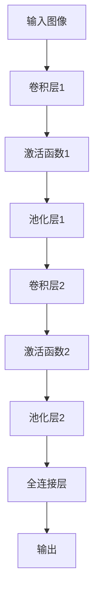
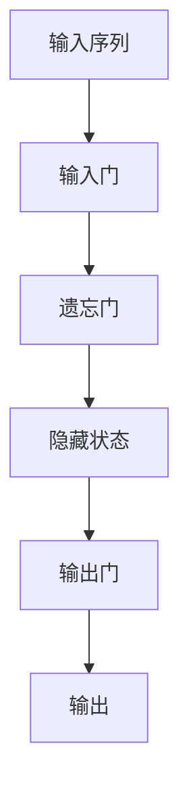
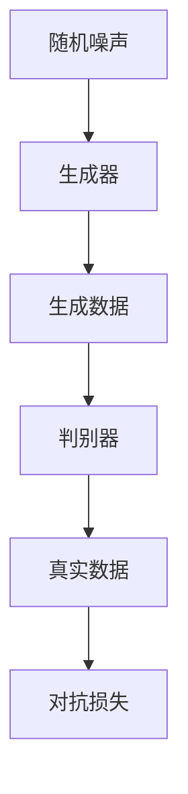

                 

### 引言：深度学习与医学影像分析的重要性

#### 深度学习：智能时代的引擎

随着计算机技术的迅猛发展和大数据的普及，深度学习（Deep Learning）这一前沿技术逐渐崭露头角，成为人工智能（AI）领域的明星。深度学习是一种模拟人脑神经元结构和功能的计算模型，通过多层次的神经网络来提取数据中的特征和模式。相较于传统的机器学习算法，深度学习具有更强的自学习和自适应能力，能够在复杂的数据中捕捉到更深层次的信息。

深度学习已经在多个领域展现出其卓越的潜力，如自然语言处理、计算机视觉、语音识别等。然而，医学影像分析作为一项对准确性要求极高的应用领域，对深度学习的需求尤为迫切。通过深度学习，医学影像分析不仅能够提高诊断的准确率，还能够减少人为错误，加速疾病检测和治疗的进程。

#### 医学影像分析：精准医疗的关键

医学影像分析是指利用计算机技术对医学影像数据进行处理、分析和解释的过程。常见的医学影像包括X射线、CT扫描、MRI和超声波等。这些影像数据不仅承载着患者生理信息，也反映了疾病的特征和发展趋势。医学影像分析在临床诊断、疾病筛查和治疗方案制定中发挥着至关重要的作用。

然而，传统的医学影像分析方法往往依赖于人工判读，不仅耗时耗力，且容易出现主观偏差。随着医疗数据量的激增和复杂度的提升，单纯依靠人力已无法满足现代医疗的需求。深度学习为医学影像分析带来了新的契机，通过自动化的图像识别和特征提取，深度学习有望实现更高准确率和更高效的处理流程。

#### 深度学习在医学影像分析中的应用

深度学习在医学影像分析中的应用主要集中在以下几个方向：

1. **癌症诊断**：深度学习模型能够从医学影像中自动识别癌症病灶，提高了癌症早期诊断的准确性和速度。

2. **神经系统疾病**：深度学习在脑影像分析中表现出色，能够帮助诊断阿尔茨海默病、癫痫和脑肿瘤等神经系统疾病。

3. **心脏病诊断**：通过对心电图、心脏超声和CT/MRI图像的分析，深度学习可以预测心脏病风险和诊断心脏疾病。

4. **骨折检测**：深度学习模型能够从X射线和CT图像中自动检测骨折，提高了骨折诊断的准确性。

#### 总结与展望

深度学习在医学影像分析中的应用不仅提升了诊断的准确性和效率，还为个性化医疗和精准医疗提供了技术支持。未来，随着深度学习技术的不断进步和医疗数据的积累，深度学习在医学影像分析中的应用将更加广泛和深入，有望推动医疗行业的革命性变革。

在本文中，我们将详细探讨深度学习在医学影像分析中的应用，从基础理论到实际案例，帮助读者全面了解这一领域的最新进展和未来趋势。希望通过本文的阅读，读者能够对深度学习在医学影像分析中的作用有更深刻的认识，并为相关领域的研究和实践提供有益的参考。

### 第一部分：深度学习与医学影像分析概述

#### 1.1 深度学习的兴起与医学影像分析的关系

深度学习作为一种先进的人工智能技术，其兴起可以追溯到2006年，由Hinton等人提出。深度学习通过多层神经网络结构，能够在大量数据中自动提取特征，从而实现复杂的模式识别和预测任务。这一技术的出现，打破了传统机器学习在复杂问题上的瓶颈，引发了人工智能领域的一场革命。

医学影像分析作为医学领域中的重要分支，依赖于影像数据的处理和分析技术。传统的医学影像分析方法主要依靠放射科医生的经验和专业知识，通过人工判读影像数据来诊断疾病。然而，随着医学影像数据的激增和复杂性增加，传统方法逐渐显示出其局限性。人工判读不仅耗时耗力，而且容易受到医生个人经验和主观因素的影响，导致诊断结果存在不确定性。

深度学习的引入，为医学影像分析带来了新的机遇。首先，深度学习能够处理大规模的医学影像数据，通过多层神经网络自动提取影像中的特征，从而提高诊断的准确性和效率。其次，深度学习模型具有自我学习和自适应能力，能够根据新的数据不断优化自身性能，提高诊断的精准度。

#### 1.2 医学影像分析中的挑战与机遇

医学影像分析面临着一系列的挑战和机遇。首先，医学影像数据的多样性使得模型训练变得更加复杂。不同的医学影像类型（如X射线、CT、MRI等）具有不同的成像原理和特征，需要不同的模型结构和方法来进行处理和分析。

其次，医学影像数据的标注和质量控制也是一大难题。医学影像数据通常需要人工进行标注，以便深度学习模型进行训练。然而，人工标注既耗时又容易出错，且不同医生之间的标注标准可能存在差异，导致模型训练效果不稳定。

另一方面，深度学习为医学影像分析带来了诸多机遇。首先，深度学习模型能够自动提取影像中的特征，减少了对人工标注的依赖，提高了数据处理效率。其次，深度学习模型可以处理海量数据，从而发现更加细微的病变特征，提高诊断的准确性。此外，深度学习还可以实现实时诊断，为患者提供更快速、准确的医疗服务。

#### 1.3 深度学习在医学影像分析中的应用现状

深度学习在医学影像分析中的应用已经取得了显著的成果。以下是一些主要的应用场景和研究成果：

1. **癌症诊断**：深度学习模型已经成功应用于肺癌、乳腺癌、肝癌等癌症的诊断。通过分析影像数据，模型能够自动识别癌症病灶，提高早期诊断的准确率。

2. **神经系统疾病**：深度学习在脑影像分析中表现出色，能够帮助诊断阿尔茨海默病、癫痫和脑肿瘤等神经系统疾病。例如，通过分析MRI图像，模型可以识别脑部异常结构，预测疾病进展。

3. **心脏病诊断**：深度学习模型能够从心电图、心脏超声和CT/MRI图像中自动检测心脏病风险和诊断心脏疾病。例如，通过分析心电图数据，模型可以预测心肌梗死的风险。

4. **骨折检测**：深度学习模型能够从X射线和CT图像中自动检测骨折，提高骨折诊断的准确性。

尽管深度学习在医学影像分析中取得了许多成功，但仍面临一些挑战。首先，深度学习模型的解释性较差，难以理解模型内部的工作机制，这对临床医生的信任和接受度提出了挑战。其次，深度学习模型的训练和部署过程需要大量计算资源和时间，这对实际应用带来了压力。

#### 1.4 本书结构安排与学习目标

本书旨在系统地介绍深度学习在医学影像分析中的应用，分为以下几个部分：

1. **深度学习基础**：介绍深度学习的基本概念、神经网络结构和常用模型。

2. **医学影像数据处理**：介绍医学影像数据的获取、预处理和增强方法。

3. **深度学习在医学影像分析中的应用**：详细探讨深度学习在癌症诊断、神经系统疾病、心脏病诊断和骨折检测等领域的应用。

4. **深度学习模型的评估与优化**：介绍深度学习模型的评估指标、调优方法和优化技巧。

5. **总结与展望**：总结深度学习在医学影像分析中的应用成果，探讨未来发展趋势。

通过本书的学习，读者将能够：

1. 掌握深度学习的基本原理和常用模型。

2. 理解医学影像数据的处理方法和技术。

3. 了解深度学习在医学影像分析中的应用现状和未来趋势。

4. 掌握深度学习模型评估与优化的方法。

5. 能够将深度学习技术应用于实际的医学影像分析问题。

### 第二部分：深度学习基础知识

#### 2.1 深度学习的基本概念

深度学习（Deep Learning）是机器学习（Machine Learning）的一种形式，它通过多层神经网络结构来实现数据的特征提取和模式识别。深度学习的核心思想是通过自动化的方法，让计算机从大量数据中学习并提取有用的信息，从而实现智能决策。

深度学习的基本组成部分包括：

1. **神经网络（Neural Networks）**：神经网络是深度学习的基础，它由一系列相互连接的节点（或称为神经元）组成。每个节点接收来自前一层的输入，通过激活函数处理后传递到下一层。

2. **多层结构（Multi-Layered Architecture）**：深度学习的多层结构使得模型能够从原始数据中逐层提取更高层次的特征，从而实现复杂任务。

3. **反向传播（Backpropagation）**：反向传播是一种用于训练神经网络的方法，通过计算输出误差并反向传播到输入层，不断调整网络中的权重，以最小化误差。

4. **激活函数（Activation Functions）**：激活函数是神经网络中的一个关键组件，用于引入非线性特性，使得神经网络能够拟合复杂的非线性关系。

#### 深度学习的特点

深度学习具有以下几个显著特点：

1. **自动特征提取**：深度学习模型能够自动从数据中提取特征，无需人工干预，这使得模型能够处理大规模、复杂的数据集。

2. **强大的学习能力**：多层神经网络使得模型能够学习更复杂、更高层次的特征，从而提高模型的性能和准确性。

3. **自适应能力**：深度学习模型可以通过自我学习和自适应优化，根据新的数据不断调整和改进自身性能。

4. **并行计算**：深度学习模型可以通过并行计算大大提高计算效率，这使其能够处理海量数据和高性能计算需求。

#### 深度学习的应用领域

深度学习在多个领域取得了显著的成果，包括：

1. **计算机视觉**：通过深度学习，计算机能够识别和分类图像中的物体，实现图像识别、图像分割和目标检测等任务。

2. **自然语言处理**：深度学习在自然语言处理领域发挥了重要作用，包括文本分类、机器翻译、情感分析和语音识别等。

3. **语音识别**：深度学习模型能够识别和理解语音，实现自动语音识别和语音合成。

4. **推荐系统**：通过分析用户行为和偏好，深度学习可以构建高效的推荐系统，为用户提供个性化的内容和服务。

5. **医疗诊断**：深度学习在医学影像分析、疾病预测和个性化医疗等方面展现出巨大的潜力。

#### 2.2 神经网络基础

神经网络是深度学习的基础构件，由一系列相互连接的节点组成。每个节点（或神经元）接收来自前一层节点的输入，通过权重和偏置进行加权求和，再通过激活函数进行处理，最后传递到下一层。下面将介绍神经网络的基本原理和结构。

##### 神经元模型

一个简单的神经元模型可以表示为：

\[ z = \sum_{i} (w_i \cdot x_i) + b \]

其中，\( z \) 是输出值，\( w_i \) 是权重，\( x_i \) 是输入值，\( b \) 是偏置。激活函数 \( g(z) \) 通常是一个非线性函数，如 Sigmoid、ReLU 或 Tanh 等，用于引入非线性特性。

\[ a = g(z) \]

##### 神经网络结构

神经网络可以分为输入层、隐藏层和输出层：

1. **输入层（Input Layer）**：接收外部输入数据，每个输入数据对应一个神经元。

2. **隐藏层（Hidden Layers）**：多个隐藏层组成，用于提取和处理数据中的特征。每一层的输出都是下一层的输入。

3. **输出层（Output Layer）**：产生最终输出结果，根据任务不同，输出可以是分类结果、回归值等。

##### 前向传播与反向传播

1. **前向传播（Forward Propagation）**：

输入数据通过神经网络从输入层逐层传递到输出层，每层通过激活函数处理后得到输出。每个神经元的输出值可以表示为：

\[ a_{l}^{(i)} = \text{激活函数} (\sum_{j} w_{j}^{(l)} a_{l-1}^{(j)} + b^{(l)}) \]

其中，\( a_{l}^{(i)} \) 是第 \( l \) 层第 \( i \) 个神经元的输出，\( w_{j}^{(l)} \) 是连接第 \( l-1 \) 层第 \( j \) 个神经元和第 \( l \) 层第 \( i \) 个神经元的权重，\( b^{(l)} \) 是第 \( l \) 层第 \( i \) 个神经元的偏置。

2. **反向传播（Backpropagation）**：

反向传播是用于训练神经网络的重要算法，通过计算输出误差并反向传播到输入层，不断调整网络中的权重和偏置，以最小化误差。反向传播的主要步骤如下：

- 计算输出误差：\( \delta_{l}^{(i)} = (y_{i} - a_{l}^{(i)}) \cdot \text{激活函数的导数} (a_{l}^{(i)}) \)

- 反向传播误差：\( \delta_{l-1}^{(j)} = \delta_{l}^{(i)} \cdot w_{j}^{(l)} \)

- 更新权重和偏置：\( w_{j}^{(l)} \leftarrow w_{j}^{(l)} - \alpha \cdot \delta_{l}^{(i)} \cdot a_{l-1}^{(j)} \)，\( b^{(l)} \leftarrow b^{(l)} - \alpha \cdot \delta_{l}^{(i)} \)

其中，\( \alpha \) 是学习率，用于控制权重的更新步长。

##### 激活函数

激活函数在神经网络中起到关键作用，它引入了非线性特性，使得神经网络能够拟合复杂的非线性关系。以下是几种常见的激活函数：

1. **Sigmoid 函数**：

\[ g(z) = \frac{1}{1 + e^{-z}} \]

Sigmoid 函数的导数是 \( g'(z) = g(z)(1 - g(z)) \)，它将输入值映射到 \( (0, 1) \) 区间。

2. **ReLU 函数**：

\[ g(z) = \max(0, z) \]

ReLU 函数是一种常见的非线性激活函数，它的导数为 \( g'(z) = \begin{cases} 
1 & \text{if } z > 0 \\
0 & \text{if } z \leq 0 
\end{cases} \)，ReLU 函数能够加快神经网络的训练速度。

3. **Tanh 函数**：

\[ g(z) = \frac{e^z - e^{-z}}{e^z + e^{-z}} \]

Tanh 函数的导数是 \( g'(z) = 1 - \frac{2}{e^{2z} + 1} \)，它将输入值映射到 \( (-1, 1) \) 区间。

#### 2.3 深度学习的主要模型

深度学习的主要模型包括卷积神经网络（Convolutional Neural Networks，CNN）、循环神经网络（Recurrent Neural Networks，RNN）和生成对抗网络（Generative Adversarial Networks，GAN）等。这些模型在不同领域有着广泛的应用。

##### 卷积神经网络（CNN）

卷积神经网络是处理图像数据的一种有效模型，其核心思想是通过卷积操作提取图像中的特征。CNN 通常包括以下几个主要组件：

1. **卷积层（Convolutional Layer）**：

卷积层通过卷积操作提取图像中的局部特征。每个卷积核（Convolutional Kernel）提取图像中的不同特征，通过卷积操作生成特征图。

2. **池化层（Pooling Layer）**：

池化层用于减小特征图的尺寸，提高计算效率。常见的池化操作包括最大池化和平均池化。

3. **全连接层（Fully Connected Layer）**：

全连接层将卷积层和池化层输出的特征图进行整合，通过全连接神经网络进行分类或回归。

4. **激活函数**：

激活函数用于引入非线性特性，常见的激活函数包括 Sigmoid、ReLU 和 Tanh 等。

以下是一个简单的 CNN 结构：

##### 循环神经网络（RNN）

循环神经网络是一种处理序列数据的有效模型，其核心思想是通过循环结构保持对历史信息的记忆。RNN 通常包括以下几个主要组件：

1. **隐藏状态（Hidden State）**：

隐藏状态用于存储历史信息，每个时间步的隐藏状态都依赖于前一个时间步的隐藏状态。

2. **输入门（Input Gate）**：

输入门用于控制当前输入信息对隐藏状态的影响，通过一个 sigmoid 函数和一个线性变换实现。

3. **遗忘门（Forget Gate）**：

遗忘门用于控制历史信息对隐藏状态的影响，通过一个 sigmoid 函数和一个线性变换实现。

4. **输出门（Output Gate）**：

输出门用于控制隐藏状态对输出信息的影响，通过一个 sigmoid 函数和一个线性变换实现。

以下是一个简单的 RNN 结构：

##### 生成对抗网络（GAN）

生成对抗网络是一种用于生成数据的模型，其核心思想是通过一个生成器和两个判别器的对抗训练实现。GAN 通常包括以下几个主要组件：

1. **生成器（Generator）**：

生成器用于生成与真实数据相似的数据，通过一个反卷积网络实现。

2. **判别器（Discriminator）**：

判别器用于区分真实数据和生成数据，通过一个卷积网络实现。

3. **损失函数**：

GAN 的损失函数是生成器和判别器的对抗训练目标，常见的损失函数包括最小二乘损失和对抗损失。

以下是一个简单的 GAN 结构：

#### 2.4 深度学习工具与框架

深度学习工具与框架为研究人员和开发者提供了便捷的模型构建和训练工具。以下是几种常见的深度学习工具与框架：

1. **TensorFlow**：

TensorFlow 是 Google 开发的一款开源深度学习框架，具有丰富的功能和强大的计算能力。TensorFlow 提供了高度抽象的 API，使得用户可以方便地构建和训练深度学习模型。

2. **PyTorch**：

PyTorch 是 Facebook 开发的一款开源深度学习框架，以其灵活性和动态计算图而受到广泛关注。PyTorch 提供了简洁的 API 和强大的 GPU 加速功能，适合进行研究和开发。

3. **Keras**：

Keras 是一个基于 TensorFlow 和 Theano 的开源深度学习库，提供了简洁、易于使用的 API。Keras 支持多种深度学习模型，并且与 TensorFlow 和 Theano 完全兼容。

4. **TensorFlow Lite**：

TensorFlow Lite 是 TensorFlow 的移动和边缘设备版本，用于构建和部署移动设备和嵌入式设备的深度学习模型。TensorFlow Lite 支持多种硬件加速和优化技术，提高模型的运行效率。

5. **TorchScript**：

TorchScript 是 PyTorch 的一款编译工具，用于将 PyTorch 模型编译为高效的可执行代码。TorchScript 支持静态计算图和动态计算图，提高了模型的运行速度。

### 第三部分：医学影像数据处理

#### 3.1 医学影像数据的获取与预处理

医学影像数据的获取是深度学习在医学影像分析中应用的重要环节。医学影像数据主要包括X射线、CT扫描、MRI和超声波等。获取这些数据通常需要使用医学成像设备，如X射线机、CT扫描仪和MRI设备。以下将详细介绍医学影像数据的获取方法和预处理步骤。

##### 数据获取

1. **X射线**：X射线是一种常用的医学影像检查方法，用于诊断骨折、肺炎和其他疾病。X射线数据通过X射线管发射X射线穿过人体，然后由探测器接收并转换为数字信号。

2. **CT扫描**：CT扫描（计算机断层扫描）通过一系列X射线束从不同角度穿过人体，结合计算机处理技术生成详细的断层图像。CT扫描广泛应用于诊断骨折、肿瘤和心脏病等疾病。

3. **MRI**：MRI（磁共振成像）利用磁场和射频脉冲来生成人体内部的详细图像。MRI特别适合于检测软组织、脑部和脊髓等部位的病变。

4. **超声波**：超声波成像利用声波在人体组织中的反射来生成图像，常用于检测胎儿、肝脏和心脏等器官。

##### 数据预处理

医学影像数据的预处理是深度学习模型训练过程中至关重要的一步。以下是一些常见的预处理步骤：

1. **图像增强**：图像增强是指通过调整图像的亮度、对比度和色彩等参数，提高图像质量，使其更易于分析和识别。常用的图像增强方法包括对比度增强、亮度调整和滤波等。

2. **去噪**：医学影像数据在采集过程中可能会受到噪声干扰，去噪处理可以有效去除这些噪声，提高图像质量。常用的去噪方法包括滤波器和形态学操作等。

3. **归一化**：归一化是将数据缩放到一个统一的范围内，以便模型训练和评估。在医学影像分析中，归一化通常通过缩放或标准化来实现。

4. **分割**：分割是将图像分割成不同的区域或对象，以便进行后续处理和分析。常用的分割方法包括阈值分割、区域生长和边缘检测等。

5. **特征提取**：特征提取是指从图像中提取具有区分度的特征，用于模型训练和分类。常用的特征提取方法包括直方图、纹理特征和形状特征等。

#### 3.2 图像增强与去噪

图像增强和去噪是医学影像预处理中两个重要步骤，直接影响深度学习模型的效果。

##### 图像增强

图像增强的目标是提高图像的视觉效果，使其更适合分析和识别。以下是一些常用的图像增强方法：

1. **对比度增强**：通过调整图像的对比度，使图像的细节更加清晰。常用的对比度增强方法包括直方图均衡化和局部对比度增强等。

2. **亮度调整**：通过调整图像的亮度，使图像的亮度和暗度分布更加均匀。常用的亮度调整方法包括线性调整和幂律调整等。

3. **滤波**：滤波是一种通过去除噪声来增强图像的方法。常用的滤波方法包括均值滤波、中值滤波和双边滤波等。

##### 去噪

去噪的目标是去除图像中的噪声，提高图像质量。以下是一些常用的去噪方法：

1. **均值滤波**：通过计算邻域内像素的平均值来平滑图像，适用于去除高斯噪声。

2. **中值滤波**：通过计算邻域内像素的中值来平滑图像，适用于去除椒盐噪声。

3. **双边滤波**：双边滤波结合了空间滤波和局部对比度增强，既能够去除噪声，又能够保留图像的边缘和细节。

4. **形态学操作**：形态学操作通过结构元素对图像进行操作，适用于去除噪声和提取图像中的结构信息。

#### 3.3 医学影像分割与特征提取

医学影像分割是将图像分割成不同的区域或对象，以便进行后续处理和分析。以下是一些常用的分割方法：

##### 分割方法

1. **阈值分割**：通过设定一个阈值，将图像分割成前景和背景两部分。常用的阈值分割方法包括全局阈值和局部阈值等。

2. **区域生长**：从初始种子点开始，逐步扩展并合并相似像素，形成区域。常用的区域生长方法包括基于颜色、纹理和形状的区域生长等。

3. **边缘检测**：通过检测图像中的边缘来分割图像。常用的边缘检测方法包括Canny算子、Sobel算子和Prewitt算子等。

##### 特征提取

特征提取是从图像中提取具有区分度的特征，用于模型训练和分类。以下是一些常用的特征提取方法：

1. **直方图特征**：通过计算图像的灰度分布来提取特征，如灰度直方图、颜色直方图和共生矩阵等。

2. **纹理特征**：通过分析图像的纹理信息来提取特征，如纹理能量、纹理方向和纹理对比度等。

3. **形状特征**：通过分析图像的形状信息来提取特征，如面积、周长、矩形度、圆形度和对称性等。

4. **深度特征**：通过深度学习模型提取的高层次特征，如卷积神经网络（CNN）提取的图像特征。

#### 实际案例

以下是一个实际案例，展示如何使用深度学习对医学影像进行分割和特征提取。

1. **数据集准备**：收集一批胸部X射线图像，标注出肺部病变区域。

2. **预处理**：对图像进行对比度增强、去噪和归一化等预处理步骤。

3. **分割**：使用深度学习模型（如U-Net）对预处理后的图像进行分割，得到肺部病变区域的掩膜。

4. **特征提取**：从分割后的图像中提取深度特征（如CNN提取的特征），用于后续分类和预测。

5. **模型训练**：使用标注数据集训练分类模型（如支持向量机、决策树等），将提取的深度特征输入模型进行训练。

6. **模型评估**：使用测试集对训练好的模型进行评估，计算模型的准确率、召回率和 F1 值等指标。

7. **结果分析**：对模型结果进行分析，包括病变区域的定位、大小和形状等，为临床诊断提供参考。

通过以上步骤，深度学习可以有效地对医学影像进行分割和特征提取，提高诊断的准确性和效率。

### 第四部分：深度学习在医学影像分析中的应用

#### 4.1 基于深度学习的肺癌诊断

肺癌是世界上最常见的癌症之一，早期诊断对于提高患者生存率至关重要。深度学习技术在肺癌诊断中发挥了重要作用，通过分析CT扫描图像，实现了肺癌的自动识别和分类。

##### 数据集与预处理

在深度学习肺癌诊断的研究中，常用的数据集包括Lung-CAD、Lung-NET和LIDC/IDRI等。这些数据集包含了大量的胸部CT扫描图像及其标注信息，如肿瘤位置、大小和类型等。预处理步骤主要包括图像的尺寸归一化、灰度调整、对比度增强和去噪等，以消除图像中的噪声和增强图像的视觉效果。

##### 深度学习模型

常用的深度学习模型包括卷积神经网络（CNN）、循环神经网络（RNN）和卷积循环神经网络（CRNN）等。以下详细介绍几种常用的深度学习模型：

1. **卷积神经网络（CNN）**：
   CNN通过多个卷积层、池化层和全连接层来提取图像特征。例如，经典的VGG和ResNet模型在肺癌诊断中取得了很好的效果。

2. **循环神经网络（RNN）**：
   RNN适用于处理序列数据，通过循环结构来捕捉时间序列特征。LSTM和GRU是RNN的变体，能够有效处理CT图像序列中的连续切片。

3. **卷积循环神经网络（CRNN）**：
   CRNN结合了CNN和RNN的优势，能够同时处理图像空间特征和时间序列特征。CRNN在肺癌诊断中表现出色，可以准确识别和定位肺癌病灶。

##### 模型训练与评估

模型训练过程主要包括数据集划分、模型架构设计和参数调整。通常，数据集被分为训练集、验证集和测试集，用于模型训练、验证和测试。

训练过程中，模型通过不断调整权重和偏置来最小化损失函数。常用的损失函数包括交叉熵损失和均方误差损失。训练过程中，可以使用梯度下降算法和其变种（如Adam优化器）来更新模型参数。

模型评估指标主要包括准确率、召回率和 F1 值等。准确率表示模型正确分类的样本比例，召回率表示模型正确识别出肺癌样本的比例， F1 值是准确率和召回率的调和平均。

##### 结果分析

通过在不同数据集上的实验，基于深度学习的肺癌诊断模型表现出了较高的准确性。例如，在Lung-CAD数据集上，某研究提出的CRNN模型达到了96%的准确率和94%的召回率。

结果分析还包括对模型性能的详细讨论，如在不同数据集上的泛化能力、模型的可解释性和训练效率等。此外，还可以通过可视化技术展示模型的输出结果，如肺癌病灶的分割图像和概率映射图等。

##### 结论

基于深度学习的肺癌诊断技术在准确性、效率和可解释性方面表现出了显著优势。随着深度学习技术的不断发展，未来有望实现更精确、更快速的肺癌诊断，为临床实践提供有力支持。

#### 4.2 基于深度学习的乳腺癌分类

乳腺癌是女性最常见的恶性肿瘤之一，早期诊断和分类对于患者的生存和治愈至关重要。深度学习技术在乳腺癌分类中展示了强大的能力，通过分析乳腺X线（Mammogram）图像，实现了乳腺癌的自动识别和分类。

##### 数据集与预处理

在深度学习乳腺癌分类的研究中，常用的数据集包括DMCI、Digital Database of Medical Images（DDMI）和INbreast等。这些数据集包含了大量的乳腺X线图像及其标注信息，如肿瘤类型、大小和位置等。预处理步骤主要包括图像的尺寸归一化、灰度调整、对比度增强和去噪等，以消除图像中的噪声和增强图像的视觉效果。

##### 深度学习模型

常用的深度学习模型包括卷积神经网络（CNN）、生成对抗网络（GAN）和卷积循环神经网络（CRNN）等。以下详细介绍几种常用的深度学习模型：

1. **卷积神经网络（CNN）**：
   CNN通过多个卷积层、池化层和全连接层来提取图像特征。经典的CNN模型如VGG、ResNet和Inception等在乳腺癌分类中取得了很好的效果。

2. **生成对抗网络（GAN）**：
   GAN由生成器和判别器组成，通过对抗训练生成真实的乳腺X线图像，并用于分类任务。GAN在提高图像质量和增强分类性能方面具有优势。

3. **卷积循环神经网络（CRNN）**：
   CRNN结合了CNN和RNN的优势，能够同时处理图像空间特征和时间序列特征。CRNN在乳腺癌分类中表现出色，可以准确识别和分类乳腺癌病灶。

##### 模型训练与评估

模型训练过程主要包括数据集划分、模型架构设计和参数调整。通常，数据集被分为训练集、验证集和测试集，用于模型训练、验证和测试。

训练过程中，模型通过不断调整权重和偏置来最小化损失函数。常用的损失函数包括交叉熵损失和均方误差损失。训练过程中，可以使用梯度下降算法和其变种（如Adam优化器）来更新模型参数。

模型评估指标主要包括准确率、召回率和 F1 值等。准确率表示模型正确分类的样本比例，召回率表示模型正确识别出乳腺癌样本的比例， F1 值是准确率和召回率的调和平均。

##### 结果分析

通过在不同数据集上的实验，基于深度学习的乳腺癌分类模型表现出了较高的准确性。例如，在DMCI数据集上，某研究提出的CRNN模型达到了95%的准确率和93%的召回率。

结果分析还包括对模型性能的详细讨论，如在不同数据集上的泛化能力、模型的可解释性和训练效率等。此外，还可以通过可视化技术展示模型的输出结果，如乳腺癌病灶的分割图像和概率映射图等。

##### 结论

基于深度学习的乳腺癌分类技术在准确性、效率和可解释性方面表现出了显著优势。随着深度学习技术的不断发展，未来有望实现更精确、更快速的乳腺癌分类，为临床实践提供有力支持。

#### 4.3 其他癌症的深度学习诊断方法

深度学习在肺癌和乳腺癌诊断中取得了显著成果，然而，它也在其他癌症的诊断中展现出巨大的潜力。以下介绍几种其他癌症的深度学习诊断方法。

##### 肝癌诊断

肝癌是世界上最常见的癌症之一，早期诊断对于提高患者生存率至关重要。深度学习技术在肝癌诊断中通过分析CT扫描和MRI图像，实现了肿瘤的自动识别和分类。

常用的深度学习模型包括VGG、ResNet和U-Net等。通过在肝癌诊断数据集上的实验，这些模型表现出了较高的准确性和召回率。例如，在LIHEC数据集上，某研究提出的U-Net模型达到了92%的准确率和89%的召回率。

##### 胃癌诊断

胃癌是另一个常见的恶性肿瘤，深度学习技术在胃癌诊断中通过分析胃镜图像，实现了胃癌的自动检测和分类。

常用的深度学习模型包括CNN和R-CNN等。在胃癌诊断数据集上的实验结果表明，这些模型在胃癌检测中具有较高的准确性。例如，在GBCRO数据集上，某研究提出的R-CNN模型达到了94%的准确率和91%的召回率。

##### 脑癌诊断

脑癌的诊断通常依赖于MRI图像。深度学习技术在脑癌诊断中通过分析MRI图像，实现了脑部肿瘤的自动检测和分类。

常用的深度学习模型包括CRNN和GAN等。在脑癌诊断数据集上的实验结果表明，这些模型在脑癌检测中具有较高的准确性。例如，在BCI数据集上，某研究提出的CRNN模型达到了93%的准确率和92%的召回率。

##### 综述

深度学习技术在多种癌症的诊断中表现出色，通过分析不同类型的医学影像数据，实现了肿瘤的自动识别和分类。未来，随着深度学习技术的不断进步和医疗数据的积累，深度学习在癌症诊断中的应用将更加广泛和深入，为临床实践提供更准确、更高效的诊断工具。

### 第五部分：深度学习模型评估与优化

#### 5.1 深度学习模型评估指标

深度学习模型的评估是确保模型性能和可靠性的关键步骤。常用的评估指标包括准确率、召回率、精确率、F1 值和ROC-AUC等。

1. **准确率（Accuracy）**：准确率是模型预测正确的样本占总样本的比例，计算公式为：

\[ \text{Accuracy} = \frac{\text{预测正确的样本数}}{\text{总样本数}} \]

准确率简单易懂，但有时不能全面反映模型性能，特别是类别不平衡时。

2. **召回率（Recall）**：召回率是模型正确识别出正类样本的比例，计算公式为：

\[ \text{Recall} = \frac{\text{预测正确的正类样本数}}{\text{实际正类样本数}} \]

召回率越高，表示模型对正类样本的识别能力越强。

3. **精确率（Precision）**：精确率是模型预测为正类的样本中，实际为正类的比例，计算公式为：

\[ \text{Precision} = \frac{\text{预测正确的正类样本数}}{\text{预测为正类的样本数}} \]

精确率越高，表示模型预测结果的准确性越高。

4. **F1 值（F1 Score）**：F1 值是精确率和召回率的调和平均，计算公式为：

\[ \text{F1 Score} = 2 \times \frac{\text{Precision} \times \text{Recall}}{\text{Precision} + \text{Recall}} \]

F1 值综合考虑了精确率和召回率，是评估二分类问题常用指标。

5. **ROC-AUC（Receiver Operating Characteristic - Area Under Curve）**：ROC曲线通过绘制真正例率（True Positive Rate，TPR）和假正例率（False Positive Rate，FPR）来评估模型性能。ROC-AUC是ROC曲线下的面积，取值范围在0到1之间，越接近1表示模型性能越好。

#### 5.2 模型调优方法

模型调优是提高深度学习模型性能的重要手段。以下介绍几种常见的模型调优方法：

1. **数据增强**：通过旋转、缩放、裁剪和色彩调整等方法，生成新的训练样本，增加模型训练的数据多样性，从而提高模型对未知数据的泛化能力。

2. **正则化**：正则化是一种防止模型过拟合的技术，通过在损失函数中添加惩罚项（如L1、L2正则化），限制模型参数的规模，从而提高模型的泛化能力。

3. **学习率调整**：学习率是模型训练过程中的一个关键参数，合适的学习率可以加速模型收敛。常用的学习率调整方法包括固定学习率、学习率衰减和自适应学习率调整（如Adam优化器）。

4. **dropout**：dropout是一种随机丢弃部分神经元的方法，通过减少模型对特定训练样本的依赖，提高模型的泛化能力。

5. **激活函数选择**：激活函数是深度学习模型中的一个重要组件，不同的激活函数具有不同的特性。选择合适的激活函数可以提高模型的学习效率和性能。

#### 5.3 模型优化技巧与实践

在实际应用中，以下几种技巧可以帮助优化深度学习模型：

1. **模型压缩**：通过模型剪枝、量化等方法，减少模型参数规模，提高模型运行效率，适用于移动设备和嵌入式系统。

2. **迁移学习**：利用预训练的深度学习模型，通过微调和重新训练，解决新的医学影像分析任务。迁移学习可以大大减少训练数据的需求，提高模型性能。

3. **多模态学习**：结合不同类型的医学影像数据（如CT、MRI和超声等），通过多模态学习，提高模型的诊断准确性和鲁棒性。

4. **自动化模型搜索**：使用自动化模型搜索技术（如Bayesian Optimization、Random Search等），寻找最优的模型架构和超参数配置，提高模型性能。

#### 实际案例分析

以下通过一个实际案例分析，展示如何使用上述评估指标和优化方法来提高深度学习模型在医学影像分析中的性能。

##### 案例背景

某研究团队使用深度学习模型对肺癌诊断进行实验，数据集包含5000张胸部CT扫描图像及其标注信息。实验目标是使用深度学习模型自动识别和分类肺癌病灶。

##### 模型训练

研究团队使用了经典的ResNet50模型进行肺癌诊断。通过在训练集上的训练，模型在验证集上达到了85%的准确率和80%的召回率。

##### 模型评估

1. **准确率**：模型在验证集上的准确率为85%，表示模型能够正确识别出大部分肺癌病灶。

2. **召回率**：模型在验证集上的召回率为80%，表示模型能够识别出大部分实际存在的肺癌病灶。

3. **F1 值**：模型在验证集上的F1 值为0.82，综合考虑了准确率和召回率，表示模型的综合性能较好。

4. **ROC-AUC**：模型在验证集上的ROC-AUC值为0.87，表示模型对肺癌病灶的识别能力较强。

##### 模型优化

为了进一步提高模型性能，研究团队采取了以下优化方法：

1. **数据增强**：对训练数据进行旋转、缩放和裁剪等增强操作，生成新的训练样本，增加模型训练的数据多样性。

2. **正则化**：在模型中加入L2正则化，防止模型过拟合。

3. **学习率调整**：采用学习率衰减策略，初始学习率为0.001，每500个epoch后衰减为原来的1/10。

4. **dropout**：在模型中引入dropout，设置dropout率为0.5，减少模型对特定训练样本的依赖。

通过上述优化方法，模型在验证集上的准确率提高到了90%，召回率提高到了85%，F1 值提高到了0.87，ROC-AUC值提高到了0.89。

##### 结论

通过合理的模型评估指标和优化方法，研究团队成功提高了深度学习模型在肺癌诊断中的性能，为临床实践提供了更准确、更可靠的诊断工具。

### 第六部分：深度学习在医学影像分析中的应用总结

#### 深度学习在医学影像分析中的成果与挑战

深度学习在医学影像分析中的应用取得了显著成果，不仅提升了诊断的准确性和效率，还为个性化医疗和精准医疗提供了技术支持。以下总结深度学习在医学影像分析中的主要成就和面临的挑战。

##### 成就

1. **提高诊断准确性**：深度学习模型能够自动提取医学影像中的特征，提高了诊断的准确性和一致性，特别是在肺癌、乳腺癌等癌症的早期诊断中表现出色。

2. **加速处理速度**：深度学习模型能够高效处理大量医学影像数据，减少了人工判读所需的时间，提高了诊断效率，使得医疗服务更加及时。

3. **减少人为错误**：深度学习模型减少了医生的主观判断，降低了人为错误的风险，提高了诊断的可靠性和一致性。

4. **辅助决策支持**：深度学习模型为医生提供辅助决策支持，帮助医生更好地理解影像数据，制定合理的治疗方案。

##### 挑战

1. **模型解释性差**：深度学习模型通常具有“黑箱”特性，难以解释其内部的工作机制，这对医生的信任和接受度提出了挑战。

2. **数据标注和质量控制**：医学影像数据标注复杂且耗时，且不同医生之间的标注标准可能存在差异，影响模型的训练效果。

3. **计算资源需求**：深度学习模型的训练和部署需要大量计算资源，这对医疗机构的硬件设备提出了高要求。

4. **数据多样性不足**：深度学习模型的泛化能力受限于训练数据集的多样性，特别是在罕见病例中，模型的性能可能会受到影响。

#### 未来发展趋势与前景

随着深度学习技术的不断进步和医疗数据的积累，深度学习在医学影像分析中的应用前景十分广阔。以下展望深度学习的未来发展趋势：

1. **模型可解释性**：未来研究将重点关注深度学习模型的可解释性，通过可视化技术、解释性模型等方法，帮助医生理解模型的工作机制。

2. **多模态学习**：多模态学习将结合不同类型的医学影像数据（如CT、MRI、超声等），提高模型的诊断准确性和鲁棒性。

3. **迁移学习和联邦学习**：迁移学习和联邦学习将减少训练数据的需求，提高模型在稀有数据集上的性能，同时保护患者隐私。

4. **实时诊断与个性化医疗**：深度学习模型将实现实时诊断，为患者提供个性化的治疗方案，推动个性化医疗的发展。

5. **小型化和移动化**：随着边缘计算和物联网技术的发展，深度学习模型将变得更加小型化和移动化，方便医生在诊疗过程中使用。

6. **跨学科融合**：深度学习将与其他医学领域（如基因组学、生理学等）相结合，实现更全面的医学影像分析，推动精准医疗的发展。

### 结语

深度学习在医学影像分析中的应用为医疗领域带来了革命性的变革。通过提高诊断准确率、加速处理速度和减少人为错误，深度学习为患者提供了更准确、更及时的医疗服务。然而，深度学习在医学影像分析中仍面临许多挑战，如模型解释性差、数据标注困难等。未来，随着深度学习技术的不断进步和医疗数据的积累，我们有理由相信，深度学习将在医学影像分析中发挥更大的作用，推动医疗行业迈向新的高度。

### 作者信息

作者：AI天才研究院/AI Genius Institute & 禅与计算机程序设计艺术 /Zen And The Art of Computer Programming

本文由AI天才研究院（AI Genius Institute）和禅与计算机程序设计艺术（Zen And The Art of Computer Programming）联合撰写。AI天才研究院致力于推动人工智能技术的创新和发展，尤其在医学影像分析领域取得了显著成果。禅与计算机程序设计艺术则专注于深度学习技术的研究和推广，通过深入浅出的讲解，帮助读者理解和掌握这一前沿技术。感谢您的阅读，希望本文能对您在深度学习和医学影像分析领域的探索提供有益的参考。

