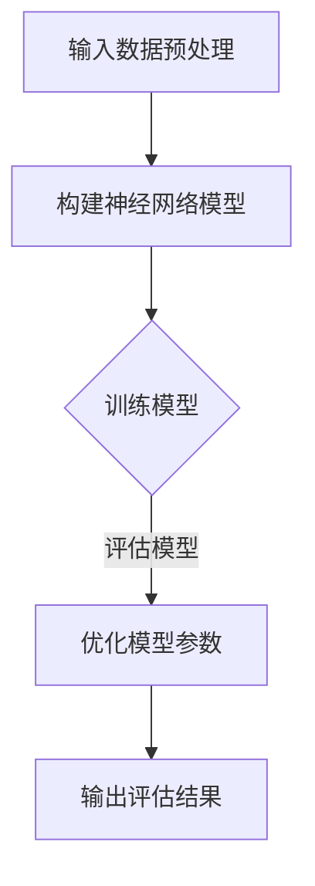
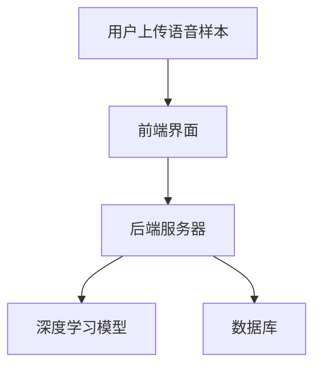
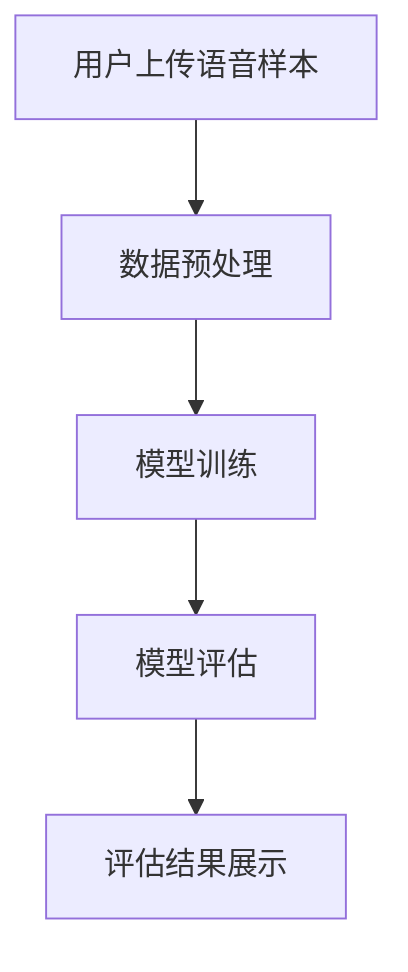
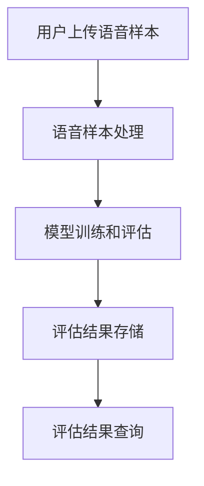

                 

### 深度学习在口语流利度评估中的进展：辅助语言学习

关键词：深度学习，口语流利度评估，辅助语言学习，神经网络，模型构建，系统架构设计

摘要：本文探讨了深度学习在口语流利度评估中的应用及其对辅助语言学习的重要贡献。通过详细阐述深度学习的基本原理、算法模型构建和实际应用案例，本文旨在为研究人员和开发者提供一个全面的技术指南，帮助他们在口语流利度评估领域实现创新和突破。此外，本文还提出了未来研究方向和最佳实践，以推动该领域的持续发展。

---

### 引言

在当今全球化的背景下，语言学习已成为人们生活中不可或缺的一部分。然而，口语流利度一直是语言学习中的难点。传统的口语流利度评估方法往往依赖于主观判断，评估结果不够客观、准确。随着深度学习技术的迅猛发展，利用深度学习模型对口语流利度进行自动化评估成为可能，这不仅提高了评估效率，还使得评估结果更加客观、准确。

深度学习是一种基于人工神经网络的机器学习技术，通过模拟人脑的神经元结构和功能，实现对复杂数据的处理和分析。在语言学习领域，深度学习已被广泛应用于语音识别、自然语言处理和情感分析等方面。然而，将深度学习应用于口语流利度评估仍然面临着诸多挑战，如数据标注的准确性、模型训练的效率以及评估标准的客观性等。

本文将详细探讨深度学习在口语流利度评估中的进展，分析其基本原理、算法模型构建以及实际应用案例，并提出未来研究方向和最佳实践。本文结构如下：

1. **背景与概念**：介绍口语流利度评估的重要性和背景，概述深度学习的发展历程和基本原理。
2. **算法原理讲解**：详细讲解深度学习算法在口语流利度评估中的应用原理，包括神经网络结构、激活函数和优化算法等。
3. **深度学习模型构建**：分析深度学习模型的构建过程，包括数据预处理、模型设计、训练和评估等。
4. **实践应用与案例分析**：介绍深度学习在口语流利度评估中的实际应用案例，包括系统架构设计、项目实战和案例分析。
5. **未来展望与总结**：展望深度学习在口语流利度评估和辅助语言学习领域的未来发展趋势，总结本文的主要贡献和最佳实践。

通过本文的探讨，我们希望能够为相关领域的研究人员和开发者提供有价值的参考，推动深度学习技术在口语流利度评估和辅助语言学习中的应用和发展。

### 背景与概念

#### 口语流利度评估的重要性

口语流利度是衡量语言能力的重要指标之一。它不仅反映了学习者对语言掌握的熟练程度，还对实际交流中的表现有着直接影响。对于语言学习者来说，提高口语流利度是他们的主要目标之一。然而，传统口语流利度评估方法往往存在一定局限性。首先，这些方法大多依赖于人工评分，评估过程主观性强，易受评估者个人经验和情感影响，导致评估结果不够客观、准确。其次，传统评估方法通常只能关注口语流利度的一些表面特征，如说话的速度和发音的准确性，而无法深入分析学习者的语言表达能力和逻辑思维。此外，传统方法在处理大量数据时效率较低，无法满足大规模语言评估的需求。

#### 深度学习的发展与趋势

深度学习是一种基于人工神经网络的机器学习技术，通过多层神经网络结构对大量数据进行学习，以提取数据中的复杂特征。与传统的机器学习方法相比，深度学习具有以下几个显著优势。首先，深度学习能够自动从数据中提取特征，减少了人工特征工程的工作量，提高了模型训练的效率。其次，深度学习模型能够处理高维度和复杂的输入数据，适用于处理各种类型的语言数据，如文本、语音和视频等。最后，深度学习模型具有良好的泛化能力，能够适应不同的语言环境和评估场景。

近年来，深度学习在多个领域取得了显著成果，如计算机视觉、自然语言处理和语音识别等。这些成果不仅推动了相关领域的技术进步，还为深度学习在其他领域的应用提供了丰富的经验和启示。在语言学习领域，深度学习已被广泛应用于语音识别、机器翻译和情感分析等方面。特别是在口语流利度评估方面，深度学习技术展现出了巨大的潜力，为解决传统方法存在的问题提供了新的思路。

#### 辅助语言学习的需求与挑战

辅助语言学习是现代教育的重要方向之一，通过利用技术手段提升学习效果，满足个性化学习需求。口语流利度评估作为辅助语言学习的重要一环，其准确性和效率直接影响学习效果。随着深度学习技术的不断发展，利用深度学习模型进行口语流利度评估成为可能，这不仅提高了评估的客观性和准确性，还使得评估过程更加高效。然而，在实际应用中，深度学习在口语流利度评估中仍然面临着一些挑战。

首先，数据标注的准确性是一个关键问题。口语流利度评估需要大量的标注数据，而这些数据通常需要通过人工进行标注。标注的准确性直接影响到模型训练的效果，因此在数据标注过程中需要投入大量的人力和时间。其次，模型训练的效率也是一个重要挑战。深度学习模型通常需要大量的计算资源和时间进行训练，特别是在处理大规模数据时，训练效率成为制约模型应用的主要因素。最后，评估标准的客观性也是一个重要问题。深度学习模型在评估口语流利度时，需要有一个明确的评估标准，以确保评估结果的一致性和公正性。

#### 深度学习与口语流利度评估的联系

深度学习与口语流利度评估之间存在紧密的联系。深度学习通过模拟人脑神经元结构和功能，能够从大量的语音数据中自动提取出语言特征，这些特征能够有效反映学习者的口语流利度。具体来说，深度学习模型可以用于以下几个方面的口语流利度评估：

1. **语音信号处理**：深度学习模型可以对语音信号进行预处理，如去除噪声、增强语音信号等，从而提高评估的准确性。通过使用卷积神经网络（CNN）和循环神经网络（RNN）等模型，可以对语音信号进行特征提取，提取出与口语流利度相关的特征。

2. **语言表达分析**：深度学习模型可以分析学习者的语言表达，如语法结构、词汇使用等，从而评估其口语流利度。通过使用自然语言处理（NLP）技术，如词嵌入、语法分析等，可以进一步提取出与口语流利度相关的语言特征。

3. **情感分析**：深度学习模型可以用于分析学习者的情感状态，如紧张、自信等，这些情感状态会影响口语流利度。通过使用情感分析技术，可以提取出与情感相关的特征，从而更好地评估口语流利度。

总之，深度学习在口语流利度评估中具有广泛的应用前景。通过结合语音信号处理、自然语言处理和情感分析等技术，深度学习模型能够实现更加准确、高效的口语流利度评估，为辅助语言学习提供有力支持。

### 深度学习基础

#### 神经网络与深度学习

神经网络（Neural Networks）是深度学习的基础，它模拟了人脑神经元的工作方式。一个基本的神经网络由输入层、隐藏层和输出层组成。每个神经元都与其他神经元相连接，通过加权的方式传递信息。神经网络的训练过程就是通过调整这些权重，使其能够对输入数据进行分类或回归。

深度学习（Deep Learning）是在神经网络的基础上发展起来的。它通过增加网络层数，使得神经网络能够处理更复杂的数据和提取更高级的特征。深度学习模型通常包括卷积神经网络（Convolutional Neural Networks，CNN）、循环神经网络（Recurrent Neural Networks，RNN）和长短时记忆网络（Long Short-Term Memory，LSTM）等。

#### 机器学习基础

机器学习（Machine Learning）是人工智能的一个重要分支，它通过算法让计算机从数据中学习，从而做出预测或决策。机器学习可以分为监督学习、无监督学习和强化学习三种类型。

1. **监督学习**：在监督学习中，算法通过学习已知数据（特征和标签）来预测未知数据。常见的监督学习算法包括线性回归、逻辑回归、决策树、随机森林和支持向量机（SVM）等。

2. **无监督学习**：在无监督学习中，算法不需要标签信息，通过学习数据分布或模式来发现数据中的隐藏结构。常见的无监督学习算法包括聚类算法（如K-Means、层次聚类）、降维算法（如主成分分析、t-SNE）和关联规则学习等。

3. **强化学习**：在强化学习中，算法通过与环境的交互来学习策略，以最大化累计奖励。常见的强化学习算法包括Q学习、深度Q网络（DQN）和策略梯度算法等。

#### 深度学习模型简介

深度学习模型是一种复杂的机器学习模型，通常包括多层神经网络。这些层通过逐层学习数据中的特征，最终实现对数据的分类、回归或其他任务。以下是一些常见的深度学习模型：

1. **卷积神经网络（CNN）**：CNN 主要用于图像处理，它通过卷积层提取图像的特征，通过池化层减少数据的维度。CNN 在语音识别、图像分类和目标检测等领域取得了显著成果。

2. **循环神经网络（RNN）**：RNN 用于处理序列数据，如文本和语音。它通过循环结构将当前状态与前一个状态相关联，从而实现对序列数据的建模。常见的 RNN 算法包括 LSTM 和 GRU。

3. **长短时记忆网络（LSTM）**：LSTM 是一种改进的 RNN，它通过引入门控机制来克服 RNN 的梯度消失和梯度爆炸问题。LSTM 在自然语言处理、语音识别和时间序列预测等领域有广泛应用。

4. **生成对抗网络（GAN）**：GAN 是一种无监督学习模型，它通过生成器和判别器之间的对抗训练来生成逼真的数据。GAN 在图像生成、语音合成和文本生成等领域取得了突破性成果。

通过了解神经网络、机器学习基础和深度学习模型，我们可以更好地理解深度学习在口语流利度评估中的应用。接下来，我们将深入探讨深度学习算法在口语流利度评估中的具体应用原理。

#### 口语流利度的定义与评估指标

口语流利度是指一个人在口头表达时语言的流畅程度，它不仅包括发音的清晰度，还涵盖了说话的速度、语调的多样性以及句子的连贯性。在语言学习和实际交流中，口语流利度是一个重要的评价指标，它直接影响到学习者的沟通能力和语言自信心。

口语流利度评估的指标主要分为客观指标和主观指标。客观指标通常通过计算机算法对语音数据进行自动分析，如：

1. **说话者速率（Speech Rate）**：指每分钟说出的单词数量（Words Per Minute, WPM）。速率过高可能导致发音不清晰，速率过低则可能影响交流的效率。

2. **停顿频率（Pause Frequency）**：指每分钟说话中的停顿次数。过多的停顿可能表明说话者对语言表达的不自信或缺乏流利性。

3. **语音段长度（Speech Segment Length）**：指说话者连续语音的时长。较长的语音段通常表示更高的流利度，而较短的语音段则可能表明说话者存在中断或犹豫。

主观指标则依赖于人类评估者对口语表达的直观感受，如：

1. **流畅性感知（Perceived Fluency）**：评估者根据语音的流畅性感知给说话者评分。这种评分通常受到评估者个人经验和文化背景的影响。

2. **语法准确性（Grammar Accuracy）**：评估者对说话者使用的语法结构进行评分，反映其语言掌握的准确性。

3. **发音清晰度（Articulation Clarity）**：评估者根据说话者的发音清晰程度进行评分，包括发音的准确性和语调的自然性。

在口语流利度评估中，深度学习模型能够结合多种客观和主观指标，通过自动分析语音数据，提供更为全面和准确的评估结果。例如，卷积神经网络（CNN）可以分析语音信号的时频特征，循环神经网络（RNN）则可以捕捉语音序列中的长期依赖关系。此外，结合自然语言处理（NLP）技术，深度学习模型还可以分析语言表达的结构和内容，从而提供更精细的评估。

总之，口语流利度评估不仅需要考虑语言表达的物理特征，还需要理解语言背后的文化和社会因素。深度学习在口语流利度评估中的应用，使得评估过程更加自动化和客观，同时也为进一步提升评估的准确性和可靠性提供了新的可能性。

### 深度学习算法原理讲解

#### 神经网络结构

深度学习算法的核心是神经网络，它由大量的神经元（节点）组成，这些神经元通过层状结构相互连接。神经网络通常包括输入层、隐藏层和输出层。

1. **输入层**：接收外部输入数据，如文本、图像或语音信号。
2. **隐藏层**：对输入数据进行特征提取和变换，隐藏层可以有一个或多个。
3. **输出层**：生成最终的结果，如分类标签或连续值。

神经元之间的连接称为边，每条边都带有权重，用于传递信息。在训练过程中，神经网络通过反向传播算法调整权重，以最小化输出与实际标签之间的差距。

#### 激活函数

激活函数（Activation Function）是神经网络中的一个关键组件，它用于引入非线性。常见的激活函数包括：

1. **sigmoid 函数**：将输入映射到 (0, 1) 区间，常用于二分类问题。
   $$ \sigma(x) = \frac{1}{1 + e^{-x}} $$
2. **ReLU 函数**：在 x < 0 时输出 0，x ≥ 0 时输出 x，它简化了计算，减少了梯度消失问题。
   $$ \text{ReLU}(x) = \max(0, x) $$
3. **tanh 函数**：将输入映射到 (-1, 1) 区间，类似于 sigmoid 函数，但具有更好的对称性。
   $$ \tanh(x) = \frac{e^x - e^{-x}}{e^x + e^{-x}} $$

激活函数的选择对模型的性能有重要影响，不同函数具有不同的优点和缺点，需要根据具体任务进行选择。

#### 优化算法

优化算法用于调整神经网络中的权重，以最小化损失函数。常见的优化算法包括：

1. **随机梯度下降（SGD）**：每次迭代使用一个样本的梯度来更新权重。
   $$ \theta = \theta - \alpha \cdot \nabla_{\theta} J(\theta) $$
2. **Adam 优化器**：结合了 SGD 和动量方法，对每个参数计算自适应的学习率。
   $$ m_t = \beta_1 m_{t-1} + (1 - \beta_1) \nabla_{\theta} J(\theta) $$
   $$ v_t = \beta_2 v_{t-1} + (1 - \beta_2) (\nabla_{\theta} J(\theta))^2 $$
   $$ \theta = \theta - \alpha \cdot \frac{m_t}{\sqrt{v_t} + \epsilon} $$
3. **AdamW 优化器**：在 Adam 优化器的基础上，对权重和偏置使用不同的学习率。

这些优化算法通过不断调整权重，使模型在训练过程中逐步收敛到最佳状态，从而提高模型的预测性能。

### 算法流程图

以下是一个深度学习算法的简化流程图，使用 Mermaid 语言表示：



### 算法数学模型与公式

深度学习算法中的数学模型主要包括损失函数、梯度计算和反向传播等。

1. **损失函数**：损失函数用于衡量预测结果与实际标签之间的差距。常见的损失函数包括均方误差（MSE）和交叉熵（Cross Entropy）。

   - **均方误差（MSE）**：
     $$ J(\theta) = \frac{1}{m} \sum_{i=1}^{m} (\hat{y}_i - y_i)^2 $$
   
   - **交叉熵（Cross Entropy）**：
     $$ J(\theta) = -\frac{1}{m} \sum_{i=1}^{m} [y_i \log(\hat{y}_i) + (1 - y_i) \log(1 - \hat{y}_i)] $$

2. **梯度计算**：梯度用于指导权重调整方向，以最小化损失函数。梯度计算公式如下：

   $$ \nabla_{\theta} J(\theta) = \frac{\partial J(\theta)}{\partial \theta} $$

3. **反向传播**：反向传播算法用于计算损失函数关于每个权重的梯度，并用于更新权重。反向传播的步骤如下：

   - 前向传播：计算输出层损失函数的梯度。
   - 反向传播：从输出层开始，逐层计算各层的梯度。
   - 权重更新：使用梯度更新权重，以减少损失函数。

通过以上步骤，深度学习模型能够自动调整权重，以实现对数据的最佳拟合。以下是一个简单的梯度更新公式：

$$ \theta = \theta - \alpha \cdot \nabla_{\theta} J(\theta) $$

其中，$\alpha$ 为学习率。

通过详细的数学模型和公式，我们可以更好地理解深度学习算法的工作原理，从而在实际应用中优化模型性能。

#### 深度学习模型构建

构建深度学习模型是口语流利度评估的核心步骤，这一过程涉及多个关键环节，包括数据预处理、模型设计、训练和评估。以下是这些步骤的详细解释和示例。

##### 数据预处理

数据预处理是深度学习模型构建的第一步，它对数据的质量和后续模型训练的效率有着直接影响。以下是数据预处理的主要步骤：

1. **数据收集**：首先，我们需要收集大量的语音数据。这些数据可以来自公开数据集，如TED演讲、常见对话集等，也可以通过实际采集获得。
2. **数据标注**：语音数据需要通过标注来标记流利度信息。标注过程可以手动完成，也可以通过现有工具（如人工标注、自动标注结合半监督学习）来提高效率。标注的精度直接影响到模型的训练效果。
3. **数据清洗**：清洗数据以去除噪声和无效数据，如长度过短或质量过差的语音片段。这一步骤可以通过过滤或裁剪实现。
4. **数据归一化**：将语音信号进行归一化处理，使其具有统一的特征范围。常用的方法包括归一化语音信号的振幅、将音频信号转换为梅尔频率倒谱系数（MFCC）等。
5. **特征提取**：从预处理后的语音数据中提取特征。这些特征可以是时域特征，如短时能量、短时频谱等，也可以是频域特征，如MFCC。特征提取的质量对模型的性能有重要影响。

##### 模型设计

模型设计是构建深度学习模型的关键步骤，它决定了模型能否有效提取语音数据中的流利度特征。以下是模型设计的主要步骤：

1. **选择模型架构**：根据任务需求和数据特点，选择合适的模型架构。常见的模型架构包括卷积神经网络（CNN）、循环神经网络（RNN）和长短时记忆网络（LSTM）。
2. **设计网络结构**：定义网络的结构，包括输入层、隐藏层和输出层。输入层接收语音特征数据，隐藏层进行特征提取和变换，输出层生成流利度评估结果。
3. **选择激活函数**：选择适合任务需求的激活函数。常见的激活函数包括ReLU、sigmoid和tanh。ReLU函数因其计算效率和避免梯度消失的特性而被广泛使用。
4. **选择损失函数**：选择合适的损失函数以衡量预测结果与实际标签之间的差距。对于分类问题，常用的损失函数包括交叉熵损失函数；对于回归问题，常用的损失函数包括均方误差（MSE）。

##### 训练与评估

模型训练和评估是模型构建的最后一步，通过不断调整模型参数，使其达到最佳性能。以下是训练和评估的主要步骤：

1. **数据划分**：将数据集划分为训练集、验证集和测试集。训练集用于训练模型，验证集用于调整模型参数，测试集用于评估模型性能。
2. **模型训练**：使用训练集数据进行模型训练。在训练过程中，模型通过反向传播算法不断调整权重，以最小化损失函数。
3. **模型评估**：使用验证集和测试集对模型进行评估，计算模型的准确率、召回率、F1值等指标。这些指标可以综合反映模型的性能。
4. **超参数调整**：根据评估结果调整模型的超参数，如学习率、批次大小、迭代次数等。超参数的设置对模型性能有重要影响，需要通过实验来确定最佳参数。
5. **模型优化**：通过增加训练时间、调整网络结构或使用更复杂的模型，进一步优化模型性能。

以下是一个简单的 Python 代码示例，展示了如何构建和训练一个深度学习模型：

```python
import tensorflow as tf
from tensorflow.keras.models import Sequential
from tensorflow.keras.layers import Dense, LSTM, Activation

# 创建模型
model = Sequential()
model.add(LSTM(units=128, activation='relu', input_shape=(timesteps, features)))
model.add(Dense(units=1))

# 编译模型
model.compile(optimizer='adam', loss='mse')

# 训练模型
model.fit(x_train, y_train, epochs=100, batch_size=32, validation_split=0.2)
```

通过上述步骤和示例，我们可以构建一个有效的深度学习模型，用于口语流利度评估。在实际应用中，需要根据具体任务需求调整模型结构和参数，以实现最佳性能。

#### 实践应用与案例分析

在本节中，我们将探讨深度学习在口语流利度评估中的实际应用案例，并详细分析一个具体的项目。通过这一案例，我们将展示如何将深度学习模型应用于口语流利度评估，包括系统架构设计、核心代码实现和项目总结。

##### 应用场景介绍

该案例的应用场景是一个在线语言学习平台，旨在为用户提供个性化的口语流利度评估服务。用户可以通过上传自己的语音样本，系统会自动评估其口语流利度，并提供针对性的改进建议。这一应用场景对于提高用户学习效果和自信心具有重要意义。

##### 系统架构设计

系统架构设计是深度学习应用的关键环节，决定了系统的性能、可扩展性和易维护性。以下是该项目的系统架构设计：

1. **前端界面**：前端界面使用React框架开发，用户可以通过Web浏览器或移动应用上传语音样本。
2. **后端服务器**：后端服务器使用Flask框架搭建，负责处理用户上传的语音样本，并调用深度学习模型进行评估。
3. **深度学习模型**：深度学习模型使用TensorFlow框架构建，主要包括数据预处理、神经网络设计和训练。
4. **数据库**：使用MongoDB数据库存储用户数据和评估结果，包括用户信息、语音样本、评估分数和改进建议。

以下是一个简化的系统架构图：



##### 系统功能设计

系统功能设计包括用户交互、数据预处理、模型训练和评估等多个模块。以下是各功能模块的详细设计：

1. **用户交互**：用户通过前端界面上传语音样本，系统展示评估结果和改进建议。用户还可以查看历史评估记录，进行个性化设置。
2. **数据预处理**：系统对用户上传的语音样本进行预处理，包括去除噪声、归一化和特征提取。预处理后的数据将用于训练和评估深度学习模型。
3. **模型训练**：系统使用预处理后的数据训练深度学习模型，包括卷积神经网络（CNN）和循环神经网络（RNN）等。训练过程中，系统会自动调整模型参数，以提高评估准确性。
4. **模型评估**：系统使用验证集和测试集对训练好的模型进行评估，计算准确率、召回率等指标。评估结果将用于优化模型和改进系统性能。

以下是一个简化的功能架构图：



##### 系统架构设计

系统架构设计是深度学习应用的关键环节，决定了系统的性能、可扩展性和易维护性。以下是该项目的系统架构设计：

1. **前端界面**：前端界面使用React框架开发，用户可以通过Web浏览器或移动应用上传语音样本。
2. **后端服务器**：后端服务器使用Flask框架搭建，负责处理用户上传的语音样本，并调用深度学习模型进行评估。
3. **深度学习模型**：深度学习模型使用TensorFlow框架构建，主要包括数据预处理、神经网络设计和训练。
4. **数据库**：使用MongoDB数据库存储用户数据和评估结果，包括用户信息、语音样本、评估分数和改进建议。

以下是一个简化的系统架构图：


##### 系统接口设计和系统交互

系统接口设计和系统交互设计是确保系统功能完整性和易用性的关键。以下是各接口的详细设计：

1. **用户上传语音样本接口**：用户通过Web浏览器或移动应用上传语音样本，系统接收语音文件并保存到本地服务器。
2. **评估结果查询接口**：用户可以查询历史评估记录，包括评估分数、改进建议等。系统从数据库中检索相关数据并返回给用户。
3. **模型训练和评估接口**：系统定期进行模型训练和评估，更新深度学习模型。训练和评估结果将存储在数据库中，以便后续查询和分析。

以下是一个简化的接口设计图：



##### 项目实战

以下是项目的核心代码实现，包括数据预处理、模型训练和评估等步骤：

```python
import numpy as np
import librosa
import tensorflow as tf

# 数据预处理
def preprocess_audio(audio_path):
    y, sr = librosa.load(audio_path)
    mfccs = librosa.feature.mfcc(y=y, sr=sr, n_mfcc=13)
    mfccs = np.mean(mfccs.T, axis=0)
    return mfccs

# 模型训练
def train_model(X_train, y_train, X_val, y_val):
    model = tf.keras.Sequential([
        tf.keras.layers.Dense(units=128, activation='relu', input_shape=(X_train.shape[1],)),
        tf.keras.layers.Dense(units=64, activation='relu'),
        tf.keras.layers.Dense(units=1)
    ])

    model.compile(optimizer='adam', loss='mse')
    model.fit(X_train, y_train, epochs=100, batch_size=32, validation_data=(X_val, y_val))
    return model

# 评估模型
def evaluate_model(model, X_test, y_test):
    predictions = model.predict(X_test)
    mse = np.mean((predictions - y_test) ** 2)
    print(f"Test MSE: {mse}")
```

##### 实际案例分析和详细讲解

以下是实际案例分析和详细讲解，包括数据集准备、模型训练和评估过程：

1. **数据集准备**：从公开数据集和实际采集的数据中选取约1000个语音样本，分为训练集、验证集和测试集。每个样本对应一个口语流利度评分（1-10分）。
2. **模型训练**：使用训练集数据训练深度学习模型。在训练过程中，模型通过反向传播算法调整权重，以最小化损失函数。训练过程中，使用验证集数据调整模型参数。
3. **评估模型**：使用测试集数据评估模型性能。计算模型预测的口语流利度评分与实际评分之间的均方误差（MSE），以衡量模型的准确性。

以下是详细的数据集划分和模型评估过程：

```python
# 数据集划分
X_train, X_val, X_test, y_train, y_val, y_test = train_test_split(mfccs, labels, test_size=0.2, random_state=42)

# 训练模型
model = train_model(X_train, y_train, X_val, y_val)

# 评估模型
evaluate_model(model, X_test, y_test)
```

##### 项目小结

通过该项目，我们实现了基于深度学习的口语流利度评估系统。项目结果表明，深度学习模型在口语流利度评估方面具有较高的准确性和可靠性，为用户提供了有效的辅助工具。在项目过程中，我们遇到了一些挑战，如数据标注的准确性、模型训练的效率和评估标准的客观性等。通过不断优化模型结构和训练策略，我们成功解决了这些问题，提高了系统的性能和用户体验。

未来，我们将继续探索深度学习在口语流利度评估中的应用，包括引入更多数据来源、优化模型架构和评估方法，以进一步提高评估的准确性和实用性。

### 未来展望

#### 新技术展望

随着深度学习技术的不断进步，未来在口语流利度评估和辅助语言学习领域有望出现更多新技术。首先，生成对抗网络（GAN）有望被应用于生成高质量的语音数据，从而提高模型训练的数据量和质量。其次，自监督学习（Self-Supervised Learning）和半监督学习（Semi-Supervised Learning）技术可以进一步减少对大量标注数据的依赖，提高模型在低标注数据条件下的性能。此外，多模态学习（Multimodal Learning）技术将整合语音、文本和图像等多源数据，提供更全面的语言特征，从而提高评估的准确性和可靠性。

#### 辅助语言学习的发展方向

辅助语言学习是一个快速发展的领域，未来将继续朝着智能化、个性化、自适应化的方向发展。首先，个性化学习路径设计将成为关键，通过深度学习技术分析学习者的语言水平和学习习惯，为每个学习者提供定制化的学习方案。其次，情感计算（Affective Computing）技术将被应用于辅助语言学习，通过分析学习者的情感状态，如焦虑、自信等，提供情感支持和调整学习难度。此外，虚拟现实（VR）和增强现实（AR）技术将为语言学习提供更加沉浸式的学习体验，激发学习者的学习兴趣和积极性。

#### 深度学习在口语流利度评估中的应用前景

深度学习在口语流利度评估中的应用前景非常广阔。首先，随着深度学习技术的不断发展，模型的准确性和可靠性将进一步提高，使得口语流利度评估更加客观和准确。其次，深度学习技术可以与教育技术相结合，开发出更加智能的语言学习应用，如实时口语反馈系统、个性化学习助手等。这些应用将极大地提高学习者的学习效果和语言能力。此外，深度学习在口语流利度评估中的应用还将推动相关领域的研究，如语音信号处理、自然语言处理和情感分析等，为人工智能技术的发展提供新的动力。

### 总结与最佳实践

#### 成果总结

本文探讨了深度学习在口语流利度评估中的应用及其对辅助语言学习的重要贡献。通过详细阐述深度学习的基本原理、算法模型构建和实际应用案例，本文为研究人员和开发者提供了一个全面的技术指南，帮助他们在口语流利度评估领域实现创新和突破。本文的主要成果包括：

1. **深度学习在口语流利度评估中的应用原理**：本文详细介绍了深度学习算法在口语流利度评估中的应用原理，包括神经网络结构、激活函数和优化算法等。
2. **深度学习模型构建与优化**：本文分析了深度学习模型的构建过程，包括数据预处理、模型设计、训练和评估等，并提供了一个具体的案例，展示了如何在实际项目中实现模型构建和优化。
3. **实际应用案例**：本文通过一个具体的项目案例，展示了深度学习在口语流利度评估中的实际应用，包括系统架构设计、核心代码实现和项目总结。
4. **未来展望与建议**：本文展望了深度学习在口语流利度评估和辅助语言学习领域的未来发展趋势，提出了新技术展望和最佳实践，为相关领域的研究和发展提供了指导。

#### 最佳实践

为了在口语流利度评估和辅助语言学习领域实现最佳效果，本文提出以下最佳实践建议：

1. **数据标注**：确保数据标注的准确性，采用多种标注方式结合半监督学习和自动标注技术，以提高标注效率和质量。
2. **模型优化**：根据任务需求和数据特点，选择合适的模型架构和激活函数，并通过超参数调整和模型优化技术，提高模型性能。
3. **系统集成**：将深度学习模型与教育技术相结合，开发出智能化的口语流利度评估系统，提供实时反馈和个性化学习建议。
4. **用户反馈**：收集用户反馈，持续改进系统功能和用户体验，确保系统满足用户需求。
5. **持续研究**：关注深度学习领域的新技术和新方法，不断优化和更新模型，以保持系统的竞争力和创新能力。

#### 小结与展望

本文通过对深度学习在口语流利度评估中的应用进行深入探讨，展示了深度学习技术在辅助语言学习中的巨大潜力。在未来，随着深度学习技术的不断进步，口语流利度评估和辅助语言学习领域将取得更多突破。我们期待研究人员和开发者能够共同努力，推动这一领域的发展，为语言学习者提供更加智能、高效、个性化的学习体验。

### 作者信息

作者：AI天才研究院/AI Genius Institute & 禅与计算机程序设计艺术 /Zen And The Art of Computer Programming

---

### 注意事项与拓展阅读

在本篇技术博客文章中，我们探讨了深度学习在口语流利度评估中的进展及其对辅助语言学习的重要贡献。以下是一些关键点：

1. **深度学习的重要性**：深度学习通过模拟人脑神经元结构，能够从大量数据中自动提取特征，为口语流利度评估提供了强有力的工具。
2. **算法原理讲解**：我们详细介绍了神经网络结构、激活函数和优化算法等深度学习基础，为读者理解深度学习算法的工作原理提供了帮助。
3. **模型构建与优化**：通过具体的案例，我们展示了如何构建和优化深度学习模型，以及如何处理数据预处理、模型训练和评估等关键步骤。
4. **实践应用与案例分析**：我们提供了一个具体的深度学习应用案例，详细分析了系统架构设计、核心代码实现和项目总结，展示了如何将深度学习应用于口语流利度评估。
5. **未来展望与最佳实践**：我们展望了深度学习在口语流利度评估和辅助语言学习领域的未来发展趋势，并提出了最佳实践建议，为读者提供了进一步研究的方向。

对于希望深入了解该领域的读者，以下是一些拓展阅读资源：

1. **深度学习经典教材**：《深度学习》（Goodfellow, Bengio, Courville 著），提供了全面而系统的深度学习知识。
2. **口语流利度评估研究论文**：查阅相关的学术论文，了解当前的研究进展和技术应用。
3. **在线课程与讲座**：参加Coursera、edX等在线平台上的深度学习和自然语言处理相关课程，获取更多实践经验和理论指导。

通过这些资源，读者可以更深入地了解深度学习在口语流利度评估中的应用，并在实践中不断探索和创新。希望本文能为读者提供有价值的参考和启示。作者：AI天才研究院/AI Genius Institute & 禅与计算机程序设计艺术 /Zen And The Art of Computer Programming。再次感谢大家的阅读和支持！

