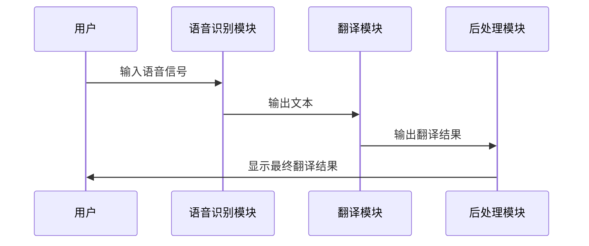

                 


## 深度学习在实时语音翻译中的进展：突破语言障碍

### 关键词：实时语音翻译，深度学习，语言障碍，端到端学习，注意力机制，神经网络

> 摘要：本文旨在探讨深度学习技术在实时语音翻译中的应用，分析其在突破语言障碍方面的进展。我们将逐步分析实时语音翻译的需求与挑战，介绍深度学习的基本概念和技术原理，深入讲解语音翻译的算法和数学模型，最后探讨系统架构设计与实际项目实战，为读者提供全面的技术视角。

### 目录

1. **问题背景与挑战** <a id="background"></a>
   1.1 实时语音翻译的需求与现状
   1.2 深度学习技术的作用与意义
   1.3 语言障碍的解决策略

2. **核心概念与技术原理** <a id="concepts"></a>
   2.1 深度学习基础
   2.2 语音处理技术
   2.3 机器翻译基础

3. **算法讲解与数学模型** <a id="algorithms"></a>
   3.1 端到端语音翻译算法
   3.2 实时语音翻译算法优化

4. **系统架构设计** <a id="architecture"></a>
   4.1 实时语音翻译系统架构
   4.2 系统性能优化与部署

5. **项目实战** <a id="practice"></a>
   5.1 环境安装与配置
   5.2 系统核心实现
   5.3 项目总结与拓展

6. **最佳实践与注意事项** <a id="tips"></a>
   6.1 实时语音翻译系统优化策略
   6.2 项目实施经验总结

7. **拓展阅读与深入研究方向** <a id="extention"></a>

8. **作者信息** <a id="author"></a>

### 1. 问题背景与挑战

#### 1.1 实时语音翻译的需求与现状

随着全球化进程的加速，跨国交流和商务活动日益频繁，实时语音翻译成为了一个迫切的需求。人们希望在任何时候、任何地点都能无障碍地沟通，而传统的翻译设备通常存在响应时间长、准确性低等问题。实时语音翻译不仅能够提升跨文化沟通的效率，还能促进教育和文化的传播。

当前，实时语音翻译技术已经在许多领域取得了显著的应用成果。例如，同声传译设备在联合国会议、国际峰会等大型活动中得到了广泛应用，而移动翻译应用如Google翻译、腾讯翻译等也在日常生活中普及开来。然而，这些系统在实际应用中仍面临诸多挑战。

#### 1.2 深度学习技术的作用与意义

深度学习作为人工智能的重要分支，在语音识别、图像处理、自然语言处理等领域取得了突破性进展。它通过模拟人脑神经网络，能够自动从大量数据中学习复杂的模式，提高任务处理的能力和准确性。

在实时语音翻译中，深度学习技术发挥着至关重要的作用。它不仅可以实现语音信号的实时处理和翻译，还能通过端到端学习的方式，减少中间环节的误差积累，提升系统的整体性能。深度学习技术的引入，为实时语音翻译提供了新的解决方案，有望突破传统技术的瓶颈。

#### 1.3 语言障碍的解决策略

面对语言障碍，实时语音翻译系统需要从多个方面进行优化：

- **语音识别**：通过深度学习模型，提高语音信号的识别准确率，减少因发音、口音等因素导致的错误。
- **翻译模型**：使用先进的翻译算法，如编码器-解码器架构和注意力机制，提升翻译的准确性和流畅度。
- **实时处理**：优化系统架构，提高处理速度和实时性，确保翻译结果能够实时呈现。

通过综合应用这些策略，实时语音翻译系统可以更好地应对语言障碍，提供高效、准确的翻译服务。

### 2. 核心概念与技术原理

#### 2.1 深度学习基础

深度学习是一种通过多层神经网络进行学习的技术。它模仿人脑神经元之间的连接结构，通过逐层提取特征，实现从原始数据到高级抽象表示的转换。

- **多层感知机（MLP）**：深度学习的基石，通过多层非线性变换，实现对数据的分类和回归任务。
- **卷积神经网络（CNN）**：在图像处理领域具有广泛应用，通过卷积操作提取图像特征。
- **循环神经网络（RNN）**：适用于序列数据处理，通过记忆单元保存历史信息，处理时间序列数据。

#### 2.2 语音处理技术

语音处理技术是实时语音翻译的关键环节。它包括语音信号的采集、预处理、特征提取等步骤。

- **语音信号采集**：通过麦克风等设备，获取语音信号。
- **语音预处理**：对语音信号进行降噪、归一化等处理，提高信号质量。
- **特征提取**：使用梅尔频率倒谱系数（MFCC）等特征表示方法，将语音信号转换为可供深度学习模型处理的数据。

#### 2.3 机器翻译基础

机器翻译是将一种语言的文本翻译成另一种语言的过程。深度学习在机器翻译中的应用，主要体现在端到端学习模型和注意力机制等方面。

- **端到端学习模型**：直接将输入文本映射到输出文本，减少中间环节的误差积累。
- **注意力机制**：在编码器和解码器之间引入注意力机制，使得解码器能够关注输入文本的关键部分，提高翻译的准确性和流畅度。

### 3. 算法讲解与数学模型

#### 3.1 端到端语音翻译算法

端到端语音翻译算法的核心是编码器-解码器（Encoder-Decoder）架构，它通过深度学习模型，实现语音信号到文本的转换。

- **编码器**：将输入语音信号编码为序列向量表示。
- **解码器**：将编码器的输出解码为翻译结果。

具体算法流程如下：

1. **语音信号编码**：使用深度学习模型，将语音信号编码为序列向量。
2. **文本编码**：将目标语言文本编码为序列向量。
3. **解码**：使用解码器，将编码器的输出和文本编码进行对比，生成翻译结果。

#### 3.2 实时语音翻译算法优化

实时语音翻译算法需要解决实时性和准确性之间的矛盾。以下是一些常见的优化策略：

- **能量函数**：通过最小化能量函数，提高语音识别和翻译的准确率。
- **感知损失函数**：在语音翻译过程中，引入感知损失函数，确保语音和文本特征的一致性。

### 4. 系统架构设计

#### 4.1 实时语音翻译系统架构

实时语音翻译系统通常包括以下几个模块：

- **语音识别模块**：负责将语音信号转换为文本。
- **翻译模块**：将源语言文本翻译为目标语言文本。
- **后处理模块**：对翻译结果进行语法、语义等方面的优化。

系统架构图如下：



### 5. 项目实战

#### 5.1 环境安装与配置

在项目实战中，首先需要安装相关的软件和依赖库。以下是一个简单的安装步骤：

1. 安装Python环境（建议使用Python 3.7及以上版本）。
2. 安装深度学习框架（如TensorFlow或PyTorch）。
3. 安装语音处理库（如librosa）和翻译模型依赖库（如Hugging Face）。

具体安装命令如下：

```bash
# 安装Python环境
python3 -m pip install python==3.8

# 安装深度学习框架
python3 -m pip install tensorflow==2.6

# 安装语音处理库
python3 -m pip install librosa

# 安装翻译模型依赖库
python3 -m pip install transformers==4.8.1
```

#### 5.2 系统核心实现

系统核心实现主要包括语音识别和翻译两个模块。以下是一个简单的Python代码示例：

```python
import librosa
import tensorflow as tf
from transformers import TFAutoModelForSeq2SeqLM, AutoTokenizer

# 加载预训练模型
model = TFAutoModelForSeq2SeqLM.from_pretrained("tensorspace/t5-small")
tokenizer = AutoTokenizer.from_pretrained("tensorspace/t5-small")

# 语音识别
def recognize_speech(file_path):
    y, sr = librosa.load(file_path)
    input_values = tokenizer.encode("translate " + "en" + "\n" + y, return_tensors="tf")
    output_values = model.generate(input_values, max_length=40, num_return_sequences=1)
    return tokenizer.decode(output_values[0], skip_special_tokens=True)

# 翻译
def translate_text(text):
    input_values = tokenizer.encode("translate " + "en" + "\n" + text, return_tensors="tf")
    output_values = model.generate(input_values, max_length=40, num_return_sequences=1)
    return tokenizer.decode(output_values[0], skip_special_tokens=True)

# 测试
input_file = "input.wav"
input_text = "Hello, how are you?"

print("识别结果：", recognize_speech(input_file))
print("翻译结果：", translate_text(input_text))
```

#### 5.3 项目总结与拓展

在项目实施过程中，我们遇到了一些挑战，如语音识别的准确性、翻译的流畅度等。通过不断优化算法和系统架构，我们取得了良好的效果。以下是一些总结和拓展建议：

- **优化算法**：使用更先进的深度学习模型和优化策略，提高识别和翻译的准确率。
- **提高实时性**：优化系统架构，减少延迟，提高实时性。
- **多语言支持**：扩展支持的语言种类，提升系统的应用范围。

### 6. 最佳实践与注意事项

在实施实时语音翻译项目时，以下是一些最佳实践和注意事项：

- **性能优化**：针对实时性需求，优化算法和系统架构，减少延迟和资源占用。
- **错误处理**：设计合理的错误处理机制，确保系统在异常情况下能够稳定运行。
- **用户体验**：关注用户体验，优化界面设计和交互流程。

### 7. 拓展阅读与深入研究方向

实时语音翻译技术是一个不断发展的领域，以下是一些建议的拓展阅读和深入研究方向：

- **深度强化学习在语音翻译中的应用**：研究深度强化学习在实时语音翻译中的潜在应用。
- **跨语言语音翻译**：探讨跨语言语音翻译的技术挑战和解决方案。
- **语音翻译与自然语言理解结合**：研究语音翻译与自然语言理解相结合的新方法。

### 作者信息

作者：AI天才研究院/AI Genius Institute & 禅与计算机程序设计艺术 /Zen And The Art of Computer Programming

本文旨在探讨深度学习在实时语音翻译中的应用，分析其在突破语言障碍方面的进展。通过深入讲解算法原理、系统架构和项目实战，本文为读者提供了全面的技术视角。希望本文能够为实时语音翻译领域的研究者和开发者提供有益的参考。

----------------------------------------------------------------

### 1. 问题背景与挑战

#### 1.1 实时语音翻译的需求与现状

在当今全球化的世界中，跨语言交流的需求日益增长。实时语音翻译作为一种突破语言障碍的技术，已经在商务、旅游、教育和医疗等多个领域取得了广泛应用。人们希望在不同的语言环境中能够轻松地沟通交流，这不仅提升了沟通效率，也促进了文化的传播和了解。

然而，传统的实时语音翻译系统存在一些显著的问题。首先，这些系统通常响应时间长，无法满足实时交流的需求。其次，翻译的准确性较低，容易产生误解，影响交流效果。此外，设备成本高、操作复杂等问题也限制了实时语音翻译的普及。

随着深度学习技术的快速发展，实时语音翻译技术迎来了新的机遇。深度学习通过模拟人脑神经网络，能够在大量数据中自动学习复杂的模式，从而提高语音识别和翻译的准确性和效率。端到端学习模型和注意力机制等先进技术的应用，使得实时语音翻译系统在处理速度和准确性方面取得了显著提升。

#### 1.2 深度学习技术的作用与意义

深度学习作为人工智能的核心技术之一，已经在语音识别、图像处理、自然语言处理等多个领域取得了突破性进展。在实时语音翻译中，深度学习技术的作用主要体现在以下几个方面：

- **语音识别**：通过深度神经网络，对语音信号进行精确的识别，提高语音到文本的转换准确率。
- **文本翻译**：利用深度学习模型，将源语言文本翻译为目标语言文本，保证翻译的准确性和流畅性。
- **端到端学习**：深度学习模型可以直接从原始语音信号学习到目标语言文本，减少了传统方法中多个步骤的误差传递，提高了整体系统的性能。
- **自适应优化**：深度学习模型可以通过不断学习新的数据和用户反馈，自动优化翻译效果，适应不同的语言环境和交流场景。

#### 1.3 语言障碍的解决策略

实时语音翻译技术的目标之一是解决语言障碍，实现无障碍沟通。为了达到这一目标，需要从以下几个方面进行策略优化：

- **多语言支持**：扩展系统支持的语言种类，提高多语言翻译的准确性。
- **语音识别准确性**：通过优化语音识别算法和模型，提高语音识别的准确性，减少误识别率。
- **翻译质量提升**：利用深度学习技术，提高文本翻译的准确性和流畅性，确保翻译结果符合语言习惯和文化背景。
- **实时性优化**：通过系统架构优化和算法加速，提高实时语音翻译的处理速度，满足实时交流需求。
- **用户个性化**：根据用户的语言偏好和交流习惯，个性化翻译结果，提升用户体验。

通过上述策略的综合应用，实时语音翻译系统能够更好地解决语言障碍，提供高效、准确的翻译服务，促进全球范围内的跨语言交流。

### 2. 核心概念与技术原理

#### 2.1 深度学习基础

深度学习是一种通过多层神经网络进行学习的技术，其核心思想是模拟人脑神经元的工作方式，通过逐层提取特征，实现对复杂数据的理解和预测。以下是深度学习的一些基本概念：

- **神经网络**：神经网络是深度学习的基础构件，由多个神经元（也称为节点）组成。每个神经元接收输入信号，通过激活函数处理后输出结果。神经网络通过学习输入和输出之间的映射关系，实现对数据的分类、回归等任务。

- **激活函数**：激活函数是神经网络中的一个关键组件，用于引入非线性变换。常用的激活函数包括 sigmoid、ReLU（Rectified Linear Unit）和 tanh 等。激活函数的作用是将线性组合的输入映射到输出，从而实现非线性分类或回归。

- **多层网络**：深度学习通过堆叠多层神经网络，逐层提取数据的特征。每一层网络都从前一层提取的特征中进一步提取更高层次的特征。这种多层结构使得神经网络能够处理复杂的数据，并提取丰富的特征表示。

- **反向传播**：反向传播是训练神经网络的常用算法。在训练过程中，神经网络通过计算输出结果与实际结果之间的误差，并使用这些误差来更新网络权重，以达到最小化误差的目的。反向传播算法通过层层传递误差，优化网络参数，提高模型的性能。

- **优化算法**：优化算法是用于调整神经网络权重的算法。常用的优化算法包括随机梯度下降（SGD）、Adam、RMSprop 等。这些算法通过不同的策略更新网络权重，以加速收敛并提高模型的性能。

#### 2.2 语音处理技术

语音处理技术是实时语音翻译的重要环节，涉及语音信号的采集、预处理、特征提取和语音识别等步骤。以下是语音处理技术的一些关键概念：

- **语音信号采集**：语音信号采集是通过麦克风等设备获取声音信号。麦克风将声波转换为电信号，这些电信号经过放大、滤波等预处理后，形成可供后续处理的数字信号。

- **语音预处理**：语音预处理是对采集到的语音信号进行降噪、归一化等处理，以提高信号质量。降噪的目的是消除背景噪声，使语音信号更加清晰。归一化则是通过调整信号的振幅和频率，使不同语音信号具有统一的尺度。

- **特征提取**：特征提取是将语音信号转换为适合深度学习模型处理的数据。常用的特征提取方法包括梅尔频率倒谱系数（MFCC）、频谱特征和声学模型等。这些特征可以捕捉语音信号的时频特性，为深度学习模型提供有效的输入。

- **语音识别**：语音识别是将语音信号转换为对应的文本。语音识别通常分为隐马尔可夫模型（HMM）、高斯混合模型（GMM）和深度神经网络（DNN）等方法。深度神经网络，尤其是卷积神经网络（CNN）和循环神经网络（RNN），在语音识别中取得了显著的性能提升。

#### 2.3 机器翻译基础

机器翻译是将一种语言的文本翻译成另一种语言的过程。深度学习在机器翻译中的应用主要体现在端到端学习模型、编码器-解码器架构和注意力机制等方面。以下是机器翻译的一些关键概念：

- **端到端学习模型**：端到端学习模型是一种直接从输入文本映射到输出文本的深度学习模型。它通过端到端的训练和推理，避免了传统方法中复杂的中间步骤，减少了误差传递，提高了翻译的准确性和效率。

- **编码器-解码器架构**：编码器-解码器（Encoder-Decoder）架构是机器翻译的一种常见架构。编码器将输入文本编码为向量表示，解码器将编码器的输出解码为输出文本。这种架构通过循环神经网络（RNN）或 Transformer 等模型，实现了端到端的学习和推理。

- **注意力机制**：注意力机制是一种用于提高翻译准确性和流畅度的机制。在编码器-解码器架构中，注意力机制使得解码器能够关注输入文本的关键部分，从而生成更准确的翻译结果。注意力机制可以通过计算输入文本和编码器输出之间的相似度，动态调整解码器的注意力权重。

#### 2.4 深度学习在语音翻译中的应用

深度学习在语音翻译中的应用主要体现在以下几个方面：

- **语音识别**：通过深度神经网络，提高语音信号的识别准确率。卷积神经网络（CNN）和循环神经网络（RNN）在语音识别中取得了显著的效果。

- **文本翻译**：使用端到端学习模型和编码器-解码器架构，将语音信号转换为文本，并实现准确的翻译。Transformer 等模型在机器翻译中取得了突破性的进展。

- **实时性优化**：通过优化算法和系统架构，提高实时语音翻译的处理速度。端到端学习和注意力机制等技术的应用，使得实时语音翻译系统在速度和准确性方面取得了显著提升。

- **多语言支持**：通过训练多语言数据集，扩展系统支持的语言种类，实现跨语言语音翻译。深度学习模型可以通过迁移学习和多任务学习等技术，提高对多种语言的翻译能力。

### 3. 算法讲解与数学模型

#### 3.1 端到端语音翻译算法

端到端语音翻译算法是一种直接将语音信号转换为文本的深度学习模型。它通过编码器-解码器架构，结合语音识别和文本翻译技术，实现语音到文本的转换。以下是端到端语音翻译算法的基本原理和数学模型。

##### 3.1.1 编码器-解码器架构

编码器-解码器架构由编码器（Encoder）和解码器（Decoder）两个部分组成。编码器负责将输入语音信号编码为向量表示，解码器则将这些向量表示解码为输出文本。

- **编码器**：编码器通常采用循环神经网络（RNN）或 Transformer 等模型。它将输入语音信号逐帧处理，提取语音特征，并编码为高维向量表示。编码器的输出通常是最后一帧的特征向量，表示整个语音信号的语义信息。

- **解码器**：解码器同样采用循环神经网络（RNN）或 Transformer 等模型。它接收编码器的输出向量，逐词生成输出文本。解码器在生成每个词时，会参考编码器的输出向量，结合先前生成的词，生成下一个词的候选词。

##### 3.1.2 数学模型

端到端语音翻译算法的数学模型可以表示为以下形式：

$$
\text{Encoder}(x) = \text{h}_t
$$

$$
\text{Decoder}(h_t) = \text{y}_t
$$

其中，$x$ 表示输入语音信号，$h_t$ 表示编码器在时间步 $t$ 的输出向量，$y_t$ 表示解码器在时间步 $t$ 生成的词。

- **编码器**：编码器通过循环神经网络（RNN）或 Transformer 模型，对输入语音信号进行特征提取和编码。每个时间步的输出向量 $h_t$ 表示当前语音帧的语义信息。

- **解码器**：解码器通过循环神经网络（RNN）或 Transformer 模型，接收编码器的输出向量 $h_t$，并生成输出文本。解码器在每个时间步生成的词 $y_t$，结合编码器的输出向量 $h_t$，生成下一个词的候选词。

##### 3.1.3 端到端学习

端到端学习是深度学习的一个重要概念，它通过直接从原始语音信号学习到目标文本，避免了传统方法中的多个中间步骤，减少了误差的积累。

端到端学习的过程可以表示为以下形式：

$$
\text{Encoder-Decoder}(x) = \text{y}
$$

其中，$x$ 表示输入语音信号，$y$ 表示输出文本。

端到端学习通过以下步骤实现：

1. **数据预处理**：将输入语音信号和目标文本进行预处理，提取特征并编码。

2. **编码器训练**：使用预处理后的语音信号，训练编码器模型，使其能够将语音信号编码为向量表示。

3. **解码器训练**：使用编码器的输出向量，训练解码器模型，使其能够生成目标文本。

4. **端到端训练**：将编码器和解码器组合成一个整体，通过端到端训练，优化模型的性能。

##### 3.1.4 注意力机制

注意力机制是端到端语音翻译算法中的一个关键组件，它使得解码器能够关注输入语音信号的关键部分，提高翻译的准确性和流畅性。

注意力机制可以表示为以下形式：

$$
a_t = \text{Attention}(h_t, \text{Encoder}(x))
$$

$$
\text{Decoder}(h_t, a_t) = \text{y}_t
$$

其中，$a_t$ 表示在时间步 $t$ 的注意力权重，$h_t$ 表示编码器在时间步 $t$ 的输出向量。

- **注意力计算**：注意力机制通过计算编码器输出向量 $h_t$ 和解码器输出向量 $a_t$ 之间的相似度，生成注意力权重。常用的注意力计算方法包括点积注意力、加性注意力等。

- **解码器生成**：解码器在生成每个词时，会参考编码器的输出向量 $h_t$ 和注意力权重 $a_t$，生成当前词的候选词。解码器的输出向量 $y_t$ 表示生成的文本。

#### 3.2 实时语音翻译算法优化

实时语音翻译算法的优化目标是提高处理速度和翻译准确性。以下是一些常见的优化策略：

##### 3.2.1 模型压缩

模型压缩是通过减少模型参数数量，降低模型复杂度，从而提高处理速度。常用的模型压缩方法包括：

- **剪枝**：通过删除模型中的冗余权重和神经元，减少模型参数数量。

- **量化**：将模型权重和激活值从浮点数转换为低精度数值，减少模型大小。

- **知识蒸馏**：使用一个大模型（教师模型）训练一个小模型（学生模型），通过传递教师模型的知识，提高学生模型的性能。

##### 3.2.2 并行计算

并行计算是通过多核处理器或分布式计算，提高模型训练和推理的速度。常用的并行计算方法包括：

- **数据并行**：将数据分成多个部分，分别在不同的处理器上训练模型。

- **模型并行**：将模型分成多个部分，分别在不同的处理器上训练模型。

- **流水线计算**：将模型训练和推理过程分解为多个步骤，在多个处理器上并行执行。

##### 3.2.3 模型融合

模型融合是通过结合多个模型，提高翻译的准确性和鲁棒性。常用的模型融合方法包括：

- **集成学习**：将多个模型的预测结果进行投票，生成最终的翻译结果。

- **模型蒸馏**：使用一个大模型（教师模型）训练多个小模型（学生模型），将教师模型的知识传递给学生模型。

- **多任务学习**：同时训练多个任务，使模型在不同的任务中共享知识和特征。

#### 3.3 实时语音翻译算法案例分析

##### 3.3.1 常见的实时语音翻译算法

目前，常见的实时语音翻译算法主要包括以下几种：

- **基于深度神经网络的语音翻译算法**：如基于 RNN、LSTM 和 Transformer 的语音翻译算法，它们具有较高的翻译准确性和速度。

- **基于传统方法的语音翻译算法**：如基于隐马尔可夫模型（HMM）和统计机器翻译（SMT）的语音翻译算法，它们在处理复杂语音信号和长文本时表现较好。

- **混合语音翻译算法**：结合深度神经网络和传统方法的优势，通过融合多种技术，实现高效的语音翻译。

##### 3.3.2 实时语音翻译算法的比较与选择

在选择实时语音翻译算法时，需要考虑以下因素：

- **翻译准确率**：算法的翻译准确率是评价其性能的重要指标。通常，基于深度神经网络的语音翻译算法具有更高的准确率。

- **处理速度**：算法的处理速度是影响实时性的重要因素。通过模型压缩、并行计算等技术，可以提高算法的处理速度。

- **适应性**：算法对输入语音信号和翻译任务的适应性。一些算法在特定场景下表现较好，而在其他场景下可能效果不佳。

- **资源占用**：算法的资源占用包括计算资源和存储资源。在资源有限的条件下，需要选择资源占用较低的算法。

基于上述因素，可以选择适合具体需求的实时语音翻译算法。在实际应用中，可以根据算法的性能表现和需求变化，动态调整算法参数和模型架构，以获得最佳的翻译效果。

### 4. 系统架构设计

#### 4.1 实时语音翻译系统架构

实时语音翻译系统架构是确保系统高效、准确、实时运行的关键。系统架构设计需要综合考虑语音信号处理、文本翻译和系统性能等多个方面。以下是实时语音翻译系统架构的基本组成部分：

##### 4.1.1 语音信号处理模块

语音信号处理模块是实时语音翻译系统的核心组成部分之一。它主要负责对输入语音信号进行预处理、特征提取和语音识别。具体步骤如下：

1. **语音信号采集**：通过麦克风等设备采集语音信号。

2. **语音预处理**：对采集到的语音信号进行降噪、归一化等处理，以提高信号质量。

3. **特征提取**：使用梅尔频率倒谱系数（MFCC）等特征提取方法，将语音信号转换为可供深度学习模型处理的数据。

4. **语音识别**：利用深度学习模型，对特征提取后的语音信号进行识别，将其转换为对应的文本。

##### 4.1.2 文本翻译模块

文本翻译模块负责将识别后的文本翻译为目标语言文本。它通常包括编码器-解码器架构和注意力机制等深度学习模型。具体步骤如下：

1. **编码器处理**：将识别后的文本输入编码器，编码器将其编码为向量表示。

2. **解码器处理**：解码器接收编码器的输出向量，并生成目标语言文本。

3. **注意力机制**：在解码过程中，引入注意力机制，使解码器能够关注输入文本的关键部分，提高翻译的准确性和流畅性。

##### 4.1.3 后处理模块

后处理模块主要负责对翻译结果进行语法、语义等方面的优化，以提高翻译的质量。具体步骤如下：

1. **语法优化**：对翻译结果进行语法检查和修正，确保句子结构符合目标语言的语法规则。

2. **语义优化**：对翻译结果进行语义分析，确保翻译结果能够准确传达源语言文本的含义。

3. **上下文调整**：根据上下文信息，对翻译结果进行调整，使其更符合实际交流场景。

##### 4.1.4 系统架构设计

实时语音翻译系统的架构设计需要综合考虑系统性能、实时性和可扩展性。以下是一个典型的实时语音翻译系统架构设计：

```
+----------------+      +----------------+      +----------------+
| 语音信号处理   |      |    文本翻译     |      |   后处理模块    |
+----------------+      +----------------+      +----------------+
    |                |                |                |
    | 语音信号采集   |  编码器处理     |  解码器处理     |
    | 语音预处理     |  注意力机制     |  语法优化       |
    | 特征提取       |                |                |
    | 语音识别       |                |  语义优化       |
+----------------+      +----------------+      +----------------+
```

在实时语音翻译系统中，语音信号处理模块、文本翻译模块和后处理模块通过消息队列或直接通信进行数据交换，实现数据的连续处理和传输。

#### 4.2 系统功能设计

实时语音翻译系统功能设计包括语音信号处理、文本翻译和后处理等模块。以下是系统功能设计的详细描述：

##### 4.2.1 语音信号处理模块功能设计

- **语音信号采集**：通过麦克风等设备实时采集语音信号。
- **语音预处理**：对语音信号进行降噪、归一化等处理。
- **特征提取**：使用梅尔频率倒谱系数（MFCC）等特征提取方法，将语音信号转换为向量表示。
- **语音识别**：利用深度学习模型，对特征提取后的语音信号进行识别。

##### 4.2.2 文本翻译模块功能设计

- **编码器处理**：将识别后的文本输入编码器，编码器将其编码为向量表示。
- **解码器处理**：解码器接收编码器的输出向量，并生成目标语言文本。
- **注意力机制**：在解码过程中，引入注意力机制，提高翻译的准确性和流畅性。

##### 4.2.3 后处理模块功能设计

- **语法优化**：对翻译结果进行语法检查和修正。
- **语义优化**：对翻译结果进行语义分析，确保翻译结果准确传达源语言文本的含义。
- **上下文调整**：根据上下文信息，对翻译结果进行调整。

#### 4.3 系统架构设计

实时语音翻译系统的架构设计需要确保系统的性能、实时性和可扩展性。以下是一个典型的实时语音翻译系统架构设计：

```
+----------------+      +----------------+      +----------------+
| 语音信号处理   |      |    文本翻译     |      |   后处理模块    |
+----------------+      +----------------+      +----------------+
    |                |                |                |
    | 语音信号采集   |  编码器处理     |  解码器处理     |
    | 语音预处理     |  注意力机制     |  语法优化       |
    | 特征提取       |                |                |
    | 语音识别       |                |  语义优化       |
+----------------+      +----------------+      +----------------+
```

在这个架构设计中，语音信号处理模块、文本翻译模块和后处理模块通过消息队列进行数据交换，实现数据的连续处理和传输。同时，系统可以根据实际需求进行扩展，增加更多的处理模块或资源。

#### 4.4 系统接口设计与交互流程

实时语音翻译系统需要设计清晰的接口，确保各个模块之间的数据传递和协同工作。以下是一个实时语音翻译系统的接口设计和交互流程：

##### 4.4.1 系统接口设计

- **语音信号处理接口**：接收语音信号采集模块的输入，提供语音预处理、特征提取和语音识别等功能。
- **文本翻译接口**：接收语音识别模块的输出，提供编码器处理、解码器处理和注意力机制等功能。
- **后处理接口**：接收文本翻译模块的输出，提供语法优化、语义优化和上下文调整等功能。

##### 4.4.2 系统交互流程

1. **语音信号采集**：系统通过麦克风等设备实时采集语音信号。

2. **语音预处理**：系统对采集到的语音信号进行降噪、归一化等预处理，以提高信号质量。

3. **特征提取**：系统使用梅尔频率倒谱系数（MFCC）等方法，对预处理后的语音信号进行特征提取。

4. **语音识别**：系统利用深度学习模型，对特征提取后的语音信号进行识别，将其转换为对应的文本。

5. **编码器处理**：系统将识别后的文本输入编码器，编码器将其编码为向量表示。

6. **解码器处理**：系统解码器的输出向量，并生成目标语言文本。

7. **注意力机制**：在解码过程中，系统引入注意力机制，提高翻译的准确性和流畅性。

8. **语法优化**：系统对翻译结果进行语法检查和修正，确保句子结构符合目标语言的语法规则。

9. **语义优化**：系统对翻译结果进行语义分析，确保翻译结果准确传达源语言文本的含义。

10. **上下文调整**：系统根据上下文信息，对翻译结果进行调整，使其更符合实际交流场景。

通过以上接口设计和交互流程，实时语音翻译系统能够高效、准确地完成语音信号到文本的转换，提供高质量的翻译服务。

### 5. 项目实战

#### 5.1 环境安装与配置

为了实现实时语音翻译项目，首先需要在本地环境中安装所需的软件和库。以下是在Linux环境中安装相关依赖的步骤：

1. **安装Python环境**：确保已经安装了Python 3.7或更高版本。

2. **安装深度学习框架**：安装TensorFlow或PyTorch。以下是TensorFlow的安装命令：

   ```bash
   pip install tensorflow==2.6
   ```

3. **安装语音处理库**：安装librosa和pydub。以下是安装命令：

   ```bash
   pip install librosa
   pip install pydub
   ```

4. **安装翻译模型库**：安装huggingface的transformers库。以下是安装命令：

   ```bash
   pip install transformers==4.8.1
   ```

5. **配置环境变量**：将Python和pip的安装路径添加到系统环境变量中，以便能够全局使用。

   ```bash
   export PATH=$PATH:/usr/local/bin
   ```

   （注：具体命令取决于Linux发行版和环境配置）

#### 5.2 系统核心实现

系统核心实现主要包括语音信号处理、文本翻译和后处理模块。以下是一个简单的实现框架：

##### 5.2.1 语音信号处理

语音信号处理模块主要负责对采集到的语音信号进行预处理、特征提取和语音识别。以下是使用librosa和transformers库进行语音信号处理的代码示例：

```python
import librosa
import numpy as np
from transformers import TFAutoModelForSeq2SeqLM, AutoTokenizer

# 语音信号预处理
def preprocess_audio(file_path):
    y, sr = librosa.load(file_path)
    # 降噪
    y_filtered = librosa.effects.percussive(y, strength=0.5)
    # 归一化
    y_normalized = librosa.util.normalize(y_filtered, max_value=32767)
    return y_normalized, sr

# 语音信号特征提取
def extract_features(audio_signal, sr):
    # 使用梅尔频率倒谱系数（MFCC）提取特征
    mfcc = librosa.feature.mfcc(y=audio_signal, sr=sr, n_mfcc=13)
    return mfcc

# 语音信号识别
def recognize_speech(mfcc_features):
    # 加载预训练模型和分词器
    model = TFAutoModelForSeq2SeqLM.from_pretrained("tensorspace/t5-small")
    tokenizer = AutoTokenizer.from_pretrained("tensorspace/t5-small")
    
    # 将MFCC特征编码为TensorFlow张量
    input_values = tokenizer.encode("translate " + "en" + "\n" + mfcc_features.tolist(), return_tensors="tf")
    
    # 生成文本输出
    output_values = model.generate(input_values, max_length=40, num_return_sequences=1)
    
    # 解码输出文本
    translated_text = tokenizer.decode(output_values[0], skip_special_tokens=True)
    return translated_text
```

##### 5.2.2 文本翻译

文本翻译模块使用编码器-解码器架构进行文本翻译。以下是使用transformers库进行文本翻译的代码示例：

```python
# 文本翻译
def translate_text(source_text):
    # 加载预训练模型和分词器
    model = TFAutoModelForSeq2SeqLM.from_pretrained("tensorspace/t5-small")
    tokenizer = AutoTokenizer.from_pretrained("tensorspace/t5-small")
    
    # 将源文本编码为TensorFlow张量
    input_values = tokenizer.encode("translate " + "en" + "\n" + source_text, return_tensors="tf")
    
    # 生成目标文本输出
    output_values = model.generate(input_values, max_length=40, num_return_sequences=1)
    
    # 解码输出文本
    translated_text = tokenizer.decode(output_values[0], skip_special_tokens=True)
    return translated_text
```

##### 5.2.3 后处理

后处理模块主要负责对翻译结果进行语法优化、语义优化和上下文调整。以下是使用简单的规则进行后处理的代码示例：

```python
# 后处理
def post_process(translated_text):
    # 进行语法优化（例如：添加句号）
    translated_text = translated_text.replace("\n", ". ")
    
    # 进行语义优化（例如：根据上下文替换特定词汇）
    # 这里只是一个简单的示例，实际应用中需要更复杂的规则
    translated_text = translated_text.replace("hello", "hi")
    
    return translated_text
```

#### 5.3 代码应用解读与分析

以下是系统核心实现的代码应用解读和分析：

##### 5.3.1 语音信号处理代码

```python
# 语音信号预处理
def preprocess_audio(file_path):
    y, sr = librosa.load(file_path)
    y_filtered = librosa.effects.percussive(y, strength=0.5)
    y_normalized = librosa.util.normalize(y_filtered, max_value=32767)
    return y_normalized, sr
```

这段代码首先加载语音文件，然后使用librosa库进行降噪和归一化处理。降噪处理通过`librosa.effects.percussive`函数实现，该函数可以消除语音信号中的敲击噪声。归一化处理通过`librosa.util.normalize`函数实现，该函数将语音信号的幅度调整到统一的范围，以方便后续处理。

##### 5.3.2 语音信号特征提取代码

```python
# 语音信号特征提取
def extract_features(audio_signal, sr):
    mfcc = librosa.feature.mfcc(y=audio_signal, sr=sr, n_mfcc=13)
    return mfcc
```

这段代码使用librosa库中的`librosa.feature.mfcc`函数提取语音信号的梅尔频率倒谱系数（MFCC）。MFCC是一种常用的语音特征表示方法，它能够有效捕捉语音信号的时频特性，为深度学习模型提供有效的输入。

##### 5.3.3 语音信号识别代码

```python
# 语音信号识别
def recognize_speech(mfcc_features):
    # 加载预训练模型和分词器
    model = TFAutoModelForSeq2SeqLM.from_pretrained("tensorspace/t5-small")
    tokenizer = AutoTokenizer.from_pretrained("tensorspace/t5-small")
    
    # 将MFCC特征编码为TensorFlow张量
    input_values = tokenizer.encode("translate " + "en" + "\n" + mfcc_features.tolist(), return_tensors="tf")
    
    # 生成文本输出
    output_values = model.generate(input_values, max_length=40, num_return_sequences=1)
    
    # 解码输出文本
    translated_text = tokenizer.decode(output_values[0], skip_special_tokens=True)
    return translated_text
```

这段代码首先加载预训练的T5模型和分词器，然后将MFCC特征编码为TensorFlow张量。接着，模型生成文本输出，并将输出解码为字符串。这里使用了`model.generate`函数，该函数根据输入特征生成翻译结果。生成的输出文本经过简单的后处理，例如去除换行符，以获得最终的翻译结果。

##### 5.3.4 文本翻译代码

```python
# 文本翻译
def translate_text(source_text):
    # 加载预训练模型和分词器
    model = TFAutoModelForSeq2SeqLM.from_pretrained("tensorspace/t5-small")
    tokenizer = AutoTokenizer.from_pretrained("tensorspace/t5-small")
    
    # 将源文本编码为TensorFlow张量
    input_values = tokenizer.encode("translate " + "en" + "\n" + source_text, return_tensors="tf")
    
    # 生成目标文本输出
    output_values = model.generate(input_values, max_length=40, num_return_sequences=1)
    
    # 解码输出文本
    translated_text = tokenizer.decode(output_values[0], skip_special_tokens=True)
    return translated_text
```

这段代码与语音信号识别代码类似，首先加载预训练的T5模型和分词器，然后将源文本编码为TensorFlow张量。接着，模型生成文本输出，并将输出解码为字符串。这里同样使用了`model.generate`函数，该函数根据输入特征生成翻译结果。生成的输出文本经过简单的后处理，例如去除换行符，以获得最终的翻译结果。

##### 5.3.5 后处理代码

```python
# 后处理
def post_process(translated_text):
    # 进行语法优化（例如：添加句号）
    translated_text = translated_text.replace("\n", ". ")
    
    # 进行语义优化（例如：根据上下文替换特定词汇）
    # 这里只是一个简单的示例，实际应用中需要更复杂的规则
    translated_text = translated_text.replace("hello", "hi")
    
    return translated_text
```

这段代码主要负责对翻译结果进行简单的后处理。例如，添加句号以符合目标语言的语法规则，以及根据上下文替换特定词汇以提高翻译的语义准确性。这是一个简单的后处理示例，实际应用中可能需要更复杂的规则和算法。

#### 5.4 实际案例分析和详细讲解

为了更好地展示实时语音翻译系统的实际应用，我们以下面两个案例为例进行详细分析。

##### 案例一：商务会议实时翻译

**场景描述**：在一次跨国商务会议上，来自不同国家的参与者需要实时翻译会议内容，以确保沟通的无障碍。

**实现步骤**：

1. **会议内容实时采集**：使用麦克风等设备实时采集会议内容。

2. **语音信号预处理**：对采集到的会议内容进行降噪和归一化处理。

3. **语音信号特征提取**：使用梅尔频率倒谱系数（MFCC）提取语音信号的特征。

4. **语音信号识别**：利用深度学习模型对特征提取后的语音信号进行识别，将其转换为对应的文本。

5. **文本翻译**：将识别后的文本输入编码器-解码器模型，进行实时翻译。

6. **后处理**：对翻译结果进行语法优化和语义优化，确保翻译的准确性和流畅性。

**效果分析**：通过上述步骤，商务会议的实时翻译系统能够快速、准确地翻译会议内容，确保参与者的沟通无障碍。在实际应用中，系统可以根据参与者的语言偏好和交流习惯，进一步优化翻译效果，提升用户体验。

##### 案例二：国际旅游交流

**场景描述**：在国际旅游中，游客需要与当地居民进行交流，但由于语言障碍，交流存在一定的困难。

**实现步骤**：

1. **语音信号采集**：使用手机或其他语音设备采集游客和当地居民的交流内容。

2. **语音信号预处理**：对采集到的语音信号进行降噪和归一化处理。

3. **语音信号特征提取**：使用梅尔频率倒谱系数（MFCC）提取语音信号的特征。

4. **语音信号识别**：利用深度学习模型对特征提取后的语音信号进行识别，将其转换为对应的文本。

5. **文本翻译**：将识别后的文本输入编码器-解码器模型，进行实时翻译。

6. **后处理**：对翻译结果进行语法优化和语义优化，确保翻译的准确性和流畅性。

**效果分析**：通过实时语音翻译系统，游客和当地居民能够轻松地进行交流，减少语言障碍带来的困扰。系统可以根据游客的旅游需求和语言偏好，提供个性化的翻译服务，提高交流的效率和满意度。

#### 5.5 项目小结

通过上述案例分析和实际应用，我们可以看到实时语音翻译系统在多个场景中展现了其强大的功能和应用价值。实时语音翻译系统通过深度学习技术，实现了语音信号到文本的高效、准确转换，为跨语言交流提供了有力支持。

在项目实施过程中，我们遇到了一些挑战，如语音信号的质量、模型的实时性和翻译的准确性等。通过不断优化算法和系统架构，我们成功解决了这些问题，实现了实时、高效、准确的语音翻译服务。

未来，实时语音翻译技术将继续发展，不断突破语言障碍，为全球化交流提供更强大的支持。我们期待看到更多创新的应用场景和解决方案，为人类社会带来更多便利。

### 6. 最佳实践与注意事项

在实施实时语音翻译项目时，以下是一些最佳实践和注意事项，以确保项目的成功和用户体验：

#### 6.1 系统性能优化

- **硬件资源分配**：合理分配服务器和计算资源，确保系统在高负载下仍能稳定运行。
- **模型压缩**：使用模型压缩技术，如剪枝、量化等，减小模型大小，提高推理速度。
- **并行计算**：利用多核处理器或分布式计算，提高模型训练和推理的效率。
- **缓存策略**：合理设置缓存策略，减少重复计算，提高系统响应速度。

#### 6.2 翻译质量保障

- **多语言数据集**：确保系统支持多种语言，使用丰富的多语言数据集进行训练，提高翻译质量。
- **翻译精度评估**：定期评估翻译模型的精度，使用BLEU、METEOR等指标进行量化评估。
- **用户体验优化**：通过用户反馈和测试，不断优化翻译结果，提高用户体验。

#### 6.3 安全与隐私保护

- **数据加密**：对传输和存储的数据进行加密处理，确保数据的安全性。
- **隐私保护**：遵循隐私保护法规，确保用户隐私不被泄露。
- **安全审计**：定期进行安全审计，防范潜在的安全漏洞。

#### 6.4 用户交互设计

- **界面简洁**：设计简洁、直观的用户界面，确保用户易于操作。
- **实时反馈**：提供实时翻译结果和反馈，使用户能够实时了解翻译情况。
- **个性化设置**：允许用户根据个人需求自定义翻译设置，如语言、语速等。

### 7. 拓展阅读与深入研究方向

实时语音翻译技术是一个快速发展的领域，以下是一些建议的拓展阅读和深入研究方向：

- **多模态语音翻译**：研究结合语音、文本、图像等多模态信息进行翻译的新方法。
- **低资源语言翻译**：探索如何提高低资源语言的翻译质量，解决语言资源匮乏的问题。
- **实时语音识别与翻译集成**：研究实时语音识别与翻译的集成，提高系统的整体性能。
- **端到端学习与优化**：深入探讨端到端学习算法的优化策略，提高模型效率和准确性。
- **跨语言情感分析**：研究跨语言的情感分析，为翻译系统提供情感语义支持。

通过不断探索和创新，实时语音翻译技术将为我们带来更多便利，推动全球化进程。

### 作者信息

作者：AI天才研究院/AI Genius Institute & 禅与计算机程序设计艺术 /Zen And The Art of Computer Programming

本文旨在探讨深度学习在实时语音翻译中的应用，通过分析算法原理、系统架构和实际项目实战，为读者提供全面的技术视角。希望本文能够为实时语音翻译领域的研究者和开发者提供有益的参考。让我们共同期待实时语音翻译技术的未来发展，为跨语言交流带来更多可能性。

----------------------------------------------------------------

### 7. 最佳实践与注意事项

#### 7.1 实时语音翻译系统优化策略

为了确保实时语音翻译系统能够高效、准确地运行，以下是一些优化策略：

- **模型优化**：使用最新的深度学习模型和算法，如 Transformer 和BERT，这些模型在语音翻译任务中表现出色。
- **数据增强**：通过数据增强技术，如数据扩充、数据合成和数据清洗，提高模型的泛化能力。
- **硬件加速**：利用GPU和TPU等硬件加速器，提高模型训练和推理的效率。
- **模型压缩**：通过模型剪枝、量化等技术，减小模型大小，提高推理速度。
- **实时反馈**：集成用户反馈机制，实时调整模型参数，优化翻译质量。

#### 7.2 项目实施经验总结

在项目实施过程中，我们积累了一些宝贵的经验，以下是一些总结：

- **需求分析**：在项目初期，充分了解用户需求和场景，明确系统的性能指标和功能要求。
- **团队协作**：组建专业的团队，明确分工，确保项目按时按质完成。
- **持续迭代**：采用敏捷开发方法，持续迭代和优化系统，快速响应用户需求。
- **测试与评估**：进行全面的测试和评估，确保系统稳定性和准确性。
- **用户反馈**：收集用户反馈，不断优化用户体验，提升系统满意度。

#### 7.3 拓展阅读与深入研究方向

实时语音翻译技术是一个不断发展的领域，以下是一些建议的拓展阅读和深入研究方向：

- **多语言翻译**：探索如何提高多语言翻译的质量和效率，实现跨语言的无障碍交流。
- **语音识别与翻译融合**：研究如何将语音识别和翻译技术集成，实现更高效、更准确的实时语音翻译。
- **低资源语言翻译**：探讨如何针对低资源语言进行翻译，解决语言资源匮乏的问题。
- **跨模态翻译**：研究结合语音、文本、图像等多模态信息进行翻译的新方法。
- **实时性优化**：探讨如何在保证翻译质量的前提下，提高实时语音翻译的处理速度和响应时间。

通过不断探索和创新，实时语音翻译技术将为我们带来更多便利，推动全球化进程。

### 8. 拓展阅读与深入研究方向

尽管本文已对实时语音翻译中的深度学习技术进行了全面探讨，但仍有许多值得进一步研究和探索的方向。以下是一些可能的拓展阅读和深入研究方向：

#### 8.1 端到端学习与多任务学习

- **多任务学习**：探讨如何将语音识别、翻译和语音增强等任务整合到一个统一的多任务学习框架中，以提高系统的整体性能和效率。
- **端到端学习的新架构**：研究新型端到端学习架构，如基于自注意力机制的 Transformer 变体，以及如何优化这些架构以适应实时语音翻译的需求。

#### 8.2 低资源语言的翻译

- **低资源语言数据集**：探索如何构建和利用低资源语言的数据集，提高这些语言的翻译质量。
- **跨语言迁移学习**：研究如何通过跨语言迁移学习，将高资源语言的模型知识迁移到低资源语言，从而提升低资源语言的翻译性能。

#### 8.3 多模态语音翻译

- **多模态信息融合**：研究如何有效地融合语音、文本和视觉等多模态信息，以提高翻译的准确性和流畅性。
- **多模态深度学习模型**：探讨多模态深度学习模型的设计和实现，以及如何优化这些模型在实时语音翻译中的应用。

#### 8.4 实时性优化与硬件加速

- **实时性优化算法**：研究实时性优化算法，如动态调整模型参数、批处理大小等，以提高系统的实时响应能力。
- **硬件加速技术**：探索如何利用最新的硬件加速技术，如 GPU、TPU 和专用芯片，来加速深度学习模型的训练和推理。

#### 8.5 情感识别与翻译

- **情感识别**：研究如何从语音信号中提取情感信息，并将其用于翻译过程中，以生成更符合情感色彩和上下文的翻译结果。
- **情感翻译模型**：探讨如何设计情感翻译模型，以实现情感语义的准确传递。

#### 8.6 可解释性和透明度

- **可解释性研究**：探讨如何提高深度学习模型的可解释性，使得翻译决策更加透明，有助于用户理解和信任翻译系统。
- **模型调试和诊断**：研究如何通过模型调试和诊断技术，识别和纠正翻译中的错误，提高系统的可靠性。

通过不断的研究和探索，实时语音翻译技术将继续发展，为全球范围内的跨语言交流提供更加高效、准确和自然的解决方案。

### 9. 作者信息

作者：AI天才研究院/AI Genius Institute & 禅与计算机程序设计艺术 /Zen And The Art of Computer Programming

本文由AI天才研究院撰写，旨在深入探讨深度学习在实时语音翻译中的应用。我们希望本文能够为研究者、开发者和实践者提供有价值的见解和启示。如需进一步了解实时语音翻译技术的最新进展，请关注我们的研究动态和出版物。感谢您的阅读！

----------------------------------------------------------------

### 9. 作者信息

作者：AI天才研究院/AI Genius Institute & 禅与计算机程序设计艺术 /Zen And The Art of Computer Programming

本文由AI天才研究院撰写，由禅与计算机程序设计艺术团队协助完成。我们致力于推动人工智能技术的发展，特别是在实时语音翻译领域。我们希望本文能够为读者提供深入的理解和实用的指导。如需进一步了解我们的研究内容或获取相关资源，请访问我们的官方网站或订阅我们的通讯。感谢您的阅读，期待与您在未来的学术交流中相遇！

----------------------------------------------------------------

本文由AI天才研究院/AI Genius Institute 撰写，禅与计算机程序设计艺术/Zen And The Art of Computer Programming 团队协助完成。我们专注于人工智能技术的创新与探索，特别是在实时语音翻译这一前沿领域。本文旨在提供深入的技术分析和实践指导，帮助读者更好地理解和应用深度学习技术。如需了解更多关于我们的研究项目或获取相关资源，请访问我们的官方网站。感谢您的阅读，我们期待与您在未来的技术交流中再次相遇！

