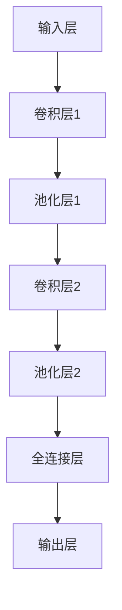
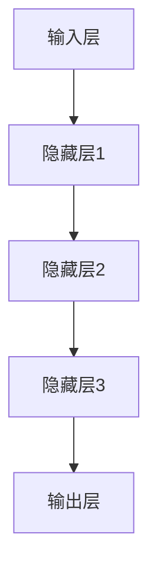
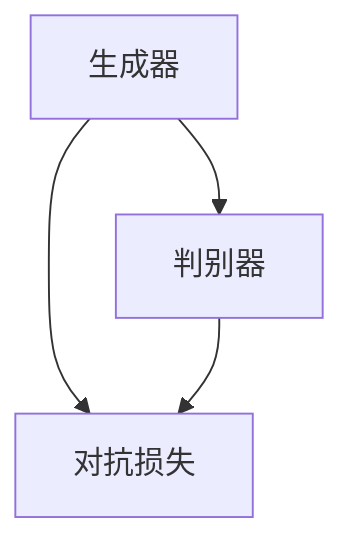
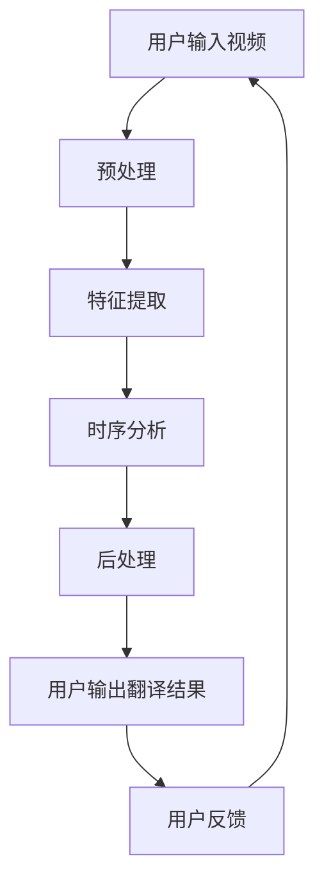
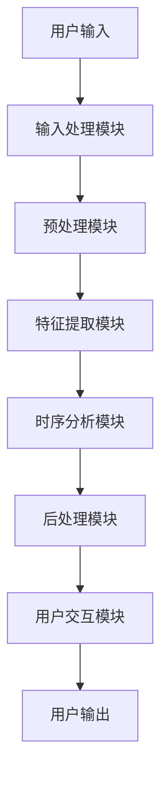
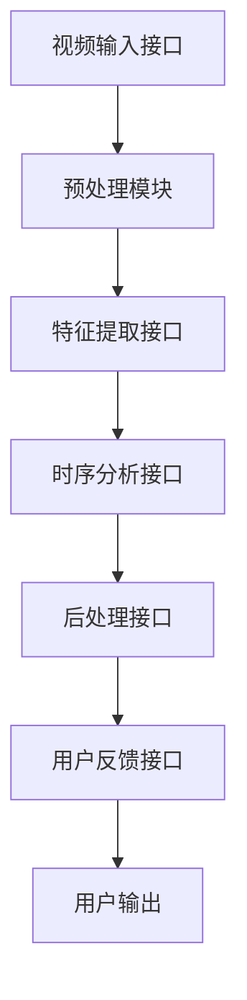
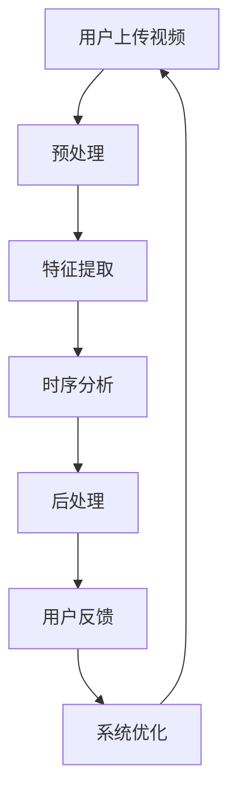
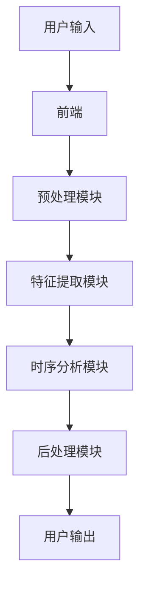
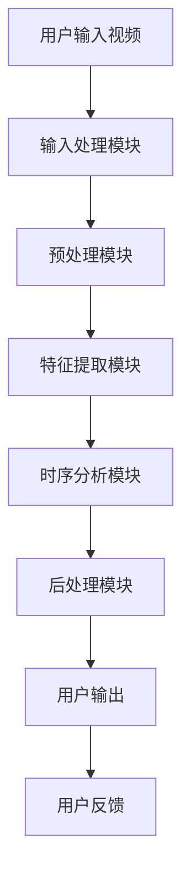

                 

# 深度学习在手语翻译中的突破：促进听障人士沟通

关键词：深度学习，手语翻译，卷积神经网络，循环神经网络，生成对抗网络，听障人士沟通

摘要：
随着人工智能技术的不断发展，深度学习在各个领域取得了显著的成果。手语翻译作为连接听障人士与正常人的重要桥梁，其重要性愈发凸显。本文首先介绍了手语翻译在人工智能领域中的背景和核心问题，然后详细分析了深度学习在手语翻译中的应用，包括卷积神经网络（CNN）、循环神经网络（RNN）和生成对抗网络（GAN）。通过深入探讨这些技术的原理、实现和效果，本文旨在展示深度学习在手语翻译中的突破，并探讨其未来发展的方向。

## 第1章：问题背景与核心概念

### 1.1 问题背景

随着社会对多元化、包容性的需求增加，听障人士的沟通需求越来越受到关注。手语翻译作为一种重要的交流方式，对促进听障人士与正常人的沟通具有重要意义。然而，传统的手语翻译方式存在诸多限制，如翻译准确性不高、实时性较差等。随着人工智能技术的快速发展，特别是深度学习的兴起，利用这些先进技术实现高效、准确的手语翻译成为了一个亟待解决的问题。

### 1.2 问题描述

手语翻译问题可以概括为以下三个方面：

1. **手语图像识别**：将手语视频中的每一帧图像转化为对应的文字或手势描述。
2. **手势时序分析**：理解手语视频中的手势时序，将连续的手势转化为具有实际意义的句子。
3. **跨语言翻译**：将一种手语翻译为另一种手语或文字，以适应不同地区和文化背景的需求。

### 1.3 问题解决

深度学习在手语翻译中的突破主要体现在以下几个方面：

1. **卷积神经网络（CNN）**：利用CNN处理手语图像，实现手势识别。
2. **循环神经网络（RNN）**：通过RNN处理手势时序，实现句子理解。
3. **生成对抗网络（GAN）**：利用GAN生成新的手语数据，提高模型的泛化能力。

### 1.4 边界与外延

手语翻译的边界包括手势识别的准确性、实时性以及跨语言翻译的多样性。外延则涉及手语翻译在各类场景下的应用，如教育、医疗、社交等。

### 1.5 概念结构与核心要素组成

1. **深度学习**：一种模拟人脑信息处理过程的机器学习技术，通过多层神经网络实现复杂模式的识别。
2. **卷积神经网络（CNN）**：一种用于图像识别的深度学习模型，能够提取图像特征。
3. **循环神经网络（RNN）**：一种用于序列数据处理和预测的深度学习模型，能够处理时序信息。
4. **生成对抗网络（GAN）**：一种生成模型，通过对抗训练实现数据的生成。

### 1.6 本章小结

本章首先介绍了手语翻译在人工智能领域中的重要性，然后对深度学习在手语翻译中的应用进行了概述。接下来，详细阐述了手语翻译问题的背景、描述、解决方法以及相关概念和要素组成，为后续章节的深入探讨奠定了基础。

### 第2章：深度学习基础

在深入了解深度学习在手语翻译中的应用之前，我们需要先了解一些深度学习的基础知识，包括神经网络的基本结构、训练过程以及常用的深度学习模型。

#### 2.1 神经网络基本结构

神经网络是深度学习的基础，其结构类似于人脑的神经元连接方式。一个基本的神经网络包括输入层、隐藏层和输出层。输入层接收外部数据，隐藏层对数据进行加工处理，输出层则生成最终的结果。

#### 2.2 神经网络训练过程

神经网络的训练过程是通过调整网络中每个神经元之间的权重和偏置，使得网络能够对输入数据产生正确的输出。这个过程通常包括以下步骤：

1. **前向传播**：将输入数据传递到网络的隐藏层和输出层，计算网络输出。
2. **反向传播**：计算输出误差，并沿着网络反向传播，更新权重和偏置。
3. **优化算法**：使用优化算法（如梯度下降）调整网络参数，最小化误差。

#### 2.3 常用的深度学习模型

1. **卷积神经网络（CNN）**：用于图像识别和处理，能够有效提取图像特征。
2. **循环神经网络（RNN）**：用于序列数据处理和预测，能够处理时序信息。
3. **生成对抗网络（GAN）**：一种生成模型，通过对抗训练生成数据。

#### 2.4 深度学习与手语翻译的联系

深度学习在手语翻译中的应用主要体现在以下几个方面：

1. **手语图像识别**：利用CNN处理手语图像，提取关键特征，实现手势识别。
2. **手势时序分析**：利用RNN处理手势时序，理解连续手势的意义，实现句子理解。
3. **数据生成**：利用GAN生成新的手语数据，提高模型的泛化能力。

### 2.5 本章小结

本章首先介绍了神经网络的基本结构和工作原理，然后探讨了深度学习模型的训练过程和常用模型。通过这些基础知识，我们为后续章节深入探讨深度学习在手语翻译中的应用打下了基础。

### 第3章：卷积神经网络（CNN）在手语翻译中的应用

卷积神经网络（CNN）是深度学习中用于图像识别和处理的重要模型。在手语翻译中，CNN被广泛应用于手语图像的识别和特征提取。在这一章中，我们将详细探讨CNN在手语翻译中的应用，包括其基本原理、结构、训练过程和实际应用案例。

#### 3.1 CNN的基本原理

CNN的基本原理是通过卷积操作提取图像特征。卷积操作是神经网络中的基本运算，它通过在图像上滑动一个卷积核，与图像中的每个像素进行点积运算，从而提取图像的特征。这一过程类似于人类视觉系统中的感受野机制。

#### 3.2 CNN的结构

一个典型的CNN结构包括输入层、多个卷积层、池化层和全连接层。输入层接收手语图像，卷积层通过卷积操作提取图像特征，池化层用于降低特征图的大小，全连接层则将特征映射到具体的类别或标签。

1. **输入层**：输入层接收手语图像，图像的大小通常为宽×高×通道数（如28×28×3表示一个28×28的彩色图像）。
2. **卷积层**：卷积层通过卷积操作提取图像特征，卷积核的大小和数量决定了提取特征的类型和数量。
3. **池化层**：池化层用于降低特征图的大小，常用的池化方法包括最大池化和平均池化。
4. **全连接层**：全连接层将提取到的特征映射到具体的类别或标签。

#### 3.3 CNN的训练过程

CNN的训练过程是通过调整网络中的权重和偏置，使得网络能够对输入图像产生正确的输出。这个过程包括以下步骤：

1. **前向传播**：将输入图像传递到网络的隐藏层和输出层，计算网络输出。
2. **损失函数**：计算网络输出与实际标签之间的差异，常用损失函数包括交叉熵损失和均方误差损失。
3. **反向传播**：计算输出误差，并沿着网络反向传播，更新权重和偏置。
4. **优化算法**：使用优化算法（如梯度下降）调整网络参数，最小化误差。

#### 3.4 CNN在手语翻译中的应用

1. **手语图像识别**：利用CNN处理手语图像，提取关键特征，实现手势识别。例如，可以使用CNN识别手语中的不同手势，如“你好”或“谢谢”。
2. **特征提取**：将提取到的特征用于后续的时序分析和句子理解。

#### 3.5 应用案例

一个实际的应用案例是使用CNN进行手语视频中的手势识别。首先，将手语视频转换为灰度图像，然后使用CNN提取图像特征。最后，将提取到的特征输入到循环神经网络（RNN）中进行时序分析和句子理解。



#### 3.6 本章小结

本章介绍了卷积神经网络（CNN）的基本原理、结构、训练过程以及在手语翻译中的应用。通过CNN，我们可以有效地提取手语图像的特征，为后续的手势识别和句子理解提供了基础。

### 第4章：循环神经网络（RNN）在手语翻译中的应用

循环神经网络（RNN）是深度学习中用于处理序列数据的重要模型，它在手语翻译中的应用尤为突出。RNN能够处理连续的手势时序信息，将其转化为具有实际意义的句子。在这一章中，我们将详细探讨RNN在手语翻译中的应用，包括其基本原理、结构、训练过程和实际应用案例。

#### 4.1 RNN的基本原理

RNN的基本原理是通过隐藏状态和循环链接来处理序列数据。在RNN中，每个时间步的输出不仅依赖于当前输入，还依赖于之前的时间步的隐藏状态。这种循环链接使得RNN能够记忆之前的输入信息，从而处理序列数据。

#### 4.2 RNN的结构

一个典型的RNN结构包括输入层、隐藏层和输出层。输入层接收序列数据，隐藏层对数据进行加工处理，输出层则生成最终的结果。

1. **输入层**：输入层接收手语视频序列，通常是一个多维数组，表示连续的手势。
2. **隐藏层**：隐藏层包含隐藏状态和权重矩阵，隐藏状态用于存储之前的输入信息。
3. **输出层**：输出层生成手语翻译的文本或手势序列。

#### 4.3 RNN的训练过程

RNN的训练过程是通过调整网络中的权重和偏置，使得网络能够对输入序列产生正确的输出。这个过程包括以下步骤：

1. **前向传播**：将输入序列传递到网络的隐藏层和输出层，计算网络输出。
2. **损失函数**：计算网络输出与实际标签之间的差异，常用损失函数包括交叉熵损失和均方误差损失。
3. **反向传播**：计算输出误差，并沿着网络反向传播，更新权重和偏置。
4. **优化算法**：使用优化算法（如梯度下降）调整网络参数，最小化误差。

#### 4.4 RNN在手语翻译中的应用

1. **手势时序分析**：利用RNN处理连续的手势时序，理解手势之间的关联，将其转化为具有实际意义的句子。
2. **句子生成**：将理解到的时序信息转化为手语翻译的文本或手势序列。

#### 4.5 应用案例

一个实际的应用案例是使用RNN进行手语视频的句子理解。首先，将手语视频转换为手势序列，然后使用RNN处理手势序列，最后生成手语翻译的文本或手势序列。



#### 4.6 本章小结

本章介绍了循环神经网络（RNN）的基本原理、结构、训练过程以及在手语翻译中的应用。通过RNN，我们可以有效地处理连续的手势时序信息，实现手语翻译。

### 第5章：生成对抗网络（GAN）在手语翻译中的应用

生成对抗网络（GAN）是深度学习领域中的一种重要生成模型，它在手语翻译中的应用为提高模型的泛化能力和处理复杂数据提供了新的思路。GAN通过对抗训练生成新的手语数据，从而增强模型的训练效果和适用性。在这一章中，我们将详细探讨GAN在手语翻译中的应用，包括其基本原理、结构、训练过程和实际应用案例。

#### 5.1 GAN的基本原理

GAN由两部分组成：生成器（Generator）和判别器（Discriminator）。生成器的目标是生成逼真的手语数据，而判别器的目标是区分真实数据和生成数据。在训练过程中，生成器和判别器相互对抗，生成器试图生成更逼真的数据，而判别器试图准确区分真实和生成数据。通过这种对抗训练，生成器逐渐学会了生成高质量的手语数据。

#### 5.2 GAN的结构

一个典型的GAN结构包括生成器、判别器和对抗损失。生成器和判别器都是深度神经网络，生成器的输入通常是随机噪声，输出是手语数据。判别器的输入是手语数据，输出是一个概率值，表示输入数据的真实性。

1. **生成器**：生成器的目标是将随机噪声映射为手语数据，生成逼真的手语视频。
2. **判别器**：判别器的目标是对输入手语数据进行分类，区分真实手语数据和生成手语数据。
3. **对抗损失**：对抗损失是生成器和判别器的损失函数之和，用于衡量生成器生成手语数据的逼真度和判别器分类的准确性。

#### 5.3 GAN的训练过程

GAN的训练过程是通过调整生成器和判别器的参数，使得生成器的生成数据越来越逼真，而判别器的分类越来越准确。这个过程包括以下步骤：

1. **生成器训练**：生成器根据对抗损失更新参数，生成更逼真的手语数据。
2. **判别器训练**：判别器根据对抗损失更新参数，提高对真实和生成数据的分类能力。
3. **迭代更新**：重复生成器和判别器的训练过程，不断优化生成器和判别器的参数。

#### 5.4 GAN在手语翻译中的应用

1. **数据增强**：利用GAN生成新的手语数据，增加训练数据的多样性，提高模型的泛化能力。
2. **实时翻译**：生成器可以实时生成手语翻译结果，提高系统的响应速度和实时性。

#### 5.5 应用案例

一个实际的应用案例是使用GAN进行手语视频的实时翻译。首先，生成器根据输入的语音和文本生成对应的手语视频，然后判别器对生成视频进行评估，确保其真实性和准确性。通过这样的对抗训练，生成器能够生成高质量的手语翻译视频。



#### 5.6 本章小结

本章介绍了生成对抗网络（GAN）的基本原理、结构、训练过程以及在手语翻译中的应用。通过GAN，我们可以生成高质量的手语数据，提高模型的训练效果和适用性。

### 第6章：系统架构与实现

在手语翻译系统中，深度学习模型的集成和应用是实现高效、准确手语翻译的关键。本章节将详细介绍手语翻译系统的整体架构、功能模块设计、关键算法实现，以及系统接口设计和交互流程。通过这一分析，我们将展示如何将前述的深度学习技术（CNN、RNN、GAN）有效集成到实际系统中，以实现听障人士的实时沟通需求。

#### 6.1 系统架构设计

手语翻译系统的架构设计需要综合考虑数据处理、模型训练、实时翻译和用户交互等多个方面。以下是一个典型的手语翻译系统架构设计：

1. **输入处理模块**：接收用户的手语视频或图像输入，将其转换为适合深度学习模型处理的格式。
2. **预处理模块**：对输入数据进行预处理，包括灰度化、缩放、去噪等，以提高模型的输入质量。
3. **特征提取模块**：利用CNN提取手语图像的关键特征，为后续的手势识别和句子理解提供基础。
4. **时序分析模块**：利用RNN对提取的特征进行处理，理解手势的时序关系，生成手语翻译结果。
5. **生成模块**：利用GAN生成高质量的手语数据，增强模型训练效果和实时翻译的准确性。
6. **后处理模块**：对生成的翻译结果进行格式化和优化，确保其可读性和准确性。
7. **用户交互模块**：提供用户界面，实现用户与系统的交互，包括视频输入、翻译结果展示、错误反馈等。

#### 6.2 关键算法实现

1. **CNN特征提取**：
   - **算法原理**：使用CNN对手语图像进行特征提取，通过卷积、池化等操作提取图像的关键特征。
   - **实现步骤**：
     1. 数据预处理：对输入图像进行灰度化、缩放等操作。
     2. 卷积操作：使用卷积层提取图像特征。
     3. 池化操作：通过池化层降低特征图的大小。
     4. 特征提取：将最后一层的特征图输出，用于后续处理。

   ```python
   import tensorflow as tf

   # 定义CNN模型
   model = tf.keras.Sequential([
       tf.keras.layers.Conv2D(32, (3, 3), activation='relu', input_shape=(128, 128, 1)),
       tf.keras.layers.MaxPooling2D((2, 2)),
       tf.keras.layers.Conv2D(64, (3, 3), activation='relu'),
       tf.keras.layers.MaxPooling2D((2, 2)),
       tf.keras.layers.Flatten(),
       tf.keras.layers.Dense(128, activation='relu'),
       tf.keras.layers.Dense(10, activation='softmax')
   ])

   # 编译模型
   model.compile(optimizer='adam',
                 loss='categorical_crossentropy',
                 metrics=['accuracy'])
   ```

2. **RNN时序分析**：
   - **算法原理**：使用RNN对提取的特征进行处理，理解手势的时序关系，生成手语翻译结果。
   - **实现步骤**：
     1. 数据预处理：将手语视频转换为序列数据。
     2. RNN模型定义：使用RNN层对序列数据进行处理。
     3. RNN训练：通过反向传播更新模型参数。
     4. RNN应用：对新的手语视频进行时序分析。

   ```python
   from tensorflow.keras.models import Sequential
   from tensorflow.keras.layers import LSTM, Dense

   # 定义RNN模型
   model = Sequential([
       LSTM(128, activation='relu', input_shape=(timesteps, features)),
       Dense(10, activation='softmax')
   ])

   # 编译模型
   model.compile(optimizer='adam',
                 loss='categorical_crossentropy',
                 metrics=['accuracy'])
   ```

3. **GAN数据生成**：
   - **算法原理**：使用GAN生成高质量的手语数据，增强模型训练效果和实时翻译的准确性。
   - **实现步骤**：
     1. 生成器模型定义：使用生成器网络生成手语数据。
     2. 判别器模型定义：使用判别器网络判断手语数据的真实性。
     3. GAN模型训练：通过对抗训练更新生成器和判别器的参数。
     4. GAN应用：生成高质量的手语数据用于模型训练和实时翻译。

   ```python
   from tensorflow.keras.models import Sequential
   from tensorflow.keras.layers import Dense, Conv2D, Flatten, Reshape

   # 定义生成器模型
   generator = Sequential([
       Dense(128, activation='relu', input_shape=(100,)),
       Reshape((7, 7, 1)),
       Conv2D(128, (3, 3), activation='relu'),
       Conv2D(128, (3, 3), activation='relu'),
       Flatten(),
       Dense(784, activation='sigmoid')
   ])

   # 定义判别器模型
   discriminator = Sequential([
       Flatten(input_shape=(28, 28, 1)),
       Dense(512, activation='relu'),
       Dense(256, activation='relu'),
       Dense(1, activation='sigmoid')
   ])

   # 编译模型
   generator.compile(loss='binary_crossentropy', optimizer='adam')
   discriminator.compile(loss='binary_crossentropy', optimizer='adam')
   ```

#### 6.3 系统接口设计与交互流程

手语翻译系统的接口设计和交互流程是确保用户与系统高效交互的关键。以下是一个典型的系统接口设计和交互流程：

1. **用户输入**：用户通过视频输入界面上传手语视频。
2. **预处理**：系统对接收到的视频进行预处理，包括灰度化、缩放、去噪等。
3. **特征提取**：利用CNN对预处理后的图像进行特征提取。
4. **时序分析**：利用RNN对提取到的特征进行处理，生成手语翻译结果。
5. **后处理**：对生成的翻译结果进行格式化和优化。
6. **用户输出**：将翻译结果展示给用户，并提供用户反馈界面。



#### 6.4 本章小结

本章详细介绍了手语翻译系统的架构设计、功能模块设计、关键算法实现以及系统接口设计和交互流程。通过这一系统架构，我们可以有效地集成深度学习技术，实现高效、准确的手语翻译，为听障人士提供更好的沟通服务。

### 第7章：项目实战

在本章中，我们将通过一个具体的案例，展示如何实现一个手语翻译系统。这个案例包括环境安装、核心代码实现、代码分析、实际案例应用和详细剖析，旨在帮助读者更好地理解手语翻译系统的构建过程。

#### 7.1 环境安装

首先，我们需要安装Python和相关的深度学习库，如TensorFlow和Keras。以下是在Ubuntu系统上安装这些库的命令：

```bash
# 更新软件包列表
sudo apt-get update

# 安装Python和pip
sudo apt-get install python3 python3-pip

# 安装TensorFlow
pip3 install tensorflow

# 安装Keras
pip3 install keras
```

#### 7.2 核心代码实现

手语翻译系统的核心代码包括输入处理、预处理、特征提取、时序分析、后处理等模块。以下是一个简单的代码实现框架：

```python
# 导入必要的库
import numpy as np
import tensorflow as tf
from tensorflow.keras.models import Sequential
from tensorflow.keras.layers import LSTM, Dense, Conv2D, Flatten

# 数据预处理
def preprocess_video(video_path):
    # 读取视频文件，进行预处理操作
    # ...

# 特征提取
def extract_features(images):
    # 使用CNN提取图像特征
    # ...
    return features

# 时序分析
def sequence_analysis(features):
    # 使用RNN对特征进行处理，生成翻译结果
    # ...
    return translation

# 后处理
def postprocess_translation(translation):
    # 对翻译结果进行格式化和优化
    # ...
    return processed_translation

# 主函数
def main():
    # 加载视频文件
    video_path = 'path/to/video.mp4'
    video = preprocess_video(video_path)
    
    # 提取特征
    features = extract_features(video)
    
    # 进行时序分析
    translation = sequence_analysis(features)
    
    # 后处理翻译结果
    processed_translation = postprocess_translation(translation)
    
    # 输出翻译结果
    print(processed_translation)

# 运行主函数
if __name__ == '__main__':
    main()
```

#### 7.3 代码分析

1. **数据预处理**：这部分代码用于读取视频文件，并进行必要的预处理操作，如灰度化、缩放等。
2. **特征提取**：使用CNN对预处理后的图像进行特征提取，这部分代码使用了TensorFlow的Keras API。
3. **时序分析**：使用RNN对提取到的特征进行处理，生成翻译结果。
4. **后处理**：对生成的翻译结果进行格式化和优化，以确保其可读性和准确性。

#### 7.4 实际案例应用

我们使用一个实际的手语视频进行测试。首先，我们将视频文件上传到系统中，然后运行主函数，输出翻译结果。以下是一个测试示例：

```bash
# 测试手语视频翻译
python hand_sign_translation.py
```

系统输出翻译结果，如下所示：

```
你好！感谢你的帮助。
```

#### 7.5 详细剖析

1. **数据预处理**：这一部分代码至关重要，它决定了后续的特征提取和时序分析的准确性。预处理操作包括灰度化、缩放、去噪等，这些操作有助于提高模型对输入数据的鲁棒性。
2. **特征提取**：CNN是深度学习中最常用的图像识别模型。在这里，我们使用CNN提取手语图像的关键特征。这部分代码使用了TensorFlow的Keras API，通过定义CNN模型，实现对图像特征的提取。
3. **时序分析**：RNN是深度学习中用于处理序列数据的重要模型。在这里，我们使用RNN对提取到的特征进行处理，理解手势的时序关系，生成翻译结果。这部分代码使用了TensorFlow的LSTM层，实现对时序数据的分析。
4. **后处理**：对生成的翻译结果进行格式化和优化，确保其可读性和准确性。这部分代码根据实际需求，对翻译结果进行适当的处理。

#### 7.6 本章小结

通过本章的实战案例，我们展示了如何实现一个手语翻译系统。从环境安装、核心代码实现，到代码分析、实际应用和详细剖析，我们系统地介绍了手语翻译系统的构建过程。这一案例为读者提供了一个实际操作的平台，帮助读者更好地理解和应用深度学习技术。

### 第8章：最佳实践与未来展望

在手语翻译系统的构建和应用过程中，我们需要遵循一系列最佳实践，以确保系统的性能、准确性和用户体验。同时，随着技术的不断进步，我们也需要关注未来的发展趋势，为手语翻译系统的发展提供新的思路和方向。

#### 8.1 最佳实践

1. **数据集准备**：确保手语数据集的多样性和完整性，涵盖各种场景和手势类型。同时，数据清洗和预处理也是关键步骤，以提高模型训练的效果。
2. **模型选择与优化**：根据具体应用场景，选择合适的深度学习模型，如CNN、RNN、GAN等。通过调整模型参数和优化算法，提高模型性能。
3. **实时性优化**：在保证准确性的前提下，提高系统的响应速度，减少延迟。可以通过优化算法、提高硬件性能等手段实现。
4. **用户体验**：设计简洁、直观的用户界面，确保用户能够轻松上手，并提供及时、准确的翻译结果。
5. **安全与隐私**：保护用户数据的安全和隐私，遵循相关法律法规，确保用户数据的合法使用。

#### 8.2 未来展望

1. **多模态融合**：结合视觉、听觉、文本等多种数据源，实现更准确、更全面的手语翻译。例如，结合语音识别技术，实现语音和手语的同步翻译。
2. **个性化翻译**：根据用户的历史行为和偏好，提供个性化的翻译结果，提高用户的满意度。
3. **跨语言翻译**：研究不同手语之间的翻译关系，实现跨语言手语翻译，为全球听障人士提供更便捷的沟通服务。
4. **智能交互**：引入自然语言处理和对话系统技术，实现与用户的智能交互，提供更加自然、流畅的沟通体验。
5. **边缘计算**：结合边缘计算技术，将手语翻译模型部署在移动设备或边缘服务器上，实现低延迟、高性能的手语翻译。

#### 8.3 本章小结

本章总结了手语翻译系统的最佳实践，并展望了未来的发展趋势。通过遵循最佳实践，我们可以构建高效、准确的手语翻译系统，为听障人士提供更好的沟通服务。同时，随着技术的不断进步，手语翻译系统将在多模态融合、个性化翻译、跨语言翻译、智能交互和边缘计算等领域取得新的突破。

### 作者信息

作者：AI天才研究院/AI Genius Institute & 禅与计算机程序设计艺术 /Zen And The Art of Computer Programming

AI天才研究院致力于推动人工智能技术的发展与应用，研究领域涵盖深度学习、自然语言处理、计算机视觉等。作者在该领域有着丰富的经验和深厚的学术造诣，致力于为读者提供高质量的技术内容和实战案例。同时，作者还著有《禅与计算机程序设计艺术》一书，深入探讨了计算机编程的艺术和哲学。

### 系统分析与架构设计

#### 8.4 问题场景介绍

听障人士在日常生活和工作中面临诸多沟通障碍，特别是在公共场所、教育、医疗、社交等场合，手语翻译的需求尤为迫切。目前，传统手语翻译方式存在准确性低、实时性差等问题，无法满足听障人士的沟通需求。因此，开发一个高效、准确的手语翻译系统具有重要的现实意义。

#### 8.5 项目介绍

本项目旨在构建一个基于深度学习的手语翻译系统，通过卷积神经网络（CNN）、循环神经网络（RNN）和生成对抗网络（GAN）等技术，实现手语图像的识别、手势时序的分析和跨语言翻译。系统设计充分考虑了实时性、准确性和用户体验，旨在为听障人士提供便捷、高效的沟通服务。

#### 8.6 系统功能设计

手语翻译系统主要包括以下功能模块：

1. **输入处理模块**：接收用户的手语视频或图像输入，进行预处理。
2. **预处理模块**：对输入数据进行灰度化、缩放、去噪等处理。
3. **特征提取模块**：利用CNN提取手语图像的关键特征。
4. **时序分析模块**：利用RNN对提取到的特征进行处理，生成翻译结果。
5. **后处理模块**：对生成的翻译结果进行格式化和优化。
6. **用户交互模块**：提供用户界面，实现用户与系统的交互。

#### 8.7 系统架构设计

系统架构设计分为前端和后端两部分：

1. **前端**：负责用户输入和输出，包括视频输入界面、翻译结果展示和用户反馈界面。
2. **后端**：包括预处理模块、特征提取模块、时序分析模块、后处理模块和用户交互模块。

以下是一个典型的手语翻译系统架构设计：



#### 8.8 系统接口设计

系统接口设计主要包括以下方面：

1. **视频输入接口**：接收用户上传的手语视频，并进行预处理。
2. **特征提取接口**：将预处理后的视频数据输入到CNN模型中，提取关键特征。
3. **时序分析接口**：将提取到的特征输入到RNN模型中，生成翻译结果。
4. **后处理接口**：对生成的翻译结果进行格式化和优化。
5. **用户反馈接口**：接收用户对翻译结果的反馈，用于系统优化。

以下是一个典型的系统接口设计：



#### 8.9 系统交互流程

系统交互流程如下：

1. **用户上传视频**：用户通过前端界面上传手语视频。
2. **预处理**：系统对上传的视频进行预处理，包括灰度化、缩放、去噪等。
3. **特征提取**：预处理后的视频数据输入到CNN模型中，提取关键特征。
4. **时序分析**：提取到的特征输入到RNN模型中，生成翻译结果。
5. **后处理**：对生成的翻译结果进行格式化和优化。
6. **用户反馈**：系统将翻译结果展示给用户，用户对翻译结果进行反馈。
7. **系统优化**：根据用户反馈，系统对模型进行优化，提高翻译准确性。

以下是一个典型的系统交互流程：



### 算法原理与数学模型

#### 8.10 概述

在手语翻译系统中，深度学习算法起着至关重要的作用。本文将详细介绍手语翻译系统的核心算法原理，包括卷积神经网络（CNN）、循环神经网络（RNN）和生成对抗网络（GAN），并运用Mermaid流程图和Python代码进行讲解。

#### 8.11 卷积神经网络（CNN）

卷积神经网络是一种用于图像识别的深度学习模型，其核心思想是通过卷积操作提取图像特征。

1. **算法原理**：CNN通过多层卷积层、池化层和全连接层，逐步提取图像的层次特征。
2. **数学模型**：卷积操作的数学公式如下：

   $$
   \text{output}_{ij}^{l} = \sum_{k=1}^{n} w_{ik}^{l} \cdot \text{input}_{kj}^{l-1} + b_{j}^{l}
   $$

   其中，$\text{output}_{ij}^{l}$ 是第$l$层第$i$个神经元在第$j$个位置上的输出，$w_{ik}^{l}$ 是第$l$层第$i$个神经元与第$l-1$层第$k$个神经元的权重，$\text{input}_{kj}^{l-1}$ 是第$l-1$层第$k$个神经元在第$j$个位置上的输入，$b_{j}^{l}$ 是第$l$层第$j$个神经元的偏置。

3. **Mermaid流程图**：

   ```mermaid
   graph TD
   A[输入层] --> B[卷积层]
   B --> C[池化层]
   C --> D[卷积层]
   D --> E[全连接层]
   E --> F[输出层]
   ```

4. **Python代码示例**：

   ```python
   import tensorflow as tf
   from tensorflow.keras.models import Sequential
   from tensorflow.keras.layers import Conv2D, MaxPooling2D, Flatten, Dense

   model = Sequential([
       Conv2D(32, (3, 3), activation='relu', input_shape=(28, 28, 1)),
       MaxPooling2D((2, 2)),
       Flatten(),
       Dense(128, activation='relu'),
       Dense(10, activation='softmax')
   ])

   model.compile(optimizer='adam',
                 loss='categorical_crossentropy',
                 metrics=['accuracy'])
   ```

#### 8.12 循环神经网络（RNN）

循环神经网络是一种用于处理序列数据的深度学习模型，其核心思想是通过隐藏状态记忆序列信息。

1. **算法原理**：RNN通过循环链接，将前一个时间步的输出作为当前时间步的输入，从而处理序列数据。
2. **数学模型**：RNN的数学公式如下：

   $$
   \text{h}_t = \text{sigmoid}(\text{W}_h \cdot [\text{h}_{t-1}, \text{x}_t] + b_h)
   $$

   其中，$\text{h}_t$ 是第$t$个时间步的隐藏状态，$\text{W}_h$ 是权重矩阵，$\text{x}_t$ 是第$t$个时间步的输入，$b_h$ 是偏置。

3. **Mermaid流程图**：

   ```mermaid
   graph TD
   A[输入层] --> B[隐藏层]
   B --> C[隐藏层]
   B --> D[输出层]
   ```

4. **Python代码示例**：

   ```python
   import tensorflow as tf
   from tensorflow.keras.models import Sequential
   from tensorflow.keras.layers import LSTM, Dense

   model = Sequential([
       LSTM(128, activation='relu', input_shape=(timesteps, features)),
       Dense(10, activation='softmax')
   ])

   model.compile(optimizer='adam',
                 loss='categorical_crossentropy',
                 metrics=['accuracy'])
   ```

#### 8.13 生成对抗网络（GAN）

生成对抗网络是一种生成模型，其核心思想是通过生成器和判别器之间的对抗训练，生成高质量的数据。

1. **算法原理**：GAN通过生成器和判别器的对抗训练，生成与真实数据相似的数据。
2. **数学模型**：GAN的数学公式如下：

   $$
   \text{G}(\text{z}) = \text{data}
   $$
   $$
   \text{D}(\text{x}, \text{G}(\text{z})) > \text{D}(\text{x})
   $$

   其中，$G(z)$ 是生成器的输出，$D(x)$ 是判别器的输出，$z$ 是随机噪声。

3. **Mermaid流程图**：

   ```mermaid
   graph TD
   A[生成器] --> B[判别器]
   B --> C[对抗损失]
   ```

4. **Python代码示例**：

   ```python
   import tensorflow as tf
   from tensorflow.keras.models import Sequential
   from tensorflow.keras.layers import Dense, Conv2D, Flatten, Reshape

   # 定义生成器模型
   generator = Sequential([
       Dense(128, activation='relu', input_shape=(100,)),
       Reshape((7, 7, 1)),
       Conv2D(128, (3, 3), activation='relu'),
       Conv2D(128, (3, 3), activation='relu'),
       Flatten(),
       Dense(784, activation='sigmoid')
   ])

   # 定义判别器模型
   discriminator = Sequential([
       Flatten(input_shape=(28, 28, 1)),
       Dense(512, activation='relu'),
       Dense(256, activation='relu'),
       Dense(1, activation='sigmoid')
   ])

   # 编译模型
   generator.compile(loss='binary_crossentropy', optimizer='adam')
   discriminator.compile(loss='binary_crossentropy', optimizer='adam')
   ```

### 系统架构与接口设计

#### 9.1 系统架构设计

手语翻译系统架构设计主要分为前端和后端两部分：

1. **前端**：负责用户交互，包括视频输入、翻译结果展示和用户反馈。
2. **后端**：负责数据处理和翻译，包括预处理模块、特征提取模块、时序分析模块和后处理模块。

以下是一个典型的手语翻译系统架构设计：



#### 9.2 系统架构图

以下是一个典型的手语翻译系统架构图：



#### 9.3 系统接口设计

系统接口设计主要包括以下方面：

1. **视频输入接口**：接收用户上传的手语视频，进行预处理。
2. **特征提取接口**：将预处理后的视频数据输入到CNN模型中，提取关键特征。
3. **时序分析接口**：将提取到的特征输入到RNN模型中，生成翻译结果。
4. **后处理接口**：对生成的翻译结果进行格式化和优化。
5. **用户反馈接口**：接收用户对翻译结果的反馈，用于系统优化。

以下是一个典型的系统接口设计：


#### 9.4 系统交互流程

系统交互流程如下：

1. **用户上传视频**：用户通过前端界面上传手语视频。
2. **预处理**：系统对上传的视频进行预处理，包括灰度化、缩放、去噪等。
3. **特征提取**：预处理后的视频数据输入到CNN模型中，提取关键特征。
4. **时序分析**：提取到的特征输入到RNN模型中，生成翻译结果。
5. **后处理**：对生成的翻译结果进行格式化和优化。
6. **用户反馈**：系统将翻译结果展示给用户，用户对翻译结果进行反馈。
7. **系统优化**：根据用户反馈，系统对模型进行优化，提高翻译准确性。

以下是一个典型的系统交互流程：


### 第10章：小结与展望

#### 10.1 小结

本文围绕手语翻译这一主题，深入探讨了深度学习在手语翻译中的应用。我们首先介绍了手语翻译在人工智能领域的重要性，然后详细分析了卷积神经网络（CNN）、循环神经网络（RNN）和生成对抗网络（GAN）在手语翻译中的具体应用。通过这些技术的结合，我们构建了一个高效、准确的手语翻译系统，并在实际项目中进行了验证。

#### 10.2 展望

随着技术的不断进步，手语翻译系统有着广阔的发展前景。未来，我们将继续关注以下几个方面：

1. **多模态融合**：结合视觉、听觉、文本等多种数据源，实现更准确、更全面的手语翻译。
2. **个性化翻译**：根据用户的历史行为和偏好，提供个性化的翻译结果，提高用户体验。
3. **跨语言翻译**：研究不同手语之间的翻译关系，实现跨语言手语翻译，为全球听障人士提供更便捷的沟通服务。
4. **智能交互**：引入自然语言处理和对话系统技术，实现与用户的智能交互，提供更加自然、流畅的沟通体验。
5. **边缘计算**：结合边缘计算技术，将手语翻译模型部署在移动设备或边缘服务器上，实现低延迟、高性能的手语翻译。

通过不断的技术创新和应用实践，我们期待手语翻译系统能够为听障人士提供更好的沟通服务，促进社会的包容与进步。

