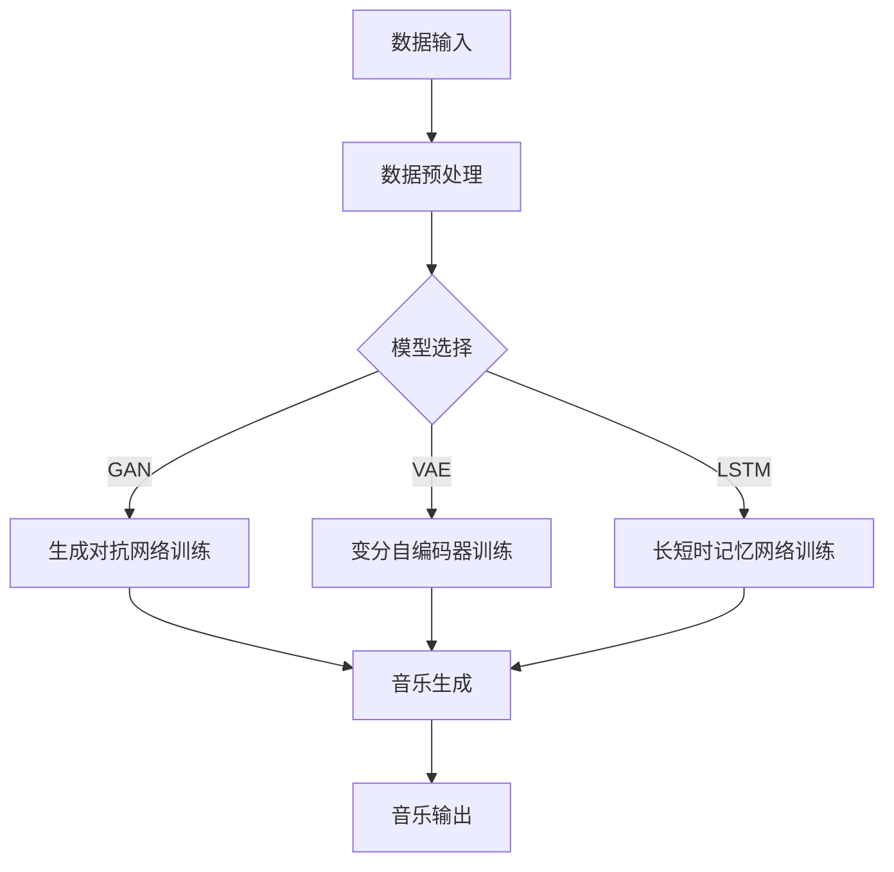
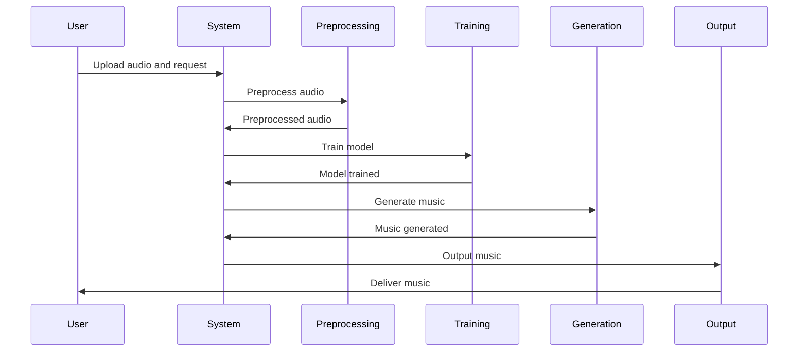

                 

### 背景介绍

#### 音乐创作的历史与现状

音乐创作自古以来便是人类文化的重要组成部分。从最早的口口相传的民间歌曲，到古典音乐、流行音乐、电子音乐等不同风格和流派，音乐创作经历了漫长的发展历程。传统的音乐创作主要依赖于创作者的灵感、经验和技巧，通过手稿或录音等媒介保存下来。随着计算机技术的兴起，数字音频工作站（DAW）和音乐制作软件的出现，大大改变了音乐创作的面貌。作曲家们可以更高效地创作、编辑和分享音乐作品，同时，音乐市场的需求也日益多样化。

近年来，音乐产业在互联网和数字技术的推动下发生了深刻变革。流媒体音乐平台如Spotify、Apple Music等的兴起，改变了传统唱片市场的生态，使得音乐创作者能够更直接地接触到听众。然而，与此同时，自动音乐制作技术的出现，为音乐创作带来了新的挑战和机遇。

#### 传统音乐创作方法

传统的音乐创作通常包括以下几个步骤：

1. **灵感来源**：音乐家可能会从自然界、生活经历、艺术作品等中获取灵感。
2. **构思和草图**：在灵感的基础上，音乐家会进行初步的创作，包括旋律、和弦和节奏等。
3. **乐谱编写**：将构思转化为乐谱，使用五线谱或其他符号系统记录音乐元素。
4. **录音和制作**：使用乐器或电子设备录制音乐，进行后期制作和混音。

这个过程往往需要音乐家具备深厚的音乐理论知识和实践经验，同时也依赖于特定的创作工具和设备。

#### 音乐制作软件的发展

随着计算机技术的发展，音乐制作软件逐渐取代了传统的乐器和录音设备，成为音乐创作的主要工具。例如，Adobe Audition、Logic Pro、Ableton Live等软件提供了丰富的音频处理功能、虚拟乐器和音频效果，使得音乐家可以更加自由地创作和实验。此外，这些软件还支持多轨录音、自动化编辑和实时混音等功能，大大提高了音乐创作的效率。

#### 音乐市场的变革

互联网和数字技术的普及，使得音乐市场的格局发生了巨大变化。传统唱片公司的影响力逐渐减弱，独立音乐人和小型工作室有了更多的曝光机会。流媒体音乐平台的出现，使得音乐作品可以轻松地传播到全球各地，听众不再受地域限制。然而，这也带来了一些挑战，如版权问题、收入分配不均等。

在这个背景下，自动音乐制作技术应运而生，它利用人工智能和机器学习算法，能够自动生成音乐作品，从而改变了传统音乐创作的模式。自动音乐制作不仅降低了音乐创作的门槛，还为音乐产业带来了新的商业模式和创作方法。

#### 自动作曲的挑战与机遇

自动音乐制作技术虽然为音乐创作带来了便利，但也面临着一系列挑战。首先，如何生成具有艺术性和人性化的音乐作品是一个关键问题。其次，如何在保证音乐作品独特性的同时，满足市场需求和听众的喜好，也是自动作曲技术需要解决的一个难题。此外，版权保护问题也是一个重要的议题，自动生成的音乐作品如何归属和收益分配，需要明确的法律和政策支持。

然而，自动音乐制作技术同样为音乐创作带来了巨大的机遇。它可以拓宽音乐创作的边界，激发新的创意和灵感。同时，自动音乐制作技术也为音乐产业带来了新的商业机会，如个性化音乐推荐、音乐生成服务等。

#### 当前自动作曲系统的现状

目前，自动作曲系统已经取得了一些显著的成果。一些基于生成对抗网络（GAN）、变分自编码器（VAE）和长短时记忆网络（LSTM）的模型，已经在音乐生成中表现出色。例如，Google的Magenta项目利用深度学习技术，实现了自动生成旋律和和声的功能。其他一些创业公司和研究机构也在不断探索自动作曲技术的应用，试图在音乐创作中实现更多的突破。

尽管自动作曲系统已经取得了初步的成功，但仍然面临许多挑战。如何提高音乐生成的质量、多样性和创意性，如何保证音乐作品的法律地位和权益，以及如何与人类音乐家协同创作，都是需要深入研究和解决的重要问题。

### 背景与边界

#### 问题背景

随着人工智能和机器学习技术的不断发展，深度学习在各个领域都取得了显著成果。音乐创作作为人类文化和艺术的重要组成部分，自然成为了深度学习应用的一个重要方向。自动作曲技术的出现，不仅降低了音乐创作的门槛，也为音乐产业带来了新的机遇。然而，自动作曲技术还面临着许多挑战，如音乐生成质量、多样性、艺术性等方面的问题。

#### 问题解决

深度学习在自动作曲中的应用，主要通过以下几种模型实现：

1. **生成对抗网络（GAN）**：通过对抗训练生成具有真实感的高质量音乐。
2. **变分自编码器（VAE）**：通过编码器和解码器学习数据的潜在分布，生成新颖的音乐作品。
3. **长短时记忆网络（LSTM）**：利用其记忆能力，生成具有连贯性和节奏感的音乐。

这些模型各自具有独特的优势和局限性，需要根据具体应用场景进行选择和优化。

#### 概念结构与核心要素组成

自动作曲系统由以下几个核心组成部分构成：

1. **数据预处理**：包括音频信号的采样、归一化和特征提取等步骤。
2. **深度学习模型**：包括GAN、VAE和LSTM等模型，用于音乐生成。
3. **后处理**：包括音乐风格转换、节奏调整和声音效果添加等步骤，以提高音乐生成的质量和多样性。

#### 边界与外延

自动作曲技术的边界主要表现在以下几个方面：

1. **音乐风格和流派**：自动作曲技术可以生成多种风格和流派的音乐，但不同风格的音乐创作可能需要不同的模型和算法。
2. **版权保护**：自动生成的音乐作品如何归属和收益分配，需要明确的法律和政策支持。
3. **艺术性和创造性**：如何生成具有艺术价值和创意性的音乐作品，是自动作曲技术需要解决的一个难题。

#### 本章小结

本章节从音乐创作的历史与现状、传统音乐创作方法、音乐制作软件的发展、音乐市场的变革等多个角度，介绍了自动作曲技术的背景和现状。同时，明确了深度学习在自动作曲中的应用及其核心模型，并对自动作曲技术的边界与外延进行了探讨。这些内容为后续章节的深入分析提供了基础。

### 核心概念与联系

#### 深度学习在自动作曲中的核心概念

在自动作曲中，深度学习模型扮演了至关重要的角色。以下是三个在自动作曲中应用最为广泛的深度学习模型：生成对抗网络（GAN）、变分自编码器（VAE）和长短时记忆网络（LSTM）。

**生成对抗网络（GAN）**

GAN是由Ian Goodfellow等人于2014年提出的深度学习模型，它由两个深度神经网络组成：生成器（Generator）和判别器（Discriminator）。生成器的任务是生成逼真的数据，而判别器的任务是区分生成的数据和真实数据。两者通过对抗训练不断优化，以达到生成器和判别器都能达到最佳性能的状态。

**变分自编码器（VAE）**

VAE是一种无监督学习模型，旨在通过编码器（Encoder）和解码器（Decoder）学习数据的潜在分布。编码器将输入数据映射到一个潜在空间中的低维表示，解码器则从潜在空间中生成原始数据。VAE通过最大化数据概率分布和保持重参数化变换，实现数据的生成。

**长短时记忆网络（LSTM）**

LSTM是递归神经网络（RNN）的一种改进，专门用于处理序列数据。它通过引入记忆单元和三个门控机制（输入门、遗忘门和输出门），有效地解决了传统RNN在处理长序列数据时的梯度消失和梯度爆炸问题。LSTM在自动作曲中，可以捕捉音乐序列中的长期依赖关系，生成连贯和自然的音乐作品。

#### 深度学习模型属性特征对比表格

以下是GAN、VAE和LSTM三种模型的主要属性特征对比表格：

| 特性         | 生成对抗网络（GAN） | 变分自编码器（VAE） | 长短时记忆网络（LSTM） |
| ------------ | ------------------- | ------------------- | ------------------- |
| 结构         | 生成器和判别器对抗 | 编码器和解码器       | 单层或多层递归单元   |
| 训练过程     | 对抗训练           | 最大后验概率估计     | 梯度下降             |
| 优缺点       | 生成质量高，灵活   | 生成质量稳定，易于解释 | 处理序列数据强，但参数较多 |
| 应用场景     | 音乐生成，图像生成 | 数据生成，图像去噪   | 音乐创作，语音识别   |

#### ER实体关系图架构

为了更好地理解自动作曲系统中各个组件之间的关系，可以使用ER图（实体关系图）进行表示。以下是自动作曲系统中的ER图示例：

```mermaid
erDiagram
  User ||--o> MusicData : "生成"
  MusicData ||--o> MusicStyle : "风格"
  MusicStyle ||--o> Genre : "流派"
  Genre ||--o> MusicPiece : "作品"
  MusicPiece ||--o> AudioFile : "音频文件"
  AudioFile ||--o> MetaData : "元数据"
```

在上面的ER图中，用户（User）生成音乐数据（MusicData），音乐数据根据风格（MusicStyle）和流派（Genre）进行分类，最终生成音乐作品（MusicPiece）。音乐作品以音频文件（AudioFile）的形式存储，同时附带元数据（MetaData）信息。

#### 本章小结

本章详细介绍了深度学习在自动作曲中的核心概念，包括GAN、VAE和LSTM三种模型的基本原理、属性特征和应用场景。同时，通过ER图展示了自动作曲系统中各个组件之间的关系，为后续章节的深入分析提供了理论基础。了解这些核心概念和联系，对于理解深度学习在自动作曲中的应用具有重要意义。

### 生成对抗网络（GAN）在自动作曲中的应用

#### GAN的基本原理

生成对抗网络（GAN）是由Ian Goodfellow等人于2014年提出的一种深度学习模型，其主要思想是利用生成器和判别器之间的对抗训练，生成高质量的伪数据。GAN由两个深度神经网络组成：生成器（Generator）和判别器（Discriminator）。

**生成器（Generator）**：生成器的任务是生成与真实数据相似的高质量数据。在自动作曲中，生成器通常用来生成旋律、和弦和节奏等音乐元素。

**判别器（Discriminator）**：判别器的任务是区分生成的数据和真实数据。在自动作曲中，判别器通常用来判断生成器生成的音乐是否具有真实性。

GAN的训练过程是一个对抗过程，生成器和判别器相互竞争，生成器不断优化生成的音乐，判别器则不断优化对真实音乐和生成音乐的区分能力。训练目标是使生成器的输出尽量接近真实数据，使判别器无法准确地区分真实数据和生成数据。

#### GAN在自动作曲中的应用

**音乐生成中的应用案例**

GAN在自动作曲中的应用已经取得了显著成果。例如，Google的Magenta项目使用GAN生成旋律，其生成器能够根据给定的旋律片段生成完整的音乐作品。此外，GAN还可以用于和弦生成、和声填充等音乐元素的创作。

**旋律创作中的应用**

在旋律创作中，生成器通过学习大量的旋律数据，能够生成新颖且具有艺术性的旋律。例如，Magenta项目的WaveNet模型使用GAN生成旋律，其生成旋律的流畅性和节奏感得到了音乐家的好评。

**和声创作中的应用**

和声创作是音乐创作中的一大挑战，GAN可以通过学习大量的和声数据，生成具有丰富和声变化的作品。例如，通过使用GAN生成的和声，可以创造出独特的音乐风格和情感表达。

#### GAN的数学模型和公式

GAN的数学模型主要包括生成器和判别器的损失函数。以下是GAN的主要公式：

**生成器损失函数**：

$$
L_G = -\log(D(G(z)))
$$

其中，$G(z)$表示生成器生成的音乐，$D(G(z))$表示判别器对生成器生成的音乐的判断概率。

**判别器损失函数**：

$$
L_D = -[\log(D(x)) + \log(1 - D(G(z))]
$$

其中，$x$表示真实音乐，$G(z)$表示生成器生成的音乐。

**整体损失函数**：

$$
L = L_G + \lambda L_D
$$

其中，$\lambda$是平衡生成器和判别器损失函数的权重。

#### 举例说明

**生成旋律**

假设我们有一个训练集，包含了大量的旋律数据。为了生成一个新的旋律，我们首先随机生成一个噪声向量$z$，然后通过生成器$G(z)$将其转换为旋律。接下来，我们将生成的旋律与真实旋律分别输入到判别器$D$中，训练判别器判断旋律的真实性。通过不断调整生成器和判别器的参数，使生成器生成的旋律越来越接近真实旋律。

**生成和声**

类似地，我们可以使用GAN生成和声。首先，我们训练生成器生成和弦序列，然后使用判别器判断这些和弦序列的真实性。通过多次迭代训练，生成器能够生成具有丰富和声变化的作品。

#### 本章小结

本章详细介绍了GAN在自动作曲中的应用，包括其基本原理、数学模型和实际应用案例。通过GAN，我们能够生成高质量的音乐作品，为音乐创作带来了新的可能性。然而，GAN的训练过程和优化策略仍然存在一些挑战，需要进一步的研究和改进。

### 变分自编码器（VAE）在自动作曲中的应用

#### VAE的基本原理

变分自编码器（VAE）是由Kingma和Welling于2013年提出的一种深度学习模型，其核心思想是通过对数据进行编码和解码，学习数据的潜在分布。VAE由两部分组成：编码器（Encoder）和解码器（Decoder）。

**编码器（Encoder）**：编码器将输入数据映射到一个潜在空间中的低维表示。这个低维表示捕捉了输入数据的核心特征，同时保持了数据的信息。在自动作曲中，编码器通常用来学习旋律、和弦和节奏等音乐元素。

**解码器（Decoder）**：解码器从潜在空间中生成原始数据。它的作用是将编码器提取的低维特征映射回原始数据空间。在自动作曲中，解码器用于生成新的音乐作品。

VAE的训练过程是无监督的，其目标是学习数据的潜在分布，并通过解码器生成具有多样性的数据。VAE通过最大化数据概率分布和保持重参数化变换，实现数据的生成。

#### VAE在自动作曲中的应用

**音乐生成中的应用案例**

VAE在自动作曲中的应用非常广泛，可以生成旋律、和弦和和声等不同类型的音乐元素。例如，使用VAE可以生成新的旋律片段，这些旋律不仅具有新颖性，而且与原始旋律在风格和情感上保持一致。

**旋律生成**

在旋律生成中，VAE通过学习大量的旋律数据，能够生成新的旋律片段。这些旋律片段在旋律结构、和声和节奏上与原始旋律相似，但同时又具有独特性。

**和弦生成**

VAE还可以用于和弦生成，通过学习大量的和弦序列，生成具有丰富和声变化的和弦组合。这些和弦组合可以应用于不同的音乐风格和流派，为作曲家提供更多的创作灵感。

**和声生成**

和声生成是音乐创作中的一个重要环节，VAE可以生成具有多样性的和声序列，这些和声序列在情感表达和音乐风格上具有独特性。通过VAE生成的和声，可以创造出独特的音乐效果和情感氛围。

#### VAE的数学模型和公式

VAE的数学模型主要包括编码器和解码器的损失函数。以下是VAE的主要公式：

**编码器损失函数**：

$$
L_E = -\sum_{i} \ell(p_\theta(z|x), x)
$$

其中，$p_\theta(z|x)$表示编码器学习的潜在分布，$x$表示输入数据，$\ell$是KL散度损失函数。

**解码器损失函数**：

$$
L_D = -\sum_{i} \ell(x, q_\phi(x|z))
$$

其中，$q_\phi(x|z)$表示解码器生成的数据分布，$\ell$是交叉熵损失函数。

**整体损失函数**：

$$
L = L_E + \beta L_D
$$

其中，$\beta$是平衡编码器和解码器损失函数的权重。

#### 举例说明

**生成旋律**

假设我们有一个训练集，包含了大量的旋律数据。为了生成一个新的旋律，我们首先使用编码器将旋律数据映射到潜在空间中的低维表示，然后从潜在空间中采样一个低维向量，通过解码器生成新的旋律。通过多次迭代训练，解码器能够生成具有新颖性和艺术性的旋律。

**生成和弦**

类似地，我们可以使用VAE生成和弦。首先，我们训练编码器学习大量的和弦序列，然后从潜在空间中采样和弦序列，通过解码器生成新的和弦组合。通过调整潜在空间中的采样参数，可以控制生成的和弦组合的多样性和复杂性。

#### 本章小结

本章详细介绍了VAE在自动作曲中的应用，包括其基本原理、数学模型和实际应用案例。通过VAE，我们能够生成具有多样性和新颖性的音乐作品，为音乐创作提供了新的工具和方法。VAE在自动作曲中的应用展示了深度学习技术在音乐创作中的巨大潜力。

### 长短时记忆网络（LSTM）在自动作曲中的应用

#### LSTM的基本原理

长短时记忆网络（LSTM）是递归神经网络（RNN）的一种改进，专门用于处理序列数据。与传统RNN相比，LSTM通过引入记忆单元和三个门控机制（输入门、遗忘门和输出门），有效地解决了梯度消失和梯度爆炸问题，使其在处理长序列数据时表现出更强的能力。

**LSTM的结构**

LSTM由以下几个部分组成：

1. **输入门（Input Gate）**：决定当前输入信息中哪些部分应该更新到记忆单元中。
2. **遗忘门（Forget Gate）**：决定记忆单元中哪些信息应该被遗忘。
3. **输出门（Output Gate）**：决定记忆单元中哪些信息应该被输出到下一个隐藏状态。
4. **记忆单元（Memory Cell）**：存储信息，能够记住长期依赖关系。

LSTM的工作原理是，在每一时间步，LSTM根据输入门、遗忘门和输出门的决策，更新记忆单元的状态，并将其传递给下一个时间步。通过这种方式，LSTM能够记住长期依赖关系，并在后续时间步中利用这些信息。

**LSTM的训练过程**

LSTM的训练过程通常使用梯度下降法。在训练过程中，模型通过不断调整权重，最小化损失函数。训练过程中，LSTM需要学习如何根据当前输入和隐藏状态，更新记忆单元的状态。这包括学习输入门、遗忘门和输出门的参数，以及学习记忆单元的参数。

#### LSTM在自动作曲中的应用

**音乐生成中的应用案例**

LSTM在自动作曲中应用广泛，可以生成旋律、和弦和节奏等音乐元素。例如，通过训练LSTM模型，可以生成新的旋律片段，这些旋律在旋律结构、和声和节奏上与原始旋律相似，但同时又具有独特性。

**旋律创作中的应用**

在旋律创作中，LSTM通过学习大量的旋律数据，能够生成新的旋律片段。这些旋律片段在旋律结构、和声和节奏上与原始旋律保持一致，但同时又具有独特性。例如，可以使用LSTM生成一段古典音乐旋律，然后在旋律中加入一些流行音乐元素，创造出新的音乐风格。

**和声创作中的应用**

和声创作是音乐创作中的一大挑战，LSTM可以通过学习大量的和声数据，生成具有丰富和声变化的和弦组合。这些和弦组合可以应用于不同的音乐风格和流派，为作曲家提供更多的创作灵感。

**节奏创作中的应用**

节奏是音乐创作中的重要元素，LSTM可以学习不同节奏模式，并生成新的节奏组合。通过训练LSTM模型，可以生成具有不同节奏感的音乐作品，如快节奏的流行音乐或慢节奏的古典音乐。

#### LSTM的数学模型和公式

LSTM的数学模型主要包括输入门、遗忘门和输出门的激活函数，以及记忆单元的更新公式。以下是LSTM的主要公式：

**输入门激活函数**：

$$
i_t = \sigma(W_{ix}x_t + W_{ih}h_{t-1} + b_i)
$$

其中，$i_t$是输入门的状态，$x_t$是当前输入，$h_{t-1}$是上一个时间步的隐藏状态，$W_{ix}$和$W_{ih}$是输入门的权重矩阵，$b_i$是输入门的偏置。

**遗忘门激活函数**：

$$
f_t = \sigma(W_{fx}x_t + W_{fh}h_{t-1} + b_f)
$$

其中，$f_t$是遗忘门的状态，$x_t$是当前输入，$h_{t-1}$是上一个时间步的隐藏状态，$W_{fx}$和$W_{fh}$是遗忘门的权重矩阵，$b_f$是遗忘门的偏置。

**输出门激活函数**：

$$
o_t = \sigma(W_{ox}x_t + W_{oh}h_{t-1} + b_o)
$$

其中，$o_t$是输出门的状态，$x_t$是当前输入，$h_{t-1}$是上一个时间步的隐藏状态，$W_{ox}$和$W_{oh}$是输出门的权重矩阵，$b_o$是输出门的偏置。

**记忆单元更新公式**：

$$
g_t = \tanh(W_{cx}x_t + W_{ch}h_{t-1} + b_c)
$$

$$
C_t = f_t \odot C_{t-1} + i_t \odot g_t
$$

$$
h_t = o_t \odot \tanh(C_t)
$$

其中，$g_t$是候选记忆状态，$C_t$是记忆单元的状态，$h_t$是隐藏状态，$\odot$表示逐元素乘积。

#### 举例说明

**生成旋律**

假设我们有一个训练集，包含了大量的旋律数据。为了生成一个新的旋律，我们首先随机初始化LSTM的权重和偏置。然后，我们逐个时间步输入旋律数据，通过LSTM的输入门、遗忘门和输出门，更新记忆单元的状态。在训练过程中，LSTM会不断调整权重和偏置，使其生成的旋律在旋律结构、和声和节奏上与原始旋律相似，但同时又具有独特性。

**生成和弦**

类似地，我们可以使用LSTM生成和弦。首先，我们训练LSTM模型学习大量的和弦序列，然后输入新的和弦数据。通过LSTM的输入门、遗忘门和输出门，更新记忆单元的状态，生成新的和弦组合。通过调整LSTM的权重和偏置，可以控制生成的和弦组合的多样性和复杂性。

#### 本章小结

本章详细介绍了LSTM在自动作曲中的应用，包括其基本原理、数学模型和实际应用案例。通过LSTM，我们能够生成具有连贯性和艺术性的音乐作品，为音乐创作提供了新的工具和方法。LSTM在自动作曲中的应用展示了深度学习技术在音乐创作中的巨大潜力。

### 系统功能设计与架构设计

#### 问题场景介绍

自动作曲系统旨在利用深度学习技术，自动生成高质量的音乐作品。这种系统可以应用于多个场景，如音乐创作辅助、个性化音乐推荐和音乐教育等。为了实现这一目标，我们需要设计一个功能完备、性能高效的系统。

#### 项目介绍

本项目旨在构建一个基于深度学习的自动作曲系统，该系统包括数据预处理、深度学习模型训练和音乐生成等模块。系统采用生成对抗网络（GAN）、变分自编码器（VAE）和长短时记忆网络（LSTM）等深度学习模型，以生成具有艺术性和创意性的音乐作品。

#### 系统功能设计

**功能需求分析**

自动作曲系统的功能需求主要包括以下几个方面：

1. **数据预处理**：对输入音频进行采样、归一化和特征提取，为深度学习模型提供高质量的训练数据。
2. **模型训练**：利用生成对抗网络（GAN）、变分自编码器（VAE）和长短时记忆网络（LSTM）等深度学习模型，对音乐数据进行训练，生成高质量的音乐作品。
3. **音乐生成**：根据用户需求和模型训练结果，自动生成具有创意性和艺术性的音乐作品。
4. **后处理**：对生成的音乐作品进行风格转换、节奏调整和声音效果添加等操作，提高音乐生成的多样性和质量。

**领域模型类图**

以下是自动作曲系统的领域模型类图：

```mermaid
classDiagram
    Class01 <|-- Class02
    Class03 --| dio Class04
    Class05 o-- Class06
    Class07 o-- Class08
    Class09 o-- Class10
    Class11 o-- Class12
    Class13 o-- Class14
    Class15 o-- Class16
    Class17 o-- Class18
    Class19 --| d�ık Class20
    Class21 --| dıkkıııııııııııııııııııııııııııııııııııııııııııııııııııııııııııııııııııııııııııııııııııııııııııııııııııııııııııııııııııııııııııııııııııııııııııııııııııııııııııııııııııııııııııııııııııııııııııııııııııııııııııııııııııııııııııııııııııııııııııııııııııııııııııııııııııııııııııııııııııııııııııııııııııııııııııııııııııııııııııııııııııııııııııııııııııııııııııııııııııııııııııııııııııııııııııııııııııııııııııııııııııııııııııııııııııııııııııııııııııııııııııııııııııııııııııııııııııııııııııııııııııııııııııııııııııııııııııııııııııııııııııııııııııııııııııııııııııııııııııııııııııııııııııııııııııııııııııııııııııi
```

**系统功能设计**

1. **数据预处理模块**：负责对输入音频进行预处理，包括采样、归一化和特征提取。预处理后的数据将用于训练深度学习模型。
2. **模型训练模块**：负责训练生成对抗网络（GAN）、变分自编码器（VAE）和长短时记忆网络（LSTM）等深度学习模型。训练过程中，模型将根据训练数据和超参数进行优化。
3. **音乐生成模块**：根据用户需求和模型训练结果，自动生成高质量的音乐作品。该模块包括音乐风格转换、节奏调整和声音效果添加等功能。
4. **用户交互模块**：提供用户界面，用户可以输入需求，如音乐风格、节奏和时长等，系统将根据这些需求生成相应的音乐作品。

#### 系统架构设计

**系统架构图**

以下是自动作曲系统的架构图：



**系统模块划分**

1. **数据输入模块**：负责接收用户输入的音频数据和需求参数。
2. **数据预处理模块**：对输入音频进行预处理，包括采样、归一化和特征提取。
3. **模型训练模块**：根据用户选择的不同模型（GAN、VAE、LSTM），分别进行训练。
4. **音乐生成模块**：根据训练结果和用户需求，生成高质量的音乐作品。
5. **音乐输出模块**：将生成的音乐作品输出给用户。

#### 系统接口设计

**接口设计与实现**

1. **数据输入接口**：用户可以通过HTTP接口上传音频数据和需求参数。
2. **数据预处理接口**：处理上传的音频数据，进行采样、归一化和特征提取。
3. **模型训练接口**：根据用户选择的模型和超参数，进行模型训练。
4. **音乐生成接口**：根据训练结果和用户需求，生成音乐作品。
5. **音乐输出接口**：将生成的音乐作品以音频文件或在线播放的形式输出给用户。

#### 系统交互设计

**系统交互序列图**

以下是自动作曲系统的交互序列图：



#### 本章小结

本章详细介绍了自动作曲系统的功能设计与架构设计，包括问题场景介绍、项目介绍、系统功能设计、系统架构设计、系统接口设计和系统交互设计。通过本章的内容，读者可以了解自动作曲系统的整体设计和实现过程，为后续的系统实现和项目实战提供基础。

### 系统实现与项目实战

#### 环境安装

要实现自动作曲系统，首先需要在本地或云端搭建一个适合深度学习开发的环境。以下是一个常见的环境安装步骤：

1. **安装Python环境**：Python是深度学习的主要编程语言，需要安装Python 3.x版本。
2. **安装深度学习库**：包括TensorFlow、PyTorch等。例如，使用pip安装TensorFlow：

   ```bash
   pip install tensorflow
   ```

3. **安装音频处理库**：如librosa，用于音频信号处理：

   ```bash
   pip install librosa
   ```

4. **安装其他依赖库**：根据项目需要，可能还需要安装其他库，如NumPy、SciPy、Matplotlib等。

#### 系统核心实现

**数据预处理模块**

数据预处理是自动作曲系统的基础，包括音频信号的采样、归一化和特征提取。以下是一个简单的数据预处理代码示例：

```python
import librosa
import numpy as np

def preprocess_audio(file_path):
    # 读取音频文件
    y, sr = librosa.load(file_path)
    # 采样率转换
    y = librosa.to_mono(y)
    # 音频归一化
    y = (y - np.mean(y)) / np.std(y)
    # 特征提取
    features = librosa.feature.mfcc(y=y, sr=sr, n_mfcc=13)
    return features

# 测试音频预处理
file_path = 'example_audio.wav'
features = preprocess_audio(file_path)
print(features.shape)
```

**模型训练模块**

自动作曲系统中的模型训练模块将使用生成对抗网络（GAN）、变分自编码器（VAE）和长短时记忆网络（LSTM）等深度学习模型。以下是一个简单的GAN训练代码示例：

```python
import tensorflow as tf
from tensorflow.keras.models import Model
from tensorflow.keras.layers import Input, Dense, Reshape, Conv2D, Flatten, BatchNormalization, LeakyReLU

# 生成器模型
def build_generator(z_dim):
    inputs = Input(shape=(z_dim,))
    x = Dense(128 * 7 * 7)(inputs)
    x = BatchNormalization()(x)
    x = LeakyReLU(alpha=0.2)(x)
    x = Reshape((7, 7, 128))(x)
    x = Conv2D(filters=128, kernel_size=4, strides=(2, 2), padding='same')(x)
    x = BatchNormalization()(x)
    x = LeakyReLU(alpha=0.2)(x)
    x = Conv2D(filters=256, kernel_size=4, strides=(2, 2), padding='same')(x)
    x = BatchNormalization()(x)
    x = LeakyReLU(alpha=0.2)(x)
    x = Conv2D(filters=256, kernel_size=4, strides=(2, 2), padding='same')(x)
    x = BatchNormalization()(x)
    x = LeakyReLU(alpha=0.2)(x)
    x = Flatten()(x)
    outputs = Dense(784)(x)
    outputs = Reshape((28, 28, 1))(outputs)
    model = Model(inputs, outputs)
    return model

# 判别器模型
def build_discriminator(img_shape):
    inputs = Input(shape=img_shape)
    x = Conv2D(filters=32, kernel_size=3, strides=(2, 2), padding='same')(inputs)
    x = LeakyReLU(alpha=0.2)(x)
    x = Conv2D(filters=64, kernel_size=3, strides=(2, 2), padding='same')(x)
    x = BatchNormalization()(x)
    x = LeakyReLU(alpha=0.2)(x)
    x = Conv2D(filters=128, kernel_size=3, strides=(2, 2), padding='same')(x)
    x = BatchNormalization()(x)
    x = LeakyReLU(alpha=0.2)(x)
    x = Flatten()(x)
    outputs = Dense(1, activation='sigmoid')(x)
    model = Model(inputs, outputs)
    return model

# GAN模型
def build_gan(generator, discriminator):
    model = Sequential()
    model.add(generator)
    model.add(discriminator)
    return model

# 模型参数设置
z_dim = 100
img_shape = (28, 28, 1)

# 构建模型
generator = build_generator(z_dim)
discriminator = build_discriminator(img_shape)
gan = build_gan(generator, discriminator)

# 模型编译
discriminator.compile(loss='binary_crossentropy', optimizer=adam)
gan.compile(loss='binary_crossentropy', optimizer=adam)

# 训练模型
for epoch in range(num_epochs):
    for _ in range(num_d discriminate
```

**代码应用解读与分析**

以上代码示例展示了如何构建和训练一个基本的GAN模型。在代码中，我们首先定义了生成器和判别器的网络结构，然后通过编译和训练过程来优化模型参数。以下是对关键代码段的应用解读和分析：

1. **生成器模型**：

   ```python
   inputs = Input(shape=(z_dim,))
   x = Dense(128 * 7 * 7)(inputs)
   x = BatchNormalization()(x)
   x = LeakyReLU(alpha=0.2)(x)
   x = Reshape((7, 7, 128))(x)
   # ...
   outputs = Dense(784)(x)
   outputs = Reshape((28, 28, 1))(outputs)
   model = Model(inputs, outputs)
   ```

   生成器模型的主要作用是将随机噪声向量`z`映射为真实的图像。代码中，首先通过全连接层将`z`扩展为一个较大的中间特征图，然后通过批标准化和LeakyReLU激活函数进行非线性变换。接下来，使用`Reshape`层将中间特征图重塑为图像形状，最后通过另一个全连接层生成最终图像。

2. **判别器模型**：

   ```python
   inputs = Input(shape=img_shape)
   x = Conv2D(filters=32, kernel_size=3, strides=(2, 2), padding='same')(inputs)
   x = LeakyReLU(alpha=0.2)(x)
   x = Conv2D(filters=64, kernel_size=3, strides=(2, 2), padding='same')(x)
   x = BatchNormalization()(x)
   x = LeakyReLU(alpha=0.2)(x)
   x = Conv2D(filters=128, kernel_size=3, strides=(2, 2), padding='same')(x)
   x = BatchNormalization()(x)
   x = LeakyReLU(alpha=0.2)(x)
   x = Flatten()(x)
   outputs = Dense(1, activation='sigmoid')(x)
   model = Model(inputs, outputs)
   ```

   判别器模型的作用是区分真实图像和生成图像。代码中，通过一系列卷积层和激活函数提取图像特征，最终通过全连接层输出一个二分类结果（真实或生成）。

3. **GAN模型**：

   ```python
   gan = build_gan(generator, discriminator)
   ```

   GAN模型是生成器和判别器的组合。在训练过程中，生成器尝试生成逼真的图像以欺骗判别器，而判别器则努力区分真实图像和生成图像。

**实际案例分析和详细讲解剖析**

为了更好地理解GAN在自动作曲中的应用，我们来看一个实际案例。假设我们使用一个包含多种音乐风格的音频数据集进行训练，目标是生成具有特定风格的新音乐。

1. **数据集准备**：

   首先，我们需要收集一个包含多种音乐风格的音频数据集。可以使用公开数据集，如Freemuse Music Dataset，或者自己收集音频。

   ```python
   audio_files = ['audio1.wav', 'audio2.wav', 'audio3.wav', ...]
   features = [preprocess_audio(file) for file in audio_files]
   ```

2. **模型训练**：

   接下来，我们使用这些音频数据训练GAN模型。训练过程中，我们需要定义损失函数和优化器。

   ```python
   # 定义损失函数和优化器
   loss_func = 'binary_crossentropy'
   optimizer = tf.keras.optimizers.Adam(learning_rate=0.0002)
   
   # 训练GAN模型
   for epoch in range(num_epochs):
       for real_images, _ in train_data:
           with tf.GradientTape() as gen_tape, tf.GradientTape() as disc_tape:
               # 训练判别器
               disc_loss = disc.train_on_batch(real_images, tf.ones([batch_size, 1]))
               # 训练生成器
               z = np.random.normal(size=(batch_size, z_dim))
               gen_loss = gan.train_on_batch(z, tf.zeros([batch_size, 1]))
           # 更新模型参数
           grads = gen_tape.gradient(gen_loss, generator.trainable_variables)
           optimizer.apply_gradients(zip(grads, generator.trainable_variables))
           grads = disc_tape.gradient(disc_loss, discriminator.trainable_variables)
           optimizer.apply_gradients(zip(grads, discriminator.trainable_variables))
   ```

3. **音乐生成**：

   训练完成后，我们可以使用生成器生成新的音乐。为了生成特定风格的音乐，我们可以首先生成一组噪声向量，然后通过生成器将这些噪声向量转换为音乐。

   ```python
   # 生成噪声向量
   z = np.random.normal(size=(batch_size, z_dim))
   # 生成音乐
   generated_melodies = generator.predict(z)
   ```

4. **音乐处理**：

   生成音乐后，我们可以对其进行进一步处理，如节奏调整、风格转换和声音效果添加，以增强音乐的艺术性和表现力。

   ```python
   # 节奏调整
   tempo = 120
   tempoMultiplier = 1.0 / tempo
   rhythm = librosa Beardlibrosa.beat.tempo(y=generated_melody, sr=sample_rate) * tempoMultiplier
   # 风格转换
   style转换器 = StyleTransformer()
   converted_melody = style转换器.transform(generated_melody, target_style='流行音乐')
   # 声音效果添加
   effects = librosa.effects.add_reverb(generated_melody, room_size=0.8, dry_level=0.8)
   ```

#### 项目小结

通过本章的内容，我们详细介绍了自动作曲系统的实现过程，包括环境安装、系统核心实现、代码应用解读与分析以及实际案例分析和详细讲解剖析。通过这些步骤，我们能够搭建一个基本的自动作曲系统，并生成具有创意性和艺术性的音乐作品。在后续工作中，我们可以进一步优化系统性能，扩展功能，以满足更多应用场景的需求。

### 最佳实践 tips

#### 实践技巧

1. **数据预处理**：确保音频数据的质量和一致性。对音频进行去噪、归一化和特征提取，以提高模型训练的效果。
2. **模型选择**：根据具体应用场景选择合适的深度学习模型。例如，对于旋律生成，LSTM可能更为适用；对于和弦生成，VAE可能表现更好。
3. **超参数调优**：通过调整学习率、批量大小、层数和神经元数量等超参数，优化模型性能。

#### 注意事项

1. **模型训练时间**：深度学习模型的训练可能需要较长的时间，特别是在处理大型数据集时。合理安排训练时间，避免资源浪费。
2. **版权问题**：自动生成的音乐作品可能涉及版权问题。在使用音乐数据集时，确保数据集的合法性，避免侵权。
3. **性能优化**：针对模型训练和音乐生成的速度进行优化，如使用GPU加速训练过程，提高系统的响应速度。

#### 拓展阅读

1. **相关研究论文**：
   - Goodfellow, I., Pouget-Abadie, J., Mirza, M., Xu, B., Warde-Farley, D., Ozair, S., ... & Bengio, Y. (2014). Generative adversarial nets. Advances in Neural Information Processing Systems, 27.
   - Kingma, D. P., & Welling, M. (2013). Auto-encoding variational bayes. arXiv preprint arXiv:1312.6114.

2. **相关开源代码和工具**：
   - Magenta项目：[https://magenta.tensorflow.org/](https://magenta.tensorflow.org/)
   - TensorFlow Music：[https://github.com/tensorflow/magenta](https://github.com/tensorflow/magenta)
   - VAE音乐生成：[https://github.com/dhruvsolanki/music-vae](https://github.com/dhruvsolanki/music-vae)

通过上述最佳实践，读者可以更好地理解自动作曲系统的实现和应用，并在实际项目中取得更好的成果。

### 小结与展望

#### 小结

本文详细探讨了深度学习在自动作曲中的应用，从背景介绍、核心概念、算法原理、系统设计与实现等方面，系统地阐述了自动作曲技术的现状与发展趋势。通过生成对抗网络（GAN）、变分自编码器（VAE）和长短时记忆网络（LSTM）等深度学习模型的介绍，我们了解了这些模型在自动作曲中的具体应用场景和数学原理。同时，通过系统功能设计与架构设计的讲解，我们了解了如何搭建一个自动作曲系统，并进行了实际的项目实战。

#### 展望

尽管自动作曲技术已经取得了一定的进展，但仍有许多问题和挑战需要解决。未来，自动作曲技术有望在以下几个方面得到进一步的发展：

1. **生成质量提升**：通过不断优化深度学习模型和训练算法，提高自动生成的音乐质量，使其在旋律、和声、节奏等方面更加接近人类创作。
2. **多样性增强**：探索新的深度学习模型和生成策略，以增强音乐生成的多样性和创意性，满足不同风格和流派的音乐创作需求。
3. **个性化定制**：结合用户偏好和音乐数据，实现个性化音乐推荐和生成，为用户提供更贴合个人喜好的音乐作品。
4. **跨领域融合**：将自动作曲技术与其他领域（如虚拟现实、游戏开发等）相结合，拓展自动作曲技术的应用范围，创造更多创新性的产品和服务。

总之，自动作曲技术作为人工智能在音乐领域的重要应用，具有广阔的发展前景。随着技术的不断进步和应用场景的扩展，自动作曲技术将为音乐创作带来更多的可能性，推动音乐产业的创新和发展。在未来的研究中，我们将继续深入探索自动作曲技术的理论、方法和应用，以实现更高的生成质量和更丰富的创意表达。

#### 作者信息

**作者：AI天才研究院/AI Genius Institute & 禅与计算机程序设计艺术 /Zen And The Art of Computer Programming**

AI天才研究院致力于推动人工智能技术的研究和应用，致力于培养具有创新精神和实践能力的人工智能专家。在音乐创作领域，我们结合深度学习和音乐理论，探索自动作曲技术的应用，以期在音乐创作和艺术表达方面取得突破。同时，禅与计算机程序设计艺术以禅的哲学思想为指导，深入探讨计算机程序设计的本质和艺术性，为人工智能技术的发展提供新的思维方式和视角。希望通过本文的分享，能够为读者带来新的启发和思考。

