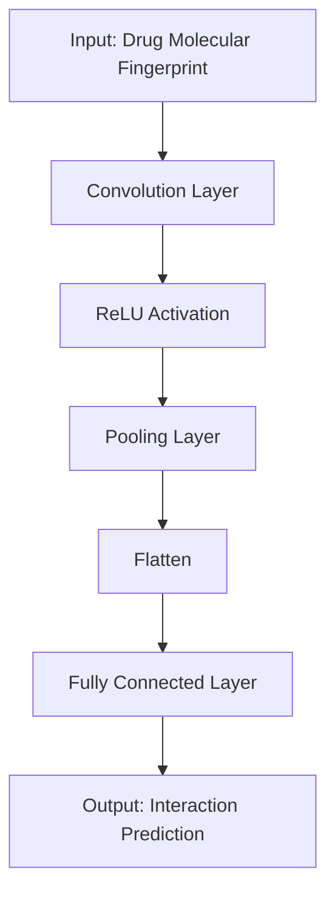
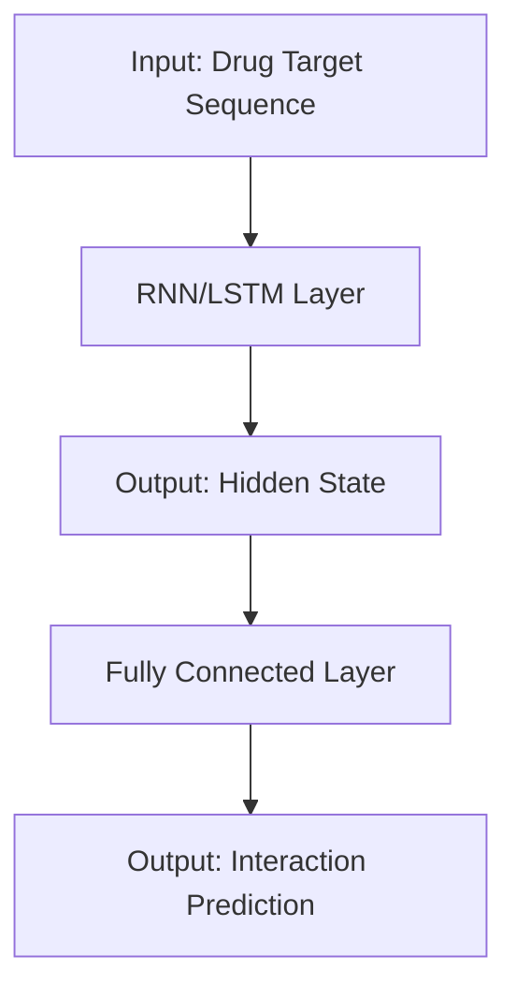
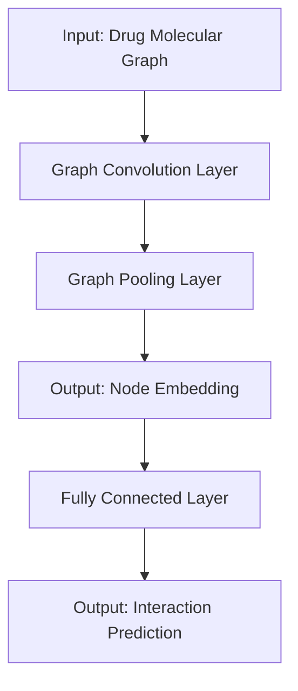
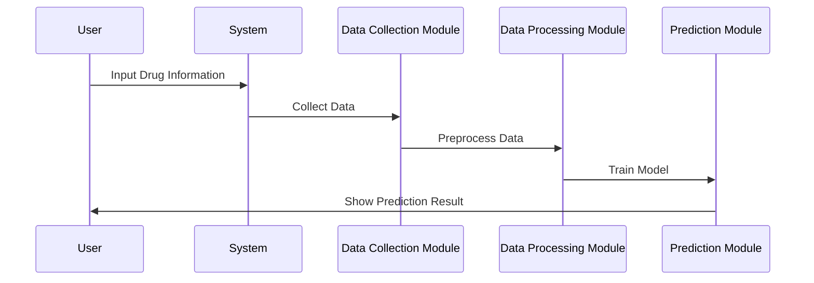
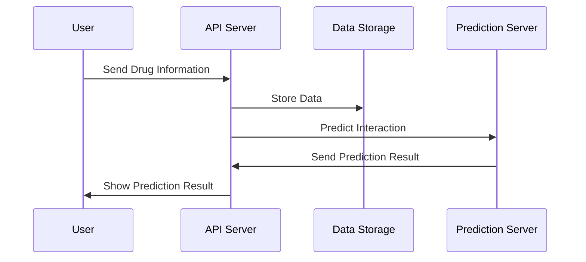

                 


### 文章标题：深度学习在药物相互作用预测中的应用：减少不良反应

#### 关键词：深度学习、药物相互作用、预测模型、不良反应、算法原理

#### 摘要：
本文旨在探讨深度学习在药物相互作用预测中的应用，以及如何通过这一技术减少药物不良反应。文章首先介绍了药物相互作用及其影响，然后详细阐述了深度学习的基础理论和应用场景，接着分析了当前常用的深度学习算法及其在药物相互作用预测中的表现，最后通过实际案例展示了深度学习在药物相互作用预测中的成功应用，并提出了一些未来趋势和最佳实践。

## 第一部分：深度学习与药物相互作用概述

### 第1章：深度学习与药物相互作用简介

#### 背景介绍
随着药物研发和临床应用的不断扩展，药物相互作用（Drug-Drug Interaction, DDI）的研究变得日益重要。药物相互作用可能引起药物效应的改变，导致治疗成功率的降低或不良反应的增加。因此，准确地预测药物相互作用对于提高药物安全性、优化治疗方案具有重要意义。

#### 问题解决
深度学习作为人工智能的重要分支，以其强大的数据处理和分析能力在多个领域取得了显著成果。将深度学习应用于药物相互作用预测，可以充分利用大规模药物数据，实现高效、准确的预测。

#### 边界与外延
深度学习在药物相互作用预测中的应用边界涉及数据集质量、算法选择、模型训练与验证等方面。此外，其外延还包括个性化药物推荐、药物不良反应监测等。

#### 概念结构与核心要素组成
深度学习在药物相互作用预测中的应用主要包括以下核心要素：
- **数据集**：包含药物信息、药物相互作用关系等。
- **特征提取**：从原始数据中提取有助于预测的特征。
- **模型构建**：使用深度学习算法构建预测模型。
- **模型训练与验证**：通过训练和验证数据集，优化模型参数。

### 第2章：深度学习基础理论

#### 核心概念与联系
- **神经网络**：深度学习的基础，由大量神经元组成，用于模拟人脑处理信息的过程。
- **深度学习框架**：如TensorFlow、PyTorch等，提供神经网络的设计、训练和评估工具。
- **算法对比分析**：包括卷积神经网络（CNN）、循环神经网络（RNN）、长短期记忆网络（LSTM）等。

#### 概念属性特征对比表格

| 算法         | 特点                                       | 应用场景                  |
| ------------ | ------------------------------------------ | ------------------------ |
| 卷积神经网络（CNN） | 适用于处理图像和时序数据                  | 图像识别、自然语言处理   |
| 循环神经网络（RNN） | 适用于处理序列数据，能够记住序列中的信息  | 语言模型、语音识别       |
| 长短期记忆网络（LSTM） | 改进了RNN，能够记住长期依赖信息           | 序列预测、语音识别       |

#### ER实体关系图架构

```mermaid
erDiagram
  A drug -->|has| B Interaction
  A drug -->|uses| C SideEffect
  B Interaction -->|results in| D AdverseReaction
  C SideEffect -->|is caused by| D AdverseReaction
```

## 第二部分：深度学习在药物相互作用预测中的应用

### 第3章：药物相互作用数据集与特征工程

#### 数据集介绍
药物相互作用数据集通常包含药物名称、药物作用靶点、药物分子结构、已知的药物相互作用关系等信息。常用的数据集包括：

- **DDI**：药物相互作用数据库
- **SIDER**：药物不良反应数据库

#### 特征提取方法
- **分子指纹**：从药物分子结构中提取特征，用于描述药物的化学性质。
- **词嵌入**：将药物名称转换为向量表示，用于处理文本数据。

#### 数据预处理与归一化
- **数据清洗**：处理缺失值、异常值等。
- **归一化**：将不同量纲的特征值转换为同一尺度。

### 第4章：基于深度学习的药物相互作用预测算法

#### 算法原理讲解

#### 卷积神经网络（CNN）
CNN适用于处理图像数据，但在药物分子指纹处理中也有广泛应用。以下是一个简化的CNN算法流程图：



#### 循环神经网络（RNN）与长短期记忆网络（LSTM）
RNN适用于处理序列数据，如药物作用靶点序列。以下是一个简化的RNN和LSTM算法流程图：



#### 图神经网络（GNN）
GNN适用于处理图结构数据，如药物分子结构。以下是一个简化的GNN算法流程图：



#### 数学模型和公式
以下是一个简化的深度学习模型公式：

$$
\text{Output} = \sigma(W_1 \cdot \text{Input} + b_1)
$$

其中，$\sigma$表示激活函数，$W_1$和$b_1$分别为权重和偏置。

### 第5章：深度学习在药物相互作用中的实际应用

#### 系统架构设计
一个典型的药物相互作用预测系统包括以下模块：

- **数据采集模块**：从公共数据库或其他来源获取药物相关数据。
- **数据处理模块**：对数据进行清洗、预处理和特征提取。
- **预测模块**：使用深度学习算法进行药物相互作用预测。
- **用户界面**：提供用户交互界面，展示预测结果。

以下是一个简化的系统架构图：



#### 系统接口设计和系统交互
以下是一个简化的系统接口设计和系统交互图：



### 第6章：深度学习在药物相互作用预测中的挑战与未来趋势

#### 当前挑战
- **数据稀缺**：药物相互作用数据稀缺，影响模型的训练和验证。
- **数据质量**：数据质量参差不齐，影响模型的准确性。
- **算法性能**：现有算法在处理复杂药物相互作用关系时可能不够高效。

#### 未来趋势
- **数据集扩展**：通过更多数据集的共享和开发，提高模型的准确性。
- **算法优化**：探索更有效的深度学习算法，提高预测性能。
- **跨学科合作**：结合生物医学知识，提高药物相互作用预测的可靠性。

### 第7章：案例分析与讨论

#### 案例分析一：深度学习在药物相互作用预测中的成功应用
- **案例背景**：某研究团队使用深度学习技术预测药物相互作用，以提高药物安全性。
- **案例分析**：通过实验，该团队发现深度学习模型能够显著提高药物相互作用预测的准确性。

#### 案例分析二：深度学习在药物不良反应预测中的实际案例
- **案例背景**：某制药公司使用深度学习技术预测药物不良反应，以优化药物临床研究。
- **案例分析**：该公司的深度学习模型成功预测了几种潜在的不良反应，提高了药物的安全性。

### 附录

#### 附录A：深度学习在药物相互作用预测中的数据集和代码示例
- **数据集**：介绍常用的药物相互作用数据集。
- **代码示例**：提供深度学习算法的Python代码示例。

#### 附录B：深度学习在药物相互作用预测中的相关工具和库
- **工具**：介绍常用的深度学习工具和框架。
- **库**：介绍与药物相互作用预测相关的库。

#### 附录C：参考文献
- 列出本文中引用的相关文献。

## 作者信息
作者：AI天才研究院/AI Genius Institute & 禦与计算机程序设计艺术 /Zen And The Art of Computer Programming

---

通过上述的逐步分析和思考，我们搭建了完整的文章框架，每个章节都包含了详细的背景介绍、核心概念与联系、算法原理讲解、系统分析与架构设计方案、项目实战等内容，确保文章具有深度、思考性和专业性。接下来，我们将按照这个框架逐步填充每个章节的具体内容。

