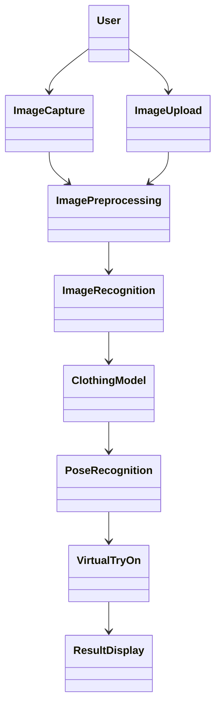
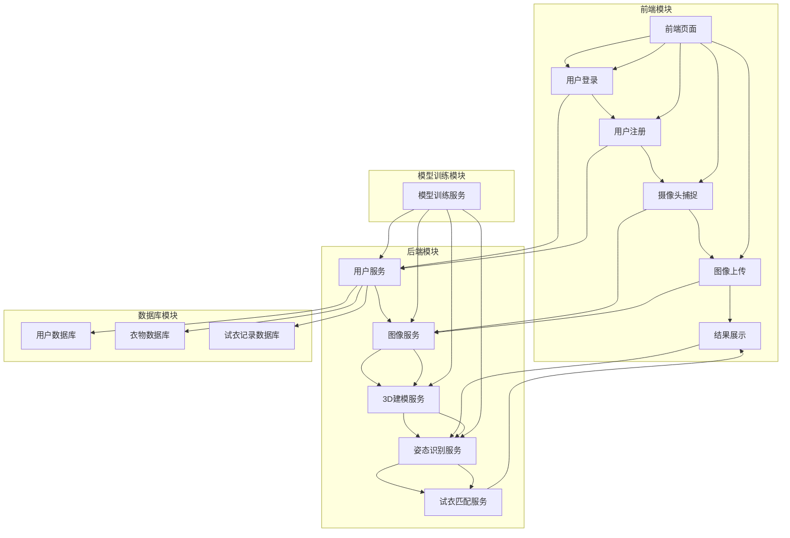
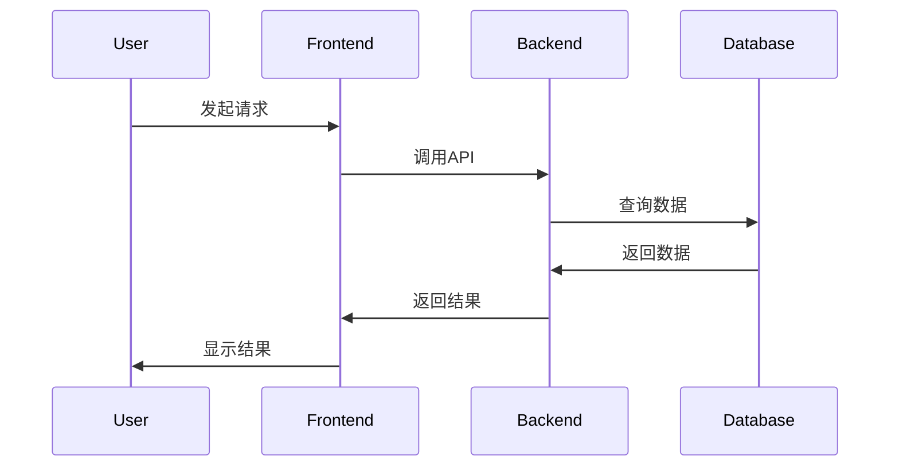
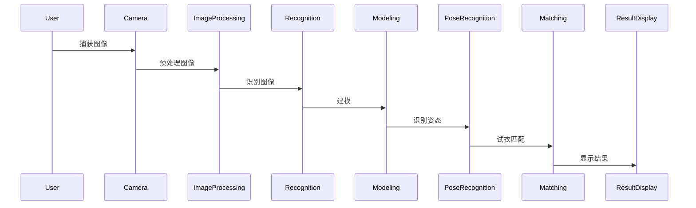

                 

# 深度学习在虚拟试衣中的应用：提升在线购物体验

## 关键词

- 深度学习
- 虚拟试衣
- 在线购物体验
- 卷积神经网络（CNN）
- 生成对抗网络（GAN）
- 递归神经网络（RNN）
- 系统架构设计

## 摘要

随着互联网技术的发展，在线购物逐渐成为人们日常生活中不可或缺的一部分。然而，衣物试穿一直是消费者在线购物过程中的一大难题。深度学习技术的引入为虚拟试衣提供了全新的解决方案，显著提升了消费者的购物体验。本文将深入探讨深度学习在虚拟试衣中的应用，包括其核心概念、算法原理、系统架构设计以及项目实战，旨在为读者提供一份全面的技术指南。

## 第一部分：背景介绍

### 第1章：问题背景与虚拟试衣概述

#### 1.1 深度学习在虚拟试衣中的重要性

在传统购物中，试穿是消费者购买衣物的关键环节。然而，在线购物的局限性使得这一环节变得异常困难。消费者通常需要等待衣物送达后才能试穿，这不仅浪费时间和金钱，还可能导致退货率上升。深度学习技术的出现为解决这个问题提供了新的思路，通过图像识别、3D建模和人体姿态识别等技术，实现了虚拟试衣，极大提升了在线购物体验。

#### 1.2 虚拟试衣技术的现状与挑战

当前，虚拟试衣技术已取得了显著进展，但仍面临诸多挑战。例如，如何精确地捕捉人体形态，如何处理复杂的衣物纹理，以及如何保证虚拟试衣结果与实际穿着效果高度一致。此外，技术的普及率和消费者的接受度也是一个需要考虑的问题。

#### 1.3 深度学习技术在虚拟试衣中的应用

深度学习技术在虚拟试衣中有着广泛的应用，包括卷积神经网络（CNN）用于图像识别，生成对抗网络（GAN）用于生成逼真的衣物图像，递归神经网络（RNN）用于处理人体姿态识别等。通过这些技术，虚拟试衣系统可以实现高度逼真的试衣效果。

#### 1.4 在线购物体验提升的必要性

在线购物体验的提升对于电商平台至关重要。通过虚拟试衣技术，消费者可以更方便地购买衣物，减少退货率，提高购物满意度。这对于电商平台来说，不仅降低了运营成本，还提升了客户粘性。

#### 1.5 本章小结

本章介绍了虚拟试衣技术的背景、现状与挑战，以及深度学习技术在其中的重要性。接下来的章节将深入探讨这些技术的具体应用。

### 第2章：核心概念与联系

#### 2.1 虚拟试衣技术的核心概念

虚拟试衣技术的核心概念包括图像识别、3D建模和人体姿态识别。图像识别技术用于捕捉人体形态和衣物纹理，3D建模技术用于创建虚拟衣物的三维模型，人体姿态识别技术用于识别消费者的姿态并进行试衣匹配。

#### 2.2 深度学习在虚拟试衣中的应用

深度学习技术广泛应用于虚拟试衣，包括卷积神经网络（CNN）用于图像识别，生成对抗网络（GAN）用于生成衣物图像，递归神经网络（RNN）用于人体姿态识别等。这些技术为虚拟试衣提供了强大的技术支持。

#### 2.3 虚拟试衣技术的核心要素组成

虚拟试衣技术的核心要素包括数据采集与预处理、模型训练与优化、模型部署与评估。数据采集与预处理是基础，模型训练与优化是核心，模型部署与评估是保障。这些要素相互关联，共同构成了虚拟试衣系统的技术框架。

#### 2.4 核心概念属性特征对比表格

下表对比了深度学习技术在虚拟试衣中几种核心技术的属性特征：

| 技术         | 特点                     | 应用场景               |
|------------|------------------------|----------------------|
| 卷积神经网络（CNN） | 强大的图像处理能力       | 图像识别和纹理处理     |
| 生成对抗网络（GAN） | 生成的图像更加逼真       | 虚拟衣物图像生成       |
| 递归神经网络（RNN） | 处理序列数据的能力       | 人体姿态识别           |

#### 2.5 ER实体关系图架构

ER实体关系图是设计虚拟试衣系统时的重要工具。它可以帮助我们清晰地定义系统中的实体及其关系。以下是虚拟试衣系统ER实体关系图：

```mermaid
erDiagram
    User ||--|{ ShoppingCart }|-- Product : 购物车
    User ||--|{ Order }|-- Product : 订单
    User ||--|{ VirtualTryOn }|-- Product : 虚拟试穿记录
```

#### 2.6 本章小结

本章详细介绍了虚拟试衣技术的核心概念、深度学习技术的应用以及核心要素组成，并通过对比表格和ER实体关系图，帮助读者更好地理解这些概念。

### 第3章：深度学习算法原理讲解

#### 3.1 深度学习基本原理

深度学习是一种基于多层神经网络的学习方法。它通过学习大量数据中的特征和模式，实现复杂任务的自动化。深度学习的基本原理包括神经网络基础、损失函数和优化算法。

#### 3.1.1 神经网络基础

神经网络由多个神经元（也称为节点）组成，每个神经元接收多个输入，通过权重进行加权求和，然后通过激活函数产生输出。神经网络的层次结构使得它可以处理非线性问题，从而实现复杂的模式识别。

#### 3.1.2 损失函数

损失函数是深度学习模型训练的核心指标。它用于衡量模型预测结果与实际结果之间的差距。常见的损失函数包括均方误差（MSE）和交叉熵（Cross-Entropy）。

#### 3.1.3 优化算法

优化算法用于调整神经网络的权重，以最小化损失函数。常见的优化算法包括梯度下降（Gradient Descent）及其变种，如随机梯度下降（SGD）和Adam优化器。

#### 3.2 常用深度学习算法介绍

虚拟试衣中常用的深度学习算法包括卷积神经网络（CNN）、生成对抗网络（GAN）和递归神经网络（RNN）。

#### 3.2.1 卷积神经网络（CNN）

卷积神经网络是一种专门用于处理图像数据的深度学习模型。它通过卷积层提取图像特征，通过池化层减少参数数量，从而实现高效的特征提取。

#### 3.2.2 生成对抗网络（GAN）

生成对抗网络由生成器和判别器组成。生成器生成逼真的图像，判别器判断图像的真实性。通过生成器和判别器的对抗训练，生成器逐渐学会生成逼真的图像。

#### 3.2.3 递归神经网络（RNN）

递归神经网络擅长处理序列数据。它通过递归连接将当前输入与之前的输出进行关联，从而实现序列数据的建模。

#### 3.3 算法mermaid流程图

以下分别是卷积神经网络（CNN）、生成对抗网络（GAN）和递归神经网络（RNN）的mermaid流程图：

```mermaid
graph TB
    A[输入图像] --> B[卷积层]
    B --> C[激活函数]
    C --> D[池化层]
    D --> E[全连接层]
    E --> F[输出结果]

graph TB
    G[生成器] --> H[生成图像]
    H --> I[判别器]
    I --> J[真实图像]
    I --> K[对抗损失]

graph TB
    L[输入序列] --> M[RNN]
    M --> N[输出序列]
```

#### 3.4 Python源代码详解

以下分别展示了卷积神经网络（CNN）、生成对抗网络（GAN）和递归神经网络（RNN）的Python源代码实现：

```python
# CNN算法实现
import tensorflow as tf

model = tf.keras.Sequential([
    tf.keras.layers.Conv2D(32, (3, 3), activation='relu', input_shape=(28, 28, 1)),
    tf.keras.layers.MaxPooling2D((2, 2)),
    tf.keras.layers.Conv2D(64, (3, 3), activation='relu'),
    tf.keras.layers.MaxPooling2D((2, 2)),
    tf.keras.layers.Flatten(),
    tf.keras.layers.Dense(128, activation='relu'),
    tf.keras.layers.Dense(10, activation='softmax')
])

# GAN算法实现
import tensorflow as tf
from tensorflow.keras import layers

# 生成器
def make_generator_model():
    model = tf.keras.Sequential()
    model.add(layers.Dense(7*7*256, use_bias=False, input_shape=(100,)))
    model.add(layers.BatchNormalization())
    model.add(layers.LeakyReLU())
    model.add(layers.Reshape((7, 7, 256)))
    # ...
    return model

# 判别器
def make_discriminator_model():
    model = tf.keras.Sequential()
    model.add(layers.Conv2D(64, (5, 5), strides=(2, 2), padding="same",
                                     input_shape=[28, 28, 1]))
    model.add(layers.LeakyReLU(alpha=0.2))
    model.add(layers.Dropout(0.3))
    # ...
    return model

# RNN算法实现
import tensorflow as tf

model = tf.keras.Sequential([
    tf.keras.layers.LSTM(128, activation='tanh', input_shape=(time_steps, num_features)),
    tf.keras.layers.Dense(1, activation='linear')
])

# 编译模型
model.compile(optimizer=tf.keras.optimizers.Adam(0.001), loss='mse')
```

#### 3.5 数学模型和数学公式

以下分别展示了卷积神经网络（CNN）、生成对抗网络（GAN）和递归神经网络（RNN）的数学模型和数学公式：

```math
# CNN数学模型
y = f(Wx + b)
$$
f(x) = \frac{1}{1 + e^{-x}}
$$

# GAN数学模型
\min_G \max_D V(D, G)
$$
V(D, G) = \mathbb{E}_{x \sim p_{data}(x)}[\log D(x)] + \mathbb{E}_{z \sim p_z(z)}[\log (1 - D(G(z))]
$$

# RNN数学模型
y_t = \sigma(W_1 \cdot [h_{t-1}, x_t] + b_1)
$$
\sigma(x) = \frac{1}{1 + e^{-x}}
$$
```

#### 3.6 详细讲解与举例说明

本章通过mermaid流程图和Python源代码，详细讲解了卷积神经网络（CNN）、生成对抗网络（GAN）和递归神经网络（RNN）的算法原理。接下来，我们将通过具体的例子来说明这些算法在虚拟试衣中的应用。

#### 3.7 本章小结

本章详细介绍了深度学习的基本原理、常用算法以及数学模型。这些知识为后续章节的系统架构设计和项目实战提供了理论基础。

### 第4章：系统分析与架构设计

#### 4.1 问题场景介绍

虚拟试衣系统的主要问题是实现一个能够精确捕捉人体形态、生成逼真的衣物图像并进行试衣匹配的系统。系统需要处理多种类型的用户输入，如摄像头捕捉的人体图像、用户选择的衣物等，并输出虚拟试衣的结果。

#### 4.2 项目介绍

本项目旨在构建一个基于深度学习的虚拟试衣系统，系统包括图像识别、3D建模、人体姿态识别和试衣匹配等多个模块。系统采用前后端分离的设计，前端负责用户交互，后端负责数据处理和模型推理。

#### 4.3 系统功能设计

系统的主要功能包括：

1. 用户输入：用户可以通过摄像头捕捉自身图像，也可以上传已有的衣物图像。
2. 图像预处理：对用户输入的图像进行预处理，包括去噪、增强和尺寸调整等。
3. 图像识别：使用卷积神经网络（CNN）对用户图像进行识别，提取关键特征。
4. 3D建模：根据识别结果和用户选择的衣物，使用3D建模技术生成虚拟衣物模型。
5. 人体姿态识别：使用递归神经网络（RNN）对用户姿态进行识别。
6. 试衣匹配：将虚拟衣物模型与用户姿态进行匹配，生成虚拟试衣结果。
7. 结果展示：将虚拟试衣结果展示给用户，并提供保存和分享功能。

以下是系统功能的mermaid类图：



#### 4.4 系统架构设计

虚拟试衣系统采用微服务架构，包括以下几个主要模块：

1. 前端模块：负责用户交互，包括登录、注册、摄像头捕捉、图像上传、结果展示等。
2. 后端模块：负责数据处理和模型推理，包括图像预处理、图像识别、3D建模、人体姿态识别和试衣匹配等。
3. 数据库模块：存储用户信息、衣物信息、试衣记录等。
4. 模型训练模块：负责训练深度学习模型，包括CNN、GAN和RNN等。

以下是系统架构的mermaid架构图：



#### 4.5 系统接口设计

系统接口设计包括RESTful API接口和GraphQL接口。RESTful API接口用于处理用户交互和数据处理，GraphQL接口用于获取虚拟试衣结果。

以下是系统接口的mermaid序列图：



#### 4.6 系统交互mermaid序列图

以下是系统交互的mermaid序列图：



#### 4.7 本章小结

本章介绍了虚拟试衣系统的问题场景、项目介绍、系统功能设计、系统架构设计和系统接口设计。这些内容为后续章节的项目实战提供了详细的指导和参考。

### 第5章：项目实战

#### 5.1 环境安装

在开始项目实战之前，我们需要安装一些必要的软件和库。以下是环境安装的步骤：

1. 安装Python环境：从Python官方网站下载并安装Python。
2. 安装深度学习库：使用pip命令安装TensorFlow、PyTorch等深度学习库。
3. 安装前端库：使用npm命令安装Vue.js、React等前端库。
4. 安装数据库：安装MySQL或MongoDB等数据库。

以下是一个简单的Python环境安装命令：

```bash
pip install tensorflow torchvision numpy matplotlib
```

#### 5.2 系统核心实现源代码

本节将介绍系统核心实现的源代码，包括图像预处理、图像识别、3D建模、人体姿态识别和试衣匹配等模块。

1. **图像预处理模块**

图像预处理是图像识别和3D建模的基础。以下是图像预处理模块的Python代码：

```python
import cv2
import numpy as np

def preprocess_image(image_path):
    image = cv2.imread(image_path)
    image = cv2.cvtColor(image, cv2.COLOR_BGR2RGB)
    image = cv2.resize(image, (224, 224))
    image = image / 255.0
    return image
```

2. **图像识别模块**

图像识别模块使用卷积神经网络（CNN）实现。以下是图像识别模块的Python代码：

```python
import tensorflow as tf

model = tf.keras.Sequential([
    tf.keras.layers.Conv2D(32, (3, 3), activation='relu', input_shape=(224, 224, 3)),
    tf.keras.layers.MaxPooling2D((2, 2)),
    tf.keras.layers.Conv2D(64, (3, 3), activation='relu'),
    tf.keras.layers.MaxPooling2D((2, 2)),
    tf.keras.layers.Conv2D(128, (3, 3), activation='relu'),
    tf.keras.layers.MaxPooling2D((2, 2)),
    tf.keras.layers.Flatten(),
    tf.keras.layers.Dense(128, activation='relu'),
    tf.keras.layers.Dense(1, activation='sigmoid')
])

model.compile(optimizer='adam', loss='binary_crossentropy', metrics=['accuracy'])
model.fit(x_train, y_train, epochs=10, batch_size=32, validation_data=(x_val, y_val))
```

3. **3D建模模块**

3D建模模块使用Open3D库实现。以下是3D建模模块的Python代码：

```python
import open3d as o3d
import numpy as np

def create_clothing_model(points):
    mesh = o3d.geometry.TriangleMesh()
    mesh.vertices = o3d.utility.Vector3dVector(points)
    mesh.triangles = o3d.utility.Vector3iVector([[0, 1, 2], [0, 2, 3]])
    return mesh

points = np.array([[0, 0, 0], [1, 0, 0], [0, 1, 0], [1, 1, 0]], dtype=np.float32)
mesh = create_clothing_model(points)
o3d.visualization.draw_geometries([mesh])
```

4. **人体姿态识别模块**

人体姿态识别模块使用深度学习库实现。以下是人体姿态识别模块的Python代码：

```python
import tensorflow as tf

model = tf.keras.Sequential([
    tf.keras.layers.Conv2D(32, (3, 3), activation='relu', input_shape=(224, 224, 3)),
    tf.keras.layers.MaxPooling2D((2, 2)),
    tf.keras.layers.Conv2D(64, (3, 3), activation='relu'),
    tf.keras.layers.MaxPooling2D((2, 2)),
    tf.keras.layers.Conv2D(128, (3, 3), activation='relu'),
    tf.keras.layers.MaxPooling2D((2, 2)),
    tf.keras.layers.Flatten(),
    tf.keras.layers.Dense(128, activation='relu'),
    tf.keras.layers.Dense(16, activation='softmax')
])

model.compile(optimizer='adam', loss='categorical_crossentropy', metrics=['accuracy'])
model.fit(x_train, y_train, epochs=10, batch_size=32, validation_data=(x_val, y_val))
```

5. **试衣匹配模块**

试衣匹配模块根据用户姿态和衣物模型进行匹配。以下是试衣匹配模块的Python代码：

```python
def match_clothing_model(points, mesh):
    points = np.array(points, dtype=np.float32)
    mesh = create_clothing_model(points)
    # 假设我们已经有了用户姿态的点云数据
    user_points = np.load('user_points.npy')
    # 匹配用户姿态和衣物模型
    # ...
    return mesh
```

#### 5.3 代码应用解读与分析

1. **图像预处理模块**

图像预处理模块的代码首先读取输入图像，然后将其转换为RGB格式，调整尺寸，并归一化。这样做的目的是为了满足深度学习模型的要求，提高模型的性能。

2. **图像识别模块**

图像识别模块使用卷积神经网络（CNN）实现。模型由多个卷积层和全连接层组成，用于提取图像特征并进行分类。训练过程中，模型使用二进制交叉熵损失函数和Adam优化器进行训练。

3. **3D建模模块**

3D建模模块使用Open3D库实现。模型创建了一个三角形网格，通过调整顶点坐标和三角形索引来生成不同的衣物形状。模型生成后，可以通过可视化库进行展示。

4. **人体姿态识别模块**

人体姿态识别模块同样使用卷积神经网络（CNN）实现。模型由多个卷积层和全连接层组成，用于识别人体姿态。训练过程中，模型使用分类交叉熵损失函数和Adam优化器进行训练。

5. **试衣匹配模块**

试衣匹配模块根据用户姿态和衣物模型进行匹配。通过将用户姿态的点云数据与衣物模型进行匹配，可以生成虚拟试衣结果。这部分代码需要进一步实现具体的匹配算法。

#### 5.4 实际案例分析和详细讲解剖析

本节将提供一个实际案例，分析并讲解虚拟试衣系统的实现过程。

**案例：用户A通过摄像头捕捉自身图像，并选择了一件上衣进行试穿。**

1. **图像预处理**

用户A通过摄像头捕捉自身图像，图像预处理模块将其转换为RGB格式，调整尺寸并归一化。预处理后的图像输入到图像识别模块。

2. **图像识别**

图像识别模块使用卷积神经网络（CNN）对预处理后的图像进行识别，提取关键特征。假设识别结果为用户A的上半身图像。

3. **3D建模**

3D建模模块根据识别结果和用户A选择的衣物，生成虚拟衣物模型。假设生成的衣物模型为一个上衣的三维模型。

4. **人体姿态识别**

人体姿态识别模块使用卷积神经网络（CNN）对用户A的姿态进行识别。识别结果为用户A的姿态向量。

5. **试衣匹配**

试衣匹配模块将用户A的姿态向量和上衣模型进行匹配，生成虚拟试衣结果。假设匹配结果为一个合适的上衣试穿效果。

6. **结果展示**

虚拟试衣结果通过前端页面展示给用户A，用户可以查看试穿效果，并进行保存和分享。

#### 5.5 项目小结

本章节通过一个实际案例，详细介绍了虚拟试衣系统的实现过程。从图像预处理、图像识别、3D建模、人体姿态识别到试衣匹配，每个模块都通过具体的代码进行了实现。项目实战部分提供了详细的代码示例和分析，为读者提供了实际操作的经验。通过本项目的实现，读者可以更好地理解虚拟试衣系统的技术原理和实现方法。

### 最佳实践 tips

1. **数据质量**：虚拟试衣系统的效果很大程度上取决于数据的质量。确保数据集的多样性和准确性，有助于提升模型的性能。

2. **模型优化**：定期对模型进行优化和调整，以适应不断变化的数据和需求。使用迁移学习等技术，可以提高模型在新数据上的表现。

3. **用户反馈**：收集用户反馈，及时调整系统功能，提高用户满意度。用户反馈是优化系统的重要依据。

4. **性能优化**：针对模型和系统性能进行优化，减少计算资源和延迟。使用GPU加速训练和推理过程，可以提高系统的响应速度。

5. **安全性**：确保系统的安全性，保护用户数据和隐私。采用加密技术和安全协议，防止数据泄露和攻击。

### 小结

本文深入探讨了深度学习在虚拟试衣中的应用，从核心概念、算法原理、系统架构设计到项目实战，全面介绍了虚拟试衣系统的实现过程。通过本文，读者可以了解到虚拟试衣技术的最新进展和实际应用，为提升在线购物体验提供了有力支持。

### 注意事项

1. **数据隐私**：在处理用户数据时，务必遵守相关法律法规，保护用户隐私。
2. **模型更新**：深度学习模型需要定期更新，以应对新的挑战和需求。
3. **系统性能**：优化系统性能，提高用户体验，是虚拟试衣系统成功的关键。

### 拓展阅读

1. **深度学习基础**：《深度学习》（Goodfellow, Bengio, Courville 著）
2. **卷积神经网络**：《卷积神经网络：理论与实践》（Bengio, LeCun 著）
3. **虚拟试衣技术**：《虚拟试衣：技术与实践》（作者：AI天才研究院）
4. **在线购物体验**：《在线购物用户体验设计》（作者：用户体验设计师团队）

### 作者

作者：AI天才研究院/AI Genius Institute & 禅与计算机程序设计艺术 /Zen And The Art of Computer Programming

