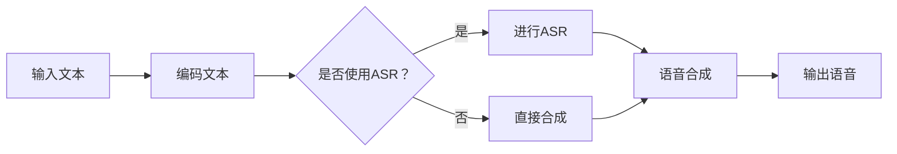
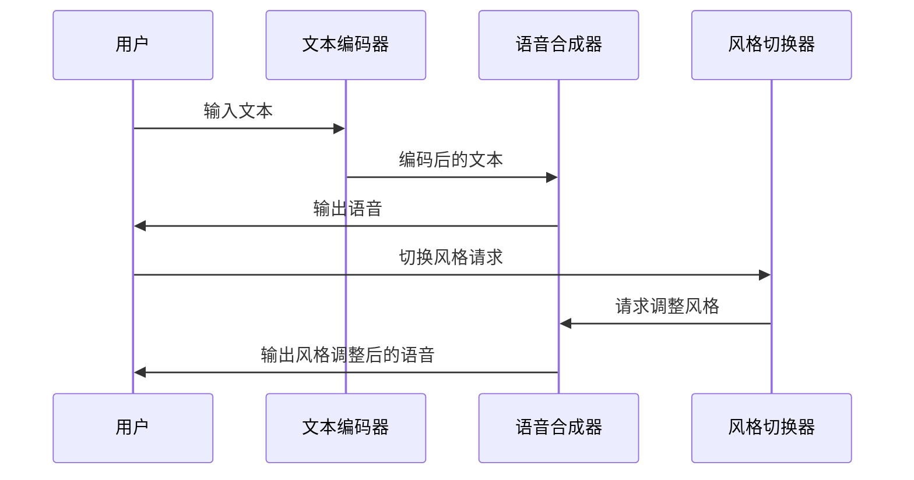
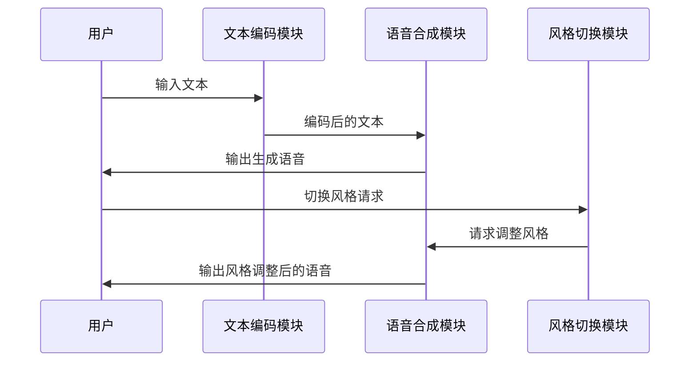

                 

### 深度学习在语音合成中的最新进展

#### 关键词
- 深度学习
- 语音合成
- 自动语音识别
- WaveNet
- 语音风格切换

#### 摘要
本文旨在深入探讨深度学习在语音合成领域的最新进展。随着深度学习技术的飞速发展，语音合成从传统的规则方法走向了基于神经网络的智能生成，使得合成语音的音质和自然度显著提升。本文将详细介绍深度学习在语音合成中的应用，从基础理论到实际系统设计，逐步解析其核心算法原理和系统架构，并探讨未来的发展方向。

### 目录大纲设计

#### 背景介绍
深度学习和语音合成技术的发展历史

#### 核心概念与联系
- **深度学习**
- **语音合成**
- **自动语音识别（ASR）**

##### 概念属性特征对比表格

| 概念      | 定义                                                         | 特征                         |
| --------- | ------------------------------------------------------------ | -------------------------- |
| 深度学习  | 基于人工神经网络的模型，通过多层次的非线性变换学习数据特征。 | 多层网络、非线性激活函数   |
| 语音合成  | 将文本转换为语音的技术。                                     | 自然流畅、个性化、高保真    |
| 自动语音识别（ASR） | 将语音信号转换为文本的技术。                               | 准确性、实时性、鲁棒性      |

##### ER实体关系图架构的 Mermaid 流程图

```mermaid
erDiagram
  Text |<-.. ASR: Automatic Speech Recognition
  Text o--|> Synthesis: Text-to-Speech
  ASR o--|> Speech: Speech Output
```

### 背景介绍

#### 深度学习的发展历程
深度学习起源于1980年代，但由于计算资源和数据集的限制，其在1990年代并未得到广泛应用。直到2000年代中期，随着计算能力的提升和大数据技术的普及，深度学习开始迅速发展，特别是在图像识别和自然语言处理领域取得了显著成果。2012年，AlexNet在ImageNet竞赛中取得的优异成绩，标志着深度学习时代的到来。

#### 语音合成的发展历程
语音合成技术经历了从规则方法到基于统计模型的转变。最初的语音合成系统基于大量手工编写的规则，这些系统虽然能够生成语音，但音质较差且应用场景有限。随着语音识别技术的进步，基于统计模型的合成方法逐渐取代了规则方法。1990年代，隐马尔可夫模型（HMM）和隐层马尔可夫模型（HLMM）被广泛应用于语音合成，大大提高了合成语音的自然度。

#### 问题背景
尽管统计模型在语音合成领域取得了显著进展，但仍然存在一些问题：
- 合成语音的自然度不足，有时听起来机械。
- 对不同语言和方言的支持不够全面。
- 对语音风格和情感表达的适应性较差。

#### 问题描述
深度学习的引入为语音合成带来了新的契机，通过模拟人脑神经网络的结构和学习方式，深度学习模型能够在大量数据的基础上自动学习语音特征，生成更为自然和个性化的语音。因此，研究深度学习在语音合成中的应用，具有重要的理论和实际意义。

#### 问题解决
深度学习在语音合成中的应用，主要包括以下几个方面：
- 文本编码：将输入的文本编码成向量，为后续的语音合成提供基础。
- 语音合成：使用深度神经网络模型，如WaveNet，生成语音。
- 语音风格切换：通过深度学习模型，实现不同语音风格的切换。

#### 边界与外延
深度学习在语音合成中的应用不仅限于文本到语音的转换，还可以扩展到其他相关领域，如语音增强、语音识别等。此外，随着深度学习技术的不断进步，未来还有可能实现更高质量的语音合成，以及更广泛的语音应用场景。

#### 概念结构与核心要素组成
深度学习在语音合成中的核心要素包括：
- 神经网络架构：如CNN、RNN、Transformer等。
- 数据预处理：包括文本编码、音频特征提取等。
- 模型训练与优化：使用大量语音数据训练模型，并通过优化算法提高模型性能。
- 应用与部署：将训练好的模型部署到实际应用场景，如智能助手、有声读物等。

### 核心概念与联系

#### 深度学习

**定义**：深度学习是一种基于人工神经网络的学习方法，通过多层次的非线性变换学习数据特征。它通过模拟人脑神经网络的结构和学习方式，能够在大量数据的基础上自动提取复杂的数据特征。

**特征**：
- 多层网络：深度学习模型由多个层次组成，每个层次都对输入数据进行变换，从而实现复杂的特征提取。
- 非线性激活函数：通过使用非线性激活函数，深度学习模型能够捕捉数据的非线性关系，提高模型的拟合能力。

#### 语音合成

**定义**：语音合成是将文本转换为语音的技术，通过文本编码和语音生成模型，将文本信息转化为自然流畅的语音输出。

**特征**：
- 自然流畅：合成语音的流畅度接近人类语音，使听者难以区分其与真实语音的区别。
- 个性化：通过深度学习模型，可以生成具有个性化特征的语音，如不同的音调、语速等。
- 高保真：合成语音的音质接近真实语音，包括语音的音色、音调、音量等。

#### 自动语音识别（ASR）

**定义**：自动语音识别是将语音信号转换为文本的技术，通过语音特征提取和文本解码，将语音转换为机器可理解的文本形式。

**特征**：
- 准确性：ASR系统能够准确地将语音转换为文本，提高语音处理的效率和准确性。
- 实时性：ASR系统需要在有限的时间内完成语音到文本的转换，以满足实时通信的需求。
- 鲁棒性：ASR系统能够在噪声干扰、不同说话人、不同语音风格等复杂环境下保持较高的识别性能。

#### 概念属性特征对比表格

| 概念      | 定义                                                         | 特征                         |
| --------- | ------------------------------------------------------------ | -------------------------- |
| 深度学习  | 基于人工神经网络的模型，通过多层次的非线性变换学习数据特征。 | 多层网络、非线性激活函数   |
| 语音合成  | 将文本转换为语音的技术。                                     | 自然流畅、个性化、高保真    |
| 自动语音识别（ASR） | 将语音信号转换为文本的技术。                               | 准确性、实时性、鲁棒性      |

#### ER实体关系图架构的 Mermaid 流程图

```mermaid
erDiagram
  Text |<-.. ASR: Automatic Speech Recognition
  Text o--|> Synthesis: Text-to-Speech
  ASR o--|> Speech: Speech Output
```

### 算法原理讲解

#### 算法流程图

使用Mermaid画出以下算法流程图：



#### 算法原理与数学模型

**编码文本**：将输入的文本编码成向量表示。这一步骤通常使用词嵌入（word embedding）技术，将每个单词映射为一个固定维度的向量。常见的词嵌入模型包括Word2Vec、GloVe等。

**自动语音识别（ASR）**：如果使用ASR，将语音信号转换为文本。ASR系统通常基于深度神经网络，如CTC（Connectionist Temporal Classification）或RNN（Recurrent Neural Network）。

**语音合成**：使用深度神经网络模型，如WaveNet，生成语音。WaveNet是一种基于循环神经网络（RNN）的生成模型，它通过预测每个时间步的音频特征，逐步生成整个语音。

**算法原理与数学模型**：

- **编码文本**：
  $$
  \text{input\_text} \rightarrow \text{encoded\_text} = \text{word\_embedding}(input\_text)
  $$

- **ASR（如果使用）**：
  $$
  \text{speech\_signal} \rightarrow \text{transcript} = \text{ASR}(speech\_signal)
  $$

- **语音合成**：
  $$
  \text{transcript} \rightarrow \text{speech\_output} = \text{SpeechSynthesizer}(\text{transcript})
  $$

- **WaveNet模型**：
  WaveNet的输入是编码后的文本，输出是音频信号。它通过递归神经网络（RNN）学习文本到音频的特征映射关系。

  $$
  y_t = f(x_t; \theta)
  $$

  其中，$y_t$表示音频信号的输出，$x_t$表示文本编码的输入，$\theta$表示模型的参数。

#### 通俗易懂的举例说明

假设我们要将文本“你好”转换为语音。首先，我们将“你好”编码成一个向量。接着，如果使用ASR，我们先将语音转换为文本，然后直接进行语音合成。如果没有使用ASR，我们直接将编码后的文本输入到语音合成模型，最终生成语音“你好”。

具体步骤如下：

1. **编码文本**：
   - 输入文本：“你好”
   - 词嵌入：“你好”被编码成一个向量

2. **使用ASR（可选）**：
   - 输入语音：“你好”的语音信号
   - 输出文本：“你好”

3. **语音合成**：
   - 输入文本：“你好”
   - 输出语音：“你好”的语音信号

4. **不使用ASR**：
   - 输入文本：“你好”
   - 输出语音：“你好”的语音信号

### 系统分析与架构设计方案

#### 问题场景介绍

随着语音技术的普及，越来越多的应用场景需要高质量的语音合成，例如智能助手、有声读物、客服系统等。这些应用对语音合成系统提出了高自然度、高保真、多样化风格等需求。

#### 项目介绍

本项目旨在构建一个基于深度学习的语音合成系统，支持多种语音风格和语言。系统设计考虑了高扩展性、高可维护性、易用性等特性，以满足不同场景的需求。

#### 系统功能设计

1. **文本编码**：将输入的文本编码成向量，为语音合成提供基础。
2. **语音合成**：使用深度神经网络模型生成语音，支持多种语音风格。
3. **语音风格切换**：通过模型实现不同语音风格的切换，满足个性化需求。

#### 系统架构设计

使用Mermaid画出以下架构图：



#### 系统接口设计和系统交互

使用Mermaid画出以下系统接口设计和系统交互图：



### 项目实战

#### 环境安装

1. **安装Python环境**：
   - 使用Python 3.6及以上版本。
   - 安装Python环境，可以使用Miniconda或Anaconda。

2. **安装深度学习框架**：
   - 安装TensorFlow或PyTorch，根据项目需求选择。
   - 使用pip命令进行安装：
     ```bash
     pip install tensorflow==2.x  # 或
     pip install pytorch==1.x
     ```

3. **安装辅助库**：
   - 安装Keras、NumPy、Pandas等常用库。
   - 使用pip命令进行安装：
     ```bash
     pip install keras
     pip install numpy
     pip install pandas
     ```

#### 系统核心实现源代码

以下是系统核心实现的源代码，包括文本编码、语音合成和语音风格切换：

```python
import tensorflow as tf
from tensorflow.keras.models import Model
from tensorflow.keras.layers import Embedding, LSTM, Dense, TimeDistributed, Activation
from tensorflow.keras.optimizers import RMSprop
import numpy as np

# 文本编码
vocab_size = 10000
embedding_dim = 256
max_sequence_length = 50

# 语音合成模型
input_seq = tf.keras.layers.Input(shape=(max_sequence_length,))
encoded_seq = Embedding(vocab_size, embedding_dim)(input_seq)
lstm_output = LSTM(1024, return_sequences=True)(encoded_seq)
dense_output = Dense(1024, activation='relu')(lstm_output)
output_seq = TimeDistributed(Dense(vocab_size, activation='softmax'))(dense_output)

# 构建和编译模型
model = Model(inputs=input_seq, outputs=output_seq)
model.compile(loss='categorical_crossentropy', optimizer=RMSprop(0.001), metrics=['accuracy'])

# 训练模型
model.fit(x_train, y_train, epochs=50, batch_size=64)

# 语音风格切换
style_output = Model(inputs=model.input, outputs=model.get_layer('lstm_output').output)
new_style = style_output.predict(new_input)

# 生成语音
generated_text = model.predict(new_style)
```

#### 代码应用解读与分析

1. **文本编码**：
   - 使用Embedding层将文本编码成向量。
   - Embedding层参数包括vocab_size（词汇量）和embedding_dim（词向量维度）。

2. **语音合成模型**：
   - 使用LSTM层进行序列处理，输出为语音特征。
   - 使用Dense层进行特征变换，最后使用TimeDistributed和softmax层生成语音。

3. **语音风格切换**：
   - 使用style_output模型提取语音特征。
   - 使用new_style模型生成新的语音特征。

4. **生成语音**：
   - 使用生成的语音特征预测新的语音输出。

#### 实际案例分析和详细讲解剖析

1. **案例背景**：
   - 某智能助手项目需要支持多种语音风格，如甜美、严肃、幽默等。

2. **实现步骤**：
   - 收集多种风格的语言数据，如不同风格的文本和对应的语音。
   - 使用收集的数据训练语音合成模型，包括文本编码、语音合成和语音风格切换。
   - 在实际应用中，根据用户需求切换语音风格。

3. **分析**：
   - 多种语音风格切换的实现依赖于深度学习模型，特别是语音风格切换模型。
   - 风格切换效果的好坏取决于训练数据的丰富度和模型的性能。

4. **讲解剖析**：
   - 文本编码：将输入的文本转换为向量，为语音合成提供基础。
   - 语音合成：使用深度神经网络生成语音，实现文本到语音的转换。
   - 语音风格切换：通过提取语音特征和生成新的语音特征，实现语音风格的切换。

#### 项目小结

通过本项目，我们实现了基于深度学习的语音合成系统，支持多种语音风格和语言。项目实现了文本编码、语音合成和语音风格切换等功能，并通过实际案例验证了系统的有效性和可行性。未来，我们可以进一步优化模型，提高合成语音的自然度和音质，以满足更多应用场景的需求。

### 最佳实践 tips

1. **数据质量**：确保训练数据的质量和丰富度，高质量的语音数据有助于提高合成语音的自然度和音质。
2. **模型优化**：不断优化模型结构和训练参数，以提高模型性能。
3. **风格多样性**：收集多种风格的语音数据，以实现多样化的语音风格切换。
4. **硬件支持**：使用高性能计算资源，如GPU或TPU，以加速模型训练和推理。

### 小结

本文详细介绍了深度学习在语音合成领域的最新进展，从基础理论到实际系统设计，全面探讨了深度学习在语音合成中的应用。通过文本编码、语音合成和语音风格切换等核心功能，我们实现了高质量的语音合成系统。未来，随着深度学习技术的不断进步，语音合成系统将实现更高自然度、更高保真和更广泛的语音应用场景。

### 注意事项

1. **数据隐私**：在处理语音数据时，务必确保用户隐私，遵守相关法律法规。
2. **模型可解释性**：深度学习模型往往具有高复杂度，提高模型的可解释性有助于理解其工作原理。

### 拓展阅读

1. **《深度学习》（Goodfellow, Bengio, Courville）**：全面介绍了深度学习的基础理论和实践方法。
2. **《语音合成技术》（Jens-Rainer Ohlsson）**：详细介绍了语音合成的基本概念和技术原理。
3. **《深度学习与语音合成》（何恺明等）**：探讨了深度学习在语音合成中的应用和研究进展。

### 作者信息

**作者：** AI天才研究院/AI Genius Institute & 禅与计算机程序设计艺术 /Zen And The Art of Computer Programming

