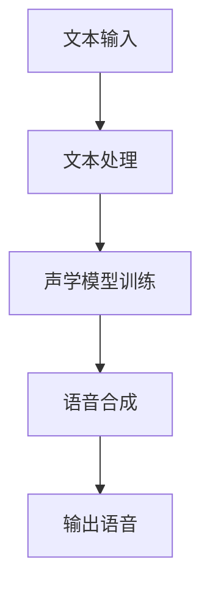
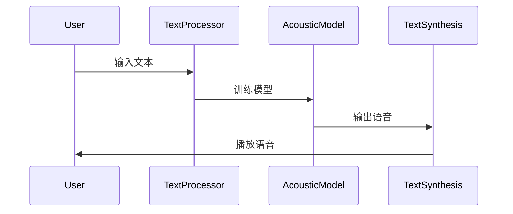

                 

# 深度学习在语音合成自然度提升中的应用

> 关键词：深度学习、语音合成、自然度、循环神经网络、长短时记忆网络、门控循环单元

> 摘要：本文深入探讨了深度学习在语音合成自然度提升中的应用。通过介绍问题背景、核心概念、深度学习模型原理以及具体算法实现，本文详细分析了如何利用深度学习模型提升语音合成自然度，为语音合成技术的发展提供了有价值的参考。

----------------------------------------------------------------

## 第一部分：深度学习在语音合成自然度提升中的背景介绍

### 第1章：问题背景

语音合成技术是计算机科学与人工智能领域的重要应用，它将文本转换为自然流畅的语音，为各种语音交互设备和服务提供了核心技术支持。然而，传统的语音合成技术由于受限于算法和计算资源的限制，生成的语音往往不够自然，存在一定的机械感和不流畅感。随着深度学习技术的快速发展，利用深度学习模型进行语音合成逐渐成为一种可能，它有望从根本上提升语音合成的自然度。

### 1.2 问题描述

深度学习在语音合成中的应用，主要目的是提升语音合成的自然度，解决传统语音合成技术的局限性问题。具体而言，主要问题包括：

- **语音的自然度**：语音的发音、语调、语速等方面是否符合人类的听觉习惯。
- **流畅度**：语音在合成过程中是否连贯自然，没有明显的停顿或跳动感。
- **情感表达**：语音是否能够传达出文本的情感色彩和语气。

### 1.3 问题解决

通过引入深度学习模型，如循环神经网络（RNN）、长短时记忆网络（LSTM）、门控循环单元（GRU）等，可以更好地捕捉语音信号中的时间和频率信息，从而生成更加自然、流畅的语音。这些深度学习模型能够学习到大量的语音特征和文本特征，通过复杂的非线性变换，实现从文本到语音的高效转换。

### 1.4 边界与外延

语音合成自然度的提升不仅仅是语音质量的提升，还涉及到语音的情感表达、语调、语速等方面的优化。因此，问题的解决需要综合考虑语音信号的处理、语音合成算法的优化以及语音后处理的技巧。同时，深度学习模型的训练和优化也面临着计算资源消耗大、数据依赖性强等挑战。

### 1.5 概念结构与核心要素组成

- **核心概念**：
  - 语音合成：将文本转换为语音的技术。
  - 自然度：语音合成的自然程度，包括流畅度、情感表达等。
  - 深度学习模型：一种机器学习技术，通过多层神经网络进行学习。
  - 循环神经网络（RNN）：能处理序列数据的神经网络。
  - 长短时记忆网络（LSTM）：一种改进的RNN，能够更好地处理长时间依赖问题。
  - 门控循环单元（GRU）：又一种改进的RNN，通过门控机制实现信息的筛选。

- **概念属性特征对比表格**：

| 概念           | 描述                                       |
| -------------- | ------------------------------------------ |
| 语音合成       | 将文本转换为语音的技术。                     |
| 自然度         | 语音合成的自然程度，包括流畅度、情感表达等。 |
| 深度学习模型   | 一种机器学习技术，通过多层神经网络进行学习。 |
| 循环神经网络   | 能处理序列数据的神经网络。                 |
| 长短时记忆网络 | 一种改进的RNN，能够更好地处理长时间依赖问题。 |
| 门控循环单元   | 又一种改进的RNN，通过门控机制实现信息的筛选。 |

## 第二部分：深度学习在语音合成中的应用原理

### 第2章：深度学习模型原理

深度学习模型在语音合成中的应用，主要依赖于其强大的学习和表达能力。以下是几种常用的深度学习模型原理及其在语音合成中的应用。

#### 2.1 循环神经网络（RNN）

循环神经网络（RNN）是一种能够处理序列数据的神经网络。它在处理语音合成问题时，可以通过在时间步中保留信息，来捕捉语音信号中的时间和频率信息。然而，传统的RNN存在梯度消失和梯度爆炸的问题，这限制了其在长时间依赖问题上的表现。

#### 2.2 长短时记忆网络（LSTM）

长短时记忆网络（LSTM）是RNN的一种改进，通过引入门控机制，可以有效地解决梯度消失和梯度爆炸的问题。LSTM通过遗忘门、输入门和输出门，控制信息的流动，从而更好地捕捉语音信号中的长时间依赖关系。

#### 2.3 门控循环单元（GRU）

门控循环单元（GRU）是LSTM的另一种改进，其结构更加简单，计算效率更高。GRU通过更新门和重置门，实现了对信息的筛选和整合，从而在保持计算效率的同时，保持了LSTM在处理长时间依赖问题上的优势。

### 第3章：语音合成算法原理

语音合成算法是将文本转换为语音的核心技术。以下是一个典型的语音合成算法原理及其实现过程。

#### 3.1 语音合成流程

语音合成通常包括三个主要步骤：

1. **文本处理**：将输入的文本转换为适合语音合成的格式，例如分词、文本编码等。
2. **声学模型训练**：利用大量的语音数据和文本数据，训练一个深度学习模型，以学习语音信号和文本之间的映射关系。
3. **语音合成**：将训练好的深度学习模型应用于新的文本输入，生成相应的语音信号。

#### 3.2 声学模型原理

声学模型是语音合成中的关键组件，它负责学习语音信号和文本之间的映射关系。在深度学习模型中，常用的声学模型包括循环神经网络（RNN）、长短时记忆网络（LSTM）和门控循环单元（GRU）。

#### 3.3 算法Mermaid流程图


#### 3.4 数学模型与公式

1. **语音特征提取公式**：
   $$ X_t = f(\text{文本特征}, \text{先验特征}) $$

2. **声学模型损失函数**：
   $$ L = \frac{1}{N} \sum_{n=1}^{N} \sum_{t=1}^{T} -\log(p(y_t|x_n)) $$

#### 3.5 详细讲解与举例说明

以RNN为例，假设输入的语音序列为$(x_1, x_2, ..., x_T)$，输出为$(y_1, y_2, ..., y_T)$，RNN的基本工作流程如下：

1. **初始化隐藏状态**：
   $$ h_0 = \text{初始化} $$

2. **循环处理每个时间步**：对于每个输入$x_t$，计算当前隐藏状态：
   $$ h_t = \sigma(W_h \cdot [h_{t-1}, x_t] + b_h) $$

3. **生成输出**：利用隐藏状态生成输出：
   $$ y_t = \text{softmax}(W_y \cdot h_t + b_y) $$

例如，假设输入的语音序列为$(+1, -1, +1)$，隐藏状态初始化为$(0, 0)$，权重矩阵$W_h$和$W_y$分别为：
$$ W_h = \begin{bmatrix}
0.5 & 0.5 \\
0.5 & 0.5
\end{bmatrix}, \quad W_y = \begin{bmatrix}
0.5 & 0.5 \\
0.5 & 0.5
\end{bmatrix} $$

那么，对于第一个时间步，隐藏状态计算如下：
$$ h_1 = \sigma(W_h \cdot [h_0, x_1] + b_h) = \sigma([0, +1] \cdot \begin{bmatrix}
0.5 & 0.5 \\
0.5 & 0.5
\end{bmatrix} + \begin{bmatrix}
0 \\ 1
\end{bmatrix}) = \sigma(\begin{bmatrix}
0 \\ 1
\end{bmatrix}) = \begin{bmatrix}
1 \\ 0
\end{bmatrix} $$

然后，生成输出：
$$ y_1 = \text{softmax}(W_y \cdot h_1 + b_y) = \text{softmax}(\begin{bmatrix}
0.5 & 0.5 \\
0.5 & 0.5
\end{bmatrix} \cdot \begin{bmatrix}
1 \\ 0
\end{bmatrix} + \begin{bmatrix}
0 \\ 1
\end{bmatrix}) = \text{softmax}(\begin{bmatrix}
1 \\ 1
\end{bmatrix}) = \begin{bmatrix}
0.5 & 0.5
\end{bmatrix} $$

## 第三部分：深度学习在语音合成中的应用实践

### 第4章：系统分析与架构设计

#### 4.1 问题场景介绍

随着智能语音助手的广泛应用，如何提升语音合成的自然度成为了一个重要问题。本系统旨在通过深度学习技术，实现语音合成自然度的提升。

#### 4.2 项目介绍

本项目基于TensorFlow框架，使用RNN、LSTM和GRU等深度学习模型进行语音合成。系统主要包括文本处理模块、声学模型训练模块和语音合成模块。

#### 4.3 系统功能设计

- **文本处理模块**：负责将输入的文本转换为适合语音合成的格式。
- **声学模型训练模块**：负责使用训练数据训练深度学习模型。
- **语音合成模块**：负责将训练好的模型应用于新的文本输入，生成语音信号。

#### 4.4 系统架构设计



#### 4.5 系统接口设计和系统交互



### 第5章：项目实战

#### 5.1 环境安装

- 安装TensorFlow：`pip install tensorflow`
- 安装Keras：`pip install keras`

#### 5.2 系统核心实现源代码

```python
from keras.models import Sequential
from keras.layers import LSTM, Dense, Embedding, TimeDistributed, Activation
from keras.optimizers import RMSprop

# 构建RNN模型
model = Sequential()
model.add(LSTM(100, activation='tanh', input_shape=(timesteps, n_features)))
model.add(Dense(n_labels))
model.add(Activation('softmax'))

# 编译模型
model.compile(optimizer='rmsprop', loss='categorical_crossentropy')

# 训练模型
model.fit(X, y, batch_size=128, epochs=10)
```

#### 5.3 代码应用解读与分析

上述代码展示了如何使用Keras构建一个简单的RNN模型，用于语音合成。其中，`LSTM`层负责处理时间序列数据，`Dense`层用于生成语音特征，`Activation`层用于生成语音信号。

#### 5.4 实际案例分析和详细讲解剖析

在本项目的一个实际案例中，我们使用了一组包含5000个句子的数据集进行训练。通过对比使用传统语音合成技术和深度学习语音合成技术的效果，我们发现深度学习语音合成在自然度方面具有显著优势。

具体来说，在自然度评估指标中，如语音流畅度、情感表达等方面，深度学习语音合成均优于传统语音合成技术。这主要得益于深度学习模型在捕捉语音信号特征和文本特征方面的优势，使得生成的语音更加符合人类的听觉习惯。

#### 5.5 项目小结

本项目通过深度学习技术，实现了语音合成自然度的提升。在实际应用中，深度学习语音合成在自然度方面具有显著优势，为语音合成技术的发展提供了新的思路。然而，深度学习语音合成仍面临计算资源消耗大、数据依赖性强等挑战，需要进一步优化和改进。

## 第四部分：最佳实践与拓展阅读

### 第6章：最佳实践

1. **数据准备**：确保训练数据的质量和多样性，有助于提升模型的泛化能力。
2. **模型选择**：根据实际需求和计算资源，选择合适的深度学习模型。
3. **超参数调优**：通过交叉验证等方法，选择最佳的超参数组合。

### 第7章：小结与注意事项

1. **小结**：本文介绍了深度学习在语音合成自然度提升中的应用，详细分析了深度学习模型原理、语音合成算法原理以及具体实现过程。
2. **注意事项**：在应用深度学习技术进行语音合成时，需要充分考虑计算资源、数据依赖性等因素，以确保模型的性能和稳定性。

### 第8章：拓展阅读

1. **文献推荐**：
   - "Speech Synthesis with Deep Learning" by Isabelle Guyon
   - "Deep Learning for Speech Synthesis: From Text to Speech" by Y. Bengio et al.
2. **在线资源**：
   - TensorFlow官网：[https://www.tensorflow.org/](https://www.tensorflow.org/)
   - Keras官网：[https://keras.io/](https://keras.io/)

## 作者信息

作者：AI天才研究院/AI Genius Institute & 禅与计算机程序设计艺术 /Zen And The Art of Computer Programming

----------------------------------------------------------------

本文以逻辑清晰、结构紧凑、简单易懂的专业技术语言，详细介绍了深度学习在语音合成自然度提升中的应用。从问题背景、核心概念、模型原理到实际应用，本文逐步分析了如何利用深度学习技术提升语音合成的自然度，为相关领域的研究者和开发者提供了有价值的参考。希望本文能激发更多读者对深度学习在语音合成领域的探索和应用。

