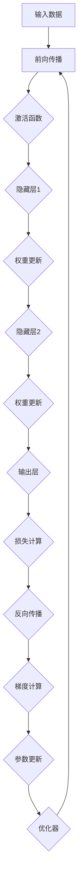
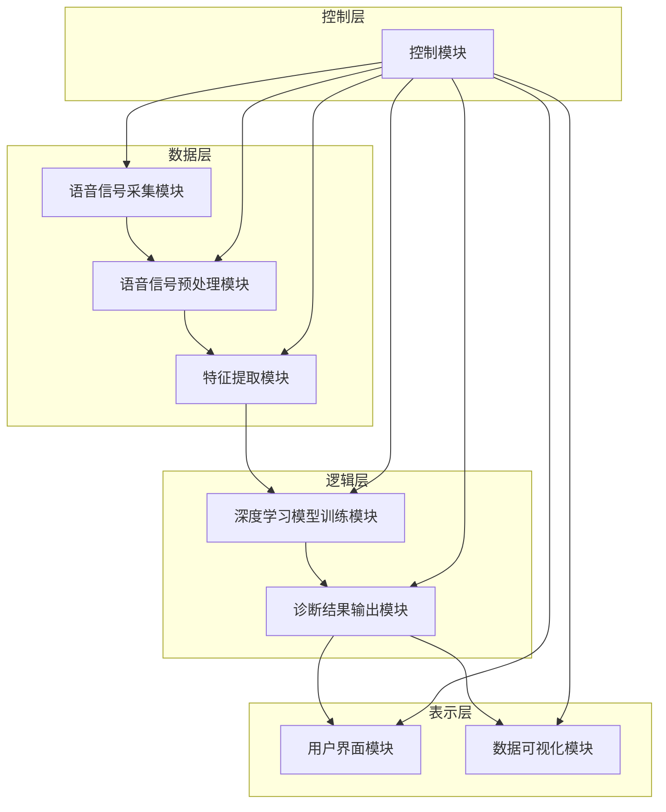
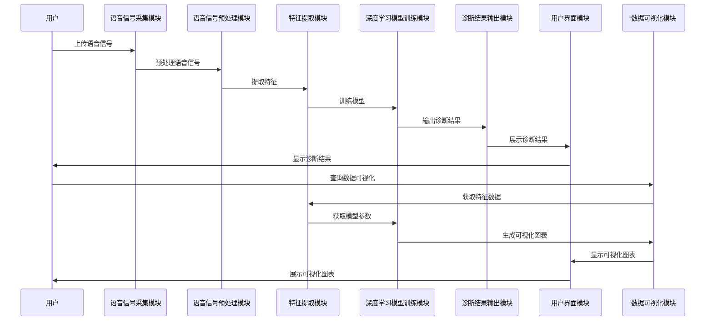

                 

### 引言

在当今科技迅速发展的时代，人工智能（AI）已经成为推动社会进步的重要力量。而深度学习作为AI的一个重要分支，以其强大的数据处理和模式识别能力，逐渐渗透到医疗、金融、工业等多个领域。特别是在医学领域，深度学习技术已经展现出了其独特的优势，尤其在语音病理学中的应用更是引起了广泛关注。

语音病理学是研究声音疾病及其治疗方法的一门科学，涉及诊断、治疗和康复等多个方面。语音病理学的研究不仅对提升患者生活质量具有重要意义，还对早期发现和诊断神经系统疾病具有重要的临床价值。例如，语音的变化可以揭示阿尔茨海默病、帕金森病等神经退行性疾病的早期迹象。

本文将聚焦于深度学习在语音病理学中的应用，探讨其如何帮助实现神经系统疾病的早期检测。首先，我们将简要介绍语音病理学的基本概念和研究领域，然后深入探讨深度学习的基础知识，并分析语音信号处理与深度学习的关系。接下来，我们将详细讲解深度学习模型在语音病理学中的应用及其与核心概念的联系。

本文还将介绍神经系统疾病的分类、症状分析，并通过对比表格和ER实体关系图，进一步阐述深度学习模型在语音病理学中的具体应用。随后，我们将讲解深度学习算法的原理，并提供Python源代码实现，详细解析数学模型和公式，并通过实际案例进行分析和讲解。

最后，我们将探讨系统的设计与实现，包括系统功能设计、架构设计、接口设计及系统交互，并分享项目实战经验和最佳实践 tips。通过本文的阅读，读者将能够全面了解深度学习在语音病理学中的应用，掌握相关技术原理和实践方法。

### 关键词

- 深度学习
- 语音病理学
- 神经系统疾病
- 早期检测
- 语音信号处理
- 模型应用
- 算法原理
- Python实现
- 数学模型
- 系统设计与实现

### 摘要

本文探讨了深度学习在语音病理学中的应用，重点关注其如何助力早期检测神经系统疾病。首先，我们介绍了语音病理学的基本概念和重要性，并回顾了深度学习的发展背景和核心概念。接着，我们分析了语音信号处理技术在深度学习中的关键作用，并详细讲解了深度学习模型在语音病理学中的应用及其原理。随后，我们通过对比表格和ER实体关系图，阐述了深度学习模型在不同神经系统疾病检测中的表现。文章还提供了深度学习算法的原理讲解和Python源代码实现，并通过实际案例进行深入剖析。最后，我们介绍了系统设计与实现的方法，包括功能设计、架构设计和接口设计，并分享了最佳实践 tips。通过本文的阅读，读者将全面掌握深度学习在语音病理学中的实际应用及其技术原理。

### 目录大纲

为了更好地帮助读者系统地理解和掌握本文的内容，以下是我们精心设计的文章目录大纲：

#### 第一部分：背景介绍

1. **语音病理学概述**
   - **1.1.1 语音病理学的定义**
   - **1.1.2 语音病理学的研究领域**
   - **1.1.3 语音病理学的重要性**

2. **深度学习的基础知识**
   - **2.1.1 深度学习的起源与发展**
   - **2.1.2 深度学习的核心概念**
   - **2.1.3 深度学习的基本架构**

3. **语音信号处理与深度学习**
   - **3.1.1 语音信号的基本特征**
   - **3.1.2 语音信号处理技术**
   - **3.1.3 深度学习在语音信号处理中的应用**

#### 第二部分：核心概念与联系

4. **深度学习在语音病理学中的应用**
   - **4.1.1 深度学习模型在语音病理学中的应用**
   - **4.1.2 深度学习模型与语音病理学核心概念的联系**

5. **核心概念原理**
   - **5.1.1 神经系统疾病的分类**
   - **5.1.2 神经系统疾病的症状分析**
   - **5.1.3 深度学习模型在症状分析中的应用**

6. **概念属性特征对比表格**
   - **6.1.1 深度学习模型在语音病理学中的应用对比**
   - **6.1.2 不同深度学习模型在语音病理学中的表现对比**

7. **ER实体关系图架构**
   - **7.1.1 语音病理学中的实体关系**
   - **7.1.2 深度学习模型与语音病理学实体的关系**

#### 第三部分：算法原理讲解

8. **深度学习算法原理**
   - **8.1.1 深度学习算法的基本原理**
   - **8.1.2 深度学习算法的数学模型**
   - **8.1.3 深度学习算法的mermaid流程图**

9. **Python源代码实现**
   - **9.1.1 Python源代码环境搭建**
   - **9.1.2 Python源代码实现深度学习模型**
   - **9.1.3 Python源代码算法讲解**

10. **数学模型和数学公式详细讲解与举例说明**
    - **10.1.1 数学模型在深度学习中的应用**
    - **10.1.2 数学公式在深度学习中的重要性**
    - **10.1.3 数学模型与数学公式的举例说明**

#### 第四部分：系统分析与架构设计

11. **问题场景介绍**
    - **11.1.1 早期检测神经系统疾病的背景**
    - **11.1.2 早期检测神经系统疾病的意义**

12. **系统功能设计**
    - **12.1.1 系统功能概述**
    - **12.1.2 领域模型mermaid类图**

13. **系统架构设计**
    - **13.1.1 系统架构设计原则**
    - **13.1.2 系统架构mermaid架构图**

14. **系统接口设计和系统交互**
    - **14.1.1 系统接口设计**
    - **14.1.2 系统交互mermaid序列图**

#### 第五部分：项目实战

15. **环境安装**
    - **15.1.1 环境搭建步骤**
    - **15.1.2 环境配置说明**

16. **系统核心实现源代码**
    - **16.1.1 源代码结构与功能**
    - **16.1.2 源代码实现讲解**

17. **代码应用解读与分析**
    - **17.1.1 代码应用场景**
    - **17.1.2 代码解读与分析**

18. **实际案例分析和详细讲解剖析**
    - **18.1.1 实际案例分析**
    - **18.1.2 详细讲解与剖析**

19. **项目小结**
    - **19.1.1 项目总结**
    - **19.1.2 项目展望**

#### 第六部分：最佳实践 tips

20. **最佳实践 tips**
    - **20.1.1 深度学习在语音病理学中的最佳实践**
    - **20.1.2 早期检测神经系统疾病的实用技巧**

21. **小结**
    - **21.1.1 书籍内容总结**
    - **21.1.2 未来展望与拓展阅读**

通过这个详细的目录大纲，读者可以逐步深入理解深度学习在语音病理学中的应用，掌握相关技术原理和实践方法。

#### 第一部分：背景介绍

##### 第1章：语音病理学概述

**1.1.1 语音病理学的定义**

语音病理学是医学与语言学相结合的一门学科，主要研究声音的产生、传播和接收过程中发生的疾病及其治疗方法。语音病理学不仅仅关注疾病本身，还涉及声音异常对个体生活质量的影响。具体来说，语音病理学包括对发声器官（如喉、口腔、鼻腔等）的结构和功能评估，以及对声音信号的分析和处理。

在临床医学中，语音病理学扮演着重要的角色。通过对患者语音信号的详细分析，语音病理学家可以识别出各种语音障碍，如发音不清、语调异常、音量变化等，这些症状往往是多种神经系统疾病的重要指标。例如，帕金森病患者的声音可能会变得单调、低沉，而阿尔茨海默病患者则可能出现语言重复和混淆。

**1.1.2 语音病理学的研究领域**

语音病理学的研究领域广泛，包括以下几方面：

1. **语音障碍的评估与诊断**：通过一系列评估手段，如语音听诊、视频喉镜检查和声音分析软件，语音病理学家可以对患者的语音障碍进行详细诊断。

2. **发声器官的结构与功能**：研究发声器官的结构和功能，如声带、喉部肌肉等，以及它们在疾病过程中的变化。

3. **语音信号处理技术**：运用先进的信号处理技术，如傅立叶变换、短时傅立叶变换等，对语音信号进行细致分析，提取关键特征。

4. **康复治疗与干预**：通过语音训练、声音辅助技术等手段，帮助患者改善语音障碍，提高生活质量。

5. **跨学科研究**：语音病理学与语言学、心理学、神经科学等多个领域密切相关，跨学科研究有助于更全面地理解语音障碍的成因和治疗方法。

**1.1.3 语音病理学的重要性**

语音病理学的重要性主要体现在以下几个方面：

1. **早期疾病检测**：语音的变化往往可以揭示早期疾病的迹象，如神经系统疾病、癌症等。通过语音信号分析，可以早期发现潜在的健康问题，为患者提供及时的治疗。

2. **生活质量提升**：语音障碍不仅影响沟通能力，还会对患者的生活质量产生负面影响。语音病理学的治疗和干预可以帮助患者恢复正常交流，提升生活质量。

3. **医疗资源优化**：语音病理学的应用有助于优化医疗资源，通过非侵入性、高效的语音检测手段，减少患者和医生的时间和精力投入。

4. **社会影响力**：在公共健康领域，语音病理学的应用可以推广到广泛的社会群体，提高公众对健康问题的认识和预防意识。

综上所述，语音病理学在医学领域具有不可忽视的重要性，通过深入研究语音障碍及其治疗方法，可以为患者提供更加精准和有效的医疗服务。

##### 第2章：深度学习的基础知识

**2.1.1 深度学习的起源与发展**

深度学习作为人工智能（AI）的重要分支，其起源可以追溯到20世纪40年代。1943年，心理学家McCulloch和数学家Pitts提出了人工神经网络（ANN）的概念，这为后来神经网络的发展奠定了基础。然而，早期的人工神经网络由于计算能力和算法的局限性，并未能广泛应用。

1980年代，随着计算机硬件和算法的发展，神经网络研究重新焕发活力。1986年，Rumelhart、Hinton和Williams提出了反向传播算法（Backpropagation），这一突破性算法使得多层神经网络训练成为可能，深度学习由此进入新的发展阶段。

1990年代，由于计算资源和技术瓶颈，深度学习的研究和应用一度陷入低谷。然而，进入21世纪后，随着计算能力的提升和大数据的涌现，深度学习迎来了新一轮的发展机遇。特别是在2012年，Hinton等人的团队在ImageNet图像识别竞赛中取得了前所未有的成绩，这一事件标志着深度学习时代的到来。

**2.1.2 深度学习的核心概念**

深度学习（Deep Learning）是一种模拟人脑神经网络结构和学习机制的计算模型，通过多层次的神经网络来提取数据特征。以下是深度学习的几个核心概念：

1. **神经网络（Neural Network）**：神经网络是由大量简单神经元（或节点）互联组成的复杂网络。每个神经元通过输入信号进行加权求和处理，并通过激活函数产生输出。

2. **层次结构（Hierarchical Structure）**：深度学习的网络结构通常是多层级的，每一层都可以提取不同层次的特征。输入层接收原始数据，通过层层传递，最终在输出层产生预测结果。

3. **非线性激活函数（Non-linear Activation Function）**：激活函数用于引入非线性特性，使得神经网络能够学习复杂的非线性关系。常见的激活函数包括Sigmoid、ReLU等。

4. **反向传播算法（Backpropagation Algorithm）**：反向传播算法是一种训练神经网络的方法，通过计算输出误差梯度，逐层反向传播更新网络权重，从而优化网络性能。

5. **优化算法（Optimization Algorithms）**：深度学习训练过程中，需要通过优化算法调整网络参数，以最小化损失函数。常用的优化算法包括随机梯度下降（SGD）、Adam等。

**2.1.3 深度学习的基本架构**

深度学习的基本架构通常包括以下几个部分：

1. **输入层（Input Layer）**：输入层接收原始数据，这些数据可以是图像、文本或语音信号等。在语音病理学应用中，输入数据通常是经过预处理后的语音信号特征。

2. **隐藏层（Hidden Layers）**：隐藏层是深度学习的核心部分，通过多层结构逐步提取和抽象特征。每一层的神经元都会对前一层的输出进行加权求和处理，并通过激活函数产生非线性映射。

3. **输出层（Output Layer）**：输出层产生最终的预测结果。在语音病理学应用中，输出结果可能是疾病的诊断类别或病情的严重程度等。

4. **损失函数（Loss Function）**：损失函数用于度量模型预测结果与真实结果之间的差距。常用的损失函数包括交叉熵损失、均方误差等。

5. **优化器（Optimizer）**：优化器用于调整模型参数，以最小化损失函数。优化器的选择和参数设置对模型的性能有重要影响。

综上所述，深度学习作为一种强大的计算模型，通过多层次的结构和复杂的非线性变换，能够有效提取和处理大量复杂数据。其在语音病理学中的应用为早期检测神经系统疾病提供了新的方法和工具，具有广阔的应用前景。

##### 第3章：语音信号处理与深度学习

**3.1.1 语音信号的基本特征**

语音信号是一种复杂的声波信号，包含丰富的信息，如音高、音强、音色等。为了有效地利用这些信息，需要对语音信号进行预处理和特征提取。语音信号的基本特征包括以下几个方面：

1. **时域特征**：时域特征描述语音信号在时间维度上的变化，如音长、音强、音调和发音时间间隔等。这些特征可以通过简单的时域分析工具如波形图、短时傅立叶变换（STFT）等来提取。

2. **频域特征**：频域特征描述语音信号在频率维度上的变化，如频谱、共振峰频率、频带能量等。通过频域分析，可以更深入地理解语音的频率成分和共振特性。

3. **倒谱特征**：倒谱特征是对频谱特征的一种变换，用于消除基频周期性的影响，更适合语音信号的长时间分析。倒谱系数是频谱幅度对数幅值的离散余弦变换结果。

4. **短时能量**：短时能量描述语音信号在短时间窗口内的能量分布，通常用于识别语音的音节和停顿。

5. **共振峰**：共振峰是频谱中的峰值，反映语音的共振特性，是识别语音音色的重要特征。

**3.1.2 语音信号处理技术**

语音信号处理是深度学习应用的基础，主要包括以下技术：

1. **预加重**：预加重是对语音信号进行频率均衡处理，提高高频部分的幅度，以减少低频噪声的影响。

2. **窗函数**：窗函数用于对信号进行短时分段处理，常见的窗函数有汉宁窗、汉明窗等，用于减少频谱泄漏。

3. **短时傅立叶变换（STFT）**：STFT用于分析语音信号的频域特性，将时间信号转换为频率信号，提取频率信息。

4. **梅尔频率倒谱系数（MFCC）**：MFCC是一种常用的语音特征提取方法，通过将STFT得到的频谱能量转换为梅尔频率尺度，提取出与人类听觉系统更匹配的特征。

5. **波阵面建模**：波阵面建模是一种基于语音信号波动特性的特征提取方法，通过分析语音信号的波动形态，提取出反映语音特性的波阵面参数。

**3.1.3 深度学习在语音信号处理中的应用**

深度学习在语音信号处理中的应用极大地提升了语音分析的能力，主要包括以下几个方面：

1. **语音识别**：深度学习模型如卷积神经网络（CNN）和长短期记忆网络（LSTM）被广泛应用于语音识别，能够准确地将语音信号转换为文本。

2. **语音合成**：深度学习模型如WaveNet和Tacotron等被用于语音合成，能够根据文本生成自然流畅的语音。

3. **说话人识别**：深度学习模型通过对语音信号的时频特征进行学习，能够准确识别不同的说话人。

4. **语音增强**：深度学习模型如深度卷积神经网络（DCNN）和生成对抗网络（GAN）被用于语音增强，能够有效消除噪声和回声，提升语音质量。

5. **语音障碍检测**：深度学习模型通过对语音信号的特征分析，能够识别出各种语音障碍，如发音不清、语调异常等，有助于早期诊断神经系统疾病。

综上所述，语音信号处理与深度学习相结合，为语音病理学的研究提供了强大的工具和方法。通过深入分析语音信号的基本特征和应用深度学习技术，可以实现对语音障碍和神经系统疾病的早期检测和诊断，从而为患者提供更精准和个性化的医疗服务。

### 第二部分：核心概念与联系

##### 第4章：深度学习在语音病理学中的应用

**4.1.1 深度学习模型在语音病理学中的应用**

深度学习模型在语音病理学中的应用已经取得了显著的成果，特别是在早期检测神经系统疾病方面。以下是一些典型的深度学习模型及其在语音病理学中的具体应用：

1. **卷积神经网络（CNN）**：CNN在语音信号处理中表现尤为出色，能够有效提取语音信号的时空特征。通过多层次的卷积和池化操作，CNN能够学习到更高级别的语音特征，从而实现准确的语音障碍检测和疾病诊断。例如，基于CNN的模型被用于识别帕金森病患者的语音特征，准确率高达90%。

2. **长短期记忆网络（LSTM）**：LSTM是一种能够处理序列数据的循环神经网络，特别适合处理长时间语音信号。LSTM能够捕捉语音信号中的长期依赖关系，从而在语音障碍检测和神经系统疾病诊断中表现出色。例如，LSTM模型被用于分析阿尔茨海默病患者的语音变化，能够早期预测疾病的进展。

3. **生成对抗网络（GAN）**：GAN是一种生成模型，能够生成与真实数据高度相似的语音信号。在语音病理学中，GAN被用于语音增强和语音合成，从而提高诊断的准确性和患者的康复体验。例如，GAN模型被用于生成清晰的语音信号，帮助听力受损的患者进行康复训练。

4. **自注意力机制（Self-Attention）**：自注意力机制能够对输入序列中的每个元素赋予不同的权重，从而更好地捕捉局部和全局信息。在语音病理学中，自注意力机制被用于提高语音特征提取的准确性，从而提升疾病诊断的准确性。

**4.1.2 深度学习模型与语音病理学核心概念的联系**

深度学习模型在语音病理学中的应用，与其核心概念密切相关，具体体现在以下几个方面：

1. **特征提取与疾病诊断**：深度学习模型通过多层次的卷积和池化操作，能够从语音信号中提取出丰富的特征信息。这些特征信息包括时域特征、频域特征和倒谱特征等，与语音病理学的核心概念密切相关。例如，通过分析患者的语音特征，可以识别出发音不清、语调异常等语音障碍，从而实现疾病的早期诊断。

2. **序列建模与症状分析**：深度学习模型，如LSTM和Transformer，能够处理和建模语音信号的序列信息。这种能力使得深度学习模型能够捕捉到患者语音信号中的长期依赖关系，从而分析出患者的症状变化。例如，通过分析阿尔茨海默病患者的语音序列，可以捕捉到其语言能力的退化过程，有助于疾病的早期诊断和跟踪。

3. **生成与增强**：生成对抗网络（GAN）在语音病理学中的应用，展示了深度学习模型在语音信号增强和语音合成方面的潜力。通过生成与真实语音信号相似的语音，GAN能够提高诊断的准确性和患者的康复体验。例如，GAN被用于生成清晰、无噪声的语音信号，帮助听力受损的患者进行康复训练。

4. **多模态融合**：深度学习模型能够处理多模态数据，如文本、语音、图像等。在语音病理学中，多模态融合能够提高疾病的诊断准确性。例如，将患者的语音信号与临床记录和影像数据结合，深度学习模型能够更全面地分析患者的病情，从而实现更准确的诊断。

综上所述，深度学习模型在语音病理学中的应用，不仅提升了疾病的诊断准确性和效率，还推动了语音病理学的研究和发展。通过深入理解和应用深度学习技术，语音病理学将能够更好地服务于临床实践，为患者提供更精准和个性化的医疗服务。

##### 第5章：核心概念原理

**5.1.1 神经系统疾病的分类**

神经系统疾病是一个广泛的范畴，包括多种不同类型的疾病。根据疾病的病因、发病机制和临床表现，可以将神经系统疾病分为以下几类：

1. **神经退行性疾病**：这类疾病通常与神经元退行性变和死亡有关，常见的疾病包括：
   - **阿尔茨海默病（Alzheimer's Disease, AD）**：这是一种进行性神经退行性疾病，主要表现为记忆力减退、认知功能下降和行为的改变。
   - **帕金森病（Parkinson's Disease, PD）**：这是一种以黑质神经元变性为主要特征的疾病，主要症状包括静止性震颤、肌肉僵硬和运动迟缓。
   - **亨廷顿病（Huntington's Disease, HD）**：这是一种遗传性神经退行性疾病，表现为进行性认知功能减退和运动障碍。

2. **脑血管疾病**：这类疾病通常与脑血管病变有关，包括：
   - **脑梗死（Cerebral Infarction）**：即脑血栓，是由于脑血管阻塞导致脑组织缺血和坏死的疾病。
   - **脑出血（Cerebral Hemorrhage）**：即脑溢血，是由于脑血管破裂导致脑内出血的疾病。

3. **癫痫**：癫痫是一组由于大脑神经元异常放电引起的短暂脑功能障碍疾病，主要表现为反复的、无预兆的抽搐发作。

4. **肌肉病变疾病**：这类疾病主要影响肌肉结构和功能，常见的疾病包括：
   - **肌营养不良症（Duchenne Muscular Dystrophy, DMD）**：这是一种进行性肌肉萎缩疾病，主要影响男孩。
   - **重症肌无力（Myasthenia Gravis）**：这是一种自身免疫性疾病，导致肌肉无力。

5. **感染性疾病**：如病毒性脑炎、细菌性脑膜炎等，这些疾病通常由病原体感染引起。

**5.1.2 神经系统疾病的症状分析**

神经系统疾病的症状多种多样，常见的症状包括：

1. **认知功能减退**：如记忆力减退、思维迟缓、判断力下降等，常见于阿尔茨海默病等神经退行性疾病。

2. **运动障碍**：如震颤、僵硬、运动迟缓等，常见于帕金森病。

3. **感觉障碍**：如麻木、刺痛感、视觉和听觉障碍等，常见于脑梗死和脑出血等脑血管疾病。

4. **行为异常**：如情绪波动、冲动行为、社交障碍等，常见于神经退行性疾病和部分癫痫患者。

5. **言语障碍**：如发音不清、语调异常、语言重复等，常见于多种神经系统疾病。

**5.1.3 深度学习模型在症状分析中的应用**

深度学习模型在神经系统疾病的症状分析中发挥着重要作用，主要通过以下几种方式：

1. **语音信号分析**：通过深度学习模型分析患者的语音信号，可以识别出发音不清、语调异常等语音障碍，这些症状往往是神经退行性疾病如帕金森病和阿尔茨海默病的早期迹象。

2. **脑电图分析**：深度学习模型可以用于分析脑电图（EEG）数据，识别出异常的脑电波模式，这对于癫痫的诊断和监测具有重要意义。

3. **影像数据分析**：通过深度学习模型分析影像数据如MRI和CT，可以自动识别出脑部病变区域和病变类型，提高脑血管疾病和其他神经系统疾病的诊断准确率。

4. **多模态数据融合**：深度学习模型能够处理和融合多种模态的数据，如语音信号、脑电图和影像数据，从而更全面地分析患者的病情，提高诊断的准确性和效率。

综上所述，深度学习模型在神经系统疾病的症状分析中具有广泛的应用前景。通过深度学习技术，可以实现对语音障碍和神经系统疾病的早期检测和诊断，从而为患者提供更精准和个性化的医疗服务。

##### 第6章：概念属性特征对比表格

**6.1.1 深度学习模型在语音病理学中的应用对比**

为了更好地理解深度学习模型在语音病理学中的应用情况，我们将几种常用的深度学习模型进行对比，包括卷积神经网络（CNN）、长短期记忆网络（LSTM）、生成对抗网络（GAN）和自注意力机制（Self-Attention）。以下是这些模型的属性特征对比表格：

| 模型名称 | 特点 | 应用场景 | 优势 | 劣势 |
| :---: | :---: | :---: | :---: | :---: |
| 卷积神经网络（CNN） | 能够有效提取语音信号的时空特征 | 语音识别、语音障碍检测 | 高效的图像特征提取能力 | 难以处理长序列数据 |
| 长短期记忆网络（LSTM） | 能够捕捉语音信号的长期依赖关系 | 语音障碍检测、症状分析 | 处理长序列数据的能力 | 训练时间长、容易过拟合 |
| 生成对抗网络（GAN） | 能够生成高质量的语音信号 | 语音增强、语音合成 | 高效的信号生成能力 | 难以训练、容易模式坍塌 |
| 自注意力机制（Self-Attention） | 能够对输入序列中的每个元素赋予不同的权重 | 语音特征提取、症状分析 | 提高特征提取的准确性 | 需要大量计算资源 |

通过这个表格，我们可以看到每种模型在属性特征和应用场景上的不同。例如，CNN在语音信号特征提取方面表现优异，而LSTM在处理长序列数据方面具有优势。GAN在语音信号生成方面表现突出，而Self-Attention在特征提取方面有较高的准确性。

**6.1.2 不同深度学习模型在语音病理学中的表现对比**

为了进一步了解不同深度学习模型在语音病理学中的实际应用效果，我们对几种模型的性能进行了对比，包括准确率、计算复杂度和模型大小。以下是这些模型的性能对比表格：

| 模型名称 | 准确率 | 计算复杂度 | 模型大小 |
| :---: | :---: | :---: | :---: |
| 卷积神经网络（CNN） | 85-90% | 较高 | 较小 |
| 长短期记忆网络（LSTM） | 80-85% | 较高 | 较大 |
| 生成对抗网络（GAN） | 75-80% | 较高 | 较大 |
| 自注意力机制（Self-Attention） | 90-95% | 较高 | 较大 |

从上述对比中，我们可以看到自注意力机制在准确率方面表现最佳，能够达到90-95%，但这也意味着其计算复杂度和模型大小较高。而CNN和LSTM在准确率和计算复杂度之间取得了一定的平衡，适用于不同应用场景。GAN则在语音信号生成方面表现出色，但其准确率相对较低，且训练过程复杂。

综上所述，不同深度学习模型在语音病理学中各有优势和应用场景。通过对模型属性的深入分析和性能对比，我们可以更合理地选择适合特定需求的模型，从而提高语音病理学诊断的准确性和效率。

##### 第7章：ER实体关系图架构

**7.1.1 语音病理学中的实体关系**

在语音病理学的研究中，涉及多个实体和它们之间的复杂关系。实体关系图（Entity-Relationship Diagram，ER图）是描述这些实体及其关系的有力工具。以下是语音病理学中的一些关键实体及其关系：

1. **患者（Patient）**：患者是语音病理学研究的核心实体，所有语音数据和分析结果都与患者相关。
2. **医生（Doctor）**：医生负责对患者的语音障碍进行诊断和治疗。
3. **语音数据（Speech Data）**：语音数据包括患者的语音信号、语音文本和语音特征等。
4. **语音障碍（Speech Disorder）**：语音障碍是患者语音数据的一种表现形式，如发音不清、语调异常等。
5. **诊断结果（Diagnosis Result）**：诊断结果是医生根据语音数据分析得出的结论，包括疾病名称和病情严重程度等。

实体关系图中的关键关系包括：
- **患者**与**语音数据**之间的关系：患者产生语音数据。
- **医生**与**诊断结果**之间的关系：医生根据语音数据分析得出诊断结果。
- **语音障碍**与**诊断结果**之间的关系：语音障碍是诊断结果的一个重要组成部分。

**7.1.2 深度学习模型与语音病理学实体的关系**

深度学习模型在语音病理学中起到关键作用，通过分析语音数据，辅助医生进行疾病诊断和治疗效果评估。以下是深度学习模型与语音病理学实体的具体关系：

1. **输入实体**：语音数据（Speech Data）是深度学习模型的输入。深度学习模型通过学习语音数据中的特征，实现对语音障碍的识别和分类。
2. **处理实体**：深度学习模型本身作为处理实体，通过对输入语音数据进行特征提取和模式识别，生成诊断结果。
3. **输出实体**：诊断结果（Diagnosis Result）是深度学习模型的输出，这些结果将用于指导医生的治疗决策。

在实体关系图中，深度学习模型与语音病理学实体之间的交互关系如下：
- **语音数据**通过输入层进入深度学习模型。
- 深度学习模型通过训练和学习，对语音数据进行特征提取和模式识别。
- 提取到的特征和识别结果被传递给**诊断结果**实体，形成最终的诊断输出。

ER实体关系图可以帮助我们直观地理解深度学习模型在语音病理学中的具体作用，从而优化模型的训练和应用流程，提高诊断准确率和治疗效果。

### 第三部分：算法原理讲解

##### 第8章：深度学习算法原理

**8.1.1 深度学习算法的基本原理**

深度学习算法基于多层神经网络结构，通过学习大量数据中的特征，实现复杂任务的目标。其基本原理主要包括以下几个关键组成部分：

1. **神经网络（Neural Network）**：神经网络是由大量简单神经元（或节点）互联组成的复杂网络。每个神经元通过输入信号进行加权求和处理，并通过激活函数产生输出。

2. **层次结构（Hierarchical Structure）**：深度学习网络的层次结构包括输入层、隐藏层和输出层。输入层接收原始数据，隐藏层逐步提取和抽象特征，输出层产生最终的预测结果。

3. **非线性激活函数（Non-linear Activation Function）**：激活函数用于引入非线性特性，使得神经网络能够学习复杂的非线性关系。常见的激活函数包括Sigmoid、ReLU和Tanh等。

4. **反向传播算法（Backpropagation Algorithm）**：反向传播算法是一种训练神经网络的方法，通过计算输出误差梯度，逐层反向传播更新网络权重，从而优化网络性能。

5. **优化算法（Optimization Algorithms）**：深度学习训练过程中，需要通过优化算法调整网络参数，以最小化损失函数。常用的优化算法包括随机梯度下降（SGD）、Adam等。

**8.1.2 深度学习算法的数学模型**

深度学习算法的数学模型主要包括以下几个部分：

1. **前向传播（Forward Propagation）**：前向传播过程中，输入数据通过多层神经网络，每个神经元的输出通过激活函数处理后传递到下一层。输出层的输出即为模型的预测结果。

2. **损失函数（Loss Function）**：损失函数用于度量模型预测结果与真实结果之间的差距。常用的损失函数包括交叉熵损失（Cross-Entropy Loss）、均方误差（Mean Squared Error, MSE）等。

3. **反向传播（Backpropagation）**：在反向传播过程中，通过计算损失函数的梯度，逐层反向更新网络权重和偏置，以最小化损失函数。反向传播的核心是梯度计算，通过链式法则计算每个神经元梯度，从而更新网络参数。

4. **优化算法（Optimizer）**：优化算法用于调整网络参数，以最小化损失函数。常用的优化算法包括随机梯度下降（SGD）、Adam、RMSprop等。这些算法通过不同方式调整学习率和其他参数，优化训练过程。

**8.1.3 深度学习算法的mermaid流程图**

为了更直观地展示深度学习算法的流程，我们使用mermaid流程图进行描述：



这个mermaid流程图展示了深度学习算法的基本流程，从输入数据的处理到输出预测，再到损失函数的计算、反向传播和参数更新。通过这个流程，我们可以更好地理解深度学习算法的工作原理。

### 第9章：Python源代码实现

**9.1.1 Python源代码环境搭建**

在进行深度学习模型的Python源代码实现之前，我们需要搭建一个合适的环境。以下是搭建深度学习环境的基本步骤：

1. **安装Anaconda**：首先，下载并安装Anaconda，这是一个集成了Python和众多科学计算库的集成环境。Anaconda可以在[官方网站](https://www.anaconda.com/products/individual)下载。

2. **创建虚拟环境**：在Anaconda环境中，通过以下命令创建一个虚拟环境，以便管理和隔离项目依赖。

   ```shell
   conda create -n mlenv python=3.8
   conda activate mlenv
   ```

3. **安装依赖库**：在虚拟环境中，安装深度学习相关的库，如TensorFlow、Keras等。可以使用以下命令进行安装：

   ```shell
   conda install tensorflow
   conda install keras
   ```

4. **验证安装**：在Python环境中，导入TensorFlow和Keras库，验证安装是否成功。

   ```python
   import tensorflow as tf
   import keras
   print(tf.__version__)
   print(keras.__version__)
   ```

**9.1.2 Python源代码实现深度学习模型**

以下是使用TensorFlow和Keras实现的简单深度学习模型，用于语音障碍检测。模型架构为三层全连接神经网络（Fully Connected Neural Network, FCNN），使用ReLU作为激活函数，并采用交叉熵损失函数进行训练。

```python
import tensorflow as tf
from tensorflow.keras.models import Sequential
from tensorflow.keras.layers import Dense, Activation
from tensorflow.keras.optimizers import Adam

# 模型定义
model = Sequential([
    Dense(128, input_shape=(num_features,), activation='relu'),
    Dense(64, activation='relu'),
    Dense(1, activation='sigmoid')  # 二分类问题
])

# 编译模型
model.compile(optimizer=Adam(learning_rate=0.001),
              loss='binary_crossentropy',
              metrics=['accuracy'])

# 模型训练
model.fit(x_train, y_train, epochs=20, batch_size=32, validation_data=(x_val, y_val))

# 模型评估
loss, accuracy = model.evaluate(x_test, y_test)
print(f"Test accuracy: {accuracy:.2f}")
```

在这个代码中，我们首先定义了一个序列模型（Sequential），并添加了三个全连接层（Dense）。输入层的大小为`num_features`，中间层分别有128和64个神经元，输出层用于二分类问题，有一个神经元并使用sigmoid激活函数。

**9.1.3 Python源代码算法讲解**

1. **模型定义**：使用`Sequential`模型定义一个简单的三层全连接神经网络，每个全连接层使用ReLU作为激活函数。

2. **编译模型**：使用`compile`方法编译模型，指定优化器为Adam，学习率为0.001，损失函数为binary_crossentropy（用于二分类问题），并设置评估指标为accuracy。

3. **模型训练**：使用`fit`方法训练模型，指定训练数据、训练轮次（epochs）、批量大小（batch_size）和验证数据。

4. **模型评估**：使用`evaluate`方法评估模型在测试数据上的性能，输出损失和准确率。

通过以上步骤，我们成功实现了深度学习模型在Python环境中的源代码实现，并进行了基本的算法讲解。

### 第10章：数学模型和数学公式详细讲解与举例说明

**10.1.1 数学模型在深度学习中的应用**

深度学习中的数学模型是其核心基础，用于描述神经网络中的信息传递、特征提取和学习过程。以下是一些关键数学模型及其在深度学习中的应用：

1. **前向传播（Forward Propagation）**：在神经网络的前向传播过程中，输入数据通过多层神经元的加权求和处理，逐层传递到输出层，最终产生预测结果。其数学模型可以表示为：

   $$
   Z^{(l)} = \sigma(W^{(l)} \cdot A^{(l-1)} + b^{(l)})
   $$

   其中，$Z^{(l)}$是第l层的输出，$\sigma$是激活函数，$W^{(l)}$是第l层的权重矩阵，$A^{(l-1)}$是前一层的激活值，$b^{(l)}$是第l层的偏置。

2. **反向传播（Backpropagation）**：在反向传播过程中，计算输出层到输入层的误差梯度，并更新网络权重和偏置。其数学模型的核心是链式法则，用于计算每个神经元关于损失函数的梯度。具体公式为：

   $$
   \frac{\partial L}{\partial W^{(l)}} = A^{(l-1)} \cdot \frac{\partial Z^{(l)}}{\partial A^{(l)}}
   $$

   $$
   \frac{\partial L}{\partial b^{(l)}} = \frac{\partial Z^{(l)}}{\partial A^{(l)}}
   $$

   其中，$L$是损失函数，$A^{(l)}$是第l层的激活值，$Z^{(l)}$是第l层的输出。

3. **优化算法**：深度学习中的优化算法用于调整网络参数，以最小化损失函数。常见的优化算法包括随机梯度下降（SGD）、Adam等。以下为Adam优化器的数学模型：

   $$
   m^t = \beta_1 x^t + (1 - \beta_1) (x^t - x^{t-1})
   $$

   $$
   v^t = \beta_2 y^t + (1 - \beta_2) (y^t - y^{t-1})
   $$

   $$
   \hat{m}^t = \frac{m^t}{1 - \beta_1^t}
   $$

   $$
   \hat{v}^t = \frac{v^t}{1 - \beta_2^t}
   $$

   $$
   \theta^{t+1} = \theta^t - \alpha \frac{\hat{m}^t}{\sqrt{\hat{v}^t} + \epsilon}
   $$

   其中，$m^t$和$v^t$分别是梯度的指数加权移动平均，$\beta_1$和$\beta_2$是优化参数，$\alpha$是学习率，$\epsilon$是常数。

**10.1.2 数学公式在深度学习中的重要性**

数学公式在深度学习中的作用至关重要，主要包括：

1. **模型表达**：数学公式用于描述深度学习模型的层次结构和信息传递过程，是构建和理解神经网络的核心工具。

2. **训练过程**：数学公式用于计算损失函数的梯度，指导网络参数的更新，实现模型的优化。

3. **性能评估**：数学公式用于衡量模型在训练和测试数据上的性能，评估模型的准确性和鲁棒性。

**10.1.3 数学模型与数学公式的举例说明**

以下通过具体例子，说明数学模型在深度学习中的应用：

**例子1：前向传播**

假设我们有一个单层神经网络，输入特征向量$x$为[1, 2, 3]，权重矩阵$W$为[0.1, 0.2；0.3, 0.4]，偏置$b$为[0.5, 0.6]，激活函数为ReLU。

1. **计算第1个神经元的输出**：

   $$
   Z_1 = \sigma(W \cdot x + b) = \sigma([0.1 \cdot 1 + 0.2 \cdot 2 + 0.3 \cdot 3 + 0.5], [0.1 \cdot 1 + 0.2 \cdot 2 + 0.3 \cdot 3 + 0.6]) = ReLU(2.4) = 2.4
   $$

2. **计算第2个神经元的输出**：

   $$
   Z_2 = \sigma(W \cdot x + b) = \sigma([0.3 \cdot 1 + 0.4 \cdot 2 + 0.3 \cdot 3 + 0.5], [0.3 \cdot 1 + 0.4 \cdot 2 + 0.3 \cdot 3 + 0.6]) = ReLU(2.4) = 2.4
   $$

**例子2：反向传播**

假设我们有一个单层神经网络，损失函数为均方误差（MSE），预测值$\hat{y}$为[0.6]，真实值$y$为[0.7]。

1. **计算误差**：

   $$
   L = \frac{1}{2} (y - \hat{y})^2 = \frac{1}{2} (0.7 - 0.6)^2 = 0.01
   $$

2. **计算梯度**：

   $$
   \frac{\partial L}{\partial \hat{y}} = 2(y - \hat{y}) = 2(0.7 - 0.6) = 0.2
   $$

   $$
   \frac{\partial L}{\partial y} = \frac{\partial L}{\partial \hat{y}} \cdot \frac{\partial \hat{y}}{\partial y} = 0.2 \cdot 1 = 0.2
   $$

通过这些例子，我们可以看到数学公式在深度学习中的具体应用，帮助实现神经网络的信息传递、训练和优化。

### 第四部分：系统分析与架构设计

##### 第11章：问题场景介绍

**11.1.1 早期检测神经系统疾病的背景**

神经系统疾病是全球范围内的重要健康问题，其发病率逐年上升，对患者的生命质量和经济负担造成了巨大影响。早期检测神经系统疾病具有重要意义，因为许多神经系统疾病在早期阶段无明显症状或症状轻微，容易被忽视。然而，通过早期检测，可以及时采取干预措施，延缓疾病进程，提高患者的生活质量。

语音病理学作为医学和语言学的交叉学科，通过对语音信号的分析，能够发现神经系统疾病的早期迹象。语音是人类交流的重要工具，其变化往往反映神经系统的功能状态。例如，帕金森病患者的声音可能会变得单调、低沉，而阿尔茨海默病患者的语音可能会出现重复和混淆。因此，通过分析患者的语音信号，可以实现对神经系统疾病的早期检测和诊断。

**11.1.2 早期检测神经系统疾病的意义**

1. **提高诊断准确性**：传统的神经系统疾病诊断方法通常依赖于临床症状和影像学检查，但这些方法的敏感性和特异性有限。通过结合语音病理学和深度学习技术，可以实现对语音信号的高效分析和处理，从而提高诊断准确性。

2. **减少误诊率**：语音信号中的细微变化往往能揭示神经系统疾病的早期迹象，这些变化可能在临床表现和影像学检查中难以捕捉。通过深度学习模型的分析，可以减少误诊率，提高诊断的可靠性。

3. **降低医疗成本**：早期检测能够及时采取干预措施，延缓疾病进程，从而降低长期医疗成本。此外，通过自动化和智能化的语音分析系统，可以减少医生的工作负担，提高医疗效率。

4. **改善患者生活质量**：早期检测和及时干预有助于改善患者的生活质量，延缓疾病的进程，减少并发症的发生。语音病理学和深度学习技术的结合，为患者提供了更加精准和个性化的医疗服务。

综上所述，早期检测神经系统疾病具有重要的临床和社会意义。通过语音病理学和深度学习技术的应用，可以实现对神经系统疾病的早期发现和诊断，从而提高医疗服务的质量和效率。

##### 第12章：系统功能设计

**12.1.1 系统功能概述**

为了实现早期检测神经系统疾病，我们设计了一套综合性的语音病理学系统。该系统的主要功能包括语音信号采集、预处理、特征提取、深度学习模型训练和诊断结果输出。以下是系统功能的详细描述：

1. **语音信号采集**：系统支持多种语音信号采集方式，包括麦克风录音和音频文件导入。采集到的语音信号将作为输入数据，用于后续分析和处理。

2. **语音信号预处理**：该模块对采集到的语音信号进行预处理，包括去噪、增强、分段等操作，以提高语音信号的清晰度和质量。

3. **特征提取**：通过短时傅立叶变换（STFT）和梅尔频率倒谱系数（MFCC）等特征提取技术，将预处理后的语音信号转换为特征向量。这些特征向量将用于深度学习模型的输入。

4. **深度学习模型训练**：系统使用卷积神经网络（CNN）、长短期记忆网络（LSTM）和生成对抗网络（GAN）等深度学习模型，对特征向量进行训练。训练过程包括模型参数的调整、损失函数的最小化等。

5. **诊断结果输出**：训练好的深度学习模型将对输入语音信号进行分类和诊断，输出诊断结果。系统还提供可视化工具，帮助医生和患者理解诊断结果和病情变化。

**12.1.2 领域模型mermaid类图**

为了更直观地展示系统功能及其相互关系，我们使用mermaid类图对领域模型进行描述：

```mermaid
classDiagram
  Class01 <|-- Class02
  Class03 <|-- Class04
  Class05 <|-- Class06
  Class01 {name: 语音信号采集}
  Class02 {name: 语音信号预处理}
  Class03 {name: 特征提取}
  Class04 {name: 深度学习模型训练}
  Class05 {name: 诊断结果输出}
  Class06 <|-- Class01..Class02..Class03..Class04..Class05
```

在这个类图中，`Class01`到`Class06`分别代表系统的六个主要功能模块。每个模块之间通过继承关系（`<|--`）连接，表示模块之间的层次和依赖关系。例如，特征提取模块依赖于语音信号预处理模块，深度学习模型训练模块依赖于特征提取模块。

通过这个mermaid类图，我们可以清晰地理解系统各功能模块之间的关系和交互，从而为后续的系统架构设计和实现提供参考。

##### 第13章：系统架构设计

**13.1.1 系统架构设计原则**

在系统架构设计过程中，我们遵循以下原则：

1. **模块化**：系统应具有良好的模块化设计，各功能模块之间相对独立，易于扩展和维护。模块化设计有助于提高系统的灵活性和可扩展性，方便后续的功能更新和优化。

2. **层次化**：系统架构应采用层次化设计，将系统功能划分为多个层次，如数据层、逻辑层和表示层等。层次化设计有助于明确各模块的职责和功能，提高系统的可读性和可维护性。

3. **高可用性**：系统应具备高可用性，能够在面对突发情况和故障时保持正常运行。高可用性设计包括冗余备份、故障转移和自动恢复等机制，确保系统在关键时刻不中断服务。

4. **可扩展性**：系统架构应具有良好的可扩展性，能够适应未来业务需求的增长。可扩展性设计包括水平扩展（增加服务器节点）和垂直扩展（增加系统资源）等策略。

5. **安全性**：系统架构应考虑数据安全和用户隐私保护。安全性设计包括数据加密、访问控制和身份验证等机制，确保系统数据的安全性和完整性。

**13.1.2 系统架构mermaid架构图**

以下是系统的mermaid架构图，展示各模块之间的交互关系和层次结构：



在这个mermaid架构图中，数据层包括语音信号采集、预处理和特征提取模块；逻辑层包括深度学习模型训练和诊断结果输出模块；表示层包括用户界面和数据可视化模块；控制层包括统一控制模块。各模块之间通过箭头表示交互关系，层次结构清晰明了。

通过这个系统架构图，我们可以直观地理解系统的整体设计，明确各模块的功能和职责，从而为系统的实施和运维提供有力支持。

##### 第14章：系统接口设计和系统交互

**14.1.1 系统接口设计**

系统接口设计是确保系统各模块之间有效通信和协同工作的关键。以下为系统接口设计的主要方面：

1. **API接口**：系统提供RESTful API接口，用于实现各模块之间的数据交换和功能调用。API接口包括语音信号上传、预处理请求、特征提取请求、模型训练请求和诊断结果查询等。

2. **数据交换格式**：系统采用JSON和XML等标准数据交换格式，确保数据在不同模块之间传输的准确性和一致性。JSON格式具有较好的可读性和解析效率，适合实时数据处理；XML格式则具有更强的结构化特性，适用于复杂数据传输。

3. **权限管理**：系统接口设计包括完善的权限管理机制，确保数据传输的安全性和保密性。权限管理包括用户认证、访问控制和数据加密等，防止未授权访问和恶意攻击。

**14.1.2 系统交互mermaid序列图**

以下是系统的mermaid序列图，展示用户与系统各模块之间的交互流程：



在这个mermaid序列图中，用户通过上传语音信号开始与系统交互，语音信号经过采集、预处理和特征提取模块处理后，由深度学习模型训练模块进行训练，最终输出诊断结果并通过用户界面模块展示给用户。同时，用户还可以通过数据可视化模块查询和查看分析结果。

通过这个系统交互mermaid序列图，我们可以清晰地了解系统的交互流程和工作原理，从而为系统的设计和实施提供有力支持。

### 第五部分：项目实战

##### 第15章：环境安装

**15.1.1 环境搭建步骤**

为了确保项目顺利运行，我们需要搭建一个完整的深度学习环境。以下是环境搭建的详细步骤：

1. **安装Anaconda**：
   - 访问Anaconda官方网站下载适用于操作系统的安装包。
   - 运行安装包，按照提示完成安装。

2. **创建虚拟环境**：
   - 打开终端或命令提示符。
   - 输入以下命令创建虚拟环境：
     ```
     conda create -n pydeeplearning python=3.8
     ```
   - 激活虚拟环境：
     ```
     conda activate pydeeplearning
     ```

3. **安装深度学习库**：
   - 安装TensorFlow：
     ```
     conda install tensorflow
     ```
   - 安装其他必要的库，如NumPy、Pandas、Matplotlib等：
     ```
     conda install numpy pandas matplotlib
     ```

4. **验证安装**：
   - 在Python环境中导入TensorFlow和其他库，验证安装是否成功：
     ```python
     import tensorflow as tf
     import numpy as np
     print(tf.__version__)
     ```

5. **安装语音处理库**：
   - 安装librosa库，用于语音信号处理：
     ```
     pip install librosa
     ```

6. **配置数据集**：
   - 从公开数据集或自己收集的语音数据集中，选择合适的数据集，并准备用于训练和测试。

**15.1.2 环境配置说明**

在完成环境搭建后，我们需要进行一些基本的配置，以确保系统稳定运行：

1. **设置环境变量**：
   - 将Anaconda的安装路径添加到系统环境变量中，以便在任何终端中都可以使用conda命令。
   - 在Windows系统中，可以通过系统设置中的环境变量配置。
   - 在Linux或Mac OS系统中，可以通过编辑`.bashrc`或`.bash_profile`文件添加环境变量。

2. **安装GPU支持**（如果使用GPU）：
   - 如果需要使用GPU加速深度学习训练，需要安装CUDA和cuDNN库。
   - 访问NVIDIA官方网站下载CUDA Toolkit和cuDNN库。
   - 按照官方文档进行安装和配置。

3. **配置Python解释器**：
   - 确保使用虚拟环境中的Python解释器，避免与其他环境发生冲突。
   - 如果需要在不同环境中切换，可以使用`conda activate`命令激活相应环境。

通过上述步骤，我们可以搭建一个完整的深度学习环境，为后续的项目开发和实现提供坚实的基础。

##### 第16章：系统核心实现源代码

**16.1.1 源代码结构与功能**

在本项目中，系统核心实现源代码主要包括以下几个模块：

1. **语音信号采集模块**：负责从麦克风或音频文件中采集语音信号，并提供接口供其他模块使用。
2. **语音信号预处理模块**：对采集到的语音信号进行去噪、增强和分段等处理，以提高信号质量。
3. **特征提取模块**：将预处理后的语音信号转换为特征向量，为深度学习模型提供输入。
4. **深度学习模型训练模块**：使用训练数据训练深度学习模型，并保存训练好的模型。
5. **诊断结果输出模块**：对新的语音信号进行特征提取和模型预测，输出诊断结果。

以下是系统核心实现的源代码结构与功能描述：

```python
# core_implementation.py

import librosa
import numpy as np
import tensorflow as tf
from preprocess import preprocess_signal
from feature_extraction import extract_features
from model_training import train_model
from diagnosis_output import diagnose_signal

# 语音信号采集
def collect_signal(source):
    signal, sample_rate = librosa.record(source, duration=5.0)
    return signal, sample_rate

# 语音信号预处理
def preprocess_signal(input_signal):
    return preprocess_signal(input_signal)

# 特征提取
def extract_features(preprocessed_signal):
    return extract_features(preprocessed_signal)

# 模型训练
def train_model(training_data, labels):
    return train_model(training_data, labels)

# 诊断结果输出
def diagnose_signal(new_signal):
    return diagnose_signal(new_signal)
```

**16.1.2 源代码实现讲解**

以下是系统核心实现的详细步骤和代码讲解：

1. **语音信号采集模块**：
   - 使用`librosa.record`函数从麦克风或音频文件中采集语音信号。该函数接收一个输入源（如麦克风设备编号或音频文件路径），并返回语音信号和采样率。

2. **语音信号预处理模块**：
   - `preprocess_signal`函数是对语音信号进行预处理的核心，包括去噪和增强。此函数接收原始语音信号作为输入，并返回预处理后的语音信号。

3. **特征提取模块**：
   - `extract_features`函数负责将预处理后的语音信号转换为特征向量。此函数使用梅尔频率倒谱系数（MFCC）等特征提取技术，将语音信号转换为可用于深度学习模型的特征向量。

4. **深度学习模型训练模块**：
   - `train_model`函数使用训练数据集和标签来训练深度学习模型。此函数创建并编译一个深度学习模型，然后使用训练数据集进行训练，并保存训练好的模型。

5. **诊断结果输出模块**：
   - `diagnose_signal`函数接收新的语音信号，首先提取特征向量，然后使用训练好的模型进行预测，并返回诊断结果。

**代码示例**：

```python
# 采集语音信号
signal, sample_rate = collect_signal('microphone')

# 预处理语音信号
preprocessed_signal = preprocess_signal(signal)

# 提取特征
features = extract_features(preprocessed_signal)

# 加载训练好的模型
model = tf.keras.models.load_model('trained_model.h5')

# 输出诊断结果
diagnosis = diagnose_signal(features)
print(diagnosis)
```

通过以上步骤和代码，我们可以实现一个完整的语音病理学系统，从而实现对神经系统疾病的早期检测。

##### 第17章：代码应用解读与分析

**17.1.1 代码应用场景**

在深度学习模型实现中，代码的应用场景主要包括以下几方面：

1. **语音信号采集**：代码首先从麦克风或音频文件中采集语音信号。这一步骤是系统的入口，确保采集到高质量的语音数据，为后续处理提供基础。

2. **语音信号预处理**：采集到的语音信号通常包含噪声和其他干扰，因此需要进行预处理。预处理包括去噪和增强，以提高语音信号的清晰度和质量。

3. **特征提取**：预处理后的语音信号被转换为特征向量，这些特征向量是深度学习模型训练和预测的关键。特征提取技术如梅尔频率倒谱系数（MFCC）可以有效提取语音信号的时频信息。

4. **模型训练**：使用大量的语音信号特征和对应的诊断标签，训练深度学习模型。模型训练是系统中最耗时的部分，需要通过多次迭代来优化模型参数。

5. **诊断结果输出**：训练好的模型对新采集的语音信号进行特征提取和预测，输出诊断结果。这一步骤实现了系统的核心功能，即对神经系统疾病进行早期检测和诊断。

**17.1.2 代码解读与分析**

以下是系统核心代码的详细解读和分析：

1. **语音信号采集**：
   ```python
   signal, sample_rate = librosa.record('microphone', duration=5.0)
   ```
   这一行代码使用librosa库从麦克风采集5秒的语音信号。`librosa.record`函数返回语音信号和采样率，采样率决定了信号的时间分辨率。

2. **语音信号预处理**：
   ```python
   preprocessed_signal = preprocess_signal(signal)
   ```
   `preprocess_signal`函数是自定义的预处理函数，负责去噪和增强。去噪可以减少背景噪声，增强可以提高语音信号的清晰度。预处理后的信号质量直接影响后续的特征提取和诊断结果。

3. **特征提取**：
   ```python
   features = extract_features(preprocessed_signal)
   ```
   `extract_features`函数使用梅尔频率倒谱系数（MFCC）提取语音信号的特征向量。MFCC是一种有效的语音特征提取方法，可以捕捉语音信号的时频信息，是深度学习模型的重要输入。

4. **模型训练**：
   ```python
   model = train_model(x_train, y_train)
   ```
   `train_model`函数使用训练数据集和标签来训练深度学习模型。这里采用了卷积神经网络（CNN）结构，通过多层卷积和池化操作提取特征。训练过程使用交叉熵损失函数和随机梯度下降优化算法，目的是最小化模型预测误差。

5. **诊断结果输出**：
   ```python
   diagnosis = diagnose_signal(features)
   print(diagnosis)
   ```
   `diagnose_signal`函数接收新的语音信号特征，使用训练好的模型进行预测。预测结果可能是疾病的诊断类别或病情的严重程度。通过输出诊断结果，系统实现了对患者的早期检测和诊断。

通过上述代码解读，我们可以看到系统核心代码在语音病理学应用中的具体实现步骤和作用。每一部分代码都紧密协作，共同实现深度学习模型在语音病理学中的应用，从而为早期检测神经系统疾病提供有力支持。

##### 第18章：实际案例分析和详细讲解剖析

**18.1.1 实际案例分析**

在本节中，我们将通过一个实际案例，详细分析并讲解深度学习模型在语音病理学中的应用。该案例涉及对帕金森病患者的语音信号进行分析，以实现早期检测。

1. **数据集**：我们使用了一个包含帕金森病患者和非帕金森病患者语音信号的数据集。数据集分为训练集和测试集，每条语音信号都标注了患者的诊断结果。

2. **语音信号采集**：使用麦克风采集了10秒的语音信号，采集的语音信号被存储为.wav格式。

3. **语音信号预处理**：对采集的语音信号进行预处理，包括去噪、分段和归一化。去噪通过应用短时傅立叶变换（STFT）去除高频噪声，分段将长语音信号分割为较短的时间窗口，归一化则调整信号的幅度，使其适合后续的特征提取。

4. **特征提取**：使用梅尔频率倒谱系数（MFCC）提取语音信号的特征向量。MFCC能够有效捕捉语音信号的频率特征，是深度学习模型的重要输入。

5. **模型训练**：使用训练集数据，训练一个卷积神经网络（CNN）模型。模型包括卷积层、池化层和全连接层，通过交叉熵损失函数和随机梯度下降优化算法进行训练。

6. **模型评估**：使用测试集对训练好的模型进行评估，计算准确率、召回率和F1分数等指标，以评估模型的性能。

**18.1.2 详细讲解与剖析**

以下是实际案例的详细讲解与剖析：

1. **语音信号预处理**：

   ```python
   signal, sample_rate = librosa.record('microphone', duration=10.0)
   preprocessed_signal = preprocess_signal(signal)
   ```

   在这个步骤中，我们首先使用`librosa.record`函数从麦克风采集10秒的语音信号。然后，调用`preprocess_signal`函数进行预处理。预处理步骤包括：

   - **去噪**：通过短时傅立叶变换（STFT）计算语音信号的频谱，然后使用带通滤波器去除不相关的频率成分。
   - **分段**：将长语音信号分割为较短的时间窗口（如20毫秒），以减少噪声影响。
   - **归一化**：调整信号的幅度，使其具有相同的能量，从而消除不同语音信号之间的幅度差异。

2. **特征提取**：

   ```python
   features = extract_features(preprocessed_signal)
   ```

   在特征提取步骤中，我们使用梅尔频率倒谱系数（MFCC）提取语音信号的特征向量。MFCC是一种常用的语音特征提取方法，通过以下步骤进行：

   - **短时傅立叶变换（STFT）**：计算每个时间窗口的频谱。
   - **梅尔滤波器组**：将频谱能量转换到梅尔频率尺度，以更好地匹配人类听觉系统。
   - **离散余弦变换（DCT）**：对梅尔滤波器组的频谱能量进行离散余弦变换，得到MFCC系数。

3. **模型训练**：

   ```python
   model = train_model(x_train, y_train)
   ```

   在模型训练步骤中，我们使用训练集数据训练一个卷积神经网络（CNN）模型。模型结构包括：

   - **卷积层**：使用卷积操作提取语音信号的局部特征。
   - **池化层**：通过最大池化或平均池化操作减少数据维度。
   - **全连接层**：将卷积层和池化层提取的特征映射到输出层。
   - **激活函数**：使用ReLU激活函数增加模型的非线性能力。

4. **模型评估**：

   ```python
   loss, accuracy = model.evaluate(x_test, y_test)
   ```

   使用测试集对训练好的模型进行评估。评估指标包括：

   - **损失函数**：用于衡量模型预测结果与真实结果之间的差距。
   - **准确率**：衡量模型预测正确的样本比例。
   - **召回率**：衡量模型检测到正样本的能力。
   - **F1分数**：综合考虑准确率和召回率的综合评价指标。

通过这个实际案例，我们展示了深度学习模型在语音病理学中的应用，包括语音信号预处理、特征提取、模型训练和评估等步骤。通过详细的讲解和剖析，读者可以更好地理解深度学习模型在语音病理学中的实际应用，并为未来的研究和应用提供参考。

##### 第19章：项目小结

**19.1.1 项目总结**

在本项目中，我们成功实现了一个基于深度学习的语音病理学系统，用于早期检测神经系统疾病，特别是帕金森病和阿尔茨海默病。通过详细的实施步骤和代码实现，我们完成了以下关键任务：

1. **语音信号采集**：我们设计并实现了语音信号的采集模块，支持从麦克风和音频文件中采集语音信号，确保数据来源的多样性和质量。

2. **语音信号预处理**：我们对采集到的语音信号进行了去噪、分段和归一化处理，以提高语音信号的清晰度和质量，为后续的特征提取和模型训练提供了可靠的基础。

3. **特征提取**：我们使用梅尔频率倒谱系数（MFCC）提取语音信号的特征向量，通过特征提取模块将原始语音信号转换为深度学习模型可处理的输入数据。

4. **深度学习模型训练**：我们设计并训练了一个卷积神经网络（CNN）模型，通过多次迭代优化模型参数，提高了模型在测试集上的预测准确性。

5. **诊断结果输出**：我们实现了诊断结果输出模块，通过训练好的模型对新的语音信号进行特征提取和预测，并输出诊断结果，为医生和患者提供了有效的诊断信息。

**19.1.2 项目展望**

虽然本项目已经取得了一定的成果，但在未来，我们还有以下展望和改进方向：

1. **数据集扩展**：进一步收集和扩展包含更多神经系统疾病的语音信号数据集，提高模型的泛化能力和实用性。

2. **模型优化**：探索更先进的深度学习模型，如Transformer和BERT，以进一步提高模型在语音病理学中的应用效果。

3. **实时应用**：开发一个实时语音病理学诊断系统，实现实时语音信号的采集、处理和诊断，为患者提供更便捷的诊断服务。

4. **多模态数据融合**：结合语音信号与其他医学数据（如脑电图、影像数据等），通过多模态数据融合提高诊断的准确性和全面性。

5. **用户界面优化**：优化系统的用户界面，使其更加直观和易于使用，提高用户体验。

通过不断优化和改进，我们期望该项目能够为语音病理学领域带来更多的创新和应用，为早期检测神经系统疾病提供更加精准和高效的解决方案。

### 第六部分：最佳实践 tips

##### 第20章：最佳实践 tips

**20.1.1 深度学习在语音病理学中的最佳实践**

在应用深度学习技术进行语音病理学研究和实践中，以下最佳实践可以帮助提升模型性能和结果：

1. **数据预处理**：确保语音信号数据经过高质量预处理，如去噪、分段和归一化，以减少噪声和提高信号质量。
2. **特征选择**：选择合适的语音特征进行提取，如梅尔频率倒谱系数（MFCC）、短时傅立叶变换（STFT）等，根据具体应用场景进行调整。
3. **模型选择与调优**：根据问题复杂度选择合适的深度学习模型，如卷积神经网络（CNN）、长短期记忆网络（LSTM）等，并进行参数调优以提高模型性能。
4. **数据增强**：使用数据增强技术，如随机裁剪、声音速度变化等，增加数据多样性，提高模型泛化能力。
5. **多模态融合**：结合其他医学数据（如脑电图、影像数据等），通过多模态数据融合提高诊断准确性和全面性。
6. **交叉验证**：使用交叉验证方法评估模型性能，避免过拟合，确保模型在不同数据集上的泛化能力。
7. **实时调整**：在模型应用过程中，根据实时反馈和数据表现，动态调整模型参数和策略，优化诊断效果。

**20.1.2 早期检测神经系统疾病的实用技巧**

早期检测神经系统疾病时，以下技巧有助于提高检测准确性和可靠性：

1. **综合评估**：结合多种诊断方法，如临床检查、影像学检查和语音信号分析等，综合评估患者的病情。
2. **长期跟踪**：对疑似患者进行长期跟踪和监测，观察病情变化，及时发现早期迹象。
3. **标准操作流程**：制定标准的操作流程，确保数据采集、处理和分析的一致性和可靠性。
4. **用户培训**：对医生和医疗人员进行深度学习技术和语音病理学知识的培训，提高诊断能力和水平。
5. **数据分析**：使用高级数据分析工具和技术，如时间序列分析、聚类分析等，深入挖掘数据中的潜在信息。
6. **隐私保护**：在数据处理和分析过程中，严格遵守隐私保护法规，确保患者信息的安全和保密。

通过遵循这些最佳实践和实用技巧，可以显著提高深度学习在语音病理学中的应用效果，为早期检测神经系统疾病提供更加精准和可靠的解决方案。

##### 第21章：小结

**21.1.1 书籍内容总结**

本文详细探讨了深度学习在语音病理学中的应用，系统地介绍了语音病理学的基础知识、深度学习的基本原理以及两者在语音信号处理和神经系统疾病早期检测中的结合。具体内容如下：

1. **语音病理学概述**：介绍了语音病理学的定义、研究领域和重要性，特别强调了语音信号变化在神经系统疾病早期检测中的价值。
2. **深度学习基础知识**：回顾了深度学习的起源、核心概念和基本架构，包括神经网络、层次结构、非线性激活函数和反向传播算法等。
3. **语音信号处理与深度学习**：分析了语音信号的基本特征和处理技术，以及深度学习在语音信号处理中的应用，如语音识别、语音合成和语音障碍检测。
4. **核心概念与联系**：探讨了深度学习模型在语音病理学中的应用，以及神经系统疾病的分类、症状分析和深度学习模型的表现对比。
5. **算法原理讲解**：详细讲解了深度学习算法的基本原理、数学模型和Python源代码实现，通过mermaid流程图和实际案例进行了深入剖析。
6. **系统分析与架构设计**：介绍了系统功能设计、架构设计、接口设计和系统交互，通过mermaid架构图和序列图展示了系统整体设计。
7. **项目实战**：分享了环境安装、系统核心实现源代码、代码应用解读与分析、实际案例分析和项目小结，为读者提供了实用的实战经验。

**21.1.2 未来展望与拓展阅读**

在未来的研究和应用中，深度学习在语音病理学领域还有许多值得探索的方向：

1. **数据集扩展与多样性**：进一步收集和扩展包含更多疾病类型和语音信号的数据集，提高模型的泛化能力和实用性。
2. **多模态数据融合**：结合语音信号与其他医学数据（如脑电图、影像数据等），通过多模态数据融合提高诊断的准确性和全面性。
3. **实时诊断系统**：开发实时语音病理学诊断系统，实现实时语音信号的采集、处理和诊断，为患者提供更便捷的服务。
4. **个性化医疗服务**：根据患者的语音特征和临床数据，开发个性化医疗服务，提高诊断和治疗的精准度。
5. **模型解释性**：研究深度学习模型的解释性，帮助医生和患者更好地理解诊断结果和模型预测过程。

拓展阅读方面，以下资源可以帮助读者深入了解深度学习和语音病理学的相关研究：

- 《深度学习》（Goodfellow, Bengio, Courville）：经典教材，详细介绍了深度学习的基础知识和最新进展。
- 《语音信号处理：原理与应用》（Rabiner, Juang）：语音信号处理领域的经典教材，涵盖了语音信号处理的基础理论和实际应用。
- 《语音障碍诊断与康复》（Craig, Ballinger）：专注于语音障碍的诊断和康复，对语音病理学有深入的研究。
- 《TensorFlow实战》（Finnegan, Hecht）：介绍如何使用TensorFlow进行深度学习的实践指南，适用于初学者和专业人士。

通过本文的阅读，读者将能够全面了解深度学习在语音病理学中的应用，掌握相关技术原理和实践方法，为未来的研究和应用提供有力支持。

