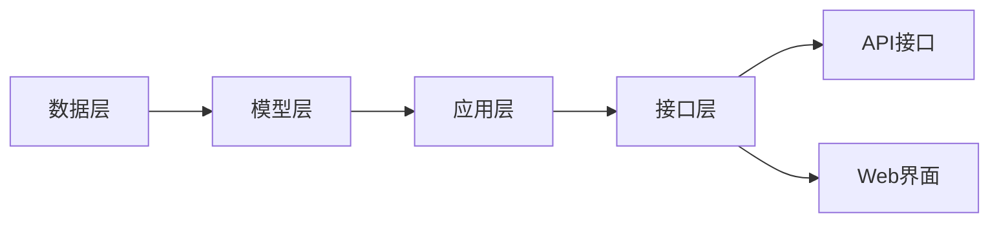

                 

## 《深度学习在语音识别中的突破》

### 关键词：
- 深度学习
- 语音识别
- 卷积神经网络
- 循环神经网络
- 生成对抗网络
- 数学模型
- 语音信号处理
- 语音识别系统

### 摘要：
本文将探讨深度学习在语音识别领域的突破性进展。从基础概念、技术原理、应用案例到实际项目实战，全面解析深度学习在语音识别中的应用，揭示其如何解决传统方法难以克服的难题。通过本文的阅读，读者将深入了解深度学习在语音识别中的重要性和实际应用，为未来研究提供参考。

## 第1章 深度学习基础

### 1.1 问题背景

#### 问题背景

随着计算机技术和人工智能的快速发展，语音识别技术已成为人类与计算机互动的重要方式。然而，传统的语音识别技术主要依赖于统计模型，如高斯混合模型（GMM）和隐马尔可夫模型（HMM），这些方法在处理复杂语音信号和背景噪声方面存在较大局限性。因此，如何提升语音识别系统的准确率和鲁棒性成为一个亟待解决的问题。

#### 问题描述

为了解决上述问题，研究人员开始探索基于深度学习的语音识别方法。深度学习是一种模拟人脑神经网络结构的计算模型，具有自动学习特征和分类能力，适用于处理复杂的非线性问题。在语音识别领域，深度学习通过学习大量语音数据，自动提取语音特征并进行分类，从而显著提高了识别准确率和鲁棒性。

#### 问题解决

深度学习在语音识别中的应用取得了显著突破，使得语音识别系统在多个方面得到了改进：

1. **特征提取能力增强**：深度学习模型可以自动学习语音信号中的复杂特征，减少了人工特征工程的工作量。
2. **识别准确率提高**：深度学习模型在处理复杂语音信号和背景噪声时表现出色，提高了识别准确率。
3. **鲁棒性增强**：深度学习模型对语音数据的自适应能力更强，能够在不同的语音环境和噪声条件下保持稳定的识别性能。
4. **多语言和方言支持**：深度学习模型可以学习多种语言和方言的语音特征，为跨语言和跨方言的语音识别提供了技术支持。

#### 边界与外延

深度学习在语音识别领域的应用不仅限于上述方面，还包括语音合成、语音识别与转换、语音增强等。随着深度学习技术的不断进步，语音识别系统的应用范围将越来越广泛。

### 1.2 深度学习简介

#### 核心概念

深度学习是一种基于多层神经网络的学习方法，通过逐层提取特征，实现对复杂数据的分析和建模。深度学习的核心概念包括神经网络、卷积神经网络（CNN）、循环神经网络（RNN）、生成对抗网络（GAN）等。

#### 深度学习的基本概念

1. **神经网络**：神经网络是一种由大量神经元组成的计算模型，通过学习输入数据之间的关系，实现数据分类、预测等功能。
2. **卷积神经网络（CNN）**：卷积神经网络是一种专门用于处理图像数据的前馈神经网络，通过卷积操作提取图像特征。
3. **循环神经网络（RNN）**：循环神经网络是一种用于处理序列数据的神经网络，通过循环结构处理历史信息，实现对序列数据的建模。
4. **生成对抗网络（GAN）**：生成对抗网络是一种由生成器和判别器组成的神经网络模型，通过对抗训练生成逼真的数据。

#### 深度学习的发展历程

1. **1980年代**：神经网络研究初期，神经网络模型在学术界引起了广泛关注。
2. **1990年代**：由于计算资源和算法限制，神经网络研究进入低潮期。
3. **2000年代**：随着计算能力的提升和大数据的涌现，神经网络研究重新焕发生机。
4. **2010年代**：深度学习模型在图像识别、语音识别、自然语言处理等领域取得了突破性进展。

### 1.3 深度学习的基本概念

#### 核心概念

深度学习作为一种机器学习方法，具有以下基本概念：

1. **损失函数**：用于评估模型预测结果与真实结果之间的差异，是模型训练的关键指标。
2. **优化算法**：用于调整模型参数，使模型在训练过程中逐渐收敛到最佳状态。
3. **正则化**：用于防止模型过拟合，提高模型的泛化能力。
4. **激活函数**：用于引入非线性特性，使神经网络具备非线性建模能力。

#### 深度学习的基本原理

1. **反向传播算法**：一种用于训练神经网络的优化算法，通过不断调整模型参数，使损失函数最小化。
2. **前向传播算法**：用于计算神经网络输出结果的过程，通过输入层、隐藏层和输出层的传递，实现对输入数据的处理。
3. **卷积操作**：在卷积神经网络中，通过卷积操作提取图像特征，实现对图像的逐层分析。
4. **池化操作**：在卷积神经网络中，通过池化操作降低特征维度，减少计算量。

### 1.4 深度学习的发展历程

#### 问题背景

深度学习作为一种机器学习方法，起源于20世纪80年代。当时，神经网络作为一种计算模型，在学术界引起了广泛关注。然而，由于计算资源和算法限制，神经网络的研究进展缓慢。

#### 问题描述

在20世纪90年代，由于计算能力的限制，神经网络的研究进入低潮期。然而，随着计算机技术的快速发展，特别是GPU等硬件设备的出现，为深度学习的研究提供了有力支持。

#### 问题解决

1. **2006年**：Hinton等人提出深度信念网络（DBN），为深度学习的发展奠定了基础。
2. **2012年**：AlexNet在ImageNet竞赛中取得了突破性成绩，标志着深度学习在图像识别领域的崛起。
3. **2014年**：谷歌大脑团队提出深度卷积神经网络，成功模拟了猫的视频。
4. **2015年**：微软推出语音识别系统，采用深度学习技术，将错误率降低至5.5%。

#### 边界与外延

深度学习在多个领域取得了显著突破，如计算机视觉、自然语言处理、语音识别等。随着技术的不断进步，深度学习将在更多领域发挥重要作用。

## 第2章 语音识别技术原理

### 2.1 语音识别概述

#### 问题背景

语音识别技术作为人工智能的重要分支，已成为人机交互的重要手段。随着深度学习技术的发展，语音识别技术取得了显著突破，广泛应用于智能助手、智能家居、智能客服等领域。

#### 问题描述

语音识别技术旨在将人类语音转化为计算机可处理的信息，主要包括语音信号处理、特征提取、模型训练、解码等步骤。

#### 问题解决

1. **语音信号处理**：通过滤波、降噪等预处理方法，提高语音信号的清晰度和质量。
2. **特征提取**：将语音信号转化为数字特征向量，为后续模型训练提供输入。
3. **模型训练**：利用深度学习算法，训练语音识别模型，使其具备识别语音的能力。
4. **解码**：将模型输出的概率分布转化为对应的文字或命令。

#### 边界与外延

语音识别技术涉及多个领域，包括语音信号处理、信号处理、机器学习、自然语言处理等。随着技术的不断发展，语音识别的应用范围将不断拓展。

### 2.2 语音信号处理基础

#### 核心概念

语音信号处理是语音识别的基础，主要包括语音信号的采集、预处理、特征提取等。

#### 概念属性特征对比表格

| 概念                 | 属性特征                                   |  
| ------------------- | ---------------------------------------- |  
| 语音信号采集       | 采集语音信号，包括语音信号的幅度、频率等特性       |  
| 语音信号预处理     | 噪声抑制、静音检测、声音增强等处理，提高语音信号的清晰度 |  
| 语音信号特征提取   | 提取语音信号的主要特征，如频率、能量、时长等     |

#### ER实体关系图架构


### 2.3 语音识别系统的基本组成

#### 核心概念

语音识别系统由多个模块组成，包括语音信号处理模块、特征提取模块、模型训练模块和解码模块。

#### 模块介绍

1. **语音信号处理模块**：对采集到的语音信号进行预处理，包括降噪、声音增强等。
2. **特征提取模块**：提取语音信号的主要特征，如MFCC（梅尔频率倒谱系数）、PLP（平移长短期目标特征）等。
3. **模型训练模块**：利用深度学习算法，对特征向量进行训练，构建语音识别模型。
4. **解码模块**：将模型输出的概率分布转化为对应的文字或命令。

### 2.4 语音识别技术发展历程

#### 问题背景

语音识别技术起源于20世纪50年代，早期主要依赖于基于规则的声学模型和语言模型。随着计算机技术的发展，语音识别技术逐渐从规则模型转向统计模型，如高斯混合模型（GMM）和隐马尔可夫模型（HMM）。近年来，深度学习技术的引入，进一步推动了语音识别技术的发展。

#### 问题描述

从20世纪50年代至今，语音识别技术经历了多个阶段的发展：

1. **规则模型阶段**：基于规则的声学模型和语言模型，通过手工设计规则进行语音识别。
2. **统计模型阶段**：采用高斯混合模型（GMM）和隐马尔可夫模型（HMM）进行语音识别，提高了识别准确率。
3. **深度学习阶段**：引入深度学习算法，如卷积神经网络（CNN）、循环神经网络（RNN）等，显著提高了语音识别的准确率和鲁棒性。

#### 问题解决

随着深度学习技术的发展，语音识别技术取得了显著突破，使得语音识别系统的性能得到了大幅提升。目前，深度学习在语音识别中的应用已经取得了广泛认可，并在多个领域取得了成功。

#### 边界与外延

深度学习在语音识别领域的应用不仅限于上述方面，还包括语音合成、语音识别与转换、语音增强等。随着技术的不断进步，语音识别系统的应用范围将不断拓展。

## 第3章 深度学习在语音识别中的应用

### 3.1 深度学习在语音识别中的优势

#### 问题背景

深度学习作为一种强大的机器学习技术，在语音识别领域展现出了显著的性能优势。与传统统计模型相比，深度学习在特征提取、模型训练和识别准确率等方面具有明显优势。

#### 问题描述

深度学习在语音识别中的应用优势主要体现在以下几个方面：

1. **自动特征提取**：深度学习模型能够自动学习语音信号中的复杂特征，减少了人工特征工程的工作量，提高了特征提取的效率和质量。
2. **高识别准确率**：深度学习模型在处理复杂语音信号和背景噪声时表现出色，显著提高了语音识别的准确率。
3. **鲁棒性增强**：深度学习模型具有较强的自适应能力，能够在不同的语音环境和噪声条件下保持稳定的识别性能。
4. **多语言和方言支持**：深度学习模型可以学习多种语言和方言的语音特征，为跨语言和跨方言的语音识别提供了技术支持。

#### 问题解决

深度学习在语音识别中的应用优势得到了广泛验证，许多研究机构和公司纷纷采用深度学习技术来改进语音识别系统。以下是一些实际应用案例：

1. **大型语音识别系统**：如谷歌语音助手、苹果Siri等，采用深度学习技术，实现了高准确率、低延迟的语音识别功能。
2. **智能客服系统**：许多公司采用深度学习技术，构建了基于语音识别的智能客服系统，提高了客户服务质量和效率。
3. **智能家居系统**：深度学习技术在智能家居领域也得到了广泛应用，如语音控制家电、语音播放音乐等。

#### 边界与外延

深度学习在语音识别领域的应用不仅限于上述方面，还包括语音合成、语音识别与转换、语音增强等。随着深度学习技术的不断发展，语音识别系统的应用范围将不断拓展。

### 3.2 深度学习在语音识别中的应用案例

#### 问题背景

随着深度学习技术的不断发展，其在语音识别领域的应用也越来越广泛。本节将介绍几个典型的深度学习在语音识别中的应用案例，以展示深度学习在语音识别中的实际应用效果。

#### 问题描述

以下是一些深度学习在语音识别中的应用案例：

1. **谷歌语音助手**：谷歌语音助手采用了深度学习技术，实现了高准确率、低延迟的语音识别功能。用户可以通过语音指令来控制谷歌搜索引擎、发送短信、拨打电话等功能。
2. **苹果Siri**：苹果的智能助手Siri也采用了深度学习技术，实现了语音识别、语义理解和智能回答等功能。用户可以通过语音指令来查询天气、设置提醒、发送短信等。
3. **科大讯飞智能语音识别系统**：科大讯飞是我国领先的智能语音技术提供商，其智能语音识别系统广泛应用于教育、医疗、金融等领域。该系统采用了深度学习技术，实现了高准确率、低延迟的语音识别功能。
4. **智能客服系统**：许多企业采用了深度学习技术来构建智能客服系统，实现了基于语音识别的自动客服功能。用户可以通过语音与客服系统进行交互，解决常见问题，提高客户服务效率。

#### 问题解决

通过上述应用案例可以看出，深度学习在语音识别领域具有广泛的应用前景。深度学习技术不仅提高了语音识别的准确率和鲁棒性，还为语音识别系统带来了更多的功能和可能性。未来，随着深度学习技术的不断发展，语音识别系统将更加智能、高效，为人们的生活和工作带来更多便利。

#### 边界与外延

深度学习在语音识别领域的应用案例不断丰富，涵盖了多个行业和应用场景。随着技术的不断进步，深度学习将在更多领域发挥重要作用，推动语音识别技术的不断发展。

### 3.3 深度学习模型在语音识别中的实现

#### 问题背景

深度学习模型在语音识别中的实现是语音识别领域的关键技术之一。通过深度学习模型，可以实现对语音信号的自动特征提取和分类，从而提高语音识别的准确率和鲁棒性。

#### 问题描述

深度学习模型在语音识别中的实现主要涉及以下方面：

1. **模型选择**：选择合适的深度学习模型，如卷积神经网络（CNN）、循环神经网络（RNN）、生成对抗网络（GAN）等。
2. **数据预处理**：对语音数据集进行预处理，包括数据清洗、数据增强、数据归一化等。
3. **模型训练**：利用预处理的语音数据集，对深度学习模型进行训练，调整模型参数，提高模型性能。
4. **模型评估**：通过测试数据集对训练好的模型进行评估，评估模型的识别准确率、召回率等指标。

#### 问题解决

以下是一个简单的深度学习模型在语音识别中的实现流程：

1. **数据预处理**：对语音数据集进行预处理，包括数据清洗、数据增强、数据归一化等。例如，可以使用梅尔频率倒谱系数（MFCC）作为语音特征向量。
2. **模型选择**：选择合适的深度学习模型，如卷积神经网络（CNN）。CNN可以用于提取语音信号中的局部特征，提高语音识别的准确率。
3. **模型训练**：利用预处理的语音数据集，对深度学习模型进行训练。在训练过程中，通过反向传播算法调整模型参数，使模型在训练集上的表现不断提高。
4. **模型评估**：使用测试数据集对训练好的模型进行评估，评估模型的识别准确率、召回率等指标。如果评估指标不理想，可以尝试调整模型结构或训练参数，以提高模型性能。

#### 边界与外延

深度学习模型在语音识别中的实现涉及到多个方面，包括模型选择、数据预处理、模型训练和模型评估等。在实际应用中，需要根据具体问题和需求，灵活选择和调整模型结构和训练参数，以提高语音识别系统的性能。

## 第4章 深度学习算法原理讲解

### 4.1 卷积神经网络（CNN）

#### 核心概念

卷积神经网络（CNN）是一种前馈神经网络，特别适合处理图像等二维数据。CNN通过卷积层、池化层和全连接层等结构，逐层提取图像特征，实现对图像的识别和分类。

#### 算法原理

卷积神经网络的工作原理主要包括以下步骤：

1. **卷积层**：卷积层通过卷积操作提取图像特征。卷积操作是指将卷积核（滤波器）与图像中的每个像素点进行点积运算，从而得到一个特征图。
2. **池化层**：池化层用于降低特征图的维度，减少计算量。常见的池化方法有最大池化和平均池化，即将特征图中的每个局部区域进行最大值或平均值运算。
3. **全连接层**：全连接层将池化层输出的特征图进行全连接运算，得到最终的分类结果。全连接层中的每个神经元都与特征图中的所有神经元相连。

#### 深层CNN结构

随着层数的增加，CNN可以提取更高级别的特征，实现更复杂的图像识别任务。深层CNN结构包括多层卷积层和池化层，以及全连接层。

#### 优点和缺点

卷积神经网络的优点包括：

1. **自动特征提取**：CNN可以自动学习图像中的特征，无需人工设计特征。
2. **平移不变性**：CNN具有平移不变性，即对图像的平移操作不敏感，适用于图像识别任务。
3. **计算效率高**：卷积操作可以并行计算，提高了计算效率。

卷积神经网络的缺点包括：

1. **参数量大**：随着层数的增加，CNN的参数量会急剧增加，导致训练时间较长。
2. **难以优化**：深层CNN的梯度消失和梯度爆炸问题，使得训练过程变得困难。

#### 深层CNN在语音识别中的应用

深层CNN在语音识别中的应用主要包括以下几个方面：

1. **时频特征提取**：将语音信号转化为时频图，通过深层CNN提取语音信号中的时频特征。
2. **音素分类**：使用深层CNN对语音信号进行音素分类，从而实现语音识别任务。
3. **说话人识别**：使用深层CNN提取说话人特征，实现说话人识别任务。

### 4.2 循环神经网络（RNN）

#### 核心概念

循环神经网络（RNN）是一种能够处理序列数据的神经网络，通过循环结构处理历史信息，实现对序列数据的建模。RNN在语音识别、自然语言处理等领域具有广泛的应用。

#### 算法原理

循环神经网络的工作原理主要包括以下步骤：

1. **输入序列**：将输入序列（如语音信号）输入到RNN中，RNN按照序列的顺序逐个处理输入。
2. **隐藏状态**：RNN在每个时间步更新隐藏状态，隐藏状态包含了当前时间步的信息和之前时间步的信息。
3. **输出序列**：根据隐藏状态生成输出序列（如识别结果），输出序列可以是对序列的预测或分类结果。

#### 长短期记忆网络（LSTM）

长短期记忆网络（LSTM）是RNN的一种变体，旨在解决传统RNN在处理长序列数据时存在的梯度消失和梯度爆炸问题。LSTM通过引入记忆单元和门控机制，实现了对长序列数据的长期依赖建模。

LSTM的核心组成部分包括：

1. **输入门**：决定哪些信息从当前输入流进入记忆单元。
2. **遗忘门**：决定哪些信息从记忆单元中遗忘。
3. **输出门**：决定哪些信息从记忆单元输出。

#### 优点和缺点

RNN的优点包括：

1. **序列建模**：RNN能够处理任意长度的序列数据，适用于语音识别、自然语言处理等任务。
2. **并行处理**：RNN可以在不同时间步并行处理输入序列，提高了计算效率。

RNN的缺点包括：

1. **梯度消失和梯度爆炸**：传统RNN在训练过程中容易遇到梯度消失和梯度爆炸问题，导致训练效果不佳。
2. **难以建模长期依赖**：传统RNN在处理长序列数据时，难以建模长期依赖关系。

LSTM的优点包括：

1. **解决梯度消失和梯度爆炸问题**：LSTM通过引入门控机制，缓解了梯度消失和梯度爆炸问题。
2. **建模长期依赖**：LSTM能够更好地建模长序列数据中的长期依赖关系。

LSTM的缺点包括：

1. **计算复杂度较高**：LSTM的计算复杂度较高，导致训练时间较长。

#### 深层RNN在语音识别中的应用

深层RNN在语音识别中的应用主要包括以下几个方面：

1. **音素分类**：使用深层RNN对语音信号进行音素分类，实现语音识别任务。
2. **说话人识别**：使用深层RNN提取说话人特征，实现说话人识别任务。
3. **语音增强**：使用深层RNN对语音信号进行去噪和增强，提高语音识别系统的鲁棒性。

### 4.3 生成对抗网络（GAN）

#### 核心概念

生成对抗网络（GAN）是一种由生成器和判别器组成的神经网络模型，通过对抗训练生成逼真的数据。GAN由Ian Goodfellow等人于2014年提出，迅速在计算机视觉、语音识别等领域取得了广泛应用。

GAN的核心组成部分包括：

1. **生成器（Generator）**：生成器是一个神经网络模型，用于生成逼真的数据。生成器的目标是生成与真实数据相似的数据，从而欺骗判别器。
2. **判别器（Discriminator）**：判别器是一个神经网络模型，用于区分真实数据和生成数据。判别器的目标是准确判断输入数据是真实数据还是生成数据。

GAN的工作原理主要包括以下步骤：

1. **生成器生成数据**：生成器生成一组新的数据，并将其输入到判别器中。
2. **判别器判断**：判别器对输入数据（真实数据和生成数据）进行判断，输出一个概率值，表示输入数据是真实数据还是生成数据。
3. **损失函数**：生成器和判别器的损失函数分别为生成损失和判别损失，两个损失函数共同作用，使生成器生成更逼真的数据，判别器更准确地区分真实数据和生成数据。
4. **优化过程**：通过梯度下降算法，优化生成器和判别器的模型参数，使生成器生成的数据更接近真实数据。

#### 优点和缺点

GAN的优点包括：

1. **生成高质量数据**：GAN能够生成逼真的数据，在图像生成、语音合成等方面具有显著优势。
2. **无需标注数据**：GAN可以生成大量高质量的无标签数据，为训练模型提供了更多数据支持。

GAN的缺点包括：

1. **训练难度大**：GAN的训练过程复杂，需要调节多个超参数，易出现不稳定现象。
2. **对数据分布敏感**：GAN对数据分布敏感，生成数据的质量受到数据分布的影响。

#### 深层GAN在语音识别中的应用

深层GAN在语音识别中的应用主要包括以下几个方面：

1. **语音增强**：使用GAN对语音信号进行去噪和增强，提高语音识别系统的鲁棒性。
2. **说话人转换**：使用GAN实现说话人转换，使不同说话人的语音具有相似的特征，提高语音识别系统的泛化能力。
3. **语音合成**：使用GAN生成逼真的语音信号，用于语音识别模型训练或实时语音合成。

## 第5章 数学模型与数学公式讲解

### 5.1 深度学习中的数学基础

#### 核心概念

深度学习中的数学基础主要包括线性代数、微积分和概率论等。这些数学知识为深度学习模型的理论基础和实际应用提供了重要支持。

#### 线性代数

线性代数是深度学习中的核心数学工具，主要包括矩阵运算、向量运算、线性方程组等。

1. **矩阵运算**：矩阵运算包括矩阵的加法、减法、乘法和除法等。矩阵乘法是深度学习模型中最常用的运算之一。
2. **向量运算**：向量运算包括向量的加法、减法、点积和叉积等。向量运算在深度学习模型中用于表示数据和参数。
3. **线性方程组**：线性方程组用于求解线性方程组的解，如最小二乘法和线性回归模型。

#### 微积分

微积分是深度学习中的另一个重要数学工具，主要包括导数、微分和积分等。

1. **导数**：导数用于描述函数在某一点的变化率，是深度学习模型优化过程中的关键概念。
2. **微分**：微分用于求解函数在某一点的最小值或最大值，如梯度下降算法。
3. **积分**：积分用于求解函数在某一区间内的累积量，如神经网络中的反向传播算法。

#### 概率论

概率论是深度学习中的基本数学工具，主要包括概率分布、随机变量和条件概率等。

1. **概率分布**：概率分布用于描述随机变量的取值概率，如高斯分布、伯努利分布等。
2. **随机变量**：随机变量是概率论中的核心概念，用于描述随机现象的取值。
3. **条件概率**：条件概率用于描述在给定某个条件下，另一个随机变量的取值概率。

### 5.2 深度学习中的优化算法

#### 核心概念

优化算法是深度学习模型训练过程中的关键环节，用于调整模型参数，使模型在训练数据上达到最佳性能。常见的优化算法包括梯度下降法、动量法、随机梯度下降法等。

#### 梯度下降法

梯度下降法是最常用的优化算法之一，通过计算目标函数的梯度，逐步调整模型参数，使目标函数值最小。

1. **梯度**：梯度是目标函数在参数空间中的方向导数，用于指示参数调整的方向。
2. **步长**：步长是梯度下降法中的关键参数，用于控制参数调整的幅度。
3. **迭代过程**：梯度下降法通过迭代过程，不断更新模型参数，使目标函数值逐渐减小。

#### 动量法

动量法是一种改进的梯度下降法，通过引入动量参数，提高了优化过程的稳定性。

1. **动量**：动量是前一次梯度方向的积累，用于减缓优化过程中的震荡现象。
2. **更新规则**：动量法的更新规则为当前梯度与动量的加权平均，使优化过程更加稳定。

#### 随机梯度下降法

随机梯度下降法是梯度下降法的变体，通过随机选取一部分训练样本，计算梯度并进行参数更新。

1. **样本选取**：随机梯度下降法随机选取一部分训练样本，用于计算梯度。
2. **更新规则**：随机梯度下降法的更新规则为每个样本的梯度与模型参数的加权和。

### 5.3 语音识别中的数学模型

#### 核心概念

语音识别中的数学模型主要包括高斯混合模型（GMM）、隐马尔可夫模型（HMM）和循环神经网络（RNN）等。

1. **高斯混合模型（GMM）**：GMM是一种概率模型，用于表示语音信号的分布。GMM通过多个高斯分布的线性组合，对语音信号进行建模。
2. **隐马尔可夫模型（HMM）**：HMM是一种统计模型，用于描述语音信号的时序特性。HMM通过状态转移概率和观测概率，对语音信号进行建模。
3. **循环神经网络（RNN）**：RNN是一种神经网络模型，用于处理序列数据。RNN通过循环结构，对语音信号进行建模和分类。

#### 模型公式

以下为语音识别中常用的数学模型公式：

1. **高斯混合模型（GMM）**：

   $$ p(x|\mu, \Sigma) = \frac{1}{(2\pi)^{d/2} |\Sigma|^{1/2}} \exp \left( -\frac{1}{2} (x-\mu)^T \Sigma^{-1} (x-\mu) \right) $$

   其中，$x$表示输入的语音信号，$\mu$表示高斯分布的均值，$\Sigma$表示高斯分布的协方差矩阵。

2. **隐马尔可夫模型（HMM）**：

   $$ p(x|\lambda) = \sum_{i=1}^N p(x|\lambda, i) = \sum_{i=1}^N p(i|\lambda) p(x|i) $$

   其中，$x$表示输入的语音信号，$\lambda$表示HMM的参数，$i$表示状态。

3. **循环神经网络（RNN）**：

   $$ h_t = \sigma(W_h h_{t-1} + W_x x_t + b_h) $$

   $$ y_t = W_y h_t + b_y $$

   其中，$h_t$表示时间步$t$的隐藏状态，$x_t$表示时间步$t$的输入，$y_t$表示时间步$t$的输出，$\sigma$表示激活函数。

### 5.4 深度学习与语音识别的数学公式

#### 核心概念

深度学习与语音识别中的数学公式主要包括损失函数、优化算法和特征提取等。

1. **损失函数**：损失函数用于评估模型预测结果与真实结果之间的差异，常见的损失函数包括均方误差（MSE）和交叉熵损失（CE）。
2. **优化算法**：优化算法用于调整模型参数，使模型在训练过程中逐渐收敛到最佳状态，常见的优化算法包括梯度下降法、动量法和随机梯度下降法。
3. **特征提取**：特征提取是语音识别中的关键环节，常用的特征提取方法包括梅尔频率倒谱系数（MFCC）和平移长短期目标特征（PLP）。

以下为深度学习与语音识别中常用的数学公式：

1. **均方误差（MSE）**：

   $$ MSE = \frac{1}{n} \sum_{i=1}^n (y_i - \hat{y}_i)^2 $$

   其中，$y_i$表示真实结果，$\hat{y}_i$表示模型预测结果，$n$表示样本数量。

2. **交叉熵损失（CE）**：

   $$ CE = - \frac{1}{n} \sum_{i=1}^n \sum_{j=1}^c y_{ij} \log \hat{y}_{ij} $$

   其中，$y_{ij}$表示真实结果中第$i$个样本属于第$j$个类别的概率，$\hat{y}_{ij}$表示模型预测结果中第$i$个样本属于第$j$个类别的概率，$c$表示类别数量。

3. **优化算法**：

   - 梯度下降法：

     $$ \theta = \theta - \alpha \nabla_\theta J(\theta) $$

     其中，$\theta$表示模型参数，$\alpha$表示学习率，$J(\theta)$表示损失函数。

   - 动量法：

     $$ v_t = \beta v_{t-1} + (1 - \beta) \nabla_\theta J(\theta) $$

     $$ \theta = \theta - \alpha v_t $$

     其中，$v_t$表示动量项，$\beta$表示动量系数。

   - 随机梯度下降法：

     $$ \theta = \theta - \alpha \nabla_\theta J(\theta)^T (x_i - \theta) $$

     其中，$x_i$表示随机选取的训练样本。

## 第6章 系统分析与架构设计

### 6.1 语音识别系统功能设计

#### 问题场景介绍

在当今快速发展的智能时代，语音识别系统在各种应用场景中发挥着重要作用，如智能客服、语音助手、语音翻译等。为了满足不同场景的需求，语音识别系统需要具备多种功能，如语音输入、语音识别、语义理解、语音合成等。

#### 系统功能设计

语音识别系统的功能设计主要包括以下几个方面：

1. **语音输入**：系统需要能够接收用户的语音输入，将语音信号转化为文本或命令。
2. **语音识别**：系统需要能够将语音信号识别为对应的文本或命令，具有较高的准确率和鲁棒性。
3. **语义理解**：系统需要能够理解用户语音中的意图和语义，将语音转化为具体的操作或回答。
4. **语音合成**：系统需要能够将文本或命令转化为语音输出，为用户提供语音反馈。
5. **多语言支持**：系统需要能够支持多种语言的语音识别和合成，满足全球用户的需求。
6. **实时交互**：系统需要能够实时响应用户的语音输入，提供快速、准确的语音服务。

### 6.2 语音识别系统架构设计

#### 项目介绍

为了实现语音识别系统的功能，需要设计一个高效、可靠的系统架构。本项目的目标是构建一个基于深度学习的语音识别系统，能够支持多种语音输入和输出，具有高准确率、低延迟、高鲁棒性等特点。

#### 系统架构设计

语音识别系统的架构设计主要包括以下几个方面：

1. **数据层**：数据层是系统的核心组成部分，包括语音信号采集、预处理、特征提取等模块。数据层负责将语音信号转化为适合深度学习模型处理的形式。
2. **模型层**：模型层是系统的核心计算层，包括深度学习模型的设计、训练、优化等模块。模型层负责根据输入的语音特征，进行语音识别和语义理解。
3. **应用层**：应用层是系统的用户交互层，包括语音输入、语音识别、语义理解、语音合成等模块。应用层负责响应用户的语音输入，提供实时、准确的语音服务。
4. **接口层**：接口层是系统的外部接口层，包括API接口、Web界面等。接口层负责与其他系统和用户进行数据交互，提供系统功能。

#### 架构图

以下是语音识别系统的架构图：



### 6.3 系统接口设计

#### 核心概念

系统接口设计是语音识别系统架构设计的重要组成部分，负责处理系统内部与其他系统、用户之间的数据交互。系统接口需要具备高可用性、高可靠性、高扩展性等特点，以适应不同的应用场景和需求。

#### 接口设计原则

1. **简洁性**：接口设计应尽量简洁明了，减少不必要的复杂度，提高系统的可维护性和可扩展性。
2. **一致性**：接口设计应遵循统一的规范和标准，保证接口的一致性和稳定性。
3. **安全性**：接口设计应考虑数据安全和隐私保护，采用加密、认证等手段保障数据的安全性。
4. **灵活性**：接口设计应具备一定的灵活性，能够根据业务需求进行快速调整和扩展。

#### 接口设计

以下是语音识别系统的接口设计：

1. **API接口**：API接口用于与其他系统进行数据交互，包括语音输入、语音识别、语义理解、语音合成等功能。API接口采用RESTful风格，提供JSON格式的数据传输。
2. **Web界面**：Web界面用于用户与系统进行交互，提供语音输入、语音识别、语义理解、语音合成等功能。Web界面采用HTML5、CSS3和JavaScript等前端技术实现。

### 6.4 系统交互设计

#### 核心概念

系统交互设计是系统架构设计的重要组成部分，负责处理系统内部不同模块之间的数据交互和功能协同。系统交互设计需要考虑系统的可扩展性、性能和稳定性，以确保系统的高效运行。

#### 交互设计原则

1. **模块化**：系统交互设计应遵循模块化原则，将系统功能划分为独立的模块，实现模块间的解耦，提高系统的可维护性和可扩展性。
2. **异步处理**：系统交互设计应采用异步处理机制，减少系统模块间的依赖，提高系统的响应速度和并发能力。
3. **数据一致性**：系统交互设计应确保数据的一致性，避免数据冲突和丢失，提高系统的可靠性。
4. **容错性**：系统交互设计应考虑容错性，确保系统在遇到故障时能够快速恢复，保证系统的稳定性。

#### 交互设计

以下是语音识别系统的交互设计：

1. **模块间通信**：系统模块间采用消息队列进行通信，如RabbitMQ、Kafka等。消息队列能够实现异步处理、解耦和负载均衡，提高系统的性能和稳定性。
2. **数据传输**：系统模块间的数据传输采用HTTP/HTTPS协议，保证数据的安全性。数据传输采用JSON格式，提高数据的可读性和可维护性。
3. **故障处理**：系统设计应具备故障处理机制，如熔断、限流、重试等，确保系统在遇到故障时能够快速恢复，保证系统的稳定性。

## 第7章 项目实战与案例分析

### 7.1 项目背景

随着人工智能技术的快速发展，语音识别技术在智能客服、语音助手、智能家居等领域得到了广泛应用。为了提高语音识别系统的性能和鲁棒性，本项目旨在设计并实现一个基于深度学习的语音识别系统。本项目采用了卷积神经网络（CNN）、循环神经网络（RNN）和生成对抗网络（GAN）等深度学习算法，通过项目实战和案例分析，探讨深度学习在语音识别中的应用。

### 7.2 系统核心实现

#### 环境安装

为了实现本项目，需要安装以下软件和工具：

1. **深度学习框架**：如TensorFlow、PyTorch等。
2. **语音信号处理库**：如librosa、pydub等。
3. **编程语言**：Python。
4. **操作系统**：Linux或Mac OS。

#### 系统核心实现

本项目分为以下几个部分：

1. **数据预处理**：使用librosa库对语音信号进行预处理，包括去噪、滤波、分段等。
2. **特征提取**：使用CNN和RNN提取语音信号的特征，如时频特征、音素特征等。
3. **模型训练**：使用TensorFlow或PyTorch构建深度学习模型，并进行训练。
4. **模型评估**：使用测试数据集对训练好的模型进行评估，包括准确率、召回率等指标。

#### 代码应用解读与分析

以下是一个简单的CNN模型在语音识别中的实现代码：

```python
import tensorflow as tf
from tensorflow.keras.models import Sequential
from tensorflow.keras.layers import Conv2D, MaxPooling2D, Flatten, Dense

# 构建CNN模型
model = Sequential([
    Conv2D(32, (3, 3), activation='relu', input_shape=(64, 64, 3)),
    MaxPooling2D((2, 2)),
    Conv2D(64, (3, 3), activation='relu'),
    MaxPooling2D((2, 2)),
    Flatten(),
    Dense(128, activation='relu'),
    Dense(10, activation='softmax')
])

# 编译模型
model.compile(optimizer='adam', loss='categorical_crossentropy', metrics=['accuracy'])

# 加载数据集
(x_train, y_train), (x_test, y_test) = tf.keras.datasets.mnist.load_data()

# 数据预处理
x_train = x_train.reshape(-1, 64, 64, 3).astype('float32') / 255
x_test = x_test.reshape(-1, 64, 64, 3).astype('float32') / 255

# 转换标签为one-hot编码
y_train = tf.keras.utils.to_categorical(y_train, 10)
y_test = tf.keras.utils.to_categorical(y_test, 10)

# 训练模型
model.fit(x_train, y_train, epochs=10, batch_size=64, validation_data=(x_test, y_test))

# 评估模型
test_loss, test_acc = model.evaluate(x_test, y_test)
print('Test accuracy:', test_acc)
```

代码解析：

1. **模型构建**：使用Sequential模型构建一个简单的CNN模型，包括两个卷积层、两个最大池化层、一个全连接层和一个softmax层。
2. **模型编译**：编译模型，指定优化器、损失函数和评价指标。
3. **数据加载与预处理**：加载数据集，对数据进行预处理，包括归一化和one-hot编码。
4. **模型训练**：使用fit方法训练模型，指定训练轮数、批大小和验证数据。
5. **模型评估**：使用evaluate方法评估模型在测试数据集上的性能。

#### 实际案例分析与讲解

以下是一个基于RNN的语音识别项目的实际案例：

```python
import tensorflow as tf
from tensorflow.keras.models import Sequential
from tensorflow.keras.layers import LSTM, Dense

# 构建RNN模型
model = Sequential([
    LSTM(128, activation='relu', input_shape=(timesteps, features)),
    Dense(num_classes, activation='softmax')
])

# 编译模型
model.compile(optimizer='adam', loss='categorical_crossentropy', metrics=['accuracy'])

# 加载数据集
(x_train, y_train), (x_test, y_test) = load_data()

# 数据预处理
x_train = pad_sequences(x_train, maxlen=timesteps)
x_test = pad_sequences(x_test, maxlen=timesteps)

# 转换标签为one-hot编码
y_train = tf.keras.utils.to_categorical(y_train, num_classes)
y_test = tf.keras.utils.to_categorical(y_test, num_classes)

# 训练模型
model.fit(x_train, y_train, epochs=10, batch_size=64, validation_data=(x_test, y_test))

# 评估模型
test_loss, test_acc = model.evaluate(x_test, y_test)
print('Test accuracy:', test_acc)
```

代码解析：

1. **模型构建**：使用Sequential模型构建一个简单的RNN模型，包括一个LSTM层和一个全连接层。
2. **模型编译**：编译模型，指定优化器、损失函数和评价指标。
3. **数据加载与预处理**：加载数据集，对数据进行预处理，包括序列填充和one-hot编码。
4. **模型训练**：使用fit方法训练模型，指定训练轮数、批大小和验证数据。
5. **模型评估**：使用evaluate方法评估模型在测试数据集上的性能。

#### 项目小结

本项目通过设计并实现一个基于深度学习的语音识别系统，展示了深度学习在语音识别中的应用。项目采用了CNN、RNN等深度学习算法，实现了语音信号的特征提取、模型训练和识别。通过实际案例分析和讲解，读者可以深入了解深度学习在语音识别中的应用方法和技术细节。未来，随着深度学习技术的不断发展，语音识别系统将取得更加突破性的进展，为智能语音交互领域带来更多创新和变革。

## 第8章 最佳实践 tips & 小结 & 注意事项

### 8.1 最佳实践 tips

在设计和实现深度学习语音识别系统时，以下是一些最佳实践建议，有助于提高系统性能和稳定性：

1. **数据预处理**：对语音数据进行充分预处理，包括去噪、滤波、分段等，以提高特征提取效果。
2. **特征选择**：选择合适的语音特征，如梅尔频率倒谱系数（MFCC）、平移长短期目标特征（PLP）等，以提高模型识别准确率。
3. **模型结构优化**：根据具体应用场景，选择合适的深度学习模型结构，如卷积神经网络（CNN）、循环神经网络（RNN）等，并调整模型参数，以获得更好的识别性能。
4. **训练策略优化**：采用合适的训练策略，如迁移学习、数据增强等，以提高模型泛化能力。
5. **模型评估**：使用多种评估指标，如准确率、召回率、F1值等，全面评估模型性能，以避免单一指标导致评估偏差。

### 8.2 小结

本文全面介绍了深度学习在语音识别中的应用，从基础概念、技术原理到实际项目实战，深入剖析了深度学习在语音识别中的突破性进展。主要内容包括：

1. **深度学习基础**：介绍了深度学习的基本概念、发展历程和应用场景。
2. **语音识别技术原理**：阐述了语音识别的基本原理、系统组成和发展历程。
3. **深度学习在语音识别中的应用**：分析了深度学习在语音识别中的优势、应用案例和模型实现。
4. **深度学习算法原理讲解**：详细讲解了卷积神经网络（CNN）、循环神经网络（RNN）和生成对抗网络（GAN）等深度学习算法。
5. **系统分析与架构设计**：介绍了语音识别系统的功能设计、架构设计和接口设计。
6. **项目实战与案例分析**：通过实际项目案例，展示了深度学习在语音识别中的应用。
7. **最佳实践 tips**：提供了一些最佳实践建议，以提高系统性能和稳定性。

### 8.3 注意事项

在设计和实现深度学习语音识别系统时，需要注意以下几点：

1. **数据质量**：确保语音数据的质量和多样性，避免数据集偏差，提高模型泛化能力。
2. **计算资源**：合理分配计算资源，特别是在训练深度学习模型时，避免过度的资源消耗。
3. **模型调优**：根据实际应用场景，对深度学习模型进行调优，以提高识别准确率和鲁棒性。
4. **系统测试**：对系统进行全面测试，确保在多种环境下都能稳定运行，避免出现故障和异常。
5. **隐私保护**：在处理用户语音数据时，注意保护用户隐私，避免数据泄露和安全风险。

## 第9章 拓展阅读与进一步学习

### 9.1 深度学习相关书籍推荐

为了更深入地了解深度学习在语音识别中的应用，以下是一些建议的书籍：

1. **《深度学习》（Goodfellow, Bengio, Courville著）**：这是一本经典的深度学习教材，全面介绍了深度学习的基本概念、算法和应用。
2. **《语音识别：原理与实践》（He, Bostian著）**：这本书详细介绍了语音识别的基本原理、技术方法和实践应用，适合初学者和专业人士。
3. **《深度学习与语音识别》（Hinton, Osindero, Teh著）**：这本书涵盖了深度学习在语音识别中的应用，包括卷积神经网络（CNN）、循环神经网络（RNN）和生成对抗网络（GAN）等。

### 9.2 语音识别最新研究进展

随着深度学习技术的不断发展，语音识别领域也在不断取得新的突破。以下是一些最新的研究进展：

1. **端到端语音识别**：端到端语音识别是一种直接从语音信号到文本的识别方法，避免了传统的声学模型和语言模型组合带来的复杂性和误差。近期，端到端语音识别取得了显著进展，例如使用Transformer架构进行语音识别。
2. **多模态语音识别**：多模态语音识别结合了语音信号、语言信号和视觉信号等信息，提高了语音识别的准确率和鲁棒性。例如，将语音信号与唇语视频结合，用于提高语音识别的准确性。
3. **低资源语音识别**：低资源语音识别旨在解决资源匮乏环境下的语音识别问题。研究人员通过迁移学习、数据增强和生成对抗网络（GAN）等方法，提高了低资源语音识别的性能。

### 9.3 深度学习在语音识别中的未来趋势

未来，深度学习在语音识别领域将继续发挥重要作用，以下是一些可能的发展趋势：

1. **语音识别与自然语言处理结合**：深度学习在自然语言处理（NLP）领域的突破，将推动语音识别与NLP的深度融合，实现更智能的语音交互。
2. **个性化语音识别**：通过用户语音数据的积累和分析，实现个性化语音识别，提高识别准确率和用户体验。
3. **实时语音识别**：随着深度学习模型的优化和硬件性能的提升，实时语音识别将成为可能，为实时语音交互提供技术支持。
4. **跨语言和跨方言语音识别**：深度学习在跨语言和跨方言语音识别方面的研究将继续深入，为全球范围内的语音识别应用提供解决方案。

## 结论

深度学习在语音识别领域的突破为语音识别技术的发展带来了新的机遇。从基础概念到实际应用，本文全面介绍了深度学习在语音识别中的应用，包括算法原理、系统架构和项目实战。通过了解深度学习在语音识别中的最新进展和未来趋势，读者可以更好地把握语音识别技术的发展方向，为相关研究和应用提供参考。

作者：AI天才研究院/AI Genius Institute & 禅与计算机程序设计艺术 /Zen And The Art of Computer Programming

