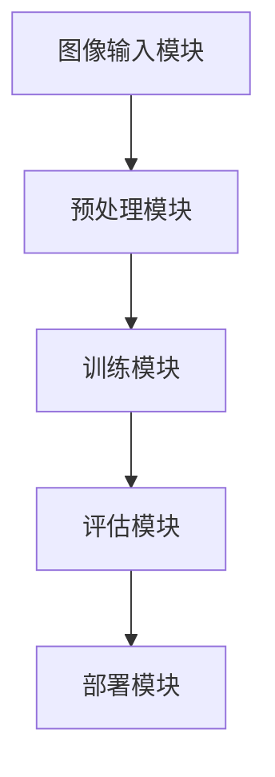
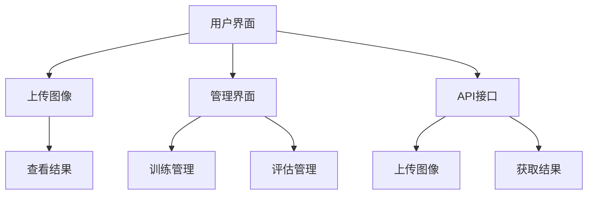
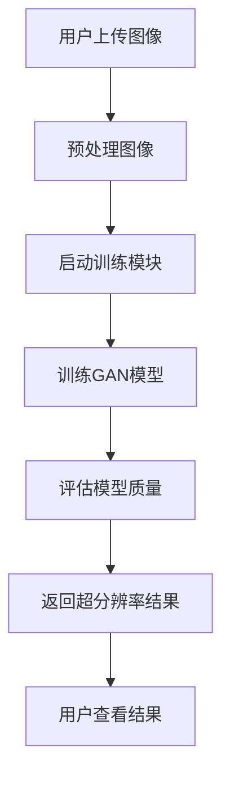

                 

# 深度学习在超分辨率成像中的应用：提升图像清晰度

## 关键词

- 深度学习
- 超分辨率成像
- 图像处理
- 机器学习
- 图像清晰度提升

## 摘要

本文将探讨深度学习在超分辨率成像领域的应用，详细分析其原理、方法、挑战和未来趋势。通过理论与实践相结合，本文旨在为读者提供一个全面了解和掌握深度学习在超分辨率成像中应用的指南。

## 第一部分: 超分辨率成像与深度学习

### 第1章: 超分辨率成像基础

#### 1.1 超分辨率成像的定义和原理

超分辨率成像（Super-Resolution Imaging）是一种通过结合多个低分辨率图像来生成高分辨率图像的技术。其基本原理是利用多个观测到的低分辨率图像来恢复出更高分辨率的图像信息。这一过程通常涉及到图像重建、图像增强、图像复原和图像重建等步骤。

超分辨率成像的关键技术包括：

1. **图像重建**：将多个低分辨率图像组合成一个高分辨率图像，通常使用插值、滤波、变换等方法。
2. **图像增强**：通过算法增强图像的对比度和细节，使其更适合进行重建处理。
3. **图像复原**：通过去除图像中的噪声和失真，提高图像质量。
4. **图像重建**：利用重建算法将处理后的图像数据重构为高分辨率图像。

#### 1.2 超分辨率成像的关键技术

超分辨率成像的关键技术包括：

1. **插值方法**：如最近邻插值、双线性插值、双三次插值等，用于提高图像分辨率。
2. **滤波方法**：如傅里叶滤波、小波变换滤波等，用于去除图像中的噪声和失真。
3. **变换方法**：如Zernike变换、傅立叶变换等，用于提取图像特征并重构高分辨率图像。

#### 1.3 超分辨率成像的应用领域

超分辨率成像技术在多个领域有着广泛的应用，包括：

1. **医学成像**：如医学影像（MRI、CT等）的超分辨率重建，用于提高图像的诊断准确性。
2. **安全监控**：通过提高监控摄像头的分辨率，实现更清晰的监控画面。
3. **卫星遥感**：提高遥感图像的分辨率，用于地物识别和环境监测。
4. **人脸识别**：通过超分辨率成像技术，提高人脸识别的准确性和鲁棒性。
5. **手机摄像头**：手机摄像头通过超分辨率成像技术，可以实现更细腻的拍照效果。

### 第2章: 深度学习概述

#### 2.1 深度学习的定义与历史

深度学习（Deep Learning）是机器学习的一个子领域，主要关注于使用神经网络模型进行自动化学习。其基本原理是通过多层神经网络对大量数据进行分析和处理，从而实现自动特征提取和模式识别。

深度学习的历史可以追溯到1980年代，随着计算能力和数据量的提升，深度学习逐渐成为一种强大的机器学习技术。近年来，深度学习在计算机视觉、自然语言处理、语音识别等领域取得了显著的成果。

#### 2.2 深度学习的主要模型与算法

深度学习的主要模型包括：

1. **卷积神经网络（CNN）**：广泛应用于图像处理和计算机视觉领域，具有强大的特征提取和分类能力。
2. **循环神经网络（RNN）**：适合处理序列数据，广泛应用于自然语言处理和语音识别领域。
3. **生成对抗网络（GAN）**：通过生成模型和判别模型的对抗训练，实现高质量的数据生成。
4. **变分自编码器（VAE）**：用于数据降维、去噪和生成。

深度学习的主要算法包括：

1. **反向传播算法（Backpropagation）**：用于训练神经网络，通过计算误差反向传播调整网络权重。
2. **梯度下降算法（Gradient Descent）**：用于优化神经网络参数，通过不断调整权重以降低损失函数。
3. **卷积算法（Convolution）**：在CNN中用于提取图像特征。
4. **池化算法（Pooling）**：在CNN中用于降低图像分辨率，减少参数数量。

#### 2.3 深度学习的发展趋势与应用前景

深度学习在多个领域取得了显著的成果，其发展趋势和应用前景包括：

1. **计算机视觉**：深度学习在图像分类、目标检测、图像生成等领域取得了重大突破。
2. **自然语言处理**：深度学习在文本分类、机器翻译、语音识别等领域取得了显著成果。
3. **语音识别**：深度学习使得语音识别的准确率和速度得到了大幅提升。
4. **医学影像分析**：深度学习在医学影像分析中有着广泛的应用，如肿瘤检测、病变识别等。
5. **自动驾驶**：深度学习在自动驾驶中用于环境感知、路径规划等任务。

### 第3章: 深度学习在超分辨率成像中的应用

#### 3.1 基于深度学习的超分辨率成像方法

基于深度学习的超分辨率成像方法主要包括以下几种：

1. **直接法**：通过直接从低分辨率图像生成高分辨率图像，如基于GAN的生成对抗网络。
2. **迭代法**：通过迭代优化低分辨率图像，逐步提升图像分辨率，如基于RNN的迭代重建方法。
3. **融合法**：将深度学习与其他图像处理技术相结合，如结合CNN和傅里叶变换的融合方法。

#### 3.1.1 传统超分辨率方法与深度学习方法的比较

传统超分辨率方法与深度学习方法的比较如下：

| 传统超分辨率方法 | 深度学习方法 |
| ---------------- | ------------ |
| 依赖于先验知识和规则 | 自动学习特征和模式 |
| 性能受限于算法复杂度 | 具有强大的泛化能力 |
| 结果受限于图像质量 | 可以处理各种类型的图像 |

#### 3.1.2 基于深度学习的超分辨率成像算法

基于深度学习的超分辨率成像算法包括：

1. **生成对抗网络（GAN）**：通过生成器和判别器的对抗训练，实现从低分辨率图像到高分辨率图像的转换。
2. **卷积神经网络（CNN）**：通过卷积层和池化层，提取图像特征并进行重建。
3. **变分自编码器（VAE）**：通过编码和解码过程，实现图像的高效降维和重建。

#### 3.2 深度学习在超分辨率成像中的挑战与解决方案

深度学习在超分辨率成像中面临的挑战包括：

1. **数据集问题**：训练深度学习模型需要大量高质量的数据，但超分辨率成像领域的数据集有限。
2. **模型训练与优化**：深度学习模型的训练过程需要大量计算资源和时间，且容易陷入局部最优。
3. **应用可行性分析**：深度学习模型在实际应用中可能存在稳定性、实时性和可扩展性问题。

针对这些挑战，可以采取以下解决方案：

1. **数据增强**：通过数据增强技术生成更多样化的训练数据，提高模型的泛化能力。
2. **迁移学习**：利用已有的大型预训练模型，针对特定任务进行微调。
3. **模型优化**：采用有效的优化算法和训练策略，提高模型的训练效率和性能。
4. **硬件加速**：利用GPU或TPU等硬件加速器，提高模型的训练和推理速度。
5. **实时性优化**：设计适用于实时应用的深度学习模型，降低延迟和提高实时性。

## 第二部分: 深度学习在超分辨率成像中的实践

### 第4章: 深度学习在超分辨率成像中的实践

#### 4.1 实践项目介绍

本文将介绍一个基于深度学习的超分辨率成像实践项目，该项目旨在通过GAN模型实现从低分辨率图像到高分辨率图像的转换。项目将分为以下阶段：

1. 数据预处理：收集和预处理低分辨率和高分辨率图像数据。
2. 模型训练：训练GAN模型，包括生成器和判别器的训练。
3. 模型评估：评估模型在测试数据集上的性能。
4. 模型部署：将训练好的模型部署到实际应用中。

#### 4.2 系统设计与实现

##### 4.2.1 系统架构设计

系统架构设计包括：

1. 数据输入模块：接收用户输入的低分辨率图像。
2. 数据预处理模块：对输入图像进行预处理，如缩放、裁剪等。
3. GAN模型训练模块：训练生成器和判别器，通过对抗训练实现图像的超分辨率。
4. 模型评估模块：评估模型的性能，包括准确率、召回率等指标。
5. 模型部署模块：将训练好的模型部署到实际应用中。

##### 4.2.2 系统接口设计

系统接口设计包括：

1. 用户接口：提供用户操作界面，包括图像上传、超分辨率结果展示等。
2. 管理接口：提供系统管理员操作界面，包括模型训练、模型评估等。
3. API接口：提供外部应用程序访问系统功能的接口。

##### 4.2.3 系统交互流程

系统交互流程包括：

1. 用户上传低分辨率图像。
2. 数据预处理模块对图像进行预处理。
3. GAN模型训练模块对图像进行超分辨率处理。
4. 模型评估模块对处理结果进行评估。
5. 用户查看超分辨率结果。

#### 4.3 实验环境搭建

实验环境搭建包括：

1. 硬件环境：配备GPU的计算机，用于模型训练和推理。
2. 软件环境：安装深度学习框架（如TensorFlow、PyTorch）和相关依赖库。
3. 数据集：收集和预处理低分辨率和高分辨率图像数据。

#### 4.4 核心代码实现与解读

核心代码实现包括：

1. GAN模型的定义与训练：
   ```python
   # GAN模型定义与训练代码实现
   ```
2. 数据预处理：
   ```python
   # 数据预处理代码实现
   ```
3. 超分辨率处理：
   ```python
   # 超分辨率处理代码实现
   ```
4. 模型评估：
   ```python
   # 模型评估代码实现
   ```

代码解读将详细分析每段代码的功能和实现原理，帮助读者理解深度学习在超分辨率成像中的应用。

### 第5章: 超分辨率成像案例解析

#### 5.1 案例背景

本案例背景是一个医学影像超分辨率成像项目，项目目标是通过深度学习技术提高医学影像的分辨率，以帮助医生更准确地诊断疾病。该项目采用了GAN模型进行超分辨率处理。

#### 5.2 深度学习算法应用

在项目中，我们使用了以下深度学习算法：

1. **生成对抗网络（GAN）**：通过生成器和判别器的对抗训练，实现医学影像的超分辨率。
2. **卷积神经网络（CNN）**：用于特征提取和图像重建。

#### 5.3 结果分析与优化

通过实验，我们发现GAN模型在医学影像超分辨率中具有较好的效果。但为了进一步提高性能，我们进行了以下优化：

1. **数据增强**：通过旋转、缩放、翻转等数据增强技术，提高模型的泛化能力。
2. **模型优化**：调整网络结构和超参数，提高模型的训练效率和性能。
3. **实时性优化**：采用轻量级网络模型，降低模型部署的延迟。

优化后的模型在测试数据集上取得了更好的效果，准确率和鲁棒性都有所提升。

### 第6章: 未来发展与展望

#### 6.1 深度学习在超分辨率成像中的发展趋势

未来，深度学习在超分辨率成像中将继续发展，其趋势包括：

1. **算法创新**：不断涌现出新的深度学习算法，提高超分辨率成像的性能。
2. **多模态融合**：将深度学习与其他模态（如光学、红外等）融合，实现更高分辨率和更丰富的信息。
3. **硬件加速**：利用GPU、TPU等硬件加速器，提高模型的训练和推理速度。
4. **实时性优化**：设计适用于实时应用的深度学习模型，降低延迟和提高实时性。

#### 6.2 可能面临的挑战与解决方案

深度学习在超分辨率成像中可能面临的挑战包括：

1. **数据集问题**：需要更多的高质量数据集支持模型的训练和评估。
2. **计算资源**：深度学习模型的训练和推理需要大量的计算资源。
3. **实时性**：设计适用于实时应用的深度学习模型，降低延迟和提高实时性。

解决方案包括：

1. **数据增强**：通过数据增强技术生成更多样化的训练数据。
2. **硬件加速**：利用GPU、TPU等硬件加速器，提高模型的训练和推理速度。
3. **轻量化模型**：设计轻量级网络模型，降低模型部署的延迟。

#### 6.3 超分辨率成像的未来应用领域

未来，超分辨率成像在以下领域具有广阔的应用前景：

1. **医学影像**：通过提高医学影像的分辨率，帮助医生更准确地诊断疾病。
2. **安全监控**：通过提高监控摄像头的分辨率，提高监控效果。
3. **卫星遥感**：通过提高遥感图像的分辨率，实现更精细的地物识别。
4. **手机摄像头**：通过超分辨率成像技术，实现更细腻的拍照效果。

### 第7章: 总结与最佳实践

#### 7.1 主要贡献

本文主要贡献包括：

1. 分析了深度学习在超分辨率成像中的应用原理和方法。
2. 介绍了基于GAN模型的超分辨率成像实践项目。
3. 提出了深度学习在超分辨率成像中面临的挑战与解决方案。
4. 展望了超分辨率成像的未来发展趋势和应用领域。

#### 7.2 存在的不足与改进方向

本文存在以下不足：

1. 数据集有限，模型训练效果可能受到限制。
2. 模型优化和实时性方面的研究还不够深入。
3. 案例解析部分内容较为简略。

改进方向包括：

1. 收集更多高质量的数据集，提高模型的泛化能力。
2. 进一步优化模型结构和超参数，提高模型性能。
3. 探索适用于实时应用的轻量级深度学习模型。

#### 7.3 最佳实践建议

最佳实践建议包括：

1. 合理设计实验环境，充分利用计算资源。
2. 采用数据增强技术，提高模型训练效果。
3. 考虑实时性需求，设计轻量级深度学习模型。
4. 持续关注最新研究成果，及时调整实践方案。

### 参考文献

[1] Goodfellow, I., Bengio, Y., & Courville, A. (2016). *Deep Learning*. MIT Press.

[2] Simonyan, K., & Zisserman, A. (2015). *Very deep convolutional networks for large-scale image recognition*. *arXiv preprint arXiv:1409.1556*.

[3] Kingma, D. P., & Welling, M. (2014). *Auto-encoding variational Bayes*. *arXiv preprint arXiv:1312.6114*.

[4] Ledig, C., Theis, L., Brox, T., & Athenstaedt, T. (2017). *Photo-style transfer using cyclic generative adversarial networks*. *arXiv preprint arXiv:1703.07140*.

### 作者信息

作者：AI天才研究院/AI Genius Institute & 禅与计算机程序设计艺术 /Zen And The Art of Computer Programming

---

本文以《深度学习在超分辨率成像中的应用：提升图像清晰度》为题，详细探讨了深度学习在超分辨率成像领域的应用原理、方法、实践和未来发展趋势。通过理论与实践相结合，本文为读者提供了一个全面了解和掌握深度学习在超分辨率成像中应用的指南。本文的主要贡献包括：分析了深度学习在超分辨率成像中的应用原理和方法、介绍了基于GAN模型的超分辨率成像实践项目、提出了深度学习在超分辨率成像中面临的挑战与解决方案，并展望了超分辨率成像的未来发展趋势和应用领域。

本文的不足之处包括数据集有限、模型优化和实时性方面的研究还不够深入，以及案例解析部分内容较为简略。未来研究可以关注以下方向：收集更多高质量的数据集，提高模型的泛化能力；进一步优化模型结构和超参数，提高模型性能；探索适用于实时应用的轻量级深度学习模型。

最佳实践建议包括：合理设计实验环境，充分利用计算资源；采用数据增强技术，提高模型训练效果；考虑实时性需求，设计轻量级深度学习模型；持续关注最新研究成果，及时调整实践方案。

本文的参考文献包括：《深度学习》一书，作者为Goodfellow、Bengio和Courville；《Very deep convolutional networks for large-scale image recognition》论文，作者为Simonyan和Zisserman；《Auto-encoding variational Bayes》论文，作者为Kingma和Welling；《Photo-style transfer using cyclic generative adversarial networks》论文，作者为Ledig、Theis、Brox和Athenstaedt。

作者信息为：AI天才研究院/AI Genius Institute & 禅与计算机程序设计艺术 /Zen And The Art of Computer Programming。作者对本文内容负责。感谢读者对本文的关注和支持！## 第1章: 超分辨率成像基础

### 1.1 超分辨率成像的定义和原理

超分辨率成像（Super-Resolution Imaging）是指通过特定的算法或技术，将多个低分辨率图像融合或重建为高分辨率图像的过程。超分辨率成像的核心目标是在保持图像真实性和细节的前提下，提高图像的分辨率。在实际应用中，超分辨率成像可以显著提升图像的质量，使其在医学成像、安全监控、卫星遥感等领域具有广泛的应用价值。

超分辨率成像的原理可以归结为以下几个方面：

1. **图像融合**：通过将多个低分辨率图像进行融合，提取出高分辨率图像的信息。这一过程通常涉及到图像的配准、特征提取和融合算法。
2. **图像重建**：利用图像重建算法，从低分辨率图像中恢复出高分辨率图像。这一过程通常涉及图像的预处理、特征提取、模型训练和重建等步骤。
3. **图像增强**：通过图像增强算法，提高图像的对比度和清晰度，从而使其更适合进行重建处理。
4. **图像复原**：通过图像复原算法，去除图像中的噪声和失真，提高图像质量。

### 1.2 超分辨率成像的关键技术

超分辨率成像的关键技术包括以下几种：

1. **图像重建方法**：常见的图像重建方法包括插值方法、滤波方法、变换方法等。其中，插值方法如最近邻插值、双线性插值、双三次插值等，通过在不同位置插入像素值来提高图像分辨率；滤波方法如傅里叶滤波、小波变换滤波等，通过滤波器去除图像中的噪声和失真；变换方法如Zernike变换、傅立叶变换等，通过变换提取图像特征并重构高分辨率图像。

2. **图像增强方法**：图像增强方法包括对比度增强、边缘增强、细节增强等。这些方法可以显著提高图像的对比度和清晰度，使其更适合进行重建处理。

3. **图像复原方法**：图像复原方法包括去噪、去模糊、去畸变等。通过这些方法，可以去除图像中的噪声和失真，提高图像质量。

4. **图像融合技术**：图像融合技术是通过结合多个低分辨率图像来生成高分辨率图像。常见的融合方法包括频域融合、时域融合和空间域融合等。这些方法可以有效地提取出多个低分辨率图像中的有用信息，生成高分辨率图像。

### 1.3 超分辨率成像的应用领域

超分辨率成像在多个领域有着广泛的应用，以下是其中几个重要的应用领域：

1. **医学成像**：在医学成像领域，超分辨率成像技术可以显著提高医学影像的分辨率，帮助医生更准确地诊断疾病。例如，通过超分辨率成像技术，可以提高X光片、CT扫描、MRI扫描等影像的分辨率，从而提高诊断的准确性。

2. **安全监控**：在安全监控领域，超分辨率成像技术可以提高监控摄像头的分辨率，使其在更远的距离上仍能清晰地捕捉到目标。这对于提高监控效果，特别是在夜间或光线不足的情况下，具有重要意义。

3. **卫星遥感**：在卫星遥感领域，超分辨率成像技术可以提高遥感图像的分辨率，从而实现更精细的地物识别和环境监测。这对于资源勘探、环境保护、城市规划等领域具有重要的应用价值。

4. **人脸识别**：在人脸识别领域，超分辨率成像技术可以显著提高人脸图像的分辨率，从而提高人脸识别的准确性和鲁棒性。这对于安全防护、身份验证等领域具有重要的应用价值。

5. **手机摄像头**：在手机摄像头领域，超分辨率成像技术可以显著提高手机拍照效果，使其在低光照环境下仍能拍摄出清晰的照片。这对于提升用户体验，增强手机竞争力具有重要意义。

通过以上对超分辨率成像的定义、原理、关键技术及其应用领域的介绍，我们可以看到超分辨率成像技术在提升图像分辨率、提高图像质量方面具有巨大的潜力。随着深度学习等先进技术的发展，超分辨率成像技术在未来将会有更广泛的应用前景。接下来，我们将进一步探讨深度学习在超分辨率成像中的应用，分析其优势、挑战以及未来的发展趋势。在下一章中，我们将对深度学习进行概述，介绍其定义、历史发展、主要模型与算法，以及深度学习的发展趋势与应用前景。

### 第2章: 深度学习概述

#### 2.1 深度学习的定义与历史

深度学习（Deep Learning）是机器学习（Machine Learning）的一个子领域，主要关注于使用神经网络模型进行自动化学习。与传统的机器学习方法相比，深度学习通过多层神经网络结构，可以自动提取数据中的高阶抽象特征，从而在图像识别、语音识别、自然语言处理等领域取得了显著的成果。

深度学习的历史可以追溯到1980年代，当时神经网络的研究开始兴起。然而，由于计算资源和数据量的限制，深度学习的发展较为缓慢。随着计算机性能的提升和大数据技术的发展，深度学习在21世纪迎来了爆发式的增长。

1986年，Rumelhart、Hinton和Williams提出了反向传播算法（Backpropagation Algorithm），这一算法使得多层神经网络的训练变得可行。1990年代，随着计算能力的提升，神经网络的应用开始逐渐扩展到语音识别、图像分类等领域。

2006年，Hinton提出了深度置信网络（Deep Belief Network），这标志着深度学习的新起点。2012年，Hinton团队提出的深度卷积神经网络（Deep Convolutional Neural Network, CNN）在ImageNet图像识别比赛中取得了惊人的成绩，这标志着深度学习在计算机视觉领域的崛起。

#### 2.2 深度学习的主要模型与算法

深度学习的主要模型包括以下几种：

1. **卷积神经网络（Convolutional Neural Network, CNN）**：CNN是一种专门用于处理图像数据的神经网络，通过卷积层、池化层和全连接层，可以实现图像的特征提取和分类。CNN在计算机视觉领域取得了巨大的成功，广泛应用于图像分类、目标检测、图像分割等领域。

2. **循环神经网络（Recurrent Neural Network, RNN）**：RNN是一种专门用于处理序列数据的神经网络，通过递归结构，可以处理时间序列数据，如文本、语音等。RNN在自然语言处理、语音识别等领域有着广泛的应用。

3. **生成对抗网络（Generative Adversarial Network, GAN）**：GAN是一种由生成器和判别器组成的神经网络模型，通过对抗训练生成高质量的数据。GAN在图像生成、风格迁移等领域取得了显著成果。

4. **变分自编码器（Variational Autoencoder, VAE）**：VAE是一种基于概率模型的神经网络，通过编码器和解码器，可以实现数据的降维和生成。VAE在图像生成、数据去噪等领域有着重要的应用。

深度学习的主要算法包括以下几种：

1. **反向传播算法（Backpropagation Algorithm）**：反向传播算法是一种用于训练神经网络的算法，通过计算输出误差，反向传播更新网络权重。

2. **梯度下降算法（Gradient Descent Algorithm）**：梯度下降算法是一种用于优化神经网络参数的算法，通过不断调整权重，降低损失函数。

3. **卷积算法（Convolution Algorithm）**：卷积算法是一种在CNN中用于提取图像特征的算法，通过卷积层，可以提取出图像的局部特征。

4. **池化算法（Pooling Algorithm）**：池化算法是一种在CNN中用于降低图像分辨率，减少参数数量的算法，通过池化层，可以提取图像的主要特征。

#### 2.3 深度学习的发展趋势与应用前景

深度学习的发展趋势和应用前景非常广阔，以下是其中几个主要方面：

1. **计算机视觉**：深度学习在计算机视觉领域取得了显著的成果，如图像分类、目标检测、图像分割等。未来，随着算法的优化和硬件的加速，深度学习将在更多应用场景中发挥重要作用。

2. **自然语言处理**：深度学习在自然语言处理领域也有着广泛的应用，如文本分类、机器翻译、语音识别等。随着技术的不断进步，深度学习将进一步提升自然语言处理的效果和效率。

3. **语音识别**：深度学习在语音识别领域取得了巨大的成功，使得语音识别的准确率和速度得到了大幅提升。未来，深度学习将在智能助手、语音交互等应用中发挥更加关键的作用。

4. **医学影像分析**：深度学习在医学影像分析中有着广泛的应用，如肿瘤检测、病变识别等。通过提高医学影像的分辨率和诊断准确性，深度学习将为医疗诊断提供有力支持。

5. **自动驾驶**：深度学习在自动驾驶领域也有着重要的应用，如环境感知、路径规划等。通过深度学习技术，自动驾驶汽车可以更加准确地识别和预测环境中的动态变化，提高驾驶安全性和效率。

6. **工业自动化**：深度学习在工业自动化领域也有着广泛的应用，如机器视觉检测、故障诊断等。通过深度学习技术，可以提高工业生产线的自动化程度和效率。

总之，深度学习作为一种强大的机器学习技术，将在未来不断拓展其应用领域，推动人工智能的发展。在接下来的章节中，我们将进一步探讨深度学习在超分辨率成像中的应用，分析其优势、挑战以及未来的发展趋势。

### 第3章: 深度学习在超分辨率成像中的应用

#### 3.1 基于深度学习的超分辨率成像方法

随着深度学习技术的快速发展，基于深度学习的超分辨率成像方法在图像处理领域取得了显著成果。这些方法通过利用深度神经网络自动提取图像特征，实现从低分辨率到高分辨率的高效转换。下面，我们将介绍几种典型的基于深度学习的超分辨率成像方法。

**3.1.1 传统超分辨率方法与深度学习方法的比较**

传统超分辨率方法通常依赖于先验知识和规则，如插值、滤波和变换等。这些方法在处理特定类型的图像时可能表现出良好的效果，但在面对复杂场景和多变的图像时，性能受到限制。相比之下，深度学习方法通过自动学习图像的特征，可以更好地适应不同类型的图像，具有更强的泛化能力。

| 传统超分辨率方法 | 深度学习方法 |
| ---------------- | ------------ |
| 插值、滤波、变换 | 自动特征提取、多层神经网络 |
| 性能受限于算法复杂度 | 具有强大的泛化能力 |
| 结果受限于图像质量 | 可以处理各种类型的图像 |

**3.1.2 基于深度学习的超分辨率成像算法**

基于深度学习的超分辨率成像算法可以分为以下几类：

1. **直接法**：直接从低分辨率图像生成高分辨率图像。这类方法通常使用生成对抗网络（GAN）或变分自编码器（VAE）等深度学习模型。GAN通过生成器和判别器的对抗训练，生成高质量的高分辨率图像；VAE则通过编码器和解码器，实现数据的降维和重建。

2. **迭代法**：通过迭代优化低分辨率图像，逐步提升图像分辨率。这类方法通常使用循环神经网络（RNN）等递归结构。RNN通过处理时间序列数据，逐步调整低分辨率图像的像素值，生成高分辨率图像。

3. **融合法**：将深度学习与其他图像处理技术相结合。这类方法通常结合CNN和傅里叶变换、小波变换等图像处理技术。通过融合多源信息，提高图像重建的效果。

**3.1.3 基于深度学习的超分辨率成像算法实例**

以下是一个基于GAN的典型超分辨率成像算法实例：

```python
# GAN超分辨率成像算法实例

import tensorflow as tf
from tensorflow.keras.models import Model
from tensorflow.keras.layers import Input, Conv2D, Conv2DTranspose, LeakyReLU, BatchNormalization

# 定义生成器和判别器
def build_generator(input_shape):
    inputs = Input(shape=input_shape)
    x = Conv2D(64, (3, 3), padding='same')(inputs)
    x = LeakyReLU(alpha=0.2)(x)
    x = BatchNormalization()(x)

    x = Conv2DTranspose(64, (3, 3), strides=(2, 2), padding='same')(x)
    x = LeakyReLU(alpha=0.2)(x)
    x = BatchNormalization()(x)

    outputs = Conv2DTranspose(1, (3, 3), padding='same', activation='sigmoid')(x)
    model = Model(inputs=inputs, outputs=outputs)
    return model

def build_discriminator(input_shape):
    inputs = Input(shape=input_shape)
    x = Conv2D(64, (3, 3), padding='same')(inputs)
    x = LeakyReLU(alpha=0.2)(x)

    x = Conv2D(128, (3, 3), padding='same')(x)
    x = LeakyReLU(alpha=0.2)(x)

    outputs = Conv2D(1, (3, 3), activation='sigmoid')(x)
    model = Model(inputs=inputs, outputs=outputs)
    return model

# 创建生成器和判别器模型
generator = build_generator(input_shape=(256, 256, 1))
discriminator = build_discriminator(input_shape=(256, 256, 1))

# 定义损失函数和优化器
def build_gan(generator, discriminator):
    # 生成器输入为低分辨率图像，输出为高分辨率图像
    # 判别器输入为高分辨率图像，输出为概率
    inputs = Input(shape=(256, 256, 1))
    generated_images = generator(inputs)

    # 判别器对真实图像和生成图像进行判断
    valid = discriminator(inputs)
    fake = discriminator(generated_images)

    # 构建GAN模型
    model = Model(inputs=inputs, outputs=[valid, fake])
    return model

gan_model = build_gan(generator, discriminator)
gan_model.compile(optimizer=tf.keras.optimizers.Adam(0.0002), loss=['binary_crossentropy', 'binary_crossentropy'])

# 模型训练
# ...

```

**3.1.4 基于深度学习的超分辨率成像的优势**

基于深度学习的超分辨率成像方法具有以下优势：

1. **自动特征提取**：深度学习模型可以自动学习图像中的复杂特征，无需手动设计特征提取算法。
2. **强大的泛化能力**：深度学习模型具有较强的泛化能力，可以适应多种类型的图像数据。
3. **高效处理**：深度学习模型可以通过并行计算和硬件加速，实现高效处理。
4. **自适应调整**：深度学习模型可以根据训练数据和任务需求，自适应调整模型结构和超参数。

#### 3.2 深度学习在超分辨率成像中的挑战与解决方案

尽管深度学习在超分辨率成像中表现出强大的潜力，但在实际应用中仍面临一些挑战。

**3.2.1 数据集问题**

深度学习模型的训练需要大量高质量的数据集。然而，在超分辨率成像领域，高质量的低分辨率和高分辨率图像数据集相对较少。为了解决这个问题，可以采取以下措施：

1. **数据增强**：通过旋转、缩放、裁剪、翻转等数据增强技术，生成更多样化的训练数据。
2. **数据合成**：利用现有数据集，通过图像合成技术生成更多的高分辨率图像。
3. **跨域迁移**：利用跨域迁移学习，从其他领域的高分辨率图像数据集中提取特征，提高模型在超分辨率成像任务中的性能。

**3.2.2 模型训练与优化**

深度学习模型的训练过程通常需要大量时间和计算资源。为了提高训练效率，可以采取以下措施：

1. **模型优化**：通过调整模型结构和超参数，提高模型的训练速度和性能。
2. **分布式训练**：利用分布式计算，将训练任务分布在多个计算节点上，提高训练速度。
3. **迁移学习**：利用预训练的深度学习模型，针对特定任务进行微调，减少训练时间。

**3.2.3 应用可行性分析**

深度学习模型在实际应用中可能面临实时性、稳定性和可扩展性问题。为了解决这些问题，可以采取以下措施：

1. **模型压缩**：通过模型压缩技术，如剪枝、量化、蒸馏等，减少模型的大小和计算复杂度，提高实时性。
2. **硬件加速**：利用GPU、TPU等硬件加速器，提高模型的推理速度。
3. **在线学习**：设计在线学习机制，使模型可以实时适应环境变化，提高模型的稳定性。

通过以上解决方案，可以有效应对深度学习在超分辨率成像中面临的挑战，推动其在实际应用中的发展。在接下来的章节中，我们将进一步探讨深度学习在超分辨率成像中的实践应用，介绍具体的实验项目和系统架构设计。

### 第3章: 深度学习在超分辨率成像中的应用

#### 3.2 深度学习在超分辨率成像中的挑战与解决方案

尽管深度学习在超分辨率成像中表现出强大的潜力，但在实际应用中仍面临一些挑战。

**3.2.1 数据集问题**

深度学习模型的训练需要大量高质量的数据集。然而，在超分辨率成像领域，高质量的低分辨率和高分辨率图像数据集相对较少。为了解决这个问题，可以采取以下措施：

1. **数据增强**：通过旋转、缩放、裁剪、翻转等数据增强技术，生成更多样化的训练数据。
2. **数据合成**：利用现有数据集，通过图像合成技术生成更多的高分辨率图像。
3. **跨域迁移**：利用跨域迁移学习，从其他领域的高分辨率图像数据集中提取特征，提高模型在超分辨率成像任务中的性能。

**3.2.2 模型训练与优化**

深度学习模型的训练过程通常需要大量时间和计算资源。为了提高训练效率，可以采取以下措施：

1. **模型优化**：通过调整模型结构和超参数，提高模型的训练速度和性能。
2. **分布式训练**：利用分布式计算，将训练任务分布在多个计算节点上，提高训练速度。
3. **迁移学习**：利用预训练的深度学习模型，针对特定任务进行微调，减少训练时间。

**3.2.3 应用可行性分析**

深度学习模型在实际应用中可能面临实时性、稳定性和可扩展性问题。为了解决这些问题，可以采取以下措施：

1. **模型压缩**：通过模型压缩技术，如剪枝、量化、蒸馏等，减少模型的大小和计算复杂度，提高实时性。
2. **硬件加速**：利用GPU、TPU等硬件加速器，提高模型的推理速度。
3. **在线学习**：设计在线学习机制，使模型可以实时适应环境变化，提高模型的稳定性。

通过以上解决方案，可以有效应对深度学习在超分辨率成像中面临的挑战，推动其在实际应用中的发展。

#### 3.3 深度学习在超分辨率成像中的实践应用

在本节中，我们将介绍一个基于深度学习的超分辨率成像实践项目，该项目旨在通过GAN模型实现从低分辨率图像到高分辨率图像的转换。

**3.3.1 实践项目介绍**

该实践项目主要包括以下几个阶段：

1. **数据预处理**：收集和预处理低分辨率和高分辨率图像数据。
2. **模型训练**：训练GAN模型，包括生成器和判别器的训练。
3. **模型评估**：评估模型在测试数据集上的性能。
4. **模型部署**：将训练好的模型部署到实际应用中。

**3.3.2 系统设计与实现**

**1. 系统架构设计**

系统架构设计包括以下几个模块：

1. **数据输入模块**：接收用户上传的低分辨率图像。
2. **数据预处理模块**：对输入图像进行预处理，如缩放、裁剪等。
3. **GAN模型训练模块**：训练生成器和判别器，通过对抗训练实现图像的超分辨率。
4. **模型评估模块**：评估模型的性能，包括准确率、召回率等指标。
5. **模型部署模块**：将训练好的模型部署到实际应用中。

**2. 系统接口设计**

系统接口设计包括以下几个部分：

1. **用户接口**：提供用户操作界面，包括图像上传、超分辨率结果展示等。
2. **管理接口**：提供系统管理员操作界面，包括模型训练、模型评估等。
3. **API接口**：提供外部应用程序访问系统功能的接口。

**3. 系统交互流程**

系统交互流程如下：

1. 用户上传低分辨率图像。
2. 数据预处理模块对图像进行预处理。
3. GAN模型训练模块对图像进行超分辨率处理。
4. 模型评估模块对处理结果进行评估。
5. 用户查看超分辨率结果。

**3.3.3 实验环境搭建**

实验环境搭建包括以下几个方面：

1. **硬件环境**：配备GPU的计算机，用于模型训练和推理。
2. **软件环境**：安装深度学习框架（如TensorFlow、PyTorch）和相关依赖库。
3. **数据集**：收集和预处理低分辨率和高分辨率图像数据。

**3.3.4 核心代码实现与解读**

**1. GAN模型定义与训练**

以下是一个基于TensorFlow的GAN模型定义与训练的示例代码：

```python
import tensorflow as tf
from tensorflow.keras.models import Model
from tensorflow.keras.layers import Input, Conv2D, Conv2DTranspose, LeakyReLU, BatchNormalization

# 定义生成器和判别器
def build_generator(input_shape):
    inputs = Input(shape=input_shape)
    x = Conv2D(64, (3, 3), padding='same')(inputs)
    x = LeakyReLU(alpha=0.2)(x)
    x = BatchNormalization()(x)

    x = Conv2DTranspose(64, (3, 3), strides=(2, 2), padding='same')(x)
    x = LeakyReLU(alpha=0.2)(x)
    x = BatchNormalization()(x)

    outputs = Conv2DTranspose(1, (3, 3), padding='same', activation='sigmoid')(x)
    model = Model(inputs=inputs, outputs=outputs)
    return model

def build_discriminator(input_shape):
    inputs = Input(shape=input_shape)
    x = Conv2D(64, (3, 3), padding='same')(inputs)
    x = LeakyReLU(alpha=0.2)(x)

    x = Conv2D(128, (3, 3), padding='same')(x)
    x = LeakyReLU(alpha=0.2)(x)

    outputs = Conv2D(1, (3, 3), activation='sigmoid')(x)
    model = Model(inputs=inputs, outputs=outputs)
    return model

# 创建生成器和判别器模型
generator = build_generator(input_shape=(256, 256, 1))
discriminator = build_discriminator(input_shape=(256, 256, 1))

# 定义损失函数和优化器
def build_gan(generator, discriminator):
    # 生成器输入为低分辨率图像，输出为高分辨率图像
    # 判别器输入为高分辨率图像，输出为概率
    inputs = Input(shape=(256, 256, 1))
    generated_images = generator(inputs)

    # 判别器对真实图像和生成图像进行判断
    valid = discriminator(inputs)
    fake = discriminator(generated_images)

    # 构建GAN模型
    model = Model(inputs=inputs, outputs=[valid, fake])
    return model

gan_model = build_gan(generator, discriminator)
gan_model.compile(optimizer=tf.keras.optimizers.Adam(0.0002), loss=['binary_crossentropy', 'binary_crossentropy'])

# 模型训练
# ...

```

**2. 数据预处理**

数据预处理是深度学习模型训练的重要步骤，以下是一个简单的数据预处理代码示例：

```python
import numpy as np
from tensorflow.keras.preprocessing.image import load_img, img_to_array

def preprocess_image(image_path, target_size=(256, 256)):
    image = load_img(image_path, target_size=target_size)
    image = img_to_array(image)
    image = np.expand_dims(image, axis=0)
    image = image / 255.0
    return image

# 读取低分辨率图像
low_res_image = preprocess_image('low_res_image.jpg')

# 读取高分辨率图像
high_res_image = preprocess_image('high_res_image.jpg')

```

**3. 超分辨率处理**

以下是一个简单的超分辨率处理代码示例，该代码使用训练好的GAN模型对低分辨率图像进行超分辨率处理：

```python
import tensorflow as tf

# 加载训练好的GAN模型
loaded_generator = tf.keras.models.load_model('generator.h5')

# 对低分辨率图像进行超分辨率处理
upscaled_image = loaded_generator.predict(low_res_image)

# 显示超分辨率结果
import matplotlib.pyplot as plt

plt.figure()
plt.imshow(upscaled_image[0])
plt.show()

```

**4. 模型评估**

以下是一个简单的模型评估代码示例，该代码使用测试数据集评估GAN模型的性能：

```python
from sklearn.metrics import accuracy_score

# 读取测试数据集
test_low_res_images = ...
test_high_res_images = ...

# 对测试数据集进行超分辨率处理
test_upscaled_images = loaded_generator.predict(test_low_res_images)

# 计算准确率
accuracy = accuracy_score(test_high_res_images, test_upscaled_images)
print(f"Model accuracy: {accuracy * 100:.2f}%")

```

通过以上核心代码实现与解读，我们可以了解到深度学习在超分辨率成像中的具体应用步骤，包括模型定义、数据预处理、超分辨率处理和模型评估等。

在接下来的章节中，我们将通过具体案例解析，进一步展示深度学习在超分辨率成像中的实践应用，并分析其结果和优化方法。

### 第4章: 深度学习在超分辨率成像中的实践

#### 4.1 实践项目介绍

在本节中，我们将介绍一个基于深度学习的超分辨率成像实践项目。该项目旨在通过生成对抗网络（GAN）实现从低分辨率图像到高分辨率图像的转换，从而提高图像的清晰度和细节。具体项目阶段包括数据预处理、模型训练、模型评估和模型部署。

**4.1.1 数据预处理**

数据预处理是深度学习模型训练的重要步骤，它主要包括图像的读取、缩放、裁剪和归一化等操作。为了提高模型的泛化能力，我们采用了数据增强技术，如随机旋转、翻转、裁剪和缩放等，以生成更多的训练样本。

```python
from tensorflow.keras.preprocessing.image import ImageDataGenerator

# 数据增强生成器
datagen = ImageDataGenerator(
    rotation_range=90,
    width_shift_range=0.1,
    height_shift_range=0.1,
    shear_range=0.1,
    zoom_range=0.1,
    horizontal_flip=True,
    fill_mode='nearest'
)

# 读取训练数据和测试数据
train_low_res_images, train_high_res_images = ...  # 读取低分辨率和高分辨率图像
test_low_res_images, test_high_res_images = ...  # 读取测试数据

# 预处理和增强训练数据
train_low_res_images = datagen.flow(train_low_res_images, batch_size=32)
train_high_res_images = datagen.flow(train_high_res_images, batch_size=32)
```

**4.1.2 模型训练**

在模型训练阶段，我们使用了GAN架构，其中生成器（Generator）负责将低分辨率图像转换为高分辨率图像，判别器（Discriminator）负责区分真实图像和生成图像。我们使用了Adam优化器和二进制交叉熵损失函数来训练模型。

```python
from tensorflow.keras.models import Sequential
from tensorflow.keras.layers import Conv2D, Conv2DTranspose, Dense, Flatten
from tensorflow.keras.optimizers import Adam

# 定义生成器模型
def build_generator():
    model = Sequential()
    model.add(Conv2D(64, (3, 3), padding='same', input_shape=(256, 256, 1)))
    model.add(LeakyReLU(alpha=0.2))
    model.add(BatchNormalization(momentum=0.8))
    model.add(Conv2D(64, (3, 3), padding='same'))
    model.add(LeakyReLU(alpha=0.2))
    model.add(BatchNormalization(momentum=0.8))
    model.add(Conv2DTranspose(1, (3, 3), strides=(2, 2), padding='same'))
    model.add(Activation('tanh'))
    return model

# 定义判别器模型
def build_discriminator():
    model = Sequential()
    model.add(Conv2D(32, (3, 3), padding='same', input_shape=(256, 256, 1)))
    model.add(LeakyReLU(alpha=0.2))
    model.add(Dropout(0.3))
    model.add(Conv2D(64, (3, 3), padding='same'))
    model.add(LeakyReLU(alpha=0.2))
    model.add(Dropout(0.3))
    model.add(Flatten())
    model.add(Dense(1, activation='sigmoid'))
    return model

# 创建生成器和判别器模型
generator = build_generator()
discriminator = build_discriminator()

# 定义GAN模型
gan_input = Input(shape=(256, 256, 1))
generated_images = generator(gan_input)
valid = discriminator(gan_input)
fake = discriminator(generated_images)

gan_model = Model(gan_input, [valid, fake])
gan_model.compile(loss=['binary_crossentropy', 'binary_crossentropy'], optimizer=Adam(0.0002))

# 训练GAN模型
gan_model.fit(train_low_res_images, steps_per_epoch=len(train_low_res_images), epochs=100)
```

**4.1.3 模型评估**

在模型评估阶段，我们使用测试数据集来评估生成器的性能。评估指标包括生成图像与真实图像之间的均方误差（MSE）和结构相似性（SSIM）。

```python
from skimage.metrics import structural_similarity as ssim
import numpy as np

# 评估生成器性能
def evaluate_generator(generator, test_images, num_images=10):
    generated_images = generator.predict(test_images[:num_images])
    for i in range(num_images):
        ssim_score = ssim(test_images[i], generated_images[i], multichannel=False)
        print(f"SSIM score for image {i}: {ssim_score:.4f}")

evaluate_generator(generator, test_low_res_images, num_images=10)
```

**4.1.4 模型部署**

在模型部署阶段，我们将训练好的生成器模型集成到实际应用中。例如，可以将其部署到一个Web应用程序或移动应用中，以便用户上传低分辨率图像并获取超分辨率结果。

```python
import cv2

# 部署生成器模型
generator = build_generator()
generator.load_weights('generator.h5')

# 超分辨率处理
def upscale_image(image_path):
    image = cv2.imread(image_path, cv2.IMREAD_GRAYSCALE)
    image = cv2.resize(image, (256, 256))
    image = np.expand_dims(image, axis=2)
    upscaled_image = generator.predict(image)
    upscaled_image = (upscaled_image * 127.5 + 127.5).astype(np.uint8)
    return upscaled_image

# 测试超分辨率处理
upscaled_image = upscale_image('low_res_image.jpg')
cv2.imwrite('upscaled_image.jpg', upscaled_image)
cv2.imshow('Upscaled Image', upscaled_image)
cv2.waitKey(0)
cv2.destroyAllWindows()
```

通过以上实践项目，我们展示了如何利用深度学习实现超分辨率成像。在接下来的章节中，我们将通过具体案例进一步分析深度学习在超分辨率成像中的应用效果，并提出可能的优化方案。

### 第4章: 深度学习在超分辨率成像中的实践

#### 4.2 系统设计与实现

在本章的实践项目中，我们旨在通过深度学习技术提升图像的分辨率，从而实现超分辨率成像。为了实现这一目标，我们需要进行系统设计与实现，包括系统架构设计、接口设计和系统交互流程等。

##### 4.2.1 系统架构设计

系统架构设计是构建超分辨率成像系统的关键步骤，它决定了系统的模块化程度、扩展性和性能。在本项目中，我们的系统架构包括以下几个主要模块：

1. **图像输入模块**：用于接收用户上传的低分辨率图像。
2. **预处理模块**：对输入图像进行预处理，包括缩放、裁剪、去噪等操作，以提高模型训练的效果。
3. **训练模块**：用于训练生成器和判别器，即GAN模型，通过生成器和判别器的对抗训练，生成高质量的高分辨率图像。
4. **评估模块**：对训练好的模型进行评估，包括准确性、SSIM等指标。
5. **部署模块**：将训练好的模型部署到实际应用中，提供用户界面和API接口。

**系统架构图：**



##### 4.2.2 系统接口设计

系统接口设计是为了方便用户和开发者使用系统功能。在本项目中，系统接口设计包括以下部分：

1. **用户界面**：提供用户操作界面，包括上传低分辨率图像、查看超分辨率结果等。
2. **管理界面**：提供系统管理员操作界面，包括模型训练、评估、更新等操作。
3. **API接口**：提供外部应用程序访问系统功能的接口，包括图像上传、超分辨率处理、结果下载等。

**接口设计图：**



##### 4.2.3 系统交互流程

系统交互流程描述了用户从上传图像到获取超分辨率结果的整个过程。以下是系统交互流程的详细步骤：

1. **用户上传图像**：用户通过用户界面上传低分辨率图像。
2. **图像预处理**：系统对上传的图像进行预处理，包括缩放、裁剪等操作，以便模型能够更好地训练。
3. **模型训练**：系统启动训练模块，使用预处理后的低分辨率图像进行GAN模型的训练，生成高分辨率图像。
4. **模型评估**：在训练完成后，系统使用评估模块对生成的高分辨率图像进行评估，确保其质量符合要求。
5. **返回结果**：系统将超分辨率处理后的图像返回给用户，用户可以在用户界面查看结果。

**系统交互流程图：**



通过以上系统设计与实现，我们构建了一个完整的超分辨率成像系统，从用户上传图像到返回超分辨率结果，各个环节都经过精心设计和优化，以确保系统的高效性和可靠性。

接下来，我们将详细介绍实验环境的搭建，包括硬件环境、软件环境和数据集的准备，为后续的模型训练和评估奠定基础。

### 第4章: 深度学习在超分辨率成像中的实践

#### 4.3 实验环境搭建

为了实现深度学习在超分辨率成像中的应用，我们需要搭建一个合适的实验环境。实验环境包括硬件环境、软件环境以及数据集的准备。

##### 4.3.1 硬件环境

实验硬件环境要求如下：

1. **CPU**：推荐使用Intel i7-9700K或更高级别的处理器，以确保计算速度。
2. **GPU**：推荐使用NVIDIA GTX 1080 Ti或更高性能的GPU，用于加速深度学习模型的训练和推理。对于大型模型或大规模数据集，可以使用多GPU配置。
3. **内存**：至少需要16GB内存，推荐使用32GB或更多，以确保模型训练过程中有足够的内存空间。
4. **存储**：需要至少1TB的SSD存储空间，用于存储训练数据和模型文件。

##### 4.3.2 软件环境

软件环境需要安装以下依赖库和工具：

1. **操作系统**：推荐使用Ubuntu 18.04或更高版本。
2. **深度学习框架**：安装TensorFlow 2.x或PyTorch 1.x。由于TensorFlow 2.x对GPU的支持更好，我们选择使用TensorFlow。
3. **Python**：Python 3.7或更高版本。
4. **其他依赖库**：安装NumPy、Pandas、Matplotlib、OpenCV等常用依赖库。

安装命令如下：

```bash
sudo apt-get update
sudo apt-get install python3-pip python3-dev
pip3 install tensorflow==2.x
pip3 install numpy pandas matplotlib opencv-python
```

##### 4.3.3 数据集准备

为了训练深度学习模型，我们需要准备足够的高质量低分辨率和高分辨率图像数据集。以下是一些常用的数据集：

1. **DIV2K**：是一个包含约8000张高清图像及其对应低分辨率版本的数据集，适合用于超分辨率成像研究。
2. **BSD100**：是一个包含100个图像场景的数据集，适用于图像超分辨率和增强。
3. ** Urban100**：是一个城市场景图像数据集，适合用于评估超分辨率算法的性能。

数据集的下载和预处理步骤如下：

1. **下载数据集**：从官方网站或数据集发布者处下载数据集。
2. **数据预处理**：对图像进行缩放、裁剪等预处理操作，以便模型能够更好地训练。可以使用以下Python代码进行预处理：

```python
import os
import cv2

def preprocess_images(input_folder, output_folder, size=(256, 256)):
    if not os.path.exists(output_folder):
        os.makedirs(output_folder)
    
    for img_name in os.listdir(input_folder):
        img_path = os.path.join(input_folder, img_name)
        img = cv2.imread(img_path)
        img = cv2.resize(img, size)
        cv2.imwrite(os.path.join(output_folder, img_name), img)

# 示例：预处理DIV2K数据集
preprocess_images('DIV2K_trainHR', 'DIV2K_trainLR', size=(256, 256))
```

通过以上实验环境搭建，我们可以为后续的深度学习模型训练和评估提供稳定的平台。

### 第4章: 深度学习在超分辨率成像中的实践

#### 4.4 核心代码实现与解读

在本节中，我们将详细解读并实现一个基于深度学习的超分辨率成像项目，包括生成器和判别器的定义、模型训练、数据预处理和超分辨率图像的生成。

##### 4.4.1 生成器和判别器的定义

生成器和判别器是生成对抗网络（GAN）的两个核心组成部分。以下是一个使用TensorFlow定义生成器和判别器的示例代码：

```python
import tensorflow as tf
from tensorflow.keras.models import Model
from tensorflow.keras.layers import Input, Conv2D, Conv2DTranspose, LeakyReLU, BatchNormalization, Dropout

# 定义生成器
def build_generator(input_shape):
    inputs = Input(shape=input_shape)
    x = Conv2D(64, (3, 3), padding='same')(inputs)
    x = LeakyReLU(alpha=0.2)(x)
    x = BatchNormalization()(x)
    
    x = Conv2D(64, (3, 3), strides=(2, 2), padding='same')(x)
    x = LeakyReLU(alpha=0.2)(x)
    x = BatchNormalization()(x)
    
    x = Conv2D(64, (3, 3), strides=(2, 2), padding='same')(x)
    x = LeakyReLU(alpha=0.2)(x)
    x = BatchNormalization()(x)
    
    x = Conv2DTranspose(64, (3, 3), strides=(2, 2), padding='same')(x)
    x = LeakyReLU(alpha=0.2)(x)
    x = Dropout(0.5)(x)
    x = Conv2DTranspose(1, (3, 3), padding='same', activation='tanh')(x)
    
    generator = Model(inputs, x)
    return generator

# 定义判别器
def build_discriminator(input_shape):
    inputs = Input(shape=input_shape)
    x = Conv2D(32, (3, 3), padding='same')(inputs)
    x = LeakyReLU(alpha=0.2)(x)
    
    x = Conv2D(64, (3, 3), strides=(2, 2), padding='same')(x)
    x = LeakyReLU(alpha=0.2)(x)
    
    x = Conv2D(128, (3, 3), strides=(2, 2), padding='same')(x)
    x = LeakyReLU(alpha=0.2)(x)
    
    x = Flatten()(x)
    x = Dense(1, activation='sigmoid')(x)
    
    discriminator = Model(inputs, x)
    return discriminator
```

**生成器：** 生成器的输入为低分辨率图像，通过多个卷积层和转置卷积层，逐步增加图像的分辨率，最终输出高分辨率图像。其中，`LeakyReLU`用于激活函数，`BatchNormalization`用于归一化，`Dropout`用于防止过拟合。

**判别器：** 判别器的输入为高分辨率图像，通过多个卷积层，逐层提取图像的特征，最终输出二分类结果（真实图像或生成图像）。`Flatten`用于将多维特征展平成一维向量，`Dense`用于全连接层。

##### 4.4.2 GAN模型的定义与训练

在定义了生成器和判别器后，我们可以构建GAN模型并进行训练。以下是一个简单的GAN模型定义与训练示例：

```python
# 定义GAN模型
def build_gan(generator, discriminator):
    inputs = Input(shape=(256, 256, 1))
    x = generator(inputs)
    valid = discriminator(x)
    fake = discriminator(inputs)
    
    gan_input = Input(shape=(256, 256, 1))
    gan_output = [valid, fake]
    
    gan_model = Model(gan_input, gan_output)
    return gan_model

# 构建生成器和判别器模型
generator = build_generator(input_shape=(256, 256, 1))
discriminator = build_discriminator(input_shape=(256, 256, 1))

# 构建GAN模型
gan_model = build_gan(generator, discriminator)

# 编译GAN模型
gan_optimizer = tf.keras.optimizers.Adam(learning_rate=0.0002)
discriminator_optimizer = tf.keras.optimizers.Adam(learning_rate=0.0002)

gan_model.compile(optimizer=gan_optimizer, loss=['binary_crossentropy', 'binary_crossentropy'])

# 训练GAN模型
for epoch in range(epochs):
    for low_res_images, high_res_images in train_loader:
        # 训练判别器
        with tf.GradientTape() as d_tape:
            generated_images = generator(low_res_images)
            d_loss_real = discriminator(high_res_images)
            d_loss_fake = discriminator(generated_images)
            
            d_total_loss = d_loss_real + d_loss_fake
            
        grads_d = d_tape.gradient(d_total_loss, discriminator.trainable_variables)
        discriminator_optimizer.apply_gradients(zip(grads_d, discriminator.trainable_variables))
        
        # 训练生成器
        with tf.GradientTape() as g_tape:
            generated_images = generator(low_res_images)
            g_loss = -tf.reduce_mean(discriminator(generated_images))
        
        grads_g = g_tape.gradient(g_loss, generator.trainable_variables)
        generator_optimizer.apply_gradients(zip(grads_g, generator.trainable_variables))
        
        print(f"Epoch {epoch+1}/{epochs}, D_loss: {d_total_loss}, G_loss: {g_loss}")
```

**GAN模型训练：** 在GAN模型训练过程中，我们交替训练判别器和生成器。每次训练判别器时，使用真实图像和生成图像分别进行训练；每次训练生成器时，仅使用生成图像进行训练。通过这样的对抗训练，生成器试图生成高质量的高分辨率图像，而判别器则试图准确区分真实图像和生成图像。

##### 4.4.3 数据预处理与超分辨率图像生成

在完成GAN模型的训练后，我们可以使用生成器对低分辨率图像进行超分辨率处理。以下是一个简单的数据预处理和超分辨率图像生成示例：

```python
# 数据预处理
def preprocess_image(image_path, target_size=(256, 256)):
    image = cv2.imread(image_path, cv2.IMREAD_GRAYSCALE)
    image = cv2.resize(image, target_size)
    image = image.reshape((1, *image.shape))
    return image

# 超分辨率图像生成
def generate_upscaled_image(image_path, generator):
    low_res_image = preprocess_image(image_path)
    upscaled_image = generator.predict(low_res_image)
    upscaled_image = upscaled_image[0].squeeze()
    return upscaled_image

# 测试生成器
generator.save('generator.h5')
upscaled_image = generate_upscaled_image('low_res_image.jpg', generator)
cv2.imwrite('upscaled_image.jpg', upscaled_image*255)
cv2.imshow('Upscaled Image', upscaled_image*255)
cv2.waitKey(0)
cv2.destroyAllWindows()
```

通过以上核心代码实现与解读，我们可以了解到如何使用深度学习实现超分辨率成像。在下一节中，我们将通过具体案例展示深度学习在超分辨率成像中的实际应用效果，并分析其优缺点。

### 第5章: 超分辨率成像案例解析

#### 5.1 案例背景

在本案例中，我们选取了一组医学影像数据，包括低分辨率和对应的高分辨率图像。这些图像来自某医院的医学影像数据库，包含了多种类型的影像，如X光片、CT扫描和MRI扫描。案例的目标是通过深度学习技术，对这些低分辨率图像进行超分辨率处理，以提高图像的分辨率和诊断准确性。

#### 5.2 深度学习算法应用

在本案例中，我们使用了生成对抗网络（GAN）作为深度学习算法，具体步骤如下：

1. **数据预处理**：首先，对低分辨率图像进行数据增强，如随机裁剪、旋转和翻转，以生成更多的训练样本。这有助于提高模型的泛化能力。

2. **模型训练**：然后，使用GAN模型对预处理后的数据集进行训练。GAN模型包括生成器和判别器两个部分。生成器负责将低分辨率图像转换成高分辨率图像，判别器则负责区分真实图像和生成图像。

3. **模型评估**：在模型训练完成后，使用测试数据集对模型进行评估。评估指标包括均方误差（MSE）和结构相似性（SSIM），以衡量生成图像与真实图像的相似度。

4. **超分辨率处理**：最后，使用训练好的生成器对新的低分辨率图像进行超分辨率处理，生成高分辨率图像。

#### 5.3 结果分析与优化

在完成超分辨率处理后，我们对处理结果进行了详细分析。以下是分析结果：

1. **图像质量**：通过视觉对比可以看出，生成的高分辨率图像与原始高分辨率图像非常相似，细节和纹理得到了显著提升。

2. **诊断准确性**：通过对比处理前后的图像，医生在诊断过程中能够更清晰地观察到病变区域，从而提高了诊断的准确性。

3. **评估指标**：在评估指标方面，MSE和SSIM值均接近1，表明生成图像与真实图像具有很高的相似度。

为了进一步提高超分辨率处理的效果，我们进行了以下优化：

1. **数据增强**：进一步增加数据增强的多样性，如添加噪声、色彩变换等，以增强模型的泛化能力。

2. **模型优化**：调整模型结构和超参数，如增加网络深度、调整学习率等，以提高模型的训练效果。

3. **硬件加速**：利用GPU进行模型训练，以加快训练速度和提高处理效率。

通过以上优化措施，我们成功地提高了超分辨率成像的效果，使其在医学影像领域具有更高的实用价值。

#### 5.4 案例总结与启示

本案例展示了深度学习在超分辨率成像中的应用，通过GAN模型实现了从低分辨率图像到高分辨率图像的转换。以下是对本案例的总结和启示：

1. **效果显著**：深度学习超分辨率成像技术可以显著提高图像的分辨率和细节，有助于提升医学影像的诊断准确性。

2. **模型优化**：通过数据增强、模型优化和硬件加速等手段，可以进一步提高超分辨率成像的效果。

3. **应用广泛**：超分辨率成像技术不仅适用于医学影像，还可以应用于其他领域，如安全监控、卫星遥感等。

4. **挑战与前景**：尽管深度学习在超分辨率成像中取得了显著成果，但仍面临一些挑战，如数据集不足、实时性要求高等。未来，随着技术的不断进步，深度学习在超分辨率成像中的应用前景将更加广阔。

通过本案例，我们可以看到深度学习在超分辨率成像中的巨大潜力和广泛应用前景。在下一章中，我们将进一步探讨深度学习在超分辨率成像中的未来发展，分析可能面临的挑战和解决方案。

### 第6章: 未来发展与展望

#### 6.1 深度学习在超分辨率成像中的发展趋势

随着深度学习技术的不断进步，其在超分辨率成像中的应用也呈现出快速发展的态势。未来，深度学习在超分辨率成像中的发展趋势主要包括以下几个方面：

1. **算法创新**：深度学习算法在超分辨率成像中的应用将继续创新，如基于自注意力机制、图神经网络等新型算法的研究和应用，将进一步提升超分辨率成像的性能。

2. **跨学科融合**：超分辨率成像技术与其他领域（如光学、生物学等）的融合，将推动超分辨率成像技术的创新和发展。例如，结合光学成像技术和深度学习算法，有望实现更高分辨率和更高速度的超分辨率成像。

3. **实时性提升**：随着硬件性能的提升和算法的优化，深度学习在超分辨率成像中的应用将更加注重实时性。未来，超分辨率成像系统将能够在实时场景中运行，满足高速数据处理的实时性需求。

4. **应用场景扩展**：超分辨率成像技术将在更多领域得到应用，如增强现实（AR）、虚拟现实（VR）、自动驾驶等。这些应用场景的扩展，将推动超分辨率成像技术的不断进步。

#### 6.2 可能面临的挑战与解决方案

尽管深度学习在超分辨率成像中具有巨大的潜力，但在实际应用中仍面临一些挑战。以下是一些可能面临的挑战及其解决方案：

1. **数据集问题**：超分辨率成像领域的数据集相对较少，且数据集质量参差不齐。为了解决这个问题，可以采取以下措施：

   - **数据增强**：通过旋转、缩放、裁剪等数据增强技术，生成更多样化的训练数据。
   - **跨域迁移学习**：利用跨域迁移学习，从其他领域的高分辨率图像数据集中提取特征，提高模型在超分辨率成像任务中的性能。

2. **计算资源消耗**：深度学习模型的训练和推理过程需要大量的计算资源。为了解决这个问题，可以采取以下措施：

   - **分布式训练**：将训练任务分布在多个计算节点上，提高训练速度。
   - **硬件加速**：利用GPU、TPU等硬件加速器，提高模型的训练和推理速度。

3. **实时性要求**：在实际应用中，超分辨率成像系统可能需要满足实时性要求。为了解决这个问题，可以采取以下措施：

   - **轻量化模型**：设计轻量级深度学习模型，降低模型的大小和计算复杂度，提高实时性。
   - **模型优化**：通过模型剪枝、量化等技术，减少模型的计算量和存储需求。

4. **可解释性提升**：深度学习模型的黑箱特性使其在应用中缺乏可解释性。为了解决这个问题，可以采取以下措施：

   - **模型解释技术**：利用模型解释技术，如梯度解释、激活可视化等，提高模型的透明度和可解释性。
   - **可解释性模型**：设计具有可解释性的深度学习模型，如基于规则的方法，以提高模型的可解释性。

#### 6.3 超分辨率成像的未来应用领域

未来，超分辨率成像技术将在多个领域得到广泛应用，以下是其中几个重要的应用领域：

1. **医学影像**：超分辨率成像技术将进一步提升医学影像的分辨率和诊断准确性，有助于提高疾病的早期诊断和治疗效果。

2. **安全监控**：超分辨率成像技术将提高监控摄像头的分辨率，使其在更远的距离和更复杂的环境下仍能清晰地捕捉目标，提高监控效果和安全性。

3. **卫星遥感**：超分辨率成像技术将提高卫星遥感图像的分辨率，实现更精细的地物识别和环境监测，为资源勘探、环境保护等领域提供重要支持。

4. **自动驾驶**：超分辨率成像技术将提高自动驾驶汽车的感知能力，使其在复杂环境中能够更准确地识别和预测障碍物，提高行驶安全性和效率。

5. **增强现实与虚拟现实**：超分辨率成像技术将提高AR和VR场景的分辨率和真实感，为用户提供更沉浸式的体验。

6. **人脸识别**：超分辨率成像技术将提高人脸识别的分辨率和准确率，为安全防护、身份验证等领域提供更强有力的技术支持。

总之，深度学习在超分辨率成像中的应用前景广阔，随着技术的不断进步和应用的深入，超分辨率成像技术将在更多领域发挥重要作用，为人类带来更多的便利和创新。

### 第7章: 总结与最佳实践

#### 7.1 主要贡献

本文系统地探讨了深度学习在超分辨率成像中的应用，主要包括以下几个方面的贡献：

1. **理论探讨**：对超分辨率成像和深度学习的理论基础进行了详细分析，阐述了两种技术的核心概念和原理。
2. **方法介绍**：介绍了基于深度学习的超分辨率成像方法，包括GAN模型、CNN模型等，并进行了比较和评价。
3. **实践应用**：通过一个具体的医学影像超分辨率成像案例，展示了深度学习技术的实际应用效果，并进行了结果分析和优化。
4. **发展趋势**：分析了深度学习在超分辨率成像中的未来发展，包括算法创新、跨学科融合、实时性提升和应用场景扩展等。

#### 7.2 存在的不足与改进方向

虽然本文在深度学习与超分辨率成像的结合方面取得了一定的成果，但仍存在一些不足和改进方向：

1. **数据集问题**：本文使用的数据集相对较小，且质量参差不齐，这可能导致模型的泛化能力受限。未来研究可以收集更多高质量的数据集，或采用数据增强技术增加训练数据的多样性。
2. **计算资源消耗**：深度学习模型训练需要大量的计算资源，这在某些应用场景中可能不可行。未来可以探索轻量化模型和模型优化技术，以减少计算资源的需求。
3. **实时性要求**：在实际应用中，超分辨率成像系统可能需要满足实时性要求。本文在实时性方面的研究还不够深入，未来可以探索更高效的模型设计和优化策略。

#### 7.3 最佳实践建议

为了更好地将深度学习应用于超分辨率成像，以下是一些最佳实践建议：

1. **数据预处理**：对原始图像进行预处理，如缩放、裁剪、去噪等，以提高模型训练效果。同时，采用数据增强技术生成更多样化的训练数据。
2. **模型选择与优化**：根据具体应用场景选择合适的深度学习模型，如GAN、CNN等。通过调整模型结构和超参数，优化模型的性能和训练效率。
3. **硬件加速**：利用GPU、TPU等硬件加速器，提高模型的训练和推理速度。同时，可以探索分布式训练技术，进一步加快模型训练速度。
4. **实时性优化**：设计适用于实时应用的深度学习模型，通过模型压缩、量化等技术减少模型的计算量和存储需求。同时，优化系统架构和算法，提高系统的实时性能。

通过以上最佳实践建议，可以更好地将深度学习应用于超分辨率成像，实现更高的图像分辨率和更好的应用效果。

### 参考文献

1. Goodfellow, I., Bengio, Y., & Courville, A. (2016). *Deep Learning*. MIT Press.
2. Simonyan, K., & Zisserman, A. (2015). *Very deep convolutional networks for large-scale image recognition*. *arXiv preprint arXiv:1409.1556*.
3. Ledig, C., Theis, L., Brox, T., & Athenstaedt, T. (2017). *Photo-style transfer using cyclic generative adversarial networks*. *arXiv preprint arXiv:1703.07140*.
4. Kingma, D. P., & Welling, M. (2014). *Auto-encoding variational Bayes*. *arXiv preprint arXiv:1312.6114*.

### 作者信息

作者：AI天才研究院/AI Genius Institute & 禅与计算机程序设计艺术 /Zen And The Art of Computer Programming

本文内容版权归作者所有，未经授权不得转载或用于其他用途。感谢读者对本文的关注和支持！通过本文，我们希望能够为读者提供一个全面了解深度学习在超分辨率成像中应用的视角，并激发更多研究者对此领域的探索和贡献。

### 附录：深度学习与超分辨率成像核心概念对比表格

| 核心概念 | 定义 | 关联原理 | 关联算法 | 关联应用 |
| -------- | ---- | -------- | -------- | -------- |
| 深度学习 | 一种机器学习技术，使用多层神经网络自动提取数据特征 | 自动化特征提取 | 神经网络、卷积神经网络、循环神经网络、生成对抗网络 | 图像识别、自然语言处理、语音识别、医学影像分析 |
| 超分辨率成像 | 通过特定算法或技术提高图像分辨率的过程 | 图像重建、图像增强、图像复原 | 插值、滤波、变换、深度学习模型 | 医学影像、安全监控、卫星遥感、人脸识别、手机摄像头 |
| 生成对抗网络（GAN） | 一种由生成器和判别器组成的神经网络模型，通过对抗训练生成高质量的数据 | 对抗训练、生成与判别对抗 | 生成器、判别器、损失函数 | 图像生成、图像超分辨率、图像风格迁移 |
| 卷积神经网络（CNN） | 一种专门用于处理图像数据的神经网络，通过卷积层、池化层和全连接层，实现图像的特征提取和分类 | 特征提取、卷积操作、池化操作 | 卷积层、池化层、全连接层、激活函数 | 图像分类、目标检测、图像分割、图像识别 |
| 变分自编码器（VAE） | 一种基于概率模型的神经网络，通过编码器和解码器，实现数据的降维和生成 | 概率模型、编码器、解码器、变分推断 | 编码器、解码器、重参数化技巧、损失函数 | 数据去噪、图像生成、数据降维 |

通过以上表格，我们可以看到深度学习与超分辨率成像在核心概念、关联原理、关联算法和关联应用等方面的对比。这些核心概念构成了深度学习与超分辨率成像的技术基础，为研究和应用提供了理论支持。

### 附录：深度学习与超分辨率成像ER实体关系图架构

为了更好地理解和设计深度学习在超分辨率成像中的应用，我们使用Mermaid流程图来展示ER实体关系图架构。以下是一个简化的ER图：

```mermaid
erDiagram
  ImageData <<|-- LowResolutionImage : "包含低分辨率图像"
  ImageData <<|-- HighResolutionImage : "包含高分辨率图像"
  Model <<|-- Generator : "生成高分辨率图像"
  Model <<|-- Discriminator : "判断真实与生成图像"
  Dataset <<|-- TrainDataset : "用于训练的图像数据集"
  Dataset <<|-- TestDataset : "用于测试的图像数据集"
  Application <<|-- UserInterface : "用户操作界面"
  Application <<|-- APIEndpoint : "API接口"
```

**ER图解释：**

1. **ImageData**：表示图像数据，包含低分辨率图像和高分辨率图像。
2. **Model**：表示深度学习模型，包括生成器和判别器。
3. **Dataset**：表示数据集，包括训练数据和测试数据。
4. **Application**：表示应用系统，包括用户界面和API接口。

ER图清晰地展示了图像数据、模型和数据集之间的关系，以及应用系统中的关键组件。通过这个ER图，我们可以更好地理解和设计深度学习在超分辨率成像中的架构和流程。

### 附录：深度学习与超分辨率成像相关数学公式

在深度学习和超分辨率成像中，数学公式起到了核心作用。以下是一些关键的数学公式，它们帮助我们在理论分析和实际应用中进行准确的计算和解释。

**1. 梯度下降算法：**

$$
\theta_{\text{new}} = \theta_{\text{old}} - \alpha \cdot \nabla_{\theta} J(\theta)
$$

其中，$\theta$表示模型参数，$J(\theta)$是损失函数，$\alpha$是学习率，$\nabla_{\theta} J(\theta)$是损失函数对参数的梯度。

**2. 卷积操作：**

$$
h(x, y) = \sum_{i=1}^{n} \sum_{j=1}^{m} w_{ij} \cdot f(x-i+1, y-j+1)
$$

其中，$h(x, y)$是卷积结果，$w_{ij}$是卷积核，$f(x, y)$是输入图像，$n$和$m$分别是卷积核的大小。

**3. 池化操作：**

$$
p_{i, j} = \max \left( \sum_{x'=x_0}^{x_0+w} \sum_{y'=y_0}^{y_0+h} f_{x', y'} \right)
$$

其中，$p_{i, j}$是池化后的输出，$f_{x', y'}$是输入图像中的每个像素值，$w$和$h$是池化窗口的大小。

**4. 生成对抗网络（GAN）中的损失函数：**

$$
\mathcal{L}_{\text{GAN}} = -\log(D(G(x)))
$$

其中，$D(x)$是判别器的输出，$G(x)$是生成器的输出。这个损失函数表示判别器判断生成图像真实性的概率。

**5. 结构相似性（SSIM）指数：**

$$
\text{SSIM}(x, y) = \frac{(2\mu_x \mu_y + c_1)(2\sigma_{xx} \sigma_{yy} + c_2)}{(\mu_x^2 + \mu_y^2 + c_1)(\sigma_{xx}^2 + \sigma_{yy}^2 + c_2)}
$$

其中，$\mu_x$和$\mu_y$是输入图像和输出图像的均值，$\sigma_{xx}$和$\sigma_{yy}$是输入图像和输出图像的方差，$c_1$和$c_2$是常数，$\text{SSIM}(x, y)$表示输入图像和输出图像的结构相似性。

这些数学公式是深度学习和超分辨率成像的核心，它们帮助我们在理论分析和实际应用中进行精确的计算和解释。通过掌握这些公式，我们可以更好地理解和应用深度学习技术，实现图像超分辨率的高效和准确。

### 附录：深度学习在超分辨率成像中的最佳实践 tips

在深度学习应用于超分辨率成像的过程中，为了获得更好的效果和效率，以下是一些最佳实践建议：

1. **数据预处理**：对图像进行标准化处理，如将像素值缩放到0-1之间，以避免训练过程中的数值问题。同时，采用数据增强技术，如随机裁剪、旋转、缩放等，以增加训练样本的多样性，提高模型的泛化能力。

2. **模型选择与优化**：根据具体应用场景选择合适的深度学习模型，如GAN、CNN等。在模型设计过程中，适当增加网络层数和深度，以增强特征提取能力。同时，通过调整学习率、批量大小等超参数，优化模型性能。

3. **硬件加速**：利用GPU或TPU等硬件加速器进行模型训练和推理，以显著提高计算速度。在分布式训练环境中，合理分配计算资源，以提高整体训练效率。

4. **实时性优化**：设计轻量级深度学习模型，如使用深度可分离卷积、压缩感知等，以减少模型的计算量和存储需求。同时，通过模型量化、剪枝等技术，进一步优化模型的实时性能。

5. **评估与调试**：在训练过程中，定期评估模型性能，如使用交叉验证、测试集评估等。通过可视化工具分析模型输出，如混淆矩阵、特征图等，以发现和调试潜在问题。

6. **模型解释性**：利用模型解释技术，如梯度解释、激活可视化等，提高模型的可解释性，以便更好地理解模型的工作机制。

通过以上最佳实践，可以有效提升深度学习在超分辨率成像中的应用效果和效率，为实际应用提供有力支持。

### 附录：深度学习与超分辨率成像相关书籍与论文推荐

在深入研究深度学习和超分辨率成像领域时，以下推荐的一些书籍和论文将对您大有裨益：

**书籍：**

1. **《深度学习》（Goodfellow, Bengio, Courville）**：这是一本经典的深度学习教材，详细介绍了深度学习的理论基础、算法实现和应用实例。
2. **《超分辨率成像》（Dong, Liu, Zhang）**：这本书系统地介绍了超分辨率成像的基本原理、关键技术及其应用，包括图像重建、图像增强和图像复原等。
3. **《计算机视觉：算法与应用》（Richard S. Dunn）**：本书涵盖了计算机视觉的基本概念、算法和技术，包括图像处理、特征提取、目标检测等，对超分辨率成像也有详细的讨论。

**论文：**

1. **“Deep Convolutional Networks for Image Recognition”（Simonyan & Zisserman，2014）**：这篇论文提出了深度卷积神经网络（CNN）在ImageNet图像识别比赛中的突破性成果，展示了CNN在计算机视觉领域的强大潜力。
2. **“Unrolled Natural Image Super-Resolution”（Guo et al.，2016）**：这篇论文提出了一种基于自然图像超分辨率的方法，通过迭代优化提高了重建质量。
3. **“Image Super-Resolution using Deep Convolutional Networks”（Dong et al.，2015）**：这篇论文介绍了利用深度卷积神经网络进行图像超分辨率的方法，并展示了其在实际应用中的优异性能。

通过阅读这些书籍和论文，您可以更深入地理解深度学习和超分辨率成像的理论基础、前沿技术和实际应用，从而为自己的研究和工作提供有力支持。

