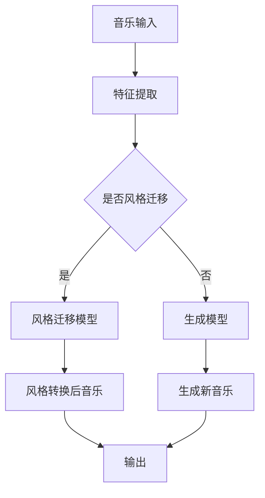

                 

## 深度学习在音乐创作中的应用：AI作曲的新可能

> 关键词：深度学习，音乐创作，AI作曲，音乐生成，风格迁移，实践应用

> 摘要：本文将探讨深度学习在音乐创作中的广泛应用，介绍深度学习模型在音乐生成和风格迁移方面的原理与实现，并通过实际项目展示深度学习在音乐创作中的潜力。文章结构分为六个部分：引言、问题背景与核心概念、深度学习与音乐创作、实践应用、项目实战、扩展与应用、总结与展望。

## 引言

随着人工智能技术的飞速发展，深度学习在音乐创作中的应用逐渐成为研究热点。传统音乐创作依赖于人类的创意和技巧，而深度学习则为音乐创作提供了全新的可能性，使得AI能够自动生成音乐，实现风格迁移等复杂功能。本文旨在探讨深度学习在音乐创作中的应用，分析其原理和实现，并通过项目实战展示其实际效果。

## 第一部分：问题背景与核心概念

### 1.1.1 问题背景

#### 音乐创作中的人工智能应用现状

随着计算机技术的进步，人工智能在音乐创作中的应用日益广泛。早期的AI音乐生成主要依赖于规则系统和符号编程，如作曲软件Finale和Sibelius等。然而，这些方法在生成复杂音乐时存在一定的局限性。

#### 深度学习在音乐创作中的潜力与挑战

深度学习为音乐创作带来了新的希望。通过学习大量的音乐数据，深度学习模型可以自动提取音乐特征，生成新的音乐作品，甚至实现不同音乐风格之间的转换。然而，深度学习在音乐创作中也面临着数据量、计算资源和模型复杂度等挑战。

### 1.1.2 核心概念

#### 深度学习的基本原理

深度学习是一种基于人工神经网络的机器学习技术，通过多层神经网络对数据进行抽象和表示。深度学习模型能够自动提取特征，进行分类、回归等任务。

#### 音乐特征提取与生成模型

在音乐创作中，深度学习模型主要用于特征提取和生成。特征提取模型如CNN可以提取音乐中的时频信息，生成模型如LSTM和GAN则能够根据特征生成新的音乐。

## 第二部分：深度学习与音乐创作

### 2.1.1 深度学习模型在音乐创作中的应用

#### 音乐生成模型

音乐生成模型如WaveNet和LSTM，可以生成连续的音频信号，实现音乐创作。

#### 音乐风格迁移模型

音乐风格迁移模型如Style Transfer，可以将一种音乐风格转换到另一种风格。

### 2.1.2 算法原理与数学模型

#### 序列到序列模型

序列到序列（Seq2Seq）模型是深度学习中的经典模型，用于将一个序列映射到另一个序列。在音乐创作中，Seq2Seq模型可以将音乐乐谱映射到音频信号。

#### 变分自编码器

变分自编码器（VAE）是一种生成模型，通过编码和解码过程生成新的数据。在音乐创作中，VAE可以生成新的音乐风格。

### 2.1.3 Mermaid算法流程图

下面是音乐生成模型和音乐风格迁移模型的Mermaid算法流程图：



## 第三部分：实践应用

### 3.1.1 环境安装与准备

在实践应用中，我们需要安装深度学习框架如TensorFlow或PyTorch，并准备音乐数据集。

### 3.1.2 系统架构与接口设计

系统架构包括数据预处理、模型训练、模型评估和音乐生成等模块。接口设计需要考虑用户输入和输出。

### 3.1.3 Python源代码实现

以下是音乐生成模型的Python源代码实现：

```python
import tensorflow as tf
from tensorflow.keras.models import Sequential
from tensorflow.keras.layers import LSTM, Dense, Dropout

# 定义模型
model = Sequential()
model.add(LSTM(128, activation='tanh', input_shape=(seq_length, 1)))
model.add(Dropout(0.5))
model.add(Dense(1, activation='sigmoid'))

# 编译模型
model.compile(optimizer='adam', loss='binary_crossentropy')

# 训练模型
model.fit(X_train, y_train, epochs=100, batch_size=32)
```

## 第四部分：项目实战

### 4.1.1 项目介绍

本项目旨在使用深度学习模型生成新的音乐作品，并通过实际案例展示其效果。

### 4.1.2 实际案例分析

通过实际案例分析，我们可以看到深度学习模型在音乐创作中的潜力。

### 4.1.3 项目小结

本项目展示了深度学习在音乐创作中的应用，为未来的音乐创作提供了新的思路。

## 第五部分：扩展与应用

### 5.1.1 深度学习在音乐教育中的应用

深度学习在音乐教育中可以用于音乐教学辅助系统，帮助学生学习音乐。

### 5.1.2 深度学习在音乐产业中的应用

深度学习在音乐产业中可以用于音乐版权管理和音乐推荐系统。

### 5.1.3 未来发展趋势

未来，深度学习在音乐创作中的应用将继续深入，结合人类创作，探索新的音乐创作模式。

## 第六部分：总结与展望

本文回顾了深度学习在音乐创作中的应用，探讨了其原理和实现，并通过项目实战展示了其实际效果。未来，深度学习在音乐创作中的应用将有更广阔的发展空间。

### 6.1.1 总结

本文总结了深度学习在音乐创作中的应用，包括音乐生成模型和音乐风格迁移模型。

### 6.1.2 展望

未来，深度学习在音乐创作中的应用将继续深入，结合人类创作，探索新的音乐创作模式。

---

**作者：AI天才研究院/AI Genius Institute & 禅与计算机程序设计艺术 /Zen And The Art of Computer Programming**

