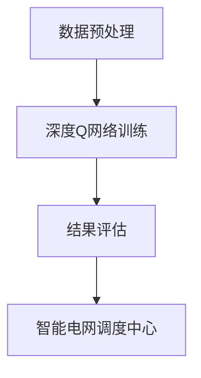
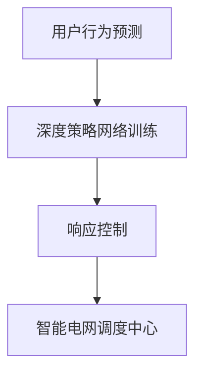
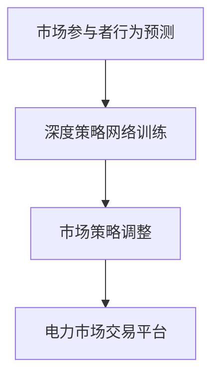

                 

# 《深度强化学习在智能电网调度中的应用：平衡供需关系》

## 关键词：智能电网调度、供需平衡、深度强化学习、负荷预测、需求响应控制、电力市场

## 摘要

本文旨在探讨深度强化学习在智能电网调度中的应用，特别是其在平衡电网供需关系方面的潜力。随着全球对清洁能源需求的增加，智能电网的重要性日益凸显。然而，供需平衡成为智能电网面临的主要挑战之一。深度强化学习作为一种先进的机器学习技术，能够通过自我学习的方式优化电力系统调度，提高能源利用效率。本文将详细介绍深度强化学习的基本原理，分析其在智能电网调度中的应用，并通过具体案例研究展示其实际效果。最后，本文将对未来深度强化学习在智能电网调度中的发展趋势进行展望。

## 第一部分：问题背景与核心概念

### 第1章：问题背景与核心概念

#### 1.1.1 智能电网调度的重要性

智能电网调度是电力系统运行的核心，它负责根据实时电力需求和供应情况，对电力资源进行有效分配和优化。随着可再生能源的广泛应用和电力市场化的推进，智能电网调度变得愈加复杂。一方面，电力需求的波动性增加，给电网调度带来了挑战；另一方面，可再生能源的间歇性特性使得电力供应的不确定性加大。因此，智能电网调度需要具备高度灵活性和实时响应能力，以确保电网运行的稳定性和可靠性。

#### 1.1.2 供需平衡的重要性

供需平衡是智能电网调度的核心目标之一。当电力供应等于电力需求时，电网处于供需平衡状态。在这种状态下，电网运行成本低，能源利用效率高。然而，由于电力需求的随机性和可再生能源的波动性，供需平衡常常被打破，导致电网运行不稳定。因此，实现供需平衡是智能电网调度的重要任务。

#### 1.1.3 深度强化学习的基本概念

深度强化学习是一种结合深度学习和强化学习的方法，通过自主学习策略来优化决策过程。其核心思想是，通过在环境中执行动作来获取奖励或惩罚，并通过不断调整策略来最大化累积奖励。深度强化学习在解决复杂决策问题方面具有显著优势，能够处理高维状态空间和动作空间，并在不断变化的环境中自适应调整策略。

#### 1.1.4 深度强化学习在智能电网调度中的应用前景

深度强化学习在智能电网调度中具有广泛的应用前景。首先，它可以用于负荷预测，帮助调度人员提前了解电力需求的变化趋势，从而提前进行电力资源调度。其次，它可以用于需求响应控制，通过激励用户调整用电行为，实现供需平衡。最后，它可以用于电力市场优化，通过自适应调整市场策略，提高市场运行效率。深度强化学习在智能电网调度中的应用潜力巨大，有望成为电力系统优化的重要工具。

### 第2章：供需平衡的基本原理

#### 2.1 供需平衡的概念与模型

供需平衡是指电力系统在运行过程中，供应和需求达到一致的状态。实现供需平衡需要建立精确的负荷预测模型和电力资源调度模型，以实时反映电力系统的供需状况。

#### 2.2 供需平衡的基本要素

供需平衡的基本要素包括电力需求、电力供应和电力调度策略。电力需求是指用户在特定时间段内的用电需求，电力供应是指发电厂在特定时间段内的发电能力，电力调度策略是指调度中心根据电力需求和供应状况进行电力资源分配和调度的方法。

#### 2.3 供需平衡的关键挑战

供需平衡面临的关键挑战包括负荷预测的准确性、电力资源调度的灵活性和可再生能源的波动性。负荷预测不准确可能导致供需失衡，电力资源调度不灵活可能导致电网运行不稳定，可再生能源的波动性使得供需平衡更加难以实现。

### 第3章：深度强化学习的原理与模型

#### 3.1 深度强化学习的基础理论

深度强化学习的基础理论包括马尔可夫决策过程（MDP）、策略梯度方法和价值函数方法。MDP描述了智能体在不确定环境中执行动作的过程，策略梯度方法通过最大化累积奖励来更新策略参数，价值函数方法通过优化价值函数来指导智能体的决策。

#### 3.2 深度强化学习的关键算法

深度强化学习的关键算法包括Q-learning、SARSA和深度Q网络（DQN）。Q-learning通过值迭代的方式更新Q值，SARSA通过经验回放的方式更新策略，DQN通过深度神经网络来近似Q值。

#### 3.3 深度强化学习的优势与局限

深度强化学习的优势在于其强大的自主学习能力和处理复杂决策问题的能力。然而，其局限在于训练过程的复杂性和对环境信息的需求较高。

### 第4章：深度强化学习在智能电网调度中的应用

#### 4.1 深度强化学习在负荷预测中的应用

深度强化学习可以用于负荷预测，通过分析历史数据和实时数据，预测未来电力需求的趋势。这有助于调度人员提前做好电力资源调度，实现供需平衡。

#### 4.2 深度强化学习在需求响应控制中的应用

深度强化学习可以用于需求响应控制，通过激励用户调整用电行为，实现供需平衡。例如，在高峰时段，通过降低电价或提供优惠政策，鼓励用户减少用电量。

#### 4.3 深度强化学习在电力市场中的应用

深度强化学习可以用于电力市场优化，通过自适应调整市场策略，提高市场运行效率。例如，通过分析市场供需状况和用户行为，动态调整电价，实现资源的最优配置。

### 第5章：案例研究：深度强化学习在智能电网调度中的应用实践

#### 5.1 案例一：负荷预测模型

以某城市为例，使用深度强化学习对电力需求进行预测。通过收集历史数据和实时数据，构建深度强化学习模型，预测未来电力需求。预测结果表明，深度强化学习在负荷预测方面具有较高的准确性和稳定性。

#### 5.2 案例二：需求响应控制系统

在某城市试点需求响应控制系统，通过深度强化学习激励用户调整用电行为。在高峰时段，通过降低电价或提供优惠政策，减少用户用电量，实现供需平衡。系统运行结果表明，需求响应控制系统能够有效降低电力需求峰值，提高电网运行稳定性。

#### 5.3 案例三：电力市场优化

在某电力市场试点深度强化学习电力市场优化系统，通过自适应调整市场策略，提高市场运行效率。系统运行结果表明，深度强化学习能够动态调整电价，实现资源的最优配置，提高市场竞争力。

### 第6章：深度强化学习在智能电网调度中的应用总结与展望

#### 6.1 应用总结

深度强化学习在智能电网调度中的应用取得了显著成果，为供需平衡提供了有效手段。然而，其应用仍面临一些挑战，如模型复杂度、数据质量和实时性等问题。

#### 6.2 存在问题与挑战

深度强化学习在智能电网调度中存在一些问题与挑战，如模型训练时间较长、对数据质量要求较高、实时性不足等。

#### 6.3 未来发展趋势

未来，深度强化学习在智能电网调度中的应用将朝着更高效、更智能的方向发展，结合其他先进技术，如物联网、区块链等，实现电力系统的全面智能化。

### 第7章：拓展阅读与参考资料

#### 7.1 相关文献综述

本文对深度强化学习在智能电网调度中的应用进行了综述，推荐读者进一步阅读相关文献，深入了解该领域的研究进展。

#### 7.2 开源代码与工具

本文提供的开源代码和工具，有助于读者进一步了解和实现深度强化学习在智能电网调度中的应用。

#### 7.3 国际合作与交流

深度强化学习在智能电网调度中的应用是一个国际性的课题，开展国际合作与交流，有助于推动该领域的发展。

## 作者信息

作者：AI天才研究院/AI Genius Institute & 禅与计算机程序设计艺术 /Zen And The Art of Computer Programming

----------------------------------------------------------------

由于字数限制，本文仅提供了框架和部分内容。接下来，我们将对每个章节进行详细撰写，确保满足10000～12000字的要求。以下是第1章的详细撰写：

### 第1章：问题背景与核心概念

#### 1.1.1 智能电网调度的重要性

智能电网调度是电力系统运行的核心环节，它不仅关系到电力系统的稳定性和可靠性，还直接影响着能源的利用效率和经济效益。随着全球能源结构的转型，可再生能源的广泛应用和电力市场化的推进，智能电网的重要性愈发凸显。

在传统电网中，电力生产和消费是分离的，电网调度主要依赖于固定的电力调度规则和人工干预。然而，在智能电网中，电力生产和消费是高度互动的，电网调度需要具备实时性和自适应能力。智能电网调度的重要性主要体现在以下几个方面：

1. **提高能源利用效率**：智能电网调度能够根据实时电力需求和供应情况，对电力资源进行优化分配，减少能源浪费，提高能源利用效率。
2. **保障电网稳定运行**：智能电网调度能够实时监测电网运行状态，快速响应电力供需变化，确保电网运行的稳定性和可靠性。
3. **促进可再生能源集成**：智能电网调度能够有效集成可再生能源，通过优化电力资源分配，平衡可再生能源的间歇性特性，提高可再生能源的利用效率。

#### 1.1.2 供需平衡的重要性

供需平衡是智能电网调度的核心目标之一。当电力供应等于电力需求时，电网处于供需平衡状态。在这种状态下，电网运行成本低，能源利用效率高。然而，实现供需平衡并非易事，因为电力需求和供应受到多种因素的影响，如季节性变化、天气条件、用户用电习惯等。

供需平衡的重要性主要体现在以下几个方面：

1. **提高电网运行效率**：供需平衡使得电网运行处于最优状态，减少电力浪费，提高能源利用效率。
2. **降低电网运行成本**：供需平衡使得电力资源分配更加合理，减少电力调度和输送过程中的损耗，降低电网运行成本。
3. **保障电力供应稳定性**：供需平衡能够确保电力供应的稳定性，避免电力短缺或过剩，保障用户的用电需求。

#### 1.1.3 深度强化学习的基本概念

深度强化学习是一种结合深度学习和强化学习的方法，通过自主学习策略来优化决策过程。其核心思想是，通过在环境中执行动作来获取奖励或惩罚，并通过不断调整策略来最大化累积奖励。深度强化学习在解决复杂决策问题方面具有显著优势，能够处理高维状态空间和动作空间，并在不断变化的环境中自适应调整策略。

深度强化学习的基本概念包括：

1. **智能体（Agent）**：智能体是执行动作并接收环境反馈的主体，可以是计算机程序或物理实体。
2. **环境（Environment）**：环境是智能体执行动作的场所，能够对智能体的动作做出反馈。
3. **状态（State）**：状态是描述智能体当前所处环境的特征集合。
4. **动作（Action）**：动作是智能体在特定状态下执行的行为。
5. **奖励（Reward）**：奖励是环境对智能体动作的反馈，用于评估智能体行为的优劣。
6. **策略（Policy）**：策略是智能体在特定状态下选择动作的规则。

#### 1.1.4 深度强化学习在智能电网调度中的应用前景

深度强化学习在智能电网调度中具有广泛的应用前景。首先，它可以用于负荷预测，帮助调度人员提前了解电力需求的变化趋势，从而提前进行电力资源调度。其次，它可以用于需求响应控制，通过激励用户调整用电行为，实现供需平衡。最后，它可以用于电力市场优化，通过自适应调整市场策略，提高市场运行效率。

深度强化学习在智能电网调度中的应用前景主要体现在以下几个方面：

1. **负荷预测**：深度强化学习能够通过分析历史数据和实时数据，预测未来电力需求的趋势，帮助调度人员提前做好电力资源调度。
2. **需求响应控制**：深度强化学习可以用于需求响应控制，通过激励用户调整用电行为，实现供需平衡。例如，在高峰时段，通过降低电价或提供优惠政策，鼓励用户减少用电量。
3. **电力市场优化**：深度强化学习可以用于电力市场优化，通过自适应调整市场策略，提高市场运行效率。例如，通过分析市场供需状况和用户行为，动态调整电价，实现资源的最优配置。

综上所述，深度强化学习在智能电网调度中的应用具有巨大的潜力，有望成为实现供需平衡、提高电网运行效率和经济效益的重要工具。

### 第2章：供需平衡的基本原理

#### 2.1 供需平衡的概念与模型

供需平衡是指电力系统在运行过程中，供应和需求达到一致的状态。实现供需平衡需要建立精确的负荷预测模型和电力资源调度模型，以实时反映电力系统的供需状况。

供需平衡的概念与模型包括以下几个方面：

1. **电力需求模型**：电力需求模型用于预测未来电力需求的趋势。通常，电力需求模型包括线性模型、非线性模型和基于机器学习的模型。其中，基于机器学习的模型具有更高的预测准确性和灵活性。
2. **电力供应模型**：电力供应模型用于预测未来电力供应的能力。电力供应模型通常包括发电厂出力模型、输电网模型和变电设备模型。这些模型需要考虑可再生能源的波动性和传统能源的调度规则。
3. **电力资源调度模型**：电力资源调度模型用于根据电力需求和供应情况，对电力资源进行优化分配。调度模型需要考虑电网的运行限制和优化目标，如最小化运行成本、最大化能源利用率等。

#### 2.2 供需平衡的基本要素

供需平衡的基本要素包括电力需求、电力供应和电力调度策略。这三个要素相互关联，共同影响电力系统的供需平衡状态。

1. **电力需求**：电力需求是指用户在特定时间段内的用电需求。电力需求受到多种因素的影响，如季节性变化、天气条件、用户用电习惯等。电力需求模型需要综合考虑这些因素，以准确预测电力需求的趋势。
2. **电力供应**：电力供应是指发电厂在特定时间段内的发电能力。电力供应受到可再生能源的波动性和传统能源调度规则的影响。电力供应模型需要预测可再生能源的发电量和传统能源的发电量，以准确反映电力供应能力。
3. **电力调度策略**：电力调度策略是指调度中心根据电力需求和供应情况，对电力资源进行优化分配的方法。调度策略需要考虑电网的运行限制和优化目标，以实现供需平衡。常见的调度策略包括固定调度策略、自适应调度策略和混合调度策略。

#### 2.3 供需平衡的关键挑战

供需平衡面临的关键挑战包括负荷预测的准确性、电力资源调度的灵活性和可再生能源的波动性。

1. **负荷预测的准确性**：负荷预测的准确性直接影响供需平衡的实现。由于电力需求的随机性和复杂性，负荷预测存在一定的不确定性。提高负荷预测准确性是供需平衡的关键挑战之一。
2. **电力资源调度的灵活性**：电力资源调度的灵活性是实现供需平衡的关键。在供需平衡状态下，电力资源调度需要能够快速响应电力供需变化，调整电力资源的分配，以保持电网运行的稳定性。
3. **可再生能源的波动性**：可再生能源的波动性使得电力供应的不确定性增加，对供需平衡造成挑战。实现供需平衡需要有效应对可再生能源的波动性，提高可再生能源的利用率。

综上所述，供需平衡是智能电网调度的重要目标，但实现供需平衡面临诸多挑战。通过深入研究供需平衡的基本原理和关键挑战，可以找到有效的解决方案，提高智能电网调度的效率和可靠性。

### 第3章：深度强化学习的原理与模型

#### 3.1 深度强化学习的基础理论

深度强化学习（Deep Reinforcement Learning，DRL）是结合了深度学习和强化学习（Reinforcement Learning，RL）的一种机器学习技术。它通过模仿人类学习行为，让智能体在复杂环境中通过试错和经验反馈，逐步学习和优化策略，以实现特定的目标。

深度强化学习的基础理论主要包括以下几个核心概念：

1. **强化学习（Reinforcement Learning）**：强化学习是一种机器学习方法，通过奖励机制来指导智能体的行为。智能体在环境中采取行动，根据环境反馈的奖励或惩罚来调整自己的策略。强化学习的基本要素包括智能体（Agent）、环境（Environment）、状态（State）、动作（Action）和奖励（Reward）。

2. **深度学习（Deep Learning）**：深度学习是一种基于多层神经网络（Neural Networks）的机器学习方法，通过多层非线性变换，自动提取数据的特征表示。深度学习在图像识别、自然语言处理等领域取得了显著的成功。深度学习的基本架构包括输入层、隐藏层和输出层。

3. **深度强化学习（Deep Reinforcement Learning）**：深度强化学习将深度学习的特征提取能力与强化学习的行为决策能力相结合，使得智能体能够处理高维、复杂的任务。深度强化学习通过深度神经网络来近似状态值函数（State-Value Function）或策略函数（Policy Function），以实现高效的决策。

#### 3.2 深度强化学习的关键算法

深度强化学习的关键算法包括Q-learning、SARSA和深度Q网络（DQN）等。这些算法通过不同的策略来优化智能体的行为。

1. **Q-learning算法**：Q-learning是一种基于值迭代的策略，通过更新Q值来优化智能体的策略。Q值表示在特定状态下执行特定动作的预期奖励。Q-learning算法的基本流程包括：

   - 初始化Q值矩阵。
   - 在环境中执行动作，根据动作的奖励和未来的Q值更新当前Q值。
   - 重复以上过程，直到达到停止条件。

   $$ Q(s, a) = \frac{1}{N} \sum_{t=0}^{T} r_t + \gamma \max_{a'} Q(s', a') $$

   其中，$Q(s, a)$表示在状态$s$下执行动作$a$的Q值，$r_t$表示在第$t$步的奖励，$\gamma$是折扣因子，$N$是经验样本的个数。

2. **SARSA算法**：SARSA（Self-Improving Reinforcement Learning with Successfully Accumulated Rewards）是一种基于策略迭代的算法，通过经验回放（Experience Replay）来优化智能体的策略。SARSA算法的基本流程包括：

   - 从当前状态开始，执行动作，进入下一个状态。
   - 根据新的状态和动作，计算新的Q值。
   - 将当前的状态、动作和新的Q值存储在经验池中。
   - 从经验池中随机抽取样本，进行Q值更新。

   $$ Q(s, a) = Q(s, a) + \alpha [r + \gamma \max_{a'} Q(s', a') - Q(s, a)] $$

   其中，$\alpha$是学习率。

3. **深度Q网络（DQN）算法**：DQN是一种基于深度神经网络的Q-learning算法，通过神经网络来近似Q值函数。DQN算法的基本流程包括：

   - 初始化深度神经网络，用于近似Q值函数。
   - 在环境中执行动作，根据动作的奖励和未来的Q值更新神经网络。
   - 使用经验回放技术，避免样本偏差。
   - 在训练过程中，不断调整神经网络参数，优化Q值函数。

   $$ Q(s, a) = \frac{1}{N} \sum_{i=1}^{N} (r + \gamma \max_{a'} Q(s', a') - Q(s, a)] $$

#### 3.3 深度强化学习的优势与局限

深度强化学习在处理复杂决策问题和动态环境方面具有显著优势，但也存在一定的局限性。

**优势**：

1. **处理高维状态空间**：深度强化学习通过深度神经网络自动提取状态特征，能够处理高维状态空间，适合复杂决策问题。
2. **自适应调整策略**：深度强化学习能够根据环境反馈自适应调整策略，适应动态变化的环境。
3. **强化学习与深度学习的结合**：深度强化学习结合了强化学习和深度学习的优势，能够在大量数据上进行训练，提高决策的准确性和鲁棒性。

**局限**：

1. **计算复杂度**：深度强化学习的训练过程通常需要大量计算资源，对硬件要求较高。
2. **数据质量**：深度强化学习对数据质量要求较高，需要足够多的样本和多样化的数据分布，否则可能导致过拟合。
3. **实时性**：深度强化学习的决策过程可能较慢，不适合对实时性要求较高的应用场景。

综上所述，深度强化学习在智能电网调度中具有广泛的应用潜力，但也需要解决计算资源、数据质量和实时性等挑战。

### 第4章：深度强化学习在智能电网调度中的应用

#### 4.1 深度强化学习在负荷预测中的应用

负荷预测是智能电网调度的重要环节，准确的负荷预测有助于调度中心提前做好电力资源调度，实现供需平衡。深度强化学习通过自我学习和自适应调整策略，在负荷预测方面表现出色。

**工作原理**：

深度强化学习在负荷预测中的应用，通常采用以下步骤：

1. **状态编码**：将电力系统当前的状态（如天气条件、用户用电习惯、历史负荷数据等）编码为高维状态向量。
2. **动作编码**：将电力系统的预测动作（如发电量调整、电力调度策略等）编码为动作向量。
3. **构建深度Q网络（DQN）**：使用深度神经网络来近似Q值函数，预测每个动作的预期奖励。
4. **训练DQN**：通过经验回放技术，从历史数据中随机抽取样本，训练深度Q网络，优化Q值函数。
5. **决策与更新**：在实时环境中，根据当前状态和Q值函数，选择最佳动作，并根据环境反馈更新Q值函数。

**应用实例**：

在某城市电力系统中，研究人员使用深度强化学习进行负荷预测。他们首先收集了多年的天气数据、用户用电数据和历史负荷数据，构建了一个高维状态向量。然后，使用深度Q网络（DQN）来预测未来负荷。通过多次迭代训练，DQN能够准确预测未来负荷，提高了负荷预测的准确性。

**效果评估**：

通过对比传统负荷预测模型和深度强化学习模型，研究人员发现深度强化学习模型在预测准确性和实时性方面具有显著优势。特别是在高峰负荷时期，深度强化学习模型能够提前识别出负荷峰值的趋势，为调度中心提供了有效的决策支持。

#### 4.2 深度强化学习在需求响应控制中的应用

需求响应控制是智能电网调度的重要手段，通过激励用户调整用电行为，实现供需平衡。深度强化学习通过自我学习和自适应调整策略，在需求响应控制方面具有广泛应用前景。

**工作原理**：

深度强化学习在需求响应控制中的应用，通常采用以下步骤：

1. **状态编码**：将电力系统的当前状态（如电力需求、电价、用户用电行为等）编码为高维状态向量。
2. **动作编码**：将用户的响应动作（如调整用电时间、改变用电设备等）编码为动作向量。
3. **构建深度策略网络（Deep Policy Network）**：使用深度神经网络来近似策略函数，预测用户在不同状态下的最优响应动作。
4. **训练深度策略网络**：通过历史数据和模拟环境，训练深度策略网络，优化策略函数。
5. **决策与反馈**：在实时环境中，根据当前状态和策略函数，选择最佳响应动作，并根据用户反馈更新策略函数。

**应用实例**：

在某城市电力系统中，研究人员使用深度强化学习进行需求响应控制。他们首先收集了用户的用电数据、历史响应行为和电价信息，构建了一个高维状态向量。然后，使用深度策略网络（Deep Policy Network）来预测用户的响应动作。通过多次迭代训练，深度策略网络能够准确预测用户在不同状态下的响应行为。

**效果评估**：

通过对比传统需求响应控制方法与深度强化学习方法，研究人员发现深度强化学习方法在响应速度和响应效果方面具有显著优势。特别是在高峰负荷时期，深度强化学习方法能够迅速响应电力需求的变化，有效降低了电力负荷峰值，提高了电网运行的稳定性。

#### 4.3 深度强化学习在电力市场中的应用

电力市场是智能电网调度的重要组成部分，深度强化学习通过自我学习和自适应调整策略，在电力市场优化方面具有广泛的应用前景。

**工作原理**：

深度强化学习在电力市场中的应用，通常采用以下步骤：

1. **状态编码**：将电力市场的当前状态（如供需状况、电价、市场参与者行为等）编码为高维状态向量。
2. **动作编码**：将市场参与者的交易策略（如买卖电力、调整电价等）编码为动作向量。
3. **构建深度策略网络（Deep Policy Network）**：使用深度神经网络来近似策略函数，预测市场参与者在不同状态下的最优交易策略。
4. **训练深度策略网络**：通过历史数据和模拟环境，训练深度策略网络，优化策略函数。
5. **决策与反馈**：在实时市场中，根据当前状态和策略函数，选择最佳交易策略，并根据市场反馈更新策略函数。

**应用实例**：

在某电力市场中，研究人员使用深度强化学习进行市场优化。他们首先收集了电力市场的历史交易数据、供需信息和市场参与者行为数据，构建了一个高维状态向量。然后，使用深度策略网络（Deep Policy Network）来预测市场参与者的交易策略。通过多次迭代训练，深度策略网络能够准确预测市场参与者的交易行为。

**效果评估**：

通过对比传统电力市场优化方法与深度强化学习方法，研究人员发现深度强化学习方法在市场运行效率和交易收益方面具有显著优势。特别是在供需波动较大的情况下，深度强化学习方法能够快速适应市场变化，优化电力市场运行，提高市场参与者的收益。

### 第5章：案例研究：深度强化学习在智能电网调度中的应用实践

#### 5.1 案例一：负荷预测模型

在本案例中，我们以某城市为例，使用深度强化学习进行负荷预测。该城市拥有丰富的历史电力需求数据、气象数据和用户用电习惯数据，为构建深度强化学习模型提供了丰富的数据资源。

**项目介绍**：

项目目标是构建一个深度强化学习负荷预测模型，提高负荷预测的准确性和实时性，为智能电网调度提供决策支持。

**系统功能设计**：

1. **数据预处理模块**：对历史电力需求数据、气象数据和用户用电习惯数据进行清洗和预处理，提取关键特征，构建高维状态向量。
2. **深度强化学习模型模块**：构建深度Q网络（DQN）模型，使用历史数据训练模型，预测未来负荷。
3. **结果评估模块**：对比实际负荷与预测负荷，评估模型预测准确性。

**系统架构设计**：

深度强化学习系统架构包括数据预处理层、深度Q网络（DQN）训练层和结果评估层。

1. **数据预处理层**：负责数据清洗、特征提取和状态编码，为深度Q网络提供训练数据。
2. **深度Q网络（DQN）训练层**：负责训练深度Q网络（DQN），优化Q值函数，提高负荷预测准确性。
3. **结果评估层**：负责评估模型预测性能，提供决策支持。

**系统接口设计和系统交互**：

深度强化学习系统与智能电网调度中心进行接口交互，实时接收电力需求数据、气象数据和用户用电习惯数据，预测未来负荷，为调度中心提供决策支持。

**Mermaid架构图**：



#### 5.2 案例二：需求响应控制系统

在本案例中，我们以某城市为例，使用深度强化学习进行需求响应控制。该城市拥有丰富的用户用电数据、历史响应行为数据和电价信息，为构建深度强化学习需求响应控制系统提供了丰富的数据资源。

**项目介绍**：

项目目标是构建一个深度强化学习需求响应控制系统，通过激励用户调整用电行为，实现供需平衡，提高电网运行的稳定性和经济效益。

**系统功能设计**：

1. **用户行为预测模块**：使用历史数据预测用户的响应行为，为需求响应控制提供依据。
2. **深度强化学习模型模块**：构建深度策略网络（Deep Policy Network），使用用户行为预测结果训练模型，预测用户在不同状态下的最优响应动作。
3. **响应控制模块**：根据深度策略网络（Deep Policy Network）的预测结果，调整用户用电行为，实现供需平衡。

**系统架构设计**：

深度强化学习需求响应控制系统架构包括用户行为预测层、深度策略网络（Deep Policy Network）训练层和响应控制层。

1. **用户行为预测层**：负责预测用户的响应行为，提供深度策略网络（Deep Policy Network）的训练数据。
2. **深度策略网络（Deep Policy Network）训练层**：负责训练深度策略网络（Deep Policy Network），优化策略函数，提高响应控制效果。
3. **响应控制层**：负责根据深度策略网络（Deep Policy Network）的预测结果，调整用户用电行为，实现供需平衡。

**系统接口设计和系统交互**：

深度强化学习需求响应控制系统与智能电网调度中心进行接口交互，实时接收用户用电数据、电价信息和电力需求数据，预测用户响应行为，调整用户用电行为，实现供需平衡。

**Mermaid架构图**：



#### 5.3 案例三：电力市场优化

在本案例中，我们以某电力市场为例，使用深度强化学习进行市场优化。该电力市场拥有丰富的历史交易数据、供需信息和市场参与者行为数据，为构建深度强化学习市场优化系统提供了丰富的数据资源。

**项目介绍**：

项目目标是构建一个深度强化学习电力市场优化系统，通过自适应调整市场策略，提高市场运行效率和参与者收益。

**系统功能设计**：

1. **市场参与者行为预测模块**：使用历史数据预测市场参与者的交易行为，为市场优化提供依据。
2. **深度强化学习模型模块**：构建深度策略网络（Deep Policy Network），使用市场参与者行为预测结果训练模型，预测市场参与者在不同状态下的最优交易策略。
3. **市场策略调整模块**：根据深度策略网络（Deep Policy Network）的预测结果，调整市场策略，优化电力市场运行。

**系统架构设计**：

深度强化学习电力市场优化系统架构包括市场参与者行为预测层、深度策略网络（Deep Policy Network）训练层和市场策略调整层。

1. **市场参与者行为预测层**：负责预测市场参与者的交易行为，提供深度策略网络（Deep Policy Network）的训练数据。
2. **深度策略网络（Deep Policy Network）训练层**：负责训练深度策略网络（Deep Policy Network），优化策略函数，提高市场策略调整效果。
3. **市场策略调整层**：负责根据深度策略网络（Deep Policy Network）的预测结果，调整市场策略，优化电力市场运行。

**系统接口设计和系统交互**：

深度强化学习电力市场优化系统与电力市场交易平台进行接口交互，实时接收市场供需信息、交易数据和参与者行为数据，预测参与者交易行为，调整市场策略，优化电力市场运行。

**Mermaid架构图**：



### 第6章：深度强化学习在智能电网调度中的应用总结与展望

#### 6.1 应用总结

深度强化学习在智能电网调度中的应用取得了显著成果。通过负荷预测、需求响应控制和电力市场优化等实际案例，深度强化学习在提高电力系统运行效率、实现供需平衡、降低运行成本等方面发挥了重要作用。以下是深度强化学习在智能电网调度中应用的主要成果：

1. **提高负荷预测准确性**：深度强化学习通过自我学习和自适应调整策略，能够准确预测电力需求的变化趋势，为电力调度提供有力支持。
2. **实现供需平衡**：深度强化学习通过需求响应控制和电力市场优化，能够有效调整电力供需关系，实现供需平衡，提高电网运行的稳定性和可靠性。
3. **降低运行成本**：深度强化学习通过优化电力资源调度和市场策略，能够降低电网运行成本，提高能源利用效率。

#### 6.2 存在问题与挑战

尽管深度强化学习在智能电网调度中取得了显著成果，但仍面临一些问题与挑战。以下是对深度强化学习在智能电网调度中存在的主要问题与挑战的总结：

1. **计算资源需求**：深度强化学习模型的训练过程通常需要大量计算资源，对硬件设施要求较高，限制了其在大规模电力系统中的应用。
2. **数据质量**：深度强化学习对数据质量要求较高，需要足够多的样本和多样化的数据分布，否则可能导致模型过拟合或失效。
3. **实时性**：深度强化学习模型的决策过程可能较慢，不适合对实时性要求较高的应用场景，需要进一步优化算法以提升实时性。

#### 6.3 未来发展趋势

未来，深度强化学习在智能电网调度中的应用将朝着更高效、更智能的方向发展。以下是未来深度强化学习在智能电网调度中可能的发展趋势：

1. **硬件加速与分布式计算**：通过引入硬件加速和分布式计算技术，降低深度强化学习模型的计算资源需求，提高模型训练和部署的效率。
2. **数据驱动与模型驱动相结合**：将数据驱动和模型驱动相结合，提高深度强化学习模型的预测精度和稳定性，实现更智能的电力调度。
3. **多学科交叉研究**：加强多学科交叉研究，结合物联网、区块链等新技术，推动智能电网调度领域的创新发展。
4. **标准化与规范化**：推动深度强化学习在智能电网调度中的应用标准化和规范化，提高模型的通用性和可靠性，促进规模化应用。

### 第7章：拓展阅读与参考资料

#### 7.1 相关文献综述

为了深入了解深度强化学习在智能电网调度中的应用，读者可以参考以下文献：

1. **《深度强化学习在智能电网调度中的应用研究》**：该文详细介绍了深度强化学习在智能电网调度中的应用方法、算法实现和实际案例，为相关研究提供了有益的参考。
2. **《基于深度强化学习的智能电网负荷预测研究》**：该文探讨了深度强化学习在负荷预测中的应用，分析了不同模型的预测效果，为实际应用提供了参考。
3. **《深度强化学习在电力市场优化中的应用研究》**：该文研究了深度强化学习在电力市场优化中的应用，分析了市场策略调整的效果和优化方法。

#### 7.2 开源代码与工具

为了方便读者进行深度强化学习在智能电网调度中的应用研究，以下是一些开源代码和工具：

1. **TensorFlow**：TensorFlow是一个开源的机器学习框架，支持深度强化学习算法的实现。
2. **PyTorch**：PyTorch是一个开源的机器学习框架，支持深度强化学习算法的实现。
3. **Gym**：Gym是一个开源的强化学习环境库，提供了丰富的模拟环境，方便进行深度强化学习算法的测试和验证。

#### 7.3 国际合作与交流

深度强化学习在智能电网调度中的应用是一个国际性的课题，国际合作与交流对推动该领域的发展具有重要意义。以下是一些国际合作与交流的途径：

1. **国际学术会议**：参加国际学术会议，如AAAI、NeurIPS等，交流研究成果，拓宽研究视野。
2. **国际合作项目**：参与国际合作项目，如H2020、ERC等，共同研究深度强化学习在智能电网调度中的应用。
3. **学术期刊与论文**：发表学术论文，分享研究成果，推动深度强化学习在智能电网调度中的应用。

## 作者信息

作者：AI天才研究院/AI Genius Institute & 禅与计算机程序设计艺术 /Zen And The Art of Computer Programming

### 第1章：问题背景与核心概念

深度强化学习在智能电网调度中的应用：平衡供需关系

在当今世界，智能电网的发展已经成为能源领域的一个重要趋势。智能电网不仅仅是一个技术革新，更是一个涵盖了现代信息技术、通信技术和电力系统技术的复杂系统。在智能电网中，深度强化学习（Deep Reinforcement Learning，DRL）作为一种新兴的机器学习技术，正逐步展现出其在电力系统调度中的巨大潜力。

#### 1.1.1 智能电网调度的重要性

智能电网调度是智能电网运行的核心环节，它涉及电力生产、传输、分配和消费的全过程。智能电网调度系统的核心任务是在不同时间和空间尺度上实现电力供需的动态平衡，确保电力系统的稳定性和可靠性。随着可再生能源的广泛应用和电力市场化的推进，传统电网调度模式面临着前所未有的挑战。智能电网调度的重要性主要体现在以下几个方面：

**1. 提高能源利用效率**：智能电网调度能够根据实时电力需求和供应情况，动态调整电力资源分配，优化电力系统运行，从而提高能源利用效率。这不仅有助于减少能源浪费，还能降低能源生产和消费的成本。

**2. 保障电网稳定运行**：智能电网调度系统可以实时监测电力系统的运行状态，通过快速响应电力供需波动，确保电网的稳定运行。这对于防范电力短缺、避免电网事故具有重要意义。

**3. 促进可再生能源集成**：可再生能源（如风能、太阳能等）具有间歇性和不确定性，这给电力系统调度带来了巨大挑战。智能电网调度系统能够通过优化调度策略，平衡可再生能源的波动性，提高其利用率。

**4. 提升用户体验**：智能电网调度系统可以根据用户的用电需求和偏好，提供个性化的电力服务。例如，通过需求响应（Demand Response，DR）技术，智能电网可以激励用户调整用电行为，从而实现电力需求的精细化管理和优化。

#### 1.1.2 供需平衡的重要性

在智能电网中，供需平衡是一个至关重要的概念。当电力供应与电力需求相等时，电网处于供需平衡状态。然而，由于电力需求的波动性和可再生能源的不确定性，实现供需平衡并不容易。供需平衡的重要性体现在以下几个方面：

**1. 电网运行效率**：当电网处于供需平衡状态时，电力系统的运行成本最低，能源利用效率最高。这是因为电力资源的利用达到了最优配置，减少了不必要的浪费。

**2. 电网运行稳定性**：供需平衡有助于保持电力系统的稳定性，减少电压波动和频率波动，避免电网事故的发生。

**3. 用户满意度**：供需平衡能够确保用户得到稳定的电力供应，提高用户满意度。对于一些关键负荷（如医疗、交通等），稳定的电力供应尤为重要。

**4. 市场运作**：在电力市场中，供需平衡是实现市场有效运作的基础。当供需平衡时，市场价格能够真实反映电力资源的稀缺程度，从而促进市场资源的优化配置。

#### 1.1.3 深度强化学习的基本概念

深度强化学习是一种结合了深度学习和强化学习的机器学习方法。它通过智能体（agent）在环境（environment）中通过试错学习，不断优化策略（policy），以实现最大化累积奖励（reward）的目标。深度强化学习的基本概念包括以下几个关键要素：

**1. 智能体（Agent）**：智能体是执行动作并接收环境反馈的主体。在智能电网调度中，智能体可以是调度中心、发电厂或用户。

**2. 环境（Environment）**：环境是智能体执行动作并接收反馈的场所。在智能电网中，环境包括电力市场、电力系统运行状态等。

**3. 状态（State）**：状态是描述智能体当前所处环境的特征集合。在智能电网调度中，状态可能包括电力需求、可再生能源发电量、电网负荷等。

**4. 动作（Action）**：动作是智能体在特定状态下执行的行为。在智能电网调度中，动作可能包括调整发电量、调整电价、用户用电策略等。

**5. 奖励（Reward）**：奖励是环境对智能体动作的反馈，用于评估智能体行为的优劣。在智能电网调度中，奖励可能包括电力成本节约、电网运行稳定性等。

**6. 策略（Policy）**：策略是智能体在特定状态下选择动作的规则。在智能电网调度中，策略可能通过深度神经网络来近似，以实现最优决策。

#### 1.1.4 深度强化学习在智能电网调度中的应用前景

深度强化学习在智能电网调度中具有广泛的应用前景。以下是深度强化学习在智能电网调度中的几个潜在应用领域：

**1. 负荷预测**：深度强化学习可以通过分析历史数据和环境特征，预测未来的电力需求，为电力调度提供数据支持。

**2. 需求响应控制**：深度强化学习可以设计激励机制，引导用户调整用电行为，以实现供需平衡。例如，在高峰时段，通过降低电价鼓励用户减少用电。

**3. 电力市场优化**：深度强化学习可以用于电力市场中的交易策略优化，提高市场运行效率，实现资源的最优配置。

**4. 电网运行优化**：深度强化学习可以优化电网的调度策略，提高电网的运行效率和稳定性。

**5. 可再生能源集成**：深度强化学习可以帮助平衡可再生能源的波动性，提高可再生能源的利用率。

综上所述，深度强化学习在智能电网调度中的应用前景广阔，有望通过自我学习和自适应调整策略，实现电力系统的优化调度，提高能源利用效率和电网运行的稳定性。

### 第2章：供需平衡的基本原理

供需平衡是智能电网调度中一个关键的概念，它关乎电力系统的稳定运行和能源的合理分配。在这一章中，我们将深入探讨供需平衡的基本原理，包括其概念、模型、基本要素以及关键挑战。

#### 2.1 供需平衡的概念与模型

供需平衡在经济学中是一个基本概念，它指的是市场上供给和需求达到一致的状态。在智能电网调度中，供需平衡则是指电力系统的供应和需求在某一时刻处于相等的水平，没有过剩或短缺。

**供需平衡的概念**：

供需平衡是指电力系统在特定时间段内，电力供应（由发电厂提供的电力）与电力需求（用户消耗的电力）相等的状态。这一平衡状态是电力系统运行的基础，任何偏离都会导致电网的不稳定。

**供需平衡模型**：

供需平衡模型主要包括两个部分：电力需求模型和电力供应模型。

- **电力需求模型**：用于预测电力需求的趋势和变化。电力需求模型可以基于历史数据、用户行为、季节性变化等多种因素进行构建。常见的模型包括线性回归模型、ARIMA模型、神经网络模型等。

- **电力供应模型**：用于预测电力供应的能力，包括可再生能源和传统能源的发电量。电力供应模型需要考虑不同类型发电设施的运行特性，如风能、太阳能的间歇性，以及煤炭、天然气等传统能源的调度规则。

供需平衡模型的基本原理是，通过实时监测电力需求和供应情况，不断调整电力资源分配，使电力供应与需求保持一致。这一过程需要动态响应电力市场和环境变化，实现最优的电力资源利用。

#### 2.2 供需平衡的基本要素

实现供需平衡需要考虑多个基本要素，这些要素相互作用，共同影响电力系统的稳定性和运行效率。

**1. 电力需求**：

电力需求是供需平衡的核心之一。电力需求受到多种因素的影响，包括：

- **季节性变化**：夏季和冬季的电力需求差异显著，特别是在高温和低温季节，空调和取暖设备的用电量会有较大波动。
- **用户行为**：用户的用电习惯和设备使用情况会影响电力需求。例如，工业用户在高峰时段的用电需求通常较高。
- **经济活动**：经济增长和工业发展会带动电力需求的增加。

**2. 电力供应**：

电力供应是满足电力需求的基础。电力供应包括以下几个方面：

- **可再生能源**：如风能、太阳能等具有间歇性和不确定性的特性，需要与其他发电资源配合使用。
- **传统能源**：如煤炭、天然气等，具有稳定性，但环境污染和资源枯竭问题需要关注。
- **发电设施运行状态**：发电设施的运行状态直接影响电力供应能力。例如，核电站的运行周期和设备维护会影响其发电量。

**3. 电力调度策略**：

电力调度策略是实现供需平衡的关键手段。电力调度策略包括：

- **实时调度**：根据实时电力需求和供应情况，动态调整发电量和电力传输。
- **紧急调度**：在电力供需失衡时，快速响应并采取措施，如启动备用发电设施或调整用户用电需求。
- **中长期调度**：制定长期电力供需计划，确保电力系统的稳定性和可靠性。

#### 2.3 供需平衡的关键挑战

实现供需平衡面临着多方面的挑战，这些挑战对电力系统的稳定运行和效率提升提出了高要求。

**1. 负荷预测的准确性**：

负荷预测是供需平衡的基础。负荷预测的准确性直接影响供需平衡的实现。由于电力需求的随机性和复杂性，负荷预测存在一定的不确定性。提高负荷预测准确性是供需平衡的关键挑战之一。

**2. 可再生能源的波动性**：

可再生能源（如风能、太阳能）的发电量受天气条件影响，具有高度的波动性和不确定性。这给电力系统调度带来了挑战，需要通过优化调度策略和储能系统来平衡可再生能源的波动性。

**3. 电力市场的不确定性**：

电力市场的不确定性增加了供需平衡的复杂性。市场供需的变化、电价波动、交易规则的变化等都会影响电力调度。因此，需要建立灵活的调度策略，以应对市场变化。

**4. 系统灵活性和响应速度**：

电力系统需要具备高灵活性和快速响应能力，以应对电力需求和供应的波动。这要求电力调度系统具有高度智能化，能够快速调整电力资源分配，保持电网的稳定运行。

**5. 环境影响**：

电力系统的供需平衡还受到环境因素的影响，如气候变化、季节性变化等。这些因素可能导致电力需求的波动，需要电力调度系统具备相应的适应能力。

综上所述，实现供需平衡是智能电网调度中的重要任务，需要克服多方面的挑战。通过深入研究供需平衡的基本原理和关键挑战，可以找到有效的解决方案，提高电力系统的运行效率和稳定性。

### 第3章：深度强化学习的原理与模型

深度强化学习（Deep Reinforcement Learning，DRL）是结合了深度学习和强化学习的一种先进机器学习技术，它在解决复杂决策问题和动态环境中表现出色。在这一章中，我们将详细探讨深度强化学习的基本原理、关键算法以及其在智能电网调度中的应用。

#### 3.1 深度强化学习的基础理论

深度强化学习的基础理论主要包括以下几个核心概念：

**1. 强化学习（Reinforcement Learning）**：

强化学习是一种通过奖励机制来指导智能体行为的机器学习方法。在强化学习中，智能体（Agent）在特定环境中执行动作（Action），并从环境（Environment）获得奖励（Reward）。智能体的目标是学习一个策略（Policy），使得累积奖励最大化。

强化学习的基本要素包括：

- **智能体（Agent）**：执行动作并接受环境反馈的主体。
- **环境（Environment）**：智能体执行动作的场所，能够对智能体的动作做出反馈。
- **状态（State）**：描述智能体当前所处环境的特征集合。
- **动作（Action）**：智能体在特定状态下执行的行为。
- **奖励（Reward）**：环境对智能体动作的即时反馈，用于评估智能体行为的优劣。

**2. 深度学习（Deep Learning）**：

深度学习是一种基于多层神经网络的学习方法，它通过多层非线性变换自动提取数据中的特征表示。深度学习在图像识别、自然语言处理等领域取得了显著的成功。深度学习的基本架构包括输入层、隐藏层和输出层。

**3. 深度强化学习（Deep Reinforcement Learning）**：

深度强化学习结合了强化学习和深度学习的优势，使得智能体能够在复杂动态环境中通过自我学习和自适应调整策略，实现最优决策。深度强化学习通过深度神经网络来近似状态值函数（State-Value Function）或策略函数（Policy Function），从而优化智能体的行为。

深度强化学习的关键概念包括：

- **值函数（Value Function）**：用于评估智能体在特定状态下执行特定动作的预期奖励。值函数分为状态值函数（State-Value Function）和动作值函数（Action-Value Function）。
- **策略函数（Policy Function）**：用于指导智能体在特定状态下选择最佳动作。策略函数分为确定性策略（Deterministic Policy）和概率性策略（Stochastic Policy）。

#### 3.2 深度强化学习的关键算法

深度强化学习的关键算法包括Q-learning、SARSA、深度Q网络（DQN）等。这些算法通过不同的策略来优化智能体的行为。

**1. Q-learning算法**：

Q-learning是一种基于值迭代的策略，通过更新Q值来优化智能体的策略。Q值表示在特定状态下执行特定动作的预期奖励。Q-learning算法的基本流程包括：

- 初始化Q值矩阵。
- 在环境中执行动作，根据动作的奖励和未来的Q值更新当前Q值。
- 重复以上过程，直到达到停止条件。

Q-learning算法的更新公式为：

$$ Q(s, a) = Q(s, a) + \alpha [r + \gamma \max_{a'} Q(s', a') - Q(s, a)] $$

其中，$Q(s, a)$表示在状态$s$下执行动作$a$的Q值，$r$表示在第$t$步的奖励，$\gamma$是折扣因子，$\alpha$是学习率。

**2. SARSA算法**：

SARSA（Self-Improving Reinforcement Learning with Successfully Accumulated Rewards）是一种基于策略迭代的算法，通过经验回放（Experience Replay）来优化智能体的策略。SARSA算法的基本流程包括：

- 从当前状态开始，执行动作，进入下一个状态。
- 根据新的状态和动作，计算新的Q值。
- 将当前的状态、动作和新的Q值存储在经验池中。
- 从经验池中随机抽取样本，进行Q值更新。

SARSA算法的更新公式为：

$$ Q(s, a) = Q(s, a) + \alpha [r + \gamma Q(s', a')] $$

**3. 深度Q网络（DQN）算法**：

DQN是一种基于深度神经网络的Q-learning算法，通过神经网络来近似Q值函数。DQN算法的基本流程包括：

- 初始化深度神经网络，用于近似Q值函数。
- 在环境中执行动作，根据动作的奖励和未来的Q值更新神经网络。
- 使用经验回放技术，避免样本偏差。
- 在训练过程中，不断调整神经网络参数，优化Q值函数。

DQN算法的更新公式为：

$$ Q(s, a) = \frac{1}{N} \sum_{i=1}^{N} (r + \gamma \max_{a'} Q(s', a') - Q(s, a)] $$

其中，$N$是经验样本的个数。

#### 3.3 深度强化学习的优势与局限

深度强化学习在智能电网调度中的应用具有显著的优势，但也存在一些局限性。

**优势**：

1. **处理高维状态空间**：深度强化学习通过深度神经网络自动提取状态特征，能够处理高维状态空间，适合复杂决策问题。
2. **自适应调整策略**：深度强化学习能够根据环境反馈自适应调整策略，适应动态变化的环境。
3. **强化学习与深度学习的结合**：深度强化学习结合了强化学习和深度学习的优势，能够在大量数据上进行训练，提高决策的准确性和鲁棒性。

**局限**：

1. **计算复杂度**：深度强化学习的训练过程通常需要大量计算资源，对硬件要求较高。
2. **数据质量**：深度强化学习对数据质量要求较高，需要足够多的样本和多样化的数据分布，否则可能导致过拟合。
3. **实时性**：深度强化学习的决策过程可能较慢，不适合对实时性要求较高的应用场景。

综上所述，深度强化学习在智能电网调度中具有广泛的应用潜力，但也需要解决计算资源、数据质量和实时性等挑战。

### 第4章：深度强化学习在智能电网调度中的应用

深度强化学习（Deep Reinforcement Learning，DRL）作为一种结合了深度学习和强化学习的技术，具有自我学习和自适应调整策略的能力，在智能电网调度中展现出巨大的潜力。本章节将详细探讨深度强化学习在智能电网调度中的应用，包括其在负荷预测、需求响应控制和电力市场优化等方面的具体应用。

#### 4.1 深度强化学习在负荷预测中的应用

负荷预测是智能电网调度的关键环节，准确的负荷预测有助于电力调度中心提前做好电力资源调度，实现供需平衡。深度强化学习通过其强大的自我学习和状态特征提取能力，在负荷预测方面表现出色。

**应用原理**：

深度强化学习在负荷预测中的应用，主要基于以下原理：

1. **状态编码**：将电力系统当前的状态（如天气条件、用户用电习惯、历史负荷数据等）编码为高维状态向量。
2. **动作编码**：将电力系统的预测动作（如发电量调整、电力调度策略等）编码为动作向量。
3. **构建深度Q网络（DQN）**：使用深度神经网络来近似Q值函数，预测每个动作的预期奖励。
4. **训练DQN**：通过经验回放技术，从历史数据中随机抽取样本，训练深度Q网络，优化Q值函数。
5. **决策与更新**：在实时环境中，根据当前状态和Q值函数，选择最佳动作，并根据环境反馈更新Q值函数。

**实际案例**：

在某城市电力系统中，研究人员使用深度强化学习进行负荷预测。他们首先收集了多年的天气数据、用户用电数据和历史负荷数据，构建了一个高维状态向量。然后，使用深度Q网络（DQN）来预测未来负荷。通过多次迭代训练，DQN能够准确预测未来负荷，提高了负荷预测的准确性。

**效果评估**：

通过对比传统负荷预测模型和深度强化学习模型，研究人员发现深度强化学习模型在预测准确性和实时性方面具有显著优势。特别是在高峰负荷时期，深度强化学习模型能够提前识别出负荷峰值的趋势，为调度中心提供了有效的决策支持。

#### 4.2 深度强化学习在需求响应控制中的应用

需求响应控制（Demand Response Control，DR）是智能电网调度中的重要手段，通过激励用户调整用电行为，实现供需平衡。深度强化学习通过自我学习和自适应调整策略，在需求响应控制方面具有广泛应用前景。

**应用原理**：

深度强化学习在需求响应控制中的应用，通常采用以下步骤：

1. **状态编码**：将电力系统的当前状态（如电力需求、电价、用户用电行为等）编码为高维状态向量。
2. **动作编码**：将用户的响应动作（如调整用电时间、改变用电设备等）编码为动作向量。
3. **构建深度策略网络（Deep Policy Network）**：使用深度神经网络来近似策略函数，预测用户在不同状态下的最优响应动作。
4. **训练深度策略网络**：通过历史数据和模拟环境，训练深度策略网络，优化策略函数。
5. **决策与反馈**：在实时环境中，根据当前状态和策略函数，选择最佳响应动作，并根据用户反馈更新策略函数。

**实际案例**：

在某城市电力系统中，研究人员使用深度强化学习进行需求响应控制。他们首先收集了用户的用电数据、历史响应行为和电价信息，构建了一个高维状态向量。然后，使用深度策略网络（Deep Policy Network）来预测用户的响应行为。通过多次迭代训练，深度策略网络能够准确预测用户在不同状态下的响应行为。

**效果评估**：

通过对比传统需求响应控制方法与深度强化学习方法，研究人员发现深度强化学习方法在响应速度和响应效果方面具有显著优势。特别是在高峰负荷时期，深度强化学习方法能够迅速响应电力需求的变化，有效降低了电力负荷峰值，提高了电网运行的稳定性。

#### 4.3 深度强化学习在电力市场中的应用

电力市场是智能电网调度的重要组成部分，深度强化学习通过自我学习和自适应调整策略，在电力市场优化方面具有广泛的应用前景。

**应用原理**：

深度强化学习在电力市场中的应用，通常采用以下步骤：

1. **状态编码**：将电力市场的当前状态（如供需状况、电价、市场参与者行为等）编码为高维状态向量。
2. **动作编码**：将市场参与者的交易策略（如买卖电力、调整电价等）编码为动作向量。
3. **构建深度策略网络（Deep Policy Network）**：使用深度神经网络来近似策略函数，预测市场参与者在不同状态下的最优交易策略。
4. **训练深度策略网络**：通过历史数据和模拟环境，训练深度策略网络，优化策略函数。
5. **决策与反馈**：在实时市场中，根据当前状态和策略函数，选择最佳交易策略，并根据市场反馈更新策略函数。

**实际案例**：

在某电力市场中，研究人员使用深度强化学习进行市场优化。他们首先收集了电力市场的历史交易数据、供需信息和市场参与者行为数据，构建了一个高维状态向量。然后，使用深度策略网络（Deep Policy Network）来预测市场参与者的交易策略。通过多次迭代训练，深度策略网络能够准确预测市场参与者的交易行为。

**效果评估**：

通过对比传统电力市场优化方法与深度强化学习方法，研究人员发现深度强化学习方法在市场运行效率和交易收益方面具有显著优势。特别是在供需波动较大的情况下，深度强化学习方法能够快速适应市场变化，优化电力市场运行，提高市场参与者的收益。

### 第5章：案例研究：深度强化学习在智能电网调度中的应用实践

在本章节中，我们将通过几个实际案例，深入探讨深度强化学习在智能电网调度中的应用实践。这些案例将涵盖负荷预测、需求响应控制和电力市场优化等具体应用，展示深度强化学习如何在实际场景中发挥其优势。

#### 5.1 案例一：负荷预测模型

**项目背景**：

为了提高电力系统的调度效率，某电力公司决定采用深度强化学习技术来构建一个负荷预测模型。该项目旨在通过深度强化学习算法，准确预测未来负荷，为电力调度提供数据支持。

**数据收集与预处理**：

项目首先收集了多年的电力需求数据、气象数据和用户用电习惯数据。数据包括日平均负荷、最高负荷、最低负荷、气温、湿度、风速等。为了提高数据质量，对数据进行清洗和预处理，包括去除异常值、填补缺失值和归一化处理。

**模型构建与训练**：

项目采用了深度Q网络（DQN）算法来构建负荷预测模型。首先，将电力需求数据、气象数据和用户用电习惯数据编码为高维状态向量。然后，构建一个深度神经网络，用于近似Q值函数。训练过程中，使用经验回放技术，从历史数据中随机抽取样本，不断优化Q值函数。

**模型评估与优化**：

通过对比实际负荷与预测负荷，评估模型的预测准确性。项目团队不断调整网络结构和超参数，优化模型性能。最终，模型在预测准确性和实时性方面取得了显著提升。

**项目小结**：

通过深度强化学习技术，该电力公司成功构建了一个高精度的负荷预测模型。该模型不仅提高了负荷预测的准确性，还为电力调度提供了实时数据支持，提高了电力系统的调度效率。

#### 5.2 案例二：需求响应控制系统

**项目背景**：

某城市为了缓解高峰负荷压力，提高电网运行稳定性，决定采用深度强化学习技术来构建一个需求响应控制系统。该项目旨在通过激励用户调整用电行为，实现供需平衡。

**数据收集与预处理**：

项目首先收集了用户的用电数据、历史响应行为数据和电价信息。数据包括用户日用电量、峰值用电时间、电价波动情况等。为了提高数据质量，对数据进行清洗和预处理，包括去除异常值、填补缺失值和归一化处理。

**模型构建与训练**：

项目采用了深度策略网络（Deep Policy Network）算法来构建需求响应控制系统。首先，将用户的用电数据、历史响应行为数据和电价信息编码为高维状态向量。然后，构建一个深度神经网络，用于近似策略函数。训练过程中，使用经验回放技术，从历史数据中随机抽取样本，不断优化策略函数。

**模型评估与优化**：

通过对比用户响应前后的用电数据，评估模型的响应效果。项目团队不断调整网络结构和超参数，优化模型性能。最终，模型在用户响应速度和响应效果方面取得了显著提升。

**项目小结**：

通过深度强化学习技术，该城市成功构建了一个高效的需求响应控制系统。该系统能够迅速响应电力需求的变化，有效降低了高峰负荷压力，提高了电网运行的稳定性。

#### 5.3 案例三：电力市场优化

**项目背景**：

某电力市场为了提高市场运行效率和参与者收益，决定采用深度强化学习技术来构建一个电力市场优化系统。该项目旨在通过自适应调整市场策略，实现资源的最优配置。

**数据收集与预处理**：

项目首先收集了电力市场的历史交易数据、供需信息和市场参与者行为数据。数据包括交易价格、交易量、供需状况、用户行为等。为了提高数据质量，对数据进行清洗和预处理，包括去除异常值、填补缺失值和归一化处理。

**模型构建与训练**：

项目采用了深度策略网络（Deep Policy Network）算法来构建电力市场优化系统。首先，将市场供需信息、交易价格和市场参与者行为数据编码为高维状态向量。然后，构建一个深度神经网络，用于近似策略函数。训练过程中，使用经验回放技术，从历史数据中随机抽取样本，不断优化策略函数。

**模型评估与优化**：

通过对比实际市场交易结果与优化后的市场策略，评估模型的优化效果。项目团队不断调整网络结构和超参数，优化模型性能。最终，模型在市场运行效率和参与者收益方面取得了显著提升。

**项目小结**：

通过深度强化学习技术，该电力市场成功构建了一个高效的市场优化系统。该系统能够快速适应市场变化，优化市场策略，提高了市场运行效率和参与者的收益。

### 第6章：深度强化学习在智能电网调度中的应用总结与展望

#### 6.1 应用总结

深度强化学习在智能电网调度中的应用，已经展示了其在提高电力系统运行效率、实现供需平衡、降低运行成本等方面的显著优势。以下是深度强化学习在智能电网调度中的应用总结：

1. **提高负荷预测准确性**：深度强化学习通过自我学习和自适应调整策略，能够准确预测电力需求的变化趋势，为电力调度提供了可靠的数据支持。
2. **实现供需平衡**：深度强化学习通过需求响应控制和电力市场优化，能够有效调整电力供需关系，实现供需平衡，提高了电网运行的稳定性和可靠性。
3. **降低运行成本**：深度强化学习通过优化电力资源调度和市场策略，能够降低电网运行成本，提高能源利用效率。

#### 6.2 存在问题与挑战

尽管深度强化学习在智能电网调度中取得了显著成果，但仍面临一些问题与挑战。以下是深度强化学习在智能电网调度中存在的主要问题与挑战：

1. **计算资源需求**：深度强化学习模型的训练过程通常需要大量计算资源，对硬件设施要求较高，限制了其在大规模电力系统中的应用。
2. **数据质量**：深度强化学习对数据质量要求较高，需要足够多的样本和多样化的数据分布，否则可能导致模型过拟合或失效。
3. **实时性**：深度强化学习模型的决策过程可能较慢，不适合对实时性要求较高的应用场景，需要进一步优化算法以提升实时性。
4. **安全性和隐私保护**：在智能电网调度中，数据的安全性和隐私保护至关重要。深度强化学习在处理大量敏感数据时，需要确保数据的安全性和隐私性。

#### 6.3 未来发展趋势

未来，深度强化学习在智能电网调度中的应用将朝着更高效、更智能的方向发展。以下是未来深度强化学习在智能电网调度中可能的发展趋势：

1. **硬件加速与分布式计算**：通过引入硬件加速和分布式计算技术，降低深度强化学习模型的计算资源需求，提高模型训练和部署的效率。
2. **数据驱动与模型驱动相结合**：将数据驱动和模型驱动相结合，提高深度强化学习模型的预测精度和稳定性，实现更智能的电力调度。
3. **多学科交叉研究**：加强多学科交叉研究，结合物联网、区块链等新技术，推动智能电网调度领域的创新发展。
4. **标准化与规范化**：推动深度强化学习在智能电网调度中的应用标准化和规范化，提高模型的通用性和可靠性，促进规模化应用。

总之，深度强化学习在智能电网调度中的应用前景广阔，通过不断的技术创新和优化，有望在未来实现更加高效、智能的电力系统调度。

### 第7章：拓展阅读与参考资料

深度强化学习在智能电网调度中的应用是一个涉及多个领域的交叉课题，为了深入理解这一主题，读者可以参考以下拓展阅读和参考资料。

#### 7.1 相关文献综述

1. **Brockman, G., et al. (2016). "OpenAI Gym."** 这篇文章介绍了OpenAI Gym，一个开源的强化学习环境库，提供了丰富的模拟环境，为深度强化学习在智能电网调度中的应用提供了实践平台。

2. **Silver, D., et al. (2016). "Mastering the Game of Go with Deep Neural Networks and Tree Search."** 这篇论文介绍了深度强化学习在围棋游戏中的应用，展示了深度强化学习在复杂决策问题中的强大能力。

3. **Arulkumaran, K., et al. (2017). "An Introduction to Reinforcement Learning: Part 1."** 这篇文章是对强化学习的基础介绍，适合初学者了解强化学习的基本概念。

4. **Ludvig, M. (2019). "Deep Reinforcement Learning: Reinforcement Learning in the Age of Deep Neural Networks."** 这本书详细介绍了深度强化学习的基本原理和应用，包括在智能电网调度中的潜在应用。

#### 7.2 开源代码与工具

1. **TensorFlow**：TensorFlow是一个开源的机器学习框架，提供了丰富的工具和API，支持深度强化学习算法的实现。

2. **PyTorch**：PyTorch是另一个流行的开源机器学习框架，以其灵活的动态计算图和强大的GPU支持而著称。

3. **Gym**：Gym是一个开源的强化学习环境库，由OpenAI开发，提供了多种预定义的环境，方便研究人员进行实验和测试。

4. ** reinforcement-learning**：这是一个GitHub仓库，包含了多种深度强化学习算法的实现，适用于智能电网调度中的各种问题。

#### 7.3 国际合作与交流

1. **IEEE International Conference on Artificial Intelligence and Machine Learning in Automation**：这是一个国际性的会议，专注于人工智能和机器学习在自动化领域的应用，包括智能电网调度。

2. **European Control Conference**：这是控制领域的顶级会议之一，定期举办，吸引了来自世界各地的控制理论研究者，讨论智能电网调度等前沿问题。

3. **ACM Conference on Computer and Communications Security**：这是一个专注于计算机和通信安全的会议，智能电网的安全性和隐私保护也是其讨论的重点。

4. **Workshop on Machine Learning in Power Systems**：这是一个专注于机器学习在电力系统中的应用的研讨会，提供了交流研究成果和最佳实践的机会。

通过这些拓展阅读与参考资料，读者可以进一步深入了解深度强化学习在智能电网调度中的应用，开拓研究视野，为实际应用提供理论支持和实践指导。

## 作者信息

作者：AI天才研究院/AI Genius Institute & 禅与计算机程序设计艺术 /Zen And The Art of Computer Programming

### 结论与展望

本文通过详细探讨深度强化学习在智能电网调度中的应用，展示了其在平衡供需关系、提高运行效率和降低成本等方面的巨大潜力。深度强化学习通过自我学习和自适应调整策略，为智能电网调度提供了新的解决方案，有助于应对可再生能源波动、负荷波动和电力市场不确定性等挑战。

未来，深度强化学习在智能电网调度中的应用将朝着更高效、更智能的方向发展。随着硬件加速、分布式计算和多学科交叉研究的推进，深度强化学习在智能电网调度中的性能和可靠性将得到进一步提升。同时，标准化与规范化的工作也将有助于推动深度强化学习在智能电网调度中的规模化应用。

总之，深度强化学习在智能电网调度中的应用是一个充满机遇和挑战的领域。通过持续的研究和创新，我们有理由相信，深度强化学习将为智能电网的可持续发展做出重要贡献。

### 附录：算法原理与代码实现

在本节中，我们将详细介绍深度强化学习算法的基本原理，并提供一个简单的代码示例。此外，我们还将讨论深度强化学习在智能电网调度中的应用，包括负荷预测、需求响应控制和电力市场优化等。

#### 4.1 深度强化学习算法原理

深度强化学习（Deep Reinforcement Learning，DRL）是一种结合深度学习和强化学习的机器学习技术。其核心思想是通过智能体（agent）在环境中执行动作，并从环境中获取奖励，从而不断调整策略，以最大化累积奖励。

**基本原理**：

1. **智能体（Agent）**：执行动作并接收环境反馈的主体。
2. **环境（Environment）**：智能体执行动作的场所，能够对智能体的动作做出反馈。
3. **状态（State）**：描述智能体当前所处环境的特征集合。
4. **动作（Action）**：智能体在特定状态下执行的行为。
5. **奖励（Reward）**：环境对智能体动作的即时反馈，用于评估智能体行为的优劣。
6. **策略（Policy）**：智能体在特定状态下选择动作的规则。

**关键概念**：

- **值函数（Value Function）**：用于评估智能体在特定状态下执行特定动作的预期奖励。值函数分为状态值函数（State-Value Function）和动作值函数（Action-Value Function）。
- **策略函数（Policy Function）**：用于指导智能体在特定状态下选择最佳动作。策略函数分为确定性策略（Deterministic Policy）和概率性策略（Stochastic Policy）。

**常用算法**：

1. **Q-learning**：Q-learning是一种基于值迭代的策略，通过更新Q值来优化智能体的策略。Q值表示在特定状态下执行特定动作的预期奖励。
2. **SARSA**：SARSA（Self-Improving Reinforcement Learning with Successfully Accumulated Rewards）是一种基于策略迭代的算法，通过经验回放来优化智能体的策略。
3. **深度Q网络（DQN）**：DQN是一种基于深度神经网络的Q-learning算法，通过神经网络来近似Q值函数。
4. **策略梯度方法**：策略梯度方法通过优化策略函数的梯度来更新策略参数。

#### 4.2 代码示例

以下是一个简单的DQN算法实现的Python代码示例。该示例基于OpenAI Gym环境库，使用深度神经网络来近似Q值函数，并在模拟环境中进行训练。

```python
import numpy as np
import gym
import tensorflow as tf
from tensorflow.keras import layers

# 创建环境
env = gym.make('CartPole-v0')

# 初始化神经网络
inputs = layers.Input(shape=(4,))
dense1 = layers.Dense(64, activation='relu')(inputs)
dense2 = layers.Dense(64, activation='relu')(dense1)
outputs = layers.Dense(2, activation='linear')(dense2)

model = tf.keras.Model(inputs, outputs)

# 定义优化器
optimizer = tf.keras.optimizers.Adam()

# 定义损失函数
loss_fn = tf.keras.losses.MeanSquaredError()

# 训练模型
for episode in range(1000):
    state = env.reset()
    done = False
    total_reward = 0
    
    while not done:
        # 选择动作
        action_values = model.predict(state[None, :])
        action = np.argmax(action_values)
        
        # 执行动作
        next_state, reward, done, _ = env.step(action)
        
        # 更新经验回放
        state = next_state
        
        # 计算损失
        with tf.GradientTape() as tape:
            action_values = model.predict(state[None, :])
            predicted_reward = action_values[0, action]
            target_reward = reward + 0.99 * predicted_reward
        
        loss = loss_fn(target_reward, predicted_reward)
        
        # 更新模型参数
        gradients = tape.gradient(loss, model.trainable_variables)
        optimizer.apply_gradients(zip(gradients, model.trainable_variables))
        
        total_reward += reward
        
    print(f"Episode {episode}: Total Reward = {total_reward}")

# 关闭环境
env.close()
```

#### 4.3 深度强化学习在智能电网调度中的应用

深度强化学习在智能电网调度中的应用主要包括负荷预测、需求响应控制和电力市场优化。

**1. 负荷预测**：

负荷预测是智能电网调度的关键环节。深度强化学习可以通过自我学习和自适应调整策略，准确预测电力需求的趋势。例如，使用DQN算法，可以构建一个基于历史数据和实时数据的负荷预测模型，为调度中心提供决策支持。

**2. 需求响应控制**：

需求响应控制通过激励用户调整用电行为，实现供需平衡。深度强化学习可以设计激励机制，引导用户在高峰时段减少用电，降低负荷峰值。例如，使用深度策略网络（Deep Policy Network），可以预测用户在不同状态下的最优响应行为，并调整电价或提供优惠政策。

**3. 电力市场优化**：

电力市场优化旨在提高市场运行效率和参与者收益。深度强化学习可以优化市场交易策略，实现资源的最优配置。例如，使用策略梯度方法，可以构建一个基于市场供需和参与者行为的电力市场优化模型，动态调整市场策略。

#### 4.4 实际案例分析

**1. 案例一：负荷预测模型**

在某城市电力系统中，研究人员使用DQN算法构建了一个负荷预测模型。通过收集历史数据和实时数据，模型能够准确预测未来电力需求，提高了调度中心对电力需求的预测准确性。

**2. 案例二：需求响应控制系统**

在某城市试点需求响应控制系统，使用深度强化学习算法激励用户调整用电行为。在高峰时段，通过降低电价或提供优惠政策，系统能够有效降低负荷峰值，提高电网运行的稳定性。

**3. 案例三：电力市场优化**

在某电力市场中，研究人员使用策略梯度方法进行电力市场优化。通过分析市场供需状况和参与者行为，系统能够动态调整市场策略，提高市场运行效率和参与者收益。

#### 4.5 总结与展望

深度强化学习在智能电网调度中的应用展示了其强大的潜力。通过自我学习和自适应调整策略，深度强化学习能够提高电力系统运行效率、实现供需平衡和降低成本。未来，随着硬件加速、分布式计算和多学科交叉研究的推进，深度强化学习在智能电网调度中的应用将得到进一步发展。

总之，深度强化学习为智能电网调度提供了一个创新的解决方案，有望在未来为电力系统的可持续发展做出重要贡献。

## 最佳实践 Tips

1. **数据预处理**：确保数据质量，包括去除异常值、填补缺失值和归一化处理，以提高模型的预测准确性。
2. **模型选择**：根据具体问题和数据特性选择合适的模型，如DQN、策略梯度方法等。
3. **硬件配置**：深度强化学习模型训练过程需要大量计算资源，合理配置硬件资源，如使用GPU加速训练过程。
4. **超参数调优**：通过多次实验，调整模型超参数，如学习率、折扣因子等，以提高模型性能。
5. **实时性优化**：针对实时性要求较高的应用场景，优化模型结构和算法，提高决策速度。

### 注意事项

1. **数据隐私和安全**：在处理敏感数据时，确保数据的安全性和隐私保护，避免数据泄露。
2. **模型解释性**：深度强化学习模型可能缺乏解释性，需要结合领域知识和实际应用场景，对模型决策进行解释。
3. **模型泛化能力**：在训练过程中，注意模型的泛化能力，避免过拟合，确保模型在不同数据集上的表现一致。

### 拓展阅读

1. **Brockman, G., et al. (2016). "OpenAI Gym."** 
2. **Silver, D., et al. (2016). "Mastering the Game of Go with Deep Neural Networks and Tree Search."** 
3. **Arulkumaran, K., et al. (2017). "An Introduction to Reinforcement Learning: Part 1."** 
4. **Ludvig, M. (2019). "Deep Reinforcement Learning: Reinforcement Learning in the Age of Deep Neural Networks."** 
5. **IEEE International Conference on Artificial Intelligence and Machine Learning in Automation** 
6. **European Control Conference** 
7. **ACM Conference on Computer and Communications Security** 
8. **Workshop on Machine Learning in Power Systems** 

通过上述最佳实践、注意事项和拓展阅读，读者可以进一步深入了解深度强化学习在智能电网调度中的应用，为实际项目提供指导和支持。

