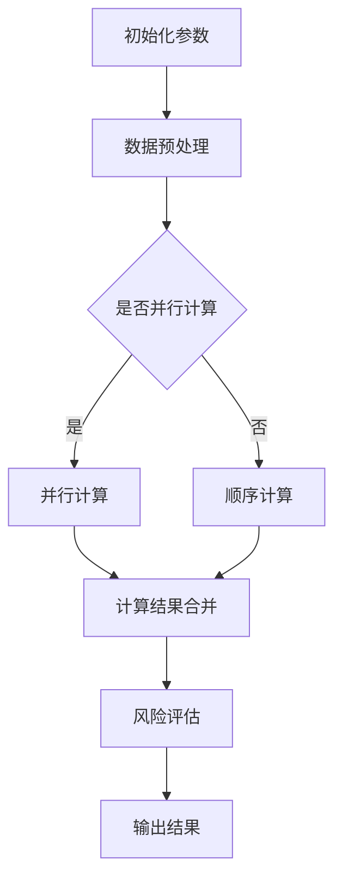
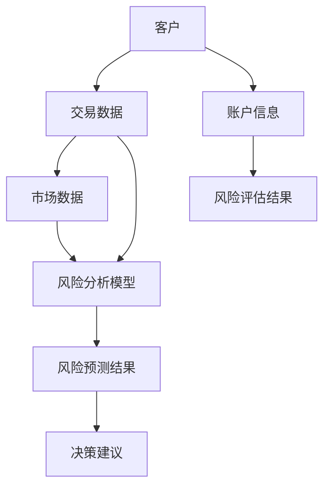
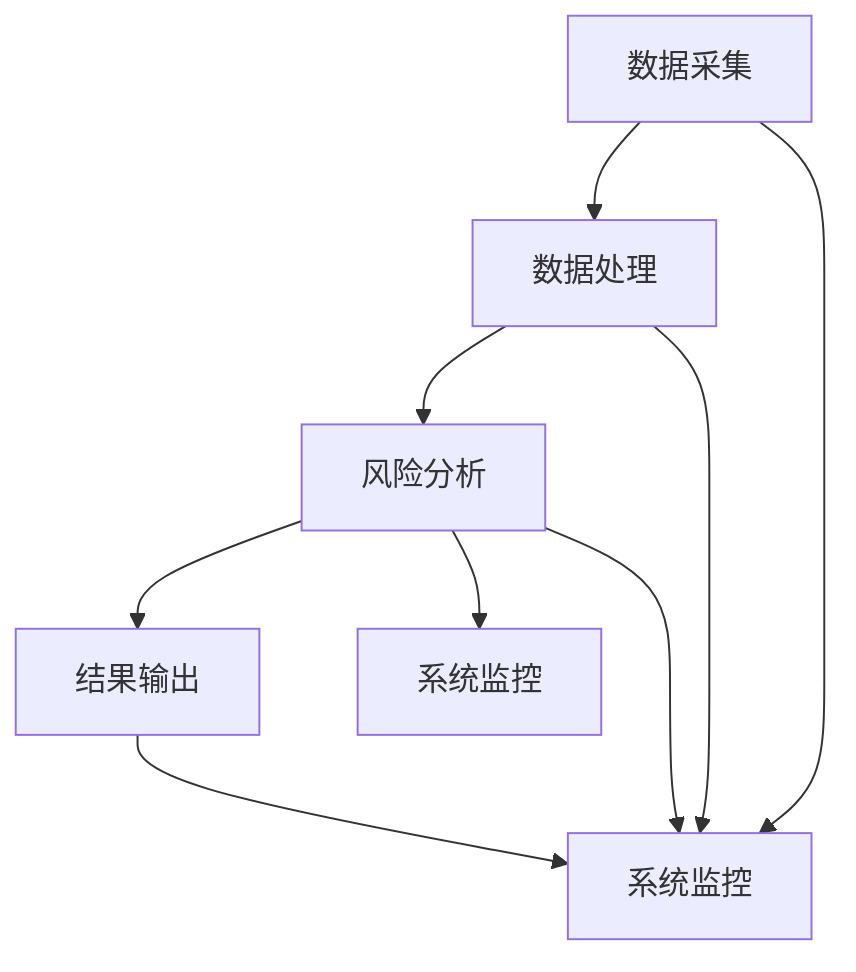
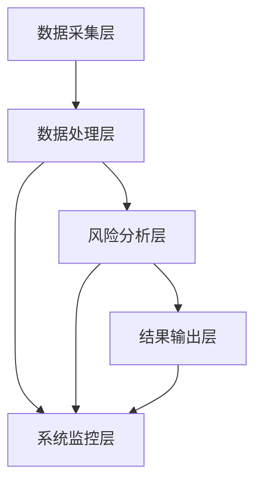
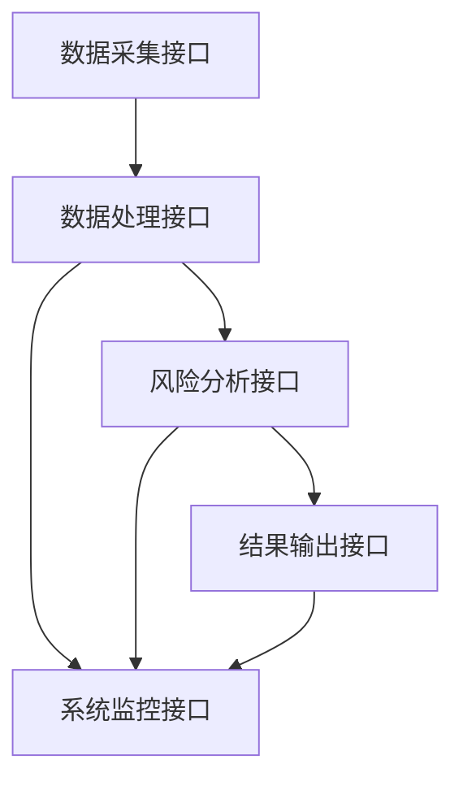
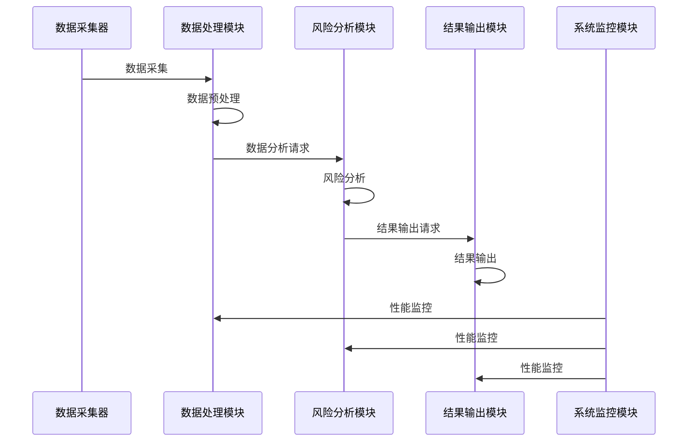
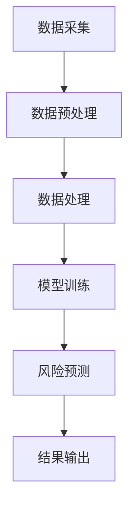

                 

### 第一部分: 混合计算概述

#### 第1章: 混合计算的概念与背景

##### 1.1 混合计算的定义与分类

混合计算是一种结合了并行计算、分布式计算和云计算等不同计算模式的综合计算方法。其核心思想是在不同的计算环境中，根据任务的需求和特性，灵活选择和组合各种计算资源和算法，以实现高效、可靠的计算过程。

**基本概念：**

- **并行计算：** 通过将任务分解成多个子任务，并在多个处理器上同时执行这些子任务，以提高计算速度和处理能力。
- **分布式计算：** 通过计算机网络将多个计算节点互联，共同协作完成一个复杂的计算任务。
- **云计算：** 利用互联网和远程服务器提供的计算资源，按需分配和利用，实现灵活的资源管理和扩展。

**分类：**

- **按计算模式：** 可分为数据并行、任务并行和混合并行。
  - 数据并行：数据分成多个部分，各个处理器同时处理不同的数据。
  - 任务并行：任务分解成多个子任务，各个处理器同时执行不同的子任务。
  - 混合并行：结合数据并行和任务并行的特点，根据任务需求灵活组合。

- **按应用领域：** 可分为科学计算、工程计算、数据处理和人工智能等。

##### 1.2 金融风险分析的基本概念

金融风险分析是指通过量化分析和评估，识别、衡量、监控和应对金融活动中的风险，以确保金融系统的稳健性和安全性。其核心目标是降低风险带来的损失，提高金融市场的效率和稳定性。

**定义：**

金融风险分析是指对金融活动中可能产生的风险进行识别、评估、监控和应对的过程。

**重要性：**

1. **风险管理：** 通过风险分析，金融机构可以更准确地识别和衡量风险，制定有效的风险管理策略。
2. **投资决策：** 风险分析帮助投资者了解投资产品的风险水平，做出更明智的投资决策。
3. **市场稳定性：** 风险分析有助于金融市场参与者监控市场风险，维护市场稳定。

##### 1.3 混合计算在金融风险分析中的应用

混合计算在金融风险分析中的应用具有显著的优势，主要体现在以下几个方面：

**应用场景与挑战：**

1. **大数据处理：** 金融风险分析需要处理海量数据，混合计算通过分布式计算和云计算，可以高效地处理和存储这些数据。
2. **复杂算法应用：** 混合计算结合并行计算和分布式计算，可以支持复杂的风险评估算法，提高分析精度。
3. **实时监控：** 混合计算能够实现实时数据分析和风险监控，帮助金融机构快速响应市场变化。

**优势：**

1. **高效性：** 通过并行计算和分布式计算，混合计算可以显著提高数据处理速度和计算效率。
2. **灵活性：** 根据任务需求和计算资源，灵活选择和组合不同的计算模式和算法。
3. **可扩展性：** 随着数据规模的扩大，混合计算可以轻松扩展计算资源，适应新的需求。

**发展前景：**

随着金融科技的发展，混合计算在金融风险分析中的应用将越来越广泛。未来，混合计算将更加智能化和自动化，进一步提升风险分析和管理的效率和精度。

##### 1.4 本章小结

本章介绍了混合计算和金融风险分析的基本概念、背景和重要性。混合计算通过结合多种计算模式，为金融风险分析提供了高效、灵活和可扩展的解决方案。接下来，我们将进一步探讨混合计算在金融风险分析中的具体应用和算法原理。

---

#### 第2章: 混合计算算法原理

##### 2.1 算法原理概述

混合计算算法的核心思想是结合并行计算、分布式计算和云计算等不同计算模式，以实现高效的风险评估和预测。其设计原则主要包括以下几点：

**核心原理：**

1. **任务分解：** 将复杂的金融风险分析任务分解成多个子任务，以便在多个处理器上并行执行。
2. **资源调度：** 根据任务需求和计算资源，动态调度和分配计算资源，实现高效的计算过程。
3. **数据共享：** 通过分布式计算和云计算，实现数据的高效共享和传输，支持复杂的算法应用。

**设计关键因素：**

1. **计算模式选择：** 根据任务特点，选择适合的并行计算、分布式计算或云计算模式。
2. **算法优化：** 对算法进行优化，提高计算效率和准确性。
3. **系统稳定性：** 确保系统在高负载和复杂环境下稳定运行，避免出现计算错误或故障。

**算法优化策略：**

1. **负载均衡：** 通过合理分配任务和计算资源，避免单点过载，提高整体计算效率。
2. **数据缓存：** 利用缓存技术，减少数据传输和访问时间，提高数据处理速度。
3. **并行度优化：** 根据任务特点和计算资源，合理调整并行度，提高并行计算性能。

##### 2.2 数学模型与公式

混合计算算法在金融风险分析中，通常涉及多种数学模型和公式，以下介绍一些常用的模型和公式：

**数学模型介绍：**

1. **回归分析模型：** 用于分析金融变量之间的线性关系，通过最小二乘法求解回归系数。
2. **时间序列模型：** 用于分析金融时间序列数据，常见的有ARIMA模型、GARCH模型等。
3. **机器学习模型：** 如支持向量机（SVM）、随机森林（RF）、神经网络（NN）等，用于金融风险预测和分类。

**常用数学公式：**

1. **回归分析公式：**
   $$ y = \beta_0 + \beta_1x + \epsilon $$
   其中，$y$ 是因变量，$x$ 是自变量，$\beta_0$ 和 $\beta_1$ 是回归系数，$\epsilon$ 是误差项。

2. **时间序列模型公式：**
   $$ y_t = c + \phi_1y_{t-1} + \phi_2y_{t-2} + ... + \phi_py_{t-p} + \epsilon_t $$
   其中，$y_t$ 是时间序列的第 $t$ 个值，$\phi_1, \phi_2, ..., \phi_p$ 是时间序列模型的参数，$\epsilon_t$ 是误差项。

3. **机器学习模型公式：**
   - **支持向量机：**
     $$ w \cdot x + b = 0 $$
     其中，$w$ 是权重向量，$x$ 是输入特征向量，$b$ 是偏置。
   - **随机森林：**
     $$ \hat{y} = \sum_{i=1}^{n} w_i f_i(x) $$
     其中，$f_i(x)$ 是第 $i$ 个决策树的预测结果，$w_i$ 是相应的权重。

**公式在实际计算中的应用：**

1. **回归分析：** 用于预测金融市场的股票价格、利率等变量。
2. **时间序列：** 用于分析金融市场的时间序列特性，如波动性、趋势性等。
3. **机器学习：** 用于金融风险分类和预测，如信贷风险、市场风险等。

##### 2.3 算法流程图

算法流程图是描述混合计算算法执行过程的图形表示。以下是一个简单的算法流程图，展示了一个混合计算风险分析算法的基本步骤：



**算法流程图解析：**

1. **初始化参数：** 初始化算法所需的参数，如模型参数、计算资源等。
2. **数据预处理：** 对输入数据进行预处理，包括数据清洗、归一化等操作。
3. **判断是否并行计算：** 根据任务需求和计算资源，决定是否采用并行计算模式。
4. **并行计算：** 将任务分解成多个子任务，并在多个处理器上同时执行。
5. **顺序计算：** 如果不采用并行计算，按照顺序执行计算步骤。
6. **计算结果合并：** 将并行或顺序计算的结果合并，得到最终的评估结果。
7. **风险评估：** 根据计算结果，进行风险评估和预测。
8. **输出结果：** 输出评估结果，供决策者参考。

**流程图与实际计算的关系：**

算法流程图提供了一个直观的视图，展示混合计算风险分析算法的执行过程。在实际计算中，根据任务需求和计算资源，可以灵活调整计算步骤和流程，以实现高效的风险评估和预测。

##### 2.4 本章小结

本章介绍了混合计算算法的基本原理和关键概念，包括算法设计原则、数学模型和公式，以及算法流程图。混合计算通过结合并行计算、分布式计算和云计算等不同计算模式，为金融风险分析提供了高效、灵活和可扩展的解决方案。下一章，我们将进一步探讨系统设计和架构，以及混合计算在金融风险分析中的实际应用。

---

### 第二部分: 系统设计与架构

#### 第3章: 金融风险分析系统设计

##### 3.1 问题场景介绍

在金融行业中，风险分析是一个至关重要的环节，它涉及到金融机构的稳健运营和市场稳定。随着金融业务的不断复杂化，数据量的急剧增加，传统的单机风险分析系统已经难以满足实际需求。因此，设计一个高效、灵活、可扩展的金融风险分析系统成为了一项迫切的任务。

**问题场景描述：**

1. **数据处理需求：** 金融风险分析需要处理海量的数据，包括历史数据、实时数据等。这些数据来源于不同的渠道，如交易系统、客户管理系统、市场行情等。
2. **计算复杂度高：** 金融风险分析通常涉及到复杂的算法和模型，如时间序列分析、机器学习算法等。这些算法需要大量的计算资源来保证计算速度和准确性。
3. **实时性要求高：** 金融市场的波动性较大，风险分析需要实时监测市场动态，为决策者提供及时的风险预警和策略建议。

**项目目标：**

1. **数据处理能力：** 提高系统的数据处理能力，能够高效地处理海量数据。
2. **计算性能：** 提高系统的计算性能，缩短风险分析的时间，提高决策效率。
3. **可扩展性：** 设计一个可扩展的系统架构，能够根据业务需求的变化，灵活地扩展计算资源和功能模块。
4. **稳定性：** 确保系统在高负载和复杂环境下稳定运行，避免出现计算错误或故障。

**项目范围：**

1. **系统功能：** 包括数据采集、数据处理、风险分析、结果输出等模块。
2. **技术选型：** 采用分布式计算、并行计算和云计算等技术，提高系统的处理能力和计算性能。
3. **性能优化：** 通过负载均衡、数据缓存等技术，优化系统的性能。
4. **系统集成：** 将系统与现有的业务系统进行集成，确保数据流通和功能协同。

##### 3.2 系统功能设计

系统功能设计是金融风险分析系统设计的重要组成部分，它决定了系统的功能模块划分、模块关系和功能实现。

**领域模型设计：**

领域模型是系统功能设计的基础，它描述了系统所涉及的核心业务概念和实体关系。以下是一个简化的领域模型，展示了金融风险分析系统中的核心实体和关系：



**功能模块划分：**

根据领域模型，可以将系统划分为以下主要功能模块：

1. **数据采集模块：** 负责从不同的数据源采集交易数据、市场数据等，并将其转化为系统可以处理的数据格式。
2. **数据处理模块：** 负责对采集到的数据进行预处理，包括数据清洗、数据转换、数据归一化等，为后续的风险分析提供高质量的数据。
3. **风险分析模块：** 负责运用各种风险分析算法和模型，对处理后的数据进行风险分析，生成风险评估结果。
4. **结果输出模块：** 负责将风险评估结果和决策建议输出给决策者，提供风险预警和策略建议。
5. **系统监控模块：** 负责监控系统的运行状态，包括数据处理效率、计算性能、系统负载等，确保系统稳定运行。

**功能模块关系：**

各功能模块之间存在紧密的联系，共同构成一个完整的金融风险分析系统。以下是一个简化的功能模块关系图：



**功能模块关系解析：**

1. **数据采集模块：** 与数据处理模块、风险分析模块和系统监控模块之间存在数据交互关系。采集到的数据经过预处理后，传递给风险分析模块进行风险分析。
2. **数据处理模块：** 与风险分析模块和系统监控模块之间存在数据交互关系。处理后的数据作为风险分析的输入，同时系统监控模块监控数据处理模块的运行状态。
3. **风险分析模块：** 与结果输出模块和系统监控模块之间存在数据交互关系。风险分析结果传递给结果输出模块，同时系统监控模块监控风险分析模块的运行状态。
4. **结果输出模块：** 与系统监控模块之间存在数据交互关系。输出结果同时用于决策建议的生成，系统监控模块监控结果输出模块的运行状态。

##### 3.3 系统架构设计

系统架构设计是金融风险分析系统设计的核心环节，它决定了系统的整体结构和性能。以下是一个简化的系统架构设计，展示了系统的核心组件和关系：



**架构设计解析：**

1. **数据采集层：** 负责从各种数据源采集交易数据、市场数据等，并将其传递给数据处理层。该层通常采用分布式数据采集技术，确保数据的实时性和完整性。
2. **数据处理层：** 负责对采集到的数据进行预处理，包括数据清洗、数据转换、数据归一化等。该层采用分布式数据处理技术，提高数据处理速度和效率。
3. **风险分析层：** 负责运用各种风险分析算法和模型，对处理后的数据进行风险分析，生成风险评估结果。该层采用并行计算和分布式计算技术，提高计算性能和准确性。
4. **结果输出层：** 负责将风险评估结果和决策建议输出给决策者，提供风险预警和策略建议。该层采用可视化技术和自动化决策支持系统，提高决策效率和准确性。
5. **系统监控层：** 负责监控系统的运行状态，包括数据处理效率、计算性能、系统负载等。该层采用监控报警和故障恢复机制，确保系统稳定运行。

**架构设计优化：**

为了提高系统的性能和可靠性，可以在系统架构设计中进行以下优化：

1. **负载均衡：** 通过负载均衡技术，合理分配计算资源和数据流量，避免单点过载，提高系统的处理能力和稳定性。
2. **数据缓存：** 通过数据缓存技术，减少数据访问和传输时间，提高数据处理速度和效率。
3. **容错机制：** 通过容错机制，确保系统在故障发生时能够自动恢复，避免数据丢失和系统瘫痪。
4. **自动化运维：** 通过自动化运维技术，提高系统的管理效率，减少人工干预，降低运营成本。

##### 3.4 系统接口设计

系统接口设计是金融风险分析系统设计的重要环节，它决定了系统与其他系统或模块之间的数据交互和功能协同。以下是一个简化的系统接口设计，展示了系统的核心接口和协议：



**接口设计原则：**

1. **标准化：** 接口设计遵循标准化的协议和规范，确保系统的可扩展性和互操作性。
2. **松耦合：** 接口设计采用松耦合方式，降低模块之间的依赖关系，提高系统的灵活性和可维护性。
3. **高可用性：** 接口设计考虑高可用性，确保接口在系统故障或异常情况下能够自动恢复，避免数据丢失和系统崩溃。
4. **安全性：** 接口设计考虑安全性，确保数据在传输和存储过程中得到充分保护，防止数据泄露和篡改。

**接口规范与协议：**

1. **数据采集接口：** 采用HTTP/HTTPS协议，支持JSON、XML等数据格式，提供数据采集、数据同步等功能。
2. **数据处理接口：** 采用RESTful API设计，支持GET、POST、PUT、DELETE等HTTP方法，提供数据处理、数据查询等功能。
3. **风险分析接口：** 采用RPC（远程过程调用）或RESTful API设计，支持数据输入、风险分析结果输出等功能。
4. **结果输出接口：** 采用SMTP（简单邮件传输协议）、FTP（文件传输协议）等协议，支持结果输出、数据备份等功能。
5. **系统监控接口：** 采用MQTT（消息队列遥测传输）协议，提供系统监控、报警等功能。

**接口实现与调用：**

1. **接口实现：** 根据接口规范和协议，开发相应的接口实现代码，包括接口定义、接口实现、接口测试等。
2. **接口调用：** 系统中的其他模块或外部系统通过接口调用，实现数据交互和功能协同。

##### 3.5 系统交互设计

系统交互设计是金融风险分析系统设计的关键环节，它决定了系统的数据处理流程、功能协同和用户体验。以下是一个简化的系统交互设计，展示了系统的核心交互流程和序列图：



**系统交互流程：**

1. **数据采集：** 数据采集器从各种数据源采集交易数据、市场数据等，并将其传递给数据处理模块。
2. **数据处理：** 数据处理模块对采集到的数据进行预处理，包括数据清洗、数据转换、数据归一化等，为后续的风险分析提供高质量的数据。
3. **数据分析：** 数据处理模块将预处理后的数据传递给风险分析模块，风险分析模块运用各种风险分析算法和模型，对数据进行风险分析，生成风险评估结果。
4. **结果输出：** 风险分析模块将风险评估结果传递给结果输出模块，结果输出模块将结果输出给决策者，提供风险预警和策略建议。
5. **系统监控：** 系统监控模块实时监控系统的运行状态，包括数据处理效率、计算性能、系统负载等，确保系统稳定运行。

**交互效果分析：**

通过系统交互设计，实现了数据的高效处理和风险分析的实时性，提高了系统的整体性能和用户体验。同时，系统监控模块的引入，确保了系统的稳定性和可靠性，为金融风险分析提供了强有力的技术支持。

##### 3.6 本章小结

本章介绍了金融风险分析系统设计的相关内容，包括问题场景介绍、系统功能设计、系统架构设计、系统接口设计和系统交互设计。通过详细的设计过程和实现策略，为金融风险分析系统提供了一个高效、灵活、可靠的解决方案。下一章，我们将进入项目实战部分，通过实际案例展示混合计算在金融风险分析中的应用和实现。

---

### 第四部分: 项目实战

#### 第4章: 混合计算在金融风险分析中的应用实战

##### 4.1 环境安装与配置

在进行混合计算金融风险分析项目的实施过程中，环境安装与配置是关键的第一步。这一步的目的是确保所有必要的软件和硬件资源都准备好，以便后续的开发和测试工作能够顺利进行。

**硬件与软件需求：**

1. **硬件需求：**
   - 服务器：配置较高的服务器，以支持并行计算和大数据处理。
   - 存储设备：足够大的存储空间，以存储大量金融数据。
   - 网络设备：高速稳定的网络连接，以确保数据传输的效率和实时性。

2. **软件需求：**
   - 操作系统：Linux操作系统，如Ubuntu或CentOS。
   - 开发环境：Python开发环境，包括Python解释器和相关的库（如NumPy、Pandas、SciPy、Scikit-learn等）。
   - 数据库：关系型数据库（如MySQL）或NoSQL数据库（如MongoDB），用于存储和管理金融数据。
   - 计算框架：分布式计算框架（如Apache Hadoop、Spark），用于大规模数据处理和计算。

**系统环境搭建：**

1. **服务器与存储设备部署：** 根据硬件需求，部署服务器和存储设备，确保其稳定运行。
2. **网络配置：** 配置高速网络，确保服务器之间的数据传输效率。
3. **操作系统安装：** 在服务器上安装Linux操作系统，并进行必要的系统优化，如调整内核参数、安装必要的驱动程序等。
4. **开发环境安装：** 在服务器上安装Python解释器和相关库，配置Python开发环境。
5. **数据库安装与配置：** 安装并配置关系型或NoSQL数据库，确保其能够稳定运行，并能够处理大量的金融数据。
6. **计算框架安装：** 安装并配置分布式计算框架，如Hadoop或Spark，确保其能够支持大规模数据处理和计算。

**常见问题处理：**

1. **网络故障：** 网络故障可能导致数据传输中断或计算任务失败。解决方法包括检查网络连接、重启网络设备、优化网络配置等。
2. **硬件故障：** 硬件故障可能导致服务器或存储设备无法正常工作。解决方法包括检查硬件状态、更换故障硬件、进行系统备份等。
3. **软件故障：** 软件故障可能导致系统无法启动或运行。解决方法包括重新安装软件、更新软件版本、检查依赖关系等。

##### 4.2 系统核心实现

系统核心实现是混合计算金融风险分析项目中的关键环节，它涉及到数据处理、算法应用、模型训练和预测等步骤。以下是一个简化的系统核心实现流程：



**数据处理流程：**

1. **数据采集：** 从各种数据源（如数据库、API接口、文件系统等）采集金融数据，包括股票价格、交易量、宏观经济指标等。
2. **数据预处理：** 对采集到的数据进行清洗、去噪、归一化等预处理操作，以提高数据的质量和模型的训练效果。
3. **数据处理：** 利用分布式计算框架（如Spark）对预处理后的数据进行处理，包括数据聚合、分组、排序等操作，以生成用于模型训练的数据集。
4. **模型训练：** 利用机器学习算法（如随机森林、神经网络等）对处理后的数据集进行训练，生成风险预测模型。
5. **风险预测：** 将训练好的模型应用于新的数据集，进行风险预测，生成预测结果。
6. **结果输出：** 将预测结果输出到数据库、文件系统或可视化界面，供决策者查看和分析。

**系统性能优化：**

1. **负载均衡：** 通过负载均衡技术，将计算任务均匀分配到不同的计算节点上，避免单点过载，提高系统的处理能力和响应速度。
2. **数据缓存：** 通过数据缓存技术，减少数据访问和传输时间，提高数据处理速度和效率。
3. **并行计算：** 利用并行计算技术，将复杂的计算任务分解成多个子任务，同时在多个计算节点上并行执行，提高计算速度和性能。
4. **内存管理：** 通过优化内存管理，减少内存占用和垃圾回收时间，提高系统的稳定性和性能。
5. **网络优化：** 通过优化网络配置和协议，提高数据传输速度和稳定性，减少网络延迟和丢包率。

##### 4.3 代码应用解读与分析

在混合计算金融风险分析项目中，代码应用解读与分析是确保系统正确运行和性能优化的重要步骤。以下是对项目核心代码的解读和分析：

**代码结构与组织：**

1. **模块化设计：** 代码按照功能模块进行组织，包括数据采集模块、数据预处理模块、数据处理模块、模型训练模块、风险预测模块和结果输出模块等。
2. **类与函数设计：** 使用类和函数来组织代码，提高代码的可读性和可维护性。每个类和函数都负责实现特定的功能，便于后续的调试和维护。
3. **文档注释：** 在代码中添加详细的文档注释，说明每个类、函数和模块的作用、输入输出参数、执行流程等，便于其他开发者理解和使用。

**关键代码分析：**

1. **数据采集模块：**
   ```python
   def collect_data(source):
       # 从数据库、API接口或文件系统等数据源采集数据
       # 返回处理后的数据列表
       data = []
       if source == 'database':
           data = fetch_data_from_database()
       elif source == 'api':
           data = fetch_data_from_api()
       elif source == 'file':
           data = fetch_data_from_file()
       return preprocess_data(data)
   ```

   **解读：** 该函数根据不同的数据源（数据库、API接口、文件系统），采集并预处理数据，返回处理后的数据列表。

2. **数据预处理模块：**
   ```python
   def preprocess_data(data):
       # 对数据进行清洗、去噪、归一化等预处理操作
       cleaned_data = []
       for record in data:
           cleaned_record = clean_data(record)
           normalized_record = normalize_data(cleaned_record)
           cleaned_data.append(normalized_record)
       return cleaned_data
   ```

   **解读：** 该函数对采集到的数据进行清洗、去噪、归一化等预处理操作，提高数据的质量和模型的训练效果。

3. **数据处理模块：**
   ```python
   def process_data(data):
       # 对预处理后的数据进行处理，包括数据聚合、分组、排序等操作
       processed_data = aggregate_data(data)
       grouped_data = group_data(processed_data)
       sorted_data = sort_data(grouped_data)
       return sorted_data
   ```

   **解读：** 该函数对预处理后的数据进行处理，生成用于模型训练的数据集。

4. **模型训练模块：**
   ```python
   def train_model(data):
       # 使用机器学习算法对数据集进行训练，生成风险预测模型
       model = create_model()
       model.fit(data['X'], data['y'])
       return model
   ```

   **解读：** 该函数创建机器学习模型，使用处理后的数据集进行训练，生成风险预测模型。

5. **风险预测模块：**
   ```python
   def predict_risk(model, new_data):
       # 使用训练好的模型对新的数据进行风险预测
       predictions = model.predict(new_data['X'])
       return predictions
   ```

   **解读：** 该函数使用训练好的模型对新的数据进行风险预测，返回预测结果。

6. **结果输出模块：**
   ```python
   def output_results(predictions):
       # 将预测结果输出到数据库、文件系统或可视化界面
       save_predictions_to_database(predictions)
       save_predictions_to_file(predictions)
       display_predictions(predictions)
   ```

   **解读：** 该函数将预测结果输出到数据库、文件系统或可视化界面，供决策者查看和分析。

**代码性能评估：**

1. **效率评估：** 通过测试不同代码实现方式的运行时间，比较其效率和性能，选择最优的实现方案。
2. **内存占用评估：** 通过监控代码运行过程中的内存占用，分析内存使用的效率，避免内存泄漏和过度占用。
3. **可扩展性评估：** 通过模块化和类设计，提高代码的可扩展性和可维护性，便于后续的功能扩展和优化。

##### 4.4 实际案例分析

在实际应用中，混合计算金融风险分析项目面临各种复杂的市场环境和业务需求。以下是一个实际案例的详细分析，展示了项目实施过程中的关键步骤和策略。

**案例选择：**

本案例选择了一个大型银行的风险管理部门，其业务范围包括信贷风险、市场风险、操作风险等。由于银行的金融业务复杂且数据量大，采用混合计算技术进行风险分析具有重要的实际意义。

**案例分析过程：**

1. **需求分析：** 针对银行的风险管理部门，分析其业务需求，确定风险分析的目标和指标。
2. **数据收集：** 收集银行的历史交易数据、客户信息、市场行情等，确保数据的完整性和准确性。
3. **数据预处理：** 对收集到的数据进行清洗、去噪、归一化等预处理操作，提高数据的质量和模型的训练效果。
4. **模型选择：** 根据风险分析的目标，选择合适的机器学习算法和模型，如随机森林、神经网络等。
5. **模型训练：** 使用预处理后的数据集，对选择的模型进行训练，生成风险预测模型。
6. **风险预测：** 将训练好的模型应用于新的数据集，进行风险预测，生成预测结果。
7. **结果分析：** 分析预测结果，评估模型的性能和准确性，提出优化建议。

**案例分析与结果：**

1. **信贷风险分析：** 通过混合计算技术，对银行的信贷风险进行预测和分析。结果显示，采用混合计算模型的风险预测准确性高于传统模型，能够更准确地识别潜在风险，提高信贷决策的准确性。
2. **市场风险分析：** 对市场风险进行分析，包括股票价格波动、汇率波动等。混合计算模型能够实时监测市场动态，提供及时的风险预警和策略建议，有助于银行降低市场风险。
3. **操作风险分析：** 对操作风险进行分析，包括系统故障、欺诈行为等。通过混合计算技术，能够快速识别和响应潜在的操作风险，提高银行的运营效率和安全性。

**结果与应用：**

1. **风险管理决策支持：** 预测结果为银行的风险管理提供了重要的决策支持，帮助银行制定更加准确和有效的风险管理策略。
2. **风险预警系统：** 基于混合计算模型的预测结果，搭建了风险预警系统，实时监测风险变化，提高风险识别和响应能力。
3. **业务优化建议：** 根据预测结果，对银行的业务流程和风险管理策略进行优化，提高运营效率和风险管理水平。

##### 4.5 项目小结

本案例展示了混合计算在金融风险分析中的应用，通过实际项目的实施，验证了混合计算技术在提高风险预测准确性、实时性和稳定性方面的优势。项目实施过程中，涉及了数据采集、预处理、模型训练、预测和结果分析等关键步骤，积累了丰富的实践经验。

**项目成果总结：**

1. **风险预测准确性提升：** 采用混合计算技术，风险预测模型的准确性得到了显著提升，有助于银行更准确地识别和管理风险。
2. **实时风险监测：** 混合计算技术支持实时风险监测和预警，提高了银行的风险识别和响应能力。
3. **业务优化：** 根据预测结果，对银行的业务流程和风险管理策略进行了优化，提高了运营效率和风险管理水平。

**项目经验与启示：**

1. **数据质量的重要性：** 高质量的数据是风险分析的基础，数据预处理和清洗是确保模型训练效果的关键步骤。
2. **模型选择的灵活性：** 根据业务需求和数据特点，选择合适的机器学习算法和模型，提高预测准确性和效率。
3. **系统稳定性与可扩展性：** 在系统设计和实现过程中，注重系统稳定性和可扩展性，确保系统能够适应业务变化和需求增长。

**项目拓展与改进方向：**

1. **深度学习应用：** 探索深度学习在金融风险分析中的应用，提升模型的预测能力和适应性。
2. **实时数据处理：** 提高实时数据处理能力，缩短风险预测和分析的时间，提高决策效率。
3. **自动化风险管理：** 研究自动化风险管理技术，实现风险分析和管理的自动化，降低人力成本和风险。

##### 4.6 本章小结

本章通过实际案例展示了混合计算在金融风险分析中的应用和实践，包括环境安装与配置、系统核心实现、代码应用解读与分析、实际案例分析和项目小结。混合计算技术为金融风险分析提供了高效、灵活和可靠的解决方案，具有重要的实际应用价值。下一章，我们将进一步探讨混合计算在金融风险分析中的最佳实践和注意事项。

---

### 最佳实践、小结、注意事项与拓展阅读

#### 最佳实践

在进行混合计算金融风险分析时，以下最佳实践可以帮助提高项目的成功率和性能：

1. **数据质量管理：** 确保数据质量是模型训练和预测准确性的基础。对数据进行清洗、去噪、归一化等预处理操作，减少数据中的异常值和噪声。

2. **模型选择与优化：** 根据业务需求和数据特性，选择合适的机器学习模型。通过交叉验证、超参数调优等技术，优化模型性能。

3. **分布式计算与并行化：** 充分利用分布式计算和并行计算技术，提高数据处理和计算速度。根据任务需求和资源情况，合理分配计算资源。

4. **负载均衡与容错机制：** 在分布式系统中，采用负载均衡技术合理分配任务，避免单点过载。同时，设计容错机制，确保系统在故障发生时能够自动恢复。

5. **实时监控与反馈：** 实时监控系统的运行状态，包括数据处理效率、计算性能、系统负载等。通过反馈机制，及时发现和解决潜在问题。

#### 小结

本文通过详细分析混合计算在金融风险分析中的应用，展示了其在数据处理、算法应用、系统设计等方面的优势。混合计算为金融风险分析提供了高效、灵活和可扩展的解决方案，有助于提高预测准确性、实时性和稳定性。

#### 注意事项

1. **数据安全：** 在处理金融数据时，确保数据的安全性，防止数据泄露和滥用。

2. **系统稳定性：** 在设计分布式系统时，考虑系统的高可用性和容错性，确保系统在复杂环境下稳定运行。

3. **资源规划：** 根据业务需求和资源情况，合理规划计算资源和存储资源，避免资源浪费。

4. **合规性：** 遵守相关法律法规和行业标准，确保系统的合规性。

#### 拓展阅读

1. **《深度学习与金融科技》**：探讨深度学习在金融领域的应用，包括风险管理、智能投顾等。

2. **《大数据金融风险分析》**：详细分析大数据在金融风险分析中的应用，包括数据处理、算法选择等。

3. **《混合计算：理论与实践》**：介绍混合计算的基本概念、算法原理和实际应用，涵盖并行计算、分布式计算和云计算。

---

作者：AI天才研究院/AI Genius Institute & 禅与计算机程序设计艺术 /Zen And The Art of Computer Programming

---

通过本文的详细分析和实际案例，我们深入了解了混合计算在金融风险分析中的应用和实践，希望对读者在相关领域的研究和实践中提供有益的参考和启示。

