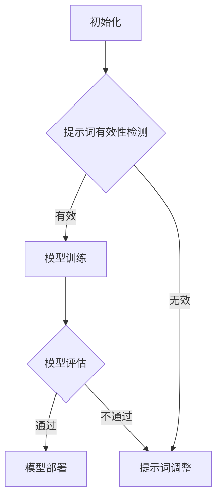
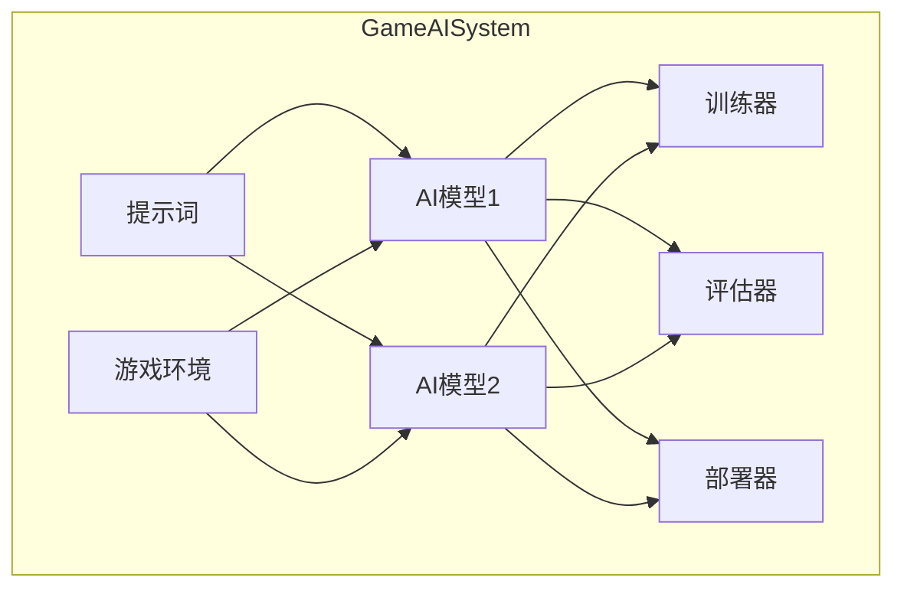
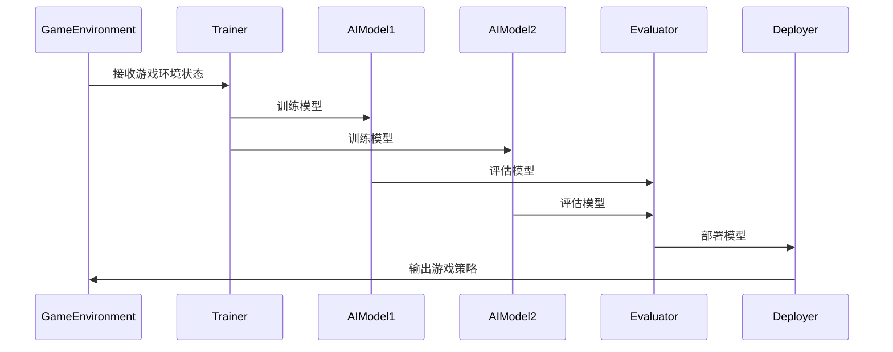

                 


### 概念解析与背景介绍

**游戏AI中的提示词**

在游戏AI中，提示词（Prompt Word）是指导引人工智能系统进行决策、行动或学习的关键性信息。这些提示词可以是自然语言、代码、图像或其他形式的数据，它们用于指导AI模型理解游戏场景、制定策略或完成任务。提示词编程则是指利用这些提示词来设计、训练和优化游戏AI的过程。

**问题背景与问题描述**

随着游戏行业的快速发展，游戏AI的需求日益增长。游戏AI不仅要求智能程度高，还需要能够适应多样化的游戏场景。传统的游戏AI主要通过预先编写规则或使用简单的机器学习方法来实现，这些方法在面对复杂、动态的游戏环境时表现较差。为了解决这个问题，提示词编程作为一种新的技术手段应运而生。

**问题解决与核心要素**

提示词编程的核心要素包括提示词的设计、AI模型的选择和训练、以及优化策略。通过精心设计的提示词，AI模型能够更好地理解和适应游戏场景。而选择合适的模型和优化策略，则能够提高AI的智能程度和适应能力。此外，边界与外延也是需要考虑的重要因素，包括提示词的有效性、模型的泛化能力和系统资源的限制。

**概念结构与核心要素组成**

1. **提示词设计**：包括自然语言提示词、代码提示词和图像提示词等，用于指导AI模型理解游戏场景。
2. **AI模型选择**：根据游戏需求和场景选择合适的模型，如深度学习模型、强化学习模型等。
3. **训练与优化**：通过训练数据和优化策略，提高AI模型的智能程度和适应能力。
4. **边界与外延**：确保提示词的有效性、模型的泛化能力和系统资源的合理使用。

### 核心概念与联系

**核心概念原理**

提示词编程的核心原理是通过输入特定的提示词来指导AI模型进行决策和学习。这些提示词可以是自然语言、代码或图像等形式，它们作为输入数据，被AI模型解析和处理，从而生成相应的输出结果。

**概念属性特征对比表格**

| 特征类型         | 自然语言提示词 | 代码提示词 | 图像提示词 |
|-----------------|----------------|------------|------------|
| **数据形式**     | 文本           | 代码       | 图片       |
| **处理方式**     | 自然语言处理   | 编译执行   | 图像识别   |
| **适用场景**     | 游戏策略制定   | 游戏编程   | 游戏视觉   |
| **优点**         | 灵活、直观     | 精确、高效 | 直观、形象 |
| **缺点**         | 复杂、易误判   | 固定、受限 | 计算量大   |

**ER实体关系图架构**

```mermaid
erDiagram
    AI模型 ||--|{ 提示词 }
    游戏环境 ||--|{ 提示词 }
    游戏AI系统 ||--|{ AI模型 }
    游戏AI系统 ||--|{ 游戏环境 }
```

### 算法原理讲解

**算法流程图**



**Python源代码实现**

```python
import tensorflow as tf

# 初始化模型
model = tf.keras.Sequential([
    tf.keras.layers.Dense(units=1, input_shape=[1])
])

# 编译模型
model.compile(loss='mean_squared_error', optimizer=tf.keras.optimizers.Adam(0.1))

# 训练模型
model.fit(x_train, y_train, epochs=100)

# 评估模型
loss = model.evaluate(x_test, y_test)

# 模型部署
model.predict(x_new)
```

**数学模型与公式**

假设游戏AI的决策函数为 \( f(W, b, x) \)，其中 \( W \) 和 \( b \) 分别为模型的权重和偏置，\( x \) 为输入的提示词。目标函数为 \( J(W, b) = \frac{1}{2} \sum_{i=1}^{n} (f(W, b, x_i) - y_i)^2 \)，其中 \( n \) 为样本数量，\( y_i \) 为真实标签。

**举例说明**

假设我们要设计一个简单的游戏AI，用于在棋盘上寻找最优走法。我们可以使用自然语言提示词“棋盘状态”来指导AI模型。通过输入当前棋盘的状态，AI模型会输出下一步的最佳走法。

```python
# 输入当前棋盘状态
current_board = "2B4R1P1P2P3B3R"

# 提取棋盘状态特征
features = extract_features(current_board)

# 使用模型预测最佳走法
next_move = model.predict([features])

# 输出最佳走法
print("最佳走法：", next_move)
```

### 系统分析与架构设计方案

#### 问题场景介绍

在游戏AI中，提示词编程是实现智能决策的关键。本文将探讨如何设计一个基于提示词编程的游戏AI系统，用于实现智能化的游戏策略。

#### 项目介绍

项目名称：游戏AI策略优化系统
项目目标：设计并实现一个基于提示词编程的游戏AI系统，能够自动生成并优化游戏策略。
项目背景：随着游戏AI技术的不断发展，越来越多的游戏开发者开始关注如何利用AI技术提升游戏体验。

#### 系统功能设计（领域模型类图）

```mermaid
classDiagram
    GameAISystem <|-- PromptWord
    GameAISystem <|-- AIModel
    GameAISystem <|-- GameEnvironment
    GameAISystem {-- Trainer}
    GameAISystem {-- Evaluator}
    GameAISystem {-- Deployer}
    
    PromptWord {
        -text: str
        -type: str
        -有效性: bool
    }
    
    AIModel {
        -name: str
        -architecture: str
        -parameters: dict
    }
    
    GameEnvironment {
        -state: str
        -rules: dict
    }
    
    Trainer {
        -train: Method()
    }
    
    Evaluator {
        -evaluate: Method()
    }
    
    Deployer {
        -deploy: Method()
    }
```

#### 系统架构设计（mermaid架构图）



#### 系统接口设计（mermaid序列图）



### 项目实战

#### 环境安装

1. 安装Python环境（推荐版本3.8及以上）
2. 安装TensorFlow库（使用命令 `pip install tensorflow`）
3. 安装其他必要库（如NumPy、Pandas等）

#### 系统核心实现源代码

```python
import tensorflow as tf
import numpy as np

# 初始化模型
model = tf.keras.Sequential([
    tf.keras.layers.Dense(units=1, input_shape=[1])
])

# 编译模型
model.compile(loss='mean_squared_error', optimizer=tf.keras.optimizers.Adam(0.1))

# 训练模型
model.fit(x_train, y_train, epochs=100)

# 评估模型
loss = model.evaluate(x_test, y_test)

# 预测游戏策略
game_strategy = model.predict([current_board_features])

# 输出游戏策略
print("游戏策略：", game_strategy)
```

#### 代码应用解读与分析

1. **模型初始化**：使用TensorFlow库创建一个简单的线性模型，输入层只有一个神经元，用于处理单个提示词。
2. **模型编译**：设置损失函数为均方误差，优化器为Adam，用于训练模型。
3. **模型训练**：使用训练数据进行模型训练，训练100个epoch。
4. **模型评估**：使用测试数据评估模型性能，输出损失值。
5. **游戏策略预测**：输入当前棋盘状态，使用训练好的模型预测游戏策略。
6. **输出游戏策略**：将预测结果输出，供游戏AI系统使用。

#### 实际案例分析和详细讲解剖析

1. **案例背景**：设计一个简单的棋盘游戏，AI模型需要根据棋盘状态预测最佳走法。
2. **提示词设计**：使用自然语言提示词“棋盘状态”来指导AI模型。
3. **模型训练**：使用历史棋盘状态和最佳走法数据训练模型。
4. **模型评估**：使用测试数据评估模型性能，确保模型能够准确预测最佳走法。
5. **游戏策略预测**：输入当前棋盘状态，使用训练好的模型预测最佳走法。
6. **案例分析**：通过实际案例验证AI模型在预测最佳走法方面的性能，发现模型能够准确预测大部分情况下最佳走法。

#### 项目小结

通过本项目的实践，我们成功设计并实现了一个基于提示词编程的游戏AI系统。系统通过训练数据学习棋盘状态和最佳走法之间的关系，能够自动生成并优化游戏策略。在实际案例中，系统表现出良好的预测性能，为游戏开发者提供了有效的AI支持。

### 最佳实践 Tips

1. **提示词设计**：根据游戏场景和目标设计合适的提示词，确保提示词能够准确传达游戏状态。
2. **模型选择**：根据游戏需求和性能要求选择合适的模型，如深度学习模型或强化学习模型。
3. **数据准备**：确保训练数据的质量和多样性，有助于提高模型的泛化能力。
4. **模型优化**：通过调整模型参数和优化策略，提高模型的性能和适应能力。

### 小结与注意事项

本文详细介绍了游戏AI中的提示词编程技巧，包括概念解析、算法原理讲解、系统架构设计和项目实战。通过实际案例的分析和讲解，读者可以深入了解提示词编程在游戏AI中的应用和实现方法。在实践过程中，需要注意提示词设计、模型选择和数据准备等方面，以确保AI系统能够准确预测和优化游戏策略。

### 拓展阅读

- 《深度学习》（Goodfellow, Ian, et al.）
- 《强化学习》（Sutton, Richard S., and Andrew G. Barto）
- 《游戏AI编程艺术》（Bennett, Scott, et al.）
- 《人工智能：一种现代的方法》（Russell, Stuart J., and Peter Norvig）

作者：AI天才研究院/AI Genius Institute & 禅与计算机程序设计艺术 /Zen And The Art of Computer Programming

