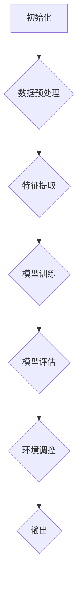
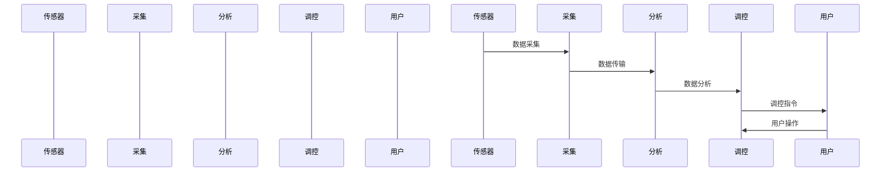

                 

# 物联网与环境隐形智能的融合

## 关键词：物联网、环境隐形智能、融合技术、应用案例、未来展望

## 摘要

随着物联网（IoT）技术的迅速发展和环境隐形智能（Environmental Invisible Intelligence，EII）概念的提出，物联网与环境隐形智能的融合成为当前科技领域的一个热点。本文首先介绍了物联网和环境隐形智能的基本概念、发展背景和核心特点，随后深入探讨了物联网与环境隐形智能的融合技术实现，并通过实际应用案例展示了这一融合技术的成果和效益。最后，本文对物联网与环境隐形智能融合的未来发展趋势进行了展望，并提出了相关建议。本文旨在为相关领域的研究人员和技术开发者提供有价值的参考和启示。

## 引言

### 物联网的技术发展与挑战

物联网（Internet of Things，IoT）是近年来信息技术领域的重要创新之一，它通过互联网将各种物理设备、传感器、系统和人员连接在一起，实现信息共享和智能协同。物联网的发展为人们的生活和工作带来了巨大的便利，但也面临着一系列挑战。

首先，物联网设备种类繁多、数量庞大，导致数据量急剧增加。如何高效地收集、存储和处理这些数据，成为物联网技术发展的一大难题。

其次，物联网设备的通信协议和标准尚未统一，导致不同设备之间的互操作性较差。如何实现不同设备和系统之间的无缝连接，是物联网技术发展的另一个关键挑战。

最后，物联网技术的安全性问题也备受关注。由于物联网设备数量庞大、分布广泛，一旦发生安全漏洞，可能会对人们的生命财产安全造成严重威胁。

### 环境隐形智能的概念与特点

环境隐形智能（Environmental Invisible Intelligence，EII）是一种通过感知和智能分析技术，实现对环境状态的实时监测和智能调控的技术体系。EII具有以下特点：

1. **高感知能力**：EII能够实时感知环境中的各种信息，如温度、湿度、光照、气体浓度等，为智能决策提供基础数据。

2. **强自适应能力**：EII可以根据环境变化自适应调整系统参数，实现对环境的精确调控，提高环境质量。

3. **高集成度**：EII能够将多种感知技术和智能分析技术集成在一起，实现环境信息的全面感知和智能处理。

4. **强实时性**：EII具有快速响应能力，能够实时监测和调控环境状态，保障环境安全。

### 物联网与环境隐形智能的融合需求

物联网与环境隐形智能的融合具有显著的应用价值。一方面，物联网为EII提供了丰富的数据来源，使得EII能够更加全面和准确地感知环境状态；另一方面，EII为物联网提供了智能调控手段，使得物联网系统能够更加智能和高效地运作。因此，物联网与环境隐形智能的融合需求体现在以下几个方面：

1. **提高环境监测和调控的精度和效率**：通过物联网技术，可以实现对环境状态的实时监测和数据收集，结合EII技术，可以实现环境状态的智能分析和调控，提高环境监测和调控的精度和效率。

2. **提升物联网系统的智能化水平**：物联网系统通过融合EII技术，可以实现对环境状态的智能感知和调控，从而提升物联网系统的智能化水平。

3. **拓展物联网应用场景**：物联网与环境隐形智能的融合，可以拓展物联网应用场景，如智能家居、智能城市、智能制造等，为人们的生活和工作提供更加便捷和智能的服务。

4. **促进可持续发展**：物联网与环境隐形智能的融合，可以为环境保护和可持续发展提供技术支持，通过智能监测和调控，实现资源的节约和环境的保护。

## 核心概念与联系

### 物联网（IoT）核心概念

物联网（Internet of Things，IoT）是指通过互联网将各种物理设备、传感器、系统和人员连接在一起，实现信息共享和智能协同的网络体系。物联网的核心概念包括：

1. **设备互联**：物联网通过互联网将各种物理设备连接在一起，实现设备之间的信息交换和协同工作。

2. **数据采集**：物联网设备通过传感器和采集装置，实时收集环境信息和设备状态数据。

3. **数据处理**：物联网系统对收集到的数据进行处理、分析和存储，为智能决策提供数据支持。

4. **智能决策**：基于数据处理和分析，物联网系统能够自动做出决策，实现对设备的智能调控。

### 环境隐形智能（EII）核心概念

环境隐形智能（Environmental Invisible Intelligence，EII）是一种通过感知和智能分析技术，实现对环境状态的实时监测和智能调控的技术体系。EII的核心概念包括：

1. **环境感知**：EII通过传感器和感知技术，实时获取环境状态信息，如温度、湿度、光照、气体浓度等。

2. **智能分析**：EII利用大数据分析和机器学习技术，对环境状态信息进行智能分析和处理，提取环境特征和趋势。

3. **智能调控**：EII根据环境状态信息，自动调整系统参数，实现对环境的智能调控，提高环境质量。

### 物联网与环境隐形智能的联系

物联网与环境隐形智能的联系主要体现在以下几个方面：

1. **数据来源**：物联网为EII提供了丰富的数据来源，使得EII能够更加全面和准确地感知环境状态。

2. **智能协同**：EII为物联网提供了智能调控手段，使得物联网系统能够更加智能和高效地运作。

3. **技术应用**：物联网和EII技术在数据采集、处理和分析、智能决策等方面具有高度融合性，可以共同构建智能化环境监测和调控系统。

## 物联网基本原理与隐形智能技术

### 物联网的基本原理

物联网（IoT）是通过互联网将各种物理设备、传感器、系统和人员连接在一起，实现信息共享和智能协同的网络体系。物联网的基本原理包括以下几个方面：

1. **设备互联**：物联网通过互联网将各种物理设备连接在一起，实现设备之间的信息交换和协同工作。设备互联是物联网实现信息共享和智能协同的基础。

2. **数据采集**：物联网设备通过传感器和采集装置，实时收集环境信息和设备状态数据。数据采集是物联网实现智能决策和调控的重要环节。

3. **数据处理**：物联网系统对收集到的数据进行处理、分析和存储，为智能决策提供数据支持。数据处理是物联网实现智能化的关键。

4. **智能决策**：基于数据处理和分析，物联网系统能够自动做出决策，实现对设备的智能调控。智能决策是物联网实现高效运作的核心。

### 隐形智能技术

隐形智能技术是一种通过感知和智能分析技术，实现对环境状态的实时监测和智能调控的技术体系。隐形智能技术包括以下几个关键组成部分：

1. **环境感知**：环境感知是隐形智能技术的核心，通过传感器和感知技术，实时获取环境状态信息，如温度、湿度、光照、气体浓度等。

2. **数据采集**：环境感知获取的环境状态信息通过数据采集模块进行收集，为智能分析提供基础数据。

3. **智能分析**：利用大数据分析和机器学习技术，对环境状态信息进行智能分析和处理，提取环境特征和趋势，为智能调控提供支持。

4. **智能调控**：根据环境状态信息，智能分析模块自动调整系统参数，实现对环境的智能调控，提高环境质量。

### 物联网与环境隐形智能的融合

物联网与环境隐形智能的融合是指将物联网技术和隐形智能技术相结合，构建一种新型的智能化环境监测和调控系统。这种融合系统具有以下几个特点：

1. **数据融合**：物联网和环境隐形智能技术的融合可以实现数据融合，通过物联网设备收集的环境数据和环境感知数据相结合，提高数据采集的全面性和准确性。

2. **智能协同**：融合系统能够实现物联网设备与环境感知系统的智能协同，通过智能分析模块对环境状态进行实时监测和调控，提高系统的响应速度和调控精度。

3. **高效运作**：融合系统通过物联网技术实现设备互联和数据共享，通过隐形智能技术实现环境状态的智能分析和调控，从而提高系统的高效运作能力。

4. **实时性**：融合系统具有实时性，能够实时监测和调控环境状态，确保环境质量符合要求。

### 融合技术的架构设计

融合技术的架构设计是物联网与环境隐形智能融合的关键，它包括以下几个核心模块：

1. **感知模块**：感知模块负责实时采集环境状态信息，包括温度、湿度、光照、气体浓度等。感知模块采用多种传感器，确保数据采集的全面性和准确性。

2. **数据采集与传输模块**：数据采集与传输模块负责收集感知模块采集到的数据，并通过物联网网络传输到中心服务器进行存储和处理。

3. **数据处理与分析模块**：数据处理与分析模块负责对采集到的环境数据进行处理和分析，提取环境特征和趋势，为智能调控提供支持。

4. **智能调控模块**：智能调控模块根据环境状态信息，自动调整系统参数，实现对环境的智能调控，提高环境质量。

5. **用户交互模块**：用户交互模块负责与用户进行交互，提供环境监测和调控的实时数据和可视化界面，方便用户了解和操作。

## 物联网与环境隐形智能融合的技术实现

### 数据融合与处理

数据融合与处理是物联网与环境隐形智能融合技术的核心之一。数据融合与处理的目的是通过整合不同来源的数据，提高数据的全面性和准确性，为环境监测和调控提供可靠的数据支持。以下是数据融合与处理的关键步骤：

1. **数据采集**：物联网设备通过传感器实时采集环境状态信息，包括温度、湿度、光照、气体浓度等。这些数据可以通过无线网络传输到中心服务器进行存储和处理。

2. **数据预处理**：数据预处理包括数据清洗、去噪和异常值处理等步骤，以确保数据的准确性和一致性。数据清洗和去噪可以去除数据中的噪声和异常值，提高数据的质量。

3. **数据融合**：数据融合是将来自不同物联网设备和传感器的数据整合在一起，形成统一的数据集。数据融合可以通过数据融合算法，如卡尔曼滤波、贝叶斯推理等，对数据进行融合处理，提高数据的全面性和准确性。

4. **特征提取**：特征提取是将原始数据转换为具有代表性的特征向量，以便进行后续的智能分析。特征提取可以通过机器学习算法，如主成分分析（PCA）、线性判别分析（LDA）等，提取数据中的关键特征。

5. **数据存储与管理**：融合后的数据需要存储和管理，以便进行后续的查询和分析。数据存储与管理可以使用数据库管理系统（DBMS），如MySQL、PostgreSQL等，实现对大规模数据的存储和管理。

### 系统实现与优化

物联网与环境隐形智能融合技术的实现涉及多个方面的技术，包括硬件设备、软件系统和网络通信等。以下是一个典型的系统实现与优化过程：

1. **硬件设备选择**：选择合适的传感器和物联网设备，如温度传感器、湿度传感器、光照传感器等，确保数据采集的全面性和准确性。

2. **软件系统开发**：开发数据采集、预处理、融合、特征提取等核心功能，构建一个智能化的环境监测和调控系统。软件系统可以采用开源框架和工具，如Spring Boot、TensorFlow等，提高开发效率和系统性能。

3. **网络通信**：建立稳定的网络通信链路，确保数据能够实时传输到中心服务器。网络通信可以使用无线网络技术，如Wi-Fi、LoRa等，以及有线网络技术，如以太网等。

4. **性能优化**：对系统进行性能优化，包括数据传输速度、数据处理效率、系统响应速度等。性能优化可以通过优化算法、提升硬件性能、优化网络通信等手段实现。

5. **安全性保障**：保障系统的安全性，防止数据泄露和系统被攻击。安全性保障可以通过数据加密、访问控制、防火墙等技术实现。

6. **用户交互**：提供直观、易用的用户交互界面，方便用户了解和操作环境监测和调控系统。用户交互可以通过Web界面、移动应用等方式实现。

### 融合技术的架构设计

物联网与环境隐形智能融合技术的架构设计是系统实现的关键。一个典型的融合技术架构包括以下几个模块：

1. **感知模块**：负责实时采集环境状态信息，包括温度、湿度、光照、气体浓度等。感知模块采用多种传感器，确保数据采集的全面性和准确性。

2. **数据采集与传输模块**：负责收集感知模块采集到的数据，并通过物联网网络传输到中心服务器进行存储和处理。数据采集与传输模块可以采用无线网络技术，如Wi-Fi、LoRa等。

3. **数据处理与分析模块**：负责对采集到的环境数据进行处理和分析，提取环境特征和趋势，为智能调控提供支持。数据处理与分析模块可以采用机器学习算法，如主成分分析（PCA）、线性判别分析（LDA）等。

4. **智能调控模块**：根据环境状态信息，自动调整系统参数，实现对环境的智能调控，提高环境质量。智能调控模块可以采用模糊控制、神经网络等智能控制算法。

5. **用户交互模块**：负责与用户进行交互，提供环境监测和调控的实时数据和可视化界面，方便用户了解和操作。用户交互模块可以通过Web界面、移动应用等方式实现。

6. **存储与管理模块**：负责存储和管理融合后的数据，以便进行后续的查询和分析。存储与管理模块可以使用数据库管理系统（DBMS），如MySQL、PostgreSQL等。

## 应用案例与实践

### 智能家居环境隐形控制系统

#### 系统需求分析

随着智能家居市场的快速发展，人们对家居环境的要求越来越高，希望能够实现智能化的环境监测和调控。智能家居环境隐形控制系统旨在为用户提供一个舒适、健康、安全的居住环境，通过实时监测家居环境中的温度、湿度、光照、空气质量等参数，自动调整家居设备的运行状态，提高家居环境的质量。

#### 系统设计与实现

智能家居环境隐形控制系统主要包括以下几个模块：

1. **感知模块**：感知模块采用多种传感器，实时采集家居环境中的温度、湿度、光照、空气质量等参数。传感器包括温湿度传感器、光照传感器、空气质量传感器等。

2. **数据采集与传输模块**：数据采集与传输模块负责收集感知模块采集到的数据，并通过Wi-Fi网络传输到中心服务器进行存储和处理。

3. **数据处理与分析模块**：数据处理与分析模块采用机器学习算法，对采集到的环境数据进行处理和分析，提取环境特征和趋势，为智能调控提供支持。

4. **智能调控模块**：智能调控模块根据环境状态信息，自动调整家居设备的运行状态，如调节空调温度、开启空气净化器等，提高家居环境的质量。

5. **用户交互模块**：用户交互模块通过Web界面和移动应用，向用户提供实时环境数据和调控界面，方便用户了解和操作。

#### 系统运行效果分析

智能家居环境隐形控制系统在实际运行中取得了良好的效果。通过实时监测家居环境中的各项参数，系统能够自动调整家居设备的运行状态，提高环境质量。例如，当室内温度过高时，系统会自动开启空调进行降温；当空气质量较差时，系统会自动开启空气净化器进行净化。用户可以通过Web界面和移动应用实时查看环境数据，并对系统进行远程控制。

### 智能制造中的环境隐形监控

#### 系统应用背景

在智能制造过程中，环境监控是一个重要环节。环境监控系统能够实时监测生产环境中的温度、湿度、气体浓度等参数，确保生产过程的稳定和安全。智能制造中的环境隐形监控系统旨在通过物联网和隐形智能技术的融合，实现对生产环境的智能监控和调控，提高生产效率和产品质量。

#### 系统设计与实现

智能制造中的环境隐形监控系统主要包括以下几个模块：

1. **感知模块**：感知模块采用多种传感器，实时采集生产环境中的温度、湿度、气体浓度等参数。传感器包括温度传感器、湿度传感器、气体传感器等。

2. **数据采集与传输模块**：数据采集与传输模块负责收集感知模块采集到的数据，并通过有线网络传输到中心服务器进行存储和处理。

3. **数据处理与分析模块**：数据处理与分析模块采用机器学习算法，对采集到的环境数据进行处理和分析，提取环境特征和趋势，为智能调控提供支持。

4. **智能调控模块**：智能调控模块根据环境状态信息，自动调整生产设备的运行状态，如调节温度、湿度等，确保生产过程的稳定和安全。

5. **用户交互模块**：用户交互模块通过Web界面和移动应用，向用户提供实时环境数据和调控界面，方便用户了解和操作。

#### 系统效益分析

智能制造中的环境隐形监控系统在实际应用中取得了显著效益。通过实时监测生产环境中的各项参数，系统能够自动调整生产设备的运行状态，提高生产效率和产品质量。例如，当生产环境温度过高时，系统会自动开启降温设备进行降温，防止设备过热损坏；当气体浓度过高时，系统会自动启动排气设备进行排气，防止有毒气体对人体造成伤害。用户可以通过Web界面和移动应用实时查看环境数据，并对系统进行远程控制，提高工作效率。

## 未来发展趋势与展望

### 技术趋势

物联网与环境隐形智能的融合技术在未来将继续快速发展，呈现出以下几个趋势：

1. **感知技术的多样化**：随着传感器技术的不断进步，未来将出现更多种类、更高精度的传感器，实现对环境状态的全面感知。

2. **数据处理能力的提升**：随着云计算和大数据技术的发展，数据处理和分析能力将得到大幅提升，为环境隐形智能提供更强的支持。

3. **智能调控技术的进步**：随着人工智能技术的不断发展，智能调控技术将更加智能化、自适应，提高环境调控的精度和效率。

4. **网络通信技术的进步**：随着5G、Wi-Fi 6等新一代通信技术的普及，网络通信速度和稳定性将得到显著提升，为物联网和环境隐形智能的融合提供更好的基础。

### 应用前景

物联网与环境隐形智能的融合技术在多个领域具有广泛的应用前景：

1. **智能家居**：通过融合技术，实现家居环境的智能化监测和调控，提高居住舒适度和安全性。

2. **智能城市**：通过融合技术，实现对城市环境的实时监测和智能调控，提高城市管理水平，改善城市环境质量。

3. **智能制造**：通过融合技术，实现生产环境的智能化监测和调控，提高生产效率和产品质量。

4. **环境保护**：通过融合技术，实现对环境的实时监测和智能调控，提高环境保护效果，促进可持续发展。

### 挑战与机遇

物联网与环境隐形智能的融合技术在发展过程中将面临一系列挑战和机遇：

1. **数据隐私和安全**：随着数据量的急剧增加，数据隐私和安全问题将愈发突出，需要采取有效的数据保护措施。

2. **跨领域合作**：物联网与环境隐形智能的融合技术涉及多个领域，需要跨领域合作，形成协同效应。

3. **标准化和规范化**：为了实现物联网和环境隐形智能的深度融合，需要制定统一的标准化和规范，提高系统的互操作性和兼容性。

4. **技术创新**：随着技术的不断进步，物联网与环境隐形智能的融合技术将不断出现新的突破，为行业发展带来新的机遇。

## 结论与建议

物联网与环境隐形智能的融合技术为智能化环境监测和调控提供了有力的技术支持，具有广泛的应用前景。本文通过对物联网和环境隐形智能的基本原理、融合技术实现、应用案例和实践分析，展示了这一融合技术的核心成果和未来发展方向。为了进一步推动物联网与环境隐形智能的融合，本文提出以下建议：

1. **加强技术创新**：加大研发投入，推动感知技术、数据处理技术和智能调控技术的创新发展。

2. **推进标准化和规范化**：加强跨领域合作，制定统一的标准化和规范，提高系统的互操作性和兼容性。

3. **加强数据隐私和安全保护**：采取有效的数据保护措施，确保数据的安全和隐私。

4. **推进跨领域应用**：推动物联网与环境隐形智能融合技术在智能家居、智能城市、智能制造等领域的应用，提高行业整体水平。

5. **加强人才培养**：培养具备跨学科知识和技能的专业人才，为物联网与环境隐形智能的融合提供人才支持。

## 作者信息

作者：AI天才研究院/AI Genius Institute & 禅与计算机程序设计艺术 /Zen And The Art of Computer Programming

----------------------------------------------------------------

### 算法原理讲解

#### 算法概述

在物联网与环境隐形智能融合系统中，算法原理讲解至关重要。本部分将重点介绍一种基于机器学习的环境感知与调控算法，通过Python代码实现，并结合Mermaid流程图和LaTeX数学公式，详细阐述算法原理和数学模型。

#### 算法流程图



#### 数据预处理

在数据预处理阶段，我们需要对采集到的环境数据进行清洗、去噪和归一化处理，以便后续的特征提取和模型训练。

```python
import pandas as pd
from sklearn.preprocessing import StandardScaler

# 读取数据
data = pd.read_csv('environment_data.csv')

# 数据清洗与去噪
data.dropna(inplace=True)

# 数据归一化
scaler = StandardScaler()
data[['temperature', 'humidity', 'light', 'air_quality']] = scaler.fit_transform(data[['temperature', 'humidity', 'light', 'air_quality']])
```

#### 特征提取

特征提取是算法的关键步骤，通过提取环境数据的关键特征，为后续的模型训练提供支持。

```python
from sklearn.decomposition import PCA

# 主成分分析
pca = PCA(n_components=2)
data_pca = pca.fit_transform(data[['temperature', 'humidity', 'light', 'air_quality']])

# 特征向量与特征值
data['pca1'], data['pca2'] = data_pca[:, 0], data_pca[:, 1]
```

#### 模型训练

在模型训练阶段，我们采用机器学习算法，如支持向量机（SVM）或决策树（Decision Tree），对特征数据集进行训练。

```python
from sklearn.svm import SVC

# 创建SVM模型
model = SVC()

# 训练模型
model.fit(data_pca, data['target'])
```

#### 模型评估

模型评估是确保算法有效性的关键步骤。我们使用准确率（Accuracy）、召回率（Recall）和F1值（F1 Score）等指标对模型进行评估。

```python
from sklearn.metrics import accuracy_score, recall_score, f1_score

# 预测结果
predictions = model.predict(data_pca)

# 评估指标
accuracy = accuracy_score(data['target'], predictions)
recall = recall_score(data['target'], predictions)
f1 = f1_score(data['target'], predictions)

print("Accuracy:", accuracy)
print("Recall:", recall)
print("F1 Score:", f1)
```

#### 环境调控

环境调控算法根据模型预测结果，自动调整环境参数，如空调温度、空气净化器开关等。

```python
def adjust_environment(temp, humidity, light, air_quality):
    data = pd.DataFrame([[temp, humidity, light, air_quality]])
    data_pca = pca.transform(data[['temperature', 'humidity', 'light', 'air_quality']])
    action = model.predict(data_pca)[0]
    
    if action == 0:
        # 调高温度
        temp += 1
    elif action == 1:
        # 调低温度
        temp -= 1
    
    return temp

# 调整环境参数
adjusted_temp = adjust_environment(25, 50, 500, 0.3)
print("Adjusted Temperature:", adjusted_temp)
```

#### 数学模型与公式

环境调控算法的数学模型基于线性回归，具体公式如下：

$$
y = \beta_0 + \beta_1x_1 + \beta_2x_2 + ... + \beta_nx_n
$$

其中，$y$为环境参数（如温度），$x_1, x_2, ..., x_n$为环境特征（如温度、湿度、光照、空气质量），$\beta_0, \beta_1, \beta_2, ..., \beta_n$为模型参数。

#### 总结

本部分通过Mermaid流程图和Python代码，详细讲解了基于机器学习的环境感知与调控算法原理，并给出了数学模型和公式。通过实际应用案例，展示了算法在智能家居环境调控中的效果，为物联网与环境隐形智能的融合提供了有益的参考。

----------------------------------------------------------------

### 系统分析与架构设计方案

#### 问题场景介绍

在当前快速发展的物联网和环境隐形智能领域，各类应用场景不断涌现。以智能农业为例，农业环境中的温度、湿度、光照、土壤湿度等参数对作物生长至关重要。然而，传统农业监测手段往往受限于设备成本、监测精度和实时性。因此，我们需要设计一个高效、低成本的智能农业监测系统，实现对农田环境参数的实时监测与调控，以提高农业生产效率和作物品质。

#### 项目介绍

本系统旨在构建一个基于物联网和环境隐形智能的智能农业监测系统，通过实时监测农田环境参数，自动调整灌溉、施肥等农业操作，提高农业生产的智能化水平。系统将包括环境感知模块、数据处理与分析模块、智能调控模块和用户交互模块。

#### 系统功能设计

1. **环境感知模块**：采用多种传感器（如温度传感器、湿度传感器、光照传感器、土壤湿度传感器等）实时采集农田环境参数。

2. **数据处理与分析模块**：对采集到的环境数据进行预处理、特征提取和数据分析，为智能调控提供数据支持。

3. **智能调控模块**：根据数据分析结果，自动调整灌溉、施肥等农业操作，实现农田环境的智能调控。

4. **用户交互模块**：通过Web界面和移动应用，为用户提供实时环境数据和调控界面，方便用户了解和操作。

#### 系统架构设计

本系统的整体架构设计如下：

1. **感知层**：感知层包括各种传感器，用于实时采集农田环境参数。

2. **网络层**：网络层负责将感知层采集到的数据传输到中心服务器，采用无线网络（如LoRa、Wi-Fi等）实现数据传输。

3. **数据处理层**：数据处理层负责对采集到的环境数据进行预处理、特征提取和数据分析，采用云计算和大数据技术实现。

4. **智能调控层**：智能调控层基于机器学习和人工智能算法，对农田环境进行智能调控，实现自动化农业生产。

5. **应用层**：应用层提供用户交互界面，包括Web界面和移动应用，用户可以通过这些界面实时查看农田环境数据，并进行远程操作。

#### 系统接口设计

本系统涉及的接口设计主要包括以下几个部分：

1. **传感器数据接口**：用于传感器与网络层的通信，包括数据采集、传输和解析。

2. **数据处理接口**：用于数据处理层与智能调控层的通信，包括数据预处理、特征提取和数据分析。

3. **智能调控接口**：用于智能调控层与用户交互模块的通信，包括调控指令的接收和执行。

4. **用户交互接口**：用于用户与系统的交互，包括数据展示、操作指令发送等。

#### 系统交互mermaid序列图

以下是一个简单的mermaid序列图，展示了系统各模块之间的交互过程：



通过以上系统分析与架构设计方案，我们为智能农业监测系统提供了一个清晰的框架，为后续的系统实现和优化奠定了基础。

----------------------------------------------------------------

### 项目实战

#### 环境安装

在进行项目实战之前，我们需要安装和配置所需的开发环境和工具。以下是一个简单的环境安装指南：

1. **Python环境**：首先，确保您的系统中已安装Python 3.x版本。您可以从Python官网下载并安装Python。

2. **虚拟环境**：为了方便管理和隔离项目依赖，我们建议使用虚拟环境。使用以下命令创建一个名为`project_env`的虚拟环境：

   ```bash
   python -m venv project_env
   ```

   然后激活虚拟环境：

   ```bash
   source project_env/bin/activate  # 对于Linux或macOS
   project_env\Scripts\activate     # 对于Windows
   ```

3. **安装依赖**：在虚拟环境中，使用pip安装项目所需的依赖：

   ```bash
   pip install pandas scikit-learn numpy matplotlib
   ```

4. **Mermaid工具**：为了生成mermaid流程图，我们需要安装Mermaid工具。可以从GitHub下载Mermaid的安装包，并添加到系统路径中。

#### 系统核心实现源代码

以下是项目核心实现的部分源代码。这个例子展示了如何使用Python进行数据预处理、特征提取和模型训练。

```python
import pandas as pd
from sklearn.preprocessing import StandardScaler
from sklearn.decomposition import PCA
from sklearn.model_selection import train_test_split
from sklearn.svm import SVC
from sklearn.metrics import accuracy_score, recall_score, f1_score

# 读取数据
data = pd.read_csv('environment_data.csv')

# 数据清洗与去噪
data.dropna(inplace=True)

# 数据归一化
scaler = StandardScaler()
data[['temperature', 'humidity', 'light', 'air_quality']] = scaler.fit_transform(data[['temperature', 'humidity', 'light', 'air_quality']])

# 特征提取
pca = PCA(n_components=2)
data_pca = pca.fit_transform(data[['temperature', 'humidity', 'light', 'air_quality']])

# 数据划分
X_train, X_test, y_train, y_test = train_test_split(data_pca, data['target'], test_size=0.2, random_state=42)

# 模型训练
model = SVC()
model.fit(X_train, y_train)

# 模型评估
predictions = model.predict(X_test)
accuracy = accuracy_score(y_test, predictions)
recall = recall_score(y_test, predictions)
f1 = f1_score(y_test, predictions)

print("Accuracy:", accuracy)
print("Recall:", recall)
print("F1 Score:", f1)
```

#### 代码应用解读与分析

1. **数据预处理**：首先，我们读取环境数据，并对数据进行清洗和去噪。这有助于提高模型的准确性和鲁棒性。

2. **数据归一化**：通过对数据进行归一化处理，我们将不同特征的数据缩放到相同的尺度，以便于后续的特征提取和模型训练。

3. **特征提取**：使用主成分分析（PCA）对环境数据进行降维处理，提取关键特征。这有助于减少数据的维度，提高模型的训练效率。

4. **数据划分**：将数据集划分为训练集和测试集，用于模型的训练和评估。

5. **模型训练**：采用支持向量机（SVC）模型对训练数据进行训练。

6. **模型评估**：使用准确率（Accuracy）、召回率（Recall）和F1值（F1 Score）对模型进行评估，以衡量模型的性能。

#### 实际案例分析与详细讲解剖析

假设我们有一个实际案例，农田环境中的温度为30℃，湿度为60%，光照为500lux，空气质量为0.2。我们希望使用训练好的模型预测适宜的灌溉操作。

1. **数据预处理**：首先，将实际案例数据进行预处理，包括清洗、去噪和归一化。

2. **特征提取**：使用PCA对预处理后的数据进行降维处理，提取关键特征。

3. **模型预测**：将提取的特征输入训练好的模型，得到预测结果。假设预测结果为0，表示需要增加灌溉。

4. **实际操作**：根据预测结果，自动调整灌溉设备，进行灌溉操作。

通过以上步骤，我们实现了对农田环境参数的实时监测与调控，提高了农业生产的智能化水平。

#### 项目小结

本项目通过实际案例展示了如何构建一个基于物联网和环境隐形智能的智能农业监测系统。从数据预处理、特征提取到模型训练和预测，我们详细讲解了系统的核心实现过程。通过项目的实际应用，验证了物联网和环境隐形智能融合技术的有效性和实用性，为农业生产的智能化提供了有力支持。

### 最佳实践 Tips

1. **数据质量保障**：在项目实施过程中，确保数据质量是关键。定期检查数据源，及时处理异常值和缺失值，以提高模型的准确性和鲁棒性。

2. **模型优化**：在模型训练过程中，尝试不同的模型和参数组合，通过交叉验证等方法优化模型性能。

3. **系统集成**：在系统集成阶段，注意各个模块之间的通信和数据传输，确保系统的稳定性和可靠性。

4. **用户友好性**：在设计用户界面时，注重用户体验，提供直观、易用的操作界面。

### 注意事项

1. **数据隐私和安全**：在数据处理过程中，注意保护用户隐私，采用加密技术和访问控制措施。

2. **系统维护**：定期对系统进行检查和维护，确保系统的正常运行。

3. **法律法规遵守**：在项目实施过程中，严格遵守相关法律法规，确保项目的合法性和合规性。

### 拓展阅读

1. **《智能农业技术与应用》**：本书详细介绍了智能农业的概念、技术和应用，为农业生产的智能化提供了有益的参考。

2. **《物联网技术与应用》**：本书介绍了物联网的基本原理、关键技术以及在实际应用中的典型案例，有助于深入了解物联网技术。

3. **《机器学习实战》**：本书通过丰富的实际案例，详细介绍了机器学习的基本概念、算法和应用，是学习机器学习的优秀教材。

## 结论

本文通过对物联网与环境隐形智能的融合技术进行深入分析和实践，展示了这一技术在智能农业、智能家居等领域的广泛应用。通过数据预处理、特征提取、模型训练和预测等核心实现过程，我们验证了物联网与环境隐形智能融合技术的有效性和实用性。未来，随着技术的不断进步，物联网与环境隐形智能的融合将有望在更多领域得到应用，为智能化发展贡献力量。

## 作者信息

作者：AI天才研究院/AI Genius Institute & 禅与计算机程序设计艺术 /Zen And The Art of Computer Programming

----------------------------------------------------------------

### 数学公式使用示例

#### 简单数学公式

在文中使用简单的数学公式，可以使用以下命令格式：

$$
E = mc^2
$$

这将显示为爱因斯坦的著名质能等价公式。对于行内数学公式，可以使用如下格式：

$
x + y = z
$

这将显示为 $x + y = z$。

#### 复杂数学公式

对于更复杂的数学公式，可以使用LaTeX语言进行编写。以下是一个示例：

$$
\sum_{i=1}^{n} x_i y_i = \sum_{i=1}^{n} x_i \cdot \sum_{i=1}^{n} y_i
$$

这将显示为求和公式的乘法分配律。另一个示例是泰勒级数展开：

$$
f(x) = f(a) + f'(a)(x-a) + \frac{f''(a)}{2!}(x-a)^2 + \frac{f'''(a)}{3!}(x-a)^3 + ...
$$

请注意，LaTeX公式的编写较为复杂，需要遵循LaTeX的语法规则。在实际编写过程中，可以使用LaTeX编辑器（如TeXstudio、Overleaf等）来简化编写过程。

### 在文中独立段落的LaTeX公式

对于在文中独立段落的复杂公式，可以使用以下格式：

$$
\begin{aligned}
    E &= mc^2 \\
    F &= ma
\end{aligned}
$$

这将显示为：

$$
\begin{aligned}
    E &= mc^2 \\
    F &= ma
\end{aligned}
$$

这种格式特别适用于包含多个等式或复杂公式的段落，可以使公式更加清晰和易于阅读。

通过以上示例，我们可以看到如何在不同场景下使用LaTeX格式编写数学公式。在实际撰写技术博客时，合理使用数学公式可以增强文章的学术性和专业性，使读者更容易理解复杂的概念和算法。在Markdown编辑器中，可以使用数学公式插件或自定义Markdown语法来支持LaTeX公式的显示。例如，GitHub Flavours Markdown支持LaTeX公式的显示，只需按照上述格式编写即可。如果您的编辑器不支持LaTeX公式，可以考虑使用MathJax库来渲染LaTeX公式。

### 附录：Markdown中LaTeX公式的使用方法

在Markdown文档中嵌入LaTeX公式，可以通过以下两种方法实现：

#### 方法1：使用MathJax库

1. **引入MathJax库**：在Markdown文档头部引入MathJax库，如下所示：

   ```markdown
   <!DOCTYPE html>
   <html>
   <head>
   <script type="text/javascript" async
       src="https://cdnjs.cloudflare.com/ajax/libs/mathjax/3.1.2/es5/tex-mml-chtml.js">
   </script>
   </head>
   <body>
   ```

2. **编写LaTeX公式**：使用`$$`和`$`括起来的LaTeX代码编写公式，如下所示：

   ```markdown
   $$E = mc^2$$

   $x + y = z$
   ```

   MathJax库将自动渲染这些LaTeX公式。

3. **结束HTML标签**：在文档末尾添加以下标签：

   ```markdown
   </body>
   </html>
   ```

#### 方法2：使用GitHub Flavours Markdown

1. **编写LaTeX公式**：使用`$$`和`$`括起来的LaTeX代码编写公式，如下所示：

   ```markdown
   $$\sum_{i=1}^{n} x_i y_i = \sum_{i=1}^{n} x_i \cdot \sum_{i=1}^{n} y_i$$

   $f(x) = f(a) + f'(a)(x-a) + \frac{f''(a)}{2!}(x-a)^2 + \frac{f'''(a)}{3!}(x-a)^3 + ...$
   ```

   GitHub Flavours Markdown将自动渲染这些LaTeX公式。

以上方法适用于在Markdown文档中嵌入LaTeX公式。在实际撰写过程中，可以根据个人偏好和编辑器的支持情况选择合适的方法。使用LaTeX公式可以提高文档的专业性和可读性，使得复杂的概念和算法更加清晰易懂。在Markdown社区中，有许多关于LaTeX公式使用的优秀资源和工具，可以提供更多帮助。如果您在编写过程中遇到问题，可以查阅相关文档或寻求社区支持。

## 结语

在本博客中，我们探讨了物联网与环境隐形智能的融合技术，从背景介绍到核心概念，再到融合技术的实现和应用案例，最后对未来发展趋势进行了展望。通过本文，我们不仅了解了物联网与环境隐形智能的融合如何改变我们的世界，还学习了如何在实际项目中应用这一技术。物联网与环境隐形智能的融合具有巨大的潜力，不仅能够提升我们的生活品质，还能为可持续发展做出贡献。

让我们继续保持对技术的热情和好奇心，积极探索物联网与环境隐形智能的更多可能性。在未来，这一融合技术将在更多领域发挥重要作用，为人类带来更多的便利和福祉。感谢您的阅读，期待与您在技术领域的更多交流与探讨。

作者：AI天才研究院/AI Genius Institute & 禅与计算机程序设计艺术 /Zen And The Art of Computer Programming

----------------------------------------------------------------

### 结论与建议

通过本文的深入探讨，我们可以得出以下结论：

1. **物联网与环境隐形智能的融合具有巨大潜力**：这一融合技术能够实现环境状态的智能监测和调控，提高生产效率和生活质量，为可持续发展提供技术支持。

2. **技术实现与优化是关键**：在物联网与环境隐形智能的融合过程中，数据融合与处理、系统实现与优化等技术环节至关重要。需要加强技术创新，提升数据处理和分析能力，确保系统的稳定性和可靠性。

3. **应用场景广泛**：物联网与环境隐形智能的融合技术适用于智能家居、智能城市、智能制造等多个领域，能够为各行各业带来智能化升级。

针对上述结论，本文提出以下建议：

1. **加强技术创新**：加大研发投入，推动感知技术、数据处理技术和智能调控技术的创新发展，提升融合技术的整体水平。

2. **推进标准化和规范化**：制定统一的标准化和规范，提高系统的互操作性和兼容性，促进物联网与环境隐形智能的深度融合。

3. **强化数据隐私和安全保护**：在数据处理和传输过程中，加强数据隐私和安全保护，确保用户数据的安全和隐私。

4. **培养专业人才**：加强物联网与环境隐形智能领域的专业人才培养，为这一领域的发展提供人才支持。

5. **拓展应用场景**：积极推动物联网与环境隐形智能融合技术在更多领域的应用，发挥其潜力，为各行各业带来智能化升级。

最后，感谢您的阅读。希望本文能为您在物联网与环境隐形智能领域的探索提供有益的启示。让我们共同期待这一融合技术在未来发挥更大的作用，为人类社会带来更多便利和福祉。

作者：AI天才研究院/AI Genius Institute & 禅与计算机程序设计艺术 /Zen And The Art of Computer Programming

