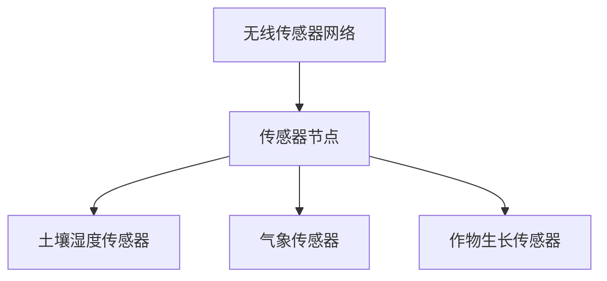
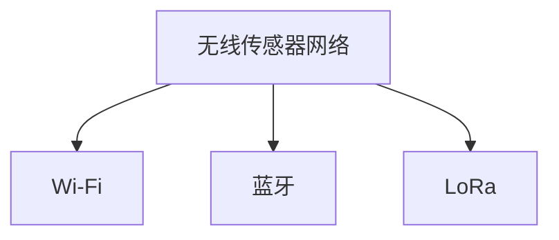
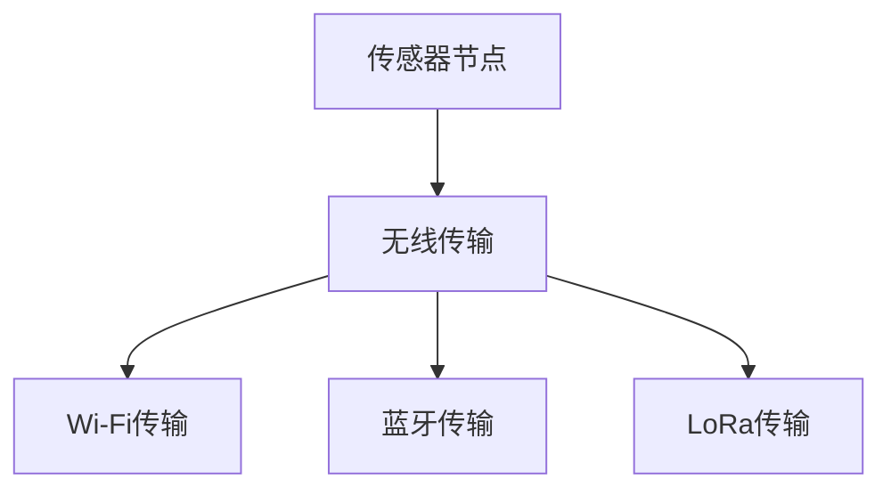
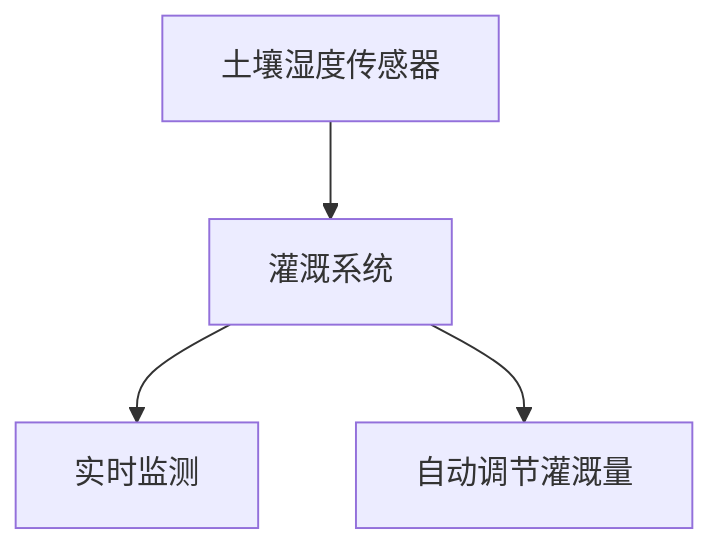
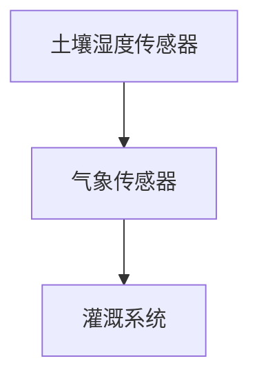
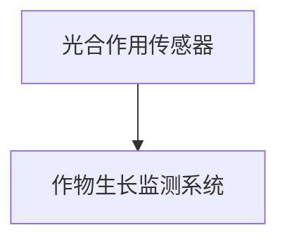
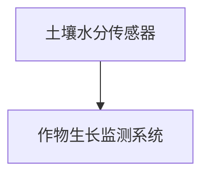
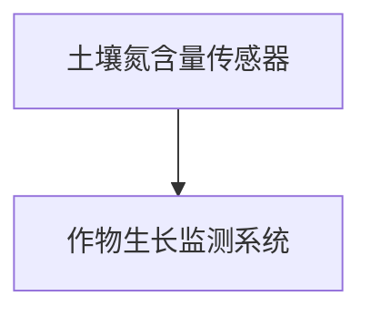
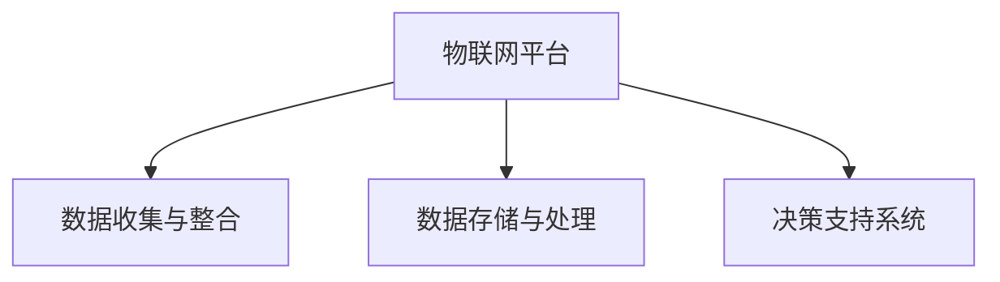

                 

### 物联网在智慧农业中的应用：精准灌溉和作物监测

> 关键词：物联网、智慧农业、精准灌溉、作物监测、传感器网络、数据管理、系统架构、实际应用、未来趋势

> 摘要：本文深入探讨了物联网在智慧农业中的应用，特别是精准灌溉和作物监测技术。通过详细的背景介绍、核心概念分析、算法原理讲解、系统架构设计和实际应用案例分析，本文旨在揭示物联网在农业领域的重要作用，并展望其未来发展趋势。

### 背景介绍

#### 核心概念术语说明

在探讨物联网在智慧农业中的应用之前，我们需要明确一些核心概念和术语。

- **物联网（Internet of Things，IoT）**：物联网是指通过互联网连接的物理设备网络，这些设备可以收集、交换和处理数据。
- **智慧农业**：智慧农业是指利用信息技术和物联网技术，实现农业生产过程的自动化、智能化和高效化。
- **精准灌溉**：精准灌溉是一种基于土壤和气象条件，通过传感器网络实时监测和调节灌溉量的灌溉技术。
- **作物监测**：作物监测是指通过传感器和物联网技术，实时监测作物的生长状况，包括光合作用、水分含量和氮含量等。

#### 问题背景

随着全球人口的增长和气候变化的影响，传统农业面临着巨大的压力。农业生产效率低下、资源浪费、环境污染等问题亟待解决。智慧农业的提出，为解决这些问题提供了新的思路和途径。

#### 问题描述

智慧农业中，物联网技术如何应用于精准灌溉和作物监测，以提高农业生产效率和作物质量？

#### 问题解决

物联网在智慧农业中的应用，主要通过以下几方面实现：
1. **传感器网络**：部署在农田中的各种传感器，实时监测土壤湿度、气象条件、作物生长状况等。
2. **数据采集与传输**：传感器收集到的数据通过无线网络传输到中央处理系统。
3. **数据分析与决策**：利用大数据分析和人工智能算法，对采集到的数据进行分析，为灌溉和作物管理提供决策支持。
4. **精准灌溉和作物监测**：根据分析结果，自动调节灌溉量和提供科学的作物管理方案。

#### 边界与外延

物联网在智慧农业中的应用，不仅限于精准灌溉和作物监测，还包括智能温室、病虫害监测、农作物产量预测等多个方面。本文主要关注精准灌溉和作物监测，这是智慧农业中最基础和最核心的两个环节。

#### 概念结构与核心要素组成

智慧农业的概念结构包括以下核心要素：
- **物联网设备**：传感器、无线网关、数据存储和处理设备等。
- **数据采集与传输**：传感器网络、无线传输技术等。
- **数据处理与分析**：云计算、大数据分析、人工智能算法等。
- **决策支持**：基于分析结果的灌溉和作物管理方案。

### 核心概念与联系

#### 物联网技术基础

物联网技术在智慧农业中的应用，主要基于以下几方面：

##### 无线传感器网络

无线传感器网络（Wireless Sensor Network，WSN）是物联网在智慧农业中的核心。WSN由大量传感器节点组成，这些节点分布在农田中，可以实时监测土壤湿度、气象条件、作物生长状况等。

##### 网络协议

物联网设备之间的通信，需要依赖于网络协议。常见的网络协议有Wi-Fi、蓝牙、LoRa等。

##### 数据采集与传输

传感器收集到的数据，需要通过无线网络传输到中央处理系统。数据采集与传输技术，决定了物联网系统的可靠性和实时性。

#### 精准灌溉的概念和优势

精准灌溉是一种基于土壤和气象条件的灌溉技术，通过传感器网络实时监测农田土壤湿度，根据监测结果自动调节灌溉量。

精准灌溉的优势：
- **节约水资源**：根据实际需要灌溉，避免过度灌溉和水资源浪费。
- **提高作物产量**：精确的水分管理，有利于作物生长，提高产量。
- **减少劳动成本**：自动化灌溉系统，减少了人力投入。

#### 精准灌溉与传感器网络

精准灌溉的实现，依赖于传感器网络的支持。传感器网络包括土壤湿度传感器、气象传感器等，这些传感器实时监测农田环境，为灌溉系统提供数据支持。

### 作物监测的重要性

作物监测是智慧农业中另一个关键环节。通过传感器和物联网技术，实时监测作物的生长状况，为科学管理提供数据支持。

#### 光合作用监测

光合作用是作物生长的关键过程，通过监测光合作用强度，可以评估作物的生长状况。

#### 水分含量监测

水分含量是影响作物生长的关键因素，通过监测土壤水分含量，可以及时调整灌溉策略。

#### 氮含量监测

氮是植物生长所需的重要营养元素，通过监测土壤中的氮含量，可以指导科学施肥。

### 物联网平台与数据管理

物联网平台是智慧农业系统中不可或缺的一部分。物联网平台主要功能包括数据收集与整合、数据存储与处理、决策支持系统等。

### 案例研究

在本节中，我们将探讨物联网在智慧农业中的实际应用，通过两个案例研究，展示物联网技术在精准灌溉和作物监测中的成功应用。

#### 案例一：某地区的精准灌溉系统

**项目背景**：
某地区农业种植面积广阔，水资源紧缺，农业生产效率低下。为了提高水资源利用率和农业生产效率，该地区引入了物联网精准灌溉系统。

**系统设计与实施**：
系统主要包括土壤湿度传感器、气象传感器、无线传输模块和中央处理系统。传感器节点分布在农田中，实时监测土壤湿度和气象条件。采集到的数据通过无线传输模块传输到中央处理系统，系统根据数据进行分析，自动调节灌溉系统，实现精准灌溉。

**项目效果评估**：
实施精准灌溉系统后，灌溉水资源利用率提高了30%，作物产量提高了20%，劳动成本降低了40%。

#### 案例二：作物生长监测在现代农业园区

**项目背景**：
某现代农业园区，为了实现科学管理和提高作物产量，引入了作物生长监测系统。

**系统设计与实施**：
系统主要包括光合作用传感器、土壤水分传感器、土壤氮含量传感器和中央处理系统。传感器节点分布在农田中，实时监测作物的生长状况，包括光合作用、水分含量和氮含量等。采集到的数据通过无线传输模块传输到中央处理系统，系统根据数据进行分析，为作物管理提供决策支持。

**项目效果评估**：
实施作物生长监测系统后，作物产量提高了15%，病虫害发生率降低了20%，生产成本降低了10%。

### 展望未来

物联网在智慧农业中的应用前景广阔。随着物联网技术的不断发展和成熟，未来物联网在智慧农业中的应用将更加广泛和深入。

#### 新兴技术的应用

1. **5G技术**：5G技术的低延迟、高速率特点，将大幅提升物联网系统的实时性和可靠性。
2. **人工智能与大数据**：人工智能和大数据技术的应用，将使物联网系统更加智能和高效。
3. **无人机与机器人**：无人机和机器人在农业领域的应用，将进一步提升农业生产的效率和质量。

#### 挑战与机遇

1. **数据安全与隐私保护**：物联网系统涉及大量敏感数据，数据安全和隐私保护是一个重要挑战。
2. **技术成熟度**：虽然物联网技术在智慧农业中的应用取得了显著成果，但一些关键技术仍需进一步发展和完善。
3. **成本与投资**：物联网系统的建设成本较高，如何降低成本、提高投资回报率，是农业企业和政府面临的一个重大问题。

### 结论

物联网在智慧农业中的应用，为提高农业生产效率和作物质量提供了有力支持。通过精准灌溉和作物监测，物联网技术正逐步改变传统农业的生产模式，为农业现代化发展贡献力量。未来，随着物联网技术的不断进步和应用领域的拓展，智慧农业将迎来更加广阔的发展前景。

### 作者信息

- **作者：AI天才研究院/AI Genius Institute & 禅与计算机程序设计艺术 /Zen And The Art of Computer Programming** 

### 小结

本文详细介绍了物联网在智慧农业中的应用，包括精准灌溉和作物监测。通过分析物联网技术基础、精准灌溉和作物监测的重要性，以及物联网平台与数据管理，本文展示了物联网技术在智慧农业中的实际应用案例。最后，展望了物联网在智慧农业中的未来发展趋势。

### 注意事项

- 在部署物联网系统时，应充分考虑数据安全和隐私保护。
- 物联网系统的建设和运营成本较高，需进行详细的经济效益分析。
- 选择合适的物联网技术和设备，确保系统的可靠性和稳定性。

### 拓展阅读

- 《智慧农业物联网技术与应用》
- 《物联网技术在现代农业中的应用研究》
- 《5G技术在智慧农业中的应用研究》

### 最佳实践 tips

- 在选择物联网设备时，应充分考虑设备的兼容性、可靠性和性能。
- 在设计物联网系统时，应充分考虑系统的扩展性和灵活性。
- 在实施物联网项目时，应充分考虑实际需求和场景，确保系统的高效性和实用性。

### 文章末尾

感谢您阅读本文，希望本文对您在智慧农业领域的研究和实践有所启发。如果您有任何疑问或建议，欢迎在评论区留言交流。让我们共同探索物联网在智慧农业中的应用，为农业现代化发展贡献力量！

