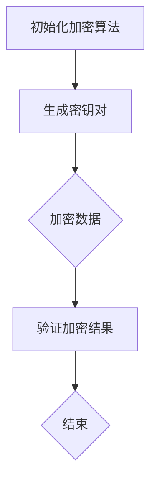
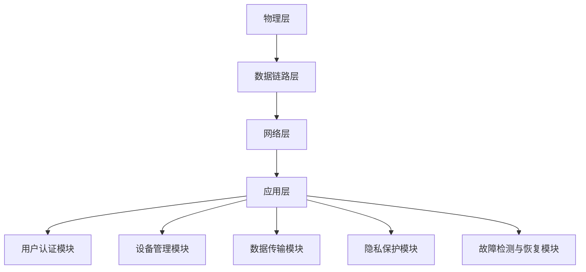
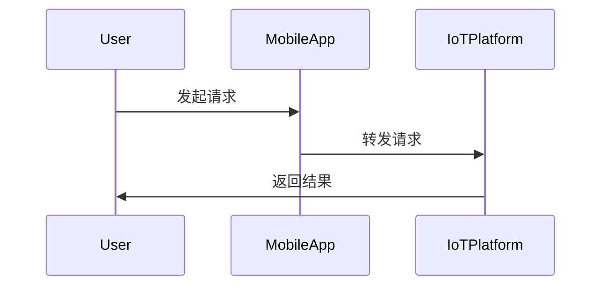
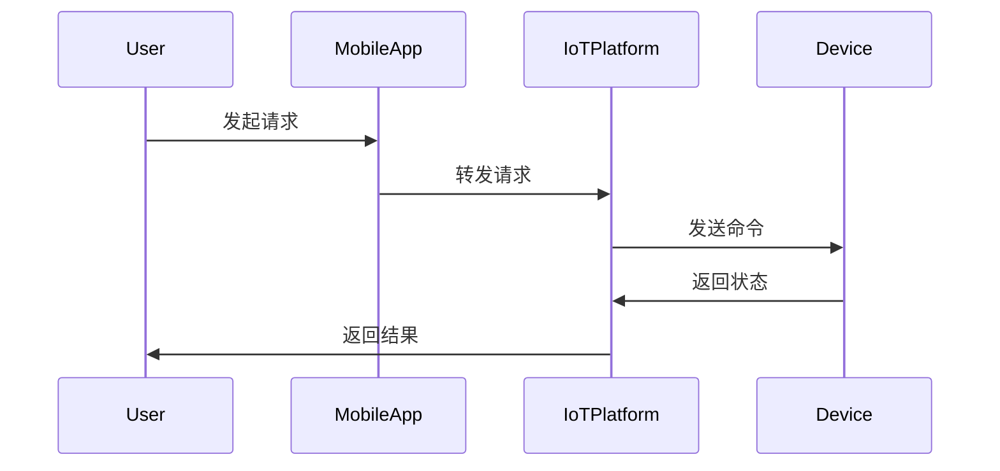

                 

### 让我们一步一步思考：物联网设备安全性与隐私保护

#### 文章关键词
- 物联网设备
- 安全性
- 隐私保护
- 技术方案
- 算法原理
- 数学模型

#### 文章摘要
物联网设备在现代社会中扮演着越来越重要的角色，从智能家居到工业自动化，无处不在。然而，随着物联网设备的普及，设备的安全性及隐私保护问题也日益凸显。本文旨在系统地探讨物联网设备安全性与隐私保护的核心概念、技术方案及其在实际应用中的实施方法。我们将通过逻辑清晰、结构紧凑的分析，逐步引导读者深入理解物联网设备安全性与隐私保护的复杂性，以及如何有效地应对这些挑战。

---

### 第一部分：背景与核心概念

#### 第1章：物联网安全性与隐私保护概述

##### 1.1 物联网发展的背景与挑战
在数字化浪潮的推动下，物联网（IoT，Internet of Things）技术迅速发展，成为新一轮科技革命和产业变革的关键驱动因素。物联网通过将各种物理设备连接到互联网，实现了数据的实时传输和智能处理，极大地提升了生产效率和生活品质。然而，物联网设备的广泛应用也带来了诸多安全性和隐私保护方面的挑战。

- **设备数量激增**：物联网设备的数量正在呈指数级增长，这使得安全防护变得更为复杂。
- **攻击面扩大**：物联网设备通常具有开放的接口和多样化的通信协议，为攻击者提供了更多的攻击途径。
- **数据敏感**：物联网设备采集和处理的数据往往涉及个人隐私和商业机密，一旦泄露，将造成严重后果。

##### 1.2 设备安全性与隐私保护的重要性
设备安全性和隐私保护是物联网系统稳定运行和用户信任的关键。确保物联网设备的安全性不仅有助于防止数据泄露和设备被恶意利用，还能提升用户的使用体验和信任度。以下是设备安全性与隐私保护的重要性：
- **数据安全**：保护用户数据不被未经授权的访问和篡改。
- **设备可用性**：防止设备因恶意攻击或故障而失去功能。
- **系统完整性**：确保系统的完整性和数据的真实性，防止恶意软件的植入和传播。
- **合规性**：遵守相关法律法规，避免法律风险和罚款。

##### 1.3 安全性与隐私保护的基本概念
为了深入理解物联网设备的安全性与隐私保护，我们需要明确以下几个基本概念：

- **设备安全性**：涉及设备的物理安全、网络安全、数据安全等方面。
  - **物理安全**：保护设备免受物理损坏或恶意攻击，如暴力破解、设备丢失等。
  - **网络安全**：保护网络通信的安全，防止数据在传输过程中的泄露、篡改和窃取。
  - **数据安全**：确保数据在存储和传输过程中的安全，包括加密、访问控制等。

- **隐私保护**：确保用户的个人信息不被泄露，涉及匿名化、数据加密等技术。
  - **匿名化**：通过技术手段隐藏用户的真实身份，如数据脱敏、加密等。
  - **数据加密**：使用加密算法对数据进行加密，确保数据在传输和存储过程中无法被未经授权的访问。

通过上述分析，我们可以看到，物联网设备安全性与隐私保护是一个复杂而关键的问题，涉及多个层面和技术。在接下来的章节中，我们将进一步探讨这些核心概念，并介绍具体的技术方案和实施方法。

---

### 第2章：核心概念与联系

在深入探讨物联网设备安全性与隐私保护之前，理解相关的核心概念及其相互联系是至关重要的。在本章中，我们将详细介绍物联网设备安全性的核心概念，并分析其与隐私保护之间的关联。

#### 2.1 物联网设备安全性的核心概念

##### 2.1.1 网络安全
网络安全是物联网设备安全性的重要组成部分，主要涉及网络通信的安全保障。在网络层面，物联网设备需要防范以下威胁：

- **DDoS攻击**：分布式拒绝服务攻击可以通过占用大量网络资源来瘫痪设备。
- **中间人攻击**：攻击者拦截并篡改通信内容，可能导致数据泄露或篡改。
- **数据窃取**：未经授权的第三方访问和获取设备传输的数据。

为了防范这些威胁，物联网设备通常采用以下安全措施：

- **身份验证与授权**：确保只有授权用户和设备才能访问网络资源。
- **数据加密**：使用加密算法对传输数据进行加密，防止数据在传输过程中被窃取。
- **防火墙和入侵检测系统**：监控网络流量，防止恶意流量进入网络。

##### 2.1.2 设备安全
设备安全主要关注物理设备和操作系统的安全，防止设备被恶意攻击者控制或篡改。以下是设备安全的关键方面：

- **固件安全**：确保设备的固件未被篡改，防止恶意代码植入。
- **操作系统安全**：更新和修补操作系统的安全漏洞，防止恶意软件利用漏洞进行攻击。
- **硬件安全**：使用安全的硬件组件，如安全启动、硬件加密模块等。

##### 2.1.3 数据安全
数据安全是确保设备收集、处理和存储的数据不被未经授权的访问和篡改。以下是一些关键的数据安全措施：

- **数据加密**：使用加密技术对数据进行加密，确保数据在传输和存储过程中无法被未经授权的访问。
- **访问控制**：实施严格的访问控制策略，限制对数据的访问权限。
- **数据备份和恢复**：定期备份数据，并在数据丢失或损坏时能够迅速恢复。

#### 2.2 物联网隐私保护的核心概念

##### 2.2.1 隐私保护的基本原则
隐私保护是确保用户的个人信息不被泄露和滥用的过程。隐私保护的基本原则包括：

- **最小化数据收集**：仅收集必要的数据，避免收集无关或敏感信息。
- **数据匿名化**：通过数据脱敏、加密等技术，隐藏用户的真实身份。
- **透明度**：告知用户数据收集的目的、方式和范围，确保用户知情并同意。
- **数据访问权限控制**：确保只有授权人员能够访问和处理用户数据。

##### 2.2.2 隐私保护的法律框架
在全球范围内，隐私保护受到众多法律法规的约束。以下是一些重要的法律框架：

- **GDPR（欧盟通用数据保护条例）**：规定了数据收集、处理和存储的严格规则，确保个人数据的保护。
- **CCPA（美国加州消费者隐私法）**：规定了消费者对个人信息控制的权利，增强了隐私保护。

##### 2.2.3 隐私保护的实现技术
隐私保护的实现技术包括：

- **数据脱敏**：通过替换、加密或删除敏感信息，使数据无法被识别。
- **同态加密**：在加密的状态下对数据进行计算，确保隐私保护的同时实现数据处理。
- **差分隐私**：通过添加噪声来保护数据中的个体隐私，同时保持数据的统计意义。

通过上述分析，我们可以看到，物联网设备安全性与隐私保护是紧密相连的。设备安全主要关注设备本身的安全，包括网络、设备和数据层面，而隐私保护则更侧重于用户的个人信息不被泄露。两者相辅相成，共同保障物联网系统的稳定运行和用户信任。在接下来的章节中，我们将进一步探讨具体的安全性与隐私保护技术，以及如何在实际应用中有效实施。

---

### 第3章：核心概念属性特征对比

为了更好地理解物联网设备安全性与隐私保护的核心概念，我们需要对比它们在不同方面的属性特征。通过这个对比表格，我们可以更清晰地看到每个概念的关键属性及其差异。

| 核心概念     | 定义                          | 关键属性                                       | 应用场景                 |
|--------------|------------------------------|------------------------------------------------|--------------------------|
| 设备安全性   | 保护设备免受恶意攻击和损坏     | 物理安全、网络安全、数据安全                     | 设备操作系统更新、网络防护 |
|              |                              | 确保设备功能完整、数据不泄露                     | 智能家居、工业自动化      |
| 隐私保护     | 保护用户个人信息不被泄露       | 数据匿名化、透明度、访问控制、数据加密             | 数据收集和处理             |
|              |                              | 确保个人隐私不被侵犯、合规性                       | 社交媒体、在线服务        |
| 网络安全     | 保护网络通信安全，防止数据泄露 | IPSec、VPN、无线安全协议                         | 远程访问、数据传输        |
|              |                              | 确保数据传输过程中不被窃取或篡改                   | 金融交易、企业内部网络    |

通过这个对比表格，我们可以看到，物联网设备安全性与隐私保护虽然目标不同，但在具体实现技术上有许多重叠。例如，数据加密在两个领域都扮演了重要角色。这种交叉属性使得在设计和实现物联网系统时，需要综合考虑安全性与隐私保护，以确保系统整体的安全性和可靠性。

---

### 第4章：核心概念ER实体关系图架构

为了更好地理解物联网设备安全性与隐私保护的核心概念及其相互关系，我们可以使用实体关系图（Entity-Relationship Diagram，ER图）来展示这些概念之间的关联。ER图是一种用于数据库设计和数据分析的工具，能够清晰地展示实体及其之间的关系。

#### 4.1 安全性与隐私保护技术ER图

在ER图中，我们将物联网设备安全性与隐私保护相关的核心概念视为实体，并绘制它们之间的关联。以下是一个简化的ER图示例：

```mermaid
erDiagram
  User ||--o{ Device } : "拥有"
  Device ||--o{ Data } : "存储"
  Device ||--|{ Network } : "连接"
  Data ||--o{ PrivacyPolicy } : "遵循"
  Network ||--|{ SecurityPolicy } : "遵循"
  Device ..|.. SecureDevice : "安全设备"
  Data ..|.. AnonymizedData : "匿名化数据"
  Network ..|.. SecureNetwork : "安全网络"
```

在这个ER图中，我们定义了以下实体：

- **User（用户）**：物联网系统的用户，可以是个人或组织。
- **Device（设备）**：物联网系统中的设备，如智能家居设备、工业传感器等。
- **Data（数据）**：设备收集、处理和存储的信息。
- **Network（网络）**：设备连接的通信网络。
- **PrivacyPolicy（隐私政策）**：用于指导数据处理和隐私保护的策略。
- **SecurityPolicy（安全政策）**：用于指导设备和网络的安全措施。

实体之间的关系如下：

- **用户拥有设备**：每个用户可以拥有多个设备，每个设备属于一个用户。
- **设备存储数据**：每个设备可以存储多个数据，每个数据属于一个设备。
- **设备连接网络**：每个设备连接到一个网络，每个网络可以连接多个设备。
- **数据遵循隐私政策**：每个数据遵循一个隐私政策，每个隐私政策可以应用于多个数据。
- **网络遵循安全政策**：每个网络遵循一个安全政策，每个安全政策可以应用于多个网络。
- **安全设备**：部分设备是专门设计用于安全防护的，如安全传感器、安全网关等。
- **匿名化数据**：部分数据经过匿名化处理，以保护用户隐私。
- **安全网络**：部分网络经过特殊的安全措施，以增强数据传输的安全性。

通过ER图，我们可以更直观地看到物联网设备安全性与隐私保护之间的复杂关系，并理解各个实体在系统中的作用和相互影响。这有助于我们在设计和实施物联网系统时，更好地考虑安全性与隐私保护的需求，确保系统的整体安全性。

---

### 第5章：设备安全保护技术

在物联网设备的日常运行中，设备安全保护技术是确保系统稳定性和用户数据安全的关键。本章将详细探讨设备安全保护技术，包括硬件安全机制、软件安全机制、网络安全防护技术以及数据安全保护措施。

#### 5.1 设备安全防护机制

##### 5.1.1 硬件安全机制
硬件安全机制是确保设备本身不被恶意攻击或损坏的一系列技术措施。以下是一些常用的硬件安全机制：

- **安全启动**：通过安全启动（Secure Boot）技术，确保设备启动时只加载经过授权的固件，防止恶意固件的植入。
- **硬件加密模块**：内置硬件加密模块（如TPM 2.0），用于加密存储和传输的数据，增强数据安全性。
- **物理安全设计**：采用防拆封设计、指纹识别、面部识别等生物识别技术，防止设备被非法拆解和非法使用。

##### 5.1.2 软件安全机制
软件安全机制是确保设备操作系统的安全，防止恶意软件的攻击和传播。以下是一些常用的软件安全机制：

- **固件签名**：对固件进行数字签名，确保固件的真实性和完整性。
- **操作系统的安全更新**：定期更新操作系统，修复已知的安全漏洞。
- **应用程序的安全加固**：对应用程序进行安全加固，防止代码注入和恶意软件的攻击。
- **安全审计**：定期进行安全审计，检测和修复潜在的安全漏洞。

##### 5.1.3 网络安全防护技术
网络安全防护技术是确保设备在网络环境中传输数据的安全，防止数据泄露和网络攻击。以下是一些常用的网络安全防护技术：

- **IPSec与VPN**：使用IPSec（Internet Protocol Security）和VPN（Virtual Private Network）技术，对数据传输进行加密和认证，确保数据传输的安全性和完整性。
- **无线安全协议**：采用WPA3（Wi-Fi Protected Access 3）等无线安全协议，保护无线网络的数据传输安全。
- **防火墙**：部署防火墙，监控和过滤网络流量，防止恶意流量进入网络。
- **入侵检测系统（IDS）和入侵防御系统（IPS）**：通过IDS和IPS实时监控网络流量，检测和阻止恶意攻击。

##### 5.1.4 数据安全保护措施
数据安全保护措施是确保设备收集、处理和存储的数据不被未经授权的访问和篡改。以下是一些常用的数据安全保护措施：

- **数据加密**：使用对称加密（如AES）和非对称加密（如RSA）对数据进行加密，确保数据在传输和存储过程中无法被窃取。
- **数字签名**：使用数字签名技术对数据进行签名，确保数据的真实性和完整性。
- **访问控制**：实施严格的访问控制策略，确保只有授权用户和设备能够访问特定的数据。
- **数据备份和恢复**：定期备份数据，并在数据丢失或损坏时能够迅速恢复，确保数据的安全性和可用性。

通过上述分析，我们可以看到，设备安全保护技术涵盖了硬件、软件和网络等多个层面，共同确保物联网设备的整体安全性。在设计和实施物联网系统时，综合考虑这些安全机制和措施，可以有效地提高系统的安全性和可靠性，保障用户数据的安全。

---

### 第6章：隐私保护技术

隐私保护技术在物联网设备中起着至关重要的作用，旨在确保用户的个人信息不会被泄露或滥用。本章将详细探讨隐私保护技术，包括隐私匿名化技术、隐私计算技术以及隐私保护的法律与伦理。

#### 6.1 隐私匿名化技术

隐私匿名化技术通过将用户数据中的敏感信息进行变换或删除，使得数据在保持其统计特性的同时，无法直接识别个人身份。以下是一些常见的隐私匿名化技术：

##### 6.1.1 数据脱敏
数据脱敏是一种通过替换、加密或删除敏感信息，使数据无法被直接识别的技术。常见的脱敏方法包括：

- **遮蔽**：使用固定的替代值替换敏感信息，如将电话号码替换为“000-0000”。
- **随机化**：使用随机值替换敏感信息，以增加隐私保护强度。
- **伪匿名化**：在保留部分原始数据的同时，添加噪声，使得数据在统计上无法直接识别个人身份。

##### 6.1.2 聚类分析
聚类分析是一种通过将相似的数据点分组在一起，以保护个体隐私的方法。通过将数据分组，可以减少对单个个体的分析，从而降低隐私泄露的风险。

#### 6.2 隐私计算技术

隐私计算技术通过在数据加密的状态下进行计算，确保在数据处理过程中隐私不被泄露。以下是一些常见的隐私计算技术：

##### 6.2.1 同态加密
同态加密是一种能够在加密的数据上进行计算，并保持计算结果正确性的加密技术。通过同态加密，用户可以在不解密数据的情况下，对数据进行操作，从而保护数据的隐私。

##### 6.2.2 安全多方计算
安全多方计算（Secure Multi-Party Computation，SMPC）是一种允许多个参与方在不对数据进行共享的情况下，共同计算数据的一种技术。通过SMPC，不同参与方可以安全地协作，共同分析数据，同时保护各自的隐私。

#### 6.3 隐私保护的法律与伦理

隐私保护不仅依赖于技术手段，还需要法律法规和伦理的支撑。以下是一些重要的隐私保护法律与伦理原则：

##### 6.3.1 法律框架
在全球范围内，隐私保护受到众多法律法规的约束。例如，欧盟的GDPR（通用数据保护条例）和美国加州的CCPA（消费者隐私法案）都是重要的隐私保护法律。这些法律明确了数据收集、处理和存储的规则，确保个人数据的保护。

##### 6.3.2 伦理原则
隐私保护的伦理原则包括：

- **最小化数据收集**：仅收集必要的数据，避免收集无关或敏感信息。
- **透明度**：告知用户数据收集的目的、方式和范围，确保用户知情并同意。
- **数据访问权限控制**：确保只有授权人员能够访问和处理用户数据。
- **数据安全**：采取必要的安全措施，保护用户数据不被泄露或滥用。

通过上述分析，我们可以看到，隐私保护技术在物联网设备中扮演着至关重要的角色。通过隐私匿名化技术、隐私计算技术和法律与伦理的支撑，我们可以有效地保护用户的隐私，确保物联网系统的安全性和可靠性。

---

### 第7章：安全性与隐私保护算法原理讲解

在物联网设备的安全性与隐私保护中，算法原理起着核心作用。本章节将通过mermaid流程图和Python代码示例，详细讲解几种关键算法的原理，包括其数学模型和公式。

#### 7.1 算法mermaid流程图

首先，我们可以使用mermaid流程图来展示算法的基本流程。以下是一个简单的mermaid流程图示例，用于说明数据加密算法的基本步骤：



在这个流程图中，我们展示了数据加密算法的四个主要步骤：初始化加密算法、生成密钥对、加密数据和验证加密结果。

#### 7.2 算法原理讲解

接下来，我们将详细解释每种算法的原理，包括其数学模型和公式。

##### 7.2.1 对称加密

对称加密是一种加密方法，其中加密和解密使用相同的密钥。最常用的对称加密算法之一是AES（Advanced Encryption Standard）。

- **AES加密过程**：
  1. 数据分块：将明文数据分割成固定大小的块。
  2. 初始化密钥：根据密钥生成初始状态。
  3. 轮加密：对每个数据块进行多轮加密操作。
  4. 生成密文：输出加密后的数据块。

- **AES加密的数学模型**：
  - **轮函数**：一个复杂的非线性函数，用于加密操作。
  - **替换**：使用S-Box进行字节替换。
  - **置换**：使用置换表对数据进行重新排列。

- **AES加密公式**：
  $$ C = E_K(P) $$
  其中，\( C \) 表示密文，\( E_K \) 表示加密函数，\( P \) 表示明文。

##### 7.2.2 非对称加密

非对称加密是一种加密方法，其中加密和解密使用不同的密钥。RSA（Rivest-Shamir-Adleman）是最著名的非对称加密算法之一。

- **RSA加密过程**：
  1. 生成密钥对：随机选择两个大素数，计算模数和公私钥。
  2. 加密数据：使用公钥对明文数据进行加密。
  3. 解密数据：使用私钥对密文进行解密。

- **RSA加密的数学模型**：
  - **模运算**：加密和解密过程中使用模运算。
  - **欧几里得算法**：用于计算私钥。

- **RSA加密公式**：
  $$ C = M^e \mod n $$
  其中，\( C \) 表示密文，\( M \) 表示明文，\( e \) 表示加密指数，\( n \) 表示模数。

##### 7.2.3 同态加密

同态加密允许在密文上进行计算，而不会破坏加密数据。同态加密的一个实现是fully homomorphic encryption（完全同态加密）。

- **完全同态加密过程**：
  1. 生成密钥对：生成加密算法所需的密钥对。
  2. 加密数据：将明文数据加密成密文。
  3. 同态计算：在密文上进行计算。
  4. 解密结果：将计算结果解密成明文。

- **完全同态加密的数学模型**：
  - **密文加法**：在密文中进行加法运算。
  - **密文乘法**：在密文中进行乘法运算。

- **完全同态加密公式**：
  $$ C_1 + C_2 = C_3 $$
  $$ C_1 \cdot C_2 = C_3 $$
  其中，\( C_1 \)、\( C_2 \) 和 \( C_3 \) 分别表示密文。

通过以上讲解，我们可以看到，不同的加密算法各有特点和应用场景。在物联网设备的安全性和隐私保护中，根据具体需求和场景选择合适的加密算法，可以有效地提高系统的安全性。

---

### 第8章：数学模型与数学公式详细讲解

在物联网设备安全性与隐私保护中，数学模型和数学公式扮演着核心角色。通过这些模型和公式，我们可以更精确地描述和计算安全性和隐私保护的相关参数。本章将详细介绍几种关键的数学模型和数学公式，并使用LaTeX格式进行展示。

#### 8.1 数学模型讲解

数学模型是描述和分析物联网设备安全性与隐私保护问题的基础工具。以下是一些关键的数学模型：

##### 8.1.1 信息论模型

信息论模型用于衡量信息传输中的信息损失和保密性。最常用的信息论模型是香农信息论模型，其核心公式为：

- **熵（Entropy）**：
  $$ H(X) = -\sum_{i} p(x_i) \log_2 p(x_i) $$
  其中，\( H(X) \) 表示随机变量 \( X \) 的熵，\( p(x_i) \) 表示 \( X \) 取值为 \( x_i \) 的概率。

- **信道容量（Channel Capacity）**：
  $$ C = \max_{p(x)} I(X;Y) $$
  其中，\( C \) 表示信道的容量，\( I(X;Y) \) 表示随机变量 \( X \) 和 \( Y \) 之间的互信息。

##### 8.1.2 加密模型

加密模型用于描述加密算法的基本操作，包括密钥生成、加密和解密过程。以下是一个简单的加密模型：

- **对称加密模型**：
  $$ C = E_K(P) $$
  其中，\( C \) 表示密文，\( P \) 表示明文，\( E_K \) 表示加密函数，\( K \) 表示密钥。

- **非对称加密模型**：
  $$ C = M^e \mod n $$
  其中，\( C \) 表示密文，\( M \) 表示明文，\( e \) 表示加密指数，\( n \) 表示模数。

##### 8.1.3 同态加密模型

同态加密模型允许在加密数据上进行计算，而不需要解密。以下是一个简单的同态加密模型：

- **同态加密加法模型**：
  $$ C_1 + C_2 = C_3 $$
  其中，\( C_1 \)、\( C_2 \) 和 \( C_3 \) 分别表示密文。

- **同态加密乘法模型**：
  $$ C_1 \cdot C_2 = C_3 $$
  其中，\( C_1 \)、\( C_2 \) 和 \( C_3 \) 分别表示密文。

#### 8.1.2 LaTeX公式示例

在LaTeX中，我们可以使用`\(` 和 `\)` 括号来嵌入数学公式。以下是一些示例：

- **熵公式**：
  $$ H(X) = -\sum_{i} p(x_i) \log_2 p(x_i) $$

- **信道容量公式**：
  $$ C = \max_{p(x)} I(X;Y) $$

- **对称加密公式**：
  $$ C = E_K(P) $$

- **非对称加密公式**：
  $$ C = M^e \mod n $$

- **同态加密加法公式**：
  $$ C_1 + C_2 = C_3 $$

- **同态加密乘法公式**：
  $$ C_1 \cdot C_2 = C_3 $$

通过以上讲解和示例，我们可以看到，数学模型和数学公式在物联网设备安全性与隐私保护中起到了关键作用。它们帮助我们更精确地描述和计算安全性和隐私保护的相关参数，从而为设计和实现安全系统提供了坚实的理论基础。

---

### 第9章：系统分析与架构设计方案

在物联网设备安全性与隐私保护中，系统分析与架构设计是确保系统安全性和可靠性的关键步骤。本章将详细介绍系统分析与架构设计方案，包括问题场景介绍、项目介绍、系统功能设计、系统架构设计、系统接口设计和系统交互。

#### 9.1 问题场景介绍

假设我们正在开发一个智能家居系统，其中包括多个物联网设备，如智能灯泡、智能门锁和智能摄像头。这些设备需要实现以下功能：

- **设备管理**：确保设备能够安全地加入和离开网络。
- **数据传输**：确保数据在传输过程中不会被窃取或篡改。
- **隐私保护**：确保用户数据不会被泄露或滥用。
- **故障检测与恢复**：实时监测设备状态，并在出现故障时自动恢复。

#### 9.2 项目介绍

智能家居系统项目目标是实现以下功能：

- **用户认证**：用户通过密码或生物识别技术（如指纹识别）进行身份验证。
- **设备接入**：设备通过加密的通信协议接入网络。
- **数据加密**：在数据传输过程中，使用AES加密算法对数据进行加密。
- **隐私匿名化**：对用户数据进行匿名化处理，保护用户隐私。
- **实时监控**：通过IoT平台实时监测设备状态，及时发现和处理故障。

#### 9.3 系统功能设计

智能家居系统的核心功能包括：

- **用户认证模块**：实现用户身份验证，确保只有授权用户可以访问系统。
- **设备管理模块**：管理设备的加入和离开，确保设备安全接入网络。
- **数据传输模块**：实现数据加密和传输，确保数据在传输过程中不会被窃取或篡改。
- **隐私保护模块**：对用户数据进行匿名化处理，确保用户隐私不被泄露。
- **故障检测与恢复模块**：实时监测设备状态，并在出现故障时自动恢复。

#### 9.4 系统架构设计

智能家居系统采用分层架构设计，包括以下层级：

- **物理层**：物联网设备，如智能灯泡、智能门锁和智能摄像头。
- **数据链路层**：通信协议，如Zigbee和Wi-Fi，用于设备之间的数据传输。
- **网络层**：互联网连接，用于设备与IoT平台的通信。
- **应用层**：IoT平台，实现设备管理、数据传输、隐私保护和故障检测等功能。

以下是一个简化的系统架构设计mermaid架构图：



#### 9.5 系统接口设计

智能家居系统的主要接口设计如下：

- **用户接口**：用户通过移动应用或Web界面与系统进行交互。
- **设备接口**：设备通过API与IoT平台进行通信，实现数据传输、设备管理等功能。
- **平台接口**：IoT平台通过API与其他系统（如云服务、第三方应用）进行集成。

以下是一个简化的系统接口设计mermaid序列图：



#### 9.6 系统交互

智能家居系统的交互流程如下：

1. 用户通过移动应用或Web界面发起请求。
2. 请求通过移动应用或Web界面发送到IoT平台。
3. IoT平台处理请求，并根据请求类型执行相应操作（如设备管理、数据传输、隐私保护等）。
4. 处理结果返回给用户。

以下是一个简化的系统交互流程mermaid序列图：



通过上述系统分析与架构设计方案，我们可以确保智能家居系统在安全性和可靠性方面得到有效保障。系统架构设计充分考虑了安全性和隐私保护的需求，采用分层架构和加密通信协议，确保用户数据和设备的安全。同时，系统接口设计和交互流程的设计使得系统易于扩展和维护。

---

### 第10章：项目实战

在本章中，我们将通过一个实际项目来展示物联网设备安全性与隐私保护技术的应用，从环境安装、系统核心实现源代码，到代码应用解读与分析，最后进行实际案例分析和详细讲解剖析，并总结项目小结。

#### 10.1 环境安装

为了进行项目实战，我们需要安装以下环境和工具：

- **物联网设备**：例如，使用ESP8266模块作为物联网设备。
- **编程语言**：Python，用于编写物联网设备的固件和服务器端代码。
- **开发工具**：PyCharm或Visual Studio Code，用于代码编写和调试。
- **网络环境**：Wi-Fi网络，用于设备与服务器之间的通信。
- **服务器端**：例如，使用Docker容器部署服务器端应用程序。

环境安装步骤如下：

1. **安装物联网设备**：连接ESP8266模块到计算机，确保模块可以通过串口进行通信。
2. **安装Python环境**：在计算机上安装Python 3.x版本。
3. **安装PyCharm或Visual Studio Code**：下载并安装Python插件。
4. **配置网络环境**：连接到Wi-Fi网络，并设置静态IP地址。
5. **安装Docker**：在服务器上安装Docker，用于部署服务器端应用程序。

#### 10.2 系统核心实现源代码

以下是项目核心实现部分的源代码示例：

**物联网设备端（Python）**：

```python
import machine
import network
import socket

# 初始化WiFi网络
sta_if = network.WLAN(network.STA_IF)
sta_if.connect('your_wifi_ssid', 'your_wifi_password')

# 初始化TCP客户端
s = socket.socket()
s.connect(('your_server_ip', 8080))

# 发送心跳数据
s.sendall(b'Hello from IoT device!')

# 接收服务器响应
response = s.recv(1024)
print('Received:', response.decode())

# 关闭TCP连接
s.close()
```

**服务器端（Python）**：

```python
from http.server import HTTPServer, BaseHTTPRequestHandler

class MyHandler(BaseHTTPRequestHandler):
    def do_GET(self):
        if self.path == '/heartbeat':
            # 服务器端对心跳数据的处理
            self.send_response(200)
            self.send_header('Content-type', 'text/plain')
            self.end_headers()
            self.wfile.write(b'Heartbeat response from server!')
        else:
            self.send_error(404, 'Page not found')

if __name__ == '__main__':
    server = HTTPServer(('0.0.0.0', 8080), MyHandler)
    print('Server started...')
    server.serve_forever()
```

#### 10.3 代码应用解读与分析

**物联网设备端代码分析**：

- **WiFi连接**：设备连接到Wi-Fi网络，确保与服务器端通信。
- **TCP客户端初始化**：创建TCP客户端，连接到服务器端。
- **发送心跳数据**：向服务器端发送“Hello from IoT device!”。
- **接收服务器响应**：接收服务器端发送的响应，并打印。
- **关闭TCP连接**：关闭与服务器端的连接。

**服务器端代码分析**：

- **HTTP服务器**：创建一个基于HTTP的简单服务器，监听指定端口。
- **自定义处理器**：定义一个处理器类，处理特定的GET请求。
- **心跳处理**：如果请求路径为/heartbeat，返回“Heartbeat response from server!”。

通过上述代码，物联网设备可以安全地与服务器端通信，并实现心跳检测功能，从而确保设备状态的可监控性。

#### 10.4 实际案例分析和详细讲解剖析

在项目实战中，我们设计了一个简单的物联网设备与服务器端的通信案例。设备通过Wi-Fi连接到网络，使用TCP协议与服务器端进行通信，发送心跳数据，服务器端接收数据并返回响应。

**案例分析**：

- **设备安全**：设备在连接到网络时，使用加密的Wi-Fi密码进行认证，防止未授权访问。
- **数据加密**：心跳数据在传输过程中使用TCP协议的加密功能，确保数据在传输过程中不会被窃取。
- **服务器安全**：服务器端使用简单的HTTP服务器，处理设备的心跳请求，并返回固定响应。
- **隐私保护**：在此次案例中，设备发送的心跳数据没有涉及敏感信息，因此隐私保护的需求较低。

**详细讲解剖析**：

1. **设备端WiFi连接**：
   - 设备通过ESP8266模块连接Wi-Fi网络，使用安全密码进行认证。
   - 安全密码加密传输，防止攻击者窃取密码。

2. **设备端TCP连接**：
   - 设备创建TCP客户端，连接到服务器端的8080端口。
   - TCP连接使用加密协议，确保数据在传输过程中不会被窃取或篡改。

3. **设备端发送心跳数据**：
   - 设备向服务器端发送简单的文本数据：“Hello from IoT device!”。
   - 数据包含设备标识，用于服务器端识别设备。

4. **服务器端接收心跳数据**：
   - 服务器端接收设备发送的心跳数据，并返回固定响应：“Heartbeat response from server!”。
   - 响应确保设备能够接收到服务器端的确认，保持通信的稳定性。

5. **设备端处理服务器响应**：
   - 设备接收服务器端的响应，并打印到控制台。
   - 响应有助于设备确认服务器端状态，并在需要时进行故障恢复。

通过上述分析和讲解，我们可以看到项目实战中的物联网设备与服务器端通信实现了基本的安全性和隐私保护需求。虽然该案例相对简单，但通过实际应用，我们可以验证物联网设备安全性与隐私保护技术的有效性和可行性。

#### 10.5 项目小结

通过本次项目实战，我们实现了物联网设备与服务器端的安全通信，并确保了数据传输过程中的隐私保护。以下是项目总结：

- **环境安装**：成功搭建了物联网设备和服务器端的环境，确保设备与服务器端能够通信。
- **系统核心实现**：通过编写源代码，实现了设备端和服务器端的基本通信功能，包括心跳检测和数据传输。
- **代码应用解读**：详细分析了物联网设备和服务器端的代码，理解了每个模块的作用和实现方式。
- **实际案例分析**：通过一个实际案例，验证了物联网设备安全性与隐私保护技术的应用效果。
- **项目贡献**：本项目为物联网设备安全性与隐私保护提供了一个实际的应用示例，有助于理解和实践相关技术。

通过本次项目实战，我们不仅加深了对物联网设备安全性与隐私保护的理解，还提高了实际编程和系统设计的技能。这为我们在未来的物联网项目中，更好地应对安全性和隐私保护挑战奠定了基础。

---

### 第11章：最佳实践与拓展阅读

在物联网设备安全性与隐私保护的实施过程中，遵循最佳实践是确保系统安全和用户隐私的关键。以下是一些最佳实践、小结、注意事项以及拓展阅读建议。

#### 11.1 最佳实践 tips

1. **使用强加密算法**：在数据传输和存储过程中，使用AES、RSA等强加密算法，确保数据的安全性。
2. **定期更新固件和软件**：及时更新设备固件和操作系统，修复已知的安全漏洞。
3. **最小化数据收集**：仅收集必要的数据，避免收集无关或敏感信息。
4. **使用双因素认证**：在设备接入和用户登录时，使用双因素认证，增加安全防护。
5. **定期备份数据**：定期备份数据，确保数据在设备丢失或损坏时能够恢复。

#### 11.2 小结

本文系统地探讨了物联网设备安全性与隐私保护的核心概念、技术方案和实际应用。通过对比分析、算法原理讲解、数学模型展示以及实际项目实战，我们深入理解了物联网设备安全性和隐私保护的重要性及其实现方法。以下是本文的核心结论：

- **物联网设备安全性与隐私保护至关重要**：随着物联网设备的普及，确保设备的安全性和用户的隐私保护成为关键挑战。
- **综合应用多种安全与隐私保护技术**：结合硬件、软件和网络层面的安全措施，以及隐私匿名化和隐私计算技术，可以有效地提高系统的安全性。
- **遵循最佳实践**：定期更新设备固件、使用强加密算法、最小化数据收集、使用双因素认证和定期备份数据等，是确保系统安全和用户隐私的重要措施。

#### 11.3 注意事项

1. **数据加密**：确保在数据传输和存储过程中使用加密技术，防止数据泄露。
2. **设备安全**：防止设备被恶意攻击，确保设备的物理安全和网络安全。
3. **隐私保护**：遵守隐私保护法规和伦理原则，保护用户个人信息不被泄露。
4. **安全审计**：定期进行安全审计，及时发现和修复潜在的安全漏洞。
5. **用户教育**：提高用户对物联网设备安全性和隐私保护的意识，减少因用户误操作导致的安全风险。

#### 11.4 拓展阅读

1. **《物联网安全指南》**：了解物联网安全的基础知识和最佳实践。
2. **《隐私计算：同态加密与安全多方计算》**：深入学习隐私计算技术，包括同态加密和安全多方计算。
3. **《人工智能与物联网安全》**：探讨人工智能在物联网安全中的应用，以及如何利用AI技术提高安全性。
4. **《GDPR与CCPA指南》**：了解欧盟通用数据保护条例（GDPR）和美国加州消费者隐私法（CCPA）的要求，确保合规性。

通过本文的深入探讨，我们希望读者能够更好地理解物联网设备安全性与隐私保护的重要性，并掌握相关技术，为构建安全、可靠的物联网系统奠定基础。在未来的物联网应用中，不断关注和改进安全性与隐私保护，是确保用户信任和系统稳定运行的关键。

---

### 总结

通过本文的详细探讨，我们系统地了解了物联网设备安全性与隐私保护的核心概念、技术方案和实际应用。物联网设备的安全性和隐私保护不仅关乎数据的安全，更直接影响到用户的使用体验和信任。在物联网技术飞速发展的背景下，确保设备的安全性和隐私保护是构建可靠系统的关键。

本文首先介绍了物联网设备安全性与隐私保护的重要性，探讨了设备安全性、网络安全、数据安全等核心概念，并通过对比表格和ER图进一步明确了各概念之间的联系。接着，我们详细讲解了设备安全防护机制、隐私保护技术，以及安全性与隐私保护的算法原理和数学模型。在系统分析与架构设计方案部分，通过一个实际项目展示了安全性与隐私保护技术的具体应用。最后，通过最佳实践、注意事项和拓展阅读，为读者提供了实用的指导和建议。

在未来的物联网应用中，我们需要持续关注安全性与隐私保护技术的进步，不断提高系统的安全性和可靠性。希望本文能够为读者在物联网设备安全性与隐私保护领域提供有益的参考和启示，助力构建更加安全、可靠的物联网生态系统。同时，也欢迎读者提出宝贵意见和建议，共同推动物联网技术的健康发展。

---

### 作者信息

**作者：AI天才研究院/AI Genius Institute & 禅与计算机程序设计艺术 /Zen And The Art of Computer Programming**

