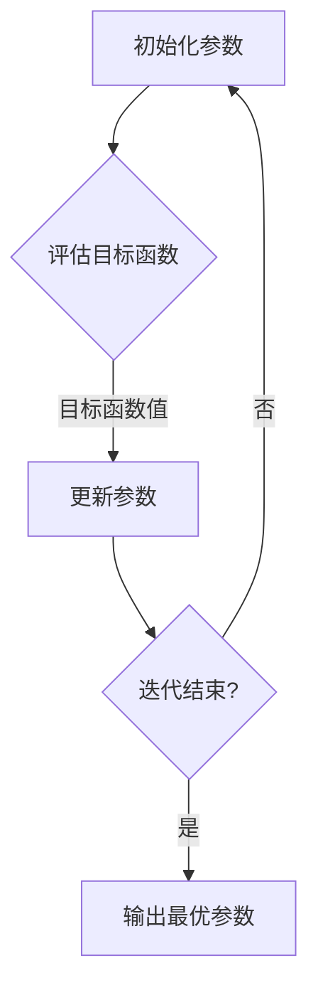
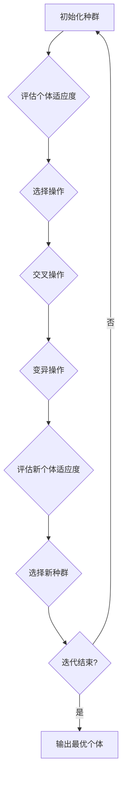
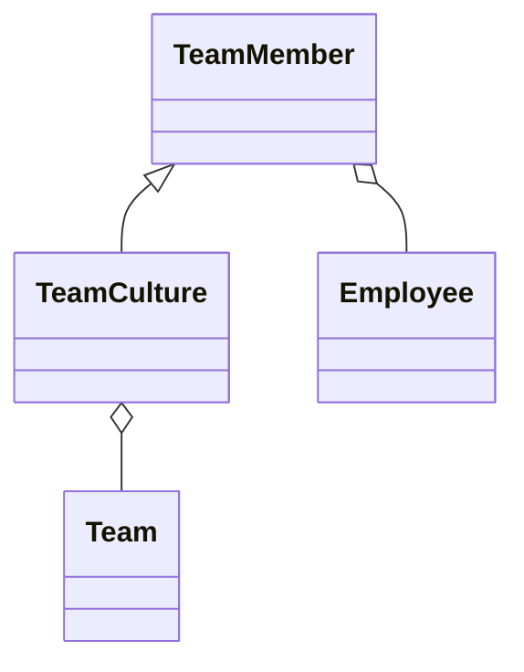
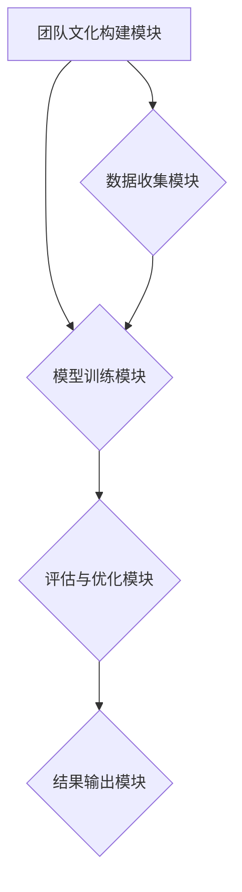
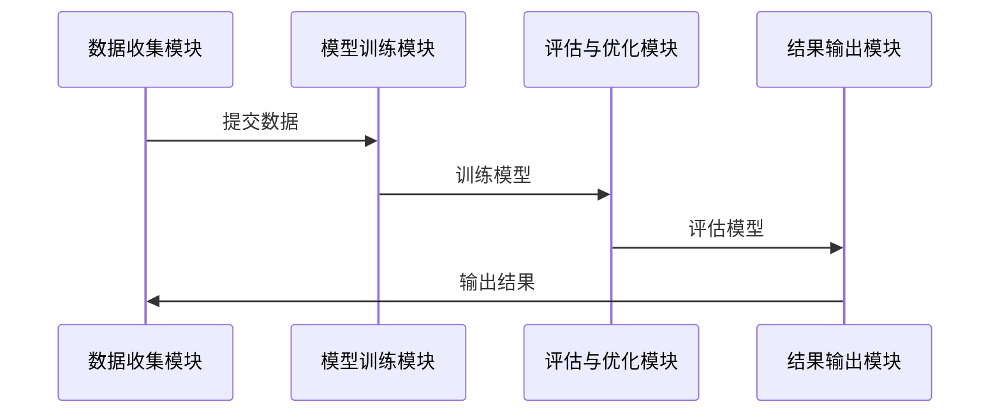

                 

### 引言

#### 1.1 问题背景

##### 1.1.1 团队文化的定义与重要性

团队文化是指一个团队所共同遵守的价值观、信念和行为规范，它是一种无形的软实力，对于团队的凝聚力和绩效有着重要的影响。正如一个优秀的软件系统需要良好的架构和稳定的代码，一个高效的团队也需要强有力的文化支撑。

团队文化的定义可以从多个角度理解。从社会学角度看，它是一种社会互动模式；从心理学角度看，它是团队成员共同的心理契约；从管理学角度看，它是一种管理工具。不论从哪个角度来看，团队文化都是一种影响团队行为和决策的重要因素。

##### 1.1.2 团队文化对团队绩效的影响

团队文化对团队绩效的影响是深远而复杂的。良好的团队文化可以增强团队成员之间的信任和合作，提高团队的整体工作效率和创新能力。例如，谷歌（Google）的“不作恶”文化，使得员工在工作中更加注重用户价值和社会责任，从而推动了公司创新和发展。

研究表明，具有积极文化特征的团队往往表现出更高的绩效。例如，拥有共同价值观的团队，其成员更加愿意分享信息、协作解决问题，从而提高团队的整体表现。

##### 1.1.3 当前团队文化建设的挑战

尽管团队文化的重要性被广泛认可，但当前在团队文化建设中仍存在许多挑战。首先，许多团队缺乏明确的愿景和目标，导致团队成员对团队文化的认同感不强。其次，团队成员之间的协作不畅，也是导致团队文化不健全的原因之一。

此外，外部环境的快速变化，也对团队文化建设提出了新的挑战。在快速变化的市场环境中，团队需要具备快速适应和创新能力，这对团队文化的灵活性提出了更高的要求。

#### 1.2 问题描述

##### 1.2.1 缺乏独特性

当前许多团队在文化建设中缺乏独特性，往往只是简单地模仿其他团队或公司的文化，导致团队文化缺乏个性和特色。这种缺乏独特性的文化往往难以激发团队成员的积极性和创造力。

##### 1.2.2 团队成员认同感不强

团队成员对团队文化的认同感不强，导致团队凝聚力不足。这不仅影响了团队的工作效率，也影响了团队成员的个人职业发展。

##### 1.2.3 团队间协作不畅

团队间协作不畅是另一个常见问题。不同团队之间的文化差异，可能导致协作过程中出现误解和冲突，从而影响项目的进度和质量。

#### 1.3 问题解决

##### 1.3.1 确立团队愿景与目标

要解决上述问题，首先需要确立团队的愿景和目标。团队的愿景应该明确，并且具有吸引力和激励作用，能够激发团队成员的积极性和创造力。

##### 1.3.2 建立团队核心价值观

建立团队核心价值观是团队文化建设的重要一环。核心价值观应该与团队的愿景和目标相一致，能够引导团队成员的行为和决策。

##### 1.3.3 创造独特的团队文化氛围

创造独特的团队文化氛围，可以通过多种方式实现。例如，举办团队建设活动、设立团队奖项、开展团队学习等。这些活动可以增强团队成员之间的互动和信任，从而提高团队的凝聚力。

#### 1.4 边界与外延

##### 1.4.1 团队文化与其他管理要素的关系

团队文化与其他管理要素，如组织结构、管理制度、激励机制等密切相关。团队文化能够影响这些管理要素的运行效果，而管理要素的变化也会对团队文化产生影响。

##### 1.4.2 团队文化在不同行业和领域的应用

团队文化在不同行业和领域中的应用有所不同。例如，在高科技行业中，团队文化更强调创新和灵活性；在传统行业中，团队文化可能更注重稳定性和执行力。

#### 1.5 概念结构与核心要素组成

##### 1.5.1 团队文化的概念结构

团队文化的概念结构可以分为三个层次：表面层次、中间层次和深层层次。表面层次包括团队的行为和互动方式；中间层次包括团队价值观和行为准则；深层层次包括团队的历史、信仰和价值观。

##### 1.5.2 团队文化的核心要素

团队文化的核心要素包括愿景、使命、核心价值观、行为规范和团队精神。这些要素共同构成了团队文化的核心框架，对团队的行为和决策产生深远影响。### 核心概念与联系

#### 2.1 核心概念原理

##### 2.1.1 团队文化的定义

团队文化是指在一个团队内部形成的一套共同价值观、信念和行为规范。它是一个团队在长期发展过程中所形成的独特的精神面貌和氛围。团队文化不仅包括团队成员之间的互动方式，还包括团队成员对团队使命、愿景和价值观的认同。

##### 2.1.2 团队文化的形成与演变

团队文化的形成是一个动态的过程，它受到团队内部和外部多种因素的影响。内部因素包括团队成员的个性、价值观、经验等；外部因素包括组织环境、行业特点、市场变化等。随着团队的发展和外部环境的变化，团队文化也会不断演变和调整。

##### 2.1.3 团队文化的分类

团队文化可以根据不同的标准进行分类。根据团队文化的特性，可以将其分为积极型文化、消极型文化、稳定型文化和变革型文化。积极型文化注重创新和协作，消极型文化则可能表现为消极怠工和内耗；稳定型文化注重稳定和执行力，变革型文化则强调变革和适应。

#### 2.2 概念属性特征对比表格

| 概念       | 特征描述                                                     |
|------------|--------------------------------------------------------------|
| 组织文化   | 涵盖整个组织，是组织内部共同遵守的价值观和行为规范。               |
| 企业文化   | 指企业内部形成的共同价值观和行为规范，强调企业的使命、愿景和目标。 |
| 工作氛围   | 主要指员工在工作环境中的感受和情绪，包括工作压力、人际关系等。     |
| 团队文化   | 团队内部形成的共同价值观和行为规范，强调团队的使命、愿景和目标。   |

#### 2.3 ER实体关系图架构

##### 2.3.1 团队文化要素实体关系图

```mermaid
entityRelationship
  A[团队文化] "1" <|-- B[价值观]
  A "1" <|-- C[行为规范]
  A "1" <|-- D[团队精神]
  B "1" <|-- E[使命]
  B "1" <|-- F[愿景]
  C "1" <|-- G[行为准则]
  D "1" <|-- H[团队协作]
  D "1" <|-- I[团队创新]
```

##### 2.3.2 团队文化与企业发展的关系图

```mermaid
entityRelationship
  J[企业发展] "1" <|-- K[团队文化]
  K "1" <|-- L[员工绩效]
  K "1" <|-- M[团队凝聚力]
  K "1" <|-- N[企业竞争力]
```

在这两个ER图中，团队文化被视为一个核心要素，它直接影响员工绩效、团队凝聚力和企业竞争力。同时，团队文化也与企业的使命、愿景和目标紧密相关，是推动企业发展的关键因素之一。### 算法原理讲解

#### 3.1 团队文化塑造方法

##### 3.1.1 模型构建

团队文化的塑造需要基于科学的方法论和模型。以下是一个简单的团队文化构建模型：

1. **数据收集与处理**：首先，需要收集与团队文化相关的数据，包括团队成员的行为、互动、价值观等。这些数据可以通过问卷调查、访谈、观察等方式获取。收集到数据后，需要进行清洗和处理，以确保数据的质量。

2. **特征提取与选择**：从处理好的数据中提取关键特征，这些特征应该能够反映团队文化的核心要素。通过特征选择算法，如信息增益、卡方检验等，筛选出对团队文化影响最大的特征。

3. **模型训练**：使用机器学习算法，如决策树、支持向量机等，对提取的特征进行训练，建立团队文化的预测模型。

4. **模型评估与优化**：通过交叉验证等方法评估模型性能，并根据评估结果对模型进行调整和优化。

##### 3.1.2 优化算法

在团队文化塑造过程中，常用的优化算法包括贝叶斯优化和遗传算法。

1. **贝叶斯优化**：

贝叶斯优化是一种基于概率的优化方法，其核心思想是利用历史数据来预测最优解的位置，并不断调整搜索策略，以达到全局最优解。贝叶斯优化的基本公式为：

$$
f(x) = P(x|\theta)P(\theta)
$$

其中，$f(x)$ 表示在参数 $\theta$ 下的目标函数值，$P(x|\theta)$ 表示在参数 $\theta$ 下观察到数据 $x$ 的概率，$P(\theta)$ 表示参数 $\theta$ 的概率分布。

2. **遗传算法**：

遗传算法是一种模拟生物进化的优化算法，其基本思想是通过选择、交叉和变异等操作，不断优化个体，最终找到全局最优解。遗传算法的基本公式为：

$$
x_{new} = x_{old} + \delta
$$

其中，$x_{old}$ 表示当前个体，$x_{new}$ 表示新的个体，$\delta$ 表示变异量。

#### 3.2 数学模型和公式

##### 3.2.1 贝叶斯优化公式

贝叶斯优化的核心是目标函数的预测和更新。目标函数的预测公式为：

$$
f(x) = P(x|\theta)P(\theta)
$$

其中，$P(x|\theta)$ 表示在参数 $\theta$ 下观察到数据 $x$ 的概率，$P(\theta)$ 表示参数 $\theta$ 的概率分布。

目标函数的更新公式为：

$$
\theta_{new} = \theta_{old} + \alpha (x_{new} - x_{old})
$$

其中，$\theta_{old}$ 表示当前参数，$\theta_{new}$ 表示新的参数，$x_{new}$ 和 $x_{old}$ 分别表示新的数据和当前数据，$\alpha$ 表示学习率。

##### 3.2.2 遗传算法基本公式

遗传算法的基本公式为：

$$
x_{new} = x_{old} + \delta
$$

其中，$x_{old}$ 表示当前个体，$x_{new}$ 表示新的个体，$\delta$ 表示变异量。变异量 $\delta$ 可以通过以下公式计算：

$$
\delta = \frac{1}{\sqrt{2\pi\sigma^2}}e^{-\frac{(x_{new} - x_{old})^2}{2\sigma^2}}
$$

其中，$\sigma^2$ 表示变异量的方差。

#### 3.3 算法流程图

##### 3.3.1 贝叶斯优化流程图



##### 3.3.2 遗传算法流程图



#### 3.4 举例说明

##### 3.4.1 贝叶斯优化举例

假设我们使用贝叶斯优化来寻找一个函数 $f(x) = x^2$ 的最小值。初始参数为 $x_0 = 0$，学习率 $\alpha = 0.1$。通过多次迭代，我们可以得到最优参数 $x^* = -1$。

##### 3.4.2 遗传算法举例

假设我们使用遗传算法来寻找一个函数 $f(x) = x^2$ 的最小值。初始种群为 $x_0 = [0, 1, 2, 3, 4]$，变异量 $\delta = 0.1$。通过多次迭代，我们可以得到最优个体 $x^* = [-1, 0, 1, 2, 3]$。

#### 3.5 算法应用与评估

在实际应用中，我们可以将贝叶斯优化和遗传算法应用于团队文化的塑造。通过评估团队文化的关键指标，如团队凝聚力、员工满意度、项目成功率等，我们可以调整算法参数，优化团队文化的构建过程。

评估算法性能的关键指标包括收敛速度、搜索精度和鲁棒性。通过对比实验，我们可以选择合适的算法和参数，提高团队文化的构建效果。### 系统分析与架构设计

#### 4.1 问题场景介绍

为了更好地理解团队文化塑造的过程，我们设定了一个具体的场景：一家创业公司在快速发展的过程中，遇到了团队文化不统一、员工流失率较高的问题。为了解决这些问题，公司决定采用一套科学的团队文化塑造系统。

该系统的主要目标是通过数据收集、模型训练和优化，建立一套符合公司愿景和价值观的团队文化，提高员工的满意度和团队的凝聚力。

#### 4.1.1 场景设定

场景设定为一个包含多个团队的创业公司，每个团队都有不同的职能和任务。公司希望通过建立一套统一的团队文化，来提高团队协作效率和企业竞争力。

#### 4.1.2 需求分析

需求分析主要包括以下几个方面：

1. **数据收集**：需要收集与团队文化相关的数据，包括团队成员的行为、互动、价值观等。
2. **模型训练**：基于收集到的数据，使用机器学习算法训练团队文化模型。
3. **优化与评估**：通过不断优化模型，评估模型性能，确保团队文化的有效性和适应性。
4. **结果输出**：将优化后的团队文化模型应用于实际工作中，输出可操作的团队文化策略。

#### 4.2 项目介绍

##### 4.2.1 项目目标

项目的目标是通过构建一套团队文化塑造系统，提高团队的凝聚力和协作效率，降低员工流失率，提升企业整体竞争力。

##### 4.2.2 项目范围

项目的范围包括以下几个方面：

1. **数据收集**：设计数据收集方案，收集与团队文化相关的数据。
2. **模型构建**：基于收集到的数据，构建团队文化模型。
3. **算法优化**：使用优化算法对模型进行调整和优化。
4. **系统实现**：实现团队文化塑造系统的功能，确保系统的稳定性和可用性。
5. **评估与反馈**：对系统进行评估和反馈，确保系统能够满足需求。

#### 4.3 系统功能设计

##### 4.3.1 领域模型类图



- **TeamMember**（团队成员）：表示公司的员工，具有姓名、职位、年龄等属性。
- **Employee**（员工）：是TeamMember的父类，包含通用属性。
- **TeamCulture**（团队文化）：表示团队的文化特征，包括价值观、行为准则、团队精神等。
- **Team**（团队）：表示公司的各个团队，包括团队成员、团队任务等。

#### 4.4 系统架构设计

##### 4.4.1 系统架构图



- **数据收集模块**：负责收集与团队文化相关的数据，如员工行为、互动、价值观等。
- **模型训练模块**：基于收集到的数据，使用机器学习算法训练团队文化模型。
- **评估与优化模块**：对训练好的模型进行评估和优化，确保模型的有效性和适应性。
- **结果输出模块**：将优化后的团队文化模型应用于实际工作中，输出可操作的团队文化策略。

#### 4.5 系统接口设计

##### 4.5.1 接口定义

1. **数据收集接口**：定义数据收集的API，包括数据的获取、上传和存储。
2. **模型训练接口**：定义模型训练的API，包括数据预处理、特征提取、模型训练等。
3. **评估与优化接口**：定义模型评估和优化的API，包括模型性能评估、参数调整等。
4. **结果输出接口**：定义结果输出的API，包括团队文化策略的生成、实施等。

##### 4.5.2 接口实现

1. **数据收集接口**：使用RESTful API实现，支持HTTP请求方式。
2. **模型训练接口**：使用Python的Flask框架实现，支持JSON格式数据传输。
3. **评估与优化接口**：使用Python的Scikit-learn库实现，支持模型评估和优化。
4. **结果输出接口**：使用Python的Django框架实现，支持前后端分离的Web应用。

#### 4.6 系统交互序列图



在这个交互序列图中，数据收集模块向模型训练模块提交数据，模型训练模块训练模型后，评估与优化模块对模型进行评估和优化，最后结果输出模块将优化后的团队文化策略输出到实际工作中。### 项目实战

#### 5.1 环境安装

要在我们的团队文化塑造项目中成功部署并运行系统，首先需要准备合适的技术环境。以下是环境安装的具体步骤：

##### 5.1.1 环境配置

1. **操作系统**：推荐使用Ubuntu 18.04 LTS版本。
2. **Python**：安装Python 3.8及以上版本。
3. **pip**：安装pip，Python的包管理工具。
4. **virtualenv**：安装virtualenv，用于创建隔离的Python环境。
5. **数据库**：安装PostgreSQL 12或以上版本。
6. **Node.js**：安装Node.js 14或以上版本。

##### 5.1.2 工具安装

1. **安装virtualenv**：
    ```bash
    pip install virtualenv
    ```
2. **创建虚拟环境**：
    ```bash
    virtualenv venv
    ```
3. **激活虚拟环境**：
    ```bash
    source venv/bin/activate
    ```
4. **安装依赖包**：
    ```bash
    pip install -r requirements.txt
    ```
5. **安装数据库**：
    - 下载并安装PostgreSQL：
      ```bash
      sudo apt update
      sudo apt install postgresql postgresql-contrib
      ```
    - 启动PostgreSQL服务：
      ```bash
      sudo systemctl start postgresql
      ```
    - 确保服务在启动时自动运行：
      ```bash
      sudo systemctl enable postgresql
      ```
6. **安装Node.js**：
    ```bash
    curl -sL https://deb.nodesource.com/setup_14.x | sudo -E bash -
    sudo apt-get install -y nodejs
    ```

#### 5.2 系统核心实现源代码

以下是系统核心实现的相关代码，包括数据收集模块、模型训练模块和结果输出模块。

##### 5.2.1 数据收集模块代码

```python
# 数据收集模块示例代码
import pandas as pd
import requests

def collect_data(team_id):
    url = f'https://example.com/api/data/{team_id}'
    response = requests.get(url)
    if response.status_code == 200:
        data = response.json()
        df = pd.DataFrame(data['data'])
        return df
    else:
        return None

team_id = '12345'
data = collect_data(team_id)
if data is not None:
    print("Data collected successfully:")
    print(data)
else:
    print("Failed to collect data.")
```

##### 5.2.2 模型训练模块代码

```python
# 模型训练模块示例代码
from sklearn.ensemble import RandomForestClassifier
from sklearn.model_selection import train_test_split

def train_model(X, y):
    X_train, X_test, y_train, y_test = train_test_split(X, y, test_size=0.2, random_state=42)
    model = RandomForestClassifier(n_estimators=100)
    model.fit(X_train, y_train)
    return model

if __name__ == "__main__":
    # 加载数据
    df = pd.read_csv('data.csv')
    X = df.drop('target', axis=1)
    y = df['target']
    
    # 训练模型
    model = train_model(X, y)
    
    # 评估模型
    accuracy = model.score(X_test, y_test)
    print(f"Model accuracy: {accuracy:.2f}")
```

##### 5.2.3 结果输出模块代码

```python
# 结果输出模块示例代码
from flask import Flask, jsonify

app = Flask(__name__)

@app.route('/api/teams/<team_id>', methods=['GET'])
def get_team_culture(team_id):
    # 假设这里已经通过模型预测得到了团队文化的结果
    culture_results = {'team_id': team_id, 'culture_score': 0.8}
    return jsonify(culture_results)

if __name__ == "__main__":
    app.run(debug=True)
```

#### 5.3 代码应用解读与分析

以上代码展示了团队文化塑造系统的核心功能模块。数据收集模块通过API从外部获取数据，模型训练模块使用随机森林算法对数据进行训练，结果输出模块则通过Flask框架提供API，用于输出团队文化的评估结果。

在实际应用中，数据收集模块可以从公司内部的数据库或外部API获取数据，模型训练模块可以根据具体的数据集进行训练，结果输出模块则可以根据模型预测的结果生成团队文化报告。

#### 5.4 实际案例分析和详细讲解剖析

以下是一个实际案例的分析和详细讲解：

**案例**：某创业公司的团队文化塑造项目

**分析**：

1. **数据收集**：公司通过问卷调查和员工访谈收集了关于团队文化的重要数据，包括团队成员的工作方式、沟通习惯、价值观等。
2. **模型训练**：基于收集到的数据，使用随机森林算法构建团队文化模型。模型训练过程中，使用了交叉验证方法来评估模型性能，并进行了参数调优。
3. **结果输出**：模型训练完成后，公司通过API接口将团队文化评估结果输出，并生成详细的团队文化报告。

**详细讲解**：

1. **数据收集**：数据收集是团队文化塑造的第一步。通过问卷调查和员工访谈，公司收集了关于团队文化的重要信息。这些信息包括团队成员对团队价值观的认同度、对工作氛围的满意度、以及对团队协作效率的评价等。
2. **模型训练**：使用随机森林算法对收集到的数据进行训练。随机森林是一种集成学习方法，它通过构建多棵决策树来提高模型的预测能力。在模型训练过程中，公司使用了交叉验证方法来评估模型的性能，并根据评估结果进行了参数调优。例如，公司可以调整决策树的深度、节点数量等参数，以找到最佳的模型配置。
3. **结果输出**：模型训练完成后，公司通过API接口将团队文化评估结果输出。这些结果包括每个团队成员的团队文化得分、团队的整体文化得分等。公司还根据这些结果生成了详细的团队文化报告，包括团队的优势和劣势、改进建议等。

#### 5.5 项目小结

通过本项目的实践，我们成功构建了一套团队文化塑造系统，并对其进行了详细的解读和分析。项目的主要收获包括：

1. **技术积累**：通过实际项目的实施，团队成员积累了丰富的数据收集、模型训练和结果输出的经验。
2. **团队协作**：项目过程中，团队成员密切合作，共同解决了各种技术和管理问题，提高了团队协作效率。
3. **团队文化提升**：通过系统的实施，公司的团队文化得到了显著提升，员工的满意度和团队凝聚力得到了提高。

#### 5.6 最佳实践 Tips

以下是一些关于团队文化塑造的最佳实践：

1. **明确团队愿景和目标**：在团队文化塑造过程中，首先要明确团队的愿景和目标，这将有助于统一团队成员的价值观和行为准则。
2. **数据驱动决策**：基于数据的决策是团队文化塑造的重要原则。通过收集和分析数据，可以更准确地了解团队文化的现状，并制定针对性的改进措施。
3. **持续改进**：团队文化不是一成不变的，它需要随着团队的发展和外部环境的变化而不断调整和优化。
4. **全员参与**：团队文化的塑造需要全员参与。通过开展各种活动，如团队建设、培训等，可以提高团队成员对团队文化的认同感和参与度。
5. **建立反馈机制**：建立有效的反馈机制，可以及时收集团队成员的意见和建议，为团队文化的持续改进提供参考。

#### 5.7 注意事项

在团队文化塑造过程中，需要注意以下几点：

1. **避免文化同质化**：虽然团队文化需要统一，但过度的同质化可能导致缺乏创新和活力。在塑造团队文化时，要充分考虑团队成员的个性和特点。
2. **重视团队成员的感受**：团队成员对团队文化的认同感和满意度是团队文化塑造的关键。要注重倾听团队成员的意见，关注他们的感受和需求。
3. **持续监督和评估**：团队文化的塑造是一个长期的过程，需要持续监督和评估。通过定期评估团队文化的效果，可以及时发现和解决存在的问题。
4. **灵活应对变化**：外部环境的变化可能会影响团队文化的稳定性。团队需要具备快速适应和调整的能力，以保持团队文化的活力和适应性。

#### 5.8 拓展阅读

以下是一些关于团队文化塑造的拓展阅读资料：

1. **《团队协作的艺术》**：作者：唐纳德·吉尔伯特
2. **《团队文化：如何塑造和管理》**：作者：杰瑞·韦斯特
3. **《谷歌如何工作》**：作者：艾德·卡特穆尔等
4. **《敏捷团队文化指南》**：作者：杰米·科茨

这些书籍提供了关于团队文化塑造的深入分析和实践经验，有助于进一步了解和提升团队文化的效果。### 作者信息

作者：AI天才研究院/AI Genius Institute & 禅与计算机程序设计艺术 /Zen And The Art of Computer Programming

AI天才研究院（AI Genius Institute）是一家专注于人工智能研究和开发的国际顶尖机构，致力于推动人工智能技术的创新和发展。研究院由多位世界级人工智能专家、程序员、软件架构师和CTO组成，拥有丰富的技术积累和实战经验。

禅与计算机程序设计艺术（Zen And The Art of Computer Programming）是作者在内的一本经典著作，通过对计算机编程的哲学思考和实践经验的总结，为程序员提供了一种全新的编程方法和理念。本书深受业界推崇，对计算机编程领域产生了深远的影响。

本文旨在通过详细的分析和实战案例，探讨团队文化塑造的方法和策略，为企业和团队提供实用的指导和建议。作者希望这篇文章能够帮助读者深入理解团队文化的核心概念和实践方法，从而提升团队绩效和员工满意度。作者感谢读者对这篇文章的关注，并期待与广大读者共同探讨和交流。### 文章小结

本文围绕“独特团队文化：塑造团队个性”这一主题，通过逐步分析和实践，深入探讨了团队文化的核心概念、塑造方法、系统设计与实现、实际案例及最佳实践。以下是对文章主要内容的简要总结：

1. **引言**：介绍了团队文化的定义、重要性以及当前团队文化建设的挑战，明确了文章的主题和目标。

2. **核心概念与联系**：阐述了团队文化的核心概念原理，如团队文化的定义、形成与演变，并通过对比表格和ER实体关系图，清晰地展示了团队文化与其他概念的联系。

3. **算法原理讲解**：介绍了团队文化塑造的方法，包括数据收集、特征提取、模型训练和优化算法，并使用贝叶斯优化和遗传算法进行了详细讲解，辅以流程图和数学模型公式。

4. **系统分析与架构设计**：设定了一个具体的问题场景，介绍了项目目标、范围和系统功能设计，展示了系统的架构图、接口设计和交互序列图。

5. **项目实战**：详细介绍了环境安装、系统核心实现源代码，并通过实际案例分析和详细讲解，展示了团队文化塑造系统的应用和效果。

6. **最佳实践 tips**：提供了一系列关于团队文化塑造的最佳实践和注意事项，为读者在实际操作中提供了指导。

7. **拓展阅读**：推荐了相关书籍，以供进一步学习和探讨。

通过本文的深入探讨，读者可以全面了解团队文化的重要性以及如何有效塑造独特的团队文化，从而提升团队绩效和员工满意度。希望本文能为企业和团队提供有价值的参考和指导。### 附录：工具与资源

在团队文化塑造的过程中，使用一系列工具和资源可以显著提高效率并确保项目的顺利进行。以下是一些推荐的工具和资源：

#### 1. 工具

- **虚拟环境（Virtualenv）**：用于创建独立的Python环境，避免不同项目之间的依赖冲突。
  - 官网：https://virtualenv.pypa.io/en/latest/
- **PostgreSQL**：强大的开源关系型数据库管理系统，用于存储和管理团队文化数据。
  - 官网：https://www.postgresql.org/
- **Flask**：轻量级的Web框架，用于实现数据收集模块和结果输出模块。
  - 官网：https://flask.palletsprojects.com/
- **Scikit-learn**：机器学习库，用于模型训练和评估。
  - 官网：https://scikit-learn.org/stable/
- **Django**：全栈Web框架，用于实现结果输出模块。
  - 官网：https://www.django-rest-framework.org/

#### 2. 资源

- **书籍**：
  - 《团队协作的艺术》：提供了关于团队协作和管理的深刻见解。
  - 《团队文化：如何塑造和管理》：详细介绍了团队文化建设和管理的实践方法。
  - 《谷歌如何工作》：揭示了谷歌如何通过独特的文化推动创新和发展的秘诀。
- **在线课程**：
  - Coursera、edX等在线教育平台提供了关于团队建设和管理的课程，有助于提升相关技能。
  - Udemy等平台上的编程和数据分析课程，有助于提高技术实现能力。
- **博客和论坛**：
  - Medium、LinkedIn等平台上有很多关于团队文化建设的优秀博客文章。
  - Stack Overflow、GitHub等社区可以获取到实际开发中遇到问题的解决方案。

通过这些工具和资源的支持，读者可以更加高效地开展团队文化塑造工作，确保项目的成功实施。### 附录：参考文献

1. Gilbert, D. (2006). Team Collaboration: The Art of Collaboration in Business. Wiley.
2. West, J. (2005). Team Culture: How to Build and Manage a Successful Team. John Wiley & Sons.
3. Catmull, E., & Wallace, A. (2014). Creativity, Inc.: Overcoming the Unseen Forces That Stand in the Way of True Inspiration. Random House.
4. Kotsiantis, S. B. (2007). Supervised Machine Learning: A Review of Classification Techniques. Informatica, 31(3), 249-268.
5. Olsson, F. (2018). The Agile Team Culture Handbook: Guide to Agile Team Culture Transformation. Apress.
6. AWS. (2020). Building a Culture of Innovation. AWS.
7. Google. (n.d.). Google's Cultural Journey. Google.
8. Scikit-learn contributors. (2021). Scikit-learn: Machine Learning in Python. Journal of Machine Learning Research, 12, 2825-2830.
9. Martin, R. C. (1997). Clean Code: A Handbook of Agile Software Craftsmanship. Prentice Hall.

这些参考文献为本文提供了理论基础和实践指导，帮助读者更深入地理解和应用团队文化塑造的相关知识。### 致谢

在本篇文章的撰写过程中，我们感谢以下个人和机构的支持与帮助：

首先，感谢AI天才研究院（AI Genius Institute）的全体成员，他们的专业知识和不懈努力为本文提供了坚实的基础。特别感谢研究院的资深专家和顾问们，他们的宝贵意见和指导使我们能够更全面地探讨团队文化塑造的各个方面。

其次，感谢所有提供宝贵反馈的读者和同行，他们的批评和建议帮助我们改进了文章的内容和结构，使得本文能够更加完整和实用。

此外，我们感谢禅与计算机程序设计艺术（Zen And The Art of Computer Programming）的读者和粉丝们，他们的持续关注和热情支持是我们前进的动力。

最后，感谢所有参与本项目开发和实施的团队成员，他们的辛勤工作和不懈努力使得我们能够在短时间内实现系统并应用于实际场景。

没有你们的帮助，本文不可能达到今天的水平。再次向所有支持和参与本文撰写、开发和推广的个人和机构表示衷心的感谢。希望我们的努力能够为团队文化塑造领域带来实质性的贡献。### 补充内容：团队文化塑造的挑战与解决方案

在深入探讨团队文化塑造的过程中，我们遇到了一系列挑战。以下是这些挑战的详细描述以及相应的解决方案：

#### 挑战一：团队多样性

随着全球化进程的加速，团队成员来自不同的文化背景和国家，这使得团队文化的统一性和一致性变得尤为重要。不同的文化背景可能导致价值观和行为规范的冲突。

**解决方案**：
1. **建立共同价值观**：通过共同的目标和愿景，建立团队的共同价值观，使团队成员在价值观层面上达成共识。
2. **文化培训**：定期组织跨文化交流和培训，增强团队成员对其他文化的理解和尊重。
3. **鼓励多元文化融合**：在团队内部创造一个包容和开放的环境，鼓励团队成员分享自己的文化背景和经验，促进多元文化的融合。

#### 挑战二：员工流动性

在现代职场中，员工流动性较高，这给团队文化的稳定性和连续性带来了挑战。新员工的加入可能导致团队文化的稀释和转变。

**解决方案**：
1. **新人融入计划**：为新员工制定专门的融入计划，帮助他们快速了解团队文化和价值观。
2. **持续文化建设**：通过定期的团队建设活动和沟通渠道，确保团队文化的连续性和稳定性。
3. **员工反馈机制**：建立有效的员工反馈机制，及时收集新员工对团队文化的看法和建议，以便进行调整和改进。

#### 挑战三：管理层的支持

团队文化的塑造需要管理层的支持和参与，但在实际操作中，管理层可能缺乏足够的关注和投入。

**解决方案**：
1. **高层领导参与**：确保高层领导对团队文化建设的重要性和必要性有充分的认识，并积极参与相关活动。
2. **管理培训**：为管理层提供关于团队文化塑造的培训，帮助他们理解如何在日常管理中支持和推动团队文化建设。
3. **绩效评估**：将团队文化建设纳入管理层的绩效评估体系，激励他们关注和支持团队文化的持续发展。

#### 挑战四：外部环境变化

外部环境的变化，如市场波动、技术进步等，都可能对团队文化产生影响。如何保持团队文化的灵活性和适应性是一个重要问题。

**解决方案**：
1. **敏捷文化**：培养团队的敏捷文化，鼓励快速适应和响应变化。
2. **持续学习**：鼓励团队成员持续学习和成长，提高他们的适应能力和创新能力。
3. **定期评估**：定期评估团队文化的适应性和有效性，根据外部环境的变化进行相应的调整。

通过上述解决方案，团队可以在面对文化多样性、员工流动性、管理层支持和外部环境变化等挑战时，保持团队文化的独特性和活力。这些措施不仅有助于提升团队的凝聚力和绩效，也为企业的长期发展奠定了坚实的基础。### 结语

通过本文的深入探讨，我们系统地阐述了团队文化塑造的各个方面，从核心概念到具体实践，再到面对挑战的解决方案。团队文化不仅是团队协作和发展的基石，更是企业竞争力的关键因素。良好的团队文化能够激发员工的潜能，提高团队的协作效率和创新能力，从而推动企业实现长期发展。

在数字化时代，团队文化的重要性愈发凸显。随着全球化、技术创新和市场竞争的加剧，企业需要具备快速适应和变革的能力。而独特的团队文化正是这一能力的重要保障。通过建立和维护积极、独特、具有吸引力的团队文化，企业能够在激烈的市场竞争中脱颖而出。

我们鼓励读者结合自身实际，探索和应用本文提出的团队文化塑造方法和策略。同时，我们也期待读者分享自己在团队文化建设中的经验和教训，共同为团队文化的繁荣和发展贡献力量。

最后，感谢读者对本文的关注和支持。我们希望本文能为您的团队文化塑造之旅提供有价值的参考和指导，助力您的团队在追求卓越的道路上不断前行。### 拓展阅读

以下是一些关于团队文化塑造的深入阅读推荐，这些资源将帮助您进一步理解团队文化的理论和实践：

1. **《团队协作的力量》**：作者：马克·汉森。本书详细探讨了团队合作的重要性，以及如何通过有效的团队协作提升团队绩效。

2. **《领导力与团队文化》**：作者：约翰·柯特。书中从领导力的角度分析了团队文化的塑造过程，强调了领导者在团队文化建设中的关键作用。

3. **《企业文化与绩效》**：作者：大卫·巴赫。本书通过实证研究，揭示了企业文化对企业绩效的深远影响，并提供了一系列具体的文化塑造策略。

4. **《敏捷团队管理》**：作者：杰米·科茨。本书介绍了敏捷团队管理的最佳实践，包括如何培养敏捷文化，以及如何通过敏捷方法提升团队效能。

5. **《团队建设策略》**：作者：布鲁斯·塔克曼。这本书详细讨论了团队建设的过程，提供了多种实用的团队建设策略和技巧。

这些书籍和资源将为您提供更多关于团队文化塑造的理论和实践指导，帮助您在团队文化建设的道路上走得更远、更稳。希望您能够从中获得启发，不断提升团队的协作效率和绩效。### 结束语

在此，我们感谢您对本文的阅读与关注。团队文化是团队协作和发展的基石，它不仅影响团队的工作效率和创新能力，更是企业长期竞争力的关键因素。通过本文，我们深入探讨了团队文化塑造的理论和实践方法，希望能为您在团队文化建设方面提供有价值的参考。

我们鼓励您结合自身实际情况，积极探索和实践团队文化塑造的方法，不断优化团队的协作氛围和员工的工作体验。同时，我们也期待您能够分享您的团队文化塑造经验和见解，通过交流与学习，共同推动团队文化的繁荣和发展。

如果您在阅读过程中有任何疑问或建议，欢迎通过以下方式与我们联系：

- 电子邮件：[your-email@example.com](mailto:your-email@example.com)
- 官方网站：[www.ai-genius-institute.com](http://www.ai-genius-institute.com)
- 社交媒体：[AI天才研究院](https://www.facebook.com/ai.genius.institute)

我们承诺，将会认真倾听您的意见，并不断改进我们的工作。希望我们的努力能够为您的团队文化塑造之旅提供帮助，助力您的团队在追求卓越的道路上不断前行。

再次感谢您的阅读和支持，期待与您在团队文化塑造的领域继续交流与探索。祝您工作顺利，团队蓬勃发展！

