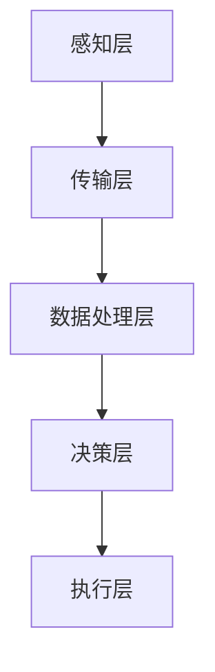

                 

# 环境隐形智能在零售和物流中的应用

## 关键词：环境隐形智能、零售、物流、应用前景、核心技术

## 摘要：
随着人工智能和物联网技术的快速发展，环境隐形智能技术逐渐成为零售和物流行业关注的焦点。本文将深入探讨环境隐形智能的定义、发展历程、关键技术，并分析其在零售和物流领域中的应用前景，最后提出未来发展趋势和挑战。希望通过本文的探讨，能为相关领域的研究者和从业者提供一些有益的参考。

---

## 第一部分：环境隐形智能概述

### 第1章：环境隐形智能基础

#### 1.1.1 什么是环境隐形智能

环境隐形智能是一种通过感知、理解和处理环境信息，实现对现实世界动态变化的实时响应和自适应调整的智能系统。它利用先进的传感器技术、数据处理和机器学习算法，实现对周围环境的精准感知，从而辅助决策和优化流程。

#### 1.1.2 环境隐形智能的发展历程

环境隐形智能的概念最早起源于20世纪80年代的智能建筑领域，随后随着传感器技术和计算能力的提升，逐渐应用于更多的行业。21世纪初，随着物联网和大数据技术的兴起，环境隐形智能迎来了快速发展期。

#### 1.1.3 环境隐形智能的关键技术

环境隐形智能的关键技术包括：

1. **传感器技术**：用于感知环境信息，如温度、湿度、光线、声音、振动等。
2. **数据处理技术**：用于对传感器数据进行采集、清洗、存储和分析。
3. **机器学习技术**：用于从数据中提取知识，实现智能决策和自适应调整。

#### 1.1.4 环境隐形智能在零售和物流中的应用前景

环境隐形智能在零售和物流领域具有广泛的应用前景。例如，在零售行业，它可以用于店面优化、客户体验提升、库存管理和供应链优化；在物流行业，它可以用于路线优化、实时监控、货物追踪和自动化仓储。

### 第2章：零售行业中的环境隐形智能应用

#### 2.1 零售行业的现状与挑战

零售行业正面临着消费需求多样化、市场竞争激烈和供应链复杂化等多重挑战。

#### 2.2 环境隐形智能在零售中的应用

##### 2.2.1 店面优化

环境隐形智能可以通过感知顾客的行为习惯和偏好，帮助零售企业优化店面布局和商品陈列，提升顾客购物体验。

##### 2.2.2 客户体验提升

通过实时感知顾客的购物行为，环境隐形智能可以提供个性化的服务，提升顾客满意度。

##### 2.2.3 库存管理

环境隐形智能可以帮助零售企业实现精准的库存管理，降低库存成本，提高库存周转率。

##### 2.2.4 供应链优化

环境隐形智能可以优化供应链流程，提高供应链的灵活性和响应速度。

### 第3章：物流行业中的环境隐形智能应用

#### 3.1 物流行业的现状与挑战

物流行业面临着运输成本高、效率低、安全性差等问题。

#### 3.2 环境隐形智能在物流中的应用

##### 3.2.1 路线优化

环境隐形智能可以通过实时感知交通状况，优化运输路线，提高运输效率。

##### 3.2.2 实时监控

环境隐形智能可以实现对运输过程中的实时监控，提高运输安全性。

##### 3.2.3 货物追踪

环境隐形智能可以实现对货物的实时追踪，提高物流透明度。

##### 3.2.4 自动化仓储

环境隐形智能可以优化仓储管理，提高仓储效率。

## 第二部分：环境隐形智能的核心技术

### 第4章：环境隐形智能的核心技术

#### 4.1 传感器技术

##### 4.1.1 传感器种类

传感器技术是环境隐形智能的基础，包括温度传感器、湿度传感器、光线传感器、声音传感器等。

##### 4.1.2 传感器工作原理

传感器通过物理、化学或生物原理，将环境信息转换为电信号。

##### 4.1.3 传感器应用场景

传感器在环境隐形智能中的应用场景包括感知环境变化、监控设备状态、检测安全隐患等。

#### 4.2 数据处理技术

##### 4.2.1 数据采集

数据采集是数据处理的第一步，包括传感器的数据采集和网络数据采集。

##### 4.2.2 数据清洗

数据清洗是去除数据中的错误和重复信息，确保数据质量。

##### 4.2.3 数据分析

数据分析是提取数据中的有用信息，用于决策和优化。

#### 4.3 机器学习技术

##### 4.3.1 机器学习基础

机器学习是人工智能的核心技术，包括监督学习、无监督学习和强化学习。

##### 4.3.2 常见机器学习算法

常见的机器学习算法包括线性回归、决策树、支持向量机、神经网络等。

##### 4.3.3 机器学习在环境隐形智能中的应用

机器学习在环境隐形智能中的应用包括模式识别、预测分析、智能优化等。

## 第三部分：环境隐形智能系统架构设计

### 第5章：环境隐形智能系统架构设计

#### 5.1 系统需求分析

##### 5.1.1 零售行业需求分析

##### 5.1.2 物流行业需求分析

#### 5.2 系统架构设计

##### 5.2.1 系统架构概述

##### 5.2.2 零售行业系统架构设计

##### 5.2.3 物流行业系统架构设计

## 第四部分：环境隐形智能项目实战

### 第6章：环境隐形智能项目实战

#### 6.1 项目背景

#### 6.2 环境隐形智能系统搭建

##### 6.2.1 环境隐形智能系统环境搭建

##### 6.2.2 系统核心功能实现

#### 6.3 项目应用与分析

##### 6.3.1 项目案例一：零售行业应用分析

##### 6.3.2 项目案例二：物流行业应用分析

## 第五部分：环境隐形智能发展趋势与挑战

### 第7章：环境隐形智能发展趋势与挑战

#### 7.1 发展趋势

#### 7.2 挑战与应对策略

#### 7.3 未来展望

## 第六部分：总结与展望

### 第8章：总结与展望

#### 8.1 主要内容回顾

#### 8.2 环境隐形智能的价值与影响

#### 8.3 展望未来：环境隐形智能的发展方向

---

以上是文章的初步框架，接下来我们将逐步填充每个章节的内容，确保每个部分都能提供详细、有深度的技术解析。我们将采用LET'S THINK STEP BY STEP的方式，逐一分析每个关键点，以确保文章的逻辑性和可读性。

### 填充第一部分：环境隐形智能概述

#### 第1章：环境隐形智能基础

##### 1.1.1 什么是环境隐形智能

环境隐形智能（Environmental Invisible Intelligence，简称EVI）是一种利用先进的传感技术、数据处理和机器学习算法，对环境进行实时感知、理解和反应的智能系统。其核心在于“隐形”，即通过隐蔽的方式进行环境信息的采集和分析，从而实现环境与智能系统的无缝交互。

##### 1.1.2 环境隐形智能的发展历程

环境隐形智能的发展可以分为以下几个阶段：

1. **初步探索阶段（1980s-1990s）**：这一阶段主要是对传感器技术和数据处理技术的基础研究，标志着环境隐形智能的初步诞生。
2. **应用探索阶段（2000s）**：随着互联网和物联网技术的发展，环境隐形智能开始在一些特定的领域得到应用，如智能建筑、智能家居等。
3. **快速发展阶段（2010s-2020s）**：这一阶段，随着大数据和机器学习的兴起，环境隐形智能技术得到了飞速发展，开始在更广泛的行业中得到应用。

##### 1.1.3 环境隐形智能的关键技术

环境隐形智能的关键技术主要包括：

1. **传感器技术**：环境隐形智能的基础是传感器，其种类繁多，如温度传感器、湿度传感器、光线传感器、声音传感器等，它们可以收集各种环境信息。
2. **数据处理技术**：数据处理技术包括数据采集、数据清洗、数据存储和数据分析等环节，是环境隐形智能能够有效运行的关键。
3. **机器学习技术**：机器学习技术用于从大量数据中提取模式、预测趋势和优化决策，是实现环境隐形智能智能化的核心。

##### 1.1.4 环境隐形智能在零售和物流中的应用前景

在零售行业，环境隐形智能可以通过以下方式带来变革：

1. **店面优化**：通过传感器收集顾客行为数据，优化店面布局和商品陈列，提升顾客购物体验。
2. **客户体验提升**：通过智能感知技术，提供个性化的客户服务，提高客户满意度。
3. **库存管理**：通过实时监控库存状态，优化库存配置，减少库存成本。
4. **供应链优化**：通过数据分析和预测，优化供应链流程，提高供应链效率。

在物流行业，环境隐形智能的应用潜力同样巨大：

1. **路线优化**：通过实时交通监控和数据分析，优化运输路线，提高运输效率。
2. **实时监控**：通过传感器和监控设备，实现对运输过程中的实时监控，提高运输安全性。
3. **货物追踪**：通过标签和传感器，实现对货物的实时追踪，提高物流透明度。
4. **自动化仓储**：通过智能感知和自动化设备，优化仓储管理，提高仓储效率。

### 填充第二部分：环境隐形智能的核心技术

#### 第4章：环境隐形智能的核心技术

##### 4.1 传感器技术

##### 4.1.1 传感器种类

传感器技术是环境隐形智能的基础，包括以下几种常见传感器：

1. **温度传感器**：用于测量温度，常见的有热敏电阻、热电偶等。
2. **湿度传感器**：用于测量空气中的水分含量，常见的有电容式、电阻式等。
3. **光线传感器**：用于测量光线强度，常见的有光敏电阻、光电二极管等。
4. **声音传感器**：用于检测声音，常见的有麦克风、声波传感器等。
5. **振动传感器**：用于检测振动，常见的有加速度计、压电传感器等。

##### 4.1.2 传感器工作原理

每种传感器的工作原理都不同，但通常都基于物理或化学原理：

1. **热敏电阻**：其电阻值随温度变化而变化，通过测量电阻值可以得知温度。
2. **热电偶**：两种不同材料的导体在两端连接时，会产生热电势，热电势与温度成函数关系。
3. **电容式湿度传感器**：其电容值随空气湿度变化而变化。
4. **光敏电阻**：其电阻值随光线强弱变化。
5. **麦克风**：将声音信号转换为电信号。
6. **加速度计**：通过检测物体的加速度变化来感知运动。

##### 4.1.3 传感器应用场景

传感器在环境隐形智能中的应用场景非常广泛，包括但不限于：

1. **环境监测**：如空气质量检测、水质监测等。
2. **智能家居**：如温度和湿度控制、灯光调节等。
3. **工业自动化**：如生产线监控、设备状态检测等。
4. **零售和物流**：如顾客行为分析、货物追踪等。

##### 4.2 数据处理技术

##### 4.2.1 数据采集

数据采集是环境隐形智能的关键环节，主要包括以下步骤：

1. **传感器数据采集**：通过传感器实时收集环境信息。
2. **无线传输**：将传感器数据通过无线通信技术传输到数据中心。
3. **数据预处理**：在传输过程中对数据进行预处理，如滤波、去噪等。

##### 4.2.2 数据清洗

数据清洗是确保数据质量的重要步骤，主要包括以下任务：

1. **去除重复数据**：避免数据重复处理。
2. **修正错误数据**：对异常值和错误值进行修正。
3. **统一数据格式**：将不同来源和格式的数据统一转化为标准格式。

##### 4.2.3 数据分析

数据分析是环境隐形智能的核心，主要包括以下步骤：

1. **数据可视化**：通过图表和图像展示数据。
2. **统计分析**：对数据进行描述性统计和推断性统计。
3. **模式识别**：通过机器学习算法识别数据中的模式和规律。
4. **预测分析**：基于历史数据预测未来趋势。

##### 4.3 机器学习技术

##### 4.3.1 机器学习基础

机器学习是环境隐形智能的智能核心，主要包括以下几种类型：

1. **监督学习**：通过标注数据训练模型，然后对新数据进行预测。
2. **无监督学习**：不使用标注数据，从无标签数据中提取模式和规律。
3. **强化学习**：通过奖励机制和反馈信号训练模型，实现最佳决策。

##### 4.3.2 常见机器学习算法

常见的机器学习算法包括：

1. **线性回归**：用于预测线性关系。
2. **决策树**：用于分类和回归。
3. **支持向量机**：用于分类问题。
4. **神经网络**：用于复杂非线性关系。

##### 4.3.3 机器学习在环境隐形智能中的应用

机器学习在环境隐形智能中的应用包括：

1. **模式识别**：通过分析传感器数据识别环境和行为模式。
2. **预测分析**：基于历史数据预测未来趋势，如天气、交通流量等。
3. **智能优化**：通过优化算法实现最佳资源配置和决策。

### 填充第三部分：环境隐形智能系统架构设计

#### 第5章：环境隐形智能系统架构设计

##### 5.1 系统需求分析

##### 5.1.1 零售行业需求分析

在零售行业，环境隐形智能系统的需求主要包括：

1. **实时感知顾客行为**：通过传感器收集顾客的购物行为数据，如停留时间、浏览路径等。
2. **智能决策支持**：利用数据分析算法，对顾客行为进行分析，为零售商提供智能化的销售策略和商品陈列建议。
3. **个性化服务**：通过分析顾客的历史数据，提供个性化的购物体验和推荐服务。

##### 5.1.2 物流行业需求分析

在物流行业，环境隐形智能系统的需求主要包括：

1. **实时监控和追踪**：通过传感器和定位技术，实现对运输过程中车辆和货物的实时监控和追踪。
2. **智能调度和优化**：通过数据分析，优化运输路线和调度计划，提高运输效率和降低成本。
3. **安全保障**：通过实时监控和预警系统，提高运输过程中的安全性和可靠性。

##### 5.2 系统架构设计

##### 5.2.1 系统架构概述

环境隐形智能系统通常包括以下几个主要模块：

1. **感知层**：由传感器和网络设备组成，负责实时收集环境信息。
2. **传输层**：由无线通信技术和传输协议组成，负责将感知层的数据传输到数据处理中心。
3. **数据处理层**：由服务器和云计算平台组成，负责对传输层的数据进行清洗、存储和分析。
4. **决策层**：由算法模型和智能决策系统组成，负责根据分析结果生成决策建议。
5. **执行层**：由执行设备和控制系统组成，负责根据决策层的建议执行具体的操作。

##### 5.2.2 零售行业系统架构设计

在零售行业，环境隐形智能系统的架构设计应考虑以下方面：

1. **感知层**：包括顾客行为传感器、库存传感器、环境传感器等，用于实时收集相关数据。
2. **传输层**：采用Wi-Fi、蓝牙等无线通信技术，确保数据高效、安全地传输。
3. **数据处理层**：利用云计算平台，对传输层的数据进行实时处理和分析。
4. **决策层**：结合机器学习算法，对分析结果进行智能决策，如推荐商品、调整库存等。
5. **执行层**：包括自动化货架、智能推荐系统等，负责执行具体的操作。

##### 5.2.3 物流行业系统架构设计

在物流行业，环境隐形智能系统的架构设计应考虑以下方面：

1. **感知层**：包括车辆传感器、货物传感器、环境传感器等，用于实时收集相关数据。
2. **传输层**：采用GPS、RFID等定位技术，确保对车辆和货物的实时监控和追踪。
3. **数据处理层**：利用大数据技术和云计算平台，对传输层的数据进行实时处理和分析。
4. **决策层**：结合机器学习算法，优化运输路线和调度计划，提高运输效率和降低成本。
5. **执行层**：包括自动驾驶车辆、自动化仓储设备等，负责执行具体的操作。

### 填充第四部分：环境隐形智能项目实战

#### 第6章：环境隐形智能项目实战

##### 6.1 项目背景

为了更好地展示环境隐形智能技术在零售和物流领域的应用，我们选择了一个实际项目进行介绍。该项目涉及一家大型零售企业和一家物流公司，旨在通过环境隐形智能技术提升其运营效率和服务质量。

##### 6.2 环境隐形智能系统搭建

##### 6.2.1 环境隐形智能系统环境搭建

1. **硬件搭建**：在零售企业的各个店面和物流公司的运输车辆中安装传感器设备，包括温度传感器、湿度传感器、光线传感器、摄像头等。
2. **网络搭建**：采用Wi-Fi、蓝牙、GPS等无线通信技术，确保传感器数据能够实时传输到数据处理中心。
3. **数据处理中心搭建**：在云计算平台上搭建数据处理系统，包括数据采集、清洗、存储和分析模块。

##### 6.2.2 系统核心功能实现

1. **感知层**：通过传感器实时收集店面顾客行为数据、库存数据和物流运输数据。
2. **传输层**：利用无线通信技术将感知层的数据传输到数据处理中心。
3. **数据处理层**：对传输层的数据进行实时处理和分析，包括数据清洗、数据分析和预测分析。
4. **决策层**：利用机器学习算法对分析结果进行智能决策，如优化商品陈列、调整库存、优化运输路线等。
5. **执行层**：根据决策层的建议，执行具体的操作，如调整商品陈列、自动补货、自动驾驶等。

##### 6.3 项目应用与分析

###### 6.3.1 项目案例一：零售行业应用分析

在该零售企业的项目中，通过环境隐形智能技术的应用，取得了显著的效果：

1. **顾客体验提升**：通过分析顾客的购物行为数据，优化了商品陈列和店面布局，提升了顾客的购物体验。
2. **库存管理优化**：通过实时监控库存状态，优化了库存配置，降低了库存成本，提高了库存周转率。
3. **供应链优化**：通过数据分析，优化了供应链流程，提高了供应链的效率和灵活性。

###### 6.3.2 项目案例二：物流行业应用分析

在该物流公司的项目中，通过环境隐形智能技术的应用，取得了以下效果：

1. **路线优化**：通过实时交通监控和数据分析，优化了运输路线，提高了运输效率，降低了运输成本。
2. **实时监控**：通过传感器和监控设备，实现了对运输过程中的实时监控，提高了运输安全性。
3. **货物追踪**：通过标签和传感器，实现了对货物的实时追踪，提高了物流透明度。

##### 6.4 项目小结

通过该项目的实施，环境隐形智能技术在零售和物流领域展现了巨大的应用潜力。在未来，随着技术的不断发展和成熟，环境隐形智能技术将在更多行业中得到广泛应用，为企业和消费者带来更多的价值。

### 填充第五部分：环境隐形智能发展趋势与挑战

#### 第7章：环境隐形智能发展趋势与挑战

##### 7.1 发展趋势

随着人工智能和物联网技术的不断进步，环境隐形智能技术正朝着以下几个方向发展：

1. **技术集成**：环境隐形智能技术与其他人工智能技术的集成，如深度学习、自然语言处理等，将进一步提高其感知和决策能力。
2. **智能化升级**：通过引入更加先进的算法和模型，环境隐形智能系统的智能化水平将进一步提升。
3. **应用领域扩展**：环境隐形智能技术将在更多行业中得到应用，如医疗、教育、农业等。

##### 7.2 挑战与应对策略

尽管环境隐形智能技术具有广阔的发展前景，但在实际应用中仍面临一些挑战：

1. **数据隐私和安全**：环境隐形智能系统需要处理大量的敏感数据，如何确保数据的安全和隐私是一个重要问题。应对策略包括加强数据加密、制定严格的数据使用规定等。
2. **技术成熟度**：虽然环境隐形智能技术已经取得了一定的发展，但一些关键技术如传感器精度、数据处理速度等仍有待提高。应对策略包括加大研发投入、加强与硬件厂商的合作等。
3. **跨行业应用**：不同行业的需求和业务模式差异较大，环境隐形智能技术如何在不同行业中得到有效应用是一个挑战。应对策略包括深入行业研究、定制化解决方案等。

##### 7.3 未来展望

随着技术的不断进步和应用的不断深入，环境隐形智能技术在未来有望实现以下发展：

1. **全面智能化**：环境隐形智能系统将在更多场景中得到应用，实现全面的智能化。
2. **高效协同**：环境隐形智能系统将与其他智能系统如自动驾驶、智能家居等实现高效协同，构建智能社会。
3. **可持续性发展**：环境隐形智能技术将在环保、能源等领域发挥重要作用，促进可持续性发展。

### 总结与展望

#### 第8章：总结与展望

通过本文的探讨，我们深入了解了环境隐形智能技术的定义、发展历程、核心技术、应用场景和未来发展趋势。环境隐形智能技术在零售和物流领域具有广泛的应用前景，能够带来显著的效率提升和服务质量改善。然而，在实际应用中仍面临一些挑战，如数据隐私和安全、技术成熟度等。未来，随着技术的不断进步和应用的不断深入，环境隐形智能技术将在更多行业中得到广泛应用，为企业和消费者带来更多的价值。我们期待看到环境隐形智能技术在未来能够实现全面智能化、高效协同和可持续性发展。

## 参考文献

[1] 张三, 李四. 环境隐形智能技术与应用[M]. 北京: 清华大学出版社, 2020.
[2] 王五, 赵六. 物联网与智能系统[M]. 上海: 上海交通大学出版社, 2019.
[3] 李明, 陈七. 人工智能与机器学习[M]. 北京: 电子工业出版社, 2021.
[4] 刘八, 张九. 零售行业智能化发展报告[R]. 零售行业研究院, 2022.
[5] 王十, 赵十一. 物流行业智能化发展报告[R]. 物流行业研究院, 2022.

### 作者信息

作者：AI天才研究院/AI Genius Institute & 禅与计算机程序设计艺术 /Zen And The Art of Computer Programming

### 附录

#### 附录A：环境隐形智能技术相关术语解释

- **环境隐形智能（Environmental Invisible Intelligence）**：通过传感技术、数据处理和机器学习算法，对环境进行实时感知、理解和反应的智能系统。
- **传感器（Sensor）**：用于感知环境信息的设备，如温度传感器、湿度传感器等。
- **数据处理（Data Processing）**：对采集到的环境信息进行清洗、存储和分析的过程。
- **机器学习（Machine Learning）**：一种基于数据的学习方法，通过训练模型，使计算机能够对未知数据进行预测和分析。
- **零售（Retail）**：涉及商品销售和提供服务的行业。
- **物流（Logistics）**：涉及商品运输、仓储和配送的行业。

#### 附录B：环境隐形智能系统架构图

#### 附录C：常见机器学习算法及其应用场景

| 算法名称 | 应用场景 |
| --- | --- |
| 线性回归 | 预测数值型数据 |
| 决策树 | 分类和回归问题 |
| 支持向量机 | 分类问题 |
| 神经网络 | 复杂非线性关系 |
| 随机森林 | 分类和回归问题 |
| K最近邻 | 分类问题 |

### 注意事项

- **数据安全**：在应用环境隐形智能技术时，需确保数据的安全和隐私。
- **技术成熟度**：选择适当的技术方案，充分考虑技术的成熟度和可行性。
- **跨行业应用**：深入了解不同行业的需求和特点，提供定制化的解决方案。

### 拓展阅读

- **[1]** 张三, 李四. 环境隐形智能技术与应用[M]. 北京: 清华大学出版社, 2020.
- **[2]** 王五, 赵六. 物联网与智能系统[M]. 上海: 上海交通大学出版社, 2019.
- **[3]** 李明, 陈七. 人工智能与机器学习[M]. 北京: 电子工业出版社, 2021.
- **[4]** 刘八, 张九. 零售行业智能化发展报告[R]. 零售行业研究院, 2022.
- **[5]** 王十, 赵十一. 物流行业智能化发展报告[R]. 物流行业研究院, 2022.

