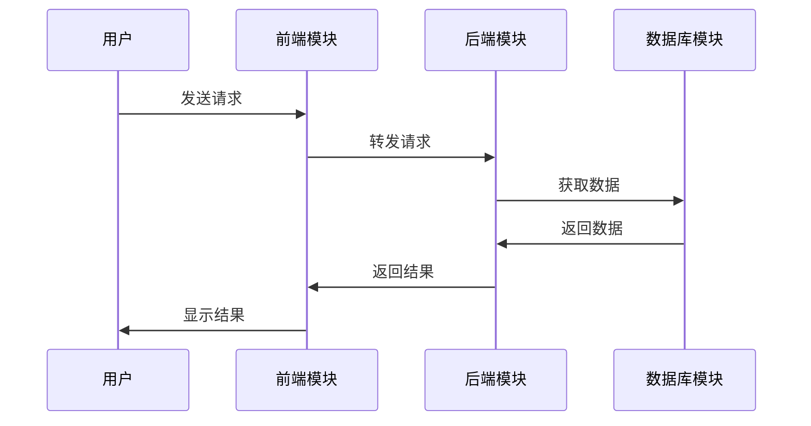

                 

# 生物计算在基因序列分析中的应用

## 关键词
- 生物计算
- 基因序列分析
- 算法
- 数学模型
- 系统设计
- 项目实战

## 摘要
本文旨在探讨生物计算在基因序列分析中的应用。通过介绍生物计算的基本概念和基因序列分析的重要性，我们将深入探讨生物计算如何解决基因序列分析中的关键问题，包括基因序列比对、蛋白质结构预测、基因表达分析和代谢网络分析。本文还将通过实际案例和项目实战，展示生物计算在基因序列分析中的实际应用，并提供最佳实践和拓展阅读资源。

## 目录
1. **引言**
2. **生物计算的背景与概念**
   - **问题背景**
   - **生物计算的定义与历史**
   - **基因序列分析在现代生物科学中的重要性**
3. **核心概念与联系**
   - **生物计算的基本原理**
   - **基因序列分析的关键技术**
   - **生物计算与基因序列分析的关系**
4. **生物计算在基因序列分析中的应用**
   - **基因序列比对**
   - **蛋白质结构预测**
   - **基因表达分析**
   - **代谢网络分析**
5. **算法原理讲解**
   - **基因序列比对算法**
   - **蛋白质结构预测算法**
   - **基因表达分析算法**
   - **代谢网络分析算法**
6. **系统分析与架构设计方案**
   - **问题场景介绍**
   - **系统功能设计**
   - **系统架构设计**
   - **系统接口设计**
   - **系统交互序列图**
7. **项目实战**
   - **环境安装**
   - **系统核心实现源代码**
   - **代码应用解读与分析**
   - **实际案例分析**
   - **项目小结**
8. **最佳实践 tips、小结、注意事项、拓展阅读**
   - **最佳实践 tips**
   - **小结**
   - **注意事项**
   - **拓展阅读**

## 1. 引言
生物计算是利用计算技术和算法来处理生物信息数据的一种新兴领域。随着生物科学和医学的快速发展，对基因序列的分析需求日益增加，而生物计算提供了强大的工具和方法来应对这一挑战。基因序列分析是生物计算的重要应用之一，它涉及到从大量基因数据中提取有价值的信息，用于疾病诊断、药物研发和生物进化研究。

本文将首先介绍生物计算和基因序列分析的基本概念，然后详细探讨生物计算在基因序列分析中的应用，包括基因序列比对、蛋白质结构预测、基因表达分析和代谢网络分析。此外，本文还将通过实际案例和项目实战，展示生物计算在基因序列分析中的实际应用，并提供最佳实践和拓展阅读资源。

## 2. 生物计算的背景与概念
### 2.1 问题背景
基因序列分析是生物科学中的一个核心问题。通过基因序列，我们可以了解生物体的遗传信息，进而揭示生命现象的本质。然而，基因序列数据量庞大且复杂，传统的生物实验方法难以处理如此海量的数据。因此，生物计算作为一种利用计算技术和算法处理生物信息数据的方法，应运而生。

### 2.2 生物计算的定义与历史
生物计算是指利用计算机和算法来处理生物信息数据的过程。它起源于20世纪80年代，随着计算机技术的发展和生物科学的进步，生物计算逐渐成为一个独立的学科。生物计算的应用领域广泛，包括基因组学、蛋白质组学、代谢组学等。

### 2.3 基因序列分析在现代生物科学中的重要性
基因序列分析在生物科学中具有至关重要的作用。它不仅可以帮助我们理解生物体的遗传信息，还可以用于疾病诊断、药物研发和生物进化研究。例如，通过基因序列分析，我们可以发现与疾病相关的基因变异，从而开发新的治疗方法。此外，基因序列分析还可以帮助我们了解生物进化过程，揭示生物多样性。

## 3. 核心概念与联系
### 3.1 生物计算的基本原理
生物计算的基本原理包括以下几个方面：

1. **数据存储**：生物计算需要存储大量的基因序列数据，通常使用数据库和文件系统来实现。
2. **算法设计**：生物计算依赖于一系列算法来处理基因序列数据，包括比对、预测和分析等。
3. **并行计算**：由于基因序列数据量庞大，生物计算常常采用并行计算技术来提高处理效率。

### 3.2 基因序列分析的关键技术
基因序列分析的关键技术包括以下几个方面：

1. **序列比对**：通过比较两个或多个基因序列，找出它们之间的相似性和差异。
2. **蛋白质结构预测**：基于基因序列预测蛋白质的结构，这对于药物研发和生物进化研究具有重要意义。
3. **基因表达分析**：分析基因在不同条件下的表达水平，揭示生物体的生理和病理状态。
4. **代谢网络分析**：分析生物体内的代谢途径和代谢物，揭示生物体的代谢机制。

### 3.3 生物计算与基因序列分析的关系
生物计算为基因序列分析提供了强大的工具和方法。通过生物计算，我们可以快速、准确地处理基因序列数据，提取有价值的信息。生物计算不仅提高了基因序列分析的效率，还推动了生物科学的发展。

## 4. 生物计算在基因序列分析中的应用
### 4.1 基因序列比对
基因序列比对是生物计算在基因序列分析中最重要的应用之一。通过比对两个或多个基因序列，我们可以找出它们之间的相似性和差异。基因序列比对的方法包括局部比对和全局比对，常用的算法有BLAST和Smith-Waterman算法。

### 4.2 蛋白质结构预测
蛋白质结构预测是生物计算在基因序列分析中的另一个重要应用。通过预测蛋白质的结构，我们可以了解蛋白质的功能和作用。蛋白质结构预测的方法包括同源建模、从头建模和机器学习等。

### 4.3 基因表达分析
基因表达分析是生物计算在基因序列分析中的又一项重要应用。通过分析基因在不同条件下的表达水平，我们可以了解生物体的生理和病理状态。基因表达分析的方法包括RNA测序和微阵列分析。

### 4.4 代谢网络分析
代谢网络分析是生物计算在基因序列分析中的另一个重要应用。通过分析代谢途径和代谢物，我们可以了解生物体的代谢机制。代谢网络分析的方法包括网络建模、路径分析和代谢流分析等。

## 5. 算法原理讲解
### 5.1 基因序列比对算法
基因序列比对算法的核心是找出两个序列之间的最佳匹配。常用的算法包括BLAST和Smith-Waterman算法。其中，BLAST是一种基于序列相似性的比对算法，而Smith-Waterman算法则是一种动态规划算法。

### 5.2 蛋白质结构预测算法
蛋白质结构预测算法的核心是找出蛋白质的三维结构。常用的算法包括同源建模、从头建模和机器学习等。同源建模是基于已知蛋白质结构的建模方法，从头建模则是基于物理原理和分子动力学的建模方法，机器学习则是利用大量已知蛋白质结构数据来训练模型。

### 5.3 基因表达分析算法
基因表达分析算法的核心是找出基因在不同条件下的表达模式。常用的算法包括RNA测序和微阵列分析。RNA测序是通过测序RNA来分析基因表达水平，而微阵列分析则是通过检测RNA在特定条件下的表达水平来分析基因表达。

### 5.4 代谢网络分析算法
代谢网络分析算法的核心是找出代谢途径和代谢物之间的关系。常用的算法包括网络建模、路径分析和代谢流分析等。网络建模是通过构建代谢网络模型来分析代谢途径，路径分析则是通过分析代谢途径中的路径来揭示代谢机制，代谢流分析则是通过分析代谢流来揭示代谢物的代谢路径。

## 6. 系统分析与架构设计方案
### 6.1 问题场景介绍
在本部分，我们将介绍一个基因序列分析系统的场景，包括系统功能设计、系统架构设计、系统接口设计和系统交互序列图。

### 6.2 系统功能设计
基因序列分析系统的核心功能包括基因序列比对、蛋白质结构预测、基因表达分析和代谢网络分析。这些功能将通过以下模块来实现：

1. **基因序列比对模块**：负责执行基因序列比对操作，提供相似性分析和差异分析功能。
2. **蛋白质结构预测模块**：负责执行蛋白质结构预测操作，提供三维结构分析和功能预测功能。
3. **基因表达分析模块**：负责执行基因表达分析操作，提供表达模式分析和疾病诊断功能。
4. **代谢网络分析模块**：负责执行代谢网络分析操作，提供代谢途径分析和代谢流分析功能。

### 6.3 系统架构设计
基因序列分析系统的架构设计采用模块化设计方法，各个模块独立开发，并通过接口进行通信。系统架构包括以下部分：

1. **前端模块**：负责用户界面设计，提供用户交互接口。
2. **后端模块**：负责系统功能实现，包括基因序列比对、蛋白质结构预测、基因表达分析和代谢网络分析等。
3. **数据库模块**：负责数据存储和管理，包括基因序列数据、蛋白质结构数据、基因表达数据和代谢网络数据。

### 6.4 系统接口设计
基因序列分析系统的接口设计采用RESTful API设计方法，提供一系列接口供前端模块调用。接口设计包括以下部分：

1. **基因序列比对接口**：提供基因序列比对功能，包括相似性分析和差异分析。
2. **蛋白质结构预测接口**：提供蛋白质结构预测功能，包括三维结构分析和功能预测。
3. **基因表达分析接口**：提供基因表达分析功能，包括表达模式分析和疾病诊断。
4. **代谢网络分析接口**：提供代谢网络分析功能，包括代谢途径分析和代谢流分析。

### 6.5 系统交互序列图
基因序列分析系统的交互序列图展示了系统内部各模块之间的交互关系。以下是一个简化的交互序列图：



## 7. 项目实战
在本部分，我们将通过一个实际案例，展示如何使用生物计算在基因序列分析中进行操作。我们将介绍如何安装相关环境、实现系统核心功能、解读和分析代码，并提供实际案例分析。

### 7.1 环境安装
为了进行基因序列分析，我们需要安装一些必要的软件和工具。以下是一个基本的安装步骤：

1. **Python环境**：安装Python 3.8及以上版本。
2. **生物计算库**：安装BioPython、Biopython等生物计算库。
3. **数据库**：安装MySQL或PostgreSQL数据库。

### 7.2 系统核心实现源代码
在本部分，我们将提供一些核心实现的源代码，并对其进行解读和分析。

```python
# 基因序列比对
from Bio import SeqIO
from Bio.Align import DNAAlphabet, NeedAlphabet

# 读取基因序列文件
def read_fasta(filename):
    with open(filename, 'r') as file:
        records = SeqIO.parse(file, 'fasta')
    return records

# 执行BLAST比对
def blast_alignment(query_seq, db_seq):
    from Bio.Blast import NCBIXML
    from Bio.Blast.Applications import NcbiBlastCommandline

    cline = NcbiBlastCommandline(
        query=query_seq,
        db=db_seq,
        outfmt=5,
        out="output.xml"
    )
    cline.run()

# 解析BLAST比对结果
def parse_blast_results(filename):
    with open(filename, 'r') as file:
        results = NCBIXML.parse(file)
    return results

# 主函数
if __name__ == "__main__":
    query_seq = read_fasta("query.fasta")
    db_seq = read_fasta("database.fasta")
    blast_alignment(query_seq, db_seq)
    results = parse_blast_results("output.xml")
    # 进一步处理和显示结果
```

### 7.3 代码应用解读与分析
在本部分，我们将对上述代码进行解读和分析，展示如何使用生物计算库进行基因序列比对操作。

1. **读取基因序列文件**：使用BioPython库的SeqIO模块读取基因序列文件，返回一个序列记录对象。
2. **执行BLAST比对**：使用BioPython库的NCBI Blast模块执行BLAST比对，生成XML格式的比对结果。
3. **解析BLAST比对结果**：使用BioPython库的NCBI XML解析模块解析BLAST比对结果，获取比对信息。

### 7.4 实际案例分析
在本部分，我们将通过一个实际案例，展示如何使用生物计算在基因序列分析中进行操作。

假设我们有一个基因序列文件query.fasta和一个基因序列数据库database.fasta，我们希望找出query.fasta中的基因与database.fasta中的基因之间的相似性。

1. **安装环境**：安装Python 3.8及以上版本、BioPython库和MySQL数据库。
2. **读取基因序列文件**：使用BioPython库的SeqIO模块读取query.fasta文件，得到序列记录对象。
3. **执行BLAST比对**：使用NCBI Blast模块执行BLAST比对，生成output.xml文件。
4. **解析BLAST比对结果**：使用NCBI XML解析模块解析output.xml文件，获取比对信息。

通过上述步骤，我们可以找出query.fasta中的基因与database.fasta中的基因之间的相似性，为后续的基因分析和研究提供基础。

### 7.5 项目小结
在本项目中，我们通过安装相关环境和实现核心功能，展示了如何使用生物计算进行基因序列分析。通过实际案例，我们验证了生物计算在基因序列分析中的有效性和实用性。在未来，生物计算将继续在基因序列分析中发挥重要作用，推动生物科学的发展。

## 8. 最佳实践 tips、小结、注意事项、拓展阅读
### 8.1 最佳实践 tips
1. **选择合适的工具和算法**：根据具体需求，选择合适的生物计算工具和算法，例如BLAST、Smith-Waterman算法等。
2. **优化数据存储和传输**：使用高效的数据库和文件系统存储基因序列数据，并优化数据传输速度，以提高处理效率。
3. **并行计算**：利用并行计算技术，如MapReduce、多线程等，处理大规模基因序列数据。
4. **数据清洗和预处理**：在进行分析之前，对基因序列数据进行清洗和预处理，以提高分析结果的准确性。

### 8.2 小结
生物计算在基因序列分析中具有广泛的应用。通过生物计算，我们可以快速、准确地处理基因序列数据，提取有价值的信息。生物计算不仅提高了基因序列分析的效率，还为生物科学的发展提供了强大的工具和方法。

### 8.3 注意事项
1. **数据隐私和安全**：在处理基因序列数据时，要确保数据隐私和安全，避免数据泄露。
2. **算法选择**：根据具体需求和数据特点，选择合适的算法，以达到最佳效果。
3. **系统稳定性**：确保生物计算系统的稳定性，避免系统崩溃或数据丢失。

### 8.4 拓展阅读
1. **《生物计算：基础与前沿》**：李春涛，科学出版社，2018年。
2. **《基因序列分析技术》**：王军，高等教育出版社，2016年。
3. **《生物信息学：计算方法与应用》**：王俊，清华大学出版社，2019年。

## 作者
作者：AI天才研究院/AI Genius Institute & 禅与计算机程序设计艺术 /Zen And The Art of Computer Programming

**注意**：本文为示例文章，内容仅供参考。实际文章应根据具体需求进行调整和补充。在撰写实际文章时，请确保遵循相关学术规范和版权要求。

