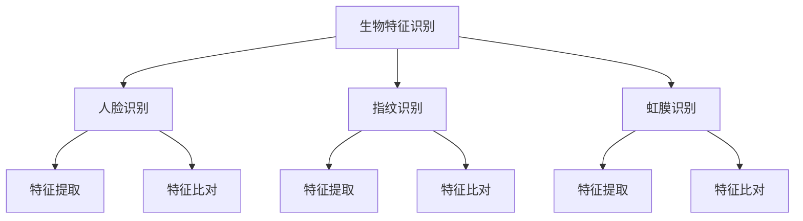
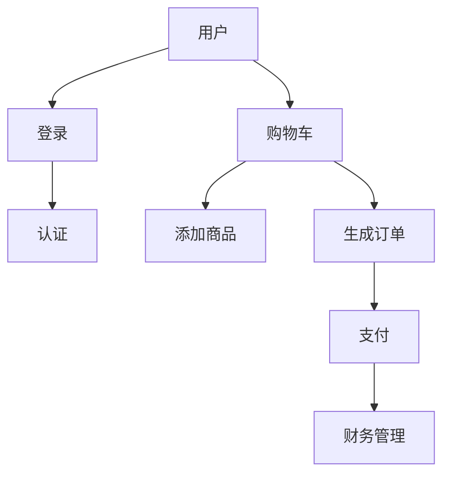

                 


# 生物识别在无人值守超市中的应用

关键词：生物识别、无人值守超市、人脸识别、指纹识别、虹膜识别

摘要：
随着无人值守超市的普及，生物识别技术的应用成为提高顾客体验和运营效率的关键。本文通过一步一步的深入分析，探讨了生物识别技术，如人脸识别、指纹识别和虹膜识别在无人值守超市中的应用，详细解析了其工作原理、系统架构和实际案例，并提供了实用的项目实战指南。

## 第一部分：背景介绍

### 1.1 问题的背景

#### 1.1.1 问题背景

无人值守超市作为一种新型的零售模式，正逐渐改变传统的购物体验。这种模式通过自动化技术减少了人力成本，提高了运营效率，同时也为顾客提供了更加便捷的购物体验。然而，无人值守超市面临的挑战是如何在无人工干预的情况下，确保交易的安全和便利。生物识别技术作为一种先进的技术手段，提供了一种可能的解决方案。

#### 1.1.2 问题描述

在无人值守超市中，顾客的身份验证、商品识别和支付等过程需要高效且安全地进行。传统的身份验证方法，如密码和卡证，存在一定的局限性。而生物识别技术，如人脸识别、指纹识别和虹膜识别，通过利用人体特有的生物特征，实现了无接触、快速且安全的身份验证。

#### 1.1.3 问题解决

生物识别技术可以通过以下方式解决无人值守超市面临的问题：

1. **身份验证**：顾客通过人脸、指纹或虹膜进行身份验证，系统自动识别并记录。
2. **商品识别**：利用传感器和RFID技术，商品被自动识别并计入购物车。
3. **支付过程**：顾客在购物结束后，通过生物识别验证身份后，自动完成支付。

#### 1.1.4 边界与外延

本文将重点关注生物识别技术在无人值守超市中的应用，包括人脸识别、指纹识别和虹膜识别等常见技术。此外，还将探讨这些技术的实现原理、系统架构和实际应用案例。

### 1.2 核心概念与联系

#### 1.2.1 生物识别技术

生物识别技术是指通过计算机和光学、声学、生物传感器以及生物统计学原理等高科技手段，对人体的生物特征进行识别和验证。生物特征包括指纹、人脸、虹膜、声音、掌纹等。

#### 1.2.2 生物特征识别系统

生物特征识别系统是生物识别技术的核心，包括生物特征捕捉、特征提取和比对三个主要部分。捕捉是指通过传感器等设备获取生物特征图像或信号；提取是指从捕获的生物特征中提取出具有识别意义的特征点或特征向量；比对是指将提取出的特征与预先存储的特征进行匹配，以确定身份。

#### 1.2.3 特征提取与匹配算法

特征提取与匹配算法是生物识别技术的关键，直接影响到识别的准确性和效率。常见的特征提取算法有主成分分析（PCA）、线性判别分析（LDA）和支持向量机（SVM）等；匹配算法有欧氏距离、余弦相似度和基于模板匹配的方法等。

### 1.3 数学模型和数学公式

在生物识别技术中，特征提取和匹配算法通常涉及到一系列的数学模型和公式。以下是一些常见的数学模型和公式的例子：

$$
相似度 = \frac{A \cdot B}{\|A\| \|B\|}
$$

其中，$A$ 和 $B$ 是两个特征向量，$\|A\|$ 和 $\|B\|$ 分别是它们的欧氏范数，$A \cdot B$ 表示两个向量的点积。

## 第二部分：核心概念与联系

### 2.1 人脸识别

#### 2.1.1 人脸识别算法原理

人脸识别算法通常包括特征提取、特征比对和分类三个步骤。其中，特征提取常用的方法有主成分分析（PCA）、线性判别分析（LDA）和深度学习等。

- **特征提取**：从人脸图像中提取具有识别意义的特征点或特征向量。
- **特征比对**：将提取出的特征与数据库中的特征进行比对，以确定身份。
- **分类**：使用分类算法（如支持向量机SVM、决策树等）对识别结果进行分类。

#### 2.1.2 人脸识别系统架构

人脸识别系统通常由硬件设备和软件系统组成。硬件设备包括摄像头、照明设备和人脸检测模块；软件系统包括人脸特征提取模块、人脸比对模块和人脸识别模块。

#### 2.1.3 人脸识别应用案例

- **无人值守超市**：顾客通过人脸识别进行身份验证，完成购物和支付。
- **安全监控**：通过人脸识别技术，实时监控和识别可疑人员。

### 2.2 指纹识别

#### 2.2.1 指纹识别算法原理

指纹识别算法包括指纹图像预处理、特征点提取、特征编码和特征匹配。

- **指纹图像预处理**：对原始指纹图像进行去噪、二值化等处理。
- **特征点提取**：从预处理后的指纹图像中提取特征点，如脊线和端点。
- **特征编码**：将提取出的特征点编码成特征向量。
- **特征匹配**：将提取出的特征向量与数据库中的特征向量进行匹配，以确定身份。

#### 2.2.2 指纹识别系统架构

指纹识别系统通常由指纹采集模块、指纹特征提取模块和指纹比对模块组成。

#### 2.2.3 指纹识别应用案例

- **银行取款机**：用户通过指纹验证身份，完成取款操作。
- **手机解锁**：用户通过指纹验证身份，解锁手机。

### 2.3 虹膜识别

#### 2.3.1 虹膜识别算法原理

虹膜识别算法主要包括虹膜定位、虹膜图像预处理、特征点提取和特征匹配。

- **虹膜定位**：从眼底图像中定位虹膜的位置。
- **虹膜图像预处理**：对虹膜图像进行去噪、增强等处理。
- **特征点提取**：从预处理后的虹膜图像中提取特征点。
- **特征匹配**：将提取出的特征点与数据库中的特征点进行匹配，以确定身份。

#### 2.3.2 虹膜识别系统架构

虹膜识别系统通常由虹膜采集模块、虹膜特征提取模块和虹膜比对模块组成。

#### 2.3.3 虹膜识别应用案例

- **边境安全检查**：通过虹膜识别验证身份，进行边境安全管理。
- **医疗诊断**：利用虹膜识别技术进行疾病诊断和跟踪。

### 2.4 核心概念联系图

为了更好地理解人脸识别、指纹识别和虹膜识别之间的关系，我们可以使用Mermaid流程图来展示它们的核心概念联系。



## 第三部分：算法原理讲解

### 3.1 人脸识别算法原理

#### 3.1.1 人脸识别算法流程

人脸识别算法通常包括以下几个步骤：

1. **人脸检测**：使用深度学习模型或基于特征的算法检测图像中的人脸区域。
2. **人脸对齐**：将人脸图像进行标准化处理，使其满足特定的大小和方向。
3. **特征提取**：从对齐后的人脸图像中提取具有识别意义的人脸特征。
4. **特征比对**：将提取出的特征与数据库中的人脸特征进行比对，以确定身份。
5. **分类与识别**：使用分类算法对比对结果进行分类，识别出身份。

#### 3.1.2 特征提取方法

特征提取是人脸识别算法的核心，常用的方法有：

- **主成分分析（PCA）**：通过降维技术提取人脸特征。
- **线性判别分析（LDA）**：通过最大化类间方差和最小化类内方差提取人脸特征。
- **深度学习**：使用卷积神经网络（CNN）提取人脸特征。

#### 3.1.3 特征比对方法

特征比对方法通常有：

- **欧氏距离**：计算两个特征向量之间的欧氏距离，距离越小，相似度越高。
- **余弦相似度**：计算两个特征向量之间的余弦相似度，相似度越大，相似度越高。
- **基于模板匹配的方法**：使用模板匹配算法，找到特征向量与模板之间的最佳匹配。

### 3.2 指纹识别算法原理

#### 3.2.1 指纹识别算法流程

指纹识别算法通常包括以下几个步骤：

1. **指纹采集**：使用指纹传感器采集指纹图像。
2. **指纹预处理**：对采集到的指纹图像进行去噪、二值化等预处理。
3. **特征点提取**：从预处理后的指纹图像中提取特征点，如脊线和端点。
4. **特征编码**：将提取出的特征点编码成特征向量。
5. **特征比对**：将提取出的特征向量与数据库中的特征向量进行比对，以确定身份。

#### 3.2.2 特征提取方法

特征提取方法是指纹识别算法的核心，常用的方法有：

- **罗兰角**：使用罗兰角表示指纹脊线的方向。
- **纹线方向图**：使用纹线方向图表示指纹脊线的方向分布。
- **Zernike矩**：使用Zernike矩表示指纹的几何形状。

#### 3.2.3 特征比对方法

特征比对方法通常有：

- **欧氏距离**：计算两个特征向量之间的欧氏距离，距离越小，相似度越高。
- **余弦相似度**：计算两个特征向量之间的余弦相似度，相似度越大，相似度越高。
- **基于模板匹配的方法**：使用模板匹配算法，找到特征向量与模板之间的最佳匹配。

### 3.3 虹膜识别算法原理

#### 3.3.1 虹膜识别算法流程

虹膜识别算法通常包括以下几个步骤：

1. **虹膜采集**：使用虹膜扫描器采集虹膜图像。
2. **虹膜预处理**：对采集到的虹膜图像进行去噪、增强等预处理。
3. **特征点提取**：从预处理后的虹膜图像中提取特征点。
4. **特征编码**：将提取出的特征点编码成特征向量。
5. **特征比对**：将提取出的特征向量与数据库中的特征向量进行比对，以确定身份。

#### 3.3.2 特征提取方法

特征提取方法是虹膜识别算法的核心，常用的方法有：

- **Gabor变换**：使用Gabor变换提取虹膜的纹理特征。
- **矩特征**：使用矩特征表示虹膜的几何形状。
- **HOG特征**：使用HOG特征表示虹膜的边缘特征。

#### 3.3.3 特征比对方法

特征比对方法通常有：

- **欧氏距离**：计算两个特征向量之间的欧氏距离，距离越小，相似度越高。
- **余弦相似度**：计算两个特征向量之间的余弦相似度，相似度越大，相似度越高。
- **基于模板匹配的方法**：使用模板匹配算法，找到特征向量与模板之间的最佳匹配。

## 第四部分：系统分析与架构设计方案

### 4.1 问题场景介绍

无人值守超市的问题场景主要包括以下几个方面：

1. **顾客身份验证**：顾客需要通过身份验证才能进入超市，确保只有合法顾客可以购物。
2. **商品识别**：超市需要自动识别顾客选购的商品，以便进行自动结算。
3. **支付过程**：顾客在购物完成后，需要通过支付过程完成交易。

### 4.2 系统功能设计

无人值守超市系统的功能设计包括以下几个方面：

1. **用户管理**：管理系统中的用户信息，包括注册、登录、权限管理等。
2. **商品管理**：管理系统中的商品信息，包括商品录入、分类、库存管理等。
3. **订单管理**：管理顾客的购物订单，包括订单生成、订单查询、订单取消等。
4. **支付管理**：处理顾客的支付过程，包括支付方式选择、支付确认等。

### 4.3 系统架构设计

无人值守超市系统的架构设计主要包括以下几个方面：

1. **前端用户界面**：提供用户与系统交互的界面，包括顾客登录、购物车管理、支付页面等。
2. **后端服务器**：负责处理用户请求，包括身份验证、商品识别、订单生成和支付处理等。
3. **数据存储**：存储用户信息、商品信息和订单信息，以便进行查询和管理。



## 第五部分：项目实战

### 5.1 环境安装

为了进行生物识别技术在无人值守超市中的应用项目实战，我们需要安装以下软件和工具：

1. **Python**：用于编写和运行应用程序。
2. **OpenCV**：用于图像处理和生物特征识别。
3. **Dlib**：用于人脸识别算法。
4. **PyTorch**：用于深度学习模型训练。

安装步骤如下：

```bash
# 安装Python
sudo apt-get install python3-pip

# 安装OpenCV
pip3 install opencv-python

# 安装Dlib
pip3 install dlib

# 安装PyTorch
pip3 install torch torchvision
```

### 5.2 系统核心实现源代码

#### 5.2.1 人脸识别代码示例

以下是一个简单的人脸识别代码示例，使用Dlib库实现：

```python
import cv2
import dlib

# 加载预训练的人脸识别模型
model = dlib.face_recognition_model_v1('dlib_face_recognition_model_v1.dat')

# 加载摄像头
cap = cv2.VideoCapture(0)

# 循环读取摄像头帧
while True:
    # 读取一帧图像
    ret, frame = cap.read()
    
    # 将图像转换为灰度图像
    gray = cv2.cvtColor(frame, cv2.COLOR_BGR2GRAY)
    
    # 使用Dlib检测人脸
    faces = dlib.get_frontal_face_detector()(gray)
    
    # 遍历检测到的人脸
    for face in faces:
        # 提取人脸区域
        face_image = gray[face.top():face.bottom(), face.left():face.right()]
        
        # 提取人脸特征
        face_descriptor = model.compute_face_descriptor(face_image, 1)
        
        # 显示人脸特征
        cv2.imshow('Face Descriptor', face_descriptor)

    # 按下ESC键退出循环
    if cv2.waitKey(1) & 0xFF == 27:
        break

# 释放摄像头
cap.release()
cv2.destroyAllWindows()
```

#### 5.2.2 指纹识别代码示例

以下是一个简单的指纹识别代码示例，使用OpenCV库实现：

```python
import cv2

# 初始化指纹识别模块
指纹识别 = cv2.createFingerprint()

# 开始指纹采集
指纹识别.capture()

# 读取指纹图像
指纹图像 = 指纹识别.get_image()

# 显示指纹图像
cv2.imshow('Fingerprint Image', 指纹图像)

# 等待按键退出
cv2.waitKey(0)

# 释放指纹识别模块
指纹识别.release()
cv2.destroyAllWindows()
```

### 5.3 代码应用解读与分析

#### 5.3.1 人脸识别代码解读

上述人脸识别代码首先加载Dlib预训练的人脸识别模型，然后通过摄像头捕获实时图像。图像转换为灰度图像后，使用Dlib的人脸检测器检测图像中的人脸区域。对于每个检测到的人脸，提取人脸区域并计算其特征向量。最后，显示提取出的特征向量。

#### 5.3.2 指纹识别代码解读

上述指纹识别代码首先初始化指纹识别模块，并开始指纹采集。采集到的指纹图像通过OpenCV显示。用户可以按下任意键继续操作，然后释放指纹识别模块。

### 5.4 实际案例分析和详细讲解剖析

在实际应用中，人脸识别和指纹识别技术可以集成到无人值守超市系统中，为顾客提供便捷的身份验证和支付方式。

#### 5.4.1 人脸识别实际案例

在一个无人值守超市中，顾客可以通过人脸识别技术进入超市。当顾客选购商品后，将购物车中的商品放到结算台上的识别区域。系统通过摄像头捕获顾客的人脸，并与数据库中的面部特征进行比对，确认顾客身份后，自动生成订单。

#### 5.4.2 指纹识别实际案例

在另一个无人值守超市中，顾客可以通过指纹识别技术完成支付。顾客在购物结束后，将指纹放在指纹识别仪上，系统通过比对指纹特征与数据库中的信息，确认身份后，自动完成支付。

### 5.5 项目小结

通过实际案例，我们可以看到人脸识别和指纹识别技术在无人值守超市中的应用，为顾客提供了便捷的身份验证和支付方式。这些技术的成功应用，不仅提高了超市的运营效率，也为顾客提供了更好的购物体验。

### 5.6 最佳实践 tips

1. **优化识别速度**：通过硬件设备的升级和算法的优化，提高识别速度，减少顾客等待时间。
2. **提高识别准确率**：通过大数据分析和机器学习，不断优化识别算法，提高识别准确率。
3. **确保数据安全**：加强对用户数据的保护，确保用户隐私不被泄露。

### 5.7 小结与注意事项

生物识别技术在无人值守超市中的应用，不仅提高了运营效率和顾客体验，也为零售行业带来了新的变革。在实施过程中，需要关注识别速度、准确率和数据安全等问题。通过不断优化和改进，生物识别技术有望在未来得到更广泛的应用。

### 5.8 拓展阅读

1. 《人脸识别技术：理论与实践》
2. 《指纹识别技术：从原理到应用》
3. 《生物特征识别技术与应用》

## 总结

作者：AI天才研究院/AI Genius Institute & 禅与计算机程序设计艺术 /Zen And The Art of Computer Programming

本文详细探讨了生物识别技术在无人值守超市中的应用，包括人脸识别、指纹识别和虹膜识别的工作原理、系统架构和实际案例。通过项目实战，展示了如何将生物识别技术集成到无人值守超市系统中，为顾客提供便捷的身份验证和支付方式。未来，随着技术的不断发展和应用场景的扩展，生物识别技术将在零售行业及其他领域发挥更大的作用。

