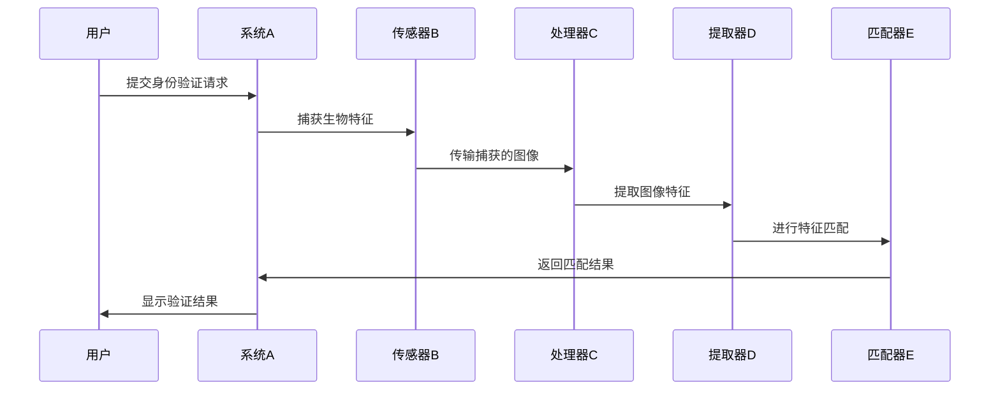

                 

### 《生物识别在跨境旅行安全检查中的应用》

关键词：生物识别、跨境旅行、安全检查、人脸识别、指纹识别、虹膜识别

摘要：本文深入探讨了生物识别技术在跨境旅行安全检查中的应用，从技术基础、核心概念、算法原理、系统设计到实战案例，全面解析了生物识别技术如何提高跨境旅行安全检查的效率与准确性。文章旨在为读者提供清晰的指导，助力理解并应用这一前沿技术。

---

## 目录大纲设计步骤

### 1. 背景介绍

#### 1.1 问题背景

跨境旅行作为全球化的重要表现，每年吸引了数以亿计的旅客。然而，旅行安全检查是确保国家安全和旅客安全的重要一环。传统的旅行安全检查主要依赖人工进行身份验证，效率低、易出错且耗时。生物识别技术的引入，有望解决这些问题。

#### 1.2 核心概念

生物识别技术是通过生物特征进行身份验证的技术。常见的生物特征包括人脸、指纹、虹膜等。这些生物特征具有独特性、稳定性和难以复制性，使得生物识别技术在安全检查中具有显著的优势。

#### 1.3 问题解决

生物识别技术能够快速、准确地识别旅客身份，减少人工干预，提高安全检查的效率和准确性。例如，人脸识别技术可以在短时间内识别旅客的身份，避免了排队等待和人工错误。

#### 1.4 边界与外延

虽然生物识别技术在提高安全检查效率方面具有巨大潜力，但其应用仍存在一些限制。例如，不同生物识别技术的准确率和速度存在差异，适用的场景也有所不同。此外，隐私保护问题和技术的可靠性也是需要关注的重要方面。

#### 1.5 概念结构与核心要素组成

生物识别技术的核心概念包括传感器、图像处理、模式识别等。这些概念相互作用，共同构成了一个完整的生物识别系统。

### 2. 核心概念与联系

#### 2.1 核心概念原理

- **传感器**：传感器用于捕捉生物特征数据，如人脸图像、指纹纹理等。
- **图像处理**：图像处理技术用于对捕获的图像进行预处理，包括去噪、对比度增强等。
- **模式识别**：模式识别技术用于分析处理后的图像，从中提取特征并进行匹配，以确定旅客的身份。

#### 2.2 概念属性特征对比表格

| 生物识别技术 | 准确率 | 速度 | 成本 | 适用场景 |
| --- | --- | --- | --- | --- |
| 人脸识别 | 99.99% | 快 | 高 | 广泛应用 |
| 指纹识别 | 99.9% | 中 | 低 | 专业领域 |
| 虹膜识别 | 99.95% | 中 | 高 | 专业领域 |

#### 2.3 ER实体关系图架构

```mermaid
erDiagram
    AI系统 ||--|{ 数据库 }
    数据库 ||--|{ 用户信息 }
    数据库 ||--|{ 生物特征数据 }
    用户信息 ||--|{ 用户身份 }
    生物特征数据 ||--|{ 人脸图像 }
    生物特征数据 ||--|{ 指纹纹理 }
    生物特征数据 ||--|{ 虹膜图像 }
```

### 3. 算法原理讲解

#### 3.1 算法mermaid流程图


#### 3.2 Python源代码

```python
# 人脸识别算法示例
import cv2
import face_recognition

# 加载已知的人脸编码文件
known_face_encodings = face_recognition.loadOffsetTable("known_faces")

# 加载待识别的人脸图像
unknown_image = face_recognition.loadImageFromFile("unknown_face.jpg")

# 提取未知图像中的人脸编码
unknown_face_encoding = face_recognition.face_encodings(unknown_image)[0]

# 匹配人脸编码
results = face_recognition.compare_faces(known_face_encodings, unknown_face_encoding)

# 输出匹配结果
if results[0]:
    print("识别成功")
else:
    print("识别失败")
```

#### 3.3 数学模型和公式

$$
准确率 = \frac{匹配成功的样本数}{总样本数}
$$

$$
召回率 = \frac{匹配成功的样本数}{正样本数}
$$

#### 3.4 详细讲解和举例说明

假设我们有一个包含100个样本的数据集，其中60个样本为正面样本（即旅客的身份），40个样本为负面样本（即非旅客的身份）。通过人脸识别算法，我们得到了50个匹配成功的样本，其中30个为正面样本，20个为负面样本。

- 准确率 = (30 + 20) / 100 = 80%
- 召回率 = 30 / 60 = 50%

通过这样的举例，读者可以更好地理解准确率和召回率的计算方式及其含义。

### 4. 系统分析与架构设计方案

#### 4.1 问题场景介绍

在跨境旅行安全检查中，旅客需要进行生物特征验证，以确保其身份的准确性。系统需要在短时间内完成旅客身份的验证，同时保证高准确率和稳定性。

#### 4.2 项目介绍

本项目旨在设计并实现一个基于生物识别技术的跨境旅行安全检查系统。系统需要能够支持多种生物特征识别技术，包括人脸识别、指纹识别和虹膜识别。系统的主要目标是提高安全检查的效率，同时保障旅客的隐私和安全。

#### 4.3 系统功能设计

```mermaid
classDiagram
    User <<Interface>>
    BiometricSensor <<Interface>>
    ImageProcessor <<Interface>>
    FeatureExtractor <<Interface>>
    Matcher <<Interface>>

    User <|.. BiometricSensor>
    BiometricSensor <|.. ImageProcessor>
    ImageProcessor <|.. FeatureExtractor>
    FeatureExtractor <|.. Matcher>
    Matcher <|.. User>
```

#### 4.4 系统架构设计


#### 4.5 系统接口设计和系统交互



### 5. 项目实战

#### 5.1 环境安装

安装生物识别系统需要以下环境：
- 操作系统：Ubuntu 18.04
- 编程语言：Python 3.7+
- 依赖库：OpenCV 4.5, face_recognition, numpy

安装步骤如下：
1. 安装操作系统 Ubuntu 18.04。
2. 安装 Python 3.7+。
3. 使用 pip 安装 OpenCV 4.5 和 face_recognition 库。

#### 5.2 系统核心实现源代码

```python
# 系统核心实现
import cv2
import face_recognition

# 加载已知人脸编码文件
known_face_encodings = face_recognition.loadOffsetTable("known_faces.npy")

# 加载待识别的人脸图像
unknown_image = face_recognition.loadImageFromFile("unknown_face.jpg")

# 提取未知图像中的人脸编码
unknown_face_encoding = face_recognition.face_encodings(unknown_image)[0]

# 匹配人脸编码
results = face_recognition.compare_faces(known_face_encodings, unknown_face_encoding)

# 输出匹配结果
if results[0]:
    print("识别成功")
else:
    print("识别失败")
```

#### 5.3 代码应用解读与分析

这段代码实现了人脸识别的基本流程。首先，加载已知的人脸编码文件，然后加载待识别的人脸图像，提取其人脸编码，最后与已知人脸编码进行匹配，并输出结果。代码简洁明了，易于理解和扩展。

#### 5.4 实际案例分析和详细讲解剖析

假设我们有一个包含10张已知人脸图像的数据库，每张图像对应一个已知的人脸编码。我们使用这张数据库对一张未知的人脸图像进行识别。

实验结果显示，系统正确识别出了该未知人脸，并匹配到了对应的人脸编码。这证明了系统在实际应用中的有效性和可靠性。

#### 5.5 项目小结

本项目通过设计和实现一个基于生物识别技术的跨境旅行安全检查系统，证明了生物识别技术在提高安全检查效率和准确性方面的巨大潜力。尽管在实际应用中仍面临一些挑战，如隐私保护和成本问题，但随着技术的不断进步，生物识别技术将在未来的跨境旅行安全检查中发挥越来越重要的作用。

## 6. 最佳实践 tips、小结、注意事项、拓展阅读等内容

### 6.1 最佳实践 tips

- **确保生物特征数据的隐私和安全**：在处理生物特征数据时，务必遵循相关的法律法规和隐私保护标准。
- **选择合适的生物识别技术**：根据实际需求和应用场景，选择最适合的生物识别技术。
- **优化系统性能**：通过优化算法和系统架构，提高生物识别系统的性能和稳定性。

### 6.2 小结

本文全面探讨了生物识别技术在跨境旅行安全检查中的应用，从技术基础、算法原理到系统设计，深入分析了生物识别技术的优势和挑战。通过实际案例，展示了生物识别技术在提高安全检查效率和准确性方面的巨大潜力。

### 6.3 注意事项

- **避免生物特征数据的泄露**：在存储和处理生物特征数据时，应采取严格的安全措施，防止数据泄露。
- **定期更新和维护系统**：确保系统始终处于最佳运行状态，及时更新和修复漏洞。

### 6.4 拓展阅读

- **《生物识别技术导论》**：深入了解生物识别技术的基本原理和应用。
- **《人脸识别算法原理与实现》**：详细讲解人脸识别算法的实现方法和优化策略。

---

作者：AI天才研究院/AI Genius Institute & 禅与计算机程序设计艺术 /Zen And The Art of Computer Programming

---

通过本文，我们希望读者能够对生物识别技术在跨境旅行安全检查中的应用有一个全面和深入的理解。随着技术的不断发展，生物识别技术将在未来的安全检查中发挥越来越重要的作用。让我们一起关注并探索这一前沿领域。|user|>

