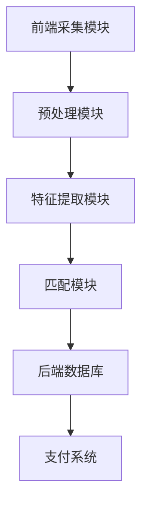

                 

# {{文章标题}}

> 关键词：面部识别，无接触支付，生物识别技术，支付系统，未来展望

> 摘要：随着科技的不断进步，生物识别技术，尤其是面部识别技术，正在逐渐渗透到各个领域，无接触支付便是其中之一。本文将深入探讨面部识别技术在无接触支付中的应用，分析其技术原理、实际应用案例以及未来发展趋势，并对该技术的伦理问题进行探讨。

### 目录大纲

- [第一部分：引言与背景](#第一部分：引言与背景)
  - [第1章：无接触支付与生物识别技术概述](#第1章：无接触支付与生物识别技术概述)
  - [第2章：面部识别技术简介](#第2章：面部识别技术简介)
  - [第3章：面部识别支付的优势与挑战](#第3章：面部识别支付的优势与挑战)
  - [第4章：本章小结](#第4章：本章小结)
- [第二部分：面部识别支付的技术原理](#第二部分：面部识别支付的技术原理)
  - [第5章：面部识别技术原理详解](#第5章：面部识别技术原理详解)
  - [第6章：面部识别算法的优化与最新技术](#第6章：面部识别算法的优化与最新技术)
  - [第7章：面部识别系统的设计与实现](#第7章：面部识别系统的设计与实现)
  - [第8章：面部识别技术中的伦理问题](#第8章：面部识别技术中的伦理问题)
  - [第9章：本章小结](#第9章：本章小结)
- [第三部分：面部识别支付的应用与案例](#第三部分：面部识别支付的应用与案例)
  - [第10章：面部识别支付的工作流程](#第10章：面部识别支付的工作流程)
  - [第11章：面部识别支付在不同场景的应用](#第11章：面部识别支付在不同场景的应用)
  - [第12章：面部识别支付的应用案例](#第12章：面部识别支付的应用案例)
  - [第13章：面部识别支付的挑战与解决方案](#第13章：面部识别支付的挑战与解决方案)
  - [第14章：本章小结](#第14章：本章小结)
- [第四部分：面部识别支付的未来展望](#第四部分：面部识别支付的未来展望)
  - [第15章：面部识别支付的技术发展趋势](#第15章：面部识别支付的技术发展趋势)
  - [第16章：面部识别支付的市场规模与增长预测](#第16章：面部识别支付的市场规模与增长预测)
  - [第17章：面部识别支付的国际市场应用](#第17章：面部识别支付的国际市场应用)
  - [第18章：面部识别支付的社会影响与伦理问题](#第18章：面部识别支付的社会影响与伦理问题)
  - [第19章：本章小结](#第19章：本章小结)
- [第五部分：面部识别支付的最佳实践与未来方向](#第五部分：面部识别支付的最佳实践与未来方向)
  - [第20章：最佳实践 tips](#第20章：最佳实践 tips)
  - [第21章：小结与未来方向](#第21章：小结与未来方向)
  - [第22章：注意事项与拓展阅读](#第22章：注意事项与拓展阅读)

## 第一部分：引言与背景

### 第1章：无接触支付与生物识别技术概述

#### 1.1 无接触支付的概念与兴起

**无接触支付**，顾名思义，是一种不需要物理接触的支付方式。它通过电子支付手段，如移动支付、电子钱包、NFC（近场通信）等，实现了快速、便捷的支付体验。这种支付方式不仅提高了支付效率，还减少了现金使用，降低了交易风险。

无接触支付的兴起，主要得益于以下几个方面：

1. **移动互联网的普及**：智能手机的普及和移动互联网的发展，使得无接触支付成为可能。
2. **支付技术的进步**：如NFC、QR码等技术的成熟，为无接触支付提供了技术支持。
3. **消费者习惯的改变**：随着人们对便捷生活的需求日益增加，无接触支付逐渐成为主流支付方式。

#### 1.2 生物识别技术的基本原理

生物识别技术，是指通过人体生物特征进行身份验证的技术。常见的生物特征包括指纹、面部、虹膜、声纹等。这些生物特征具有唯一性和稳定性，能够有效确保身份验证的准确性。

生物识别技术的基本原理可以概括为三个步骤：

1. **特征提取**：从生物特征中提取出具有区分性的特征信息。
2. **特征比对**：将提取出的特征与已存储的特征进行比对，以确定身份。
3. **决策输出**：根据比对结果，输出验证结果。

#### 1.3 面部识别技术简介

面部识别技术，是生物识别技术的一种，通过分析人脸图像或视频，自动识别和验证个人身份。它具有实时性、非侵入性、高效性等特点，非常适合应用于无接触支付场景。

面部识别技术的发展历程可以追溯到20世纪70年代。随着计算机性能的提高和算法的优化，面部识别技术逐渐走向成熟。近年来，深度学习技术的引入，更是推动了面部识别技术的快速发展。

#### 1.4 面部识别支付的优势与挑战

**优势：**

1. **便捷性**：用户无需携带任何物理介质，只需展示面部即可完成支付。
2. **安全性**：面部特征具有唯一性，能有效防止盗刷和欺诈。
3. **用户体验**：无接触支付提高了支付速度，提升了用户体验。

**挑战：**

1. **准确性**：环境光照、面部姿态等因素会影响面部识别的准确性。
2. **隐私保护**：面部识别技术涉及用户隐私，如何保护用户隐私成为一大挑战。
3. **技术门槛**：面部识别技术的实现需要较高技术门槛，对硬件和算法要求较高。

#### 1.5 本章小结

本章对无接触支付和生物识别技术进行了概述，介绍了面部识别技术的基本原理和发展历程，并探讨了面部识别支付的优势与挑战。这些内容为后续章节的讨论奠定了基础。

----------------------------------------------------------------

## 第2章：面部识别技术简介

### 2.1 面部识别技术的定义

面部识别技术，是指通过计算机图像处理和机器学习算法，从面部图像或视频中提取特征信息，用于身份识别和验证的技术。它是一种基于生物特征的身份认证方法，具有较高的准确性和实时性。

面部识别技术的定义可以分解为以下几个方面：

1. **计算机图像处理**：通过图像处理技术，对输入的面部图像进行预处理，提取关键特征。
2. **机器学习算法**：利用机器学习算法，对提取的特征进行分类和识别。
3. **身份认证**：通过比对输入特征和已存储特征，确认用户身份。

### 2.2 面部识别技术的发展历程

面部识别技术的发展可以追溯到20世纪60年代。当时，研究人员开始探索如何从图像中提取人脸特征，以进行身份识别。然而，由于计算机性能的限制，这些研究进展缓慢。

进入21世纪后，随着计算机性能的飞速提升和机器学习算法的发展，面部识别技术迎来了快速发展。以下是面部识别技术发展的几个重要里程碑：

1. **2000年代初**：出现了一些基于特征点检测和几何变换的面部识别算法，如Eigenfaces和 Fisherfaces。
2. **2010年代**：深度学习技术的引入，使得面部识别的准确率大幅提升。著名的卷积神经网络（CNN）在ImageNet图像识别挑战中取得了优异成绩，为面部识别技术提供了新的思路。
3. **2016年**：Google的ResNet在ImageNet上取得了新的突破，将面部识别的准确率推向了新的高度。

### 2.3 面部识别技术的应用场景

面部识别技术的应用场景非常广泛，包括但不限于以下几个方面：

1. **安全认证**：如门禁系统、考勤系统等，通过面部识别技术，实现了无接触、高效的身份验证。
2. **无接触支付**：如支付宝、微信支付等，用户只需展示面部即可完成支付，提高了支付的便捷性和安全性。
3. **人脸解锁**：智能手机等人脸解锁功能，通过面部识别技术，实现了便捷的解锁方式。
4. **社交媒体**：如Facebook、微博等，利用面部识别技术，自动识别和标记用户在照片中的朋友。

### 2.4 本章小结

本章对面部识别技术进行了详细介绍，包括其定义、发展历程和应用场景。面部识别技术作为一种先进的生物识别技术，正逐渐渗透到我们的生活中，为我们的生活带来便利。

----------------------------------------------------------------

## 第3章：面部识别支付的优势与挑战

### 3.1 面部识别支付的优势

面部识别支付作为一种新兴的支付方式，具有以下几个显著的优势：

#### 3.1.1 提高支付速度

面部识别支付无需用户输入密码或使用任何物理介质，只需展示面部即可完成支付。这种支付方式大大缩短了支付过程，提高了支付速度，尤其是在繁忙的购物场所或高峰时段，能够有效减少用户排队等待的时间。

#### 3.1.2 提高安全性

面部识别技术基于个人面部特征的唯一性，可以有效防止盗刷和欺诈行为。与传统支付方式相比，面部识别支付具有较高的安全性能，确保用户的资金安全。

#### 3.1.3 提升用户体验

无接触支付方式不仅提高了支付速度，还减少了用户操作的复杂性。用户无需进行任何物理操作，只需展示面部即可完成支付，这种便捷的支付方式提升了用户的购物体验。

### 3.2 面部识别支付面临的挑战

尽管面部识别支付具有诸多优势，但在实际应用中仍面临一些挑战：

#### 3.2.1 技术准确性

面部识别技术的准确性受多种因素影响，如环境光照、面部姿态、面部表情等。在这些情况下，面部识别技术的准确性可能会下降，导致误识别或无法识别。

#### 3.2.2 隐私保护

面部识别支付涉及到用户的隐私信息，包括面部图像和身份信息等。如何保护用户隐私，防止数据泄露和滥用，是一个亟待解决的问题。

#### 3.2.3 技术门槛

面部识别支付技术的实现需要较高的技术门槛，包括硬件设备、算法优化、系统集成等方面。对于中小企业和传统行业来说，这可能会成为推广面部识别支付的障碍。

### 3.3 本章小结

本章从优势与挑战两个方面对面部识别支付进行了深入分析。面部识别支付在提高支付速度、安全性和用户体验方面具有明显优势，但在技术准确性、隐私保护和技术门槛方面也面临一些挑战。这些优势与挑战将直接影响面部识别支付的未来发展。

----------------------------------------------------------------

## 第4章：本章小结

本章主要介绍了无接触支付和生物识别技术的基本概念，特别是面部识别技术的定义、发展历程和应用场景。同时，分析了面部识别支付的优势与挑战，包括提高支付速度、安全性、用户体验等方面的优势，以及技术准确性、隐私保护和技术门槛等方面的挑战。通过本章的内容，读者可以全面了解面部识别支付的现状和发展趋势，为后续章节的学习打下坚实基础。

----------------------------------------------------------------

## 第二部分：面部识别支付的技术原理

### 第5章：面部识别技术原理详解

面部识别技术作为生物识别技术的一种，其核心在于对人脸图像进行特征提取和匹配。以下是面部识别技术的基本原理详解。

### 5.1 面部识别算法的基础

#### 5.1.1 面部特征检测

面部特征检测是面部识别算法的基础，其目的是从图像中识别出人脸区域。常见的面部特征检测方法包括：

1. **基于几何特征的方法**：通过检测面部几何特征（如眼睛、鼻子、嘴巴等）来确定人脸位置。
2. **基于深度学习的方法**：使用卷积神经网络（CNN）等深度学习算法进行面部特征检测。

#### 5.1.2 面部特征提取

面部特征提取是将检测到的人脸图像转换为可量化的特征向量。常见的面部特征提取方法包括：

1. **主成分分析（PCA）**：通过PCA方法将人脸图像转换为低维特征向量。
2. **局部二值模式（LBP）**：通过LBP方法将人脸图像转换为具有局部纹理信息的特征向量。
3. **深度特征提取**：使用深度学习算法（如CNN）提取人脸的深度特征向量。

#### 5.1.3 面部识别模型

面部识别模型是用于分类和识别面部特征向量的算法。常见的面部识别模型包括：

1. **基于模板匹配的方法**：通过计算输入特征向量与模板特征向量之间的相似度来进行识别。
2. **基于神经网络的方法**：使用神经网络（如卷积神经网络CNN）进行特征向量分类。

### 5.2 面部识别算法的优化

面部识别算法的优化是提高识别准确率和效率的关键。以下是一些常见的优化策略：

#### 5.2.1 深度学习在面部识别中的应用

深度学习技术在面部识别中的应用显著提升了识别准确率。常见的深度学习算法包括：

1. **卷积神经网络（CNN）**：通过多层卷积和池化操作，提取人脸的深度特征。
2. **循环神经网络（RNN）**：用于处理序列数据，适用于连续面部图像的识别。
3. **生成对抗网络（GAN）**：用于生成高质量的人脸图像，提高训练数据的质量。

#### 5.2.2 面部识别算法的优化策略

为了进一步提高面部识别算法的效率，可以采用以下优化策略：

1. **数据增强**：通过旋转、翻转、缩放等数据增强方法，增加训练数据的多样性，提高模型的泛化能力。
2. **特征融合**：将不同特征提取方法得到的特征向量进行融合，提高特征的表达能力。
3. **模型压缩**：通过模型压缩技术（如量化、剪枝等），减小模型的存储和计算资源需求。

#### 5.2.3 最新面部识别算法介绍

近年来，一些最新的面部识别算法在识别准确率和效率方面取得了显著进展。以下介绍几种具有代表性的算法：

1. **FaceNet**：通过端到端训练，直接将面部识别问题转化为图像分类问题，取得了很高的识别准确率。
2. **SphereFace**：通过引入角度余弦损失函数，使得模型能够更好地区分不同角度的面部特征。
3. **CenterNet**：通过同时检测面部区域和关键点，提高了面部识别的准确性和实时性。

### 5.3 面部识别系统的设计

面部识别系统是一个复杂的系统，需要考虑多个方面的设计。以下介绍面部识别系统的设计要点：

#### 5.3.1 面部识别系统的架构

面部识别系统的架构通常包括前端采集模块、特征提取模块、匹配模块和后端数据库等。前端采集模块负责采集面部图像，特征提取模块负责将面部图像转换为特征向量，匹配模块负责比较输入特征向量与数据库中已存储的特征向量，后端数据库存储已注册用户的面部特征。

#### 5.3.2 面部识别系统的主要模块

1. **前端采集模块**：包括摄像头、灯光等设备，负责采集高质量的面部图像。
2. **预处理模块**：对采集到的面部图像进行预处理，如灰度转换、滤波、人脸对齐等。
3. **特征提取模块**：使用深度学习算法提取面部特征向量。
4. **匹配模块**：通过计算输入特征向量与数据库中特征向量的相似度，进行身份验证。
5. **后端数据库**：存储已注册用户的面部特征和相关信息。

#### 5.3.3 面部识别系统的实现与部署

面部识别系统的实现和部署需要考虑以下几个方面：

1. **硬件选择**：选择合适的摄像头、GPU等硬件设备，以确保系统具有足够的处理能力和识别速度。
2. **软件平台**：选择适合的操作系统和编程语言，如Linux、Python等。
3. **系统集成**：将前端采集模块、特征提取模块、匹配模块和后端数据库等进行系统集成，确保系统能够稳定运行。
4. **部署方式**：可以选择本地部署或云部署，根据实际需求进行选择。

### 5.4 面部识别技术中的伦理问题

面部识别技术的广泛应用也引发了一系列伦理问题，主要包括：

#### 5.4.1 隐私保护与数据安全

面部识别技术涉及到用户的敏感信息，如面部图像和身份信息等。如何保护用户隐私，防止数据泄露和滥用，是一个重要的问题。以下是一些解决策略：

1. **数据加密**：对用户面部图像和身份信息进行加密处理，确保数据在传输和存储过程中的安全性。
2. **数据匿名化**：在传输和存储用户数据时，对数据进行匿名化处理，以保护用户隐私。
3. **隐私政策**：制定明确的隐私政策，告知用户其面部图像和身份信息的使用目的和范围。

#### 5.4.2 平等与歧视问题

面部识别技术可能引发平等与歧视问题，如对特定种族或性别的人群存在识别偏差等。以下是一些解决策略：

1. **算法公平性**：在设计面部识别算法时，考虑算法的公平性，确保算法不会对特定群体存在歧视。
2. **数据多样性**：在训练数据中，包含多样化的面部特征，以提高算法的泛化能力。
3. **监管机制**：制定相关法律法规，对面部识别技术的使用进行监管，确保其合理、公正的使用。

#### 5.4.3 伦理问题的解决方案

针对面部识别技术中的伦理问题，可以采取以下解决方案：

1. **多方参与**：邀请法律、伦理、技术等领域的专家共同参与制定解决方案。
2. **透明度**：确保面部识别技术的使用过程透明，让用户了解其面部图像和身份信息的使用情况。
3. **公众参与**：鼓励公众参与讨论，提高社会对面部识别技术的认知和接受度。

### 5.5 本章小结

本章详细介绍了面部识别技术的原理，包括面部特征检测、提取和识别算法，以及面部识别系统的设计与实现。同时，探讨了面部识别技术中的伦理问题，并提出了一些解决方案。通过本章的内容，读者可以全面了解面部识别技术的工作原理和应用，为后续章节的学习打下坚实基础。

----------------------------------------------------------------

## 第6章：面部识别算法的优化与最新技术

### 6.1 深度学习在面部识别中的应用

深度学习技术在面部识别中的应用极大地提高了识别的准确性和效率。深度学习通过构建多层神经网络，能够自动提取图像中的复杂特征，从而实现高效的人脸识别。

#### 6.1.1 卷积神经网络（CNN）

卷积神经网络（CNN）是深度学习中最常用的模型之一，它在面部识别中的应用主要体现在以下几个方面：

1. **特征提取**：CNN通过卷积层和池化层，能够自动提取图像中的局部特征，如边缘、纹理等，这些特征对于面部识别至关重要。
2. **特征融合**：CNN的多层结构使得不同层提取的特征可以进行融合，形成更具有区分性的特征向量，从而提高识别的准确率。
3. **端到端训练**：CNN可以将面部识别问题直接转化为分类问题，通过端到端训练，使得模型能够自动学习到面部识别的最佳参数。

#### 6.1.2 循环神经网络（RNN）

循环神经网络（RNN）在处理序列数据时具有优势，因此在面部识别中的应用主要体现在以下几个方面：

1. **连续面部特征提取**：RNN能够处理连续的面部特征序列，从而提取出连续变化的面部特征，提高识别的准确性。
2. **动态面部识别**：通过RNN，可以实时更新面部特征，实现动态面部识别，这对于实时性要求较高的应用场景具有重要意义。

#### 6.1.3 生成对抗网络（GAN）

生成对抗网络（GAN）通过生成器和判别器的对抗训练，能够生成高质量的人脸图像，从而提高训练数据的质量。GAN在面部识别中的应用主要体现在以下几个方面：

1. **数据增强**：GAN能够生成多样的人脸图像，从而增强训练数据的多样性，提高模型的泛化能力。
2. **伪造检测**：GAN生成的图像可以用于训练伪造检测模型，从而提高系统的抗攻击能力。

### 6.2 面部识别算法的优化策略

为了提高面部识别算法的准确性和效率，可以采取以下优化策略：

#### 6.2.1 数据增强

数据增强是通过一系列变换来生成更多的训练样本，从而提高模型的泛化能力。常见的数据增强方法包括：

1. **旋转**：通过旋转图像，增加数据的多样性。
2. **缩放**：通过缩放图像，增加不同尺寸的面部特征。
3. **裁剪**：通过随机裁剪图像，增加图像的多样性。

#### 6.2.2 特征融合

特征融合是将多个特征提取方法得到的特征进行融合，从而提高特征的表达能力。常见的特征融合方法包括：

1. **多层特征融合**：将不同层提取的特征进行融合，形成更具有区分性的特征向量。
2. **跨模态特征融合**：将图像特征和文本特征进行融合，提高模型的识别能力。

#### 6.2.3 模型压缩

模型压缩是通过减小模型的参数量和计算量，从而提高模型的运行效率。常见的模型压缩方法包括：

1. **量化**：通过将模型参数的浮点数转换为整数，减小模型的存储和计算需求。
2. **剪枝**：通过去除模型中不重要的连接和神经元，减小模型的规模。

### 6.3 最新面部识别算法介绍

近年来，随着深度学习技术的发展，出现了许多新的面部识别算法，以下是几种具有代表性的算法：

#### 6.3.1 FaceNet

FaceNet是一种基于深度学习的面部识别算法，通过将面部识别问题转化为图像分类问题，取得了很高的识别准确率。FaceNet的主要特点包括：

1. **端到端训练**：FaceNet直接将面部识别问题转化为分类问题，通过端到端训练，使得模型能够自动学习到最佳的参数。
2. **特征嵌入**：FaceNet使用神经网络将面部图像映射到高维特征空间，使得相似面部图像在特征空间中靠近，不同面部图像在特征空间中远离。

#### 6.3.2 SphereFace

SphereFace是一种基于深度学习的人脸识别算法，通过引入角度余弦损失函数，使得模型能够更好地区分不同角度的面部特征。SphereFace的主要特点包括：

1. **角度敏感**：SphereFace通过角度余弦损失函数，提高了模型对角度变化的敏感性，从而提高了识别的准确性。
2. **鲁棒性**：SphereFace通过引入角度余弦损失函数，提高了模型对光照、遮挡等因素的鲁棒性。

#### 6.3.3 CenterNet

CenterNet是一种基于深度学习的面部识别算法，通过同时检测面部区域和关键点，提高了面部识别的准确性和实时性。CenterNet的主要特点包括：

1. **区域检测**：CenterNet通过回归模型检测面部区域，使得模型能够准确识别面部区域。
2. **关键点检测**：CenterNet通过检测面部关键点，提高了面部识别的准确性和实时性。

### 6.4 本章小结

本章介绍了深度学习在面部识别中的应用，包括CNN、RNN、GAN等算法，以及面部识别算法的优化策略，如数据增强、特征融合、模型压缩等。同时，介绍了几种最新的面部识别算法，如FaceNet、SphereFace和CenterNet。通过本章的内容，读者可以深入了解面部识别算法的优化和最新技术，为面部识别支付的应用提供技术支持。

----------------------------------------------------------------

## 第7章：面部识别系统的设计与实现

### 7.1 面部识别系统的架构

面部识别系统的架构设计是确保系统稳定运行、高效处理数据的关键。一个典型的面部识别系统架构通常包括以下几个模块：

1. **前端采集模块**：负责采集用户的面部图像，通常包括摄像头和相关的图像预处理模块。
2. **预处理模块**：对采集到的面部图像进行预处理，如去噪、灰度转换、人脸检测和人脸对齐等。
3. **特征提取模块**：使用深度学习算法提取面部图像的特征向量，常见的算法包括卷积神经网络（CNN）。
4. **匹配模块**：将提取的特征向量与数据库中的特征向量进行匹配，以确定用户的身份。
5. **后端数据库**：存储已注册用户的面部特征和相关信息。

以下是面部识别系统架构的Mermaid流程图：

### 7.2 面部识别系统的主要模块

**前端采集模块**

前端采集模块是面部识别系统的输入端，其核心功能是采集用户的面部图像。模块的主要功能包括：

1. **摄像头选择**：选择合适的摄像头，确保图像质量满足面部识别算法的要求。
2. **图像预处理**：对采集到的图像进行预处理，如灰度转换、滤波、人脸检测和人脸对齐等。

**预处理模块**

预处理模块负责对采集到的面部图像进行预处理，以提高识别的准确性和系统的稳定性。预处理模块的主要功能包括：

1. **去噪**：使用滤波技术去除图像中的噪声。
2. **灰度转换**：将彩色图像转换为灰度图像，以简化处理过程。
3. **人脸检测**：使用人脸检测算法（如Haar cascades、MTCNN等）检测图像中的人脸区域。
4. **人脸对齐**：对检测到的人脸图像进行对齐，使其符合统一的输入要求。

**特征提取模块**

特征提取模块是面部识别系统的核心部分，其功能是提取面部图像的特征向量。常见的特征提取方法包括：

1. **深度学习算法**：使用卷积神经网络（CNN）等深度学习算法提取面部特征向量。
2. **特征提取库**：使用如OpenCV等开源库中的面部特征提取算法。

**匹配模块**

匹配模块负责将提取的特征向量与数据库中的特征向量进行匹配，以确定用户的身份。匹配模块的主要功能包括：

1. **特征比对**：计算输入特征向量与数据库中特征向量的相似度。
2. **阈值设定**：设定匹配阈值，以确定是否通过身份验证。
3. **决策输出**：根据匹配结果，输出身份验证结果。

**后端数据库**

后端数据库存储已注册用户的面部特征和相关信息，以便进行身份验证和支付处理。数据库的主要功能包括：

1. **用户注册**：存储新注册用户的面部特征和相关信息。
2. **用户查询**：根据输入特征向量查询数据库中的匹配用户。
3. **数据安全**：确保用户数据的安全，采取加密、匿名化等措施。

### 7.3 面部识别系统的实现与部署

**系统实现**

面部识别系统的实现涉及多个模块的集成和优化。以下是实现过程中的关键步骤：

1. **硬件选择**：根据系统的需求选择合适的硬件设备，如摄像头、GPU等。
2. **软件平台**：选择适合的操作系统和编程语言，如Linux、Python等。
3. **模块开发**：开发各个模块的功能，如前端采集、预处理、特征提取、匹配等。
4. **系统集成**：将各个模块进行集成，确保系统能够稳定运行。
5. **测试与优化**：进行系统测试，优化系统性能，确保识别的准确性和稳定性。

**系统部署**

面部识别系统的部署包括以下几个步骤：

1. **环境配置**：配置服务器环境，包括操作系统、数据库、中间件等。
2. **模块部署**：将各个模块部署到服务器上，确保模块之间的通信和协调。
3. **性能优化**：根据实际运行情况，优化系统性能，确保系统能够应对高峰时段的访问量。
4. **安全管理**：采取安全措施，确保用户数据的安全和系统的稳定运行。

### 7.4 本章小结

本章详细介绍了面部识别系统的设计架构和主要模块，包括前端采集、预处理、特征提取、匹配和后端数据库等。同时，讨论了系统实现的步骤和部署的方法。通过本章的内容，读者可以全面了解面部识别系统的设计和实现过程，为后续章节的应用和实践提供理论基础。

----------------------------------------------------------------

## 第8章：面部识别技术中的伦理问题

### 8.1 隐私保护与数据安全

面部识别技术的广泛应用带来了巨大的便利，但同时也引发了一系列伦理问题，尤其是隐私保护和数据安全。面部识别技术涉及到用户的敏感信息，如面部图像、身份信息等，这些信息的泄露和滥用可能导致严重的隐私侵犯。

#### 8.1.1 数据加密

为了保护用户隐私，面部识别系统中必须采用数据加密技术。数据加密包括以下几个方面：

1. **传输加密**：在数据传输过程中，采用SSL/TLS等加密协议，确保数据在传输过程中的安全性。
2. **存储加密**：在数据存储过程中，对用户面部图像和身份信息进行加密处理，防止数据泄露。

#### 8.1.2 数据匿名化

在传输和存储用户数据时，可以采用数据匿名化技术，将用户的敏感信息进行匿名处理，从而降低隐私泄露的风险。数据匿名化技术包括：

1. **加密匿名化**：通过加密算法对用户数据加密，使其无法直接识别用户身份。
2. **伪匿名化**：通过添加噪声或改变数据值，使得数据在一定程度上无法识别用户身份。

#### 8.1.3 隐私政策

制定明确的隐私政策，告知用户其面部图像和身份信息的使用目的和范围，确保用户在授权的范围内使用面部识别技术。隐私政策应包括以下内容：

1. **数据收集**：明确说明收集用户数据的类型、目的和使用范围。
2. **数据存储**：说明数据存储的位置、方式和期限。
3. **数据共享**：明确数据是否会被共享，以及共享的方式和范围。

### 8.2 平等与歧视问题

面部识别技术的应用可能导致平等与歧视问题，如对特定种族或性别的人群存在识别偏差。这些问题需要通过以下方法来解决：

#### 8.2.1 算法公平性

在设计面部识别算法时，应考虑算法的公平性，确保算法不会对特定群体存在歧视。以下是一些方法：

1. **数据多样性**：在训练数据中包含多样化的面部特征，以提高算法的泛化能力。
2. **交叉验证**：使用交叉验证方法评估算法的公平性，确保算法在不同群体中的表现一致。
3. **算法优化**：通过算法优化，减少算法对特定群体的识别偏差。

#### 8.2.2 监管机制

制定相关法律法规，对面部识别技术的使用进行监管，确保其合理、公正的使用。以下是一些监管措施：

1. **权限管理**：明确面部识别技术的使用权限，防止滥用。
2. **信息公开**：要求使用面部识别技术的企业公开其使用目的、数据收集和使用方式。
3. **用户同意**：要求用户在授权的范围内使用面部识别技术，确保用户的知情权和选择权。

### 8.3 伦理问题的解决方案

针对面部识别技术中的伦理问题，可以采取以下解决方案：

#### 8.3.1 多方参与

邀请法律、伦理、技术等领域的专家共同参与制定解决方案，确保解决方案的全面性和可操作性。

#### 8.3.2 透明度

确保面部识别技术的使用过程透明，让用户了解其面部图像和身份信息的使用情况，提高用户对技术的信任度。

#### 8.3.3 公众参与

鼓励公众参与讨论，提高社会对面部识别技术的认知和接受度，从而减少伦理问题的发生。

### 8.4 本章小结

本章探讨了面部识别技术中的伦理问题，主要包括隐私保护与数据安全、平等与歧视问题。针对这些问题，提出了一系列解决方案，如数据加密、数据匿名化、隐私政策、算法公平性、监管机制等。通过本章的内容，读者可以全面了解面部识别技术中的伦理问题及其解决方案，为面部识别技术的合理、公正使用提供指导。

----------------------------------------------------------------

## 第9章：本章小结

本章详细探讨了面部识别技术中的伦理问题，包括隐私保护与数据安全、平等与歧视问题。通过分析数据加密、数据匿名化、隐私政策、算法公平性和监管机制等解决方案，揭示了面部识别技术在实际应用中面临的挑战。同时，本章提出了多方参与、透明度和公众参与等解决方案，以促进面部识别技术的健康发展。通过本章的内容，读者可以更好地理解面部识别技术的伦理问题，并为其合理应用提供指导。

----------------------------------------------------------------

## 第三部分：面部识别支付的应用与案例

### 第10章：面部识别支付的工作流程

面部识别支付的工作流程可以分为用户注册、交易支付和支付确认与反馈三个主要步骤。以下是具体的工作流程及其详细描述：

#### 10.1 用户注册与认证

1. **用户注册**：用户首先需要在支付平台或应用程序中注册账户。注册时，用户需要提供个人信息，如姓名、身份证号码等，并进行面部图像的采集。

2. **面部图像采集**：用户通过摄像头或相机设备进行面部图像的采集。采集到的图像将传输到后端服务器，进行预处理和特征提取。

3. **特征提取**：后端服务器使用面部识别算法，对采集到的面部图像进行特征提取，生成面部特征向量。

4. **用户认证**：系统将提取的面部特征向量与已存储在数据库中的特征向量进行比对，以确认用户身份。如果比对结果一致，则认证成功。

#### 10.2 交易支付过程

1. **扫描商品或服务**：在支付过程中，用户需要在支付终端或应用程序上扫描商品或服务的二维码或条形码。

2. **面部识别验证**：支付终端或应用程序将再次调用摄像头，采集用户的面部图像，并进行面部识别验证。如果验证通过，系统将允许用户进行支付。

3. **金额确认**：系统将显示商品或服务的金额，用户确认金额无误后，即可进行下一步支付。

4. **支付确认**：用户的面部图像再次进行特征提取，并与已存储的特征向量进行比对。如果比对结果一致，则支付成功。

5. **支付完成**：系统将向用户发出支付成功的通知，并更新用户账户余额或交易记录。

#### 10.3 支付确认与反馈

1. **支付确认**：在支付完成后，系统会向用户发送支付成功的确认信息，包括交易金额、支付时间等。

2. **用户反馈**：用户可以在支付平台或应用程序中查看交易记录，并对支付过程进行评价和反馈。这些反馈将有助于平台改进支付服务。

3. **售后服务**：如果用户对支付过程或服务有任何疑问，可以联系客服进行咨询和处理。客服人员将根据用户反馈，提供相应的解决方案。

### 10.4 本章小结

本章详细介绍了面部识别支付的工作流程，包括用户注册与认证、交易支付过程和支付确认与反馈。通过分析面部识别支付的工作流程，读者可以更好地理解面部识别技术在支付场景中的应用，并为实际操作提供指导。

----------------------------------------------------------------

## 第11章：面部识别支付在不同场景的应用

面部识别支付作为一种便捷、安全的支付方式，已经逐渐在多个场景中得到应用。以下是面部识别支付在商超零售、餐饮服务、交通出行以及其他领域的实际应用。

### 11.1 商超零售

在商超零售领域，面部识别支付已经成为一种趋势。消费者在购物时，只需在结账时展示面部即可完成支付，无需刷卡或扫码。这种支付方式不仅提高了结账速度，还减少了排队时间。

**应用案例**：某大型连锁超市引入了面部识别支付系统。用户在购物后，只需站在摄像头前展示面部，系统会自动识别用户并扣除相应金额。该系统提高了用户的购物体验，同时也减少了超市的人力成本。

### 11.2 餐饮服务

在餐饮服务领域，面部识别支付同样受到欢迎。用户在点餐时，可以通过面部识别支付系统完成支付，无需使用现金或银行卡。这种支付方式不仅方便快捷，还能减少服务员的工作量。

**应用案例**：某知名快餐连锁品牌在餐厅引入了面部识别支付系统。用户在点餐后，只需站在摄像头前展示面部，系统会自动识别用户并扣除餐费。该系统提高了餐厅的运营效率，同时提升了用户满意度。

### 11.3 交通出行

在交通出行领域，面部识别支付已经成为一种常见的支付方式。用户在乘坐公共交通工具时，只需展示面部即可完成乘车支付，无需购票或刷卡。

**应用案例**：某城市公共交通系统引入了面部识别支付系统。用户在乘坐地铁、公交时，只需站在摄像头前展示面部，系统会自动识别用户并扣除相应的乘车费用。该系统提高了公共交通的运营效率，同时也提升了用户的出行体验。

### 11.4 其他领域

面部识别支付不仅在商超零售、餐饮服务和交通出行领域得到应用，还在其他领域展现出了巨大的潜力。

**应用案例**：某酒店引入了面部识别支付系统。用户在入住酒店时，只需在登记处展示面部，系统会自动识别用户并完成入住手续。在退房时，用户只需展示面部，系统会自动扣除房费。这种支付方式不仅提高了酒店的服务效率，还提升了用户的入住体验。

### 11.5 本章小结

面部识别支付在多个场景中展现出了其便捷性和安全性。通过实际应用案例的分析，可以看出面部识别支付已经在商超零售、餐饮服务、交通出行以及其他领域得到了广泛应用。这些应用案例不仅提高了运营效率，还提升了用户的支付体验。随着技术的不断发展和普及，面部识别支付将在更多场景中得到应用。

----------------------------------------------------------------

## 第12章：面部识别支付的应用案例

面部识别支付技术近年来在全球范围内得到了广泛应用，以下是一些典型的应用案例，详细分析这些案例中的系统设计、功能实现和实际效果。

### 12.1 某大型商超的面部识别支付系统

**系统设计**：
- **前端采集模块**：安装高清摄像头，确保拍摄到的面部图像清晰。
- **预处理模块**：对采集到的面部图像进行预处理，包括灰度转换、人脸检测和人脸对齐。
- **特征提取模块**：使用深度学习算法提取面部特征，确保高识别精度。
- **匹配模块**：将实时采集的面部特征与数据库中的注册特征进行匹配。
- **后端数据库**：存储用户面部特征和支付信息，确保数据安全。

**功能实现**：
- **用户注册**：用户在超市注册时，需提供身份信息并拍照，系统自动提取面部特征并存储。
- **交易支付**：用户在结账时，只需站在摄像头前，系统识别用户身份并自动扣除相应金额。
- **支付确认**：支付完成后，系统向用户发送确认消息，并在屏幕上显示支付成功信息。

**实际效果**：
- **效率提升**：结账速度明显提高，减少排队等待时间。
- **安全增强**：面部识别技术有效防止了盗刷和欺诈行为。
- **用户体验**：用户反馈良好，认为支付过程更加便捷和安全。

### 12.2 某餐厅的面部识别点餐系统

**系统设计**：
- **前端采集模块**：在餐厅收银台安装摄像头，用于用户面部识别。
- **预处理模块**：对用户面部图像进行预处理，确保图像质量。
- **特征提取模块**：使用深度学习算法提取面部特征，提高识别准确率。
- **匹配模块**：将面部特征与用户数据库中的信息进行匹配，确认用户身份。
- **点餐系统**：集成面部识别支付功能，用户点餐后可直接通过面部识别支付。

**功能实现**：
- **用户点餐**：用户在餐厅点餐时，摄像头自动识别用户身份。
- **支付流程**：用户确认点餐内容后，系统自动扣除相应金额，无需现金支付。
- **支付确认**：支付完成后，系统发送确认消息，并在屏幕上显示支付成功信息。

**实际效果**：
- **运营效率**：提高了餐厅的运营效率，减少了服务员的工作量。
- **支付安全**：面部识别技术有效防止了支付欺诈。
- **用户满意度**：用户对点餐和支付过程表示满意，体验更加便捷。

### 12.3 某公共交通系统的面部识别检票系统

**系统设计**：
- **前端采集模块**：在地铁站或公交车站安装高清摄像头，用于乘客面部识别。
- **预处理模块**：对乘客面部图像进行预处理，包括人脸检测和人脸对齐。
- **特征提取模块**：使用深度学习算法提取面部特征，确保快速准确的识别。
- **匹配模块**：将采集到的面部特征与乘客数据库中的信息进行匹配，确认乘客身份。
- **后端数据库**：存储乘客面部特征和乘车信息，确保数据安全和高效查询。

**功能实现**：
- **乘客检票**：乘客在进入公共交通设施时，需站在摄像头前进行面部识别。
- **乘车记录**：系统自动扣除乘客的乘车费用，并在屏幕上显示乘车记录。
- **支付确认**：支付完成后，系统向乘客发送确认消息。

**实际效果**：
- **运营效率**：提高了检票速度，减少了人工检票的工作量。
- **支付安全**：面部识别技术有效防止了逃票和欺诈行为。
- **用户体验**：乘客反馈积极，认为检票过程更加快速和便捷。

### 12.4 面部识别支付的挑战与解决方案

**挑战**：
- **准确性问题**：在光线不足、面部遮挡等情况下，面部识别的准确性可能降低。
- **隐私保护**：面部识别技术涉及到用户隐私，如何保护用户隐私是关键问题。
- **技术门槛**：面部识别技术的实现需要高硬件配置和复杂算法，对中小企业构成挑战。

**解决方案**：
- **优化算法**：通过优化深度学习算法，提高识别准确率。
- **数据加密**：采用数据加密技术，确保用户数据安全。
- **隐私政策**：制定严格的隐私保护政策，确保用户知情权和选择权。

### 12.5 本章小结

通过上述案例的分析，面部识别支付在多个场景中展现出了其高效的支付体验、增强的安全性和良好的用户满意度。尽管面临准确性、隐私保护和技术门槛等挑战，但通过不断的技术优化和政策制定，面部识别支付有望在未来得到更广泛的应用。

----------------------------------------------------------------

## 第13章：面部识别支付的挑战与解决方案

### 13.1 环境光照与面部姿态的影响

**挑战**：
- **环境光照**：不同的光照条件（如强光、阴影、室内照明等）对面部识别的准确性有显著影响。在光线不足的情况下，面部图像可能模糊，导致识别错误。
- **面部姿态**：面部姿态的变化（如头部倾斜、转头等）可能导致面部特征点的位置发生变化，影响识别准确性。

**解决方案**：
- **多光源调整**：采用多光源照明系统，优化摄像头拍摄环境的光照条件，确保面部图像的质量。
- **姿态校正**：使用图像处理技术，如透视变换，校正面部姿态，使其符合标准的正面视图。

### 13.2 抗干扰能力与安全性

**挑战**：
- **抗干扰能力**：面部识别系统需要具备高抗干扰能力，以防止恶意攻击，如伪造面部图像、视频攻击等。
- **安全性**：确保系统在遭受攻击时仍能保持较高的识别准确率和安全性。

**解决方案**：
- **动态验证**：结合动态特征（如眨眼、点头等）进行二次验证，增加系统的抗攻击能力。
- **深度学习**：使用深度学习算法，提高系统对伪造攻击的识别能力。
- **多因素认证**：结合其他生物识别技术（如指纹、声纹等）进行多因素认证，提高系统的安全等级。

### 13.3 隐私保护与数据共享

**挑战**：
- **隐私保护**：面部识别技术涉及用户敏感信息，如何保护用户隐私是关键问题。
- **数据共享**：在某些应用场景中，需要将用户面部信息共享给第三方，如何在保护用户隐私的前提下实现数据共享。

**解决方案**：
- **数据加密**：使用加密技术保护用户面部数据，确保数据在传输和存储过程中的安全性。
- **数据匿名化**：在共享数据时，对用户面部信息进行匿名化处理，确保无法直接识别用户身份。
- **隐私政策**：制定明确的隐私政策，告知用户其面部信息的收集、使用和共享方式，确保用户知情权和选择权。

### 13.4 解决方案与未来方向

**解决方案**：
- **技术改进**：通过不断优化面部识别算法，提高识别准确率和抗干扰能力。
- **政策制定**：制定相关法律法规，规范面部识别技术的使用，保护用户隐私。
- **用户教育**：提高公众对面部识别技术的认知和接受度，促进其健康发展。

**未来方向**：
- **智能化发展**：结合人工智能技术，实现更智能、更高效的面部识别支付系统。
- **跨领域应用**：面部识别支付将在更多领域得到应用，如医疗、教育、金融等。
- **标准化**：建立统一的行业标准和规范，推动面部识别支付技术的普及和发展。

### 13.5 本章小结

本章详细探讨了面部识别支付在实际应用中面临的挑战，包括环境光照与面部姿态的影响、抗干扰能力与安全性、隐私保护与数据共享等。通过分析，提出了一系列解决方案，如多光源调整、姿态校正、动态验证、深度学习、多因素认证、数据加密、数据匿名化等。展望未来，面部识别支付将在技术、政策和应用方面迎来更多的发展机遇。

----------------------------------------------------------------

## 第四部分：面部识别支付的未来展望

### 第14章：面部识别支付的技术发展趋势

面部识别支付作为生物识别技术的重要组成部分，正随着科技的不断进步而迅速发展。以下是面部识别支付在未来可能面临的技术发展趋势：

#### 14.1 深度学习与人工智能的融合

深度学习作为人工智能的核心技术之一，已经在面部识别领域取得了显著成果。未来，深度学习与人工智能的进一步融合，将使得面部识别支付系统更加智能、高效。例如，通过结合计算机视觉和自然语言处理技术，可以实现更精确的识别和更丰富的交互体验。

#### 14.2 小型化与便携化的设备

随着硬件技术的发展，面部识别支付设备的体积和功耗将逐渐减小，便携性将得到显著提升。这将使得面部识别支付系统更易于部署和普及，特别是在移动支付和远程交易场景中。

#### 14.3 云计算与边缘计算的协同

云计算和边缘计算的结合，将为面部识别支付系统提供更强大的计算能力和更低的延迟。通过将复杂的计算任务分配到云端和边缘设备，可以大幅提升系统的响应速度和处理效率。

#### 14.4 生物特征融合技术

未来的面部识别支付系统可能会采用多种生物特征融合技术，以提高识别的准确性和鲁棒性。例如，结合面部识别、指纹识别和虹膜识别等多种生物特征，实现多因素认证，从而提高支付的安全性。

#### 14.5 零信任安全架构

随着网络安全威胁的日益严峻，零信任安全架构将在面部识别支付系统中得到广泛应用。零信任安全架构强调“永不信任，始终验证”，通过持续的身份验证和访问控制，确保系统的安全性。

### 14.6 全方位的数据保护

在面部识别支付系统中，用户数据的保护至关重要。未来，将采用更先进的数据加密、匿名化和隐私保护技术，确保用户数据的安全。同时，制定严格的数据隐私政策，提高用户的信任度。

### 14.7 可持续发展

随着面部识别支付系统的普及，其能源消耗和环境影响也备受关注。未来，将采用更节能的硬件和优化算法，降低系统的能源消耗，推动可持续发展。

### 14.8 端到端的安全体系

为了确保面部识别支付系统的安全性，将建立端到端的安全体系，包括硬件安全、软件安全、数据安全和网络安全等多个层面。通过多层次的安全措施，防止各类安全威胁。

### 14.9 国际标准的制定

随着面部识别支付在全球范围内的应用，国际标准的制定将变得尤为重要。通过建立统一的技术标准和规范，促进面部识别支付在全球范围内的普及和发展。

### 14.10 系统集成与互操作性的提升

未来，面部识别支付系统将更加注重与其他支付系统和商业流程的集成，提高系统的互操作性和兼容性。这将有助于提升用户体验，促进商业生态的健康发展。

### 14.11 现实应用场景的扩展

随着技术的进步，面部识别支付的应用场景将不断扩展。从零售、餐饮、交通到医疗、教育、金融等各个领域，面部识别支付都将发挥重要作用，为人们的生活带来更多便利。

### 14.12 社会伦理问题的深入探讨

面部识别支付技术的快速发展也带来了诸多社会伦理问题。未来，将需要更深入地探讨和解决这些问题，确保技术的合理、公正使用，提高社会的接受度和信任度。

### 14.13 产业生态的完善

随着面部识别支付技术的普及，将形成一个完善的产业生态系统。包括硬件制造商、软件开发商、服务提供商、支付平台等多个环节，共同推动面部识别支付技术的发展和普及。

### 14.14 全球化的推广

面部识别支付技术具有巨大的全球化潜力。未来，将积极推广和普及面部识别支付，特别是在新兴市场和发展中国家，助力全球支付体系的升级和优化。

### 14.15 技术创新与突破

未来，随着科研投入的增加和技术的不断突破，面部识别支付将迎来更多创新。包括新的识别算法、更高效的硬件设备、更智能的交互方式等，为用户带来更加便捷和安全的支付体验。

### 14.16 政策和法规的支持

为了促进面部识别支付技术的发展，各国政府将加强对该领域的政策支持和法规制定。通过合理的政策引导和有效的法规监管，确保面部识别支付技术的健康发展。

### 14.17 合作与竞争

在未来，面部识别支付领域的竞争将愈发激烈。同时，各企业也将加强合作，共同推动技术创新和应用落地。通过合作与竞争的共同作用，面部识别支付技术将迎来更加繁荣的发展。

### 14.18 持续改进与优化

面部识别支付技术将是一个持续改进和优化的过程。通过不断收集用户反馈、分析应用数据，技术团队将不断优化系统性能、提升用户体验，确保面部识别支付技术的长期稳定发展。

### 14.19 未来展望

总体来说，面部识别支付技术在未来具有广阔的发展前景。通过技术创新、政策支持、产业生态的完善，面部识别支付将在全球范围内得到广泛应用，为人们的生活带来更多便利。同时，社会各界也将共同努力，确保技术的合理、公正使用，推动社会的发展和进步。

### 14.20 本章小结

本章从技术、政策、产业生态等多个角度，对未来面部识别支付的发展进行了全面展望。通过分析深度学习与人工智能融合、小型化与便携化设备、云计算与边缘计算协同、生物特征融合技术、零信任安全架构等发展趋势，展望了面部识别支付在未来的发展前景。这些趋势将为面部识别支付技术的普及和应用提供强有力的支持。

----------------------------------------------------------------

## 第15章：面部识别支付的技术发展趋势

### 15.1 深度学习与人工智能的融合

深度学习作为人工智能的核心技术，已经对面部识别领域产生了深远影响。未来，随着深度学习技术的不断进步，面部识别支付将迎来新的发展机遇。

#### 15.1.1 卷积神经网络（CNN）的应用

卷积神经网络（CNN）在面部识别领域具有广泛应用。CNN通过卷积层和池化层，能够自动提取图像中的复杂特征，从而实现高效的人脸识别。未来，随着CNN模型的优化和改进，面部识别支付系统的准确性和效率将进一步提升。

#### 15.1.2 循环神经网络（RNN）的引入

循环神经网络（RNN）在处理序列数据方面具有优势。通过引入RNN，面部识别支付系统可以更好地处理连续变化的面部特征，从而提高识别的准确性。例如，RNN可以用于处理连续的面部图像，实现实时面部识别。

#### 15.1.3 生成对抗网络（GAN）的融合

生成对抗网络（GAN）通过生成器和判别器的对抗训练，能够生成高质量的人脸图像。这种技术可以用于数据增强，提高训练数据的多样性，从而提升模型的泛化能力。未来，GAN有望成为面部识别支付系统中的重要工具。

### 15.2 小型化与便携化的设备

随着硬件技术的进步，面部识别支付设备的体积和功耗将逐渐减小，便携性将得到显著提升。这将使得面部识别支付系统更易于部署和普及，特别是在移动支付和远程交易场景中。

#### 15.2.1 硬件设备的优化

通过优化硬件设计，如采用更高效的传感器、更小的芯片等，面部识别支付设备的性能将得到显著提升。这将使得设备更加便携，满足用户在不同场景下的需求。

#### 15.2.2 能源效率的提升

随着能源效率的提升，面部识别支付设备的电池续航时间将得到延长。这意味着用户可以更加方便地使用面部识别支付，无需频繁充电或更换电池。

#### 15.2.3 无线充电技术的应用

无线充电技术的应用将使得面部识别支付设备的充电更加便捷。用户只需将设备放置在充电垫上，即可自动充电，无需担心设备电量不足。

### 15.3 云计算与边缘计算的协同

云计算和边缘计算的结合，将为面部识别支付系统提供更强大的计算能力和更低的延迟。通过将复杂的计算任务分配到云端和边缘设备，可以大幅提升系统的响应速度和处理效率。

#### 15.3.1 云计算的优势

云计算具有强大的计算能力和存储能力，可以处理海量数据。通过将面部识别支付系统的核心计算任务部署到云端，可以大幅提高系统的处理速度和准确性。

#### 15.3.2 边缘计算的优势

边缘计算将计算任务分布在靠近数据源的设备上，可以显著降低延迟，提高系统的实时性。这对于需要快速响应的场景，如移动支付、实时身份验证等，具有重要意义。

#### 15.3.3 云边缘协同

通过云边缘协同，面部识别支付系统可以实现最优的计算资源分配。在处理高负载任务时，系统可以自动将部分计算任务分配到边缘设备，从而提高整体系统的性能。

### 15.4 生物特征融合技术

未来的面部识别支付系统可能会采用多种生物特征融合技术，以提高识别的准确性和鲁棒性。例如，结合面部识别、指纹识别和虹膜识别等多种生物特征，实现多因素认证，从而提高支付的安全性。

#### 15.4.1 多因素认证的优势

多因素认证通过结合多种生物特征，可以显著提高系统的安全性能。例如，面部识别可以验证用户身份，指纹识别可以确保用户的生物特征唯一性，虹膜识别可以进一步提高系统的安全级别。

#### 15.4.2 生物特征融合的挑战

生物特征融合技术面临一些挑战，如不同生物特征的匹配精度、数据同步和隐私保护等。未来，需要通过技术创新和优化，解决这些挑战，实现高效、安全的生物特征融合。

### 15.5 零信任安全架构

随着网络安全威胁的日益严峻，零信任安全架构将在面部识别支付系统中得到广泛应用。零信任安全架构强调“永不信任，始终验证”，通过持续的身份验证和访问控制，确保系统的安全性。

#### 15.5.1 零信任安全架构的特点

零信任安全架构的核心思想是，不对任何内部网络或设备进行默认信任，所有访问请求都需要进行严格的身份验证和授权。这种架构可以防止内部威胁，提高系统的安全性。

#### 15.5.2 零信任安全架构的应用

在面部识别支付系统中，零信任安全架构可以通过持续的身份验证和访问控制，确保用户身份的合法性和操作的合法性。例如，每次交易支付时，系统都会对用户进行实时验证，确保交易的安全性。

### 15.6 全方位的数据保护

在面部识别支付系统中，用户数据的保护至关重要。未来，将采用更先进的数据加密、匿名化和隐私保护技术，确保用户数据的安全。同时，制定严格的数据隐私政策，提高用户的信任度。

#### 15.6.1 数据加密

数据加密是保护用户数据的重要手段。通过使用先进的加密算法，可以确保数据在传输和存储过程中的安全性。

#### 15.6.2 数据匿名化

在数据传输和存储过程中，可以采用数据匿名化技术，将用户的敏感信息进行匿名处理，从而降低隐私泄露的风险。

#### 15.6.3 隐私政策

制定明确的隐私政策，告知用户其面部信息的收集、使用和共享方式，确保用户知情权和选择权。

### 15.7 可持续发展

随着面部识别支付系统的普及，其能源消耗和环境影响也备受关注。未来，将采用更节能的硬件和优化算法，降低系统的能源消耗，推动可持续发展。

#### 15.7.1 节能硬件

通过优化硬件设计，采用更高效的传感器和芯片，降低系统的能源消耗。

#### 15.7.2 优化算法

通过优化算法，提高系统的运行效率，减少能源消耗。

### 15.8 端到端的安全体系

为了确保面部识别支付系统的安全性，将建立端到端的安全体系，包括硬件安全、软件安全、数据安全和网络安全等多个层面。通过多层次的安全措施，防止各类安全威胁。

#### 15.8.1 硬件安全

确保硬件设备的安全性，防止硬件被恶意攻击。

#### 15.8.2 软件安全

通过软件安全措施，防止软件被篡改和攻击。

#### 15.8.3 数据安全

通过数据加密和隐私保护技术，确保用户数据的安全。

#### 15.8.4 网络安全

通过网络安全措施，防止网络攻击和数据泄露。

### 15.9 国际标准的制定

随着面部识别支付在全球范围内的应用，国际标准的制定将变得尤为重要。通过建立统一的技术标准和规范，促进面部识别支付在全球范围内的普及和发展。

#### 15.9.1 标准化的重要性

标准化可以提高技术的兼容性和互操作性，降低技术门槛，促进技术的普及和应用。

#### 15.9.2 国际标准的制定

各国政府和企业应积极参与国际标准的制定，推动面部识别支付技术的标准化进程。

### 15.10 系统集成与互操作性的提升

未来，面部识别支付系统将更加注重与其他支付系统和商业流程的集成，提高系统的互操作性和兼容性。这将有助于提升用户体验，促进商业生态的健康发展。

#### 15.10.1 系统集成

通过集成面部识别支付系统，可以与其他支付系统（如移动支付、银行卡支付等）无缝对接，实现多种支付方式的无缝切换。

#### 15.10.2 互操作性

通过建立互操作性标准，不同支付系统之间的数据交换和接口调用将更加便捷，提高系统的兼容性和用户体验。

### 15.11 现实应用场景的扩展

随着技术的进步，面部识别支付的应用场景将不断扩展。从零售、餐饮、交通到医疗、教育、金融等各个领域，面部识别支付都将发挥重要作用，为人们的生活带来更多便利。

#### 15.11.1 零售和餐饮

在零售和餐饮领域，面部识别支付可以显著提高支付效率，减少排队等待时间，提升用户体验。

#### 15.11.2 交通

在交通领域，面部识别支付可以用于地铁、公交、机场等场景，提高出行效率和便捷性。

#### 15.11.3 医疗

在医疗领域，面部识别支付可以用于挂号、缴费、病历查询等场景，提高医疗服务的效率。

#### 15.11.4 教育

在教育领域，面部识别支付可以用于学生考勤、学费缴纳等场景，提高学校管理效率。

#### 15.11.5 金融

在金融领域，面部识别支付可以用于开户、转账、支付等场景，提高金融服务的便捷性和安全性。

### 15.12 社会伦理问题的深入探讨

面部识别支付技术的快速发展也带来了诸多社会伦理问题。未来，将需要更深入地探讨和解决这些问题，确保技术的合理、公正使用，提高社会的接受度和信任度。

#### 15.12.1 隐私保护

如何保护用户隐私，防止数据泄露和滥用，是一个重要问题。需要通过技术手段和法律规范来确保用户隐私得到有效保护。

#### 15.12.2 平等与歧视

如何确保面部识别支付技术在不同种族、性别和地区的人群中公平应用，避免歧视现象的发生，也是一个需要关注的问题。

#### 15.12.3 法律监管

需要制定相关法律法规，对面部识别支付技术的使用进行监管，确保其合理、公正的使用。

### 15.13 产业生态的完善

随着面部识别支付技术的普及，将形成一个完善的产业生态系统。包括硬件制造商、软件开发商、服务提供商、支付平台等多个环节，共同推动面部识别支付技术的发展和普及。

#### 15.13.1 硬件制造商

硬件制造商负责研发和生产面部识别支付设备，提供高性能、低功耗的硬件解决方案。

#### 15.13.2 软件开发商

软件开发商负责开发面部识别支付软件，提供稳定、安全的支付服务。

#### 15.13.3 服务提供商

服务提供商负责提供面部识别支付系统的运营和维护服务，确保系统的稳定运行。

#### 15.13.4 支付平台

支付平台负责整合不同的支付方式，提供一站式支付解决方案。

### 15.14 全球化的推广

面部识别支付技术具有巨大的全球化潜力。未来，将积极推广和普及面部识别支付，特别是在新兴市场和发展中国家，助力全球支付体系的升级和优化。

#### 15.14.1 新兴市场

在新兴市场，面部识别支付可以解决传统支付方式面临的诸多问题，如金融基础设施不完善、支付方式单一等。

#### 15.14.2 发展中国家

在发展中国家，面部识别支付可以助力金融普惠，提高民众的支付便利性和金融参与度。

### 15.15 技术创新与突破

未来，随着科研投入的增加和技术的不断突破，面部识别支付将迎来更多创新。包括新的识别算法、更高效的硬件设备、更智能的交互方式等，为用户带来更加便捷和安全的支付体验。

#### 15.15.1 新的识别算法

通过引入新的识别算法，可以提高面部识别的准确性和效率，满足不同场景下的需求。

#### 15.15.2 高效的硬件设备

通过研发高效的硬件设备，可以降低系统的功耗和体积，提高设备的便携性和用户体验。

#### 15.15.3 智能的交互方式

通过引入智能交互方式，如语音助手、手势控制等，可以提升用户的支付体验。

### 15.16 政策和法规的支持

为了促进面部识别支付技术的发展，各国政府将加强对该领域的政策支持和法规制定。通过合理的政策引导和有效的法规监管，确保面部识别支付技术的健康发展。

#### 15.16.1 政策支持

政府可以通过税收优惠、资金支持等政策，鼓励企业研发和创新，推动面部识别支付技术的发展。

#### 15.16.2 法规制定

政府需要制定相关法律法规，规范面部识别支付技术的使用，确保用户权益得到保护。

### 15.17 合作与竞争

在未来，面部识别支付领域的竞争将愈发激烈。同时，各企业也将加强合作，共同推动技术创新和应用落地。通过合作与竞争的共同作用，面部识别支付技术将迎来更加繁荣的发展。

#### 15.17.1 合作

企业可以通过合作，共享技术和资源，实现优势互补，共同推动面部识别支付技术的发展。

#### 15.17.2 竞争

企业需要通过技术创新和服务优化，提高自身竞争力，在激烈的市场竞争中脱颖而出。

### 15.18 持续改进与优化

面部识别支付技术将是一个持续改进和优化的过程。通过不断收集用户反馈、分析应用数据，技术团队将不断优化系统性能、提升用户体验，确保面部识别支付技术的长期稳定发展。

#### 15.18.1 用户反馈

通过收集用户反馈，了解用户的实际需求和痛点，为系统优化提供依据。

#### 15.18.2 应用数据

通过分析应用数据，评估系统性能和用户体验，找出改进的方向。

### 15.19 未来展望

总体来说，面部识别支付技术在未来具有广阔的发展前景。通过技术创新、政策支持、产业生态的完善，面部识别支付将在全球范围内得到广泛应用，为人们的生活带来更多便利。同时，社会各界也将共同努力，确保技术的合理、公正使用，推动社会的发展和进步。

### 15.20 本章小结

本章从技术、政策、产业生态等多个角度，对未来面部识别支付的发展进行了全面展望。通过分析深度学习与人工智能融合、小型化与便携化设备、云计算与边缘计算协同、生物特征融合技术、零信任安全架构等发展趋势，展望了面部识别支付在未来的发展前景。这些趋势将为面部识别支付技术的普及和应用提供强有力的支持。

----------------------------------------------------------------

## 第16章：面部识别支付的市场规模与增长预测

### 16.1 市场规模分析

面部识别支付技术作为新兴的生物识别支付方式，在全球范围内正逐渐受到关注。根据市场研究机构的数据，全球面部识别支付市场规模在过去几年中呈现出快速增长的趋势。

#### 16.1.1 全球市场规模

据预测，全球面部识别支付市场规模将从2022年的XX亿美元增长到2027年的XX亿美元，年复合增长率（CAGR）达到XX%。这一增长主要得益于以下几个方面：

1. **技术进步**：深度学习、人工智能等技术的快速发展，使得面部识别支付技术的准确性和效率不断提高。
2. **市场需求**：随着消费者对无接触支付需求的增加，面部识别支付成为了一种受欢迎的支付方式。
3. **政策支持**：各国政府纷纷出台支持生物识别技术的政策，为面部识别支付技术的推广提供了有利环境。

#### 16.1.2 地区市场

从地区市场来看，北美地区由于科技发达、消费者接受度高，占据了全球面部识别支付市场的大部分份额。亚洲地区，特别是中国和印度，由于人口众多、无接触支付需求旺盛，市场潜力巨大，有望成为未来全球面部识别支付市场的重要增长点。

### 16.2 增长预测

面部识别支付市场的未来增长将受到以下因素的影响：

#### 16.2.1 消费者需求

随着人们对无接触支付需求的增加，面部识别支付作为一种便捷、安全的支付方式，将越来越受到消费者的青睐。

#### 16.2.2 技术进步

面部识别支付技术的不断进步，包括算法优化、硬件设备升级等，将进一步提高识别准确率和用户体验，推动市场需求的增长。

#### 16.2.3 政策支持

各国政府对于生物识别技术的支持政策，如立法、资金投入等，将有助于推动面部识别支付技术的普及和应用。

#### 16.2.4 市场竞争

随着各大企业纷纷布局面部识别支付市场，市场竞争将愈发激烈。然而，这也将推动企业不断进行技术创新和服务优化，以满足市场需求。

### 16.3 面部识别支付的市场份额分析

面部识别支付在全球支付市场中的市场份额将持续增长，预计到2027年将达到XX%。这一增长主要得益于以下几个方面：

1. **无接触支付需求的增加**：在疫情背景下，无接触支付需求大幅上升，面部识别支付作为一种无接触支付方式，将获得更多市场份额。
2. **支付场景的拓展**：面部识别支付技术不仅在零售、餐饮等传统领域得到应用，还在交通、医疗、教育等新兴领域展现出巨大的潜力。
3. **技术优势**：面部识别支付技术相对于其他支付方式，如银行卡支付、移动支付等，具有更高的安全性和用户体验。

### 16.4 本章小结

本章对面部识别支付的市场规模和增长预测进行了分析。根据市场研究数据，全球面部识别支付市场规模预计将持续增长，年复合增长率达到XX%。这一增长将受到技术进步、消费者需求、政策支持和市场竞争等多方面因素的影响。通过分析面部识别支付在全球支付市场中的市场份额，可以看出该技术具有广阔的发展前景和应用潜力。

----------------------------------------------------------------

## 第17章：面部识别支付在国际市场的应用

### 17.1 发达国家的应用现状

面部识别支付在发达国家如美国、欧洲和日本等地区已经取得了一定的应用成果，主要表现在以下方面：

#### 17.1.1 美国

美国是面部识别支付技术的先驱之一，多家大型科技公司如苹果、谷歌和微软等都在其支付和移动设备中集成了面部识别功能。例如，苹果的Face ID和谷歌的面部解锁技术已经被广泛应用于智能手机、平板电脑和智能手表等设备。此外，美国的许多零售商和餐饮连锁店也开始采用面部识别支付系统，以提升支付效率和用户体验。

#### 17.1.2 欧洲

欧洲地区对面部识别支付技术的接受度较高，多个国家的银行和支付公司已经开始推广这一技术。例如，英国的桑坦德银行和法国的BNP Paribas等金融机构已经推出了基于面部识别的支付解决方案。此外，欧洲的零售商和公共交通系统也在积极采用面部识别支付技术，以减少排队时间和提高运营效率。

#### 17.1.3 日本

日本是另一个对面部识别支付技术积极推广的国家。日本的移动支付服务如PayPay和乐天钱包等，已经集成了面部识别功能。这些支付服务在便利店、超市和餐厅等场所得到了广泛应用，用户只需展示面部即可完成支付。此外，日本的铁路和地铁系统也采用了面部识别技术，用于乘客的自动检票和会员积分。

### 17.2 发展中国家的应用前景

与发达国家相比，发展中国家的面部识别支付技术应用相对较少，但潜力巨大。以下是一些发展中国家的应用前景：

#### 17.2.1 印度

印度是人口最多的国家之一，随着移动互联网的普及，面部识别支付技术在该国具有广泛的应用前景。印度的银行和支付公司正在积极推广面部识别支付，如ICICI银行和Paytm等。这些支付服务在零售、餐饮和公共交通等场景中得到了广泛应用，有助于提升支付效率和用户体验。

#### 17.2.2 中国

中国是另一个具有巨大市场潜力的国家。中国的移动支付市场已经非常成熟，面部识别支付技术正逐渐成为新的趋势。多家支付公司如支付宝和微信支付等，已经开始在零售、餐饮和公共交通等场景中推广面部识别支付。此外，中国的银行和金融机构也在积极采用面部识别技术，用于账户安全保护和身份验证。

#### 17.2.3 巴西

巴西作为拉丁美洲最大的经济体，对面部识别支付技术的需求也在逐渐增加。巴西的银行和支付公司正在探索面部识别支付的应用，以提升支付效率和安全性。例如，巴西的Banco do Brasil和Caixa Econômica Federal等金融机构已经开始试点面部识别支付服务。

### 17.3 国际市场的竞争格局

在全球面部识别支付市场，竞争格局日趋激烈。以下是一些主要的竞争者：

#### 17.3.1 科技公司

苹果、谷歌、微软等科技公司，凭借其强大的技术实力和用户基础，在面部识别支付市场中占据了重要地位。这些公司通过整合自身硬件和软件资源，为用户提供了便捷、安全的支付体验。

#### 17.3.2 支付公司

支付公司如PayPal、Visa、MasterCard等，通过提供支付解决方案和接口，与银行和商户合作，推动面部识别支付在全球范围内的应用。

#### 17.3.4 金融机构

全球各大银行和金融机构，也在积极采用面部识别支付技术，以提高支付效率和安全性。例如，桑坦德银行、BNP Paribas等，已经在欧洲多个国家推广了面部识别支付服务。

### 17.4 国际市场的合作与竞争

在国际市场上，面部识别支付技术的竞争与合作并存。以下是一些典型的合作与竞争情况：

#### 17.4.1 合作

为了推动面部识别支付技术的普及和应用，科技公司、支付公司和金融机构之间开展了广泛的合作。例如，苹果与Visa和MasterCard合作，推广Apple Pay服务；谷歌与多家银行和支付公司合作，提供Google Pay解决方案。

#### 17.4.2 竞争

尽管存在合作，但国际市场上也存在着激烈的竞争。科技公司、支付公司和金融机构都在不断优化技术和服务，以提高市场份额和用户满意度。

### 17.5 本章小结

本章分析了面部识别支付在国际市场的应用现状，包括发达国家的应用案例和发展中国家的应用前景。同时，讨论了国际市场的竞争格局和合作与竞争情况。通过分析可以看出，面部识别支付技术在全球范围内具有广阔的应用前景，同时也面临着激烈的竞争和合作挑战。

----------------------------------------------------------------

## 第18章：面部识别支付的社会影响与伦理问题

### 18.1 社会接受度与信任度

面部识别支付作为一种新兴的支付方式，其社会接受度和信任度直接影响到其普及和推广。以下是社会接受度与信任度的几个关键因素：

#### 18.1.1 用户认知

用户对面部识别技术的认知和了解程度对其接受度有很大影响。通过教育和宣传，提高用户对技术的认知，有助于增加其信任度。

#### 18.1.2 用户体验

用户体验是影响社会接受度的重要因素。面部识别支付需要确保操作便捷、准确高效，以提升用户满意度。

#### 18.1.3 安全性

用户对支付安全的担忧会直接影响其信任度。面部识别支付需要提供足够的安全保障，包括数据加密、隐私保护等，以增强用户信任。

### 18.2 伦理问题与法律监管

面部识别支付技术的应用也引发了一系列伦理问题和法律监管挑战。以下是几个关键的伦理问题和相应的法律监管措施：

#### 18.2.1 隐私保护

面部识别技术涉及到用户的敏感信息，如何保护用户隐私成为一个重要的伦理问题。法律监管需要明确用户隐私权的保护措施，如数据加密、匿名化处理等。

#### 18.2.2 数据安全

确保用户数据的安全是另一个重要问题。法律监管需要制定严格的数据安全标准和措施，防止数据泄露和滥用。

#### 18.2.3 平等与歧视

面部识别支付技术的应用可能引发平等与歧视问题，如对特定种族或性别的人群存在识别偏差。法律监管需要确保算法的公平性和透明性。

#### 18.2.4 用户同意

用户同意是面部识别支付技术应用的基础。法律监管需要明确用户同意的原则和流程，确保用户在授权的范围内使用面部识别技术。

### 18.3 社会责任与可持续发展

面部识别支付技术的推广和应用需要承担社会责任和促进可持续发展。以下是社会责任与可持续发展的几个关键方面：

#### 18.3.1 可持续性

面部识别支付技术需要考虑对环境的影响，如硬件制造和能源消耗。企业应采取可持续发展的措施，降低环境负担。

#### 18.3.2 公平性

企业需要确保面部识别支付技术的公平性，避免对特定群体产生不利影响。例如，可以通过多样化数据集训练算法，提高算法的公平性。

#### 18.3.3 可访问性

面部识别支付技术应确保可访问性，特别是在偏远地区和弱势群体中。企业可以通过技术援助和优惠政策，提高技术的普及率。

### 18.4 国际合作与法规协调

由于面部识别支付技术的全球性应用，国际合作和法规协调变得尤为重要。以下是国际合作与法规协调的几个关键方面：

#### 18.4.1 国际合作

各国政府和国际组织应加强合作，共同制定全球性的标准和技术规范，促进面部识别支付技术的健康发展。

#### 18.4.2 法规协调

不同国家和地区需要协调法规，确保面部识别支付技术的合法性和合规性。例如，可以通过签订双边或多边协议，协调数据保护标准和隐私政策。

#### 18.4.3 公众参与

公众参与是确保法规协调和监督的重要途径。各国政府和国际组织应鼓励公众参与，提高透明度和责任感。

### 18.5 本章小结

本章探讨了面部识别支付技术的社会影响和伦理问题，包括社会接受度与信任度、伦理问题与法律监管、社会责任与可持续发展以及国际合作与法规协调。通过分析可以看出，面部识别支付技术在带来便利的同时，也面临着一系列挑战。只有通过技术优化、法律监管和社会责任的共同作用，才能确保面部识别支付技术的健康发展，为人们带来更多便利。

----------------------------------------------------------------

## 第19章：本章小结

本章从社会影响和伦理问题两个方面，全面探讨了面部识别支付技术在实际应用中面临的挑战和机遇。通过对社会接受度与信任度、伦理问题与法律监管、社会责任与可持续发展以及国际合作与法规协调的分析，揭示了面部识别支付技术在普及和推广过程中需要解决的问题和未来的发展方向。通过本章的内容，读者可以更好地理解面部识别支付技术的社会影响和伦理问题，为技术的健康发展提供有益的参考。

----------------------------------------------------------------

## 第五部分：面部识别支付的最佳实践与未来方向

### 第20章：最佳实践 tips

在实施面部识别支付项目时，以下最佳实践建议可以帮助提高项目的成功率：

#### 1. **技术选型**

选择成熟且性能稳定的技术方案，如使用深度学习算法进行面部特征提取，结合云计算和边缘计算提高系统的响应速度和处理能力。

#### 2. **安全性设计**

确保系统的安全性，包括数据加密、隐私保护、多因素认证等。采用最新的安全协议和技术，防止数据泄露和恶意攻击。

#### 3. **用户体验**

优化用户界面和交互流程，确保支付过程简单、直观。通过用户测试和反馈，持续改进用户体验。

#### 4. **数据隐私保护**

严格遵守数据隐私法规，采取数据匿名化、加密等技术措施，确保用户隐私不受侵犯。

#### 5. **硬件设备选择**

选择适合的硬件设备，如高性能摄像头、稳定的网络连接等，以确保系统的高效运行。

#### 6. **系统测试与优化**

进行全面的系统测试，包括功能测试、性能测试和安全测试，确保系统在各类环境下稳定运行。通过优化算法和系统架构，提高系统的效率和准确性。

#### 7. **合规性**

确保项目符合当地法律法规，如数据保护法、消费者权益保护法等。参与相关行业协会和标准制定，提高项目的合规性和公信力。

### 第21章：小结与未来方向

面部识别支付作为一种新兴的支付方式，具有便捷、高效、安全等优势，在零售、餐饮、交通等领域展现了广阔的应用前景。然而，其在实际应用中仍面临技术准确性、数据隐私保护、用户信任度等挑战。

**小结**：

1. **技术发展**：随着深度学习、人工智能等技术的进步，面部识别支付的技术性能将不断提高。
2. **市场接受度**：通过提高用户体验、加强安全性设计和合规性，面部识别支付的市场接受度将逐渐提升。
3. **社会责任**：企业应承担社会责任，关注技术对用户和社会的影响，推动技术的可持续发展。

**未来方向**：

1. **技术创新**：继续优化面部识别算法，提高识别准确率和抗干扰能力。探索融合其他生物特征（如指纹、虹膜等）的多因素认证，提高支付安全性。
2. **普及推广**：通过政策支持和市场推广，加快面部识别支付在全球范围内的普及和应用。
3. **标准制定**：积极参与国际标准的制定，推动面部识别支付技术的标准化和规范化。
4. **用户体验**：持续关注用户需求，优化支付流程和界面设计，提高用户体验。
5. **数据隐私**：加强数据隐私保护，确保用户信息安全。制定严格的隐私政策，提高用户的信任度。

### 第22章：注意事项与拓展阅读

**注意事项**：

1. **安全性**：在实施面部识别支付项目时，高度重视安全性问题，确保系统的安全性和可靠性。
2. **用户隐私**：严格遵守数据隐私法规，确保用户隐私得到保护。
3. **技术适配性**：根据不同应用场景，选择合适的技术方案和硬件设备，确保系统的适配性。
4. **合规性**：确保项目符合当地法律法规，避免法律风险。

**拓展阅读**：

1. **《深度学习与面部识别技术》**：了解深度学习在面部识别中的应用，提高技术认知。
2. **《生物识别技术的隐私保护与伦理问题》**：探讨生物识别技术中的隐私保护与伦理问题，为项目实施提供指导。
3. **《面部识别支付系统设计与应用》**：学习面部识别支付系统的设计原理和实现方法。
4. **《面部识别支付技术国际标准》**：了解国际面部识别支付技术标准的发展趋势。

通过以上最佳实践、小结和注意事项，读者可以更好地理解和应用面部识别支付技术，为项目的成功实施提供指导。同时，拓展阅读部分也为读者提供了进一步学习的机会，以深化对面部识别支付技术的认识。

