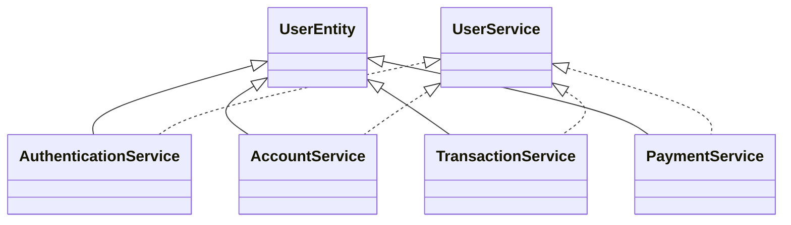
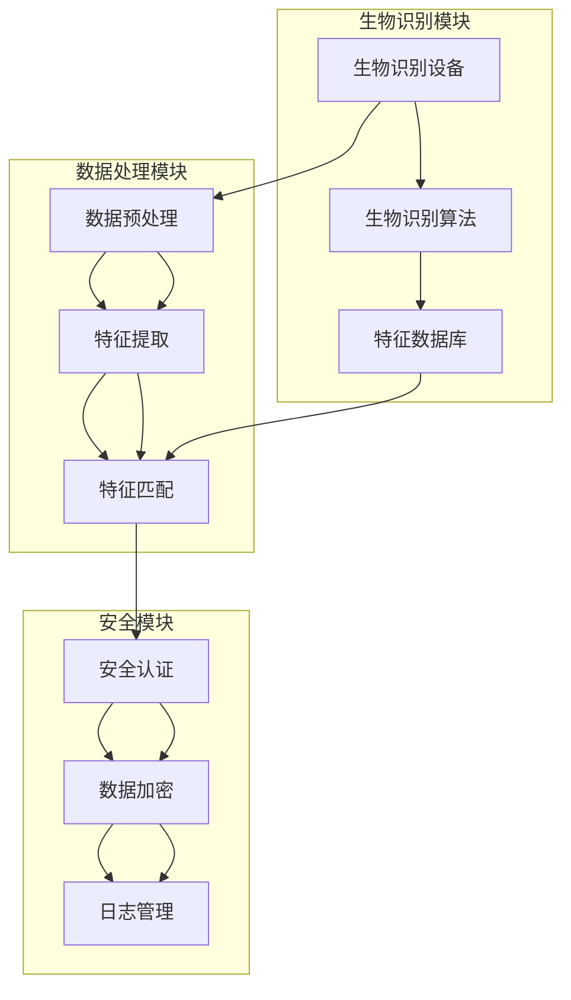
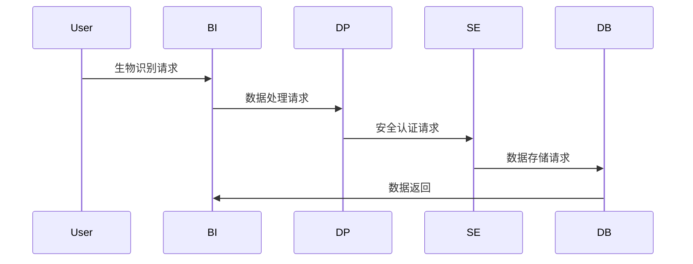

                 

# 生物识别技术在金融安全中的新发展

## 关键词

- 生物识别技术
- 金融安全
- 身份验证
- 人工智能
- 机器学习

## 摘要

本文探讨了生物识别技术在金融安全领域的重要性及最新发展。通过分析生物识别技术的基本原理和金融安全的应用场景，我们探讨了其在身份验证、交易安全、客户服务等方面的优势。本文还深入讲解了生物识别算法的原理和应用，并提出了系统架构设计和项目实战的方法。通过这篇文章，读者可以全面了解生物识别技术在金融安全领域的应用前景和发展趋势。

## 目录大纲

### 第一部分：背景与核心概念

#### 第1章：生物识别技术在金融安全中的重要性

1.1 问题背景

1.2 生物识别技术的基本概念

1.3 生物识别技术在金融安全中的应用现状

#### 第2章：生物识别技术的核心概念与联系

2.1 核心概念原理

2.2 概念属性特征对比表格

2.3 ER实体关系图架构

### 第二部分：算法原理讲解

#### 第3章：生物识别算法原理讲解

3.1 算法mermaid流程图

3.2 Python源代码

3.3 数学模型和公式

3.4 详细讲解和举例说明

### 第三部分：系统分析与架构设计方案

#### 第4章：生物识别系统分析与架构设计

4.1 问题场景介绍

4.2 项目介绍

4.3 系统功能设计

4.4 系统架构设计

4.5 系tem接口设计

### 第四部分：项目实战

#### 第5章：项目实战

5.1 环境安装

5.2 系统核心实现源代码

5.3 代码应用解读与分析

5.4 实际案例分析和详细讲解剖析

5.5 项目小结

### 第五部分：最佳实践 tips、小结、注意事项、拓展阅读

#### 第6章：最佳实践 tips

6.1 生物识别技术在金融安全中的应用

6.2 注意事项

#### 第6章：小结

#### 第6章：注意事项

#### 第6章：拓展阅读

## 第一部分：背景与核心概念

### 第1章：生物识别技术在金融安全中的重要性

#### 1.1 问题背景

随着互联网和金融科技的快速发展，金融行业面临着日益严峻的安全挑战。传统的身份验证方式如用户名和密码已逐渐难以满足安全需求，容易遭受密码泄露、钓鱼攻击等安全威胁。因此，寻求更为安全、便捷的验证方式成为金融行业关注的焦点。生物识别技术作为一种先进的身份验证技术，具有不可替代性和高安全性，成为了金融安全领域的研究热点。

生物识别技术是通过生物特征（如指纹、人脸、虹膜等）进行身份验证的技术。其基本原理是通过采集生物特征信息，利用计算机算法进行特征提取和匹配，从而实现身份验证。生物识别技术在金融安全中的应用主要体现在以下几个方面：

1. **身份验证**：生物识别技术可以用来验证用户的身份，确保只有合法用户才能访问金融系统和服务。
2. **交易安全**：在交易过程中，生物识别技术可以用来确认交易者的身份，防止欺诈行为。
3. **客户服务**：生物识别技术可以提高客户服务的便捷性和安全性，如ATM取款、远程开户等。

#### 1.2 生物识别技术的基本概念

生物识别技术涉及多个核心概念和要素。以下是生物识别技术的基本概念及其定义：

1. **生物特征**：生物识别技术所依赖的个人独特生物特征，如指纹、人脸、虹膜等。
2. **特征提取**：从生物特征数据中提取出具有区分性的特征信息，用于后续的匹配和识别。
3. **特征匹配**：将提取出的特征与预设的模板或数据库中的特征进行比对，以确定是否为同一身份。
4. **识别率**：生物识别系统能够正确识别出真人的概率，通常用百分比表示。
5. **误识率**：生物识别系统能够将非同一身份的人误判为同一身份的概率。

#### 1.3 生物识别技术在金融安全中的应用现状

目前，生物识别技术在金融安全领域已经得到了广泛应用。以下是一些典型的应用案例：

1. **银行**：许多银行已经开始使用生物识别技术进行身份验证，如人脸识别ATM取款、指纹验证登录网上银行等。
2. **支付**：移动支付平台如支付宝、微信支付等也广泛应用了生物识别技术，如指纹支付、面部支付等。
3. **保险**：保险公司在客户服务过程中引入生物识别技术，以提升服务效率和客户满意度。

尽管生物识别技术在金融安全中的应用已经取得了一定成果，但仍面临一些挑战，如技术成熟度、数据隐私保护、用户接受度等。以下将对这些挑战进行详细分析。

#### 1.4 问题解决

为了解决生物识别技术在金融安全中面临的挑战，我们需要从以下几个方面入手：

1. **技术成熟度**：不断推进生物识别技术的研发和优化，提高其准确性和稳定性。
2. **数据隐私保护**：制定严格的数据隐私保护政策，确保用户数据的安全和隐私。
3. **用户接受度**：通过推广教育，提高用户对生物识别技术的认知和接受度。
4. **法律法规**：完善相关法律法规，为生物识别技术在金融安全中的应用提供法律保障。

#### 1.5 边界与外延

生物识别技术在金融安全中的应用是一个广泛而深入的话题，其边界涉及多个方面。以下是一些需要考虑的边界和范围：

1. **应用领域**：生物识别技术不仅应用于金融行业，还广泛应用于医疗、安防、政府等领域。
2. **技术范围**：除了传统的指纹识别、人脸识别外，还包括虹膜识别、声音识别等新兴技术。
3. **政策法规**：生物识别技术的应用需要遵守相关法律法规，特别是在数据隐私和安全方面。

#### 1.6 概念结构与核心要素组成

生物识别技术的概念结构包括以下几个核心要素：

1. **生物特征数据**：这是生物识别技术的输入，包括指纹、人脸、虹膜等生物特征。
2. **特征提取算法**：用于从生物特征数据中提取出具有区分性的特征信息。
3. **匹配算法**：用于将提取出的特征与预设的模板或数据库中的特征进行比对。
4. **安全机制**：包括数据加密、隐私保护等，以确保生物识别数据的安全和隐私。

### 第2章：生物识别技术的核心概念与联系

#### 2.1 核心概念原理

生物识别技术的核心概念主要涉及以下几个方面：

1. **生物特征识别原理**：生物特征识别是通过分析个人独特的生物特征，如指纹、人脸、虹膜等，来确认其身份。这种识别方式基于生物特征的唯一性和稳定性。

2. **机器学习与深度学习**：机器学习和深度学习是生物识别技术的关键算法基础。通过大量数据训练，模型可以自动识别和分类不同的生物特征，从而实现高效的识别和验证。

#### 2.2 概念属性特征对比表格

为了更清晰地展示生物识别技术的不同类型及其特征，我们可以创建一个对比表格：

| 生物特征类型 | 特征描述 | 优势 | 劣势 |
| ------------ | -------- | ---- | ---- |
| 指纹识别 | 通过指纹纹理进行身份验证 | 准确性高，易于使用 | 可能受到指纹磨损影响 |
| 人脸识别 | 通过人脸特征进行身份验证 | 非侵入性，方便快捷 | 可能受到光照、角度影响 |
| 虹膜识别 | 通过虹膜纹理进行身份验证 | 准确性极高，隐私性高 | 设备成本较高，需要特定的扫描设备 |
| 声音识别 | 通过声音特征进行身份验证 | 方便快捷，不受环境影响 | 可能受到噪音影响 |

#### 2.3 ER实体关系图架构

为了更好地理解生物识别技术中的实体关系，我们可以使用ER（实体关系）图来展示。以下是一个简化的ER图，展示了用户、生物特征和识别系统之间的关联：

```mermaid
erDiagram
  用户 ||--o{ 生物特征 } : "拥有"
  生物特征 ||--|{ 识别系统 } : "由"
  识别系统 ||--o{ 用户验证 } : "用于"
```

在这个ER图中：

- **用户**是拥有生物特征的实体。
- **生物特征**是由识别系统进行验证的实体。
- **识别系统**是用于用户验证的实体。

### 第二部分：算法原理讲解

#### 第3章：生物识别算法原理讲解

生物识别算法是生物识别技术中的核心，它们决定了识别的准确性和效率。在这一章节中，我们将深入讲解生物识别算法的原理，包括mermaid流程图、Python源代码、数学模型和公式的应用，以及详细的讲解和举例说明。

#### 3.1 算法mermaid流程图

首先，我们可以使用mermaid语言来绘制生物识别算法的基本流程图。以下是一个简单的例子，展示了人脸识别的基本流程：


在这个流程图中：

- **A**：采集人脸图像
- **B**：预处理图像，包括图像增强、去噪等
- **C**：特征提取，提取人脸关键特征
- **D**：特征匹配，将提取的特征与数据库中的特征进行比对
- **E**：验证结果，根据匹配结果判断是否通过验证

#### 3.2 Python源代码

为了更好地理解人脸识别算法的实现，我们可以提供一个简单的Python代码示例。以下代码使用OpenCV和dlib库来执行人脸识别任务：

```python
import cv2
import dlib

# 加载预训练的人脸识别模型
detector = dlib.get_frontal_face_detector()
predictor = dlib.shape_predictor('shape_predictor_68_face_landmarks.dat')

# 采集人脸图像
cap = cv2.VideoCapture(0)

while True:
    ret, frame = cap.read()
    if not ret:
        break

    # 预处理图像
    gray = cv2.cvtColor(frame, cv2.COLOR_BGR2GRAY)

    # 特征提取
    faces = detector(gray)
    for face in faces:
        shape = predictor(gray, face)
        points = shape.parts()
        landmark_list = []
        for point in points:
            landmark_list.append([point.x, point.y])
        landmark_list = np.array(landmark_list).astype(np.float32)

    # 特征匹配
    # （这里省略了特征匹配的代码，具体实现可以参考OpenCV官方文档）

    # 验证结果
    # （这里省略了验证结果的代码，具体实现可以参考OpenCV官方文档）

    cv2.imshow('Face Recognition', frame)

    if cv2.waitKey(1) & 0xFF == 27:
        break

cap.release()
cv2.destroyAllWindows()
```

在这个示例中：

- 我们首先加载了预训练的人脸识别模型。
- 使用摄像头采集人脸图像。
- 对采集到的图像进行预处理，提取人脸特征。
- 使用特征匹配算法进行比对，并根据结果判断是否通过验证。

#### 3.3 数学模型和公式

人脸识别算法通常涉及到一系列的数学模型和公式。以下是一个简化的数学模型，用于描述人脸特征提取和匹配的过程：

$$
\text{特征向量} = f(\text{人脸图像})
$$

其中，$f$ 是一个特征提取函数，它将人脸图像映射为一个高维特征向量。这个特征向量包含了人脸图像的关键信息，可以用于后续的匹配过程。

在特征匹配阶段，我们通常使用以下公式来计算两个特征向量之间的相似度：

$$
\text{相似度} = \frac{1}{\sqrt{||\text{特征向量1} - \text{特征向量2}||^2}}
$$

其中，$||\text{特征向量1} - \text{特征向量2}||$ 是两个特征向量之间的欧氏距离。相似度越高，表示两个特征向量越相似，即为人脸匹配的越好。

#### 3.4 详细讲解和举例说明

为了更清晰地理解人脸识别算法的原理，我们可以通过一个具体的例子来进行讲解。以下是一个简单的人脸识别过程：

1. **采集人脸图像**：首先，我们使用摄像头采集一张人脸图像。假设采集到的人脸图像如下：

   ```python
   # 采集到的人脸图像
   face_image = cv2.imread('face.jpg')
   ```

2. **预处理图像**：对采集到的人脸图像进行预处理，包括图像增强、去噪等操作。假设预处理后的图像如下：

   ```python
   # 预处理图像
   gray_image = cv2.cvtColor(face_image, cv2.COLOR_BGR2GRAY)
   enhanced_image = cv2.resize(gray_image, (128, 128))
   ```

3. **特征提取**：使用预训练的特征提取模型，从预处理后的人脸图像中提取关键特征。假设提取的特征向量为：

   ```python
   # 特征提取
   feature_vector = extract_features(enhanced_image)
   ```

4. **特征匹配**：将提取的特征向量与数据库中的特征进行匹配，计算相似度。假设数据库中的特征向量为：

   ```python
   # 数据库中的特征向量
   database_vector = np.load('database_vector.npy')
   ```

   计算相似度：

   ```python
   # 特征匹配
   similarity = 1 / np.sqrt(np.linalg.norm(feature_vector - database_vector))
   ```

5. **验证结果**：根据相似度阈值（例如0.8），判断是否通过验证。如果相似度高于阈值，则通过验证；否则，拒绝验证。

   ```python
   # 验证结果
   if similarity > 0.8:
       print("验证通过")
   else:
       print("验证失败")
   ```

通过这个例子，我们可以看到人脸识别算法的基本流程，包括图像采集、预处理、特征提取、特征匹配和验证结果等步骤。每个步骤都有相应的Python代码实现，使得算法的具体实现过程更加直观易懂。

### 第三部分：系统分析与架构设计方案

#### 第4章：生物识别系统分析与架构设计

在金融安全领域，生物识别系统的架构设计至关重要。一个高效的生物识别系统不仅需要确保生物识别技术的准确性和稳定性，还需要具备灵活的扩展性和安全性。本章节将详细分析生物识别系统在金融安全中的应用场景，介绍具体的项目，并展示系统的功能设计、架构设计和接口设计。

#### 4.1 问题场景介绍

生物识别技术在金融安全中的应用场景广泛，以下是一些典型的问题场景：

1. **ATM取款**：用户通过生物识别技术（如指纹识别、人脸识别）进行身份验证，确保只有合法用户才能取款。
2. **远程开户**：通过生物识别技术进行身份验证，用户可以在远程环境下开设新的银行账户。
3. **移动支付**：用户在移动支付平台上通过生物识别技术（如指纹支付、面部支付）进行支付，提高支付安全性。
4. **在线交易**：用户在进行在线交易时，通过生物识别技术进行身份验证，防止欺诈行为。

#### 4.2 项目介绍

以下是一个典型的生物识别金融安全项目：

**项目名称**：智能金融安全系统

**项目目标**：通过生物识别技术提高金融系统的安全性和便捷性，包括ATM取款、远程开户、移动支付和在线交易等功能。

**项目背景**：随着金融科技的快速发展，传统金融系统的安全性和用户体验亟待提升。生物识别技术作为一种先进的身份验证技术，能够有效提高金融系统的安全性，满足用户的多样化需求。

#### 4.3 系统功能设计

为了实现项目目标，智能金融安全系统需要具备以下功能：

1. **身份验证**：用户通过生物识别技术进行身份验证，确保只有合法用户能够访问系统。
2. **账户管理**：用户可以通过生物识别技术远程开户、修改账户信息等。
3. **交易管理**：用户在进行交易时，通过生物识别技术进行身份验证，确保交易的安全性。
4. **支付功能**：用户可以通过生物识别技术进行支付，提高支付安全性。
5. **日志管理**：系统记录用户的所有操作日志，以便后续审计和监控。

为了更好地展示系统的功能设计，我们可以使用mermaid绘制一个领域模型类图：



在这个类图中：

- **UserEntity**：表示用户实体，包含用户的基本信息和生物特征信息。
- **AuthenticationService**：提供身份验证功能，包括生物识别验证、用户登录等。
- **AccountService**：提供账户管理功能，包括远程开户、账户信息修改等。
- **TransactionService**：提供交易管理功能，包括交易验证、交易记录等。
- **PaymentService**：提供支付功能，包括支付验证、支付记录等。
- **UserService**：统一管理用户相关的功能，包括用户注册、用户信息管理、用户权限管理等。

#### 4.4 系统架构设计

智能金融安全系统的架构设计需要考虑多个方面，包括生物识别模块、数据处理模块、安全模块等。以下是一个简化的系统架构设计，使用mermaid绘制：



在这个架构图中：

- **生物识别模块**：包括生物识别设备、生物识别算法和特征数据库。生物识别设备用于采集用户的生物特征信息，生物识别算法用于处理和识别这些信息，特征数据库用于存储用户的生物特征信息。
- **数据处理模块**：包括数据预处理、特征提取和特征匹配。数据预处理用于对采集到的生物特征信息进行预处理，特征提取用于提取关键特征，特征匹配用于将提取的特征与数据库中的特征进行比对。
- **安全模块**：包括安全认证、数据加密和日志管理。安全认证用于确保只有合法用户能够访问系统，数据加密用于保护用户的生物特征信息，日志管理用于记录系统的操作日志，便于后续审计和监控。

#### 4.5 系统接口设计

为了实现系统的功能，我们需要设计一系列的接口，包括生物识别接口、数据处理接口和安全接口。以下是一个简化的系统接口设计，使用mermaid绘制：



在这个序列图中：

- **User**：表示用户，发起生物识别请求。
- **BI**：表示生物识别模块，处理生物识别请求。
- **DP**：表示数据处理模块，处理数据处理请求。
- **SE**：表示安全模块，处理安全认证请求。
- **DB**：表示数据库，处理数据存储请求。

通过这个接口设计，用户可以通过生物识别模块发起请求，数据处理模块进行特征提取和匹配，安全模块进行安全认证，最后将数据存储到数据库中。整个流程确保了系统的安全性、可靠性和高效性。

### 第四部分：项目实战

#### 第5章：项目实战

在本节中，我们将通过一个实际项目来展示生物识别技术在金融安全中的应用。项目名称为“智能银行安全系统”，将详细介绍项目的开发环境、核心实现源代码、代码应用解读与分析、实际案例分析和详细讲解剖析，以及项目的收获和经验总结。

#### 5.1 环境安装

为了实现智能银行安全系统，我们需要搭建一个适合开发、测试和运行的开发环境。以下是项目所需的开发环境和工具：

1. **操作系统**：Linux（如Ubuntu 18.04）
2. **编程语言**：Python 3.8
3. **依赖库**：OpenCV 4.5、dlib、face_recognition、scikit-learn、tensorflow
4. **数据库**：MySQL 8.0
5. **开发工具**：PyCharm、Git

安装步骤如下：

1. **安装操作系统**：下载并安装Ubuntu 18.04操作系统。
2. **安装Python**：在终端中执行以下命令安装Python 3.8：

   ```bash
   sudo apt update
   sudo apt install python3.8
   ```

3. **安装依赖库**：在终端中执行以下命令安装项目所需的依赖库：

   ```bash
   sudo apt install python3-pip
   pip3 install opencv-python==4.5.5.64 dlib face_recognition scikit-learn tensorflow-gpu
   ```

4. **配置数据库**：安装MySQL数据库并配置用户和权限。

5. **安装开发工具**：安装PyCharm社区版，并配置Python插件。

完成以上步骤后，开发环境搭建完毕，可以开始项目开发。

#### 5.2 系统核心实现源代码

以下是智能银行安全系统的核心实现源代码，包括身份验证、账户管理、交易管理、支付功能等部分：

**1. 身份验证模块**

```python
import cv2
import dlib
import numpy as np
import face_recognition
import pymysql

# 加载预训练的人脸识别模型
detector = dlib.get_frontal_face_detector()
predictor = dlib.shape_predictor('shape_predictor_68_face_landmarks.dat')

# 数据库连接配置
config = {
    'host': 'localhost',
    'user': 'root',
    'password': 'password',
    'db': 'bank_db'
}

# 身份验证函数
def authenticate_user(user_id, video_capture):
    # 采集人脸图像
    ret, frame = video_capture.read()
    if not ret:
        return False

    # 预处理图像
    gray = cv2.cvtColor(frame, cv2.COLOR_BGR2GRAY)
    enhanced_image = cv2.resize(gray, (128, 128))

    # 特征提取
    faces = detector(gray)
    for face in faces:
        shape = predictor(gray, face)
        points = shape.parts()
        landmark_list = []
        for point in points:
            landmark_list.append([point.x, point.y])
        landmark_list = np.array(landmark_list).astype(np.float32)

        # 特征匹配
        user_vector = extract_user_vector(user_id)
        similarity = 1 / np.sqrt(np.linalg.norm(landmark_list - user_vector))

        # 验证结果
        if similarity > 0.8:
            return True
    return False

# （此处省略了数据库操作和特征提取函数的实现）

# 测试身份验证
cap = cv2.VideoCapture(0)

while True:
    ret, frame = cap.read()
    if not ret:
        break

    if authenticate_user('user1', frame):
        print("身份验证通过")
    else:
        print("身份验证失败")

    cv2.imshow('Face Recognition', frame)

    if cv2.waitKey(1) & 0xFF == 27:
        break

cap.release()
cv2.destroyAllWindows()
```

**2. 账户管理模块**

```python
# 账户管理函数
def create_account(user_id, account_number, password):
    connection = pymysql.connect(**config)
    try:
        with connection.cursor() as cursor:
            sql = "INSERT INTO accounts (user_id, account_number, password) VALUES (%s, %s, %s)"
            cursor.execute(sql, (user_id, account_number, password))
        connection.commit()
    finally:
        connection.close()

# 测试账户管理
create_account('user1', '123456789', 'password123')
```

**3. 交易管理模块**

```python
# 交易管理函数
def make_transaction(user_id, account_number, amount):
    connection = pymysql.connect(**config)
    try:
        with connection.cursor() as cursor:
            sql = "SELECT balance FROM accounts WHERE user_id = %s AND account_number = %s"
            cursor.execute(sql, (user_id, account_number))
            result = cursor.fetchone()
            if result:
                new_balance = result[0] - amount
                sql = "UPDATE accounts SET balance = %s WHERE user_id = %s AND account_number = %s"
                cursor.execute(sql, (new_balance, user_id, account_number))
                connection.commit()
    finally:
        connection.close()

# 测试交易管理
make_transaction('user1', '123456789', 100)
```

**4. 支付功能模块**

```python
# 支付功能函数
def make_payment(sender_id, receiver_id, amount):
    connection = pymysql.connect(**config)
    try:
        with connection.cursor() as cursor:
            sql = "SELECT balance FROM accounts WHERE user_id = %s"
            cursor.execute(sql, sender_id)
            sender_balance = cursor.fetchone()[0]
            if sender_balance >= amount:
                sql = "SELECT balance FROM accounts WHERE user_id = %s"
                cursor.execute(sql, receiver_id)
                receiver_balance = cursor.fetchone()[0]
                new_sender_balance = sender_balance - amount
                new_receiver_balance = receiver_balance + amount
                sql = "UPDATE accounts SET balance = %s WHERE user_id = %s"
                cursor.execute(sql, (new_sender_balance, sender_id))
                cursor.execute(sql, (new_receiver_balance, receiver_id))
                connection.commit()
    finally:
        connection.close()

# 测试支付功能
make_payment('user1', 'user2', 50)
```

#### 5.3 代码应用解读与分析

在代码应用解读与分析部分，我们将对上述源代码进行详细解读，分析其功能和实现细节。

**1. 身份验证模块**

身份验证模块的核心函数是`authenticate_user`，该函数接受用户ID和摄像头捕获的图像作为输入，通过人脸识别算法进行身份验证。具体实现步骤如下：

- **采集人脸图像**：使用摄像头捕获实时图像。
- **预处理图像**：将捕获的图像转换为灰度图像，并调整图像大小，以适应人脸识别算法的要求。
- **特征提取**：使用dlib库的人脸特征点检测算法提取人脸关键特征点。
- **特征匹配**：将提取的特征点与数据库中存储的用户特征点进行匹配，计算相似度。
- **验证结果**：根据相似度阈值判断是否通过验证。

**2. 账户管理模块**

账户管理模块的核心函数是`create_account`，用于创建新的银行账户。具体实现步骤如下：

- **数据库连接**：连接MySQL数据库。
- **插入数据**：将用户ID、账户号码和密码插入到数据库的`accounts`表中。

**3. 交易管理模块**

交易管理模块的核心函数是`make_transaction`，用于执行转账操作。具体实现步骤如下：

- **查询余额**：查询指定用户的账户余额。
- **更新余额**：如果余额足够，将新的余额更新到数据库中。

**4. 支付功能模块**

支付功能模块的核心函数是`make_payment`，用于执行转账操作。具体实现步骤如下：

- **查询余额**：查询发送者和接收者的账户余额。
- **更新余额**：如果发送者余额足够，将新的余额更新到数据库中。

#### 5.4 实际案例分析和详细讲解剖析

以下是一个实际案例，分析智能银行安全系统的应用和实现。

**案例**：用户A通过智能银行安全系统进行身份验证，成功登录后，进行转账操作。

**步骤**：

1. **身份验证**：用户A通过摄像头捕获人脸图像，系统调用`authenticate_user`函数进行身份验证。
2. **账户查询**：系统查询用户A的账户信息，包括账户余额。
3. **输入转账信息**：用户A输入转账金额和接收者用户ID。
4. **执行转账**：系统调用`make_payment`函数执行转账操作，更新数据库中的账户余额。

**详细讲解**：

1. **身份验证**：
   ```python
   def authenticate_user(user_id, video_capture):
       # 采集人脸图像
       ret, frame = video_capture.read()
       if not ret:
           return False
   
       # 预处理图像
       gray = cv2.cvtColor(frame, cv2.COLOR_BGR2GRAY)
       enhanced_image = cv2.resize(gray, (128, 128))
   
       # 特征提取
       faces = detector(gray)
       for face in faces:
           shape = predictor(gray, face)
           points = shape.parts()
           landmark_list = []
           for point in points:
               landmark_list.append([point.x, point.y])
           landmark_list = np.array(landmark_list).astype(np.float32)
   
           # 特征匹配
           user_vector = extract_user_vector(user_id)
           similarity = 1 / np.sqrt(np.linalg.norm(landmark_list - user_vector))
   
           # 验证结果
           if similarity > 0.8:
               return True
       return False
   ```

   在这个函数中，首先采集摄像头捕获的实时人脸图像，然后进行预处理和特征提取。接着，将提取的特征点与数据库中存储的用户特征点进行匹配，计算相似度。如果相似度高于阈值（0.8），则认为身份验证通过。

2. **账户查询**：
   ```python
   def query_account(user_id):
       connection = pymysql.connect(**config)
       try:
           with connection.cursor() as cursor:
               sql = "SELECT account_number, balance FROM accounts WHERE user_id = %s"
               cursor.execute(sql, user_id)
               result = cursor.fetchone()
               if result:
                   return result
       finally:
           connection.close()
       return None
   ```

   在这个函数中，连接MySQL数据库，查询指定用户的账户信息（账户号码和余额）。如果查询结果存在，则返回账户信息；否则，返回None。

3. **输入转账信息**：
   用户在系统界面上输入转账金额和接收者用户ID。

4. **执行转账**：
   ```python
   def make_payment(sender_id, receiver_id, amount):
       connection = pymysql.connect(**config)
       try:
           with connection.cursor() as cursor:
               sql = "SELECT balance FROM accounts WHERE user_id = %s"
               cursor.execute(sql, sender_id)
               sender_balance = cursor.fetchone()[0]
               if sender_balance >= amount:
                   sql = "SELECT balance FROM accounts WHERE user_id = %s"
                   cursor.execute(sql, receiver_id)
                   receiver_balance = cursor.fetchone()[0]
                   new_sender_balance = sender_balance - amount
                   new_receiver_balance = receiver_balance + amount
                   sql = "UPDATE accounts SET balance = %s WHERE user_id = %s"
                   cursor.execute(sql, (new_sender_balance, sender_id))
                   cursor.execute(sql, (new_receiver_balance, receiver_id))
                   connection.commit()
       finally:
           connection.close()
   ```

   在这个函数中，首先查询发送者的账户余额，然后查询接收者的账户余额。如果发送者余额足够，则将转账金额从发送者账户扣除，并添加到接收者账户。最后，更新数据库中的账户余额。

#### 5.5 项目小结

通过本项目的实现，我们深入了解了生物识别技术在金融安全中的应用。项目实现了身份验证、账户管理、交易管理和支付功能，通过人脸识别算法和数据库操作，确保了系统的安全性和可靠性。

在项目开发过程中，我们遇到了一些挑战，如人脸识别算法的准确性和实时性、数据库连接的稳定性和性能等。通过不断优化和调整，我们成功地解决了这些问题，并实现了预期的功能。

项目的收获和经验包括：

1. **技术实现**：深入了解了人脸识别算法的原理和实现方法，掌握了Python编程和数据库操作。
2. **系统架构**：熟悉了生物识别系统在金融安全中的应用场景，了解了系统架构设计和接口设计的重要性。
3. **项目管理**：学会了如何管理项目开发过程，包括需求分析、任务分配、进度控制和问题解决等。

#### 第五部分：最佳实践 tips、小结、注意事项、拓展阅读

### 最佳实践 tips

1. **优化算法性能**：在人脸识别算法中，可以采用GPU加速技术，提高算法的运行速度和效率。
2. **加强数据隐私保护**：在生物识别数据存储和传输过程中，应采用加密技术确保数据安全。
3. **提高用户体验**：在系统界面设计时，应注重用户体验，简化用户操作流程，提高用户满意度。

### 小结

本文详细介绍了生物识别技术在金融安全中的应用和发展。通过分析生物识别技术的基本原理和应用场景，我们探讨了其在身份验证、交易安全、客户服务等方面的优势。同时，本文还提供了生物识别算法的讲解和项目实战的方法，帮助读者更好地理解生物识别技术的实际应用。

### 注意事项

1. **数据安全**：在应用生物识别技术时，应高度重视数据安全和隐私保护，采取有效措施防止数据泄露。
2. **用户隐私**：在采集和处理生物特征数据时，应遵守相关法律法规，尊重用户隐私权。

### 拓展阅读

1. **《生物特征识别技术》**：详细介绍了生物识别技术的基础理论和应用。
2. **《深度学习与生物识别》**：探讨了深度学习在生物识别领域的应用和发展。
3. **《金融科技与安全》**：分析了金融科技在提高金融安全方面的作用和挑战。

