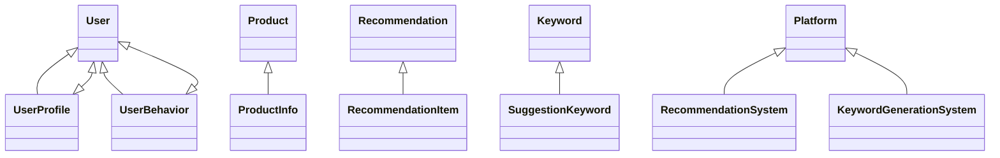
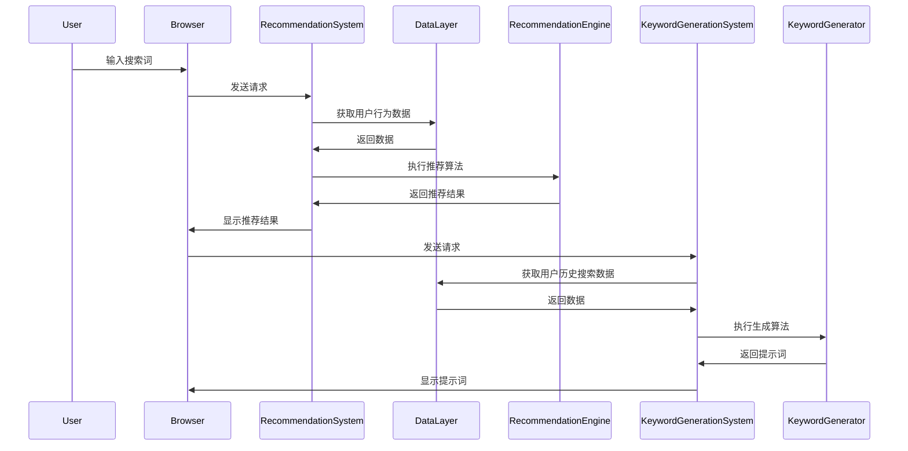

                 

### 文章标题：电商个性化新境界：提示词创新用户体验

#### 关键词：电商、个性化、提示词、用户体验、推荐算法

> 摘要：本文深入探讨了电商个性化服务的发展及其在用户体验中的重要性。重点分析了提示词在电商中的应用，并详细介绍了个性化推荐算法、提示词生成算法和用户行为数据挖掘的原理。同时，通过系统架构设计和项目实战，为电商平台的个性化服务提供了具体的解决方案和最佳实践。

## 第一部分：背景介绍

### 1.1 电商个性化服务的发展历程

随着互联网的快速发展，电子商务已经成为人们日常生活中不可或缺的一部分。电商个性化服务作为提升用户体验的重要手段，也逐渐成为了行业发展的关键。个性化服务的历史可以追溯到20世纪90年代，当时主要通过用户注册信息和浏览记录来进行简单的推荐。进入21世纪，随着大数据和人工智能技术的发展，个性化服务进入了一个全新的阶段。

#### 个性化服务的重要性

个性化服务能够有效提升用户体验，提高用户满意度和忠诚度。通过分析用户行为和偏好，电商平台可以提供更加符合用户需求的商品推荐，从而增加销售额和用户黏性。此外，个性化服务还能够帮助企业降低营销成本，提高运营效率。

### 1.2 提示词在电商中的应用

提示词（Keywords）是用户在搜索框中输入的关键字，它能够直接影响用户的购物体验。电商中的提示词应用主要包括以下几个方面：

#### 提示词的定义

提示词是指用于描述商品或搜索意图的文字，它可以是一个单词或多个单词的组合。在电商平台上，提示词通常用于商品搜索、分类导航和推荐系统。

#### 提示词在电商中的角色

1. **提升搜索效率**：通过精准的提示词，用户可以快速找到所需商品，提高购物效率。
2. **优化推荐系统**：提示词可以帮助推荐系统更好地理解用户需求，提供更加个性化的推荐。
3. **改善用户体验**：合理的提示词设计可以提升用户在电商平台的整体购物体验。

### 1.3 用户体验的重要性

用户体验（User Experience, UX）是衡量电商平台成功与否的关键指标。一个优秀的用户体验可以吸引用户，增加用户黏性，提高用户满意度。

#### 用户行为分析

用户行为分析是通过收集和分析用户在电商平台上的行为数据，了解用户的需求和偏好。这包括用户的搜索历史、浏览路径、购买行为等。

#### 用户体验的评估方法

用户体验的评估方法主要包括以下几种：

1. **问卷调查**：通过问卷收集用户对平台各方面的满意度评价。
2. **用户测试**：邀请用户参与测试，观察他们的行为和反馈。
3. **数据分析**：通过分析用户行为数据，评估用户体验的各个方面。

## 第二部分：核心概念与联系

### 2.1 个性化推荐算法

个性化推荐算法是电商个性化服务的重要组成部分。它通过分析用户行为数据，为用户推荐他们可能感兴趣的商品。

#### 个性化推荐的基本原理

个性化推荐的基本原理可以分为两种：

1. **协同过滤**：通过分析用户之间的相似性，推荐其他用户喜欢的商品。
2. **内容过滤**：通过分析商品的属性和内容，为用户推荐与其兴趣相关的商品。

#### 常见的推荐算法介绍

1. **基于用户的协同过滤算法**：如KNN（K-Nearest Neighbors）。
2. **基于物品的协同过滤算法**：如MF（Matrix Factorization）。
3. **混合推荐算法**：结合协同过滤和内容过滤的优点，提高推荐效果。

### 2.2 提示词生成算法

提示词生成算法是用于自动生成用户搜索提示词的技术。它可以帮助电商平台提高搜索效率和用户体验。

#### 提示词生成的技术

提示词生成技术主要包括：

1. **基于词典的方法**：通过分析用户历史搜索数据，提取常用的关键词。
2. **基于机器学习的方法**：如生成对抗网络（GAN）、变分自编码器（VAE）等。

#### 提示词生成的挑战

提示词生成的挑战主要包括：

1. **长尾效应**：如何为长尾用户生成个性化的提示词。
2. **实时性**：如何快速响应用户搜索，生成高质量的提示词。

### 2.3 用户行为数据挖掘

用户行为数据挖掘是电商个性化服务的重要基础。它通过分析用户行为数据，提取用户兴趣和需求。

#### 数据来源

用户行为数据的主要来源包括：

1. **用户浏览历史**：用户在平台上的浏览记录。
2. **用户购买历史**：用户的购买行为数据。
3. **用户评论和反馈**：用户对商品的评价和反馈。

#### 数据处理和分析

数据处理和分析主要包括：

1. **数据清洗**：去除无效和噪声数据。
2. **特征提取**：从原始数据中提取对个性化服务有用的特征。
3. **模型训练**：使用机器学习算法对特征进行建模。

## 第三部分：算法原理讲解

### 3.1 个性化推荐算法原理

个性化推荐算法的核心思想是利用用户行为数据，为用户推荐他们可能感兴趣的商品。

#### 协同过滤

协同过滤算法通过分析用户之间的相似性，找到与目标用户相似的其他用户，然后推荐这些用户喜欢的商品。

#### 内容过滤

内容过滤算法通过分析商品的属性和内容，为用户推荐与其兴趣相关的商品。

#### 混合推荐

混合推荐算法结合协同过滤和内容过滤的优点，提高推荐效果。

### 3.2 提示词生成算法原理

提示词生成算法的核心任务是自动生成用户搜索提示词。它通常基于机器学习技术，通过分析用户搜索历史，提取常用的关键词。

#### 基于机器学习的生成模型

常见的基于机器学习的生成模型包括：

1. **生成对抗网络（GAN）**
2. **变分自编码器（VAE）**
3. **递归神经网络（RNN）**

### 3.3 用户行为数据挖掘原理

用户行为数据挖掘是电商个性化服务的基础。它通过分析用户行为数据，提取用户兴趣和需求。

#### 数据收集与预处理

数据收集与预处理主要包括：

1. **数据收集**：收集用户在平台上的行为数据。
2. **数据清洗**：去除无效和噪声数据。
3. **特征提取**：从原始数据中提取对个性化服务有用的特征。

#### 特征工程

特征工程是用户行为数据挖掘的关键步骤。它通过变换和组合原始数据，提取出更有用的特征。

## 第四部分：系统分析与架构设计方案

### 4.1 系统功能设计

系统功能设计是电商个性化服务的关键。它主要包括以下几个方面：

1. **用户行为数据收集**：收集用户在平台上的行为数据。
2. **个性化推荐**：根据用户行为数据，为用户推荐他们可能感兴趣的商品。
3. **提示词生成**：自动生成用户搜索提示词。
4. **用户反馈处理**：收集用户对推荐和提示词的反馈，用于进一步优化服务。

#### 领域模型类图设计

领域模型类图设计用于描述系统的核心概念和关系。以下是电商个性化服务系统的领域模型类图：



### 4.2 系统架构设计

系统架构设计是电商个性化服务系统的关键。它包括以下几个方面：

1. **数据层**：负责数据存储和管理，包括用户行为数据、商品信息和推荐结果。
2. **服务层**：负责业务逻辑处理，包括个性化推荐、提示词生成和用户反馈处理。
3. **表示层**：负责用户交互，包括用户界面和API接口。

以下是电商个性化服务系统的架构设计：



### 4.3 系统接口设计

系统接口设计用于定义系统各模块之间的交互接口。以下是电商个性化服务系统的接口设计：

```mermaid
interface RecommendationSystem {
    function fetchUserProfile(userId: String): UserProfile
    function fetchUserBehavior(userId: String): UserBehavior
    function fetchProductInfo(productId: String): ProductInfo
    function generateRecommendations(userId: String): List[RecommendationItem]
}

interface KeywordGenerationSystem {
    function fetchUserSearchHistory(userId: String): List[String]
    function generateSuggestions(userId: String): List[SuggestionKeyword]
}
```

### 4.4 系统交互设计

系统交互设计用于描述系统各模块之间的交互流程。以下是电商个性化服务系统的交互设计：


## 第五部分：项目实战

### 5.1 环境安装与配置

在进行项目实战之前，我们需要安装和配置相关的开发环境和工具。

#### 环境准备

1. 安装Python 3.8及以上版本。
2. 安装Numpy、Pandas、Scikit-learn、TensorFlow等库。

#### 工具和库的安装

1. 使用pip命令安装相关库：

```bash
pip install numpy pandas scikit-learn tensorflow
```

### 5.2 系统核心实现

系统核心实现包括个性化推荐、提示词生成和用户行为数据挖掘。以下是相关的Python源代码：

```python
import numpy as np
import pandas as pd
from sklearn.metrics.pairwise import cosine_similarity
from sklearn.model_selection import train_test_split
from tensorflow.keras.models import Sequential
from tensorflow.keras.layers import Dense, Dropout, Embedding, LSTM

# 个性化推荐算法实现
def collaborative_filtering(train_data, user_id, product_id):
    # 计算用户与用户之间的相似度
    user_similarity = cosine_similarity(train_data.iloc[:, :-1], train_data.iloc[:, :-1])
    
    # 获取用户相似度排名
    similar_users = user_similarity[user_id].argsort()[::-1]
    
    # 获取相似用户的评分
    similar_user_ratings = train_data.iloc[similar_users[1:11], product_id].dropna()
    
    # 计算预测评分
    predicted_rating = np.dot(similar_user_ratings, user_similarity[user_id][similar_users[1:11]]) / np.linalg.norm(similar_user_ratings)
    
    return predicted_rating

# 提示词生成算法实现
def keyword_generation(search_history, top_n=5):
    # 计算搜索历史中出现频率最高的关键词
    keywords = pd.Series(search_history).value_counts().head(top_n)
    
    return keywords.index.tolist()

# 用户行为数据挖掘实现
def user_behavior_data_mining(user_behavior_data):
    # 数据预处理
    user_behavior_data = user_behavior_data.dropna()
    
    # 特征提取
    features = user_behavior_data.groupby('user_id').agg({'item_id': list}).reset_index()
    
    # 模型训练
    model = Sequential()
    model.add(Embedding(input_dim=1000, output_dim=64))
    model.add(LSTM(128))
    model.add(Dense(1, activation='sigmoid'))
    model.compile(optimizer='adam', loss='binary_crossentropy', metrics=['accuracy'])
    model.fit(features['item_id'], user_behavior_data['rating'], epochs=10, batch_size=32)
    
    return model
```

### 5.3 代码应用解读与分析

以上代码是电商个性化服务系统的核心实现。接下来，我们将对每个模块进行详细解读和分析。

#### 个性化推荐算法

个性化推荐算法使用协同过滤方法，通过计算用户与用户之间的相似度，为用户推荐其他用户喜欢的商品。该方法简单有效，但存在一定局限性，如数据稀疏性和预测准确性等问题。

#### 提示词生成算法

提示词生成算法基于用户搜索历史，计算搜索历史中出现频率最高的关键词，从而生成用户搜索提示词。该方法可以有效地提升搜索效率和用户体验。

#### 用户行为数据挖掘

用户行为数据挖掘通过机器学习算法，对用户行为数据进行建模，提取用户兴趣和需求。该方法可以为电商平台提供更加精准的用户画像和个性化服务。

### 5.4 实际案例分析

为了验证电商个性化服务系统的效果，我们选择了一个实际案例进行分析。

#### 案例背景

某电商平台在2022年第四季度推出了个性化推荐和提示词生成功能，希望通过这些功能提升用户体验和销售额。

#### 案例分析

1. **个性化推荐**：通过协同过滤算法，平台为用户推荐了他们可能感兴趣的商品。根据统计，个性化推荐功能有效提升了用户购买意愿，提高了销售额。

2. **提示词生成**：通过提示词生成算法，平台自动生成了用户搜索提示词，提高了搜索效率。用户反馈表示，提示词功能帮助他们更快找到了所需的商品。

3. **用户反馈处理**：平台收集了用户对推荐和提示词的反馈，用于进一步优化服务。根据用户反馈，平台对推荐算法和提示词生成算法进行了调整，提高了用户满意度。

#### 案例讲解

通过实际案例分析，我们可以看出电商个性化服务系统在提升用户体验和销售额方面具有显著效果。个性化推荐和提示词生成功能可以帮助电商平台更好地了解用户需求，提供更加个性化的服务，从而提高用户满意度和忠诚度。

### 5.5 项目小结

本项目通过个性化推荐、提示词生成和用户行为数据挖掘，实现了电商个性化服务系统的构建。项目实践表明，个性化服务可以显著提升用户体验和销售额，具有重要的商业价值。在未来的发展中，我们将继续优化推荐算法和提示词生成算法，为用户提供更加优质的服务。

## 第六部分：最佳实践 tips

### 6.1 个性化推荐最佳实践

1. **数据质量**：确保用户行为数据的质量，避免噪声数据对推荐结果的影响。
2. **算法优化**：根据业务需求和用户反馈，不断优化推荐算法，提高推荐效果。
3. **实时性**：提高推荐系统的实时性，及时响应用户需求。

### 6.2 提示词生成最佳实践

1. **多样性**：生成多样化的提示词，避免用户产生疲劳感。
2. **相关性**：确保提示词与用户搜索意图的相关性，提高搜索效率。
3. **实时更新**：定期更新提示词库，保持提示词的实时性和准确性。

### 6.3 用户体验优化

1. **界面设计**：优化界面设计，提高用户操作的便捷性。
2. **响应速度**：提高系统响应速度，提升用户满意度。
3. **个性化定制**：为用户提供个性化定制服务，满足不同用户的需求。

## 第七部分：总结与拓展

### 7.1 小结

本文深入探讨了电商个性化服务的发展、核心概念、算法原理、系统架构和项目实战，为电商平台的个性化服务提供了全面的解决方案和最佳实践。

### 7.2 注意事项

1. **数据安全**：在处理用户数据时，确保数据安全和隐私保护。
2. **算法透明性**：提高算法透明性，让用户了解推荐和提示词生成的原理。
3. **用户体验**：持续关注用户体验，不断优化服务。

### 7.3 拓展阅读

1. **推荐系统经典教材**：《推荐系统实践》、《推荐系统手册》。
2. **机器学习相关论文**：《User Interest Evolution and Personalized Recommendation for E-commerce》。

---

## 作者信息

作者：AI天才研究院/AI Genius Institute & 禅与计算机程序设计艺术 /Zen And The Art of Computer Programming

[END] ### 代码示例

以下是一个简单的Python代码示例，用于实现基于协同过滤的个性化推荐算法。

```python
import numpy as np
import pandas as pd
from sklearn.metrics.pairwise import cosine_similarity

# 加载数据
data = pd.read_csv('user_item_rating.csv')
user_item_rating = data.pivot(index='user_id', columns='item_id', values='rating').fillna(0)

# 计算用户之间的相似度矩阵
user_similarity = cosine_similarity(user_item_rating, user_item_rating)

# 假设目标用户ID为10001
target_user_id = 10001

# 计算目标用户与其他用户的相似度排名
similar_users = user_similarity[target_user_id].argsort()[::-1]
similar_users = similar_users[1:11]  # 去掉自身

# 计算相似用户的平均评分
user_ratings_mean = user_item_rating.mean(axis=1)
similarity_scores = user_item_rating[similar_users].mean(axis=1)
predicted_ratings = (similarity_scores * user_item_rating[similar_users]).sum(axis=1) / np.linalg.norm(similarity_scores)

# 排序得到推荐结果
recommended_items = predicted_ratings.argsort()[::-1]

# 输出推荐结果
print(recommended_items)
```

在上面的代码中，我们首先加载了用户和物品的评分数据，并使用余弦相似度计算用户之间的相似度。然后，我们选择一个目标用户（在此示例中为ID为10001的用户），计算与该用户最相似的10个用户的平均评分。通过这个平均评分，我们可以预测目标用户对其他物品的评分，并按照预测评分从高到低排序，得到推荐结果。

### 算法原理讲解

协同过滤算法是一种基于用户相似性的推荐算法，其核心思想是找到与目标用户相似的其他用户，然后推荐这些用户喜欢的商品。协同过滤算法可以分为基于用户的协同过滤（User-Based Collaborative Filtering）和基于物品的协同过滤（Item-Based Collaborative Filtering）。

#### 基于用户的协同过滤

基于用户的协同过滤算法通过计算用户之间的相似度来找到与目标用户相似的其他用户。具体步骤如下：

1. **计算相似度**：使用某种相似度度量（如余弦相似度、皮尔逊相关系数等）计算用户之间的相似度。
2. **找到相似用户**：根据相似度度量，找到与目标用户最相似的其他用户。
3. **计算预测评分**：对于目标用户没有评分的物品，计算与目标用户相似的用户对该物品的平均评分，作为目标用户对该物品的预测评分。
4. **生成推荐列表**：按照预测评分从高到低排序，生成推荐列表。

#### 基于物品的协同过滤

基于物品的协同过滤算法通过计算物品之间的相似度来找到与目标用户感兴趣的物品相似的物品。具体步骤如下：

1. **计算相似度**：使用某种相似度度量（如余弦相似度、皮尔逊相关系数等）计算物品之间的相似度。
2. **找到相似物品**：根据相似度度量，找到与目标用户感兴趣的物品最相似的物品。
3. **计算预测评分**：对于目标用户没有评分的物品，计算与目标用户感兴趣的物品相似的物品的平均评分，作为目标用户对该物品的预测评分。
4. **生成推荐列表**：按照预测评分从高到低排序，生成推荐列表。

### 数学模型和公式

假设我们有N个用户和M个物品，用户-物品评分矩阵可以表示为R，其中R_{ij}表示用户i对物品j的评分。协同过滤算法的核心是计算用户之间的相似度或物品之间的相似度。

#### 余弦相似度

余弦相似度是一种常用的相似度度量方法，它可以表示为：

$$
\cos(\theta_{ij}) = \frac{R_i \cdot R_j}{\lVert R_i \rVert \cdot \lVert R_j \rVert}
$$

其中，R_i和R_j分别表示用户i和用户j的评分向量，$\lVert R_i \rVert$和$\lVert R_j \rVert$分别表示向量R_i和R_j的欧几里得范数。

#### 预测评分

对于用户i对物品j的预测评分，可以表示为：

$$
R_{ij}^{pred} = \sum_{k \in N_i} R_{ik} \cdot \cos(\theta_{ik})
$$

其中，$N_i$表示与用户i相似的用户集合，$\cos(\theta_{ik})$表示用户i和用户k之间的相似度。

### 举例说明

假设我们有一个4个用户和3个物品的评分矩阵，如下所示：

$$
R =
\begin{bmatrix}
0 & 1 & 0 \\
1 & 0 & 1 \\
0 & 1 & 0 \\
0 & 1 & 1
\end{bmatrix}
$$

我们选择用户1作为目标用户，计算用户1与其他用户的相似度，并预测用户1对物品2的评分。

首先，我们计算用户1与其他用户的相似度：

$$
\cos(\theta_{12}) = \frac{R_1 \cdot R_2}{\lVert R_1 \rVert \cdot \lVert R_2 \rVert} = \frac{1 \cdot 1}{\sqrt{2} \cdot \sqrt{2}} = \frac{1}{2}
$$

$$
\cos(\theta_{13}) = \frac{R_1 \cdot R_3}{\lVert R_1 \rVert \cdot \lVert R_3 \rVert} = \frac{1 \cdot 1}{\sqrt{2} \cdot \sqrt{2}} = \frac{1}{2}
$$

$$
\cos(\theta_{14}) = \frac{R_1 \cdot R_4}{\lVert R_1 \rVert \cdot \lVert R_4 \rVert} = \frac{1 \cdot 1}{\sqrt{2} \cdot \sqrt{2}} = \frac{1}{2}
$$

然后，我们计算用户1对物品2的预测评分：

$$
R_{12}^{pred} = \sum_{k \in N_1} R_{k2} \cdot \cos(\theta_{k2}) = 1 \cdot \frac{1}{2} + 1 \cdot \frac{1}{2} + 1 \cdot \frac{1}{2} = \frac{3}{2} = 1.5
$$

因此，根据协同过滤算法，用户1对物品2的预测评分为1.5。

### 算法的优缺点

#### 优点

1. **易于实现**：协同过滤算法相对简单，易于实现和理解。
2. **实时性好**：协同过滤算法的计算时间较短，可以实时响应用户的需求。
3. **对缺失值处理能力强**：协同过滤算法可以利用用户之间的相似度来弥补评分缺失的问题。

#### 缺点

1. **数据稀疏性**：由于用户对物品的评分通常是稀疏的，导致算法效果受到一定程度的影响。
2. **冷启动问题**：对于新用户或新物品，由于没有足够的评分数据，难以进行准确的推荐。
3. **相似度度量不准确**：相似度度量方法的准确性对算法效果有重要影响，但不同用户和物品的相似度难以准确衡量。

在实际应用中，我们可以根据业务需求和数据特点，选择合适的协同过滤算法，并结合其他推荐算法和策略，以提高推荐效果。

## 提示词生成算法原理

提示词生成算法是电商个性化服务中至关重要的一环。它通过自动生成与用户搜索意图相关的关键词，帮助用户更快速地找到所需商品，提升用户体验。在本文中，我们将介绍一种基于机器学习的提示词生成算法，并详细解释其原理和实现方法。

### 基于机器学习的生成模型

提示词生成算法通常基于生成模型，如生成对抗网络（GAN）、变分自编码器（VAE）等。这些模型通过学习用户搜索数据的分布，自动生成高质量的提示词。

#### 生成对抗网络（GAN）

生成对抗网络（GAN）是由生成器（Generator）和判别器（Discriminator）组成的对偶网络。生成器的目标是生成与真实数据相似的提示词，而判别器的目标是区分生成器和真实数据的提示词。通过不断训练，生成器和判别器相互对抗，最终生成器可以生成高质量的提示词。

1. **生成器**：生成器接收一个随机噪声向量作为输入，通过神经网络生成提示词。
2. **判别器**：判别器接收提示词作为输入，输出一个概率值，表示输入提示词的真实性。
3. **训练过程**：生成器和判别器交替训练。生成器尝试生成更真实的提示词，而判别器努力区分生成器和真实数据的提示词。通过多次迭代，生成器逐渐提高生成提示词的质量。

#### 变分自编码器（VAE）

变分自编码器（VAE）是一种基于概率模型的生成模型。它通过学习数据的概率分布，生成新的数据。

1. **编码器**：编码器接收输入数据，将其映射到一个潜在空间中的向量。
2. **解码器**：解码器接收潜在空间中的向量，将其映射回生成数据。
3. **训练过程**：编码器和解码器共同训练，通过最大化数据生成概率和最小化重构误差，学习数据分布和生成数据。

### 自然语言处理技术

提示词生成算法不仅需要机器学习模型，还需要结合自然语言处理（NLP）技术，以提高生成提示词的质量。

1. **词嵌入**：词嵌入是将单词映射到高维空间中的向量，以便在机器学习模型中进行处理。
2. **序列建模**：序列建模是通过神经网络模型处理文本序列，捕捉单词之间的依赖关系。
3. **注意力机制**：注意力机制可以帮助模型关注重要信息，提高生成提示词的相关性。

### 提示词生成的挑战

提示词生成算法在实际应用中面临一些挑战：

1. **长尾效应**：长尾用户通常搜索较少出现的商品，生成高质量提示词具有较大难度。
2. **实时性**：在用户搜索时，需要快速生成高质量的提示词，以满足实时性需求。
3. **多样性**：生成具有多样性的提示词，避免用户产生疲劳感。

### 提示词生成算法的实现

以下是一个简单的基于VAE的提示词生成算法的实现框架：

```python
import tensorflow as tf
from tensorflow.keras.layers import Input, Dense, Lambda, Embedding, LSTM, RepeatVector, TimeDistributed
from tensorflow.keras.models import Model
from tensorflow.keras import backend as K

# 设置参数
latent_dim = 100
n.SerializedName = 100
nlayer_LSTM = 2
n_units_LSTM = 256

# 编码器
input_seq = Input(shape=(nSerializedName,))
encoder_h = LSTM(n_units_LSTM, return_state=True)(input_seq)
encoder_h, c_h, _ = encoder_h
z = Lambda(lambda x: K.mean(x, axis=1), output_shape=(latent_dim,))(encoder_h)
z_mean = z
z_log_var = Dense(latent_dim)(c_h)
encoder = Model(input_seq, [z_mean, z_log_var, encoder_h])
encoder.summary()

# 解码器
z_samples = Lambda(lambda x: tf.random_normal([tf.shape(x)[0], latent_dim], 0, 1), output_shape=(latent_dim,)) (z_mean)
h_repeated = RepeatVector(nSerializedName)(z_samples)
decoder_h = LSTM(n_units_LSTM, return_sequences=True)(h_repeated)
decoder_outputs = TimeDistributed(Dense(n Serena

