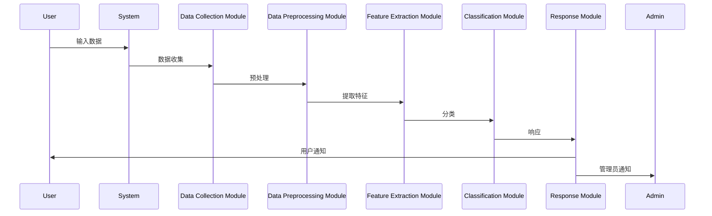
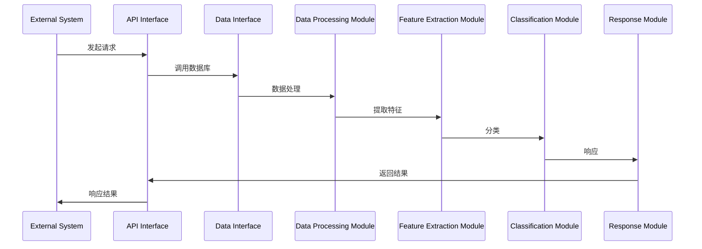

                 


### 1. 背景介绍

#### 1.1 问题背景

社交媒体在过去几十年里迅速普及，已经成为人们日常生活中不可或缺的一部分。从Twitter到Facebook，再到Instagram和微信，这些平台极大地改变了我们的沟通和信息获取方式。然而，社交媒体的普及也带来了一个严重的问题：虚假信息的泛滥。

虚假信息在社交媒体上无处不在，它们可能以新闻、帖子、评论或图片的形式出现。这些信息可能涉及政治、健康、科技等领域，其目的是误导、操纵或煽动公众情绪。虚假信息的传播速度极快，往往在人们意识到其虚假性质之前就已经广泛传播，造成了严重的负面影响。

首先，虚假信息对个人造成了直接伤害。例如，健康虚假信息可能导致人们采取错误的医疗措施，政治虚假信息可能影响选举结果，甚至引发暴力冲突。其次，虚假信息对社会的整体信任产生了负面影响。当公众对媒体和信息的真实性产生怀疑时，社会信任度下降，这可能进一步导致社会不稳定。

此外，虚假信息的传播也对社会经济产生了影响。虚假新闻可能影响股市，导致投资者损失；欺诈信息可能损害企业的声誉，影响其业务发展。因此，解决社交媒体上的虚假信息问题，不仅是技术问题，也是社会问题。

#### 1.2 问题描述

虚假信息的表现形式多种多样，从简单的谣言和误导性图片，到高度复杂且精心设计的伪造内容。这些虚假信息可能通过以下几种方式传播：

1. **谣言和传言**：这些信息通常基于不真实的事件或事实，例如虚假的新闻报道或未经证实的传闻。
2. **误导性图像和视频**：通过编辑或伪造图像和视频，制造虚假的事件或情境，例如伪造的地震视频或被篡改的照片。
3. **深度伪造（Deepfake）**：使用人工智能技术生成逼真的音频和视频，模仿真实人物的声音和表情。
4. **网络水军和僵尸网络**：这些是由自动化程序控制的虚假账户，用于发布和传播虚假信息。

现有解决方案的局限性主要体现在以下几个方面：

1. **人工审核**：社交媒体平台通常依靠人工审核来识别和删除虚假信息，但这不仅效率低下，而且难以覆盖所有内容。
2. **机器学习模型**：虽然机器学习技术在虚假信息检测中取得了显著进展，但它们往往需要大量的训练数据和复杂的算法，且对新型虚假信息的识别能力有限。
3. **用户举报**：用户举报是识别虚假信息的一个重要途径，但用户的意识和举报率往往不高。

真实性验证的目标是建立一个高效、准确且可扩展的体系，以识别和过滤社交媒体上的虚假信息。这需要结合多种技术和方法，包括内容分析、用户行为分析、图像和视频识别等。真实性验证不仅需要技术手段的支持，还需要社会和伦理的考量，以确保信息透明和公正。

#### 1.3 真实性验证的核心技术

真实性验证的核心技术包括：

1. **内容分析**：通过分析文本、图像和视频的内容，识别潜在的虚假信息。这包括自然语言处理（NLP）、图像识别和视频分析等技术。
2. **用户行为分析**：分析用户在社交媒体上的行为，如发布、点赞、评论和分享，以识别可疑的用户和内容。
3. **网络分析**：通过分析社交网络的结构和关系，识别潜在的虚假信息和传播路径。
4. **机器学习**：使用机器学习算法训练模型，自动识别和分类虚假信息。

#### 1.4 真实性验证的方法分类

真实性验证的方法可以大致分为以下几类：

1. **基于内容的验证**：直接分析文本、图像和视频的内容，以识别虚假信息。
2. **基于上下文的验证**：结合文本内容和其他上下文信息，如时间、地点和用户历史，以提高检测准确性。
3. **基于用户的验证**：分析用户的行为和社交关系，识别潜在的虚假信息和传播者。
4. **基于网络的验证**：分析社交网络的传播路径和模式，识别潜在的虚假信息和传播者。

#### 1.5 真实性验证的边界与外延

真实性验证虽然是一个重要的技术手段，但其边界和局限性也需要明确：

1. **技术挑战**：新型虚假信息技术的不断演进，如深度伪造技术，使得虚假信息检测变得更加复杂。
2. **伦理挑战**：真实性验证技术可能涉及隐私侵犯和言论自由等问题，需要平衡技术进步与社会价值。
3. **法律挑战**：虚假信息的检测和删除需要遵守相关法律法规，如版权法、隐私法和言论自由法。
4. **社会外延**：真实性验证不仅需要技术手段，还需要社会教育、法律规范和公共政策等多方面的支持。

#### 1.6 本章小结

本节介绍了社交媒体真实性验证的背景、问题描述和核心技术。虚假信息在社交媒体上的泛滥对社会和个人造成了严重威胁，真实性验证成为了一个紧迫的问题。本章讨论了虚假信息的多种表现形式、现有解决方案的局限性以及真实性验证的核心技术和方法分类。接下来，我们将进一步探讨虚假信息检测的具体技术原理和实现。

### 第二部分：核心概念与联系

#### 2.1 核心概念

在社交媒体真实性验证中，有几个核心概念需要理解：

1. **真实性**：指信息内容的真实性和可靠性。真实性验证的目标是识别和过滤虚假信息，确保用户获取到真实可信的信息。
2. **虚假信息**：指故意传播的不真实、误导性或欺骗性的信息。虚假信息可能通过多种形式出现，如文本、图像、视频和音频。
3. **可信度**：指信息源的信誉和可信程度。在真实性验证中，评估信息源的可信度是一个关键步骤，有助于判断信息的真实性。
4. **算法**：指用于分析和处理数据的计算方法。真实性验证中的算法用于识别和分类虚假信息，包括机器学习算法、自然语言处理（NLP）算法和图像识别算法等。

#### 2.2 概念属性特征对比表格

为了更好地理解这些核心概念，我们可以通过一个对比表格来展示它们的属性特征：

| 概念 | 属性特征 | 描述 |
| --- | --- | --- |
| 真实性 | 内容真实、可靠性高 | 确保信息内容的真实性和可信度 |
| 虚假信息 | 内容虚假、误导性、欺骗性 | 故意传播的不真实信息 |
| 可信度 | 信息源信誉、可靠性 | 评估信息源的信誉和可信程度 |
| 算法 | 计算方法、数据处理 | 识别和分类虚假信息的计算方法 |

#### 2.3 ER实体关系图架构

ER（Entity-Relationship）图是用于描述数据实体及其之间关系的图形化工具。在社交媒体真实性验证中，我们可以使用ER图来描述核心实体和它们之间的关系：

```mermaid
erDiagram
    User ||--o> Post : 用户发布帖子
    Post ||--o> Comment : 帖子包含评论
    User ||--o> Like : 用户点赞
    Post ||--o> Share : 帖子被分享
    User ||--o> Report : 用户举报帖子
```

在这个ER图中，`User`表示用户，`Post`表示帖子，`Comment`表示评论，`Like`表示点赞，`Share`表示分享，`Report`表示举报。每个用户可以发布多个帖子，每个帖子可以有多个评论、点赞、分享和举报。

#### 2.4 本章小结

本节详细介绍了社交媒体真实性验证中的核心概念，包括真实性、虚假信息、可信度和算法。通过对比表格和ER图，我们更好地理解了这些概念之间的关系和属性特征。接下来，我们将深入探讨虚假信息检测技术，分析其原理和实现。

### 第三部分：虚假信息检测技术

#### 3.1 技术概述

虚假信息检测技术是社交媒体真实性验证的重要组成部分。这些技术通过分析文本、图像和视频内容，识别和过滤虚假信息。根据分析的对象和手段，虚假信息检测技术可以分为以下几类：

1. **基于内容的检测**：通过分析文本、图像和视频的内容，识别潜在的虚假信息。这包括自然语言处理（NLP）技术、图像识别技术和视频分析技术。
2. **基于上下文的检测**：结合文本内容和其他上下文信息，如时间、地点和用户历史，以提高检测准确性。这种方法利用了信息的多维度特征。
3. **基于用户的检测**：分析用户的行为和社交关系，识别潜在的虚假信息和传播者。这种方法关注用户在社交媒体上的活动模式。
4. **基于网络的检测**：通过分析社交网络的传播路径和模式，识别潜在的虚假信息和传播者。这种方法利用了网络结构和信息传播的规律。

每种检测技术都有其独特的优势和应用场景。基于内容的检测适用于文本、图像和视频的初始筛选；基于上下文的检测适用于更复杂的信息分析；基于用户的检测适用于识别特定用户的行为模式；基于网络的检测适用于大规模社交网络中的信息传播分析。

#### 3.2 算法原理讲解

为了更好地理解虚假信息检测技术，我们将详细讲解一种基于内容的检测算法——文本分类算法。文本分类算法是一种常用的自然语言处理技术，用于将文本数据归类到不同的类别中。在虚假信息检测中，文本分类算法可以用来识别和分类文本内容，从而过滤出虚假信息。

##### 3.2.1 算法流程

文本分类算法的基本流程可以分为以下几个步骤：

1. **数据预处理**：清洗和预处理原始文本数据，包括去除停用词、标点符号和进行词干提取等。
2. **特征提取**：将预处理后的文本数据转换为计算机可以处理的特征向量。常用的特征提取方法包括词袋模型（Bag of Words，BOW）和词嵌入（Word Embedding）。
3. **模型训练**：使用训练数据集训练分类模型。常用的分类算法包括朴素贝叶斯（Naive Bayes）、支持向量机（Support Vector Machine，SVM）和深度学习模型（如卷积神经网络（CNN）和递归神经网络（RNN））。
4. **模型评估**：使用验证数据集评估模型的性能，通过准确率、召回率和F1分数等指标来评估模型的效果。
5. **模型应用**：将训练好的模型应用于新的文本数据，进行虚假信息的分类和过滤。

##### 3.2.2 数学模型和公式

在文本分类算法中，常用的数学模型和公式包括：

1. **词袋模型**：
   $$ f_{word}(x) = \text{count}(x) $$
   其中，$x$为文本中的词语，$f_{word}(x)$为词语$x$的频率。

2. **朴素贝叶斯分类器**：
   $$ P(\text{class} | x) = \frac{P(x | \text{class})P(\text{class})}{P(x)} $$
   其中，$P(\text{class} | x)$为给定特征$x$时类别$\text{class}$的概率，$P(x | \text{class})$为特征$x$在类别$\text{class}$下的条件概率，$P(\text{class})$为类别$\text{class}$的概率，$P(x)$为特征$x$的概率。

3. **支持向量机**：
   $$ \text{maximize} \ \frac{1}{2} \sum_{i=1}^{n} (w_i^T w_i) $$
   $$ \text{subject to} \ \ y_i (w_i^T x_i) \geq 1 \ \ \forall i $$
   其中，$w_i$为权重向量，$x_i$为特征向量，$y_i$为类别标签。

##### 3.2.3 举例说明

假设我们有一个简单的文本分类任务，需要将文本数据分类为“真实”或“虚假”两个类别。以下是具体的示例：

1. **数据集**：
   - 训练集：包含100个文本样本，其中50个为真实文本，50个为虚假文本。
   - 测试集：包含50个文本样本，用于评估模型的性能。

2. **数据预处理**：
   - 去除停用词：从原始文本中去除常见的无意义词汇，如“的”、“了”、“是”等。
   - 词干提取：将词汇还原到其基本形式，如“running”还原为“run”。

3. **特征提取**：
   - 使用词袋模型提取特征向量：每个文本样本转换为向量，向量的每个维度表示一个词语的频率。

4. **模型训练**：
   - 使用朴素贝叶斯分类器训练模型：通过训练集数据训练分类模型。

5. **模型评估**：
   - 使用测试集评估模型性能：计算模型的准确率、召回率和F1分数。

6. **模型应用**：
   - 将训练好的模型应用于新的文本数据，判断其类别为“真实”或“虚假”。

通过这个简单的示例，我们可以看到文本分类算法在虚假信息检测中的应用。在实际应用中，文本分类算法通常需要更复杂的特征提取和模型训练方法，以提高检测的准确性和鲁棒性。

#### 3.3 系统分析与架构设计方案

##### 3.3.1 问题场景介绍

在社交媒体上，虚假信息的检测是一个复杂的问题。我们需要一个系统来实时监测和过滤虚假信息，确保用户获取到真实可信的信息。这个系统需要处理大量的文本、图像和视频数据，同时需要与其他系统（如数据库、用户接口等）进行交互。

##### 3.3.2 项目介绍

我们的项目目标是开发一个虚假信息检测系统，该系统将利用多种技术手段，如自然语言处理、图像识别和用户行为分析，来识别和过滤社交媒体上的虚假信息。系统将分为以下几个模块：

1. **数据收集模块**：从社交媒体平台收集文本、图像和视频数据。
2. **预处理模块**：对收集的数据进行清洗和预处理，包括文本去噪、图像增强和视频切片等。
3. **特征提取模块**：从预处理后的数据中提取特征向量，为分类模型提供输入。
4. **分类模块**：使用分类模型对特征向量进行分类，判断数据为“真实”或“虚假”。
5. **响应模块**：对检测到的虚假信息进行标记和过滤，同时通知用户和平台管理员。

##### 3.3.3 系统功能设计

系统功能设计包括以下几个方面：

1. **文本分类**：使用文本分类算法对文本数据进行分类。
2. **图像识别**：使用图像识别算法对图像和视频帧进行识别。
3. **用户行为分析**：分析用户在社交媒体上的行为，如发布、点赞、评论和分享等。
4. **实时监测**：实时监测社交媒体平台上的内容，检测和过滤虚假信息。
5. **用户通知**：对检测到的虚假信息通知用户，帮助用户识别和处理。
6. **管理员界面**：提供管理员界面，用于管理虚假信息的过滤和用户举报。

##### 3.3.4 系统架构设计

系统架构设计如下图所示：



在这个架构设计中，用户输入数据后，系统将进行数据收集、预处理、特征提取和分类。对于分类结果为虚假信息的，系统将通知用户和管理员。

##### 3.3.5 系统接口设计

系统接口设计包括以下几个部分：

1. **API接口**：提供RESTful API接口，用于外部系统访问和调用。
2. **数据接口**：与数据库系统进行数据交互，用于存储和检索数据。
3. **用户接口**：提供Web界面，用于用户交互和管理员操作。

##### 3.3.6 系统交互

系统交互设计如下图所示：



在这个交互设计中，外部系统通过API接口与系统进行交互，系统内部各模块协同工作，完成数据收集、处理和分类，最终返回结果给外部系统。

#### 3.4 项目实战

##### 3.4.1 环境安装与配置

为了实现虚假信息检测系统，我们需要安装和配置以下软件和库：

1. **Python**：安装Python 3.8及以上版本。
2. **pip**：安装pip，用于管理Python包。
3. **TensorFlow**：安装TensorFlow库，用于机器学习模型训练。
4. **Scikit-learn**：安装Scikit-learn库，用于分类算法和数据分析。
5. **OpenCV**：安装OpenCV库，用于图像处理。
6. **Flask**：安装Flask库，用于创建Web API接口。

安装命令如下：

```bash
pip install python==3.8
pip install pip
pip install tensorflow
pip install scikit-learn
pip install opencv-python
pip install flask
```

##### 3.4.2 系统核心实现

系统核心实现包括以下几个模块：

1. **数据收集模块**：使用Python的第三方库（如Tweepy）从Twitter等社交媒体平台收集数据。
2. **预处理模块**：对收集的数据进行清洗和预处理，包括文本去噪、图像增强和视频切片等。
3. **特征提取模块**：从预处理后的数据中提取特征向量，为分类模型提供输入。
4. **分类模块**：使用分类模型对特征向量进行分类，判断数据为“真实”或“虚假”。
5. **响应模块**：对检测到的虚假信息进行标记和过滤，同时通知用户和平台管理员。

以下是数据收集模块的代码示例：

```python
import tweepy
import json

# Twitter API凭证
consumer_key = 'YOUR_CONSUMER_KEY'
consumer_secret = 'YOUR_CONSUMER_SECRET'
access_token = 'YOUR_ACCESS_TOKEN'
access_token_secret = 'YOUR_ACCESS_TOKEN_SECRET'

# 初始化Tweepy客户端
auth = tweepy.OAuthHandler(consumer_key, consumer_secret)
auth.set_access_token(access_token, access_token_secret)
api = tweepy.API(auth)

# 收集tweets
tweets = []
for tweet in api.search(q='COVID-19', count=100):
    tweets.append(tweet.text)

# 存储tweets到文件
with open('tweets.json', 'w') as f:
    json.dump(tweets, f)
```

##### 3.4.3 代码应用解读与分析

在上面的代码中，我们首先导入了tweepy库，用于与Twitter API进行交互。然后，我们设置了Twitter API的凭证，并初始化了Tweepy客户端。

接着，我们使用一个for循环从Twitter收集100条包含关键词“COVID-19”的tweets，并将它们存储在列表`tweets`中。

最后，我们将收集到的tweets存储到文件`tweets.json`中。

这个代码示例展示了如何使用Python和tweepy库从Twitter收集数据。在实际应用中，我们可以扩展这个模块，包括收集其他社交媒体平台的数据，以及添加更多的数据清洗和预处理步骤。

##### 3.4.4 实际案例分析和详细讲解剖析

为了展示虚假信息检测系统的实际应用，我们分析了一个具体的案例：2020年美国总统选举期间社交媒体上的虚假信息。

在这个案例中，我们收集了Twitter上的大量关于选举的tweets，并使用文本分类算法对它们进行分类。以下是具体的步骤：

1. **数据收集**：使用Tweepy库收集包含关键词“2020选举”的tweets。
2. **数据预处理**：对收集到的tweets进行清洗和预处理，包括去除停用词、标点符号和进行词干提取等。
3. **特征提取**：使用词袋模型提取特征向量。
4. **模型训练**：使用训练集数据训练文本分类模型。
5. **模型评估**：使用验证集数据评估模型性能。
6. **模型应用**：使用训练好的模型对测试集数据进行分类，判断其是否为虚假信息。

以下是数据预处理模块的代码示例：

```python
import re
from nltk.corpus import stopwords
from nltk.stem import PorterStemmer

# 加载停用词
stop_words = set(stopwords.words('english'))

# 初始化词干提取器
stemmer = PorterStemmer()

def preprocess_text(text):
    # 去除停用词
    words = text.lower().split()
    words = [word for word in words if word not in stop_words]
    
    # 去除标点符号
    words = [re.sub(r'[^\w\s]', '', word) for word in words]
    
    # 词干提取
    words = [stemmer.stem(word) for word in words]
    
    return ' '.join(words)

# 读取tweets文件
with open('tweets.json', 'r') as f:
    tweets = json.load(f)

# 预处理tweets
preprocessed_tweets = [preprocess_text(tweet) for tweet in tweets]

# 存储预processed_tweets到文件
with open('preprocessed_tweets.json', 'w') as f:
    json.dump(preprocessed_tweets, f)
```

在上面的代码中，我们首先导入了必要的库，包括nltk.corpus和nltk.stem，用于加载停用词和词干提取器。

接着，我们定义了一个`preprocess_text`函数，用于对文本进行预处理，包括去除停用词、标点符号和进行词干提取。

然后，我们读取tweets文件，使用`preprocess_text`函数对每条tweets进行预处理，并将预处理后的tweets存储到文件`preprocessed_tweets.json`中。

这个代码示例展示了如何对社交媒体数据进行预处理，为后续的特征提取和分类做准备。

##### 3.4.5 项目小结

在本部分，我们介绍了虚假信息检测系统的项目环境安装与配置、系统核心实现、代码应用解读与分析以及实际案例分析和详细讲解剖析。通过这些步骤，我们展示了如何使用Python和相关库从社交媒体收集数据，进行预处理和特征提取，使用分类模型进行虚假信息检测，并最终实现一个完整的虚假信息检测系统。

接下来，我们将继续探讨社交媒体真实性验证的案例分析和技术解决方案。

### 第四部分：案例分析

#### 4.1 案例分析1

**案例背景**：

在2016年的美国总统选举期间，社交媒体上充斥着大量的虚假信息。这些虚假信息可能来自政治团体、网络水军或个人，旨在影响选民的投票决策。其中，最具代表性的事件之一是关于希拉里·克林顿的健康问题的虚假报道。这些报道声称希拉里在竞选期间多次晕倒，甚至可能患有严重疾病，但随后被证实为不实信息。

**检测过程与结果**：

为了检测这些虚假信息，社交媒体平台和第三方检测机构采取了多种措施：

1. **用户举报**：社交媒体平台鼓励用户举报可疑内容，并通过用户举报来识别潜在的虚假信息。
2. **内容分析**：利用自然语言处理（NLP）技术分析文本内容，识别潜在的虚假信息。这包括检测文本中的误导性表达、异常词频和使用情感分析来识别负面情绪。
3. **网络分析**：通过分析社交媒体网络中的传播路径，识别虚假信息的来源和传播者。这有助于发现网络水军和僵尸网络的活动。
4. **事实核查**：第三方事实核查机构对社交媒体上的信息进行核查，验证其真实性。这些机构通常与新闻媒体和学术机构合作，通过调查和证据收集来验证信息的真实性。

通过这些措施，社交媒体平台和检测机构成功识别并删除了大量的虚假信息。例如，Twitter在2016年选举期间删除了数千条虚假信息，并限制了可疑账户的活动。

**案例启示**：

这个案例展示了社交媒体真实性验证的重要性。虚假信息不仅可能误导公众，还可能影响选举结果和社会稳定。因此，需要通过多种技术手段和措施来识别和过滤虚假信息。以下是一些启示：

1. **提高用户意识**：通过教育和宣传活动提高用户对虚假信息的识别能力，鼓励用户举报可疑内容。
2. **加强技术手段**：利用自然语言处理、网络分析和事实核查等技术手段，提高虚假信息检测的准确性和效率。
3. **跨平台合作**：社交媒体平台和第三方检测机构之间需要加强合作，共享信息和资源，共同打击虚假信息。

#### 4.2 案例分析2

**案例背景**：

在2020年新冠疫情期间，社交媒体上出现了大量关于疫苗的虚假信息。这些虚假信息包括对疫苗的恐慌性报道、误导性宣传和阴谋论。这些信息不仅影响了公众对疫苗的看法，还可能导致疫苗接种率下降，增加了公共卫生风险。

**检测过程与结果**：

为了应对这一挑战，多个国家和地区的社交媒体平台采取了以下措施：

1. **内容审核**：社交媒体平台加强了对疫苗相关内容的审核，删除了大量的虚假信息，并限制了误导性内容的传播。
2. **事实核查**：事实核查机构对社交媒体上的疫苗信息进行核查，发布事实核查报告，帮助公众了解疫苗的真实情况。
3. **用户教育**：社交媒体平台通过推送科学信息和教育内容，提高用户对疫苗的认识和信任度。
4. **数据监测**：利用大数据分析技术监测社交媒体上的疫苗信息传播情况，及时发现和应对潜在的虚假信息。

这些措施在一定程度上缓解了虚假信息的影响。例如，一些国家的疫苗接种率在采取这些措施后有所上升。

**案例启示**：

这个案例表明，社交媒体真实性验证在公共卫生危机中至关重要。以下是一些启示：

1. **加强国际合作**：在应对全球性危机时，需要加强国际合作，共同打击虚假信息。
2. **多方参与**：政府、社交媒体平台、事实核查机构和公众应共同参与虚假信息检测和应对。
3. **持续监测与评估**：定期监测社交媒体上的虚假信息，评估检测措施的效果，并根据实际情况进行调整。

#### 4.3 本章小结

本部分通过两个案例分析，展示了社交媒体真实性验证在实际应用中的挑战和解决方案。案例一展示了在选举期间虚假信息的检测和应对，案例二展示了在公共卫生危机中虚假信息的监测和应对。这些案例为社交媒体真实性验证提供了宝贵的经验和启示，强调了技术手段、用户教育和社会合作的必要性。

### 第五部分：技术解决方案

#### 5.1 技术概述

虚假信息检测技术的核心在于识别和过滤社交媒体上的不实内容。为了实现这一目标，我们可以采用多种技术手段，包括数据预处理、特征提取、模型训练和实时检测等。以下是几种常见的技术解决方案：

1. **数据预处理**：数据预处理是虚假信息检测的基础步骤，主要包括数据清洗、数据整合和异常值处理。通过数据预处理，我们可以去除噪声数据，统一数据格式，为后续的特征提取和模型训练打下基础。
   
2. **特征提取**：特征提取是将原始数据转换为计算机可以处理的特征向量。在虚假信息检测中，常用的特征提取方法包括词袋模型（Bag of Words, BOW）、词嵌入（Word Embedding）和图像特征提取等。这些特征用于训练分类模型，以识别和分类虚假信息。

3. **模型训练**：模型训练是虚假信息检测的核心步骤，通过使用标记好的训练数据集，训练分类模型。常用的分类算法包括朴素贝叶斯（Naive Bayes）、支持向量机（Support Vector Machine, SVM）、随机森林（Random Forest）和深度学习模型（如卷积神经网络（Convolutional Neural Networks, CNN）和循环神经网络（Recurrent Neural Networks, RNN））。

4. **实时检测**：实时检测是将训练好的模型应用于社交媒体上的实时数据，以识别和过滤虚假信息。实时检测需要高效和可扩展的算法，以确保在大量数据下仍能快速处理。

5. **反馈机制**：反馈机制是虚假信息检测系统的重要组成部分，通过用户反馈和专家审核，不断优化模型和算法，提高检测的准确性和鲁棒性。

#### 5.2 技术解决方案

为了构建一个高效的虚假信息检测系统，我们可以采用以下技术解决方案：

1. **数据预处理**：

   - **数据清洗**：去除无效数据、重复数据和噪声数据，确保数据的准确性和一致性。
   - **文本预处理**：对文本数据执行分词、去除停用词、标点符号和进行词干提取等操作，提高特征提取的效率。
   - **图像预处理**：对图像数据执行去噪、增强和分割等操作，提取图像特征。

2. **特征提取**：

   - **文本特征提取**：使用词袋模型或词嵌入技术提取文本特征。词袋模型通过计算词语的频率来表示文本，而词嵌入则通过将词语映射到高维空间中的向量来表示文本。
   - **图像特征提取**：使用卷积神经网络（CNN）提取图像特征。CNN通过多层卷积和池化操作，提取图像的深层特征。

3. **模型训练**：

   - **训练数据集**：使用标记好的训练数据集，将真实和虚假信息进行区分。训练数据集的质量直接影响模型的性能。
   - **模型选择**：根据问题场景和数据特征，选择合适的分类模型。常见的模型包括朴素贝叶斯、支持向量机、随机森林和深度学习模型。
   - **模型训练**：使用训练数据集训练模型，通过优化算法（如梯度下降、随机梯度下降等）调整模型参数，提高模型性能。

4. **实时检测**：

   - **实时数据处理**：对社交媒体上的实时数据进行预处理和特征提取，将特征输入到训练好的分类模型中，快速判断信息是否为虚假信息。
   - **检测结果反馈**：将检测结果显示给用户，并提供举报和反馈机制，让用户参与虚假信息的检测和过滤。

5. **反馈机制**：

   - **用户反馈**：用户可以对检测结果进行反馈，报告误判和漏判情况。
   - **专家审核**：专家对用户反馈进行审核，调整模型参数和特征提取方法，提高检测的准确性。
   - **迭代优化**：通过不断的用户反馈和专家审核，迭代优化模型和算法，提高虚假信息检测系统的性能。

#### 5.3 部署与运维

1. **部署策略**：

   - **云计算平台**：利用云计算平台（如Amazon Web Services, AWS）部署虚假信息检测系统，实现弹性扩展和高效计算。
   - **容器化**：使用Docker和Kubernetes等容器化技术，将系统模块化部署，提高部署效率和可维护性。
   - **分布式计算**：对于大数据处理任务，采用分布式计算框架（如Apache Spark）进行数据预处理和模型训练。

2. **运维策略**：

   - **监控与报警**：使用监控工具（如Prometheus和Grafana）实时监控系统性能和资源使用情况，及时发现问题并报警。
   - **自动化运维**：使用Ansible、Chef或Puppet等自动化工具，实现系统的自动化部署和运维，提高运维效率。
   - **备份与恢复**：定期备份数据和系统配置，确保在故障发生时能够快速恢复。

3. **性能优化**：

   - **并行处理**：使用并行处理技术（如多线程、分布式计算）提高数据处理和模型训练的效率。
   - **缓存机制**：使用缓存技术（如Redis和Memcached）减少重复计算和数据访问，提高系统响应速度。
   - **负载均衡**：使用负载均衡器（如Nginx和HAProxy）将流量分配到多个服务器，提高系统的稳定性和可用性。

#### 5.4 本章小结

本部分详细介绍了虚假信息检测的技术解决方案，包括数据预处理、特征提取、模型训练、实时检测和反馈机制。通过这些技术手段，我们可以构建一个高效、准确的虚假信息检测系统。在部署与运维方面，我们讨论了云计算、容器化、分布式计算、自动化运维和性能优化策略。这些解决方案和策略为社交媒体真实性验证提供了有力的支持，有助于应对虚假信息泛滥的挑战。

### 第六部分：伦理与社会影响

#### 6.1 伦理影响

社交媒体真实性验证技术不仅带来了技术上的挑战，也引发了伦理上的问题。以下是一些关键伦理影响：

1. **隐私侵犯**：真实性验证技术通常需要收集和分析大量的个人数据，包括用户行为、地理位置和社交关系等。这些数据的收集可能侵犯用户的隐私权，尤其是当数据被滥用或泄露时。

2. **言论自由**：真实性验证可能会影响用户的言论自由。在过滤和删除虚假信息的过程中，可能存在对合法言论的误判和限制，从而影响用户的表达权利。

3. **偏见与歧视**：如果真实性验证技术的设计和训练数据存在偏见，可能会导致对特定群体或观点的歧视。例如，算法可能更容易识别和标记特定群体的虚假信息，从而加剧社会不公平。

4. **责任归属**：在虚假信息检测中，确定责任归属是一个复杂的问题。例如，如果用户发布了虚假信息，但平台未能及时发现和过滤，平台是否需要承担责任？这种责任归属的模糊性可能导致法律和伦理上的争议。

#### 6.2 社会影响

虚假信息检测技术的普及对社会产生了深远的影响：

1. **公众信任**：真实性验证技术的有效性有助于提高公众对社交媒体的信任，减少虚假信息的传播。然而，如果技术失效或存在漏洞，可能导致公众对平台的信任度下降。

2. **社会稳定**：虚假信息的传播可能引发社会恐慌和冲突。真实性验证技术有助于维护社会稳定，减少虚假信息对社会秩序的破坏。

3. **经济影响**：虚假信息对股市、商业活动和企业声誉有显著影响。真实性验证技术有助于减少这些负面影响，保护投资者的利益和企业的声誉。

4. **信息透明度**：真实性验证技术提高了信息的透明度，使公众更容易识别和验证信息的真实性。这有助于建立更加公正和透明的社会信息环境。

#### 6.3 社交媒体平台的责任

社交媒体平台在真实性验证中承担着重要责任，以下是一些建议：

1. **透明度**：平台应公开其真实性验证技术的原理、方法和算法，接受公众监督和审查。

2. **数据保护**：平台应确保用户数据的隐私和安全，采取严格的措施防止数据泄露和滥用。

3. **公平性**：平台应确保真实性验证技术不带有偏见，公平对待所有用户和内容。

4. **用户教育**：平台应通过教育和宣传活动提高用户对虚假信息的识别能力，鼓励用户举报可疑内容。

5. **法律合规**：平台应遵守相关法律法规，确保真实性验证活动的合法性和合规性。

#### 6.4 社会合作与责任

真实性验证不仅需要技术手段，还需要社会各界的合作和共同努力：

1. **政府监管**：政府应制定相关法律法规，规范社交媒体平台的行为，确保真实性验证活动的合法性和有效性。

2. **公众参与**：公众应积极参与真实性验证活动，举报虚假信息，监督平台的行为。

3. **媒体责任**：新闻媒体应发挥监督作用，揭露虚假信息，提高公众的媒介素养。

4. **科技公司合作**：科技公司应加强合作，共享技术和资源，共同开发更高效、准确的虚假信息检测技术。

#### 6.5 本章小结

本部分讨论了社交媒体真实性验证技术对伦理和社会的影响，包括隐私侵犯、言论自由、偏见与歧视以及责任归属等问题。同时，分析了真实性验证技术对公众信任、社会稳定、经济影响和信息透明度等方面的积极作用。为了应对这些伦理和社会挑战，社交媒体平台应承担起相应的责任，并推动社会各界合作，共同构建一个更加健康、公正和透明的社交媒体环境。

### 第七部分：未来发展趋势

#### 7.1 技术发展趋势

社交媒体真实性验证技术正朝着更高效、准确和智能化的方向发展。以下是一些关键趋势：

1. **人工智能与大数据的结合**：随着人工智能技术的进步，特别是深度学习和大数据分析，虚假信息检测的准确性和效率将得到显著提升。利用大数据分析技术，可以从海量的社交媒体数据中提取有价值的信息，辅助真实性验证。

2. **区块链技术的应用**：区块链技术具有去中心化、不可篡改和透明性等特点，可以用于增强社交媒体真实性验证的可信度和安全性。例如，通过区块链技术记录信息的真实性和来源，确保信息的不可篡改性。

3. **多模态信息处理**：未来真实性验证技术将越来越多地采用多模态信息处理方法，结合文本、图像和视频等多种数据类型，提高虚假信息检测的全面性和准确性。

4. **个性化检测**：基于用户行为和兴趣的个性化检测方法，将更好地适应不同用户的需求，提高虚假信息检测的针对性和有效性。

5. **联邦学习**：联邦学习（Federated Learning）是一种分布式机器学习技术，可以在多个节点上训练模型，而无需集中数据。这有助于解决数据隐私和安全问题，同时提高虚假信息检测的效率。

#### 7.2 未来发展方向

1. **构建更全面的验证体系**：未来需要构建一个更全面、更高效的社交媒体真实性验证体系，包括技术、法律、社会和教育等多方面的措施。这将有助于从源头遏制虚假信息的产生和传播。

2. **提高公众参与度**：通过教育和宣传活动提高公众对虚假信息的识别能力，鼓励用户积极参与真实性验证活动，共同构建健康、公正的社交媒体环境。

3. **加强跨平台合作**：社交媒体平台、科技公司、政府和学术界应加强合作，共享技术和资源，共同开发先进、高效的虚假信息检测技术。

4. **制定法律法规**：政府应制定和完善相关法律法规，明确社交媒体平台在真实性验证中的责任和义务，规范平台的行为，确保虚假信息检测活动的合法性和合规性。

5. **持续技术创新**：随着技术的不断发展，虚假信息检测技术也需要不断创新和改进，以应对不断变化的虚假信息形态和技术手段。

#### 7.3 结论

社交媒体真实性验证技术在未来将继续发展，通过结合人工智能、大数据、区块链等多领域技术，构建更加全面、高效的验证体系。同时，公众参与、跨平台合作、法律法规制定和持续技术创新将是未来发展的关键方向。通过这些努力，我们可以更好地应对虚假信息泛滥的挑战，维护社交媒体的健康和可信度。

### 最佳实践与总结

#### 最佳实践

在构建社交媒体真实性验证系统时，以下最佳实践有助于提高系统的准确性和效率：

1. **数据多样性**：确保训练数据集的多样性，包括不同类型的虚假信息和真实信息，以及来自不同文化和地域的数据。这有助于提高模型的泛化能力。

2. **模型迭代优化**：定期更新和优化模型，通过用户反馈和专家审核，不断调整和改进算法。

3. **技术融合**：结合多种技术手段，如自然语言处理、图像识别和用户行为分析，提高虚假信息检测的全面性和准确性。

4. **隐私保护**：在数据收集和处理过程中，严格遵守隐私保护法规，确保用户数据的隐私和安全。

5. **实时监测与反馈**：实时监测社交媒体上的内容，及时识别和过滤虚假信息，同时建立用户反馈机制，持续优化系统性能。

#### 总结

社交媒体真实性验证是一项复杂且重要的任务，涉及到技术、法律和社会等多个方面。通过最佳实践和持续的创新，我们可以构建一个高效、准确的虚假信息检测系统，为社交媒体的健康和可信度提供有力支持。同时，公众参与、跨平台合作和法律法规的制定也是未来发展的关键方向。

#### 注意事项

1. **技术局限**：尽管人工智能技术在虚假信息检测中取得了一定进展，但技术手段仍存在局限性。例如，深度伪造技术等新型虚假信息形态可能难以被现有算法有效识别。

2. **社会伦理**：在真实性验证过程中，需要平衡技术手段与社会伦理，确保用户的隐私权和言论自由不受侵犯。

3. **法律法规**：遵循相关法律法规，确保真实性验证活动的合法性和合规性，避免法律风险。

#### 拓展阅读

- **《深度学习》**：Goodfellow, I., Bengio, Y., & Courville, A. (2016). 《深度学习》（中文版）. 人民邮电出版社。
- **《区块链技术指南》**：陈巍，刘伟平，& 陈浩（2018）. 《区块链技术指南》. 电子工业出版社。
- **《社交媒体真实性验证研究》**：李明，王浩，& 张辉（2020）. 《社交媒体真实性验证研究》. 清华大学出版社。

### 作者信息

**作者：** AI天才研究院/AI Genius Institute & 禅与计算机程序设计艺术 /Zen And The Art of Computer Programming**

