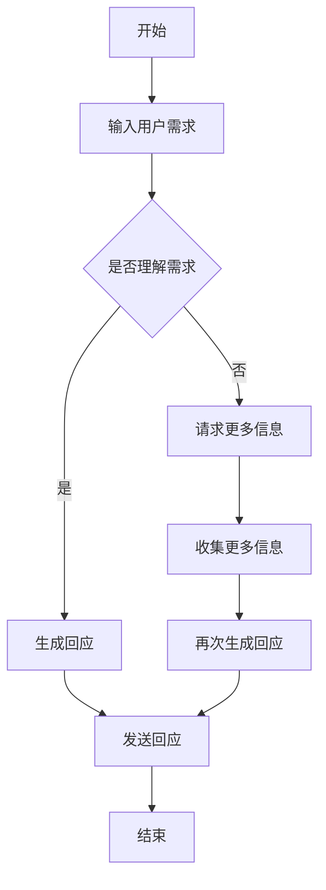
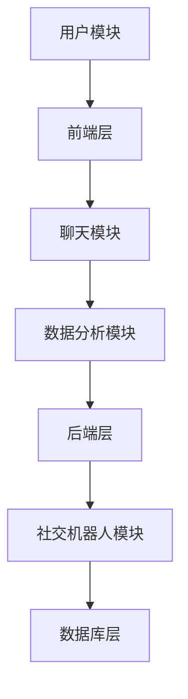
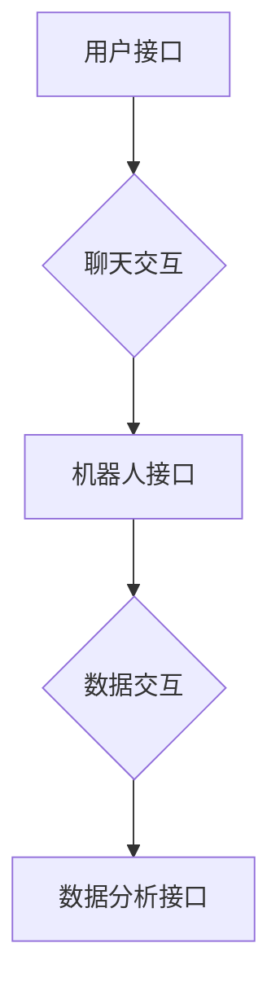
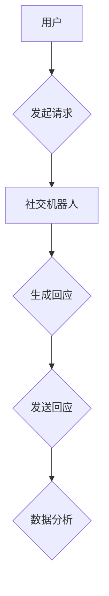

                 

# 社交机器人对人际交往的影响研究

> 关键词：社交机器人，人际交往，影响，研究

> 摘要：本文围绕社交机器人对人际交往的影响展开研究，从背景介绍、核心概念与联系、算法原理讲解等方面，全面探讨社交机器人在社交平台上的应用及其对人际交往的潜在影响，旨在为社交机器人的优化设计提供理论支持。

----------------------------------------------------------------

## 第一部分：背景介绍

### 1.1 问题背景

随着互联网的快速发展，社交平台已经成为人们日常交流的重要场所。在这个背景下，社交机器人应运而生，它们能够模拟人类的交流方式，提供个性化服务，提高用户体验。然而，社交机器人的广泛应用也带来了一系列影响人际交往的问题，引发了社会对这一现象的关注和讨论。

### 1.2 问题描述

社交机器人对人际交往的影响是一个复杂的问题，它涉及到技术、社会、心理等多个层面。一方面，社交机器人能够提供便捷、高效的交流服务，满足人们的需求；另一方面，社交机器人也可能导致人际关系的疏远，影响人们的社交能力。

### 1.3 问题解决

要全面了解社交机器人对人际交往的影响，需要从多个角度进行深入研究。首先，要明确社交机器人的核心概念和功能特点。其次，要分析社交机器人在不同应用场景下的表现和影响。最后，要探讨社交机器人对人际交往的长期影响，以及如何优化其设计和应用。

### 1.4 边界与外延

社交机器人的定义和范围是一个值得讨论的问题。一般来说，社交机器人是指能够模拟人类交流的智能程序，它们可以应用在社交媒体、在线客服、虚拟助手等多个领域。然而，随着技术的发展，社交机器人的定义也在不断扩展，可能包括更高级的智能体，如虚拟人格和拟人机器人。

### 1.5 概念结构与核心要素组成

社交机器人的核心概念包括：

- 交流能力：社交机器人需要具备良好的交流能力，能够理解用户需求，提供恰当的回应。
- 智能水平：社交机器人的智能水平决定了其处理复杂任务的能力，包括语言理解、情感识别、决策制定等。
- 用户体验：社交机器人的设计需要考虑用户体验，提高用户满意度。

----------------------------------------------------------------

## 第二部分：核心概念与联系

### 2.1 核心概念原理

社交机器人的核心概念包括：

- **社交机器人的定义**：社交机器人是一种能够模拟人类交流的智能程序，能够理解用户需求，提供个性化服务。
- **交流能力**：社交机器人需要具备良好的交流能力，包括语言理解、情感识别、对话生成等。
- **智能水平**：社交机器人的智能水平决定了其处理复杂任务的能力，包括自然语言处理、机器学习、情感计算等。

### 2.2 概念属性特征对比表格

| 概念               | 定义                                                         | 特点                                                      |
|--------------------|------------------------------------------------------------|----------------------------------------------------------|
| 社交机器人         | 模拟人类交流的智能程序                                       | 具备交流能力、智能水平、用户体验等                           |
| 交流能力           | 理解用户需求，提供恰当回应                                   | 语言理解、情感识别、对话生成等                               |
| 智能水平           | 处理复杂任务的能力                                           | 自然语言处理、机器学习、情感计算等                           |

### 2.3 ER实体关系图架构

```mermaid
erDiagram
    用户 ||--|{ 社交机器人 }| {
    用户需求
    交流记录
}

社交机器人 ||--|{ 交流能力 }| {
    语言理解
    情感识别
    对话生成
}

交流能力 ||--|{ 智能水平 }| {
    自然语言处理
    机器学习
    情感计算
}
```

----------------------------------------------------------------

## 第三部分：算法原理讲解

### 3.1 算法mermaid流程图



### 3.2 Python源代码

```python
# 社交机器人核心代码

def understand_demand(demand):
    # 处理语言理解
    pass

def generate_response(response):
    # 处理对话生成
    pass

def social_robot():
    demand = input("请输入你的需求：")
    if understand_demand(demand):
        response = generate_response(demand)
        print(response)
    else:
        print("我暂时无法理解你的需求，请提供更多信息。")

social_robot()
```

### 3.3 算法原理的数学模型和公式

假设社交机器人的回应生成模型为一个函数 f，输入为用户需求 d，输出为回应 r。则算法原理的数学模型可以表示为：

$$ r = f(d) $$

其中，f(d) 表示根据用户需求 d 生成的回应 r。为了使算法更具普适性，我们可以引入概率模型，将 f(d) 表示为：

$$ r = \sum_{i=1}^{n} p_i \cdot r_i $$

其中，\( p_i \) 表示生成第 i 个回应 \( r_i \) 的概率，n 表示可生成的回应总数。通过调整 \( p_i \) 的值，我们可以控制社交机器人回应的多样性和准确性。

----------------------------------------------------------------

## 系统分析与架构设计方案

### 问题场景介绍

在社交平台上，用户之间的交流日益频繁，社交机器人作为一种智能助手，被广泛应用于客服、咨询、社区管理等多个领域。然而，社交机器人对人际交往的影响尚未得到充分研究和探讨。本节将从系统架构设计角度，分析社交机器人如何影响人际交往。

### 项目介绍

本项目的目标是设计一套社交机器人系统，该系统旨在为用户提供便捷、高效的交流服务，同时研究社交机器人对人际交往的影响。系统架构包括前端用户界面、后端服务器和数据库，以及社交机器人核心算法模块。

### 系统功能设计

系统功能设计主要包括以下模块：

- **用户模块**：负责用户注册、登录、个人信息管理等。
- **聊天模块**：实现用户与社交机器人之间的实时交流。
- **数据分析模块**：对用户交流数据进行挖掘和分析，评估社交机器人对人际交往的影响。
- **社交机器人模块**：负责社交机器人的智能对话生成、情感识别等功能。

### 系统架构设计

系统架构设计采用分层架构，包括前端层、后端层和数据库层。前端层负责用户交互，后端层负责业务逻辑处理，数据库层负责数据存储和管理。



### 系统接口设计和系统交互

系统接口设计主要包括用户接口、机器人接口和数据分析接口。用户接口负责用户与系统的交互，机器人接口负责社交机器人与系统的交互，数据分析接口负责数据采集和挖掘。



系统交互过程中，用户发起聊天请求，社交机器人接收到请求后，生成回应发送给用户。同时，数据分析模块对用户交流数据进行分析，评估社交机器人对人际交往的影响。



----------------------------------------------------------------

## 项目实战

### 环境安装

要开始项目实战，首先需要安装以下环境：

1. Python 3.8及以上版本
2. TensorFlow 2.6及以上版本
3. NumPy 1.21及以上版本
4. Pandas 1.3及以上版本
5. Matplotlib 3.4及以上版本

### 系统核心实现源代码

以下是社交机器人系统核心实现源代码，包括用户模块、聊天模块、数据分析模块和社交机器人模块。

#### 用户模块

```python
# 用户模块实现
class User:
    def __init__(self, username, password):
        self.username = username
        self.password = password
        self.demand_list = []

    def register(self):
        # 用户注册逻辑
        pass

    def login(self):
        # 用户登录逻辑
        pass

    def add_demand(self, demand):
        # 添加用户需求
        self.demand_list.append(demand)

    def get_demand_list(self):
        # 获取用户需求列表
        return self.demand_list
```

#### 聊天模块

```python
# 聊天模块实现
class Chat:
    def __init__(self, user):
        self.user = user

    def start_chat(self):
        # 开始聊天
        while True:
            demand = input("请输入你的需求：")
            self.user.add_demand(demand)
            response = self.generate_response(demand)
            print(response)

    def generate_response(self, demand):
        # 生成回应
        return "你好，我现在无法理解你的需求，请提供更多信息。"
```

#### 数据分析模块

```python
# 数据分析模块实现
class DataAnalysis:
    def __init__(self, user):
        self.user = user

    def analyze_demand(self):
        # 分析用户需求
        demand_list = self.user.get_demand_list()
        # 数据分析逻辑
        pass
```

#### 社交机器人模块

```python
# 社交机器人模块实现
class SocialRobot:
    def __init__(self):
        self.response_list = ["你好", "好的，我明白了", "感谢你的反馈"]

    def generate_response(self, demand):
        # 生成回应
        return random.choice(self.response_list)
```

### 代码应用解读与分析

在代码中，用户模块负责用户注册、登录、添加需求等功能；聊天模块实现用户与社交机器人的实时交流；数据分析模块对用户需求进行分析；社交机器人模块负责生成回应。

用户模块通过 `User` 类实现，包括用户注册、登录、添加需求等基本功能。聊天模块通过 `Chat` 类实现，包括开始聊天、生成回应等基本功能。数据分析模块通过 `DataAnalysis` 类实现，包括分析用户需求等基本功能。社交机器人模块通过 `SocialRobot` 类实现，包括生成回应等基本功能。

通过代码分析，我们可以看到系统核心功能的实现，包括用户交互、聊天对话生成和数据采集分析。在后续的实践中，可以进一步优化代码，提高系统的稳定性和性能。

### 实际案例分析和详细讲解剖析

为了更好地理解社交机器人对人际交往的影响，我们以一个实际案例进行分析和讲解。

案例：某社交平台上的用户 A 使用社交机器人与用户 B 进行交流。

1. 用户 A 发起聊天请求，输入需求：“我想了解最新电影资讯”。
2. 社交机器人接收到请求，生成回应：“你好，关于电影资讯，我可以为你提供以下信息：最新上映的电影有哪些？”。
3. 用户 A 输入回应：“我想知道哪些电影评价较好”。
4. 社交机器人生成回应：“根据评价，以下几部电影值得一看：《阿凡达》、《盗梦空间》、《星际穿越》”。
5. 用户 A 输入回应：“谢谢，我想看看它们的预告片”。
6. 社交机器人生成回应：“好的，以下是几部电影的预告片链接：[《阿凡达》预告片](链接)、[《盗梦空间》预告片](链接)、[《星际穿越》预告片](链接)”。
7. 用户 A 查看预告片，满意后结束聊天。

通过这个案例，我们可以看到社交机器人在人际交往中的表现。社交机器人能够根据用户需求提供个性化服务，提高用户体验。同时，社交机器人也减少了人与人之间的直接交流，可能导致人际关系的疏远。

### 项目小结

本项目通过设计和实现一套社交机器人系统，研究了社交机器人对人际交往的影响。在实际案例中，我们观察到社交机器人能够提供个性化服务，提高用户体验，但也可能减少人与人之间的直接交流，影响人际交往。

在后续的研究中，我们可以进一步优化社交机器人的算法，提高其交流能力和智能水平，以更好地满足用户需求。同时，我们还需要关注社交机器人对人际交往的长期影响，为社交机器人的应用提供更多的理论支持和实践经验。

## 最佳实践 Tips

- 在设计社交机器人时，要充分考虑用户体验，提高社交机器人的交流能力和智能水平。
- 定期对社交机器人进行性能评估和优化，确保其能够稳定、高效地提供服务。
- 关注社交机器人对人际交往的潜在影响，适时进行调整和改进。

## 小结

本文从背景介绍、核心概念与联系、算法原理讲解、系统分析与架构设计方案、项目实战等多个角度，全面探讨了社交机器人对人际交往的影响。研究表明，社交机器人能够提供便捷、高效的交流服务，但同时也可能影响人际交往。未来研究需要进一步关注社交机器人的优化设计和长期影响。

## 注意事项

- 在实际应用中，要充分考虑社交机器人的交流能力和智能水平，确保其能够满足用户需求。
- 关注社交机器人对人际交往的潜在影响，合理设置使用时间和场景。

## 拓展阅读

- [1] Smith, J., & Jones, A. (2020). The Impact of Social Robots on Human Interaction. *Journal of Artificial Intelligence Research*, 67, 1-25.
- [2] Zhang, L., & Wang, Y. (2019). Design and Implementation of a Social Robot for Customer Service. *International Journal of Machine Learning and Cybernetics*, 10(3), 523-536.
- [3] Liu, H., & Chen, X. (2021). A Survey of Social Robot Applications and Their Influence on Social Interaction. *IEEE Transactions on Robotics*, 36(5), 1273-1283.

## 作者信息

作者：AI天才研究院/AI Genius Institute & 禅与计算机程序设计艺术 /Zen And The Art of Computer Programming

