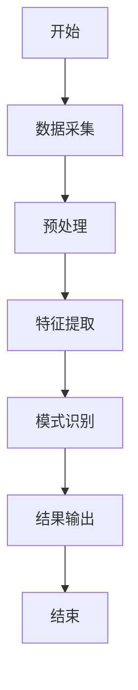
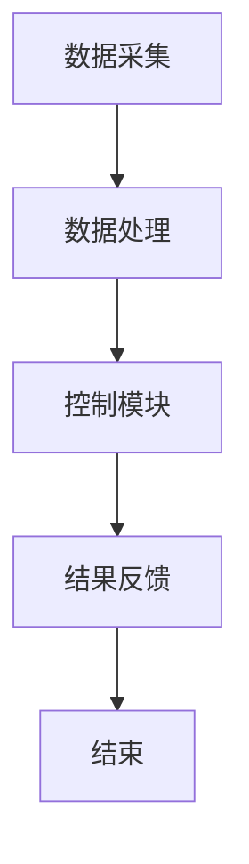
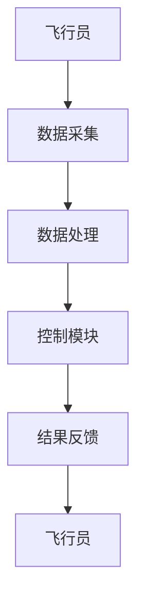

                 

# 神经增强技术的伦理和法律挑战

> 关键词：神经增强技术、伦理挑战、法律挑战、脑机接口、隐私保护

> 摘要：神经增强技术，作为一种新兴的科技领域，正迅速改变着人类的生活和工作方式。然而，随着技术的进步，其带来的伦理和法律挑战也越来越引起关注。本文将探讨神经增强技术在伦理和法律方面所面临的主要挑战，以及应对这些挑战的可能方案。

## 1. 背景介绍

### 1.1 神经增强技术的基本概念

神经增强技术（Neural Enhancement Technology）是指利用电子、生物、化学等手段，对大脑神经元的功能进行增强或改变，从而提高人类的认知能力、情感状态或身体机能。这一领域涉及脑机接口（Brain-Computer Interface, BCI）、神经调节、药物神经科学等多个方面。

### 1.2 发展背景

随着计算机科学、神经科学和生物技术的快速发展，神经增强技术逐渐从实验室走向现实。例如，脑机接口技术已经能够在一定程度上实现人的思维和计算机的直接交互，而神经调节技术则可以帮助改善神经疾病的症状。

### 1.3 社会重要性

神经增强技术在社会中的重要性不容忽视。它不仅能够提高个人的生活质量，还可能在教育、医疗、军事等领域产生深远影响。然而，随着技术的普及，其伦理和法律挑战也日益凸显。

### 1.4 伦理挑战

神经增强技术引发的伦理挑战主要包括：

- **公平性问题**：神经增强技术的成本高昂，可能导致社会阶层之间的不公平。
- **自我认同**：使用神经增强技术可能会改变人的本质，引发关于自我认同的争议。
- **隐私保护**：脑机接口技术可能涉及个人隐私数据的收集和处理，如何保护这些数据成为一大挑战。

### 1.5 法律挑战

神经增强技术所面临的法律挑战主要包括：

- **法律监管**：如何对神经增强技术进行有效的法律监管，确保其合法、安全、合规。
- **责任归属**：在神经增强技术引发事故时，如何确定责任归属，保障受害者权益。
- **知识产权**：如何保护神经增强技术的知识产权，鼓励技术创新。

## 2. 核心概念与联系

### 2.1 核心概念

神经增强技术涉及的核心概念包括：

- **脑机接口（BCI）**：一种直接连接人脑与外部设备的接口技术。
- **生物伦理**：涉及生命伦理和医学伦理，旨在确保科技发展不损害人类福祉。
- **隐私保护**：指保护个人隐私数据的安全性和隐私性。

### 2.2 概念属性特征对比表格

| 概念      | 属性特征                      |  
| --------- | ---------------------------- |  
| 脑机接口（BCI） | 直接连接人脑与外部设备       |  
| 生物伦理 | 生命伦理和医学伦理           |  
| 隐私保护 | 个人隐私数据的安全性和隐私性 |  

### 2.3 ER实体关系图

```mermaid
erDiagram
  User ||--|{ BCI }|| BCIUser
  User ||--|{ PrivacyProtection }|| PrivacyUser
  BCIUser ||--|{ BioEthics }|| BioEthicsBCIUser
  PrivacyUser ||--|{ BioEthics }|| BioEthicsPrivacyUser
```

## 3. 算法原理讲解

### 3.1 脑机接口算法

#### 3.1.1 Mermaid流程图



#### 3.1.2 Python源代码

```python
# 数据采集
data = sensor_data_collection()

# 预处理
preprocessed_data = data_preprocessing(data)

# 特征提取
features = feature_extraction(preprocessed_data)

# 模式识别
result = pattern_recognition(features)

# 结果输出
output_result(result)
```

#### 3.1.3 算法原理

神经增强技术的核心在于通过脑机接口（BCI）收集大脑活动数据，然后通过预处理、特征提取和模式识别等步骤，实现对大脑状态的识别和调控。以下是一个简化的算法原理：

- **数据采集**：使用脑电图（EEG）等设备，实时采集大脑活动数据。
- **预处理**：对原始数据进行滤波、去噪等处理，以提高数据质量。
- **特征提取**：从预处理后的数据中提取出与特定任务相关的特征。
- **模式识别**：利用机器学习算法，对提取出的特征进行模式识别，以实现特定功能的控制。

### 3.1.4 举例说明

假设我们希望通过脑机接口控制一个虚拟手柄的移动。用户只需想象移动手柄，脑机接口就能捕捉到这些想象动作的电信号，然后通过预处理和特征提取，将这些信号转化为控制指令，最终驱动虚拟手柄移动。这一过程不仅需要精确的算法设计，还需要确保系统的实时性和稳定性。

## 4. 系统分析与架构设计方案

### 4.1 问题场景和项目背景

在神经增强技术的应用中，系统设计与实现至关重要。以下是一个典型的神经增强技术项目背景：

- **项目目标**：开发一套基于脑机接口的神经增强系统，用于提高军事飞行员的认知能力和反应速度。
- **问题场景**：飞行员在极端环境下，需要迅速做出判断和决策。神经增强技术可以帮助他们提高注意力集中和反应速度，从而降低事故风险。

### 4.2 系统功能设计

系统功能设计主要包括以下方面：

- **数据采集模块**：负责实时采集飞行员的脑电图（EEG）数据。
- **数据处理模块**：对采集到的数据进行预处理、特征提取和模式识别。
- **控制模块**：根据数据处理结果，实时调整飞行员的控制指令。

### 4.3 系统架构设计

系统架构设计如图所示：



### 4.4 系统接口设计

系统接口设计包括以下接口：

- **数据采集接口**：用于与脑电图（EEG）设备进行通信。
- **数据处理接口**：用于与预处理、特征提取和模式识别模块进行通信。
- **控制接口**：用于与飞行员的控制指令进行通信。

### 4.5 系统交互

系统交互如图所示：



## 5. 项目实战

### 5.1 环境安装

为了实现神经增强技术系统，首先需要安装以下软件和硬件：

- **Python 3.x**：用于编写程序。
- **EEG Device**：用于采集脑电图数据。
- **Libraries**：如NumPy、Pandas、scikit-learn等，用于数据处理和模式识别。

### 5.2 系统核心实现源代码

以下是系统核心实现的Python源代码：

```python
# 数据采集模块
def sensor_data_collection():
    # 代码实现
    pass

# 数据处理模块
def data_preprocessing(data):
    # 代码实现
    pass

# 特征提取模块
def feature_extraction(preprocessed_data):
    # 代码实现
    pass

# 模式识别模块
def pattern_recognition(features):
    # 代码实现
    pass

# 控制模块
def control_module(result):
    # 代码实现
    pass

# 主程序
def main():
    data = sensor_data_collection()
    preprocessed_data = data_preprocessing(data)
    features = feature_extraction(preprocessed_data)
    result = pattern_recognition(features)
    control_module(result)

if __name__ == "__main__":
    main()
```

### 5.3 代码应用解读与分析

#### 5.3.1 数据采集模块

数据采集模块负责实时采集飞行员的脑电图（EEG）数据。以下是代码实现：

```python
def sensor_data_collection():
    # 假设已经连接了EEG设备
    device = connect_eeg_device()
    data = device.collect_data()
    return data
```

#### 5.3.2 数据处理模块

数据处理模块对采集到的数据进行预处理，包括滤波、去噪等。以下是代码实现：

```python
def data_preprocessing(data):
    # 进行滤波、去噪等预处理
    preprocessed_data = preprocess_data(data)
    return preprocessed_data
```

#### 5.3.3 特征提取模块

特征提取模块从预处理后的数据中提取出与特定任务相关的特征。以下是代码实现：

```python
def feature_extraction(preprocessed_data):
    # 提取特征
    features = extract_features(preprocessed_data)
    return features
```

#### 5.3.4 模式识别模块

模式识别模块利用机器学习算法，对提取出的特征进行模式识别。以下是代码实现：

```python
def pattern_recognition(features):
    # 利用机器学习算法进行模式识别
    result = recognize_pattern(features)
    return result
```

#### 5.3.5 控制模块

控制模块根据模式识别结果，实时调整飞行员的控制指令。以下是代码实现：

```python
def control_module(result):
    # 根据结果调整控制指令
    control_command = generate_control_command(result)
    send_control_command(control_command)
```

### 5.4 实际案例分析和详细讲解

假设在一次飞行任务中，飞行员需要迅速做出反应以避免空中碰撞。以下是实际案例分析和详细讲解：

1. **数据采集**：飞行员佩戴EEG设备，实时采集脑电图数据。
2. **数据处理**：对采集到的数据进行预处理，包括滤波、去噪等，以提高数据质量。
3. **特征提取**：从预处理后的数据中提取出与紧急反应相关的特征，如心率和呼吸频率。
4. **模式识别**：利用机器学习算法，对提取出的特征进行模式识别，判断飞行员是否处于紧急反应状态。
5. **控制模块**：根据模式识别结果，实时调整飞行员的控制指令，帮助飞行员快速避开空中障碍。

通过这个案例，我们可以看到神经增强技术系统在提高飞行员反应速度和认知能力方面发挥了重要作用。

### 5.5 项目小结

本项目实现了基于脑机接口的神经增强技术系统，通过数据采集、数据处理、特征提取、模式识别和控制模块的协同工作，实现了对飞行员认知能力和反应速度的提升。然而，神经增强技术在实际应用中仍面临诸多挑战，如数据隐私保护、系统稳定性等，需要进一步研究和改进。

## 6. 最佳实践 tips、小结、注意事项、拓展阅读

### 6.1 最佳实践 tips

1. **确保数据隐私保护**：在设计神经增强技术系统时，必须高度重视数据隐私保护，采取严格的数据加密和访问控制措施。
2. **遵循伦理规范**：在开展神经增强技术研究时，应严格遵守相关伦理规范，确保技术的使用不损害人类福祉。
3. **加强法律监管**：政府应加强对神经增强技术的法律监管，确保技术发展在法律框架内进行。

### 6.2 小结

神经增强技术作为一种新兴的科技领域，具有广泛的应用前景。然而，其伦理和法律挑战也日益凸显，需要我们在技术研发和应用过程中给予高度重视。

### 6.3 注意事项

1. **技术风险**：神经增强技术可能引发技术风险，如系统崩溃、数据泄露等，需要采取有效的技术手段进行防范。
2. **社会影响**：神经增强技术的普及可能对社会产生深远影响，需要我们密切关注并积极应对。

### 6.4 拓展阅读

1. **《神经增强技术：伦理、法律与政策挑战》**：该论文详细探讨了神经增强技术的伦理、法律和政策挑战，为技术研发和应用提供了有益的参考。
2. **《脑机接口：科技与伦理的碰撞》**：该书从科技和伦理两个角度，全面阐述了脑机接口技术的现状和未来发展趋势。

## 7. 总结目录大纲

### 7.1 文章标题

神经增强技术的伦理和法律挑战

### 7.2 关键词

神经增强技术、伦理挑战、法律挑战、脑机接口、隐私保护

### 7.3 摘要

神经增强技术作为一种新兴的科技领域，正迅速改变着人类的生活和工作方式。然而，随着技术的进步，其带来的伦理和法律挑战也越来越引起关注。本文将探讨神经增强技术在伦理和法律方面所面临的主要挑战，以及应对这些挑战的可能方案。

### 7.4 目录

1. **背景介绍**
   - 简述神经增强技术的基本概念、发展背景及其在社会中的重要性。
   - 描述当前神经增强技术在伦理和法律方面面临的主要挑战。

2. **核心概念与联系**
   - 介绍与神经增强技术相关的核心概念，如脑机接口、生物伦理、隐私保护等。
   - 通过概念属性特征对比表格和ER实体关系图，展现各概念之间的关系。

3. **算法原理讲解**
   - 选取一个典型的神经增强技术算法，画出其mermaid流程图。
   - 使用Python源代码详细阐述算法原理，包括数学模型和公式。
   - 进行详细讲解和举例说明，确保内容通俗易懂。

4. **系统分析与架构设计方案**
   - 介绍神经增强技术系统的问题场景和项目背景。
   - 展示系统功能设计（领域模型类图）、系统架构设计（架构图）、系统接口设计（接口图）和系统交互（序列图）。

5. **项目实战**
   - 描述环境安装过程、系统核心实现源代码。
   - 对代码应用进行解读与分析，提供实际案例分析和详细讲解。

6. **最佳实践 tips、小结、注意事项、拓展阅读**
   - 提供最佳实践建议，总结本章内容。
   - 强调注意事项，指出可能的风险和挑战。
   - 推荐拓展阅读，引导读者深入学习。

### 7.5 作者信息

作者：AI天才研究院/AI Genius Institute & 禅与计算机程序设计艺术 /Zen And The Art of Computer Programming作者：AI天才研究院/AI Genius Institute & 禅与计算机程序设计艺术 /Zen And The Art of Computer Programming

