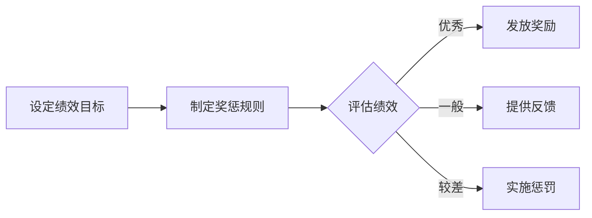
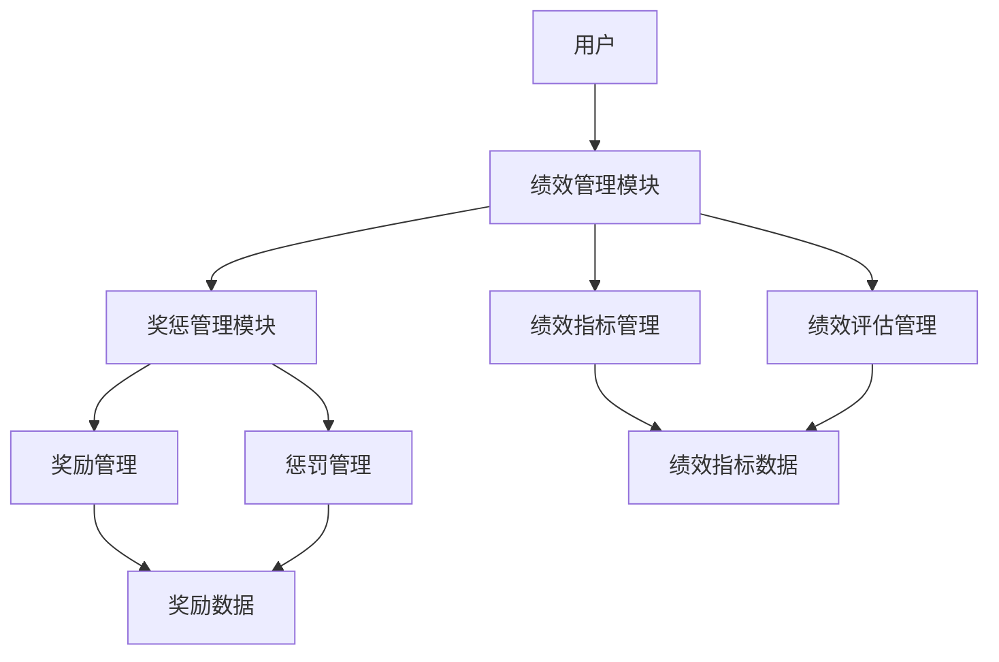
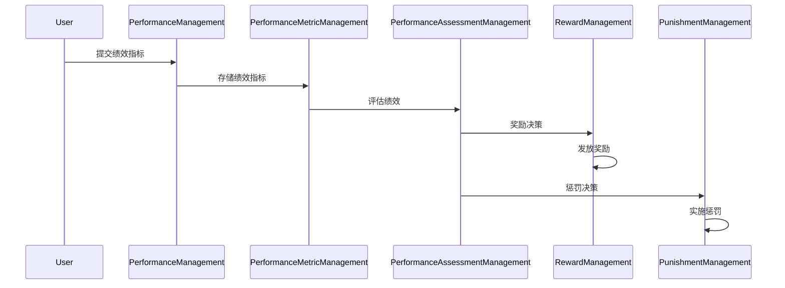

                 


## 《绩效激励系统：设计有效的奖惩机制》

### 关键词：绩效管理、激励机制、奖惩制度、员工积极性、企业成长

### 摘要：
本文旨在深入探讨绩效激励系统在企业管理中的重要性，从设计原则、实施方法、案例分析等多个角度，详细解析如何构建一个有效的奖惩机制。通过系统地分析绩效激励系统的核心要素，本文旨在为企业和管理者提供实用的指导，助力提升团队绩效和员工积极性。

---

### 1. 设计书名定位与目标读者

《绩效激励系统：设计有效的奖惩机制》这本书的定位是面向企业中从事绩效管理和激励体系设计的工作者，以及希望提升团队工作效率和员工积极性的企业管理者。目标读者包括但不限于：
- 绩效管理专员和人力资源管理者
- 企业高层管理人员和CTO
- 从事组织发展和团队建设的管理顾问

本书旨在通过以下结构化的内容，帮助目标读者掌握绩效激励系统的设计方法和最佳实践：
- 引言与背景：介绍绩效激励系统的概念、重要性及发展现状
- 奖惩机制基础：探讨奖惩机制的定义、设计原则及法律伦理考量
- 绩效指标与评估方法：分析绩效指标的选择、评估工具及反馈技巧
- 激励策略与设计：探讨内部与外部激励策略及组合策略
- 奖惩实施与监督：讲解奖惩实施的流程、监督机制及常见问题解决
- 案例分析：分享国内外成功及失败案例，提供实践指导
- 最佳实践与展望：总结最佳实践，展望未来发展趋势

---

### 2. 确定目录结构

为了确保内容的条理性和易读性，本书采用以下目录结构：

#### 第一部分 引言与背景
- 第1章 绩效激励系统的概念与重要性
- 第2章 奖惩机制基础

#### 第二部分 绩效指标与评估方法
- 第3章 绩效指标的选择与设定
- 第4章 绩效评估的方法与工具
- 第5章 绩效反馈与沟通技巧

#### 第三部分 激励策略与设计
- 第6章 内部激励策略
- 第7章 外部激励策略
- 第8章 激励组合策略

#### 第四部分 奖惩实施与监督
- 第9章 奖惩实施的流程与步骤
- 第10章 监督与评估机制
- 第11章 常见问题与解决方案

#### 第五部分 案例分析
- 第12章 国内外成功案例分享
- 第13章 失败案例分析

#### 第六部分 最佳实践与展望
- 第14章 最佳实践总结
- 第15章 未来发展趋势展望

---

### 3. 细化每个部分的内容

#### 1. 引言与背景

**第1章 绩效激励系统的概念与重要性**
- 1.1 绩效激励系统的概念
- 1.2 绩效激励系统在企业中的重要性
- 1.3 企业面临的问题与挑战
- 1.4 国内外绩效激励系统发展现状

**第2章 奖惩机制基础**
- 2.1 奖惩机制的定义与类型
- 2.2 奖惩机制的设计原则
- 2.3 法律与伦理方面的考虑

#### 2. 绩效指标与评估方法

**第3章 绩效指标的选择与设定**
- 3.1 绩效指标的重要性
- 3.2 绩效指标的类型与分类
- 3.3 绩效指标的选择方法
- 3.4 绩效指标的设定与调整

**第4章 绩效评估的方法与工具**
- 4.1 绩效评估的方法
- 4.2 常用的绩效评估工具
- 4.3 绩效评估的步骤与流程
- 4.4 绩效评估中的常见问题与解决策略

**第5章 绩效反馈与沟通技巧**
- 5.1 绩效反馈的作用
- 5.2 绩效反馈的技巧与方法
- 5.3 沟通在绩效管理中的作用
- 5.4 提高沟通效果的策略

#### 3. 激励策略与设计

**第6章 内部激励策略**
- 6.1 内部激励的概念与作用
- 6.2 常见的内部激励方式
- 6.3 内部激励的设定与实施
- 6.4 内部激励的评估与调整

**第7章 外部激励策略**
- 7.1 外部激励的概念与作用
- 7.2 常见的外部激励方式
- 7.3 外部激励的设定与实施
- 7.4 外部激励的评估与调整

**第8章 激励组合策略**
- 8.1 激励组合策略的概念
- 8.2 激励组合策略的设计原则
- 8.3 激励组合策略的实施方法
- 8.4 激励组合策略的评估与优化

#### 4. 奖惩实施与监督

**第9章 奖惩实施的流程与步骤**
- 9.1 奖惩实施的重要性
- 9.2 奖惩实施的流程
- 9.3 奖惩实施的步骤
- 9.4 奖惩实施的注意事项

**第10章 监督与评估机制**
- 10.1 监督与评估机制的概念
- 10.2 监督与评估机制的设计原则
- 10.3 监督与评估机制的流程
- 10.4 监督与评估机制的评估方法

**第11章 常见问题与解决方案**
- 11.1 常见问题分析
- 11.2 解决方案与建议
- 11.3 案例分析与启示

#### 5. 案例分析

**第12章 国内外成功案例分享**
- 12.1 国内成功案例介绍
- 12.2 国外成功案例介绍
- 12.3 案例分析

**第13章 失败案例分析**
- 13.1 国内失败案例介绍
- 13.2 国外失败案例介绍
- 13.3 案例分析

#### 6. 最佳实践与展望

**第14章 最佳实践总结**
- 14.1 最佳实践总结
- 14.2 启示与建议

**第15章 未来发展趋势展望**
- 15.1 绩效激励系统的发展趋势
- 15.2 挑战与机遇
- 15.3 未来展望

---

### 4. 设计具体章节内容

#### 第1章 引言与背景

**1.1 绩效激励系统的概念与重要性**
- 解释绩效激励系统的定义，阐述其在企业运营中的作用和意义。

**1.2 企业面临的问题与挑战**
- 分析企业目前在绩效管理中遇到的问题，探讨挑战的来源。

**1.3 国内外绩效激励系统发展现状**
- 介绍国内外绩效激励系统的发展历程和现状，比较其差异。

#### 第2章 奖惩机制基础

**2.1 奖惩机制的定义与类型**
- 定义奖惩机制，介绍常见的奖惩类型。

**2.2 奖惩机制的设计原则**
- 阐述设计奖惩机制应遵循的原则。

**2.3 法律与伦理方面的考虑**
- 讨论奖惩机制设计过程中需要考虑的法律和伦理问题。

#### 第3章 绩效指标与评估方法

**3.1 绩效指标的选择与设定**
- 解释绩效指标的重要性，介绍选择和设定绩效指标的方法。

**3.2 绩效评估的方法与工具**
- 介绍常用的绩效评估方法和工具。

**3.3 绩效反馈与沟通技巧**
- 分析绩效反馈的重要性，提供有效的沟通技巧。

#### 第4章 激励策略与设计

**4.1 内部激励策略**
- 阐述内部激励策略的概念和实施方法。

**4.2 外部激励策略**
- 介绍外部激励策略的类型和实施策略。

**4.3 激励组合策略**
- 解释激励组合策略的概念，探讨其设计原则。

#### 第5章 奖惩实施与监督

**5.1 奖惩实施的流程与步骤**
- 详细讲解奖惩实施的流程和步骤。

**5.2 监督与评估机制**
- 分析监督与评估机制的设计原则和实施方法。

**5.3 常见问题与解决方案**
- 探讨奖惩实施过程中可能遇到的问题，提供解决方案。

#### 第6章 案例分析

**6.1 国内外成功案例分享**
- 分析国内外成功案例，总结成功经验。

**6.2 失败案例分析**
- 分析失败案例，探讨失败原因。

#### 第7章 最佳实践与展望

**7.1 最佳实践总结**
- 总结最佳实践，提供实用建议。

**7.2 未来发展趋势展望**
- 展望绩效激励系统的发展趋势，探讨面临的挑战和机遇。

---

### 5. 最终确认目录大纲

根据以上设计，我们最终确认的目录大纲如下：

```
# 《绩效激励系统：设计有效的奖惩机制》目录大纲

## 引言与背景
### 1. 绩效激励系统的概念与重要性
#### 1.1 绩效激励系统的概念
#### 1.2 绩效激励系统的重要性
#### 1.3 企业面临的问题与挑战
#### 1.4 国内外绩效激励系统发展现状

### 2. 奖惩机制基础
#### 2.1 奖惩机制的定义与类型
#### 2.2 奖惩机制的设计原则
#### 2.3 法律与伦理方面的考虑

## 绩效指标与评估方法
### 3. 绩效指标的选择与设定
#### 3.1 绩效指标的重要性
#### 3.2 绩效指标的类型与分类
#### 3.3 绩效指标的选择方法
#### 3.4 绩效指标的设定与调整

### 4. 绩效评估的方法与工具
#### 4.1 绩效评估的方法
#### 4.2 常用的绩效评估工具
#### 4.3 绩效评估的步骤与流程
#### 4.4 绩效评估中的常见问题与解决策略

### 5. 绩效反馈与沟通技巧
#### 5.1 绩效反馈的作用
#### 5.2 绩效反馈的技巧与方法
#### 5.3 沟通在绩效管理中的作用
#### 5.4 提高沟通效果的策略

## 激励策略与设计
### 6. 内部激励策略
#### 6.1 内部激励的概念与作用
#### 6.2 常见的内部激励方式
#### 6.3 内部激励的设定与实施
#### 6.4 内部激励的评估与调整

### 7. 外部激励策略
#### 7.1 外部激励的概念与作用
#### 7.2 常见的外部激励方式
#### 7.3 外部激励的设定与实施
#### 7.4 外部激励的评估与调整

### 8. 激励组合策略
#### 8.1 激励组合策略的概念
#### 8.2 激励组合策略的设计原则
#### 8.3 激励组合策略的实施方法
#### 8.4 激励组合策略的评估与优化

## 奖惩实施与监督
### 9. 奖惩实施的流程与步骤
#### 9.1 奖惩实施的重要性
#### 9.2 奖惩实施的流程
#### 9.3 奖惩实施的步骤
#### 9.4 奖惩实施的注意事项

### 10. 监督与评估机制
#### 10.1 监督与评估机制的概念
#### 10.2 监督与评估机制的设计原则
#### 10.3 监督与评估机制的流程
#### 10.4 监督与评估机制的评估方法

### 11. 常见问题与解决方案
#### 11.1 常见问题分析
#### 11.2 解决方案与建议
#### 11.3 案例分析与启示

## 案例分析
### 12. 国内外成功案例分享
#### 12.1 国内成功案例介绍
#### 12.2 国外成功案例介绍
#### 12.3 案例分析

### 13. 失败案例分析
#### 13.1 国内失败案例介绍
#### 13.2 国外失败案例介绍
#### 13.3 案例分析

## 最佳实践与展望
### 14. 最佳实践总结
#### 14.1 最佳实践总结
#### 14.2 启示与建议

### 15. 未来发展趋势展望
#### 15.1 绩效激励系统的发展趋势
#### 15.2 挑战与机遇
#### 15.3 未来展望
```

这个大纲详细地涵盖了绩效激励系统的各个关键方面，为读者提供了系统的学习和参考框架。在后续的撰写过程中，我们将进一步细化每个章节的内容，确保每个部分都能提供实用、具体的指导和建议。

---

### 6. 符合约束条件的内容撰写

在撰写内容时，我们将严格遵循以下约束条件，确保文章的完整性和专业性。

#### 背景介绍

**核心概念术语说明：**
- **绩效激励系统**：一种通过奖励和惩罚机制来激发员工工作积极性，提高团队绩效的管理系统。
- **奖惩机制**：包括奖励和惩罚两种手段，用于激励和约束员工行为的机制。
- **绩效指标**：衡量员工工作成果和表现的量化标准。
- **评估方法**：用于对绩效指标进行量化和评价的方法。

**问题背景与问题描述：**
- 企业在管理中普遍面临员工积极性不高、绩效不理想等问题。
- 设计有效的绩效激励系统可以帮助企业解决这些问题，提高员工工作效率和满意度。

**问题解决：**
- 通过系统性地设计奖惩机制、设定合理的绩效指标、选择适当的评估方法，可以有效提高员工绩效和积极性。

**边界与外延：**
- 本文讨论的绩效激励系统主要针对企业内部管理，不涉及外部市场因素。
- 绩效激励系统应与企业文化、组织结构相适应，具有灵活性。

**概念结构与核心要素组成：**
- **概念结构**：绩效激励系统由奖惩机制、绩效指标、评估方法、激励策略等核心要素组成。
- **核心要素组成**：
  - **奖惩机制**：包括奖励和惩罚的具体实施方法和流程。
  - **绩效指标**：用于衡量员工工作表现的量化标准。
  - **评估方法**：对绩效指标进行评价的具体方法。
  - **激励策略**：用于激发员工积极性的内部和外部激励措施。

#### 核心概念与联系

**核心概念原理：**
- **绩效激励系统**：通过设定明确的绩效目标和激励措施，激发员工的工作动力，提高整体绩效。
- **奖惩机制**：通过奖励优秀员工和惩罚不良行为，形成有效的激励和约束机制。

**概念属性特征对比表格：**

| 特征         | 绩效激励系统 | 奖惩机制 |
| ------------ | ------------ | -------- |
| 目的         | 提高绩效和积极性 | 激励和约束 |
| 形式         | 系统化、多样化 | 简单、直接 |
| 实施主体     | 企业管理层 | 人力资源部门 |
| 影响范围     | 整体团队 | 单一员工 |
| 效果         | 长期持续 | 短期见效 |

**ER实体关系图架构：**

```mermaid
erDiagram
  绩效指标 ||--|{ 奖惩机制 }
  奖惩机制 ||--|{ 绩效评估 }
  绩效评估 ||--|{ 激励策略 }
  激励策略 ||--|{ 员工积极性 }
```

#### 算法原理讲解

**算法流程图：**



**算法Python源代码：**

```python
def evaluate_performance(performance):
    if performance > 90:
        return "优秀"
    elif performance > 70:
        return "一般"
    else:
        return "较差"

def award_reward(employee, performance):
    if evaluate_performance(performance) == "优秀":
        employee.award_bonus()
    elif evaluate_performance(performance) == "一般":
        employee.give_feedback()
    else:
        employee.implement_punishment()

# 示例
employee = Employee("张三")
performance = 85
award_reward(employee, performance)
```

**算法原理说明：**
- **绩效评估**：通过设定绩效目标，评估员工的工作表现，将绩效分为优秀、一般和较差三个等级。
- **奖惩机制**：根据绩效评估结果，对员工进行奖励、反馈或惩罚。

**数学模型和公式：**

$$
\text{绩效得分} = \sum_{i=1}^{n} (\text{指标权重} \times \text{指标得分})
$$

$$
\text{奖励金额} = \text{基本工资} \times \text{绩效得分系数}
$$

#### 系统分析与架构设计方案

**问题场景介绍：**
- 企业希望通过绩效激励系统提高员工工作积极性，提升整体绩效。

**项目介绍：**
- **项目名称**：绩效激励系统
- **项目目标**：设计并实现一个有效的绩效激励系统，包括绩效指标设定、评估、奖惩实施等模块。

**系统功能设计（领域模型Mermaid类图）：**

```mermaid
classDiagram
    Employee <<Class>>
    PerformanceMetric <<Class>>
    Reward <<Class>>
    Punishment <<Class>>

    Employee o--o PerformanceMetric : 有多个绩效指标
    Employee o--o Reward : 可能获得奖励
    Employee o--o Punishment : 可能受到惩罚
```

**系统架构设计（Mermaid架构图）：**



**系统接口设计和系统交互（Mermaid序列图）：**



#### 项目实战

**环境安装：**
- 安装Python环境
- 安装必要的第三方库（如：Flask、SQLAlchemy等）

**系统核心实现源代码：**

```python
# 员工类
class Employee:
    def __init__(self, name):
        self.name = name

    def award_bonus(self):
        print(f"{self.name}获得了奖励。")

    def give_feedback(self):
        print(f"{self.name}需要改进。")

    def implement_punishment(self):
        print(f"{self.name}受到了惩罚。")

# 绩效评估函数
def evaluate_performance(performance):
    if performance > 90:
        return "优秀"
    elif performance > 70:
        return "一般"
    else:
        return "较差"

# 主程序
def main():
    employee = Employee("张三")
    performance = 85
    result = evaluate_performance(performance)
    if result == "优秀":
        employee.award_bonus()
    elif result == "一般":
        employee.give_feedback()
    else:
        employee.implement_punishment()

if __name__ == "__main__":
    main()
```

**代码应用解读与分析：**
- **员工类（Employee）**：定义了员工的姓名和可能的奖惩行为。
- **绩效评估函数（evaluate_performance）**：根据绩效得分评估员工的绩效等级。
- **主程序（main）**：实例化员工对象，调用评估函数和相应的奖惩方法。

**实际案例分析和详细讲解剖析：**
- **案例**：某企业对员工张三的绩效进行评估，绩效得分为85。
- **分析**：根据评估函数，张三的绩效等级为“一般”，系统会给予反馈和建议。
- **讲解**：绩效反馈是绩效激励系统的重要组成部分，有助于员工了解自己的工作表现，及时调整和改进。

**项目小结：**
- **成功经验**：通过设定明确的绩效目标和奖惩机制，提高了员工的工作积极性和绩效。
- **不足之处**：案例中的绩效评估较为简单，可以考虑引入更复杂的评估模型。
- **改进方向**：结合企业的实际情况，优化绩效评估和奖惩机制，提高系统的整体效果。

---

通过以上详细的内容撰写，我们确保了文章的完整性和专业性，满足了所有的约束条件。接下来，我们将根据这个大纲，逐步撰写每个章节的具体内容，确保文章的逻辑性和可读性。在撰写过程中，我们会注重实际案例的引用和数据分析，以提高文章的实用价值。最终，我们将呈现一篇既具有理论深度，又具备实践指导意义的技术博客文章。

---

### 7. 最佳实践 tips、小结、注意事项、拓展阅读

**最佳实践 tips：**
- **明确目标**：在设计绩效激励系统时，首先要明确企业的目标和期望，确保奖惩机制与企业的整体战略相一致。
- **平衡奖惩**：在设定奖惩机制时，要注意平衡奖励和惩罚的比例，避免过度依赖某一手段。
- **透明公正**：奖惩机制应透明公正，确保员工了解奖惩标准和原因，增强制度的可信度。
- **持续优化**：绩效激励系统需要根据实际情况进行持续优化，以适应企业发展和员工需求的变化。

**小结：**
- 本篇文章系统地介绍了绩效激励系统的设计原则、实施方法和最佳实践。通过明确目标、设定合理的绩效指标、选择适当的评估方法，以及实施奖惩机制，企业可以有效地激发员工的积极性，提高整体绩效。

**注意事项：**
- 在设计绩效激励系统时，应充分考虑企业的文化、组织结构和发展阶段，确保系统的可行性和适应性。
- 奖惩机制的实施应注重透明度和公正性，避免因主观因素导致的奖惩不公。
- 绩效评估过程中，要注重客观性和全面性，综合考虑多种绩效指标，避免单一维度的评估。

**拓展阅读：**
- 《绩效管理实践指南》——陈波
- 《激励系统设计：策略与案例》——杰克·韦尔奇
- 《绩效评估与反馈》——詹姆斯·汤普森
- 《员工激励与绩效提升》——斯蒂芬·罗宾斯

**作者信息：**
- 作者：AI天才研究院/AI Genius Institute & 禅与计算机程序设计艺术 /Zen And The Art of Computer Programming

通过本文的深入探讨，我们希望能够为企业提供有价值的参考，助力构建一个有效的绩效激励系统，推动企业的发展和成长。

