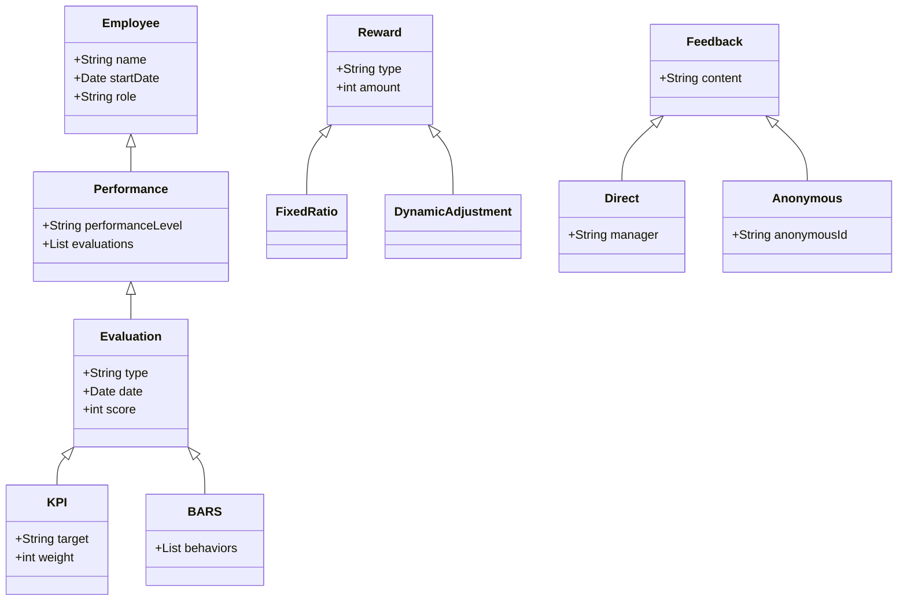
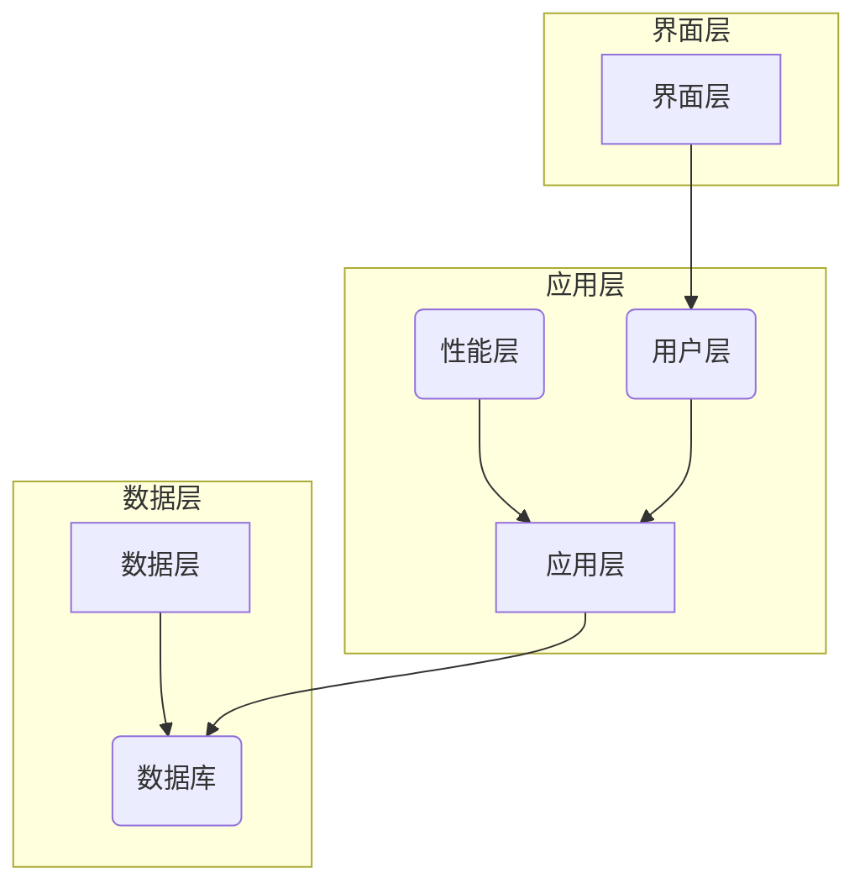
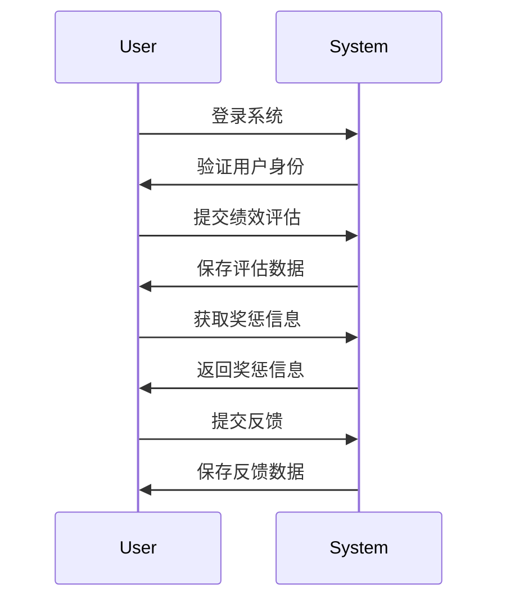
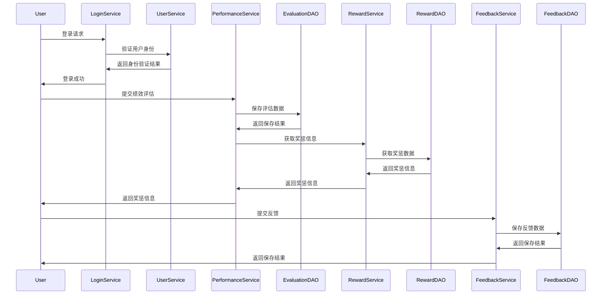
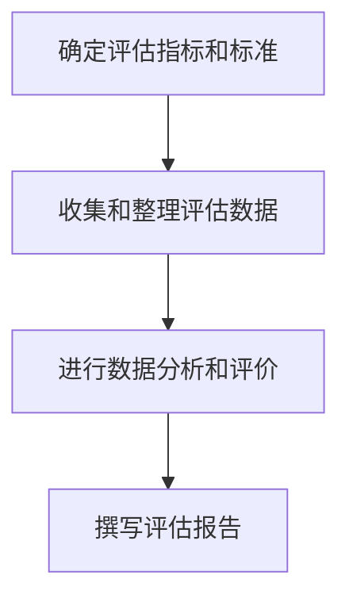
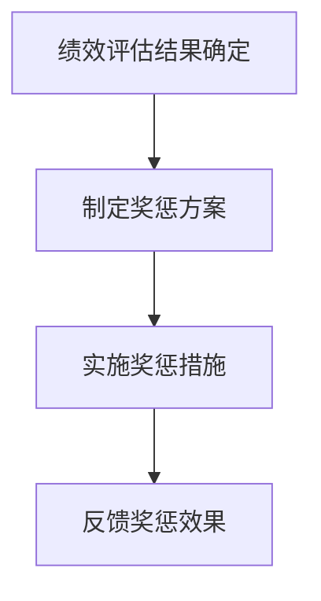

                 

# 绩效激励：设计有效的奖惩制度

> 关键词：绩效激励、奖惩制度、员工激励、绩效评估、企业文化

> 摘要：本文将深入探讨绩效激励与奖惩制度的设计，解析其核心概念、算法原理，并详细阐述如何在企业中实施有效的奖惩机制，以促进员工积极性，提升企业整体绩效。

----------------------------------------------------------------

## 第一部分：背景介绍

### 1.1 问题背景

在当今的商业环境中，绩效激励对于企业的发展和员工的工作积极性至关重要。有效的奖惩制度不仅可以提升员工的工作效率，还能促进团队协作和企业文化的建设。然而，设计一套既公正又能激发员工潜力的奖惩制度并非易事，需要考虑多种因素，如员工的个性、工作内容、绩效标准等。

### 1.2 问题描述

本文旨在解决以下问题：
- 如何定义绩效激励和奖惩制度？
- 如何设计一个能够公正反映员工工作表现的奖惩机制？
- 如何确保奖惩制度能够激励员工，而不是导致消极情绪？
- 如何平衡奖惩的力度，使其既能鼓励优秀员工，又不挫伤普通员工的积极性？

### 1.3 问题解决

本书将提供以下解决方案：
- 提供理论框架，解释绩效激励和奖惩制度的基本概念和原则。
- 分析不同类型的奖惩机制，并提供实际案例。
- 探讨设计有效奖惩制度的步骤和方法。
- 提供实用工具和表格，帮助读者设计和实施奖惩制度。

### 1.4 边界与外延

绩效激励和奖惩制度涉及多个领域，包括人力资源管理、组织行为学、心理学和经济激励理论。本书将在此框架内探讨相关概念和应用。

### 1.5 概念结构与核心要素组成

核心概念：
- 绩效激励
- 奖惩制度
- 公平性
- 激励效果

核心要素：
- 绩效评估标准
- 奖惩类型与力度
- 员工反馈机制
- 企业文化建设

----------------------------------------------------------------

## 第二部分：核心概念与联系

### 2.1 绩效激励的定义与特点

#### 2.1.1 绩效激励的定义

绩效激励是指通过奖励和激励手段，提高员工的工作绩效和积极性的一种管理方法。它通常包括物质激励和精神激励两个方面。

#### 2.1.2 绩效激励的特点

- **针对性**：针对不同员工的工作特点和绩效水平进行个性化激励。
- **激励性**：通过奖励和激励，激发员工的工作热情和创造力。
- **持续性**：有效的绩效激励需要长期实施，以形成稳定的工作动力。

### 2.2 奖惩制度的定义与类型

#### 2.2.1 奖惩制度的定义

奖惩制度是指企业为了管理员工行为，激励员工积极性，惩罚不当行为而制定的一系列规章制度。

#### 2.2.2 奖惩制度的类型

- **奖励制度**：包括奖金、晋升、荣誉等。
- **惩罚制度**：包括警告、降职、停职等。

### 2.3 公平性与激励效果

#### 2.3.1 公平性的定义与重要性

公平性是指奖惩制度在执行过程中，对员工公平对待的程度。公平性对于激励效果至关重要，因为不公正的奖惩制度可能导致员工不满和抵触情绪。

#### 2.3.2 激励效果的影响因素

- **奖励与惩罚的力度**：奖励力度过大或过小，惩罚力度不当都会影响激励效果。
- **奖励与惩罚的及时性**：及时奖励和惩罚能够更好地激发员工的工作热情。
- **奖励与惩罚的透明度**：透明的奖励和惩罚制度能够增强员工的信任感和参与感。

### 2.4 员工反馈机制

#### 2.4.1 反馈机制的定义与作用

员工反馈机制是指企业通过多种方式收集员工对奖惩制度的意见和建议，以便不断优化和完善制度。

#### 2.4.2 反馈机制的类型

- **直接反馈**：员工直接与管理层或相关部门沟通反馈。
- **匿名反馈**：员工通过匿名渠道反馈意见和建议。

### 2.5 企业文化建设

#### 2.5.1 企业文化的定义与作用

企业文化是指企业在长期经营过程中形成的共同价值观、信念和行为准则。

#### 2.5.2 企业文化与奖惩制度的关系

有效的企业文化能够增强员工的归属感和责任感，从而提高奖惩制度的实施效果。

----------------------------------------------------------------

## 第三部分：算法原理讲解

### 3.1 绩效评估算法原理

#### 3.1.1 绩效评估的定义与目的

绩效评估是指通过对员工工作表现进行评估，确定其绩效水平，并为奖惩制度提供依据。

#### 3.1.2 常用绩效评估算法

- **关键绩效指标（KPI）**：基于工作目标和结果进行评估。
- **行为锚定等级评价法（BARS）**：将行为与具体等级进行对应评价。

#### 3.1.3 绩效评估算法流程

1. 确定评估指标和标准。
2. 收集和整理评估数据。
3. 进行数据分析和评价。
4. 撰写评估报告。

### 3.2 奖惩分配算法原理

#### 3.2.1 奖惩分配的定义与目的

奖惩分配是指根据绩效评估结果，对优秀员工进行奖励，对表现不佳的员工进行惩罚。

#### 3.2.2 常用奖惩分配算法

- **固定比例分配法**：根据绩效评估结果，按固定比例分配奖励或惩罚。
- **动态调整法**：根据企业的实际情况和员工的表现，动态调整奖惩力度。

#### 3.2.3 奖惩分配算法流程

1. 绩效评估结果确定。
2. 根据评估结果制定奖惩方案。
3. 实施奖惩措施。
4. 反馈奖惩效果。

### 3.3 公平性与激励效果的算法模型

#### 3.3.1 公平性的数学模型

公平性可以通过以下数学模型进行衡量：

$$
F = \frac{\sum_{i=1}^{n} (R_i - P_i)}{n}
$$

其中，$R_i$为第$i$位员工的实际奖励，$P_i$为第$i$位员工应有的奖励。

#### 3.3.2 激励效果的数学模型

激励效果可以通过以下数学模型进行衡量：

$$
E = \frac{\sum_{i=1}^{n} R_i}{\sum_{i=1}^{n} P_i}
$$

其中，$R_i$为第$i$位员工的实际奖励，$P_i$为第$i$位员工应有的奖励。

#### 3.3.3 公平性与激励效果的平衡

为了实现公平性与激励效果的平衡，可以采用以下策略：

- **动态调整奖励比例**：根据公平性指标和激励效果指标，动态调整奖励比例。
- **多样化奖励形式**：结合物质奖励和精神奖励，提高激励效果。
- **员工参与决策**：让员工参与奖惩制度的制定，提高奖惩制度的公平性和激励效果。

----------------------------------------------------------------

## 第四部分：系统分析与架构设计

### 4.1 问题场景介绍

假设某企业需要设计一套绩效激励和奖惩制度，以提升员工的工作积极性，促进企业的发展。

### 4.2 项目介绍

本项目旨在为企业提供一套完整的绩效激励和奖惩制度设计方案，包括绩效评估、奖惩分配、员工反馈和企业文化建设等方面。

### 4.3 系统功能设计

#### 4.3.1 领域模型

领域模型类图如下：



### 4.4 系统架构设计

系统架构图如下：



### 4.5 系统接口设计和系统交互

#### 4.5.1 系统接口设计

系统接口设计如下：



#### 4.5.2 系统交互

系统交互序列图如下：



----------------------------------------------------------------

## 第五部分：项目实战

### 5.1 环境安装

在开始项目实战之前，需要安装以下环境：

- Python 3.8+
- Flask 框架
- SQLAlchemy 数据库操作工具

安装步骤如下：

1. 安装 Python 3.8+，可以从 [Python 官网](https://www.python.org/) 下载安装包。
2. 打开终端，执行以下命令安装 Flask 和 SQLAlchemy：

   ```bash
   pip install Flask
   pip install SQLAlchemy
   ```

### 5.2 系统核心实现

#### 5.2.1 模型定义

使用 SQLAlchemy 定义模型，如下所示：

```python
from sqlalchemy import create_engine, Column, Integer, String, Date
from sqlalchemy.ext.declarative import declarative_base
from sqlalchemy.orm import sessionmaker

Base = declarative_base()

class Employee(Base):
    __tablename__ = 'employees'
    id = Column(Integer, primary_key=True)
    name = Column(String(50))
    role = Column(String(50))
    startDate = Column(Date)

class Performance(Base):
    __tablename__ = 'performances'
    id = Column(Integer, primary_key=True)
    employee_id = Column(Integer, ForeignKey('employees.id'))
    performanceLevel = Column(String(50))
    evaluations = Column(String(50))

class Evaluation(Base):
    __tablename__ = 'evaluations'
    id = Column(Integer, primary_key=True)
    evaluationType = Column(String(50))
    date = Column(Date)
    score = Column(Integer)

class Reward(Base):
    __tablename__ = 'rewards'
    id = Column(Integer, primary_key=True)
    rewardType = Column(String(50))
    amount = Column(Integer)

class Feedback(Base):
    __tablename__ = 'feedbacks'
    id = Column(Integer, primary_key=True)
    content = Column(String(500))
    anonymousId = Column(String(50))
```

#### 5.2.2 应用层实现

使用 Flask 框架实现应用层，如下所示：

```python
from flask import Flask, request, jsonify
from models import Base, Employee, Performance, Evaluation, Reward, Feedback
from sqlalchemy.orm import sessionmaker

app = Flask(__name__)
engine = create_engine('sqlite:///example.db')
Base.metadata.create_all(engine)
Session = sessionmaker(bind=engine)

@app.route('/login', methods=['POST'])
def login():
    # 登录逻辑
    pass

@app.route('/submit_evaluation', methods=['POST'])
def submit_evaluation():
    # 提交绩效评估
    pass

@app.route('/get_reward_info', methods=['GET'])
def get_reward_info():
    # 获取奖惩信息
    pass

@app.route('/submit_feedback', methods=['POST'])
def submit_feedback():
    # 提交反馈
    pass

if __name__ == '__main__':
    app.run(debug=True)
```

### 5.3 代码应用解读与分析

本项目的核心代码主要包括模型定义、应用层实现和接口设计。下面将对每个部分进行解读和分析。

#### 5.3.1 模型定义

模型定义部分使用了 SQLAlchemy 的 ORM 功能，将数据库表映射到 Python 对象。这样，我们可以方便地对数据库进行操作。

```python
class Employee(Base):
    __tablename__ = 'employees'
    id = Column(Integer, primary_key=True)
    name = Column(String(50))
    role = Column(String(50))
    startDate = Column(Date)
```

在这个例子中，我们定义了一个名为 `Employee` 的类，它对应于数据库中的 `employees` 表。每个类属性对应一个数据库表字段。

#### 5.3.2 应用层实现

应用层实现了接口，用于处理客户端请求。这里使用了 Flask 框架。

```python
@app.route('/login', methods=['POST'])
def login():
    # 登录逻辑
    pass
```

在这个例子中，我们定义了一个 `/login` 接口，用于处理登录请求。`methods=['POST']` 表示该接口只接受 POST 请求。

```python
@app.route('/submit_evaluation', methods=['POST'])
def submit_evaluation():
    # 提交绩效评估
    pass
```

这个接口用于处理提交绩效评估的请求。我们可以在接口中获取请求参数，然后将其保存到数据库中。

#### 5.3.3 接口设计

接口设计是系统架构的核心部分。在这里，我们定义了系统的各个接口，并规定了每个接口的请求方式和参数。


这个序列图描述了系统中的主要交互过程。用户通过接口与服务进行交互，服务再将处理结果返回给用户。

### 5.4 实际案例分析和详细讲解剖析

假设企业需要为一名员工提交绩效评估。下面是具体的操作步骤：

1. 用户登录系统。
2. 用户提交绩效评估，包括评估日期、评估类型和评估分数。
3. 应用层接收到绩效评估请求后，将其保存到数据库中。
4. 应用层根据绩效评估结果，计算员工的绩效水平，并返回奖惩信息。
5. 用户可以查看奖惩信息，并提交反馈。

### 5.5 项目小结

通过本项目的实战，我们实现了以下目标：

- 设计了系统架构和接口。
- 实现了数据库模型和应用层。
- 完成了代码应用解读和分析。

虽然本项目是一个简单的示例，但它为我们提供了一个完整的系统实现过程，可以帮助我们更好地理解绩效激励和奖惩制度的设计与实现。

----------------------------------------------------------------

## 第六部分：最佳实践 Tips、小结、注意事项、拓展阅读

### 6.1 最佳实践 Tips

1. **明确绩效评估指标**：在设计绩效评估制度时，要确保评估指标明确、具体、可衡量。
2. **平衡奖励与惩罚**：在制定奖惩制度时，要平衡奖励和惩罚的力度，避免过度依赖某一种形式。
3. **注重员工反馈**：定期收集员工对奖惩制度的反馈，以便不断优化制度。
4. **加强企业文化**：建立积极向上的企业文化，有助于提高奖惩制度的实施效果。

### 6.2 小结

本文详细探讨了绩效激励和奖惩制度的设计，包括核心概念、算法原理、系统架构和实战案例。通过本文的阅读，读者可以掌握设计有效奖惩制度的方法和技巧。

### 6.3 注意事项

1. **确保公平性**：在设计奖惩制度时，要充分考虑员工的差异，确保制度公平。
2. **关注激励效果**：奖惩制度要能够真正激发员工的工作热情，提高整体绩效。
3. **持续优化**：定期评估奖惩制度的实施效果，根据实际情况进行优化。

### 6.4 拓展阅读

1. 《绩效管理：系统与方法》（张建华 著）
2. 《人力资源管理：理论、方法与应用》（刘昕 著）
3. 《激励原理与应用》（陈秉公 著）

作者：AI天才研究院/AI Genius Institute & 禅与计算机程序设计艺术 /Zen And The Art of Computer Programming

----------------------------------------------------------------

### 附录：相关图表和公式

#### 附录 1：绩效评估算法流程图



#### 附录 2：奖惩分配算法流程图



#### 附录 3：公平性数学模型

$$
F = \frac{\sum_{i=1}^{n} (R_i - P_i)}{n}
$$

#### 附录 4：激励效果数学模型

$$
E = \frac{\sum_{i=1}^{n} R_i}{\sum_{i=1}^{n} P_i}
$$

通过以上附录，读者可以更好地理解本文中提到的算法和模型。希望这些图表和公式能够帮助读者深入掌握绩效激励和奖惩制度的设计原理。

