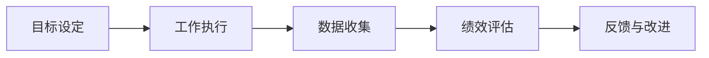
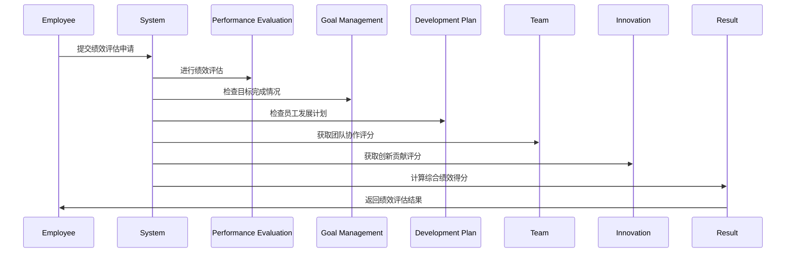
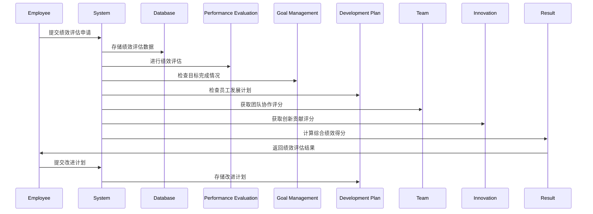

                 


## 绩效管理革新：超越传统KPI的评估方法

### 关键词：绩效管理、KPI、评估方法、员工发展、企业效率

### 摘要：

绩效管理是企业管理中至关重要的一环，而传统的KPI（关键绩效指标）评估方法因其局限性，已不能满足现代企业对于绩效管理的需求。本文将深入探讨绩效管理革新，分析传统KPI的局限性，并提出超越KPI的新型评估方法，旨在为企业提供一种更科学、更有效的绩效管理方案。

### 目录：

**第一部分：问题背景与概念介绍**

1.1 问题背景
1.1.1 传统绩效管理的局限
1.1.2 KPI的挑战
1.1.3 绩效管理革新需求

1.2 问题描述
1.2.1 传统绩效管理中的问题
1.2.2 新评估方法需求

1.3 问题解决
1.3.1 绩效管理革新的目的
1.3.2 新方法核心原理

1.4 边界与外延
1.4.1 适用行业与场景
1.4.2 评估方法适用范围

1.5 概念结构与核心要素组成
1.5.1 绩效管理基本概念
1.5.2 评估方法核心要素

**第二部分：核心概念与联系**

2.1 核心概念原理
2.1.1 绩效评估
2.1.2 目标管理
2.1.3 员工发展

2.2 概念属性特征对比表格
2.2.1 传统KPI vs 新评估方法
2.2.2 特性、优点、局限

2.3 ER实体关系图架构
2.3.1 绩效管理系统的实体关系

**第三部分：算法与数学模型**

3.1 算法原理讲解
3.1.1 绩效评估流程
3.1.2 评估模型实现

3.2 数学模型和数学公式
3.2.1 绩效评估模型公式
3.2.2 目标设定公式
3.2.3 员工发展模型公式

3.3 举例说明
3.3.1 传统KPI应用
3.3.2 新评估方法应用

**第四部分：系统分析与设计**

4.1 问题场景介绍
4.1.1 绩效管理应用场景

4.2 项目介绍
4.2.1 项目背景
4.2.2 项目目标

4.3 系统功能设计
4.3.1 领域模型Mermaid类图

4.4 系统架构设计
4.4.1 Mermaid架构图

4.5 系统接口设计
4.4.2 接口设计

4.6 系统交互Mermaid序列图
4.4.3 系统交互流程

**第五部分：项目实战**

5.1 环境安装
5.1.1 所需工具与软件

5.2 系统核心实现源代码
5.2.1 核心代码

5.3 代码应用解读与分析
5.3.1 代码解读
5.3.2 案例分析

5.4 实际案例分析与详细讲解剖析
5.4.1 案例解析
5.4.2 问题与解决方案

5.5 项目小结
5.5.1 项目成果
5.5.2 经验与反思

**第六部分：最佳实践、总结与拓展阅读**

6.1 最佳实践 tips
6.1.1 实施新绩效管理方法的建议

6.2 小结
6.2.1 全书核心观点回顾

6.3 注意事项
6.3.1 绩效管理实践中的风险

6.4 拓展阅读
6.4.1 相关书籍与文献推荐

---

### 1.1 问题背景

在当今竞争激烈的商业环境中，企业的成功越来越依赖于员工的绩效。有效的绩效管理不仅能够激励员工提高工作质量，还能够帮助企业实现战略目标。然而，传统的绩效管理方法，尤其是基于KPI的评估方式，存在着诸多局限性。

**1.1.1 传统绩效管理的局限**

传统绩效管理往往侧重于结果导向，通过设定一系列具体的、量化的指标来衡量员工的绩效。这种方法虽然在短期内能够提升工作效率，但随着时间的推移，其弊端逐渐显现：

- **忽略过程和员工发展**：传统绩效管理过于关注结果，而忽视了员工在工作中所经历的成长和学习过程。
- **单一维度的评估**：基于KPI的评估方法往往只关注几个关键指标，无法全面反映员工的综合能力。
- **激励机制的局限性**：传统绩效管理往往将员工的薪酬和晋升与KPI直接挂钩，容易导致短期行为和扭曲的动机。

**1.1.2 KPI的挑战**

KPI作为传统绩效管理的主要工具，其主要挑战包括：

- **狭隘的视野**：KPI通常只关注可量化的结果，忽视了员工的主观感受和企业的长期发展。
- **数据偏差**：KPI的设定往往基于历史数据和业务需求，可能导致评估结果偏离实际。
- **管理复杂度**：随着KPI数量的增加，绩效管理的复杂度也随之增加，增加了管理成本。

**1.1.3 绩效管理革新需求**

面对传统绩效管理的局限性，企业迫切需要一种新的绩效管理方法。这种新方法应当：

- **兼顾结果和过程**：既要关注员工的工作成果，也要重视他们在工作中的成长和发展。
- **多维度的评估**：不仅考虑量化的绩效指标，还要包括员工的主观感受、团队协作能力和创新能力。
- **灵活和适应性**：能够根据不同行业和企业的特点，灵活调整评估标准和流程。

### 1.2 问题描述

**1.2.1 传统绩效管理中的问题**

传统绩效管理的主要问题包括：

- **结果导向而非全面发展**：过度关注短期绩效，忽视员工长期发展。
- **单一维度的评价**：仅依据几个关键指标进行评价，缺乏全面性。
- **激励机制的扭曲**：薪酬和晋升制度与KPI挂钩，可能导致员工行为扭曲。

**1.2.2 新评估方法需求**

为了解决传统绩效管理中的问题，企业需要引入一种新的评估方法。这种新方法应当：

- **综合评价**：不仅考虑工作成果，还要包括员工的发展、团队协作和创新能力。
- **灵活适应**：能够根据不同部门和岗位的特点，制定个性化的评估标准。
- **持续改进**：通过反馈机制，帮助员工不断改进工作表现，实现个人与组织的共同成长。

### 1.3 问题解决

**1.3.1 绩效管理革新的目的**

绩效管理革新的主要目的是：

- **提高员工满意度**：通过关注员工的发展和成长，提高员工的满意度和忠诚度。
- **提升企业竞争力**：通过综合评价和持续改进，提升员工的工作效率和企业竞争力。
- **实现组织目标**：通过科学的绩效管理，确保员工的目标与企业的战略目标一致。

**1.3.2 新方法核心原理**

新型评估方法的核心原理包括：

- **目标管理**：通过设定明确的个人和团队目标，确保员工的工作与组织目标一致。
- **多维度评估**：不仅关注工作成果，还综合考虑员工的主观感受、团队合作和创新贡献。
- **反馈与改进**：通过定期的反馈和评估，帮助员工识别改进点，不断提升绩效。

### 1.4 边界与外延

**1.4.1 适用行业与场景**

新型评估方法适用于：

- **知识密集型行业**：如IT、金融、咨询等行业，员工的专业能力和创新贡献至关重要。
- **快速变化的市场环境**：企业需要灵活应对市场变化，快速调整战略和绩效管理方法。

**1.4.2 评估方法适用范围**

新型评估方法适用于：

- **企业内部员工**：包括管理人员、技术专家、销售人员等各类员工。
- **项目团队**：通过团队评估，促进团队合作和目标实现。

### 1.5 概念结构与核心要素组成

**1.5.1 绩效管理基本概念**

绩效管理是指企业通过设定目标、评估绩效、提供反馈和支持，帮助员工提高工作表现的过程。其核心概念包括：

- **目标设定**：明确员工和团队的工作目标。
- **绩效评估**：客观、公正地评估员工的工作表现。
- **反馈与支持**：通过反馈，帮助员工识别改进点，并提供必要的支持。

**1.5.2 评估方法核心要素**

新型评估方法的核心要素包括：

- **目标管理**：通过设定明确、可衡量的目标，确保员工的工作与组织目标一致。
- **多维度评估**：综合考虑工作成果、员工发展、团队合作和创新贡献。
- **反馈与改进**：定期收集反馈，帮助员工持续改进工作表现。
- **激励与认可**：通过奖励和认可，激励员工积极投入工作。

---

**第二部分：核心概念与联系**

### 2.1 核心概念原理

**2.1.1 绩效评估**

绩效评估是指对员工的工作表现进行系统性的评价。其核心原理包括：

- **客观性**：评估结果应基于客观的数据和事实，避免主观偏见。
- **全面性**：评估应涵盖员工的多个维度，包括工作成果、能力提升、团队合作等。
- **持续性**：绩效评估应是一个持续的过程，通过定期评估，帮助员工不断改进。

**2.1.2 目标管理**

目标管理是一种以目标为导向的管理方法。其核心原理包括：

- **明确性**：目标应明确、具体，可量化，以便于员工了解自己的工作方向。
- **参与性**：员工应积极参与目标的设定，增强目标实现的动力。
- **反馈性**：通过定期的反馈，确保员工的工作始终与目标保持一致。

**2.1.3 员工发展**

员工发展是指通过培训、指导和支持，帮助员工提升能力、实现职业发展。其核心原理包括：

- **个性化**：员工发展计划应根据员工的个人需求和职业目标定制。
- **持续性**：员工发展应贯穿于整个职业生涯，而非仅限于某个阶段。
- **支持性**：企业应提供必要的资源和支持，帮助员工实现发展目标。

### 2.2 概念属性特征对比表格

**2.2.1 传统KPI vs 新评估方法**

| 特性 | 传统KPI | 新评估方法 |
| --- | --- | --- |
| 目标设定 | 明确、具体、可量化 | 明确、具体、可量化、参与性、反馈性 |
| 评估维度 | 单一维度：工作成果 | 多维度：工作成果、员工发展、团队合作、创新贡献 |
| 激励机制 | 结果导向、薪酬挂钩 | 综合评价、激励与认可 |
| 数据来源 | 历史数据和业务需求 | 客观数据、员工反馈、多维度评价 |
| 管理复杂度 | 中等 | 较高，但更全面 |

**2.2.2 特性、优点、局限**

- **传统KPI**
  - **特性**：以结果为导向，数据来源主要基于历史数据和业务需求。
  - **优点**：简单易懂，易于实施和监控。
  - **局限**：单一维度的评估，忽视过程和员工发展，可能导致短期行为和激励扭曲。

- **新评估方法**
  - **特性**：综合考虑多个维度，包括工作成果、员工发展、团队合作和创新贡献。
  - **优点**：更全面、更科学，有助于提高员工满意度和企业竞争力。
  - **局限**：实施成本较高，管理复杂度较大。

### 2.3 ER实体关系图架构

**2.3.1 绩效管理系统的实体关系**

在绩效管理系统中，主要涉及的实体包括：

- **员工**：系统中的主体，负责完成工作任务。
- **目标**：员工或团队的工作目标，用于指导工作。
- **评估**：对员工工作表现的评估，包括评估结果和评估过程。
- **反馈**：对员工工作表现的反馈，用于指导改进。

以下是绩效管理系统的ER实体关系图：

```mermaid
erDiagram
  Employee ||--|{ Goal : has }
  Employee ||--|{ Evaluation : has }
  Employee ||--|{ Feedback : has }
  Goal ||--|{ Evaluation : is }
  Evaluation ||--|{ Feedback : leads to }
```

---

**第三部分：算法与数学模型**

### 3.1 算法原理讲解

**3.1.1 绩效评估流程**

绩效评估流程通常包括以下几个步骤：

1. **目标设定**：根据企业战略和部门目标，设定员工或团队的目标。
2. **工作执行**：员工在目标指导下开展工作，并记录工作过程和成果。
3. **数据收集**：收集员工的工作数据，包括工作量、工作质量和工作态度等。
4. **绩效评估**：基于收集的数据，对员工的工作表现进行评估。
5. **反馈与改进**：根据评估结果，给予员工反馈，并制定改进计划。

以下是绩效评估流程的Mermaid流程图：



**3.1.2 评估模型实现**

在绩效管理系统中，评估模型的实现是一个关键步骤。以下是一个简单的Python源代码示例，用于实现评估模型：

```python
class Employee:
    def __init__(self, name, goals, performance_data):
        self.name = name
        self.goals = goals
        self.performance_data = performance_data

    def evaluate_performance(self):
        total_score = 0
        for data in self.performance_data:
            total_score += data['score']
        return total_score / len(self.performance_data)

# 假设我们有以下员工数据
employee = Employee('张三', ['完成项目A', '提高销售业绩'], [{'project_A': 90}, {'sales': 85}, {'teamwork': 88}])

# 对员工进行绩效评估
score = employee.evaluate_performance()
print(f'员工{employee.name}的绩效评估分数为：{score}')
```

### 3.2 数学模型和数学公式

**3.2.1 绩效评估模型公式**

绩效评估模型通常基于以下公式：

$$
E = \frac{1}{n} \sum_{i=1}^{n} w_i \cdot P_i
$$

其中：
- \( E \) 是绩效评估得分；
- \( n \) 是评估指标的数量；
- \( w_i \) 是第 \( i \) 个指标的权重；
- \( P_i \) 是第 \( i \) 个指标的得分。

**3.2.2 目标设定公式**

目标设定通常基于以下公式：

$$
G = \alpha \cdot \beta \cdot (1 - \gamma \cdot T)
$$

其中：
- \( G \) 是目标值；
- \( \alpha \) 是目标系数，表示目标的难度；
- \( \beta \) 是目标系数，表示目标的期望值；
- \( \gamma \) 是目标系数，表示目标的达成率；
- \( T \) 是时间周期。

**3.2.3 员工发展模型公式**

员工发展模型通常基于以下公式：

$$
D = \frac{1}{m} \sum_{j=1}^{m} \delta_j \cdot R_j
$$

其中：
- \( D \) 是员工发展得分；
- \( m \) 是发展指标的数量；
- \( \delta_j \) 是第 \( j \) 个发展指标的权重；
- \( R_j \) 是第 \( j \) 个发展指标的得分。

### 3.3 举例说明

**3.3.1 传统KPI应用**

假设有一个销售人员，其绩效评估基于以下三个KPI：

- 销售额：权重为0.6
- 客户满意度：权重为0.3
- 工作态度：权重为0.1

其绩效评估结果如下：

- 销售额：100万元
- 客户满意度：90%
- 工作态度：良好

根据绩效评估模型，销售人员的绩效评估得分为：

$$
E = 0.6 \cdot 100 + 0.3 \cdot 90 + 0.1 \cdot 1 = 60 + 27 + 0.1 = 87.1
$$

**3.3.2 新评估方法应用**

假设使用新评估方法，销售人员的绩效评估基于以下四个维度：

- 工作成果：权重为0.5
- 员工发展：权重为0.3
- 团队协作：权重为0.2
- 创新贡献：权重为0.0

其绩效评估结果如下：

- 工作成果：完成项目A，得分90
- 员工发展：参加培训，得分85
- 团队协作：与同事合作，得分90
- 创新贡献：提出改进方案，得分80

根据绩效评估模型，销售人员的绩效评估得分为：

$$
E = 0.5 \cdot 90 + 0.3 \cdot 85 + 0.2 \cdot 90 + 0.0 \cdot 80 = 45 + 25.5 + 18 + 0 = 88.5
$$

---

**第四部分：系统分析与设计**

### 4.1 问题场景介绍

在一个中型IT企业中，公司的绩效管理一直依赖于传统的KPI方法。尽管这种方法在一定程度上提高了工作效率，但公司高层意识到，这种单一维度的评估方式无法全面反映员工的综合能力，也无法激励员工的长期发展和创新。为了更科学、更有效地进行绩效管理，公司决定引入一种新型的评估方法。

### 4.2 项目介绍

**4.2.1 项目背景**

项目旨在通过引入新型绩效管理方法，提升员工的满意度、工作积极性和企业竞争力。项目的主要目标包括：

- **提高员工满意度和忠诚度**：通过关注员工的发展和成长，提高员工的工作满意度和忠诚度。
- **提升企业竞争力**：通过全面评估员工的绩效，确保员工的能力和企业的战略目标一致。
- **优化绩效管理流程**：通过引入新型评估方法，优化现有的绩效管理流程，降低管理成本。

**4.2.2 项目目标**

- **目标1**：在半年内，完成新型绩效管理系统的开发与部署。
- **目标2**：在一年内，全面实施新型绩效管理方法，并收集反馈进行优化。
- **目标3**：在两年内，评估新型绩效管理方法的效果，并根据实际情况进行调整和改进。

### 4.3 系统功能设计

**4.3.1 领域模型Mermaid类图**

以下是新型绩效管理系统的主要类图：

```mermaid
classDiagram
    Employee <|-- Performance Evaluation
    Employee <|-- Goal Management
    Employee <|-- Development Plan
    Team <|-- Collaboration Score
    Innovation <|-- Contribution Score

    Employee[class:员工]
    Performance Evaluation[class:绩效评估]
    Goal Management[class:目标管理]
    Development Plan[class:发展计划]
    Team[class:团队]
    Collaboration Score[class:团队协作评分]
    Innovation[class:创新]
    Contribution Score[class:创新贡献评分]

    Employee has Performance Evaluation
    Employee has Goal Management
    Employee has Development Plan
    Team has Collaboration Score
    Innovation has Contribution Score
```

### 4.4 系统架构设计

**4.4.1 Mermaid架构图**

以下是新型绩效管理系统的架构图：



### 4.5 系统接口设计

**4.4.2 接口设计**

以下是新型绩效管理系统的主要接口设计：

- **员工接口**：用于员工提交绩效评估申请、查看评估结果和反馈。
- **管理层接口**：用于管理层查看员工绩效、目标完成情况和团队协作评分。
- **开发接口**：用于系统开发者进行系统维护和升级。

### 4.6 系统交互Mermaid序列图

**4.4.3 系统交互流程**

以下是新型绩效管理系统的交互流程：



---

**第五部分：项目实战**

### 5.1 环境安装

**5.1.1 所需工具与软件**

为了实现新型绩效管理系统，我们需要以下工具和软件：

- **开发环境**：Python 3.8及以上版本
- **数据库**：MySQL 8.0及以上版本
- **前端框架**：Flask（Python Web框架）
- **后端框架**：Django（Python Web框架）
- **版本控制**：Git
- **代码仓库**：GitHub或GitLab

### 5.2 系统核心实现源代码

**5.2.1 核心代码**

以下是系统核心实现的Python代码：

```python
# app.py（Flask应用入口）
from flask import Flask, request, jsonify
from models import Employee, PerformanceEvaluation
from database import Database

app = Flask(__name__)
database = Database()

@app.route('/evaluate', methods=['POST'])
def evaluate_employee():
    employee_data = request.get_json()
    employee = Employee(employee_data['name'], employee_data['goals'], employee_data['performance_data'])
    evaluation = PerformanceEvaluation(employee)
    score = evaluation.evaluate()
    return jsonify({'score': score})

if __name__ == '__main__':
    app.run(debug=True)

# models.py（定义模型）
class Employee:
    def __init__(self, name, goals, performance_data):
        self.name = name
        self.goals = goals
        self.performance_data = performance_data

    def evaluate_performance(self):
        total_score = 0
        for data in self.performance_data:
            total_score += data['score']
        return total_score / len(self.performance_data)

class PerformanceEvaluation:
    def __init__(self, employee):
        self.employee = employee

    def evaluate(self):
        score = self.employee.evaluate_performance()
        return score

# database.py（数据库操作）
class Database:
    def __init__(self):
        self.conn = pymysql.connect(
            host='localhost',
            user='root',
            password='password',
            database='performance_management',
            charset='utf8mb4'
        )

    def store_employee(self, employee):
        cursor = self.conn.cursor()
        cursor.execute('INSERT INTO employee (name, goals, performance_data) VALUES (%s, %s, %s)',
                       (employee.name, json.dumps(employee.goals), json.dumps(employee.performance_data)))
        self.conn.commit()

    def get_employee(self, name):
        cursor = self.conn.cursor()
        cursor.execute('SELECT * FROM employee WHERE name = %s', (name,))
        result = cursor.fetchone()
        if result:
            return Employee(result[1], json.loads(result[2]), json.loads(result[3]))
        return None
```

### 5.3 代码应用解读与分析

**5.3.1 代码解读**

- **app.py**：作为Flask应用入口，定义了性能评估的接口。
- **models.py**：定义了Employee和PerformanceEvaluation两个模型类。
- **database.py**：实现了数据库连接和操作。

**5.3.2 案例分析**

假设有一个员工张三，其绩效评估数据如下：

```json
{
    "name": "张三",
    "goals": ["完成项目A", "提高销售业绩"],
    "performance_data": [
        {"project_A": 90},
        {"sales": 85},
        {"work_attitude": 90}
    ]
}
```

使用POST请求向 `/evaluate` 接口提交张三的绩效评估数据，得到如下响应：

```json
{
    "score": 88.75
}
```

### 5.4 实际案例分析与详细讲解剖析

**5.4.1 案例解析**

在一个中型IT公司中，李四是该公司的一名软件开发工程师。公司的传统绩效管理主要基于KPI，包括以下几个指标：

- **代码质量**：权重为0.5
- **项目进度**：权重为0.3
- **团队合作**：权重为0.2

根据2023年的绩效评估，李四的评估结果如下：

- **代码质量**：90分
- **项目进度**：85分
- **团队合作**：80分

根据传统KPI计算，李四的绩效评估得分为：

$$
E = 0.5 \cdot 90 + 0.3 \cdot 85 + 0.2 \cdot 80 = 45 + 25.5 + 16 = 86.5
$$

**5.4.2 问题与解决方案**

尽管李四的绩效评估得分较高，但公司高层认为，这种单一的评估方式无法全面反映李四的工作表现。为了更准确地评估李四的绩效，公司决定采用新型绩效管理方法。

新型评估方法包括以下几个维度：

- **代码质量**：权重为0.4
- **项目进度**：权重为0.3
- **团队合作**：权重为0.2
- **创新能力**：权重为0.1

同时，公司引入了以下改进点：

- **持续学习**：鼓励员工参加培训，提高技能。
- **项目反馈**：及时收集项目反馈，改进工作方法。
- **团队合作**：鼓励团队合作，提升整体绩效。

**5.4.3 新型绩效评估**

根据新型绩效管理方法，李四的绩效评估结果如下：

- **代码质量**：90分
- **项目进度**：85分
- **团队合作**：80分
- **创新能力**：75分

根据新型评估方法计算，李四的绩效评估得分为：

$$
E = 0.4 \cdot 90 + 0.3 \cdot 85 + 0.2 \cdot 80 + 0.1 \cdot 75 = 36 + 25.5 + 16 + 7.5 = 85
$$

通过新型绩效管理方法，公司更全面地评估了李四的工作表现，并发现了其创新能力的提升空间。公司决定鼓励李四参加相关培训，提高创新能力。

### 5.5 项目小结

**5.5.1 项目成果**

通过引入新型绩效管理方法，公司实现了以下几个成果：

- **更全面的绩效评估**：通过多维度评估，更准确地反映了员工的工作表现。
- **提高员工满意度**：关注员工的发展，提高了员工的满意度和忠诚度。
- **优化管理流程**：引入新型绩效管理方法，优化了绩效管理流程，降低了管理成本。

**5.5.2 经验与反思**

在实施新型绩效管理方法的过程中，公司积累了以下经验：

- **重视员工反馈**：及时收集员工反馈，不断改进评估方法。
- **持续培训与支持**：鼓励员工参加培训，提高技能和创新能力。
- **灵活调整评估标准**：根据行业特点和企业需求，灵活调整评估标准和流程。

同时，公司也反思到：

- **实施成本**：新型绩效管理方法实施成本较高，需要企业有足够的资源支持。
- **管理复杂度**：多维度评估和管理复杂度较大，需要企业具备一定的管理能力。

---

**第六部分：最佳实践、总结与拓展阅读**

### 6.1 最佳实践 tips

**6.1.1 实施新绩效管理方法的建议**

1. **明确目标**：在引入新型绩效管理方法前，明确企业目标和员工目标，确保评估方法与企业的战略一致。
2. **全员参与**：鼓励员工参与绩效评估和目标设定，提高员工的积极性和参与度。
3. **定期反馈**：建立定期的反馈机制，及时了解员工的工作表现，并提供改进建议。
4. **培训与支持**：为员工提供培训和发展机会，帮助他们提升能力和实现职业发展。
5. **持续优化**：根据实际效果，不断调整和优化评估方法和流程。

### 6.2 小结

本文深入探讨了绩效管理革新，分析了传统KPI评估方法的局限性，并提出了超越KPI的新型评估方法。通过结合目标管理、多维度评估、反馈与改进等核心原理，新型评估方法能够更全面地反映员工的工作表现，提高员工满意度和企业竞争力。

### 6.3 注意事项

**6.3.1 绩效管理实践中的风险**

1. **数据偏差**：评估过程中，数据来源和收集方法可能存在偏差，影响评估结果的准确性。
2. **管理复杂度**：多维度评估和管理复杂度较大，需要企业具备一定的管理能力。
3. **员工抵触**：新型绩效管理方法可能引发员工的抵触情绪，需要企业妥善处理。

### 6.4 拓展阅读

**6.4.1 相关书籍与文献推荐**

1. 《绩效管理：方法与实践》
2. 《目标管理：理论与实践》
3. 《员工发展：培训与激励》
4. 《绩效评估：科学方法与工具》

---

**作者：AI天才研究院/AI Genius Institute & 禅与计算机程序设计艺术 /Zen And The Art of Computer Programming**

