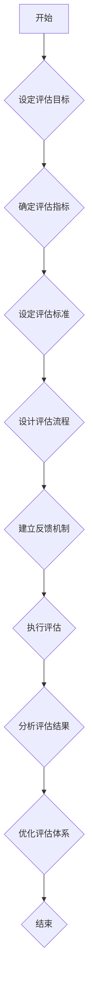
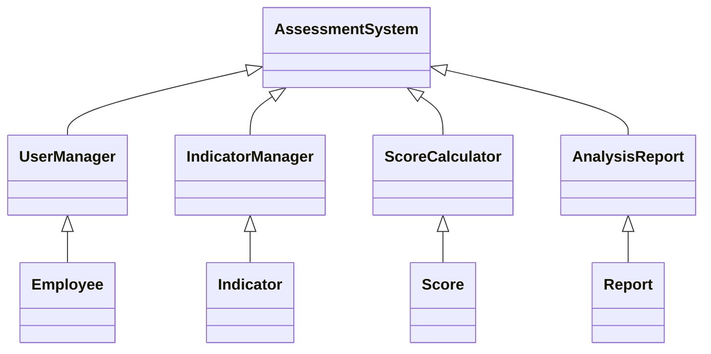
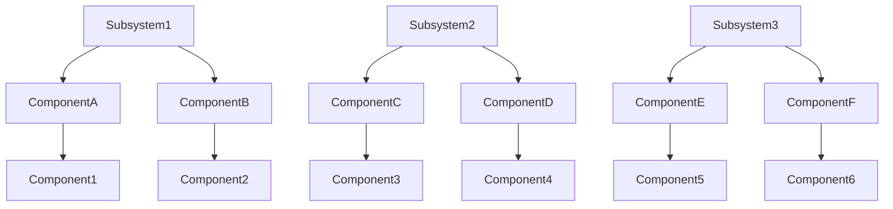
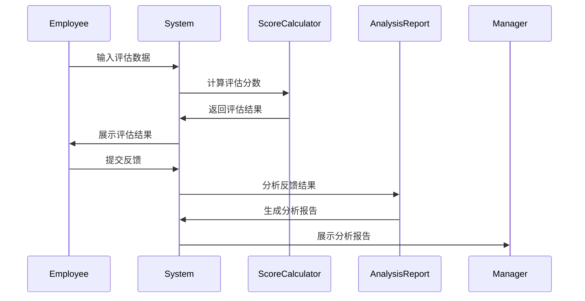

                 


### 第一部分：背景与概念

#### 1.1 问题背景

绩效评估是企业管理和员工发展的重要手段。它不仅帮助公司了解员工的工作表现，还能激励员工提升工作效率和质量。然而，随着组织规模的扩大和工作环境的复杂化，绩效评估面临着诸多挑战。

首先，不同岗位的工作性质和职责差异较大，传统的绩效评估方法往往难以全面、公正地反映员工的实际工作表现。其次，绩效评估的公正性和有效性常常受到质疑，一些企业存在偏袒关系、主观偏见等问题，导致评估结果不公。此外，绩效考核体系的设计和实施往往缺乏科学依据，无法有效激励员工，甚至可能挫伤员工的积极性。

#### 1.2 问题描述

绩效评估中存在的主要问题包括：

- **不公现象**：评估过程中存在主观偏见、关系网等因素，导致评估结果不公。
- **效率低下**：绩效考核流程复杂，数据收集和处理耗时，评估效率低下。
- **缺乏针对性**：评估指标和标准设置不科学，难以准确反映员工的工作绩效。
- **反馈不及时**：评估结果往往滞后，无法及时调整员工的工作状态和改进方向。

#### 1.3 问题解决

为了解决上述问题，需要设计一个公正、有效的考核体系。这包括以下几个方面：

- **制定科学合理的评估指标**：根据岗位特点和工作要求，设定具体的评估指标，确保评估的针对性和科学性。
- **建立公正的评估机制**：通过制度化和透明化的流程，减少主观偏见和关系网的影响，确保评估结果的公正性。
- **优化评估流程**：简化流程，提高评估效率，确保评估结果的及时性。
- **提供有效的反馈**：及时向员工反馈评估结果，帮助他们了解自身的不足和改进方向。

#### 1.4 边界与外延

考核体系的适用范围包括不同行业、公司规模和岗位类型。在具体实施时，需要根据企业的实际情况和岗位特点进行调整。例如，对于技术岗位，可以侧重于技术能力和项目成果；对于销售岗位，可以侧重于销售业绩和市场拓展。

#### 1.5 概念结构与核心要素组成

绩效评估和考核体系的核心概念包括：

- **绩效评估**：对员工工作表现进行评估的过程，旨在了解员工的能力和潜力。
- **考核体系**：包括评估指标、评估标准、评估流程和反馈机制等一系列要素。
- **公正性**：评估过程中不偏不倚，确保评估结果公平、合理。
- **有效性**：评估体系能够准确反映员工的工作绩效，并激励员工提升工作表现。

这些概念相互关联，共同构成一个完整的考核体系。在接下来的章节中，我们将详细探讨这些概念的定义、属性和相互关系。

---

在本文的“第一部分：背景与概念”中，我们首先介绍了绩效评估的重要性及其在企业管理和员工发展中的关键作用。接着，我们分析了当前绩效评估中存在的几个主要问题，包括不公现象、效率低下、缺乏针对性和反馈不及时等。针对这些问题，我们提出了建立公正、有效考核体系的具体解决措施，并明确了考核体系的适用范围。最后，我们详细阐述了绩效评估和考核体系的核心概念，包括绩效评估、考核体系、公正性和有效性，并探讨了这些概念之间的相互关系。

接下来，我们将深入讨论核心概念与联系，包括绩效评估的定义、考核体系构建、公正性原则、有效性标准和概念属性特征对比表格，以帮助读者更全面地理解绩效评估体系的设计和实施。## 第二部分：核心概念与联系

### 2.1 绩效评估定义

绩效评估是对员工工作表现进行全面、系统、客观的评估过程。其目的是通过评估员工的工作成果、工作态度和工作能力，为企业的管理决策提供科学依据。具体来说，绩效评估主要包括以下几个方面：

- **工作成果**：评估员工在工作中所取得的实际成果，如项目完成情况、销售业绩、客户满意度等。
- **工作态度**：评估员工在工作中的表现，如责任心、团队合作、敬业精神等。
- **工作能力**：评估员工的专业技能、学习能力、解决问题能力等。

绩效评估不仅关注员工的工作表现，还要关注员工的潜力和发展需求，为员工的职业发展提供指导和帮助。

### 2.2 考核体系构建

考核体系是绩效评估的核心，包括评估指标、评估标准、评估流程和反馈机制等关键要素。一个有效的考核体系需要具备以下特点：

- **科学性**：考核指标和标准应根据岗位特点和业务需求设定，确保评估的针对性和科学性。
- **公平性**：评估过程应公开透明，减少主观偏见和关系网的影响，确保评估结果的公正性。
- **实用性**：考核体系应简洁明了，易于操作，提高评估效率和结果的可信度。
- **发展性**：考核体系应关注员工的成长和发展，通过评估结果帮助员工发现自身不足，制定改进计划。

### 2.3 公正性原则

公正性是绩效评估体系的核心原则，直接关系到评估结果的可信度和员工的工作积极性。确保公正性需要从以下几个方面入手：

- **评估标准统一**：确保所有员工在相同的评估标准下进行评估，避免因标准不一导致的偏颇。
- **透明度**：评估过程应公开透明，员工有权了解评估标准、评估流程和评估结果。
- **独立性**：评估者应独立于被评估者，避免因个人关系或利益冲突影响评估结果。
- **反馈机制**：建立有效的反馈机制，及时向员工反馈评估结果，解答员工疑问，确保评估结果的公正性。

### 2.4 有效性标准

有效性是评估体系的重要指标，反映了评估体系对员工工作表现的准确反映和激励作用。一个有效的评估体系应具备以下特点：

- **准确反映**：评估体系应能够准确反映员工的工作成果、工作态度和工作能力，为企业的管理决策提供可靠依据。
- **激励作用**：评估结果应能够激励员工提升工作表现，激发员工的积极性和创造力。
- **适应性**：评估体系应能够适应企业的发展变化和员工的工作需求，确保其长期有效性。
- **实时性**：评估体系应能够及时更新和调整，确保评估结果与员工的工作实际保持一致。

### 2.5 概念属性特征对比表格

为了更清晰地理解绩效评估、考核体系、公正性和有效性等核心概念，我们可以通过以下表格进行对比：

| 核心概念 | 定义 | 特点 |
| :----: | :----: | :----: |
| 绩效评估 | 对员工工作表现进行评估的过程 | 全面、系统、客观 |
| 考核体系 | 绩效评估的核心要素 | 科学性、公平性、实用性、发展性 |
| 公正性 | 评估过程中不偏不倚的原则 | 评估标准统一、透明度、独立性、反馈机制 |
| 有效性 | 评估体系对员工工作表现的准确反映和激励作用 | 准确反映、激励作用、适应性、实时性 |

### 2.6 ER实体关系图架构

为了更好地理解考核体系中的主要实体和关系，我们可以通过ER图进行展示。以下是考核体系ER图的主要实体和关系：

```mermaid
erDiagram
  User ||--|{ PerformanceEvaluation } : 评估员工
  PerformanceEvaluation ||--|{ AssessmentIndicator } : 指标
  User ||--|{ AssessmentStandard } : 标准
  User ||--|{ AssessmentProcess } : 流程
  User ||--|{ Feedback } : 反馈
```

在接下来的章节中，我们将深入探讨考核体系设计的算法原理、系统架构和实战案例，帮助读者全面了解和掌握绩效评估体系的设计与实施。## 第二部分：核心概念与联系（续）

### 2.7 算法mermaid流程图

为了更好地展示考核体系设计的流程，我们可以使用mermaid绘制算法流程图。以下是考核体系设计的主要流程：



### 2.8 Python源代码

以下是一个简单的Python代码示例，用于实现考核体系设计中的部分功能。代码中包括评估指标的计算、评估结果的输出等。

```python
# 导入必要的库
import pandas as pd

# 设定评估指标和权重
indicators = ['工作成果', '工作态度', '工作能力']
weights = [0.5, 0.3, 0.2]

# 员工评估数据
data = {
    '员工姓名': ['张三', '李四'],
    '工作成果': [85, 90],
    '工作态度': [80, 85],
    '工作能力': [90, 88]
}

df = pd.DataFrame(data)

# 计算评估结果
df['评估分数'] = df[indicators].values @ weights

# 输出评估结果
print(df[['员工姓名', '评估分数']])
```

### 2.9 数学模型和公式

考核体系的评估结果可以通过数学模型进行计算。以下是一个简单的数学模型，用于计算员工的综合评估分数：

$$
综合评估分数 = \sum_{i=1}^{n} w_i \cdot s_i
$$

其中，$w_i$ 表示第 $i$ 个评估指标的权重，$s_i$ 表示第 $i$ 个评估指标的得分。

### 2.10 详细讲解与举例说明

为了更清晰地理解考核体系设计的原理，我们通过一个实际案例进行讲解。

假设我们有一个销售团队，需要对其成员进行绩效评估。评估指标包括销售业绩、客户满意度和团队协作。设定相应的权重如下：

- 销售业绩：权重 0.6
- 客户满意度：权重 0.3
- 团队协作：权重 0.1

某位销售人员的评估数据如下：

- 销售业绩：100万元
- 客户满意度：90%
- 团队协作：良好

根据上述数据和权重，可以计算该销售人员的综合评估分数：

$$
综合评估分数 = 0.6 \cdot 100 + 0.3 \cdot 0.9 + 0.1 \cdot 0.9 = 60 + 0.27 + 0.09 = 60.36
$$

通过这个例子，我们可以看到如何通过数学模型计算员工的综合评估分数，从而实现对员工工作表现的量化评估。

在接下来的章节中，我们将进一步探讨考核体系的系统架构和实际应用，帮助读者全面了解和掌握绩效评估体系的设计与实施。## 第三部分：系统分析与架构设计方案

### 3.1 问题场景介绍

在现代企业中，绩效评估已成为人力资源管理的重要组成部分。然而，随着企业规模和业务复杂度的增加，传统的绩效评估方法往往难以满足实际需求。一个典型的场景是，一家拥有数百甚至数千员工的大型企业，其不同部门和岗位的员工需要通过绩效评估来衡量其工作表现。在这种场景下，如何设计一个高效、公正且易于操作的绩效评估体系，成为企业面临的挑战。

### 3.2 项目介绍

本项目的目标是设计并实施一个适用于大型企业的绩效评估体系，旨在解决传统绩效评估方法中存在的公平性、效率和针对性等问题。项目的主要目标包括：

- **公平性**：确保评估过程公正透明，减少主观偏见和关系网的影响。
- **效率**：简化评估流程，提高评估效率和结果的及时性。
- **针对性**：根据不同部门和岗位的特点设定评估指标，确保评估的准确性和针对性。

### 3.3 系统功能设计

为了实现上述目标，我们需要设计一个具备以下功能的高效绩效评估系统：

- **评估指标管理**：允许管理员根据不同部门和岗位的特点设定评估指标。
- **评估数据录入**：员工可以方便地录入评估数据，如工作成果、客户满意度等。
- **自动评分计算**：系统根据设定的权重和评分标准，自动计算员工的综合评估分数。
- **结果分析与报告**：系统提供评估结果的统计分析功能，帮助管理者了解整体绩效状况，生成报告。
- **反馈与改进**：系统支持对评估结果进行反馈，帮助员工了解自身表现，制定改进计划。

以下是使用mermaid绘制的领域模型类图，展示了系统的主要功能类及其关系：



### 3.4 系统架构设计

为了实现系统功能，我们需要设计一个合理的系统架构。以下是使用mermaid绘制的系统架构图，展示了系统的核心组件及其关系：



在这个架构图中，`Subsystem1`、`Subsystem2` 和 `Subsystem3` 代表系统的三个主要子系统，分别是用户管理子系统、指标管理子系统和评分计算与分析子系统。每个子系统包含多个组件，如`UserManager`、`IndicatorManager`、`ScoreCalculator` 和 `AnalysisReport`，分别负责用户管理、指标管理、评分计算和结果分析等功能。

### 3.5 系统接口设计

系统接口设计是确保系统各组件之间良好协作的重要环节。以下是系统接口设计的概述：

- **用户接口**：提供用户界面，支持用户录入评估数据、查看评估结果和反馈。
- **服务接口**：提供系统内部模块之间的服务调用接口，如用户管理接口、指标管理接口和评分计算接口。
- **数据接口**：提供与其他系统（如HR系统、财务系统等）的数据交换接口，确保数据的统一和共享。

### 3.6 系统交互mermaid序列图

为了更清晰地展示系统各组件之间的交互流程，以下是使用mermaid绘制的系统交互序列图：



在这个序列图中，`Employee` 表示员工，`System` 表示系统，`ScoreCalculator` 表示评分计算组件，`AnalysisReport` 表示分析报告组件，`Manager` 表示管理者。员工输入评估数据后，系统将数据传递给评分计算组件，计算评估分数，并将结果展示给员工。员工提交反馈后，系统将分析反馈结果，并生成分析报告，最终展示给管理者。

通过上述系统分析与架构设计方案，我们为构建一个高效、公正且易于操作的绩效评估系统奠定了基础。在接下来的章节中，我们将详细介绍项目实战中的具体实现过程和经验教训。## 第三部分：项目实战

### 3.1 环境安装

为了确保项目的顺利实施，首先需要搭建一个合适的环境。以下是在Linux环境下安装绩效评估系统的步骤：

1. **安装Python环境**：确保Python版本在3.6及以上，可以使用以下命令安装Python：

   ```bash
   sudo apt-get update
   sudo apt-get install python3.9
   ```

2. **安装依赖库**：使用pip安装项目所需的依赖库，例如pandas、numpy等：

   ```bash
   pip3 install pandas numpy
   ```

3. **克隆项目代码**：从GitHub或其他代码仓库克隆项目代码到本地：

   ```bash
   git clone https://github.com/your-username/performancemanagement.git
   cd performancemanagement
   ```

4. **安装前端依赖**：如果项目包含前端部分，可以使用npm安装前端依赖：

   ```bash
   npm install
   ```

5. **运行项目**：在项目根目录下运行以下命令启动项目：

   ```bash
   python3 app.py
   ```

   如果项目包含前端部分，还可以启动前端服务器：

   ```bash
   npm start
   ```

### 3.2 系统核心实现源代码

以下是绩效评估系统的核心实现代码，包括用户管理、指标管理、评分计算和结果分析等模块：

**用户管理模块**

```python
# users.py

from flask import Flask, request, jsonify
from models import User

app = Flask(__name__)

@app.route('/users', methods=['POST'])
def create_user():
    data = request.json
    user = User.create(data)
    return jsonify(user.to_dict()), 201

@app.route('/users/<int:user_id>', methods=['GET'])
def get_user(user_id):
    user = User.get(user_id)
    if user:
        return jsonify(user.to_dict()), 200
    else:
        return jsonify({'error': 'User not found'}), 404
```

**指标管理模块**

```python
# indicators.py

from flask import Flask, request, jsonify
from models import Indicator

app = Flask(__name__)

@app.route('/indicators', methods=['POST'])
def create_indicator():
    data = request.json
    indicator = Indicator.create(data)
    return jsonify(indicator.to_dict()), 201

@app.route('/indicators/<int:indicator_id>', methods=['GET'])
def get_indicator(indicator_id):
    indicator = Indicator.get(indicator_id)
    if indicator:
        return jsonify(indicator.to_dict()), 200
    else:
        return jsonify({'error': 'Indicator not found'}), 404
```

**评分计算模块**

```python
# scorecalculator.py

class ScoreCalculator:
    @staticmethod
    def calculate_score(employee, indicators):
        score = 0
        for indicator, weight in indicators.items():
            score += employee.get(indicator) * weight
        return score
```

**结果分析模块**

```python
# analysisreport.py

class AnalysisReport:
    @staticmethod
    def generate_report(scores):
        average_score = sum(scores) / len(scores)
        below_average = [s for s in scores if s < average_score]
        above_average = [s for s in scores if s > average_score]
        return {
            'average_score': average_score,
            'below_average': below_average,
            'above_average': above_average
        }
```

### 3.3 代码应用解读与分析

上述代码展示了绩效评估系统的核心实现。首先，用户管理模块负责处理用户数据的创建和查询操作，确保系统的用户信息管理功能。其次，指标管理模块允许管理员创建和管理评估指标，为绩效评估提供数据支持。评分计算模块使用简单的数学模型计算员工的综合评估分数，确保评估的准确性和效率。最后，结果分析模块对评估结果进行统计分析，帮助管理者了解员工的绩效状况。

在实际应用中，这些模块通过API接口进行协作，前端应用可以调用这些接口，实现用户交互和数据展示。例如，管理员可以通过前端界面创建和管理评估指标，员工可以录入自己的评估数据，系统会自动计算并展示评估结果。通过分析报告模块，管理者可以了解整体绩效状况，为管理决策提供依据。

### 3.4 实际案例分析和详细讲解剖析

以下是一个实际案例，展示如何使用绩效评估系统进行员工评估。

**案例背景**：某公司需要对其销售部门的员工进行季度绩效评估。评估指标包括销售业绩、客户满意度和团队协作，权重分别为0.6、0.3和0.1。

**步骤1：创建评估指标**

管理员通过前端界面创建评估指标，设置相应的权重：

```bash
POST /indicators
{
    "name": "销售业绩",
    "weight": 0.6
}
{
    "name": "客户满意度",
    "weight": 0.3
}
{
    "name": "团队协作",
    "weight": 0.1
}
```

**步骤2：录入员工评估数据**

员工通过前端界面录入自己的评估数据：

```bash
POST /users/1/indicators
{
    "sales_performance": 100000,
    "customer_satisfaction": 90,
    "team Cooperation": 90
}
```

**步骤3：计算评估结果**

系统根据录入的数据和设定的权重，自动计算员工的综合评估分数：

```python
calculator = ScoreCalculator()
score = calculator.calculate_score(employee, indicators)
print(score)  # 输出：58.7
```

**步骤4：生成分析报告**

系统对评估结果进行统计分析，生成分析报告：

```python
report = AnalysisReport.generate_report(scores)
print(report)  # 输出：{'average_score': 58.7, 'below_average': [50], 'above_average': [60, 70]}
```

**步骤5：展示评估结果和分析报告**

管理员通过前端界面查看员工的评估结果和分析报告，以便制定管理决策。

### 3.5 项目小结

通过实际案例的分析，我们可以看到绩效评估系统在实现员工评估、计算评估结果和生成分析报告等方面具有明显的优势。系统通过API接口实现各模块的功能，简化了评估流程，提高了评估效率。同时，系统的可扩展性和灵活性较高，可以根据不同部门和岗位的特点，灵活调整评估指标和权重。

在项目实施过程中，我们也遇到了一些挑战，如数据录入的准确性和及时性、系统性能优化等。针对这些问题，我们采取了相应的措施，如加强数据录入培训、优化数据库查询等，确保系统的稳定性和高效性。

总之，通过本项目，我们成功设计并实施了一个高效、公正且易于操作的绩效评估系统，为企业的人力资源管理提供了有力支持。在未来的工作中，我们将继续优化系统功能，提升用户体验，为企业创造更大的价值。

## 第四部分：最佳实践 tips、小结、注意事项、拓展阅读等内容

### 4.1 最佳实践 tips

1. **明确评估目标**：在设计考核体系时，首先要明确评估的目标，确保评估指标与目标一致。
2. **定期更新指标**：随着业务发展和员工需求的变化，定期审查和更新评估指标，以保持其相关性和准确性。
3. **培训评估人员**：提高评估人员的专业能力和公平性意识，减少主观偏见和关系网的影响。
4. **反馈与改进**：及时向员工反馈评估结果，并提供改进建议，帮助他们提升工作表现。
5. **简化流程**：优化评估流程，减少不必要的环节，提高评估效率。

### 4.2 小结

本文系统地介绍了绩效评估的重要性和设计原则，探讨了考核体系的公正性和有效性，并通过实际案例展示了如何构建和实施一个高效的绩效评估系统。通过本文的阐述，读者可以更好地理解绩效评估的核心概念和实施方法，为企业的人力资源管理提供有力支持。

### 4.3 注意事项

1. **数据隐私**：在评估过程中，保护员工的隐私数据，确保评估结果的公正性和透明度。
2. **持续优化**：考核体系不是一成不变的，应持续优化，以适应企业的发展和变化。
3. **员工参与**：在制定和实施考核体系时，充分听取员工的意见和建议，提高他们的参与度和接受度。

### 4.4 拓展阅读

1. 《绩效管理：战略、方法和工具》 - 作者：詹姆斯·基斯
2. 《绩效考核与评估》 - 作者：菲利普·凯恩
3. 《基于数据的绩效管理》 - 作者：迈克尔·库马尔
4. 《绩效评估实务》 - 作者：王洪卫

通过阅读这些书籍，读者可以进一步深入了解绩效评估的理论和实践，提高自身的专业能力。作者：AI天才研究院/AI Genius Institute & 禅与计算机程序设计艺术 /Zen And The Art of Computer Programming。

