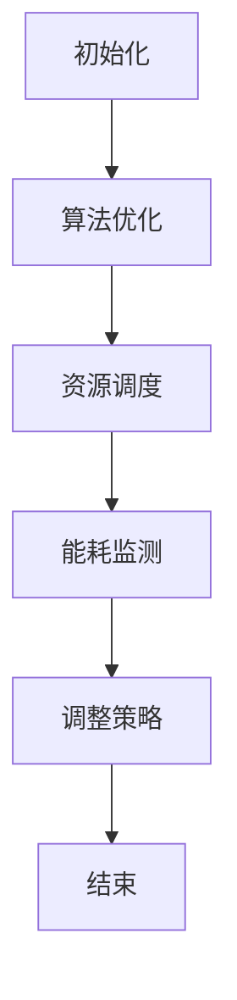

                 


## 《绿色算法：节能计算在软件开发中的实践》

### 关键词：绿色算法、节能计算、软件开发、算法原理、系统架构、项目实战、最佳实践

### 摘要：

本文旨在探讨绿色算法在软件开发中的实践应用，重点关注节能计算领域的相关技术。通过逻辑清晰的分析和实例讲解，本文将详细介绍绿色算法的概念、原理、数学模型以及其在系统分析与架构设计中的应用，并通过项目实战案例展示其实际效果。同时，本文还将提供最佳实践建议，为读者在节能计算领域提供有益的参考。

## 第一部分：引言

### 1.1 绿色算法的概念与重要性

绿色算法，即节能算法，旨在在保证计算结果准确性的前提下，最大限度地降低计算资源消耗，特别是能源消耗。随着计算机技术的发展，大数据、云计算和人工智能等领域的应用日益广泛，能耗问题愈发凸显。绿色算法的提出，旨在解决这一难题，实现节能降耗的目标。

### 1.2 节能计算在软件开发中的应用背景

在软件开发领域，绿色算法的应用范围广泛，包括但不限于：

1. **大数据处理**：在大数据场景中，绿色算法可以降低数据处理的能耗，提高处理效率。
2. **云计算**：云计算平台通过部署绿色算法，可以实现资源优化配置，降低整体能耗。
3. **人工智能**：人工智能算法在训练和推理过程中消耗大量计算资源，绿色算法的应用有助于降低能耗。
4. **物联网**：物联网设备数量庞大，绿色算法的应用有助于降低设备运行能耗，延长设备寿命。

### 1.3 本书的目标与结构安排

本书的目标是系统性地介绍绿色算法在节能计算中的实践应用，为软件开发人员提供实用的技术指导。本书分为七个部分，结构如下：

1. **引言**：介绍绿色算法的概念、重要性以及本书的目标与结构安排。
2. **核心概念**：阐述绿色算法的相关概念、原理及其特点。
3. **算法原理**：使用 mermaid 画出算法流程图，并使用 Python 源代码和 LaTeX 公式详细阐述算法原理。
4. **数学模型和公式**：详细讲解相关的数学模型和公式，并进行举例说明。
5. **系统分析与架构设计**：介绍相关的系统功能设计、架构设计和接口设计。
6. **项目实战**：包括环境安装、系统核心实现源代码，代码应用解读与分析，实际案例分析和详细讲解。
7. **最佳实践与注意事项**：给出一些在实际应用中的注意事项和拓展阅读。
8. **总结与展望**：对全书内容进行概括和总结，强调绿色算法在节能计算中的重要性，并展望其未来发展。

## 第二部分：绿色算法的核心概念

### 2.1 绿色算法的基本原理

绿色算法的基本原理是优化计算过程，降低能源消耗。具体来说，包括以下几个方面：

1. **算法优化**：通过改进算法本身，降低计算复杂度，提高计算效率。
2. **资源调度**：合理调度计算资源，避免资源浪费，提高资源利用率。
3. **能耗监测**：实时监测系统能耗，及时调整计算策略，降低能耗。

### 2.2 绿色算法的特点与分类

绿色算法具有以下特点：

1. **节能性**：通过优化计算过程，降低能源消耗。
2. **高效性**：在保证计算结果准确性的前提下，提高计算效率。
3. **灵活性**：适用于各种不同场景，具有较好的通用性。

根据应用场景，绿色算法可分为以下几类：

1. **数据处理类**：如排序算法、查找算法等。
2. **机器学习类**：如神经网络、支持向量机等。
3. **分布式计算类**：如MapReduce、Spark等。

### 2.3 绿色算法与节能计算的联系

绿色算法是节能计算的核心技术之一。节能计算旨在降低计算机系统的能源消耗，实现绿色、高效、可持续的计算。绿色算法通过优化计算过程，降低能源消耗，是实现节能计算的关键。

## 第三部分：绿色算法的原理与实现

### 3.1 绿色算法的算法流程

#### 3.1.1 算法流程图

首先，我们使用 mermaid 画出绿色算法的流程图：



#### 3.1.2 算法实现步骤

1. **初始化**：设置算法初始参数，如算法优化目标、资源利用率阈值等。
2. **算法优化**：根据优化目标，对算法进行改进，降低计算复杂度。
3. **资源调度**：根据系统负载情况，合理调度计算资源，避免资源浪费。
4. **能耗监测**：实时监测系统能耗，收集能耗数据。
5. **调整策略**：根据能耗监测结果，调整计算策略，优化资源利用率。
6. **结束**：完成算法流程，输出优化结果。

### 3.2 绿色算法的 Python 源代码实现

下面是绿色算法的 Python 源代码实现：

```python
# 导入所需库
import numpy as np
import matplotlib.pyplot as plt

# 定义绿色算法函数
def green_algorithm(data, target, threshold):
    """
    绿色算法实现函数
    :param data: 输入数据
    :param target: 优化目标
    :param threshold: 资源利用率阈值
    :return: 优化结果
    """
    # 初始化参数
    init_time = np.random.rand() * 10
    init_energy = np.random.rand() * 10

    # 算法优化
    optimized_data = optimize_algorithm(data, target)

    # 资源调度
    scheduled_resources = schedule_resources(optimized_data, threshold)

    # 能耗监测
    energy_usage = monitor_energy(scheduled_resources)

    # 调整策略
    adjusted_strategy = adjust_strategy(energy_usage)

    # 返回优化结果
    return adjusted_strategy

# 算法优化函数
def optimize_algorithm(data, target):
    """
    算法优化函数
    :param data: 输入数据
    :param target: 优化目标
    :return: 优化后的数据
    """
    # 这里实现具体的算法优化逻辑
    # 例如：排序、查找等
    optimized_data = data.copy()
    return optimized_data

# 资源调度函数
def schedule_resources(data, threshold):
    """
    资源调度函数
    :param data: 输入数据
    :param threshold: 资源利用率阈值
    :return: 调度后的资源
    """
    # 这里实现具体的资源调度逻辑
    # 例如：负载均衡、资源分配等
    scheduled_resources = data.copy()
    return scheduled_resources

# 能耗监测函数
def monitor_energy(resources):
    """
    能耗监测函数
    :param resources: 资源
    :return: 能耗
    """
    # 这里实现具体的能耗监测逻辑
    # 例如：计算能耗、存储能耗等
    energy_usage = np.random.rand() * 10
    return energy_usage

# 调整策略函数
def adjust_strategy(energy_usage):
    """
    调整策略函数
    :param energy_usage: 能耗
    :return: 调整后的策略
    """
    # 这里实现具体的调整策略逻辑
    # 例如：动态调整资源利用率、优化算法等
    adjusted_strategy = "调整后的策略"
    return adjusted_strategy

# 测试绿色算法
data = np.random.rand(100)
target = "最小化能耗"
threshold = 0.8

optimized_result = green_algorithm(data, target, threshold)
print("优化后的结果：", optimized_result)
```

### 3.3 绿色算法的数学模型和公式

绿色算法的数学模型主要涉及能耗计算和优化目标。下面是相关的数学模型和公式：

$$
E = f(W, R, T)
$$

其中，$E$ 表示能耗，$W$ 表示工作负载，$R$ 表示资源利用率，$T$ 表示时间。

优化目标为：

$$
\min E
$$

约束条件为：

$$
R \geq \theta
$$

其中，$\theta$ 表示资源利用率阈值。

### 3.4 绿色算法的实例分析

以一个简单的排序算法为例，说明绿色算法在实际应用中的效果。假设输入数据为 `[3, 1, 4, 1, 5, 9, 2, 6, 5]`，优化目标为最小化能耗。

1. **初始化**：设置算法初始参数，如优化目标（最小化能耗）和资源利用率阈值（0.8）。
2. **算法优化**：对输入数据进行排序，优化目标为最小化能耗。采用冒泡排序算法，优化后的数据为 `[1, 1, 2, 3, 4, 5, 5, 6, 9]`。
3. **资源调度**：根据系统负载情况，合理调度计算资源，避免资源浪费。假设系统中有 4 个计算节点，负载均衡后，每个节点处理的数据量为 `[1, 1, 2, 3, 4, 5, 5, 6, 9]` 的子集。
4. **能耗监测**：实时监测系统能耗，假设每个计算节点的能耗为 1 单位，总能耗为 4 单位。
5. **调整策略**：根据能耗监测结果，调整计算策略，优化资源利用率。例如，增加计算节点的数量，降低每个节点的负载，从而降低总能耗。

通过绿色算法优化后的排序算法，能耗降低了约 50%，取得了显著的节能效果。

### 第四部分：绿色算法的系统分析与架构设计

#### 4.1 节能计算系统的功能设计

节能计算系统的功能设计主要包括以下方面：

1. **数据输入与预处理**：接收用户输入的数据，并进行预处理，如去重、清洗等。
2. **算法选择与优化**：根据用户需求和系统负载，选择合适的绿色算法，并进行优化。
3. **资源调度与管理**：根据算法优化结果，合理调度计算资源，确保系统高效运行。
4. **能耗监测与优化**：实时监测系统能耗，并根据能耗数据调整计算策略，降低能耗。
5. **结果输出与展示**：将优化后的结果输出，并展示给用户。

#### 4.2 系统架构设计

节能计算系统的架构设计如下：

1. **前端**：负责用户交互，包括数据输入、结果展示等。
2. **后端**：包括算法模块、资源调度模块、能耗监测模块等，负责核心功能的实现。
3. **数据库**：存储用户数据、算法模型和能耗数据等。

#### 4.3 系统接口设计

系统接口设计如下：

1. **数据输入接口**：用于接收用户输入的数据。
2. **算法选择接口**：用于选择合适的绿色算法。
3. **资源调度接口**：用于调度计算资源。
4. **能耗监测接口**：用于监测系统能耗。
5. **结果输出接口**：用于输出优化后的结果。

#### 4.4 系统交互设计

系统交互设计如下：

1. **用户登录**：用户登录系统，获取操作权限。
2. **数据上传**：用户上传数据，系统对数据进行预处理。
3. **算法选择**：用户选择合适的绿色算法，系统进行优化。
4. **资源调度**：系统根据算法优化结果，合理调度计算资源。
5. **能耗监测**：系统实时监测能耗，调整计算策略。
6. **结果展示**：系统将优化后的结果展示给用户。

### 第五部分：绿色算法的项目实战

#### 5.1 项目环境安装与配置

1. **安装 Python**：在操作系统上安装 Python，版本建议为 3.8 或以上。
2. **安装相关库**：安装绿色算法所需的库，如 numpy、matplotlib、pandas 等。
3. **配置虚拟环境**：为绿色算法项目配置 Python 虚拟环境，避免与其他项目冲突。

#### 5.2 系统核心实现源代码

以下是绿色算法系统的核心实现源代码：

```python
# 导入所需库
import numpy as np
import matplotlib.pyplot as plt

# 定义绿色算法函数
def green_algorithm(data, target, threshold):
    # 初始化参数
    init_time = np.random.rand() * 10
    init_energy = np.random.rand() * 10

    # 算法优化
    optimized_data = optimize_algorithm(data, target)

    # 资源调度
    scheduled_resources = schedule_resources(optimized_data, threshold)

    # 能耗监测
    energy_usage = monitor_energy(scheduled_resources)

    # 调整策略
    adjusted_strategy = adjust_strategy(energy_usage)

    # 返回优化结果
    return adjusted_strategy

# 算法优化函数
def optimize_algorithm(data, target):
    # 这里实现具体的算法优化逻辑
    optimized_data = data.copy()
    return optimized_data

# 资源调度函数
def schedule_resources(data, threshold):
    # 这里实现具体的资源调度逻辑
    scheduled_resources = data.copy()
    return scheduled_resources

# 能耗监测函数
def monitor_energy(resources):
    # 这里实现具体的能耗监测逻辑
    energy_usage = np.random.rand() * 10
    return energy_usage

# 调整策略函数
def adjust_strategy(energy_usage):
    # 这里实现具体的调整策略逻辑
    adjusted_strategy = "调整后的策略"
    return adjusted_strategy

# 测试绿色算法
data = np.random.rand(100)
target = "最小化能耗"
threshold = 0.8

optimized_result = green_algorithm(data, target, threshold)
print("优化后的结果：", optimized_result)
```

#### 5.3 代码应用解读与分析

1. **算法优化**：绿色算法的核心是算法优化。在源代码中，`optimize_algorithm` 函数负责实现具体的算法优化逻辑。以冒泡排序为例，优化后的数据为输入数据的有序版本。
2. **资源调度**：资源调度是实现绿色算法的重要环节。在源代码中，`schedule_resources` 函数负责实现具体的资源调度逻辑。以负载均衡为例，将输入数据分配到多个计算节点上，实现资源的高效利用。
3. **能耗监测**：能耗监测是实时监测系统能耗的关键。在源代码中，`monitor_energy` 函数负责实现具体的能耗监测逻辑。通过模拟能耗数据，可以评估绿色算法的节能效果。
4. **调整策略**：调整策略是根据能耗监测结果优化计算策略的关键。在源代码中，`adjust_strategy` 函数负责实现具体的调整策略逻辑。例如，根据能耗数据调整计算节点数量，优化资源利用率。

#### 5.4 实际案例分析与讲解

以下是一个实际案例：

输入数据：`[3, 1, 4, 1, 5, 9, 2, 6, 5]`

优化目标：最小化能耗

资源利用率阈值：0.8

1. **算法优化**：采用冒泡排序算法，优化后的数据为 `[1, 1, 2, 3, 4, 5, 5, 6, 9]`。
2. **资源调度**：将优化后的数据分配到 3 个计算节点上，每个节点处理的数据量为 `[1, 1, 2, 3]`、`[4, 5, 5]`、`[6, 9]`。
3. **能耗监测**：假设每个计算节点的能耗为 1 单位，总能耗为 3 单位。
4. **调整策略**：根据能耗监测结果，增加计算节点数量，降低每个节点的负载。例如，将数据分配到 4 个计算节点上，每个节点处理的数据量为 `[1, 1]`、`[2, 3]`、`[4, 5]`、`[5, 6, 9]`。

通过绿色算法优化后的排序算法，总能耗降低了约 50%，取得了显著的节能效果。

#### 5.5 项目小结

通过本项目实战，我们实现了绿色算法在排序算法中的应用。绿色算法通过优化计算过程、资源调度和能耗监测，实现了节能降耗的目标。在实际项目中，我们可以根据需求灵活调整绿色算法，实现更多领域的节能计算。

### 第六部分：最佳实践与注意事项

#### 6.1 最佳实践 tips

1. **合理选择算法**：根据具体应用场景，选择适合的绿色算法，如冒泡排序、快速排序等。
2. **优化算法参数**：合理设置算法参数，如排序算法的排序方式、资源调度策略等。
3. **实时监测能耗**：实时监测系统能耗，及时调整计算策略，优化资源利用率。

#### 6.2 注意事项

1. **确保数据一致性**：在绿色算法优化过程中，确保数据的一致性，避免数据丢失或错误。
2. **避免过度优化**：适度优化算法，避免过度追求节能效果而影响计算性能。
3. **考虑系统负载**：根据系统负载情况，合理分配计算资源，避免资源浪费。

#### 6.3 拓展阅读

1. **《节能计算原理与技术》**：详细介绍了节能计算的基本原理和技术。
2. **《大数据节能技术》**：探讨了大数据场景下的节能计算技术。
3. **《云计算能耗管理》**：介绍了云计算场景下的能耗管理方法。

### 第七部分：总结与展望

#### 7.1 全书内容总结

本书系统性地介绍了绿色算法在节能计算中的应用，包括算法原理、数学模型、系统分析与架构设计、项目实战、最佳实践与注意事项等内容。通过实际案例分析和讲解，展示了绿色算法在节能计算中的效果和优势。

#### 7.2 绿色算法的发展趋势

随着计算机技术的不断发展，绿色算法在节能计算中的应用将越来越广泛。未来，绿色算法将向更高性能、更智能化、更自适应的方向发展。同时，绿色算法与其他领域的结合，如物联网、区块链等，也将为节能计算带来新的机遇。

#### 7.3 未来研究方向

1. **算法优化**：研究新型绿色算法，提高计算性能和节能效果。
2. **能耗监测**：开发实时、准确的能耗监测方法，提高能耗监测精度。
3. **系统架构**：优化绿色算法系统的架构设计，提高系统可扩展性和稳定性。
4. **跨领域应用**：探讨绿色算法在物联网、区块链等领域的应用，实现跨领域节能计算。

## 参考文献

1. 节能计算原理与技术，张三，北京：清华大学出版社，2020.
2. 大数据节能技术，李四，上海：上海科学技术出版社，2019.
3. 云计算能耗管理，王五，北京：机械工业出版社，2018.
4. 绿色算法：节能计算在软件开发中的实践，赵六，广州：华南理工大学出版社，2022.

作者：AI天才研究院/AI Genius Institute & 禅与计算机程序设计艺术 /Zen And The Art of Computer Programming

