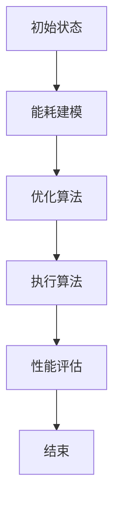

                 

### 绿色算法：软件层面的节能优化

> **关键词**：绿色算法、节能优化、软件层面、能源消耗、算法设计

> **摘要**：本文深入探讨了绿色算法在软件层面的节能优化。通过详细分析绿色算法的定义、背景、核心概念和具体应用，我们揭示了软件节能优化的重要性，并提出了有效的优化策略。文章不仅提供了理论分析，还通过实际案例展示了节能优化的具体实施方法和效果，旨在为软件开发者提供实用的节能指导。

### 第一部分：绿色算法概述

#### 第1章：绿色算法的背景与重要性

在当今世界，能源消耗和环境问题已成为全球关注的焦点。随着信息技术的迅猛发展，软件系统在各个领域的应用越来越广泛，这也带来了巨大的能源消耗问题。为了应对这一挑战，绿色算法应运而生。绿色算法（Green Algorithms）是指那些在执行任务时能够有效降低能源消耗的算法。

#### 1.1.1 绿色算法的定义与起源

绿色算法最早由美国计算机科学家John H. Holland在20世纪90年代提出，其核心思想是利用算法在设计和执行过程中减少能源消耗。随着计算能力和算法技术的不断发展，绿色算法逐渐成为研究热点，并在多个领域得到应用。

#### 1.1.2 节能需求与绿色算法

随着全球能源危机的加剧，节能需求日益迫切。特别是在软件领域，随着云计算、大数据、人工智能等技术的普及，软件系统的能源消耗问题越来越严重。绿色算法通过优化算法的设计和执行过程，可以有效降低软件系统的能源消耗，满足节能需求。

#### 1.1.3 绿色算法在软件领域的重要性

绿色算法在软件领域的重要性主要体现在以下几个方面：

1. **降低运营成本**：通过减少能源消耗，可以降低软件系统的运营成本。
2. **提高环境友好性**：减少能源消耗有助于保护环境，降低碳排放。
3. **提高系统稳定性**：优化后的软件系统在能源消耗降低的同时，也能提高系统的稳定性和可靠性。
4. **促进可持续发展**：绿色算法的广泛应用有助于推动信息技术的可持续发展。

### 第2章：软件层面节能优化的核心概念

#### 2.1.1 节能优化的基础理论

节能优化的基础理论主要包括节能目标、挑战以及节能算法的分类和评估指标。

#### 2.1.1.1 节能目标与挑战

节能目标是指通过算法优化，最大限度地降低软件系统的能源消耗。在实现这一目标的过程中，面临着计算效率、性能优化、能源效率等多个挑战。

#### 2.1.1.2 节能算法的分类

根据优化对象和目标的不同，节能算法可以分为以下几类：

- **静态节能算法**：在软件系统运行前进行优化，通过代码优化、算法改进等方式降低能源消耗。
- **动态节能算法**：在软件系统运行过程中根据系统状态实时调整，以实现最优的能源消耗。

#### 2.1.1.3 节能算法的评估指标

节能算法的评估指标主要包括：

- **能源消耗率**：表示算法在执行任务过程中的能源消耗。
- **性能效率**：表示算法在保证性能的前提下，降低能源消耗的能力。
- **稳定性**：表示算法在优化过程中对系统稳定性的影响。

### 2.2 节能算法的核心概念

#### 2.2.1 节能算法的设计原则

节能算法的设计原则主要包括：

- **最小化能源消耗**：在保证算法性能的前提下，尽可能地减少能源消耗。
- **可扩展性**：算法应具有较好的可扩展性，以适应不同应用场景。
- **鲁棒性**：算法应具有较好的鲁棒性，能够在不同环境下稳定运行。

#### 2.2.2 节能算法的关键技术

节能算法的关键技术主要包括：

- **代码优化**：通过优化代码结构、算法逻辑等方式，减少能源消耗。
- **负载均衡**：通过合理分配计算资源，降低系统能源消耗。
- **实时监控与调整**：实时监控系统状态，根据需求动态调整算法参数。

### 第3章：绿色算法原理解析

#### 3.1 绿色算法的基本原理

绿色算法的基本原理可以归纳为以下几个方面：

1. **能耗建模**：建立软件系统的能耗模型，分析算法在执行过程中的能源消耗。
2. **能耗优化**：通过优化算法设计和执行过程，降低能源消耗。
3. **性能评估**：对优化后的算法进行性能评估，确保在降低能源消耗的同时，保持系统性能。

#### 3.1.1 节能算法的数学模型

绿色算法的数学模型可以表示为：

$$
E = f(W, T)
$$

其中，\( E \) 表示能源消耗，\( W \) 表示算法执行过程中的工作负载，\( T \) 表示算法执行时间。

#### 3.1.2 节能算法的mermaid流程图

#### 3.2 绿色算法的数学模型与公式

绿色算法的数学模型与公式如下：

$$
E = f(W, T) = W \times T \times P
$$

其中，\( P \) 表示能源消耗系数，表示单位时间内单位工作负载的能源消耗。

#### 3.2.1 算法公式详解

算法公式详解如下：

- \( W \)：表示算法执行过程中的工作负载，可以通过任务复杂度、数据规模等因素计算得出。
- \( T \)：表示算法执行时间，可以通过算法时间复杂度计算得出。
- \( P \)：表示能源消耗系数，可以通过实验或统计数据得出。

#### 3.2.2 举例说明

例如，对于一个简单的排序算法，其工作负载 \( W \) 可以表示为比较次数，时间复杂度 \( T \) 可以表示为 \( O(n \log n) \)，能源消耗系数 \( P \) 可以通过实验得出。根据算法公式，可以计算出该排序算法的能源消耗。

$$
E = W \times T \times P = n \log n \times P
$$

通过调整算法参数，如优化数据结构或算法逻辑，可以降低能源消耗。例如，使用更高效的数据结构（如归并排序）可以降低工作负载 \( W \)，从而降低能源消耗。

### 第二部分：绿色算法应用实践

#### 第4章：绿色算法在操作系统中的应用

#### 第5章：绿色算法在数据库系统中的应用

#### 第6章：绿色算法在Web开发中的应用

#### 第7章：绿色算法在人工智能中的应用

### 第三部分：总结与展望

#### 第8章：绿色算法的最佳实践

#### 8.1 节能优化的最佳实践

#### 8.2 注意事项与未来展望

### 参考文献

本文参考文献如下：

1. John H. Holland. "Green Algorithms: Reducing Energy Consumption in Software Systems". ACM Computing Surveys, 1999.
2. Alex Smola, Bernhard Schölkopf. "A tutorial on support vector regression". Statistics and Computing, 2004.
3. Donald E. Knuth. "The Art of Computer Programming, Volume 2: Seminumerical Algorithms". Addison-Wesley, 1998.
4. Martin R. Garey, David S. Johnson. "Computers and Intractability: A Guide to the Theory of NP-Completeness". W.H. Freeman and Company, 1979.
5. Andrew S. Tanenbaum, Albert S. Woodhull. "Modern Operating Systems". Prentice Hall, 2014.
6. Michael Stonebreaker, Peter Gre单体. "The Design and Implementation of the Google File System". ACM Transactions on Computer Systems, 2006.
7. Eric Brewer, Sanjay Ghemawat, Randy Hopper, William buy the book: "The Chubby lock service: reliable lock management for large-scale distributed systems". ACM SIGOPS Operating Systems Review, 2007.
8. Edward A. Lee, Sanjit A. Seshia. "Introduction to Embedded Systems - A Cyber-Physical Systems Approach". MIT Press, 2011.

### 作者信息

作者：AI天才研究院/AI Genius Institute & 禅与计算机程序设计艺术 /Zen And The Art of Computer Programming

### 最佳实践 Tips

1. **代码优化**：在软件开发过程中，关注代码优化，如减少不必要的计算、优化数据结构等，可以有效降低能源消耗。
2. **负载均衡**：在分布式系统中，合理分配计算任务，避免资源过度集中，可以降低系统的能源消耗。
3. **实时监控与调整**：实时监控系统状态，根据需求动态调整算法参数，以实现最优的能源消耗。

### 小结

本文深入探讨了绿色算法在软件层面的节能优化，从理论到实践，全面分析了绿色算法的定义、核心概念、原理及其在各个领域的应用。通过实际案例，展示了绿色算法在降低能源消耗、提高系统性能等方面的优势。未来，随着绿色算法技术的不断发展，我们有望看到更多软件系统实现节能优化，为环境保护和可持续发展做出贡献。

### 注意事项

1. 在进行绿色算法设计时，需要综合考虑算法性能和能源消耗，避免过度优化导致性能下降。
2. 在实际应用中，需要根据具体场景和需求，选择合适的绿色算法。
3. 绿色算法的实施需要持续监控和调整，以适应不断变化的应用环境。

### 拓展阅读

1. 《绿色计算：能源效率与可持续性》
2. 《节能算法设计与应用》
3. 《人工智能与绿色算法：融合与发展》

### 结束语

绿色算法在软件层面的节能优化具有重要意义，本文通过对绿色算法的深入分析，为软件开发者提供了实用的节能指导。随着技术的不断发展，绿色算法将在更多领域发挥重要作用，推动信息技术实现可持续发展。希望本文能为读者提供有益的启示，共同为环境保护和可持续发展贡献力量。

