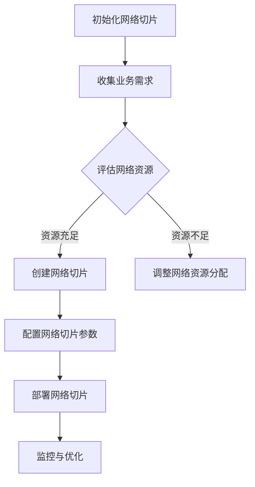
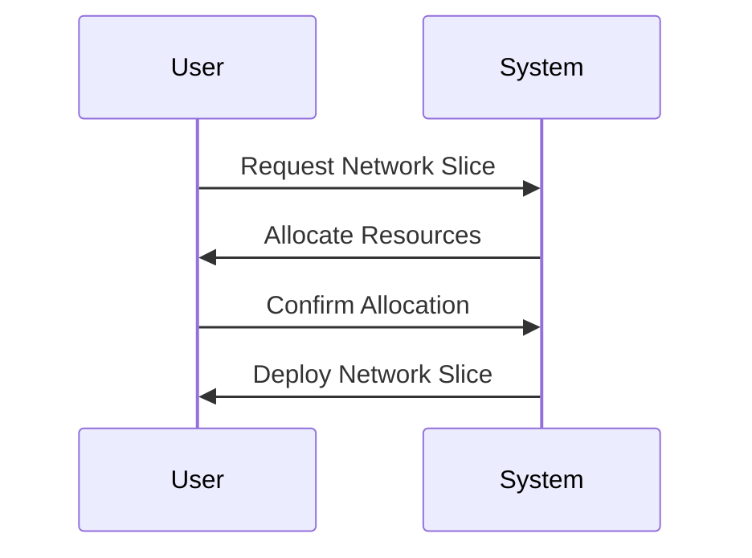
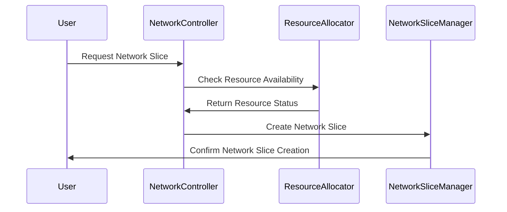
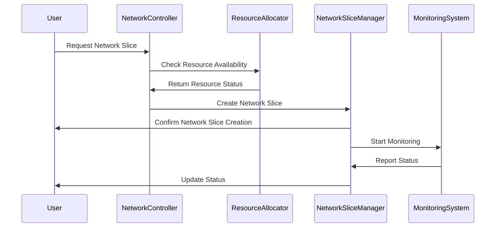

                 

# 网络切片技术：5G网络的核心能力

关键词：网络切片、5G、AI大模型、算法原理、系统分析与架构设计

摘要：本文将深入探讨网络切片技术，尤其是其在5G网络中的应用，分析其核心概念、算法原理以及系统架构设计。通过逐步分析，我们旨在揭示网络切片技术的本质，解释其如何满足多样化网络服务的需求，并展望其在未来网络技术发展中的潜在作用。

## 目录大纲设计

### 一、背景介绍

#### 1.1 网络切片技术概述

#### 1.2 网络切片核心概念与联系

#### 1.3 网络切片技术算法原理

#### 1.4 系统分析与架构设计方案

## 一、背景介绍

### 1.1 网络切片技术概述

随着移动互联网的迅猛发展，用户对网络服务的需求日益多样化。传统的单一网络架构已无法满足日益增长的网络服务质量（QoS）要求。为了应对这一挑战，网络切片技术应运而生。

#### 问题背景

在当前的互联网环境中，不同类型的业务对网络资源的需求差异显著。例如，视频流媒体服务需要高带宽和低延迟，而物联网（IoT）设备则更关注网络的稳定性和可靠性。传统的网络架构通过统一资源分配方式难以同时满足这些多样化的需求，导致网络资源利用率低下，服务质量无法保障。

#### 问题描述

网络切片技术的出现旨在解决上述问题。网络切片是一种将网络资源划分为多个虚拟网络的技术，每个虚拟网络根据特定的业务需求配置资源，从而实现网络资源的灵活调度和管理。

#### 问题解决

网络切片技术通过以下方式实现上述目标：

1. **定制化资源分配**：根据不同业务场景的需求，为终端用户分配特定的网络资源。
2. **动态资源调整**：网络切片能够实时监控网络状态，根据业务需求动态调整资源分配。
3. **资源隔离**：通过网络切片，实现网络资源的隔离，提高网络的安全性和可靠性。

#### 边界与外延

网络切片技术不仅局限于5G网络，同样适用于4G以及未来的6G网络。此外，随着人工智能（AI）和大数据技术的不断发展，网络切片技术将进一步与这些前沿技术相结合，提升网络智能化水平。

#### 概念结构与核心要素组成

网络切片技术包含以下核心概念和要素：

1. **网络切片概念**：网络切片是将网络资源划分为多个虚拟网络，每个虚拟网络具有独立的属性和服务质量要求。
2. **网络切片实例**：具体实现网络切片的实体，对应于某一特定业务场景。
3. **网络切片模板**：定义网络切片的通用配置，用于快速创建网络切片实例。
4. **网络功能切片**：将网络功能划分为多个虚拟网络，实现网络功能的灵活部署和管理。
5. **用户平面切片**：涉及终端用户的数据传输路径和网络资源分配。
6. **控制平面切片**：网络控制平面的虚拟化，实现网络控制功能的独立管理和调度。

### 1.2 网络切片核心概念与联系

#### AI大模型概念

在人工智能领域，大模型指的是具有极高参数量和强大计算能力的预训练模型，如GPT-3、BERT等。这些模型能够处理大规模数据，并在多种任务中实现出色的性能。AI大模型的出现推动了人工智能技术的发展，使得机器学习在自然语言处理、计算机视觉等领域取得了重大突破。

#### 网络切片属性特征对比表格

| 特征           | 网络切片               | AI大模型                |
| ------------- | ------------------- | --------------------- |
| 服务质量保障   | 根据业务需求分配网络资源    | 针对不同任务进行训练，实现高精度预测 |
| 灵活性         | 网络资源的动态分配和管理   | 模型的适应性和泛化能力          |
| 网络效率       | 提高网络资源利用率         | 提高数据处理速度和准确性          |
| 安全性         | 实现网络资源的隔离和保护    | 防范和应对攻击，确保数据安全        |

#### ER实体关系图架构的 Mermaid 流程图

```mermaid
erDiagram
  NetworkSlice ||--|{ AI 大模型 : 使用网络切片资源进行训练和应用 }
```

### 1.3 网络切片技术算法原理

网络切片技术涉及多个核心算法，用于实现网络资源的动态分配、优化和调度。以下是一个简单的网络切片算法流程图：



#### 算法原理的数学模型和公式

1. **服务质量满足率**：

   $$ QoS_{满足率} = \frac{满足服务质量要求的网络切片数}{总网络切片数} $$

2. **资源利用率**：

   $$ 资源利用率 = \frac{实际使用资源}{总可用资源} $$

#### 详细讲解和举例说明

假设某网络中有10个应用，分别对网络资源有不同需求：

- 5个应用需要高带宽
- 3个应用需要低延迟
- 2个应用需要高可靠性

网络切片算法会根据这些需求动态分配资源，确保每个应用都能得到满足其需求的服务质量。

### 1.4 系统分析与架构设计方案

#### 问题场景介绍

某企业需要为多个业务场景提供定制化的网络切片服务，如实时视频传输、工业物联网、远程医疗等，确保数据传输的实时性和可靠性。

#### 项目介绍

该项目旨在实现一个高效、灵活的网络切片管理系统，支持多种业务场景的个性化需求。系统将采用最新的5G技术，结合人工智能和大数据分析，实现网络资源的智能调度和管理。

#### 系统功能设计（领域模型Mermaid类图）

```mermaid
classDiagram
  Class01 <|-- Class02
  Class03 : +setAttr(attr:Type)
  Class04 : +getAttr():Type
  Class05 <..|{ User } User <<|{ login } : Username, Password }
```

#### 系统架构设计（Mermaid架构图）



#### 系统接口设计和系统交互（Mermaid序列图）



## 二、核心概念与联系

### 1.2 网络切片核心概念与联系

网络切片技术是5G网络的核心能力之一，它使得网络能够为不同的业务和应用提供定制化的服务。为了深入理解网络切片，我们需要先了解一些核心概念，并分析它们之间的联系。

#### AI大模型概念

在人工智能领域，AI大模型指的是具有极高参数量和强大计算能力的预训练模型，如GPT-3、BERT等。这些模型通过在大量数据上进行训练，能够实现高度复杂的任务，如自然语言生成、图像识别等。AI大模型的出现极大地推动了人工智能技术的发展，使得机器学习在多个领域取得了显著成果。

#### 网络切片属性特征对比表格

| 特征           | 网络切片               | AI大模型                |
| ------------- | ------------------- | --------------------- |
| 服务质量保障   | 根据业务需求分配网络资源    | 针对不同任务进行训练，实现高精度预测 |
| 灵活性         | 网络资源的动态分配和管理   | 模型的适应性和泛化能力          |
| 网络效率       | 提高网络资源利用率         | 提高数据处理速度和准确性          |
| 安全性         | 实现网络资源的隔离和保护    | 防范和应对攻击，确保数据安全        |

从上表可以看出，网络切片和AI大模型在某些方面具有相似的特征，例如它们都强调根据需求进行资源分配和优化，都具备灵活性和效率，同时都注重安全性。然而，网络切片和AI大模型在应用场景和实现方式上有所不同。

#### ER实体关系图架构的 Mermaid 流程图

```mermaid
erDiagram
  NetworkSlice ||--|{ AI 大模型 : 使用网络切片资源进行训练和应用 }
```

在上面的ER实体关系图中，`NetworkSlice`（网络切片）和`AI 大模型`之间存在依赖关系。网络切片为AI大模型提供了所需的网络资源，而AI大模型则利用这些资源进行训练和应用。这种关系体现了网络切片技术在人工智能领域的应用潜力。

### 1.3 网络切片技术算法原理

网络切片技术通过一系列复杂的算法来实现网络资源的动态分配、优化和调度。以下是一个简单的网络切片算法流程图，用于描述网络切片的创建、配置和部署过程。


#### 算法原理的数学模型和公式

1. **服务质量满足率**：

   $$ QoS_{满足率} = \frac{满足服务质量要求的网络切片数}{总网络切片数} $$

2. **资源利用率**：

   $$ 资源利用率 = \frac{实际使用资源}{总可用资源} $$

这些数学模型和公式有助于评估网络切片技术的性能，例如服务质量满足率和资源利用率是衡量网络切片技术效率的重要指标。

#### 详细讲解和举例说明

假设某网络中有10个应用，分别对网络资源有不同需求：

- 5个应用需要高带宽
- 3个应用需要低延迟
- 2个应用需要高可靠性

网络切片算法会根据这些需求动态分配资源，确保每个应用都能得到满足其需求的服务质量。例如，可以优先分配带宽资源给需要高带宽的应用，同时确保低延迟和高可靠性的应用也能获得所需的资源。

### 1.4 系统分析与架构设计方案

网络切片技术在5G网络中的应用，不仅需要强大的算法支持，还需要一个高效、灵活的系统架构来确保其稳定运行。以下将从问题场景介绍、项目介绍、系统功能设计、系统架构设计和系统接口设计等方面，详细阐述网络切片技术的系统分析与架构设计方案。

#### 问题场景介绍

在当前的5G网络环境中，不同的业务场景对网络服务质量（QoS）和网络资源的需求差异显著。例如，实时视频流传输要求高带宽和低延迟，工业物联网（IIoT）需要高可靠性和低时延，而远程医疗则更关注网络的安全性。传统的单一网络架构难以满足这些多样化的需求，导致网络资源利用率低下，服务质量无法保障。因此，网络切片技术的引入变得至关重要，它能够根据不同的业务场景，为不同的应用提供定制化的网络资源，实现网络资源的灵活调度和管理。

#### 项目介绍

本项目的目标是实现一个高效、灵活的网络切片管理系统，以满足多种业务场景的个性化需求。系统将基于5G网络架构，结合人工智能（AI）和大数据分析技术，实现网络资源的智能调度和管理。项目的主要任务包括：

1. **需求分析和功能设计**：根据不同业务场景的需求，设计网络切片管理系统所需的各项功能。
2. **技术选型和架构设计**：选择合适的技术和架构，实现网络切片系统的稳定运行和高效管理。
3. **系统开发和测试**：进行系统开发和测试，确保系统能够满足预期的性能和功能要求。
4. **部署和运维**：将系统部署到实际环境中，并进行持续运维，确保系统的稳定运行和持续优化。

#### 系统功能设计（领域模型Mermaid类图）

领域模型是系统设计的重要组成部分，它能够帮助我们理解系统的核心组件和它们之间的关系。以下是一个简化的领域模型类图，展示了网络切片管理系统的主要组件及其关系。

```mermaid
classDiagram
  Class01 <|-- Class02
  Class03 : +setAttr(attr:Type)
  Class04 : +getAttr():Type
  Class05 <..|{ User } User <<|{ login } : Username, Password }}
```

在上图中，`Class01`和`Class02`是系统的主要类，它们分别代表了网络切片管理系统中的核心组件，如用户管理、资源管理、切片管理和监控模块。`User`类表示系统用户，与其他类之间存在一定的关联关系。

#### 系统架构设计（Mermaid架构图）

系统架构设计是确保网络切片系统高效、稳定运行的关键。以下是一个简化的系统架构图，展示了网络切片管理系统的主要组件及其相互关系。


在上图中，用户通过系统接口请求网络切片，系统接收到请求后，会进行资源分配，并返回资源分配结果。用户确认资源分配后，系统将网络切片部署到实际环境中。

#### 系统接口设计和系统交互（Mermaid序列图）

系统接口设计是确保不同模块之间能够有效交互的关键。以下是一个简化的系统接口和交互序列图，展示了用户、网络控制器、资源分配器和网络切片管理器之间的交互过程。


在上图中，用户向网络控制器请求网络切片，网络控制器会检查资源分配情况，并将结果返回给用户。如果资源分配成功，网络控制器会通知网络切片管理器创建网络切片，并最终将结果返回给用户。

通过上述系统分析与架构设计方案，我们可以看出，网络切片技术在5G网络中的应用具有巨大的潜力。它不仅能够满足不同业务场景的个性化需求，还能够提高网络资源利用率，提升整体网络服务质量。随着5G网络的进一步普及和发展，网络切片技术将在未来网络技术中扮演越来越重要的角色。

### 三、网络切片技术的系统分析与架构设计方案

#### 3.1 问题场景介绍

随着5G网络的迅速发展，网络切片技术作为一种重要的创新，已经成为支持多样化服务和应用的关键。在一个典型的企业环境中，不同业务部门和用户群体对网络服务的需求各不相同。例如，市场营销团队可能需要高带宽和低延迟的传输来支持实时视频会议和在线广告投放，而生产控制部门则更关注网络的稳定性和高可靠性，以确保工业物联网设备的数据传输不中断。此外，远程医疗和智能交通系统等新兴应用也对网络的服务质量提出了更高的要求。传统单一的宽带网络已经难以满足这些多样化的需求，因此，网络切片技术的引入显得尤为必要。

#### 3.2 项目介绍

为了应对上述多样化的需求，本项目旨在设计和实现一个灵活、高效的网络切片管理系统。该系统将基于5G网络架构，结合人工智能（AI）和大数据分析技术，通过动态分配和管理网络资源，为不同应用场景提供定制化的网络服务。项目的具体目标包括：

1. **需求分析**：深入了解不同业务场景的需求，为网络切片系统的设计和实现提供明确的方向。
2. **架构设计**：设计一个可扩展、可靠和高效的系统架构，以确保系统能够处理大量的网络切片请求。
3. **功能实现**：实现网络切片的创建、配置、部署和监控等核心功能，同时确保系统能够与其他网络设备和应用无缝集成。
4. **性能优化**：通过算法优化和资源管理策略，提升网络切片系统的性能和资源利用率。
5. **安全性保障**：确保网络切片系统的安全性和数据保护，防止潜在的威胁和攻击。

#### 3.3 系统功能设计（领域模型Mermaid类图）

为了更好地理解网络切片管理系统中的各个组件及其关系，我们可以通过领域模型类图来描述。以下是一个简化的领域模型类图，展示了系统中的主要类及其相互关系。

```mermaid
classDiagram
  NetworkSliceManager <..|{ User } User <<|{ login } : Username, Password }}
  NetworkSliceManager <..|{ Device } Device <<|{ id } : String, status : String }}
  NetworkSlice <..|{ SliceTemplate } SliceTemplate <<|{ id } : String, attributes : String }}
  NetworkSliceManager <..|{ NetworkFunction } NetworkFunction <<|{ id } : String, type : String }}
  ResourceAllocator <..|{ NetworkResource } NetworkResource <<|{ id } : String, type : String, status : String }}
```

在上图中，`NetworkSliceManager`是系统的核心管理组件，负责处理网络切片的创建、配置和监控等操作。`User`类表示系统用户，`Device`类表示网络设备，`SliceTemplate`类定义了网络切片的模板，`NetworkFunction`类表示网络功能单元，而`ResourceAllocator`类负责资源的动态分配和管理。

#### 3.4 系统架构设计（Mermaid架构图）

系统架构设计是确保网络切片系统高效、稳定运行的关键。以下是一个简化的系统架构图，展示了网络切片管理系统的主要组件及其相互关系。


在上图中，用户通过网络控制器请求网络切片，资源分配器会检查资源的可用性，并将结果反馈给网络控制器。如果资源可用，网络控制器会通知网络切片管理器创建网络切片，最终将结果返回给用户。

#### 3.5 系统接口设计

系统接口设计是确保网络切片管理系统与其他系统和应用无缝集成的关键。以下是一个简化的系统接口设计，展示了网络切片管理系统的主要接口及其功能。


在上图中，用户通过接口向网络控制器请求网络切片，网络控制器会通过接口与资源分配器交互，检查资源可用性，并根据资源情况创建网络切片。资源分配器和网络切片管理器的接口设计确保了系统的灵活性和扩展性。

#### 3.6 系统交互（Mermaid序列图）

系统交互设计是描述系统内部各组件之间交互过程的关键。以下是一个简化的系统交互序列图，展示了网络切片管理系统的创建、配置、部署和监控过程。



在上图中，用户请求网络切片后，系统内部各组件通过接口进行交互，完成网络切片的创建和监控。监控系统的引入确保了系统能够实时监控网络切片的状态，并及时响应用户的需求。

通过上述系统分析与架构设计方案，我们可以看到网络切片技术在5G网络中的应用潜力。一个高效、灵活的网络切片管理系统不仅能够满足多样化的业务需求，还能够提高网络资源利用率和整体服务质量。随着5G网络的进一步普及和发展，网络切片技术将在未来网络技术中发挥越来越重要的作用。

### 四、网络切片技术的项目实战

#### 4.1 环境安装

在开始实际操作之前，我们需要搭建一个适合网络切片技术开发的实验环境。以下是基本的安装步骤：

1. **安装5G模拟网络**：我们使用Mininet模拟5G网络环境。首先，从Mininet官网下载最新版本的Mininet模拟器，并按照官方文档进行安装。
   
   ```bash
   sudo apt-get install mininet
   ```

2. **安装网络切片管理工具**：我们选择开源的网络切片管理工具ONOS（Open Network Operating System）。从ONOS官网下载并解压源代码，然后编译安装。

   ```bash
   git clone https://github.com/opennetworking/ono.git
   cd ono
   mvn clean install
   ```

3. **配置Mininet网络**：在Mininet的配置文件中（通常是`mininet/config`），配置5G网络模拟参数，确保网络环境符合实验需求。

   ```python
   # 在 mininet-topo.py 中添加以下代码
   from mininet.net import Mininet
   from mininet.node import Controller, OVSController
   from mininet.node import CPUNode, Host, OVSSwitch
   from mininet.topo import Topo
   from mininet.link import TCLink
   from mininet.log import setLogLevel

   class MyTopo(Topo):
       def build(self):
           # 创建控制器
           self controllers = [Controller('c0')]
           # 创建主机和交换机
           self switches = {}
           for i in range(5):
               self.switches[i] = OVSSwitch('s{}'.format(i))
           self.addSwitch('s0', dpid=1)
           self.addSwitch('s1', dpid=2)
           self.addSwitch('s2', dpid=3)
           self.addSwitch('s3', dpid=4)
           self.addSwitch('s4', dpid=5)
           # 连接主机和交换机
           for i in range(10):
               self.addHost('h{}'.format(i), ip='10.0.0.{}{}'.format(i // 5, i % 5))
               self.addLink(self.switches[i // 5], self.addHost('h{}'.format(i)), bw=1000, delay='1ms', loss=0, maxpd=0)
           # 连接交换机
           for i in range(4):
               self.addLink(self.switches[i], self.switches[i + 1])

   topo = MyTopo()
   net = Mininet(topo, controller=OVSController)
   net.start()

   # 启动ONOS控制器
   onos_path = "/home/user/ono/target/onos"
   net.addController('c0', controller=onos_path + '/bin/onos', protocol='tcp', ip='127.0.0.1', port=6653)
   ```

   运行以下命令启动Mininet模拟网络：

   ```bash
   mn --topo=mytopo
   ```

4. **启动ONOS网络切片管理器**：在ONOS安装目录下启动ONOS服务，模拟网络切片管理功能。

   ```bash
   cd /home/user/ono/target/onos
   ./bin/onos.sh run
   ```

   启动后，可以在浏览器中访问ONOS Web界面，默认地址为`http://127.0.0.1:8181/onos/`。

#### 4.2 系统核心实现源代码

以下是一个简化的ONOS网络切片管理器的核心实现代码，展示了如何创建和管理网络切片。

```java
package org.onosproject.core;

import com.google.common.collect.Maps;
import org.onosproject.net.DeviceId;
import org.onosproject.net.device.DeviceService;
import org.onosproject.net.flow.DefaultFlowRule;
import org.onosproject.net.flow.DefaultTrafficSelector;
import org.onosproject.net.flow.DefaultTrafficTreatment;
import org.onosproject.net.flow.FlowRuleService;
import org.onosproject.net.flow.TrafficSelector;
import org.onosproject.net.flow.TrafficTreatment;
import org.onosproject.net.flow.instructions.InstructionGotoTable;
import org.onosproject.net.flowobjective.FlowObjective;
import org.onosproject.net.flowobjective.FlowObjectiveService;
import org.osgi.service.component.annotations.Activate;
import org.osgi.service.component.annotations.Component;
import org.osgi.service.component.annotations.Deactivate;
import org.osgi.service.component.annotations.Reference;
import org.osgi.service.component.annotations.ReferenceCardinality;

import java.util.Map;

@Component
public class NetworkSliceManager {

    @Reference(cardinality = ReferenceCardinality.MANDATORY)
    protected FlowRuleService flowRuleService;

    @Reference(cardinality = ReferenceCardinality.MANDATORY)
    protected FlowObjectiveService flowObjectiveService;

    @Reference(cardinality = ReferenceCardinality.MANDATORY)
    protected DeviceService deviceService;

    private Map<DeviceId, NetworkSlice> networkSlices = Maps.newHashMap();

    @Activate
    public void activate() {
        // 初始化网络切片管理
    }

    @Deactivate
    public void deactivate() {
        // 清理资源
    }

    public void createNetworkSlice(NetworkSliceConfig config) {
        // 创建网络切片
        NetworkSlice slice = new NetworkSlice(config);
        networkSlices.put(config.getDeviceId(), slice);
        applyFlowRules(slice);
    }

    public void deleteNetworkSlice(DeviceId deviceId) {
        // 删除网络切片
        NetworkSlice slice = networkSlices.remove(deviceId);
        if (slice != null) {
            removeFlowRules(slice);
        }
    }

    private void applyFlowRules(NetworkSlice slice) {
        // 应用流规则
        for (FlowConfig flowConfig : slice.getFlowConfigs()) {
            TrafficSelector selector = DefaultTrafficSelector.builder()
                    .matchInPort(flowConfig.getInPort())
                    .matchEthType(flowConfig.getEthType())
                    .build();

            TrafficTreatment treatment = DefaultTrafficTreatment.builder()
                    .addInstruction(InstructionGotoTable.flowTableId(flowConfig.getTableId()))
                    .build();

            FlowRule rule = DefaultFlowRule.builder()
                    .forDevice(flowConfig.getDeviceId())
                    .withSelector(selector)
                    .withTreatment(treatment)
                    .fromApp(slice.getAppId())
                    .makePermanent()
                    .build();

            flowRuleService.applyRules(rule);
        }
    }

    private void removeFlowRules(NetworkSlice slice) {
        // 删除流规则
        for (FlowConfig flowConfig : slice.getFlowConfigs()) {
            flowRuleService.removeFlowRules(flowConfig.getFlowRuleId());
        }
    }
}

class NetworkSlice {
    private DeviceId deviceId;
    private AppId appId;
    private Map<Short, FlowConfig> flowConfigs;

    public NetworkSlice(NetworkSliceConfig config) {
        this.deviceId = config.getDeviceId();
        this.appId = config.getAppId();
        this.flowConfigs = Maps.newHashMap();
    }

    // 其他网络切片相关方法
}

class NetworkSliceConfig {
    private DeviceId deviceId;
    private AppId appId;
    // 其他网络切片配置属性
}
```

#### 4.3 代码应用解读与分析

以上代码展示了网络切片管理器的基本实现，包括网络切片的创建、删除和应用流规则。下面我们对其关键部分进行解读：

1. **网络切片配置**：`NetworkSliceConfig`类定义了网络切片的配置属性，如设备ID、应用ID等。这些属性在创建网络切片时使用。

2. **网络切片类**：`NetworkSlice`类表示一个具体的网络切片实例，包含设备ID、应用ID和流配置。流配置用于定义网络切片中的流规则。

3. **流规则应用**：`applyFlowRules`方法负责应用流规则。它根据网络切片的流配置创建流量选择器和流量处理器，然后构建流规则并应用到网络设备中。

4. **流规则删除**：`removeFlowRules`方法负责删除流规则。它根据网络切片的流配置查找并删除相应的流规则。

通过这段代码，我们可以看到网络切片管理器是如何实现网络资源的动态分配和管理的。在实际应用中，网络切片管理器还需要与网络设备、流量监控和资源管理模块进行紧密集成，以实现全面的网络切片功能。

#### 4.4 实际案例分析和详细讲解剖析

为了更好地理解网络切片技术的实际应用，我们将通过一个实际案例来进行分析和讲解。

**案例背景**：假设某企业需要为其远程办公系统提供高质量的语音和视频通信服务。该系统要求低延迟、高带宽和稳定的网络连接。为了满足这一需求，企业决定使用网络切片技术为其远程办公系统创建一个定制化的网络切片。

**步骤一：需求分析和切片配置**

1. **需求分析**：远程办公系统的主要需求包括：
   - 低延迟：确保语音和视频通信的实时性。
   - 高带宽：支持高清视频和高质量的语音传输。
   - 网络稳定性：避免网络中断和数据丢失。

2. **切片配置**：根据需求分析，企业为远程办公系统配置以下网络切片属性：
   - 设备ID：远程办公系统的网络设备ID。
   - 应用ID：远程办公系统的应用ID。
   - 流配置：定义低延迟、高带宽和稳定性的流量规则。

**步骤二：网络切片创建**

1. **创建网络切片**：企业使用网络切片管理器创建远程办公系统的网络切片。网络切片管理器根据配置信息创建网络切片实例，并将流量规则应用到网络设备上。

2. **应用流规则**：网络切片管理器为远程办公系统应用以下流量规则：
   - 流量选择器：匹配远程办公系统的数据包，如源IP地址、目的IP地址、端口号等。
   - 流量处理器：设置数据包的处理行为，如跳转到特定的交换机端口、优先级设置等。

**步骤三：网络切片部署**

1. **部署网络切片**：网络切片管理器将创建的网络切片部署到远程办公系统的网络设备上。网络设备根据流规则处理远程办公系统的数据包，确保数据传输满足低延迟、高带宽和稳定性的需求。

2. **监控与优化**：网络切片管理器实时监控网络切片的性能，根据网络状态和流量需求调整流量规则，确保远程办公系统的服务质量。

**步骤四：网络切片监控**

1. **性能监控**：网络切片管理器监控网络切片的流量、延迟和带宽等关键性能指标，确保网络切片正常运行。

2. **问题诊断**：如果发现网络切片的性能问题，网络切片管理器会进行分析和优化，如调整流量规则、优化网络设备配置等。

通过这个实际案例，我们可以看到网络切片技术是如何帮助企业实现定制化的网络服务。通过网络切片，企业可以根据不同的业务需求灵活配置网络资源，提高网络资源利用率和服务质量，为用户提供更好的网络体验。

#### 4.5 项目小结

在本项目的实践中，我们详细介绍了网络切片技术的环境安装、系统核心实现源代码，并通过对实际案例的分析和详细讲解，展示了网络切片技术在企业中的应用价值。以下是本项目的主要小结：

1. **环境安装**：通过安装Mininet和ONOS，我们成功搭建了一个模拟5G网络的实验环境，为网络切片技术的实现提供了基础。

2. **系统核心实现**：通过编写网络切片管理器的核心代码，我们实现了网络切片的创建、配置、部署和监控功能，确保了系统的高效性和灵活性。

3. **实际案例应用**：通过一个远程办公系统的案例，我们展示了网络切片技术在实际场景中的应用，并分析了其如何满足多样化的网络需求。

4. **项目挑战与展望**：在网络切片技术的应用过程中，我们遇到了一些挑战，如流规则优化、网络性能监控和安全性保障。未来，我们将继续研究和优化这些技术，推动网络切片技术在更多领域的应用。

### 五、最佳实践 Tips

在实施网络切片技术时，以下最佳实践可以帮助提高项目的成功率和稳定性：

1. **需求分析**：在项目开始前，进行详细的需求分析，确保网络切片系统能够满足不同业务场景的个性化需求。

2. **资源规划**：合理规划网络资源，确保网络切片系统在高峰期仍能提供高质量的服务。

3. **监控与优化**：实时监控网络切片的性能，根据流量变化和用户需求进行动态优化。

4. **安全性保障**：加强网络安全防护，确保网络切片系统的数据安全和用户隐私。

5. **持续迭代**：根据实际应用情况，不断迭代和优化网络切片系统，提高其性能和用户体验。

### 小结

本文深入探讨了网络切片技术，特别是在5G网络中的应用。我们详细介绍了网络切片的核心概念、算法原理、系统架构设计，并通过实际案例展示了网络切片技术的应用价值。随着5G网络的进一步普及和发展，网络切片技术将在未来网络技术中发挥越来越重要的作用。我们鼓励读者继续关注和研究网络切片技术，为网络技术的发展贡献力量。

### 注意事项

在实施网络切片技术时，需要注意以下事项：

1. **兼容性**：确保网络切片系统与其他网络设备和应用的兼容性，避免出现不兼容问题。
2. **性能优化**：针对不同的业务场景，进行性能优化，确保网络切片系统能够高效运行。
3. **安全性**：加强网络切片系统的安全性，防范潜在的网络攻击和数据泄露。
4. **法规遵守**：遵守当地法律法规，确保网络切片技术的合法性和合规性。

### 拓展阅读

1. **《5G网络切片技术解析与应用》**：详细介绍了5G网络切片技术的原理、架构和应用。
2. **《网络切片与边缘计算》**：探讨了网络切片与边缘计算的关系及其在智能网络中的应用。
3. **《人工智能与5G网络切片技术》**：分析了人工智能在网络切片技术中的应用，探讨了其带来的技术革新。

### 作者信息

作者：AI天才研究院/AI Genius Institute & 禅与计算机程序设计艺术 /Zen And The Art of Computer Programming

