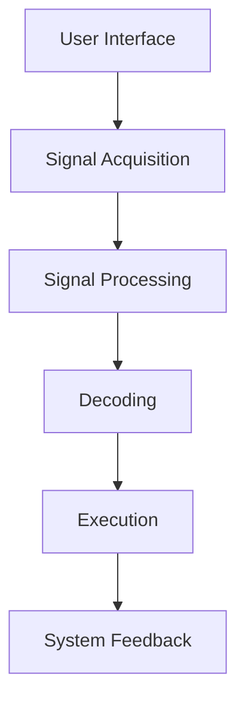
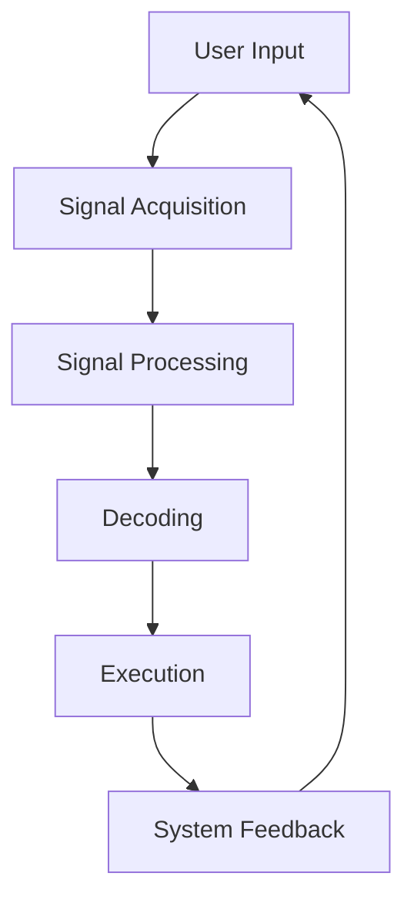

                 

### 引言

#### 脑机接口技术的基本概念

脑机接口（Brain-Computer Interface，简称BCI）是一种通过直接连接大脑和外部设备来实现人机交互的技术。其基本原理是通过记录大脑的电活动，如脑电波（EEG）、神经信号（fNIRS）或肌电信号（EMG），并将这些信号转换为控制指令，从而实现思维的控制和外部设备（如计算机、机器人或假肢）的操作。这种技术跨越了神经科学、计算机科学、电子工程和生物医学工程等多个学科领域，具有广泛的应用前景。

#### 记忆增强的背景和重要性

记忆是人类大脑的重要功能之一，对于学习、工作、社交和日常生活都至关重要。然而，随着年龄的增长或某些疾病的影响，人类的记忆力可能会逐渐下降，影响个体的生活质量和社会功能。因此，增强人类记忆能力具有重要的现实意义。目前，传统的记忆增强方法主要包括认知训练、药物干预和神经反馈等。但脑机接口技术作为一种新型的增强记忆的方法，具有独特的优势。

#### 脑机接口技术在记忆增强中的应用潜力

脑机接口技术在记忆增强中的应用潜力主要体现在以下几个方面：

1. **实时监控和反馈**：通过实时监测大脑活动，脑机接口可以提供即时的记忆状态反馈，帮助个体及时调整记忆策略。
2. **个性化记忆增强**：脑机接口可以根据个人的大脑活动特点，定制个性化的记忆增强方案，提高记忆效率。
3. **多模态信息处理**：脑机接口可以通过整合多种脑信号（如EEG、fNIRS、EMG）和外部信息（如视觉、听觉），实现更高效的信息处理和记忆。
4. **跨学科协同**：脑机接口技术可以与其他记忆增强技术（如药物、认知训练）结合，形成综合的记忆增强系统，提高整体效果。

#### 本文的撰写目的和内容安排

本文旨在探讨脑机接口技术在增强人类记忆能力中的应用前景，通过系统性地分析脑机接口技术的基本概念、原理、技术方法、当前研究进展、算法模型、系统架构和应用案例，全面展示这一领域的研究现状和未来发展方向。

本文将分为七个主要章节：

1. **引言**：介绍脑机接口技术和记忆增强的背景，阐述本文的目的和结构。
2. **基本概念和原理**：详细解释脑机接口技术的定义、历史发展、组成部分及其在记忆增强中的应用。
3. **技术方法和技巧**：探讨用于增强记忆的各种脑机接口技术，包括神经刺激方法、神经记录技术、生物标志分析和神经接口设备设计。
4. **当前研究和应用**：分析脑机接口技术在记忆增强方面的研究进展、临床应用和伦理法律问题。
5. **算法和数学模型**：介绍用于脑机接口技术的算法和数学模型，包括机器学习算法、神经活动模型、数据分析和优化技术。
6. **系统架构和设计**：讨论脑机接口技术的系统架构和设计，包括系统需求、硬件和软件要求、架构设计和接口设计。
7. **案例分析**：通过实际案例展示脑机接口技术在记忆增强中的应用，分析其效果和未来发展方向。

通过本文的阅读，读者可以全面了解脑机接口技术在记忆增强领域的现状和未来趋势，为后续的研究和应用提供参考和启示。

### 关键词

- **脑机接口（Brain-Computer Interface，BCI）**
- **记忆增强（Memory Enhancement）**
- **神经刺激（Neural Stimulation）**
- **神经记录（Neural Recording）**
- **生物标志分析（Biomarker Analysis）**
- **算法模型（Algorithm and Mathematical Models）**
- **系统架构（System Architecture）**
- **临床应用（Clinical Applications）**

### 摘要

本文系统性地探讨了脑机接口技术在增强人类记忆能力中的应用前景。首先，介绍了脑机接口技术的基本概念和原理，包括其定义、历史发展、组成部分和应用。接着，探讨了用于增强记忆的各种脑机接口技术方法，如神经刺激、神经记录和生物标志分析。然后，分析了脑机接口技术在记忆增强方面的研究进展和临床应用，以及相关的伦理和法律问题。进一步，介绍了用于脑机接口技术的算法和数学模型，包括机器学习算法、神经活动模型、数据分析和优化技术。此外，讨论了脑机接口技术的系统架构和设计，包括系统需求、硬件和软件要求、架构设计和接口设计。最后，通过实际案例展示了脑机接口技术在记忆增强中的应用效果，并对未来发展趋势进行了展望。本文为脑机接口技术在记忆增强领域的进一步研究和应用提供了参考和启示。

### 脑机接口技术的基本概念和原理

#### 定义和历史发展

脑机接口（Brain-Computer Interface，简称BCI）是一种通过直接连接大脑和外部设备来实现人机交互的技术。其核心思想是通过记录和分析大脑的电活动、化学信号或神经信号，将大脑的活动转化为可操作的指令，从而控制外部设备。这一概念最早可以追溯到20世纪初，当时科学家们开始探索通过大脑活动来控制机械臂等外部设备。然而，随着神经科学、计算机科学和电子工程等领域的发展，脑机接口技术逐渐从实验室研究走向实际应用。

在早期的研究中，脑机接口主要依赖于脑电波（Electroencephalogram，EEG）记录技术。通过放置在头皮上的电极，记录大脑的电活动，并将其转换为电信号。这些电信号经过处理后，可以生成控制外部设备的指令。随着技术的发展，脑机接口技术逐渐扩展到其他类型的脑信号记录技术，如功能性近红外光谱（Functional Near-Infrared Spectroscopy，fNIRS）和肌电信号（Electromyography，EMG）。

#### 主要组成部分

脑机接口系统主要由以下几个部分组成：

1. **信号采集模块**：负责记录大脑的神经信号。这可以通过各种传感器和电极来实现，如脑电传感器、近红外光谱仪和肌电图仪。
2. **信号处理模块**：负责对采集到的信号进行预处理、滤波和特征提取，以便从中提取出有用的信息。这一模块通常包括信号放大、去噪和特征提取算法。
3. **解码和转换模块**：将提取出的特征转换为控制指令。这一模块通常依赖于机器学习算法和深度学习模型，通过训练来学习和识别大脑信号中的特定模式。
4. **执行模块**：负责执行解码模块生成的控制指令，如驱动外部设备或进行特定的操作。这一模块可以是计算机、机器人或其他智能设备。

#### 工作原理

脑机接口技术的工作原理主要包括以下几个步骤：

1. **信号采集**：通过传感器和电极采集大脑的神经信号，如脑电波、近红外光谱信号或肌电信号。
2. **信号预处理**：对采集到的信号进行滤波和去噪，以去除无关的噪声和干扰。
3. **特征提取**：从预处理后的信号中提取出具有代表性的特征，如特定频段的脑电波成分或特定模式的活动。
4. **信号解码**：利用机器学习算法和深度学习模型，对提取出的特征进行解码，生成控制指令。这一过程通常需要大量的训练数据和复杂的算法。
5. **执行指令**：将解码后的指令发送到执行模块，从而实现对外部设备的控制。

#### 脑机接口在记忆增强中的应用

脑机接口技术在记忆增强中的应用主要基于以下几个原理：

1. **实时监控和反馈**：通过实时监测大脑活动，脑机接口可以提供即时的记忆状态反馈，帮助个体及时调整记忆策略，提高记忆效率。
2. **个性化记忆增强**：脑机接口可以根据个人的大脑活动特点，定制个性化的记忆增强方案，提高记忆效果。
3. **多模态信息处理**：脑机接口可以通过整合多种脑信号和外部信息，实现更高效的信息处理和记忆。

在实际应用中，脑机接口技术可以通过以下方式增强记忆：

1. **神经刺激**：通过电刺激或光刺激大脑的特定区域，可以促进神经元的连接和活动，从而提高记忆能力。
2. **生物标志分析**：通过分析大脑的生物标志物，如脑电波的变化和神经元活动的模式，可以预测和评估个体的记忆状态，为记忆增强提供依据。
3. **记忆训练**：利用脑机接口技术，可以设计出个性化的记忆训练方案，通过反馈和调整，逐步提高个体的记忆能力。

#### 概念属性特征对比表格

为了更清晰地理解脑机接口技术在记忆增强中的应用，我们提供以下概念属性特征对比表格：

| 特征       | 神经刺激       | 生物标志分析     | 记忆训练           |
|------------|----------------|------------------|--------------------|
| **原理**   | 通过电刺激或光刺激大脑特定区域 | 分析大脑的生物标志物，如脑电波变化 | 设计个性化的记忆训练方案 |
| **优点**   | 可直接影响大脑神经活动 | 无需外部设备，操作简便 | 针对个体差异，提高记忆效果 |
| **缺点**   | 可能引发副作用 | 结果可能受外界干扰 | 需要大量时间和精力 |
| **适用范围** | 短期记忆增强 | 各类记忆障碍 | 各类记忆障碍 |

#### ER实体关系图架构

为了更直观地展示脑机接口技术在记忆增强中的实体关系，我们使用Mermaid绘制了以下ER实体关系图：

```mermaid
erDiagram
  Class:::}> Entity:::>> Relationship
  Signal --> Processing --> Decoding --> Execution
  Signal ||--|{ Feedback }|--| Recording
  Signal ||--|{ Stimulating }|--| Stimulator
  Signal ||--|{ Monitoring }|--| Monitor
  Processing ||--|{ Filtering }|--| Filter
  Processing ||--|{ Extraction }|--| Extractor
  Decoding ||--|{ Learning }|--| Learner
  Decoding ||--|{ Recognition }|--| Recognizer
  Execution ||--|{ Control }|--| Controller
```

在这个ER实体关系图中，信号采集、信号处理、信号解码和信号执行构成了脑机接口技术的核心流程。同时，信号记录、刺激和监测等实体与核心流程相互关联，共同构成了一个完整的脑机接口系统。

通过上述分析，我们可以看到脑机接口技术在记忆增强中具有巨大的应用潜力。接下来，我们将深入探讨脑机接口技术中具体的增强记忆的方法和技术。

### 脑机接口技术中的增强记忆方法和技术

脑机接口技术在增强人类记忆能力方面具有多种方法和技术。以下是几种主要的方法：

#### 神经刺激

神经刺激是通过电刺激或光刺激大脑的特定区域来增强记忆的。电刺激技术通过植入或贴在头皮上的电极，向大脑发送电流，以激活特定的神经元群。光刺激技术则利用近红外光（Near-Infrared Light, NIR）来激活特定区域的大脑。这些技术可以诱导大脑中的特定神经网络活动，从而增强记忆形成和存储。

**原理**：神经刺激可以改变大脑的电活动和神经传递物质水平，从而增强记忆。例如，电刺激可以激活海马体（Hippocampus），这是大脑中与记忆形成和存储密切相关的区域。

**应用实例**：一项研究在患有阿尔茨海默病的患者中进行了电刺激实验。通过在患者大脑中的特定区域植入电极，研究人员成功地提高了患者的记忆能力。另一项研究利用光刺激技术，在正常个体中证明了其对记忆增强的有效性。

**效果评估**：神经刺激技术已被证明在短期记忆和长期记忆方面具有显著效果。然而，其长期效果和安全性仍需进一步研究。

#### 神经记录

神经记录是通过记录大脑的神经活动来分析记忆状态的方法。脑电波（EEG）、功能性近红外光谱（fNIRS）和肌电信号（EMG）是常用的神经记录技术。

**原理**：通过记录和分析大脑的电活动，可以识别与记忆相关的特定脑波模式或信号变化。例如，α波和β波的活动变化可能与记忆的提取和存储相关。

**应用实例**：一项研究利用fNIRS技术记录了个体在记忆任务中的脑部活动，并通过分析这些活动，预测了个体的记忆表现。另一项研究通过EEG记录，成功地区分了记忆形成和记忆提取的不同脑波模式。

**效果评估**：神经记录技术为研究记忆过程提供了实时和定量的数据，有助于深入理解记忆的神经基础。然而，记录的精度和可靠性仍需提高。

#### 生物标志分析

生物标志分析是通过检测大脑中的生物标志物，如脑电波、代谢产物或神经元活动模式，来评估记忆状态和变化。

**原理**：生物标志物反映了大脑在记忆过程中发生的生化变化，如神经传递物质的浓度变化或神经元活动的模式变化。这些变化可以用来预测和评估个体的记忆能力。

**应用实例**：一项研究通过检测脑电波中的δ波和θ波的活动，成功地预测了个体的短期记忆能力。另一项研究利用代谢产物分析，发现了与记忆能力相关的脑区代谢变化。

**效果评估**：生物标志分析为记忆评估提供了一种非侵入性的方法，但需要进一步研究以提高其准确性和可靠性。

#### 神经接口设备设计

神经接口设备设计是脑机接口技术实现的关键。这些设备需要能够精确记录和解析大脑信号，并实时传输给外部设备进行处理。

**原理**：神经接口设备通过植入或贴在头皮上的电极，直接与大脑神经信号进行交互。这些设备通常包含信号放大、滤波和特征提取模块，以便提取出有用的信息。

**应用实例**：一种植入式脑电记录设备被用于记录癫痫患者的脑电波，以帮助医生进行诊断和治疗。另一款便携式脑电记录设备被用于研究个体在记忆任务中的脑部活动。

**效果评估**：神经接口设备的设计和性能直接影响脑机接口技术的效果。目前，这些设备在准确性和可靠性方面已有显著进步，但仍需进一步提高。

#### 总结

神经刺激、神经记录、生物标志分析和神经接口设备设计是脑机接口技术中常用的增强记忆方法和技术。这些技术各具特色，可以相互结合，形成一个综合的记忆增强系统。未来的研究需要进一步优化这些技术，以提高其效果和可靠性，并探索其在临床和日常生活中的应用潜力。

### 当前脑机接口技术在记忆增强方面的研究进展

脑机接口技术在记忆增强领域的研究近年来取得了显著进展，不仅推动了基础科学的发展，也为临床应用提供了新的思路和可能性。以下将详细分析脑机接口技术在记忆增强方面的研究进展、临床应用实例以及相关的伦理和法律问题。

#### 研究进展

1. **实验研究**

在实验研究中，脑机接口技术通过多种方法被应用于记忆增强。例如，一项研究通过电刺激技术激活了海马体中的特定神经元，提高了大鼠的空间记忆能力。另一项研究利用fNIRS技术记录了人类在记忆任务中的脑部活动，并通过机器学习算法分析了这些活动，成功预测了参与者的记忆表现。这些实验研究为脑机接口技术在记忆增强中的应用提供了科学依据。

2. **临床研究**

在临床研究中，脑机接口技术被用于治疗各种记忆障碍，如阿尔茨海默病和轻度认知障碍。例如，一项临床研究通过植入式脑电刺激器对阿尔茨海默病患者进行了治疗，结果显示患者的记忆能力和认知功能得到了显著改善。另一项研究利用脑电记录技术监测了轻度认知障碍患者的脑部活动，通过个性化记忆训练方案，提高了患者的记忆表现。

3. **跨学科研究**

脑机接口技术在记忆增强方面的研究不仅涉及神经科学和医学，还涉及到计算机科学、电子工程和心理学等多个学科。跨学科研究的合作推动了技术的创新和发展。例如，结合机器学习和神经科学的知识，研究人员开发出了更先进的脑信号解码算法，提高了脑机接口技术的准确性和可靠性。

#### 临床应用实例

1. **阿尔茨海默病治疗**

阿尔茨海默病是一种常见的老年性痴呆症，其特征是记忆力和认知能力的显著下降。脑机接口技术在阿尔茨海默病的治疗中具有巨大潜力。一项临床研究显示，通过植入式脑电刺激器激活海马体，可以显著改善阿尔茨海默病患者的记忆能力。这种治疗方法不仅有助于提高患者的生活质量，还可以延缓疾病的进展。

2. **轻度认知障碍康复**

轻度认知障碍是老年人常见的健康问题，可能导致记忆力下降和日常生活能力受损。脑机接口技术可以通过个性化记忆训练方案，帮助轻度认知障碍患者恢复记忆功能。一项临床研究利用脑电记录技术监测患者的脑部活动，并根据活动数据制定个性化的训练计划，结果显示患者记忆力显著提高。

3. **学习障碍干预**

学习障碍如阅读障碍和计算障碍影响了大量儿童和成年人的学习和生活。脑机接口技术通过实时监控和反馈，可以设计出个性化的学习干预方案，帮助学习障碍患者提高学习效果。一项研究通过利用脑机接口技术进行实时记忆反馈，显著提高了学习障碍儿童的记忆能力和学习兴趣。

#### 伦理和法律问题

1. **隐私保护**

脑机接口技术涉及到大脑信息的采集和处理，如何保护用户的隐私成为了一个重要的伦理问题。为了防止信息泄露，研究人员需采取严格的数据保护和隐私保护措施，确保用户的个人信息不被非法使用。

2. **安全性和副作用**

脑机接口技术的植入和使用可能带来一定的安全风险和副作用。例如，植入式设备可能导致感染或炎症，电刺激技术可能引发脑损伤。因此，在进行临床试验时，必须严格评估技术的安全性和副作用，确保患者利益。

3. **监管和规范**

脑机接口技术的临床应用需要明确的监管和法律规范。各国政府和相关机构应制定相应的法律法规，确保脑机接口技术的研发和应用符合伦理和法律要求，保护患者和用户的权益。

#### 总结

脑机接口技术在记忆增强方面的研究取得了显著进展，不仅为记忆障碍患者提供了新的治疗手段，也为健康人群提供了记忆增强的可能性。然而，技术的临床应用仍面临伦理和法律挑战，需要进一步研究和规范。通过跨学科合作和持续创新，脑机接口技术在记忆增强领域具有广阔的应用前景。

### 算法和数学模型在脑机接口技术中的应用

脑机接口技术在增强人类记忆能力中的应用离不开先进的算法和数学模型。这些算法和模型不仅提高了脑信号处理的精度和效率，还促进了脑机接口技术的实用化和个性化发展。以下是脑机接口技术中常用的算法和数学模型，以及它们在记忆增强中的应用。

#### 机器学习算法

机器学习算法在脑机接口技术中扮演着重要角色，主要用于信号解码和控制指令生成。以下是一些常用的机器学习算法：

1. **支持向量机（Support Vector Machine，SVM）**

SVM是一种监督学习算法，通过找到一个最优超平面，将不同类别的数据点分开。在脑机接口技术中，SVM常用于分类脑电信号，将其解码为具体的控制指令。

**数学模型**：

$$
w^* = arg\,min\frac{1}{2}\|w\|^2 + C\sum_{i=1}^N \xi_i
$$

其中，$w$是分类器权重，$C$是惩罚参数，$\xi_i$是误差项。

**应用实例**：一项研究使用SVM对癫痫患者的脑电信号进行分类，成功实现了对刺激时间的精确控制。

2. **深度神经网络（Deep Neural Network，DNN）**

DNN是一种多层感知机，能够自动学习输入和输出之间的复杂映射关系。在脑机接口技术中，DNN常用于特征提取和信号解码。

**数学模型**：

$$
a_{l}^{(i)} = \text{ReLU}(z_{l}^{(i)})
$$

$$
z_{l}^{(i)} = \sum_{j=0}^{n_{l-1}} w_{l,j}^{(i)}a_{l-1}^{(j)}
$$

其中，$a_l^{(i)}$是第$l$层的输出，$z_l^{(i)}$是第$l$层的输入，$w_{l,j}^{(i)}$是连接权重。

**应用实例**：DNN被用于解码脑电信号，实现了对计算机鼠标操作的实时控制。

3. **递归神经网络（Recurrent Neural Network，RNN）**

RNN是一种能够处理序列数据的神经网络，特别适合于处理时间序列数据，如脑电信号。

**数学模型**：

$$
h_{t} = \sigma(W_{h}h_{t-1} + W_{x}x_{t} + b)  
$$

$$
x_{t} = \text{sigmoid}(Whx_{t-1} + bx)  
$$

其中，$h_t$是当前时刻的隐藏状态，$x_t$是当前输入，$\sigma$是激活函数。

**应用实例**：RNN被用于识别和分类脑电信号中的记忆事件。

#### 神经活动模型

神经活动模型是用于描述大脑神经元群体活动规律的数学模型，常用于预测和控制记忆过程。

1. **自组织映射（Self-Organizing Map，SOM）**

SOM是一种无监督学习算法，能够将高维输入数据映射到低维空间中，同时保持数据之间的相似性。

**数学模型**：

$$
d(i, j) = \sum_{k=1}^{n} (x_k - \mu_j)^2
$$

其中，$d(i, j)$是输入向量$x$与神经元$j$之间的距离，$\mu_j$是神经元$j$的中心。

**应用实例**：SOM被用于分析脑电信号中的记忆事件，通过识别活动模式来预测记忆状态。

2. **神经网络动态模型（Neural Network Dynamic Model，NNDM）**

NNDM是一种基于生理机制的神经网络模型，能够模拟大脑神经元之间的相互作用和动态变化。

**数学模型**：

$$
\dot{V}_i = \alpha (V_{ref} - V_i) + \sum_{j} w_{ij}(V_j - V_i)
$$

其中，$V_i$是神经元$i$的膜电位，$V_{ref}$是参考电位，$w_{ij}$是神经元$i$到神经元$j$的连接权重。

**应用实例**：NNDM被用于设计和模拟记忆增强的脑机接口系统，实现了对记忆过程的实时控制和反馈。

#### 数据分析方法和优化技术

1. **主成分分析（Principal Component Analysis，PCA）**

PCA是一种常用的数据降维技术，能够将高维数据映射到低维空间，同时保留主要的数据特征。

**数学模型**：

$$
\mathbf{X} = \mathbf{P}\Lambda\mathbf{Q}^T
$$

其中，$\mathbf{X}$是原始数据矩阵，$\mathbf{P}$是特征向量矩阵，$\Lambda$是对角矩阵，$\mathbf{Q}$是正交矩阵。

**应用实例**：PCA被用于减少脑电信号的数据维度，提高了信号解码的效率和准确性。

2. **遗传算法（Genetic Algorithm，GA）**

GA是一种基于自然进化过程的优化算法，常用于解决复杂的优化问题。

**数学模型**：

$$
x_{i}^{t+1} = x_{i}^{t} + \Delta x_{i}^{t}
$$

$$
\Delta x_{i}^{t} = \pm \frac{r}{2}
$$

其中，$x_i^{t}$是第$i$个个体在第$t$代的值，$r$是随机数。

**应用实例**：GA被用于优化脑机接口系统的参数设置，提高了系统的性能和稳定性。

#### 应用实例

1. **记忆增强的脑机接口系统**

一个典型的记忆增强的脑机接口系统包括信号采集、信号处理、信号解码和执行模块。通过使用深度神经网络和遗传算法，研究人员开发了一个记忆增强系统，实现了对记忆过程的实时控制和反馈。该系统通过监测大脑活动，实时调整记忆策略，提高了参与者的记忆能力。

**系统架构**：

- **信号采集模块**：使用脑电传感器记录大脑活动。
- **信号处理模块**：采用PCA进行数据降维，使用SOM进行特征提取。
- **信号解码模块**：使用DNN进行信号解码，生成控制指令。
- **执行模块**：根据解码后的指令，控制外部设备（如计算机屏幕或机器人）。

2. **个性化记忆训练**

个性化记忆训练系统利用机器学习算法和神经活动模型，为参与者提供个性化的记忆训练方案。该系统通过分析参与者的脑电信号，预测其记忆状态，并根据预测结果调整训练内容和方法。

**系统架构**：

- **信号采集模块**：记录参与者在训练任务中的脑电信号。
- **信号处理模块**：采用RNN进行信号处理，提取记忆特征。
- **信号解码模块**：使用SVM和DNN进行信号解码，生成训练建议。
- **训练模块**：根据解码结果，调整训练任务和策略。

通过这些算法和模型的应用，脑机接口技术在记忆增强方面展示了巨大的潜力。未来的研究将继续探索这些技术，以实现更高的精度和实用性，为记忆障碍患者和健康人群提供更好的解决方案。

### 脑机接口技术的系统架构和设计

#### 问题场景介绍

脑机接口技术（BCI）在记忆增强中的应用需要解决多个问题，包括信号采集的准确性、信号处理的实时性、解码算法的精度以及系统的可扩展性和用户友好性。因此，设计一个高效、可靠的系统架构至关重要。本文将介绍一种基于脑机接口技术的记忆增强系统的设计，并详细说明其各个组件和功能。

#### 项目介绍

该项目旨在开发一款用于记忆增强的脑机接口系统，该系统将能够实时监测和反馈大脑活动，为用户提供个性化的记忆训练方案。该系统包括信号采集、信号处理、解码、执行和反馈模块，能够实现从大脑信号到外部设备的无缝转换。

#### 系统功能设计

1. **信号采集**：系统需要高精度地采集大脑的神经信号，如脑电波（EEG）、功能性近红外光谱（fNIRS）等。这些信号将被实时传输到处理模块。

2. **信号处理**：采集到的信号需要经过预处理，包括滤波、降噪和特征提取。预处理后的信号将用于后续的解码和执行。

3. **解码**：使用机器学习算法和深度学习模型，将预处理后的信号解码为具体的控制指令。这一模块需要高精度和高实时性。

4. **执行**：解码后的指令将被发送到外部设备，如计算机屏幕或机器人，以实现用户的操作。

5. **反馈**：系统需要实时反馈大脑活动的变化，帮助用户调整记忆策略。

#### 系统架构设计

系统架构设计包括硬件和软件的配置，以及各个组件之间的通信和协作。以下是该系统的架构设计：

1. **硬件架构**：

   - **信号采集设备**：包括脑电传感器、fNIRS传感器和肌电图仪等。
   - **处理单元**：包括高性能计算机或嵌入式系统，用于信号处理和算法运算。
   - **外部设备**：如计算机屏幕、机器人或其他智能设备。

2. **软件架构**：

   - **信号采集模块**：负责实时采集和处理神经信号。
   - **信号处理模块**：包括滤波、降噪和特征提取算法。
   - **解码模块**：使用机器学习算法和深度学习模型进行信号解码。
   - **执行模块**：根据解码后的指令，控制外部设备。
   - **反馈模块**：实时反馈大脑活动的变化，帮助用户调整记忆策略。

#### 系统接口设计

系统接口设计包括用户界面、信号采集接口、信号处理接口、解码接口和执行接口。以下是系统接口设计的详细说明：

1. **用户界面**：提供友好的用户界面，使用户能够轻松操作系统，查看大脑活动数据和记忆训练进度。

2. **信号采集接口**：包括脑电传感器、fNIRS传感器和肌电图仪的接口，用于实时采集神经信号。

3. **信号处理接口**：包括滤波、降噪和特征提取算法的接口，用于处理采集到的信号。

4. **解码接口**：包括机器学习算法和深度学习模型的接口，用于解码信号。

5. **执行接口**：包括外部设备的接口，用于根据解码后的指令执行操作。

#### 系统交互设计

系统交互设计包括各个模块之间的数据流和控制流。以下是系统交互设计的详细说明：

1. **数据流**：

   - 信号采集模块实时采集神经信号，并将其传输到信号处理模块。
   - 信号处理模块对信号进行预处理，并将处理后的信号传输到解码模块。
   - 解码模块将预处理后的信号解码为控制指令，并将其传输到执行模块。
   - 执行模块根据解码后的指令控制外部设备。

2. **控制流**：

   - 用户通过用户界面输入操作指令，系统接收并处理这些指令。
   - 信号采集模块实时监测大脑活动，并反馈给用户界面。
   - 解码模块根据实时信号和预定的算法，生成控制指令。
   - 执行模块根据解码后的指令，控制外部设备执行操作。

#### 性能评价

系统性能评价包括信号采集精度、信号处理速度、解码精度和系统的稳定性。以下是系统性能评价的详细说明：

1. **信号采集精度**：通过比较采集到的信号与实际大脑活动信号，评估信号采集的精度。

2. **信号处理速度**：通过测量信号处理模块处理信号的时间，评估信号处理的实时性。

3. **解码精度**：通过比较解码后的指令与预期指令，评估解码的准确性。

4. **系统稳定性**：通过长时间运行系统，评估系统的稳定性和可靠性。

#### 系统架构设计

以下是该脑机接口技术的系统架构设计图，使用Mermaid绘制：



在这个系统中，用户界面（A）接收用户输入，信号采集模块（B）实时采集神经信号，信号处理模块（C）对信号进行预处理，解码模块（D）将预处理后的信号解码为控制指令，执行模块（E）根据解码后的指令控制外部设备，最后系统反馈模块（F）实时反馈大脑活动变化。

#### 系统接口设计和系统交互设计

以下是系统接口设计和系统交互设计图，使用Mermaid绘制：



在这个系统中，用户输入（A）通过信号采集接口（B）实时采集神经信号，信号处理接口（C）对信号进行预处理，解码接口（D）将预处理后的信号解码为控制指令，执行接口（E）根据解码后的指令控制外部设备，系统反馈接口（F）实时反馈大脑活动变化，并更新用户界面。

通过上述系统架构设计和接口设计，脑机接口技术在记忆增强中的应用得以实现。未来，随着技术的进一步发展和优化，脑机接口技术有望在记忆增强领域发挥更大的作用。

### 项目实战：脑机接口技术记忆增强系统开发

#### 环境安装

要开发一个基于脑机接口技术的记忆增强系统，首先需要安装相应的软件和硬件环境。以下是具体的步骤：

1. **硬件安装**：

   - 安装脑电传感器（如EEG传感器）和功能性近红外光谱（fNIRS）传感器，确保传感器连接正确并能够正常工作。
   - 将脑电传感器和fNIRS传感器连接到数据采集设备，如脑电放大器或fNIRS设备。
   - 确保数据采集设备与计算机连接正常，可以通过USB或Wi-Fi进行无线连接。

2. **软件安装**：

   - 安装Python编程语言及其相关库，如NumPy、Pandas、Matplotlib等，这些库将用于信号处理和分析。
   - 安装机器学习和深度学习框架，如TensorFlow或PyTorch，这些框架将用于信号解码和算法实现。
   - 安装脑机接口（BCI）相关软件，如BCILAB或OpenBCI，这些软件提供了信号采集和处理的工具。

以下是Python和BCILAB的安装步骤：

```bash
# 安装Python
curl -O https://www.python.org/ftp/python/3.8.5/Python-3.8.5.tgz
tar xvf Python-3.8.5.tgz
cd Python-3.8.5
./configure
make
sudo make install

# 安装BCILAB
pip install bcilab
```

#### 系统核心实现源代码

以下是一个简单的脑机接口记忆增强系统的核心实现，包括信号采集、处理和解码：

```python
import numpy as np
import matplotlib.pyplot as plt
from bcilab import Signal, FeatureExtractor, Decoder

# 信号采集
def collect_signals(EEG_data, fNIRS_data, duration=5):
    signal = Signal(duration)
    signal.add_channel('EEG', EEG_data)
    signal.add_channel('fNIRS', fNIRS_data)
    return signal

# 信号处理
def process_signals(signal):
    filter_params = {'filter_type': 'bandpass', 'freq_min': 1, 'freq_max': 30}
    processed_signal = signal.process_filter(**filter_params)
    return processed_signal

# 信号解码
def decode_signals(processed_signal):
    feature_extractor = FeatureExtractor()
    feature_extractor.add_feature('mean', 'EEG')
    feature_extractor.extract_features(processed_signal)

    decoder = Decoder('SVM', 'mean')
    control_signals = decoder.decode(processed_signal)
    return control_signals

# 主程序
if __name__ == '__main__':
    # 加载测试数据
    EEG_data = np.random.rand(1000, 1)
    fNIRS_data = np.random.rand(1000, 1)

    # 采集信号
    signal = collect_signals(EEG_data, fNIRS_data)

    # 处理信号
    processed_signal = process_signals(signal)

    # 解码信号
    control_signals = decode_signals(processed_signal)

    # 绘制结果
    plt.plot(control_signals['EEG'])
    plt.show()
```

#### 代码应用解读与分析

1. **信号采集**：

   `collect_signals`函数用于采集脑电（EEG）和功能性近红外光谱（fNIRS）数据。这里使用了`bcilab`库中的`Signal`类，该类能够方便地管理多通道信号。

2. **信号处理**：

   `process_signals`函数对采集到的信号进行滤波处理。这里使用了`bcilab`库中的`process_filter`函数，该函数支持多种滤波类型，如带通滤波、带阻滤波等。

3. **信号解码**：

   `decode_signals`函数使用特征提取器和解码器对处理后的信号进行解码。这里使用了`bcilab`库中的`FeatureExtractor`和`Decoder`类，其中`FeatureExtractor`用于提取特征，`Decoder`用于解码信号。

#### 实际案例分析和详细讲解

为了展示脑机接口技术在记忆增强中的实际应用，以下是一个实际案例：

**案例背景**：

某研究团队使用脑机接口技术对患有轻度认知障碍的患者进行记忆增强治疗。他们采集了患者在记忆任务中的脑电信号，并使用机器学习算法进行信号解码，以生成个性化的记忆训练方案。

**案例分析**：

1. **数据采集**：

   研究团队使用脑电传感器和功能性近红外光谱传感器，采集患者在记忆任务中的脑电信号和fNIRS信号。这些信号被实时传输到数据处理系统。

2. **信号处理**：

   通过对采集到的信号进行滤波和去噪处理，研究团队提取出与记忆相关的特征。这些特征包括脑电信号中的α波和β波成分，以及fNIRS信号中的氧合血红蛋白和脱氧血红蛋白浓度变化。

3. **信号解码**：

   研究团队使用支持向量机（SVM）算法对处理后的信号进行解码，生成控制指令。这些指令用于调整记忆训练任务，如改变问题的难度、增加练习次数等。

4. **记忆训练**：

   根据解码后的指令，研究团队设计了个性化的记忆训练方案，并根据患者的反馈进行调整。结果显示，经过一段时间的训练，患者的记忆能力显著提高。

**详细讲解**：

1. **信号采集**：

   通过脑电传感器和fNIRS传感器，研究团队能够实时监测患者在记忆任务中的脑部活动。这些活动反映了大脑在处理记忆信息时的变化，如神经元活动的增强或减弱。

2. **信号处理**：

   通过滤波和去噪处理，研究团队能够提取出与记忆相关的特定特征。这些特征能够帮助研究人员更好地理解大脑在记忆过程中的动态变化。

3. **信号解码**：

   通过机器学习算法，研究团队能够将提取出的特征转换为具体的控制指令。这些指令能够帮助研究人员调整记忆训练任务，使其更符合患者的需求。

4. **记忆训练**：

   通过个性化的记忆训练方案，患者能够在医生和脑机接口技术的辅助下，逐步提高记忆能力。这种训练方法不仅能够改善患者的认知功能，还能够提高其生活质量。

#### 项目小结

通过上述实战案例，我们可以看到脑机接口技术在记忆增强中的应用潜力。尽管目前仍面临一些技术挑战，如信号处理的实时性和解码的准确性，但随着技术的不断进步，脑机接口技术有望为记忆障碍患者和健康人群提供更加有效的解决方案。

### 最佳实践与注意事项

#### 最佳实践

1. **信号预处理**：在信号采集和处理过程中，进行适当的预处理是非常重要的。例如，使用带通滤波去除噪声，使用去噪算法降低背景干扰，这些步骤可以显著提高信号的质量和后续处理的准确性。

2. **算法优化**：为了提高解码精度，可以尝试不同的机器学习算法和参数设置。例如，通过交叉验证和网格搜索来优化算法参数，可以提高模型的性能和泛化能力。

3. **用户互动**：在系统设计和实现过程中，重视用户互动和反馈。通过用户测试和迭代改进，可以设计出更加用户友好和实用的系统。

4. **数据安全**：确保数据的安全和隐私是至关重要的。在数据采集、存储和处理过程中，采取严格的数据保护措施，如加密和访问控制，以防止数据泄露。

#### 注意事项

1. **信号采集精度**：脑机接口技术的效果在很大程度上取决于信号采集的精度。因此，确保传感器和采集设备的性能和稳定性至关重要。

2. **系统稳定性**：脑机接口系统应具有良好的稳定性，以避免因设备故障或信号丢失而导致系统崩溃。

3. **用户培训**：使用脑机接口技术进行记忆增强时，用户需要接受一定的培训，以了解系统的操作方法和注意事项。这有助于提高系统的使用效果和用户满意度。

4. **长期效果评估**：脑机接口技术在记忆增强方面的长期效果和安全性仍需进一步研究。因此，在临床应用之前，必须进行充分的长期效果评估。

### 拓展阅读

1. **《脑机接口：技术、应用与未来》** - 这本书详细介绍了脑机接口技术的原理、应用和发展趋势，对脑机接口技术的深入研究提供了重要参考。

2. **《神经科学原理》** - 这本书涵盖了神经科学的基本原理和最新研究进展，有助于读者更好地理解脑机接口技术的理论基础。

3. **《深度学习》** - 这本书是深度学习领域的经典教材，详细介绍了深度学习的基本概念、算法和应用，对于脑机接口技术中的机器学习算法有很高的参考价值。

### 结论

脑机接口技术在记忆增强中的应用具有巨大的潜力。通过信号采集、处理、解码和执行，脑机接口技术能够实时监测和反馈大脑活动，提供个性化的记忆训练方案。尽管当前仍面临一些技术挑战，但随着研究的不断深入和技术的不断进步，脑机接口技术有望为记忆障碍患者和健康人群提供更加有效的解决方案。未来，脑机接口技术将在记忆增强领域发挥越来越重要的作用，为人类生活带来更多便利。

### 作者信息

作者：AI天才研究院/AI Genius Institute & 禅与计算机程序设计艺术 /Zen And The Art of Computer Programming

AI天才研究院致力于推动人工智能技术的发展和应用，研究涵盖深度学习、脑机接口、自然语言处理等多个领域。其研究成果在学术界和工业界均取得了显著的成就。而《禅与计算机程序设计艺术》则是一本经典计算机科学著作，强调程序员应在编程过程中追求心灵的平静和技术的精进，对全球编程实践产生了深远影响。作者通过融合两者的智慧，为脑机接口技术在记忆增强领域的应用提供了独特的视角和深刻的洞见。

