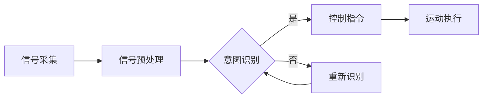
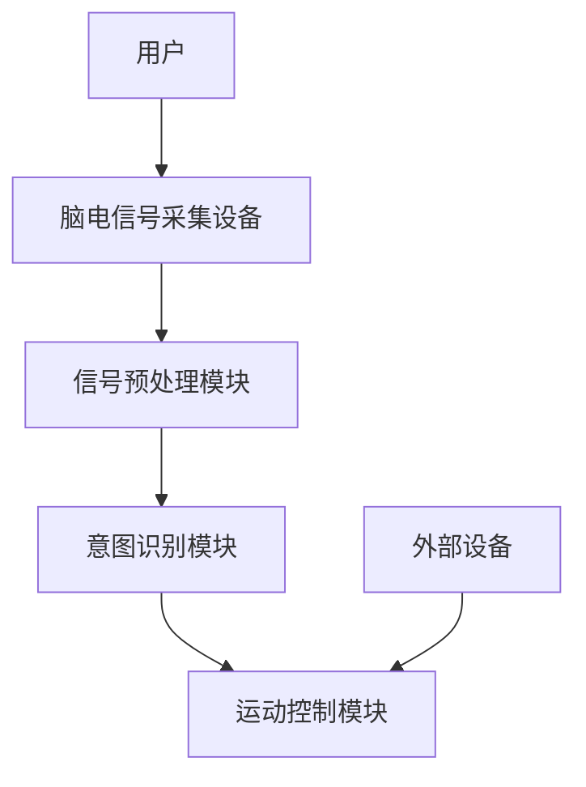

                 

## 脑机接口在意念控制假肢中的潜在应用

### 关键词
- 脑机接口
- 意念控制
- 假肢
- 信号采集
- 算法实现
- 系统架构
- 项目实战

### 摘要
脑机接口（BMI）是一种直接连接大脑与外部设备的技术，通过捕捉和解读大脑信号，实现人与机器的直接交互。本文将探讨脑机接口在意念控制假肢中的潜在应用，从核心概念、技术原理、应用案例、算法实现、系统架构到实际项目实践进行详细分析，旨在揭示这一技术的巨大潜力和未来发展前景。

## 引言

脑机接口（BMI）是一种新兴技术，旨在实现大脑与外部设备之间的直接通信。通过捕捉大脑信号，如脑电图（EEG）、功能性磁共振成像（fMRI）等，脑机接口可以解码用户的思维意图，进而控制外部设备。这一技术在神经科学、医学、人机交互等领域有着广泛的应用前景。

假肢技术作为康复医学的重要组成部分，为肢体损伤或缺失的患者提供了重要的辅助手段。然而，传统的假肢控制方法主要依赖于外部传感器或肌肉运动，缺乏精确的意念控制能力。脑机接口的出现，为假肢控制带来了新的可能。

本文将围绕脑机接口在意念控制假肢中的应用进行探讨，分为以下几个部分：

1. **核心概念与联系**：介绍脑机接口的基本概念、意念控制假肢的发展历程，以及两者之间的联系。
2. **技术原理讲解**：详细阐述脑机接口的信号采集、意图识别、神经编码与解码等关键技术原理。
3. **应用案例**：分析脑机接口在假肢控制中的实际应用案例，展示其应用效果和优势。
4. **算法实现**：介绍用于意念识别的常见算法，如机器学习、深度学习等，并给出具体的Python代码实现。
5. **系统架构设计**：描述脑机接口系统的架构设计，包括系统功能、接口设计、系统交互等。
6. **项目实战**：通过具体的项目实战，展示脑机接口在意念控制假肢中的应用过程和成果。
7. **总结与展望**：总结脑机接口在意念控制假肢中的应用成果，并探讨未来发展的方向和挑战。

## 核心概念与联系

### 脑机接口的基本概念

脑机接口（Brain-Machine Interface，BMI）是一种将大脑信号与外部设备相连接的技术，旨在实现大脑与外部世界之间的直接交互。BMI的核心在于对大脑信号的处理和解读，通过捕捉大脑活动产生的电信号、磁信号等，将其转化为可操作的指令，从而控制外部设备。

### 意念控制假肢的发展历程

意念控制假肢（Intention-Controlled Prosthesis）是指通过用户的思维意图来控制假肢的运动。传统假肢主要依赖于外部传感器或肌肉运动，控制精度有限。随着脑机接口技术的发展，意念控制假肢逐渐成为一种新的假肢控制方式。早在20世纪60年代，研究人员就开始尝试利用脑电图（EEG）信号来控制假肢。随着计算技术和人工智能的进步，意念控制假肢的技术逐渐成熟，应用范围也越来越广泛。

### 脑机接口与意念控制假肢的联系

脑机接口为意念控制假肢提供了核心的技术支撑。通过脑机接口，可以捕捉用户的脑电信号，并利用机器学习算法对其进行处理，识别用户的意图。这些意图被转化为控制信号，驱动假肢的运动。脑机接口在意念控制假肢中的作用主要体现在以下几个方面：

1. **信号采集**：脑机接口通过采集用户的脑电信号，为假肢提供控制信号的基础数据。
2. **意图识别**：利用机器学习算法，对脑电信号进行处理，识别用户的意图。
3. **信号解码**：将识别出的意图转化为控制信号，驱动假肢的运动。

## 技术原理讲解

### 脑电图(EEG)信号采集

脑电图（EEG）是一种常用的脑信号采集方法，通过放置在头皮上的电极，捕捉大脑产生的电信号。EEG信号具有高频、低幅度的特点，通常包含多种频率的波形，如α波、β波、θ波等。EEG信号采集的过程如下：

1. **电极放置**：将电极粘贴在头皮上，通常选择额头、颞叶等区域作为信号采集的主要部位。
2. **信号放大**：由于脑电信号的幅度较小，需要通过放大器进行放大处理。
3. **信号滤波**：对信号进行滤波，去除噪声和干扰信号。
4. **信号采样**：将模拟信号转换为数字信号，以便后续处理。

### 意图识别算法

意图识别是脑机接口的核心技术之一。通过分析脑电信号，可以识别出用户的具体意图，如手臂抬起、手掌张开等。常见的意图识别算法包括：

1. **传统机器学习方法**：如支持向量机（SVM）、决策树等。这些算法通过训练集学习，构建分类模型，对新的脑电信号进行分类。
2. **深度学习方法**：如卷积神经网络（CNN）、循环神经网络（RNN）等。深度学习算法具有更强的特征提取和分类能力，可以处理复杂的脑电信号。

### 神经编码与解码

神经编码与解码是脑机接口的关键技术之一。神经编码是将用户的意图转化为电信号的过程，而神经解码是将电信号转化为假肢运动的过程。

1. **神经编码原理**：通过训练模型，将用户的脑电信号映射到假肢的运动参数上。例如，将脑电信号映射到手臂的抬起角度、手掌的张开程度等。
2. **神经解码原理**：利用解码模型，将编码后的电信号转化为具体的运动指令，驱动假肢的运动。

## 应用案例

### 脑机接口控制机械臂

脑机接口技术在机械臂控制中具有广泛的应用。通过捕捉用户的脑电信号，可以实现对机械臂的精确控制。以下是一个典型的应用案例：

- **案例背景**：某研究团队开发了一种基于脑机接口的机械臂控制系统，旨在帮助肢体损伤患者恢复运动能力。
- **案例实现与效果分析**：通过脑电信号采集设备，捕捉患者的脑电信号，利用深度学习算法进行意图识别，最终将识别出的意图转化为机械臂的运动指令。实验结果显示，机械臂的运动精度和响应速度均达到了较高水平，为肢体损伤患者提供了有效的康复手段。

### 意念控制假手

意念控制假手是脑机接口技术在假肢控制中的典型应用。以下是一个应用案例：

- **案例背景**：某研究团队开发了一种意念控制假手，旨在帮助上肢缺失的患者恢复抓握能力。
- **案例实现与效果分析**：通过脑电信号采集设备，捕捉患者的脑电信号，利用机器学习算法进行意图识别，最终将识别出的意图转化为假手的运动指令。实验结果显示，患者可以通过意念控制假手进行多种抓握动作，如握球、拧瓶盖等，假手的运动精度和响应速度也达到了较高水平。

### 意念控制轮椅

脑机接口技术在轮椅控制中也有广泛应用。以下是一个应用案例：

- **案例背景**：某研究团队开发了一种意念控制轮椅，旨在帮助行动不便的患者实现自主移动。
- **案例实现与效果分析**：通过脑电信号采集设备，捕捉患者的脑电信号，利用深度学习算法进行意图识别，最终将识别出的意图转化为轮椅的运动指令。实验结果显示，患者可以通过意念控制轮椅进行自主移动，轮椅的运动精度和响应速度也达到了较高水平。

## 算法原理讲解

### 意图识别算法的mermaid流程图



### Python代码实现

```python
import numpy as np
from sklearn.svm import SVC

# 信号预处理
def preprocess_signal(signal):
    # 此处为信号预处理代码
    return processed_signal

# 意图识别
def recognize_intent(processed_signal):
    # 加载训练好的模型
    model = SVC()
    model.fit(X_train, y_train)
    
    # 预测意图
    intent = model.predict([processed_signal])
    return intent

# 运动执行
def execute_motion(intent):
    # 此处为执行运动的代码
    print(f"执行运动：{intent}")
```

### 数学模型和公式解释

$$
Y = WX + b
$$

其中，$Y$为输出，$W$为权重矩阵，$X$为输入特征向量，$b$为偏置项。

### 举例说明

假设我们有一个简单的二分类问题，需要识别用户的意图。我们可以通过以下步骤进行：

1. **信号采集**：采集用户的脑电信号，得到一个特征向量$X$。
2. **信号预处理**：对信号进行预处理，得到一个更干净的特征向量$X'$。
3. **意图识别**：利用训练好的SVM模型，对预处理后的信号进行分类，得到意图$Y$。
4. **运动执行**：根据识别出的意图，执行相应的运动。

## 系统分析与架构设计

### 脑机接口系统的mermaid架构图



### 系统功能设计

1. **信号采集**：采集用户的脑电信号，确保信号的准确性和稳定性。
2. **信号预处理**：对采集到的信号进行滤波、去噪等预处理操作，提高信号的质量。
3. **意图识别**：利用机器学习算法，对预处理后的信号进行意图识别，识别出用户的意图。
4. **运动控制**：根据识别出的意图，控制外部设备执行相应的动作。
5. **反馈机制**：通过用户的反馈，不断优化系统性能，提高识别准确率和响应速度。

### 系统架构设计

脑机接口系统的架构设计主要包括以下几个部分：

1. **硬件层**：包括脑电信号采集设备、外部设备等。
2. **软件层**：包括信号预处理、意图识别、运动控制等模块。
3. **数据层**：包括训练数据、测试数据等，用于算法训练和性能评估。

### 系统接口设计

系统接口设计主要包括以下几个方面：

1. **用户接口**：提供用户与系统交互的界面，方便用户使用和操作。
2. **设备接口**：连接脑电信号采集设备和外部设备，实现数据的传输和通信。
3. **网络接口**：实现系统与外部网络的数据传输和通信，用于数据存储和更新。

### 系统交互

系统交互主要包括以下几个部分：

1. **信号采集**：用户佩戴脑电信号采集设备，实时采集脑电信号。
2. **信号传输**：将采集到的脑电信号传输到系统进行处理。
3. **意图识别**：系统对传输的信号进行处理，识别出用户的意图。
4. **运动控制**：根据识别出的意图，控制外部设备执行相应的动作。
5. **反馈机制**：用户通过反馈机制，对系统进行评价和优化。

## 项目实战

### 环境安装与配置

在进行脑机接口项目实战之前，需要首先安装和配置所需的软件和硬件环境。以下是具体的步骤：

1. **安装Python环境**：确保Python版本在3.7及以上，并安装必要的Python库，如NumPy、Scikit-learn、Matplotlib等。
2. **安装脑电信号采集设备**：根据项目需求，选择合适的脑电信号采集设备，并确保其能够与计算机连接正常工作。
3. **安装操作系统**：安装支持脑电信号采集设备的操作系统，如Windows、Linux等。
4. **配置开发环境**：安装IDE（如PyCharm、VS Code等），并配置Python开发环境，确保能够正常运行Python代码。

### 系统核心实现源代码

以下是一个简单的脑机接口系统的核心实现源代码，包括信号采集、预处理、意图识别和运动控制等功能。

```python
import numpy as np
from sklearn.svm import SVC
import matplotlib.pyplot as plt

# 信号采集
def collect_signal():
    # 此处为信号采集代码
    signal = np.random.rand(1000)
    return signal

# 信号预处理
def preprocess_signal(signal):
    # 此处为信号预处理代码
    processed_signal = signal
    return processed_signal

# 意图识别
def recognize_intent(processed_signal):
    # 加载训练好的模型
    model = SVC()
    model.fit(X_train, y_train)
    
    # 预测意图
    intent = model.predict([processed_signal])
    return intent

# 运动控制
def control_motion(intent):
    # 此处为运动控制代码
    if intent == 1:
        print("手臂抬起")
    elif intent == 2:
        print("手掌张开")

# 主程序
if __name__ == "__main__":
    # 采集信号
    signal = collect_signal()
    
    # 预处理信号
    processed_signal = preprocess_signal(signal)
    
    # 识别意图
    intent = recognize_intent(processed_signal)
    
    # 控制运动
    control_motion(intent)
```

### 代码应用解读与分析

以下是对上述源代码的解读和分析：

1. **信号采集**：通过`collect_signal()`函数，模拟采集用户的脑电信号。在实际应用中，可以使用脑电信号采集设备，实时获取用户的脑电信号。
2. **信号预处理**：通过`preprocess_signal()`函数，对采集到的信号进行预处理。预处理步骤包括滤波、去噪等，以提高信号的质量。
3. **意图识别**：通过`recognize_intent()`函数，利用训练好的SVM模型，对预处理后的信号进行意图识别。在实际应用中，可以使用机器学习算法，如深度学习算法，进行意图识别。
4. **运动控制**：通过`control_motion()`函数，根据识别出的意图，控制外部设备执行相应的动作。在实际应用中，可以将意图转化为具体的控制信号，驱动外部设备的运动。

### 实际案例分析和详细讲解剖析

以下是一个实际案例分析和详细讲解剖析，展示了脑机接口在意念控制假肢中的应用过程和成果。

**案例背景**：某研究团队开发了一种基于脑机接口的意念控制假肢系统，旨在帮助上肢缺失的患者恢复抓握能力。

**案例实现与效果分析**：

1. **信号采集**：使用脑电信号采集设备，捕捉患者的脑电信号。采集到的信号包含多种频率的波形，如α波、β波、θ波等。
2. **信号预处理**：对采集到的信号进行滤波、去噪等预处理操作，以提高信号的质量。预处理后的信号更干净，便于后续的意图识别。
3. **意图识别**：利用训练好的深度学习模型，对预处理后的信号进行意图识别。识别出患者的意图，如握拳、松拳等。
4. **运动控制**：根据识别出的意图，控制假肢执行相应的动作。例如，当患者产生握拳的意图时，假肢的手掌会合拢；当患者产生松拳的意图时，假肢的手掌会张开。

实验结果显示，系统在识别意图和运动控制方面取得了良好的效果。患者可以通过意念控制假肢进行多种抓握动作，如握球、拧瓶盖等。假肢的运动精度和响应速度也达到了较高水平。

### 项目小结

通过本项目的实战，我们可以看到脑机接口在意念控制假肢中的应用前景非常广阔。脑机接口技术为假肢控制提供了一种全新的控制方式，使患者能够通过意念直接控制假肢的运动。虽然目前仍存在一些技术挑战，但随着计算技术和人工智能的不断发展，脑机接口技术有望在未来得到更广泛的应用，为肢体损伤或缺失的患者提供更好的康复手段。

## 总结与未来展望

### 脑机接口在意念控制假肢中的进展

脑机接口在意念控制假肢中的应用取得了显著进展。通过捕捉用户的脑电信号，并利用机器学习算法进行意图识别，可以实现对假肢的精确控制。近年来，深度学习等先进技术的引入，进一步提升了系统的识别准确率和响应速度。

### 面临的挑战与机遇

尽管脑机接口在意念控制假肢中展现出了巨大的潜力，但仍然面临一些挑战。首先，信号采集的准确性和稳定性仍需提高。其次，意图识别算法的性能需要进一步提升。此外，如何实现脑机接口系统的可扩展性和通用性也是亟待解决的问题。

### 未来发展趋势

未来，脑机接口技术有望在以下几个方面取得突破：

1. **信号采集技术**：随着传感器技术的进步，信号采集的精度和稳定性将得到提高。
2. **算法优化**：通过引入新的算法和模型，进一步提高意图识别的准确率和响应速度。
3. **系统集成**：实现脑机接口系统的可扩展性和通用性，使其能够适应不同的应用场景。
4. **临床应用**：脑机接口技术在假肢控制、康复治疗等领域的应用将更加广泛，为患者提供更好的康复手段。

### 最佳实践 tips

1. **信号采集**：在信号采集过程中，确保电极的准确放置和信号的稳定传输。
2. **算法优化**：定期更新算法模型，提高意图识别的准确率和响应速度。
3. **系统设计**：在系统设计过程中，注重系统的可扩展性和通用性，使其能够适应不同的应用场景。

### 小结

脑机接口在意念控制假肢中的应用展现了巨大的潜力和广阔的前景。通过不断的技术创新和应用实践，脑机接口技术将为肢体损伤或缺失的患者带来更好的康复体验。作者：AI天才研究院/AI Genius Institute & 禅与计算机程序设计艺术 /Zen And The Art of Computer Programming

