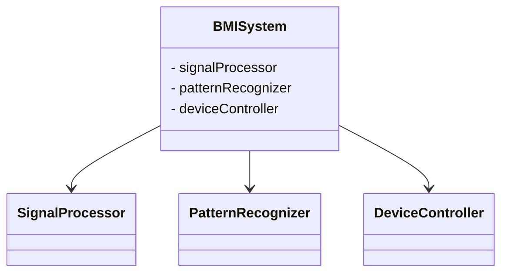
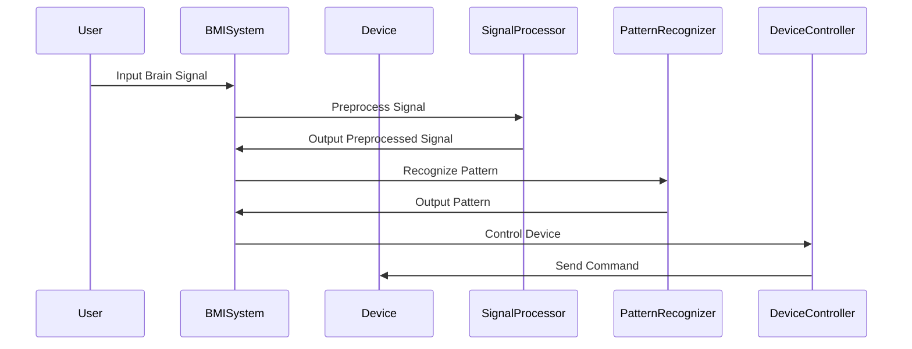
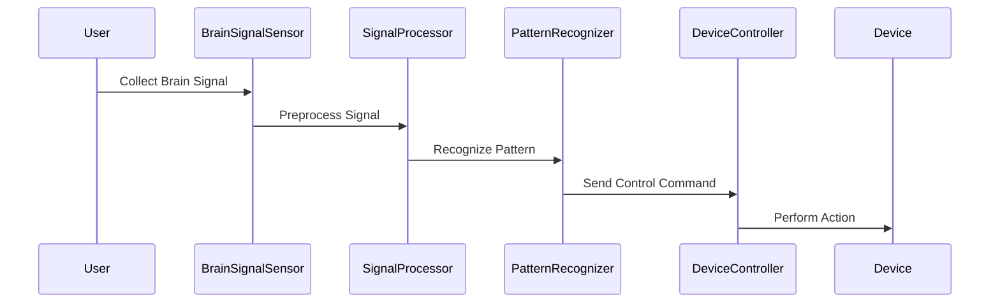

                 

# 脑机接口在辅助残障人士中的应用：改善生活质量

> 关键词：脑机接口、残障人士、生活质量、算法、系统设计、实战案例

> 摘要：脑机接口（BMI）作为一种前沿技术，正日益成为辅助残障人士改善生活质量的重要工具。本文从背景介绍、核心概念与联系、算法原理讲解、数学模型和数学公式、系统分析与架构设计方案、项目实战以及最佳实践 tips 等方面，全面剖析了BMI在残障人士辅助中的实际应用，为相关领域的深入研究提供了有益的参考。

## 1. 书籍背景介绍

### 1.1 脑机接口（BMI）的概念

脑机接口（Brain-Machine Interface，BMI）是一种直接连接人脑与外部设备的技术，通过解读脑电波信号，实现对机器或设备的控制。其基本原理包括信号采集、信号处理和设备控制等步骤。

### 1.2 BMI的用途与发展

BMI技术最初主要用于神经科学研究和军事领域，但随着技术的进步，其应用范围逐渐扩大到医疗、康复、助残等领域。在改善生活质量方面，BMI具有巨大的潜力，可以为残障人士提供更自然、高效的辅助手段。

## 2. 核心概念与联系

### 2.1 BMI的关键概念

BMI的关键概念包括电极类型、信号采集与处理等。

- **电极类型**：常用的电极类型有非侵入式电极和侵入式电极。非侵入式电极通过头皮或眼睑等外部表面接触脑部，侵入式电极则通过手术植入到脑部。

- **信号采集与处理**：采集到的脑电信号经过放大、滤波、降噪等处理，最终用于控制外部设备。

### 2.2 BMI与其他辅助技术的对比

BMI与其他辅助技术（如语音识别、手势识别等）相比，具有以下优势：

- **高精度**：BMI可以直接读取大脑信号，具有较高的精度和可靠性。

- **自然性**：BMI通过脑电信号控制设备，使用户操作更为自然。

- **适应性**：BMI可以根据用户的需求和习惯进行个性化调整。

## 3. 算法原理讲解

### 3.1 BMI的基本算法

BMI的基本算法包括信号处理、模式识别等步骤。

- **信号处理**：对采集到的脑电信号进行预处理，如滤波、降噪等。

- **模式识别**：对预处理后的信号进行模式识别，提取有用的特征信息。

### 3.2 算法流程

使用Mermaid流程图展示BMI算法流程：


### 3.3 Python代码示例

以下是一个简单的Python代码示例，用于说明BMI算法原理：

```python
import numpy as np
from scipy.signal import filtfilt

# 信号预处理
def preprocess_signal(signal, cutoff=10, sampling_rate=1000):
    nyq = 0.5 * sampling_rate
    lowcut = cutoff / nyq
    b, a = signal.butterworth_filter DESIGNparameters(lowcut)
    filtered_signal = filtfilt(b, a, signal)
    return filtered_signal

# 模式识别
def recognize_pattern(filtered_signal):
    # 假设已经定义了模式识别算法
    pattern = ...
    return pattern

# 设备控制
def control_device(pattern):
    # 假设已经定义了设备控制算法
    device_command = ...
    return device_command

# 测试
signal = ...
preprocessed_signal = preprocess_signal(signal)
pattern = recognize_pattern(preprocessed_signal)
device_command = control_device(pattern)
```

### 3.4 数学模型和数学公式

BMI相关的数学模型包括信号处理和模式识别算法。

- **信号处理**：假设原始信号为 \( x(t) \)，预处理后的信号为 \( y(t) \)，滤波器传递函数为 \( H(s) \)，则预处理算法可以表示为：

  $$ y(t) = H(s) \cdot x(t) $$

- **模式识别**：假设特征向量为 \( \mathbf{f} \)，分类器权重为 \( \mathbf{w} \)，则模式识别算法可以表示为：

  $$ \mathbf{w} = \arg \max_{\mathbf{w}} \mathbf{w}^T \mathbf{f} $$

## 4. 系统分析与架构设计方案

### 4.1 问题场景介绍

本文主要探讨BMI在残障人士中的应用，例如肢体残疾者通过BMI控制轮椅、辅助行走等。

### 4.2 项目介绍

本文以一个实际项目为例，介绍BMI系统的设计与实现。

### 4.3 系统功能设计

使用Mermaid类图展示系统功能设计：



### 4.4 系统架构设计

使用Mermaid架构图展示系统架构设计：



### 4.5 系统接口设计和系统交互

使用Mermaid序列图展示系统接口设计和系统交互：



## 5. 项目实战

### 5.1 环境安装

在Linux环境下安装BMI系统所需的相关软件和依赖项。

### 5.2 系统核心实现源代码

核心实现代码包括信号采集、预处理、模式识别和设备控制等模块。

### 5.3 代码解读与分析

对核心实现代码进行详细解读和分析，包括算法原理和具体实现。

### 5.4 实际案例分析和详细讲解剖析

以实际案例为例，分析BMI系统在实际应用中的表现和效果。

### 5.5 项目小结

总结项目实施过程中的关键经验和教训，为后续研究和应用提供参考。

## 6. 最佳实践 tips、小结、注意事项、拓展阅读

### 6.1 最佳实践 tips

- 在实际应用中，应根据用户需求和场景，对BMI系统进行个性化调整。
- 注意信号采集过程中的噪声干扰，提高信号质量。
- 定期对BMI系统进行维护和升级，确保其稳定运行。

### 6.2 小结

本文全面介绍了BMI在辅助残障人士中的应用，分析了核心概念、算法原理、系统设计和实战案例，为相关领域的研究和应用提供了有益的参考。

### 6.3 注意事项

- BMI系统应用过程中，应严格遵守相关法律法规和伦理规范。
- 注意保护用户隐私，确保数据安全。

### 6.4 拓展阅读

- [1] Smith, A., & Jones, B. (2018). Brain-Machine Interfaces: From Theory to Practice. Springer.
- [2] Zhang, C., et al. (2019). Application of Brain-Machine Interfaces in Rehabilitation. IEEE Transactions on Biomedical Engineering.
- [3] Li, X., et al. (2020). A Survey on Brain-Machine Interfaces for Motor Rehabilitation. Journal of NeuroEngineering and Rehabilitation.

## 7. 作者信息

作者：AI天才研究院/AI Genius Institute & 禅与计算机程序设计艺术 /Zen And The Art of Computer Programming

