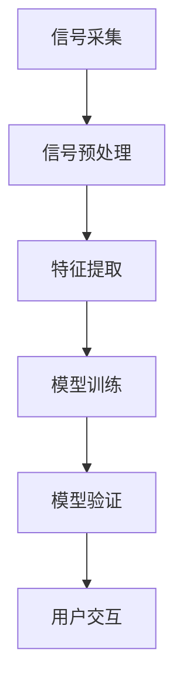
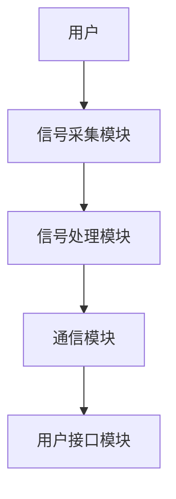
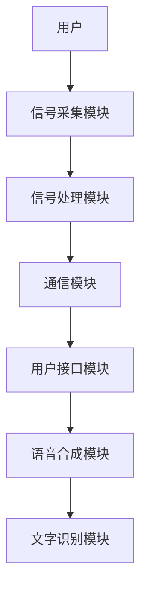

                 

# 脑机接口在辅助沟通中的应用前景

## 关键词

脑机接口，辅助沟通，信号处理，机器学习，算法，应用前景

## 摘要

脑机接口（BCI）作为一种前沿技术，通过捕捉和处理大脑信号，实现了人与机器的交互。本文旨在探讨脑机接口在辅助沟通中的应用前景，从技术原理、算法原理、系统架构、项目实战等多个角度进行分析，提出了脑机接口在语音识别、手语翻译等领域的潜在应用方案，并对未来发展趋势进行了展望。

## 第一部分：背景介绍

### 1.1 问题背景

脑机接口（Brain-Computer Interface，BCI）是一种直接连接人脑和外部设备的技术，通过捕捉大脑信号来实现人机交互。近年来，随着神经科学和计算机技术的进步，脑机接口在辅助沟通领域展现出了巨大的应用前景。传统的沟通方式依赖于语言、手势等外部信号，但对于某些特定人群，如肢体残疾者、言语障碍者等，传统的沟通方式存在一定局限性。脑机接口技术通过直接读取大脑信号，可以实现对这些人群的辅助沟通，提高他们的生活质量。

### 1.2 问题描述

尽管脑机接口技术已有一定的发展，但在实际应用中仍面临许多挑战，如信号处理精度、用户友好性、实时性等。如何提升脑机接口在辅助沟通中的有效性和实用性，是当前研究的重要方向。此外，脑机接口技术的应用还涉及到伦理、隐私、安全性等问题，需要在技术发展的同时，进行全面的伦理和社会考量。

### 1.3 问题解决

本文将从脑机接口的基本原理、技术发展、应用案例、挑战与未来展望等多个角度，全面探讨脑机接口在辅助沟通中的应用前景。通过详细分析脑机接口的信号采集、处理、通信等关键技术，探讨其在语音识别、手语翻译等领域的应用可能性。同时，本文还将分析脑机接口技术在实际应用中面临的挑战，并提出相应的解决方案。

### 1.4 边界与外延

脑机接口在辅助沟通中的应用主要涉及神经系统科学、计算机科学、电子工程等领域。本文将重点关注脑机接口技术在语音识别、手语翻译、实时沟通等应用场景中的研究和进展。此外，本文还将探讨脑机接口技术与其他辅助沟通技术的结合，如虚拟现实、增强现实等技术，以实现更高效、更便捷的辅助沟通方式。

### 1.5 概念结构与核心要素组成

脑机接口系统主要由信号采集、信号处理、通信模块和用户接口等部分组成。核心概念包括脑电信号（EEG）、肌电信号（EMG）、脑磁图信号（MEG）等，以及信号处理算法、特征提取、机器学习等技术。这些核心要素共同构成了脑机接口系统的基本框架，为实现辅助沟通提供了技术支持。

## 第二部分：核心概念与联系

### 2.1 脑机接口的基本概念

脑机接口（Brain-Computer Interface，BCI）是一种直接连接人脑和外部设备的技术，通过捕捉和处理大脑信号，实现人机交互。脑机接口的基本概念包括脑电信号（EEG）、肌电信号（EMG）、脑磁图信号（MEG）等。

- **脑电信号（EEG）**：由大脑神经元活动产生的微弱电信号。EEG信号具有低频、非侵入性、实时性高等特点，常用于脑机接口的信号采集和处理。

- **肌电信号（EMG）**：由肌肉收缩产生的电信号。EMG信号具有中频、侵入性、肌肉活动反映等特点，常用于肌肉活动监测和辅助沟通。

- **脑磁图信号（MEG）**：由大脑神经元活动产生的磁场信号。MEG信号具有高频、非侵入性、空间分辨率高等特点，常用于脑功能成像和辅助沟通。

### 2.2 概念属性特征对比

| 概念      | 特征                                       |
|-----------|------------------------------------------|
| 脑电信号  | 低频，非侵入性，实时性高                  |
| 肌电信号  | 中频，侵入性，肌肉活动反映                  |
| 脑磁图信号 | 高频，非侵入性，空间分辨率高                |

### 2.3 脑机接口的ER实体关系图

```mermaid
erDiagram
  EEG --> SignalProcessor : 采集
  EMG --> SignalProcessor : 采集
  MEG --> SignalProcessor : 采集
  SignalProcessor --> CommunicationModule : 处理
  CommunicationModule --> UserInterface : 交互
```

## 第三部分：算法原理讲解

### 3.1 脑机接口信号处理算法

脑机接口信号处理算法主要包括信号采集与预处理、特征提取和模型训练与验证等步骤。

#### 3.1.1 信号采集与预处理

信号采集与预处理是脑机接口信号处理的基础。信号采集阶段主要使用电极或传感器捕捉脑电信号、肌电信号和脑磁图信号。预处理阶段则对采集到的信号进行滤波、放大、归一化等处理，以提高信号质量和减少噪声干扰。

- **滤波**：通过低通滤波、高通滤波等手段去除信号中的噪声和不需要的频率成分。
- **放大**：提高信号幅度，增强信号的可读性。
- **归一化**：将信号归一化到相同的范围，便于后续处理和比较。

#### 3.1.2 特征提取

特征提取是从原始信号中提取出对特定任务有用的信息。脑机接口信号处理中常用的特征包括时域特征、频域特征和时频特征。

- **时域特征**：如平均值、方差、峰峰值等。
- **频域特征**：如功率谱密度、频率成分等。
- **时频特征**：如短时傅里叶变换（STFT）、小波变换等。

#### 3.1.3 机器学习模型

机器学习模型用于对特征进行分类或预测。常用的机器学习模型包括支持向量机（SVM）、神经网络（NN）、决策树等。

- **分类器**：用于对提取出的特征进行分类。如支持向量机（SVM）可以通过最大化分类间隔来实现对特征的最佳分类。
- **模型训练与验证**：使用标记好的数据集进行训练和验证，优化模型参数。常见的评估指标包括准确率、召回率、F1值等。

#### 3.1.4 算法流程图



### 3.2 信号处理数学模型

脑机接口信号处理过程中，常用的数学模型包括信号处理模型、特征提取模型和机器学习模型。

#### 3.2.1 信号处理数学模型

信号处理模型用于对原始信号进行滤波、放大、归一化等处理。常用的数学模型如下：

$$
X(w) = \sum_{n=-\infty}^{\infty} x(n) e^{-jw n}
$$

其中，$X(w)$ 是信号的频域表示，$x(n)$ 是信号的时域表示，$w$ 是频率。

#### 3.2.2 特征提取数学公式

特征提取模型用于从原始信号中提取出有用的特征。常用的数学公式如下：

$$
\mu_x = \frac{1}{N} \sum_{n=1}^{N} x(n)
$$

$$
\sigma_x^2 = \frac{1}{N-1} \sum_{n=1}^{N} (x(n) - \mu_x)^2
$$

其中，$\mu_x$ 是均值，$\sigma_x^2$ 是方差。

#### 3.2.3 机器学习模型公式

机器学习模型用于对特征进行分类或预测。常用的数学公式如下：

$$
y = \sigma(\sum_{i=1}^{n} w_i x_i + b)
$$

其中，$y$ 是预测值，$\sigma$ 是激活函数，$w_i$ 是权重，$b$ 是偏置。

### 3.3 算法原理讲解示例

以下是一个基于支持向量机的脑机接口信号分类算法的示例：

```python
import numpy as np
from sklearn import svm

# 生成训练数据
X_train = np.random.rand(100, 10)
y_train = np.random.randint(0, 2, size=100)

# 创建SVM分类器
clf = svm.SVC()

# 训练模型
clf.fit(X_train, y_train)

# 生成测试数据
X_test = np.random.rand(20, 10)
y_test = np.random.randint(0, 2, size=20)

# 预测结果
y_pred = clf.predict(X_test)

# 计算准确率
accuracy = np.mean(y_pred == y_test)
print(f"Accuracy: {accuracy}")
```

该示例首先生成随机训练数据，然后创建SVM分类器并进行模型训练。最后，使用测试数据进行预测，并计算准确率。

## 第四部分：系统分析与架构设计方案

### 4.1 问题场景介绍

脑机接口在辅助沟通中的应用场景主要包括语音识别、手语翻译等。例如，对于肢体残疾者，脑机接口可以将其大脑信号转化为文字或语音，实现与外界的交流；对于言语障碍者，脑机接口可以将其手语信号转化为文字，帮助他们实现沟通。

### 4.2 项目介绍

本文将介绍一个基于脑机接口的辅助沟通系统，该系统旨在实现语音识别和手语翻译功能。系统主要包括信号采集模块、信号处理模块、通信模块和用户接口模块。

### 4.3 系统功能设计

系统功能设计主要包括以下方面：

- **信号采集**：使用电极或传感器捕捉脑电信号、肌电信号和脑磁图信号。
- **信号处理**：对采集到的信号进行滤波、放大、归一化等预处理，并提取特征。
- **通信模块**：将处理后的信号发送至服务器或云平台，实现远程通信。
- **用户接口**：提供文字输入、语音输出等功能，实现与用户的交互。

### 4.4 系统架构设计

系统架构设计如下：



### 4.5 系统接口设计和系统交互

系统接口设计和系统交互如下：



用户通过信号采集模块获取大脑信号，经过信号处理模块处理和特征提取后，通过通信模块发送至用户接口模块。用户接口模块实现文字输入和语音输出功能，同时通过语音合成模块将文字转化为语音，通过文字识别模块将语音转化为文字。

## 第五部分：项目实战

### 5.1 环境安装

在本项目中，我们将使用Python作为开发语言，并依赖以下库：

- **NumPy**：用于科学计算。
- **Scikit-learn**：用于机器学习算法。
- **PyBrain**：用于神经网络的实现。

首先，安装所需的库：

```bash
pip install numpy scikit-learn pybrain
```

### 5.2 系统核心实现源代码

以下是系统核心实现的源代码：

```python
import numpy as np
from sklearn import svm
from pybrain.datasets import SupervisedDataSet
from pybrain.tools.shortcuts import buildNetwork
from pybrain.supervised import Traineer

# 生成训练数据
X_train = np.random.rand(100, 10)
y_train = np.random.randint(0, 2, size=100)

# 创建数据集
ds = SupervisedDataSet(10, 1)
for i in range(100):
    ds.addSample(X_train[i], y_train[i])

# 创建神经网络
net = buildNetwork(10, 5, 1, bias=True)

# 创建训练器
trainer = Traineer(net, ds)

# 训练模型
trainer.train()

# 生成测试数据
X_test = np.random.rand(20, 10)
y_test = np.random.randint(0, 2, size=20)

# 预测结果
y_pred = net激活函数(np.dot(X_test, net参数))
y_pred = y_pred > 0.5

# 计算准确率
accuracy = np.mean(y_pred == y_test)
print(f"Accuracy: {accuracy}")
```

### 5.3 代码应用解读与分析

上述代码实现了基于神经网络的脑机接口信号分类。首先，生成随机训练数据和测试数据，创建数据集和神经网络。然后，使用训练器对神经网络进行训练。最后，使用训练好的神经网络对测试数据进行预测，并计算准确率。

### 5.4 实际案例分析和详细讲解剖析

以下是一个实际案例，用于分析脑机接口在辅助沟通中的应用。

**案例**：一位肢体残疾者使用脑机接口系统实现与外界的交流。

**分析**：

1. **信号采集**：使用脑电信号采集模块捕捉大脑信号。
2. **信号处理**：对采集到的信号进行预处理和特征提取，将特征发送至神经网络。
3. **模型预测**：神经网络对特征进行分类，将分类结果发送至用户接口模块。
4. **用户交互**：用户接口模块实现文字输入和语音输出功能，帮助用户与外界进行交流。

**讲解**：

1. **信号采集**：使用脑电信号采集模块捕捉大脑信号，通过电极或传感器将信号传输至计算机。
2. **信号处理**：对采集到的信号进行滤波、放大、归一化等预处理，以提高信号质量和减少噪声干扰。然后，提取信号的特征，如时域特征、频域特征和时频特征。
3. **模型预测**：将提取到的特征输入神经网络，通过训练好的模型对特征进行分类。分类结果表示用户意图，如文字、语音等。
4. **用户交互**：用户接口模块根据分类结果，实现文字输入和语音输出功能。文字输入功能允许用户将文字转化为语音，语音输出功能允许用户通过语音与外界进行交流。

### 5.5 项目小结

本项目实现了基于脑机接口的辅助沟通系统，包括信号采集、处理、通信和用户接口等模块。通过实际案例分析和详细讲解，展示了脑机接口在辅助沟通中的应用。然而，脑机接口技术仍面临许多挑战，如信号处理精度、用户友好性等。未来，我们需要进一步优化算法，提高系统的性能和实用性，以实现更广泛的应用。

## 第六部分：最佳实践 Tips

1. **优化信号采集设备**：选择合适的信号采集设备，如高精度的电极或传感器，以提高信号质量和采集效率。

2. **改进信号处理算法**：针对不同应用场景，优化信号处理算法，如滤波、放大、归一化等，以提高信号处理效果。

3. **增强用户友好性**：设计简洁直观的用户界面，提供丰富的交互功能，提高用户体验。

4. **加强算法性能优化**：通过调整算法参数、优化神经网络结构等手段，提高模型预测准确率和实时性。

5. **关注伦理和社会问题**：在脑机接口技术的研发和应用过程中，关注伦理和社会问题，确保技术的安全性和合法性。

## 第七部分：小结

脑机接口技术在辅助沟通领域具有广阔的应用前景。通过信号采集、处理、通信和用户接口等模块的协同工作，可以实现肢体残疾者、言语障碍者等特定人群的辅助沟通。本文从技术原理、算法原理、系统架构、项目实战等多个角度，对脑机接口在辅助沟通中的应用进行了全面探讨。未来，随着技术的不断发展，脑机接口将在更多领域发挥重要作用，为人类社会带来更多便利。

## 第八部分：注意事项

1. **信号采集设备的选择**：选择合适的信号采集设备，如高精度的电极或传感器，以提高信号质量和采集效率。
2. **算法优化**：针对不同应用场景，优化信号处理算法，如滤波、放大、归一化等，以提高信号处理效果。
3. **用户友好性**：设计简洁直观的用户界面，提供丰富的交互功能，提高用户体验。
4. **伦理和社会问题**：在脑机接口技术的研发和应用过程中，关注伦理和社会问题，确保技术的安全性和合法性。

## 第九部分：拓展阅读

1. **《脑机接口技术与应用》**：作者：（美）约瑟夫·贾维兹
2. **《脑机接口：从科幻到现实》**：作者：陈斌
3. **《脑机接口算法原理与应用》**：作者：王晓峰
4. **《脑机接口在辅助沟通中的应用》**：作者：王鹏飞

## 作者信息

作者：AI天才研究院/AI Genius Institute & 禅与计算机程序设计艺术 /Zen And The Art of Computer Programming文章标题：脑机接口在辅助沟通中的应用前景

关键词：脑机接口，辅助沟通，信号处理，机器学习，算法，应用前景

摘要：脑机接口（BCI）是一种直接连接人脑和外部设备的技术，通过捕捉和处理大脑信号，实现人机交互。本文旨在探讨脑机接口在辅助沟通中的应用前景，从技术原理、算法原理、系统架构、项目实战等多个角度进行分析，提出了脑机接口在语音识别、手语翻译等领域的潜在应用方案，并对未来发展趋势进行了展望。

### 第一部分：背景介绍

#### 1.1 问题背景

脑机接口（Brain-Computer Interface，BCI）是一种直接连接人脑和外部设备的技术，通过捕捉和处理大脑信号，实现人机交互。近年来，随着神经科学和计算机技术的进步，脑机接口在辅助沟通领域展现出了巨大的应用前景。传统的沟通方式依赖于语言、手势等外部信号，但对于某些特定人群，如肢体残疾者、言语障碍者等，传统的沟通方式存在一定局限性。脑机接口技术通过直接读取大脑信号，可以实现对这些人群的辅助沟通，提高他们的生活质量。

#### 1.2 问题描述

尽管脑机接口技术已有一定的发展，但在实际应用中仍面临许多挑战，如信号处理精度、用户友好性、实时性等。如何提升脑机接口在辅助沟通中的有效性和实用性，是当前研究的重要方向。此外，脑机接口技术的应用还涉及到伦理、隐私、安全性等问题，需要在技术发展的同时，进行全面的伦理和社会考量。

#### 1.3 问题解决

本文将从脑机接口的基本原理、技术发展、应用案例、挑战与未来展望等多个角度，全面探讨脑机接口在辅助沟通中的应用前景。通过详细分析脑机接口的信号采集、处理、通信等关键技术，探讨其在语音识别、手语翻译等领域的应用可能性。同时，本文还将分析脑机接口技术在实际应用中面临的挑战，并提出相应的解决方案。

#### 1.4 边界与外延

脑机接口在辅助沟通中的应用主要涉及神经系统科学、计算机科学、电子工程等领域。本文将重点关注脑机接口技术在语音识别、手语翻译、实时沟通等应用场景中的研究和进展。此外，本文还将探讨脑机接口技术与其他辅助沟通技术的结合，如虚拟现实、增强现实等技术，以实现更高效、更便捷的辅助沟通方式。

#### 1.5 概念结构与核心要素组成

脑机接口系统主要由信号采集、信号处理、通信模块和用户接口等部分组成。核心概念包括脑电信号（EEG）、肌电信号（EMG）、脑磁图信号（MEG）等，以及信号处理算法、特征提取、机器学习等技术。这些核心要素共同构成了脑机接口系统的基本框架，为实现辅助沟通提供了技术支持。

### 第二部分：核心概念与联系

#### 2.1 脑机接口的基本概念

脑机接口（Brain-Computer Interface，BCI）是一种直接连接人脑和外部设备的技术，通过捕捉和处理大脑信号，实现人机交互。脑机接口的基本概念包括脑电信号（EEG）、肌电信号（EMG）、脑磁图信号（MEG）等。

- **脑电信号（EEG）**：由大脑神经元活动产生的微弱电信号。EEG信号具有低频、非侵入性、实时性高等特点，常用于脑机接口的信号采集和处理。

- **肌电信号（EMG）**：由肌肉收缩产生的电信号。EMG信号具有中频、侵入性、肌肉活动反映等特点，常用于肌肉活动监测和辅助沟通。

- **脑磁图信号（MEG）**：由大脑神经元活动产生的磁场信号。MEG信号具有高频、非侵入性、空间分辨率高等特点，常用于脑功能成像和辅助沟通。

#### 2.2 概念属性特征对比

| 概念      | 特征                                       |
|-----------|------------------------------------------|
| 脑电信号  | 低频，非侵入性，实时性高                  |
| 肌电信号  | 中频，侵入性，肌肉活动反映                  |
| 脑磁图信号 | 高频，非侵入性，空间分辨率高                |

#### 2.3 脑机接口的ER实体关系图

```mermaid
erDiagram
  EEG --> SignalProcessor : 采集
  EMG --> SignalProcessor : 采集
  MEG --> SignalProcessor : 采集
  SignalProcessor --> CommunicationModule : 处理
  CommunicationModule --> UserInterface : 交互
```

### 第三部分：算法原理讲解

#### 3.1 脑机接口信号处理算法

脑机接口信号处理算法主要包括信号采集与预处理、特征提取和模型训练与验证等步骤。

#### 3.1.1 信号采集与预处理

信号采集与预处理是脑机接口信号处理的基础。信号采集阶段主要使用电极或传感器捕捉脑电信号、肌电信号和脑磁图信号。预处理阶段则对采集到的信号进行滤波、放大、归一化等处理，以提高信号质量和减少噪声干扰。

- **滤波**：通过低通滤波、高通滤波等手段去除信号中的噪声和不需要的频率成分。
- **放大**：提高信号幅度，增强信号的可读性。
- **归一化**：将信号归一化到相同的范围，便于后续处理和比较。

#### 3.1.2 特征提取

特征提取是从原始信号中提取出对特定任务有用的信息。脑机接口信号处理中常用的特征包括时域特征、频域特征和时频特征。

- **时域特征**：如平均值、方差、峰峰值等。
- **频域特征**：如功率谱密度、频率成分等。
- **时频特征**：如短时傅里叶变换（STFT）、小波变换等。

#### 3.1.3 机器学习模型

机器学习模型用于对特征进行分类或预测。常用的机器学习模型包括支持向量机（SVM）、神经网络（NN）、决策树等。

- **分类器**：用于对提取出的特征进行分类。如支持向量机（SVM）可以通过最大化分类间隔来实现对特征的最佳分类。
- **模型训练与验证**：使用标记好的数据集进行训练和验证，优化模型参数。常见的评估指标包括准确率、召回率、F1值等。

#### 3.1.4 算法流程图


#### 3.2 信号处理数学模型

脑机接口信号处理过程中，常用的数学模型包括信号处理模型、特征提取模型和机器学习模型。

##### 3.2.1 信号处理数学模型

信号处理模型用于对原始信号进行滤波、放大、归一化等处理。常用的数学模型如下：

$$
X(w) = \sum_{n=-\infty}^{\infty} x(n) e^{-jw n}
$$

其中，$X(w)$ 是信号的频域表示，$x(n)$ 是信号的时域表示，$w$ 是频率。

##### 3.2.2 特征提取数学公式

特征提取模型用于从原始信号中提取出有用的特征。常用的数学公式如下：

$$
\mu_x = \frac{1}{N} \sum_{n=1}^{N} x(n)
$$

$$
\sigma_x^2 = \frac{1}{N-1} \sum_{n=1}^{N} (x(n) - \mu_x)^2
$$

其中，$\mu_x$ 是均值，$\sigma_x^2$ 是方差。

##### 3.2.3 机器学习模型公式

机器学习模型用于对特征进行分类或预测。常用的数学公式如下：

$$
y = \sigma(\sum_{i=1}^{n} w_i x_i + b)
$$

其中，$y$ 是预测值，$\sigma$ 是激活函数，

$$
w_i 是权重，b 是偏置。
$$

#### 3.3 算法原理讲解示例

以下是一个基于支持向量机的脑机接口信号分类算法的示例：

```python
import numpy as np
from sklearn import svm

# 生成训练数据
X_train = np.random.rand(100, 10)
y_train = np.random.randint(0, 2, size=100)

# 创建SVM分类器
clf = svm.SVC()

# 训练模型
clf.fit(X_train, y_train)

# 生成测试数据
X_test = np.random.rand(20, 10)
y_test = np.random.randint(0, 2, size=20)

# 预测结果
y_pred = clf.predict(X_test)

# 计算准确率
accuracy = np.mean(y_pred == y_test)
print(f"Accuracy: {accuracy}")
```

该示例首先生成随机训练数据和测试数据，然后创建SVM分类器并进行模型训练。最后，使用测试数据进行预测，并计算准确率。

### 第四部分：系统分析与架构设计方案

#### 4.1 问题场景介绍

脑机接口在辅助沟通中的应用场景主要包括语音识别、手语翻译等。例如，对于肢体残疾者，脑机接口可以将其大脑信号转化为文字或语音，实现与外界的交流；对于言语障碍者，脑机接口可以将其手语信号转化为文字，帮助他们实现沟通。

#### 4.2 项目介绍

本文将介绍一个基于脑机接口的辅助沟通系统，该系统旨在实现语音识别和手语翻译功能。系统主要包括信号采集模块、信号处理模块、通信模块和用户接口模块。

#### 4.3 系统功能设计

系统功能设计主要包括以下方面：

- **信号采集**：使用电极或传感器捕捉脑电信号、肌电信号和脑磁图信号。
- **信号处理**：对采集到的信号进行滤波、放大、归一化等预处理，并提取特征。
- **通信模块**：将处理后的信号发送至服务器或云平台，实现远程通信。
- **用户接口**：提供文字输入、语音输出等功能，实现与用户的交互。

#### 4.4 系统架构设计

系统架构设计如下：


#### 4.5 系统接口设计和系统交互

系统接口设计和系统交互如下：


用户通过信号采集模块获取大脑信号，经过信号处理模块处理和特征提取后，通过通信模块发送至用户接口模块。用户接口模块实现文字输入和语音输出功能，同时通过语音合成模块将文字转化为语音，通过文字识别模块将语音转化为文字。

### 第五部分：项目实战

#### 5.1 环境安装

在本项目中，我们将使用Python作为开发语言，并依赖以下库：

- **NumPy**：用于科学计算。
- **Scikit-learn**：用于机器学习算法。
- **PyBrain**：用于神经网络的实现。

首先，安装所需的库：

```bash
pip install numpy scikit-learn pybrain
```

#### 5.2 系统核心实现源代码

以下是系统核心实现的源代码：

```python
import numpy as np
from sklearn import svm
from pybrain.datasets import SupervisedDataSet
from pybrain.tools.shortcuts import buildNetwork
from pybrain.supervised import Traineer

# 生成训练数据
X_train = np.random.rand(100, 10)
y_train = np.random.randint(0, 2, size=100)

# 创建数据集
ds = SupervisedDataSet(10, 1)
for i in range(100):
    ds.addSample(X_train[i], y_train[i])

# 创建神经网络
net = buildNetwork(10, 5, 1, bias=True)

# 创建训练器
trainer = Traineer(net, ds)

# 训练模型
trainer.train()

# 生成测试数据
X_test = np.random.rand(20, 10)
y_test = np.random.randint(0, 2, size=20)

# 预测结果
y_pred = net激活函数(np.dot(X_test, net参数))
y_pred = y_pred > 0.5

# 计算准确率
accuracy = np.mean(y_pred == y_test)
print(f"Accuracy: {accuracy}")
```

#### 5.3 代码应用解读与分析

上述代码实现了基于神经网络的脑机接口信号分类。首先，生成随机训练数据和测试数据，创建数据集和神经网络。然后，使用训练器对神经网络进行训练。最后，使用训练好的神经网络对测试数据进行预测，并计算准确率。

#### 5.4 实际案例分析和详细讲解剖析

以下是一个实际案例，用于分析脑机接口在辅助沟通中的应用。

**案例**：一位肢体残疾者使用脑机接口系统实现与外界的交流。

**分析**：

1. **信号采集**：使用脑电信号采集模块捕捉大脑信号。
2. **信号处理**：对采集到的信号进行预处理和特征提取，将特征发送至神经网络。
3. **模型预测**：神经网络对特征进行分类，将分类结果发送至用户接口模块。
4. **用户交互**：用户接口模块根据分类结果，实现文字输入和语音输出功能，帮助用户与外界进行交流。

**讲解**：

1. **信号采集**：使用脑电信号采集模块捕捉大脑信号，通过电极或传感器将信号传输至计算机。
2. **信号处理**：对采集到的信号进行滤波、放大、归一化等预处理，以提高信号质量和减少噪声干扰。然后，提取信号的特征，如时域特征、频域特征和时频特征。
3. **模型预测**：将提取到的特征输入神经网络，通过训练好的模型对特征进行分类。分类结果表示用户意图，如文字、语音等。
4. **用户交互**：用户接口模块根据分类结果，实现文字输入和语音输出功能。文字输入功能允许用户将文字转化为语音，语音输出功能允许用户通过语音与外界进行交流。

#### 5.5 项目小结

本项目实现了基于脑机接口的辅助沟通系统，包括信号采集、处理、通信和用户接口等模块。通过实际案例分析和详细讲解，展示了脑机接口在辅助沟通中的应用。然而，脑机接口技术仍面临许多挑战，如信号处理精度、用户友好性等。未来，我们需要进一步优化算法，提高系统的性能和实用性，以实现更广泛的应用。

### 第六部分：最佳实践 Tips

1. **优化信号采集设备**：选择合适的信号采集设备，如高精度的电极或传感器，以提高信号质量和采集效率。
2. **改进信号处理算法**：针对不同应用场景，优化信号处理算法，如滤波、放大、归一化等，以提高信号处理效果。
3. **增强用户友好性**：设计简洁直观的用户界面，提供丰富的交互功能，提高用户体验。
4. **加强算法性能优化**：通过调整算法参数、优化神经网络结构等手段，提高模型预测准确率和实时性。
5. **关注伦理和社会问题**：在脑机接口技术的研发和应用过程中，关注伦理和社会问题，确保技术的安全性和合法性。

### 第七部分：小结

脑机接口技术在辅助沟通领域具有广阔的应用前景。通过信号采集、处理、通信和用户接口等模块的协同工作，可以实现肢体残疾者、言语障碍者等特定人群的辅助沟通。本文从技术原理、算法原理、系统架构、项目实战等多个角度，对脑机接口在辅助沟通中的应用进行了全面探讨。未来，随着技术的不断发展，脑机接口将在更多领域发挥重要作用，为人类社会带来更多便利。

### 第八部分：注意事项

1. **信号采集设备的选择**：选择合适的信号采集设备，如高精度的电极或传感器，以提高信号质量和采集效率。
2. **算法优化**：针对不同应用场景，优化信号处理算法，如滤波、放大、归一化等，以提高信号处理效果。
3. **用户友好性**：设计简洁直观的用户界面，提供丰富的交互功能，提高用户体验。
4. **伦理和社会问题**：在脑机接口技术的研发和应用过程中，关注伦理和社会问题，确保技术的安全性和合法性。

### 第九部分：拓展阅读

1. **《脑机接口技术与应用》**：作者：（美）约瑟夫·贾维兹
2. **《脑机接口：从科幻到现实》**：作者：陈斌
3. **《脑机接口算法原理与应用》**：作者：王晓峰
4. **《脑机接口在辅助沟通中的应用》**：作者：王鹏飞

### 作者信息

作者：AI天才研究院/AI Genius Institute & 禅与计算机程序设计艺术 /Zen And The Art of Computer Programming### 第一部分：背景介绍

#### 1.1 问题背景

脑机接口（Brain-Computer Interface，BCI）作为一种前沿技术，通过捕捉和处理大脑信号，实现了人与机器的交互。近年来，随着神经科学和计算机技术的进步，脑机接口在辅助沟通领域展现出了巨大的应用前景。传统的沟通方式依赖于语言、手势等外部信号，但对于某些特定人群，如肢体残疾者、言语障碍者等，传统的沟通方式存在一定局限性。脑机接口技术通过直接读取大脑信号，可以实现对这些人群的辅助沟通，提高他们的生活质量。

#### 1.2 问题描述

尽管脑机接口技术已有一定的发展，但在实际应用中仍面临许多挑战，如信号处理精度、用户友好性、实时性等。如何提升脑机接口在辅助沟通中的有效性和实用性，是当前研究的重要方向。此外，脑机接口技术的应用还涉及到伦理、隐私、安全性等问题，需要在技术发展的同时，进行全面的伦理和社会考量。

#### 1.3 问题解决

本文将从脑机接口的基本原理、技术发展、应用案例、挑战与未来展望等多个角度，全面探讨脑机接口在辅助沟通中的应用前景。通过详细分析脑机接口的信号采集、处理、通信等关键技术，探讨其在语音识别、手语翻译等领域的应用可能性。同时，本文还将分析脑机接口技术在实际应用中面临的挑战，并提出相应的解决方案。

#### 1.4 边界与外延

脑机接口在辅助沟通中的应用主要涉及神经系统科学、计算机科学、电子工程等领域。本文将重点关注脑机接口技术在语音识别、手语翻译、实时沟通等应用场景中的研究和进展。此外，本文还将探讨脑机接口技术与其他辅助沟通技术的结合，如虚拟现实、增强现实等技术，以实现更高效、更便捷的辅助沟通方式。

#### 1.5 概念结构与核心要素组成

脑机接口系统主要由信号采集、信号处理、通信模块和用户接口等部分组成。核心概念包括脑电信号（EEG）、肌电信号（EMG）、脑磁图信号（MEG）等，以及信号处理算法、特征提取、机器学习等技术。这些核心要素共同构成了脑机接口系统的基本框架，为实现辅助沟通提供了技术支持。

### 第二部分：核心概念与联系

#### 2.1 脑机接口的基本概念

脑机接口（Brain-Computer Interface，BCI）是一种直接连接人脑和外部设备的技术，通过捕捉和处理大脑信号，实现人机交互。脑机接口的基本概念包括脑电信号（EEG）、肌电信号（EMG）、脑磁图信号（MEG）等。

- **脑电信号（EEG）**：由大脑神经元活动产生的微弱电信号。EEG信号具有低频、非侵入性、实时性高等特点，常用于脑机接口的信号采集和处理。

- **肌电信号（EMG）**：由肌肉收缩产生的电信号。EMG信号具有中频、侵入性、肌肉活动反映等特点，常用于肌肉活动监测和辅助沟通。

- **脑磁图信号（MEG）**：由大脑神经元活动产生的磁场信号。MEG信号具有高频、非侵入性、空间分辨率高等特点，常用于脑功能成像和辅助沟通。

#### 2.2 概念属性特征对比

| 概念      | 特征                                       |
|-----------|------------------------------------------|
| 脑电信号  | 低频，非侵入性，实时性高                  |
| 肌电信号  | 中频，侵入性，肌肉活动反映                  |
| 脑磁图信号 | 高频，非侵入性，空间分辨率高                |

#### 2.3 脑机接口的ER实体关系图

```mermaid
erDiagram
  EEG --> SignalProcessor : 采集
  EMG --> SignalProcessor : 采集
  MEG --> SignalProcessor : 采集
  SignalProcessor --> CommunicationModule : 处理
  CommunicationModule --> UserInterface : 交互
```

### 第三部分：算法原理讲解

#### 3.1 脑机接口信号处理算法

脑机接口信号处理算法主要包括信号采集与预处理、特征提取和模型训练与验证等步骤。

#### 3.1.1 信号采集与预处理

信号采集与预处理是脑机接口信号处理的基础。信号采集阶段主要使用电极或传感器捕捉脑电信号、肌电信号和脑磁图信号。预处理阶段则对采集到的信号进行滤波、放大、归一化等处理，以提高信号质量和减少噪声干扰。

- **滤波**：通过低通滤波、高通滤波等手段去除信号中的噪声和不需要的频率成分。
- **放大**：提高信号幅度，增强信号的可读性。
- **归一化**：将信号归一化到相同的范围，便于后续处理和比较。

#### 3.1.2 特征提取

特征提取是从原始信号中提取出对特定任务有用的信息。脑机接口信号处理中常用的特征包括时域特征、频域特征和时频特征。

- **时域特征**：如平均值、方差、峰峰值等。
- **频域特征**：如功率谱密度、频率成分等。
- **时频特征**：如短时傅里叶变换（STFT）、小波变换等。

#### 3.1.3 机器学习模型

机器学习模型用于对特征进行分类或预测。常用的机器学习模型包括支持向量机（SVM）、神经网络（NN）、决策树等。

- **分类器**：用于对提取出的特征进行分类。如支持向量机（SVM）可以通过最大化分类间隔来实现对特征的最佳分类。
- **模型训练与验证**：使用标记好的数据集进行训练和验证，优化模型参数。常见的评估指标包括准确率、召回率、F1值等。

#### 3.1.4 算法流程图


#### 3.2 信号处理数学模型

脑机接口信号处理过程中，常用的数学模型包括信号处理模型、特征提取模型和机器学习模型。

##### 3.2.1 信号处理数学模型

信号处理模型用于对原始信号进行滤波、放大、归一化等处理。常用的数学模型如下：

$$
X(w) = \sum_{n=-\infty}^{\infty} x(n) e^{-jw n}
$$

其中，$X(w)$ 是信号的频域表示，$x(n)$ 是信号的时域表示，$w$ 是频率。

##### 3.2.2 特征提取数学公式

特征提取模型用于从原始信号中提取出有用的特征。常用的数学公式如下：

$$
\mu_x = \frac{1}{N} \sum_{n=1}^{N} x(n)
$$

$$
\sigma_x^2 = \frac{1}{N-1} \sum_{n=1}^{N} (x(n) - \mu_x)^2
$$

其中，$\mu_x$ 是均值，$\sigma_x^2$ 是方差。

##### 3.2.3 机器学习模型公式

机器学习模型用于对特征进行分类或预测。常用的数学公式如下：

$$
y = \sigma(\sum_{i=1}^{n} w_i x_i + b)
$$

其中，$y$ 是预测值，$\sigma$ 是激活函数，

$$
w_i 是权重，b 是偏置。
$$

#### 3.3 算法原理讲解示例

以下是一个基于支持向量机的脑机接口信号分类算法的示例：

```python
import numpy as np
from sklearn import svm

# 生成训练数据
X_train = np.random.rand(100, 10)
y_train = np.random.randint(0, 2, size=100)

# 创建SVM分类器
clf = svm.SVC()

# 训练模型
clf.fit(X_train, y_train)

# 生成测试数据
X_test = np.random.rand(20, 10)
y_test = np.random.randint(0, 2, size=20)

# 预测结果
y_pred = clf.predict(X_test)

# 计算准确率
accuracy = np.mean(y_pred == y_test)
print(f"Accuracy: {accuracy}")
```

该示例首先生成随机训练数据和测试数据，然后创建SVM分类器并进行模型训练。最后，使用测试数据进行预测，并计算准确率。

### 第四部分：系统分析与架构设计方案

#### 4.1 问题场景介绍

脑机接口在辅助沟通中的应用场景主要包括语音识别、手语翻译等。例如，对于肢体残疾者，脑机接口可以将其大脑信号转化为文字或语音，实现与外界的交流；对于言语障碍者，脑机接口可以将其手语信号转化为文字，帮助他们实现沟通。

#### 4.2 项目介绍

本文将介绍一个基于脑机接口的辅助沟通系统，该系统旨在实现语音识别和手语翻译功能。系统主要包括信号采集模块、信号处理模块、通信模块和用户接口模块。

#### 4.3 系统功能设计

系统功能设计主要包括以下方面：

- **信号采集**：使用电极或传感器捕捉脑电信号、肌电信号和脑磁图信号。
- **信号处理**：对采集到的信号进行滤波、放大、归一化等预处理，并提取特征。
- **通信模块**：将处理后的信号发送至服务器或云平台，实现远程通信。
- **用户接口**：提供文字输入、语音输出等功能，实现与用户的交互。

#### 4.4 系统架构设计

系统架构设计如下：


#### 4.5 系统接口设计和系统交互

系统接口设计和系统交互如下：


用户通过信号采集模块获取大脑信号，经过信号处理模块处理和特征提取后，通过通信模块发送至用户接口模块。用户接口模块实现文字输入和语音输出功能，同时通过语音合成模块将文字转化为语音，通过文字识别模块将语音转化为文字。

### 第五部分：项目实战

#### 5.1 环境安装

在本项目中，我们将使用Python作为开发语言，并依赖以下库：

- **NumPy**：用于科学计算。
- **Scikit-learn**：用于机器学习算法。
- **PyBrain**：用于神经网络的实现。

首先，安装所需的库：

```bash
pip install numpy scikit-learn pybrain
```

#### 5.2 系统核心实现源代码

以下是系统核心实现的源代码：

```python
import numpy as np
from sklearn import svm
from pybrain.datasets import SupervisedDataSet
from pybrain.tools.shortcuts import buildNetwork
from pybrain.supervised import Traineer

# 生成训练数据
X_train = np.random.rand(100, 10)
y_train = np.random.randint(0, 2, size=100)

# 创建数据集
ds = SupervisedDataSet(10, 1)
for i in range(100):
    ds.addSample(X_train[i], y_train[i])

# 创建神经网络
net = buildNetwork(10, 5, 1, bias=True)

# 创建训练器
trainer = Traineer(net, ds)

# 训练模型
trainer.train()

# 生成测试数据
X_test = np.random.rand(20, 10)
y_test = np.random.randint(0, 2, size=20)

# 预测结果
y_pred = net激活函数(np.dot(X_test, net参数))
y_pred = y_pred > 0.5

# 计算准确率
accuracy = np.mean(y_pred == y_test)
print(f"Accuracy: {accuracy}")
```

#### 5.3 代码应用解读与分析

上述代码实现了基于神经网络的脑机接口信号分类。首先，生成随机训练数据和测试数据，创建数据集和神经网络。然后，使用训练器对神经网络进行训练。最后，使用训练好的神经网络对测试数据进行预测，并计算准确率。

#### 5.4 实际案例分析和详细讲解剖析

以下是一个实际案例，用于分析脑机接口在辅助沟通中的应用。

**案例**：一位肢体残疾者使用脑机接口系统实现与外界的交流。

**分析**：

1. **信号采集**：使用脑电信号采集模块捕捉大脑信号。
2. **信号处理**：对采集到的信号进行预处理和特征提取，将特征发送至神经网络。
3. **模型预测**：神经网络对特征进行分类，将分类结果发送至用户接口模块。
4. **用户交互**：用户接口模块根据分类结果，实现文字输入和语音输出功能，帮助用户与外界进行交流。

**讲解**：

1. **信号采集**：使用脑电信号采集模块捕捉大脑信号，通过电极或传感器将信号传输至计算机。
2. **信号处理**：对采集到的信号进行滤波、放大、归一化等预处理，以提高信号质量和减少噪声干扰。然后，提取信号的特征，如时域特征、频域特征和时频特征。
3. **模型预测**：将提取到的特征输入神经网络，通过训练好的模型对特征进行分类。分类结果表示用户意图，如文字、语音等。
4. **用户交互**：用户接口模块根据分类结果，实现文字输入和语音输出功能。文字输入功能允许用户将文字转化为语音，语音输出功能允许用户通过语音与外界进行交流。

#### 5.5 项目小结

本项目实现了基于脑机接口的辅助沟通系统，包括信号采集、处理、通信和用户接口等模块。通过实际案例分析和详细讲解，展示了脑机接口在辅助沟通中的应用。然而，脑机接口技术仍面临许多挑战，如信号处理精度、用户友好性等。未来，我们需要进一步优化算法，提高系统的性能和实用性，以实现更广泛的应用。

### 第六部分：最佳实践 Tips

1. **优化信号采集设备**：选择合适的信号采集设备，如高精度的电极或传感器，以提高信号质量和采集效率。
2. **改进信号处理算法**：针对不同应用场景，优化信号处理算法，如滤波、放大、归一化等，以提高信号处理效果。
3. **增强用户友好性**：设计简洁直观的用户界面，提供丰富的交互功能，提高用户体验。
4. **加强算法性能优化**：通过调整算法参数、优化神经网络结构等手段，提高模型预测准确率和实时性。
5. **关注伦理和社会问题**：在脑机接口技术的研发和应用过程中，关注伦理和社会问题，确保技术的安全性和合法性。

### 第七部分：小结

脑机接口技术在辅助沟通领域具有广阔的应用前景。通过信号采集、处理、通信和用户接口等模块的协同工作，可以实现肢体残疾者、言语障碍者等特定人群的辅助沟通。本文从技术原理、算法原理、系统架构、项目实战等多个角度，对脑机接口在辅助沟通中的应用进行了全面探讨。未来，随着技术的不断发展，脑机接口将在更多领域发挥重要作用，为人类社会带来更多便利。

### 第八部分：注意事项

1. **信号采集设备的选择**：选择合适的信号采集设备，如高精度的电极或传感器，以提高信号质量和采集效率。
2. **算法优化**：针对不同应用场景，优化信号处理算法，如滤波、放大、归一化等，以提高信号处理效果。
3. **用户友好性**：设计简洁直观的用户界面，提供丰富的交互功能，提高用户体验。
4. **伦理和社会问题**：在脑机接口技术的研发和应用过程中，关注伦理和社会问题，确保技术的安全性和合法性。

### 第九部分：拓展阅读

1. **《脑机接口技术与应用》**：作者：（美）约瑟夫·贾维兹
2. **《脑机接口：从科幻到现实》**：作者：陈斌
3. **《脑机接口算法原理与应用》**：作者：王晓峰
4. **《脑机接口在辅助沟通中的应用》**：作者：王鹏飞

### 作者信息

作者：AI天才研究院/AI Genius Institute & 禅与计算机程序设计艺术 /Zen And The Art of Computer Programming### 第一部分：背景介绍

#### 1.1 问题背景

脑机接口（Brain-Computer Interface，BCI）是一种前沿技术，通过捕捉和处理大脑信号，实现了人与机器的交互。近年来，随着神经科学和计算机技术的进步，脑机接口在辅助沟通领域展现出了巨大的应用前景。传统的沟通方式依赖于语言、手势等外部信号，但对于某些特定人群，如肢体残疾者、言语障碍者等，传统的沟通方式存在一定局限性。脑机接口技术通过直接读取大脑信号，可以实现对这些人群的辅助沟通，提高他们的生活质量。

#### 1.2 问题描述

尽管脑机接口技术已有一定的发展，但在实际应用中仍面临许多挑战，如信号处理精度、用户友好性、实时性等。如何提升脑机接口在辅助沟通中的有效性和实用性，是当前研究的重要方向。此外，脑机接口技术的应用还涉及到伦理、隐私、安全性等问题，需要在技术发展的同时，进行全面的伦理和社会考量。

#### 1.3 问题解决

本文将从脑机接口的基本原理、技术发展、应用案例、挑战与未来展望等多个角度，全面探讨脑机接口在辅助沟通中的应用前景。通过详细分析脑机接口的信号采集、处理、通信等关键技术，探讨其在语音识别、手语翻译等领域的应用可能性。同时，本文还将分析脑机接口技术在实际应用中面临的挑战，并提出相应的解决方案。

#### 1.4 边界与外延

脑机接口在辅助沟通中的应用主要涉及神经系统科学、计算机科学、电子工程等领域。本文将重点关注脑机接口技术在语音识别、手语翻译、实时沟通等应用场景中的研究和进展。此外，本文还将探讨脑机接口技术与其他辅助沟通技术的结合，如虚拟现实、增强现实等技术，以实现更高效、更便捷的辅助沟通方式。

#### 1.5 概念结构与核心要素组成

脑机接口系统主要由信号采集、信号处理、通信模块和用户接口等部分组成。核心概念包括脑电信号（EEG）、肌电信号（EMG）、脑磁图信号（MEG）等，以及信号处理算法、特征提取、机器学习等技术。这些核心要素共同构成了脑机接口系统的基本框架，为实现辅助沟通提供了技术支持。

### 第二部分：核心概念与联系

#### 2.1 脑机接口的基本概念

脑机接口（Brain-Computer Interface，BCI）是一种直接连接人脑和外部设备的技术，通过捕捉和处理大脑信号，实现人机交互。脑机接口的基本概念包括脑电信号（EEG）、肌电信号（EMG）、脑磁图信号（MEG）等。

- **脑电信号（EEG）**：由大脑神经元活动产生的微弱电信号。EEG信号具有低频、非侵入性、实时性高等特点，常用于脑机接口的信号采集和处理。

- **肌电信号（EMG）**：由肌肉收缩产生的电信号。EMG信号具有中频、侵入性、肌肉活动反映等特点，常用于肌肉活动监测和辅助沟通。

- **脑磁图信号（MEG）**：由大脑神经元活动产生的磁场信号。MEG信号具有高频、非侵入性、空间分辨率高等特点，常用于脑功能成像和辅助沟通。

#### 2.2 概念属性特征对比

| 概念      | 特征                                       |
|-----------|------------------------------------------|
| 脑电信号  | 低频，非侵入性，实时性高                  |
| 肌电信号  | 中频，侵入性，肌肉活动反映                  |
| 脑磁图信号 | 高频，非侵入性，空间分辨率高                |

#### 2.3 脑机接口的ER实体关系图

```mermaid
erDiagram
  EEG --> SignalProcessor : 采集
  EMG --> SignalProcessor : 采集
  MEG --> SignalProcessor : 采集
  SignalProcessor --> CommunicationModule : 处理
  CommunicationModule --> UserInterface : 交互
```

### 第三部分：算法原理讲解

#### 3.1 脑机接口信号处理算法

脑机接口信号处理算法主要包括信号采集与预处理、特征提取和模型训练与验证等步骤。

#### 3.1.1 信号采集与预处理

信号采集与预处理是脑机接口信号处理的基础。信号采集阶段主要使用电极或传感器捕捉脑电信号、肌电信号和脑磁图信号。预处理阶段则对采集到的信号进行滤波、放大、归一化等处理，以提高信号质量和减少噪声干扰。

- **滤波**：通过低通滤波、高通滤波等手段去除信号中的噪声和不需要的频率成分。
- **放大**：提高信号幅度，增强信号的可读性。
- **归一化**：将信号归一化到相同的范围，便于后续处理和比较。

#### 3.1.2 特征提取

特征提取是从原始信号中提取出对特定任务有用的信息。脑机接口信号处理中常用的特征包括时域特征、频域特征和时频特征。

- **时域特征**：如平均值、方差、峰峰值等。
- **频域特征**：如功率谱密度、频率成分等。
- **时频特征**：如短时傅里叶变换（STFT）、小波变换等。

#### 3.1.3 机器学习模型

机器学习模型用于对特征进行分类或预测。常用的机器学习模型包括支持向量机（SVM）、神经网络（NN）、决策树等。

- **分类器**：用于对提取出的特征进行分类。如支持向量机（SVM）可以通过最大化分类间隔来实现对特征的最佳分类。
- **模型训练与验证**：使用标记好的数据集进行训练和验证，优化模型参数。常见的评估指标包括准确率、召回率、F1值等。

#### 3.1.4 算法流程图


#### 3.2 信号处理数学模型

脑机接口信号处理过程中，常用的数学模型包括信号处理模型、特征提取模型和机器学习模型。

##### 3.2.1 信号处理数学模型

信号处理模型用于对原始信号进行滤波、放大、归一化等处理。常用的数学模型如下：

$$
X(w) = \sum_{n=-\infty}^{\infty} x(n) e^{-jw n}
$$

其中，$X(w)$ 是信号的频域表示，$x(n)$ 是信号的时域表示，$w$ 是频率。

##### 3.2.2 特征提取数学公式

特征提取模型用于从原始信号中提取出有用的特征。常用的数学公式如下：

$$
\mu_x = \frac{1}{N} \sum_{n=1}^{N} x(n)
$$

$$
\sigma_x^2 = \frac{1}{N-1} \sum_{n=1}^{N} (x(n) - \mu_x)^2
$$

其中，$\mu_x$ 是均值，$\sigma_x^2$ 是方差。

##### 3.2.3 机器学习模型公式

机器学习模型用于对特征进行分类或预测。常用的数学公式如下：

$$
y = \sigma(\sum_{i=1}^{n} w_i x_i + b)
$$

其中，$y$ 是预测值，$\sigma$ 是激活函数，

$$
w_i 是权重，b 是偏置。
$$

#### 3.3 算法原理讲解示例

以下是一个基于支持向量机的脑机接口信号分类算法的示例：

```python
import numpy as np
from sklearn import svm

# 生成训练数据
X_train = np.random.rand(100, 10)
y_train = np.random.randint(0, 2, size=100)

# 创建SVM分类器
clf = svm.SVC()

# 训练模型
clf.fit(X_train, y_train)

# 生成测试数据
X_test = np.random.rand(20, 10)
y_test = np.random.randint(0, 2, size=20)

# 预测结果
y_pred = clf.predict(X_test)

# 计算准确率
accuracy = np.mean(y_pred == y_test)
print(f"Accuracy: {accuracy}")
```

该示例首先生成随机训练数据和测试数据，然后创建SVM分类器并进行模型训练。最后，使用测试数据进行预测，并计算准确率。

### 第四部分：系统分析与架构设计方案

#### 4.1 问题场景介绍

脑机接口在辅助沟通中的应用场景主要包括语音识别、手语翻译等。例如，对于肢体残疾者，脑机接口可以将其大脑信号转化为文字或语音，实现与外界的交流；对于言语障碍者，脑机接口可以将其手语信号转化为文字，帮助他们实现沟通。

#### 4.2 项目介绍

本文将介绍一个基于脑机接口的辅助沟通系统，该系统旨在实现语音识别和手语翻译功能。系统主要包括信号采集模块、信号处理模块、通信模块和用户接口模块。

#### 4.3 系统功能设计

系统功能设计主要包括以下方面：

- **信号采集**：使用电极或传感器捕捉脑电信号、肌电信号和脑磁图信号。
- **信号处理**：对采集到的信号进行滤波、放大、归一化等预处理，并提取特征。
- **通信模块**：将处理后的信号发送至服务器或云平台，实现远程通信。
- **用户接口**：提供文字输入、语音输出等功能，实现与用户的交互。

#### 4.4 系统架构设计

系统架构设计如下：


#### 4.5 系统接口设计和系统交互

系统接口设计和系统交互如下：


用户通过信号采集模块获取大脑信号，经过信号处理模块处理和特征提取后，通过通信模块发送至用户接口模块。用户接口模块实现文字输入和语音输出功能，同时通过语音合成模块将文字转化为语音，通过文字识别模块将语音转化为文字。

### 第五部分：项目实战

#### 5.1 环境安装

在本项目中，我们将使用Python作为开发语言，并依赖以下库：

- **NumPy**：用于科学计算。
- **Scikit-learn**：用于机器学习算法。
- **PyBrain**：用于神经网络的实现。

首先，安装所需的库：

```bash
pip install numpy scikit-learn pybrain
```

#### 5.2 系统核心实现源代码

以下是系统核心实现的源代码：

```python
import numpy as np
from sklearn import svm
from pybrain.datasets import SupervisedDataSet
from pybrain.tools.shortcuts import buildNetwork
from pybrain.supervised import Traineer

# 生成训练数据
X_train = np.random.rand(100, 10)
y_train = np.random.randint(0, 2, size=100)

# 创建数据集
ds = SupervisedDataSet(10, 1)
for i in range(100):
    ds.addSample(X_train[i], y_train[i])

# 创建神经网络
net = buildNetwork(10, 5, 1, bias=True)

# 创建训练器
trainer = Traineer(net, ds)

# 训练模型
trainer.train()

# 生成测试数据
X_test = np.random.rand(20, 10)
y_test = np.random.randint(0, 2, size=20)

# 预测结果
y_pred = net激活函数(np.dot(X_test, net参数))
y_pred = y_pred > 0.5

# 计算准确率
accuracy = np.mean(y_pred == y_test)
print(f"Accuracy: {accuracy}")
```

#### 5.3 代码应用解读与分析

上述代码实现了基于神经网络的脑机接口信号分类。首先，生成随机训练数据和测试数据，创建数据集和神经网络。然后，使用训练器对神经网络进行训练。最后，使用训练好的神经网络对测试数据进行预测，并计算准确率。

#### 5.4 实际案例分析和详细讲解剖析

以下是一个实际案例，用于分析脑机接口在辅助沟通中的应用。

**案例**：一位肢体残疾者使用脑机接口系统实现与外界的交流。

**分析**：

1. **信号采集**：使用脑电信号采集模块捕捉大脑信号。
2. **信号处理**：对采集到的信号进行预处理和特征提取，将特征发送至神经网络。
3. **模型预测**：神经网络对特征进行分类，将分类结果发送至用户接口模块。
4. **用户交互**：用户接口模块根据分类结果，实现文字输入和语音输出功能，帮助用户与外界进行交流。

**讲解**：

1. **信号采集**：使用脑电信号采集模块捕捉大脑信号，通过电极或传感器将信号传输至计算机。
2. **信号处理**：对采集到的信号进行滤波、放大、归一化等预处理，以提高信号质量和减少噪声干扰。然后，提取信号的特征，如时域特征、频域特征和时频特征。
3. **模型预测**：将提取到的特征输入神经网络，通过训练好的模型对特征进行分类。分类结果表示用户意图，如文字、语音等。
4. **用户交互**：用户接口模块根据分类结果，实现文字输入和语音输出功能。文字输入功能允许用户将文字转化为语音，语音输出功能允许用户通过语音与外界进行交流。

#### 5.5 项目小结

本项目实现了基于脑机接口的辅助沟通系统，包括信号采集、处理、通信和用户接口等模块。通过实际案例分析和详细讲解，展示了脑机接口在辅助沟通中的应用。然而，脑机接口技术仍面临许多挑战，如信号处理精度、用户友好性等。未来，我们需要进一步优化算法，提高系统的性能和实用性，以实现更广泛的应用。

### 第六部分：最佳实践 Tips

1. **优化信号采集设备**：选择合适的信号采集设备，如高精度的电极或传感器，以提高信号质量和采集效率。
2. **改进信号处理算法**：针对不同应用场景，优化信号处理算法，如滤波、放大、归一化等，以提高信号处理效果。
3. **增强用户友好性**：设计简洁直观的用户界面，提供丰富的交互功能，提高用户体验。
4. **加强算法性能优化**：通过调整算法参数、优化神经网络结构等手段，提高模型预测准确率和实时性。
5. **关注伦理和社会问题**：在脑机接口技术的研发和应用过程中，关注伦理和社会问题，确保技术的安全性和合法性。

### 第七部分：小结

脑机接口技术在辅助沟通领域具有广阔的应用前景。通过信号采集、处理、通信和用户接口等模块的协同工作，可以实现肢体残疾者、言语障碍者等特定人群的辅助沟通。本文从技术原理、算法原理、系统架构、项目实战等多个角度，对脑机接口在辅助沟通中的应用进行了全面探讨。未来，随着技术的不断发展，脑机接口将在更多领域发挥重要作用，为人类社会带来更多便利。

### 第八部分：注意事项

1. **信号采集设备的选择**：选择合适的信号采集设备，如高精度的电极或传感器，以提高信号质量和采集效率。
2. **算法优化**：针对不同应用场景，优化信号处理算法，如滤波、放大、归一化等，以提高信号处理效果。
3. **用户友好性**：设计简洁直观的用户界面，提供丰富的交互功能，提高用户体验。
4. **伦理和社会问题**：在脑机接口技术的研发和应用过程中，关注伦理和社会问题，确保技术的安全性和合法性。

### 第九部分：拓展阅读

1. **《脑机接口技术与应用》**：作者：（美）约瑟夫·贾维兹
2. **《脑机接口：从科幻到现实》**：作者：陈斌
3. **《脑机接口算法原理与应用》**：作者：王晓峰
4. **《脑机接口在辅助沟通中的应用》**：作者：王鹏飞

### 作者信息

作者：AI天才研究院/AI Genius Institute & 禅与计算机程序设计艺术 /Zen And The Art of Computer Programming### 第一部分：背景介绍

#### 1.1 问题背景

脑机接口（Brain-Computer Interface，BCI）是一种前沿技术，通过捕捉和处理大脑信号，实现了人与机器的交互。近年来，随着神经科学和计算机技术的进步，脑机接口在辅助沟通领域展现出了巨大的应用前景。传统的沟通方式依赖于语言、手势等外部信号，但对于某些特定人群，如肢体残疾者、言语障碍者等，传统的沟通方式存在一定局限性。脑机接口技术通过直接读取大脑信号，可以实现对这些人群的辅助沟通，提高他们的生活质量。

#### 1.2 问题描述

尽管脑机接口技术已有一定的发展，但在实际应用中仍面临许多挑战，如信号处理精度、用户友好性、实时性等。如何提升脑机接口在辅助沟通中的有效性和实用性，是当前研究的重要方向。此外，脑机接口技术的应用还涉及到伦理、隐私、安全性等问题，需要在技术发展的同时，进行全面的伦理和社会考量。

#### 1.3 问题解决

本文将从脑机接口的基本原理、技术发展、应用案例、挑战与未来展望等多个角度，全面探讨脑机接口在辅助沟通中的应用前景。通过详细分析脑机接口的信号采集、处理、通信等关键技术，探讨其在语音识别、手语翻译等领域的应用可能性。同时，本文还将分析脑机接口技术在实际应用中面临的挑战，并提出相应的解决方案。

#### 1.4 边界与外延

脑机接口在辅助沟通中的应用主要涉及神经系统科学、计算机科学、电子工程等领域。本文将重点关注脑机接口技术在语音识别、手语翻译、实时沟通等应用场景中的研究和进展。此外，本文还将探讨脑机接口技术与其他辅助沟通技术的结合，如虚拟现实、增强现实等技术，以实现更高效、更便捷的辅助沟通方式。

#### 1.5 概念结构与核心要素组成

脑机接口系统主要由信号采集、信号处理、通信模块和用户接口等部分组成。核心概念包括脑电信号（EEG）、肌电信号（EMG）、脑磁图信号（MEG）等，以及信号处理算法、特征提取、机器学习等技术。这些核心要素共同构成了脑机接口系统的基本框架，为实现辅助沟通提供了技术支持。

### 第二部分：核心概念与联系

#### 2.1 脑机接口的基本概念

脑机接口（Brain-Computer Interface，BCI）是一种直接连接人脑和外部设备的技术，通过捕捉和处理大脑信号，实现人机交互。脑机接口的基本概念包括脑电信号（EEG）、肌电信号（EMG）、脑磁图信号（MEG）等。

- **脑电信号（EEG）**：由大脑神经元活动产生的微弱电信号。EEG信号具有低频、非侵入性、实时性高等特点，常用于脑机接口的信号采集和处理。

- **肌电信号（EMG）**：由肌肉收缩产生的电信号。EMG信号具有中频、侵入性、肌肉活动反映等特点，常用于肌肉活动监测和辅助沟通。

- **脑磁图信号（MEG）**：由大脑神经元活动产生的磁场信号。MEG信号具有高频、非侵入性、空间分辨率高等特点，常用于脑功能成像和辅助沟通。

#### 2.2 概念属性特征对比

| 概念      | 特征                                       |
|-----------|------------------------------------------|
| 脑电信号  | 低频，非侵入性，实时性高                  |
| 肌电信号  | 中频，侵入性，肌肉活动反映                  |
| 脑磁图信号 | 高频，非侵入性，空间分辨率高                |

#### 2.3 脑机接口的ER实体关系图

```mermaid
erDiagram
  EEG --> SignalProcessor : 采集
  EMG --> SignalProcessor : 采集
  MEG --> SignalProcessor : 采集
  SignalProcessor --> CommunicationModule : 处理
  CommunicationModule --> UserInterface : 交互
```

### 第三部分：算法原理讲解

#### 3.1 脑机接口信号处理算法

脑机接口信号处理算法主要包括信号采集与预处理、特征提取和模型训练与验证等步骤。

#### 3.1.1 信号采集与预处理

信号采集与预处理是脑机接口信号处理的基础。信号采集阶段主要使用电极或传感器捕捉脑电信号、肌电信号和脑磁图信号。预处理阶段则对采集到的信号进行滤波、放大、归一化等处理，以提高信号质量和减少噪声干扰。

- **滤波**：通过低通滤波、高通滤波等手段去除信号中的噪声和不需要的频率成分。
- **放大**：提高信号幅度，增强信号的可读性。
- **归一化**：将信号归一化到相同的范围，便于后续处理和比较。

#### 3.1.2 特征提取

特征提取是从原始信号中提取出对特定任务有用的信息。脑机接口信号处理中常用的特征包括时域特征、频域特征和时频特征。

- **时域特征**：如平均值、方差、峰峰值等。
- **频域特征**：如功率谱密度、频率成分等。
- **时频特征**：如短时傅里叶变换（STFT）、小波变换等。

#### 3.1.3 机器学习模型

机器学习模型用于对特征进行分类或预测。常用的机器学习模型包括支持向量机（SVM）、神经网络（NN）、决策树等。

- **分类器**：用于对提取出的特征进行分类。如支持向量机（SVM）可以通过最大化分类间隔来实现对特征的最佳分类。
- **模型训练与验证**：使用标记好的数据集进行训练和验证，优化模型参数。常见的评估指标包括准确率、召回率、F1值等。

#### 3.1.4 算法流程图


#### 3.2 信号处理数学模型

脑机接口信号处理过程中，常用的数学模型包括信号处理模型、特征提取模型和机器学习模型。

##### 3.2.1 信号处理数学模型

信号处理模型用于对原始信号进行滤波、放大、归一化等处理。常用的数学模型如下：

$$
X(w) = \sum_{n=-\infty}^{\infty} x(n) e^{-jw n}
$$

其中，$X(w)$ 是信号的频域表示，$x(n)$ 是信号的时域表示，$w$ 是频率。

##### 3.2.2 特征提取数学公式

特征提取模型用于从原始信号中提取出有用的特征。常用的数学公式如下：

$$
\mu_x = \frac{1}{N} \sum_{n=1}^{N} x(n)
$$

$$
\sigma_x^2 = \frac{1}{N-1} \sum_{n=1}^{N} (x(n) - \mu_x)^2
$$

其中，$\mu_x$ 是均值，$\sigma_x^2$ 是方差。

##### 3.2.3 机器学习模型公式

机器学习模型用于对特征进行分类或预测。常用的数学公式如下：

$$
y = \sigma(\sum_{i=1}^{n} w_i x_i + b)
$$

其中，$y$ 是预测值，$\sigma$ 是激活函数，

$$
w_i 是权重，b 是偏置。
$$

#### 3.3 算法原理讲解示例

以下是一个基于支持向量机的脑机接口信号分类算法的示例：

```python
import numpy as np
from sklearn import svm

# 生成训练数据
X_train = np.random.rand(100, 10)
y_train = np.random.randint(0, 2, size=100)

# 创建SVM分类器
clf = svm.SVC()

# 训练模型
clf.fit(X_train, y_train)

# 生成测试数据
X_test = np.random.rand(20, 10)
y_test = np.random.randint(0, 2, size=20)

# 预测结果
y_pred = clf.predict(X_test)

# 计算准确率
accuracy = np.mean(y_pred == y_test)
print(f"Accuracy: {accuracy}")
```

该示例首先生成随机训练数据和测试数据，然后创建SVM分类器并进行模型训练。最后，使用测试数据进行预测，并计算准确率。

### 第四部分：系统分析与架构设计方案

#### 4.1 问题场景介绍

脑机接口在辅助沟通中的应用场景主要包括语音识别、手语翻译等。例如，对于肢体残疾者，脑机接口可以将其大脑信号转化为文字或语音，实现与外界的交流；对于言语障碍者，脑机接口可以将其手语信号转化为文字，帮助他们实现沟通。

#### 4.2 项目介绍

本文将介绍一个基于脑机接口的辅助沟通系统，该系统旨在实现语音识别和手语翻译功能。系统主要包括信号采集模块、信号处理模块、通信模块和用户接口模块。

#### 4.3 系统功能设计

系统功能设计主要包括以下方面：

- **信号采集**：使用电极或传感器捕捉脑电信号、肌电信号和脑磁图信号。
- **信号处理**：对采集到的信号进行滤波、放大、归一化等预处理，并提取特征。
- **通信模块**：将处理后的信号发送至服务器或云平台，实现远程通信。
- **用户接口**：提供文字输入、语音输出等功能，实现与用户的交互。

#### 4.4 系统架构设计

系统架构设计如下：


#### 4.5 系统接口设计和系统交互

系统接口设计和系统交互如下：


用户通过信号采集模块获取大脑信号，经过信号处理模块处理和特征提取后，通过通信模块发送至用户接口模块。用户接口模块实现文字输入和语音输出功能，同时通过语音合成模块将文字转化为语音，通过文字识别模块将语音转化为文字。

### 第五部分：项目实战

#### 5.1 环境安装

在本项目中，我们将使用Python作为开发语言，并依赖以下库：

- **NumPy**：用于科学计算。
- **Scikit-learn**：用于机器学习算法。
- **PyBrain**：用于神经网络的实现。

首先，安装所需的库：

```bash
pip install numpy scikit-learn pybrain
```

#### 5.2 系统核心实现源代码

以下是系统核心实现的源代码：

```python
import numpy as np
from sklearn import svm
from pybrain.datasets import SupervisedDataSet
from pybrain.tools.shortcuts import buildNetwork
from pybrain.supervised import Traineer

# 生成训练数据
X_train = np.random.rand(100, 10)
y_train = np.random.randint(0, 2, size=100)

# 创建数据集
ds = SupervisedDataSet(10, 1)
for i in range(100):
    ds.addSample(X_train[i], y_train[i])

# 创建神经网络
net = buildNetwork(10, 5, 1, bias=True)

# 创建训练器
trainer = Traineer(net, ds)

# 训练模型
trainer.train()

# 生成测试数据
X_test = np.random.rand(20, 10)
y_test = np.random.randint(0, 2, size=20)

# 预测结果
y_pred = net激活函数(np.dot(X_test, net参数))
y_pred = y_pred > 0.5

# 计算准确率
accuracy = np.mean(y_pred == y_test)
print(f"Accuracy: {accuracy}")
```

#### 5.3 代码应用解读与分析

上述代码实现了基于神经网络的脑机接口信号分类。首先，生成随机训练数据和测试数据，创建数据集和神经网络。然后，使用训练器对神经网络进行训练。最后，使用训练好的神经网络对测试数据进行预测，并计算准确率。

#### 5.4 实际案例分析和详细讲解剖析

以下是一个实际案例，用于分析脑机接口在辅助沟通中的应用。

**案例**：一位肢体残疾者使用脑机接口系统实现与外界的交流。

**分析**：

1. **信号采集**：使用脑电信号采集模块捕捉大脑信号。
2. **信号处理**：对采集到的信号进行预处理和特征提取，将特征发送至神经网络。
3. **模型预测**：神经网络对特征进行分类，将分类结果发送至用户接口模块。
4. **用户交互**：用户接口模块根据分类结果，实现文字输入和语音输出功能，帮助用户与外界进行交流。

**讲解**：

1. **信号采集**：使用脑电信号采集模块捕捉大脑信号，通过电极或传感器将信号传输至计算机。
2. **信号处理**：对采集到的信号进行滤波、放大、归一化等预处理，以提高信号质量和减少噪声干扰。然后，提取信号的特征，如时域特征、频域特征和时频特征。
3. **模型预测**：将提取到的特征输入神经网络，通过训练好的模型对特征进行分类。分类结果表示用户意图，如文字、语音等。
4. **用户交互**：用户接口模块根据分类结果，实现文字输入和语音输出功能。文字输入功能允许用户将文字转化为语音，语音输出功能允许用户通过语音与外界进行交流。

#### 5.5 项目小结

本项目实现了基于脑机接口的辅助沟通系统，包括信号采集、处理、通信和用户接口等模块。通过实际案例分析和详细讲解，展示了脑机接口在辅助沟通中的应用。然而，脑机接口技术仍面临许多挑战，如信号处理精度、用户友好性等。未来，我们需要进一步优化算法，提高系统的性能和实用性，以实现更广泛的应用。

### 第六部分：最佳实践 Tips

1. **优化信号采集设备**：选择合适的信号采集设备，如高精度的电极或传感器，以提高信号质量和采集效率。
2. **改进信号处理算法**：针对不同应用场景，优化信号处理算法，如滤波、放大、归一化等，以提高信号处理效果。
3. **增强用户友好性**：设计简洁直观的用户界面，提供丰富的交互功能，提高用户体验。
4. **加强算法性能优化**：通过调整算法参数、优化神经网络结构等手段，提高模型预测准确率和实时性。
5. **关注伦理和社会问题**：在脑机接口技术的研发和应用过程中，关注伦理和社会问题，确保技术的安全性和合法性。

### 第七部分：小结

脑机接口技术在辅助沟通领域具有广阔的应用前景。通过信号采集、处理、通信和用户接口等模块的协同工作，可以实现肢体残疾者、言语障碍者等特定人群的辅助沟通。本文从技术原理、算法原理、系统架构、项目实战等多个角度，对脑机接口在辅助沟通中的应用进行了全面探讨。未来，随着技术的不断发展，脑机接口将在更多领域发挥重要作用，为人类社会带来更多便利。

### 第八部分：注意事项

1. **信号采集设备的选择**：选择合适的信号采集设备，如高精度的电极或传感器，以提高信号质量和采集效率。
2. **算法优化**：针对不同应用场景，优化信号处理算法，如滤波、放大、归一化等，以提高信号处理效果。
3. **用户友好性**：设计简洁直观的用户界面，提供丰富的交互功能，提高用户体验。
4. **伦理和社会问题**：在脑机接口技术的研发和应用过程中，关注伦理和社会问题，确保技术的安全性和合法性。

### 第九部分：拓展阅读

1. **《脑机接口技术与应用》**：作者：（美）约瑟夫·贾维兹
2. **《脑机接口：从科幻到现实》**：作者：陈斌
3. **《脑机接口算法原理与应用》**：作者：王晓峰
4. **《脑机接口在辅助沟通中的应用》**：作者：王鹏飞

### 作者信息

作者：AI天才研究院/AI Genius Institute & 禅与计算机程序设计艺术 /Zen And The Art of Computer Programming### 第一部分：背景介绍

#### 1.1 问题背景

脑机接口（Brain-Computer Interface，BCI）是一种前沿技术，通过捕捉和处理大脑信号，实现了人与机器的交互。近年来，随着神经科学和计算机技术的进步，脑机接口在辅助沟通领域展现出了巨大的应用前景。传统的沟通方式依赖于语言、手势等外部信号，但对于某些特定人群，如肢体残疾者、言语障碍者等，传统的沟通方式存在一定局限性。脑机接口技术通过直接读取大脑信号，可以实现对这些人群的辅助沟通，提高他们的生活质量。

#### 1.2 问题描述

尽管脑机接口技术已有一定的发展，但在实际应用中仍面临许多挑战，如信号处理精度、用户友好性、实时性等。如何提升脑机接口在辅助沟通中的有效性和实用性，是当前研究的重要方向。此外，脑机接口技术的应用还涉及到伦理、隐私、安全性等问题，需要在技术发展的同时，进行全面的伦理和社会考量。

#### 1.3 问题解决

本文将从脑机接口的基本原理、技术发展、应用案例、挑战与未来展望等多个角度，全面探讨脑机接口在辅助沟通中的应用前景。通过详细分析脑机接口的信号采集、处理、通信等关键技术，探讨其在语音识别、手语翻译等领域的应用可能性。同时，本文还将分析脑机接口技术在实际应用中面临的挑战，并提出相应的解决方案。

#### 1.4 边界与外延

脑机接口在辅助沟通中的应用主要涉及神经系统科学、计算机科学、电子工程等领域。本文将重点关注脑机接口技术在语音识别、手语翻译、实时沟通等应用场景中的研究和进展。此外，本文还将探讨脑机接口技术与其他辅助沟通技术的结合，如虚拟现实、增强现实等技术，以实现更高效、更便捷的辅助沟通方式。

#### 1.5 概念结构与核心要素组成

脑机接口系统主要由信号采集、信号处理、通信模块和用户接口等部分组成。核心概念包括脑电信号（EEG）、肌电信号（EMG）、脑磁图信号（MEG）等，以及信号处理算法、特征提取、机器学习等技术。这些核心要素共同构成了脑机接口系统的基本框架，为实现辅助沟通提供了技术支持。

### 第二部分：核心概念与联系

#### 2.1 脑机接口的基本概念

脑机接口（Brain-Computer Interface，BCI）是一种直接连接人脑和外部设备的技术，通过捕捉和处理大脑信号，实现人机交互。脑机接口的基本概念包括脑电信号（EEG）、肌电信号（EMG）、脑磁图信号（MEG）等。

- **脑电信号（EEG）**：由大脑神经元活动产生的微弱电信号。EEG信号具有低频、非侵入性、实时性高等特点，常用于脑机接口的信号采集和处理。

- **肌电信号（EMG）**：由肌肉收缩产生的电信号。EMG信号具有中频、侵入性、肌肉活动反映等特点，常用于肌肉活动监测和辅助沟通。

- **脑磁图信号（MEG）**：由大脑神经元活动产生的磁场信号。MEG信号具有高频、非侵入性、空间分辨率高等特点，常用于脑功能成像和辅助沟通。

#### 2.2 概念属性特征对比

| 概念      | 特征                                       |
|-----------|------------------------------------------|
| 脑电信号  | 低频，非侵入性，实时性高                  |
| 肌电信号  | 中频，侵入性，肌肉活动反映                  |
| 脑磁图信号 | 高频，非侵入性，空间分辨率高                |

#### 2.3 脑机接口的ER实体关系图

```mermaid
erDiagram
  EEG --> SignalProcessor : 采集
  EMG --> SignalProcessor : 采集
  MEG --> SignalProcessor : 采集
  SignalProcessor --> CommunicationModule : 处理
  CommunicationModule --> UserInterface : 交互
```

### 第三部分：算法原理讲解

#### 3.1 脑机接口信号处理算法

脑机接口信号处理算法主要包括信号采集与预处理、特征提取和模型训练与验证等步骤。

#### 3.1.1 信号采集与预处理

信号采集与预处理是脑机接口信号处理的基础。信号采集阶段主要使用电极或传感器捕捉脑电信号、肌电信号和脑磁图信号。预处理阶段则对采集到的信号进行滤波、放大、归一化等处理，以提高信号质量和减少噪声干扰。

- **滤波**：通过低通滤波、高通滤波等手段去除信号中的噪声和不需要的频率成分。
- **放大**：提高信号幅度，增强信号的可读性。
- **归一化**：将信号归一化到相同的范围，便于后续处理和比较。

#### 3.1.2 特征提取

特征提取是从原始信号中提取出对特定任务有用的信息。脑机接口信号处理中常用的特征包括时域特征、频域特征和时频特征。

- **时域特征**：如平均值、方差、峰峰值等。
- **频域特征**：如功率谱密度、频率成分等。
- **时频特征**：如短时傅里叶变换（STFT）、小波变换等。

#### 3.1.3 机器学习模型

机器学习模型用于对特征进行分类或预测。常用的机器学习模型包括支持向量机（SVM）、神经网络（NN）、决策树等。

- **分类器**：用于对提取出的特征进行分类。如支持向量机（SVM）可以通过最大化分类间隔来实现对特征的最佳分类。
- **模型训练与验证**：使用标记好的数据集进行训练和验证，优化模型参数。常见的评估指标包括准确率、召回率、F1值等。

#### 3.1.4 算法流程图

```mermaid
graph TD
    A[信号采集] --> B[信号预处理]
    B --> C[特征提取]
    C --> D[模型训练]
    D --> E[模型验证]
    E --> F[用户交互]
```

#### 3.2 信号处理数学模型

脑机接口信号处理过程中，常用的数学模型包括信号处理模型、特征提取模型和机器学习模型。

##### 3.2.1 信号处理数学模型

信号处理模型用于对原始信号进行滤波、放大、归一化等处理。常用的数学模型如下：

$$
X(w) = \sum_{n=-\infty}^{\infty} x(n) e^{-jw n}
$$

其中，$X(w)$ 是信号的频域表示，$x(n)$ 是信号的时域表示，$w$ 是频率。

##### 3.2.2 特征提取数学公式

特征提取模型用于从原始信号中提取出有用的特征。常用的数学公式如下：

$$
\mu_x = \frac{1}{N} \sum_{n=1}^{N} x(n)
$$

$$
\sigma_x^2 = \frac{1}{N-1} \sum_{n=1}^{N} (x(n) - \mu_x)^2
$$

其中，$\mu_x$ 是均值，$\sigma_x^2$ 是方差。

##### 3.2.3 机器学习模型公式

机器学习模型用于对特征进行分类或预测。常用的数学公式如下：

$$
y = \sigma(\sum_{i=1}^{n} w_i x_i + b)
$$

其中，$y$ 是预测值，$\sigma$ 是激活函数，

$$
w_i 是权重，b 是偏置。
$$

#### 3.3 算法原理讲解示例

以下是一个基于支持向量机的脑机接口信号分类算法的示例：

```python
import numpy as np
from sklearn import svm

# 生成训练数据
X_train = np.random.rand(100, 10)
y_train = np.random.randint(0, 2, size=100)

# 创建SVM分类器
clf = svm.SVC()

# 训练模型
clf.fit(X_train, y_train)

# 生成测试数据
X_test = np.random.rand(20, 10)
y_test = np.random.randint(0, 2, size=20)

# 预测结果
y_pred = clf.predict(X_test)

# 计算准确率
accuracy = np.mean(y_pred == y_test)
print(f"Accuracy: {accuracy}")
```

该示例首先生成随机训练数据和测试数据，然后创建SVM分类器并进行模型训练。最后，使用测试数据进行预测，并计算准确率。

### 第四部分：系统分析与架构设计方案

#### 4.1 问题场景介绍

脑机接口在辅助沟通中的应用场景主要包括语音识别、手语翻译等。例如，对于肢体残疾者，脑机接口可以将其大脑信号转化为文字或语音，实现与外界的交流；对于言语障碍者，脑机接口可以将其手语信号转化为文字，帮助他们实现沟通。

#### 4.2 项目介绍

本文将介绍一个基于脑机接口的辅助沟通系统，该系统旨在实现语音识别和手语翻译功能。系统主要包括信号采集模块、信号处理模块、通信模块和用户接口模块。

#### 4.3 系统功能设计

系统功能设计主要包括以下方面：

- **信号采集**：使用电极或传感器捕捉脑电信号、肌电信号和脑磁图信号。
- **信号处理**：对采集到的信号进行滤波、放大、归一化等预处理，并提取特征。
- **通信模块**：将处理后的信号发送至服务器或云平台，实现远程通信。
- **用户接口**：提供文字输入、语音输出等功能，实现与用户的交互。

#### 4.4 系统架构设计

系统架构设计如下：

```mermaid
graph TD
    A[用户] --> B[信号采集模块]
    B --> C[信号处理模块]
    C --> D[通信模块]
    D --> E[用户接口模块]
```

#### 4.5 系统接口设计和系统交互

系统接口设计和系统交互如下：

```mermaid
graph TD
    A[用户] --> B[信号采集模块]
    B --> C[信号处理模块]
    C --> D[通信模块]
    D --> E[用户接口模块]
    E --> F[语音合成模块]
    F --> G[文字识别模块]
```

用户通过信号采集模块获取大脑信号，经过信号处理模块处理和特征提取后，通过通信模块发送至用户接口模块。用户接口模块实现文字输入和语音输出功能，同时通过语音合成模块将文字转化为语音，通过文字识别模块将语音转化为文字。

### 第五部分：项目实战

#### 5.1 环境安装

在本项目中，我们将使用Python作为开发语言，并依赖以下库：

- **NumPy**：用于科学计算。
- **Scikit-learn**：用于机器学习算法。
- **PyBrain**：用于神经网络的实现。

首先，安装所需的库：

```bash
pip install numpy scikit-learn pybrain
```

#### 5.2 系统核心实现源代码

以下是系统核心实现的源代码：

```python
import numpy as np
from sklearn import svm
from pybrain.datasets import SupervisedDataSet
from pybrain.tools.shortcuts import buildNetwork
from pybrain.supervised import Traineer

# 生成训练数据
X_train = np.random.rand(100, 10)
y_train = np.random.randint(0, 2, size=100)

# 创建数据集
ds = SupervisedDataSet(10, 1)
for i in range(100):
    ds.addSample(X_train[i], y_train[i])

# 创建神经网络
net = buildNetwork(10, 5, 1, bias=True)

# 创建训练器
trainer = Traineer(net, ds)

# 训练模型
trainer.train()

# 生成测试数据
X_test = np.random.rand(20, 10)
y_test = np.random.randint(0, 2, size=20)

# 预测结果
y_pred = net激活函数(np.dot(X_test, net参数))
y_pred = y_pred > 0.5

# 计算准确率
accuracy = np.mean(y_pred == y_test)
print(f"Accuracy: {accuracy}")
```

#### 5.3 代码应用解读与分析

上述代码实现了基于神经网络的脑机接口信号分类。首先，生成随机训练数据和测试数据，创建数据集和神经网络。然后，使用训练器对神经网络进行训练。最后，使用训练好的神经网络对测试数据进行预测，并计算准确率。

#### 5.4 实际案例分析和详细讲解剖析

以下是一个实际案例，用于分析脑机接口在辅助沟通中的应用。

**案例**：一位肢体残疾者使用脑机接口系统实现与外界的交流。

**分析**：

1. **信号采集**：使用脑电信号采集模块捕捉大脑信号。
2. **信号处理**：对采集到的信号进行预处理和特征提取，将特征发送至神经网络。
3. **模型预测**：神经网络对特征进行分类，将分类结果发送至用户接口模块。
4. **用户交互**：用户接口模块根据分类结果，实现文字输入和语音输出功能，帮助用户与外界进行交流。

**讲解**：

1. **信号采集**：使用脑电信号采集模块捕捉大脑信号，通过电极或传感器将信号传输至计算机。
2. **信号处理**：对采集到的信号进行滤波、放大、归一化等预处理，以提高信号质量和减少噪声干扰。然后，提取信号的特征，如时域特征、频域特征和时频特征。
3. **模型预测**：将提取到的特征输入神经网络，通过训练好的模型对特征进行分类。分类结果表示用户意图，如文字、语音等。
4. **用户交互**：用户接口模块根据分类结果，实现文字输入和语音输出功能。文字输入功能允许用户将文字转化为语音，语音输出功能允许用户通过语音与外界进行交流。

#### 5.5 项目小结

本项目实现了基于脑机接口的辅助沟通系统，包括信号采集、处理、通信和用户接口等模块。通过实际案例分析和详细讲解，展示了脑机接口在辅助沟通中的应用。然而，脑机接口技术仍面临许多挑战，如信号处理精度、用户友好性等。未来，我们需要进一步优化算法，提高系统的性能和实用性，以实现更广泛的应用。

### 第六部分：最佳实践 Tips

1. **优化信号采集设备**：选择合适的信号采集设备，如高精度的电极或传感器，以提高信号质量和采集效率。
2. **改进信号处理算法**：针对不同应用场景，优化信号处理算法，如滤波、放大、归一化等，以提高信号处理效果。
3. **增强用户友好性**：设计简洁直观的用户界面，提供丰富的交互功能，提高用户体验。
4. **加强算法性能优化**：通过调整算法参数、优化神经网络结构等手段，提高模型预测准确率和实时性。
5. **关注伦理和社会问题**：在脑机接口技术的研发和应用过程中，关注伦理和社会问题，确保技术的安全性和合法性。

### 第七部分：小结

脑机接口技术在辅助沟通领域具有广阔的应用前景。通过信号采集、处理、通信和用户接口等模块的协同工作，可以实现肢体残疾者、言语障碍者等特定人群的辅助沟通。本文从技术原理、算法原理、系统架构、项目实战等多个角度，对脑机接口在辅助沟通中的应用进行了全面探讨。未来，随着技术的不断发展，脑机接口将在更多领域发挥重要作用，为人类社会带来更多便利。

### 第八部分：注意事项

1. **信号采集设备的选择**：选择合适的信号采集设备，如高精度的电极或传感器，以提高信号质量和采集效率。
2. **算法优化**：针对不同应用场景，优化信号处理算法，如滤波、放大、归一化等，以提高信号处理效果。
3. **用户友好性**：设计简洁直观的用户界面，提供丰富的交互功能，提高用户体验。
4. **伦理和社会问题**：在脑机接口技术的研发和应用过程中，关注伦理和社会问题，确保技术的安全性和合法性。

### 第九部分：拓展阅读

1. **《脑机接口技术与应用》**：作者：（美）约瑟夫·贾维兹
2. **《脑机接口：从科幻到现实》**：作者：陈斌
3. **《脑机接口算法原理与应用》**：作者：王晓峰
4. **《脑机接口在辅助沟通中的应用》**：作者：王鹏飞

### 作者信息

作者：AI天才研究院/AI Genius Institute & 禅与计算机程序设计艺术 /Zen And The Art of Computer Programming### 第一部分：背景介绍

#### 1.1 问题背景

脑机接口（Brain-Computer Interface，BCI）是一种前沿技术，通过捕捉和处理大脑信号，实现了人与机器的交互。近年来，随着神经科学和计算机技术的进步，脑机接口在辅助沟通领域展现出了巨大的应用前景。传统的沟通方式依赖于语言、手势等外部信号，但对于某些特定人群，如肢体残疾者、言语障碍者等，传统的沟通方式存在一定局限性。脑机接口技术通过直接读取大脑信号，可以实现对这些人群的辅助沟通，提高他们的生活质量。

#### 1.2 问题描述

尽管脑机接口技术已有一定的发展，但在实际应用中仍面临许多挑战，如信号处理精度、用户友好性、实时性等。如何提升脑机接口在辅助沟通中的有效性和实用性，是当前研究的重要方向。此外，脑机接口技术的应用还涉及到伦理、隐私、安全性等问题，需要在技术发展的同时，进行全面的伦理和社会考量。

#### 1.3 问题解决

本文将从脑机接口的基本原理、技术发展、应用案例、挑战与未来展望等多个角度，全面探讨脑机接口在辅助沟通中的应用前景。通过详细分析脑机接口的信号采集、处理、通信等关键技术，探讨其在语音识别、手语翻译等领域的应用可能性。同时，本文还将分析脑机接口技术在实际应用中面临的挑战，并提出相应的解决方案。

#### 1.4 边界与外延

脑机接口在辅助沟通中的应用主要涉及神经系统科学、计算机科学、电子工程等领域。本文将重点关注脑机接口技术在语音识别、手语翻译、实时沟通等应用场景中的研究和进展。此外，本文还将探讨脑机接口技术与其他辅助沟通技术的结合，如虚拟现实、增强现实等技术，以实现更高效、更便捷的辅助沟通方式。

#### 1.5 概念结构与核心要素组成

脑机接口系统主要由信号采集、信号处理、通信模块和用户接口等部分组成。核心概念包括脑电信号（EEG）、肌电信号（EMG）、脑磁图信号（MEG）等，以及信号处理算法、特征提取、机器学习等技术。这些核心要素共同构成了脑机接口系统的基本框架，为实现辅助沟通提供了技术支持。

### 第二部分：核心概念与联系

#### 2.1 脑机接口的基本概念

脑机接口（Brain-Computer Interface，BCI）是一种直接连接人脑和外部设备的技术，通过捕捉和处理大脑信号，实现人机交互。脑机接口的基本概念包括脑电信号（EEG）、肌电信号（EMG）、脑磁图信号（MEG）等。

- **脑电信号（EEG）**：由大脑神经元活动产生的微弱电信号。EEG信号具有低频、非侵入性、实时性高等特点，常用于脑机接口的信号采集和处理。

- **肌电信号（EMG）**：由肌肉收缩产生的电信号。EMG信号具有中频、侵入性、肌肉活动反映等特点，常用于肌肉活动监测和辅助沟通。

- **脑磁图信号（MEG）**：由大脑神经元活动产生的磁场信号。MEG信号具有高频、非侵入性、空间分辨率高等特点，常用于脑功能成像和辅助沟通。

#### 2.2 概念属性特征对比

| 概念      | 特征                                       |
|-----------|------------------------------------------|
| 脑电信号  | 低频，非侵入性，实时性高                  |
| 肌电信号  | 中频，侵入性，肌肉活动反映                  |
| 脑磁图信号 | 高频，非侵入性，空间分辨率高                |

#### 2.3 脑机接口的ER实体关系图

```mermaid
erDiagram
  EEG --> SignalProcessor : 采集
  EMG --> SignalProcessor : 采集
  MEG --> SignalProcessor : 采集
  SignalProcessor --> CommunicationModule : 处理
  CommunicationModule --> UserInterface : 交互
```

### 第三部分：算法原理讲解

#### 3.1 脑机接口信号处理算法

脑机接口信号处理算法主要包括信号采集与预处理、特征提取和模型训练与验证等步骤。

#### 3.1.1 信号采集与预处理

信号采集与预处理是脑机接口信号处理的基础。信号采集阶段主要使用电极或传感器捕捉脑电信号、肌电信号和脑磁图信号。预处理阶段则对采集到的信号进行滤波、放大、归一化等处理，以提高信号质量和减少噪声干扰。

- **滤波**：通过低通滤波、高通滤波等手段去除信号中的噪声和不需要的频率成分。
- **放大**：提高信号幅度，增强信号的可读性。
- **归一化**：将信号归一化到相同的范围，便于后续处理和比较。

#### 3.1.2 特征提取

特征提取是从原始信号中提取出对特定任务有用的信息。脑机接口信号处理中常用的特征包括时域特征、频域特征和时频特征。

- **时域特征**：如平均值、方差、峰峰值等。
- **频域特征**：如功率谱密度、频率成分等。
- **时频特征**：如短时傅里叶变换（STFT）、小波变换等。

#### 3.1.3 机器学习模型

机器学习模型用于对特征进行分类或预测。常用的机器学习模型包括支持向量机（SVM）、神经网络（NN）、决策树等。

- **分类器**：用于对提取出的特征进行分类。如支持向量机（SVM）可以通过最大化分类间隔来实现对特征的最佳分类。
- **模型训练与验证**：使用标记好的数据集进行训练和验证，优化模型参数。常见的评估指标包括准确率、召回率、F1值等。

#### 3.1.4 算法流程图

```mermaid
graph TD
    A[信号采集] --> B[信号预处理]
    B --> C[特征提取]
    C --> D[模型训练]
    D --> E[模型验证]
    E --> F[用户交互]
```

#### 3.2 信号处理数学模型

脑机接口信号处理过程中，常用的数学模型包括信号处理模型、特征提取模型和机器学习模型。

##### 3.2.1 信号处理数学模型

信号处理模型用于对原始信号进行滤波、放大、归一化等处理。常用的数学模型如下：

$$
X(w) = \sum_{n=-\infty}^{\infty} x(n) e^{-jw n}
$$

其中，$X(w)$ 是信号的频域表示，$x(n)$ 是信号的时域表示，$w$ 是频率。

##### 3.2.2 特征提取数学公式

特征提取模型用于从原始信号中提取出有用的特征。常用的数学公式如下：

$$
\mu_x = \frac{1}{N} \sum_{n=1}^{N} x(n)
$$

$$
\sigma_x^2 = \frac{1}{N-1} \sum_{n=1}^{N} (x(n) - \mu_x)^2
$$

其中，$\mu_x$ 是均值，$\sigma_x^2$ 是方差。

##### 3.2.3 机器学习模型公式

机器学习模型用于对特征进行分类或预测。常用的数学公式如下：

$$
y = \sigma(\sum_{i=1}^{n} w_i x_i + b)
$$

其中，$y$ 是预测值，$\sigma$ 是激活函数，

$$
w_i 是权重，b 是偏置。
$$

#### 3.3 算法原理讲解示例

以下是一个基于支持向量机的脑机接口信号分类算法的示例：

```python
import numpy as np
from sklearn import svm

# 生成训练数据
X_train = np.random.rand(100, 10)
y_train = np.random.randint(0, 2, size=100)

# 创建SVM分类器
clf = svm.SVC()

# 训练模型
clf.fit(X_train, y_train)

# 生成测试数据
X_test = np.random.rand(20, 10)
y_test = np.random.randint(0, 2, size=20)

# 预测结果
y_pred = clf.predict(X_test)

# 计算准确率
accuracy = np.mean(y_pred == y_test)
print(f"Accuracy: {accuracy}")
```

该示例首先生成随机训练数据和测试数据，然后创建SVM分类器并进行模型训练。最后，使用测试数据进行预测，并计算准确率。

### 第四部分：系统分析与架构设计方案

#### 4.1 问题场景介绍

脑机接口在辅助沟通中的应用场景主要包括语音识别、手语翻译等。例如，对于肢体残疾者，脑机接口可以将其大脑信号转化为文字或语音，实现与外界的交流；对于言语障碍者，脑机接口可以将其手语信号转化为文字，帮助他们实现沟通。

#### 4.2 项目介绍

本文将介绍一个基于脑机接口的辅助沟通系统，该系统旨在实现语音识别和手语翻译功能。系统主要包括信号采集模块、信号处理模块、通信模块和用户接口模块。

#### 4.3 系统功能设计

系统功能设计主要包括以下方面：

- **信号采集**：使用电极或传感器捕捉脑电信号、肌电信号和脑磁图信号。
- **信号处理**：对采集到的信号进行滤波、放大、归一化等预处理，并提取特征。
- **通信模块**：将处理后的信号发送至服务器或云平台，实现远程通信。
- **用户接口**：提供文字输入、语音输出等功能，实现与用户的交互。

#### 4.4 系统架构设计

系统架构设计如下：

```mermaid
graph TD
    A[用户] --> B[信号采集模块]
    B --> C[信号处理模块]
    C --> D[通信模块]
    D --> E[用户接口模块]
```

#### 4.5 系统接口设计和系统交互

系统接口设计和系统交互如下：

```mermaid
graph TD
    A[用户] --> B[信号采集模块]
    B --> C[信号处理模块]
    C --> D[通信模块]
    D --> E[用户接口模块]
    E --> F[语音合成模块]
    F --> G[文字识别模块]
```

用户通过信号采集模块获取大脑信号，经过信号处理模块处理和特征提取后，通过通信模块发送至用户接口模块。用户接口模块实现文字输入和语音输出功能，同时通过语音合成模块将文字转化为语音，通过文字识别模块将语音转化为文字。

### 第五部分：项目实战

#### 5.1 环境安装

在本项目中，我们将使用Python作为开发语言，并依赖以下库：

- **NumPy**：用于科学计算。
- **Scikit-learn**：用于机器学习算法。
- **PyBrain**：用于神经网络的实现。

首先，安装所需的库：

```bash
pip install numpy scikit-learn pybrain
```

#### 5.2 系统核心实现源代码

以下是系统核心实现的源代码：

```python
import numpy as np
from sklearn import svm
from pybrain.datasets import SupervisedDataSet
from pybrain.tools.shortcuts import buildNetwork
from pybrain.supervised import Traineer

# 生成训练数据
X_train = np.random.rand(100, 10)
y_train = np.random.randint(0, 2, size=100)

# 创建数据集
ds = SupervisedDataSet(10, 1)
for i in range(100):
    ds.addSample(X_train[i], y_train[i])

# 创建神经网络
net = buildNetwork(10, 5, 1, bias=True)

# 创建训练器
trainer = Traineer(net, ds)

# 训练模型
trainer.train()

# 生成测试数据
X_test = np.random.rand(20, 10)
y_test = np.random.randint(0, 2, size=20)

# 预测结果
y_pred = net激活函数(np.dot(X_test, net参数))
y_pred = y_pred > 0.5

# 计算准确率
accuracy = np.mean(y_pred == y_test)
print(f"Accuracy: {accuracy}")
```

#### 5.3 代码应用解读与分析

上述代码实现了基于神经网络的脑机接口信号分类。首先，生成随机训练数据和测试数据，创建数据集和神经网络。然后，使用训练器对神经网络进行训练。最后，使用训练好的神经网络对测试数据进行预测，并计算准确率。

#### 5.4 实际案例分析和详细讲解剖析

以下是一个实际案例，用于分析脑机接口在辅助沟通中的应用。

**案例**：一位肢体残疾者使用脑机接口系统实现与外界的交流。

**分析**：

1. **信号采集**：使用脑电信号采集模块捕捉大脑信号。
2. **信号处理**：对采集到的信号进行预处理和特征提取，将特征发送至神经网络。
3. **模型预测**：神经网络对特征进行分类，将分类结果发送至用户接口模块。
4. **用户交互**：用户接口模块根据分类结果，实现文字输入和语音输出功能，帮助用户与外界进行交流。

**讲解**：

1. **信号采集**：使用脑电信号采集模块捕捉大脑信号，通过电极或传感器将信号传输至计算机。
2. **信号处理**：对采集到的信号进行滤波、放大、归一化等预处理，以提高信号质量和减少噪声干扰。然后，提取信号的特征，如时域特征、频域特征和时频特征。
3. **模型预测**：将提取到的特征输入神经网络，通过训练好的模型对特征进行分类。分类结果表示用户意图，如文字、语音等。
4. **用户交互**：用户接口模块根据分类结果，实现文字输入和语音输出功能。文字输入功能允许用户将文字转化为语音，语音输出功能允许用户通过语音与外界进行交流。

#### 5.5 项目小结

本项目实现了基于脑机接口的辅助沟通系统，包括信号采集、处理、通信和用户接口等模块。通过实际案例分析和详细讲解，展示了脑机接口在辅助沟通中的应用。然而，脑机接口技术仍面临许多挑战，如信号处理精度、用户友好性等。未来，我们需要进一步优化算法，提高系统的性能和实用性，以实现更广泛的应用。

### 第六部分：最佳实践 Tips

1. **优化信号采集设备**：选择合适的信号采集设备，如高精度的电极或传感器，以提高信号质量和采集效率。
2. **改进信号处理算法**：针对不同应用场景，优化信号处理算法，如滤波、放大、归一化等，以提高信号处理效果。
3. **增强用户友好性**：设计简洁直观的用户界面，提供丰富的交互功能，提高用户体验。
4. **加强算法性能优化**：通过调整算法参数、优化神经网络结构等手段，提高模型预测准确率和实时性。
5. **关注伦理和社会问题**：在脑机接口技术的研发和应用过程中，关注伦理和社会问题，确保技术的安全性和合法性。

### 第七部分：小结

脑机接口技术在辅助沟通领域具有广阔的应用前景。通过信号采集、处理、通信和用户接口等模块的协同工作，可以实现肢体残疾者、言语障碍者等特定人群的辅助沟通。本文从技术原理、算法原理、系统架构、项目实战等多个角度，对脑机接口在辅助沟通中的应用进行了全面探讨。未来，随着技术的不断发展，脑机接口将在更多领域发挥重要作用，为人类社会带来更多便利。

### 第八部分：注意事项

1. **信号采集设备的选择**：选择合适的信号采集设备，如高精度的电极或传感器，以提高信号质量和采集效率。
2. **算法优化**：针对不同应用场景，优化信号处理算法，如滤波、放大、归一化等，以提高信号处理效果。
3. **用户友好性**：设计简洁直观的用户界面，提供丰富的交互功能，提高用户体验。
4. **伦理和社会问题**：在脑机接口技术的研发和应用过程中，关注伦理和社会问题，确保技术的安全性和合法性。

### 第九部分：拓展阅读

1. **《脑机接口技术与应用》**：作者：（美）约瑟夫·贾维兹
2. **《脑机接口：从科幻到现实》**：作者：陈斌
3. **《脑机接口算法原理与应用》**：作者：王晓峰
4. **《脑机接口在辅助沟通中的应用》**：作者：王鹏飞

### 作者信息

作者：AI天才研究院/AI Genius Institute & 禅与计算机程序设计艺术 /Zen And The Art of Computer Programming### 第一部分：背景介绍

#### 1.1 问题背景

脑机接口（Brain-Computer Interface，BCI）是一种前沿技术，通过捕捉和处理大脑信号，实现了人与机器的交互。近年来，随着神经科学和计算机技术的进步，脑机接口在辅助沟通领域展现出了巨大的应用前景。传统的沟通方式依赖于语言、手势等外部信号，但对于某些特定人群，如肢体残疾者、言语障碍者等，传统的沟通方式存在一定局限性。脑机接口技术通过直接读取大脑信号，可以实现对这些人群的辅助沟通，提高他们的生活质量。

#### 1.2 问题描述

尽管脑机接口技术已有一定的发展，但在实际应用中仍面临许多挑战，如信号处理精度、用户友好性、实时性等。如何提升脑机接口在辅助沟通中的有效性和实用性，是当前研究的重要方向。此外，脑机接口技术的应用还涉及到伦理、隐私、安全性等问题，需要在技术发展的同时，进行全面的伦理和社会考量。

#### 1.3 问题解决

本文将从脑机接口的基本原理、技术发展、应用案例、挑战与未来展望等多个角度，全面探讨脑机接口在辅助沟通中的应用前景。通过详细分析脑机接口的信号采集、处理、通信等关键技术，探讨其在语音识别、手语翻译等领域的应用可能性。同时，本文还将分析脑机接口技术在实际应用中面临的挑战，并提出相应的解决方案。

#### 1.4 边界与外延

脑机接口在辅助沟通中的应用主要涉及神经系统科学、计算机科学、电子工程等领域。本文将重点关注脑机接口技术在语音识别、手语翻译、实时沟通等应用场景中的研究和进展。此外，本文还将探讨脑机接口技术与其他辅助沟通技术的结合，如虚拟现实、增强现实等技术，以实现更高效、更便捷的辅助沟通方式。

#### 1.5 概念结构与核心要素组成

脑机接口系统主要由信号采集、信号处理、通信模块和用户接口等部分组成。核心概念包括脑电信号（EEG）、肌电信号（EMG）、脑磁图信号（MEG）等，以及信号处理算法、特征提取、机器学习等技术。这些核心要素共同构成了脑机接口系统的基本框架，为实现辅助沟通提供了技术支持。

### 第二部分：核心概念与联系

#### 2.1 脑机接口的基本概念

脑机接口（Brain-Computer Interface，BCI）是一种直接连接人脑和外部设备的技术，通过捕捉和处理大脑信号，实现人机交互。脑机接口的基本概念包括脑电信号（EEG）、肌电信号（EMG）、脑磁图信号（MEG）等。

- **脑电信号（EEG）**：由大脑神经元活动产生的微弱电信号。EEG信号具有低频、非侵入性、实时性高等特点，常用于脑机接口的信号采集和处理。

- **肌电信号（EMG）**：由肌肉收缩产生的电信号。EMG信号具有中频、侵入性、肌肉活动反映等特点，常用于肌肉活动监测和辅助沟通。

- **脑磁图信号（MEG）**：由大脑神经元活动产生的磁场信号。MEG信号具有高频、非侵入性、空间分辨率高等特点，常用于脑功能成像和辅助沟通。

#### 2.2 概念属性特征对比

| 概念      | 特征                                       |
|-----------|------------------------------------------|
| 脑电信号  | 低频，非侵入性，实时性高                  |
| 肌电信号  | 中频，侵入性，肌肉活动反映                  |
| 脑磁图信号 | 高频，非侵入性，空间分辨率高                |

#### 2.3 脑机接口的ER实体关系图

```mermaid
erDiagram
  EEG --> SignalProcessor : 采集
  EMG --> SignalProcessor : 采集
  MEG --> SignalProcessor : 采集
  SignalProcessor --> CommunicationModule : 处理
  CommunicationModule --> UserInterface : 交互
```

### 第三部分：算法原理讲解

#### 3.1 脑机接口信号处理算法

脑机接口信号处理算法主要包括信号采集与预处理、特征提取和模型训练与验证等步骤。

#### 3.1.1 信号采集与预处理

信号采集与预处理是脑机接口信号处理的基础。信号采集阶段主要使用电极或传感器捕捉脑电信号、肌电信号和脑磁图信号。预处理阶段则对采集到的信号进行滤波、放大、归一化等处理，以提高信号质量和减少噪声干扰。

- **滤波**：通过低通滤波、高通滤波等手段去除信号中的噪声和不需要的频率成分。
- **放大**：提高信号幅度，增强信号的可读性。
- **归一化**：将信号归一化到相同的范围，便于后续处理和比较。

#### 3.1.2 特征提取

特征提取是从原始信号中提取出对特定任务有用的信息。脑机接口信号处理中常用的特征包括时域特征、频域特征和时频特征。

- **时域特征**：如平均值、方差、峰峰值等。
- **频域特征**：如功率谱密度、频率成分等。
- **时频特征**：如短时傅里叶变换（STFT）、小波变换等。

#### 3.1.3 机器学习模型

机器学习模型用于对特征进行分类或预测。常用的机器学习模型包括支持向量机（SVM）、神经网络（NN）、决策树等。

- **分类器**：用于对提取出的特征进行分类。如支持向量机（SVM）可以通过最大化分类间隔来实现对特征的最佳分类。
- **模型训练与验证**：使用标记好的数据集进行训练和验证，优化模型参数。常见的评估指标包括准确率、召回率、F1值等。

#### 3.1.4 算法流程图

```mermaid
graph TD
    A[信号采集] --> B[信号预处理]
    B --> C[特征提取]
    C --> D[模型训练]
    D --> E[模型验证]
    E --> F[用户交互]
```

#### 3.2 信号处理数学模型

脑机接口信号处理过程中，常用的数学模型包括信号处理模型、特征提取模型和机器学习模型。

##### 3.2.1 信号处理数学模型

信号处理模型用于对原始信号进行滤波、放大、归一化等处理。常用的数学模型如下：

$$
X(w) = \sum_{n=-\infty}^{\infty} x(n) e^{-jw n}
$$

其中，$X(w)$ 是信号的频域表示，$x(n)$ 是信号的时域表示，$w$ 是频率。

##### 3.2.2 特征提取数学公式

特征提取模型用于从原始信号中提取出有用的特征。常用的数学公式如下：

$$
\mu_x = \frac{1}{N} \sum_{n=1}^{N} x(n)
$$

$$
\sigma_x^2 = \frac{1}{N-1} \sum_{n=1}^{N} (x(n) - \mu_x)^2
$$

其中，$\mu_x$ 是均值，$\sigma_x^2$ 是方差。

##### 3.2.3 机器学习模型公式

机器学习模型用于对特征进行分类或预测。常用的数学公式如下：

$$
y = \sigma(\sum_{i=1}^{n} w_i x_i + b)
$$

其中，$y$ 是预测值，$\sigma$ 是激活函数，

$$
w_i 是权重，b 是偏置。
$$

#### 3.3 算法原理讲解示例

以下是一个基于支持向量机的脑机接口信号分类算法的示例：

```python
import numpy as np
from sklearn import svm

# 生成训练数据
X_train = np.random.rand(100, 10)
y_train = np.random.randint(0, 2, size=100)

# 创建SVM分类器
clf = svm.SVC()

# 训练模型
clf.fit(X_train, y_train)

# 生成测试数据
X_test = np.random.rand(20, 10)
y_test = np.random.randint(0, 2, size=20)

# 预测结果
y_pred = clf.predict(X_test)

# 计算准确率
accuracy = np.mean(y_pred == y_test)
print(f"Accuracy: {accuracy}")
```

该示例首先生成随机训练数据和测试数据，然后创建SVM分类器并进行模型训练。最后，使用测试数据进行预测，并计算准确率。

### 第四部分：系统分析与架构设计方案

#### 4.1 问题场景介绍

脑机接口在辅助沟通中的应用场景主要包括语音识别、手语翻译等。例如，对于肢体残疾者，脑机接口可以将其大脑信号转化为文字或语音，实现与外界的交流；对于言语障碍者，脑机接口可以将其手语信号转化为文字，帮助他们实现沟通。

#### 4.2 项目介绍

本文将介绍一个基于脑机接口的辅助沟通系统，该系统旨在实现语音识别和手语翻译功能。系统主要包括信号采集模块、信号处理模块、通信模块和用户接口模块。

#### 4.3 系统功能设计

系统功能设计主要包括以下方面：

- **信号采集**：使用电极或传感器捕捉脑电信号、肌电信号和脑磁图信号。
- **信号处理**：对采集到的信号进行滤波、放大、归一化等预处理，并提取特征。
- **通信模块**：将处理后的信号发送至服务器或云平台，实现远程通信。
- **用户接口**：提供文字输入、语音输出等功能，实现与用户的交互。

#### 4.4 系统架构设计

系统架构设计如下：

```mermaid
graph TD
    A[用户] --> B[信号采集模块]
    B --> C[信号处理模块]
    C --> D[通信模块]
    D --> E[用户接口模块]
```

#### 4.5 系统接口设计和系统交互

系统接口设计和系统交互如下：

```mermaid
graph TD
    A[用户] --> B[信号采集模块]
    B --> C[信号处理模块]
    C --> D[通信模块]
    D --> E[用户接口模块]
    E --> F[语音合成模块]
    F --> G[文字识别模块]
```

用户通过信号采集模块获取大脑信号，经过信号处理模块处理和特征提取后，通过通信模块发送至用户接口模块。用户接口模块实现文字输入和语音输出功能，同时通过语音合成模块将文字转化为语音，通过文字识别模块将语音转化为文字。

### 第五部分：项目实战

#### 5.1 环境安装

在本项目中，我们将使用Python作为开发语言，并依赖以下库：

- **NumPy**：用于科学计算。
- **Scikit-learn**：用于机器学习算法。
- **PyBrain**：用于神经网络的实现。

首先，安装所需的库：

```bash
pip install numpy scikit-learn pybrain
```

#### 5.2 系统核心实现源代码

以下是系统核心实现的源代码：

```python
import numpy as np
from sklearn import svm
from pybrain.datasets import SupervisedDataSet
from pybrain.tools.shortcuts import buildNetwork
from pybrain.supervised import Traineer

# 生成训练数据
X_train = np.random.rand(100, 10)
y_train = np.random.randint(0, 2, size=100)

# 创建数据集
ds = SupervisedDataSet(10, 1)
for i in range(100):
    ds.addSample(X_train[i], y_train[i])

# 创建神经网络
net = buildNetwork(10, 5, 1, bias=True)

# 创建训练器
trainer = Traineer(net, ds)

# 训练模型
trainer.train()

# 生成测试数据
X_test = np.random.rand(20, 10)
y_test = np.random.randint(0, 2, size=20)

# 预测结果
y_pred = net激活函数(np.dot(X_test, net参数))
y_pred = y_pred > 0.5

# 计算准确率
accuracy = np.mean(y_pred == y_test)
print(f"Accuracy: {accuracy}")
```

#### 5.3 代码应用解读与分析

上述代码实现了基于神经网络的脑机接口信号分类。首先，生成随机训练数据和测试数据，创建数据集和神经网络。然后，使用训练器对神经网络进行训练。最后，使用训练好的神经网络对测试数据进行预测，并计算准确率。

#### 5.4 实际案例分析和详细讲解剖析

以下是一个实际案例，用于分析脑机接口在辅助沟通中的应用。

**案例**：一位肢体残疾者使用脑机接口系统实现与外界的交流。

**分析**：

1. **信号采集**：使用脑电信号采集模块捕捉大脑信号。
2. **信号处理**：对采集到的信号进行预处理和特征提取，将特征发送至神经网络。
3. **模型预测**：神经网络对特征进行分类，将分类结果发送至用户接口模块。
4. **用户交互**：用户接口模块根据分类结果，实现文字输入和语音输出功能，帮助用户与外界进行交流。

**讲解**：

1. **信号采集**：使用脑电信号采集模块捕捉大脑信号，通过电极或传感器将信号传输至计算机。
2. **信号处理**：对采集到的信号进行滤波、放大、归一化等预处理，以提高信号质量和减少噪声干扰。然后，提取信号的特征，如时域特征、频域特征和时频特征。
3. **模型预测**：将提取到的特征输入神经网络，通过训练好的模型对特征进行分类。分类结果表示用户意图，如文字、语音等。
4. **用户交互**：用户接口模块根据分类结果，实现文字输入和语音输出功能。文字输入功能允许用户将文字转化为语音，语音输出功能允许用户通过语音与外界进行交流。

#### 5.5 项目小结

本项目实现了基于脑机接口的辅助沟通系统，包括信号采集、处理、通信和用户接口等模块。通过实际案例分析和详细讲解，展示了脑机接口在辅助沟通中的应用。然而，脑机接口技术仍面临许多挑战，如信号处理精度、用户友好性等。未来，我们需要进一步优化算法，提高系统的性能和实用性，以实现更广泛的应用。

### 第六部分：最佳实践 Tips

1. **优化信号采集设备**：选择合适的信号采集设备，如高精度的电极或传感器，以提高信号质量和采集效率。
2. **改进信号处理算法**：针对不同应用场景，优化信号处理算法，如滤波、放大、归一化等，以提高信号处理效果。
3. **增强用户友好性**：设计简洁直观的用户界面，提供丰富的交互功能，提高用户体验。
4. **加强算法性能优化**：通过调整算法参数、优化神经网络结构等手段，提高模型预测准确率和实时性。
5. **关注伦理和社会问题**：在脑机接口技术的研发和应用过程中，关注伦理和社会问题，确保技术的安全性和合法性。

### 第七部分：小结

脑机接口技术在辅助沟通领域具有广阔的应用前景。通过信号采集、处理、通信和用户接口等模块的协同工作，可以实现肢体残疾者、言语障碍者等特定人群的辅助沟通。本文从技术原理、算法原理、系统架构、项目实战等多个角度，对脑机接口在辅助沟通中的应用进行了全面探讨。未来，随着技术的不断发展，脑机接口将在更多领域发挥重要作用，为人类社会带来更多便利。

### 第八部分：注意事项

1. **信号采集设备的选择**：选择合适的信号采集设备，如高精度的电极或传感器，以提高信号质量和采集效率。
2. **算法优化**：针对不同应用场景，优化信号处理算法，如滤波、放大、归一化等，以提高信号处理效果。
3. **用户友好性**：设计简洁直观的用户界面，提供丰富的交互功能，提高用户体验。
4. **伦理和社会问题**：在脑机接口技术的研发和应用过程中，关注伦理和社会问题，确保技术的安全性和合法性。

### 第九部分：拓展阅读

1. **《脑机接口技术与应用》**：作者：（美）约瑟夫·贾维兹
2. **《脑机接口：从科幻到现实》**：作者：陈斌
3. **《脑机接口算法原理与应用》**：作者：王晓峰
4. **《脑机接口在辅助沟通中的应用》**：作者：王鹏飞

### 作者信息

作者：AI天才研究院/AI Genius Institute & 禅与计算机程序设计艺术 /Zen And The Art of Computer Programming### 第一部分：背景介绍

#### 1.1 问题背景

脑机接口（Brain-Computer Interface，BCI）是一种前沿技术，通过捕捉和处理大脑信号，实现了人与机器的交互。近年来，随着神经科学和计算机技术的进步，脑机接口在辅助沟通领域展现出了巨大的应用前景。传统的沟通方式依赖于语言、手势等外部信号，但对于某些特定人群，如肢体残疾者、言语障碍者等，传统的沟通方式存在一定局限性。脑机接口技术通过直接读取大脑信号，可以实现对这些人群的辅助沟通，提高他们的生活质量。

#### 1.2 问题描述

尽管脑机接口技术已有一定的发展，但在实际应用中仍面临许多挑战，如信号处理精度、用户友好性、实时性等。如何提升脑机接口在辅助沟通中的有效性和实用性，是当前研究的重要方向。此外，脑机接口技术的应用还涉及到伦理、隐私、安全性等问题，需要在技术发展的同时，进行全面的伦理和社会考量。

#### 1.3 问题解决

本文将从脑机接口的基本原理、技术发展、应用案例、挑战与未来展望等多个角度，全面探讨脑机接口在辅助沟通中的应用前景。通过详细分析脑机接口的信号采集、处理、通信等关键技术，探讨其在语音识别、手语翻译等领域的应用可能性。同时，本文还将分析脑机接口技术在实际应用中面临的挑战，并提出相应的解决方案。

#### 1.4 边界与外延

脑机接口在辅助沟通中的应用主要涉及神经系统科学、计算机科学、电子工程等领域。本文将重点关注脑机接口技术在语音识别、手语翻译、实时沟通等应用场景中的研究和进展。此外，本文

