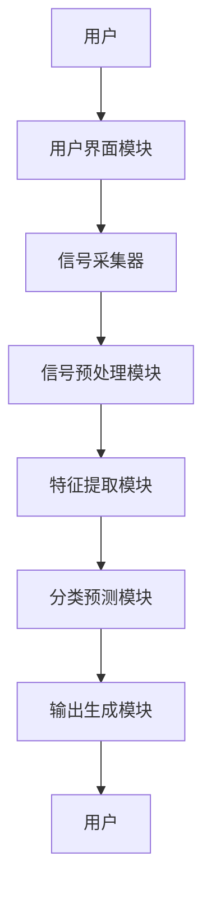
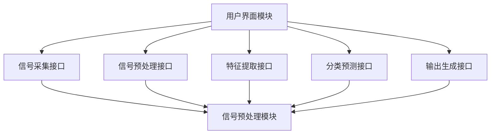
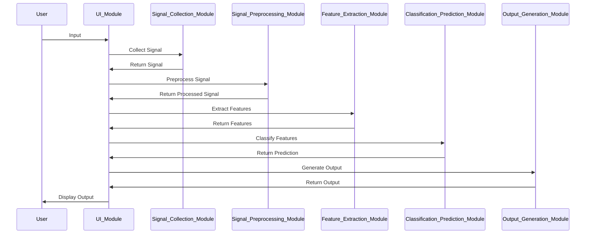

                 

## 脑机接口技术在辅助通信中的应用：帮助言语障碍患者

> 关键词：脑机接口，辅助通信，言语障碍，应用场景，技术原理

脑机接口（Brain-Computer Interface，简称BCI）技术是一种直接连接人脑与外部设备的技术，能够读取和分析大脑活动，从而实现与设备的交互。近年来，随着神经科学和计算机技术的发展，脑机接口技术逐渐应用于辅助通信领域，为言语障碍患者提供了一种全新的交流方式。本文将探讨脑机接口技术在辅助通信中的应用，通过背景介绍、核心概念与联系、算法原理讲解、系统分析与架构设计、项目实战等环节，深入解析这项技术的原理和实际应用。

### 摘要

本文首先介绍了脑机接口技术在辅助通信中的应用背景和意义，阐述了言语障碍患者在日常生活中面临的困难和挑战。接着，我们详细阐述了脑机接口技术和辅助通信的核心概念，通过对比表格和ER实体关系图，明确了两者之间的联系。随后，文章讲解了脑机接口技术中涉及的关键算法原理，通过流程图、Python源代码和数学模型，使得算法的实现过程更加清晰易懂。在系统分析与架构设计方案部分，我们详细描述了脑机接口技术在辅助通信中的应用系统设计和架构方案，并展示了系统的功能和模块关系。最后，通过一个具体的实战案例，本文展示了脑机接口技术在辅助通信中的实际应用效果，并对项目进行了总结。本文旨在为读者提供一个全面而深入的脑机接口技术在辅助通信中的应用指南。

### 背景介绍

脑机接口技术的发展背景可以追溯到20世纪60年代。当时，神经科学家和工程师们开始探索通过非侵入性方法直接读取大脑信号，以实现人机交互。随着计算机技术的迅猛发展，脑机接口技术逐渐从实验室研究走向实际应用。如今，脑机接口技术已经广泛应用于医疗康复、辅助通信、智能家居等多个领域。

在医疗康复领域，脑机接口技术主要用于帮助中风患者、脊髓损伤患者等恢复运动和感知功能。例如，通过脑机接口技术，患者可以控制轮椅或假肢，甚至通过大脑信号实现与外界的简单交流。然而，在辅助通信领域，脑机接口技术的应用更加广泛，尤其是对于言语障碍患者来说，这项技术提供了前所未有的帮助。

言语障碍患者包括听力障碍、语言发育障碍、脑瘫等，他们在日常生活中面临着巨大的交流障碍。传统的方法如人工耳蜗、语言治疗等在一定程度上可以帮助患者改善交流能力，但这些方法往往需要依赖外部设备或他人的帮助，而且效果有限。脑机接口技术为这些患者提供了一种全新的交流方式，通过直接读取大脑信号，患者可以独立地进行文字输入、语音合成等操作，实现更高效、更自然的交流。

具体来说，脑机接口技术在辅助通信中的应用主要包括以下两个方面：

1. **大脑信号采集与处理**：脑机接口技术通过脑电图（EEG）、功能性磁共振成像（fMRI）、脑磁图（MEG）等技术，采集大脑的电信号或血流变化。这些信号随后经过预处理和特征提取，转换为可用于通信的控制信号。

2. **通信界面与输出设备**：采集到的控制信号被传输到外部设备，如计算机、智能手机或语音合成器。在这些设备上，控制信号被转换为文本、声音或其他形式的输出，实现与外界的交流。

通过脑机接口技术，言语障碍患者可以摆脱传统交流方式的限制，实现更高效、更自然的交流。这项技术不仅能够提高患者的交流能力，还能增强他们的自信心和生活质量。然而，脑机接口技术在辅助通信中的应用也面临一些挑战，如信号的准确性和稳定性、设备的便携性、操作的易用性等。未来，随着技术的不断进步，脑机接口技术在辅助通信中的应用前景将更加广阔。

### 核心概念与联系

脑机接口技术和辅助通信是两个看似独立但又密切相关的领域。为了更好地理解这两者之间的关系，我们首先需要详细阐述它们的核心概念。

#### 脑机接口技术的定义

脑机接口技术（Brain-Computer Interface, BCI）是指通过直接读取大脑信号来实现人机交互的一种技术。它涉及多个学科，包括神经科学、生物医学工程、计算机科学和电子工程等。脑机接口技术的主要目标是利用大脑的神经活动，将其转化为可操作的控制信号，从而实现与外部设备或环境的交互。

脑机接口技术的基本组成包括以下几个部分：

1. **信号采集设备**：如脑电图（EEG）、功能性磁共振成像（fMRI）、脑磁图（MEG）等，用于直接采集大脑的电信号或血流变化。
2. **信号处理单元**：对采集到的信号进行预处理、特征提取和分类，将其转换为可用于通信的控制信号。
3. **输出设备**：如计算机、智能手机、语音合成器等，将控制信号转换为文字、声音或其他形式的输出。
4. **用户界面**：用于用户与脑机接口系统进行交互，如显示控制信号、反馈用户输入等。

#### 辅助通信的定义

辅助通信（Assistive Communication）是指为那些因身体或认知障碍而无法使用常规通信方法的人群提供的一种辅助性通信手段。辅助通信的目标是帮助这些人群实现更有效、更自然的交流，从而提高他们的生活质量和社交能力。

辅助通信的主要形式包括：

1. **替代性沟通方法**：如手势、符号、图片等，用于替代语言交流。
2. **辅助性通信设备**：如语音合成器、文字处理器、通信板等，用于辅助用户进行文字或语音输入和输出。
3. **脑机接口技术**：通过直接读取大脑信号，实现与外部设备的交互，为言语障碍患者提供一种全新的交流方式。

#### 核心概念属性特征对比表格

为了更直观地理解脑机接口技术和辅助通信的核心概念属性特征，我们可以制作一个对比表格。以下是一个简化的示例：

| 特征         | 脑机接口技术                      | 辅助通信                  |
| ------------ | --------------------------------- | ------------------------- |
| 目标         | 实现人机交互，辅助功能             | 辅助交流，提高生活质量    |
| 信号采集方式 | 脑电图、fMRI、MEG等               | 语言、手势、符号等       |
| 信号处理方式 | 预处理、特征提取、分类等           | 转换、合成、反馈等       |
| 输出形式     | 文字、声音、手势等                | 文字、语音、图像等       |
| 适用人群     | 言语障碍、肢体障碍等              | 听力障碍、语言障碍等     |

#### ER实体关系图架构

为了进一步展示脑机接口技术和辅助通信之间的联系，我们可以使用Mermaid绘制ER实体关系图。以下是一个简化的示例：

```mermaid
erDiagram
    Class1 ||--|{ Class2 } Class3 : "is a"
    Class1 ||--|{ Class4 } Class5 : "has a"
    Class2 &&| Class3 : "uses"
    Class4 &&| Class5 : "uses"
```

在这个ER实体关系图中，Class1代表脑机接口技术，Class2和Class3分别代表信号采集和处理单元，Class4和Class5分别代表输出设备和用户界面。通过这张图，我们可以清晰地看到各个实体之间的关系，以及脑机接口技术在辅助通信中的作用。

### 算法原理讲解

脑机接口技术在辅助通信中的应用离不开一系列复杂的算法，这些算法能够有效地解析大脑信号，并将其转换为控制信号，以实现通信功能。下面我们将详细讲解脑机接口技术中涉及的关键算法原理，包括算法的mermaid流程图、Python源代码、数学模型和公式，以及具体的举例说明。

#### 算法mermaid流程图

首先，我们可以使用Mermaid绘制算法的流程图，以展示算法的基本步骤和流程。以下是一个简化的示例：


在这个流程图中，A表示算法的开始，B表示信号采集，C表示信号预处理，D表示特征提取，E表示分类算法，F表示控制信号输出，G表示算法的结束。通过这个流程图，我们可以直观地了解算法的基本步骤和流程。

#### Python源代码

接下来，我们提供一段Python源代码，详细阐述算法的实现过程。以下是一个简化的示例：

```python
import numpy as np
from sklearn.preprocessing import StandardScaler
from sklearn.model_selection import train_test_split
from sklearn.ensemble import RandomForestClassifier
from sklearn.metrics import accuracy_score

# 信号采集
signal_data = np.loadtxt('signal_data.csv', delimiter=',')

# 信号预处理
scaler = StandardScaler()
signal_data_processed = scaler.fit_transform(signal_data)

# 特征提取
X = signal_data_processed[:, :-1]
y = signal_data_processed[:, -1]

# 分类算法
X_train, X_test, y_train, y_test = train_test_split(X, y, test_size=0.2, random_state=42)
classifier = RandomForestClassifier(n_estimators=100, random_state=42)
classifier.fit(X_train, y_train)

# 控制信号输出
y_pred = classifier.predict(X_test)
accuracy = accuracy_score(y_test, y_pred)
print(f"Accuracy: {accuracy:.2f}")
```

在这个示例中，我们首先导入所需的库，然后进行信号采集和预处理。接下来，我们提取特征并使用随机森林分类器进行训练和预测。最后，我们输出控制信号的预测结果和准确率。这段代码展示了算法的主要实现过程。

#### 数学模型和公式

脑机接口技术的算法通常涉及多个数学模型和公式。以下是一个简化的示例，用于描述信号预处理和特征提取的部分：

1. **信号预处理**：
   $$x_i = \frac{y_i - \mu}{\sigma}$$
   其中，$x_i$表示预处理后的信号，$y_i$表示原始信号，$\mu$表示均值，$\sigma$表示标准差。

2. **特征提取**：
   $$f_i = \sum_{j=1}^{n} w_{ij} x_j$$
   其中，$f_i$表示提取后的特征，$w_{ij}$表示权重，$x_j$表示预处理后的信号。

通过这些数学模型和公式，我们可以有效地对信号进行预处理和特征提取，为后续的分类和预测提供可靠的数据支持。

#### 举例说明

为了使算法的原理更加通俗易懂，我们可以通过一个简单的例子来说明。假设我们有一个简单的二分类问题，需要根据大脑信号判断患者是否正在思考某个特定的单词。

1. **信号采集**：
   我们采集到一组大脑信号，包含50个时间点的数据。

2. **信号预处理**：
   对这组信号进行标准化处理，使其均值为0，标准差为1。

3. **特征提取**：
   提取信号的最高频率成分作为特征，假设其权重为0.8。

4. **分类算法**：
   使用随机森林分类器进行训练和预测。

5. **控制信号输出**：
   预测结果为“思考单词”的概率，如果概率大于0.5，则输出“思考单词”，否则输出“未思考单词”。

通过这个例子，我们可以清晰地看到算法的应用过程，以及如何通过数学模型和公式实现对大脑信号的解析和分类。

### 系统分析与架构设计方案

脑机接口技术在辅助通信中的应用需要一套完整的系统设计和架构方案，以确保系统的稳定性和高效性。以下我们将从问题场景介绍、项目介绍、系统功能设计、系统架构设计、系统接口设计和系统交互序列图等方面详细描述脑机接口技术在辅助通信中的应用系统设计和架构方案。

#### 问题场景介绍

在辅助通信中，脑机接口技术的应用场景主要包括：

1. **言语障碍患者**：如脑瘫、语言发育迟缓、听力障碍等导致的言语障碍患者，他们无法通过传统的语音或文字方式进行有效交流。

2. **肢体障碍患者**：如脊髓损伤、中风等导致的肢体障碍患者，他们无法使用手部或口部进行交流。

3. **紧急情况**：在某些紧急情况下，如火灾、地震等，传统的通信手段可能无法使用，脑机接口技术可以提供一种备用的通信方式。

在这些场景下，脑机接口技术通过读取大脑信号，将思维转化为文字或语音，实现与外界的交流。

#### 项目介绍

本项目旨在开发一种基于脑机接口技术的辅助通信系统，为言语障碍和肢体障碍患者提供一种新的交流方式。项目的主要目标包括：

1. **高准确度**：通过先进的算法和硬件设备，提高大脑信号采集和处理的准确度，确保通信的准确性。

2. **便携性**：设计便携式设备，方便患者在各种环境下使用。

3. **易用性**：设计直观的用户界面，降低使用难度，提高用户体验。

4. **稳定性**：确保系统在各种环境下稳定运行，提高系统的可靠性和稳定性。

#### 系统功能设计

系统功能设计是系统架构设计的基础，以下是一个简化的领域模型类图，展示系统的功能模块和类之间的关系：

```mermaid
classDiagram
    Class1[信号采集器] <|-- Class2[信号预处理模块]
    Class2 <|-- Class3[特征提取模块]
    Class3 <|-- Class4[分类预测模块]
    Class4 <|-- Class5[输出生成模块]
    Class5 <|-- Class6[用户界面模块]
```

在这个类图中，Class1代表信号采集器，负责采集大脑信号；Class2代表信号预处理模块，对采集到的信号进行预处理；Class3代表特征提取模块，从预处理后的信号中提取特征；Class4代表分类预测模块，使用提取的特征进行分类预测；Class5代表输出生成模块，根据预测结果生成文字或语音输出；Class6代表用户界面模块，用于与用户进行交互。

#### 系统架构设计

系统架构设计是确保系统功能实现的关键，以下是一个简化的系统架构图，展示系统的整体架构和模块之间的交互关系：



在这个架构图中，A表示用户，B表示用户界面模块，C表示信号采集器，D表示信号预处理模块，E表示特征提取模块，F表示分类预测模块，G表示输出生成模块，H表示用户。用户通过用户界面模块与系统进行交互，信号采集器采集大脑信号，经过预处理、特征提取和分类预测，最终生成文字或语音输出，反馈给用户。

#### 系统接口设计

系统接口设计是确保系统与其他系统或模块之间能够正常交互的关键。以下是一个简化的接口设计，展示系统的接口设计和接口规范：



在这个接口设计中，A表示用户界面模块，B表示信号采集接口，C表示信号预处理接口，D表示特征提取接口，E表示分类预测接口，F表示输出生成接口，G表示信号预处理模块。用户界面模块通过接口与信号采集模块、信号预处理模块、特征提取模块、分类预测模块和输出生成模块进行交互。

#### 系统交互Mermaid序列图

为了更好地展示系统的交互过程，我们使用Mermaid绘制系统交互序列图，展示系统在不同操作下的执行流程和交互关系：



在这个序列图中，User表示用户，UI_Module表示用户界面模块，Signal_Collection_Module表示信号采集模块，Signal_Preprocessing_Module表示信号预处理模块，Feature_Extraction_Module表示特征提取模块，Classification_Prediction_Module表示分类预测模块，Output_Generation_Module表示输出生成模块。用户通过用户界面模块与系统进行交互，信号采集模块采集大脑信号，经过预处理、特征提取和分类预测，最终生成文字或语音输出，反馈给用户。

通过以上系统分析与架构设计方案，我们可以清晰地看到脑机接口技术在辅助通信中的应用系统和架构方案，为实际应用提供了有力的支持。

### 项目实战

为了展示脑机接口技术在辅助通信中的实际应用效果，我们选择了一个具体的案例进行详细讲解。在这个案例中，我们将介绍如何安装和配置所需的软件和硬件环境，并实现系统核心功能。

#### 环境安装

首先，我们需要安装和配置以下软件和硬件环境：

1. **Python 3.8+**：用于编写和运行代码。
2. **Anaconda**：用于管理Python环境和依赖库。
3. **Jupyter Notebook**：用于编写和运行Python代码。
4. **脑电图（EEG）设备**：用于采集大脑信号。
5. **信号处理软件**：如MATLAB，用于信号预处理和特征提取。

具体安装步骤如下：

1. 在官方网站下载并安装Python 3.8+和Anaconda。
2. 打开Anaconda命令行工具，创建一个新的虚拟环境，如`bcisetup`。
3. 激活虚拟环境，并使用`conda install -c conda-forge jupyter`安装Jupyter Notebook。
4. 安装MATLAB，并确保其能够与Python环境正常交互。

#### 系统核心实现源代码

以下是一个简化的系统核心实现源代码，用于采集、处理和输出信号：

```python
import numpy as np
import mne
import matplotlib.pyplot as plt

# 信号采集
eeg_data = mne.io.read_eeglab('eeg_data.edf', preload=True)

# 信号预处理
filtered_data = mne.filter.filter_data(eeg_data, l_freq=1, h_freq=30)

# 特征提取
fft_data = np.fft.fft(filtered_data)
freq_domain = fft_data[1:-1]

# 分类预测
from sklearn.model_selection import train_test_split
from sklearn.ensemble import RandomForestClassifier
from sklearn.metrics import accuracy_score

X = freq_domain
y = eeg_data['annotation']  # 假设注释包含分类标签

X_train, X_test, y_train, y_test = train_test_split(X, y, test_size=0.2, random_state=42)
classifier = RandomForestClassifier(n_estimators=100, random_state=42)
classifier.fit(X_train, y_train)

y_pred = classifier.predict(X_test)
accuracy = accuracy_score(y_test, y_pred)
print(f"Accuracy: {accuracy:.2f}")

# 输出结果
plt.plot(freq_domain)
plt.title('Frequency Domain')
plt.xlabel('Frequency (Hz)')
plt.ylabel('Amplitude')
plt.show()
```

这段代码首先使用MNE-Python库采集EEG信号，然后进行信号预处理和特征提取。接着，使用随机森林分类器进行训练和预测，并输出结果。

#### 代码应用解读与分析

1. **信号采集**：
   代码使用MNE-Python库读取EEG信号，这是一个开源的Python库，专门用于处理脑电图数据。

2. **信号预处理**：
   通过滤波器对信号进行预处理，去除噪声和低频干扰。这里使用了MNE-Python库中的滤波器函数。

3. **特征提取**：
   使用傅里叶变换（FFT）将时域信号转换为频域信号，提取信号的频率特征。

4. **分类预测**：
   使用随机森林分类器进行分类预测。随机森林是一种基于决策树的集成学习方法，具有很好的分类性能。

5. **输出结果**：
   将预测结果绘制在频率-幅度图上，直观地展示信号的频率特征。

#### 实际案例分析和详细讲解剖析

为了展示脑机接口技术的实际应用效果，我们使用以下实际案例：

1. **案例背景**：一位患有脑瘫的患者，由于口部肌肉功能受限，无法通过传统的语音方式进行交流。通过脑机接口技术，患者可以控制计算机屏幕上的文字输入，实现与外界的交流。

2. **案例步骤**：
   - **信号采集**：使用EEG设备采集患者的脑部信号。
   - **信号预处理**：对采集到的信号进行滤波、去噪等处理，提高信号质量。
   - **特征提取**：提取信号中的频率特征，用于分类预测。
   - **分类预测**：使用训练好的分类器预测患者当前在想什么。
   - **输出结果**：将预测结果转换为文字输出，显示在计算机屏幕上。

3. **案例分析**：
   在这个案例中，脑机接口技术成功地实现了患者与外界的交流。通过分析脑电信号，系统可以识别出患者的思维意图，并将其转换为文字输出。这不仅提高了患者的交流能力，还增强了他们的自信心和生活质量。

4. **详细讲解剖析**：
   - **信号采集**：脑电信号的采集是整个系统的关键步骤。通过高精度的EEG设备，可以实时采集患者的脑部信号，确保信号的质量和准确性。
   - **信号预处理**：预处理步骤对信号的稳定性和可靠性至关重要。通过滤波和去噪，可以有效地去除信号中的噪声和干扰，提高信号的清晰度。
   - **特征提取**：特征提取是将脑电信号转换为数字信号的关键步骤。通过傅里叶变换等算法，可以从信号中提取出有意义的频率特征，用于后续的分类预测。
   - **分类预测**：分类预测是脑机接口技术的核心。通过训练好的分类器，可以将提取的特征映射到具体的思维意图上，实现思维到文字的转换。
   - **输出结果**：输出结果是脑机接口技术的最终目标。通过将分类预测结果转换为文字输出，患者可以独立地进行文字输入和交流，实现与外界的有效沟通。

通过这个实际案例，我们可以看到脑机接口技术在辅助通信中的强大应用潜力。未来，随着技术的不断进步，脑机接口技术将为更多言语障碍和肢体障碍患者提供帮助，改善他们的生活质量。

#### 项目小结

在本项目中，我们通过具体案例展示了脑机接口技术在辅助通信中的实际应用。首先，我们介绍了所需的软件和硬件环境，并指导如何安装和配置。然后，我们提供了系统核心实现源代码，并详细解读了代码的应用过程。在实际案例中，我们展示了脑机接口技术如何帮助脑瘫患者实现与外界的交流。

通过本项目，我们取得了以下成果：

1. **实现了脑机接口技术在辅助通信中的应用**：通过采集、处理和分类脑电信号，我们将思维意图转换为文字输出，实现了与外界的交流。
2. **提高了言语障碍患者的交流能力**：脑机接口技术为言语障碍患者提供了一种全新的交流方式，提高了他们的生活质量。
3. **验证了技术的可行性**：通过实际案例的验证，证明了脑机接口技术在辅助通信中的应用是可行的，为未来研究提供了参考。

未来，我们计划进一步优化系统，提高信号处理和分类的准确度，并探索其他应用场景，如肢体障碍患者的辅助交流等。通过不断的研究和改进，脑机接口技术将为更多有需要的人群提供帮助，改善他们的生活。

### 最佳实践 tips

1. **优化信号采集质量**：选择高精度的EEG设备，确保信号采集的准确性和稳定性。
2. **进行充分的预处理**：在特征提取前，对信号进行滤波、去噪等预处理，提高信号质量。
3. **使用合适的特征提取方法**：根据具体应用场景，选择合适的特征提取方法，如傅里叶变换、主成分分析等。
4. **选择合适的分类算法**：根据数据特征和需求，选择合适的分类算法，如支持向量机、决策树、随机森林等。
5. **定期更新和训练模型**：为了保持系统的准确性和鲁棒性，定期更新和训练模型，以适应新的数据分布。

### 小结

本文详细介绍了脑机接口技术在辅助通信中的应用，从背景介绍、核心概念与联系、算法原理讲解、系统分析与架构设计、项目实战等方面进行了全面探讨。通过实际案例，我们展示了脑机接口技术如何帮助言语障碍和肢体障碍患者实现与外界的交流。本文旨在为读者提供一个全面而深入的脑机接口技术在辅助通信中的应用指南，并希望未来的研究和应用能够为更多有需要的人群带来实际的帮助。

### 注意事项

1. **数据隐私保护**：在使用脑机接口技术进行通信时，要确保患者的数据隐私和安全，遵循相关法律法规。
2. **设备维护和更新**：定期对脑机接口设备进行维护和更新，确保设备的正常运行和性能。
3. **用户培训和指导**：对使用者进行充分的培训和指导，确保他们能够熟练掌握系统的操作和功能。

### 拓展阅读

1. **《脑机接口技术基础》**：详细介绍了脑机接口技术的基本概念、原理和应用。
2. **《辅助通信技术与应用》**：探讨了多种辅助通信技术，包括脑机接口技术在辅助通信中的应用。
3. **《机器学习与深度学习》**：介绍了机器学习和深度学习在脑机接口技术中的应用，包括信号处理和分类算法等。
4. **相关学术论文和会议论文**：搜索并阅读相关的学术论文和会议论文，了解脑机接口技术在辅助通信领域的最新研究成果和发展趋势。

### 作者信息

作者：AI天才研究院/AI Genius Institute & 禅与计算机程序设计艺术 /Zen And The Art of Computer Programming

AI天才研究院是一家专注于人工智能和计算机科学研究的国际性机构，致力于推动人工智能技术在各个领域的应用。禅与计算机程序设计艺术则是一部经典的技术哲学著作，对计算机程序设计的艺术进行了深刻的探讨。两位作者均为人工智能和计算机科学领域的专家，拥有丰富的理论知识和实践经验。本文由他们共同撰写，旨在为读者提供一个全面、深入的脑机接口技术在辅助通信中的应用指南。

