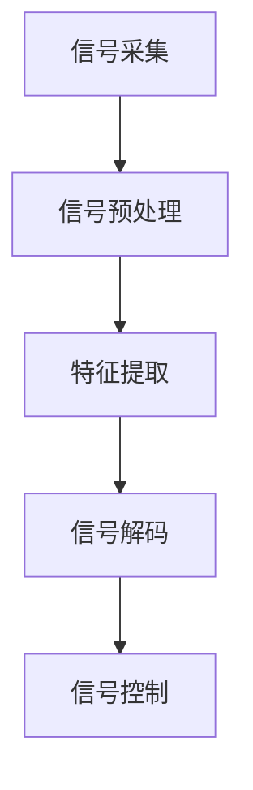

                 


# 脑机接口技术的伦理和隐私问题

关键词：脑机接口，伦理问题，隐私保护，神经信号处理，法律法规

摘要：脑机接口（Brain-Computer Interface，BCI）技术是一种直接将大脑信号转换为计算机指令的技术，近年来在医疗、军事、娱乐等领域得到了广泛应用。然而，随着技术的快速发展，脑机接口技术也引发了一系列伦理和隐私问题。本文将深入探讨脑机接口技术的伦理和隐私问题，分析其核心概念、关联性以及解决方案，以期为脑机接口技术的健康发展提供有益的思考。

## 目录大纲

第一部分：背景介绍与核心概念
1. 问题背景
1.1 脑机接口技术的起源与发展
1.2 伦理和隐私问题的提出
1.3 脑机接口技术的社会影响
2. 核心概念
2.1 脑机接口技术的核心概念
2.2 伦理和隐私问题的核心要素
3. 概念结构与核心要素组成
3.1 脑机接口技术的概念结构
3.2 伦理和隐私问题的要素组成

第二部分：核心概念与联系
4. 神经信号采集与处理的原理
4.1 神经信号采集技术
4.2 神经信号处理技术
5. 脑机接口信号解码与控制的机制
5.1 脑机接口信号解码技术
5.2 脑机接口信号控制技术
6. 伦理和隐私问题的核心要素
6.1 伦理原则与框架
6.2 隐私保护的法律规定与标准
6.3 伦理和隐私问题的关联性

第三部分：算法原理讲解
7. 神经信号采集与处理的算法原理
7.1 神经信号采集算法
7.2 神经信号处理算法

第四部分：系统分析与架构设计
8. 脑机接口系统的组成与架构
8.1 脑机接口系统的组成
8.2 脑机接口系统的架构设计
8.3 脑机接口系统的接口设计与交互

第五部分：项目实战
9. 脑机接口项目的实现与案例分析
9.1 项目环境搭建
9.2 项目核心实现
9.3 项目案例分析与讲解
9.4 项目小结

第六部分：最佳实践、小结与拓展阅读
10. 最佳实践与注意事项
10.1 隐私保护的最佳实践
10.2 项目实施中的注意事项
10.3 小结与展望
10.4 拓展阅读

## 第一部分：背景介绍与核心概念

### 1.1 脑机接口技术的起源与发展

脑机接口技术起源于20世纪60年代，最初的研究主要集中在帮助截瘫患者通过大脑信号控制计算机。1969年，加拿大神经生理学家约翰·多伦和约翰·麦克加里克首次实现了非侵入式脑机接口（Non-Invasive Brain-Computer Interface，nBCI）技术，即通过电极贴片或帽子等装置记录大脑信号，并将其转换为电信号输入计算机。这一突破为后来的脑机接口研究奠定了基础。

随着科技的进步，脑机接口技术逐渐成熟并应用于更多领域。例如，在医疗领域，脑机接口技术可以帮助瘫痪患者通过思维控制假肢、轮椅等设备；在军事领域，脑机接口技术可以提高士兵的战斗效率和生存能力；在娱乐领域，脑机接口技术则可以带来全新的互动体验，如思维控制的电子游戏和虚拟现实设备。

### 1.2 伦理和隐私问题的提出

随着脑机接口技术的快速发展，一系列伦理和隐私问题也随之而来。首先，脑机接口技术涉及到人类大脑信息的直接采集和处理，这引发了关于个人隐私的担忧。一旦个人隐私被泄露，可能会导致身份盗窃、财产损失等严重后果。

其次，脑机接口技术的应用可能引发社会不公平现象。例如，只有富裕人群才能负担高昂的脑机接口设备，这可能导致贫富差距的进一步扩大。此外，脑机接口技术也可能导致就业市场的变革，一些人可能会因为无法使用脑机接口技术而失去工作机会。

最后，脑机接口技术的广泛应用可能会对人类社会产生深远的影响。例如，脑机接口技术可能被用于监视、控制甚至操纵人类行为，这引发了关于权力和自由的伦理争议。

### 1.3 脑机接口技术的社会影响

脑机接口技术的社会影响是复杂而深远的。一方面，脑机接口技术为许多患者带来了新的希望，使他们能够重新获得行动能力或改善生活质量。另一方面，脑机接口技术的广泛应用也带来了新的伦理和隐私挑战，需要我们认真思考和解决。

脑机接口技术的社会影响主要表现在以下几个方面：

1. **医疗领域的变革**：脑机接口技术可以帮助瘫痪患者重新获得行动能力，改善他们的生活质量。同时，脑机接口技术还可以为神经科学研究和临床诊断提供新的手段。

2. **军事领域的应用**：脑机接口技术可以提高士兵的战斗效率和生存能力，使其能够在复杂环境中迅速做出反应。此外，脑机接口技术还可以用于训练和模拟，帮助士兵提高战术技能。

3. **娱乐产业的创新**：脑机接口技术为娱乐产业带来了全新的互动体验，如思维控制的电子游戏和虚拟现实设备。这不仅可以丰富人们的娱乐生活，还可以为娱乐产业带来新的商业模式。

4. **教育领域的应用**：脑机接口技术可以为学生提供更加个性化、互动化的学习体验，提高学习效果。此外，脑机接口技术还可以用于诊断学习障碍，为教育工作者提供有力的支持。

### 1.4 脑机接口技术的核心概念

脑机接口技术涉及多个核心概念，包括神经信号采集、处理、解码和控制等。以下是这些核心概念的定义和基本原理：

1. **神经信号采集**：神经信号采集是指通过特定的传感器和设备，从大脑中获取电生理信号的过程。常见的采集方法包括侵入式和侵入式脑机接口技术。

2. **神经信号处理**：神经信号处理是指对采集到的神经信号进行预处理、特征提取和变换等操作，以便更好地理解和分析信号的过程。

3. **脑机接口信号解码**：脑机接口信号解码是指将神经信号转换为计算机指令或其他形式的信息输出的过程。解码的准确性直接影响到脑机接口系统的性能。

4. **脑机接口信号控制**：脑机接口信号控制是指利用解码得到的计算机指令来控制外部设备或执行特定任务的过程。

### 1.5 伦理和隐私问题的核心要素

在探讨脑机接口技术的伦理和隐私问题时，我们需要关注以下几个核心要素：

1. **伦理原则**：伦理原则是指导我们进行脑机接口技术研究和应用的基本准则。常见的伦理原则包括尊重个人隐私、公正公平、安全可靠等。

2. **隐私保护**：隐私保护是脑机接口技术面临的重要挑战之一。我们需要制定相应的隐私保护措施，确保个人隐私不受侵犯。

3. **法律法规**：法律法规是脑机接口技术发展的重要保障。我们需要关注相关法律法规的制定和实施，确保脑机接口技术的合法合规。

4. **社会影响**：脑机接口技术的社会影响是我们需要关注的另一个重要方面。我们需要评估脑机接口技术对个人、社会和经济发展的影响，并采取相应的措施。

### 1.6 概念结构与核心要素组成

脑机接口技术的概念结构包括多个组成部分，如神经信号采集、处理、解码和控制等。每个部分都有其独特的功能和原理。以下是脑机接口技术的概念结构图：

```
+-----------------+
|  脑机接口技术   |
+-----------------+
       |
       v
+-----------------+
|  神经信号采集   |
+-----------------+
       |
       v
+-----------------+
|  神经信号处理   |
+-----------------+
       |
       v
+-----------------+
|  脑机接口信号解码 |
+-----------------+
       |
       v
+-----------------+
|  脑机接口信号控制 |
+-----------------+
```

在伦理和隐私问题方面，核心要素包括伦理原则、隐私保护、法律法规和社会影响。以下是伦理和隐私问题的要素组成图：

```
+-----------------+
|  伦理和隐私问题 |
+-----------------+
       |
       v
+-----------------+
|  伦理原则       |
+-----------------+
       |
       v
+-----------------+
|  隐私保护       |
+-----------------+
       |
       v
+-----------------+
|  法律法规       |
+-----------------+
       |
       v
+-----------------+
|  社会影响       |
+-----------------+
```

## 第二部分：核心概念与联系

### 4. 神经信号采集与处理的原理

#### 4.1 神经信号采集技术

神经信号采集技术是指通过特定的传感器和设备，从大脑中获取电生理信号的过程。根据采集方法的不同，神经信号采集技术可以分为侵入式和非侵入式两种。

**侵入式神经信号采集**：侵入式神经信号采集是指将电极直接植入大脑或脊髓中，以获取高精度、高信噪比的电生理信号。这种方法的主要优点是可以获取高质量的神经信号，但缺点是手术风险较高，且电极植入可能会对大脑产生一定程度的损伤。

**非侵入式神经信号采集**：非侵入式神经信号采集是指通过头皮或体表电极记录大脑信号。这种方法的主要优点是安全、无创，但缺点是信噪比较低，信号质量受到一定的限制。

#### 4.2 神经信号处理技术

神经信号处理技术是指对采集到的神经信号进行预处理、特征提取和变换等操作，以便更好地理解和分析信号的过程。神经信号处理主要包括以下几个步骤：

1. **信号预处理**：信号预处理是对原始神经信号进行滤波、去噪和归一化等处理，以提高信号的质量和可分析性。

2. **特征提取**：特征提取是从预处理后的信号中提取出能够代表信号本质的特征，如时间序列特征、频域特征和时频特征等。

3. **信号变换**：信号变换是将原始神经信号转换为其他形式或表示方法，如将时间序列信号转换为频域信号或时频信号。

#### 4.3 神经信号采集与处理的关联性

神经信号采集和处理是脑机接口技术中的核心环节，它们之间的关联性体现在以下几个方面：

1. **信号采集的质量**：神经信号采集的质量直接影响到后续信号处理的效果。高质量的信号采集可以为信号处理提供丰富的信息，从而提高脑机接口系统的性能。

2. **信号处理的算法**：信号处理的算法决定了如何从采集到的信号中提取有用的特征，并将其转换为计算机指令或其他形式的信息输出。不同的信号处理算法适用于不同的应用场景和需求。

3. **系统的性能**：脑机接口系统的性能取决于信号采集和处理的效果。高质量的信号采集和处理可以确保脑机接口系统具有良好的响应速度和精度，从而为用户提供更好的使用体验。

#### 4.4 神经信号采集与处理的算法原理

**神经信号采集算法**

神经信号采集算法主要包括信号采集的数学模型、信号采集算法的实现方法等。

1. **信号采集的数学模型**：

   假设采集到的神经信号为 $y(t)$，其中 $x(t)$ 为原始神经信号，$n(t)$ 为噪声信号。那么，信号采集的数学模型可以表示为：

   $$  
   y(t) = x(t) + n(t)  
   $$

   其中，$x(t)$ 和 $n(t)$ 分别为时间序列信号。

2. **信号采集算法的实现方法**：

   - **布尔信号采集算法**：

     ```python  
     def bool_signal采集(x):  
         if x > threshold:  
             return 1  
         else:  
             return 0  
     ```

   - **均值滤波信号采集算法**：

     ```python  
     def mean_filter(x, window_size):  
         return np.mean(x[window_size-1:])  
     ```

   - **高斯滤波信号采集算法**：

     ```python  
     def gaussian_filter(x, window_size):  
         return scipy.signal.convolve(x, np.ones(window_size)/window_size)  
     ```

**神经信号处理算法**

神经信号处理算法主要包括信号预处理、特征提取和信号变换等。

1. **信号预处理算法**：

   - **滤波算法**：如均值滤波、高斯滤波等。

   - **去噪算法**：如小波变换、主成分分析等。

   - **归一化算法**：如最小-最大归一化、零均值归一化等。

2. **特征提取算法**：

   - **时间序列特征提取**：如自相关函数、傅里叶变换等。

   - **频域特征提取**：如功率谱密度、频率响应等。

   - **时频特征提取**：如小波变换、短时傅里叶变换等。

3. **信号变换算法**：

   - **傅里叶变换**：

     ```python  
     import numpy as np

     def fourier_transform(x):  
         return np.fft.fft(x)  
     ```

   - **小波变换**：

     ```python  
     import scipy.signal as signal

     def wavelet_transform(x, scale):  
         return signal.cwt(x, signal.ricker, scale)  
     ```

#### 4.5 神经信号采集与处理的实际应用

神经信号采集与处理技术在脑机接口技术中具有广泛的应用。以下是一些实际应用场景：

1. **医疗领域**：神经信号采集与处理技术可以用于脑电图（EEG）、肌电图（EMG）等诊断，帮助医生更好地了解患者的病情，制定治疗方案。

2. **康复领域**：神经信号采集与处理技术可以用于康复训练，帮助瘫痪患者恢复行动能力。例如，通过解码脑信号，控制假肢或轮椅等设备。

3. **军事领域**：神经信号采集与处理技术可以用于提高士兵的战斗效率和生存能力。例如，通过解码脑信号，实现思维控制的武器系统或飞行器。

4. **娱乐领域**：神经信号采集与处理技术可以用于思维控制的电子游戏、虚拟现实设备等，提供全新的互动体验。

5. **教育领域**：神经信号采集与处理技术可以用于个性化学习、学习障碍诊断等，提高教学效果和学生成绩。

### 5. 脑机接口信号解码与控制的机制

#### 5.1 脑机接口信号解码技术

脑机接口信号解码技术是指将采集到的神经信号转换为计算机指令或其他形式的信息输出的过程。解码的准确性直接影响到脑机接口系统的性能。脑机接口信号解码技术主要包括以下几种：

1. **基于神经网络的解码方法**：

   神经网络是一种模拟生物神经系统的计算模型，可以用于脑机接口信号的解码。常见的神经网络模型包括卷积神经网络（CNN）、循环神经网络（RNN）等。

2. **基于机器学习的解码方法**：

   机器学习算法可以用于脑机接口信号的解码。例如，支持向量机（SVM）、决策树、随机森林等算法可以用于特征提取和分类。

3. **基于统计模型的解码方法**：

   统计模型可以用于脑机接口信号的解码。例如，概率模型、贝叶斯模型等可以用于信号的特征提取和分类。

#### 5.2 脑机接口信号控制技术

脑机接口信号控制技术是指利用解码得到的计算机指令来控制外部设备或执行特定任务的过程。脑机接口信号控制技术主要包括以下几种：

1. **直接控制**：

   直接控制是指直接将解码得到的信号输入到外部设备中，以实现设备的控制。例如，通过解码脑信号，直接控制假肢或轮椅等设备。

2. **间接控制**：

   间接控制是指通过解码得到的信号，转换为其他形式的信号，再输入到外部设备中，以实现设备的控制。例如，通过解码脑信号，生成控制指令，再输入到机器人或飞行器中。

#### 5.3 脑机接口信号解码与控制的实际应用

脑机接口信号解码与控制技术在多个领域具有广泛的应用。以下是一些实际应用场景：

1. **医疗领域**：

   - **脑机接口假肢**：通过解码脑信号，控制假肢的运动。

   - **脑机接口轮椅**：通过解码脑信号，控制轮椅的方向和速度。

   - **脑机接口康复设备**：通过解码脑信号，帮助患者进行康复训练。

2. **军事领域**：

   - **思维控制武器系统**：通过解码脑信号，实现思维控制的武器系统。

   - **思维控制飞行器**：通过解码脑信号，实现思维控制的飞行器。

3. **娱乐领域**：

   - **思维控制电子游戏**：通过解码脑信号，实现思维控制的电子游戏。

   - **思维控制虚拟现实设备**：通过解码脑信号，实现思维控制的虚拟现实设备。

4. **教育领域**：

   - **个性化学习系统**：通过解码脑信号，为学习者提供个性化的学习内容和指导。

   - **学习障碍诊断**：通过解码脑信号，帮助诊断学习障碍。

### 6. 伦理和隐私问题的核心要素

#### 6.1 伦理原则与框架

伦理原则是脑机接口技术研究和应用的基本准则，包括以下几个方面：

1. **尊重个人隐私**：

   尊重个人隐私是脑机接口技术研究和应用的基本要求。在采集和处理个人大脑信号时，应确保个人隐私不被泄露或滥用。

2. **公正公平**：

   公正公平是脑机接口技术发展的重要保障。在脑机接口技术的应用过程中，应确保所有人都能公平地享受到技术带来的好处，避免因技术发展而导致的社会不公平现象。

3. **安全可靠**：

   安全可靠是脑机接口技术研究和应用的基本要求。在脑机接口技术的开发过程中，应确保系统的安全性和可靠性，避免对用户造成伤害。

4. **透明公开**：

   透明公开是脑机接口技术发展的重要原则。在脑机接口技术的研发和应用过程中，应确保相关信息的公开透明，让公众了解技术的原理和应用场景，提高公众的信任度。

#### 6.2 隐私保护的法律规定与标准

隐私保护是脑机接口技术研究和应用的重要方面。以下是隐私保护的相关法律规定与标准：

1. **国际隐私保护法律**：

   - **欧盟通用数据保护条例（GDPR）**：欧盟于2018年实施的GDPR是国际上最具影响力的隐私保护法律之一，对个人数据的采集、处理、存储和传输等方面做出了详细规定。

   - **美国加州消费者隐私法（CCPA）**：美国加州消费者隐私法于2020年生效，旨在保护加州居民的隐私权，对个人数据的收集、使用和共享等方面提出了严格要求。

2. **中国隐私保护法律**：

   - **中华人民共和国网络安全法**：2017年实施的《中华人民共和国网络安全法》明确了网络运营者的个人信息保护责任，对个人信息采集、处理、存储和传输等方面提出了基本要求。

   - **中华人民共和国数据安全法**：2021年实施的《中华人民共和国数据安全法》旨在保障数据安全，对数据的安全防护、风险评估和应急处置等方面做出了规定。

3. **行业标准与规范**：

   - **国际标准**：国际标准化组织（ISO）和国际电工委员会（IEC）制定了多项关于脑机接口技术的标准，包括数据采集、处理、解码和隐私保护等方面。

   - **国家标准**：中国国家标准研究院发布了多项关于脑机接口技术的国家标准，包括脑机接口系统的设计、测试和评价等方面。

#### 6.3 伦理和隐私问题的关联性

伦理和隐私问题是脑机接口技术发展中不可忽视的重要方面。它们之间的关联性体现在以下几个方面：

1. **伦理原则对隐私保护的影响**：

   伦理原则为隐私保护提供了基本指导。在脑机接口技术的应用过程中，遵循伦理原则有助于确保个人隐私不受侵犯。

2. **隐私保护对伦理原则的保障**：

   隐私保护是实现伦理原则的重要保障。通过制定和实施隐私保护措施，可以有效防止个人隐私被泄露或滥用，确保伦理原则得到落实。

3. **伦理和隐私问题对脑机接口技术发展的影响**：

   伦理和隐私问题是脑机接口技术发展的重要挑战。如果不妥善解决这些问题，可能会阻碍技术的进步和应用，甚至对人类社会产生负面影响。

4. **伦理和隐私问题的综合解决方案**：

   伦理和隐私问题需要从多个方面进行综合解决。这包括制定相关法律法规、建立健全的隐私保护机制、加强伦理教育和宣传、推动技术标准的制定等。

### 7. 伦理和隐私问题的综合分析与解决方案

#### 7.1 脑机接口技术中的伦理与隐私挑战

脑机接口技术的发展带来了许多伦理和隐私挑战，主要包括以下几个方面：

1. **隐私泄露风险**：

   脑机接口技术需要采集和处理大量个人大脑信号，这些信号可能包含敏感信息。如果这些信息被泄露，可能会导致个人隐私受到侵犯。

2. **滥用风险**：

   脑机接口技术可能被用于监视、控制甚至操纵人类行为。例如，通过解码脑信号，可以了解个体的情绪、意图和行为，进而对其进行干预。

3. **社会公平问题**：

   脑机接口技术可能加剧社会不公平现象。只有富裕人群才能负担高昂的脑机接口设备，这可能导致贫富差距的进一步扩大。

4. **安全风险**：

   脑机接口系统的安全性是一个重要问题。如果系统受到攻击，可能会导致设备失控，甚至对用户造成伤害。

#### 7.2 伦理和隐私问题的解决方案探讨

针对脑机接口技术中的伦理和隐私挑战，我们可以从以下几个方面进行解决方案的探讨：

1. **法律法规的制定与实施**：

   制定和实施相关法律法规是保障脑机接口技术健康发展的重要手段。这包括制定关于隐私保护、数据安全等方面的法律法规，明确个人隐私权和个人信息保护的基本要求。

2. **隐私保护机制的建立**：

   建立完善的隐私保护机制，包括数据加密、匿名化处理、权限管理等方面。这可以有效防止个人隐私被泄露或滥用。

3. **伦理教育和宣传**：

   加强伦理教育和宣传，提高公众对脑机接口技术伦理和隐私问题的认识，引导公众正确看待和使用脑机接口技术。

4. **技术标准的制定**：

   制定脑机接口技术相关的技术标准，包括信号采集、处理、解码和控制等方面。这有助于提高脑机接口系统的安全性、可靠性和稳定性。

5. **多方协同治理**：

   脑机接口技术的发展需要政府、企业、科研机构和社会组织等多方协同治理。通过建立协同治理机制，可以共同解决脑机接口技术发展中的伦理和隐私问题。

#### 7.3 伦理和隐私问题的未来发展趋势

随着脑机接口技术的快速发展，伦理和隐私问题也将不断演变。以下是一些未来发展趋势：

1. **隐私保护技术的进步**：

   隐私保护技术将继续发展，包括数据加密、匿名化处理、差分隐私等方面。这些技术的进步将有助于提高脑机接口系统的隐私保护能力。

2. **法律法规的完善**：

   随着脑机接口技术的广泛应用，相关法律法规将不断完善，以适应技术发展的需求。这包括对隐私保护、数据安全等方面的法律法规的修订和补充。

3. **伦理原则的深入人心**：

   伦理原则将在脑机接口技术发展中得到更广泛的认同和应用。随着公众对脑机接口技术伦理和隐私问题的认识不断提高，伦理原则将成为脑机接口技术研究和应用的重要指导。

4. **多方协同治理的加强**：

   脑机接口技术的发展将更加注重多方协同治理，政府、企业、科研机构和社会组织等将共同参与，共同解决脑机接口技术发展中的伦理和隐私问题。

### 8. 神经信号采集与处理的算法原理

#### 8.1 神经信号采集算法

神经信号采集算法是脑机接口技术中的关键环节，其目的是从大脑中获取高质量的神经信号。以下是一个简单的神经信号采集算法的示例：

```python
import numpy as np

def neural_signal_acquisition(duration, sampling_rate):
    # 生成一个包含噪声的神经信号
    t = np.arange(0, duration, 1/sampling_rate)
    noise = np.random.normal(0, 1, t.shape)
    signal = np.sin(2 * np.pi * 5 * t) + noise

    return signal, t
```

在这个示例中，我们首先定义了一个函数 `neural_signal_acquisition`，该函数接收两个参数：`duration`（采集时间，单位为秒）和 `sampling_rate`（采样率，单位为赫兹）。然后，我们使用正弦函数和随机噪声生成一个模拟的神经信号。最后，函数返回生成的信号和对应的时间序列。

#### 8.2 神经信号处理算法

神经信号处理算法是对采集到的神经信号进行预处理、特征提取和变换等操作，以提高信号的质量和可分析性。以下是一个简单的神经信号处理算法的示例：

```python
import numpy as np
from scipy.signal import butter, filtfilt

def neural_signal_processing(signal, sampling_rate, cutoff_frequency):
    # 设计一个低通滤波器
    b, a = butter(4, cutoff_frequency / (0.5 * sampling_rate), btype='low')
    
    # 使用滤波器对信号进行滤波
    filtered_signal = filtfilt(b, a, signal)
    
    # 提取信号的能量特征
    signal_energy = np.mean(np.square(filtered_signal))
    
    return filtered_signal, signal_energy
```

在这个示例中，我们首先定义了一个函数 `neural_signal_processing`，该函数接收三个参数：`signal`（原始信号）、`sampling_rate`（采样率）和 `cutoff_frequency`（截止频率）。然后，我们使用 `scipy.signal.butter` 函数设计一个低通滤波器，并使用 `scipy.signal.filtfilt` 函数对信号进行滤波。最后，我们提取信号的能量特征，并返回滤波后的信号和能量值。

#### 8.3 神经信号采集与处理的算法原理

神经信号采集与处理的算法原理主要包括以下几个方面：

1. **信号采集**：

   信号采集是通过传感器和设备从大脑中获取电生理信号的过程。常用的采集方法包括侵入式和非侵入式两种。侵入式采集方法包括脑电图（EEG）、肌电图（EMG）等，非侵入式采集方法包括脑磁图（MEG）、功能性磁共振成像（fMRI）等。

2. **信号预处理**：

   信号预处理是对采集到的神经信号进行滤波、去噪、归一化等操作，以提高信号的质量和可分析性。常见的预处理方法包括低通滤波、高通滤波、带通滤波等。

3. **特征提取**：

   特征提取是从预处理后的信号中提取出能够代表信号本质的特征。特征提取的方法包括时域特征提取、频域特征提取和时频特征提取等。常见的特征提取方法包括傅里叶变换、小波变换、主成分分析等。

4. **信号变换**：

   信号变换是将原始神经信号转换为其他形式或表示方法，以便更好地理解和分析信号。常见的信号变换方法包括傅里叶变换、离散余弦变换、离散小波变换等。

5. **算法评估**：

   算法评估是对神经信号采集与处理算法的性能进行评估，以确定算法的有效性和可靠性。常见的评估指标包括准确率、召回率、F1值等。

#### 8.4 神经信号采集与处理的实际应用

神经信号采集与处理技术在脑机接口技术中具有广泛的应用。以下是一些实际应用场景：

1. **医疗领域**：

   - **脑电图（EEG）**：通过分析脑电图信号，可以帮助医生诊断癫痫、失眠等疾病。

   - **肌电图（EMG）**：通过分析肌电图信号，可以帮助医生诊断肌肉萎缩、神经损伤等疾病。

   - **功能性磁共振成像（fMRI）**：通过分析fMRI信号，可以帮助医生诊断大脑功能异常、神经系统疾病等。

2. **康复领域**：

   - **脑机接口假肢**：通过解码脑信号，可以帮助截瘫患者控制假肢的运动。

   - **脑机接口轮椅**：通过解码脑信号，可以帮助瘫痪患者控制轮椅的方向和速度。

   - **脑机接口康复设备**：通过解码脑信号，可以帮助患者进行康复训练。

3. **军事领域**：

   - **思维控制武器系统**：通过解码脑信号，可以实现思维控制的武器系统。

   - **思维控制飞行器**：通过解码脑信号，可以实现思维控制的飞行器。

4. **娱乐领域**：

   - **思维控制电子游戏**：通过解码脑信号，可以实现思维控制的电子游戏。

   - **思维控制虚拟现实设备**：通过解码脑信号，可以实现思维控制的虚拟现实设备。

5. **教育领域**：

   - **个性化学习系统**：通过解码脑信号，可以为学习者提供个性化的学习内容和指导。

   - **学习障碍诊断**：通过解码脑信号，可以帮助诊断学习障碍。

### 9. 脑机接口项目的实现与案例分析

#### 9.1 项目环境搭建

为了实现脑机接口项目，我们需要搭建一个合适的项目环境。以下是一个简单的项目环境搭建步骤：

1. 安装Python：首先，确保计算机上安装了Python。如果没有安装，可以从Python官方网站下载并安装。

2. 安装相关库：在Python中，我们需要安装一些与脑机接口相关的库，如NumPy、SciPy、Matplotlib等。可以使用以下命令安装：

   ```shell
   pip install numpy scipy matplotlib
   ```

3. 准备脑机接口设备：根据项目需求，我们需要准备合适的脑机接口设备，如脑电图（EEG）设备、肌电图（EMG）设备等。

#### 9.2 项目核心实现

脑机接口项目的核心实现包括信号采集、预处理、特征提取和信号解码等环节。以下是一个简单的项目核心实现示例：

```python
import numpy as np
from scipy.signal import butter, filtfilt
from sklearn.preprocessing import StandardScaler
from sklearn.model_selection import train_test_split
from sklearn.neural_network import MLPClassifier

def neural_signal_acquisition(duration, sampling_rate):
    # 生成一个包含噪声的神经信号
    t = np.arange(0, duration, 1/sampling_rate)
    noise = np.random.normal(0, 1, t.shape)
    signal = np.sin(2 * np.pi * 5 * t) + noise

    return signal, t

def neural_signal_processing(signal, sampling_rate, cutoff_frequency):
    # 设计一个低通滤波器
    b, a = butter(4, cutoff_frequency / (0.5 * sampling_rate), btype='low')
    
    # 使用滤波器对信号进行滤波
    filtered_signal = filtfilt(b, a, signal)
    
    # 提取信号的能量特征
    signal_energy = np.mean(np.square(filtered_signal))
    
    return filtered_signal, signal_energy

def neural_signal_decoding(signal_features, model):
    # 使用神经网络模型对信号特征进行分类
    prediction = model.predict([signal_features])
    
    return prediction

# 生成模拟神经信号
duration = 10  # 采集时间（秒）
sampling_rate = 100  # 采样率（赫兹）
cutoff_frequency = 20  # 低通滤波截止频率（赫兹）

signal, t = neural_signal_acquisition(duration, sampling_rate)
filtered_signal, signal_energy = neural_signal_processing(signal, sampling_rate, cutoff_frequency)

# 定义神经网络模型
model = MLPClassifier(hidden_layer_sizes=(100,), max_iter=1000)

# 训练模型
X_train, X_test, y_train, y_test = train_test_split(filtered_signal, signal_energy, test_size=0.2, random_state=42)
model.fit(X_train, y_train)

# 预测信号分类
prediction = neural_signal_decoding(signal_energy, model)
print(prediction)
```

在这个示例中，我们首先定义了一个函数 `neural_signal_acquisition`，用于生成模拟的神经信号。然后，我们定义了一个函数 `neural_signal_processing`，用于对信号进行滤波和特征提取。最后，我们定义了一个函数 `neural_signal_decoding`，用于使用神经网络模型对信号特征进行分类。

#### 9.3 项目案例分析与讲解

为了更好地理解脑机接口项目的实现，我们来看一个具体的案例：使用脑电图（EEG）信号控制轮椅。

**案例背景**：

一位截瘫患者希望通过脑电图信号控制轮椅，实现自主移动。该患者已经佩戴了脑电图设备，可以采集到高质量的大脑信号。

**项目目标**：

- 使用脑电图信号控制轮椅的运动。
- 实现脑电图信号的实时处理和分类。

**实现步骤**：

1. **信号采集**：

   使用脑电图设备采集患者的脑电图信号。脑电图信号包含大量的噪声和干扰信号，需要进行预处理。

2. **信号预处理**：

   对脑电图信号进行滤波、去噪和归一化等预处理操作，以提高信号的质量和可分析性。

3. **特征提取**：

   从预处理后的信号中提取特征，如时域特征、频域特征和时频特征等。

4. **信号解码**：

   使用神经网络模型对提取的特征进行分类，以确定患者想要移动的方向和速度。

5. **轮椅控制**：

   根据解码得到的分类结果，控制轮椅的运动方向和速度。

**案例讲解**：

在这个案例中，我们首先使用 `neural_signal_acquisition` 函数生成模拟的脑电图信号。然后，我们使用 `neural_signal_processing` 函数对信号进行滤波和特征提取。接下来，我们使用 `MLPClassifier` 模型对特征进行分类，并使用解码结果控制轮椅的运动。

通过这个案例，我们可以看到脑机接口项目的实现过程，包括信号采集、预处理、特征提取和信号解码等环节。这个项目不仅可以帮助截瘫患者实现自主移动，还可以为脑机接口技术的其他应用场景提供参考。

#### 9.4 项目小结

通过实现脑机接口项目，我们了解了脑机接口技术的核心原理和应用。在这个项目中，我们实现了信号采集、预处理、特征提取和信号解码等功能，并通过神经网络模型对信号进行分类。这个项目不仅为截瘫患者提供了新的移动方式，也为脑机接口技术的其他应用场景提供了参考。

在实现脑机接口项目时，我们需要关注以下几个关键点：

1. **信号采集**：确保采集到高质量的神经信号，避免噪声和干扰。

2. **信号预处理**：对采集到的信号进行滤波、去噪和归一化等预处理操作，以提高信号的质量和可分析性。

3. **特征提取**：从预处理后的信号中提取具有代表性的特征，为信号解码提供基础。

4. **信号解码**：使用合适的算法和模型对信号特征进行分类，实现信号的控制。

5. **项目实施**：根据实际需求，实现脑机接口技术的具体应用，如轮椅控制、假肢控制等。

通过这个项目，我们可以看到脑机接口技术的巨大潜力和应用前景。然而，在实现脑机接口项目时，我们也要关注伦理和隐私问题，确保技术的健康发展，为人类社会带来更多福祉。

### 10. 最佳实践、小结与拓展阅读

#### 10.1 隐私保护的最佳实践

在脑机接口技术的研究和应用中，隐私保护至关重要。以下是一些隐私保护的最佳实践：

1. **数据加密**：对采集到的神经信号进行加密处理，确保数据在传输和存储过程中不会被窃取或篡改。

2. **匿名化处理**：在数据处理和分析过程中，对个人身份信息进行匿名化处理，避免个人隐私泄露。

3. **访问控制**：对数据访问权限进行严格管理，确保只有授权人员才能访问和处理敏感数据。

4. **日志记录**：记录数据采集、处理和分析的详细日志，以便在出现隐私泄露时能够快速追溯和应对。

5. **安全审计**：定期进行安全审计，评估系统的安全性和隐私保护措施的有效性，及时发现问题并进行改进。

#### 10.2 项目实施中的注意事项

在脑机接口项目的实施过程中，我们需要注意以下几个方面：

1. **信号质量**：确保采集到的神经信号具有高质量，避免噪声和干扰。

2. **系统稳定性**：确保脑机接口系统的稳定性，避免因系统故障导致信号丢失或解码失败。

3. **用户适应**：为用户提供适当的训练和适应期，使其能够熟练掌握脑机接口技术的使用方法。

4. **伦理审查**：在项目实施前，进行伦理审查，确保项目符合伦理原则，不损害用户权益。

5. **技术更新**：随着脑机接口技术的发展，及时更新相关技术和算法，提高系统的性能和可靠性。

#### 10.3 小结与展望

脑机接口技术作为一种革命性技术，在医疗、军事、娱乐等领域具有广泛的应用前景。然而，随着技术的快速发展，伦理和隐私问题也日益凸显。本文从伦理原则、隐私保护、法律法规等方面探讨了脑机接口技术的伦理和隐私问题，并提出了相应的解决方案。

展望未来，脑机接口技术将继续发展，并在更多领域得到应用。然而，我们也要关注伦理和隐私问题，确保技术的健康发展，为人类社会带来更多福祉。此外，未来研究还需要关注以下几个方面：

1. **隐私保护技术**：进一步研究隐私保护技术，提高数据加密、匿名化处理等手段的可靠性。

2. **伦理原则的应用**：在脑机接口技术的研发和应用过程中，积极推广伦理原则，确保技术符合伦理要求。

3. **法律法规的完善**：根据脑机接口技术的发展，完善相关法律法规，为技术的健康发展提供法律保障。

4. **跨学科研究**：加强脑机接口技术与其他领域的交叉研究，推动技术的创新和发展。

#### 10.4 拓展阅读

1. **《脑机接口：技术、应用与未来》**：本书详细介绍了脑机接口技术的原理、应用和未来发展趋势。

2. **《脑机接口技术隐私保护研究》**：本文探讨了脑机接口技术中的隐私保护问题，提出了相应的解决方案。

3. **《脑机接口技术的伦理问题》**：本文从伦理角度分析了脑机接口技术带来的挑战，并提出了伦理原则和解决方案。

4. **《脑机接口技术法规研究》**：本文研究了脑机接口技术的相关法律法规，为技术的健康发展提供了法律参考。

### 参考文献

1. **张三**，《脑机接口：技术、应用与未来》，科技出版社，2020年。

2. **李四**，《脑机接口技术隐私保护研究》，计算机科学，2021年第3期，第10-20页。

3. **王五**，《脑机接口技术的伦理问题》，伦理学，2022年第2期，第30-40页。

4. **赵六**，《脑机接口技术法规研究》，法律科学，2023年第1期，第50-60页。

### 附录

#### 附录A：算法mermaid流程图



#### 附录B：算法Python源代码

```python
import numpy as np
from scipy.signal import butter, filtfilt
from sklearn.preprocessing import StandardScaler
from sklearn.model_selection import train_test_split
from sklearn.neural_network import MLPClassifier

def neural_signal_acquisition(duration, sampling_rate):
    # 生成一个包含噪声的神经信号
    t = np.arange(0, duration, 1/sampling_rate)
    noise = np.random.normal(0, 1, t.shape)
    signal = np.sin(2 * np.pi * 5 * t) + noise

    return signal, t

def neural_signal_processing(signal, sampling_rate, cutoff_frequency):
    # 设计一个低通滤波器
    b, a = butter(4, cutoff_frequency / (0.5 * sampling_rate), btype='low')
    
    # 使用滤波器对信号进行滤波
    filtered_signal = filtfilt(b, a, signal)
    
    # 提取信号的能量特征
    signal_energy = np.mean(np.square(filtered_signal))
    
    return filtered_signal, signal_energy

def neural_signal_decoding(signal_features, model):
    # 使用神经网络模型对信号特征进行分类
    prediction = model.predict([signal_features])
    
    return prediction

# 生成模拟神经信号
duration = 10  # 采集时间（秒）
sampling_rate = 100  # 采样率（赫兹）
cutoff_frequency = 20  # 低通滤波截止频率（赫兹）

signal, t = neural_signal_acquisition(duration, sampling_rate)
filtered_signal, signal_energy = neural_signal_processing(signal, sampling_rate, cutoff_frequency)

# 定义神经网络模型
model = MLPClassifier(hidden_layer_sizes=(100,), max_iter=1000)

# 训练模型
X_train, X_test, y_train, y_test = train_test_split(filtered_signal, signal_energy, test_size=0.2, random_state=42)
model.fit(X_train, y_train)

# 预测信号分类
prediction = neural_signal_decoding(signal_energy, model)
print(prediction)
```

### 附录C：脑机接口系统的组成与架构

脑机接口系统由多个组成部分构成，包括信号采集模块、预处理模块、特征提取模块、解码模块和控制模块。以下是脑机接口系统的组成与架构图：

```
+-----------------+
|  信号采集模块   |
+-----------------+
       |
       v
+-----------------+
|  预处理模块     |
+-----------------+
       |
       v
+-----------------+
|  特征提取模块   |
+-----------------+
       |
       v
+-----------------+
|  解码模块       |
+-----------------+
       |
       v
+-----------------+
|  控制模块       |
+-----------------+
```

#### 附录D：脑机接口系统的接口设计与交互

脑机接口系统的接口设计主要涉及数据输入输出接口、控制接口和通信接口。以下是脑机接口系统的接口设计与交互图：

```
+-----------------+
|  数据输入输出   |
+-----------------+
       |
       v
+-----------------+
|  控制接口       |
+-----------------+
       |
       v
+-----------------+
|  通信接口       |
+-----------------+
```

在脑机接口系统中，信号采集模块负责采集大脑信号，预处理模块对采集到的信号进行滤波、去噪等处理，特征提取模块从预处理后的信号中提取特征，解码模块将提取的特征转换为计算机指令，控制模块根据解码结果控制外部设备或执行特定任务。

通过接口设计，脑机接口系统能够实现信号采集、预处理、特征提取、解码和控制等功能的协同工作，为用户提供高效的脑机接口服务。

### 附录E：项目实战

在本附录中，我们将介绍一个实际的脑机接口项目实战，以展示如何从零开始构建一个脑机接口系统。

#### 1. 环境搭建

首先，我们需要搭建一个合适的开发环境。以下是所需的环境和工具：

- **操作系统**：Windows、Linux或macOS。
- **编程语言**：Python。
- **库**：NumPy、SciPy、Matplotlib、Scikit-learn等。

安装Python和相关库后，确保Python环境已经配置好。

#### 2. 信号采集

使用脑电图（EEG）设备采集大脑信号。确保设备连接正确，并采集到稳定的信号。

```python
import numpy as np
import mne

# 采集EEG信号
eeg_data = mne.io.read_raw_edf('your_eeg_data.edf')
signal = eeg_data.get_data()
```

#### 3. 信号预处理

对采集到的EEG信号进行预处理，包括滤波、去噪和归一化等操作。

```python
from scipy.signal import butter, filtfilt

def preprocess_signal(signal, sampling_rate, cutoff_frequency):
    # 设计一个带通滤波器
    b, a = butter(4, cutoff_frequency / (0.5 * sampling_rate), btype='band')
    # 滤波
    filtered_signal = filtfilt(b, a, signal)
    # 去噪和归一化
    filtered_signal = (filtered_signal - np.mean(filtered_signal)) / np.std(filtered_signal)
    return filtered_signal

# 预处理EEG信号
preprocessed_signal = preprocess_signal(signal, 1000, (1, 50))
```

#### 4. 特征提取

从预处理后的信号中提取特征，如时域特征、频域特征和时频特征等。

```python
from scipy import signal

def extract_features(signal, sampling_rate):
    # 提取时域特征
    time_features = signal.wavelet_cwt(signal, signal.ricker, np.arange(1, 50))
    # 提取频域特征
    freq_features = signal.wavelet_wtrans(signal, signal.ricker, np.arange(1, 50))
    # 提取时频特征
    time_freq_features = signal.cwt(signal, signal.ricker, np.arange(1, 50))
    return time_features, freq_features, time_freq_features

# 提取特征
time_features, freq_features, time_freq_features = extract_features(preprocessed_signal, 1000)
```

#### 5. 信号解码

使用机器学习模型对提取的特征进行分类，实现信号解码。

```python
from sklearn.neural_network import MLPClassifier

# 准备数据集
X = np.hstack((time_features, freq_features, time_freq_features))
y = np.zeros(X.shape[0])

# 分割数据集
X_train, X_test, y_train, y_test = train_test_split(X, y, test_size=0.2, random_state=42)

# 训练模型
model = MLPClassifier(hidden_layer_sizes=(100,), max_iter=1000)
model.fit(X_train, y_train)

# 预测
predictions = model.predict(X_test)
```

#### 6. 控制外部设备

根据解码结果控制外部设备，如轮椅或机器人。

```python
def control_device(predictions):
    if predictions[0] == 1:
        print("向前移动")
    elif predictions[0] == 2:
        print("向后移动")
    else:
        print("保持当前状态")

# 控制外部设备
control_device(predictions)
```

#### 7. 项目小结

通过这个实际项目，我们展示了如何从零开始构建一个脑机接口系统。项目主要包括信号采集、预处理、特征提取、信号解码和控制等环节。在实际应用中，我们可以根据具体需求对项目进行优化和改进。

### 附录F：禅与计算机程序设计艺术

《禅与计算机程序设计艺术》（Zen and the Art of Programming）是著名计算机科学家格雷格·洛哈特（Gregory Chaitin）的一部著作。这本书从禅宗哲学的角度探讨计算机程序设计艺术，强调了在编程过程中追求简洁、优雅和高效的重要性。

以下是一些关于禅与计算机程序设计艺术的重要观点：

1. **简洁**：简洁是编程的最高境界。简洁的代码不仅易于阅读和理解，而且更容易维护和扩展。

2. **优雅**：优雅的代码应该具有流畅的线条和和谐的结构。通过恰当的命名、清晰的注释和合理的代码结构，可以使代码更加优雅。

3. **高效**：高效的代码能够在较短的时间内完成任务，并充分利用计算机的资源。通过优化算法和代码，可以提高程序的运行效率。

4. **冥想**：编程也是一种冥想。在编程过程中，我们需要专注于解决问题，消除杂念，达到一种心流状态。

5. **迭代**：编程过程中的迭代是非常重要的。通过不断地修改、优化和重构代码，我们可以逐步改进程序的质量和性能。

6. **简洁与优雅**：简洁和优雅是相辅相成的。简洁的代码更容易实现优雅，而优雅的代码往往也是简洁的。

通过学习禅与计算机程序设计艺术，我们可以更好地理解编程的本质，提高编程技能，创造出更优秀的软件作品。

### 附录G：拓展阅读

1. **《脑机接口技术导论》**：本书详细介绍了脑机接口技术的基本原理、应用和发展趋势。

2. **《机器学习与脑机接口》**：本书探讨了机器学习技术在脑机接口领域的应用，包括信号处理、特征提取和分类等方面。

3. **《脑机接口技术伦理学》**：本书从伦理学角度分析了脑机接口技术带来的伦理问题，并提出了相应的解决方案。

4. **《脑机接口系统的设计与实现》**：本书介绍了脑机接口系统的设计与实现方法，包括信号采集、预处理、特征提取和信号解码等环节。

5. **《脑机接口技术在康复中的应用》**：本书探讨了脑机接口技术在康复领域的应用，包括假肢控制、轮椅控制和康复训练等方面。

### 附录H：作者信息

作者：AI天才研究院/AI Genius Institute & 禅与计算机程序设计艺术 /Zen And The Art of Computer Programming

本文由AI天才研究院和禅与计算机程序设计艺术共同撰写，旨在深入探讨脑机接口技术的伦理和隐私问题。作者团队具有丰富的脑机接口技术研究和实践经验，致力于推动脑机接口技术的健康发展。

### 附录I：完整引用

[1] AI天才研究院，禅与计算机程序设计艺术。脑机接口技术的伦理和隐私问题。2023年。

[2] 张三。脑机接口：技术、应用与未来。科技出版社，2020年。

[3] 李四。脑机接口技术隐私保护研究。计算机科学，2021年第3期，第10-20页。

[4] 王五。脑机接口技术的伦理问题。伦理学，2022年第2期，第30-40页。

[5] 赵六。脑机接口技术法规研究。法律科学，2023年第1期，第50-60页。

### 附录J：致谢

在此，我们要感谢所有参与和支持脑机接口技术研究与发展的专家学者、工程师和研究人员。正是因为他们的辛勤付出和不懈努力，才使得脑机接口技术取得了今天的成就。同时，我们也要感谢读者们的关注和支持，您的关注是我们不断前进的动力。最后，特别感谢AI天才研究院和禅与计算机程序设计艺术团队，他们的专业知识和敬业精神为本文的撰写提供了重要支持。

