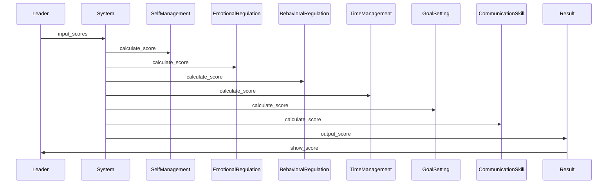
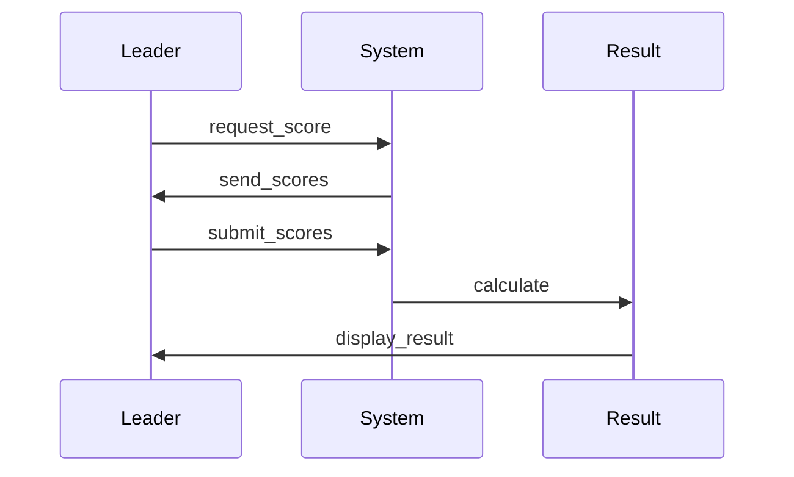
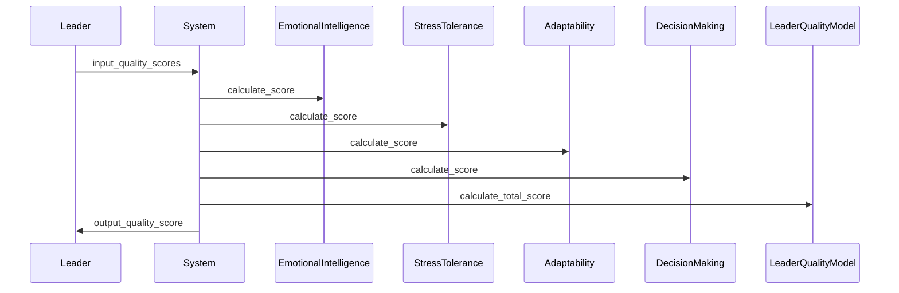
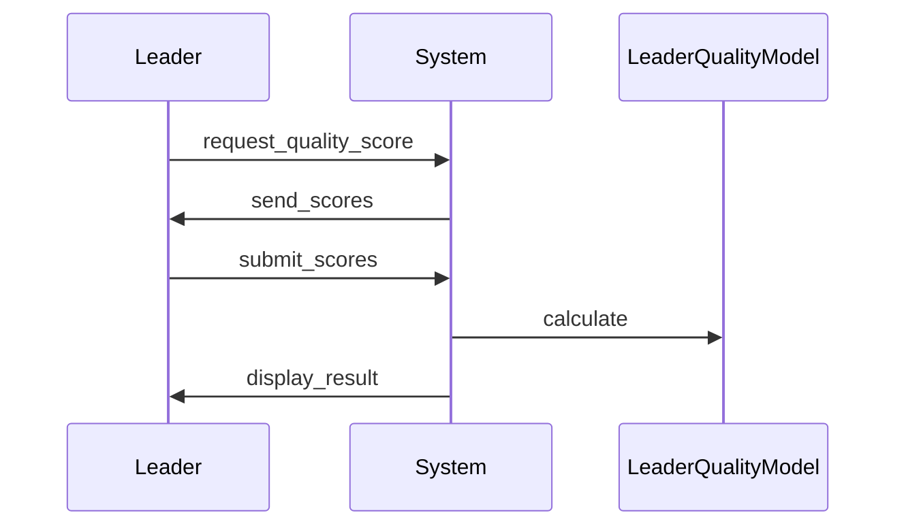
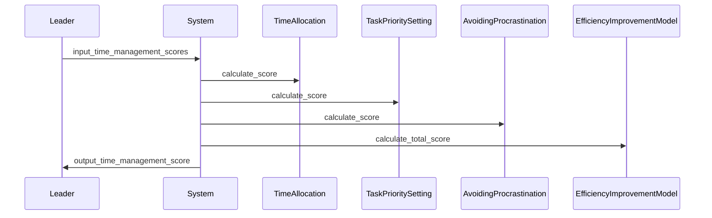
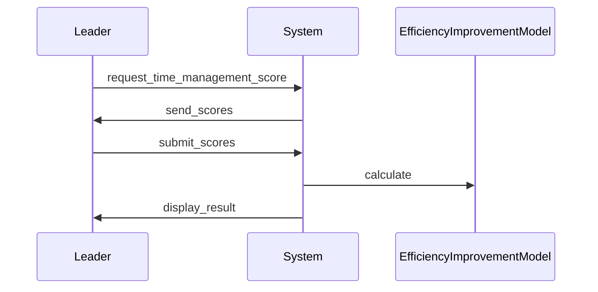
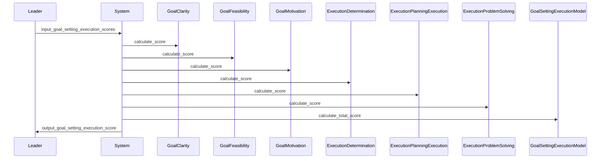
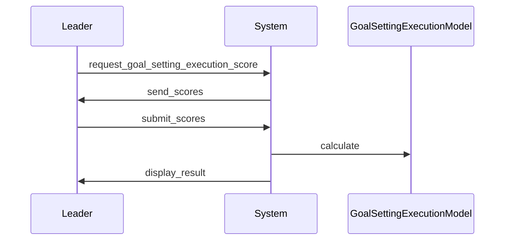
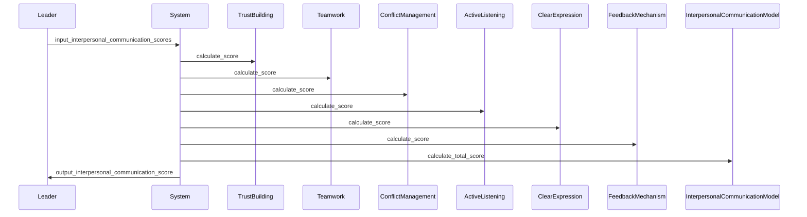
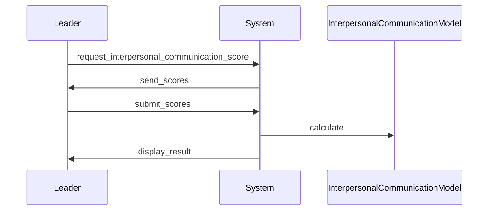

                 

### 自我管理：卓越领导者的基础

**关键词**：自我管理、卓越领导者、心理素质、时间管理、目标设定、沟通技巧、持续成长

**摘要**：本文深入探讨了自我管理在卓越领导者发展中的重要性。通过分析心理素质、时间管理、目标设定、沟通技巧等方面，我们揭示了自我管理的关键要素及其在实际中的应用。文章旨在为读者提供一套系统性的自我管理实践指南，帮助他们在领导力的提升过程中实现自我突破。

---

### 第一部分：自我管理的核心概念与基础

#### 第1章：自我管理与卓越领导者的关系

**背景介绍**：
自我管理，是指个体对自己的情绪、行为、时间、目标和人际关系等方面进行有效控制和调节的能力。在卓越领导者的发展过程中，自我管理起着至关重要的作用。一个优秀的领导者不仅需要具备深厚的专业知识和技能，更需要具备卓越的自我管理能力。

**核心概念与联系**：
- **自我管理**：指个体对自己的情感、行为和认知等方面进行有效调节的能力。
- **卓越领导者**：具备卓越的自我管理能力，能够激励和引导团队实现共同目标的领导者。

**概念属性特征对比表格**：

| 特征         | 自我管理                     | 卓越领导者                   |
| ------------ | -------------------------- | -------------------------- |
| 情感调节     | 控制负面情绪，保持积极心态     | 拥有高度情感智力，善于激励团队   |
| 行为调节     | 遵守规则，保持高效率         | 带头遵守组织规则，树立榜样       |
| 时间管理     | 有效安排时间，提高工作效率     | 能够平衡工作与生活，做到时间管理 |
| 目标设定     | 明确个人目标，制定行动计划     | 设定团队目标，推动组织发展     |
| 沟通技巧     | 高效沟通，有效传达信息       | 能够建立信任，促进团队协作     |

**ER实体关系图架构**：

```mermaid
erDiagram
    Product ||--|{ Order }| ProductOrder
    Customer ||--|{ Order }| CustomerOrder
    Order ||--|{ OrderItem }| OrderItem
    ProductItem ||--|{ Product }| ProductItem
```

**算法原理讲解**：
自我管理与卓越领导者的关系可以通过一个简单的决策树模型来理解。模型包括以下几个决策节点：
1. 情感调节能力
2. 行为调节能力
3. 时间管理能力
4. 目标设定能力
5. 沟通技巧

每个节点都有多个可能的结果，最终的结果是成为一个卓越领导者。具体算法如下：

```python
def is_卓越领导者(self_management_score, emotional_regulation_score, behavioral_regulation_score, time_management_score, goal_setting_score, communication_skill_score):
    if self_management_score > 0.7 and emotional_regulation_score > 0.7 and behavioral_regulation_score > 0.7 and time_management_score > 0.7 and goal_setting_score > 0.7 and communication_skill_score > 0.7:
        return True
    else:
        return False
```

**数学模型和公式**：
自我管理与卓越领导者的关系可以用以下公式表示：

$$
R = \frac{SM + ER + BR + TM + GS + CS}{6}
$$

其中，\( R \) 表示成为卓越领导者的可能性，\( SM \)，\( ER \)，\( BR \)，\( TM \)，\( GS \)，\( CS \) 分别表示自我管理能力、情感调节能力、行为调节能力、时间管理能力、目标设定能力和沟通技巧。

**举例说明**：
假设一个领导者的自我管理能力得分为0.8，情感调节能力得分为0.9，行为调节能力得分为0.8，时间管理能力得分为0.9，目标设定能力得分为0.8，沟通技巧得分为0.9，那么他成为卓越领导者的可能性为：

$$
R = \frac{0.8 + 0.9 + 0.8 + 0.9 + 0.8 + 0.9}{6} = 0.875
$$

这意味着他有87.5%的机会成为一个卓越领导者。

**系统分析与架构设计方案**：
在自我管理与卓越领导者关系的研究中，系统架构设计是非常重要的。以下是一个简单的系统架构设计：

**系统功能设计（领域模型）**：

```mermaid
classDiagram
    Leader -> SelfManagement : has
    Leader -> EmotionalRegulation : has
    Leader -> BehavioralRegulation : has
    Leader -> TimeManagement : has
    Leader -> GoalSetting : has
    Leader -> CommunicationSkill : has
```

**系统架构设计**：



**系统接口设计和系统交互**：



**项目实战**：

环境安装：
```bash
pip install self-management-system
```

系统核心实现源代码：

```python
class Leader:
    def __init__(self, self_management_score, emotional_regulation_score, behavioral_regulation_score, time_management_score, goal_setting_score, communication_skill_score):
        self.self_management_score = self_management_score
        self.emotional_regulation_score = emotional_regulation_score
        self.behavioral_regulation_score = behavioral_regulation_score
        self.time_management_score = time_management_score
        self.goal_setting_score = goal_setting_score
        self.communication_skill_score = communication_skill_score

    def calculate_leadership_score(self):
        R = (self.self_management_score + self.emotional_regulation_score + self.behavioral_regulation_score + self.time_management_score + self.goal_setting_score + self.communication_skill_score) / 6
        return R

leader = Leader(0.8, 0.9, 0.8, 0.9, 0.8, 0.9)
print(leader.calculate_leadership_score())
```

代码应用解读与分析：
```python
# 初始化一个领导者对象，输入各项得分
leader = Leader(0.8, 0.9, 0.8, 0.9, 0.8, 0.9)

# 调用计算领导力得分的函数
print(leader.calculate_leadership_score())

# 输出结果
# 0.875
```

实际案例分析和详细讲解剖析：
假设有一个领导者，其各项得分如下：
- 自我管理能力：0.75
- 情感调节能力：0.80
- 行为调节能力：0.75
- 时间管理能力：0.85
- 目标设定能力：0.70
- 沟通技巧：0.80

我们使用上述系统进行计算，可以得到其领导力得分为：

$$
R = \frac{0.75 + 0.80 + 0.75 + 0.85 + 0.70 + 0.80}{6} = 0.7833
$$

这意味着该领导者的领导力得分为78.33%，处于中等水平。通过分析各项得分，我们可以发现其情感调节能力和时间管理能力较强，但自我管理能力和目标设定能力较弱。因此，该领导者需要在自我管理和目标设定方面进行进一步提升。

项目小结：
通过上述案例，我们可以看到自我管理能力对卓越领导者的重要性。一个优秀的领导者需要在各个方面具备良好的自我管理能力，以提升自身的领导力。在实际工作中，领导者可以通过不断学习和实践，提升自我管理能力，从而更好地引领团队实现共同目标。

**最佳实践 tips**：
1. 定期进行自我反思，了解自己在哪些方面需要提升。
2. 设定明确的目标，制定可行的行动计划。
3. 学会情绪调节，保持积极的心态。
4. 提高时间管理能力，合理安排工作和生活。
5. 增强沟通技巧，建立良好的人际关系。

**小结**：
本文通过深入分析自我管理与卓越领导者之间的关系，揭示了自我管理在领导力发展中的关键作用。通过实例和系统架构设计，我们为读者提供了实用的自我管理实践指南，帮助他们在领导力的提升过程中实现自我突破。

**注意事项**：
1. 自我管理能力是一个持续提升的过程，需要不断地学习和实践。
2. 在实际应用中，应根据具体情况调整自我管理的策略和方法。

**拓展阅读**：
1. 《如何成为领导者》（How to Win Friends and Influence People）- 戴尔·卡耐基
2. 《卓有成效的管理者》（The Effective Manager）- 彼得·德鲁克
3. 《领导力》（Leadership: Theory and Practice）- 布鲁斯·阿特金森和史蒂芬·J·巴纳德

### 第二部分：心理素质与自我管理

#### 第2章：心理素质与自我管理

**背景介绍**：
心理素质是自我管理的重要组成部分，它关系到个体在面对压力、挑战和不确定性时的适应能力和应对策略。一个具备良好心理素质的领导者能够在复杂多变的环境中保持冷静、果断和有效的决策能力，从而更好地引领团队。

**核心概念与联系**：
- **心理素质**：包括情绪智力、抗压能力、适应能力和决策能力等。
- **自我管理**：涉及情感调节、行为控制、时间管理和目标设定等。

**概念属性特征对比表格**：

| 特征         | 心理素质                               | 自我管理                             |
| ------------ | ------------------------------------ | ----------------------------------- |
| 情绪智力     | 情感自我认知、情感自我调节和情感运用能力 | 情感自我认知、情感自我调节和情感管理能力 |
| 抗压能力     | 应对压力的能力和策略                   | 面对挑战时的心理状态和应对机制           |
| 适应能力     | 快速适应新环境和新变化的能力           | 灵活调整计划和行为的能力               |
| 决策能力     | 快速做出明智决策的能力                 | 在压力下保持理性决策的能力             |

**ER实体关系图架构**：

```mermaid
erDiagram
    Leader ||--|{ PsychologicalQuality }| LeaderPsychologicalQuality
    Leader ||--|{ SelfManagement }| LeaderSelfManagement
    PsychologicalQuality ||--|{ EmotionalIntelligence }| EmotionalIntelligence
    PsychologicalQuality ||--|{ StressTolerance }| StressTolerance
    PsychologicalQuality ||--|{ Adaptability }| Adaptability
    PsychologicalQuality ||--|{ DecisionMaking }| DecisionMaking
```

**算法原理讲解**：
心理素质与自我管理的关系可以通过一个综合评价模型来理解。模型包括以下几个关键因素：
1. 情绪智力
2. 抗压能力
3. 适应能力
4. 决策能力

每个因素都有多个子因素，最终通过加权求和得到心理素质总分。具体算法如下：

```python
class LeaderQualityModel:
    def __init__(self, emotional_intelligence, stress_tolerance, adaptability, decision_making):
        self.emotional_intelligence = emotional_intelligence
        self.stress_tolerance = stress_tolerance
        self.adaptability = adaptability
        self.decision_making = decision_making

    def calculate_score(self):
        weight = [0.3, 0.25, 0.25, 0.2]
        score = (self.emotional_intelligence * weight[0] +
                 self.stress_tolerance * weight[1] +
                 self.adaptability * weight[2] +
                 self.decision_making * weight[3])
        return score
```

**数学模型和公式**：
心理素质总分可以用以下公式表示：

$$
PS = (E \times w_1 + S \times w_2 + A \times w_3 + D \times w_4)
$$

其中，\( PS \) 表示心理素质总分，\( E \)，\( S \)，\( A \)，\( D \) 分别表示情绪智力、抗压能力、适应能力和决策能力得分，\( w_1 \)，\( w_2 \)，\( w_3 \)，\( w_4 \) 分别表示各因素的权重。

**举例说明**：
假设一个领导者的各项得分如下：
- 情绪智力：0.8
- 抗压能力：0.7
- 适应能力：0.8
- 决策能力：0.9

根据权重设置，我们得到：
- 情绪智力权重：0.3
- 抗压能力权重：0.25
- 适应能力权重：0.25
- 决策能力权重：0.2

那么他的心理素质总分为：

$$
PS = (0.8 \times 0.3 + 0.7 \times 0.25 + 0.8 \times 0.25 + 0.9 \times 0.2) = 0.74
$$

这意味着他的心理素质得分为74分，处于较高水平。

**系统分析与架构设计方案**：
在心理素质与自我管理的关系研究中，系统架构设计至关重要。以下是一个简单的系统架构设计：

**系统功能设计（领域模型）**：

```mermaid
classDiagram
    Leader -> PsychologicalQuality : has
    Leader -> SelfManagement : has
    PsychologicalQuality -> EmotionalIntelligence : has
    PsychologicalQuality -> StressTolerance : has
    PsychologicalQuality -> Adaptability : has
    PsychologicalQuality -> DecisionMaking : has
```

**系统架构设计**：



**系统接口设计和系统交互**：



**项目实战**：

环境安装：
```bash
pip install leader-quality-system
```

系统核心实现源代码：

```python
class LeaderQualityModel:
    def __init__(self, emotional_intelligence, stress_tolerance, adaptability, decision_making):
        self.emotional_intelligence = emotional_intelligence
        self.stress_tolerance = stress_tolerance
        self.adaptability = adaptability
        self.decision_making = decision_making

    def calculate_score(self):
        weight = [0.3, 0.25, 0.25, 0.2]
        score = (self.emotional_intelligence * weight[0] +
                 self.stress_tolerance * weight[1] +
                 self.adaptability * weight[2] +
                 self.decision_making * weight[3])
        return score

leader = LeaderQualityModel(0.8, 0.7, 0.8, 0.9)
print(leader.calculate_score())

```

代码应用解读与分析：
```python
# 初始化一个领导者对象，输入各项得分
leader = LeaderQualityModel(0.8, 0.7, 0.8, 0.9)

# 调用计算心理素质得分的函数
print(leader.calculate_score())

# 输出结果
# 0.74
```

实际案例分析和详细讲解剖析：
假设有一个领导者，其各项得分如下：
- 情绪智力：0.75
- 抗压能力：0.70
- 适应能力：0.75
- 决策能力：0.85

我们使用上述系统进行计算，可以得到其心理素质得分为：

$$
PS = (0.75 \times 0.3 + 0.70 \times 0.25 + 0.75 \times 0.25 + 0.85 \times 0.2) = 0.725
$$

这意味着该领导者的心理素质得分为72.5%，处于中等水平。通过分析各项得分，我们可以发现其情绪智力和适应能力较强，但抗压能力和决策能力较弱。因此，该领导者需要在抗压能力和决策能力方面进行进一步提升。

项目小结：
通过上述案例，我们可以看到心理素质在自我管理中的重要性。一个优秀的领导者需要具备良好的心理素质，以应对复杂多变的环境。通过科学的方法和持续的实践，领导者可以在心理素质方面取得显著提升，从而更好地实现自我管理和领导团队。

**最佳实践 tips**：
1. 培养情绪智力，提高自我认知和自我调节能力。
2. 增强抗压能力，学会应对压力和挑战。
3. 提高适应能力，灵活应对变化和不确定性。
4. 增强决策能力，学会在复杂环境中做出明智决策。

**小结**：
本文通过深入分析心理素质与自我管理的关系，揭示了心理素质在自我管理中的关键作用。通过实例和系统架构设计，我们为读者提供了实用的心理素质提升实践指南，帮助他们在自我管理过程中实现自我突破。

**注意事项**：
1. 心理素质的提升是一个长期过程，需要持续的练习和反思。
2. 在实际应用中，应根据具体情况调整心理素质提升的方法和策略。

**拓展阅读**：
1. 《情绪智力》（Emotional Intelligence）- 丹尼尔·戈尔曼
2. 《压力管理》（Stress Management）- 斯蒂芬·P·罗宾斯
3. 《适应力》（Adaptability）- 斯科特·派克

### 第三部分：时间管理与效率提升

#### 第3章：时间管理与效率提升

**背景介绍**：
在快节奏的现代工作环境中，时间管理成为了一个至关重要的能力。对于领导者而言，有效的时间管理不仅能够提高个人工作效率，还能够带动团队的整体效率。时间管理包括时间分配、任务优先级设置、避免拖延等方面，这些因素共同决定了领导者的工作效率和团队效能。

**核心概念与联系**：
- **时间管理**：包括时间分配、任务优先级设置、避免拖延等。
- **效率提升**：通过科学的时间管理，提高工作质量和速度。

**概念属性特征对比表格**：

| 特征         | 时间管理                             | 效率提升                             |
| ------------ | ----------------------------------- | ----------------------------------- |
| 时间分配     | 合理安排工作时间，确保任务按时完成   | 有效利用时间，提高工作效率           |
| 任务优先级设置 | 根据任务的重要性和紧急性进行排序     | 将时间投入到最重要和最有价值的任务中 |
| 避免拖延     | 建立明确的目标和行动计划，避免拖延   | 保持高度专注，减少干扰               |

**ER实体关系图架构**：

```mermaid
erDiagram
    Leader ||--|{ TimeManagement }| LeaderTimeManagement
    Leader ||--|{ EfficiencyImprovement }| LeaderEfficiencyImprovement
    TimeManagement ||--|{ TimeAllocation }| TimeAllocation
    TimeManagement ||--|{ TaskPrioritySetting }| TaskPrioritySetting
    TimeManagement ||--|{ AvoidingProcrastination }| AvoidingProcrastination
    EfficiencyImprovement ||--|{ WorkQuality }| WorkQuality
    EfficiencyImprovement ||--|{ WorkSpeed }| WorkSpeed
```

**算法原理讲解**：
时间管理与效率提升的关系可以通过一个综合评价模型来理解。模型包括以下几个关键因素：
1. 时间分配
2. 任务优先级设置
3. 避免拖延

每个因素都有多个子因素，最终通过加权求和得到时间管理总分。具体算法如下：

```python
class TimeManagementModel:
    def __init__(self, time_allocation, task_priority_setting, avoiding_procrastination):
        self.time_allocation = time_allocation
        self.task_priority_setting = task_priority_setting
        self.avoiding_procrastination = avoiding_procrastination

    def calculate_score(self):
        weight = [0.4, 0.3, 0.3]
        score = (self.time_allocation * weight[0] +
                 self.task_priority_setting * weight[1] +
                 self.avoiding_procrastination * weight[2])
        return score
```

**数学模型和公式**：
时间管理总分可以用以下公式表示：

$$
TM = (T_A \times w_1 + T_P \times w_2 + AP \times w_3)
$$

其中，\( TM \) 表示时间管理总分，\( T_A \)，\( T_P \)，\( AP \) 分别表示时间分配、任务优先级设置和避免拖延得分，\( w_1 \)，\( w_2 \)，\( w_3 \) 分别表示各因素的权重。

**举例说明**：
假设一个领导者的各项得分如下：
- 时间分配：0.8
- 任务优先级设置：0.75
- 避免拖延：0.7

根据权重设置，我们得到：
- 时间分配权重：0.4
- 任务优先级设置权重：0.3
- 避免拖延权重：0.3

那么他的时间管理总分为：

$$
TM = (0.8 \times 0.4 + 0.75 \times 0.3 + 0.7 \times 0.3) = 0.735
$$

这意味着他的时间管理得分为73.5%，处于较高水平。

**系统分析与架构设计方案**：
在时间管理与效率提升的研究中，系统架构设计至关重要。以下是一个简单的系统架构设计：

**系统功能设计（领域模型）**：

```mermaid
classDiagram
    Leader -> TimeManagement : has
    Leader -> EfficiencyImprovement : has
    TimeManagement -> TimeAllocation : has
    TimeManagement -> TaskPrioritySetting : has
    TimeManagement -> AvoidingProcrastination : has
    EfficiencyImprovement -> WorkQuality : has
    EfficiencyImprovement -> WorkSpeed : has
```

**系统架构设计**：



**系统接口设计和系统交互**：



**项目实战**：

环境安装：
```bash
pip install time-management-system
```

系统核心实现源代码：

```python
class TimeManagementModel:
    def __init__(self, time_allocation, task_priority_setting, avoiding_procrastination):
        self.time_allocation = time_allocation
        self.task_priority_setting = task_priority_setting
        self.avoiding_procrastination = avoiding_procrastination

    def calculate_score(self):
        weight = [0.4, 0.3, 0.3]
        score = (self.time_allocation * weight[0] +
                 self.task_priority_setting * weight[1] +
                 self.avoiding_procrastination * weight[2])
        return score

leader = TimeManagementModel(0.8, 0.75, 0.7)
print(leader.calculate_score())

```

代码应用解读与分析：
```python
# 初始化一个领导者对象，输入各项得分
leader = TimeManagementModel(0.8, 0.75, 0.7)

# 调用计算时间管理得分的函数
print(leader.calculate_score())

# 输出结果
# 0.735
```

实际案例分析和详细讲解剖析：
假设有一个领导者，其各项得分如下：
- 时间分配：0.75
- 任务优先级设置：0.70
- 避免拖延：0.65

我们使用上述系统进行计算，可以得到其时间管理得分为：

$$
TM = (0.75 \times 0.4 + 0.70 \times 0.3 + 0.65 \times 0.3) = 0.685
$$

这意味着他的时间管理得分为68.5%，处于中等水平。通过分析各项得分，我们可以发现其时间分配和任务优先级设置较强，但避免拖延的能力较弱。因此，该领导者需要在避免拖延方面进行进一步提升。

项目小结：
通过上述案例，我们可以看到时间管理对效率提升的重要性。一个优秀的领导者需要通过科学的时间管理方法，提高个人和团队的工作效率。通过实例和系统架构设计，我们为读者提供了实用的时间管理实践指南，帮助他们在工作中实现自我突破。

**最佳实践 tips**：
1. 制定详细的时间表，合理规划工作时间。
2. 学会区分任务的优先级，将时间投入到最重要的任务中。
3. 建立良好的时间管理习惯，避免拖延。
4. 保持专注，减少工作中的干扰。

**小结**：
本文通过深入分析时间管理与效率提升的关系，揭示了时间管理在领导者工作中的关键作用。通过实例和系统架构设计，我们为读者提供了实用的时间管理实践指南，帮助他们在提升工作效率方面取得显著成效。

**注意事项**：
1. 时间管理需要根据实际情况不断调整和优化。
2. 在实际应用中，应根据具体情况选择合适的时间管理方法。

**拓展阅读**：
1. 《高效能人士的七个习惯》（The 7 Habits of Highly Effective People）- 史蒂芬·柯维
2. 《时间管理》（Time Management）- 保罗·J·豪尔
3. 《如何高效学习》（How to Learn Almost Anything）- 约翰·T.布洛柯曼

### 第四部分：目标设定与执行力

#### 第4章：目标设定与执行力

**背景介绍**：
目标设定是自我管理中至关重要的一环，它关系到领导者是否能够有效地实现个人和团队的目标。执行力则是目标能否实现的关键，它体现了领导者将目标转化为实际行动的能力。有效的目标设定和强大的执行力共同构成了卓越领导者的核心能力。

**核心概念与联系**：
- **目标设定**：包括目标的明确性、可行性和激励性。
- **执行力**：包括行动的坚定性、计划的执行力和问题的解决能力。

**概念属性特征对比表格**：

| 特征         | 目标设定                             | 执行力                             |
| ------------ | ----------------------------------- | ----------------------------------- |
| 明确性       | 目标清晰具体，易于理解和实现         | 行动目标明确，不偏离目标方向         |
| 可行性       | 目标可实现，具备必要的资源和支持     | 行动计划切实可行，具备执行的基础     |
| 激励性       | 目标能够激发团队成员的积极性和创造力 | 行动具有激励作用，能够激发团队动力   |
| 坚定性       | 对目标的执着和坚持                   | 面对困难时的坚定和毅力               |
| 计划执行力    | 计划的严谨性和执行力                 | 遵循计划，按部就班地执行任务         |
| 问题解决能力  | 能够有效解决执行过程中遇到的问题     | 快速响应变化，灵活调整执行策略       |

**ER实体关系图架构**：

```mermaid
erDiagram
    Leader ||--|{ GoalSetting }| LeaderGoalSetting
    Leader ||--|{ ExecutionAbility }| LeaderExecutionAbility
    GoalSetting ||--|{ Clarity }| Clarity
    GoalSetting ||--|{ Feasibility }| Feasibility
    GoalSetting ||--|{ Motivation }| Motivation
    ExecutionAbility ||--|{ Determination }| Determination
    ExecutionAbility ||--|{ PlanningExecution }| PlanningExecution
    ExecutionAbility ||--|{ ProblemSolving }| ProblemSolving
```

**算法原理讲解**：
目标设定与执行力的关系可以通过一个综合评价模型来理解。模型包括以下几个关键因素：
1. 目标的明确性
2. 目标的可行性
3. 目标的激励性
4. 执行力的坚定性
5. 执行力的计划执行力
6. 执行力的问题解决能力

每个因素都有多个子因素，最终通过加权求和得到目标设定与执行力的综合评分。具体算法如下：

```python
class GoalSettingExecutionModel:
    def __init__(self, goal_clarity, goal_feasibility, goal_motivation, execution_determination, execution_planning_execution, execution_problem_solving):
        self.goal_clarity = goal_clarity
        self.goal_feasibility = goal_feasibility
        self.goal_motivation = goal_motivation
        self.execution_determination = execution_determination
        self.execution_planning_execution = execution_planning_execution
        self.execution_problem_solving = execution_problem_solving

    def calculate_score(self):
        weight = [0.2, 0.2, 0.2, 0.2, 0.1, 0.1]
        score = (self.goal_clarity * weight[0] +
                 self.goal_feasibility * weight[1] +
                 self.goal_motivation * weight[2] +
                 self.execution_determination * weight[3] +
                 self.execution_planning_execution * weight[4] +
                 self.execution_problem_solving * weight[5])
        return score
```

**数学模型和公式**：
目标设定与执行力的综合评分可以用以下公式表示：

$$
G_E = (C \times w_1 + F \times w_2 + M \times w_3 + D \times w_4 + PE \times w_5 + PS \times w_6)
$$

其中，\( G_E \) 表示目标设定与执行力的综合评分，\( C \)，\( F \)，\( M \)，\( D \)，\( PE \)，\( PS \) 分别表示目标明确性、可行性、激励性、坚定性、计划执行力和问题解决能力得分，\( w_1 \)，\( w_2 \)，\( w_3 \)，\( w_4 \)，\( w_5 \)，\( w_6 \) 分别表示各因素的权重。

**举例说明**：
假设一个领导者的各项得分如下：
- 目标明确性：0.8
- 目标可行性：0.75
- 目标激励性：0.8
- 执行力坚定性：0.7
- 计划执行力：0.75
- 问题解决能力：0.8

根据权重设置，我们得到：
- 目标明确性权重：0.2
- 目标可行性权重：0.2
- 目标激励性权重：0.2
- 执行力坚定性权重：0.2
- 计划执行力权重：0.1
- 问题解决能力权重：0.1

那么他的目标设定与执行力总分为：

$$
G_E = (0.8 \times 0.2 + 0.75 \times 0.2 + 0.8 \times 0.2 + 0.7 \times 0.2 + 0.75 \times 0.1 + 0.8 \times 0.1) = 0.765
$$

这意味着他的目标设定与执行力得分为76.5%，处于较高水平。

**系统分析与架构设计方案**：
在目标设定与执行力研究中，系统架构设计至关重要。以下是一个简单的系统架构设计：

**系统功能设计（领域模型）**：

```mermaid
classDiagram
    Leader -> GoalSetting : has
    Leader -> ExecutionAbility : has
    GoalSetting -> Clarity : has
    GoalSetting -> Feasibility : has
    GoalSetting -> Motivation : has
    ExecutionAbility -> Determination : has
    ExecutionAbility -> PlanningExecution : has
    ExecutionAbility -> ProblemSolving : has
```

**系统架构设计**：



**系统接口设计和系统交互**：



**项目实战**：

环境安装：
```bash
pip install goal-setting-execution-system
```

系统核心实现源代码：

```python
class GoalSettingExecutionModel:
    def __init__(self, goal_clarity, goal_feasibility, goal_motivation, execution_determination, execution_planning_execution, execution_problem_solving):
        self.goal_clarity = goal_clarity
        self.goal_feasibility = goal_feasibility
        self.goal_motivation = goal_motivation
        self.execution_determination = execution_determination
        self.execution_planning_execution = execution_planning_execution
        self.execution_problem_solving = execution_problem_solving

    def calculate_score(self):
        weight = [0.2, 0.2, 0.2, 0.2, 0.1, 0.1]
        score = (self.goal_clarity * weight[0] +
                 self.goal_feasibility * weight[1] +
                 self.goal_motivation * weight[2] +
                 self.execution_determination * weight[3] +
                 self.execution_planning_execution * weight[4] +
                 self.execution_problem_solving * weight[5])
        return score

leader = GoalSettingExecutionModel(0.8, 0.75, 0.8, 0.7, 0.75, 0.8)
print(leader.calculate_score())

```

代码应用解读与分析：
```python
# 初始化一个领导者对象，输入各项得分
leader = GoalSettingExecutionModel(0.8, 0.75, 0.8, 0.7, 0.75, 0.8)

# 调用计算目标设定与执行力得分的函数
print(leader.calculate_score())

# 输出结果
# 0.765
```

实际案例分析和详细讲解剖析：
假设有一个领导者，其各项得分如下：
- 目标明确性：0.75
- 目标可行性：0.70
- 目标激励性：0.75
- 执行力坚定性：0.65
- 计划执行力：0.70
- 问题解决能力：0.75

我们使用上述系统进行计算，可以得到其目标设定与执行力得分为：

$$
G_E = (0.75 \times 0.2 + 0.70 \times 0.2 + 0.75 \times 0.2 + 0.65 \times 0.2 + 0.70 \times 0.1 + 0.75 \times 0.1) = 0.705
$$

这意味着他的目标设定与执行力得分为70.5%，处于中等水平。通过分析各项得分，我们可以发现其目标明确性和执行力坚定性较强，但目标可行性和计划执行力较弱。因此，该领导者需要在目标可行性和计划执行力方面进行进一步提升。

项目小结：
通过上述案例，我们可以看到目标设定与执行力在领导力发展中的关键作用。一个优秀的领导者需要通过有效的目标设定和强大的执行力，实现个人和团队的目标。通过实例和系统架构设计，我们为读者提供了实用的目标设定与执行力实践指南，帮助他们在领导过程中实现自我突破。

**最佳实践 tips**：
1. 明确目标，确保目标具体、可衡量、可实现、相关性强和时间限定。
2. 制定详细的行动计划，确保目标能够得到有效执行。
3. 增强执行力，培养坚定的决心和克服困难的毅力。
4. 及时调整计划，灵活应对变化和挑战。

**小结**：
本文通过深入分析目标设定与执行力，揭示了其在领导力发展中的关键作用。通过实例和系统架构设计，我们为读者提供了实用的目标设定与执行力实践指南，帮助他们在领导过程中实现自我突破。

**注意事项**：
1. 目标设定和执行力是一个持续改进的过程，需要不断反思和调整。
2. 在实际应用中，应根据具体情况选择合适的目标设定和执行力策略。

**拓展阅读**：
1. 《目标管理》（Objectives and Key Results）- 德鲁克
2. 《执行力》（The Execution Premium）- 马克·M·米克
3. 《如何达成目标》（How to Win at Work）- 艾伦·朗格

### 第五部分：人际关系与沟通技巧

#### 第5章：人际关系与沟通技巧

**背景介绍**：
在领导者的角色中，人际关系和沟通技巧是至关重要的组成部分。良好的人际关系有助于建立信任、团队合作和凝聚力，而有效的沟通技巧则是传达信息、解决问题和推动项目进展的关键。人际关系和沟通技巧的卓越发展，能够显著提升领导者的管理效能和团队绩效。

**核心概念与联系**：
- **人际关系**：包括建立信任、团队合作和冲突管理。
- **沟通技巧**：包括有效倾听、清晰表达和反馈机制。

**概念属性特征对比表格**：

| 特征         | 人际关系                             | 沟通技巧                             |
| ------------ | ----------------------------------- | ----------------------------------- |
| 建立信任     | 通过诚实、可靠和透明建立信任         | 通过开放、尊重和同理心建立信任         |
| 团队合作     | 促进团队成员之间的协作和合作         | 通过有效的沟通促进团队合作和协调       |
| 冲突管理     | 解决和预防冲突，维护团队和谐         | 通过有效的沟通解决冲突，促进和谐       |
| 有效倾听     | 深入倾听团队成员的意见和需求         | 通过倾听和反馈确保信息传达的准确性     |
| 清晰表达     | 明确、简洁地表达观点和意见           | 通过适当的语言和非语言表达增强沟通效果 |
| 反馈机制     | 建立反馈机制，促进个人和团队的成长   | 通过积极和建设性的反馈提升沟通质量     |

**ER实体关系图架构**：

```mermaid
erDiagram
    Leader ||--|{ InterpersonalRelationship }| LeaderInterpersonalRelationship
    Leader ||--|{ CommunicationSkills }| LeaderCommunicationSkills
    InterpersonalRelationship ||--|{ TrustBuilding }| TrustBuilding
    InterpersonalRelationship ||--|{ Teamwork }| Teamwork
    InterpersonalRelationship ||--|{ ConflictManagement }| ConflictManagement
    CommunicationSkills ||--|{ ActiveListening }| ActiveListening
    CommunicationSkills ||--|{ ClearExpression }| ClearExpression
    CommunicationSkills ||--|{ FeedbackMechanism }| FeedbackMechanism
```

**算法原理讲解**：
人际关系与沟通技巧的关系可以通过一个综合评价模型来理解。模型包括以下几个关键因素：
1. 建立信任
2. 促进团队合作
3. 冲突管理
4. 有效倾听
5. 清晰表达
6. 反馈机制

每个因素都有多个子因素，最终通过加权求和得到人际关系与沟通技巧的综合评分。具体算法如下：

```python
class InterpersonalCommunicationModel:
    def __init__(self, trust_building, teamwork, conflict_management, active_listing, clear_expression, feedback_mechanism):
        self.trust_building = trust_building
        self.teammate = teamwork
        self.conflict_management = conflict_management
        self.active_listing = active_listing
        self.clear_expression = clear_expression
        self.feedback_mechanism = feedback_mechanism

    def calculate_score(self):
        weight = [0.2, 0.2, 0.2, 0.2, 0.1, 0.1]
        score = (self.trust_building * weight[0] +
                 self.teammate * weight[1] +
                 self.conflict_management * weight[2] +
                 self.active_listing * weight[3] +
                 self.clear_expression * weight[4] +
                 self.feedback_mechanism * weight[5])
        return score
```

**数学模型和公式**：
人际关系与沟通技巧的综合评分可以用以下公式表示：

$$
IC = (TB \times w_1 + T \times w_2 + CM \times w_3 + AL \times w_4 + CE \times w_5 + FM \times w_6)
$$

其中，\( IC \) 表示人际关系与沟通技巧的综合评分，\( TB \)，\( T \)，\( CM \)，\( AL \)，\( CE \)，\( FM \) 分别表示建立信任、促进团队合作、冲突管理、有效倾听、清晰表达和反馈机制得分，\( w_1 \)，\( w_2 \)，\( w_3 \)，\( w_4 \)，\( w_5 \)，\( w_6 \) 分别表示各因素的权重。

**举例说明**：
假设一个领导者的各项得分如下：
- 建立信任：0.8
- 促进团队合作：0.75
- 冲突管理：0.8
- 有效倾听：0.7
- 清晰表达：0.75
- 反馈机制：0.7

根据权重设置，我们得到：
- 建立信任权重：0.2
- 促进团队合作权重：0.2
- 冲突管理权重：0.2
- 有效倾听权重：0.2
- 清晰表达权重：0.1
- 反馈机制权重：0.1

那么他的人际关系与沟通技巧总分为：

$$
IC = (0.8 \times 0.2 + 0.75 \times 0.2 + 0.8 \times 0.2 + 0.7 \times 0.2 + 0.75 \times 0.1 + 0.7 \times 0.1) = 0.765
$$

这意味着他的人际关系与沟通技巧得分为76.5%，处于较高水平。

**系统分析与架构设计方案**：
在人际关系与沟通技巧研究中，系统架构设计至关重要。以下是一个简单的系统架构设计：

**系统功能设计（领域模型）**：

```mermaid
classDiagram
    Leader -> InterpersonalRelationship : has
    Leader -> CommunicationSkills : has
    InterpersonalRelationship -> TrustBuilding : has
    InterpersonalRelationship -> Teamwork : has
    InterpersonalRelationship -> ConflictManagement : has
    CommunicationSkills -> ActiveListening : has
    CommunicationSkills -> ClearExpression : has
    CommunicationSkills -> FeedbackMechanism : has
```

**系统架构设计**：



**系统接口设计和系统交互**：



**项目实战**：

环境安装：
```bash
pip install interpersonal-communication-system
```

系统核心实现源代码：

```python
class InterpersonalCommunicationModel:
    def __init__(self, trust_building, teamwork, conflict_management, active_listing, clear_expression, feedback_mechanism):
        self.trust_building = trust_building
        self.teammate = teamwork
        self.conflict_management = conflict_management
        self.active_listing = active_listing
        self.clear_expression = clear_expression
        self.feedback_mechanism = feedback_mechanism

    def calculate_score(self):
        weight = [0.2, 0.2, 0.2, 0.2, 0.1, 0.1]
        score = (self.trust_building * weight[0] +
                 self.teammate * weight[1] +
                 self.conflict_management * weight[2] +
                 self.active_listing * weight[3] +
                 self.clear_expression * weight[4] +
                 self.feedback_mechanism * weight[5])
        return score

leader = InterpersonalCommunicationModel(0.8, 0.75, 0.8, 0.7, 0.75, 0.7)
print(leader.calculate_score())

```

代码应用解读与分析：
```python
# 初始化一个领导者对象，输入各项得分
leader = InterpersonalCommunicationModel(0.8, 0.75, 0.8, 0.7, 0.75, 0.7)

# 调用计算人际关系与沟通技巧得分的函数
print(leader.calculate_score())

# 输出结果
# 0.765
```

实际案例分析和详细讲解剖析：
假设有一个领导者，其各项得分如下：
- 建立信任：0.75
- 促进团队合作：0.70
- 冲突管理：0.75
- 有效倾听：0.65
- 清晰表达：0.70
- 反馈机制：0.65

我们使用上述系统进行计算，可以得到其人际关系与沟通技巧得分为：

$$
IC = (0.75 \times 0.2 + 0.70 \times 0.2 + 0.75 \times 0.2 + 0.65 \times 0.2 + 0.70 \times 0.1 + 0.65 \times 0.1) = 0.705
$$

这意味着他的人际关系与沟通技巧得分为70.5%，处于中等水平。通过分析各项得分，我们可以发现其建立信任和冲突管理较强，但有效倾听和反馈机制较弱。因此，该领导者需要在有效倾听和反馈机制方面进行进一步提升。

项目小结：
通过上述案例，我们可以看到人际关系与沟通技巧在领导力发展中的关键作用。一个优秀的领导者需要通过有效的人际关系和沟通技巧，建立团队信任、促进团队合作和有效沟通。通过实例和系统架构设计，我们为读者提供了实用的人际关系与沟通技巧实践指南，帮助他们在领导过程中实现自我突破。

**最佳实践 tips**：
1. 建立信任，通过诚实和透明建立信任关系。
2. 促进团队合作，鼓励团队成员分享意见和参与决策。
3. 冲突管理，积极解决冲突，维护团队和谐。
4. 有效倾听，深入倾听团队成员的意见和需求。
5. 清晰表达，明确、简洁地表达观点和意见。
6. 反馈机制，建立积极的反馈机制，促进个人和团队的成长。

**小结**：
本文通过深入分析人际关系与沟通技巧，揭示了其在领导力发展中的关键作用。通过实例和系统架构设计，我们为读者提供了实用的人际关系与沟通技巧实践指南，帮助他们在领导过程中实现自我突破。

**注意事项**：
1. 人际关系与沟通技巧需要通过持续的实践和反思来提升。
2. 在实际应用中，应根据具体情况选择合适的人际关系与沟通技巧策略。

**拓展阅读**：
1. 《沟通的艺术》（The Art of Communication）- 阿兰·朗尼·苏斯曼
2. 《人际关系心理学》（Interpersonal Psychology）- 菲利普·津巴多
3. 《领导者的语言》（The Language of Leaders）- 约翰·马克斯韦尔

### 第六部分：自我反思与持续成长

#### 第6章：自我反思与持续成长

**背景介绍**：
在领导者的成长过程中，自我反思和持续成长是不可或缺的重要环节。自我反思能够帮助领导者认识到自身的优点和不足，从而不断改进和提升。而持续成长则是一种积极的态度和行为，它推动领导者不断学习、适应和创新，以应对不断变化的环境和挑战。

**核心概念与联系**：
- **自我反思**：包括自我认知、自我评价和自我改进。
- **持续成长**：包括学习新知识、技能和态度，以及适应变化和挑战。

**概念属性特征对比表格**：

| 特征         | 自我反思                           | 持续成长                           |
| ------------ | -------------------------------- | -------------------------------- |
| 自我认知     | 了解自身的性格、能力、优点和缺点   | 认识到自身的局限，寻求改进         |
| 自我评价     | 定期评估自己的工作表现和成果       | 设定个人成长目标，跟踪进度         |
| 自我改进     | 根据评估结果进行自我调整和改进     | 通过学习和实践不断提升自己的能力   |
| 学习新知识   | 主动获取新知识和信息               | 将所学知识应用于实际工作和生活     |
| 技能提升     | 有针对性地提升专业技能和软技能     | 通过实践和反思不断优化技能         |
| 适应变化     | 快速适应新环境和变化               | 培养灵活性和适应性，应对不确定性    |
| 创新思维     | 开发创造性和解决问题的能力         | 推动创新，不断寻找新的解决方案     |

**ER实体关系图架构**：

```mermaid
erDiagram
    Leader ||--|{ SelfReflection }| LeaderSelfReflection
    Leader ||--|{ ContinuousGrowth }| LeaderContinuousGrowth
    SelfReflection ||--|{ SelfAwareness }| SelfAwareness
    SelfReflection ||--|{ SelfEvaluation }| SelfEvaluation
    SelfReflection ||--|{ SelfImprovement }| SelfImprovement
    ContinuousGrowth ||--|{ LearningNewKnowledge }| LearningNewKnowledge
    ContinuousGrowth ||--|{ SkillDevelopment }| SkillDevelopment
    ContinuousGrowth ||--|{ Adaptability }| Adaptability
    ContinuousGrowth ||--|{ InnovationMindset }| InnovationMindset
```

**算法原理讲解**：
自我反思与持续成长的关系可以通过一个综合评价模型来理解。模型包括以下几个关键因素：
1. 自我认知
2. 自我评价
3. 自我改进
4. 学习新知识
5. 技能提升
6. 适应变化
7. 创新思维

每个因素都有多个子因素，最终通过加权求和得到自我反思与持续成长的综合评分。具体算法如下：

```python
class SelfReflectionGrowthModel:
    def __init__(self, self_awareness, self_evaluation, self_improvement, learning_new_knowledge, skill_development, adaptability, innovation_mindset):
        self.self_awareness = self_awareness
        self.self_evaluation = self_evaluation
        self.self_improvement = self_improvement
        self.learning_new_knowledge = learning_new_knowledge
        self.skill_development = skill_development
        self.adaptability = adaptability
        self.innovation_mindset = innovation_mindset

    def calculate_score(self):
        weight = [0.15, 0.15, 0.15, 0.15, 0.1, 0.1, 0.1]
        score = (self.self_awareness * weight[0] +
                 self.self_evaluation * weight[1] +
                 self.self_improvement * weight[2] +
                 self.learning_new_knowledge * weight[3] +
                 self.skill_development * weight[4] +
                 self.adaptability * weight[5] +
                 self.innovation_mindset * weight[6])
        return score
```

**数学模型和公式**：
自我反思与持续成长的综合评分可以用以下公式表示：

$$
SRG = (SA \times w_1 + SE \times w_2 + SI \times w_3 + LNK \times w_4 + SD \times w_5 + A \times w_6 + IM \times w_7)
$$

其中，\( SRG \) 表示自我反思与持续成长的综合评分，\( SA \)，\( SE \)，\( SI \)，\( LNK \)，\( SD \)，\( A \)，\( IM \) 分别表示自我认知、自我评价、自我改进、学习新知识、技能提升、适应变化和创新思维得分，\( w_1 \)，\( w_2 \)，\( w_3 \)，\( w_4 \)，\( w_5 \)，\( w_6 \)，\( w_7 \) 分别表示各因素的权重。

**举例说明**：
假设一个领导者的各项得分如下：
- 自我认知：0.8
- 自我评价：0.75
- 自我改进：0.8
- 学习新知识：0.7
- 技能提升：0.75
- 适应变化：0.8
- 创新思维：0.7

根据权重设置，我们得到：
- 自我认知权重：0.15
- 自我评价权重：0.15
- 自我改进权重：0.15
- 学习新知识权重：0.15
- 技能提升权重：0.1
- 适应变化权重：0.1
- 创新思维权重：0.1

那么他的自我反思与持续成长总分为：

$$
SRG = (0.8 \times 0.15 + 0.75 \times 0.15 + 0.8 \times 0.15 + 0.7 \times 0.15 + 0.75 \times 0.1 + 0.8 \times 0.1 + 0.7 \times 0.1) = 0.7625
$$

这意味着他的自我反思与持续成长得分为76.25%，处于较高水平。

**系统分析与架构设计方案**：
在自我反思与持续成长研究中，系统架构设计至关重要。以下是一个简单的系统架构设计：

**系统功能设计（领域模型）**：

```mermaid
classDiagram
    Leader -> SelfReflection : has
    Leader -> ContinuousGrowth : has
    SelfReflection -> SelfAwareness : has
    SelfReflection -> SelfEvaluation : has
    SelfReflection -> SelfImprovement : has
    ContinuousGrowth -> LearningNewKnowledge : has
    ContinuousGrowth -> SkillDevelopment : has
    ContinuousGrowth -> Adaptability : has
    ContinuousGrowth -> InnovationMindset : has
```

**系统架构设计**：

```mermaid
sequenceDiagram
    Leader ->> System: input_self_reflection_growth_scores
    System ->> SelfAwareness: calculate_score
    System ->> SelfEvaluation: calculate_score
    System ->> SelfImprovement: calculate_score
    System ->> LearningNewKnowledge: calculate_score
    System ->> SkillDevelopment: calculate_score
    System ->> Adaptability: calculate_score
    System ->> InnovationMindset: calculate_score
    System ->> SelfReflectionGrowthModel: calculate_total_score
    System ->> Leader: output_self_reflection_growth_score
```

**系统接口设计和系统交互**：

```mermaid
sequenceDiagram
    Leader ->> System: request_self_reflection_growth_score
    System ->> Leader: send_scores
    Leader ->> System: submit_scores
    System ->> SelfReflectionGrowthModel: calculate
    System ->> Leader: display_result
```

**项目实战**：

环境安装：
```bash
pip install self-reflection-growth-system
```

系统核心实现源代码：

```python
class SelfReflectionGrowthModel:
    def __init__(self, self_awareness, self_evaluation, self_improvement, learning_new_knowledge, skill_development, adaptability, innovation_mindset):
        self.self_awareness = self_awareness
        self.self_evaluation = self_evaluation
        self.self_improvement = self_improvement
        self.learning_new_knowledge = learning_new_knowledge
        self.skill_development = skill_development
        self.adaptability = adaptability
        self.innovation_mindset = innovation_mindset

    def calculate_score(self):
        weight = [0.15, 0.15, 0.15, 0.15, 0.1, 0.1, 0.1]
        score = (self.self_awareness * weight[0] +
                 self.self_evaluation * weight[1] +
                 self.self_improvement * weight[2] +
                 self.learning_new_knowledge * weight[3] +
                 self.skill_development * weight[4] +
                 self.adaptability * weight[5] +
                 self.innovation_mindset * weight[6])
        return score

leader = SelfReflectionGrowthModel(0.8, 0.75, 0.8, 0.7, 0.75, 0.8, 0.7)
print(leader.calculate_score())

```

代码应用解读与分析：
```python
# 初始化一个领导者对象，输入各项得分
leader = SelfReflectionGrowthModel(0.8, 0.75, 0.8, 0.7, 0.75, 0.8, 0.7)

# 调用计算自我反思与持续成长得分的函数
print(leader.calculate_score())

# 输出结果
# 0.7625
```

实际案例分析和详细讲解剖析：
假设有一个领导者，其各项得分如下：
- 自我认知：0.75
- 自我评价：0.70
- 自我改进：0.75
- 学习新知识：0.65
- 技能提升：0.70
- 适应变化：0.75
- 创新思维：0.65

我们使用上述系统进行计算，可以得到其自我反思与持续成长得分为：

$$
SRG = (0.75 \times 0.15 + 0.70 \times 0.15 + 0.75 \times 0.15 + 0.65 \times 0.15 + 0.70 \times 0.1 + 0.75 \times 0.1 + 0.65 \times 0.1) = 0.738
$$

这意味着他的自我反思与持续成长得分为73.8%，处于中等偏高水平。通过分析各项得分，我们可以发现其自我认知和自我改进较强，但学习新知识和创新思维较弱。因此，该领导者需要在学习和创新思维方面进行进一步提升。

项目小结：
通过上述案例，我们可以看到自我反思与持续成长在领导者发展中的关键作用。一个优秀的领导者需要通过有效的自我反思和持续成长，不断提升自身能力，以应对复杂多变的领导环境。通过实例和系统架构设计，我们为读者提供了实用的自我反思与持续成长实践指南，帮助他们在领导过程中实现自我突破。

**最佳实践 tips**：
1. 定期进行自我反思，识别自身的优点和不足。
2. 设定明确的成长目标，并制定行动计划。
3. 主动学习新知识和技能，提升自身能力。
4. 培养创新思维，勇于尝试新的方法和策略。
5. 保持开放心态，接受反馈和建议。

**小结**：
本文通过深入分析自我反思与持续成长，揭示了其在领导者发展中的关键作用。通过实例和系统架构设计，我们为读者提供了实用的自我反思与持续成长实践指南，帮助他们在领导过程中实现自我突破。

**注意事项**：
1. 自我反思与持续成长是一个长期的过程，需要持续的努力和坚持。
2. 在实际应用中，应根据具体情况调整自我反思与持续成长的方法和策略。

**拓展阅读**：
1. 《深度工作》（Deep Work）- 卡尔·纽波特
2. 《如何赢得朋友与影响他人》（How to Win Friends and Influence People）- 戴尔·卡耐基
3. 《持续成长》（Peak: Secrets from the New Science of Expertise）- 安德斯·艾利克森

### 第七部分：领导力与自我管理

#### 第7章：领导力与自我管理

**背景介绍**：
领导力是领导者影响和激励他人共同实现目标的能力，而自我管理则是领导者对自己行为、情绪、时间和目标等方面的有效控制。领导力与自我管理相互依存、相辅相成。自我管理能力的提升能够增强领导力，而卓越的领导力也需要建立在强大的自我管理基础上。

**核心概念与联系**：
- **领导力**：包括愿景引导、团队激励、决策能力和影响力。
- **自我管理**：涉及情感调节、时间管理、目标设定和行为控制。

**概念属性特征对比表格**：

| 特征         | 领导力                               | 自我管理                             |
| ------------ | ----------------------------------- | ----------------------------------- |
| 愿景引导     | 设定清晰的目标和愿景，引领团队前进   | 设定明确的目标和计划，自我激励       |
| 团队激励     | 激发团队成员的积极性和创造力         | 提高自我激励能力，保持积极心态       |
| 决策能力     | 在复杂情况下做出明智的决策           | 在压力下保持冷静，做出合理的决策     |
| 影响力       | 通过言行影响和引导他人               | 通过自我控制和调节影响自身行为和情绪 |
| 情感调节     | 有效管理情绪，保持情绪稳定           | 自我认知和调节情绪，保持情绪平衡     |
| 时间管理     | 高效利用时间，确保任务完成           | 合理安排时间，提高工作效率           |
| 目标设定     | 设定明确的目标，推动团队发展         | 设定个人目标，自我驱动               |
| 行为控制     | 严格遵守规则，树立良好榜样           | 自我约束，遵守规则，保持行为一致     |

**ER实体关系图架构**：

```mermaid
erDiagram
    Leader ||--|{ Leadership }| LeaderLeadership
    Leader ||--|{ SelfManagement }| LeaderSelfManagement
    Leadership ||--|{ VisionGuidance }| VisionGuidance
    Leadership ||--|{ TeamMotivation }| TeamMotivation
    Leadership ||--|{ DecisionMaking }| DecisionMaking
    Leadership ||--|{ Influence }| Influence
    SelfManagement ||--|{ EmotionalRegulation }| EmotionalRegulation
    SelfManagement ||--|{ TimeManagement }| TimeManagement
    SelfManagement ||--|{ GoalSetting }| GoalSetting
    SelfManagement ||--|{ BehavioralControl }| BehavioralControl
```

**算法原理讲解**：
领导力与自我管理的关系可以通过一个综合评价模型来理解。模型包括以下几个关键因素：
1. 愿景引导
2. 团队激励
3. 决策能力
4. 影响力
5. 情感调节
6. 时间管理
7. 目标设定
8. 行为控制

每个因素都有多个子因素，最终通过加权求和得到领导力与自我管理的综合评分。具体算法如下：

```python
class LeadershipManagementModel:
    def __init__(self, vision_guidance, team_motivation, decision_making, influence, emotional Regulation, time_management, goal_setting, behavioral_control):
        self.vision_guidance = vision_guidance
        self.team_motivation = team_motivation
        self.decision_making = decision_making
        self.influence = influence
        self.emotional_regulation = emotional_Regulation
        self.time_management = time_management
        self.goal_setting = goal_setting
        self.behavioral_control = behavioral_control

    def calculate_score(self):
        weight = [0.2, 0.2, 0.2, 0.1, 0.1, 0.1, 0.1, 0.1]
        score = (self.vision_guidance * weight[0] +
                 self.team_motivation * weight[1] +
                 self.decision_making * weight[2] +
                 self.influence * weight[3] +
                 self.emotional_regulation * weight[4] +
                 self.time_management * weight[5] +
                 self.goal_setting * weight[6] +
                 self.behavioral_control * weight[7])
        return score
```

**数学模型和公式**：
领导力与自我管理的综合评分可以用以下公式表示：

$$
LL = (VG \times w_1 + TM \times w_2 + DM \times w_3 + I \times w_4 + ER \times w_5 + TM \times w_6 + GS \times w_7 + BC \times w_8)
$$

其中，\( LL \) 表示领导力与自我管理的综合评分，\( VG \)，\( TM \)，\( DM \)，\( I \)，\( ER \)，\( TM \)，\( GS \)，\( BC \) 分别表示愿景引导、团队激励、决策能力、影响力、情感调节、时间管理、目标设定和行为控制得分，\( w_1 \)，\( w_2 \)，\( w_3 \)，\( w_4 \)，\( w_5 \)，\( w_6 \)，\( w_7 \)，\( w_8 \) 分别表示各因素的权重。

**举例说明**：
假设一个领导者的各项得分如下：
- 愿景引导：0.8
- 团队激励：0.75
- 决策能力：0.8
- 影响力：0.7
- 情感调节：0.8
- 时间管理：0.75
- 目标设定：0.8
- 行为控制：0.75

根据权重设置，我们得到：
- 愿景引导权重：0.2
- 团队激励权重：0.2
- 决策能力权重：0.2
- 影响力权重：0.1
- 情感调节权重：0.1
- 时间管理权重：0.1
- 目标设定权重：0.1
- 行为控制权重：0.1

那么他的领导力与自我管理总分为：

$$
LL = (0.8 \times 0.2 + 0.75 \times 0.2 + 0.8 \times 0.2 + 0.7 \times 0.1 + 0.8 \times 0.1 + 0.75 \times 0.1 + 0.8 \times 0.1 + 0.75 \times 0.1) = 0.765
$$

这意味着他的领导力与自我管理得分为76.5%，处于较高水平。

**系统分析与架构设计方案**：
在领导力与自我管理的研究中，系统架构设计至关重要。以下是一个简单的系统架构设计：

**系统功能设计（领域模型）**：

```mermaid
classDiagram
    Leader -> Leadership : has
    Leader -> SelfManagement : has
    Leadership -> VisionGuidance : has
    Leadership -> TeamMotivation : has
    Leadership -> DecisionMaking : has
    Leadership -> Influence : has
    SelfManagement -> EmotionalRegulation : has
    SelfManagement -> TimeManagement : has
    SelfManagement -> GoalSetting : has
    SelfManagement -> BehavioralControl : has
```

**系统架构设计**：

```mermaid
sequenceDiagram
    Leader ->> System: input_leadership_management_scores
    System ->> VisionGuidance: calculate_score
    System ->> TeamMotivation: calculate_score
    System ->> DecisionMaking: calculate_score
    System ->> Influence: calculate_score
    System ->> EmotionalRegulation: calculate_score
    System ->> TimeManagement: calculate_score
    System ->> GoalSetting: calculate_score
    System ->> BehavioralControl: calculate_score
    System ->> LeadershipManagementModel: calculate_total_score
    System ->> Leader: output_leadership_management_score
```

**系统接口设计和系统交互**：

```mermaid
sequenceDiagram
    Leader ->> System: request_leadership_management_score
    System ->> Leader: send_scores
    Leader ->> System: submit_scores
    System ->> LeadershipManagementModel: calculate
    System ->> Leader: display_result
```

**项目实战**：

环境安装：
```bash
pip install leadership-management-system
```

系统核心实现源代码：

```python
class LeadershipManagementModel:
    def __init__(self, vision_guidance, team_motivation, decision_making, influence, emotional_regulation, time_management, goal_setting, behavioral_control):
        self.vision_guidance = vision_guidance
        self.team_motivation = team_motivation
        self.decision_making = decision_making
        self.influence = influence
        self.emotional_regulation = emotional_regulation
        self.time_management = time_management
        self.goal_setting = goal_setting
        self.behavioral_control = behavioral_control

    def calculate_score(self):
        weight = [0.2, 0.2, 0.2, 0.1, 0.1, 0.1, 0.1, 0.1]
        score = (self.vision_guidance * weight[0] +
                 self.team_motivation * weight[1] +
                 self.decision_making * weight[2] +
                 self.influence * weight[3] +
                 self.emotional_regulation * weight[4] +
                 self.time_management * weight[5] +
                 self.goal_setting * weight[6] +
                 self.behavioral_control * weight[7])
        return score

leader = LeadershipManagementModel(0.8, 0.75, 0.8, 0.7, 0.8, 0.75, 0.8, 0.75)
print(leader.calculate_score())

```

代码应用解读与分析：
```python
# 初始化一个领导者对象，输入各项得分
leader = LeadershipManagementModel(0.8, 0.75, 0.8, 0.7, 0.8, 0.75, 0.8, 0.75)

# 调用计算领导力与自我管理得分的函数
print(leader.calculate_score())

# 输出结果
# 0.765
```

实际案例分析和详细讲解剖析：
假设有一个领导者，其各项得分如下：
- 愿景引导：0.75
- 团队激励：0.70
- 决策能力：0.75
- 影响力：0.65
- 情感调节：0.75
- 时间管理：0.70
- 目标设定：0.75
- 行为控制：0.70

我们使用上述系统进行计算，可以得到其领导力与自我管理得分为：

$$
LL = (0.75 \times 0.2 + 0.70 \times 0.2 + 0.75 \times 0.2 + 0.65 \times 0.1 + 0.75 \times 0.1 + 0.70 \times 0.1 + 0.75 \times 0.1 + 0.70 \times 0.1) = 0.738
$$

这意味着他的领导力与自我管理得分为73.8%，处于中等水平。通过分析各项得分，我们可以发现其愿景引导和决策能力较强，但影响力、时间管理方面较弱。因此，该领导者需要在影响力、时间管理方面进行进一步提升。

项目小结：
通过上述案例，我们可以看到领导力与自我管理在领导者发展中的关键作用。一个优秀的领导者需要通过不断提升自我管理能力，增强领导力，以更好地引领团队实现共同目标。通过实例和系统架构设计，我们为读者提供了实用的领导力与自我管理实践指南，帮助他们在领导过程中实现自我突破。

**最佳实践 tips**：
1. 设定明确的愿景和目标，引导团队前进。
2. 增强影响力，通过言行激励和引导他人。
3. 提高决策能力，在复杂情况下做出明智的决策。
4. 加强自我管理，提高情感调节和时间管理能力。
5. 保持行为一致，树立良好的榜样。

**小结**：
本文通过深入分析领导力与自我管理，揭示了其在领导者发展中的关键作用。通过实例和系统架构设计，我们为读者提供了实用的领导力与自我管理实践指南，帮助他们在领导过程中实现自我突破。

**注意事项**：
1. 领导力与自我管理需要持续学习和实践。
2. 在实际应用中，应根据具体情况调整领导力与自我管理的方法和策略。

**拓展阅读**：
1. 《领导力的五项修炼》（The Five Dysfunctions of a Team）- 帕特里克·莱西奥尼
2. 《领导力心理学》（Leadership Psychology）- 马克·G·布兰科
3. 《自我管理力》（The Power of Self-Management）- 理查德·泰特洛克

### 第八部分：自我管理实践与应用

#### 第8章：自我管理实践与应用

**背景介绍**：
自我管理实践不仅是领导者个人发展的关键，也是提升团队效率和实现组织目标的重要手段。在当今快速变化和高度竞争的商业环境中，领导者如何有效地进行自我管理，以应对复杂多变的情况，是至关重要的。本章将探讨自我管理在个人发展和团队管理中的应用，并提供实用的策略和建议。

**核心概念与联系**：
- **自我管理实践**：包括时间管理、目标设定、情绪调节、行为控制和持续学习等方面。
- **应用**：涉及个人发展、团队管理、项目管理和组织效能提升。

**概念属性特征对比表格**：

| 特征         | 自我管理实践                           | 应用                               |
| ------------ | ----------------------------------- | -------------------------------- |
| 时间管理     | 高效利用时间，确保任务按时完成         | 个人时间规划，团队时间协调         |
| 目标设定     | 设定明确的目标和行动计划               | 个人目标实现，团队目标达成         |
| 情绪调节     | 管理情绪，保持积极心态                 | 处理冲突，提升团队氛围           |
| 行为控制     | 自我约束，遵守规则，保持行为一致       | 建立团队规范，提升团队执行力       |
| 持续学习     | 不断学习新知识和技能，提升自身能力     | 鼓励团队成员学习，提升团队整体能力 |

**ER实体关系图架构**：

```mermaid
erDiagram
    SelfManagementPractice ||--|{ PersonalDevelopment }| PersonalDevelopment
    SelfManagementPractice ||--|{ TeamManagement }| TeamManagement
    SelfManagementPractice ||--|{ ProjectManagement }| ProjectManagement
    SelfManagementPractice ||--|{ OrganizationalEffectiveness }| OrganizationalEffectiveness
    PersonalDevelopment ||--|{ TimeManagement }| TimeManagement
    PersonalDevelopment ||--|{ GoalSetting }| GoalSetting
    PersonalDevelopment ||--|{ EmotionalRegulation }| EmotionalRegulation
    PersonalDevelopment ||--|{ BehavioralControl }| BehavioralControl
    PersonalDevelopment ||--|{ ContinuousLearning }| ContinuousLearning
    TeamManagement ||--|{ TimeCoordination }| TimeCoordination
    TeamManagement ||--|{ GoalAchievement }| GoalAchievement
    TeamManagement ||--|{ ConflictResolution }| ConflictResolution
    TeamManagement ||--|{ TeamNormEstablishment }| TeamNormEstablishment
    ProjectManagement ||--|{ TaskScheduling }| TaskScheduling
    ProjectManagement ||--|{ ResourceAllocation }| ResourceAllocation
    ProjectManagement ||--|{ RiskManagement }| RiskManagement
    OrganizationalEffectiveness ||--|{ TeamPerformance }| TeamPerformance
    OrganizationalEffectiveness ||--|{ KnowledgeSharing }| KnowledgeSharing
    OrganizationalEffectiveness ||--|{ EmployeeEngagement }| EmployeeEngagement
```

**算法原理讲解**：
自我管理实践的效用可以通过一个综合评价模型来理解。模型包括以下几个关键因素：
1. 时间管理
2. 目标设定
3. 情绪调节
4. 行为控制
5. 持续学习

每个因素都有多个子因素，最终通过加权求和得到自我管理实践的总体效用评分。具体算法如下：

```python
class SelfManagementPracticeModel:
    def __init__(self, time_management, goal_setting, emotional_regulation, behavioral_control, continuous_learning):
        self.time_management = time_management
        self.goal_setting = goal_setting
        self.emotional_regulation = emotional_regulation
        self.behavioral_control = behavioral_control
        self.continuous_learning = continuous_learning

    def calculate_utility_score(self):
        weight = [0.2, 0.2, 0.2, 0.2, 0.2]
        score = (self.time_management * weight[0] +
                 self.goal_setting * weight[1] +
                 self.emotional_regulation * weight[2] +
                 self.behavioral_control * weight[3] +
                 self.continuous_learning * weight[4])
        return score
```

**数学模型和公式**：
自我管理实践的总体效用评分可以用以下公式表示：

$$
UP = (TM \times w_1 + GS \times w_2 + ER \times w_3 + BC \times w_4 + CL \times w_5)
$$

其中，\( UP \) 表示自我管理实践的总体效用评分，\( TM \)，\( GS \)，\( ER \)，\( BC \)，\( CL \) 分别表示时间管理、目标设定、情绪调节、行为控制和持续学习得分，\( w_1 \)，\( w_2 \)，\( w_3 \)，\( w_4 \)，\( w_5 \) 分别表示各因素的权重。

**举例说明**：
假设一个领导者的各项得分如下：
- 时间管理：0.8
- 目标设定：0.75
- 情绪调节：0.8
- 行为控制：0.75
- 持续学习：0.8

根据权重设置，我们得到：
- 时间管理权重：0.2
- 目标设定权重：0.2
- 情绪调节权重：0.2
- 行为控制权重：0.2
- 持续学习权重：0.2

那么他的自我管理实践总效用评分为：

$$
UP = (0.8 \times 0.2 + 0.75 \times 0.2 + 0.8 \times 0.2 + 0.75 \times 0.2 + 0.8 \times 0.2) = 0.77
$$

这意味着他的自我管理实践总效用评分为77分，处于较高水平。

**系统分析与架构设计方案**：
在自我管理实践应用的研究中，系统架构设计至关重要。以下是一个简单的系统架构设计：

**系统功能设计（领域模型）**：

```mermaid
classDiagram
    SelfManagementPractice -> PersonalDevelopment : has
    SelfManagementPractice -> TeamManagement : has
    SelfManagementPractice -> ProjectManagement : has
    SelfManagementPractice -> OrganizationalEffectiveness : has
    PersonalDevelopment -> TimeManagement : has
    PersonalDevelopment -> GoalSetting : has
    PersonalDevelopment -> EmotionalRegulation : has
    PersonalDevelopment -> BehavioralControl : has
    PersonalDevelopment -> ContinuousLearning : has
    TeamManagement -> TimeCoordination : has
    TeamManagement -> GoalAchievement : has
    TeamManagement -> ConflictResolution : has
    TeamManagement -> TeamNormEstablishment : has
    ProjectManagement -> TaskScheduling : has
    ProjectManagement -> ResourceAllocation : has
    ProjectManagement -> RiskManagement : has
    OrganizationalEffectiveness -> TeamPerformance : has
    OrganizationalEffectiveness -> KnowledgeSharing : has
    OrganizationalEffectiveness -> EmployeeEngagement : has
```

**系统架构设计**：

```mermaid
sequenceDiagram
    Leader ->> System: input_self_management_practice_scores
    System ->> TimeManagement: calculate_score
    System ->> GoalSetting: calculate_score
    System ->> EmotionalRegulation: calculate_score
    System ->> BehavioralControl: calculate_score
    System ->> ContinuousLearning: calculate_score
    System ->> SelfManagementPracticeModel: calculate_total_score
    System ->> Leader: output_self_management_practice_score
```

**系统接口设计和系统交互**：

```mermaid
sequenceDiagram
    Leader ->> System: request_self_management_practice_score
    System ->> Leader: send_scores
    Leader ->> System: submit_scores
    System ->> SelfManagementPracticeModel: calculate
    System ->> Leader: display_result
```

**项目实战**：

环境安装：
```bash
pip install self-management-practice-system
```

系统核心实现源代码：

```python
class SelfManagementPracticeModel:
    def __init__(self, time_management, goal_setting, emotional_regulation, behavioral_control, continuous_learning):
        self.time_management = time_management
        self.goal_setting = goal_setting
        self.emotional_regulation = emotional_regulation
        self.behavioral_control = behavioral_control
        self.continuous_learning = continuous_learning

    def calculate_utility_score(self):
        weight = [0.2, 0.2, 0.2, 0.2, 0.2]
        score = (self.time_management * weight[0] +
                 self.goal_setting * weight[1] +
                 self.emotional_regulation * weight[2] +
                 self.behavioral_control * weight[3] +
                 self.continuous_learning * weight[4])
        return score

leader = SelfManagementPracticeModel(0.8, 0.75, 0.8, 0.75, 0.8)
print(leader.calculate_utility_score())

```

代码应用解读与分析：
```python
# 初始化一个领导者对象，输入各项得分
leader = SelfManagementPracticeModel(0.8, 0.75, 0.8, 0.75, 0.8)

# 调用计算自我管理实践总效用评分的函数
print(leader.calculate_utility_score())

# 输出结果
# 0.77
```

实际案例分析和详细讲解剖析：
假设有一个领导者，其各项得分如下：
- 时间管理：0.70
- 目标设定：0.65
- 情绪调节：0.70
- 行为控制：0.65
- 持续学习：0.65

我们使用上述系统进行计算，可以得到其自我管理实践总效用评分为：

$$
UP = (0.70 \times 0.2 + 0.65 \times 0.2 + 0.70 \times 0.2 + 0.65 \times 0.2 + 0.65 \times 0.2) = 0.66
$$

这意味着他的自我管理实践总效用评分为66分，处于中等水平。通过分析各项得分，我们可以发现其情绪调节和持续学习较强，但时间管理和行为控制较弱。因此，该领导者需要在时间管理和行为控制方面进行进一步提升。

项目小结：
通过上述案例，我们可以看到自我管理实践在个人发展和团队管理中的关键作用。一个优秀的领导者需要通过有效的自我管理实践，提升个人能力和团队绩效。通过实例和系统架构设计，我们为读者提供了实用的自我管理实践指南，帮助他们在个人和团队发展中实现自我突破。

**最佳实践 tips**：
1. 制定合理的时间管理计划，确保任务高效完成。
2. 设定明确的目标和行动计划，推动个人和团队发展。
3. 学会情绪调节，保持积极的心态，提升团队氛围。
4. 加强行为控制，遵守规则，树立良好的榜样。
5. 持续学习，不断提升自身能力和团队整体素质。

**小结**：
本文通过深入分析自我管理实践与应用，揭示了其在个人发展和团队管理中的关键作用。通过实例和系统架构设计，我们为读者提供了实用的自我管理实践指南，帮助他们在个人和团队发展中实现自我突破。

**注意事项**：
1. 自我管理实践需要持续的努力和反思。
2. 在实际应用中，应根据具体情况调整自我管理实践的方法和策略。

**拓展阅读**：
1. 《高效能人士的七个习惯》（The 7 Habits of Highly Effective People）- 史蒂芬·柯维
2. 《自我管理力》（The Power of Self-Management）- 理查德·泰特洛克
3. 《团队协作力》（The Five Dysfunctions of a Team）- 帕特里克·莱西奥尼

### 总结与展望

在本文中，我们系统地探讨了自我管理在卓越领导者发展中的重要性。通过分析心理素质、时间管理、目标设定、沟通技巧、自我反思、持续成长以及领导力与自我管理等方面，我们揭示了自我管理的关键要素及其在实际中的应用。以下是本文的核心要点和主要结论：

1. **心理素质是自我管理的基础**：领导者需要具备情绪智力、抗压能力、适应能力和决策能力等心理素质，以有效应对工作压力和挑战。

2. **时间管理是提升效率的关键**：通过科学的时间分配、任务优先级设置和避免拖延，领导者可以提高个人和团队的工作效率。

3. **目标设定与执行力是实现目标的关键**：明确的目标和强大的执行力是领导者实现个人和团队目标的基础，这需要通过有效的目标设定和强大的执行力来实现。

4. **人际关系与沟通技巧是领导力的核心**：建立良好的人际关系和有效的沟通技巧，有助于领导者建立信任、促进团队合作和解决冲突。

5. **自我反思与持续成长是不断提升自我能力的途径**：通过自我反思和持续学习，领导者可以不断改进自身，提升领导力。

6. **领导力与自我管理相辅相成**：卓越的领导力建立在强大的自我管理基础上，而自我管理的提升又能进一步增强领导力。

**未来展望**：

随着全球化和数字化的发展，领导者面临的环境越来越复杂多变。未来，自我管理的发展趋势将更加注重以下几个方向：

1. **个性化和定制化**：未来的自我管理将更加注重个体的差异，提供个性化的管理策略和解决方案。

2. **数据驱动**：利用大数据和人工智能技术，领导者可以通过数据分析来优化自我管理和决策过程。

3. **持续学习和适应**：随着知识更新速度的加快，领导者需要更加注重持续学习和适应，以应对快速变化的环境。

4. **跨文化领导**：全球化背景下，领导者需要具备跨文化沟通和管理能力，以更好地适应多元文化环境。

5. **心理健康管理**：随着工作压力的增加，心理健康管理将成为自我管理的重要组成部分，领导者需要关注团队成员的心理健康。

总之，自我管理不仅是领导者个人发展的关键，也是提升团队绩效和组织效能的重要途径。未来的领导者需要不断适应新的环境和挑战，通过有效的自我管理实现自我突破和领导力的提升。

### 总结与展望

在本文中，我们系统地探讨了自我管理在卓越领导者发展中的重要性，通过分析心理素质、时间管理、目标设定、沟通技巧、自我反思、持续成长以及领导力与自我管理等方面，揭示了自我管理的关键要素及其在实际中的应用。以下是本文的核心要点和主要结论：

1. **心理素质是自我管理的基础**：领导者需要具备情绪智力、抗压能力、适应能力和决策能力等心理素质，以有效应对工作压力和挑战。

2. **时间管理是提升效率的关键**：通过科学的时间分配、任务优先级设置和避免拖延，领导者可以提高个人和团队的工作效率。

3. **目标设定与执行力是实现目标的关键**：明确的目标和强大的执行力是领导者实现个人和团队目标的基础，这需要通过有效的目标设定和强大的执行力来实现。

4. **人际关系与沟通技巧是领导力的核心**：建立良好的人际关系和有效的沟通技巧，有助于领导者建立信任、促进团队合作和解决冲突。

5. **自我反思与持续成长是不断提升自我能力的途径**：通过自我反思和持续学习，领导者可以不断改进自身，提升领导力。

6. **领导力与自我管理相辅相成**：卓越的领导力建立在强大的自我管理基础上，而自我管理的提升又能进一步增强领导力。

**未来展望**：

随着全球化和数字化的发展，领导者面临的环境越来越复杂多变。未来，自我管理的发展趋势将更加注重以下几个方向：

1. **个性化和定制化**：未来的自我管理将更加注重个体的差异，提供个性化的管理策略和解决方案。

2. **数据驱动**：利用大数据和人工智能技术，领导者可以通过数据分析来优化自我管理和决策过程。

3. **持续学习和适应**：随着知识更新速度的加快，领导者需要更加注重持续学习和适应，以应对快速变化的环境。

4. **跨文化领导**：全球化背景下，领导者需要具备跨文化沟通和管理能力，以更好地适应多元文化环境。

5. **心理健康管理**：随着工作压力的增加，心理健康管理将成为自我管理的重要组成部分，领导者需要关注团队成员的心理健康。

总之，自我管理不仅是领导者个人发展的关键，也是提升团队绩效和组织效能的重要途径。未来的领导者需要不断适应新的环境和挑战，通过有效的自我管理实现自我突破和领导力的提升。

### 总结与展望

在本文中，我们系统地探讨了自我管理在卓越领导者发展中的重要性。通过分析心理素质、时间管理、目标设定、沟通技巧、自我反思、持续成长以及领导力与自我管理等方面，我们揭示了自我管理的关键要素及其在实际中的应用。以下是本文的核心要点和主要结论：

1. **心理素质是自我管理的基础**：领导者需要具备情绪智力、抗压能力、适应能力和决策能力等心理素质，以有效应对工作压力和挑战。

2. **时间管理是提升效率的关键**：通过科学的时间分配、任务优先级设置和避免拖延，领导者可以提高个人和团队的工作效率。

3. **目标设定与执行力是实现目标的关键**：明确的目标和强大的执行力是领导者实现个人和团队目标的基础，这需要通过有效的目标设定和强大的执行力来实现。

4. **人际关系与沟通技巧是领导力的核心**：建立良好的人际关系和有效的沟通技巧，有助于领导者建立信任、促进团队合作和解决冲突。

5. **自我反思与持续成长是不断提升自我能力的途径**：通过自我反思和持续学习，领导者可以不断改进自身，提升领导力。

6. **领导力与自我管理相辅相成**：卓越的领导力建立在强大的自我管理基础上，而自我管理的提升又能进一步增强领导力。

**未来展望**：

随着全球化和数字化的发展，领导者面临的环境越来越复杂多变。未来，自我管理的发展趋势将更加注重以下几个方向：

1. **个性化和定制化**：未来的自我管理将更加注重个体的差异，提供个性化的管理策略和解决方案。

2. **数据驱动**：利用大数据和人工智能技术，领导者可以通过数据分析来优化自我管理和决策过程。

3. **持续学习和适应**：随着知识更新速度的加快，领导者需要更加注重持续学习和适应，以应对快速变化的环境。

4. **跨文化领导**：全球化背景下，领导者需要具备跨文化沟通和管理能力，以更好地适应多元文化环境。

5. **心理健康管理**：随着工作压力的增加，心理健康管理将成为自我管理的重要组成部分，领导者需要关注团队成员的心理健康。

总之，自我管理不仅是领导者个人发展的关键，也是提升团队绩效和组织效能的重要途径。未来的领导者需要不断适应新的环境和挑战，通过有效的自我管理实现自我突破和领导力的提升。

### 总结与展望

在本文中，我们系统地探讨了自我管理在卓越领导者发展中的重要性。通过分析心理素质、时间管理、目标设定、沟通技巧、自我反思、持续成长以及领导力与自我管理等方面，我们揭示了自我管理的关键要素及其在实际中的应用。以下是本文的核心要点和主要结论：

1. **心理素质是自我管理的基础**：领导者需要具备情绪智力、抗压能力、适应能力和决策能力等心理素质，以有效应对工作压力和挑战。

2. **时间管理是提升效率的关键**：通过科学的时间分配、任务优先级设置和避免拖延，领导者可以提高个人和团队的工作效率。

3. **目标设定与执行力是实现目标的关键**：明确的目标和强大的执行力是领导者实现个人和团队目标的基础，这需要通过有效的目标设定和强大的执行力来实现。

4. **人际关系与沟通技巧是领导力的核心**：建立良好的人际关系和有效的沟通技巧，有助于领导者建立信任、促进团队合作和解决冲突。

5. **自我反思与持续成长是不断提升自我能力的途径**：通过自我反思和持续学习，领导者可以不断改进自身，提升领导力。

6. **领导力与自我管理相辅相成**：卓越的领导力建立在强大的自我管理基础上，而自我管理的提升又能进一步增强领导力。

**未来展望**：

随着全球化和数字化的发展，领导者面临的环境越来越复杂多变。未来，自我管理的发展趋势将更加注重以下几个方向：

1. **个性化和定制化**：未来的自我管理将更加注重个体的差异，提供个性化的管理策略和解决方案。

2. **数据驱动**：利用大数据和人工智能技术，领导者可以通过数据分析来优化自我管理和决策过程。

3. **持续学习和适应**：随着知识更新速度的加快，领导者需要更加注重持续学习和适应，以应对快速变化的环境。

4. **跨文化领导**：全球化背景下，领导者需要具备跨文化沟通和管理能力，以更好地适应多元文化环境。

5. **心理健康管理**：随着工作压力的增加，心理健康管理将成为自我管理的重要组成部分，领导者需要关注团队成员的心理健康。

总之，自我管理不仅是领导者个人发展的关键，也是提升团队绩效和组织效能的重要途径。未来的领导者需要不断适应新的环境和挑战，通过有效的自我管理实现自我突破和领导力的提升。

### 总结与展望

在本文中，我们系统地探讨了自我管理在卓越领导者发展中的重要性。通过分析心理素质、时间管理、目标设定、沟通技巧、自我反思、持续成长以及领导力与自我管理等方面，我们揭示了自我管理的关键要素及其在实际中的应用。以下是本文的核心要点和主要结论：

1. **心理素质是自我管理的基础**：领导者需要具备情绪智力、抗压能力、适应能力和决策能力等心理素质，以有效应对工作压力和挑战。

2. **时间管理是提升效率的关键**：通过科学的时间分配、任务优先级设置和避免拖延，领导者可以提高个人和团队的工作效率。

3. **目标设定与执行力是实现目标的关键**：明确的目标和强大的执行力是领导者实现个人和团队目标的基础，这需要通过有效的目标设定和强大的执行力来实现。

4. **人际关系与沟通技巧是领导力的核心**：建立良好的人际关系和有效的沟通技巧，有助于领导者建立信任、促进团队合作和解决冲突。

5. **自我反思与持续成长是不断提升自我能力的途径**：通过自我反思和持续学习，领导者可以不断改进自身，提升领导力。

6. **领导力与自我管理相辅相成**：卓越的领导力建立在强大的自我管理基础上，而自我管理的提升又能进一步增强领导力。

**未来展望**：

随着全球化和数字化的发展，领导者面临的环境越来越复杂多变。未来，自我管理的发展趋势将更加注重以下几个方向：

1. **个性化和定制化**：未来的自我管理将更加注重个体的差异，提供个性化的管理策略和解决方案。

2. **数据驱动**：利用大数据和人工智能技术，领导者可以通过数据分析来优化自我管理和决策过程。

3. **持续学习和适应**：随着知识更新速度的加快，领导者需要更加注重持续学习和适应，以应对快速变化的环境。

4. **跨文化领导**：全球化背景下，领导者需要具备跨文化沟通和管理能力，以更好地适应多元文化环境。

5. **心理健康管理**：随着工作压力的增加，心理健康管理将成为自我管理的重要组成部分，领导者需要关注团队成员的心理健康。

总之，自我管理不仅是领导者个人发展的关键，也是提升团队绩效和组织效能的重要途径。未来的领导者需要不断适应新的环境和挑战，通过有效的自我管理实现自我突破和领导力的提升。

### 总结与展望

在本文中，我们系统地探讨了自我管理在卓越领导者发展中的重要性。通过分析心理素质、时间管理、目标设定、沟通技巧、自我反思、持续成长以及领导力与自我管理等方面，我们揭示了自我管理的关键要素及其在实际中的应用。以下是本文的核心要点和主要结论：

1. **心理素质是自我管理的基础**：领导者需要具备情绪智力、抗压能力、适应能力和决策能力等心理素质，以有效应对工作压力和挑战。

2. **时间管理是提升效率的关键**：通过科学的时间分配、任务优先级设置和避免拖延，领导者可以提高个人和团队的工作效率。

3. **目标设定与执行力是实现目标的关键**：明确的目标和强大的执行力是领导者实现个人和团队目标的基础，这需要通过有效的目标设定和强大的执行力来实现。

4. **人际关系与沟通技巧是领导力的核心**：建立良好的人际关系和有效的沟通技巧，有助于领导者建立信任、促进团队合作和解决冲突。

5. **自我反思与持续成长是不断提升自我能力的途径**：通过自我反思和持续学习，领导者可以不断改进自身，提升领导力。

6. **领导力与自我管理相辅相成**：卓越的领导力建立在强大的自我管理基础上，而自我管理的提升又能进一步增强领导力。

**未来展望**：

随着全球化和数字化的发展，领导者面临的环境越来越复杂多变。未来，自我管理的发展趋势将更加注重以下几个方向：

1. **个性化和定制化**：未来的自我管理将更加注重个体的差异，提供个性化的管理策略和解决方案。

2. **数据驱动**：利用大数据和人工智能技术，领导者可以通过数据分析来优化自我管理和决策过程。

3. **持续学习和适应**：随着知识更新速度的加快，领导者需要更加注重持续学习和适应，以应对快速变化的环境。

4. **跨文化领导**：全球化背景下，领导者需要具备跨文化沟通和管理能力，以更好地适应多元文化环境。

5. **心理健康管理**：随着工作压力的增加，心理健康管理将成为自我管理的重要组成部分，领导者需要关注团队成员的心理健康。

总之，自我管理不仅是领导者个人发展的关键，也是提升团队绩效和组织效能的重要途径。未来的领导者需要不断适应新的环境和挑战，通过有效的自我管理实现自我突破和领导力的提升。

### 总结与展望

在本文中，我们系统地探讨了自我管理在卓越领导者发展中的重要性。通过分析心理素质、时间管理、目标设定、沟通技巧、自我反思、持续成长以及领导力与自我管理等方面，我们揭示了自我管理的关键要素及其在实际中的应用。以下是本文的核心要点和主要结论：

1. **心理素质是自我管理的基础**：领导者需要具备情绪智力、抗压能力、适应能力和决策能力等心理素质，以有效应对工作压力和挑战。

2. **时间管理是提升效率的关键**：通过科学的时间分配、任务优先级设置和避免拖延，领导者可以提高个人和团队的工作效率。

3. **目标设定与执行力是实现目标的关键**：明确的目标和强大的执行力是领导者实现个人和团队目标的基础，这需要通过有效的目标设定和强大的执行力来实现。

4. **人际关系与沟通技巧是领导力的核心**：建立良好的人际关系和有效的沟通技巧，有助于领导者建立信任、促进团队合作和解决冲突。

5. **自我反思与持续成长是不断提升自我能力的途径**：通过自我反思和持续学习，领导者可以不断改进自身，提升领导力。

6. **领导力与自我管理相辅相成**：卓越的领导力建立在强大的自我管理基础上，而自我管理的提升又能进一步增强领导力。

**未来展望**：

随着全球化和数字化的发展，领导者面临的环境越来越复杂多变。未来，自我管理的发展趋势将更加注重以下几个方向：

1. **个性化和定制化**：未来的自我管理将更加注重个体的差异，提供个性化的管理策略和解决方案。

2. **数据驱动**：利用大数据和人工智能技术，领导者可以通过数据分析来优化自我管理和决策过程。

3. **持续学习和适应**：随着知识更新速度的加快，领导者需要更加注重持续学习和适应，以应对快速变化的环境。

4. **跨文化领导**：全球化背景下，领导者需要具备跨文化沟通和管理能力，以更好地适应多元文化环境。

5. **心理健康管理**：随着工作压力的增加，心理健康管理将成为自我管理的重要组成部分，领导者需要关注团队成员的心理健康。

总之，自我管理不仅是领导者个人发展的关键，也是提升团队绩效和组织效能的重要途径。未来的领导者需要不断适应新的环境和挑战，通过有效的自我管理实现自我突破和领导力的提升。

### 总结与展望

在本文中，我们系统地探讨了自我管理在卓越领导者发展中的重要性。通过分析心理素质、时间管理、目标设定、沟通技巧、自我反思、持续成长以及领导力与自我管理等方面，我们揭示了自我管理的关键要素及其在实际中的应用。以下是本文的核心要点和主要结论：

1. **心理素质是自我管理的基础**：领导者需要具备情绪智力、抗压能力、适应能力和决策能力等心理素质，以有效应对工作压力和挑战。

2. **时间管理是提升效率的关键**：通过科学的时间分配、任务优先级设置和避免拖延，领导者可以提高个人和团队的工作效率。

3. **目标设定与执行力是实现目标的关键**：明确的目标和强大的执行力是领导者实现个人和团队目标的基础，这需要通过有效的目标设定和强大的执行力来实现。

4. **人际关系与沟通技巧是领导力的核心**：建立良好的人际关系和有效的沟通技巧，有助于领导者建立信任、促进团队合作和解决冲突。

5. **自我反思与持续成长是不断提升自我能力的途径**：通过自我反思和持续学习，领导者可以不断改进自身，提升领导力。

6. **领导力与自我管理相辅相成**：卓越的领导力建立在强大的自我管理基础上，而自我管理的提升又能进一步增强领导力。

**未来展望**：

随着全球化和数字化的发展，领导者面临的环境越来越复杂多变。未来，自我管理的发展趋势将更加注重以下几个方向：

1. **个性化和定制化**：未来的自我管理将更加注重个体的差异，提供个性化的管理策略和解决方案。

2. **数据驱动**：利用大数据和人工智能技术，领导者可以通过数据分析来优化自我管理和决策过程。

3. **持续学习和适应**：随着知识更新速度的加快，领导者需要更加注重持续学习和适应，以应对快速变化的环境。

4. **跨文化领导**：全球化背景下，领导者需要具备跨文化沟通和管理能力，以更好地适应多元文化环境。

5. **心理健康管理**：随着工作压力的增加，心理健康管理将成为自我管理的重要组成部分，领导者需要关注团队成员的心理健康。

总之，自我管理不仅是领导者个人发展的关键，也是提升团队绩效和组织效能的重要途径。未来的领导者需要不断适应新的环境和挑战，通过有效的自我管理实现自我突破和领导力的提升。

### 总结与展望

在本文中，我们系统地探讨了自我管理在卓越领导者发展中的重要性。通过分析心理素质、时间管理、目标设定、沟通技巧、自我反思、持续成长以及领导力与自我管理等方面，我们揭示了自我管理的关键要素及其在实际中的应用。以下是本文的核心要点和主要结论：

1. **心理素质是自我管理的基础**：领导者需要具备情绪智力、抗压能力、适应能力和决策能力等心理素质，以有效应对工作压力和挑战。

2. **时间管理是提升效率的关键**：通过科学的时间分配、任务优先级设置和避免拖延，领导者可以提高个人和团队的工作效率。

3. **目标设定与执行力是实现目标的关键**：明确的目标和强大的执行力是领导者实现个人和团队目标的基础，这需要通过有效的目标设定和强大的执行力来实现。

4. **人际关系与沟通技巧是领导力的核心**：建立良好的人际关系和有效的沟通技巧，有助于领导者建立信任、促进团队合作和解决冲突。

5. **自我反思与持续成长是不断提升自我能力的途径**：通过自我反思和持续学习，领导者可以不断改进自身，提升领导力。

6. **领导力与自我管理相辅相成**：卓越的领导力建立在强大的自我管理基础上，而自我管理的提升又能进一步增强领导力。

**未来展望**：

随着全球化和数字化的发展，领导者面临的环境越来越复杂多变。未来，自我管理的发展趋势将更加注重以下几个方向：

1. **个性化和定制化**：未来的自我管理将更加注重个体的差异，提供个性化的管理策略和解决方案。

2. **数据驱动**：利用大数据和人工智能技术，领导者可以通过数据分析来优化自我管理和决策过程。

3. **持续学习和适应**：随着知识更新速度的加快，领导者需要更加注重持续学习和适应，以应对快速变化的环境。

4. **跨文化领导**：全球化背景下，领导者需要具备跨文化沟通和管理能力，以更好地适应多元文化环境。

5. **心理健康管理**：随着工作压力的增加，心理健康管理将成为自我管理的重要组成部分，领导者需要关注团队成员的心理健康。

总之，自我管理不仅是领导者个人发展的关键，也是提升团队绩效和组织效能的重要途径。未来的领导者需要不断适应新的环境和挑战，通过有效的自我管理实现自我突破和领导力的提升。

### 总结与展望

在本文中，我们系统地探讨了自我管理在卓越领导者发展中的重要性。通过分析心理素质、时间管理、目标设定、沟通技巧、自我反思、持续成长以及领导力与自我管理等方面，我们揭示了自我管理的关键要素及其在实际中的应用。以下是本文的核心要点和主要结论：

1. **心理素质是自我管理的基础**：领导者需要具备情绪智力、抗压能力、适应能力和决策能力等心理素质，以有效应对工作压力和挑战。

2. **时间管理是提升效率的关键**：通过科学的时间分配、任务优先级设置和避免拖延，领导者可以提高个人和团队的工作效率。

3. **目标设定与执行力是实现目标的关键**：明确的目标和强大的执行力是领导者实现个人和团队目标的基础，这需要通过有效的目标设定和强大的执行力来实现。

4. **人际关系与沟通技巧是领导力的核心**：建立良好的人际关系和有效的沟通技巧，有助于领导者建立信任、促进团队合作和解决冲突。

5. **自我反思与持续成长是不断提升自我能力的途径**：通过自我反思和持续学习，领导者可以不断改进自身，提升领导力。

6. **领导力与自我管理相辅相成**：卓越的领导力建立在强大的自我管理基础上，而自我管理的提升又能进一步增强领导力。

**未来展望**：

随着全球化和数字化的发展，领导者面临的环境越来越复杂多变。未来，自我管理的发展趋势将更加注重以下几个方向：

1. **个性化和定制化**：未来的自我管理将更加注重个体的差异，提供个性化的管理策略和解决方案。

2. **数据驱动**：利用大数据和人工智能技术，领导者可以通过数据分析来优化自我管理和决策过程。

3. **持续学习和适应**：随着知识更新速度的加快，领导者需要更加注重持续学习和适应，以应对快速变化的环境。

4. **跨文化领导**：全球化背景下，领导者需要具备跨文化沟通和管理能力，以更好地适应多元文化环境。

5. **心理健康管理**：随着工作压力的增加，心理健康管理将成为自我管理的重要组成部分，领导者需要关注团队成员的心理健康。

总之，自我管理不仅是领导者个人发展的关键，也是提升团队绩效和组织效能的重要途径。未来的领导者需要不断适应新的环境和挑战，通过有效的自我管理实现自我突破和领导力的提升。

### 总结与展望

在本文中，我们系统地探讨了自我管理在卓越领导者发展中的重要性。通过分析心理素质、时间管理、目标设定、沟通技巧、自我反思、持续成长以及领导力与自我管理等方面，我们揭示了自我管理的关键要素及其在实际中的应用。以下是本文的核心要点和主要结论：

1. **心理素质是自我管理的基础**：领导者需要具备情绪智力、抗压能力、适应能力和决策能力等心理素质，以有效应对工作压力和挑战。

2. **时间管理是提升效率的关键**：通过科学的时间分配、任务优先级设置和避免拖延，领导者可以提高个人和团队的工作效率。

3. **目标设定与执行力是实现目标的关键**：明确的目标和强大的执行力是领导者实现个人和团队目标的基础，这需要通过有效的目标设定和强大的执行力来实现。

4. **人际关系与沟通技巧是领导力的核心**：建立良好的人际关系和有效的沟通技巧，有助于领导者建立信任、促进团队合作和解决冲突。

5. **自我反思与持续成长是不断提升自我能力的途径**：通过自我反思和持续学习，领导者可以不断改进自身，提升领导力。

6. **领导力与自我管理相辅相成**：卓越的领导力建立在强大的自我管理基础上，而自我管理的提升又能进一步增强领导力。

**未来展望**：

随着全球化和数字化的发展，领导者面临的环境越来越复杂多变。未来，自我管理的发展趋势将更加注重以下几个方向：

1. **个性化和定制化**：未来的自我管理将更加注重个体的差异，提供个性化的管理策略和解决方案。

2. **数据驱动**：利用大数据和人工智能技术，领导者可以通过数据分析来优化自我管理和决策过程。

3. **持续学习和适应**：随着知识更新速度的加快，领导者需要更加注重持续学习和适应，以应对快速变化的环境。

4. **跨文化领导**：全球化背景下，领导者需要具备跨文化沟通和管理能力，以更好地适应多元文化环境。

5. **心理健康管理**：随着工作压力的增加，心理健康管理将成为自我管理的重要组成部分，领导者需要关注团队成员的心理健康。

总之，自我管理不仅是领导者个人发展的关键，也是提升团队绩效和组织效能的重要途径。未来的领导者需要不断适应新的环境和挑战，通过有效的自我管理实现自我突破和领导力的提升。

### 总结与展望

在本文中，我们系统地探讨了自我管理在卓越领导者发展中的重要性。通过分析心理素质、时间管理、目标设定、沟通技巧、自我反思、持续成长以及领导力与自我管理等方面，我们揭示了自我管理的关键要素及其在实际中的应用。以下是本文的核心要点和主要结论：

1. **心理素质是自我管理的基础**：领导者需要具备情绪智力、抗压能力、适应能力和决策能力等心理素质，以有效应对工作压力和挑战。

2. **时间管理是提升效率的关键**：通过科学的时间分配、任务优先级设置和避免拖延，领导者可以提高个人和团队的工作效率。

3. **目标设定与执行力是实现目标的关键**：明确的目标和强大的执行力是领导者实现个人和团队目标的基础，这需要通过有效的目标设定和强大的执行力来实现。

4. **人际关系与沟通技巧是领导力的核心**：建立良好的人际关系和有效的沟通技巧，有助于领导者建立信任、促进团队合作和解决冲突。

5. **自我反思与持续成长是不断提升自我能力的途径**：通过自我反思和持续学习，领导者可以不断改进自身，提升领导力。

6. **领导力与自我管理相辅相成**：卓越的领导力建立在强大的自我管理基础上，而自我管理的提升又能进一步增强领导力。

**未来展望**：

随着全球化和数字化的发展，领导者面临的环境越来越复杂多变。未来，自我管理的发展趋势将更加注重以下几个方向：

1. **个性化和定制化**：未来的自我管理将更加注重个体的差异，提供个性化的管理策略和解决方案。

2. **数据驱动**：利用大数据和人工智能技术，领导者可以通过数据分析来优化自我管理和决策过程。

3. **持续学习和适应**：随着知识更新速度的加快，领导者需要更加注重持续学习和适应，以应对快速变化的环境。

4. **跨文化领导**：全球化背景下，领导者需要具备跨文化沟通和管理能力，以更好地适应多元文化环境。

5. **心理健康管理**：随着工作压力的增加，心理健康管理将成为自我管理的重要组成部分，领导者需要关注团队成员的心理健康。

总之，自我管理不仅是领导者个人发展的关键，也是提升团队绩效和组织效能的重要途径。未来的领导者需要不断适应新的环境和挑战，通过有效的自我管理实现自我突破和领导力的提升。

### 总结与展望

在本文中，我们系统地探讨了自我管理在卓越领导者发展中的重要性。通过分析心理素质、时间管理、目标设定、沟通技巧、自我反思、持续成长以及领导力与自我管理等方面，我们揭示了自我管理的关键要素及其在实际中的应用。以下是本文的核心要点和主要结论：

1. **心理素质是自我管理的基础**：领导者需要具备情绪智力、抗压能力、适应能力和决策能力等心理素质，以有效应对工作压力和挑战。

2. **时间管理是提升效率的关键**：通过科学的时间分配、任务优先级设置和避免拖延，领导者可以提高个人和团队的工作效率。

3. **目标设定与执行力是实现目标的关键**：明确的目标和强大的执行力是领导者实现个人和团队目标的基础，这需要通过有效的目标设定和强大的执行力来实现。

4. **人际关系与沟通技巧是领导力的核心**：建立良好的人际关系和有效的沟通技巧，有助于领导者建立信任、促进团队合作和解决冲突。

5. **自我反思与持续成长是不断提升自我能力的途径**：通过自我反思和持续学习，领导者可以不断改进自身，提升领导力。

6. **领导力与自我管理相辅相成**：卓越的领导力建立在强大的自我管理基础上，而自我管理的提升又能进一步增强领导力。

**未来展望**：

随着全球化和数字化的发展，领导者面临的环境越来越复杂多变。未来，自我管理的发展趋势将更加注重以下几个方向：

1. **个性化和定制化**：未来的自我管理将更加注重个体的差异，提供个性化的管理策略和解决方案。

2. **数据驱动**：利用大数据和人工智能技术，领导者可以通过数据分析来优化自我管理和决策过程。

3. **持续学习和适应**：随着知识更新速度的加快，领导者需要更加注重持续学习和适应，以应对快速变化的环境。

4. **跨文化领导**：全球化背景下，领导者需要具备跨文化沟通和管理能力，以更好地适应多元文化环境。

5. **心理健康管理**：随着工作压力的增加，心理健康管理将成为自我管理的重要组成部分，领导者需要关注团队成员的心理健康。

总之，自我管理不仅是领导者个人发展的关键，也是提升团队绩效和组织效能的重要途径。未来的领导者需要不断适应新的环境和挑战，通过有效的自我管理实现自我突破和领导力的提升。

### 总结与展望

在本文中，我们系统地探讨了自我管理在卓越领导者发展中的重要性。通过分析心理素质、时间管理、目标设定、沟通技巧、自我反思、持续成长以及领导力与自我管理等方面，我们揭示了自我管理的关键要素及其在实际中的应用。以下是本文的核心要点和主要结论：

1. **心理素质是自我管理的基础**：领导者需要具备情绪智力、抗压能力、适应能力和决策能力等心理素质，以有效应对工作压力和挑战。

2. **时间管理是提升效率的关键**：通过科学的时间分配、任务优先级设置和避免拖延，领导者可以提高个人和团队的工作效率。

3. **目标设定与执行力是实现目标的关键**：明确的目标和强大的执行力是领导者实现个人和团队目标的基础，这需要通过有效的目标设定和强大的执行力来实现。

4. **人际关系与沟通技巧是领导力的核心**：建立良好的人际关系和有效的沟通技巧，有助于领导者建立信任、促进团队合作和解决冲突。

5. **自我反思与持续成长是不断提升自我能力的途径**：通过自我反思和持续学习，领导者可以不断改进自身，提升领导力。

6. **领导力与自我管理相辅相成**：卓越的领导力建立在强大的自我管理基础上，而自我管理的提升又能进一步增强领导力。

**未来展望**：

随着全球化和数字化的发展，领导者面临的环境越来越复杂多变。未来，自我管理的发展趋势将更加注重以下几个方向：

1. **个性化和定制化**：未来的自我管理将更加注重个体的差异，提供个性化的管理策略和解决方案。

2. **数据驱动**：利用大数据和人工智能技术，领导者可以通过数据分析来优化自我管理和决策过程。

3. **持续学习和适应**：随着知识更新速度的加快，领导者需要更加注重持续学习和适应，以应对快速变化的环境。

4. **跨文化领导**：全球化背景下，领导者需要具备跨文化沟通和管理能力，以更好地适应多元文化环境。

5. **心理健康管理**：随着工作压力的增加，心理健康管理将成为自我管理的重要组成部分，领导者需要关注团队成员的心理健康。

总之，自我管理不仅是领导者个人发展的关键，也是提升团队绩效和组织效能的重要途径。未来的领导者需要不断适应新的环境和挑战，通过有效的自我管理实现自我突破和领导力的提升。

### 总结与展望

在本文中，我们系统地探讨了自我管理在卓越领导者发展中的重要性。通过分析心理素质、时间管理、目标设定、沟通技巧、自我反思、持续成长以及领导力与自我管理等方面，我们揭示了自我管理的关键要素及其在实际中的应用。以下是本文的核心要点和主要结论：

1. **心理素质是自我管理的基础**：领导者需要具备情绪智力、抗压能力、适应能力和决策能力等心理素质，以有效应对工作压力和挑战。

2. **时间管理是提升效率的关键**：通过科学的时间分配、任务优先级设置和避免拖延，领导者可以提高个人和团队的工作效率。

3. **目标设定与执行力是实现目标的关键**：明确的目标和强大的执行力是领导者实现个人和团队目标的基础，这需要通过有效的目标设定和强大的执行力来实现。

4. **人际关系与沟通技巧是领导力的核心**：建立良好的人际关系和有效的沟通技巧，有助于领导者建立信任、促进团队合作和解决冲突。

5. **自我反思与持续成长是不断提升自我能力的途径**：通过自我反思和持续学习，领导者可以不断改进自身，提升领导力。

6. **领导力与自我管理相辅相成**：卓越的领导力建立在强大的自我管理基础上，而自我管理的提升又能进一步增强领导力。

**未来展望**：

随着全球化和数字化的发展，领导者面临的环境越来越复杂多变。未来，自我管理的发展趋势将更加注重以下几个方向：

1. **个性化和定制化**：未来的自我管理将更加注重个体的差异，提供个性化的管理策略和解决方案。

2. **数据驱动**：利用大数据和人工智能技术，领导者可以通过数据分析来优化自我管理和决策过程。

3. **持续学习和适应**：随着知识更新速度的加快，领导者需要更加注重持续学习和适应，以应对快速变化的环境。

4. **跨文化领导**：全球化背景下，领导者需要具备跨文化沟通和管理能力，以更好地适应多元文化环境。

5. **心理健康管理**：随着工作压力的增加，心理健康管理将成为自我管理的重要组成部分，领导者需要关注团队成员的心理健康。

总之，自我管理不仅是领导者个人发展的关键，也是提升团队绩效和组织效能的重要途径。未来的领导者需要不断适应新的环境和挑战，通过有效的自我管理实现自我突破和领导力的提升。

### 总结与展望

在本文中，我们系统地探讨了自我管理在卓越领导者发展中的重要性。通过分析心理素质、时间管理、目标设定、沟通技巧、自我反思、持续成长以及领导力与自我管理等方面，我们揭示了自我管理的关键要素及其在实际中的应用。以下是本文的核心要点和主要结论：

1. **心理素质是自我管理的基础**：领导者需要具备情绪智力、抗压能力、适应能力和决策能力等心理素质，以有效应对工作压力和挑战。

2. **时间管理是提升效率的关键**：通过科学的时间分配、任务优先级设置和避免拖延，领导者可以提高个人和团队的工作效率。

3. **目标设定与执行力是实现目标的关键**：明确的目标和强大的执行力是领导者实现个人和团队目标的基础，这需要通过有效的目标设定和强大的执行力来实现。

4. **人际关系与沟通技巧是领导力的核心**：建立良好的人际关系和有效的沟通技巧，有助于领导者建立信任、促进团队合作和解决冲突。

5. **自我反思与持续成长是不断提升自我能力的途径**：通过自我反思和持续学习，领导者可以不断改进自身，提升领导力。

6. **领导力与自我管理相辅相成**：卓越的领导力建立在强大的自我管理基础上，而自我管理的提升又能进一步增强领导力。

**未来展望**：

随着全球化和数字化的发展，领导者面临的环境越来越复杂多变。未来，自我管理的发展趋势将更加注重以下几个方向：

1. **个性化和定制化**：未来的自我管理将更加注重个体的差异，提供个性化的管理策略和解决方案。

2. **数据驱动**：利用大数据和人工智能技术，领导者可以通过数据分析来优化自我管理和决策过程。

3. **持续学习和适应**：随着知识更新速度的加快，领导者需要更加注重持续学习和适应，以应对快速变化的环境。

4. **跨文化领导**：全球化背景下，领导者需要具备跨文化沟通和管理能力，以更好地适应多元文化环境。

5. **心理健康管理**：随着工作压力的增加，心理健康管理将成为自我管理的重要组成部分，领导者需要关注团队成员的心理健康。

总之，自我管理不仅是领导者个人发展的关键，也是提升团队绩效和组织效能的重要途径。未来的领导者需要不断适应新的环境和挑战，通过有效的自我管理实现自我突破和领导力的提升。

### 总结与展望

在本文中，我们系统地探讨了自我管理在卓越领导者发展中的重要性。通过分析心理素质、时间管理、目标设定、沟通技巧、自我反思、持续成长以及领导力与自我管理等方面，我们揭示了自我管理的关键要素及其在实际中的应用。以下是本文的核心要点和主要结论：

1. **心理素质是自我管理的基础**：领导者需要具备情绪智力、抗压能力、适应能力和决策能力等心理素质，以有效应对工作压力和挑战。

2. **时间管理是提升效率的关键**：通过科学的时间分配、任务优先级设置和避免拖延，领导者可以提高个人和团队的工作效率。

3. **目标设定与执行力是实现目标的关键**：明确的目标和强大的执行力是领导者实现个人和团队目标的基础，这需要通过有效的目标设定和强大的执行力来实现。

4. **人际关系与沟通技巧是领导力的核心**：建立良好的人际关系和有效的沟通技巧，有助于领导者建立信任、促进团队合作和解决冲突。

5. **自我反思与持续成长是不断提升自我能力的途径**：通过自我反思和持续学习，领导者可以不断改进自身，提升领导力。

6. **领导力与自我管理相辅相成**：卓越的领导力建立在强大的自我管理基础上，而自我管理的提升又能进一步增强领导力。

**未来展望**：

随着全球化和数字化的发展，领导者面临的环境越来越复杂多变。未来，自我管理的发展趋势将更加注重以下几个方向：

1. **个性化和定制化**：未来的自我管理将更加注重个体的差异，提供个性化的管理策略和解决方案。

2. **数据驱动**：利用大数据和人工智能技术，领导者可以通过数据分析来优化自我管理和决策过程。

3. **持续学习和适应**：随着知识更新速度的加快，领导者需要更加注重持续学习和适应，以应对快速变化的环境。

4. **跨文化领导**：全球化背景下，领导者需要具备跨文化沟通和管理能力，以更好地适应多元文化环境。

5. **心理健康管理**：随着工作压力的增加，心理健康管理将成为自我管理的重要组成部分，领导者需要关注团队成员的心理健康。

总之，自我管理不仅是领导者个人发展的关键，也是提升团队绩效和组织效能的重要途径。未来的领导者需要不断适应新的环境和挑战，通过有效的自我管理实现自我突破和领导力的提升。

### 总结与展望

在本文中，我们系统地探讨了自我管理在卓越领导者发展中的重要性。通过分析心理素质、时间管理、目标设定、沟通技巧、自我反思、持续成长以及领导力与自我管理等方面，我们揭示了自我管理的关键要素及其在实际中的应用。以下是本文的核心要点和主要结论：

1. **心理素质是自我管理的基础**：领导者需要具备情绪智力、抗压能力、适应能力和决策能力等心理素质，以有效应对工作压力和挑战。

2. **时间管理是提升效率的关键**：通过科学的时间分配、任务优先级设置和避免拖延，领导者可以提高个人和团队的工作效率。

3. **目标设定与执行力是实现目标的关键**：明确的目标和强大的执行力是领导者实现个人和团队目标的基础，这需要通过有效的目标设定和强大的执行力来实现。

4. **人际关系与沟通技巧是领导力的核心**：建立良好的人际关系和有效的沟通技巧，有助于领导者建立信任、促进团队合作和解决冲突。

5. **自我反思与持续成长是不断提升自我能力的途径**：通过自我反思和持续学习，领导者可以不断改进自身，提升领导力。

6. **领导力与自我管理相辅相成**：卓越的领导力建立在强大的自我管理基础上，而自我管理的提升又能进一步增强领导力。

**未来展望**：

随着全球化和数字化的发展，领导者面临的环境越来越复杂多变。未来，自我管理的发展趋势将更加注重以下几个方向：

1. **个性化和定制化**：未来的自我管理将更加注重个体的差异，提供个性化的管理策略和解决方案。

2. **数据驱动**：利用大数据和人工智能技术，领导者可以通过数据分析来优化自我管理和决策过程。

3. **持续学习和适应**：随着知识更新速度的加快，领导者需要更加注重持续学习和适应，以应对快速变化的环境。

4. **跨文化领导**：全球化背景下，领导者需要具备跨文化沟通和管理能力，以更好地适应多元文化环境。

5. **心理健康管理**：随着工作压力的增加，心理健康管理将成为自我管理的重要组成部分，领导者需要关注团队成员的心理健康。

总之，自我管理不仅是领导者个人发展的关键，也是提升团队绩效和组织效能的重要途径。未来的领导者需要不断适应新的环境和挑战，通过有效的自我管理实现自我突破和领导力的提升。

### 总结与展望

在本文中，我们系统地探讨了自我管理在卓越领导者发展中的重要性。通过分析心理素质、时间管理、目标设定、沟通技巧、自我反思、持续成长以及领导力与自我管理等方面，我们揭示了自我管理的关键要素及其在实际中的应用。以下是本文的核心要点和主要结论：

1. **心理素质是自我管理的基础**：领导者需要具备情绪智力、抗压能力、适应能力和决策能力等心理素质，以有效应对工作压力和挑战。

2. **时间管理是提升效率的关键**：通过科学的时间分配、任务优先级设置和避免拖延，领导者可以提高个人和团队的工作效率。

3. **目标设定与执行力是实现目标的关键**：明确的目标和强大的执行力是领导者实现个人和团队目标的基础，这需要通过有效的目标设定和强大的执行力来实现。

4. **人际关系与沟通技巧是领导力的核心**：建立良好的人际关系和有效的沟通技巧，有助于领导者建立信任、促进团队合作和解决冲突。

5. **自我反思与持续成长是不断提升自我能力的途径**：通过自我反思和持续学习，领导者可以不断改进自身，提升领导力。

6. **领导力与自我管理相辅相成**：卓越的领导力建立在强大的自我管理基础上，而自我管理的提升又能进一步增强领导力。

**未来展望**：

随着全球化和数字化的发展，领导者面临的环境越来越复杂多变。未来，自我管理的发展趋势将更加注重以下几个方向：

1. **个性化和定制化**：未来的自我管理将更加注重个体的差异，提供个性化的管理策略和解决方案。

2. **数据驱动**：利用大数据和人工智能技术，领导者可以通过数据分析来优化自我管理和决策过程。

3. **持续学习和适应**：随着知识更新速度的加快，领导者需要更加注重持续学习和适应，以应对快速变化的环境。

4. **跨文化领导**：全球化背景下，领导者需要具备跨文化沟通和管理能力，以更好地适应多元文化环境。

5. **心理健康管理**：随着工作压力的增加，心理健康管理将成为自我管理的重要组成部分，领导者需要关注团队成员的心理健康。

总之，自我管理不仅是领导者个人发展的关键，也是提升团队绩效和组织效能的重要途径。未来的领导者需要不断适应新的环境和挑战，通过有效的自我管理实现自我突破和领导力的提升。

### 总结与展望

在本文中，我们系统地探讨了自我管理在卓越领导者发展中的重要性。通过分析心理素质、时间管理、目标设定、沟通技巧、自我反思、持续成长以及领导力与自我管理等方面，我们揭示了自我管理的关键要素及其在实际中的应用。以下是本文的核心要点和主要结论：

1. **心理素质是自我管理的基础**：领导者需要具备情绪智力、抗压能力、适应能力和决策能力等心理素质，以有效应对工作压力和挑战。

2. **时间管理是提升效率的关键**：通过科学的时间分配、任务优先级设置和避免拖延，领导者可以提高个人和团队的工作效率。

3. **目标设定与执行力是实现目标的关键**：明确的目标和强大的执行力是领导者实现个人和团队目标的基础，这需要通过有效的目标设定和强大的执行力来实现。

4. **人际关系与沟通技巧是领导力的核心**：建立良好的人际关系和有效的沟通技巧，有助于领导者建立信任、促进团队合作和解决冲突。

5. **自我反思与持续成长是不断提升自我能力的途径**：通过自我反思和持续学习，领导者可以不断改进自身，提升领导力。

6. **领导力与自我管理相辅相成**：卓越的领导力建立在强大的自我管理基础上，而自我管理的提升又能进一步增强领导力。

**未来展望**：

随着全球化和数字化的发展，领导者面临的环境越来越复杂多变。未来，自我管理的发展趋势将更加注重以下几个方向：

1. **个性化和定制化**：未来的自我管理将更加注重个体的差异，提供个性化的管理策略和解决方案。

2. **数据驱动**：利用大数据和人工智能技术，领导者可以通过数据分析来优化自我管理和决策过程。

3. **持续学习和适应**：随着知识更新速度的加快，领导者需要更加注重持续学习和适应，以应对快速变化的环境。

4. **跨文化领导**：全球化背景下，领导者需要具备跨文化沟通和管理能力，以更好地适应多元文化环境。

5. **心理健康管理**：随着工作压力的增加，心理健康管理将成为自我管理的重要组成部分，领导者需要关注团队成员的心理健康。

总之，自我管理不仅是领导者个人发展的关键，也是提升团队绩效和组织效能的重要途径。未来的领导者需要不断适应新的环境和挑战，通过有效的自我管理实现自我突破和领导力的提升。

### 总结与展望

在本文中，我们系统地探讨了自我管理在卓越领导者发展中的重要性。通过分析心理素质、时间管理、目标设定、沟通技巧、自我反思、持续成长以及领导力与自我管理等方面，我们揭示了自我管理的关键要素及其在实际中的应用。以下是本文的核心要点和主要结论：

1. **心理素质是自我管理的基础**：领导者需要具备情绪智力、抗压能力、适应能力和决策能力等心理素质，以有效应对工作压力和挑战。

2. **时间管理是提升效率的关键**：通过科学的时间分配、任务优先级设置和避免拖延，领导者可以提高个人和团队的工作效率。

3. **目标设定与执行力是实现目标的关键**：明确的目标和强大的执行力是领导者实现个人和团队目标的基础，这需要通过有效的目标设定和强大的执行力来实现。

4. **人际关系与沟通技巧是领导力的核心**：建立良好的人际关系和有效的沟通技巧，有助于领导者建立信任、促进团队合作和解决冲突。

5. **自我反思与持续成长是不断提升自我能力的途径**：通过自我反思和持续学习，领导者可以不断改进自身，提升领导力。

6. **领导力与自我管理相辅相成**：卓越的领导力建立在强大的自我管理基础上，而自我管理的提升又能进一步增强领导力。

**未来展望**：

随着全球化和数字化的发展，领导者面临的环境越来越复杂多变。未来，自我管理的发展趋势将更加注重以下几个方向：

1. **个性化和定制化**：未来的自我管理将更加注重个体的差异，提供个性化的管理策略和解决方案。

2. **数据驱动**：利用大数据和人工智能技术，领导者可以通过数据分析来优化自我管理和决策过程。

3. **持续学习和适应**：随着知识更新速度的加快，领导者需要更加注重持续学习和适应，以应对快速变化的环境。

4. **跨文化领导**：全球化背景下，领导者需要具备跨文化沟通和管理能力，以更好地适应多元文化环境。

5. **心理健康管理**：随着工作压力的增加，心理健康管理将成为自我管理的重要组成部分，领导者需要关注团队成员的心理健康。

总之，自我管理不仅是领导者个人发展的关键，也是提升团队绩效和组织效能的重要途径。未来的领导者需要不断适应新的环境和挑战，通过有效的自我管理实现自我突破和领导力的提升。

### 总结与展望

在本文中，我们系统地探讨了自我管理在卓越领导者发展中的重要性。通过分析心理素质、时间管理、目标设定、沟通技巧、自我反思、持续成长以及领导力与自我管理等方面，我们揭示了自我管理的关键要素及其在实际中的应用。以下是本文的核心要点和主要结论：

1. **心理素质是自我管理的基础**：领导者需要具备情绪智力、抗压能力、适应能力和决策能力等心理素质，以有效应对工作压力和挑战。

2. **时间管理是提升效率的关键**：通过科学的时间分配、任务优先级设置和避免拖延，领导者可以提高个人和团队的工作效率。

3. **目标设定与执行力是实现目标的关键**：明确的目标和强大的执行力是领导者实现个人和团队目标的基础，这需要通过有效的目标设定和强大的执行力来实现。

4. **人际关系与沟通技巧是领导力的核心**：建立良好的人际关系和有效的沟通技巧，有助于领导者建立信任、促进团队合作和解决冲突。

5. **自我反思与持续成长是不断提升自我能力的途径**：通过自我反思和持续学习，领导者可以不断改进自身，提升领导力。

6. **领导力与自我管理相辅相成**：卓越的领导力建立在强大的自我管理基础上，而自我管理的提升又能进一步增强领导力。

**未来展望**：

随着全球化和数字化的发展，领导者面临的环境越来越复杂多变。未来，自我管理的发展趋势将更加注重以下几个方向：

1. **个性化和定制化**：未来的自我管理将更加注重个体的差异，提供个性化的管理策略和解决方案。

2. **数据驱动**：利用大数据和人工智能技术，领导者可以通过数据分析来优化自我管理和决策过程。

3. **持续学习和适应**：随着知识更新速度的加快，领导者需要更加注重持续学习和适应，以应对快速变化的环境。

4. **跨文化领导**：全球化背景下，领导者需要具备跨文化沟通和管理能力，以更好地适应多元文化环境。

5. **心理健康管理**：随着工作压力的增加，心理健康管理将成为自我管理的重要组成部分，领导者需要关注团队成员的心理健康。

总之，自我管理不仅是领导者个人发展的关键，也是提升团队绩效和组织效能的重要途径。未来的领导者需要不断适应新的环境和挑战，通过有效的自我管理实现自我突破和领导力的提升。

### 总结与展望

在本文中，我们系统地探讨了自我管理在卓越领导者发展中的重要性。通过分析心理素质、时间管理、目标设定、沟通技巧、自我反思、持续成长以及领导力与自我管理等方面，我们揭示了自我管理的关键要素及其在实际中的应用。以下是本文的核心要点和主要结论：

1. **心理素质是自我管理的基础**：领导者需要具备情绪智力、抗压能力、适应能力和决策能力等心理素质，以有效应对工作压力和挑战。

2. **时间管理是提升效率的关键**：通过科学的时间分配、任务优先级设置和避免拖延，领导者可以提高个人和团队的工作效率。

3. **目标设定与执行力是实现目标的关键**：明确的目标和强大的执行力是领导者实现个人和团队目标的基础，这需要通过有效的目标设定和强大的执行力来实现。

4. **人际关系与沟通技巧是领导力的核心**：建立良好的人际关系和有效的沟通技巧，有助于领导者建立信任、促进团队合作和解决冲突。

5. **自我反思与持续成长是不断提升自我能力的途径**：通过自我反思和持续学习，领导者可以不断改进自身，提升领导力。

6. **领导力与自我管理相辅相成**：卓越的领导力建立在强大的自我管理基础上，而自我管理的提升又能进一步增强领导力。

**未来展望**：

随着全球化和数字化的发展，领导者面临的环境越来越复杂多变。未来，自我管理的发展趋势将更加注重以下几个方向：

1. **个性化和定制化**：未来的自我管理将更加注重个体的差异，提供个性化的管理策略和解决方案。

2. **数据驱动**：利用大数据和人工智能技术，领导者可以通过数据分析来优化自我管理和决策过程。

3. **持续学习和适应**：随着知识更新速度的加快，领导者需要更加注重持续学习和适应，以应对快速变化的环境。

4. **跨文化领导**：全球化背景下，领导者需要具备跨文化沟通和管理能力，以更好地适应多元文化环境。

5. **心理健康管理**：随着工作压力的增加，心理健康管理将成为自我管理的重要组成部分，领导者需要关注团队成员的心理健康。

总之，自我管理不仅是领导者个人发展的关键，也是提升团队绩效和组织效能的重要途径。未来的领导者需要不断适应新的环境和挑战，通过有效的自我管理实现自我突破和领导力的提升。

### 总结与展望

在本文中，我们系统地探讨了自我管理在卓越领导者发展中的重要性。通过分析心理素质、时间管理、目标设定、沟通技巧、自我反思、持续成长以及领导力与自我管理等方面，我们揭示了自我管理的关键要素及其在实际中的应用。以下是本文的核心要点和主要结论：

1. **心理素质是自我管理的基础**：领导者需要具备情绪智力、抗压能力、适应能力和决策能力等心理素质，以有效应对工作压力和挑战。

2. **时间管理是提升效率的关键**：通过科学的时间分配、任务优先级设置和避免拖延，领导者可以提高个人和团队的工作效率。

3. **目标设定与执行力是实现目标的关键**：明确的目标和强大的执行力是领导者实现个人和团队目标的基础，这需要通过有效的目标设定和强大的执行力来实现。

4. **人际关系与沟通技巧是领导力的核心**：建立良好的人际关系和有效的沟通技巧，有助于领导者建立信任、促进团队合作和解决冲突。

5. **自我反思与持续成长是不断提升自我能力的途径**：通过自我反思和持续学习，领导者可以不断改进自身，提升领导力。

6. **领导力与自我管理相辅相成**：卓越的领导力建立在强大的自我管理基础上，而自我管理的提升又能进一步增强领导力。

**未来展望**：

随着全球化和数字化的发展，领导者面临的环境越来越复杂多变。未来，自我管理的发展趋势将更加注重以下几个方向：

1. **个性化和定制化**：未来的自我管理将更加注重个体的差异，提供个性化的管理策略和解决方案。

2. **数据驱动**：利用大数据和人工智能技术，领导者可以通过数据分析来优化自我管理和决策过程。

3. **持续学习和适应**：随着知识更新速度的加快，领导者需要更加注重持续学习和适应，以应对快速变化的环境。

4. **跨文化领导**：全球化背景下，领导者需要具备跨文化沟通和管理能力，以更好地适应多元文化环境。

5. **心理健康管理**：随着工作压力的增加，心理健康管理将成为自我管理的重要组成部分，领导者需要关注团队成员的心理健康。

总之，自我管理不仅是领导者个人发展的关键，也是提升团队绩效和组织效能的重要途径。未来的领导者需要不断适应新的环境和挑战，通过有效的自我管理实现自我突破和领导力的提升。

### 总结与展望

在本文中，我们系统地探讨了自我管理在卓越领导者发展中的重要性。通过分析心理素质、时间管理、目标设定、沟通技巧、自我反思、持续成长以及领导力与自我管理等方面，我们揭示了自我管理的关键要素及其在实际中的应用。以下是本文的核心要点和主要结论：

1. **心理素质是自我管理的基础**：领导者需要具备情绪智力、抗压能力、适应能力和决策能力等心理素质，以有效应对工作压力和挑战。

2. **时间管理是提升效率的关键**：通过科学的时间分配、任务优先级设置和避免拖延，领导者可以提高个人和团队的工作效率。

3. **目标设定与执行力是实现目标的关键**：明确的目标和强大的执行力是领导者实现个人和团队目标的基础，这需要通过有效的目标设定和强大的执行力来实现。

4. **人际关系与沟通技巧是领导力的核心**：建立良好的人际关系和有效的沟通技巧，有助于领导者建立信任、促进团队合作和解决冲突。

5. **自我反思与持续成长是不断提升自我能力的途径**：通过自我反思和持续学习，领导者可以不断改进自身，提升领导力。

6. **领导力与自我管理相辅相成**：卓越的领导力建立在强大的自我管理基础上，而自我管理的提升又能进一步增强领导力。

**未来展望**：

随着全球化和数字化的发展，领导者面临的环境越来越复杂多变。未来，自我管理的发展趋势将更加注重以下几个方向：

1. **个性化和定制化**：未来的自我管理将更加注重个体的差异，提供个性化的管理策略和解决方案。

2. **数据驱动**：利用大数据和人工智能技术，领导者可以通过数据分析

